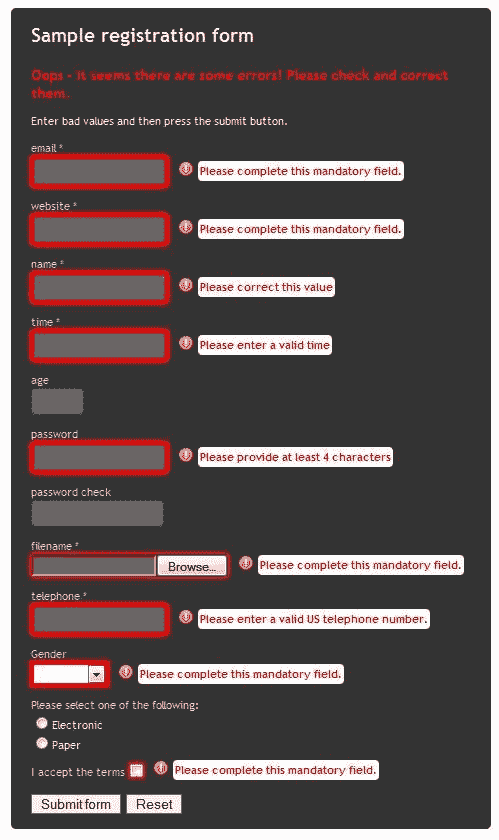
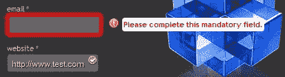
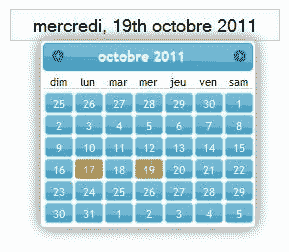
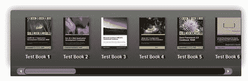

# 第三章：表单工具

问问自己一个问题：你喜欢填写表单吗？如果答案像我猜测的那样是否定的，那就加入大部分人的行列吧——没有什么比在网上填表格更糟糕的了，只有发现你输入了错误的内容，然后不得不回去更改…

输入 jQuery Tools 的表单工具！

这组 3 个有用的工具可能不像库中的其他工具那样受欢迎，但它们仍然发挥着重要作用。

在本章中，我们将学习以下内容：

+   如何使用验证器确保表单填写正确，或在不正确填写时显示错误信息

+   如何更新 DateInput 的基本样式，使用 jQuery UI 主题的元素

+   如何将范围输入转换为浏览器，以便您可以浏览一系列产品，并提供一些关于如何将其与其他工具组合使用的提示

那么…你还在等什么？让我们开始看一看验证器吧。

# 使用验证器

验证器可用于确保表单填写正确。验证器还可用于显示错误信息。

## 为什么要使用基本的验证器？

作为维基百科定义的填写表单的艺术，意味着你不能简单地提交任何垃圾的表单，或者说“垃圾进，垃圾出”的说法肯定是正确的。确保你输入的内容至少符合某种最低标准至关重要——其中一个可以帮助实现这一目标的工具是验证器。让我们更详细地看一下工具库中的这个组件。

### 注意

数据验证是确保程序运行在干净、正确和有用数据上的过程。

## 用法

验证器的基本代码分为两部分——第一部分是 HTML 结构，第二部分是对验证器工具的单行调用：

```js
<form id="myform" novalidate="novalidate">
<fieldset>
<h3>Sample registration form</h3>
<p> Enter bad values and then press the submit button. </p>
<p>
<label>email *</label>
<input type="email" name="email" required="required" />
</p>
<p>
<label>website *</label>
<input type="url" name="url" required="required" />
</p>
<p>
<label>name *</label>
<input type="text" name="name" pattern="[a-zA-Z ]{5,}" maxlength="30" />
</p>
<p>
<label>age</label>
<input type="number" name="age" size="4" min="5" max="50" />
</p>
<p id="terms">
<label>I accept the terms</label>
<input type="checkbox" required="required" />
</p>
<button type="submit">Submit form</button>
<button type="reset">Reset</button>
</fieldset>
</form>

```

一旦你设置好表单，接下来你需要在这里添加验证器的调用，以下是基本代码：

```js
$("#myform").validator();

```

### 注意

请注意，这包括在表单上添加`novalidate`属性——这是为了强制 IE 不尝试使用 HTML5 验证器，而是使用 jQuery Tools 中的验证器，这在较新版本的浏览器中起作用。

有了这个想法，让我们通过设置一个演示来实践一下，看看我们如何在表单中使用验证器。

## 项目：改进样式，并添加自定义字段验证器

我们将使用 jQuery Tools 网站提供的现有表单，并通过添加一些额外的验证器和对配置的更改来进行一些调整。

### 创建基本的 HTML 结构

打开你选择的文本编辑器，并复制以下代码进去——你会注意到它遵循了本书中大多数项目的相似模式：

```js
<!DOCTYPE html>
<html>
<head>
<title>jQuery Tools standalone demo</title>
<!-- include the Tools -->
<script src="img/jquery.tools.min.js"></script>
</head>
<body>
</body>
</html>

```

### 添加表单详情

好的。现在我们已经有了基本的结构，让我们开始填充一些细节。首先是表单内容，其中包含我们要验证的字段——所以在`<body>`标签之间复制以下代码：

```js
<form id="myform">
<fieldset>
<h3>Sample registration form</h3>
<span class="errorlabel">Oops - it seems there are some errors! Please check and correct them.</span>
<p> Enter bad values and then press the submit button. </p>
<p>
<label>email *</label>
<input type="email" name="email" id="email" required="required" />
</p>
<p>
<label>website *</label>
<input type="url" name="url" required="required" />
</p>
<p>
<label>name *</label>
<input type="text" name="name" pattern="[a-zA-Z ]{5,}" maxlength="30" />
</p>
<p>
<label>time *</label>
<input type="time" name="time" required="required" data- message="Please enter a valid time"/>
</p>
<p>
<label>age</label>
<input type="number" name="age" size="4" min="5" max="50" />
</p>
<p>
<label>password</label>
<input type="password" name="password" minlength="4" />
</p>
<p>
<label>password check</label>
<input type="password" name="check" data-equals="password" />
</p>
<p>
<label>filename *</label>
<input type="file" name="uploadfile" required="required" />
</p>
<p>
<input type="phone" name="phone" data-message="Please enter a valid US telephone number." required="required" pattern="(?:1-?)?(d{3})[-.]?(d{3})[-.]?(d{4})" />
</p>
<p>
<label>Gender</label>
<select value="" required="required" name="sex">
<option></option>
<option value="male">Male</option>
<option value="female">Female</option>
</select>
</p>
<p id="terms">
<label>I accept the terms</label>
<input type="checkbox" required="required" />
</p>
<button type="submit">Submit form</button>
<button type="reset" id="clearform">Reset</button>
</fieldset>
</form>

```

### 注意

请注意，代码中会出现许多额外的参数，例如电话输入字段中的模式属性。这些参数被 Validator 和/或其额外的自定义验证器用作验证访问网站的人输入的文本的基础。

### 设置表单样式

现在完成了，我们需要添加非常重要的样式 - 请注意，这包括一些额外的样式用于演示目的，但在您的实际项目中并非必需：

```js
<style>
/* body, a:active and : focus only needed for demo; these can be removed for production use */
body { padding: 50px 80px; }
a:active { outline: none; }
:focus { -moz-outline-style: none; }
/* form style */
#myform { background: #333 0 0; padding: 15px 20px; color:
#eee; width: 440px; margin: 0 auto; position: relative;
-moz-border-radius: 5px; -webkit-border-radius: 5px; border- radius: 5px; }
/* nested fieldset */
#myform fieldset { border: 0; margin: 0; padding: 0;
background: #333 url(logo-medium.png) no-repeat scroll
215px 40px; }
/* typography */
#myform h3 { color: #eee; margin-top: 0px; }
#myform p { font-size: 11px; }
/* input field */
#myform input { border: 1px solid #444; background-
color: #666; padding: 5px; color: #ddd; font-size: 12px;
text-shadow: 1px 1px 1px #000; -moz-border-radius: 4px;
-webkit-border-radius: 4px; border-radius: 4px; }
/* take care here: support for :focus and :active limited in some browsers!
#myform input:focus { color: #fff; background-color: #777; }
#myform input:active { background-color: #888; }
/* button */
#myform button { outline: 0; border: 1px solid #666; }
/* error message */
.error { font-size: 11px; color: #f00; display: none; }
.error p { margin:15px; margin-left: 20px; font-weight: bold; background-color: #fff; -moz-border-radius:4px;
-webkit-border-radius: 4px; padding: 2px; border-radius: 4px;}
/* field label */
label { display:block; font-size:11px; color:#ccc; }
#terms label { float: left; }
#terms input { margin: 0 5px; }
.invalid { -moz-box-shadow: 0 0 2px 2px #f00; -webkit-box-shadow: 0 0 2px 2px #f00; box-shadow: 0 0 2px 2px #f00; }
.errorlabel { display: none; font-size: 14px; font-weight: bold; color: #f00; }
.error img { position: absolute; margin: 15px 15px 15px 0;}
.errorhilite { border: 3px solid #f00; }
</style>
</head>

```

### 最终部分 - 脚本

需要的最后一部分是非常重要的脚本，让一切都能运转 - 因为这是一个相当长的脚本，我们将其分成几部分，从验证器开始。

#### 自定义验证器

虽然 Validator 将使用标准的 HTML4 和 HTML5 验证器，但只有在添加自定义验证器时，其功能才真正发挥作用，并且这些自定义验证器不是标准库的一部分。在此演示中，我们有五个自定义验证器的示例，因此将以下代码复制到您的网站中 - 这应该是页面的最后阶段，或者位于`<head>`区域，只要相应地使用`document.ready()`函数即可：

```js
<script>

```

此验证器对`<select>`下拉菜单执行检查：

```js
// custom Validator for <select> dropdowns
$.tools.validator.fn("select", "Select a value", function(input, value) {
return (value == 'none') ? false : true;
});

```

如果您想使用单选按钮，那么这是您需要使用的验证器代码：

```js
// custom Validator for radio buttons
$.tools.validator.fn("[group-required]", "At least one option needs to be selected.", function(input) {
var name = input.attr("group-required");
var group_members = $('input[name=' + name + ']');
var checked_count = group_members.filter(':checked').length;
if((checked_count == 0) && (group_members.first().attr('id') == input.attr('id'))) {
$('input[name=' + name + ']').click(function() {
validate_form.data("validator").reset($('input[name=' + name + ']'));
});
return false;
} else {
return true;
}
});

```

下面的验证器将对有效的时间进行模式匹配：

```js
// custom Validator for "time" input type
$.tools.validator.fn("[type=time]", function(el, value) {
return /^(2[0-4]|[01]?\d):[0-6]\d$/.test(value) ? true : "Please provide a valid time, using military format";
});

```

如果不遵守最小字符长度，此验证器将标记错误：

```js
// custom alidator based on minimum required length
$.tools.validator.fn("[minlength]", function(input, value) {
var min = input.attr("minlength");
if (isNaN(min)) {
return true; // not a valid minlength, so skip validation
} else {
return value.length >= min ? true : {
en: "Please provide at least " +min+ " character" + (min > 1 ? "s" : ""),
fi: "Kentän minimipituus on " +min+ " merkkiä"
};
}
});

```

如果上传的文件类型不是预先确定的类型之一，此验证器将显示错误：

```js
// custom validator based on a required filetype
$.tools.validator.fn("[type=file]", "Please choose a file with an allowed extensions", function(input, value) {
if ($(":file").val() != "") {
return /\.jpg\png\gif\pdf\doc\txt)$/.test(value);
} else {
return true;
}
});

```

验证器脚本的真正核心如下所示，其中包含对 jQuery Tools 的 Validator 功能的调用，以及一些额外的配置选项。依次，它们执行以下操作：

+   `position:` 它控制在屏幕上的位置上文将出现在哪里

+   `speed:` 它决定错误消息出现的速度快慢

+   `offset:` 它与位置一起使用，以微调屏幕上的位置

+   `errorClass` 和 `errorInputEvent:` 用于错误消息的 CSS 样式和输入有效性检查的触发器

+   `message:` 错误消息的文本，包括任何图片（如此处所示）

+   `inputEvent:` 每次用户“失焦”或移开元素时重新验证文本 - 这在特别用于检查`<select>`标签时使用

将此复制到您的脚本部分：

```js
$(document).ready(function () {
$("#myform").validator({
position: 'center right',
speed: 'slow',
offset: [0, 10],
errorClass: 'invalid',
errorInputEvent: 'keyup change',
message: '<div></div>',
inputEvent: "blur"
});
})

```

下一部分执行两个功能 - 第一个是设置验证器自动重新定位错误消息文本，如果窗口大小调整；第二个是在“onFail”触发器上添加红色边框，以便在提交按钮按下时正确验证的字段上：

```js
// get handle to the Validator API
var myForm = $("#myform"), api = myForm.data("validator");
api.reflow();
myForm.bind("onFail", function(e, errors) {
// we are only doing stuff when the form is submitted
if (e.originalEvent.type == 'submit') {
$(".errorlabel").css({ display: 'block'});
// loop through Error objects and add the border color
$.each(errors, function() {
var input = this.input;
input.css( 'errorhilite' ).focus(function() {
input.css( 'errorhilite' );
});
});
}
});

```

此脚本的最后部分是一个重置函数，清除任何验证不正确的字段上设置的红色边框：

```js
$("#clearform").click(function() {
myForm.reset();
$(".errorlabel").css({ display: 'none' });
// loop through Error objects and add the border color
$("input, select").each(function(index) {
$(this).css({ border: '' });
});
});
})
</script>

```

如果一切都正确运行，那么您应该看到类似下一个截图所示的表单。



## “这个 onFail 看起来很负面…”

是的，这是真的——Validator 的一个潜在缺点是它确实感觉非常片面，因为它只集中在输入条目失败时。然而，如果验证器确定所涉及的条目符合所需的模式，您可以包含代码来显示确认或消息。

### 注意

您应该注意，这目前仅仅是一个概念；它旨在作为您自己开发的起点，并且在投入生产使用之前需要彻底测试。

要做到这一点，你可以尝试以下方法：

1.  将以下内容添加到您的样式表中：

    ```js
    input.valid {
    background-image: url(images/accept.png);
    background-position: right top;
    background-repeat: no-repeat;
    }
    input.valid.invalid {
    background-image: none;
    }

    ```

1.  将这添加到您对 jQuery 的 JavaScript 调用中：

    ```js
    // use API to assign an event listener
    api.onSuccess(function(e, els) {
    $("input[required]").addClass('valid');
    // we don't want to submit the form. just show events.
    return false;
    });

    ```

1.  将这添加到您的 `reset` 方法的底部：

    ```js
    $('input').removeClass("valid");

    ```

1.  将此行添加到 Validator 的配置设置中：

    ```js
    errorInputEvent: 'keyup change',

    ```

代码并不完美——它有一些 bug，所以应该把它只视为您自己想法的起点。如果您实现了上面的代码，那么您应该会看到类似以下截图的东西：



## Validator——最后的思考

这个演示只是展示了 Validator 能做什么的一小部分——Validator 可以与 jQuery Tools 的 Overlay 功能很好地配合，这样您就可以在对话框中显示错误，后面还有叠加层蒙版，例如。您甚至可以使用 jQuery UI 来提供对话框效果——使用 jQuery UI 的关键是先声明对 jQuery Tools 的调用，然后重新分配 Tools 中的 Tabs 对象以使用不同的命名约定，否则它将与 UI 冲突。

在下一节中，我们将介绍库中另一个重要的工具——DateInput。

# 使用 DateInput 使您的 HTML5 日期输入看起来和行为符合您的要求

HTML5 的出现带来了使用`<input type=date>`的能力，这消除了对额外功能的需求。然而，这仅在有限的范围内可用，因为它仅在 Safari 上有效——jQuery Tools 试图通过 DateInput 来弥补这一缺陷，这使得 HTML5 功能现在可以在所有现代浏览器上使用。让我们看看如何使用它。

## 用法

如果有一个需要最少 JavaScript 的示例，那么这可能是其中之一；DateInput 只需要两个字就可以工作，当然，除了调用库之外！以下是使 jQuery Tools 的 DateInput 工作所需的基本框架：

```js
<!-- include jQuery FORM Tools (or any other combination) -->
<script src="img/ jquery.tools.min.js">
</script>
<!-- dateinput styling -->
<link rel="stylesheet" type="text/css" href="dateinput.css"/>
<!-- HTML5 date input -->
<input type="date" />
<!-- make it happen -->
<script>
$(":date").dateinput();
</script>

```

考虑到这一点，现在是时候看一下使用 DateInput 的项目了——尽管这次，这将是一个有所不同的项目。

## 项目：样式和本地化

在为本书准备演示时，我最初想到的是展示一些 DateInput 功能的东西。然而，反思之后，我想做另一件事，那就是回答这个问题——"是否可以将 jQuery UI 主题的元素与 jQuery Tools 结合起来？"

这的灵感来自于 jQuery UI 提供的主题——主题是 DateInput 缺乏的一个方面。在这个项目中，我们将使用原始外观来为 DateInput 添加一些颜色，并进行本地化调整。

### 创建基本的 HTML

首先，让我们创建基本的 HTML 结构——打开文本编辑器，并将以下行复制为起点：

```js
<!DOCTYPE html>
<html>
<head>
<title>jQuery Tools standalone demo</title>
<!-- include the Tools -->
<script src="img/ jquery.tools.min.js"></script>
<!-- standalone page styling (can be removed) -->
<link rel="stylesheet" type="text/css" href="http:// static.flowplayer.org/tools/css/standalone.css"/>
<link rel="stylesheet" type="text/css" href="http://skin1.css">
<style>
</style>
</head>
<body>
<!-- HTML5 date input -->
<input type="date" name="mydate" data-value: "Today" />
<!-- make it happen -->
<script>
</script>
</body>
</html>

```

好的，这里没有什么复杂的；将其另存为您的基本 HTML 文件的副本，准备添加 CSS 和 JavaScript 代码。您会注意到与本书中其他项目的相似之处，在这些项目中需要最少的 HTML 来构建可用结构——DateInput 也不例外。

### 注意

请注意，这里使用了`<input type="date">`标签——虽然这是有效的 HTML5，但 jQuery 工具的美妙之处在于将其提供给所有现代浏览器，而不仅仅是接受 HTML5 的浏览器。如果由于任何原因 JavaScript 不可用，这实际上对于那些使用 Safari 的人会很好地降级！

### 设置 JavaScript

接下来，让我们添加我们将用于 DateInput 的 JavaScript：

```js
// the french localization
$.tools.dateinput.localize("fr", {
months: 'janvier,f&eacute;vrier,mars,avril, mai,juin,juillet,ao&ucirc;t,' +
'septembre,octobre,novembre,d&eacute;cembre',
shortMonths: 'jan,f&eacute;v,mar,avr,mai,jun, jul,ao&ucirc;,sep,oct,nov,d&eacute;c',
days: 'dimanche,lundi,mardi,mercredi, jeudi,vendredi,samedi',
shortDays: 'dim,lun,mar,mer,jeu,ven,sam'
});
$(":date").dateinput({
format: 'dddd, ddth mmmm yyyy',
lang: 'fr',
offset: [0, 30],
yearRange: [-20, 20]
});

```

这分为两部分——第一部分是 DateInput 的本地化代码，为月份和年份的天提供了法语语言的对应词。这被 DateInput 所使用——要激活它，需要使用`lang`属性，以及适当语言的正确两字母代码。

代码的第二部分是对 DateInput 的调用，其中指定了格式和所需语言（后者使用了本地化代码中的相同代码）。

### 添加样式

这可以说是 DateInput 中最重要的部分——样式。您会注意到在此项目开始时代码中包含了原始的`skin1.css`链接；这是为了说明原始样式可以被覆盖，并且不必总是试图重复发明轮子。您还需要从 jQueryUI 网站下载“Start”主题[`www.jqueryui.com`](http://www.jqueryui.com)；如果使用此样式技术，您需要参考此处，以提取构成您自定义样式的相关 CSS。将下面给出的代码复制到网页中的样式标签中：

```js
// body, a:active and : focus only needed for demo; these can be // removed for production use
body { padding:50px 80px; }
a:active { outline:none; }
:focus { -moz-outline-style:none; }
.date { width: 260px; }
#calroot { width:210px; }
#calhead { background: url("ui-bg_gloss- wave_75_2191c0_500x100.png") repeat-x scroll 50% 50% #2191C0;
border: 1px solid #4297D7; color: #EAF5F7; font-weight:
bold; -moz-border-radius: 4px; -webkit-border-radius:
4px; border-radius: 4px; }
#caltitle { font-size:14px; float:left; text-align:center;
width: 155px; line-height: 20px; color: #EAF5F7; font-
weight: bold; }
#calnext, #calprev { display:block; width: 16px; height:
20px; float:left; cursor:pointer; margin-top: 2px; }
#calnext {
background:transparent url(ui-icons_056b93_256x240.png)
no-repeat scroll center center; background-position:
-48px -192px; float:right; margin-right: 4px; }
#calprev {
background:transparent url(ui-icons_056b93_256x240.png)
no-repeat scroll center center; background-position:
-78px -192px; margin-left: 4px; }
#caldays { margin-top: 3px; }
#caldays span { display: block; float: left; width: 30px; text-align: center; }
/* single day */
.calweek a { background: url("ui-bg_gloss- wave_75_2191c0_500x100.png") repeat-x scroll 50% 50% #0078AE;
border: 1px solid #77D5F7; -moz-border-radius: 3px;
-webkit-border-radius: 3px; border-radius: 3px;
color: #FFFFFF; display: block; float: left; font-size: 11px;
font-weight: normal; height: 18px; line-height: 20px;
margin-left: 2px; outline: medium none; text-align:
center; text-decoration: none; width: 26px; }
/* current day */
#calcurrent, #caltoday {
background: url("ui-bg_gloss-wave_50_6eac2c_500x100.png")
repeat-x scroll 50% 50% #6EAC2C; border: 1px solid #ACDD4A; color: #FFF; font-weight: normal; outline: medium none; z-index:9999; }
/* today */
#caltoday {
background: url("images/ui-bg_gloss- wave_45_e14f1c_500x100.png") repeat-x scroll 50% 50% #6EAC2C;
border: 1px solid #ACDD4A; color: #000;
}

```

如果一切顺利，您将拥有一个外观类似于 jQuery UI 版本的日历，但可能没有相同数量的代码！以下是您应该看到的屏幕截图：



## 最后的想法

上面的代码并不完美——它是设计的一个概念，展示了在 DateInput 中使用 jQuery UI 主题元素时可能出现的情况。jQuery UI 有许多可用的主题，可以轻松地使用这些元素在您的代码中提供类似的效果。关键是要明白，我没有使用 jQuery UI 的 JavaScript，因为这会给您的网站添加大量额外的代码，这与 jQuery Tools 的整体理念相违背。尽管如此，没有什么能阻止您使用主题中的元素！

在主要的 jQuery Tools 网站上可以下载一个`skin`文件的最简版本—在某些方面，您可能会发现从这个版本开始工作比调整现有主题更可取。然而，这将大部分取决于您想要进行的更改—如果您没有进行太多更改，那么简单地覆盖现有的`skin`文件可能更明智，而不是为自己创建额外的工作。

# 用 RangeInput 控制您的 HTML5 范围输入

HTML5 的出现带来了许多可以与`<input>`命令一起使用的附加类型，例如`<input type="range">`。虽然这对开发人员来说可能是个好消息，但对于那些仍然必须使用旧浏览器的人来说，情况就不那么乐观了，因为这种效果只能在最新版本的浏览器中原生支持。

进入 jQuery Tools 的 RangeInput，它使得相同效果在所有浏览器中都可用（除了 IE5 和 IE6，因为这两个浏览器的市场份额现在已经很小，不支持这两个浏览器不会影响大多数网站的受众）。

## 为什么选择基本的 RangeInput？

jQuery Tools 旨在规范 HTML5 的`<input type="range">`功能在所有现代浏览器中的使用，以便在它被官方发布时就可以使用，并且大多数浏览器都默认支持它。由于 jQuery Tools 将大部分样式和内在功能抽象成了其 CSS 中，所以只需删除这一部分，即可使 HTML5 功能正常工作。

让我们更深入地了解一下，在正常环境中它是如何工作的。

## 使用

所有工具都遵循相同的基本原则，即需要最少的 JavaScript 来运行，而 CSS 样式提供了真正的功能——RangeInput 也不例外。基本格式分为三个部分—第一个是链接到提供 RangeInput 所需样式的 CSS，第二个是至少一个`<input>`语句（下面的代码显示了两个—同样的原则适用于两者），然后是从 Tools 库中调用 RangeInput：

```js
<!-- styling for the range -->
<link rel="stylesheet" type="text/css" href="range.css"/>
<!-- a couple of HTML5 range inputs with standard attributes -->
<input type="range" name="range1" min="50" max="500" step="20" value="100" />
<input type="range" name="range2" min="0" max="1500" step="50" value="450" />
<!-- select all range inputs and make them ranges -->
<script>
$(":range").rangeinput();
</script>

```

现在，大多数人可能认为 RangeInput 实际上应该用于从网站上显示的预设比例中获得一个值。这是一个完全合理的假设，但只是 RangeInput 可以做的一小部分。为了证明这一点，让我们看看构建可滚动产品画廊的项目——这个项目将显示一些书籍，可以轻松地用于零售网站，例如 Packt 的网站。

## 项目：构建产品画廊

我们将构建一个基本的可滚动产品画廊，这种样式曾经被 PC 制造商 Apple™在几年前使用过。这个项目的灵感来自于在线教程，来自[`jqueryfordesigners.com/slider-gallery/`](http://jqueryfordesigners.com/slider-gallery/) ，该教程解释了如何使用 jQuery 创建类似效果——这是一个展示 jQuery Tools 的 RangeInput 多功能性以及如何使用它产生相同效果的完美借口！

尽管基本框架将保持不变，但您随时可以根据需要轻松修改样式。让我们从设置基本结构开始。

### 设置基本的 HTML 结构

打开您选择的文本编辑器，并插入以下行，然后将其保存为您的 HTML 页面：

```js
<!DOCTYPE html>
<html>
<head>
<title>jQuery Tools standalone demo</title>
<!-- include the Tools -->
<script src="img/jquery.min.js">
</script>
<script src="img/rangeinput.js"></script>
</head>
<body>
<div id="wrap">
<!-- our scrollable element -->
<div id="scrollwrap">
<div id="scroll">
<ul>
</ul>
</div>
</div>
<!-- rangeinput that controls the scroll -->
<input type="range" max="2600" step="10" />
</div>
<script>
</script>
</body>
</html>

```

现在，我们有了基本的框架，让我们开始添加内容。

### 注意

您会注意到，在演示中，我们直接链接到了托管在 Github 上的 Tools 源文件。这是可以接受的，但仅供开发目的使用；如果您在生产环境中使用此内容，您将需要切换到使用 CDN 链接之一，或下载库的副本。

### 添加书籍图片

接下来是我们需要添加的书籍图片；我们总共使用 30 张。如果您想使用较少的图片，则可能需要修改滑块周围的样式，以适应所使用的图片数量的变化。

在您的代码中在`<ul> </ul>`标签之间添加以下内容：

```js
<li><span class="textfont">Test Book 1 </span></li>
<li><span>Test Book 2</span></li>
<li><span>Test Book 3</span></li>
<li><span>Test Book 4</span></li>
<li><span>Test Book 5</span></li>
<li><span>Test Book 6</span></li>
<li><span>Test Book 7</span></li>
<li><span>Test Book 8</span></li>
<li><span>Test Book 9</span></li>
<li><span>Test Book 10</span></li>
<li><span>Test Book 11</span></li>
<li><span>Test Book 12</span></li>
<li><span>Test Book 13</span></li>
<li><span>Test Book 14</span></li>
<li><span>Test Book 15</span></li>
<li><span>Test Book 16</span></li>
<li><span>Test Book 17</span></li>
<li><span>Test Book 18</span></li>
<li><span>Test Book 19</span></li>
<li><span>Test Book 20</span></li>
<li><span>Test Book 21</span></li>
<li><span>Test Book 22</span></li>
<li><span>Test Book 23</span></li>
<li><span>Test Book 24</span></li>
<li><span>Test Book 25</span></li>
<li><span>Test Book 26</span></li>
<li><span>Test Book 27</span></li>
<li><span>Test Book 28</span></li>
<li><span>Test Book 29</span></li>
<li><span>Test Book 30</span></li>

```

### 注意

在此示例中，我们使用 Packt 网站的图片——如果您愿意，您可以自由选择其他图片，但您需要保持相似的大小，或者调整样式以适应。

### 添加 JavaScript 功能

让我们继续添加 JavaScript 功能：

```js
// get handle to the scrollable DIV
var scroll = $("#scroll");
// initialize rangeinput
$(":range").rangeinput({
// slide the DIV along with the range using jQuery's css() method
onSlide: function(ev, step) {
scroll.css({left: -step + "px"});
},
// display progressbar
progress: true,
// the DIV is animated when the slider is clicked: function(e, i) {
scroll.animate({left: -i + "px"}, "fast");
},
// disable drag handle animation when slider is clicked
speed: 0
});

```

上面的代码创建了内部“滚动”`DIV`（即`#scroll`），然后使用 CSS 将其移动到适当的左右位置；这是通过使用 jQuery 的`.animate()`函数来提供更平滑的移动效果来实现的。

### 为画廊设置样式

在这个阶段，如果您运行代码，您将看不到太多的工作——因为 jQuery Tools 的真正威力实际上在于应用的 CSS 样式。

```js
<style>
// body, a:active and : focus only needed for demo; these can be // removed for production use
body { padding:50px 80px; }
a:active { outline:none; }
focus { -moz-outline-style:none; }
#wrap {
background:url("images/productbrowser.jpg") no-repeat scroll 0 0 transparent;
}
/* outermost element for the scroller (stays still) */
#scrollwrap {
position: relative;
overflow: hidden;
width: 620px;
height: 150px;
margin-bottom: 15px;
-moz-box-shadow: 0 0 20px #666;
-webkit-box-shadow: 0 0 20px #666;
border-radius: 4px 4px 0 0;
}
/* the element that moves forward/backward */
#scroll {
position:relative;
width:20000em;
overflow: hidden;
padding: 20px 100px;
height: 160px;
color: #fff;
text-shadow: 5px 1px 1px #000;
left: -100px;
}
#scroll span {
font-weight:bold;
font-family: sans-serif;
font-size: 12px;
float: left;
padding-right: 72px;
width: 30px;
}
slider {
background: transparent url("images/bkgrdhandle.png") no-repeat scroll 0 0 transparent;
position: relative;
cursor: pointer;
height: 17px;
width: 580px;
-moz-border-radius: 2px;
-webkit-border-radius: 2px;
border-radius: 2px
margin-top: -10px;
padding: 3px;
margin-left: 16px;
background-size: 581px auto;
}
handle {
-moz-border-radius: 14px;
-webkit-border-radius: 14px;
border-radius: 14px;
cursor: move;
display: block;
height: 18px;
position: absolute;
top: 0; width: 181px;
background: url("images/scroller.png") no-repeat scroll
0 0 transparent;
}
handle:active {
background-color: #00f;
}
range {
display:none;
}
#scroll ul {
list-style: none outside none;
margin: 0;
padding: 0;
position: absolute;
white-space: nowrap;
left: 40px;
}
#scroll ul li {
display: inline;
width: 80px;
}
#scroll ul li img {
padding-right: 20px;
}
</style>

```

如果一切正常，那么一旦您添加了样式，您应该会看到类似于这样的内容：



## 一些最后的评论

虽然这是为 30 本书的图像构建的，但这可能轻松地成为任何产品的图像——关键是确保使用的图像大小相同，或者调整 CSS 以确保宽度均匀。jQuery Tools 的美妙之处在于虽然 JavaScript 被保持最小化，几乎每个元素都可以使用 CSS 进行调整——RangeInput 也不例外。需要注意的是，尽管在此演示中使用了一些 CSS3 样式，但您可能会发现在一些旧版浏览器中无法运行；这是在您网站中使用此效果时要牢记的事情。毕竟，jQuery Tools 的核心理念是不断推进使用更多的 CSS3。

# 摘要

在本章中，我们看了一下 jQuery Tools 中三个不太为人知但依然重要的组件，即 Validator、DateInput 和 RangeInput。虽然这些组件可能不像其他组件那样广为人知或使用，但它们同样强大，特别是当你使用 CSS 进行自定义时，它们同样可以通过 jQuery 进行扩展（其他组件也可以）。我们稍微理论性地瞥了一眼如何使用 jQuery UI 中的元素来设置 DateInput 的样式——这里的效果可能需要一些调整；但仍然是展示可以做什么的有用方式，如果还使用了其他 jQuery UI 主题的元素的话。

在本书的第四和最后一章中，我们将深入探讨 Expose 和 FlashEmbed 的世界，它们本身并不一定单独使用，但仍然是 jQuery Tools 库的重要组成部分。
