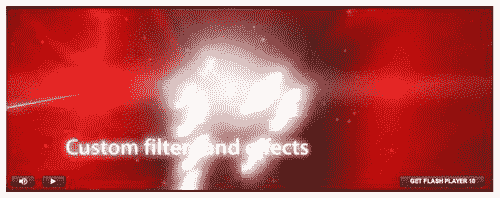
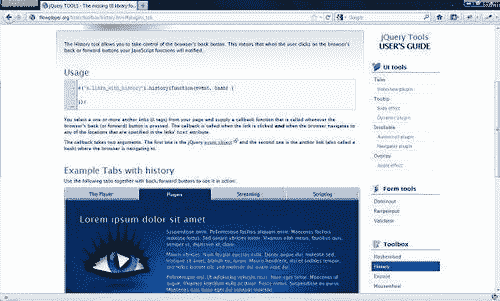
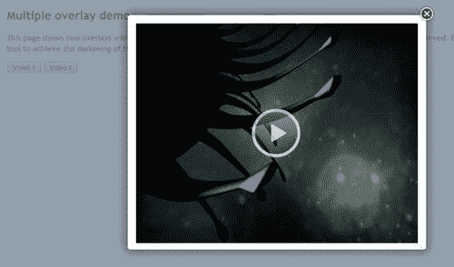
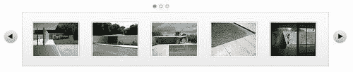

# 第四章：jQuery 工具箱

哇！我们已经对 jQuery Tools 库进行了真正快速的浏览，并且看了一些您可以在自己的项目中使用的令人兴奋的功能。

休息一下，我想... 不要那么快，朋友！我们还有一个部分要看，工具箱。

工具箱？这到底是怎么回事？

这是一个小工具集，可以与库中的主要工具一起使用——可以将其视为在套筒扳手上使用延长臂。这个工具箱包括允许嵌入 Flash 电影的功能，以及在您的页面中向后导航，或者控制您的鼠标滚轮。

让我们开始，稍微详细地看看每一个，从 FlashEmbed 开始。

### 注意

在将来的版本中，jQuery Tools 库的这一部分很可能会发生重大变化——正如您将看到的，它包含的功能正在迅速被 HTML5、CSS3 和 jQuery 的进步所取代。我将它包含在本书中是为了让您了解仍然可能发生的事情，尽管很可能，当 jQuery Tools 的第二版在普通发布时，它将不再向后兼容。

# 使用 FlashEmbed 来包含 Flash 电影

Adobe 的 Flash™ 技术已成为将基于 Flash 的电影嵌入网页的事实标准，自 1996 年推出以来，它已经被开发用于各种平台，包括 Linux、平板电脑、黑莓和当然，Windows。

这种能力的缺点是并不是每个浏览器都使用相同的嵌入代码——进入 jQuery Tools 的 FlashEmbed，它允许您使用相同的配置选项嵌入 Flash，而库会处理后端嵌入代码。

### 注意

注意：JavaScript 和 HTML5 技术的进步开始使得使用 Flash 嵌入技术变得多余，因为大多数现代基于 CSS3 的浏览器能够使用 `<video>` 标签处理视频，无需额外的软件。很可能在未来的版本中，一旦 HTML5 和 CSS3 更加普及，旧的浏览器如 IE5 和 IE6 退出使用，FlashEmbed 就可能从此库中消失。

## 用法

嵌入 Flash 文件非常简单；在您的网页中设置基本的 Flash 功能有三个部分。

### HTML 设置

首先，您需要在页面中包含 FlashEmbed 脚本：

```js
<script type="text/javascript" src="img/toolbox.flashembed.min.js">
</script>

```

符合 jQuery Tools 的主要理念，建议您使用库的缩小版本，以尽可能降低下载时间。然后，您需要一个 HTML 容器来存放对象；在我们的示例中，我们使用了一个 `DIV` 元素。这个元素有一个 `id` 属性，以便稍后在嵌入时引用该容器：

```js
<div id="clock"></div>

```

### JavaScript 设置

然后我们使用 FlashEmbed 将一个 Flash 对象放入前一个容器中，将此复制到您的网页中：

```js
flashembed("clock", "/swf/clock.swf");

```

调用必须放置在 `DIV` 元素之后，或者您必须将其放置在带有 jQuery 的 `$(document).ready()` 块内。

## 演示：让我们嵌入一个 Flash 电影

与本书中其他项目不同，我们不打算为潜在客户构建实用的东西，而是看看 FlashEmbed，以及您如何使用它来嵌入 Flash，同时仍然支持旧版浏览器。

有了这个想法，让我们设置一个基本的 HTML 结构，使用以下代码：

```js
<!DOCTYPE html>
<html>
<head>
<title>jQuery Tools standalone demo</title>
<!-- include the Tools -->
<script src=
"http://cdn.jquerytools.org/1.2.6/full/jquery.tools.min.js">
</script>
<!-- standalone page styling (can be removed) -->
<link rel="stylesheet" type="text/css"
href="http://static.flowplayer.org/tools/css/standalone.css"/>
</head>
<body>
</body>
</html>

```

### 视频的空间

我们需要在页面上为视频留出空间，因此将以下代码复制到您的网页中：

```js
<div id="flash2">

</div>

```

### 视频的样式

我们需要添加一些额外的样式，以下代码将重置所使用的字体，并将视频居中于页面；`#flash2`的样式将在图像中央添加一个播放按钮：

```js
<style>
#flash2 { width: 787px; height: 300px; background-
image: url(splash.jpg); text-align:center;
cursor:pointer; }
#flash2 img { margin-top: 110px; }
</style>

```

### 使视频工作的脚本

jQuery Tools 中提供的 FlashEmbed 工具不需要使用 jQuery 即可运行，尽管如果需要，它也支持；以下是一个您可以使用它的示例。将以下脚本复制到`<head>`部分：

```js
<script>
// use the jQuery alternative for flashembed.domReady
$(function() {
// bind an onClick event for this second Flash container
$("#flash2").click(function() {
// same as in previous example
$(this).flashembed("http://static.flowplayer.org/swf/flash10.swf");
});
});
</script>

```

如果一切正常，您应该看到一个视频播放，如下所示：



## 一些最终评论

尽管 Flash 仍然非常有用，但它正在迅速成为一种老技术；早期的 iPad 和其他产品不支持它，尽管后来的型号有所改变。然而，HTML5 和 JavaScript 正在取代它们 — HTML5 包括对`<canvas>`和`<video>`标签的支持，无需额外支持。这使得许多类似 Flash 的行为和可视化效果可以用简单的 HTML、CSS 和 JavaScript 来构建；虽然在许多情况下也可以使用图像，但在许多情况下不需要。对这两个标签的支持仍然不一，WebKit 和基于 Mozilla 的浏览器比 Internet Explorer 有更好的支持；FlashEmbed 的独特之处在于允许在旧版浏览器中播放 Flash，使用一个常见的标准 —— 这个库处理了所需的不同嵌入代码。

另外，您还可以使用 FlashEmbed 来嵌入字体，使用 SIFR 技术；这应该谨慎使用，因为该技术已经有一段时间没有更新了。浏览器包含对`@font-face`的支持，这允许在所有主要浏览器中显示字体，包括 IE6-9、Firefox、Chrome 和 Safari，无需额外的外部库。SIFR 仅适用于嵌入小型 Flash 文件，因为它消耗处理器资源，并且为了几乎没有额外的好处而带来了很大的开销 —— 您应该谨慎使用它！

接下来，让我们看看作为 jQuery Tools 的一部分提供的历史插件。

# 倒退历史

在网络中导航的关键部分是控制我们前进方向的能力。虽然这听起来有点奇怪，但有时我们需要倒退，重新查看我们已经查看过的内容。这并不总是有效，这取决于环境 —— 这就是历史插件可以帮助的地方。

## 用法

这是一个简单的插件工具，允许你控制浏览器的历史记录。这意味着当你在页面间来回导航时，浏览器的按钮会被通知，所以你可以使用它们正确地导航。

需要注意的是，虽然可以使用以下代码调用历史函数，但更有可能的是，你会将其用作工具之一的配置选项，如 Tabs 或 Scrollable：

```js
$("a.links_with_history").history(function(event, hash) {
});

```

为了说明如何将其与诸如 Tabs 之类的组件配合使用，看一下下面的代码：

```js
$(function() {
$("#flowtabs").tabs("#flowpanes > div", { history: true });
});

```

这将引用在 jQuery Tools 库中独立提供的相同历史功能。如果使用正确，你将能够使用浏览器的按钮向前和向后导航——例如，如果你浏览了选项卡中的每个选项卡，然后使用**后退**按钮将按照访问顺序返回到你访问过的每个选项卡：



生成的 URL 看起来类似于以下内容：

[`flowplayer.org/tools/demos/tabs/history.html#streaming_tab`](http://flowplayer.org/tools/demos/tabs/history.html#streaming_tab)

你可以像平常一样收藏这些网址；如果你收藏了其中一个链接，并稍后返回它，你将能够加载到那个特定的“部分”。在这个例子中，它将加载被请求的 URL 引用的特定标签页。

### 注意

需要注意的是，尽管这被描述为一个 HTML5 库，但在撰写时的当前版本工具（版本 1.2.6）无法处理其他标准 HTML5 中的某些格式。例如，你可以使用[`flowplayer.org/tools/demos/tabs/history.html#123`](http://flowplayer.org/tools/demos/tabs/history.html#123)，但你无法使用类似于：[`flowplayer.org/tools/demos/tabs/history.html/#/page/#SecondTab`](http://flowplayer.org/tools/demos/tabs/history.html/#/page/#SecondTab)。

现在让我们看看工具箱的另一个组件，Expose。

# 用 Expose 展示内容

如果你运行的网站需要突出显示信息或内容，比如显示视频，那么你很可能会发现需要减少背景的干扰。一些电视公司非常善于使用这种效果，当它们通过互联网播放内容时——就像*关掉灯*，当你想看一部好电影时。

Expose 是一个可以在这里帮助的工具。它会暴露或 *突出显示* 特定元素，并淡化其他元素，以便您只能看到网站所有者想要的内容。不过，这个工具有一个小问题。通常情况下，你不会单独使用它，而是作为本书前面介绍的 Overlay 工具的一部分。然而，Expose 已经被开发成进一步扩展这一概念，并作为独立工具或集成到 Overlay 中的工具。无论在什么 *模式* 中使用，你都可以使用它来暴露各种对象，比如图片、表单或 Flash 对象。我们将用它来展示一个视频。在这样做之前，让我们稍微详细地看一下它。

## 使用

jQuery Tools 的 Expose 非常容易配置，尽管其多功能性意味着您可以以多种方式发挥其作用：

```js
// place a white mask over the page
$(document).mask();
// place a custom colored mask over the page
$(document).mask("#789");
// place a non-closable mask - this effectively makes it a modal mask
$(document).mask{ closeOnEsc: false, closeOnClick: false });
// place a mask but let selected elements show through (expose)
$("div.to_be_exposed").expose();
// close the mask
$.mask.close();

```

### 注意

`.mask` 的默认颜色是白色，这可以通过在上述第二个示例中指定 HTML 颜色来覆盖，或者您可以在调用 Expose/Mask 时使用 `color` 属性。

现在，你们中观察细致的人可能会注意到前面的代码中调用了两个不同函数；这是因为实际上有两种暴露内容的不同方法：使用 `mask` 和 `expose`。

`mask` 函数仅适用于文档对象。它不能与任何其他选择器一起使用。这意味着如果你想要用它来展示包含在 `DIV` 中的元素，那么你需要使用 `expose` 函数。由 `expose` 选择器返回的所有元素都将放置在遮罩层的顶部。

`mask` 函数（在 expose 或 mask 调用后立即加载）可以在每次调用时使用不同的配置；如果没有指定配置，则它将自动使用前一次调用中提供的最后一个配置。默认情况下，如果其 ID 设置为 `exposeMask`，则该工具会使用任何元素，尽管如果您将此 ID 用于其他目的，则可以更改配置以指定您自己的。

正如我们在演示中将看到的，`mask` 和 `expose` 都需要关闭，并销毁它们的配置，然后才能创建新的具有不同于现有 `mask` 或 `expose` 的属性的实例。

## 演示：使用 Expose 显示视频内容

jQuery Tools 的一个很棒的功能之一是，它的组件可以轻松地与库中的其他组件组合，或者通过使用额外的 jQuery 进行扩展。我们将要看到的一个例子是，如何使用 Expose 与 Overlay 结合起来。这个演示将向您展示如何将两者结合起来以获得很好的效果。这借鉴了一个很好的例子，该例子可以从 jQuery Tools 的主要网站上获得。

此演示将使用与 第二章 中类似的 Overlay 功能，*Getting along with your UI Tools*，以及 "Flowplayer" 视频工具，可从 [`www.flowplayer.org`](http://www.flowplayer.org) 获取。

### 设置基本的 HTML 结构

让我们从设置视频内容的基本结构开始。这与我们之前在书中看过的项目非常相似，尽管您将注意到包含“Flowplayer”：

```js
<!DOCTYPE html>
<html>
<head>
<title>jQuery Tools standalone demo</title>
<!-- include the Tools -->
<script src="img/jquery.tools.min.js"></script>
<script src="img/flowplayer-3.2.6.min.js"></script>
<!-- standalone page styling (can be removed) -->
<link rel="stylesheet" type="text/css" href="http://static.flowplayer.org/tools/css/standalone.css"/>
<script>
</script>
</head>
<body>
</body>
</html>

```

### 注意

Flowplayer 是由 Tero Piirainen 编写的，他也是 jQuery Tools 的主要开发者。您可以从[`flowplayer.org/download/index.html`](http://flowplayer.org/download/index.html)下载这个出色的视频工具的免费版本。

### 添加视频内容

现在我们已经有了基本的结构，需要开始添加一些内容。以下代码设置了触发覆盖层的触发器，然后是包含要显示的视频的覆盖层。请注意，您可以在同一页上包含多个示例，同时覆盖工具可以定制使用不同的覆盖背景；Expose 工具被称为*单例*。这意味着单个实例和配置在每次使用时都是共享的，无论使用次数多少。

```js
<h2>Multiple overlay demo</h2>
<p>
<button rel="#overlay1">Video 1</button>
<button rel="#overlay2">Video 2</button>
</p>
<!-- overlays for both videos -->
<div class="overlay" id="overlay1">
<a class="player" href="http://pseudo01.hddn.com/vod/demo.flowplayervod/flowplayer-700.flv">
&nbsp;
</a>
</div>
<div class="overlay" id="overlay2">
<a class="player" href="http://pseudo01.hddn.com/vod/demo.flowplayervod/flowplayer-700.flv">
&nbsp;
</a>
</div>

```

### 添加样式

下一阶段是添加至关重要的样式，没有太多的需求，大部分是为使覆盖层正常工作而需要的：

```js
<style>
.overlay { background:url(white.png) no-repeat; padding:40px; width:576px; display:none; }
.close {
background: url(close.png) no-repeat;
position: absolute;
top: 2px;
display: block;
right: 5px;
width: 35px;
height: 35px;
cursor: pointer;
}
a.player { display:block; height: 450px; }
</style>

```

### 使播放器正常工作

最后一步是添加使覆盖层和视频工作的脚本：

```js
$(function() {
// setup overlay actions to buttons
$("button[rel]").overlay({
// use the Apple effect for overlay
effect: 'apple',
expose: '#789',
onLoad: function(content) {
// find and load the player contained in the overlay
this.getOverlay().find("a.player").flowplayer(0).load();
},
onClose: function(content) {
$f().unload();
}
});
// install flowplayers
$("a.player").flowplayer(
"http://releases.flowplayer.org/swf/flowplayer-3.2.7.swf");
});

```

如果一切正常，您应该看到类似于这样的东西：



现在让我们看看库的工具部分中的最后一个组件，即鼠标滚轮。

# 使用鼠标滚轮来控制您的鼠标

工具组件箱的最后一部分是鼠标滚轮——这允许您在使用 jQuery Tools 工具浏览页面时控制鼠标滚轮的导航。

## 用法

启用鼠标滚轮的代码非常简单。它包括对鼠标滚轮库的一次调用，其中`event`是被控制的 jQuery 事件对象，`delta`是鼠标滚轮的移动量。正值表示向上滚动，负值表示向下滚动：

```js
// make #myelement listen for mousewheel events
$("#myelement").mousewheel(function(event, delta) {
});

```

但是，您应该注意，当将鼠标滚轮用作主 UI 工具集中的配置选项时，鼠标滚轮真正发挥作用，例如 Scrollable。虽然它存在作为一个单独的库，但更可能的情况是您不会使用上述方法引用它，而是作为另一个工具的配置的一部分。

为了演示，让我们看一下一个具有启用鼠标滚轮的基本滚动的代码：



现在，从上一个屏幕截图中看，你可能无法立即确定它是否具有鼠标滚轮功能，对吗？是的，没错，它并没有为所使用的工具的视觉外观添加任何东西。唯一的办法是查看代码，这可能看起来类似于以下内容：

```js
$("#chained").scrollable({circular: true, mousewheel: true}).navigator().autoscroll({
interval: 3000
});

```

尽管这里是一个配置选项，但实际上它是在引用 mousewheel 库，这个库可能已经包含在你的项目中，也可能没有，这取决于你下载的 jQuery Tools 的版本（例如，默认情况下，并不是所有的 CDN 链接都包含它，所以这可能需要更改链接，或者额外调用鼠标滚轮功能，作为单独的自定义下载）。

# 总结

在本章中，我们看了 jQuery Tools 的第三部分和最后一部分，即工具箱。我们学习了如何使用 Expose 在页面上公开对象，以及这实际上是作为主要覆盖功能的基础，来自第二章，*与你的 UI 工具相处*。我们还了解了 FlashEmbed——尽管这项技术在新浏览器中的 HTML5 功能的进步可能会取代它，但在旧浏览器中仍然可以发挥关键作用，只要它们还存在。然后，我们学习了关于 mousewheel 和 history，尽管你可能会在项目中分开使用它们，但更可能是将它们用作 jQuery Tools 库中众多工具之一的配置选项。

与此同时，我希望你喜欢阅读这本书，就像我写作时一样，希望你找到了一些有用的东西，可以用于你未来的项目中。

### 注意

如果我引起了你的兴趣，并且你想看看 jQuery Tools 如何在实际环境中使用，比如 CMS，那么别忘了下载随本书附带的 PDF。它包含一些在 CMS 中使用工具的很好的例子，使用流行的 WordPress 系统。享受吧！
