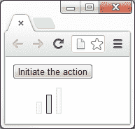

# 第一章：入门

*欢迎来到 jQuery 2.0 动画技术初学者指南。在本书中，我们将研究 jQuery JavaScript 库中可用的每一种产生或控制动画的方法。我们将看到这些方法的使用方式，它们能接受的参数以及它们产生的不同行为。我们还将研究如何使用一系列配套资源，包括精选的 jQuery 插件和 jQuery UI 库。*

在这个介绍性的章节中，我们将讨论以下主题：

+   网络动画简史

+   为什么动画您的 UI 很重要

+   jQuery 提供的动画方法

+   每个示例使用的模板文件

+   基本动画示例

# 网络动画

1989 年，CompuServe 发布了 GIF89a，这是流行的 GIF 图像格式的增强版本，它允许将一系列帧存储为单个图像，并由支持的软件播放。

GIF 格式在那些年已经在被称为互联网的东西上非常流行了（记住，万维网直到 1991 年才存在），因为它的文件大小小，无损压缩，并且得到了广泛的支持。增强版本使得任何人都可以使用支持的软件创建动画，很快就变得流行起来。

除了动画 GIF 之外，浏览器厂商还添加了对原生处理动画的专有 HTML 元素的支持，例如`<blink>`和`<marquee>`元素，它们为文本添加了不同的动画效果。

这两个元素都不是特别吸引人或成功的，W3C 以及领先的行业无障碍性和可用性专家建议在大多数情况下不要使用它们。当时的不同浏览器支持其中一个或另一个元素，但不能同时支持。这两个元素都是由各自的供应商作为原始浏览器战争的一部分添加的。

在 1990 年代末，流行的浏览器增加了对一种称为**动态 HTML**（**DHTML**）的技术的支持，该技术允许脚本语言在页面加载后修改页面的内容。DHTML 不是任何单一技术，而是一组技术（JavaScript，CSS，DOM 等），它们共同作用以实现基本的互动和/或动画。

实际上，DHTML 使得创建相当先进的动画成为可能，但是早期实现所需技术的限制，以及极其不同的浏览器支持使得 DHTML 变得棘手起来。

这个时代还见证了 Flash 的发布和崛起（以及 Shockwave，一种最终被 Macromedia 吞并的竞争技术），这是一种矢量和光栅图形格式，允许音频和视频流，逐帧动画，以及一系列其他功能。Flash 迅速成为流行，并且在撰写本文时仍然是基于网络的视频，基于浏览器的游戏和广告的首选格式。

浏览器中的 DOM 逐渐标准化（大部分），以及 JavaScript 库（如 jQuery）的兴起，这些库抽象化了浏览器之间仍然存在的差异，使得动画对比以往更多的人开放。如今很少使用 DHTML 这个术语，因为它与浏览器之间的支持不佳有关，但是许多交互式和动画网站的基本原理和技术仍然相似。

如今，除了 JavaScript 库可能实现的动画外，我们还有更加新颖和令人兴奋的可能性，比如 CSS3 和本机 HTML 元素（如 `<canvas>` 元素），后者提供了对页面区域的完全像素级控制。我们将在本书的后面更详细地介绍一些 CSS3 动画技术，以及 `<canvas>` 元素。基于 Flash 的动画首次在本世纪出现下降趋势，新技术正在地平线上崛起。

# 动画化用户界面的力量

现代操作系统不断地使用动画来吸引用户，创造更引人入胜的计算体验。在正确的使用方式下，动画为系统的用户提供帮助，引导他们完成不同的任务，提供上下文或反馈，并加强积极的行为。

一个很好的例子是在 Windows 7 或 OS X 中最小化应用程序的方式——应用程序似乎压缩到任务栏/停靠栏上的图标中，这向用户显示了他们想要返回到应用程序时应该去哪里。正是这样的简单细节最有效。

良好的动画可以赋予界面一种时尚的专业感，使其显得更先进或更现代。苹果的 iPhone（或 iPad）就是一个完美的例子——在操作系统及其应用程序中无缝地使用微妙的动画和过渡，使用户能够以一种深刻满意和沉浸式的方式与设备连接。任何出现或消失的内容都会平滑地淡入淡出，菜单和内容面板会从顶部或侧面滑入或滑出。突然的事件可能会使用户感到不安或分心，但是适时的动画可以帮助他们意识到即将发生的事情。

但是需要警告的是，执行不好、笨拙或过于无意义的动画可能会产生相反的效果，使您的界面显得基本、设计不佳或劣质。没有动画总比糟糕的动画好。即使您的应用程序运行完美，过多的动画也可能使用户感到沮丧，导致他们放弃使用您的应用程序或网站。

桌面电脑以及日益增长的移动和手持设备的计算能力已经足够强大，能够处理相当复杂的动画，并且随着集成硬件加速和更加精细的 CSS3 和 HTML5 进入最新的浏览器，网络上可以实现的可能性呈指数级增长。

## 何时使用动画

在以下情况下，动画可以留下深刻印象并增强用户体验：

+   当显示或隐藏窗口、弹出窗口和内容面板时

+   当某物被移动到窗口或页面的其他区域时

+   当用户的操作导致页面上某个内容发生了状态变化时

+   引导用户执行特定的行动或者引起他们对重要事项的注意

## 不适合使用动画的情况

在不必要的地方进行过多的动画可能会有害。在以下情况下，请尽量避免动画，或者至少认真考虑：

+   当用户需要非常频繁地重复某个操作时

+   已知使用该系统的设备可能无法充分显示动画的情况下

+   对于时间敏感的操作或过程

### 注意

请记住，这些只是指南，而不是必须始终遵守的法则，它们当然也不是绝对的。几乎没有任何情况下动画绝对不应该被使用，也几乎没有任何情况下动画一定要被使用。

使用您的判断力来确定动画是否适用于您的应用程序或页面及其预期的受众。如果可能的话，请让用户有机会根据自己的个人喜好启用或禁用动画。

## 动画检查表

在我们的页面或应用程序中实现动画之前，请考虑以下问题清单：

+   动画是否适用于您的目标用户？

+   动画是否实用？

+   动画是否增加了价值或者增强了用户体验？

+   设备上是否会以适当的速度运行动画，这些设备很可能会被使用？

如果您能回答以上所有问题都是肯定的，那么该动画可能是一个积极的特征。如果您对其中任何问题的回答是否定的，您可能需要停下来思考一下您试图通过添加动画来实现什么，以及是否可以以其他方式更好地实现它。

# 使用 jQuery 进行动画

jQuery ([`jquery.com`](http://jquery.com)) 在本地提供了一系列动画方法，无需使用额外的效果库或插件。然而，许多插件都是由在线社区贡献的，包括 jQuery UI ([`jqueryui.com`](http://jqueryui.com))，它是官方的 jQuery UI 库，扩展了 jQuery 的动画能力。本地，jQuery 提供了一些方法，只需最小的配置就能添加滑动和淡出效果，并且能够跨浏览器工作。它还提供了与管理动画队列相关的方法，并提供了一种创建几乎适用于所有数字 CSS 样式的自定义动画的方法。在本书的过程中，我们将详细介绍库中包含的每个动画方法。这些方法在此处列出，并附有各自的描述：

| 方法 | 描述 |
| --- | --- |
| `animate()` | 它执行一组 CSS 属性的自定义动画。 |
| `clearQueue()` | 它从队列中移除尚未运行的所有项。 |
| `delay()` | 它设置一个计时器来延迟队列中后续项的执行。 |
| `dequeue()` | 它执行匹配元素队列中的下一个函数。 |
| `fadeIn()` | 它通过使匹配的元素逐渐变为不透明来显示它们。 |
| `fadeOut()` | 它通过使匹配的元素逐渐变为透明来隐藏它们。 |
| `fadeTo()` | 它调整匹配的元素的不透明度。 |
| `fadeToggle()` | 它通过动画其不透明度来显示或隐藏匹配的元素。 |
| `finish()` | 它停止当前正在运行的动画，移除所有排队的动画，并完成所有匹配元素的动画。 |
| `hide()` | 它隐藏匹配的元素。 |
| `queue()` | 它显示要在匹配的元素上执行的函数队列。 |
| `show()` | 它显示匹配的元素。 |
| `slideDown()` | 它以滑动动画显示匹配的元素。 |
| `slideToggle()` | 它以滑动动画显示或隐藏匹配的元素。 |
| `slideUp()` | 它以滑动动画隐藏匹配的元素。 |
| `stop()` | 它停止匹配的元素上当前正在运行的动画。 |
| `toggle()` | 它显示或隐藏匹配的元素。 |

需要注意的是，有两个属性可以更改全局 jQuery 对象。它们如下所示：

| 属性 | 描述 |
| --- | --- |
| `jQuery.fx.interval` | 它是动画触发的速率（以毫秒为单位）。 |
| `jQuery.fx.off` | 它全局禁用所有动画。 |

总的来说，它为我们提供了一个强大而稳健的环境，可以轻松添加几乎任何类型的动画。

动画也是插件的热门主题，有许多可用的插件，可以让我们即时使用各种不同类型的动画，只需进行最小的配置。我们将在本书的后面看到几个插件。

# 创建项目文件夹

所以，这就是我们将在整本书中引用和使用的模板文件。让我们也花点时间看看示例文件使用的文件夹结构。创建一个项目文件夹并将其命名为`jquery-animation`或类似的名称。在其中创建三个新文件夹并将它们命名为`css`、`img`和`js`。

我们创建的 HTML 页面将放在`jquery-animation`文件夹中的子文件夹旁边。我们创建的所有 CSS 文件将放在`css`文件夹中，我们在示例中使用的所有图像将放在`img`文件夹中。jQuery 库和我们使用或创建的任何其他脚本文件将放在`js`文件夹中。这也是您在下载和解压缩包含所有示例的附带代码存档时将找到的目录结构。

## 模板文件

在本书的整个课程中，我们将创建的每个示例文件都依赖于一组公共元素。与其在书中的每个代码部分和示例中反复显示相同的元素，不如在这里仅查看它们一次：

```js

<!DOCTYPE html>

<html lang="en">

<head>

    <meta charset="utf-8">

    <title></title>

    <link rel="stylesheet" href="css/.css">

</head>

<body>

    <script src="img/jquery.js"></script>

    <script>

    $(function(){

    });

    </script>

</body>

</html>

```

### 小贴士

**下载示例代码**

您可以从您在 [`packtpub.com`](http://packtpub.com) 购买的所有 Packt 图书的帐户中下载示例代码文件。如果您在其他地方购买了本书，您可以访问 [`packtpub.com/support`](http://packtpub.com/support) 并注册，文件将直接通过电子邮件发送给您。

把这个文件保存到刚刚创建的`jquery-animation`文件夹中，并把它命名为`template.html`。这是我们将用于每个示例的基础文件，所以当我们开始逐个示例地工作时，我说*将以下标记添加到* `<body>` *的模板文件中*时，意思是将其直接插入到我们刚刚在前面的代码中创建的模板文件的第一个 `<script>` 标记之前的 `<body>` 标记之间。每当我们向模板文件中添加任何 JavaScript 时，它都将添加到第二个 `<script>` 标记中的匿名函数内。

让我们来看看模板文件包含了什么。我们从 HTML5 doctype 声明开始，因为我们将在示例中使用大量的 HTML5 元素。我们还将`<html>`元素的`lang`属性设置为`en`，以及`<meta>`标签的`charset`属性设置为`utf-8`，虽然这两者都不是严格必需的，但仍然是最佳实践。

接下来是一个空的`<title>`元素，我们可以在其中添加每个示例的名称，以及一个不完整的`<link>`元素的`href`，准备好添加每个示例将使用的样式表的名称。

由于**Internet Explorer 9**（**IE9**）之前的版本不支持任何 HTML5 元素，我们需要使用 Remy Sharp 的`html5shiv`脚本来正确使用 HTML5。我们可以链接到此文件的在线版本以便使用条件注释，该注释针对所有低于版本 9 的 IE 版本。如果您计划在没有互联网连接的情况下在 IE 中尝试示例，请随时下载`html5.js`并将其存储在本地。

为了充分利用本书中的示例，最好将浏览器升级至撰写本文时（*Firefox 24*, *Chrome 30*, *Safari 6*, and *Opera 17*）的最新稳定发布版本，尽管这些版本可能会迅速改变。

### 注

值得注意的是，jQuery 2.0 不支持*oldIE*，也就是 IE8 及以下版本。因此，我们不会为这些版本的 IE 提供任何浏览器兼容性修复。

如果您的项目需要与 IE8 或更早的浏览器兼容，您需要使用**jQuery 1.10**或更低版本。此外，如果您的项目使用 HTML5 元素并需要与 IE8 或更低版本兼容，则需要使用`html5shiv` ([`code.google.com/p/html5shiv`](https://code.google.com/p/html5shiv))。

IE9 确实支持大量的 HTML5 和 CSS3，因此通常只有在 IE8 保持全球最常用浏览器的首位时才需要使用`html5shiv`文件。撰写本文时，根据 NetMarketShare 的数据，全球范围内 IE8 的市场份额为 21%（[`netmarketshare.com`](http://netmarketshare.com)）。IE10 占据第二位，占有 19%，Chrome 29、FireFox 23 和 IE9 紧随其后。页面的`<body>`标签为空，除了一些`<script>`标签。我们显然会在每个示例中使用 jQuery，所以第一个标签链接到 jQuery。撰写本文时，当前版本的 jQuery 是 2.0（但与浏览器版本一样，这很可能会迅速改变）。

在本书中，我们将使用 jQuery 的本地版本，这样我们就不必依赖互联网连接或担心互联网速度。然而，在大多数情况下，在生产环境中，建议链接到 jQuery 的 4 个 CDN（内容分发网络）之一。这些可以在下面找到：

| CDN 主办 | URL |
| --- | --- |
| jQuery | [`code.jquery.com`](http://code.jquery.com) |
| Google | [`developers.google.com/speed/libraries/devguide?csw=1#jquery`](https://developers.google.com/speed/libraries/devguide?csw=1#jquery) |
| Microsoft | [`asp.net/ajaxlibrary/cdn.ashx#jQuery_Releases_on_the_CDN_0`](http://asp.net/ajaxlibrary/cdn.ashx#jQuery_Releases_on_the_CDN_0) |
| CDNJS | [`cdnjs.com/libraries/jquery`](http://cdnjs.com/libraries/jquery) |

在第二个 `<script>` 标签中，我们有一个空函数，我们编写的所有示例 JavaScript 代码将放入其中。我们将 jQuery 对象传递到匿名函数中，并将其命名为 `$` 字符。虽然这并非绝对必要（除非我们创建 jQuery 插件的示例），但这是一个很好的习惯。

# 一个基本的动画示例

让我们看一个基本的例子，这种动画可以帮助我们的访问者放心，显示一些事情正在发生。如果用户执行了一个动作，但结果并没有立即显示，提供反馈给用户，告诉他们的动作正在执行的过程中是一种有用的动画使用。

在下一个截图中，我们可以看到加载指示器位于“启动动作”按钮的正下方。它包含三个单独的加载条，顺序点亮，以显示有事发生。每个条形稍有不同的样式。

# 时机成熟 - 创建一个动画加载器

在这个示例中，我们将创建一个简单的动画加载指示器，当特定进程被启动时我们可以启动它，并在进程完成后停止它。

1.  打开刚刚查看的模板文件，并将以下 `<button>` 元素添加到 `<body>` 中（这应该放在 `<script>` 元素之前）：

    ```js

    <button id="go">启动动作</button>

    ```

1.  接下来，在页面底部第二个空函数中，添加以下代码：

    ```js

    var loader = $("<div></div>", {

    id: "loader"

    }).css("display", "none");

    var bar = $("<span></span>").css("opacity", 0.2);

    var loadingInterval = null;

    for (var x = 0; x < 3; x++) {

    bar.clone().addClass("bar-" + x).appendTo(loader);

    }

    loader.insertAfter("#go");

    function runLoader() {

    var firstBar = loader.children(":first"),

    secondBar = loader.children().eq(1),

    thirdBar = loader.children(":last");

    firstBar.fadeTo("fast", 1, function () {

        firstBar.fadeTo("fast", 0.2, function () {

        secondBar.fadeTo("fast", 1, function () {

            secondBar.fadeTo("fast", 0.2, function () {

            thirdBar.fadeTo("fast", 1, function () {

                thirdBar.fadeTo("fast", 0.2);

            });

            });

        });

        });

    });

    };

    $("#go").click(function () {

    if (!$("#loader").is(":visible") ) {

    loader.show();

    loadingInterval = setInterval(function () {

        runLoader();

    }, 1200);

    } else {

    loader.hide();

    clearInterval(loadingInterval);

    }

    });

    ```

1.  将文件保存为 `loading.html`，放在主项目文件夹（`jquery-animation`）中。最后，我们需要在示例中添加一些基本样式。在文本编辑器中创建一个新文件，将以下代码添加到其中：

    ```js

    #loader { margin:10px 0 0 36px; }

    #loader span {

    display:block;

    width:6px;

    float:left;

    margin-right:6px;

    border:1px solid #336633;

    position:relative;

    background-color:#ccffcc;

    }

    #loader .bar-0 {

    height:15px;

    bottom:-20px;

    }

    #loader .bar-1 {

    height:25px;

    bottom:-10px;

    }

    #loader .bar-2 {

    height:35px;

    margin-right:0;

    }

    ```

1.  将此文件保存在 `css` 文件夹中为 `loading.css`，并更新 HTML 文件以调用此样式表。

1.  此时，当我们点击按钮后，你的代码应该看起来像以下截图一样：

## *刚才发生了什么？*

在页面上硬编码的 `<button>` 用于显示和隐藏加载动画。这纯粹是为了这个例子。在实际的实现中，我们会在加载操作开始时显示加载动画，例如当新内容被添加到页面上时，并且在操作完成后再次隐藏它。

在外部函数内部我们做的第一件事是设置一些变量。我们创建了一个新的 `<div>` 元素作为加载器的容器，使用**对象字面量**作为匿名函数的第二个参数，给它赋予一个 `id` 为 `loader`。然后我们用 jQuery 的 `css()` 方法将其样式设置为 `display:none`，这样它就不会立即可见。

### 注意

*对象*字面量是一组由逗号分隔并用大括号括起来的成对值。

我们还创建了一个新的 `<span>` 元素，它将被用作创建三个单独的加载条的模板。我们使用 `css()` 方法将其不透明度设置为 `0.2`（20% 不透明）。jQuery 为我们标准化了这个样式，使其在 Internet Explorer 中正确工作。最后一个变量，`loadingInterval`，将用于存储一个**间隔**的 `id`，以便我们在需要时清除间隔。最初我们将其设置为 null，因为间隔还没有设置。

### 注意

*间隔*是一个数字值（以毫秒为单位），用于暂停或延迟一个操作。

一旦我们的变量被定义和初始化，我们就执行了一个简短的 `for` 循环，只有三次迭代。在这个循环中，我们克隆了我们创建的 span 元素，给它一个类名（以便每个条可以分别样式化），然后将它附加到容器中。一旦三个加载条被添加到容器中，我们就在 `<button>` 元素之后插入了加载器。

接下来，我们定义了一个名为 `runLoader` 的函数。这是将会被间隔重复调用的函数。该函数在按钮被点击之前不会运行。在这个函数内部，我们缓存了每个单独条形图的选择器，然后运行了一系列嵌套函数。

我们首先使用 `fadeTo()` jQuery 动画方法将第一个加载条的不透明度增加到完全不透明。此方法将一个字符串作为其第一个参数（以毫秒为单位表示动画的速度，或使用字符串 `"fast"` 或 `"slow"`），将元素应该淡出到的不透明度作为其第二个参数（值范围从 0 到 1，包括小数，如 0.50），并将回调函数作为第三个参数。回调函数在动画结束后立即执行。

在回调函数中，我们将第一个加载条的不透明度淡化为原始的`0.2`。我们为这个方法调用提供了另一个回调函数，在这个回调函数中，我们将第二个加载条的不透明度动画到完全不透明，然后再动画到原始的不透明度。同样的过程也用于第三个加载条。

最后，我们使用 jQuery 的`click()`方法添加两个函数，这两个函数将在每次点击按钮时交替执行。我们将使用`if`语句来检查我们的`#loader`元素是否在页面上可见，使用`.is(":visible")`并添加一个感叹号(`!`)，以便如果`#loader`元素不可见，则返回 true。如果它不可见，我们将显示加载器，然后设置一个重复调用`runLoader()`函数的间隔。如果元素已经可见，我们隐藏加载器并清除间隔。

## 动手试试英雄 —— 扩展加载动画

我提到过，在进行请求并等待响应时，我们可以使用加载动画。试试在使用 jQuery 的 AJAX 方法时使用它，在发出请求之前显示加载器，一旦响应被处理，再次隐藏它。jQuery 网站上的 JSONP 示例([`api.jquery.com/jQuery.getJSON`](http://api.jquery.com/jQuery.getJSON))，用来获取猫的图片，是一个很好的测试案例。根据您的连接速度，加载器可能不会显示很长时间。

## 快速测验 —— 使用 jQuery 进行基本动画

Q1\. 考虑我们之前讨论的关于何时使用动画和何时不使用动画的问题，什么时候使用这个动画是合适的？

1.  当浏览器进行密集的操作时

1.  当有一个从服务器请求某些内容并且请求返回服务器的延迟，但浏览器需要处理的内容很少时

1.  作为 Flash 动画的替代方案

1.  当不支持动画 GIF 图像时

Q2\. jQuery 的`fadeTo()`方法使用了哪些参数？

1.  表示结束不透明度的整数

1.  包含动画的配置选项的对象

1.  第一个参数表示动画的速度或持续时间，目标元素的最终不透明度，可选的回调函数在动画结束时执行。

1.  不需要参数

# 总结

在这个介绍性的章节中，我们简要介绍了 Web 动画的历史，包括它是如何开始的，早期的 HTML 元素和浏览器支持，Flash 的兴起，以及它在不太遥远的未来的发展方向。

我们还看到了动画如何在用户界面中用来增强用户体验。我们了解了一些关于何时应该使用动画和何时不应该使用动画的指导方针，并看了一些在实现动画时应该考虑的事项。

我们用一个加载动画的基本示例结束了本章。在这个例子中，我们使用了`fadeTo()` jQuery 方法来改变页面元素的不透明度，以及一个简单的间隔来播放动画。我们没有详细讨论这个方法，但我们看到了一个它的使用示例。在下一章中，我们将更详细地讨论这个方法，该章涵盖了 jQuery 提供的所有淡入淡出动画。

在下一章中，我们将专注于图片动画。我们将创建一个基本的图片旋转器，然后扩展该脚本的功能，以构建更多功能。我们将得到一个非常轻量级的图片旋转器，可以在未来的开发项目中使用。
