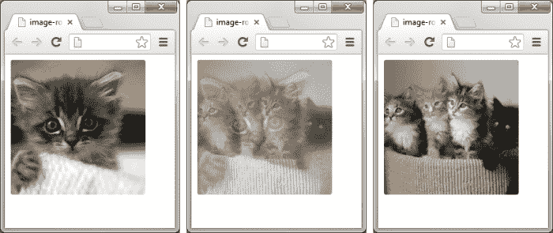
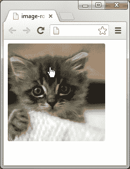
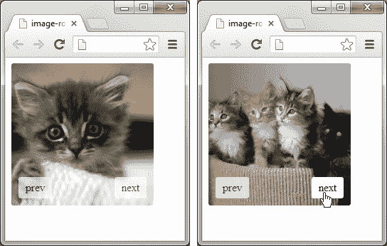
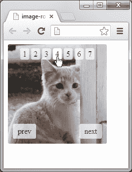

# 第二章：图像动画

*在本章中，我们将使用 jQuery 动画函数创建一个基本的图像轮换器（幻灯片）。我们还将扩展我们脚本的功能，以便在用户悬停在轮换器上时暂停动画。然后，我们将在脚本中添加上一页和下一页链接，以允许用户以自己的节奏滚动图像。最后，我们将添加分页链接，以便我们的用户可以翻页查看图像轮换器中的图像。*

# 图像动画

在您学习 jQuery 的过程中，您会发现有时需要某种形式的内容或图像旋转。图像轮换器比直接在页面上显示图像更具视觉吸引力。它们还可以导致更紧凑和高效的设计，允许预加载内容或图像，并且还可以使我们能够控制用户何时以及何时看到。

### 注意

图像轮换器通常被称为**幻灯片**、**滑块**、**滚动器**或**走马灯**，根据其不同的功能。

在本章中，我们将讨论以下动画方法：

+   `fadeIn()`

+   `fadeOut()`

+   `fadeToggle()`

# 渐变动画

`fadeIn()` 和 `fadeOut()` 方法是通过 jQuery 实现的最简单的动画效果。它们只是简单地调整选定元素的不透明度，以显示或隐藏元素，并且可以在不需要额外配置的情况下使用。`fadeToggle()` 方法几乎同样简单，但确实提供了一些基本逻辑来检查选定元素的当前状态。

使用 `display:none` 隐藏的元素在 `fadeIn()` 动画开始时将尽可能设置为其正确的显示类型（对于块级元素为 `display:block`，对于内联元素为 `display:inline`）。重要的是要注意这一点，因为您的 CSS 样式可能会影响您要淡入的元素的外观。尽可能使用元素的自然显示类型，因此隐藏的 `<li>` 元素将设置为 `display:list-item`，隐藏的 `<td>` 元素将设置为 `display:table-cell`。

被设置为 `display:block`（或被设置为另一种显示类型但仍然在页面上可见）的元素将在 `fadeOut()` 动画结束时设置为 `display:none`。使用 `fadeToggle()` 方法时，元素将在其可见和不可见状态之间切换。

使用 `fadeIn()` 方法显示的元素必须最初使用 `display:none` 隐藏，而使用 `visibility:hidden` 等方式隐藏的元素在动画结束时将保持隐藏，因为淡入淡出方法专门修改 `opacity` 和 `display` 属性，而不是 `visibility` 属性。

在它们最简单的形式中，这些方法可以在不使用任何额外配置的情况下使用。我们可以简单地在任何一组选定的元素上调用这些方法，而不使用任何参数：

+   `$(elements).fadeIn();`

+   `$(elements).fadeOut();`

+   `$(elements).fadeToggle();`

当未提供参数时，动画将具有默认持续时间 400 毫秒和默认缓动`swing`。我们很快会讨论动画缓动。

# 用参数配置动画

带有参数的淡化方法可以采用以下形式（方括号表示可选参数）：

```js

$(elements).fadeIn([duration] [,easing] [,callback]);

$(elements).fadeOut([duration] [,easing] [,callback]);

$(elements).fadeToggle([duration] [,easing] [,callback]);

```

我们可以使用`duration`参数来控制动画的持续时间，指定整数毫秒或字符串`"slow"`和`"fast"`。这些字符串是 600 毫秒和 200 毫秒的快捷方式，分别。如果未指定，则默认给出的持续时间为 400。

我们还可以将`duration`参数设置为`0`，这将有效地禁用动画。我们不太可能需要这样做，因为根本不使用动画会更高效，但了解这一点是有用的。我应该指出，淡出仍将发生；只是会在`0`毫秒的持续时间内发生。这样做基本上与使用`.hide()`相同。

缓动参数可以从其默认值`swing`更改为`linear`，这会使动画在整个动画过程中以相同的速度进行。默认值`swing`会使动画开始缓慢，稍微加速，然后在动画结束时放慢速度。

### 提示

`duration`参数与动画运行的时间长度有关，而不是动画的速度。因此，较高的值将意味着较慢、较长的动画，而不是更快、更短的动画。使用插件可以大大增加缓动类型的数量。我们将在本书后面看到 jQuery UI 添加的额外缓动类型。

我们可以提供一个**回调**函数（可以是函数引用，也可以是匿名函数，后者更常见）。此回调函数将在选择集中的每个元素的动画结束后执行，因此如果有多个元素正在进行动画，可能会触发多次。

### 注意

回调函数是作为参数传递给另一个函数内部的函数。

下面的回调代码示例在动画完成后触发警报（回调部分加粗）：

```js

$(".selector").fadeOut("slow", function() { alert("callback triggered!"); });

```

为了可读性，您经常会看到前面的行像以下代码块一样格式化：

```js

$(".selector").fadeOut("slow", function() {

alert("callback triggered!");

});

```

# 行动时间——设置标记和样式

首先，我们需要创建示例中将要使用的元素以及设置它们的视觉外观的样式。

1.  使用我们在第一章中创建的模板文件创建一个新的 HTML 文档，在`<body>`标签之间添加以下底层标记，用于我们的图像幻灯片演示：

    ```js

    `<div class="container">`

    `<div id="slider">`

        ``

        ``

        ``

        ``

        ``

        ``

        ``

    `</div>`

    `</div>`

    ```

1.  将页面保存在`jquery-animation`目录下，文件名为`image-rotator.html`。

1.  我们还需要为这个示例添加样式表。在我们刚刚创建的 HTML 文件中，将`image-rotator`添加到我们的占位符样式表链接中。

1.  接下来，我们应该创建我们刚刚链接的样式表。在一个新文件中，添加以下代码：

    ```js

    `.container {`

    `position:relative;`

    `width:200px;`

    height:200px;

    }

    `#slider img {`

    `position:absolute;`

    `display:none;`

    `border-radius:3px;`

    `}`

    ```

1.  将此文件保存为`image-rotator.css`，保存在我们项目文件夹中的`css`文件夹中。

## *发生了什么？*

对于这个例子，我们将在我们的图像旋转器中使用七个图像。这可以根据我们的需求轻松更改，只需简单地将其他图像添加到`<div id="slider">`中即可。

我们将我们的`#slider`元素包裹在一个类名为`container`的`<div>`元素中，这样我们可以设置我们的图像旋转器的尺寸，以防我们的所有图像的宽度和高度不同。另外，我们将`position:relative`设置为`#slider` div，这样被设置为`position:absolute`的旋转器图像就不会从页面流中移除。

### 注意

当一个元素被设置为`position:absolute`时，该元素不再保持其所在的空间，这使得其他元素可以根据周围元素上使用的其他 CSS 在其后面或其前面。这与浮动元素的情况相似，当浮动元素被移出页面流时。

需要注意的是，在某些情况下，如果一个元素（或一组元素）被设置为`position:absolute`，而没有父元素被设置为`position:relative`，那么`position:absolute`元素可能会脱离其父元素，导致父元素崩溃。

这些图像被设置为`position:absolute`，因为它们需要在彼此之后堆叠，这样我们的图像旋转器元素在图像淡入淡出时不会跳动。这是必要的，因为所有的图像将占据页面上的同一相对位置。然而，我们只想要显示一张图像。使用`display:none`将关闭所有图像的可见性。这是必要的，这样我们就不必担心图像的**堆叠顺序**。我们希望我们的图像呈现良好，所以我们在图像上添加了一个小的`border-radius`来软化角落。

### 注意

**堆叠顺序** 指的是元素在页面上堆叠的顺序。如果一个元素在另一个元素之前加载，那么它将在后面的元素之前。可以通过在 CSS 中使用 `z-index` 和为元素添加 `position` 来修改堆叠顺序。

## 突然测验 —— 使用 fadeIn()

Q1\. 作为 `fadeIn()` 方法的第一个参数，可以传递哪些字符串？

1.  字符串 `"short"` 或 `"long"`，它们指的是动画的持续时间。

1.  字符串 `"low"` 或 `"high"`，它们指的是元素淡出到的不透明度。

1.  字符串 `"slow"` 或 `"fast"`，它们指的是动画的持续时间。

1.  一个十六进制字符串，指定了元素的 `background-color`。

Q2\. 还可以传递什么到这个方法里？

1.  一个字符串，指定了用于动画的缓动函数，以及在动画结束时执行的回调函数。

1.  包含额外配置选项的对象。

1.  一个包含额外配置选项的数组。

1.  在动画开始时执行的回调函数，以及在动画结束时执行的回调函数。

## 编写图片轮播脚本

接下来，我们将通过添加 jQuery 代码为我们的图像旋转器添加最后的修饰。

# 行动时间 —— 编写图像旋转器

现在让我们添加脚本的代码，这些代码将为我们的图像添加动画效果。在 `<body>` 标签下面的匿名函数中添加以下代码：

```js

var image = $("#slider img");

var numSlides = image.length;

var activeSlide = 0;

var speed = 2000;

var fade = 1000;

var timer = setInterval(rotate, speed);

image.eq(activeSlide).show();

function rotate() {

activeSlide++;

if (activeSlide == numSlides) {

    activeSlide = 0;

}

image.not(activeSlide).fadeOut(fade);

image.eq(activeSlide).fadeIn(fade);

}

```

## *刚刚发生了什么？*

我们做的第一件事是缓存对位于 `#slider` 元素内的所有 `` 元素的引用。我们将多次引用它，因此只从 **文档对象模型** (**DOM**) 中选择一次更有效率。出于性能考虑，通常最好尽量减少执行的 DOM 操作数量。

使用 `length()` 来计算图片数量。这会计算父元素 (`#slider`) 内的子元素 (``) 的数量。在我们的例子中，我们使用了七张图片。通过使用 `length()` 函数来计算 `` 元素的数量，我们可以在不更改 jQuery 代码的情况下轻松地添加或移除图片来实现图片轮播。

我们将 `activeSlide` 变量设置为 `0`，以便从我们集合中的第一张图片开始。一般情况下，这是您不想更改的内容，除非您想要从特定的图片开始。只要我们的图片集合中至少有这个数量的图片，这个数字就可以更改为您喜欢的任何数字。

`activeSlide`变量表示我们刚刚选择的元素组内的位置。 `length()`函数返回元素的数量，从`0`开始。 在我们的示例中，`image.length()`将返回`6`，因此`activeSlide`可以为`0`至`6`，因为有七个``元素。 我们将`activeSlide`初始化为`0`，因此我们从序列中的第一个图像开始。 如果我们想要从不同的图像开始，初始化`activeSlide`为该组内的位置，记住，第一个位置是`0`而不是`1`。

要设置`rotate()`函数每次执行之间的时间，我们将`speed`变量设置为`2000`毫秒（2 秒）。 对于我们的示例来说，2 秒是一个很好的速度，但根据您旋转的图像而定，可能需要设置更长的持续时间。 如果您的图像上有您希望用户阅读的文本，应基于您认为用户舒适阅读所有文本需要多长时间来设置旋转速度。 如果您的图像中有高度细节，将速度设置为您认为可以充分欣赏所有细节的时间。 如果您有一个需要“呼吁行动”的可点击元素，那么这个时间将需要根据用户消化信息并采取您希望他们采取的行动所需要的时间来考虑。

我们的`fade`变量设置为`1000`（1 秒），因为这是一个不错的淡出图像的速度。 这可以根据您的需求进行更改，您会发现没有标准时间或速度。 您需要调整这些时间，以便为您的用户在网站上提供最佳体验。

`setInterval()`（原生 JavaScript 方法）函数在脚本中创建一个计时器，在此期间执行被调用的函数。 在我们的示例中，`setInterval()`将执行`rotate()`函数，但会等待直到经过`speed`变量指定的时间量再次调用它。 由于`speed`设置为`2000`，所以`rotate()`函数将每 2 秒执行一次。

### 提示

带有参数的，`setInterval` 事件可以采用以下形式：

`setInterval(function, duration);`

然后，我们告诉脚本使用`show()`来显示活动图像。 由于我们最初将`activeSlide`变量设置为`0`，所以我们设置的图像组中的第一个图像将首先显示。 这是必要的，因为如果您回忆一下，在我们的 CSS 中，我们使用`display：none`关闭了旋转器中所有图像的可见性。 如果更改了`activeSlide`变量的初始值，则在脚本启动时将显示该图像。

接下来，我们转向脚本的主要部分。对于我们的素食主义读者，无论你在饮食中吃什么蛋白质等效物，豆浆？豆腐？总之，`rotate()` 函数是我们在代码中普遍进行大量工作的地方。`rotate()` 函数上面的代码主要是设置我们的图像旋转器要使用的设置。在我们庞大的`rotate()`函数中，我们有一个变量（`activeSlide`），每次调用它时我们都会递增一次。这是为了在函数循环时将我们的活动图像设置为我们组中的下一个图像。

`if`语句用于在脚本到达所选组中最后一个``元素时重置`activeSlide`编号为`0`。

最后，我们有我们代码中最重要的两行（有人说的）。我们使用`fadeOut()`动画函数对所有非活动图像执行动画。然后，我们对等于`activeSlide`图像的图像使用`fadeIn()`。您会注意到我们的`fadeOut()`和`fadeIn()`动画中的 fade 变量。这决定了动画执行的速度。除了一些其他 jQuery 动画函数之外，`"slow"`和`"fast"`也可以使用—分别为 600 和 200 毫秒。

这是我们使用之前的代码创建的截图。您会注意到第一张图像在我们的下一张图像淡入时减弱。这种效果被称为**交叉淡入**。



## 课堂测验 – length() 和毫秒

Q1\. `length()` 指的是什么？

1.  变量的字符计数。

1.  对象中的元素数量。

1.  对象的宽度。

1.  动画运行的时间量。

Q2\. 1 秒中有多少毫秒？

1.  10

1.  100

1.  1000

1.  10000

# 行动时间 – 扩展悬停时暂停功能

当你的图像具有许多细节、用户需要阅读的文本或你希望他们采取的特定行动时，悬停暂停是必要的。即使你不需要这些东西中的任何一种，添加这个功能仍然是一个好主意，因为它允许用户在希望时好好查看图像。

以下截图说明了当用户在图片上悬停时图像旋转停止的情况：



为了检测我们何时悬停在图像旋转器上和离开，以便我们可以暂停图像旋转器，我们需要将以下代码添加到`image.eq(activeSlide).show();`下面的行：

```js

$("#slider").hover(function() {

clearInterval(timer);

}, function() {

timer = setInterval(rotate, speed);

});

```

## *刚刚发生了什么？*

我们添加了一个悬停事件，以便告知我们的脚本当我们悬停在`#slider`元素上以及当我们离开该元素时。我们在`timer`变量上使用`clearInterval()`（原生 JavaScript 方法）停止我们旋转器的计时器，有效暂停动画。

### 注意

更多关于悬停事件的信息可以在这里找到：[`api.jquery.com/hover/`](http://api.jquery.com/hover/)

需要注意的是，`stop()`和`clearQueue()`是停止动画或函数运行的其他方法。但是，在这个示例中，我们不想使用它们，因为它们会立即停止我们的动画。这意味着它会在动画进行到一半时暂停动画，并且会部分淡化显示当前活动和下一个活动的图像。或者，我们可以让间隔保持运行，并在`rotate()`函数中使用标志来确定是执行`fadeIn()`还是`fadeOut()`方法。

下一行告诉脚本我们不再悬停在其上，并且要恢复图像的动画。然后，使用`setInterval`（本机 JavaScript 方法）将计时器重置回最初设置的值。

# 执行操作的时机 - 扩展上一个和下一个链接功能

为了让用户更好地控制旋转图像的速度，我们将按照以下步骤添加上一个和下一个链接：

1.  我们需要添加用于上一个和下一个链接的锚标签。为此，请在最后两个`</div>`标签之间添加以下代码：

    ```js

    <a id="prev">prev</a>

    <a id="next">next</a>

    ```

1.  我们的下一个和上一个链接需要一些基本的样式，所以让我们在我们的`image-rotator.css`文件的底部添加以下 CSS 行：

    ```js

    #prev, #next {

    position:absolute;

    bottom:10px;

    padding:5px 10px;

    color:#000;

    background:#FFF;

    border-radius:3px;

    text-decoration:none;

    opacity:0.7;

    }

    #prev:hover, #next:hover {

    opacity:1;

    cursor:pointer;

    }

    #prev {left:10px;}

    #next {right:10px;}

    ```

1.  为了处理下一个和上一个链接上的点击事件，我们需要在`rotate()`函数的上面添加以下代码：

    ```js

    $("#prev").click(function(event) {

    activeSlide--;

    rotate();

    event.preventDefault();

    });

    $("#next").click(function(event) {

    activeSlide++;

    rotate();

    event.preventDefault();

    });

    ```

1.  在`image.not(activeSlide).fadeOut(fade);`上面添加以下代码行：

    ```js

    if (activeSlide < 0) {

    activeSlide = numSlides - 1;

    }

    ```

1.  通过以下代码替换`rotate()`函数来更新它：

    ```js

    if (!pause == true) {

    activeSlide++;

    }

    ```

1.  查找`hover()`函数并用以下代码替换它（新代码已经突出显示）：

    ```js

    $("#slider, #prev, #next").hover(function() {

    clearInterval(timer);

    pause = true;

    }, function() {

    timer = setInterval(rotate, speed);

    pause = false;

    });

    ```

以下截图显示，在点击下一个链接后，我们的图像旋转器移动到下一个图像：



## *刚刚发生了什么？*

在第三步中，我们为上一个和下一个链接添加了两个单击函数。在上一个函数中，我们将活动图像编号减一，在下一个函数中，我们将其加一。然后我们需要再次调用 rotate 函数，以便我们的旧图像淡出，新图像淡入。我们使用 `preventDefault()`（本地 JavaScript 方法）使得上一个和下一个链接不会向我们地址栏中的 URL 添加一个井号（**#**）。这样可以防止上一个和下一个链接像传统锚点标签一样工作。

第四步允许我们在我们的图像集中向后移动。这个 `if` 语句类似于我们已经在 `rotate()` 函数中使用的 `if` 语句，用于在活动变量等于我们旋转器中的图像数时重置它。

我们需要更改 `rotate()` 函数，以便仅在我们的图像旋转器未悬停在其上时才递增 `active` 图像变量。为此，我们用一个 `if` 语句替换了递增 `activeSlide` 变量的行。使用此 `if` 语句，我们告诉脚本仅在用户未悬停在图像旋转器上时才允许 `activeSlide` 变量递增。

我们需要在暂停悬停功能中添加下一个和上一个链接，这样当您悬停在上面时，图像旋转也会暂停。这可以通过在 `#slider` 后面添加逗号，并添加我们的 `#next` 和 `#previous` ID 选择器来实现。我们将 `pause` 变量设置为基于我们是否触发了 `hover` 事件的布尔值 `true` 或 `false`。这是告诉 `rotate` 函数仅在我们没有悬停在其上时才递增 `activeSlide` 变量所需的。为了告诉我们的脚本我们正在悬停在其上，我们将变量 `pause` 设置为值 `true`。然后一旦我们的光标离开图像旋转器，我们就将其设置为 `false`。

## 快速测验 – preventDefault() 和 setInterval()

Q1\. `preventDefault()` 用于什么？

1.  防止脚本在函数中默认变量。

1.  防止事件的默认操作被使用时。

1.  在其所在的函数中关闭所有 JavaScript 错误。

1.  关闭返回空值的变量的 JavaScript 错误。

Q2\. `setInterval()` 方法需要使用的两个参数是什么？

1.  `speed` 和 `time`

1.  `function` 和 `duration`

1.  `duration` 和 `speed`

1.  `speed` 和 `function`

# 行动时间 – 扩展分页功能

为了让我们的用户更多地控制我们的图像旋转器，我们将添加所谓的**分页**。分页允许您直接移动到我们旋转器中的特定图像，而不必点击下一个和上一个链接，直到找到所需的图像。如果我们的图像旋转器中有大量图像，此功能非常有用。为了添加分页，我们执行以下步骤：

让我们首先将以下代码添加到 `image-rotator.css` 中：

```js

#pagination {

position:absolute;

top:10px;

width:100%;

text-align:center;

}

#pagination a {

padding:2px 5px;

color:#000;

background:#FFF;

border-radius:3px;

text-decoration:none;

opacity:0.7;

}

#pagination a:hover {

opacity:1;

cursor:pointer;

}

```

1.  在 `image-rotator.html` 中，在 `var pause;` 下方直接添加以下行：

    ```js

    var paging = "";

    ```

1.  在我们的 HTML 中，在 `<a id="next" href="#">next</a>` 下面添加以下代码：

    ```js

    <div id="pagination"></div>

    ```

1.  在 `image.eq(activeSlide).show();` 下面放置以下代码：

    ```js

    for (var page = 0; page < numSlides; page++) {

    paging += "<a rel=\"" + (page + 1) + "\">" + (page + 1) + "</a>\n";

    }

    $("#pagination").html(paging);

    ```

1.  找到下面的 `hover` 事件，并用以下代码替换（新代码已突出显示）：

    ```js

    $("#slider, #prev, #next, #pagination").hover(function() {

    clearInterval(timer);

    pause = true;

    }, function() {

    timer = setInterval(rotate, speed);

    pause = false;

    });

    ```

1.  在我们的 `rotate()` 函数上方直接添加以下代码：

    ```js

    $("#pagination a").click(function(event) {

    event.preventDefault();

    activeSlide = $(this).attr("rel") - 1;

    rotate();

    });

    ```

以下截图说明了我们添加的分页功能，以及在点击相应链接后显示的第四张图像：



## *刚刚发生了什么？*

我们做的第一件事是声明并设置新的分页变量。如果没有这个变量，我们的代码将会出现严重的 JavaScript 错误。

使用 `for` 循环，我们定义了我们的 `page` 变量，告诉它继续循环直到 `page` 小于我们集合中的图像数量，然后使用 `++` 递增这个新定义的变量。下一行是到目前为止我们脚本中最复杂的代码，所以请跟着我走！一个变量后面跟着 `+=` 告诉变量使用已经存储的内容，并继续添加到末尾。这种将值或字符串串在一起的方法称为 **串联**。

接下来我们需要构建分页链接的 HTML 结构。我们正在构建一系列七个 `<a>` 标签，每个标签对应我们组中的一个图像。为了在链接上打印图像编号，我们将使用 `(page + 1)`。我们使用 `+ 1` 是因为 JavaScript 以所谓的 **零索引** 或 **基于零的编号** 对事物进行编号，这意味着在对组或列表中的项目进行编号时，它不是从 1 开始，而是从 0 开始。直到现在这没有成为问题（因为我们没有打印出值），但现在我们需要告诉我们的脚本从 1 开始，以便正确显示分页链接。`for` 循环的最后一行用 `html()` 替换 `#pagination` 的内容，并用 `paging` 变量内部存储的值替换它。

### 注

`html()` 方法用于获取或设置所选元素的 HTML 内容。

再次，我们需要扩展我们的鼠标悬停暂停功能，以便在悬停在新的 `#pagination` 元素上时知道要暂停。如果不这样做，当您悬停在 `#pagination` div 上时，图像会继续旋转。

我们添加了另一个点击函数（`$("#pagination a").click`）来处理我们的分页链接。您会注意到我们之前使用的`preventDefault()`以确保在点击分页链接时不会向页面 URL 中添加井号（#）。下一行将`activeSlide`变量设置为分页锚点标签中`rel`的值，然后减去一。这样做是因为我们将其设置为增加一，以抵消我们在第三步中看到的零索引问题。

最后，我们添加了包含所有分页链接的 `<div>` 元素。

## 尝试进一步扩展图片轮播器

在此示例中，我们使用 `fadeIn()` 和 `fadeOut()` 来轮换我们的图像。尝试扩展示例，使脚本能够检测应该进行动画处理的子元素。

扩展图片轮播的其他想法：

+   让脚本动态设置子元素的尺寸，使脚本能够按比例缩放以适应内容。

+   构建能够同时显示多个元素的功能

+   为分页栏中的当前活动链接提供不同的外观，以便我们的用户知道轮播器当前显示的是哪张图像。

+   添加额外的过渡效果（例如，滑动）。

## 小测验 - 更改变量和零索引

Q1\. 在变量后使用 `++` 是什么意思？

1.  合并两个变量的值。

1.  告诉脚本只允许向变量添加，而不允许减去。

1.  将变量增加一个。

1.  将变量增加两个。

Q2\. **零索引**是什么意思？

1.  JavaScript 是从零开始计数的。

1.  如果未明确定义，变量的默认值为零。

1.  将元素的索引设置为零的方法。

1.  在使用后将变量的值设置为零的方法。

# 摘要

在本章中，我们看了一些 jQuery 最基本的动画方法。淡入淡出方法是 jQuery 中最简单的动画方法，只会动画选定元素的不透明度。

`show()`、`hide()` 和 `toggle()` 方法也可用于执行动画，但会改变元素的尺寸以及不透明度。所有这些方法都简单易用，几乎不需要额外的配置即可运行。

在下一章中，我们将学习如何操纵元素的背景属性以创建背景动画。
