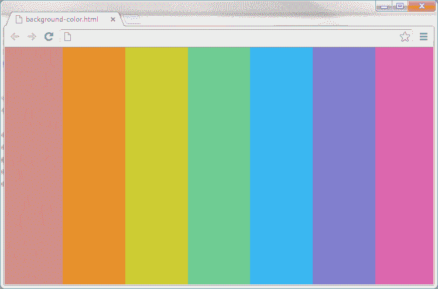
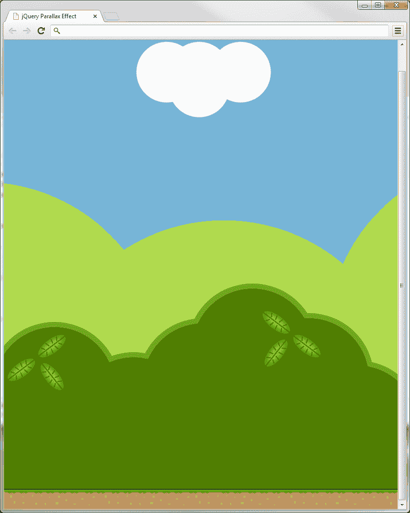
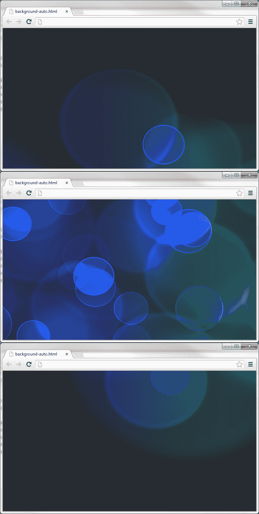
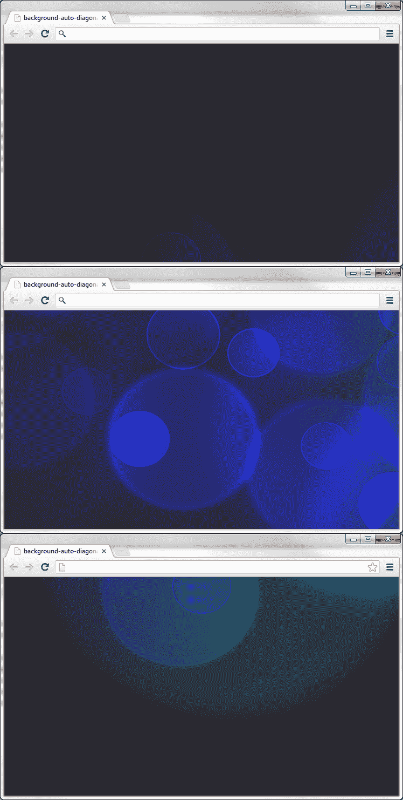
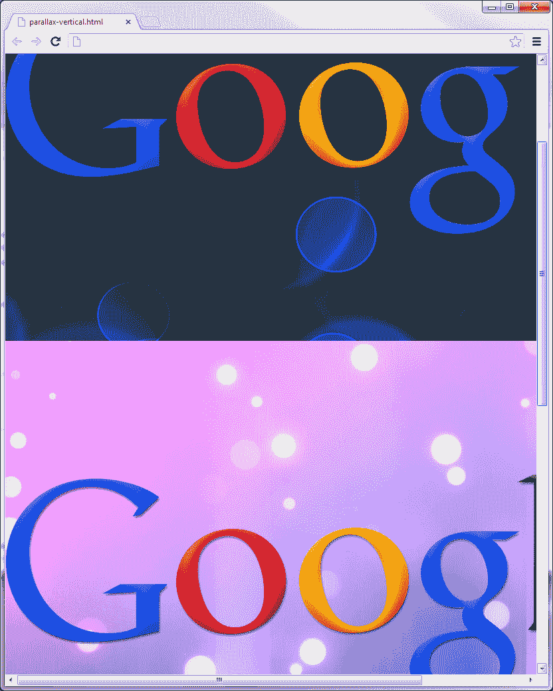

# 第三章：背景动画

*在上一章中，我们使用`fadeIn()`和`fadeOut()`方法来对图像元素进行动画处理。在本章中，我们将使用`animate()`效果来对背景颜色进行动画处理，并学习如何对元素内部的背景图像的位置进行动画处理。在第七章，*Custom Animation*中，我们将更深入地了解`animate()`方法所能做的一切。*

# 背景颜色动画

对元素的背景颜色进行动画处理是吸引用户眼球到我们想让他们看到的对象的绝佳方法。对元素的背景颜色进行动画处理的另一个用途是显示发生了某些变化。如果对象的状态发生了变化（添加、移动、删除等），或者需要关注以解决问题，通常会以这种方式使用动画。我们将在接下来的两章中了解到其中的一些内容。

### 注意

由于 jQuery 2.0 不支持背景颜色动画，我们将使用 jQuery UI 来为我们提供所需功能以创建此效果。

我们将在第六章中详细介绍 jQuery UI 给予我们的能力，*使用 jQuery UI 扩展动画*。

## 介绍动画方法

`animate()`方法是 jQuery 在动画领域提供的最有用的方法之一。借助它，我们能够做一些事情，比如将元素移到页面上的其他位置，或者改变并动画处理颜色、背景、文本、字体、框模型、位置、显示、列表、表格、生成内容等属性。

# 行动时间 - 对 body 背景颜色进行动画处理

按照下面的步骤，我们将从创建一个示例开始，该示例更改`body`的背景颜色。

1.  首先创建一个名为`background-color.html`的新文件（使用我们的模板）并将其保存在`jquery-animation`文件夹中。

1.  接下来，我们需要通过在 jQuery 库下面直接添加这行来包含 jQuery UI 库：

    ```js

    <script src="img/jquery-ui.min.js"></script>

    ```

    ### 注意

    jQuery UI 的自定义或稳定版本可从[`jqueryui.com`](http://jqueryui.com)下载，或者您可以使用下面三个**内容传送网络**（**CDN**）之一链接到库。要快速访问库，转到[`jqueryui.com`](http://jqueryui.com)，滚动到最底部，找到**快速访问**部分。在这里使用 jQuery UI 库 JS 文件将完全符合我们本章示例的需求。

    媒体模板：[`code.jquery.com`](http://code.jquery.com)

    谷歌：[`developers.google.com/speed/libraries/devguide#jquery-ui`](http://developers.google.com/speed/libraries/devguide#jquery-ui)

    微软：[`asp.net/ajaxlibrary/cdn.ashx#jQuery_Releases_on_the_CDN_0`](http://asp.net/ajaxlibrary/cdn.ashx#jQuery_Releases_on_the_CDN_0)

    CDNJS: [`cdnjs.com/libraries/jquery`](http://cdnjs.com/libraries/jquery)

1.  然后，我们将以下 jQuery 代码添加到匿名函数中：

    ```js

    var speed = 1500;

    `$( "body" ).animate({ backgroundColor: "#D68A85" }, speed);`

    $( "body" ).animate({ backgroundColor: "#E7912D" }, speed);

    `$( "body" ).animate({ backgroundColor: "#CECC33" }, speed);`

    `$( "body" ).animate({ backgroundColor: "#6FCD94" }, speed);`

    `$( "body" ).animate({ backgroundColor: "#3AB6F1" }, speed);

    `$( "body" ).animate({ backgroundColor: "#8684D8" }, speed);`

    `$( "body" ).animate({ backgroundColor: "#DD67AE" }, speed);`

    ```

## *刚才发生了什么？*

首先，我们向页面添加了 jQuery UI 库。这是必需的，因为当前版本的 jQuery 不支持动画显示背景颜色。接下来，我们添加了将动画显示背景的代码。然后，我们将`speed`变量设置为`1500`（毫秒），以便我们可以控制动画的持续时间。最后，使用`animate()`方法，我们设置了 body 元素的背景颜色，并将持续时间设置为我们上面命名为`speed`的变量。我们多次复制了相同的行，只改变了背景颜色的十六进制值。

以下截图是整个 body 背景颜色动画经过的颜色示意图：



## 链接在一起的 jQuery 方法

需要注意的是，jQuery 方法（在这种情况下为`animate()`）可以链接在一起。如果我们将`animate()`方法链接在一起，我们之前提到的代码将如下所示：

```js

`$("body")`

.animate({ backgroundColor: "#D68A85" }, speed)  //红色

.animate({ backgroundColor: "#E7912D" }, speed)  //橙色

.animate({ backgroundColor: "#CECC33" }, speed)  //黄色

.animate({ backgroundColor: "#6FCD94" }, speed)  //绿色

.animate({ backgroundColor: "#3AB6F1" }, speed)  //蓝色

.animate({ backgroundColor: "#8684D8" }, speed)  //紫色

.animate({ backgroundColor: "#DD67AE" }, speed); //粉色

```

这里是链接方法的另一个示例：

`$(selector).animate(properties).animate(properties).animate(properties);`

## 尝试一下吧，英雄- 用循环扩展我们的脚本

在这个示例中，我们使用了`animate()`方法，并借助 jQuery UI 的帮助，我们能够动画显示页面的整个背景颜色。试着扩展脚本以使用循环，这样一旦脚本到达函数的末尾，颜色就会持续动画而不会停止。

## 突发小测验 - 用 animate() 方法进行链接

Q1\. 哪个代码能够正确地使用链接从红色渐变到蓝色？

1.  ```js

    `$("body")`

    .animate({ background: "red" }, "fast")

    .animate({ background: "blue" }, "fast");

    ```

1.  ```js

    `$("body")`

    .animate({ background-color: "red" }, "slow")

    .animate({ background-color: "blue" }, "slow");

    ```

1.  ```js

    `$("body")`

    .animate({ backgroundColor: "red" })

    .animate({ backgroundColor: "blue" });

    ```

1.  ```js

    `$("body")`

    .animate({ backgroundColor, "red" }, "slow")

    .animate({ backgroundColor, "blue" }, "slow");

    ```

# 视差的深度 illision

在计算机图形学的背景下，特别是在视频游戏中，术语**视差**指的是使用多个背景层，以稍微不同的速度滚动，以创建深度 illision 的技术。尽管在现代游戏中不如以前那样广泛应用，因为有了更丰富的 3D 图形引擎，但视差仍然经常在便携式游戏设备上看到，并且越来越多地出现在 Web 上。

使用纯 CSS 可以实现视差效果，正如在 Silverback 站点上演示得很好一样（请查看[`silverbackapp.com`](http://silverbackapp.com)获取效果，以及[`blog.teamtreehouse.com/how-to-recreate-silverbacks-parallax-effect`](http://blog.teamtreehouse.com/how-to-recreate-silverbacks-parallax-effect)获取有关如何实现的详细信息）。当窗口水平调整大小时，视差的这种应用只有在窗口调整大小时才会显现出来。虽然这在窗口调整大小时是一个很棒的效果，但如果我们希望效果更加突出，这并不能帮助我们。

# 行动时间 - 创建舞台并添加样式

该底层页面仅需要四个元素（对于此简单示例），这些元素位于页面的`<body>`中。

1.  将以下结构的元素添加到模板文件的新副本中，在第一个`<script>`标签之间：

    ```js

    <div id="背景"></div>

    <div id="中景"></div>

    <div id="前景"></div>

    <div id="地面"></div>

    ```

1.  将此页面保存为`parallax-horizontal.html`，放在我们的`jquery-animation`文件夹中。

1.  此示例中的 CSS 和底层 HTML 一样简单。将以下代码添加到文本编辑器中的新文件中：

    ```js

    div {

    width:100%;

    height:1000px;

    position:absolute;

    left:0;

    top:0;

    }

    #背景 { background:url(../images/background.png) repeat-x 0 0; }

    #中景 { background:url(../images/midground.png) repeat-x 0 0; }

    #前景 { background:url(../images/foreground.png) repeat-x 0 0; }

    #舞台 { background:url(../images/ground.png) repeat-x 0 100%; }

    ```

1.  将此文件保存为`parallax-` `horizontal.css`，放在`css`目录中，并更新我们刚刚创建的 HTML 文件，以链接到此文件。

1.  此时，页面应如下截图所示：



前景区域是地面，前景层是较暗的灌木丛，中景是较浅的灌木丛，背景是天空和云。

## *刚才发生了什么？*

您还会在此书附带的代码下载的 images 文件夹中找到此示例的图像。我们为每个要成为视差效果一部分的元素准备了单独的图像，在此示例中有三个，一个用于背景，一个用于中景，一个用于前景。

底层 HTML 也非常简单。我们只需要为背景的每一层添加一个单独的`<div>`。在 CSS 中，每个图像层都被绝对定位，这样它们就能重叠在一起。现在，让我们让视差的层移动起来吧！

# 时间行动 - 动画背景位置

现在轮到 `<script>` 本身了。在 HTML 文件底部，像往常一样，在空匿名函数中添加以下代码：

```js

var bg = $("#background");

var mg = $("#midground");

var fg = $("#foreground");

$(document).keydown(function(e) {

if (e.which === 39) { //右箭头键

    bg.animate({ backgroundPosition: "-=1px" }, 0, "linear" );

    mg.animate({ backgroundPosition: "-=10px" }, 0, "linear" );

    fg.animate({ backgroundPosition: "-=20px" }, 0, "linear" );

}

});

```

如果我们现在在浏览器中运行这个页面，我们应该会发现当我们按住右箭头键时，不同的背景图像切片以相对较慢的速度移动，前景几乎匆匆而过，而背景则悠闲地移动。

## *刚才发生了什么?*

在脚本中，我们首先缓存了将要使用的选择器，这样我们就不必在每次`background-position`变化时都创建一个新的 jQuery 对象并从 DOM 中选择元素，而这将非常频繁。然后，我们在 document 对象上设置了一个`keydown`事件监听器。在作为事件处理程序的匿名函数中，我们检查事件对象的`which`属性提供的键码是否等于`39`，这是右箭头键返回的键码。

然后我们在`backgroundPosition`上调用`animate()`，并为每一层提供`-=1px`、`-=10px`和`-=20px`的相对值，以逐渐加快速度，从而产生视差效果。这些动画同时进行，持续时间设置为零(0)毫秒，并且采用`linear`缓动。这是我们的`keydown`处理程序需要做的最后一件事情。

## 试试看 - 扩展视差

在这个示例中，背景只从右向左进行动画。扩展示例，使左向右和右向左的运动都可用。需要帮助开始吗？您需要为左箭头键创建另一个函数，并递增`backgroundPostion`值，而不是像我们在示例中所做的那样递减。

# 自动化的背景动画

在这个示例中，我们将使背景图像在页面上自动上移，而无需我们的用户特别交互。

# 时间行动 - 创建自动化的背景动画

我们将创建一个示例，现在将自动地对背景图像进行动画。

1.  使用我们的模板创建一个名为`background-auto.html`的新文件，并将其保存在我们的`jquery-animation`目录中。

1.  由于我们的示例只有一行 CSS，我们不打算创建样式表。我们将其放在我们刚刚创建的文件（`background-auto.html`）下的 `<title>` 标签下：

    ```js

    <style>

    body {background:url(images/background.jpg) top center fixed;}

    </style>

    ```

1.  接下来，我们将删除样式表 `<link>`，因为我们不会在此示例中使用它。这将是我们刚刚添加的代码之后的一行。

1.  最后，将以下代码添加到我们等待的匿名函数中：

    ```js

    var yPos = 0;

    var timer = setInterval(start, 50);

    function start() {

        yPos = yPos - 5;

        $('body').css({ backgroundPosition: '50% ' + yPos + 'px' });

    }

    ```

以下是我们刚刚创建的屏幕截图。您会注意到，在查看示例时，背景图像从底部向上方向动画。



## *刚刚发生了什么？*

我们做的第一件事是将我们的变量 `yPos` 声明为整数。做到这一点，你可能知道，会吓跑任何在 Internet Explorer 和类似的非现代浏览器版本中出现的可怕的 JavaScript 错误。

接下来，我们使用 `setInterval()` 声明了我们的 `timer` 变量。在上一章中，我们学习了这个方法的参数是 `function` 和 `duration`。我们的函数名是 `start`，所以我们将 `function` 参数设置为那个。我们还将我们的 `duration` 设置为 `50`（毫秒），因为这是我们的函数在再次执行之前等待的合适时间框架。

然后，我们创建了一个可以由我们的计时器调用的函数，名为 `start`。我们每次函数执行时，都将 `yPos` 的当前值减去五。我们函数的最后一行是做所有繁重工作的地方。这一行每次我们的脚本中的函数来到这一行时，都会垂直地将 `<body>` 背景图像的位置向上移动五个像素。

## 尝试吧，英雄 - 在引擎盖下玩耍

尝试更改 `timer` 持续时间和 `yPos` 偏移值，看看这些值如何影响我们的背景动画的速度和帧率。另一个挑战是尝试使背景水平动画，而不是垂直动画，就像我们为此示例所做的那样。

# 让我们使它变成斜线！

现在，我们不再垂直地使背景图像动画，而是斜向地进行动画。抓住你们的编程帽子！

# 行动时间 - 对背景进行斜向动画

现在我们要让我们的动画斜向移动。

1.  让我们使用与之前相同的文件（`background-auto.html`），并使用以下代码替换我们匿名函数中的代码（新代码已突出显示）：

    ```js

    var xPos = 0;

    var yPos = 0;

    var timer = setInterval(start, 50);

    function start() {

    xPos = xPos - 5;

        yPos = yPos - 5;

    $('body').css({ backgroundPosition: xPos +

    'px ' +  yPos + 'px' });

    }

    ```

1.  将此文件保存为 `background-auto-diagonal.html`，并在您的网络浏览器中查看。

    预览动画应该是这样的：

    

## *刚刚发生了什么？*

使用相同的代码，我们对其进行了一些升级，以便能够动画化背景位置的 X 坐标以及 Y 坐标。添加了变量`xPos`来控制左右水平位置，并且还将其添加到`backgroundPostion`行中。

## 试试看看

在我们之前提到的示例中，我们使背景图像向西北方向动画化。尝试使背景动画向东北、东南和西南移动。还尝试使用不同的`xPos`和`yPos`偏移值，以查看它如何影响背景图像的动画方向。

# 页面元素的视差背景

我们的下一个示例将向您展示如何根据窗口滚动的交互来动画化元素的背景位置。根据您的浏览器中平滑滚动的外观以及您鼠标上的平滑滚轮的外观，可能很难看到此动画效果。如果您看不到平滑的滚动效果，只需抓住浏览器上的滚动条并缓慢上下移动，即可更清楚地看到效果。您会注意到，背景位置的移动速度比页面上的元素慢。

# 行动时间 - 设置标记和样式

要开始，我们需要向新文档添加必要的 HTML 和 CSS。

1.  使用与之前相同的模板创建一个新的 HTML 页面，并将以下代码插入`<body>`中：

    ```js

    <div class="row row1">

    

    </div>

    <div class="row row2">

    

    </div>

    <div class="row row3">

    

    </div>

    ```

1.  将页面保存在`jquery-animation`目录中，命名为`parallax-vertical.html`。

1.  接下来，我们应该创建刚刚链接的样式表。在一个新文件中，添加以下代码：

    ```js

    html, body {

        margin:0;

        padding:0;

    }

    img {

        display:block;

        width:1000px;

        margin:0 auto;

        padding-top:200px;

    }

    .row { height:700px; }

    .row1 { background:url(images/background1.jpg) repeat-x top center fixed;}

    .row2 { background:url(images/background2.jpg) repeat-x top center fixed;}

    .row3 { background:url(images/background3.jpg) repeat-x top center fixed;}

    ```

1.  将此文件保存为`parallax-vertical.css`，放在`project`文件夹内的`css`文件夹中。

## *刚刚发生了什么？*

首先，我们添加了示例的 HTML 结构。这包括三行，每行只包含一个图像。CSS 也很简单。我们首先删除了`html`和`body`元素周围的所有空格。然后，我们设置了图像的宽度和位置。然后，我们设置了行的高度，以便我们有一些空间来看到效果。在实际应用中，这通常会由元素的内容来调整。最后，我们在每一行上设置了一个背景图像，以便我们在示例中看到一些变化。

# 行动时间 - 编写我们的视差脚本

现在，让我们添加代码，使我们的背景在页面向下滚动时动画。

1.  将以下代码添加到我们的匿名函数中，以便我们能够启动并运行此脚本：

    ```js

    $(window).scroll(function() {

        var yPos = -($(window).scrollTop() / 2);

        $(".row").css({ backgroundPosition: "50% " + yPos + "px" });

    });

    ```

这里有一个截图示例，展示了我们的脚本在浏览器中预览时的功能：



## *刚刚发生了什么？*

我们在这里使用窗口滚动函数，因为我们希望每次用户使用鼠标滚轮或浏览器滚动条滚动窗口时都触发我们的代码。

我们的变量 `yPos` 设置为负值，因为我们希望背景动画与正在滚动的页面元素朝同一个方向移动。 使用 `scrollTop()` 给我们当前 `window` 的垂直滚动条位置。 然后我们将该数字除以二。

我们使用 `css()` 方法来设置我们的背景位置。 值 `50%` 是用于 x 轴的，即浏览器的水平轴。 这告诉我们的背景图像在垂直方向上居中。 y 轴（或此处的 `yPos`）设置为我们上面的变量 `yPos`，然后附加 `px` 以告诉脚本这个数字是以像素为单位的。 `yPos` 控制图像的水平放置，因此水平居中背景图像。

## 自定义速度和方向效果

尝试更改 `yPos` 被除的数字的值，然后尝试将负数更改为正数。 更改这些值会影响我们的背景位置滚动的速度和方向。

## 知识问答 - `scroll()` 和 `scrollTop()` 方法

Q1\. `scroll()` 方法是做什么的？

1.  滚动到集合中的下一个同级元素

1.  允许您平滑地滚动到页面上的元素或数字值（以像素为单位）

1.  允许在每次选择的元素滚动时运行代码

1.  当设置为 `false` 时，启用页面上的禁用滚动

Q2\. `scrollTop()` 方法是做什么的？

1.  跳回到页面顶部

1.  输出所选元素的当前滚动位置

1.  当与 `click()` 方法一起使用时，可以让您滚动到元素的顶部

1.  将选定的元素动画成像一张纸一样卷起来

# 摘要

在本章中，我们看了几个示例，它们在元素上动画背景图像。 我们学到的一些事情包括：

+   `animate()` 方法及其一些伟大的应用

+   使用 jQuery UI 为我们的脚本提供颜色动画支持

+   在元素之间淡入淡出背景颜色

+   链接 jQuery 方法在一起

+   视差动画，其中背景层以不同的速度和方向动画，以创造深度的幻觉

+   创建自动背景图像动画以及如何使它们在不同方向上动画

+   `scroll()` 和 `scrollTop()` 方法

在下一章中，我们将看看导航动画以及如何为这个常见的网站功能注入一些生机。我们将创建一个单页面滚动脚本，根据点击的链接跳转到页面中的各个部分。此外，我们还将研究如何更改元素的背景颜色，以吸引用户关注网站的特定区域。
