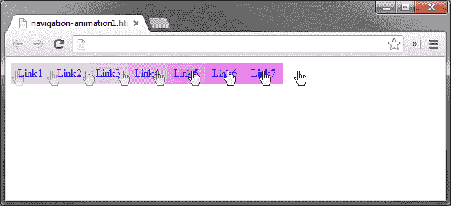
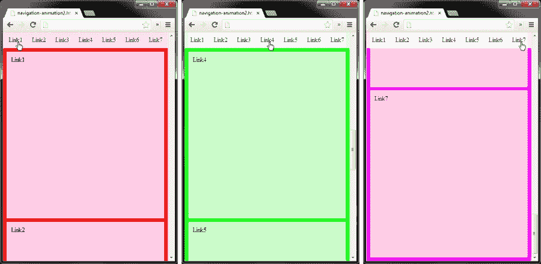

# 第四章：导航动画

*在本章中，我们将讨论一些用于导航的动画方法。导航允许用户在我们的网站中的不同页面之间移动。在这个常见的网站功能中添加一些动画将为我们的 Web 项目增添一些情趣。辣味是好的！*

下面是本章我们将学习的内容：

+   当我们的鼠标指针进入和离开元素时，向元素添加和删除 CSS 类

+   使用`animate()`方法更改悬停元素的样式，同时指定持续时间

+   学习如何平滑地滚动窗口到页面元素

+   我们将制作一个示例，当单击链接时平滑滚动并更改页面背景颜色。花哨！

# 创建简单的导航动画

我们将从简单地在鼠标悬停在锚标签（`<a>`）上时更改背景颜色开始。这是导航动画的最简单形式，所以这是一个很好的开始。我们将通过向元素添加类来更改背景颜色。这将轻松地允许我们根据需要构建更多样式到类中。

### 注意

在本章中我们将再次使用 jQuery UI 来弥补 jQuery 2.0 中对颜色动画的支持不足。请参考上一章关于从哪里下载 jQuery UI 库。

## 配置 addClass()和 removeClass()

`addClass()`和`removeClass()`的语法可能如下所示（方括号表示可选参数）：

```js

$(selector).addClass( className [,duration] [,easing] [,complete] );

$(selector).removeClass( className [,duration] [,easing] [,complete] );

```

### 注意

重要的是要注意，`duration`不是`addClass()`或`removeClass()`的 jQuery 选项。这个选项是由 jQuery UI 添加的，并且被称为方法重写。

# 行动时间 - 设置我们的导航

让我们通过执行以下步骤创建我们的导航结构和基本动画：

1.  我们将从根据第一章的模板文件创建一个新文档开始，将其命名为`navigation-animation1.html`并保存在我们的`jquery-animation`目录中。

1.  接下来，我们需要在我们的 jQuery 库之后添加 jQuery UI 库，方法是添加这一行：

    ```js

    <script src="img/jquery-ui.min.js"></script>

    ```

1.  然后，我们将把以下 HTML 代码添加到我们新创建的文档中的`<body>`标签下：

    ```js

    <nav>

    <a href="#">链接 1</a>

    <a href="#">链接 2</a>

    <a href="#">链接 3</a>

    <a href="#">链接 4</a>

    <a href="#">链接 5</a>

    <a href="#">链接 6</a>

    <a href="#">链接 7</a>

    </nav>

    ```

1.  将以下代码保存到名为`navigation-animation1.css`的文件中，并将其链接到我们的 HTML 文档：

    ```js

    nav a {

    display:block;

    float:left;

    padding:5px 10px;

    background:#DDD;

    }

    nav a.hover {background:#F0F;}

    ```

1.  将此代码添加到我们的空匿名函数中，以便我们的脚本能够运行：

    ```js

    $("nav a").hover(function(){

    $(this).addClass("hover", 300);

    }, function(){

    $(this).removeClass("hover", 300);

    });

    ```

## *发生了什么？*

我们使用 `hover()` 处理程序告诉我们的导航链接当鼠标光标进入和离开元素时该做什么。我们还将持续时间设置为 `300`（毫秒），以便 `hover()` 方法动画略有延迟，并为我们提供所需的动画效果。

以下屏幕截图是说明动画应该如何工作的示例，通过从第一个链接移动光标到最后一个链接：



## 动手试一试 - 扩展我们的悬停样式

尝试一下，看看通过向我们的 `hover` 类添加其他样式可以实现什么其他效果。首先，尝试更改元素的 `height` 和 `position`。

# 使用 stop() 方法

上一个示例是一种简单的方式，允许轻松更新样式。您会注意到，如果您非常快地将鼠标悬停在所有导航链接上，来回多次并停止，动画会继续播放直到每个动画都播放完毕。这通常不是一种非常理想的效果，因此我们需要添加 `stop()` 方法来在下一个动画开始之前停止上一个动画。由于 `addClass()` 和 `removeClass()` 无法在动画队列中停止，因此我们需要调整我们的代码一点。为此，我们将使用 `animate()` 方法来允许我们停止动画。

# 行动时间 - 添加 `stop()` 方法

在下一个动画开始之前停止我们的动画，我们需要稍微修改我们的代码。在 `animate()` 效果之前添加 `stop()` 就是我们需要做的。

使用与之前相同的文件（`navigation-animation1.html`），我们将在我们的匿名函数中更新代码，用以下代码替换（新代码已突出显示）：

```js

$("nav a").hover(function(){

$(this).stop().animate({ backgroundColor:"#F0F" }, 300);

}, function(){

$(this).stop().animate({ backgroundColor:"#DDD" }, 300);

});

```

## *刚才发生了什么？*

现在，如果我们迅速将鼠标指针移动到导航链接上（来回移动光标），您会注意到上一个动画在下一个动画开始之前会停止。这比以前的动画更优雅。就像香辣一样，我们也喜欢优雅。

# 使用 `scrollTop()` 动画窗口

在上一章中，我们学习了如何使用 `scrollTop()` 来使我们 `<body>` 元素的背景图像在页面上以不同的方向和速度动画。在下一个示例中，我们将使用 `scrollTop()` 来通过平滑滚动到页面上的一个元素来动画窗口。

*平滑滚动* 动画方法可以用于向我们的用户视觉地指示窗口位置已根据他们在页面上采取的操作而更改，通常是在鼠标单击元素后。这种动画方法通常被称为*一页式*，正如我们将要构建的一样。

# 行动时间 - 编写我们的平滑滚动动画

在接下来的步骤中，我们将创建我们的平滑滚动、单页动画，它将动画到页面内容的不同部分：

1.  首先，让我们从使用我们的模板 `smooth-scrolling.html` 创建一个新文件开始，然后将其保存在我们的 `jquery-animation` 文件夹中。

1.  其次，我们将再次添加我们的 jQuery UI 库，方法是直接在我们的 jQuery 库下面插入以下代码（新代码已经被突出显示）：

    ```js

    <script src="img/jquery.js"></script>

    <script src="img/jquery-ui.min.js"></script>

    ```

1.  接下来，我们需要将以下 CSS 代码添加到一个名为 `smooth-scrolling.css` 的新文件中，并在 `smooth-scrolling.html` 中链接它：

    ```js

    body, html {

    margin:0;

    padding:0;

    }

    body {background:#CCC;}

    nav {

    width:100%;

    position:fixed;

    top:0;

    padding:10px 0;

    text-align:center;

    outline:1px dotted #FFF;

    background:#EEE;

    background-color:rgba(255, 255, 255, 0.9);

    }

    nav a {

    color:#222;

    margin:0 10px;

    text-decoration:none;

    }

    content {margin-top:50px;}

    content div {

    height:400px;

    margin:10px;

    padding:10px;

    outline:1px solid #FFF;

    background:#EEE;

    background-color:rgba(255, 255, 255, 0.8);

    }

    ```

1.  然后，我们将以下 HTML 代码添加到 `<body>` 标签下面：

    ```js

    <nav>

    <a href="#link1">链接 1</a>

    <a href="#link2">链接 2</a>

    <a href="#link3">链接 3</a>

    <a href="#link4">链接 4</a>

    <a href="#link5">链接 5</a>

    <a href="#link6">链接 6</a>

    <a href="#link7">链接 7</a>

    </nav>

    <div class="content">

    <div id="link1">链接 1</div>

    <div id="link2">链接 2</div>

    <div id="link3">链接 3</div>

    <div id="link4">链接 4</div>

    <div id="link5">链接 5</div>

    <div id="link6">链接 6</div>

    <div id="link7">链接 7</div>

    </div>

    ```

1.  最后，将以下内容添加到我们的匿名函数中：

    ```js

    $("a[href^='#']").click(function(e){

    var pos = $(this.hash).offset().top - 50;

    $("body, html").stop().animate({ scrollTop:pos }, 1000);

    e.preventDefault();

    });

    ```

## *刚才发生了什么？*

我们使用了 `click()` 处理程序与一个看起来复杂的选择器。我们使用的选择器意味着：选择所有 `href` 属性以井号 (`#`) 开头的锚标签 (`<a>`)。

对于这个示例，我们的选择器将是 `<body>` 标签，我们正在使用 `animate()` 方法来处理我们的繁重工作。再次使用 `stop()` 方法，以便在下一个动画开始之前停止前一个动画。我们设置一个名为 `pos` 的新变量，用来保存点击链接（`<a>`）距页面顶部的位置，使用 `offset().top`。此外，我们从 `pos` 变量中减去 `50` 作为偏移量，因为我们希望 `content` 元素的顶部落在导航栏的下方。我们将动画的持续时间设置为 `1000` 毫秒，因为我们希望动画从页面上的当前位置跳转到下一个位置需要 1 秒钟的时间。

# 平滑滚动和页面背景颜色

现在，让我们将上面学到的两种动画方法合并到一起。此示例将使用平滑滚动方法跳转到我们的链接元素，并同时更改页面背景颜色。

以下截图展示了在我们的导航栏中点击链接后对应链接的停止点：



# 行动时间-创建超级动画

将我们之前的两个示例合并在一起，我们需要创建一个新文件，并将来自两个示例的 CSS 和 jQuery 代码混合在一起。当然，我们需要进行一些调整，以使它们能够一起工作。

1.  使用文件模板创建名为 `navigation-animation2.html` 的新文档，并将其保存在我们的 `jquery-animation` 文件夹下。

1.  然后，将以下 CSS 代码放入一个名为 `navigation-animation2.css` 的新文件中，并在我们刚创建的 HTML 文档中链接它：

    ```js

    body, html {

    margin:0;

    padding:0;

    }

    body {background:#F00;}

    nav {

    width:100%;

    position:fixed;

    top:0;

    padding:10px 0;

    text-align:center;

    outline:1px solid #FFF;

    background:#EEE;

    background-color:rgba(255, 255, 255, 0.5);

    }

    nav a {

    color:#222;

    margin:0 10px;

    text-decoration:none;

    }

    content {margin-top:50px;}

    content div {

    height:400px;

    margin:10px;

    padding:10px;

    outline:1px solid #FFF;

    background:#EEE;

    background-color:rgba(255, 255, 255, 0.8);

    }

    ```

1.  最后，我们需要将以下代码放入我们的匿名函数中：

    ```js

    $("a[href^='#']").click(function(e){

    e.preventDefault();

    var link = $(this).index() + 1;

    var background = "";

    if (link == 1) {

        background = "#F00"        //红色

    } else if (link == 2) {

        background = "#FF5000"     //橙色

    } else if (link == 3) {

        background = "#FF0"        //黄色

    } else if (link == 4) {

        background = "#0F0"        //绿色

    } else if (link == 5) {

        background = "#0FF"        //浅蓝色

    } else if (link == 6) {

        background = "#00F"        //深蓝色

    } else if (link == 7) {

        background = "#F0F"        //紫红色

    }

    var pos = $(this.hash).offset().top - 50;

    $("body, html").stop().animate({ scrollTop:pos, backgroundColor:background }, 1000);

    });

    ```

## *发生了什么？*

我们做的第一件事是添加一个新的 `link` 变量。这将保存我们的用户点击的链接的索引值。我们将索引值递增了 `1`，因为 `index()` 方法是从零开始的，而且今天已经很长时间了，所以我们不想从零开始计数。

`background` 变量被声明以抵御那些肮脏的 JavaScript 错误怪物，一如既往。我们创建了一个 `if` 语句来处理背景颜色的十六进制值。`background` 变量被设置为点击的链接的颜色（我们定义的）。

我们这个魔术技巧的选择器将再次是`<body>`标签，因为我们既要滚动到页面上的另一个位置，又要改变页面的背景颜色。这与之前的代码相同，唯一不同的是，这次我们添加了`backgroundColor`，并且根据上面的 if 语句设置了值（背景）。

## 挑战英雄 – 进一步扩展脚本

尝试为我们合并的动画示例添加一些功能。以下是一些启发你的想法：

+   动态地将内容`<div>`元素的高度改变为窗口的高度（不要忘记添加窗口调整大小函数）

+   使用窗口滚动功能改变背景颜色，这样当你手动滚动页面时，颜色就会改变，而不仅仅是通过点击链接实现

+   当内容`<div>`元素通过点击链接或手动滚动页面进入视图时，进行淡入

+   自动滚动内容，无需点击链接

## 突击测验 – 符号^ 与 stop() 方法

Q1\. 我们在`<a>`选择器中使用符号^代表什么意思？

1.  它表示“等于”

1.  它表示“包含”

1.  它表示“以…开始”

1.  它表示“以…结束”

Q2\. `stop()`方法的作用是什么？

1.  它会停止所选元素的动画队列

1.  它会阻止页面加载

1.  它会停止页面上的所有动画

1.  它会阻止动画运行，直到页面重新加载

# 总结

在这一章中，我们学会了如何根据鼠标交互来改变元素的样式，使用`addClass()`和`removeClass()`，以及如何通过 jQuery UI 的方法覆盖来控制添加和移除这些类的速度（持续时间）。

接着，我们学会了如何平滑地将窗口滚动到页面上指定的元素。之后，我们将两个示例合并成了一个示例，这个示例可以平滑地滚动窗口并让页面背景颜色淡入。同时在这一章中，我们找到了一只小狗。什么？你没有找到小狗？你一定是错过了某个分号。

现在我们已经为我们的导航元素添加了一些活力，接下来，我们将在下一章中学习如何为我们的表单输入添加一些生命。下一章中我们将学到一些内容，包括表单验证动画，视觉上改变表单以提醒用户提交时出现问题，并且如何在需要用户修正输入时摇动表单。
