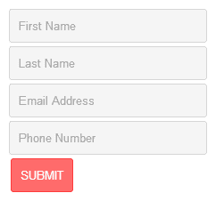

# 第五章：表单和输入动画

*在本章中，我们将使用 jQuery 来查看表单动画的示例和概念。我们可以使用几乎任何类型的动画来动画表单输入（由于怪癖和兼容性）。然而，请记住，许多动画都没有意义或会使我们的用户感到困惑，因此我们将避开它们。这些动画类型是对眼睛太“刺耳”的。例如，如果我们改变表单输入的尺寸，我们的用户可能不知道这意味着什么。对于我们的第一个示例，我们将主要坚持颜色变化。在本章后面，我们将使用 jQuery UI 添加更多的动画支持，以真正使我们的表单动起来！*

在本章的示例中，我们将创建 HTML 表单，以便我们可以获得表单动画的视觉表示。对于这些示例，我们不会添加表单操作，因为我们不需要它们正确提交。

在本章中，我们将涵盖以下主题：

+   当我们的用户将鼠标光标移动到表单字段上时，动画表单

+   当我们的用户点击其中一个输入字段时，更改输入字段的背景颜色

+   根据表单验证动画化表单的外观

这些是我们在本章中将要使用的事件处理程序，以使我们的表单元素移动起来：

+   `hover()`

+   `focus()`

+   `blur()`

# 使用简单的表单动画

表单动画可以用于许多原因，最明显的是当我们的用户与我们的表单进行交互时。更具体地说，当他或她的光标进入或离开我们的表单元素（文本框）时，可以使用表单。动画也非常适合指示表单验证错误。这些动画通常会在表单输入上产生轻微的颜色变化，以使我们的用户在填写表单时获得更好的体验，并使流程更容易跟踪。

### 注意

在本章中，我们将再次使用 jQuery UI 来弥补 jQuery 2.0 中对颜色动画的支持不足。请参考 第三章，*背景动画*，以获取 jQuery UI 库的下载位置。

# 行动时间 - 创建表单

我们将使用以下步骤创建一个 HTML 表单。创建表单后，我们将添加表单验证动画。

1.  从 第一章，*入门* 中使用我们的模板创建一个新文档，称为 `form-animation.html`，并将其保存在我们的 `jquery-animation` 文件夹中。

1.  然后，我们将以下代码放置在我们的 `<body>` 标签内：

    ```js

    <form id="form1">

    <input type="text" placeholder="名字">

    <input type="text" placeholder="姓">

    <input type="text" placeholder="电子邮件地址">

    <input type="text" placeholder="电话号码">

    <input type="submit" value="提交">

    </form>

    ```

1.  然后，我们需要添加 jQuery UI 库，跟在我们的 jQuery 库后面，通过添加以下代码。（有关获取 jQuery UI 库的详细信息，请参见前面提到的信息框）：

    ```js

    <script src="img/jquery-ui.min.js"></script>

    ```

1.  在我们的匿名函数中，添加以下代码：

    ```js

    $("input").hover(

    function() {

        $(this).addClass("hover", 500);

    },

    function() {

        $(this).removeClass("hover", 500);

    }

    );

    $("input").focus(function() {

    $(this).addClass("focus", 500);

    });

    $("input").blur(function() {

    $(this).removeClass("focus", 500);

    });

    ```

1.  创建一个名为`form-animation.css`的新文件，将其保存在我们的`jquery-animation`文件夹下，并添加以下代码：

    ```js

    form {

    float:left;

    margin:5px;

    }

    input {

    display:block;

    width:200px;

    padding:10px;

    border-radius:3px;

    background:#F5F5F5;

    border:1px solid #D5D5D5;

    }

    input[type=submit] {

    width:auto;

    border:0;

    color:#FFF;

    text-transform:uppercase;

    }

    input:focus {outline:0;}

    #form1 input[type=submit] {

    background:#FF6B6B;

    border:1px solid #FF3A3A;

    }

    ```

### 注意

属性选择器（`input[type=submit]`）在旧版本的 Internet Explorer 中有一些小问题。在使用之前，请确保您的选择器受支持（或进行多重填充）。

这里有一个 HTML5 跨浏览器填充的很好的列表:[`github.com/Modernizr/Modernizr/wiki/HTML5-Cross-browser-Polyfills`](https://github.com/Modernizr/Modernizr/wiki/HTML5-Cross-browser-Polyfills)。

到此为止，我们的表单应该看起来像下面的截图：



## *刚刚发生了什么?*

我们添加的第一部分代码是这一章中我们将用于代码示例的 HTML 骨架结构。我们在表单上使用了一个 ID 进行一般的定位。一旦我们添加另一个表单，我们将在本章后面更改这个 ID。显然，这些表单没有动作，因为我们不需要它们提交以查看我们的动画。

其次，我们添加了 jQuery UI 库，以支持颜色动画，并为`addClass()`和`removeClass()`添加时长选项，以及在前几章中添加颜色动画。

我们接下来添加的 jQuery 代码是我们在表单上需要用来通过向输入元素添加和删除 CSS 类来实现样式动画的处理程序。`hover()`处理程序有`mouseenter`和`mouseleave`事件。这有助于保持我们的代码在同一个函数中。JavaScript 中`onFocus`和`onBlur`的 jQuery 等效物分别是`focus()`和`blur()`。与`hover()`不同，这些处理程序必须分开。

# 行动时间-将我们的动画样式添加到表单

我们已经添加了所有我们需要的表单代码；现在，让我们添加一些样式到我们的表单，使动画样式生效。

1.  在我们创建的名为`form-animation.css`的样式表的底部附近添加此代码，它位于`input:focus`和`#form1 input[type=submit]`的样式之间：

    ```js

    #form1 input.hover {border:1px solid #FF7F7F;}#form1 input.focus {

    background:#FFD8D8;

    border:1px solid #FF7F7F;

    }

    ```

## *刚刚发生了什么?*

现在，让我们预览一下带有新添加样式的表单，并进行测试。您会注意到当您悬停在每个文本输入上时，红色边框会缓慢淡入，并且当我们将鼠标光标移出文本输入时，红色边框会缓慢淡出。点击文本输入现在会使背景颜色渐变为红色。当我们点击离开焦点输入时，红色背景颜色会慢慢恢复到其原始颜色。

### 提示

这些动画也可以使用 CSS3 过渡实现。

我们添加的 CSS 样式的顺序非常重要。第一个状态是 `hover` 状态，因此这些样式排在最前面。我们希望焦点类在动画之间的过渡期间覆盖 `hover` 状态，因此它在 `hover` 样式下面。

最后，提交按钮的样式放在最后一行，因为我们不希望在悬停在其上时样式发生变化。如果您对样式排序方法以及为什么重要不熟悉，请阅读 CSS 特异性。交换我们刚刚添加的样式的顺序将说明为什么顺序很重要。

# 表单验证动画

验证用户表单提交是确保我们从用户那里获得正确信息的好方法。为了增强表单的可用性，我们将介绍一些处理表单验证的动画方法。我们将从基本的表单验证开始，并从那里构建。

# 行动时间 - 基本对话框表单验证

我们将通过使用警报来创建表单验证，告诉用户表单提交出了什么问题。

1.  首先，我们需要将以下代码放在我们先前添加的代码之后的匿名函数中：

    ```js

    $("#form1 input[type=submit]").click(function(e) {

    e.preventDefault();

    var msg_error = "";

    $("#form1 input[type=text]").each(function() {

        if ($(this).val() == "") {

        msg_error += $(this).attr("placeholder") +

            "不能为空。\n";

        }

    });

    if (msg_error) {

        alert(msg_error);

    } else {

        alert("表单提交成功！");

    }

    });

    ```

## *发生了什么？*

我们在提交按钮上使用了 `click()` 处理程序来触发表单验证检查。为了本示例的缘故，我们使用了 `preventDefault()`，这样当我们点击提交按钮时，URL 散列不会更改。确保在将此代码发布到互联网的野外时删除此行。

`each()` 方法用于定位表单中的所有输入项。使用 if 语句将其缩小到所有值为空的输入项（通过使用 `$(this)`，因为我们已经在 `each()` 方法中）。每当我们的 `if` 语句返回 true 时，我们将添加到变量 `msg_error`。我们使用之前设置的空输入的占位符值作为错误消息的第一部分。我们添加了 `can't be left blank` 作为验证错误消息的其余部分，并以新行（`\n`）结束，以使所有错误消息不在对话框窗口的同一行上。

最后，我们需要确保是否有错误消息要显示，所以我们检查我们的`msg_error`变量返回`true`。如果是，我们将使用`alert()`内的变量`msg_error`引发对话窗口。否则，我们将使用`alert()`告知用户表单已成功提交。

## 尝试一下英雄 - 扩展我们的表单验证

在这个例子中，我们使用了非常基本的表单验证，以确保我们的输入字段都没有留空。尝试扩展脚本以检查不同类型的值。其中一些验证类型的例子是：

+   仅包含数字

+   仅包含字母

+   包含一定数量的字符

+   仅包含字母并在一定范围内（例如：1-100）

+   日期在未来

# 行动时间 - 动画展示表单验证错误

现在，我们不再给用户一个包含所有验证错误的对话框，而是会直观地指出需要修复的表单字段错误。

1.  我们将通过在我们的页面上添加一个新的表单来开始。在我们第一个`<form>`之后添加以下代码（新代码已突出显示）：

    ```js

    <form id="form2">

        <input type="text" placeholder="名">

        <input type="text" placeholder="姓">

        <input type="text" placeholder="电子邮箱地址">

        <input type="text" placeholder="电话号码">

        <input type="submit" value="提交">

    </form>

    ```

1.  接下来，我们将通过将以下代码放置在样式表的底部来添加新的表单样式：

    ```js

    #form2 input.hover {border:1px solid #7FA1D1;}

    #form2 input.focus {

    background:#E6F0FF;

    border:1px solid #7FA1D1;

    }

    #form2 input[type=submit] {

    background:#8FACD7;

    border:1px solid #638CC7;

    }

    #form2 input.error {border:1px dashed #F00;}

    ```

1.  然后，让我们加入检查表单的代码：

    ```js

    $("#form2 input[type=submit]").click(function(e) {

        e.preventDefault();

        $("#form2 input[type=text]").each(function() {

            if ($(this).val() == "") {

                $(this).addClass("error");

            } else {

                $(this).removeClass("error");

            }

        });

    });

    ```

## *刚发生了什么？*

我们使用与上一个示例相同的代码，但不再触发具有所有输入验证错误的对话框，而是为每个需要在表单中通过之前需要注意的文本输入更改了虚线红色边框。我们使用了我们的老朋友`addClass()`和`removeClass()`来通过添加或删除类`"error"`来为具有错误的输入添加样式。

## 尝试一下英雄 - 把所有东西放在一起

现在，尝试将我们刚学到的所有表单验证动画类型组合在一起。还要尝试更多地扩展样式。以下是扩展样式和动画的一些想法：

+   在表单字段的侧面显示一个错误消息，说明验证错误是什么。

+   在表单字段内显示背景图像，表示提交存在问题。

+   自动将光标焦点设置到第一个具有验证错误的表单字段。

+   如果您的表单有标签（而不是占位符），请更改相应标签的颜色。

+   使具有验证错误的表单字段脉动，以持续表示错误（使用边框颜色和/或背景颜色）。

尝试自己玩一些 jQuery UI 动画效果，并想出一些时髦的动画。我们将在第六章中了解更多关于 jQuery UI 的优秀功能，但这里有一个 jQuery UI 动画让您开个头：

```js

$("form").effect("bounce", { direction:"left", easing:"linear" }, 500);

```

## 快速测验 - 表单动画和 jQuery UI

Q1\. 何时可以使用表单动画？

1.  当我们想引导用户注意表单的特定区域时

1.  当用户与我们的表单交互时

1.  以增强用户对我们表单的体验

1.  以上所有

Q2\. 为什么我们在本章的示例中添加了 jQuery UI？

1.  给予我们使用非 jQuery 原生动画效果的能力

1.  要向`addClass()`和 `removeClass()` 添加`duration`选项，并给我们以动画颜色的能力

1.  允许我们使用`scrollTop()`的平滑滚动选项

1.  为了让`preventDefault()`在我们的示例中正常工作

# 摘要

在本章中，我们学习了如何根据与表单交互的情况来直观改变表单的外观。为了更进一步，您可以使用其他 CSS 样式创建自定义动画，通过 jQuery 改变元素或使用 jQuery UI 效果。只需记住 - 不要使动画太突然或突然。表单动画通常用于帮助用户填写表单的流程。确保逐步走过每个表单步骤和动画，就像您是第一次填写该表单的用户一样。

在下一章中，我们将研究使用 jQuery UI 在 jQuery 库之上添加的出色动画效果。jQuery UI 很棒，因为它不仅添加了新的动画效果，还为原生 jQuery 方法添加了额外选项。
