# 第六章：使用 jQuery UI 进行扩展动画

*jQuery UI 是 jQuery 的官方用户界面库，添加了一套交互式小部件，如标签页和手风琴，一系列交互助手，如拖放，以及一套全面的效果，扩展了 jQuery 原生提供的效果。*

在本章中，我们将看到 jQuery UI 添加的额外效果。我们将涵盖的主题包括：

+   获取和设置 jQuery UI

+   jQuery UI 添加的新效果

+   使用 `effect()` 方法

+   扩展 `show()`、`hide()` 和 `toggle()` 方法

+   在 jQuery UI 中使用缓动

+   为一个元素的颜色添加动画

+   动画类转换

jQuery UI 添加了几种新的动画方法，以及修改了几种 jQuery 方法。本章将要讨论的方法包括：

+   `animate()`

+   `addClass()`

+   `effect()`

+   `hide()`

+   `switchClass()`

+   `show()`

+   `toggle()`

# 获取和设置 jQuery UI

获取和设置 jQuery UI 非常简单。有一个在线工具可以为我们构建一个自定义下载包，其中只包含我们需要的 jQuery UI 部分。由于 jQuery UI 的模块化性质，尽量减少我们在任何给定的 Web 项目中使用的代码负载是有意义的，因此只包含我们打算使用的代码模块的能力有助于我们尽量减少我们的代码可能对访问者产生的任何影响。

jQuery UI 下载构建器可以在 [`jqueryui.com/download`](http://jqueryui.com/download) 找到。该页面分为两个部分，库的组件列在顶部，主题细节列在底部。下载构建器具有一定的智能，当我们选择所需的组件时，它将自动选择任何依赖项。

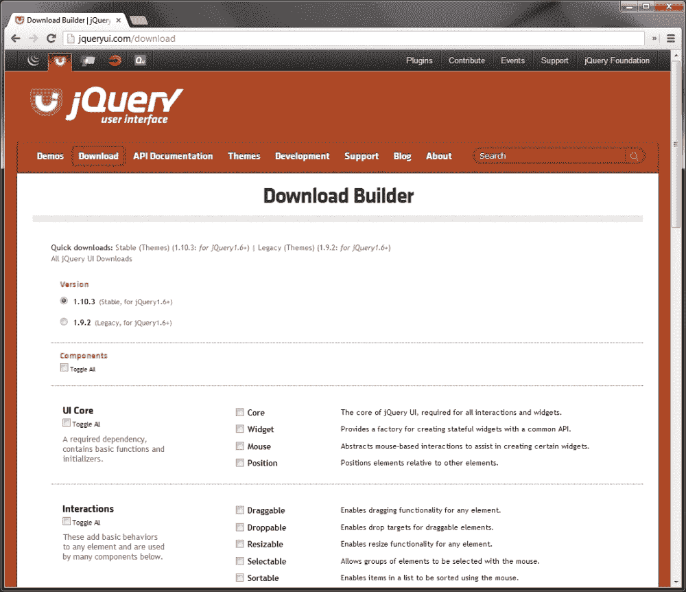

在前一个截图中显示的**下载构建器**页面为我们提供了运行库组件的任何子集所需的一切。

在本章中我们将只使用效果，所以当我们下载包时，应该只选择页面底部**效果**小节中找到的组件。我们不需要包括主题，甚至不需要包括库核心。这些效果可以完全独立于库的其余部分使用；我们所需要的只是**效果核心**文件和我们需要的各个效果。确保它们都被选择，并下载包。

下载构建器允许您仅下载您需要的部分，因为 jQuery UI 基本上是一个附加组件。分解每个部分，允许您仅选择您需要的部分，这在定制时极大地减少了插件的文件大小。

这个包将为我们提供一切我们需要使用我们选择的组件，包括最新稳定版本的 jQuery 的副本，所以在使用 jQuery UI 时，jQuery 本身不需要单独下载。

所选组件的所有 JavaScript 将由下载构建器合并并压缩为单个文件，并且任何功能性 CSS 或主题文件将被合并为单个样式表。我们不需要任何主题文件来处理效果，但确保从下载构建器提供的归档中的 `.js` 文件进入我们的 `js` 文件夹。

## 创建一个新的模板文件

在本章的其余部分中，示例将会很简短，主要是基于图像的示例，依次说明每个效果，因此使用稍微不同的模板文件是有道理的。通过在 jQuery 结束标签 `</body>` 前直接添加对 jQuery UI 源文件的引用来创建一个新的模板文件。

# jQuery UI 新增的效果

在撰写本文时，jQuery UI 提供了 14 个新的预定义动画效果供我们在页面中使用；下面列出了这些效果以及它们的简要用法：

| 动画 | 描述 |
| --- | --- |
| `blind` | 通过像窗帘一样向下或向上滚动，显示或隐藏目标元素。 |
| `bounce` | 目标元素水平或垂直地反弹指定次数。 |
| `clip` | 通过将相对的边缘向元素中心移动或向外扩展到其完整宽度或高度，显示或隐藏目标元素。 |
| `drop` | 元素看起来落在或离开页面，以便显示或隐藏它。 |
| `explode` | 爆炸效果使目标元素分成指定数量的碎片然后淡出，或者在几个碎片中淡入视图然后汇合形成完整元素。 |
| `fold` | 元素看起来折叠关闭或打开。 |
| `highlight` | 目标元素的 `background-color` 属性被设置（默认为黄色，尽管这是可配置的），然后在短时间后淡出。 |
| `puff` | 目标元素稍微增大然后淡出。 |
| `pulsate` | 调整目标元素的不透明度指定次数，使元素似乎闪烁不断。 |
| `scale` | 目标元素的尺寸被调整以增加或减小其大小。 |
| `shake` | 目标元素被震动指定次数。这种效果类似于反弹效果，其关键区别在于每次动画迭代时摇动的距离保持不变。 |
| `size` | 调整目标元素的尺寸以增加或减小其大小。此效果与 `scale` 几乎相同。 |
| `slide` | 目标元素被制造成水平或垂直地滑入或滑出视图。 |
| `transfer` | 指定元素的轮廓被转移到页面上的另一个元素。 |

## 使用效果 API

jQuery UI 引入了 `effect()` 方法，该方法可用于触发上表中列出的任何效果。`effect()` 方法的使用模式如下：

```js

$(selector).effect( effect [,options] [,duration] [,complete] );

```

我们想要使用的特效名称总是`effect()`方法的第一个参数。它以字符串格式提供。

每个特效都有自定义配置选项，可以设置以控制特效的显示方式。这些选项是设置在配置对象中的，作为`effect()`方法的第二个参数，跟在特效名称后面。

我们还可以作为参数为特效提供持续时间。就像标准的 jQuery 动画一样，可以提供一个整数，表示特效的持续时间（毫秒为单位），或者是字符串`slow`或`fast`。

如果不需要配置，则持续时间可以作为第二个参数传递给`effect()`方法。如果没有提供持续时间，将使用默认持续时间`400`毫秒。

可选地，回调函数可以作为最后一个参数。提供的函数将在特效结束时针对每个选定元素执行一次。

让我们看看`effect()`方法可以如何使用一些示例。

## 弹跳特效

`bounce`特效类似于`easeOutBounce`的缓动函数，但比后者更易控制。根据需求，可以使用特效 API 或显示/隐藏逻辑。

### 语法

```js

$(selector).effect( "bounce" [,configuration] [,duration]);

```

### 配置选项

弹跳特效有以下配置选项：

| 选项 | 默认 | 用法 |
| --- | --- | --- |
| `direction` | `"up"` | 弹跳的方向。其他可能的选项是字符串 `down` |
| `distance` | `20` | 弹跳的初始距离（连续弹跳会减少距离）以像素为单位 |
| `mode` | `"effect"` | 是否正常运行特效，或使用显示/隐藏逻辑，其他可接受的值可能是字符串 `show`、`hide` 或 `toggle` |
| `times` | `5` | 弹跳的次数 |

# 动手实践 – 使用弹跳特效

在这个例子中，我们将看到如何结合 jQuery UI 特效来创建一个穿过页面的弹跳球：

1.  在模板文件的`<body>`中使用以下简单元素：

    ```js

    <div id="travel">

    <div id="ball"></div>

    </div>

    ```

1.  我们只需要一个简单的容器 `<div>` 和一个内部的 `<div>`。在`<body>`末尾的空函数中，加入以下脚本：

    ```js

    $("#ball").click(function() {

    $("#travel").animate({

    left: "+=300px"

    }, 1500).find("div").effect( "bounce", { times: 4,

    距离：100}, 1500);

    });

    ```

1.  将文件保存为`bounce.html`。我们还需要一些简单的样式。将以下 CSS 添加到一个新文件中：

    ```js

    #travel {

    position:absolute;

    top:100px;

    }

    #ball {

    width:150px;

    height:150px;

    cursor:pointer;

    背景:url(../img/ball.jpg) no-repeat 0 0;

    }

    ```

1.  将其保存为 `bounce.css`，放置在 `css` 文件夹中。当我们运行页面并点击球时，我们应该发现它会沿着页面弹跳，逐渐停止：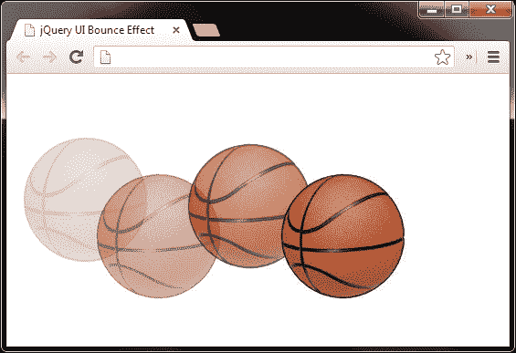

前一组成将显示球横穿页面，从左到右弹跳上下。

## *刚刚发生了什么？*

当点击球时，我们首先使用 jQuery 的 `animate()` 方法，通过 300 像素动画化容器 `#travel` 的 `left` 样式属性，在 1.5 秒的持续时间内。我们减慢此动画以改善整体动画的外观，但这并不是严格要求的。然后，我们向下导航到内部 `<div>` 元素，并使用 `effect()` 方法，指定 `bounce` 效果。

我们需要同时使用 `#travel` 和 `#ball` 元素，因为如果我们在同一元素上使用 `animate()` 和 `effect()` 方法，弹跳效果将进入元素的动画队列，两个动画将按顺序执行，而不是同时运行。

## 高亮效果

`highlight` 效果是吸引访问者注意力的简单而有效的方法，用于突出显示页面中已添加的新项目，在今天许多领先的基于网络的界面中用于此目的。

### 语法

```js

$(selector).effect( "highlight" [,configuration] [,duration] );

```

### 配置选项

对于 `highlight` 效果，只有两个配置选项；它们如下所列：

| 选项 | 默认值 | 用法 |
| --- | --- | --- |
| `color` | `"#ffff99"` | 设置正在高亮显示的元素的 `background-color` 属性 |
| `mode` | `"show"` | 设置使用 `effect()` 方法时效果是隐藏还是显示的，其他可能的值包括 `hide`、`toggle` 或 `effect` |

# 行动时间 - 高亮元素

在这个示例中，我们将创建一个简单的待办事项列表，其中包含一系列可以勾选的默认项目。我们还可以允许将新项目添加到列表中，并在添加时将 `highlight` 效果应用于新项目。

1.  将以下 HTML 代码添加到模板文件的 `<body>` 元素中：

    ```js

    <div id="todo">

    <h2>待办事项列表</h2>

    <ul>

        <li><label><input type="checkbox">项目 1</label></li>

        <li><label><input type="checkbox">项目 2</label></li>

        <li><label><input type="checkbox">项目 3</label></li>

    </ul>

    <input type="text" id="new">

    <button id="add">添加</button>

    </div>

    ```

1.  使用以下代码为我们的待办事项列表添加行为：

    ```js

    $("#add").click(function() {

    var newItem = $("#new"),

        text = newItem.val();

    if (text) {

        var li = $("<li>"),

        label = $("<label>").html("<input type=\"checkbox\">" +text).appendTo(li);

        li.appendTo("#todo ul").effect("highlight", 2000);

        newItem.val("");

    }

    // 阻止表单提交

    return false;

    });

    ```

1.  将此页面保存为 `highlight.html`。我们还需要一些 CSS 来完成此示例。在文本编辑器中新建一个文件，添加以下代码：

    ```js

    #todo {

        width:208px;

        font:normal 13px sans-serif;

    }

    #todo ul {

        padding:0;

        margin-bottom:30px;

    }

    #todo li { list-style-type:none; }

    #todo label {

        display:block;

        border-bottom:1px dotted #000;

    }

    li input {

        position:relative;

        top:2px;

    }

    input { margin-right:10px; }

    ```

1.  将此页面保存为`highlight.css`。

1.  在浏览器中运行页面时，我们可以添加一个新项，并且它将在添加到列表时短暂地突出显示: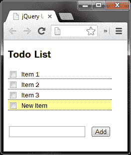

在上一张截图中，我们看到了新添加的项目在从列表中淡出之前的淡出效果。

## *刚才发生了什么?*

我们在列表底部的`<button>`元素上添加了一个点击处理程序，它驱动了其他行为的功能。当点击`<button>`元素时，我们缓存了`<input>`字段的选择器，并获取了输入到其中的文本。

如果保存文本的变量不为空，那么我们就创建新的`<label>`和`<input>`元素。我们将文本添加到`<label>`元素中，然后将新项目附加到列表中。最后，我们应用`highlight`效果，并清空`<input>`字段。

## 脉动效果

`pulsate`效果让元素上下视图出现指定次数，以便目标元素看起来在脉动。像我们迄今为止看到的大多数效果一样，它很容易使用，并且需要很少或不需要配置。

### 语法

```js

$(selector).effect( "pulsate", [,configuration] [,duration] );

```

### 配置选项

`pulsate`效果也只有两个可配置的选项；这些在下表中显示：

| 选项 | 默认 | 用法 |
| --- | --- | --- |
| `mode` | `"show"` | 设置目标元素在与`effect()`方法一起使用时是显示还是隐藏，其他可能的值包括`hide`、`toggle`和`effect` |
| `times` | `5` | 设置目标元素脉动的次数 |

# 行动时间 – 使元素脉动

在这个例子中，我们将展示一个简单的时间表，可以通过点击链接删除行。如果点击了链接，相应的行在删除之前会被脉动。

1.  在模板文件中使用以下标记：

    ```js

    <table>

    <tr>

        <th>工作编号</th>

        <th>开始时间</th>

        <th>结束时间</th>

        <th colspan="2">总时间</th>

    </tr>

    <tr>

        <td>05432</td>

        <td>8:00</td>

        <td>8:43</td>

        <td>43 分钟</td>

        <td>

        <a class="delete" href="#" title="删除此项">

            删除

        </a>

        </td>

    </tr>

    <tr>

        <td>05684</td>

        <td>8:43</td>

        <td>10:21</td>

        <td>1 小时 38 分钟</td>

        <td>

        <a class="delete" href="#" title="删除此项">

            删除

        </a>

        </td>

    </tr>

    <tr>

        <td>05684</td>

        <td>10:21</td>

        <td>13:30</td>

        <td>3 小时 9 分钟</td>

        <td>

        <a class="delete" href="#" title="删除此项">

            删除

        </a>

        </td>

    </tr>

    </table>

    ```

1.  添加应用效果的代码到页面底部的闭包中：

    ```js

    $(".delete").click(function(e) {

    e.preventDefault();

    var row = $(this).closest("tr");

    row.closest("tr").children().css("backgroundColor","red").effect("pulsate", function() {

    row.remove();

    });

    });

    ```

1.  将此文件保存为`pulsate.html`。这个例子只需要一些样式。这些应该放在一个新文件中：

    ```js

    table {

        border-spacing:0;

        font:normal 13px sans-serif;

    }

    th, td {

        text-align:left;

        padding-right:20px;

    }

    ```

1.  将此文件保存在`css`文件夹中，命名为`pulsate.css`。

1.  单击任何行中的删除链接将应用`pulsate`效果，然后删除该表行：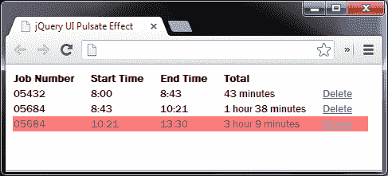

前一个截图显示了一个`pulsate`动画，当它淡出时。

## *刚才发生了什么？*

当点击**删除**链接时，我们的处理函数首先设置链接所在的`<tr>`元素的`background-color`属性。这对于效果并非必需，但确实有助于让效果栩栩如生。

然后，我们使用`effect()`方法将`pulsate`效果应用于行中的所有`<td>`元素。我们需要将效果应用于`<td>`元素而不是`<tr>`元素，以便在 IE 中效果按预期工作。

当效果结束时，我们的内联回调函数将被执行，该函数会移除`<tr>`元素。显然，`<tr>`元素只能被移除一次，一旦被移除，随后的尝试将会静默失败。

## `shake`效果

`shake`效果使应用它的元素来回抖动指定次数。

### 语法

```js

$(selector).effect( "shake", [,configuration] [,duration] );

```

### 配置选项

`shake`效果公开了三个配置选项，允许我们自定义其行为。

配置选项列在下表中：

| 选项 | 默认值 | 用法 |
| --- | --- | --- |
| `direction` | `"left"` | 设置元素移动的方向 |
| `distance` | `20` | 设置元素抖动时的像素数 |
| `times` | `3` | 设置元素抖动的次数 |

# 行动时间——抖动一个元素

开源 CMS WordPress 在后端管理区域的登录表单中输入错误的登录详细信息时使用了`shake`效果。在这个例子中，我们可以看到使用`shake`效果实现此行为是多么简单。

1.  将以下标记添加到模板文件中，作为登录表单的基础：

    ```js

    <form>

    <h2>登录</h2>

    <label>用户名：<input id="name" type="text"></label>

    <label>密码：<input id="pass" type="text"></label>

    <input type="submit" id="submit" value="登录">

    </form>

    ```

1.  现在将以下代码添加到模板文件底部的空闭包中：

    ```js

    $("#submit").click(function(e) {

    e.preventDefault();

    $("input").each(function(i, val) {

        if (!$(this).val()) {

        $(this).css("border", "1px solid red").effect("shake", {

            distance: 5 }, 100);

        }

    });

    });

    ```

1.  将此文件保存为`shake.html`。我们还需要一个基本的样式表来示例。将以下 CSS 添加到一个新文件中：

    ```js

    form {

    width:145px;

    padding:20px;

    margin:auto;

    border:1px solid #000;

    font:normal 13px sans-serif;

    }

    h2 {

    font-size:14px;

    margin-top:0;

    }

    input {

    display:block;

    margin-bottom:10px;

    border:1px solid #000;

    }

    ```

1.  将此文件保存为`shake.css`。

1.  如果我们在浏览器中运行页面，并且点击**登录**输入按钮，而不填写任何一个`<input>`字段，两个字段都将边框设置为红色，并且会从一边摇摆到另一边：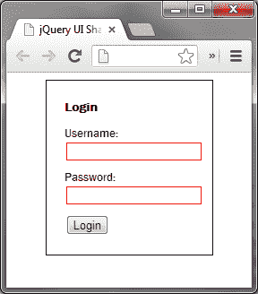

在前面的屏幕截图中，我们看到当输入框为空时并且点击**登录**按钮时，输入框会被摇晃。

## *刚才发生了什么？*

当点击**登录**按钮时，我们只需检查每个`<input>`是否有值，如果没有，我们就会应用红色边框，然后调用`effect()`方法，指定`shake`作为效果。我们使用配置对象来减少元素移动的距离，以及指定相对较短的持续时间。

## 尺寸效果

`size`效果用于调整元素的大小，使其根据其配置而增大或缩小。与大多数其他效果不同，`size`效果必须进行配置才能成功使用。

`size`效果也是唯一一个具有基本核心文件以及另一个效果作为依赖关系的效果之一。大多数组件仅依赖于核心文件。由于我们从 jQuery UI 下载构建器下载了整个效果套件，因此无需担心包含额外效果。当我们在本章开头下载时，它已经在下载构建器创建的单个文件中。

### 语法

```js

$(selector).effect( "size", [,configuration] [,duration] );

```

### 配置选项

`size`效果给了我们四个可配置的选项，如下所示：

| 选项 | 默认值 | 用法 |
| --- | --- | --- |
| `from` | `none` | 设置动画开始时目标元素的大小。此选项接受一个对象，该对象具有`height`和`width`键，用于设置目标元素的起始大小。此选项不是强制性的 |
| `to` | `none` | 设置动画结束时目标元素的大小。此选项接受一个对象，该对象具有`height`和`width`键，用于设置目标元素的结束大小。此选项必须提供 |
| `origin` | `['middle','center']` | 设置隐藏动画的消失点，或者与显示逻辑一起使用时增长的点 |
| `scale` | `"both"` | 此选项设置元素的整个`box`（包括边框和填充的 CSS 值）是否被缩放，仅`content`，或者默认的`both` |

# 行动时间 - 调整元素大小

增大和缩小元素的一个常见用途是鱼眼菜单，在鼠标指针悬停在它们上方时，元素会增大，当鼠标指针移出它们时，它们会缩小。这个效果也被苹果的 OSX 的码头上的图标使用。

使用`size`效果，我们可以只用几行代码实现自己的基本鱼眼菜单。

1.  将以下标记添加到模板文件的`<body>`中：

    ```js

    <div id="dock">

    <a href="#" class="icon" id="finder">

        </a>

    <a href="#" class="icon" id="mail">

        </a>

    <a href="#" class="icon" id="safari">

        </a>

    <a href="#" class="icon" id="firefox">

        </a>

    <a href="#" class="icon" id="itunes">

        </a>

    </div>

    ```

1.  将以下 JavaScript 添加到`<body>`元素底部的第三个`<script>`元素中：

    ```js

    $(".icon", "#dock").hover(function() {

    $(this).stop().animate({

        top: -31

    }).find("img").stop().effect("size", {

    scale: "box", to: { width: 64, height: 64 }

    });

    }, function() {

    $(this).stop().animate({

        top: -15

        }).find("img").stop().effect("size", {

        scale: "box", to: { width: 48, height: 48 }

    });

    });

    ```

1.  将此文件保存为`size.html`。我们还需要一些样式。在新文件中添加以下代码：

    ```js

    #dock {

    width:380px;

    height:90px;

    position:fixed;

    bottom:0;

    background:url(../img/dock.png) no-repeat 0 0;

    }

    .icon {

    position:absolute;

    top:-15px;

    left:44px;

    }

    .icon img { border:none; }

    #mail { left:108px; }

    #safari { left:170px; }

    #firefox { left:229px; }

    #itunes { left:289px; }

    ```

1.  将此文件保存为`size.css`，保存在`css`文件夹中。

1.  当我们在浏览器中运行文件时，应该看到菜单中的各个项目在鼠标指针移动到它们上方时变大和缩小：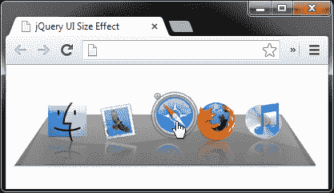

在上一个截图中，我们看到鼠标指针悬停在菜单项上时的菜单。

## *刚才发生了什么？*

我们使用 jQuery 的`hover()`方法将`mouseenter`和`mouseleave`事件处理程序附加到码头内的每个项目上，该方法接受两个函数，第一个函数在`mouseenter`事件上执行，第二个函数在`mouseleave`事件上执行。

在第一个函数中，我们使用`stop()`方法来管理队列，然后通过更改其`top`CSS 值来动画元素的位置。在这里使用`stop()`可以防止屏幕上元素位置的不美观的突变。

然后，我们进入链接内的图像并在此元素上调用`stop()`方法，然后再应用`size`效果。我们为配置对象中的`width`和`height`键提供整数值，由于这些值大于图像的尺寸，因此图像将增大。

### 注意

注意，当我们在图像上使用`stop()`方法时，它是为了防止鼠标指针重复在链接上移动时效果堆积。第二个函数实际上是第一个函数的反向，它只是将元素调整回其原始位置和大小。

## 传输效果

`transfer` 效果只是将一个元素的轮廓转移到另一个元素。与我们刚才看到的 `size` 效果一样，如果未经过配置，`transfer` 效果将无法生效。

### 语法

```js

$(selector).effect( "transfer", [,configuration] [,duration] );

```

### 配置选项

`transfer` 效果仅有两个配置选项，尽管只需要设置其中一个即可使效果生效。配置选项列在以下表格中：

| 选项 | 默认值 | 用途 |
| --- | --- | --- |
| `className` | `none` | 如果设置了此选项的值，则在效果运行时将其添加到传输元素中 |
| `to` | `none` | 指定传输元素发送到的目标元素的 jQuery 选择器 |

# 执行操作-将一个元素的轮廓转移到另一个元素上

在此示例中，我们将重新创建 OSX 中流行的应用程序安装对话框，并使用 `transfer` 效果来帮助展示访问者将图标拖动到何处（实际上图标不可拖动；我们只是在观察 `transfer` 效果）。

1.  在模板文件的 `<body>` 元素中添加以下元素以创建 `install` 对话框：

    ```js

    <div id="install">

    <div id="firefox"></div>

    <div id="apps"></div>

    </div>

    <p>要安装应用程序，请将其图标拖动到应用程序文件夹

    文件夹图标。</p>

    <button id="show">显示</button>

    ```

1.  将以下脚本添加到模板文件底部的空函数中：

    ```js

    $("#show").click(function() {

    $("#firefox").effect("transfer", {

        to: "#apps",

        类名： "ui-effect-transfer"

    }, 1000);

    });

    ```

1.  将页面保存为 `transfer.html`。 对于样式表，请将以下代码添加到新文件中：

    ```js

    body {

        font:normal 14px sans-serif;

    }

    #install {

    width:417px;

    height:339px;

    position:relative;

    background:url(../img/install.jpg) no-repeat 0 0;

    }

    #firefox {

    width:124px;

    height:121px;

    position:absolute;

    left:34px;

    top:132px;

    background:url(../img/firefox.png) no-repeat 0 0;

    }

    #apps {

    width:54px;

    height:52px;

    position:absolute;

    right:58px;

    top:172px;

    background:url(../img/apps.png) no-repeat 0 0;

    }

    .ui-effect-transfer { border:2px solid #7bee76; }

    ```

1.  将此文件保存为 `transfer.css` 放在 `css` 文件夹中。

1.  当点击 `<button>` 元素时，Firefox 图标的轮廓会转移到应用程序文件夹图标上，以引导访问者：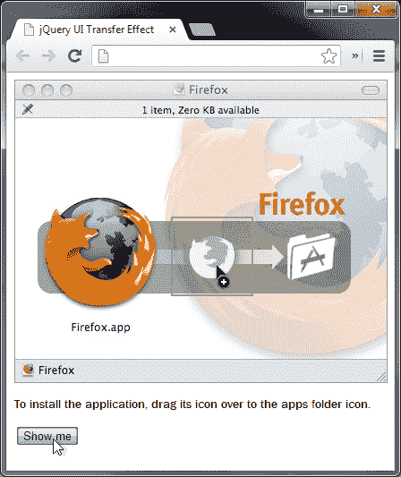

传输元素在从起始元素移动到目标元素时调整大小。在前一张截图中，动画完成了大约 50%。

## *刚才发生了什么？*

在底层 HTML 中，我们有一个容器`<div>`元素，它被赋予了应用程序安装对话框的背景图像。在其中，我们有一个给定 Firefox 图标背景的`<div>`元素，以及一个给定应用程序文件夹图标的第二个`<div>`元素。这两个内部`<div>`元素都具有用于样式目的和轻松使用 jQuery 选择的`id`属性。

在脚本中，我们为`<button>`元素添加了一个单击处理程序函数，每次单击`<button>`元素时都会应用效果。处理程序函数在`#firefox`元素上调用传输效果，该效果将图标设置为起始元素。

在配置对象中，我们将`to`选项设置为`apps`元素的选择器，并将`className`选项设置为`ui-effect-transfer`字符串。此字符串将作为类名应用于元素，并在传输元素可见时用于添加绿色边框。

每次单击`<button>`元素时，传输元素都会显示，并且会从起始元素（Firefox 图标）动画到结束元素（应用程序文件夹图标）。

## 小测验-使用效果 API

Q1\. jQuery UI 给我们带来了多少种新效果？

1.  2

1.  18

1.  9

1.  14

Q2\. 我们希望使用的效果如何指定？

1.  通过调用函数来调用效果，例如，`bounce()`

1.  效果的名称以字符串格式作为第一个参数传递给`effect()`方法，例如，`effect("bounce")`

1.  效果的名称作为传递给`animate()`方法的对象中的`effect`键的值提供，例如，`animate({ effect: "bounce" })`

1.  效果的名称作为字符串传递给事件助手，例如，`click("bounce")`

# 使用带有显示和隐藏逻辑的效果

一些 jQuery UI 效果也可以与 jQuery 的`show()`，`hide()`和`toggle()`方法结合使用，当需要显示或隐藏逻辑时。实际上，一些效果更适合这种执行方法。

## 盲效果

`blind`效果是一个完美的例子，通常最好与显示/隐藏逻辑一起使用，而不是标准的效果 API。虽然`blind`效果可以与标准效果 API 一起使用，但会发生的情况是效果会按照其默认模式运行，但然后元素将被放回到其原始状态。对于所有具有`mode`配置选项的效果都是如此。

### 语法

```js

$(selector).hide|show|toggle|effect( "blind", [,configuration][,duration] );

```

### 配置选项

`blind`效果具有以下配置选项：

| 选项 | 默认值 | 用法 |
| --- | --- | --- |
| `direction` | `"vertical"` | 设置沿着目标元素显示或隐藏的轴 |
| `mode` | `"hide"` | 设置是否在与`effect()`方法一起使用时显示或隐藏元素。其他可能的值包括`show`，`toggle`和`effect` |

# 行动时间-使用盲效果

我之前提到这个效果让人联想到窗帘升起或下降的情景，所以让我们的下一个例子以此为基础：

1.  在模板文件的 `<body>` 元素中添加以下代码：

    ```js

    <div id="window">

        <div id="blind"></div>

    </div>

    ```

1.  使用以下脚本实现效果：

    ```js

    $("#window").click(function() {

    $("#blind").toggle("blind");

    });

    ```

1.  将此文件保存为 `blind.html`。此示例的样式表如下：

    ```js

    #window {

    width:464px;

    height:429px;

    position:relative;

    cursor:pointer;

    background:url(../img/window.jpg) no-repeat 0 0;

    }

    #blind {

    display:none;

    width:332px;

    height:245px;

    position:absolute;

    left:64px;

    top:113px;

    background:url(../img/blind.png) no-repeat 0 100%;

    }

    ```

1.  将此保存为 `blind.css`，放在 `css` 文件夹中。

1.  当我们在浏览器中运行页面时，每次点击窗口时，百叶窗应该交替卷下和卷起：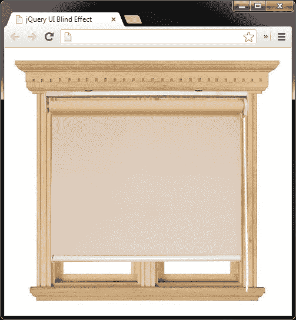

之前的屏幕截图显示了完全打开的百叶窗。

## *刚刚发生了什么？*

我们在外部容器上设置了一个点击处理程序，该处理程序调用内部元素的 `toggle()` 方法。在 CSS 中，我们最初将内部元素设置为隐藏，因此第一次单击容器元素时，内部元素将显示。

## 剪裁效果

`clip` 效果会导致调用它的元素垂直或水平缩小直到消失。

### 语法

```js

$(selector).hide|show|toggle|effect( "clip", [,configuration][,duration] );

```

### 配置选项

使用 `clip` 效果时，我们可以利用的配置选项允许我们控制动画进行的方向以及元素是显示还是隐藏的：

| 选项 | 默认 | 用法 |
| --- | --- | --- |
| `direction` | `"vertical"` | 设置元素动画的轴线方向 |
| `mode` | `"hide"` | 配置元素是隐藏还是显示。其他可能的值是 `show`、`toggle` 和 `effect` |

# 行动时间 - 剪裁元素进入和退出

此效果被称为类似于旧电视机关闭时图片的情景，所以让我们在例子中加以体现。

1.  将以下元素添加到模板文件的 `<body>` 元素中：

    ```js

    <div id="tv">

    <div id="bg"></div>

    <div id="static"></div>

    </div>

    ```

1.  然后，在页面底部使用以下简单的脚本：

    ```js

    $("#tv").click(function() {

    $("#static").effect("clip");

    });

    ```

1.  将此文件保存为 `clip.html`。此示例的样式表如下：

    ```js

    #tv {

    width:300px;

    height:269px;

    position:relative;

    cursor:pointer;

    background:url(../img/tv.png) no-repeat 0 0;

    }

    #bg {

    width:220px;

    height:180px;

    position:absolute;

    left:42px;

    top:30px;

    z-index:-2;

    background-color:#000;

    }

    #static {

    width:216px;

    height:178px;

    position:absolute;

    left:44px;

    top:31px;

    z-index:-1;

    background:url(../img/static.gif) no-repeat 0 0;

    }

    ```

1.  将此文件保存在 `css` 文件夹中为 `clip.css`。

1.  当页面运行时，我们应该能够单击电视的任何位置并看到效果运行：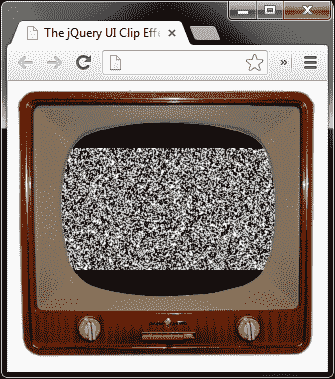

前一个截图显示了静态元素被剪辑的情况。

## *刚刚发生了什么？*

底层页面有一组元素，其中外部容器被样式化为电视，并有两个内部元素，其中一个是简单的背景，位于静态元素的后面。两个内部容器都使用 CSS `z-index` 位于外部容器的后面。

当电视的任何部分被点击时，静态元素会自动应用效果，而无需任何额外的配置，因为效果的默认模式是 `hide`，所以在效果结束时元素会自动隐藏。要看到效果的反向，我们可以默认隐藏静态元素并将模式设置为 `show`，或者我们可以将 `mode` 设置为 `toggle` 并让静态元素交替显示和隐藏。

## 下拉效果

`drop` 效果用于在滑动打开元素时显示元素，或在滑动关闭元素时隐藏元素。该效果同时作用于所应用元素的 `position` 和 `opacity`。

### 语法

```js

$(selector).hide|show|toggle|effect( "drop", [,configuration][,duration] );

```

### 配置选项

`drop` 效果允许我们控制元素下降的方向，以及是否显示或隐藏：

| 选项 | 默认 | 用法 |
| --- | --- | --- |
| `direction` | `"left"` | 设置元素进入或离开页面的方向。另一个选项是字符串 `right` |
| `mode` | `"hide"` | 设置使用 `effect()` 方法时元素是显示还是隐藏的。其他可能的值包括 `show`、`toggle` 和 `effect` |

# 操作时间 - 使用效果

社交网络网站 Twitter 推出了一种新颖的效果，通过在页面顶部显示一个下拉消息来向访问者报告动作。我们可以很容易地使用 `drop` 效果复制这种行为。

1.  将以下标记添加到我们模板页面的 `<body>` 元素中：

    ```js

    <div id="confirmation">

    <p>您的请求已完成！</p>

    </div>

    ```

1.  现在，在页面底部添加以下代码：

    ```js

    $("#confirmation").effect("drop", {

    mode: "show",

    direction: "up"

    }, function() {

        var timer = function() {

        $("#confirmation").effect("drop", { mode: "hide",

        direction: "up"});

        }

    setTimeout(timer, 3000);

    });

    ```

1.  将页面保存为 `drop.html`。对于这个示例，我们只需要一些基本样式。创建以下非常基本的样式表：

    ```js

    body { background-color:#3cf; }

    #confirmation {

    display:none;

    width:100%;

    height:60px;

    position:absolute;

    top:0;

    left:0;

    z-index:999;

    background-color:#fff;

    text-align:center;

    font:normal 18px sans-serif;

    }

    #confirmation p {

    margin:0;

    position:relative;

    top:18px;

    }

    ```

1.  将 CSS 保存为 `drop.css`。

1.  当页面加载时，消息应该在短暂的间隔后显示，然后逐渐消失：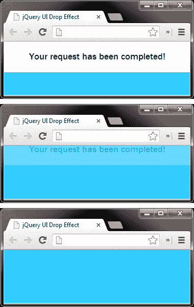

上一张截图显示了消息慢慢被隐藏。当计时器间隔过去后，它会看起来同时向上滑动和淡出。

## *刚刚发生了什么？*

消息本身的底层标记非常简单；我们只需要一个容器和实际的消息。在我们的例子中，消息被硬编码到页面中，但根据报告的动作，我们可以很容易地动态设置它。

CSS 同样简单，为页面提供了一个背景颜色，以更好地突出消息，并为容器和消息本身提供了一些基本样式。最重要的规则（在这个实现中）是容器最初是隐藏的。

我们的脚本在页面加载后立即显示消息，但通常情况下，它会在完成某些系统操作后触发。我们使用`effect()`方法来启动效果，并使用配置对象作为`effect()`方法的第二个参数来配置`mode`为`show`，`direction`为`up`（由于它的绝对定位，元素仍然会向下掉落）。

在传递给`effect`方法的回调函数内部，我们创建了一个存储在`timer`变量中的内联函数。在这个函数内部，我们只是隐藏确认消息，使用`effect()`方法并再次将`mode`配置选项设置为`hide`，将`direction`选项设置为`up`。

在这个函数定义之后，我们使用 JavaScript 的`setTimeout`函数在 3 秒后执行`timer`函数。我们使用一个闭包来调用我们的`timer`函数，以保持当前的最佳实践。

## 爆炸效果

`explode`效果通过将选定的元素炸成指定数量的碎片然后淡出，提供了一个很好的视觉效果。这个效果可以与效果 API 一起使用，也可以与`show`、`hide`或`toggle`逻辑一起使用。

### 语法

```js

$(selector).hide|show|toggle|effect( "explode", [,configuration][,duration] );

```

### 配置选项

当使用`explode`效果时，我们可以控制元素爆炸成多少个碎片，以及元素是显示还是隐藏：

| 选项 | 默认值 | 用法 |
| --- | --- | --- |
| `mode` | `"hide"` | 设置在使用`effect()`方法时元素是显示还是隐藏。其他值是`show`、`effect`和`toggle` |
| `pieces` | `9` | 设置元素爆炸成的碎片数量 |

# 动作时间 - 爆炸元素

在这个例子中，我们将使一个图片爆炸。

1.  只需将以下简单的图片添加到模板文件的`<body>`元素中：

    ```js

    

    ```

1.  在模板文件底部的空函数中添加以下同样简单的代码：

    ```js

    $("img").click(function() {

    $(this).effect("explode");

    });

    ```

1.  将此页面保存为`explode.html`。

1.  这个示例非常简单，我们甚至不需要样式表。一旦我们点击手榴弹，它就会爆炸成默认数量的碎片：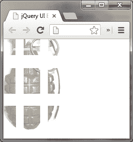

爆炸的元素随着元素的个体移开而逐渐消失。

## *刚刚发生了什么？*

在示例中，我们所需要做的就是直接将点击处理程序附加到图像上，该处理程序使用`effect()`方法应用`explode`效果。在这种情况下，不需要配置，因为效果的默认`mode`是`hide`。

### 注意

请注意，我们还可以通过将`mode`选项设置为`show`或使用`show()`逻辑来以相反的方式运行此效果。在这种情况下，我们将看到目标元素由一系列淡入并飞到一起的碎片构成——一个逆向的爆炸。

## 折叠效果

`fold`效果模拟了沿一条轴折叠一些东西，然后沿另一条轴折叠一半。当然，元素在三维意义上并没有折叠；首先，元素的一侧移动了指定的量，然后另一侧被移进来，元素消失了。

默认情况下，该效果使用`hide`模式，因此在动画结束时会自动隐藏。被折叠的元素不会被缩放；它被剪切，因此在效果运行时图像和文本不会挤在一起。

### 语法

```js

$(selector).hide|show|toggle|effect( "fold", [,configuration][,duration] );

```

### 配置选项

`fold`效果暴露了三个可配置选项，如下表所示：

| 选项 | 默认 | 用法 |
| --- | --- | --- |
| `horizFirst` | `false` | 设置元素首先是否沿水平轴剪切 |
| `mode` | `"hide"` | 设置在使用`effect()`方法时元素是显示还是隐藏。其他值可能包括`show`，`effect`或`toggle` |
| `size` | `15` | 这设置了以像素为单位的第一个折叠的距离，可以是整数，也可以是指定值的字符串，例如百分比 |

# 行动时间-将元素折叠起来

在此示例中，我们将折叠效果应用于一张简单的纸张图片。

1.  我们只需要一张图片；将以下代码添加到模板文件的`<body>`元素中：

    ```js

    

    ```

1.  接下来，像以前的例子一样，在页面底部的空函数中添加以下简单脚本：

    ```js

    $("img").click(function() {

    $(this).effect("fold", { size: "50%" }, 1000);

    });

    ```

1.  将此文件保存为`fold.html`。

1.  这是另一个我们不需要样式表的例子。当点击图像时，它应该折叠起来并消失：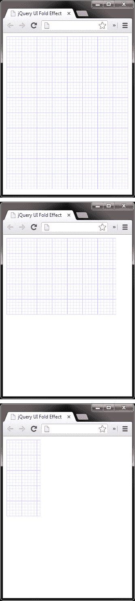

在上一屏幕截图中，我们可以看到图像首先开始，然后是效果隐藏了图像的下半部分，最后，图像的上半部分正在被隐藏。请注意，目标元素被剪裁而不是重新调整大小。

## *刚刚发生了什么？*

我们只是在``元素上设置了一个点击处理程序，将应用`fold`效果。我们将`size`选项指定为`50％`，以便每个轴上的折叠量是相等的，并通过指定比默认持续时间长的`1000`毫秒稍微减慢效果。

## puff 效果

`puff`效果通过指定的数量使应用效果的元素扩展，并淡去到消失，或者淡入然后略微缩小，具体取决于如何使用它。

### 语法

```js

$(selector).hide|show|toggle|effect( "puff", [,configuration][,duration] );

```

### 配置选项

`puff`效果使我们能够控制元素增加的大小，以及它是显示还是隐藏：

| 选项 | 默认 | 用法 |
| --- | --- | --- |
| `mode` | `"hide"` | 设置与`effect()`方法一起使用时元素是显示还是隐藏。其他可能的值包括`show`，`effect`和`toggle` |
| `百分比` | `150` | 设置元素以百分比进行缩放的大小 |

# 时间已到 – 让元素在一瞬间消失

在这个例子中，当单击**确定**或**取消**按钮时，我们将在浏览器窗口的中心显示一个对话框，并对其应用`puff`效果。

1.  在我们的模板文件的`<body>`元素中，添加以下对话框元素：

    ```js

    <div id="confirm">

    

    <p>您确定要这样做吗？</p>

    <button>确定</button><button>取消</button>

    </div>

    ```

1.  在空函数中添加附带的脚本如下：

    ```js

    $("#confirm").css({

    left: $(window).width() / 2 - $("#confirm").width() / 2，

    上：$(window).height() / 2 - $("#confirm").height() / 2

    });

    $("#confirm, button").click(function() {

    $("#confirm").effect("puff");

    });

    ```

1.  将此页面另存为`puff.html`。在文本编辑器中的新文件中为对话框框添加以下样式：

    ```js

    #confirm {

    显示：块；

    宽度：400px;

    高度：120px;

    绝对定位；

    边框：1px 实心#ccc;

    背景：#EEE；

    字体：普通 13 像素无细体；

    }

    #confirm img {

    margin:20px 20px 0 20px;

    浮动到左侧；

    }

    #confirm p { margin:40px 0 0 0; }

    #confirm button {

    宽度：68px;

    边距：20px 10px 0 0；

    右浮动；

    }

    ```

1.  在`css`目录中将此新文件保存为`puff.css`。

1.  在浏览器中运行页面时，我们应该发现对话框最初位于窗口的中心，并且单击`<button>`元素之一会使用`puff`效果关闭它：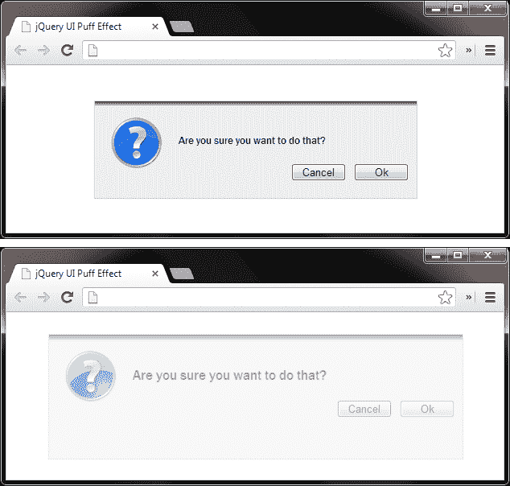

上一个截图显示了对话框扩展时正在消失。

## *刚刚发生了什么？*

我们脚本的第一部分将对话框在窗口中垂直和水平居中。需要注意的一点是，我们不能使用`margin:auto`来居中对话框，因为在应用效果时它会丢失这些边距。

脚本的第二部分只是为每个`<button>`元素添加点击处理程序，在单击它们时应用`puff`效果。

## 滑动效果

`slide`效果与`drop`效果非常相似。唯一的区别是，使用`slide`效果时，目标元素的不透明度根本不会调整。它也与 jQuery 本身提供的滑动效果系列非常相似，尽管使用 jQuery UI 的`slide`效果，我们不限于垂直轴，我们也可以水平滑动。

### 语法

```js

$(selector).hide|show|toggle|effect( "slide", [,configuration][,duration] );

```

### 配置选项

`slide`效果有三个配置选项，让我们可以指定滑动的方向和距离，以及是否显示或隐藏：

| 选项 | 默认 | 用法 |
| --- | --- | --- |
| `direction` | `"left"` | 设置动画进行的方向 |
| `distance` | 目标元素的宽度，包括填充 | 设置目标元素滑动的距离 |
| `mode` | `"show"` | 与`effect()`方法一起使用时设置元素显示或隐藏。其他可接受的值包括`hide`，`effect`和`toggle` |

# 行动时间 - 将元素滑动进出视图

当访客悬停在图像上时显示标题是一种交互式和有趣的方式，可以显示有关图像的其他信息，而不会使设计看起来凌乱。使用`slide`效果，我们可以轻松地动画显示和隐藏标题，这就是我们在这个示例中要做的。

1.  将以下代码添加到模板文件的`<body>`元素中：

    ```js

    <div id="image">

    

    <div>Praying Mantis: Mantis religiosa</div>

    </div>

    ```

1.  然后，在页面底部的空函数中，添加以下短脚本：

    ```js

    $("#image").hover(function() {

    $(this).find("div").stop(true, true).show("slide");

    }, function() {

    $(this).find("div").stop(true, true).hide("slide");

    });

    ```

1.  将此文件保存为`slide.html`。接下来，创建以下样式表：

    ```js

    #image {

    position:relative;

    float:left;

    }

    #image img { margin-bottom:-5px; }

    #image div {

    display:none;

    width:100%;

    padding:10px 0;

    position:absolute;

    left:0;

    bottom:0;

    top:auto!important;

    text-align:center;

    font-style:italic;

    background-color:#000;

    color:#fff;

    }

    ```

1.  将此文件保存为`slide.css`。

1.  当我们查看页面时，应该发现当我们将鼠标移到图像上时立即显示标题，然后在我们将鼠标移出图像时将其移除：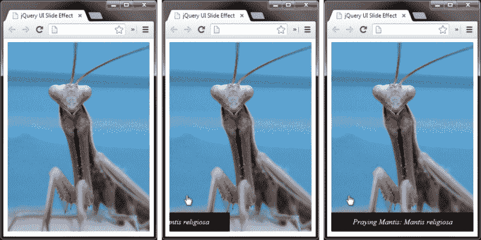

在前面的屏幕截图中，我们看到标题从容器的左边缘滑出。

## *刚刚发生了什么？*

图像和标题都放在一个容器中，以便可以精确定位标题。我们使用 jQuery 的`hover()`方法，它允许我们为`mouseover`和`mouseout`事件附加事件处理程序，通过滑动显示标题，或者通过滑动隐藏标题。

在这个简单的例子中，我们不需要任何额外的配置，但是我们需要有效地管理队列，以防止鼠标重复在图像上移动导致动画的积累，我们使用`stop()`方法来处理这个问题。

## 缩放效果

`scale`效果与我们之前看过的`size`效果非常相似，正如我们看到的那样，几个效果实际上都需要这个效果作为依赖项。这个效果与`size`效果的主要区别在于，使用`scale`时，我们只能指定目标元素应该缩放到的百分比，而不能提供精确的像素大小。

### 语法

```js

$(选择器).hide|show|toggle|effect( "scale", [,配置][,持续时间] );

```

### 配置选项

`scale`效果具有比 jQuery UI 添加的任何其他效果更多的配置选项。

配置选项列在以下表中：

| 选项 | 默认 | 用法 |
| --- | --- | --- |
| `direction` | `"both"` | 设置元素沿着哪个轴缩放。其他选项包括`vertical`和`horizontal` |
| `from` | 无 | 设置元素的起始尺寸 |
| `origin` | `['middle', 'center']` | 设置元素的消失点（如果元素被隐藏），或者从哪里增长（如果元素正在显示） |
| `percent` | `0` | 设置元素增长或缩小的百分比 |
| `scale` | `"both"` | 此选项设置元素的整个`box`（包括边框和填充的 CSS 值）是否缩放，只是`content`，或者像默认值`both`一样 |

# 行动时间——缩放元素

在图片较多的网站上，通常会显示一组缩略图，这些缩略图链接到点击图片后显示的全尺寸图片，可以是内联的模态弹出，也可以是单独的窗口。在本例中，我们将创建一个缩略图，当点击后会缩放为全尺寸版本。

1.  将以下几个元素添加到模板文件的`<body>`元素中：

    ```js

    <div id="container">

    

    </div>

    ```

1.  我们需要的脚本有点长，但还是相当简单的。在页面末尾的空函数中，添加以下代码：

    ```js

    $("img").click(function() {

        var img = $(this);

        if(!img.hasClass("full")) {

        img.addClass("full").effect("scale",

            { 百分比: 400, 缩放: "盒子",

            origin: ['top','left'] });

        } else {

        img.removeClass("full").effect("scale",

            { 百分比: 25, 缩放: "盒子",

            origin: ['top','left'] });

        }

    });

    ```

1.  将页面保存为`scale.html`。在此示例的样式表中，我们需要以下代码：

    ```js

    #container {

        定位:相对;

        float:left;

        光标:指针;

    }

    #container img {

        宽度:150px;

        高度:150px;

    }

    ```

1.  将此文件保存为`scale.css`。

1.  当我们运行页面时，应该发现点击图像会使其放大到其初始大小的 400％：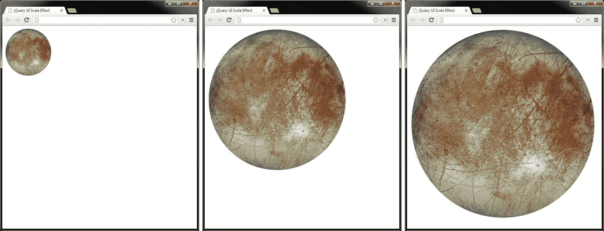

前面的屏幕截图展示了效果的实际操作。再次点击图像将使图像缩放回初始状态。

## *刚才发生了什么？*

在页面上，我们的图像存储在一个简单的`<div>`容器中。使用 CSS 将图像从其原始大小缩小，因此当我们放大图像时，实际上将其恢复到全尺寸，因此看起来不会有块状或模糊。

在脚本中，我们首先在图像上设置一个点击处理程序，然后缓存对其的引用，以便我们不必不断创建指向此的 jQuery 对象。如果图像没有`full`类名，我们知道图像尚未被放大，因此我们添加`full`类并使用`percent`选项将其放大 400％。

图像缩放后，我们创建一个新的锚元素，该元素将附加到容器元素并用作关闭按钮。我们设置链接的内部文本和`href`属性，然后为其分配一个点击处理程序。在此处理程序中，我们阻止浏览器跟随链接，然后再次缓存选择器，这次选择器指向锚点。

然后我们将图像缩小到其大小的四分之一，将其恢复到原始尺寸。完成此操作后，我们将删除关闭链接。

## 突发测试 - 使用显示/隐藏逻辑

Q1\. 支持的参数如何传递给效果？

1.  作为第二个参数的字符串格式，例如，`show("blind", "vertical")`

1.  作为直接传递给`animate()`方法的配置对象中的值，例如，`animate({ effect: "blind", configuration: { direction: "vertical" })`

1.  作为第二个参数传递的配置对象中的值，例如，`show("blind", { direction: "vertical" })`

1.  通过设置`effect.config`全局属性，例如，`$.effect.config = { direction: "vertical" })`

Q2\. 还可以传递什么给该方法？

1.  代表持续时间的整数或字符串，以及回调函数或函数引用

1.  无

1.  一个布尔值，控制动画是否应该无限重复

1.  一个布尔值，指示是否应该排队或并行执行进一步的效果

## 亲自动手 - 尝试使用效果 API

我强烈建议您尝试在本节中查看的效果，以查看哪些效果与`effect()`方法配合使用效果良好，哪些效果最适合使用显示/隐藏逻辑，并且您可以清楚地看到在使用效果不佳时发生了什么。这应该可以提高您快速决定每种方法在何时何地适用的能力。

# 缓动函数

缓动可以与 jQuery UI 的所有效果一起使用，除了`explode`之外，尽管在一些效果中看起来可能有些奇怪，比如`bounce`或`pulsate`。如果 jQuery UI 存在，则还可以使用缓动与标准 jQuery 一起使用。

每种淡入淡出方法都可以通过将参数传递给正在使用的动画方法来设置缓动类型。滑动动画也是相同的，也可以接受缓动类型作为参数。让我们花一点时间了解一下缓动究竟是什么，以及如何将其与 jQuery 动画一起使用。

缓动是一种技术，在动画运行时改变动画的速度和/或方向。缓动可以使动画以缓慢的速度开始并逐渐加速，以快速开始并逐渐减速，并产生一系列其他效果。

jQuery 内置了两种缓动模式：`linear`和`swing`，其中`swing`是所有类型动画的默认模式。有时，使用`linear`缓动可以使连续动画运行更顺畅，但`swing`和`linear`之间的区别微妙至极。

### 注意

可以通过访问以下网址查看所有缓动类型的动画演示：

[`api.jqueryui.com/easings`](http://api.jqueryui.com/easings)。

jQuery UI 插件的缓动类型列在以下表格中：

| `easeInQuad` | `easeOutQuad` | `easeInOutQuad` |
| --- | --- | --- |
| `easeInCubic` | `easeOutCubic` | `easeInOutCubic` |
| `easeInQuart` | `easeOutQuart` | `easeInOutQuart` |
| `easeInQuint` | `easeOutQuint` | `easeInOutQuint` |
| `easeInExpo` | `easeOutExpo` | `easeInOutExpo` |
| `easeInSine` | `easeOutSine` | `easeInOutSine` |
| `easeInCirc` | `easeOutCirc` | `easeInOutCirc` |
| `easeInElastic` | `easeOutElastic` | `easeInOutElastic` |
| `easeInBack` | `easeOutBack` | `easeInOutBack` |
| `easeInBounce` | `easeOutBounce` | `easeInOutBounce` |

# 行动时间-将缓动添加到效果

要使用缓动，我们只需将缓动函数名称作为配置选项包含即可。例如，要为我们之前查看过的`blind.html`示例添加缓动，我们可以更改 JavaScript，使其如下所示：

```js

$("#window").click(function() {

$("#blind").toggle("blind", { easing: "easeOutBounce" });

});

```

## *刚刚发生了什么？*

我们使用配置选项`easing`，将缓动函数的名称作为字符串提供为选项的值。通过引用它们的名称，可以使用任何缓动函数。

# 使用对象字面量添加缓动

我们还可以改变我们传递给预定义动画方法的参数的格式，以便使用缓动。在 jQuery 的 1.4.3 版本之前，使用缓动与动画方法（`fadeIn()`、`slideDown()`等）的默认方法就是这样。

不是提供字符串或数字参数（或回调函数），我们可以提供一个对象文字，其中每个键都是持续时间、缓动类型，并且可选地是完成时要调用的回调。然后使用如下方式：

```js

$(elements).toggle("blind", {

duration: [duration],

easing: [easing],

complete: [callback]

});

```

## 试一试吧——使用缓动

在一些早期示例中尝试一些其他缓动方法。在本书的剩余部分中，我们将在适当的地方使用缓动，但除了简要的解释之外，这些不会受到太多关注。

## 小测验——使用缓动

Q1\. 总共有多少种缓动类型？

1.  20

1.  32

1.  17

1.  48

Q2\. 我们在使用缓动的备用格式时可以传递什么给`effect()`方法？

1.  一个带有可选键的对象，指定持续时间、缓动类型和完成时要调用的函数

1.  一个指定缓动类型的字符串

1.  一个数组，其中第一个项目是持续时间，第二个是缓动类型，第三个是完成时要调用的函数

1.  一个指定缓动持续时间的整数

# 在不同颜色之间进行动画

除了完整的缓动函数范围外，`effects`核心文件还为我们提供了在不同颜色之间吸引人且平滑地进行动画的能力。可以动画化几个 CSS 属性，包括`color`、`background-color`、`border-color`和`outlinecolor`。

jQuery UI 通过扩展 jQuery 的`animate()`方法来实现颜色动画，因此实现它的语法与使用`animate()`相同。对于任何其他目的，我们只需要目标其中一个以上的 CSS 属性，并提供有效的颜色值（十六进制、RGB/RGBa、HSL 等）。让我们看一个基本示例。

# 行动时间——在颜色之间进行动画

在本示例中，我们将使用颜色动画来显示表单字段已被留空。

1.  在模板文件的`<body>`中使用以下元素：

    ```js

    <input><button id="search">搜索</button>

    ```

1.  要在单击`<button>`时调用颜色更改，我们可以在文档底部附近的空函数中使用以下 JavaScript：

    ```js

    $("#search").click(function (e) {

    e.preventDefault();

    var input = $(this).prev();

    if (input.val() == "") {

        input.animate({

        backgroundColor: "#f78080",

        borderColor: "#a72b2e"}, 1200);

    };

    });

    ```

1.  将此页面保存为`color-animations.html`。对于这个示例，我们实际上只需要一些样式。我们可能可以在页面的`<head>`元素中的`<style>`块中定义它们。我们只需使用以下 CSS：

    ```js

    input {

    width:200px;

    border:2px solid #27659f;

    }

    ```

1.  当我们运行页面时，如果在文本字段为空时单击了`<button>`元素，我们会看到文本字段的颜色会更改。

## *刚才发生了什么？*

在此示例中，虽然 CSS 非常小，但是必需的，因为当颜色动画时，`<input>`字段将失去现代浏览器提供的任何吸引人的样式。设置我们正在动画化的 CSS 属性有助于防止这种丑陋的切换。

在脚本中，我们只需缓存一个指向`<input>`字段的选择器，然后测试字段是否为空。如果是，我们调用`animate()`方法，指定我们想要动画化的目标元素的方面。

# 类过渡

除了扩展 jQuery 的`animate()`方法以提供颜色动画外，jQuery UI 还扩展了一些 jQuery 的元素操作方法。以下方法被扩展以提供类过渡：

+   `addClass()`

+   `removeClass()`

+   `toggleClass()`

jQuery UI 还公开了一种用于在两个类之间过渡的新方法：`switchClass()`方法，它接受当前类和新类，以及持续时间、缓动和回调参数。

# 行动时间 - 在类之间过渡

我们可以重新调整以前的示例，以便使用一些类过渡方法。

1.  将类名`default`添加到`<input>`元素中，然后更改 JavaScript，使其如下所示：

    ```js

    $("#search").click(function(e) {

    e.preventDefault();

    var input = $(this).prev();

    if (input.val() == "") {

        input.switchClass("default", "error", 1200);

    } else if (input.val() && input.hasClass("error")) {

        input.removeClass("error", 1200);

    }

    });

    ```

1.  将新页面保存为`class-animation.html`。我们还需要对样式表进行一些更改。创建一个新的样式表，并添加以下规则（或在页面的`<head>`元素中更改样式）：

    ```js

    input { width:200px; }

    input, .default { border:2px solid #27659f; }

    .error {

    border:2px solid #a72b2e;

    背景颜色：#f78080;

    }

    ```

1.  将新文件保存为`class-animation.css`。

1.  在浏览器中运行页面，然后再次点击没有输入任何文本字段的`<button>`元素。`<input>`字段应该过渡到`error`类，并且与上一个示例中的样子相同。然而，这一次，在`<input>`字段中输入一些文本，然后再次点击`<button>`元素。错误应该转换回默认值。

## *刚刚发生了什么？*

这一次，如果`<input>`字段没有值，我们只需调用`switchClass()`方法，指定默认类的当前类，`error`的新类和`1.2`秒的持续时间。请注意，您必须为示例正确运行提供当前类和新类。

在条件的下一个分支中，我们检查`<input>`字段是否具有值和`error`类名。如果是，我们调用`removeClass()`方法，仅指定要删除的类和持续时间。需要持续时间以触发过渡效果。

在 CSS 中，我们使用`default`类名提供默认样式，通常适用于所有`<input>`字段。我们需要这样做，因为否则元素在正在移除`error`类时会丢失其样式，导致其恢复为标准的未样式化的`<input>`字段。

### 注意

*性能*：在使用 jQuery 时，最好是改变元素的类名而不是直接操作元素的`style`属性。因此，自然而然地会认为使用`switchClass()`比使用`animate()`更有效率。

然而，情况并非如此，Firebug 的分析工具会显示出来。在前面的例子中，如果将条件语句的第二个分支移除，并对页面、`color-animation.html`和`class-animation.html`进行分析，结果会显示`color-animation.html`胜出，优势约为 20 毫秒。

## 小测验 - 缓动、颜色和类动画

Q1\. 如何指定缓动函数？

1.  以字符串格式作为`effect()`方法的第三个参数，例如，`effect("blind", {}, "easeOutBounce")`

1.  作为回调函数中的布尔值，例如，`effect("blind", function() { easeOutBounce = true })`

1.  不能使用缓动

1.  以字符串格式作为缓动配置选项的值，例如，`effect("blind", { easing: "easeOutBounce" })`

Q2\. 哪种方法被扩展以产生颜色动画？

1.  `effect()`方法

1.  `show()`方法

1.  `animate()`方法

1.  `switchClass()`方法

# 总结

在本章中，我们研究了 jQuery UI 库添加的完整范围的效果。我们看到了它们如何与`effect()`方法或必要时与`show()`、`hide()`和`toggle()`方法一起使用。我们了解了每个效果所接受的配置参数以及在默认情况下使用时的默认值。

我们还介绍了 jQuery UI 如何扩展`animation()`、`addClass()`和`removeClass()`方法，以及添加的`switchClass()`方法，以便实现在颜色和类之间进行动画处理的能力。

从本章中要记住的要点包括：

+   jQuery UI 与 jQuery 结合可以使用 jQuery UI 下载构建器下载，该构建器会构建一个自定义包，如果需要，还会附带一个主题供您下载。

+   jQuery UI 向我们的动画工具包中添加了共计 14 个新的预定义效果。这些效果易于使用，但高度可配置。

+   `effect()`方法是指定效果、其配置选项、持续时间和回调函数的基本手段。

+   一些效果与`show()`、`hide()`或`toggle()`方法配合使用效果更佳，并且与 API 的这一方面一样容易使用。

+   缓动函数直接内置到 jQuery UI 中，可以通过将它们指定为`easing`配置选项的值来使用。

+   jQuery UI 还通过扩展 jQuery 的一些方法并添加新的 `switchClass()` 方法，为我们提供了过渡元素颜色或类名的能力。

在下一章中，我们将切换回 jQuery，并研究自定义动画，包括自定义过渡、自制幻灯片、元素尺寸动画以及如何创建 jQuery 动画插件。
