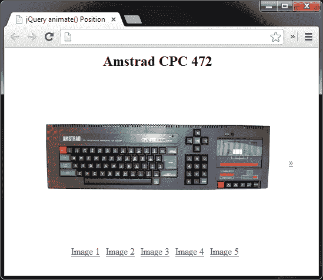
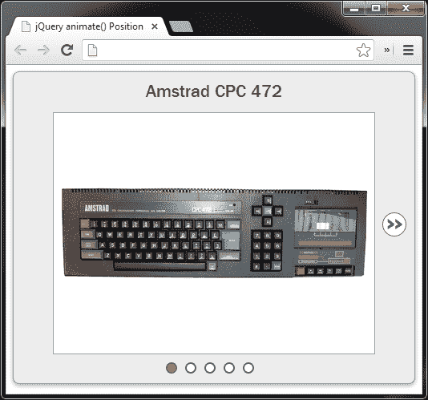
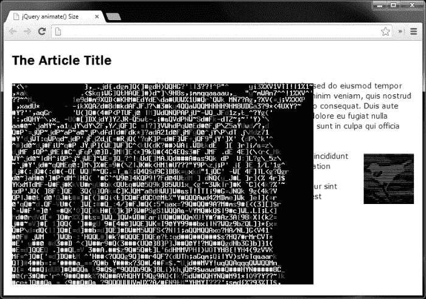
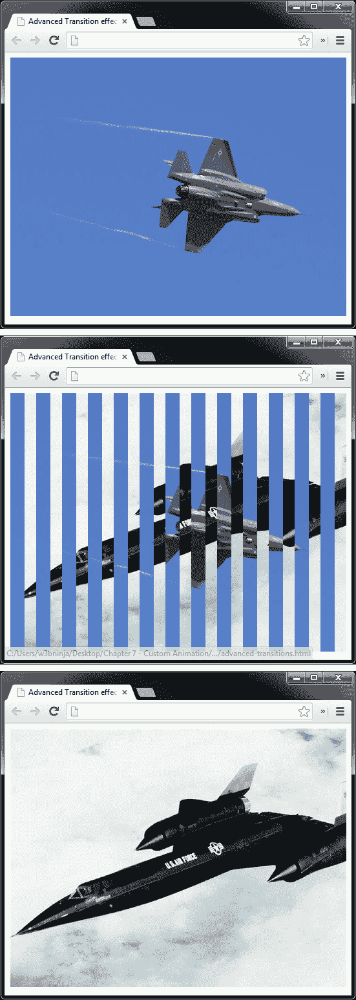
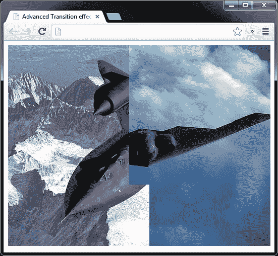

# 第七章：自定义动画

*迄今为止我们已经看过的预定义效果在执行它们的任务时非常出色，但它们只能满足非常具体的需求，有时在需要更复杂的动画时可能会不够用。*

*在这些情况下，我们可以使用 jQuery 的`animate()`方法，它允许我们轻松定义自定义动画，可以像任务所需的那样复杂和专业化。这是我们将在本章中探讨的内容。*

本章我们将涵盖的主题包括：

+   使用`animate()`方法创建自定义动画

+   向方法传递参数

+   动画化元素的尺寸

+   动画化元素的位置

+   创建 jQuery 动画插件

+   使用我们创建的 jQuery 插件

# 动画方法

jQuery 的所有自定义动画都由`animate()`方法驱动。尽管该方法可以动画化几乎任何具有数值的样式属性，但该方法使用简单，只需几个参数。该方法可以如下使用：

```js

$(elements).animate( properties [,duration] [,easing] [,complete] );

```

第一个参数应采用对象的形式，其中对象的每个属性都是我们想要动画的样式，与我们使用 jQuery 的`css()`方法非常相似。

正如我之前提到的，这可以是任何接受纯数值参数的 CSS 样式（颜色除外，尽管使用 jQuery UI 库，我们也可以动画化颜色。有关 jQuery UI 更多信息，请参见第六章，*使用 jQuery UI 进行扩展动画*）。jQuery 无法本机地动画化背景位置，但手动动画化此属性非常容易；有关此技术的更多信息，请参见第三章，*背景动画*。

持续时间、缓动和回调参数的格式与本书中早期的淡入淡出方法使用的格式相同（第二章，*图像动画*），并且使用方式完全相同。

## 逐属性缓动

自 jQuery 版本 1.4 起，您可以在单个`animate()`调用中设置逐属性缓动函数。因此，例如，如果我们正在动画元素的`宽度`和`高度`参数，我们可以对`宽度`动画使用`线性`缓动，对`高度`动画使用`摆动`缓动。这适用于 jQuery 内置的标准缓动函数，或我们在上一章中讨论的任何缓动函数（第六章，*使用 jQuery UI 进行扩展动画*）。

为了在每个属性的基础上为`animate()`方法提供缓动类型，我们需要提供一个数组作为我们正在动画化的属性的值。可以使用以下语法完成此操作：

```js

$(elements).animate({

属性：[值，缓动类型]

});

```

## 一个 animate() 的替代语法

与单独使用持续时间、缓动和回调参数不同，我们可以将以下配置选项的配置对象传递给 `animate()` 方法，而不是单独使用这些参数：

+   `duration`

+   `easing`

+   `complete`

+   `step`

+   `queue`

+   `specialEasing`

前三个选项（`duration`、`easing` 和 `complete`）与以标准方式将它们传递到方法中时的参数相同。然而，最后三个选项（`step`、`queue` 和 `specialEasing`）是有趣的，因为我们没有其他任何方式可以访问它们。

+   `step` 选项允许我们指定一个在动画的每一步上执行的回调函数。

+   `queue` 选项接受一个布尔值，控制动画是立即执行还是放入所选元素的队列中。

+   `specialEasing` 选项允许我们为正在进行动画处理的每个单独样式属性指定一个缓动函数，使用以下替代语法使我们能够基于每个属性进行缓动。

    ```js

    第二种用法的模式如下：$(elements).animate(properties [,configuration]);

    ```

像大多数（但不是全部）jQuery 方法一样，`animate()` 方法返回一个 jQuery 对象，以便可以将其他方法链接到它。像其他效果方法一样，对同一元素多次调用 `animate()` 将导致为该元素创建一个动画队列。如果我们想同时动画两个不同的样式属性，我们可以将所有所需属性都传递给 `animate()` 方法的第一个参数所传递的对象中。

# 动画一个元素的位置

`animate()` 方法能够动画处理对具有数值的任何 CSS 样式属性所做的更改，但颜色和背景位置除外。在此示例中，我们将使用 `animate()` 方法创建一个内容查看器，通过滑动它们的方式将不同的内容面板显示在视图中。

这种类型的小部件通常用于作品集或展示网站，是一种吸引人的方式来显示大量内容，而不会使单个页面混乱不堪。在此示例中，我们将会动画显示元素的位置。

# 行动时间 - 创建一个动画内容查看器

我们将重新开始添加底层标记和样式：

1.  应该使用我们的模板文件将内容查看器的底层标记添加如下：

    ```js

    <div id="slider">

    <div id="viewer">

        

        

        

        

        

    </div>

    <ul id="ui">

        <li class="hidden" id="prev"><a href="" title="Previous">«</a></li>

        <li><a href="#image1" title="Image 1" class="active">图像 1</a></li>

        <li><a href="#image2" title="Image 2">图像 2</a></li>

        <li><a href="#image3" title="Image 3">图像 3</a></li>

        <li><a href="#image4" title="Image 4">图像 4</a></li>

        <li><a href="#image5" title="Image 5">图像 5</a></li>

        <li class="hidden" id="next"><a href="" title="下一页">»</a></li>

    </ul>

    </div>

    ```

1.  将文件保存为 `animate-position.html`。

1.  接下来，我们应该创建基本的 CSS。我指的是我们应该添加的 CSS，这些 CSS 对于内容查看器的正常运行至关重要，而不是给小部件添加主题或皮肤的样式。在创建插件时，将样式分离出来是一个很好的做法，这样小部件就与 jQuery UI 的 ThemeRoller 主题化机制兼容。

1.  在文本编辑器中的新文件中，添加以下代码：

    ```js

    #slider {

    width:500px;

    position:relative;

    }

    #viewer {

    width:400px;

    height:300px;

    margin:auto;

    position:relative;

    overflow:hidden;

    }

    #slider ul {

    width:295px;

    margin:0 auto;

    padding:0;

    list-style-type:none;

    }

    #slider ul:after {

    content:".";

    visibility:hidden;

    display:block;

    height:0;

    clear:both;

    }

    #slider li {

    margin-right:10px;

    float:left;

    }

    #prev, #next {

    position:absolute;

    top:175px;

    }

    #prev { left:20px; }

    #next {

    right:10px;

    }

    .hidden { display:none; }

    #slide {

    width:2000px;

    height:300px;

    position:absolute;

    top:0;

    left:0;

    }

    #slide img { float:left; }

    #title {

    margin:0;

    text-align:center;

    }

    ```

1.  将此文件保存在 `css` 文件夹中，文件名为 `animate-position.css`，并不要忘记从我们页面的 `<head>` 标签中链接到新样式表。现在在浏览器中运行页面，然后再我们进入脚本之前，看一下小部件在没有附带脚本的情况下的行为。您会发现，任何图像都可以通过单击其相应的链接来查看，仅使用 CSS 即可，在任何浏览器中都可以使用。前进和后退箭头会被我们的 CSS 隐藏，因为这些箭头在关闭 JS 时根本不起作用，并且当不显示图像标题时，但是小部件的核心功能仍然完全可访问。这被称为**渐进增强**，被许多人认为是 Web 开发的最佳实践。

## *刚刚发生了什么？*

这个示例中的基本 HTML 构造非常简单。我们有一个用于内容查看器的外部容器，然后在其中，我们有一个用于内容面板（在此示例中是简单的图像）的容器，以及一个导航结构，允许查看不同面板。

我们在 CSS 文件中为一些元素添加了样式规则，这些元素并没有硬编码到基本标记中，但将在需要时根据需要创建。以这种方式做可以确保即使访问者禁用了 JavaScript，内容查看器仍然可用。

一个重要的要点是，我们创建并围绕图片包装的 `#slide` 包装元素具有等于单个图片的 `height` 参数和等于所有图片宽度之和的 `width` 参数。另一方面，`#viewer` 元素具有等于单个图片的 `width` 和 `height` 参数，因此一次只能看到一张图片。

当 JavaScript 被禁用时，图片将看起来像是堆叠在一起，但一旦创建了 `#slide` 包装元素，图片就会被设置为浮动以水平堆叠。

在这个示例中，我们将使用缓动效果；因此，请确保在 `<body>` 标记末尾的 jQuery 引用后直接链接到 jQuery UI：

```js

<script src="img/jquery-ui.js"></script>

```

# 行动时间 – 初始化变量并准备小部件

首先，我们需要准备底层的标记并存储一些元素选择器。在我们新创建的 HTML 文件中的匿名函数之间添加以下代码：

```js

$("#viewer").wrapInner("<div id=\"slide\"></div>");

var container = $("#slider"),

prev = container.find("#prev"),

prevChild = prev.find("a"),

next = container.find("#next").removeClass("hidden"),

nextChild = next.find("a"),

slide = container.find("#slide"),

key = "image1",

details = {

    image1: {

    position: 0, title: slide.children().eq(0).attr("alt")

    },

    image2: {

    position: -400, title: slide.children().eq(1).attr("alt")

    },

    image3: {

    position: -800, title: slide.children().eq(2).attr("alt")

    },

    image4: {

    position: -1200, title: slide.children().eq(3).attr("alt")

    },

    image5: {

    position: -1600, title: slide.children().eq(4).attr("alt")

    }

};

$("<h2>", {

id: "title",

text: details[key].title

}).prependTo("#slider");

```

## *刚刚发生了什么？*

首先，我们将所有图片放在一个新的容器 `#viewer` 中。我们将使用此容器来动画显示面板的移动。我们给这个新容器一个 `id` 属性，这样我们就可以在需要时轻松地从**文档对象模型**（**DOM**）中选择它。

这是我们稍后将要动画显示的元素。

接下来，我们缓存一些经常需要操作的元素的选择器。我们创建一个指向外部 `#slider` 容器的单个 jQuery 对象，然后使用 jQuery 的 `find()` 方法选择我们要缓存的所有元素，如上一页和下一页箭头。

还初始化了一个 `key` 变量，它将用于跟踪当前显示的面板。最后，我们创建了一个 `details` 对象，其中包含内容查看器中每个图像的信息。我们可以存储 `slide` 容器必须以像素为单位进行动画显示任何给定面板的 `left` 位置，并且我们还可以存储每个内容面板的标题。

每个面板的标题是从每个图像的`alt`属性中读取的，但如果我们使用其他元素，我们可以选择`title`属性，或者使用 jQuery 的 data 方法来设置和检索内容的标题。

`<h2>`元素用于标题是通过 JS 创建并插入到内容查看器中的，因为我们没有办法在不使用 JavaScript 的情况下更改它。因此，当访问者禁用 JS 时，标题是无用的，并且最好根本不显示。

在代码的第一部分中，我们做的最后一件事是从下一个按钮中移除`hidden`类名，以便显示它。

前一个链接（我指的是让访问者移动到序列中上一个图像的链接）最初不显示，因为第一个内容面板始终是页面加载时可见的面板，因此没有上一个面板可移动到。

# 行动时间 - 定义一个动画后的回调

接下来，我们需要一个函数，每次动画结束时都可以执行。在我们之前添加的代码下面添加以下代码：

```js

function postAnim(dir) {

var keyMatch = parseInt(key.match(/\d+$/));

(parseInt(slide.css("left")) < 0) ? prev.show() : prev.hide();

(parseInt(slide.css("left")) === -1600) ? next.hide() : next.show();

if (dir) {

    var titleKey = (dir === "back") ? keyMatch - 1 : keyMatch + 1;

    key = "image" + titleKey;

}

container.find("#title").text(details[key].title);

container.find(".active").removeClass("active");

container.find("a[href=#" + key + "]").addClass("active");

};

```

## *刚刚发生了什么？*

在代码的第二部分中，我们定义了一个函数，该函数在动画结束后调用。这用于进行一些可能需要重复执行的各种事务处理；因此，将它们捆绑到单个函数中比在事件处理程序中单独定义它们更有效。这是`postAnim()`函数，它可能接受一个参数，该参数指示滑块移动的方向。

这个函数中我们要做的第一件事是使用 JavaScript 的`match()`函数与正则表达式`/\d+$/`来从保存在`key`变量中的字符串中解析面板编号，我们在代码的第一部分中初始化了`key`变量，它始终指向当前可见的面板。

我们的`postAnim()`函数可能在使用数字链接选择面板时调用，也可能在使用上一个/下一个链接时调用。但是，当使用上一个/下一个链接时，我们需要`key`变量来知道当前显示的是哪个面板，以便移动到下一个或上一个面板。

然后我们检查第一个面板是否当前正在显示，方法是检查`#slide`元素的`left` CSS 样式属性。如果`#slide`元素为`0`，我们知道第一个面板是可见的，所以隐藏上一个链接。如果`left`属性小于`0`，我们显示上一个链接。我们进行类似的测试来检查最后一个面板是否可见，如果是，则隐藏下一个链接。只有当前隐藏的上一个和下一个链接才会显示。

然后我们检查是否已向函数提供了`dir`（方向）参数。如果有，我们必须通过阅读我们之前创建的`keyMatch`变量来确定当前显示的面板是哪个，然后根据`dir`参数是`back`还是`forward`来减去`1`或加上`1`。

结果保存回`key`变量，然后用于更新`<h2>`标题元素。当前面板的标题文本从我们的`details`对象中使用`key`变量获取。最后，我们将`active`类名添加到与可见面板对应的数字链接中。

虽然不是必要的，但在我们添加小部件皮肤时会用到。我们使用属性选择器选择正确的链接，该选择器与当前链接的`href`属性匹配。请注意，在此函数中我们不会创建任何新的 jQuery 对象；我们使用我们缓存的`container`对象和`find()`方法来获取我们需要的元素。

# 行动时间 - 为 UI 元素添加事件处理程序

现在滑块已经创建好了，我们可以添加驱动功能的事件处理程序了。将以下代码插入我们刚刚添加的`postAnim`函数下方：

```js

$("#ui li a").not(prevChild).not(nextChild).click(function(e){

e.preventDefault();

key = $(this).attr("href").split("#")[1];

slide.animate({

    left: details[key].position

}, "slow", "easeOutBack", postAnim);

});

nextChild.add(prevChild).click(function(e){

e.preventDefault();

var arrow = $(this).parent();

if (!slide.is(":animated")) {

    slide.animate({

    left: (arrow.attr("id") === "prev") ? "+=400" : "-=400"

    }, "slow", "easeOutBack", function(){

    (arrow.attr("id") === "prev") ? postAnim("back") : postAnim("forward")

    });

}

});

```

## *刚刚发生了什么？*

第一个处理程序绑定到用于显示不同面板的主链接上，使用 jQuery 的`not()`方法排除了上一个和下一个链接。我们首先使用`preventDefault()`方法停止浏览器跟随链接。

然后，我们从链接的`href`属性中提取面板名称来更新`key`变量。我们使用 JavaScript 的`split()`方法仅获取面板`id`而不是`#`符号。

最后，我们通过将其`left` CSS 样式属性设置为从`details`对象中提取的值来对滑动元素进行动画处理。我们使用`key`变量来访问`position`属性的值。

作为动画的一部分，我们将持续时间配置为 `slow`，将缓动配置为 `easeOutBack`，并将我们的 `postAnim` 函数指定为动画结束时要执行的回调函数。

最后，我们需要为用于导航到下一个或上一个图片的上一个/下一个链接添加点击处理程序。这两个链接可以共享一个单击处理程序。我们可以使用之前缓存的选择器 `nextChild` 和 `prevChild`，以及 jQuery 的 `add()` 方法来选择这两个链接，将它们都添加到一个 jQuery 对象中，以便将处理程序函数附加到这两个链接上。

我们再次使用 `preventDefault()` 阻止浏览器跟随链接。然后，我们使用 `arrow` 变量缓存对已点击链接的父级的引用，以便我们稍后可以轻松地引用它。这是因为在 `animate()` 方法的回调函数中，`$(this)` 关键字的作用域将是 `#slide` 元素，而不是被点击的链接。

然后，我们检查 `#slide` 元素是否正在进行动画处理，使用 `:animated` 过滤器进行检查。此检查很重要，因为它防止了查看器在重复点击其中一个链接时出现错误。

如果尚未进行动画处理，我们执行动画处理并将幻灯片元素向后或向前移动 `400` 像素（单个内容面板的 `width` 参数）。我们可以通过查看 `arrow` 变量引用的元素的 `id` 属性来检查点击了哪个箭头。

我们在动画方法中指定与之前相同的持续时间和缓动值，但是我们不是将 `postAnim` 函数的引用作为回调参数传递，而是传递一个匿名函数。在这个匿名函数中，我们确定点击了哪个链接，然后使用适当的参数调用 `postAnim` 函数。记住，这是必要的，以获取 `details` 对象的正确键，因为上一个链接和下一个链接都没有指向图片的 `href` 属性。

此时在浏览器中尝试页面，你会发现点击任何链接，包括上一个和下一个链接，都可以查看图片。这是小部件在此阶段应该出现的样子：



前一个屏幕截图显示了小部件处于未经过皮肤处理的状态，只有为其功能所需的 JavaScript。

# 为小部件添加皮肤

曾经有人说过，“杀鸡焉用牛刀”，这适用于小部件，也适用于猫。最后，让我们给小部件添加一些自定义样式，看看如何轻松地使小部件既有吸引力，又具有功能性。这些样式可以轻松更改，以重新设计小部件，赋予它完全不同的外观。

# 行动时间——添加新皮肤

在 `animate-position.css` 文件的底部，添加以下代码：

```js

a { outline:0 none; }

#slider {

border:1px solid #999;

-moz-border-radius:8px;

-webkit-border-radius:8px;

border-radius:8px;

background-color:#ededed;

-moz-box-shadow:0 2px 7px #aaa;

-webkit-box-shadow:0 2px 7px #aaa;

box-shadow:0 2px 7px #aaa;

}

#title, #slider ul {

margin-top:10px;

margin-bottom:12px;

}

#title {

font:normal 22px "Nimbus Sans L", "Helvetica Neue",

"Franklin Gothic Medium", Sans-serif;

color:#444;

}

#viewer {

border:1px solid #999;

background-color:#fff;

}

#slider ul { width:120px; }

#slider ul li a {

display:block;

width:10px;

height:10px;

text-indent:-5000px;

text-decoration:none;

border:2px solid #666;

-moz-border-radius:17px;

-webkit-border-radius:17px;

border-radius:17px;

background-color:#fff;

text-align:center;

}

#slider #prev, #slider #next {

margin:0;

text-align:center;

}

#slider #prev { left:10px; }

#slider #prev a, #slider #next a {

display:block;

height:28px;

width:28px;

line-height:22px;

text-indent:0;

border:1px solid #666;

-moz-border-radius:17px;

-webkit-border-radius:17px;

border-radius:17px;

background-color:#fff;

}

#prev a, #next a {

font:bold 40px "Trebuchet MS", sans-serif;

color:#666;

}

#slider ul li a.active { background-color:#F93; }

```

## *刚刚发生了什么？*

使用此代码，我们可以在不干扰任何控制其工作的内容的情况下为部件的所有视觉方面添加样式。我们为它添加了一些漂亮的圆角，并向部件添加了一个阴影，将数字链接变成了可点击的小图标，并为上一个和下一个链接设置了样式。颜色和字体也在此部分设置，因为它们显然也高度依赖于主题。

这些样式为部件添加了基本的中性主题，如下面的屏幕截图所示：



我们用来创建主题的样式是纯粹任意的，仅用于示例目的。它们可以根据需要在任何给定的实现中更改，以适应页面上的其他元素或站点的整体主题。

## 快速测验 - 创建一个动画内容查看器

Q1\. `animate()` 方法可能传递哪些参数？

1.  数组，其中数组项是要进行动画处理的元素、持续时间、缓动以及回调函数

1.  第一个参数是一个包含要进行动画处理的样式属性的对象，可选地跟随着持续时间、缓动类型和回调函数

1.  一个对象，其中每个属性都指向要进行动画的样式属性、持续时间、缓动以及回调函数

1.  必须返回要进行动画处理的样式属性、持续时间、缓动以及回调函数的函数

Q2\. `animate()` 方法返回什么？

1.  包含已进行动画处理的样式属性的数组

1.  已进行动画处理的元素的数组

1.  用于链接目的的 jQuery 对象

1.  一个布尔值，指示动画是否成功完成

## 有一个尝试的英雄 - 使图像查看器更具可伸缩性

在我们的动画内容查看器中，有固定数量的图片和硬编码的导航结构来访问它们。扩展内容查看器，使其能够使用不确定数量的图片。要做到这一点，您需要完成以下任务：

+   在运行时确定内容查看器中的图像数量，并根据图像数量设置`#slide`包装元素的`width`参数

+   根据图像数量动态构建导航链接

+   动态创建`details`对象，根据图像数量设置正确的`left`属性来显示每个图像

# 动画元素大小

就像在本章开头提到的那样，几乎任何包含纯数值的样式属性都可以使用`animate()`方法进行动画处理。

我们先看了如何通过操纵`left`样式属性来动画元素的位置，现在让我们继续看看如何通过操纵`height`和`width`样式属性来动画元素的大小。

在这个例子中，我们将创建图像包装器，可以通过操纵元素的大小来显示页面上任何图像的大尺寸版本。

# 时间行动 - 创建基础页面和基本样式

首先，我们将创建示例运行的基础页面。

1.  将以下 HTML 代码添加到我们模板文件的`<body>`标签中：

    ```js

    <article>

    <h1>文章标题</h1>

    <p>Lorem

        ipsum dolor...</p>

    <p>Lorem

    ipsum dolor...</p>

    </article>

    ```

1.  将示例页面保存为`animate-size.html`。在这个示例中，我们将保持样式轻巧；在您的文本编辑器中的新文件中，添加以下代码：

    ```js

    article {

    display:block;

    width:800px;

    margin:auto;

    z-index:0;

    font:normal 18px "Nimbus Sans L", "Helvetica Neue",

        "Franklin Gothic Medium", sans-serif;

    }

    article p {

    margin:0 0 20px;

    width:800px;

    font:15px Verdana, sans-serif;

    line-height:20px;

    }

    article p #image2-thumb {

    float:right;

    margin:6px 0 0 30px;

    }

    img.expander {

    margin:6px 30px 1px 0;

    float:left;

    }

    .expander-wrapper {

    position:absolute;

    z-index:999;

    }

    .expander-wrapper img {

    cursor:pointer;

    margin:0;

    position:absolute;

    }

    .expander-wrapper .expanded { z-index:9999; }

    ```

1.  将此文件保存为`animate-size.css`放在`css`文件夹中。

## *刚才发生了什么？*

HTML 可以是任何简单的博客文章，由一些文本和几张图片组成。要注意的是，每个图片都被赋予了一个`id`属性，以便可以轻松引用，并且每个图片实际上都是图片的全尺寸版本，通过`width`和`height`属性进行缩放。

所使用的样式纯粹是为了布置示例；实际上，使示例工作的代码很少。`expander-wrapper` 样式是为了正确定位叠加的图片而需要的，除此之外，样式完全是任意的。

我们把第二张图片向右浮动。再次强调，这并不是绝对必要的；仅仅是为了让示例更有趣一点。

# 行动时间 - 定义图片的完整大小和小尺寸

首先，我们需要指定每张图片的完整大小和小尺寸。将下面的代码放入我们刚刚创建的 HTML 文件内的匿名函数中：

```js

var dims = {

image1: {

    small: { width: 150, height: 100 },

    big: { width: 600, height: 400 }

},

image2: {

    小图：{ width: 100, height: 100 }，

    big: { width: 400, height: 400 }

}

},

webkit = ($("body").css("-webkit-appearance") !== "" && $("body").css("-webkit-appearance") !== undefined) ? true : false;

```

## *刚刚发生了什么？*

我们创建了一个包含与每张图片文件名匹配的属性的对象。每个属性中包含另一个嵌套对象，其中包含 `small` 和 `big` 属性以及相关整数作为值。这是一种方便的存储结构化信息的方式，可以很容易地在脚本的不同点访问。

我们还创建了一个名为 `webkit` 的变量。在基于 WebKit 的浏览器中，向右浮动的图片的处理存在轻微错误。这个变量将保存一个布尔值，指示是否使用了 WebKit。

执行了一个测试，尝试读取 `-webkit-appearance` CSS 属性。在 WebKit 浏览器中，测试将返回 `none`，因为该属性未设置，但其他浏览器将返回空字符串或值 `undefined`。

# 行动时间 - 创建叠加图片

接下来，我们应该在页面上创建每张图片的一个几乎完全相同的副本，以用作叠加层。将以下代码添加到我们刚刚添加到 HTML 文件中的代码下方：

```js

$(".expander").each(function(i) {

var expander = $(this)，

    coords = expander.offset()，

    复制 = $("", {

    id: expander.attr("id").split("-")[0],

    src：expander.attr("src")，

    宽度：expander.width()，

    高度：expander.height()

    });

```

## *刚刚发生了什么？*

在这个 `<script>` 标签的一部分，我们选择页面上的每张图片，并使用 jQuery 的 `each()` 方法对它们进行处理。我们设置了一些变量，缓存了对当前图片的引用，并使用 jQuery 的 `offset()` 方法将其相对于文档的坐标存储在页面上。

然后，我们为页面上的每张现有图片创建一个新的图片，为其增加一个 `id` 属性，与它重叠的图片配对，原始图片的 `src` 变量以及原始图片的 `width` 和 `height` 参数。当设置新图片的 `id` 属性时，我们使用 JavaScript 的 `split()` 函数去掉字符串中标有 `thumb` 的部分。

### 注意事项

请注意，上述代码不代表完整的完全功能代码片段。`each()`方法传递给的外部函数尚未关闭，因为我们需要在这些变量之后添加一些额外的代码。

# 行动时间-创建覆盖包装器

现在我们需要为每个覆盖图像创建包装器（请注意，此代码仍在`each()`方法内，因此将为具有`expanded`类名的每个图像执行此代码）。直接在我们刚刚添加的`each`函数的最后一行下面添加以下代码：

```

$("<div></div>", {

    "class": "expander-wrapper",

    css: {

    top: coords.top,

    left: (webkit === true && expander.css("float") === "right") ? (coords.left + expander.width()) : coords.left,direction: (expander.css("float") === "right") ? "rtl" : "ltr"

    },

    html: copy,

    width: expander.width(),

    height: expander.height(),

    click: function() {

    var img = $(this).find("img"),

        id = img.attr("id");

    if (!img.hasClass("expanded")) {

        img.addClass("expanded").animate({

        width: dims[id].big.width,

        height: dims[id].big.height

        }, {

        queue: false

        });

    } else {

        img.animate({

        width: dims[id].small.width,

        height: dims[id].small.height

        }, {

        queue: false,

        complete: function() {

            $(this).removeClass("expanded");

        }

        });

    }

    }

}).appendTo("body");

```

## *刚刚发生了什么?*

在此代码部分中，我们为新图像创建包装器元素。我们给它一个新的类名，以便可以正确定位。

### 提示

**引用类属性**

我们需要在`class`属性名称周围使用引号，因为它是 JavaScript 中的保留字，如果不这样做可能会引发脚本错误。

我们使用`css`属性和从`offset()`方法中获取的坐标来设置包装器元素的位置。

设置包装器元素的`left`位置时，我们需要检查我们的`webkit`变量，以查看是否正在使用 Safari 或 Chrome。如果此变量设置为`true`，并且图像被浮动到右侧，我们将根据原始图像的`width`参数以及`cords.left`值定位覆盖层。如果`webkit`变量为`false`，或者原始图像浮动到`left`，我们只需将包装器的`left`位置设置为存储在`coords.left`中的值。

我们还需要设置任何浮动到右侧的图像的`direction`属性。我们检查`float`样式属性，并设置`direction`为`rtl`如果图像浮动到右侧，或者如果没有，则设置为`ltr`。这是使用 JavaScript，三元条件完成的。

这个检查是为了在图像浮动`right`时，使包装器从右向左扩展。如果我们没有设置这个，包装器将从左向右打开，这可能导致全尺寸图像溢出视口，或者内容容器出现滚动条。

通过将对其的引用传递到 jQuery 的`html()`方法中，我们将新图像添加到包装器中，并将包装器的`width`参数设置为原始（和新）图像的`width`参数。这对于正确定位覆盖在任何向右浮动的图像上是必要的。

接下来，我们向包装器添加一个点击处理程序。在作为`click()`方法值传递的匿名函数内部，我们首先缓存了在包装器中被点击的图像的引用，并为方便起见获取了图像的`id`属性。请记住，覆盖图像的`id`属性将与其覆盖的原始图像相同，减去文本字符串`-thumb`。

然后，我们检查图像是否具有类名`expanded`。如果没有，我们添加类名，然后使用`animate()`方法的第二种格式将图像动画变为其全尺寸。我们将两个对象作为参数传递给该方法；第一个包含我们希望动画的 CSS 属性，在本例中是图像的`width`和`height`参数。

获取要增加图像的正确`width`和`height`参数是使用被点击的图像的`id`属性作为键从`dims`对象中检索的。在传递给`animate()`方法的第二个对象中，我们将`queue`属性设置为`false`。这与直接在`animate()`方法之前使用`stop()`方法具有相同的效果，并确保在重复点击叠加包装器时不会发生任何不好的事情。

如果图像已经具有类名`expanded`，我们将图像动画变回其小尺寸。同样，我们使用`animate()`方法的两个对象格式，将`false`作为`queue`属性的值，并在传递给`complete`属性的匿名回调函数中删除类名`expanded`。创建包装器后，我们将其附加到页面的`<body>`标签。

在这一点上，我们编写的代码将按预期工作 - 单击图像将导致扩展版本动画变为其全尺寸。但是，如果页面被调整大小，叠加将不再覆盖其图像。

# 行动时间 - 维护叠加位置

由于叠加位置是绝对定位的，我们需要防止它们在窗口调整大小时错位：

```js

$(window).resize(function() {

$("div.expander-wrapper").each(function(i) {

    var newCoords = $("#image" + (i + 1) + "-thumb").offset();

    $(this).css({

    top: newCoords.top,

    left: newCoords.left

    });

});

});

```

## *刚刚发生了什么？*

我们所需要做的就是确保叠加图像在页面调整大小时直接位于原始图像的顶部，我们可以通过将调整事件的处理程序绑定到`window`对象来实现。在处理程序函数中，我们只需获取底层图像的新坐标，并相应地设置包装器的`top`和`left`属性。请注意，我们不会对叠加层的重新定位进行动画处理。

保存文件并在浏览器中预览。我们应该发现，我们可以点击任一图像，它都会展开显示图像的全尺寸版本，第一个图像展开到右侧，第二个图像展开到左侧：



在前一个截图中，我们看到第一个图像展开到了它的全尺寸。

## 突击测验——创建展开图像

Q1\. 在这个例子中，我们使用了一个不同的格式来传递给 `animate()` 方法的参数。这些参数采用了什么样的格式？

1.  两个数组，第一个数组包含要动画的元素的选择器，第二个数组包含持续时间、缓动、`specialEasing` 字符串和回调函数

1.  包含要动画的样式属性、持续时间、缓动和 `specialEasing` 字符串，以及 `step` 和 `complete` 回调函数的单个对象

1.  必须返回要动画的样式属性、持续时间和缓动字符串以及回调函数的函数

1.  两个对象，第一个对象包含要动画的样式属性，第二个对象包含持续时间、缓动和 `specialEasing` 字符串，一个布尔值指示是否排队重复调用 `animate()`，以及步进和完成的回调函数

Q2\. 动画的回调函数中的关键字 `this` 被限定在哪个范围？

1.  被动画的元素

1.  当前窗口

1.  被动画的元素的容器

1.  事件对象

## 挑战英雄——消除硬编码的 dims 对象

在前一个例子中，我们在脚本顶部硬编码了一个图像，用于告诉 `animate()` 方法应该将图像动画到什么大小。虽然这在例子中是可以的，但作为长期解决方案，它并不是一个很好的扩展方式，因为我们必须记住每次使用脚本时都要设置它（或者确保我们的图像始终是固定大小的）。

问题在于我们没有办法从单个图像中编程方式获取全尺寸和缩略图尺寸。好消息是，任何可以存储在 JavaScript 对象中的数据也可以作为 JSON 对象传递到网络上供消费。扩展此示例，使页面加载时将页面上图像的 `src` 属性传递到服务器，服务器返回包含小图像和大图像尺寸的 JSON 对象。在这里，图像处理库，如 PHP 的 GD 或 ImageMagick，ImageResizer，或者 .NET 中的 `System.Drawing.Image` 类型，将是你的朋友。

# 创建一个 jQuery 动画插件

插件是将功能打包成易于部署和共享的代码模块的绝佳方式。jQuery 提供了 `fn.extend()` 方法来实现这一目的，使得创建强大而有效的插件变得轻而易举，这些插件可以轻松分发和使用。

创建 jQuery 插件时应遵循一些准则。具体如下：

+   新方法应像其他 jQuery 方法一样调用，例如，`$(elements).newMethod()`，应该附加到 `fn` 对象，而新函数，例如，`$.myFunction()`，应该附加到 `jQuery` 对象

+   当插件被压缩时，新方法和函数应始终以分号（`;`）结尾以保持功能性。

+   在方法内部，`this` 关键字始终指向当前元素的选择，并且方法应始终返回 `this` 以保留链式调用

+   除非使用带有别名 `$` 对象的匿名函数，否则始终将新方法和函数附加到 `jQuery` 对象，而不是 `$` 别名

在本节中，我们将创建一个插件，用于在显示一系列图像时创建高级转换效果。完成的小部件在某些方面类似于我们之前创建的图像查看器，但不会对图像本身进行动画处理。相反，它将在显示它们之间应用转换效果。

# 行动时间 - 创建一个测试页面并添加一些样式

再次，我们将首先创建示例页面和基本样式，然后最后再添加脚本。

1.  此示例的底层 HTML 非常简洁。在模板文件的 `<body>` 标记中，我们只需要以下元素：

    ```js

    <div id="frame">

        

        

        

        

        

    </div>

    ```

1.  将此页面保存为 `advanced-transitions.html`。

1.  像标记一样，我们为插件依赖的 CSS 也应尽可能简洁。幸运的是，我们的小型元素集合所需的 CSS 不多。

1.  将以下代码添加到文本编辑器中的新文件中：

    ```js

    #frame {

    位置：相对;

    宽度：520 像素;

    高度：400 像素;

    层级：0;

    }

    #frame img {

    位置：绝对;

    顶部：0;

    左：0;

    层级：1;

    }

    #frame img.visible { 层级：2; }

    #frame a {

    显示：块;

    宽度：50%;

    高度：100%;

    位置：绝对;

    顶部：0;

    层级：10;

    颜色：透明;

    背景图片：url(transparent.gif);

    滤镜：alpha(opacity = 0);

    文本对齐：居中;

    文本装饰：无;

    字体：90 像素 "Palatino Linotype"，"Book Antiqua"，

        帕拉蒂诺，衬线;

    行高：400%;

    }

    #frame a:hover {

    颜色：#fff;

    文本阴影：0 0 5 像素 #000;

    滤镜：alpha(opacity=100);

    滤镜：阴影（颜色=#000，方向=0）;

    }

    #frame a:focus { 轮廓：无; }

    #prev { 左：0; }

    #next { 右：0; }

    #overlay {

    宽度：100%;

    高度：100%;

    位置：绝对;

    左：0;

    顶部：0;

    层级：3;

    }

    #overlay div { 位置：绝对; }

    ```

1.  将其保存在 `css` 文件夹中，命名为 `advanced-transitions.css`。

## *刚发生了什么？*

我们在基础页面上唯一拥有的就是我们希望在容器内进行转换的图像。最好尽可能简化插件的标记要求，以便其他人可以轻松使用，并且不会对他们想要使用的元素或结构施加不必要的限制。

图像在容器内通过 CSS 绝对定位，使它们彼此叠加，并且我们在第一个元素上设置了`visible`类，以确保其中一个图像位于堆栈的顶部。

大多数样式都用于上一个和下一个锚点，我们将使用插件创建这些锚点。这些被设置为每个锚点将占据容器的一半，并且被定位为并排显示。我们设置这些链接的`z-index`属性，使它们显示在所有图像的上方。`font-size`属性被大幅提高，过多的`line-height`意味着我们不需要使用`padding`来使文本居中。

在大多数浏览器中，我们只需将锚点的`color`属性设置为`transparent`，即可隐藏它们。然后，我们在`hover`状态下将`color`属性设置为白色。然而，在 IE 中，这种方法效果不佳，因此我们最初将链接设置为透明，并使用 Microsoft 的`opacity` `filter`，然后在`hover`状态下将其设置为完全不透明，其目的相同。

### 注意

**另一个针对 IE 的修复**

IE 也给我们带来了另一个问题：由于链接的绝对定位，其可点击区域仅会延伸到其中的文本高度。我们可以通过设置背景图像的引用来克服这一问题。

最好的部分是即使图像不存在也可以使修复工作（因此您在书籍的附带代码包中找不到对应的`transparent.gif`文件）。该修复对于正常浏览器没有不利影响。

# 创建插件

现在，让我们创建插件本身。与我们看过的大多数其他示例代码不同，我们插件的代码将放入自己的单独文件中。

# 行动时间 – 添加许可证和定义可配置选项

在新文件中，创建插件的以下外部结构，并将其保存在名为`jquery.tranzify.js`的`js`文件夹中：

```js

/*

插件名称 jQuery 插件版本 1.0

版权所有（c）日期版权所有者

许可证

*/

;(function($) {

$.tranzify = {

    defaults: {

    transitionWidth: 40,

    transitionHeight: "100%",

    containerID: "overlay",

    transitionType: "venetian",

    prevID: "prev",

    nextID: "next",

    visibleClass: "visible"

    }

};

})(jQuery);

```

## *刚刚发生了什么？*

所有插件都应包含插件名称、版本号、版权所有者（通常为代码的作者）以及发布的许可证或许可证链接的条款信息。

插件被封装在一个匿名函数中，以便其变量受到在其部署的页面上可能正在使用的其他代码的保护。它还在其前面放置了一个分号，以确保在潜在的缩小之后它仍然保持为一个离散的代码块，并且以防它与比我们自己不那么严谨的其他代码一起使用。

我们还将`$`字符别名为安全地在我们的函数中使用，以确保它不会被页面上运行的任何其他库劫持，并保留 jQuery 的`noConflict()`方法的功能。

将插件尽可能地可配置是一个好习惯，以便最终用户可以根据自己的需求进行调整。为了方便起见，我们应该为任何可配置选项提供一组默认值。在决定将什么内容设为可配置时，一个好的经验法则是将除了纯逻辑之外的所有内容都硬编码到插件中。因此，ID、类名之类的东西应该可配置。

我们为插件设置的默认值存储在一个对象中，该对象本身作为传递给函数的`jQuery`对象的属性存储。添加到`jQuery`对象的属性称为`tranzify`，这是我们插件的名称，并将用于存储我们创建的属性、函数和方法，以便我们所有的代码都在一个单一的命名空间中。

我们的默认属性包含在一个名为`defaults`的单独对象中，该对象位于`tranzify`对象内部。我们设置了过渡元素的`width`和`height`参数，创建的容器的`id`属性，默认过渡效果，上一个和下一个链接的`id`属性，以及我们给当前显示的图像的类名。

正如我提到的，如果可能的话最好不要将任何`id`值或类名硬编码到插件中。实施插件的人可能已经在页面上有一个`id`属性为`overlay`的元素，因此我们应该给他们更改的选项。

# 行动时间 - 将我们的插件方法添加到 jQuery 命名空间

接下来，我们可以添加代码，将我们的插件插入到 jQuery 命名空间中，以便像其他 jQuery 方法一样调用它。在我们刚刚添加的代码的最后一行之上直接添加以下代码：

```js

$.fn.extend({

tranzify: function(userConfig) {

    var config = (userConfig) ? $.extend({}, $.tranzify.defaults, userConfig) : $.tranzify.defaults;

    config.selector = "#" + this.attr("id");

    config.multi = parseInt(this.width()) / config.transitionWidth;

    $.tranzify.createUI(config);

    return this;

}

});

```

## *刚刚发生了什么？*

jQuery 专门提供了`fn.extend()`方法来添加可以链接到`jQuery()`函数的新方法，这是大多数插件创建的方式。我们将一个函数定义为传递给`extend()`方法的对象的唯一属性的值。我们还指定该方法可能会接受一个参数，这个参数可能是由使用插件的人传递给方法的配置对象，以改变我们设置的默认属性。

我们的方法首先要做的是检查是否有配置对象传入方法中。如果有，我们使用`extend()`方法（不过这里不是`fn.extend()`）来将用户的配置对象与我们自己的`defaults`对象合并。

通过合并这两个对象创建的结果对象，存储在变量`config`中，以方便我们的函数访问。在`userConfig`对象中找到的任何属性将覆盖存储在`defaults`对象中的属性。在`defaults`对象中找到但在`userConfig`对象中找不到的属性将被保留。如果未传递`userConfig`对象到方法中，我们简单地将`defaults`对象赋值给`config`变量。

接下来，我们建立了一个`id`选择器，用来匹配被调用的方法的元素，并将其作为额外的属性添加到`config`对象中，这样在整个插件中使用起来更加方便。我们不能将这个作为默认属性存储，因为它很可能在插件使用的每个页面上都是不同的，而且我们也不能期望插件的用户每次使用插件时都要在配置对象中定义这个。

我们需要创建的过渡元素的数量将取决于图像的大小和过渡元素的宽度（定义为可配置属性），因此我们根据图像的宽度计算出一个快速乘数，然后配置过渡宽度以便稍后使用。

接着，我们调用将创建前/后链接的函数（我们将很快定义它），并传递函数，`config`对象，以便它可以读取用户配置的任何属性。

最后，我们返回 jQuery 对象（它会自动分配给插件方法内的`this`关键字的值）。这是为了保留链接，以便用户在调用我们的插件后可以调用其他 jQuery 方法。

# 行动时间–创建 UI

接下来，我们需要创建在图像上方叠加的前一个和后一个链接，让访问者可以浏览图像。在刚刚添加的`$.fn.extend()`部分下面，添加以下代码块：

```js

$.tranzify.createUI = function(config) {

var imgLength = $(config.selector).find("img").length,

    prevA = $("<a></a>", {

    id: config.prevID,

    href: "#",

    html: "«",

    click: function(e) {

    e.preventDefault();

    $(config.selector).find("a").css("display", "none");

    $.tranzify.createOverlay(config);

    var currImg = $("." + config.visibleClass, $(config.selector));

    if(currImg.prev().filter("img").length > 0) {

        currImg.removeClass(config.visibleClass).prev().addClass(config.visibleClass);

    } else {

        currImg.removeClass(config.visibleClass);

        $(config.selector).find("img").eq(imgLength - 1).addClass(config.visibleClass);

    }

    $.tranzify.runTransition(config);

    }

}).appendTo(config.selector),

nextA = $("<a></a>", {

    id: config.nextID,

    href: "#",

    html: "»",

    click: function(e) {

    e.preventDefault();

    $(config.selector).find("a").css("display", "none");

    $.tranzify.createOverlay(config);

    var currImg = $("." + config.visibleClass, $(config.selector));

    if(currImg.next().filter("img").length > 0) {

        currImg.removeClass(config.visibleClass).next().addClass(config.visibleClass);

    } else {

        currImg.removeClass(config.visibleClass);

        $(config.selector).find("img").eq(0).addClass(config.visibleClass);

    }

    $.tranzify.runTransition(config);

    }

}).appendTo(config.selector);

};

```

## *刚刚发生了什么？*

这是到目前为止我们的最大函数，处理创建前后链接以及在创建时使用 jQuery 语法定义它们的点击处理程序。我们要做的第一件事是获得容器中的图像数量，因为我们添加的点击处理程序需要知道这一点。

我们为上一个链接创建了锚点，并在作为第二个参数传递的对象中定义了`id`属性（使用来自`config`对象的值）、一个虚拟的`href`、一个 HTML 实体作为其`innerHTML`以及一个点击处理程序。

在点击处理程序中，我们使用`preventDefault()`方法阻止浏览器跟随链接，然后隐藏上一个和下一个链接，以保护小部件免受多次点击的影响，因为这会破坏过渡效果。

接下来，我们调用我们的`createOverlay()`函数，传递`config`对象，以创建叠加容器和过渡元素。我们还使用存储在`config`对象中的类名缓存对当前选择的图像的引用。

然后我们测试是否有另一个图像元素位于可见图像之前。如果有，我们从当前具有该类的元素中删除该类，并将其给予前一个图像，以将其移到堆栈顶部。如果在当前图像之前没有更多图像，则从当前图像中删除`visible`类，并移至容器中的最后一个图像以显示该图像。

一旦我们定义了所需的一切，我们就可以将新的锚点附加到指定的容器中。我们还在当前函数内创建了下一个链接，给它一个非常相似的一组属性和一个点击处理程序。在这个点击处理程序中唯一不同的是，我们测试当前图像后面是否有图像，并且如果没有图像，则移动到容器中的第一个图像。

# 行动时间 - 创建过渡覆盖

我们的下一个函数将处理创建叠加层和过渡元素：

```js

$.tranzify.createOverlay = function(config) {

var posLeftMarker = 0,

    bgHorizMarker = 0

overlay = $("<div></div>", {

    id: config.containerID

});

for (var x = 0; x < config.multi; x++) {

    $("<div></div>", {

    width: config.transitionWidth,

    height: config.transitionHeight,

    css: {

        backgroundImage: "url(" + $("." + config.visibleClass, $(config.selector)).attr("src") + ")",

        backgroundPosition: bgHorizMarker + "px 0",

        left: posLeftMarker,

        top: 0

    }

    }).appendTo(overlay);

    bgHorizMarker -=config.transitionWidth;

    posLeftMarker +=config.transitionWidth;

}

overlay.insertBefore("#" + config.prevID);

};

```

## *刚刚发生了什么？*

我们之前的函数处理了创建遮罩容器和将提供过渡动画的过渡元素。插件将需要分别设置每个过渡元素的 `position` 和 `background-position` 属性，以便水平堆叠元素。我们将需要一些计数器变量来实现这一点，因此我们在函数开始时对它们进行初始化。

然后，我们创建了遮罩容器 `<div>`，并且只给它设置了一个 `id` 属性，以便我们在运行过渡时可以轻松选择它。

接下来，我们创建过渡元素。为此，我们使用标准的 JavaScript `for` 循环，根据脚本中之前设置的乘数执行若干次。在循环的每次迭代中，我们创建一个新的 `<div>`，根据存储在配置对象中的属性设置其 `width` 和 `height` 参数。

我们使用 `css()` 方法将遮罩的 `backgroundImage` 属性设置为当前可见图像，并根据当前的 `bgHorizMarker` 计数器变量的值设置 `backgroundPosition` 属性。我们还设置 `left` 属性以正确地根据 `posLeftMarker` 变量定位新元素，并将 `top` 属性设置为 `0` 以确保正确的定位。

创建完成后，我们将新元素附加到容器并增加计数器变量。一旦循环退出，并且我们已经创建并附加了所有过渡元素到容器中，我们就可以将容器附加到页面上调用该方法的元素上。

# 行动时间 - 定义过渡

最终的函数将执行实际的过渡：

```js

$.tranzify.runTransition = function(config) {

var transOverlay = $("#" + config.containerID),

    transEls = transOverlay.children(),

    len = transEls.length - 1;

    switch(config.transitionType) {

    case "venetian":

    transEls.each(function(i) {

        transEls.eq(i).animate({

        width: 0

        }, "slow", function() {

        if (i === len) {

            transOverlay.remove();

            $(config.selector).find("a").css("display", "block");

        }

        });

    });

    break;

    case "strip":

    var counter = 0;

    function strip() {

    transEls.eq(counter).animate({

        height: 0

    }, 150, function() {

        if (counter === len) {

        transOverlay.remove();

        $(config.selector).find("a").css("display", "block");

        } else {

        counter++;

        strip();

        }

    });

    }

    strip();

}

};

```

## *刚刚发生了什么？*

我们的最后一个函数处理实际运行的过渡。 在这个例子中，只有两种不同类型的过渡，但我们可以很容易地扩展它以添加更多的过渡效果。

这个函数还需要一些变量，所以我们在函数的开头设置这些变量以供以后使用。 我们缓存对覆盖容器的引用，因为我们将多次引用它。 我们还存储了过渡元素的集合和过渡元素的数量。 我们从子项的数量中减去`1`，因为这个数字将与 jQuery 的`eq()`方法一起使用，该方法是基于零的。

为了确定我们要运行哪个过渡，我们使用 JavaScript 的`switch`语句并检查`config.transitionType`属性的值。 第一个过渡是一种**威尼斯百叶窗**效果。 要运行此过渡，我们只需使用 jQuery 的`each()`方法将每个元素的`width`参数动画化为`0`。 我们指定为此方法的参数的函数自动接收当前元素的索引，我们使用`i`来访问它。

对于每个动画的回调函数，我们检查`i`是否等于过渡元素的`length`，如果是，则移除覆盖层并再次显示上一个和下一个链接。

第二个过渡一次一个条带地移除旧图像。 为此，我们使用一个简单的`counter`变量和一个标准的 JavaScript 函数。 这次我们不能使用`each()`方法，否则所有的过渡元素将同时下滑，但我们希望每个元素都自己下滑。

在函数内部，我们将当前过渡元素的高度动画化为`0`，并设置一个相当低的持续时间，以便它发生得相当快。 如果动画太慢，它会破坏效果。 在回调函数中，我们检查我们的`counter`变量是否等于过渡元素的数量，如果是，则移除覆盖层并再次显示链接。 如果此时`counter`变量尚未达到最后一个元素，则递增`counter`变量并再次调用该函数。

将此文件保存为`jquery.tranzify.js`，并将其放在`js`文件夹中。 这是 jQuery 插件的标准命名约定，应遵循。

# 使用插件

要使用该插件，我们只需像调用任何其他 jQuery 方法一样调用它，在我们的 ready 函数或匿名函数内部，如下所示：

```js

<script>

$(function() {

    $("#frame").tranzify();

});

</script>

```

在这种形式下，将使用默认属性。 如果我们想要更改其中一个属性，我们只需提供一个配置对象，例如：

```js

$("#frame").tranzify({

transitionType: "strip"

});

```

默认动画应该运行如下：



在上一张截图中，我们看到过渡元素同时缩小到`0` `width`，产生了一种威尼斯百叶窗被打开以显示新图像的效果。

使用这个插件很简单；只需要记住一点。所有图像的大小都应该相同，并且每个图像的`width`参数都应该能够被`transitionWidth`属性完整地除尽。由于我们已经将`transitionWidth`属性公开为可配置属性，我们应该能够使用任何大小的图像，并相应地进行设置。

供参考，第二个过渡效果是这样运行的，旧图像的条纹滑开以显示新图像：



在前面的截图中，我们可以看到第二种过渡类型的效果，旧图像被剥去以显示新图像。

## 爆笑测验 - 创建插件

Q1\.插件方法和函数有什么区别？

1.  在概念上和实践上，它们是一样的，没有区别

1.  方法可以接受参数，而函数不行

1.  方法执行更快

1.  方法附加到`fn`对象上，并像现有的 jQuery 方法一样使用，而函数直接附加到 jQuery 对象上，并像任何普通函数一样调用

Q2\.每个新方法必须返回什么？

1.  包含所选元素的`id`属性的字符串

1.  包含所选元素的`id`属性的数组

1.  `this`对象指向当前选择的元素

1.  什么都不应该被返回

## 有一个尝试英雄 - 扩展插件

我们的插件目前只包含了两种过渡效果（百叶窗和条纹）。扩展插件以包括自己设计的更多过渡效果。插件目前创建了一些与每个图像高度相同的过渡元素。

通过将现有的`for`循环包裹在另一个`for`循环中，并添加一些新的计数变量来控制`top`位置和垂直`background-position`，可以比较容易地以棋盘风格添加正方形过渡元素，这样就可以实现更复杂和更有吸引力的过渡效果。做到这一点。

# 总结

在本章中，我们看了一些`animate()`方法的常见用法，这是我们在 jQuery 中创建自定义动画的手段，当内置效果不能满足我们的要求时。这个方法强大、易于使用，并使复杂的动画变得轻而易举。

当简单的滑动或淡出不能满足我们的要求时，我们可以退而使用`animate()`方法来制作我们自己的高质量自定义动画。我们学到了关于`animate()`方法的以下要点：

+   `animate()`方法可用于动画化任何数字类型的 CSS 属性（除了颜色，需要使用 jQuery UI）。

+   传递到方法中的参数可以采用两种格式之一。第一种允许我们传递一个包含要执行动画的 CSS 属性的对象，以及单独的持续时间、缓动和回调参数。第二种格式允许我们传递两个对象，第一个对象允许我们像以前一样指定要执行动画的 CSS 属性，而第二个对象允许我们指定附加选项，比如持续时间、缓动和回调。第二种选项让我们可以访问一些在第一种格式中无法访问的特殊参数，比如`specialEasing`和`step`回调。

+   所有在第一个对象中指定的 CSS 属性将同时执行。

+   如何实现涉及元素位置或其尺寸的动画。

我们还研究了如何通过插件形式扩展 jQuery 库的全新功能和方法。插件是将代码封装起来以便轻松部署和共享的绝佳方式。

现在我们已经看过了所有 jQuery 的动画方法，在下一章中，我们将看看其他流行的动画，比如添加鼠标和键盘事件以及动画化帖子链接。
