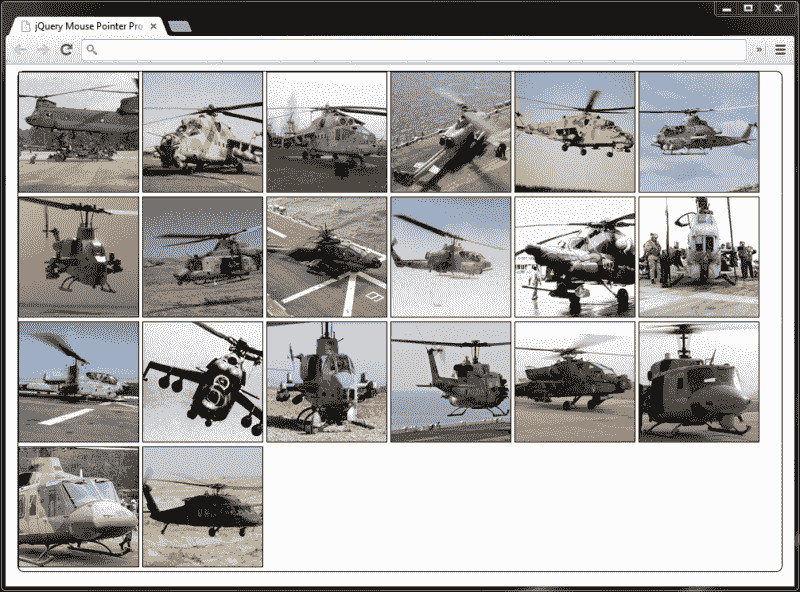
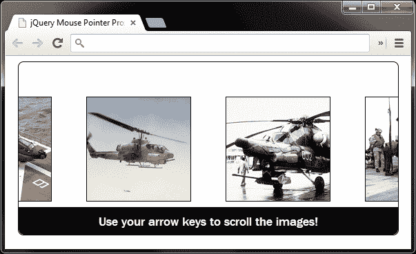
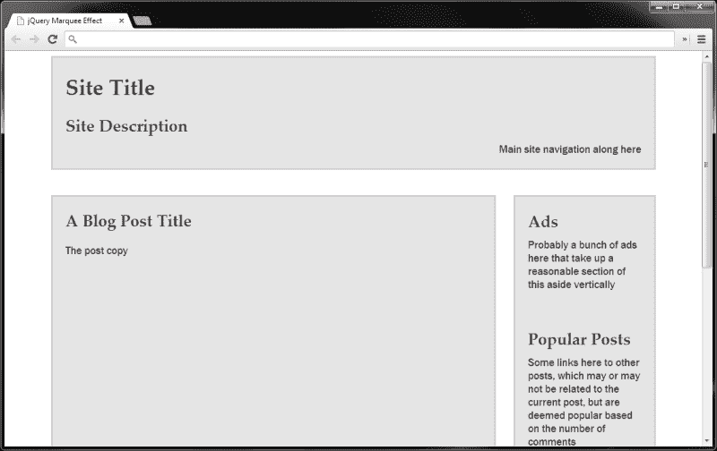
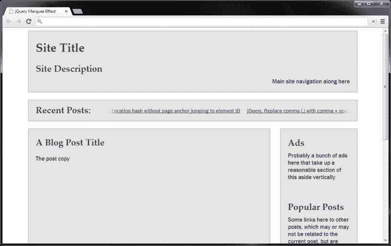

# 第八章：其他热门动画

*此章将遵循与上一章类似的格式，并由一系列示例式的示例组成，展示动画在实际操作中的实现。我们不会约束自己—一切皆有可能！*

我们将在本章中查看以下示例：

+   接近动画，其中动画是对鼠标指针接近目标元素或页面区域的反应

+   一个动画的页眉元素

+   文本滚动的跑马灯组件

# 理解近性动画

常按近性动画，这通常由鼠标指针相对于页面上一个元素或一系列元素的位置驱动，是一种令人敬畏的效果。虽然并非适用于所有网站和所有环境，但在特定情况下使用时，它可以增加真正的魅力。

这种效果通常并不非常实用，并且基本上关闭了非鼠标用户的大门，但它可以作为额外的奖励（通常称为渐进增强）实施给能够利用它的访客，同时提供其他更可访问的交互形式。

在本示例中，我们将创建一个图像滚动器，当鼠标指针进入其容器时将触发。图像滚动的速度将由鼠标指针与容器中心的距离决定。移动指针将相应地减慢或加快动画速度。

# 行动时间—创建和样式化页面

在本示例的这一部分中，我们将创建动画将在其上运行的基础页面，并添加样式。

1.  首先，我们将创建默认页面，并添加示例的 CSS。将以下元素添加到模板文件的`<body>`元素中：

    ```js

    <div id="proximity">

    

    

    

    

    

    

    

    

    

    

    

    

    

    

    

    

    

    

    

    

    </div>

    ```

1.  将此文件另存为`proximity.html`。接下来，我们将添加一些 CSS。在新文件中，添加以下代码：

    ```js

    /* 基础类（已禁用脚本） */

    #proximity {

    width:960px;

    margin:auto;

    border:1px solid #000;

    -moz-border-radius:8px;

    -webkit-border-radius:8px;

    border-radius:8px;

    }

    #proximity img { border:1px solid #000; }

    /* scripting enabled classes */

    #proximity.slider {

    width:550px;

    height:250px;

    position:relative;

    overflow:hidden;

    }

    .slider #scroller {

    position:absolute;

    left:0;

    top:0;

    }

    .slider #scroller img:

    display:block;

    width:150px;

    height:150px;

    margin:50px 0 0 50px;

    float:left;

    color:#fff;

    background-color:#000;

    }

    .slider #scroller img:first-child { margin-left:0; }

    #message {

    width:100%;

    height:30px;

    padding-top:10px;

    margin:0;

    -moz-border-radius:0 0 8px 8px;

    -webkit-border-bottom-radius:8px;

    -webkit-border-bottom-right-radius:8px;

    border-radius:0 0 8px 8px;

    position:absolute;

    bottom:0;

    left:0;

    background-color:#000;

    color:#fff;

    text-align:center;

    font:18px "Nimbus Sans L", "Helvetica Neue",

        "Franklin Gothic Medium", Sans-serif;

    }

    ```

1.  将其保存在`css`文件夹中，命名为`proximity.css`，并不要忘记从 HTML 页面的`<head>`中链接到它。

## *刚才发生了什么？*

保持 HTML 尽可能简单和轻便，我们只需将要显示的图像添加到一个容器元素中。我们需要的任何额外元素都可以以渐进增强的方式动态添加。

CSS 文件中有两个部分。第一部分是基本样式的集合，如果页面由禁用 JavaScript 的访问者加载，则使用这些样式。这确保所有图像都是可见的，因此可访问 - 没有隐藏或其他遮挡。

第二部分改变了容器元素的外观，并为动态添加的元素或类添加了样式，以改变滑块的外观，前提是启用了 JavaScript。

我们设置容器的`height`和`width`，以便任何时候只有三个图像可见，并将其`overflow`样式属性设置为`hidden`，以便所有其他图像都被隐藏，准备滚动到视图中。

我们还为具有`id`为`scroller`的元素添加了定位。此元素尚不存在，将由稍后查看的脚本添加。此元素还需要一个`width`，但我们可以根据容器中的图像数量动态分配。

我们还改变了图像本身的样式，将它们设置为块级元素，并将它们向左浮动，以便它们在一行中水平堆叠，而不会换行到两行，因为这样会破坏滚动条的功能。浮动图像并设置容器的`width`，允许它们按水平方向堆叠。我们将添加一个告诉访客如何使用滚动条的消息，因此我们还包括了一些用于此目的的样式。

以下截图显示了页面在禁用脚本时的外观：



在前面的图像中，我们可以看到所有图像都是可见的。这不太好看，但非常易于访问，并且在客户端禁用脚本时不会隐藏内容。

# 开始行动-为滑动功能准备页面

当脚本启用时，我们可以增强页面以添加近距离滑块所需的附加元素。将以下代码添加到 HTML 页面底部的空函数中：

```js

var prox = $("#proximity"),

scroller = $("<div></div>", {

    id: "scroller"

}),

pointerText = "使用指针滚动，移动到"+

    "边缘滚动更快！",

keyboardMessage = "使用箭头键滚动图像！",

message = $("<p></p>", {

    id: "message",

    text: keyboardMessage

});

prox.addClass("slider").wrapInner(scroller).append(message);

var middle = prox.width() / 2;

scroller = $("#scroller");

scroller.width(function() {

var total = 0;

scroller.children().each(function(i, val) {

    var el = $(this);

    total = total + (el.outerWidth() + parseInt(el.css("marginLeft")));

});

return total;

}).css("left", "-" + (scroller.width() / 2 - middle) + "px");

```

## *刚刚发生了什么？*

首先，我们缓存了近距离容器的选择器，在这段代码中我们会使用几次，在脚本稍后的地方还会使用几次。接下来，我们创建一个新的 `<div>` 元素，并给它一个 `id` 属性，这样我们在需要时可以轻松地再次选择它。我们还使用这个 `id` 进行样式处理。

接下来，我们为了方便起见，将一些文本字符串存储在变量中。这些将用作在不同点显示给访问者的消息。我们还创建一个新的段落元素作为消息文本的容器，为元素设置一个 ID（再次是为了选择的目的），并使用 jQuery 的`text()`方法设置其`innerText`为其中一个文本字符串。然后，我们在传递给元素创建 jQuery 方法格式的第二个参数的对象上使用`text`属性，它会自动映射到`text()`方法。

接下来，我们向外部近距离容器添加一个类名。请记住，这个类名用于区分脚本启用和禁用，以便我们可以添加所需的样式。我们还将近距离容器的内容（20 个 `` 标签）包装在我们新创建的滚动条元素中，并将消息附加到近距离容器。

接下来，我们设置一个变量，它等于近距离容器的 `width` 除以二。这给了我们元素的水平中心，这将是我们需要在一些计算中使用的，以定位滚动条元素，并计算鼠标指针相对于近距离容器的位置。

我们可以很容易地设置`middle`变量需要包含的数字，而不是以这种方式计算它。接近容器的`width`（启用脚本）在我们的 CSS 文件中设置，并且与此特定示例高度任意。但是，如果我们直接在变量中设置数字而不是通过程序计算它，那么如果更改了其`width`，脚本将中断。尽量避免将“魔术”数字硬编码到脚本中是最好的。

此时，我们还需要缓存对滚动条元素的引用，因为它已附加到页面上。我们不能使用我们在脚本开始时创建的`scroller`变量的内容，因此我们通过再次从页面中选择该元素来用新引用覆盖它。

现在，我们需要设置`scroller`元素的`width`，以便它足够宽以容纳单行中的所有图像。为此，我们将一个函数传递给 jQuery 的`width()`方法，该函数返回要设置的`width`。

该函数通过迭代每个图像并将其`width`和水平`margin`相加到`total`变量中来计算此数字。这意味着可以使用不确定数量的图像而无需更改脚本，并且可以使用具有不同宽度和间距的图像。

设置了`scroller`元素的`width`后，我们需要将其定位，以使滚动条的中心位于接近容器的中心。这样，当页面加载时，访问者可以将其向左或向右移动，这取决于他们移动鼠标指针的位置或按下哪个箭头键。

如果此时在浏览器中加载页面，我们应该发现页面上元素的外观已更改。



在前一个屏幕截图中，我们可以看到接近容器已调整大小，并且`scroller`元素居中于其中。我们还可以看到接近容器底部的默认消息。

# 行动时间 - 动画滚动条

代码的下一部分涉及基于鼠标指针相对于外部接近容器的位置实际动画化`scroller`元素。在`}).css("left", "-" + (scroller.width()`行下面添加以下代码：

```js

function goAnim(e) {

var offset = prox.offset(),

    resetOffset = e.pageX - offset.left - middle,

    normalizedDuration = (resetOffset > 0) ? resetOffset :  -resetOffset,

    duration = (middle - normalizedDuration) * 50;

    scroller.stop().animate({

    left: (resetOffset < 0) ? 0 : "-" + (parseInt(scroller.width()) - parseInt(prox.width()))

    }, duration, "linear");

}

```

## *刚刚发生了什么？*

在 `goAnim()` 函数内部，我们首先获取接近容器的 `offset` 值，以便了解其相对于文档的位置。然后我们计算鼠标指针相对于接近容器中心的位置。这意味着在数值上，当鼠标指针位于中心时，指针偏移量将为 `0`。

如果鼠标指针位于接近容器的左半部分，`resetOffset` 变量中的数字将为负数。这将导致我们在函数后面的计算出现错误，因此我们需要检查 `resetOffset` 变量是否大于 `0`，如果不是，我们使用其负值来取反。

最终，我们希望随着指针移向接近容器的任一端，滚动条的速度增加，并且当指针移向中心时减速。换句话说，动画的速度需要与指针距离接近容器中心的距离成反比。

此时我们遇到的问题是，表示指针距离接近容器中心的数字随着指针移向边缘而增大，因此如果将此数字用作动画的持续时间，动画将减速而不是加速。

为了取反存储在 `normalizedDuration` 变量中的值，我们将其从表示接近容器中心的值中减去，然后将得到的数字乘以 `50`。持续时间参数以毫秒为单位，因此如果我们不使用乘数（`50` 是通过反复试验得出的），动画将发生得太快。

现在我们可以启动动画了。我们使用 JavaScript 三元运算符来测试 `resetOffset` 数字是否小于 `0`，如果是的话，我们知道要让滚动条向右滑动，只需将滚动条元素的 `left` 样式属性设置为 `0`。

如果变量大于 `0`，我们必须将滚动条元素向负方向移动（向左）以显示右侧隐藏的图像。为了使滚动条 `<div>` 元素的右边缘与接近容器的右边缘对齐，我们将动画的终点设置为滚动条 `<div>` 元素的 `width` 减去接近容器的 `width`。

# 行动时间 - 添加鼠标事件

现在，我们需要添加触发动画的鼠标事件。以下代码将添加在我们之前添加的两行代码下面：

```js

}, duration, "linear");

}

```

在上述代码的下面添加以下代码行：

```js

prox.mouseenter(function(e) {

message.text(pointerText).delay(1000).fadeOut("slow");

goAnim(e);

prox.mousemove(function(ev) {

    goAnim(ev);

});

});

prox.mouseleave(function() {

scroller.stop();

prox.unbind("mousemove");

});

```

## *刚刚发生了什么？*

首先，我们设置一个 `mouseeenter` 事件处理程序，以便我们可以检测指针最初进入接近容器的时候。当这种情况发生时，我们更改消息文本，以便显示指针该如何操作，然后在一秒的延迟后缓慢淡出消息。

我们然后调用我们的 `goAnim()` 函数来开始动画。此时，我们设置了一个 `mousemove` 事件，以便在接近容器内移动指针时增加或减少动画的速度。每次指针移动时，我们再次调用 `goAnim()` 函数。每次调用此函数时，我们都会传入事件对象。

我们还在接近容器上设置了一个 `mouseleave` 事件处理程序，以便我们可以检测指针何时完全离开此元素。当发生这种情况时，我们会停止当前正在运行的动画并解绑 `mousemove` 事件处理程序。

此时，我们应该有一个完全可用的接近滑块。稍早，我们讨论了接近效果仅对鼠标用户有用，因此让我们向脚本中添加一个键盘事件处理程序，以便键盘用户也可以导航滚动条。

# 行动时间 - 添加键盘事件

现在，我们将启用键盘驱动的动画。我们将专门为键盘上的左右箭头键添加触发器。

在我们刚刚在前一节中添加的 `prox.mouseleave` 函数下方添加以下代码：

```js

$(document).keydown(function(e) {

//37 = 左箭头 | 39 = 右箭头

if (e.keyCode === 37 || e.keyCode === 39) {

    message.fadeOut("slow");

    if (!scroller.is(":animated")) {

    scroller.stop().animate({

        left: (e.keyCode === 37) ? 0 : -(scroller.width() - prox.width())

    }, 6000, "linear");

    }

}

}).keyup(function() {

scroller.stop();

});

```

## *刚刚发生了什么?*

我们将 `keydown` 事件处理程序附加到 `document` 对象上，以便访问者不必以某种方式聚焦接近容器。在匿名函数内部，我们首先检查左箭头键或右箭头键是否被按下。

按键码 `37` 指的是左箭头键，而代码 `39` 指的是右箭头键。jQuery 规范化了 `keyCode` 属性，以便所有浏览器都可以访问，该属性将包含按下的任何键的代码，但我们只想对按下的这两个键中的任何一个做出反应。

当按下这两个键中的任何一个时，我们首先淡出消息，然后检查滚动条是否已经在使用 jQuery 的 `is()` 方法与 `:animated` 过滤器结合使用。

只要 `scroller` 元素尚未被动画化（在条件开始处使用 `!` 符号表示），我们就会对其进行动画处理。我们再次使用 JavaScript 三元条件来检查 `keyCode` 属性，以便根据按下的键移动滚动条的方向。

最后，我们添加了一个`keyup`事件处理程序，一旦释放键就停止滚动动画。这提高了动画的互动性，因为它允许访问者在希望时直观地停止滚动器。

## 尝试一下英雄 – 扩展接近动画

扩展我们示例的明显方法是在垂直轴上触发动画。我们可以有一个图像网格而不是单行，并且还可以向上和向下以及向左和向右移动网格。

扩展示例的一件事情是添加额外的键盘功能。例如，检查额外的键，如 home 和 end 键，这些键可以相应地导航到`scroller`元素的开头或结尾。

## 突击测验 – 实施接近动画

Q1\. 我们在上一个示例中通过添加键盘可导航性提供了额外的功能;为什么？

1.  为了好玩

1.  为了看起来好

1.  为了提供另一种内容被非使用鼠标的用户探索的方式

1.  当使用鼠标事件时，必须绑定键盘事件

Q2\. 为什么我们应该避免在脚本中硬编码'魔法'数字？

1.  为了使我们的代码更易读

1.  这样我们的脚本就不那么依赖于它们所操作的内容了

1.  编写硬编码的整数需要更长时间来处理

1.  因为 jQuery 更喜欢使用字符串

# 动画页面标题

另一种非常时尚的技术是在主页加载时在页面的页眉中运行动画。有时动画在站点的每一页上持续运行；在主页上只运行一次。

这种技术是使您的网站脱颖而出的一种简单有效的方式，它们不需要复杂或非常明显的动画；一个简短、微妙的动画就足以增加惊叹号！的因素。

本书的前面部分中，我们研究了在与一个预先编写的文件一起使用**cssHooks**的情况，该文件利用了 cssHooks，它扩展了 jQuery 的`css()`方法，以允许对元素的`background-position`样式属性进行动画处理。在这个例子中，我们将看看如何在不使用插件的情况下手动实现这一点。

设计良好的插件可以是一种有效且简便的解决方案，但有时插件添加的功能远远超出我们实际需要的范围，因此会增加页面的脚本开销。重复造轮子并不经常是必要或明智的，但有时编写一个只做我们需要的事情的自定义脚本是有益的。

# 行动时间 – 创建一个动画页眉

此示例的基础页面将相对简单，只有一个放置在`<body>`标签中的空的`<header>`元素，我们将手动对其`background-position`进行动画处理：

1.  示例页面的页眉将只包括一个空的`<header>`元素，放置在`<body>`标签内部：

    ```js

    <header>

    </header>

    ```

1.  将此保存为`animated-header.html`。CSS 更简单，只有一个选择器和几条规则：

    ```js

    header {

    display:block;

    width:960px;

    height:200px;

    margin:auto;

    background:url(../img/header.jpg) repeat 0 0;

    }

    ```

1.  将此保存为 `animated-header.css`。我们需要从我们刚创建的页面的 `<head>` 链接到该文件。

1.  脚本本身也非常简单。将以下代码添加到 `<body>` 元素末尾的函数中：

    ```js

    var header = $("header");

    header.css("backgroundPosition", "0 0");

    var bgscroll = function() {

    var current = parseInt(header.css(

        "backgroundPosition").split(" ")[1]),

        newBgPos = "0 " + (current - 1) + "px";

    header.css("backgroundPosition", newBgPos);

    };

    setInterval(function() { bgscroll() }, 75);

    ```

1.  当我们在浏览器中运行该文件时，应该会发现用于 `<header>` 的背景图片会缓慢滚动。

## *刚刚发生了什么？*

在脚本中，我们在主函数之外缓存 `header` 选择器以提高效率，这样我们不会在每次函数执行时都创建新的 jQuery 对象。虽然 `<header>` 元素在函数之外以变量形式缓存，但变量仍然可以被函数访问。

在函数中，我们首先获取 `header` 元素当前的垂直 `background-position`，使用 JavaScript 的 `split()` 函数提取我们需要的字符串部分。我们还使用 `parseInt` 将字符串转换为整数。

接着我们递减整数一次。这意味着背景图片会向上滚动。这并不重要。当然，图片也可以向下滚动，我个人只是偏好向上移动的动作。最后，我们使用 jQuery 的 `css()` 方法设置新的 `background-position`。

在函数定义之后，我们使用 JavaScript 的 `setInterval()` 方法每 75 毫秒调用一次函数。这相对来说很快，但非常顺滑，如果速度更快，动画会开始有点卡顿。然而，不同的背景图片可能不需要以如此快的速度运行。

## 尝试一下英雄 - 扩展动态页眉

由于示例太简单，可以进行许多延伸。根据所使用的背景图片，可以扩展为沿水平轴移动，甚至可能同时移动，也许朝西北方向对角线移动。

# 使用 marquee 效果实现文本动画

`<marquee>` 元素的使用在许多年前就已经消失了，但是最近几年，由于在知名网站上的应用，如新闻网站标题的滚动字幕和旧版 Twitter 首页上的动态热门话题，使用 JavaScript 创建的类似效果重新出现。

这是一种有效和吸引人的方式，可以向访问者呈现潜在相关的内容，而不会占用太多内容空间。当然，并不适用于所有网站，但适度使用，并尽可能不引人注意，可以产生很好的效果。

# 行动时间 - 创建和设计基础页面

在这个示例中，我们可以看到多么容易地抓取一系列文本字符串并以平滑滚动的走马灯样式显示它们。我们将使用 jQuery 内置的 AJAX 功能从我的博客的最新帖子中抓取一个 JSON 文件。让我们开始吧。

1.  在模板文件的 `<body>` 元素中添加以下标记：

    ```js

    <div id="outer">

    <header>

        <hgroup>

        <h1>网站标题</h1>

        <h2>网站描述</h2>

        </hgroup>

        <nav>主站导航在这里</nav>

    </header>

    <article>

        <h1>一篇博客文章标题</h1>

        <p>帖子内容</p>

    </article>

    <aside>

        <div>

        <h2>广告</h2>

        <p>可能有一堆广告在这里，占用旁白的合理部分垂直空间</p>

        </div>

        <div>

        <h2>热门文章</h2>

        <p>这里有一些链接到其他帖子的链接，这些帖子可能与当前帖子相关，也可能不相关，但基于评论数量，它们被认为是热门的</p>

        </div>

        <div>

        <h2>相关帖子</h2>

        <p>这里有一些链接到其他帖子的链接，这些链接与当前帖子肯定相关，基于帖子标签</p>

        </div>

        <div>

        <h2>Twitter 动态流</h2>

        <p>也许这里有一个显示最近推文或其他内容的 Twitter 动态流。现在旁白可能已经相当长了。</p>

        </div>

    </aside>

    </div>

    ```

1.  将新页面保存为 `marquee.html`。

1.  此时，我们还可以添加一些基本的 CSS 来以一种可接受的通用方式布局示例。在您的文本编辑器中的新文件中，添加以下代码：

    ```js

    #outer {

    width:960px;

    margin:auto;

    color:#3c3c3c;

    font:normal 17px "Palatino Linotype", "Book Antiqua",

        Palatino, serif;

    }

    header {

    display:block;

    padding:0 20px 0;

    margin-bottom:40px;

    border:3px solid #d3d1d1;

    background-color:#e5e5e5;

    }

    hgroup { float:left; }

    h1,

    h2 { margin-bottom:10px; }

    nav {

    display:block;

    width:100%;

    height:40px;

    clear:both;

    text-align:right;

    }

    article {

    width:700px;

    height:900px;

    border:3px solid #d3d1d1;

    background-color:#e5e5e5;

    float:left;

    }

    article h1,

    article p { margin:20px; }

    p, nav{

    font:normal 17px "Nimbus Sans L", "Helvetica Neue",

        "Franklin Gothic Medium", Sans-serif;

    }

    p { margin-top:0; }

    [旁白](https://example.org/aside) {

    width:220px;

    height:900px;

    border:3px solid #d3d1d1;

    background-color:#e5e5e5;

    float:right;

    }

    aside div { padding:0 20px 20px; }

    ```

1.  将此文件保存为 `marquee.css` 在 `css` 目录中。从我们刚刚创建的页面的 `<head>` 元素链接到这个样式表。

## *刚刚发生了什么？*

底层 HTML 表示一个典型的博客。我们添加了一系列元素有两个原因，主要是为了在这里插入走马灯，但也是为了我们能够看到为什么这种方法是必要的。

最新帖子在网站顶部滚动，确保此内容立即被看到，并且它是动画的事实也有助于吸引访问者的注意。

迄今为止所使用的 CSS 纯粹是为了以准确而略微美学的方式布局示例元素，为我们提供通用布局和轻微的外观设计。稍后我们将在示例中添加更多 CSS，用于我们动态创建的走马灯。此时，页面应该如下所示：



记住，前一个屏幕截图中的所有元素都是为了插入跑马灯而存在的。它们不是特别必需的，并且仅用于此示例。

# 行动时间 - 检索和处理帖子列表

现在，我们已经准备好检索最新帖子列表并处理它们，使它们准备好作为跑马灯中的项目显示。为了从另一个域通过互联网访问这些数据，我们需要使用 **JSONP**，它代表 **JSON with Padding**，并涉及动态创建和注入 `<script>` 元素到页面中，尽管实际上是 jQuery 为我们处理了这个方面。

### 注意

更多关于 JSONP 的信息可以在这些精彩文章中找到：[`remysharp.com/2007/10/08/what-is-jsonp`](http://remysharp.com/2007/10/08/what-is-jsonp) 和 [`jquery4u.com/json/jsonp-examples`](http://jquery4u.com/json/jsonp-examples)

1.  jQuery 提供了对 JSONP 的原生支持，并允许我们绕过浏览器的同源安全策略。为了以正确的格式输出 JSON，我正在使用 WordPress 驱动的博客上的 JSON API ([`wordpress.org/plugins/json-api`](http://wordpress.org/plugins/json-api)) 插件，该插件以以下格式输出 JSON：

    ```js

    {

    "status": "ok",

    "count": 1,

    "count_total": 1,

    "pages": 1,

    "posts": [

        {

        "id": 1,

        等等...

        },

        {

        "id": 2,

        等等...

        }

        ]

    }

    ```

1.  在前一个代码块中显示的 `posts` 数组中还有更多的属性，以及外部对象中的其他数组和属性，但是前面的代码片段应该给您一个关于我们将要处理的数据结构的概念。

1.  将以下代码添加到我们 HTML 页面的匿名函数中：

    ```js

    $.getJSON("http://adamculpepper.net/blog?json=1&count=10&callback=?", function(data) {

    var marquee = $("<div></div>", {

        id: "marquee"

    }),

    h2 = $("<h2></h2>", {

        text: "最近的帖子："

    }),

    fadeLeft = $("<div></div>", {

        id: "fadeLeft"

    }),

    fadeRight = $("<div></div>", {

        id: "fadeRight"

    });

    for(var x = 0, y = data.count; x < y; x++) {

        $("<a></a>", {

            href: data.posts[x].url,

            title: data.posts[x].title,

            html: data.posts[x].title

        }).appendTo(marquee);

        }

    marquee.wrapInner("<div></div>").prepend(h2).append(fadeLeft).append(fadeRight).insertAfter("header").slideDown("slow");

    $("#marquee").find("div").eq(0).width(function() {

        var width = 0;

        $(this).children().each(function() {

        var el = $(this);

        width += el.width() + parseInt(el.css("marginRight"));

        });

        return width;

    });

    marquee.trigger("marquee-ready");

    });

    ```

1.  我们还可以添加一些更多的 CSS 样式，这次是为新创建的元素。在 `marquee.css` 的底部添加以下代码：

    ```js

    #marquee {

    display:none;

    height:58px;

    margin:-20px 0 20px;

    border:3px solid #d3d1d1;

    position:relative;

    overflow:hidden;

    background-color:#e5e5e5;

    }

    #marquee h2 {

    margin:0;

    position:absolute;

    top:10px;

    left:20px;

    }

    #marquee a {

    display:block;

    margin-right:20px;

    float:left;

    font:normal 15px "Nimbus Sans L", "Helvetica Neue",

        "Franklin Gothic Medium", Sans-serif;

    }

    #marquee div:

    margin:20px 0 0 210px;

    overflow:hidden;

    }

    #marquee div:after {

    content:"";

    display:block;

    height:0;

    visibility:hidden;

    clear:both;

    }

    #fadeLeft,

    #fadeRight {

    width:48px;

    height:21px;

    margin:0;

    position:absolute;

    top:17px;

    left:210px;

    background:url(../img/fadeLeft.png) no-repeat;

    }

    #fadeRight {

    left:906px;

    background:url(../img/fadeRight.png) no-repeat;

    }

    ```

1.  当我们现在运行页面时，我们应该看到新的滚动条元素及其链接被插入到页面中。

之前的截图显示了新滚动条部分中的元素，包括标题、链接本身和仅用于美观的淡出元素。

## *刚刚发生了什么？*

我们所有的 JavaScript 都包含在 jQuery 的`getJSON()`方法中，该方法使用 jQuery 的 AJAX 功能向指定为方法第一个参数的 URL 发出请求。第二个参数是一个匿名函数，如果请求成功，则执行该函数。返回的 JSON 数据会自动传递给此函数。

在函数内部，我们首先创建一些组成我们滚动条的元素，包括外部容器、标题和两个纯粹用于在链接行的开头和结尾添加左右淡出效果的`<div>`元素。所有这些元素都存储在变量中，以便在需要时轻松访问。

接下来，我们处理传递给函数的 JSON 对象。请记住，该对象包含一系列属性，其中一些属性的值是数组，比如`posts`数组，它包含每个返回的帖子作为其数组项中的对象。

我们使用`for`循环遍历返回的`posts`数组中的每个对象。此对象包含一个名为`count`的属性，其中以整数形式存储了返回的帖子数，因此我们可以使用这个来告诉`for`循环执行多少次，这比计算`posts`数组中的对象稍微容易一些。

对于返回的每个帖子，我们创建一个新的`<a>`元素，将其`href`设置为当前对象的`url`属性，将元素的`title`和`text`设置为当前对象的`title`属性，然后将新的`<a>`元素附加到我们一分钟前创建的`marquee`元素中。

一旦我们为每个帖子创建并附加了一个链接，我们就会将滚动条元素（链接）的内容包裹在一个新的`<div>`元素中，将`<h2>`元素前置到滚动条的开头，并将淡出的`<div>`元素追加到`marquee`元素的末尾。然后我们将滚动条附加到页面，然后使用`slideDown()`方法将其滑入视图中。

在这一点上，我们需要在我们刚刚包裹链接的容器的`<div>`元素上设置一个`width`。这样，链接就可以排成一行。我们需要考虑每个链接的`width`值，加上它的任何`margin`（我们在 CSS 中设置的）。

我们使用一个函数作为 jQuery 的`width()`方法的值，来迭代每个链接，并将其`width`和`margin`添加到一个运行总数中。直到滚动字幕被添加到页面上，我们才能执行此操作，因为在此时每个元素实际上才具有我们可以检索的`width`或`margin`。

我们在`getJSON()`方法的回调函数中最后要做的一件事是，使用`trigger()` jQuery 方法触发一个自定义事件。自定义事件称为`marquee-ready`，用于告诉我们的脚本`marquee`已被添加到页面中。我们将很快使用这个自定义事件来对帖子链接进行动画处理。

我们还在样式表中添加了一些新的 CSS。其中一些代码是为了给我们的`marquee`元素提供与页面其余部分相同的浅色皮肤。但其中的其他部分，比如浮动链接，并将 marquee 的`overflow`属性设置为`hidden`，是为了使链接排成一行，并且大多数链接都是隐藏的，准备好滚动到视图中。我们还将淡入的图片添加到`marquee`元素内的最后两个`<div>`元素中。

# 行动时间 - 动画化帖子链接

我们现在准备开始在 marquee 中滚动帖子链接。我们可以使用我们的自定义事件来完成这个任务。

1.  在`getJSON()`方法之后，向页面添加以下代码：

    ```js

    $("body").on("marquee-ready", "#marquee", function() {

    var marquee = $(this),

        postLink = marquee.find("a").eq(0);

        width = postLink.width() + parseInt(postLink.css("marginRight")),

        time = 15 * width;

    postLink.animate({

        marginLeft: "-=" + width

    }, time, "linear", function() {

        $(this).css({

        marginLeft: 0

        }).appendTo(marquee.find("div").eq(0));

        marquee.trigger("marquee-ready");

    });

    });

    ```

1.  我们的示例现在已经完成。当我们此时运行页面时，帖子应该会从左向右滚动。

## *刚发生了什么？*

我们使用 jQuery 的`on()`方法将事件处理程序绑定到我们的自定义`marquee-ready`事件上。我们需要使用`on()`事件来实现这一点，因为当此部分代码被执行时，JSON 响应不太可能返回，因此`marquee`元素甚至都不存在。将事件处理程序附加到页面的`<body>`元素是准备页面准备好`marquee`元素时的一种简单方法。

在匿名事件处理函数内部，我们首先使用`this`对象（作用域限于我们的`marquee`元素）缓存了对 marquee 元素的引用。然后，我们选择滚动字幕中的第一个链接，并确定其包括`margin`在内的总`width`。

我们还计算了动画的有效速度。jQuery 动画使用持续时间来确定动画运行的速度，但这给我们带来的问题是，标题较长的帖子将移动得更快，因为它们在相同时间内需要动画的距离更长。

为了解决这个问题，我们计算出一个持续时间，以传递给动画方法，该持续时间基于任意速度`15`乘以当前`<a>`元素的`宽度`。这确保了每篇文章无论有多长，都以相同的速度滚动。

一旦我们获得了总`width`和`duration`，我们就可以在`marquee`中运行动画，使用我们的`width`和`time`变量来配置动画。我们通过设置第一个链接的负`margin`来动画帖子链接，这将所有其他链接一起拉动。

一旦动画完成，我们从链接中删除`margin-left`，将其重新附加到`marquee`元素中的`<div>`的末尾，并再次触发`marquee-ready`事件以重复此过程。这一过程反复发生，创建了持续的动画，将我们带到了这个示例的结尾。

## 尝试一下 - 扩展跑马灯滚动器

对我们的用户肯定有益处的一个功能是，如果鼠标指针悬停在帖子标题上时，帖子标题停止动画。当鼠标指针再次移开标题时，动画可以重新启动。尝试自己添加此功能。这一点一点也不难，只需添加`mouseenter`和`mouseleave`事件处理程序即可。

您需要计算任何给定链接已经在跑马灯的可见区域之外的部分有多少，以确保动画以与停止时相同的速度重新启动，但这应该与我们在本例中计算持续时间的方式非常相似。看看你能做到什么。

## 快速测验 - 创建跑马灯滚动器

Q1\. 为什么我们创建了一个动态持续时间变量（时间），而不是使用 jQuery 的预定义持续时间之一？

1.  因为使用整数更快，即使必须计算该整数，也比使用其中一个持续时间字符串更快

1.  因为这更有趣

1.  确保链接在被动画后附加到正确的元素上

1.  为了确保所有链接无论有多长都以相同的速度进行动画

# 摘要

在本章中，我们的第二个重点是基于实例而不是理论的章节，我们看了一些在网络上越来越常见的动画。具体来说，我们看了以下类型的动画：

+   一个基于接近距离的图像滚动器，其中图像根据鼠标指针的移动方向和速度滚动

+   背景位置动画，在此我们只需几行代码手动创建了一个连续的页眉动画

+   一个文本跑马灯，其中一系列的头条新闻从实时互联网源中抓取，并显示在滚动的跑马灯式横幅中。

在下一章中，我们将开始研究一些纯 CSS 动画，这些动画是由 CSS3 引入的，以及如何使用 jQuery 来增强它们，并通常使与它们一起工作更容易。
