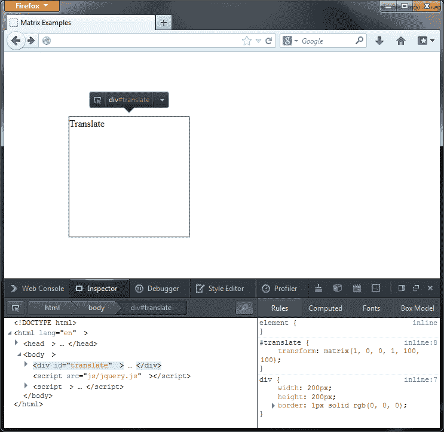
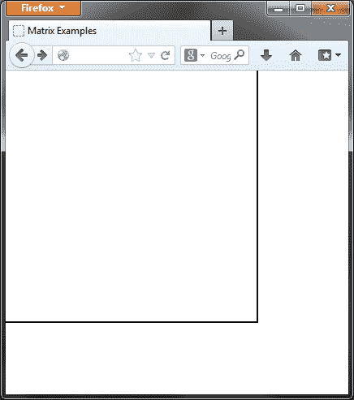
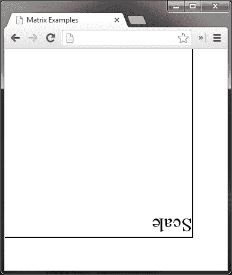
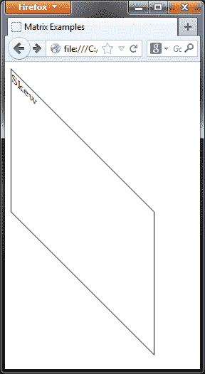
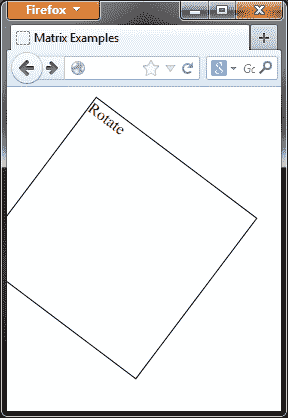
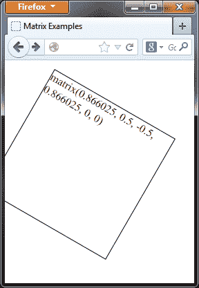
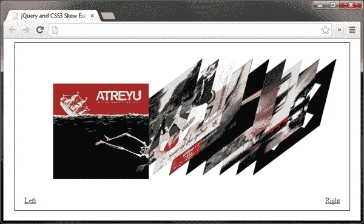

# 第九章：CSS3 动画

*CSS3 为 Web 开发带来了许多令人印象深刻的新样式，即使规范还远未完成，它的许多方面已经在最新的浏览器中使用。纯 CSS 动画甚至可能在某个时点被纳入规范中。在写作时，几乎所有现代浏览器都完全支持这一点。然而，通过一点点 jQuery 的帮助，我们可以创建自己的 CSS3 动画，这些动画在各种常见浏览器中都可以有不同程度的成功。*

在本章中，我们将涵盖以下主题：

+   可用的不同 CSS3 变换

+   对元素旋转进行动画处理

+   使用 CSS3 变换矩阵

+   使用 jQuery 对元素的倾斜进行动画处理

### 注意

关于 CSS3 2D 变换的更多信息，请参阅 W3C 工作草案规范[`www.w3.org/TR/css3-transforms/`](http://www.w3.org/TR/css3-transforms/)。

# CSS3 2D 变换

CSS3 定义了一个名为`transform`的样式属性，允许我们在二维空间沿着 x 和 y 轴转换目标元素。一系列的变换函数可以作为`transform`属性的值，决定了变换应该如何应用。下面定义了以下 2D 变换函数：

| 函数 | 例子用法 | 变换描述 |
| --- | --- | --- |
| `matrix` | `matrix(a, b, c, d, tx, ty)` | 它根据提供的参数的组合旋转，缩放，倾斜或平移元素。 |
| `rotate` | `rotate(x)` | 它围绕变换原点将元素旋转指定角度。默认情况下，原点应该是元素的中心。 |
| `scale` | `scale(x, y)` | 它沿着 x 和 y 轴方向按指定的单位数进行缩放元素。如果没有给出 y，就假定它与 x 相同。 |
| `scaleX` | `scale(x)` | 它沿 x 轴按指定的单位数进行缩放元素。 |
| `scaleY` | `scale(y)` | 它沿 y 轴按指定的单位数进行缩放元素。 |
| `skew` | `skew(x, y)` | 它沿着 x 和 y 轴以指定的角度倾斜元素。如果没有提供 y，则假定为 0。 |
| `skewX` | `skew(x)` | 它沿 x 轴沿指定角度倾斜元素。 |
| `skewY` | `skew(y)` | 它沿 y 轴沿指定角度倾斜元素。 |
| `translate` | `translate(x, y)` | 它将元素沿 x 和 y 轴重新定位指定像素。如果没有提供 y，假设为 0。 |
| `translateX` | `translate(x)` | 它将元素沿 x 轴重新定位指定像素。 |
| `translateY` | `translate(y)` | 它将元素沿 y 轴重新定位指定像素。 |

## 理解矩阵

所有单独的转换函数（`rotate()`，`skew()`等）可以看作是执行特定矩阵转换的快捷方式。实际上，大多数浏览器在提供转换函数时，甚至在幕后都会应用矩阵。

`matrix`函数接受六个参数，并且前面表中提到的每种转换都可以通过为这些参数提供不同组合的值来执行。有时我们可以使用`matrix`函数同时应用多个变换。让我们看些快速的示例来说明如何使用矩阵。

### 平移

对元素进行平移会使其从原始位置移动。正值将元素移动到页面的右侧或下方（取决于轴），而负值将元素移动到页面的左侧或上方。例如，可以使用以下变换矩阵使元素在 x 轴沿右移动 100 像素，y 轴沿下移动 100 像素：

```js

transform: matrix(1, 0, 0, 1, 100, 100);

```

这个`matrix`函数等同于使用转换函数`translate(100px, 100px)`，将导致目标元素看起来如下截图：



正如我们在前一个截图中看到的，尽管我们没有使用 CSS 来定位该元素，但该元素已从其原始位置（屏幕左上角）移动，我们可以在 DOM Inspector 中看到这一情况。

此示例中矩阵的第五个参数对应 x 轴，第六个参数对应 y 轴。不要过于担心前四个参数，因为我们很快就会更详细地讨论这些内容。

### 注意

需要特别注意的是，一些浏览器（如 Firefox）期望这些值带有指定的单位（正如前一个截图中），而其他浏览器（如 Opera）或基于 WebKit 渲染引擎的浏览器则希望这些值不带单位。

元素不需要定位才能进行平移，并且转换不会影响文档的流或周围其他元素。相邻元素将根据元素的原始位置而不是其平移后的新位置进行定位。转换后，元素的内容也将被一起平移。

### 缩放

也许你会想为什么在我们第一个矩阵代码片段中，我们提供了值 1 作为第一个和第四个参数，但是第二和第三个参数的值却为 0，而不提供所有的零值。

这是因为参数（第一和第四）对应于`scale`转换函数，因此为保留变换后的元素原始大小，`scale`参数被设置为 1。要使元素的大小加倍（而不移动其位置），我们可以使用以下变换矩阵：

```js

transform: matrix(2, 0, 0, 2, 0, 0);

```

此片段相当于使用 `transform: scale(2, 2)`，并会导致目标元素显示如下：



在前面的截图中，我们可以看到该元素现在是其原始大小的两倍。

前面的代码会沿着 x 和 y 轴对目标元素进行对称缩放。这些值在所有支持的浏览器中都是无单位的，且不能指定为值 0。可以提供整数或浮点数，并且如果需要可以进行非对称缩放。

缩放的一个有趣效果是，提供负值会导致元素被反转，而不是像我们直观地推测的那样收缩。因此，如果我们在前面的代码片段中提供 `-2` 和 `-2` 作为第一个和第四个值，那么该元素将在垂直和水平方向上都反射，并且大小将增加两倍。甚至可以为这种类型的转换提供正负值的组合。

反射的元素会显示如下：



该元素沿其 x 和 y 轴反转，就像在镜子中倒置查看一样。如果，例如，我们正在实现纯 CSS 反射，这可能非常有用。

### 倾斜

与矩阵中第二个和第三个参数对应的两个零值可以用作倾斜值，其中 x 轴使用第二个参数，y 轴使用第三个参数。我们可以使用以下矩阵变换函数对元素进行倾斜（而不修改其比例或位置）：

```js

transform: matrix(1, 1, 0, 1, 0, 0);

```

以下截图显示了一个倾斜的元素：



前面的截图显示了一个沿 x 轴倾斜的元素。与其他矩阵函数一样，对这些参数的正值会导致沿右侧或向下的方向转换，负值会导致沿左侧或向上的方向转换。

在前面的片段中，只有 x 轴被倾斜。倾斜的一个后果是元素增大了。转换后元素的边界框尺寸从 200 px（元素的原始大小）增加到了 400 px。

尽管尺寸增加，但文档的流程不受变换的影响，而且与其他变换一样，变换元素内的任何内容也会被转换。

### 注意

在不同的浏览器中，变换对元素中包含的任何文本的影响各不相同，在一些浏览器中，文本在变换后仍然清晰可读，而在其他浏览器中则会降级。

### 旋转

要使用矩阵旋转元素，我们需要使用三角函数正弦和余弦来计算前四个参数的值。第一个和第四个参数分别为旋转角度的余弦函数，而第二个和第三个参数分别为旋转的正弦函数和负正弦函数。

### 注意

正弦和余弦函数是相对较高级的数学构造，用于表示三角形的边和角之间的不同关系。

虽然精确理解它们的本质对于使用它们并不是必要的（JavaScript 有内置函数可以自动计算它们），但深入理解它们的本质和用途在特定处理旋转时会有所帮助。

关于基本介绍，请参阅维基百科对三角函数的文章 [`en.wikipedia.org/wiki/Trigonometric_functions`](http://en.wikipedia.org/wiki/Trigonometric_functions)。

例如，要将一个元素旋转 37 度，我们将使用以下变换：

```js

transform: matrix(0.7986355, 0.6018150, -0.6018150, 0.7986355, 0, 0);

```

我们旋转后的元素应该是这样的：



如我们所见，旋转后元素的边缘超出了视口。应谨慎正确地定位将要旋转的元素，以确保在必要时有足够的空间显示元素的全部内容。

可以通过科学计算器轻松计算旋转角度的正弦和余弦函数，或者当然也可以通过 JavaScript 自行进行编程。

## 处理变换

使用诸如`rotate()`或`skew()`之类的快捷变换函数比使用矩阵更容易更方便。然而，这种易用性是有代价的——我们只能在单个元素上一次使用其中一个。如果我们试图在 CSS 语句中使用多个，只会应用最后一个定义的。

如果我们需要将多个不同的变换应用于一个元素，我们可以使用矩阵函数，具体取决于我们需要应用哪些变换。例如，我们可以倾斜一个元素，同时使用以下方法进行平移和缩放：

```js

transform: matrix(2, -1, 0, 2, 300px, 0);

```

在这个例子中，元素沿着 x 轴倾斜，大小加倍，并向右移动 300 px。我们无法在上一个代码片段中同时对目标元素进行旋转。

即使我们提供两个矩阵函数，一个用于倾斜、缩放和平移，另一个用于旋转，只有旋转会被应用。但是，我们可以使用单个矩阵函数同时旋转和平移，或旋转和缩放一个元素。

## 使用 jQuery 和变换

我们可以使用 jQuery 的`css()`方法在设置器模式下在所选元素上设置 CSS3 变换，并且我们可以在获取器模式下检索在元素上设置的任何变换函数。我们只需要确保使用正确的供应商前缀，例如`-moz-transform`用于 Firefox，或`-webkit-transform`用于 WebKit/Blink-based 浏览器。Opera 也有自己的供应商前缀（对于较旧的版本），新版本的 IE 也有。

需要注意的一件事是，虽然我们可以在选定的元素上设置特定的变换函数，比如 `rotate()`，但我们只能以其矩阵格式获取 `style` 属性的值。看一下下面的代码：

```js

$("#get").css("-moz-transform", "rotate(30deg)");

$("#get").text($("#get").css("-moz-transform"));

```

这将导致以下结果：



在上一张屏幕截图中，我们看到我们在第一行代码中应用的 `rotate()` 变换函数在第二行代码中作为矩阵函数返回。

### 提示

**cssHooks**

重要的是要注意，使用 `cssHooks` 可以帮助测试你的代码在各种供应商前缀下的浏览器兼容性。有关 `cssHooks` 的更多信息可以在这里找到：[`api.jquery.com/jQuery.cssHooks/`](http://api.jquery.com/jQuery.cssHooks/)。

此外，你可以在这里找到一个很棒的 jQuery 插件，用于 `cssHooks`：[`github.com/brandonaaron/jquery-cssHooks`](https://github.com/brandonaaron/jquery-cssHooks)。它包含了一些 CSS3 2D 变换的行为。虽然从学习的角度来看，手动创建这些效果是有益的，正如我们在本章的其余部分中所做的那样，但请记住在将来使用这个文件来节省你的时间和精力。

# CSS3 3D 变换

我们迄今为止看到的所有变换函数都是二维的，仅在 x 和 y 轴上操作。还提出了在 x、y 和 z 轴上操作的三维变换。

所有的变换函数都存在三维等效版本，通常只需要一个额外的参数，对应于每个维度的向量和角度。例如，可以使用以下代码添加 3D 旋转：

```js

transform: rotate3d(0, 1, 0, 30deg);

```

与 2D 变换一样，有一个包罗万象的矩阵函数，可以让我们实现任何其他变换，并允许我们将其中一些变换组合到单个元素上。

如果像我一样，你觉得 2D 变换矩阵，具有六个参数，复杂且可能有点难以理解，那等你开始使用总共有 16 个参数的 3D 矩阵时，你就会觉得更复杂了！

目前，3D 变换在基于 WebKit 的浏览器和 Firefox 中得到支持（对于 IE10 则有部分支持），所以我们不会对这些进行进一步的详细讨论。

### 注意

关于 CSS3 3D 变换的浏览器支持可以在这里找到：[`caniuse.com/transforms3d`](http://caniuse.com/transforms3d)。

# 使用 jQuery 和 CSS3 进行动画旋转

在这个例子中，我们将设置一个动画，使用 `rotate()` 变换函数旋转图像。由于这个在大多数常见浏览器中都受支持，所以实际上实现起来非常容易，并且可以成为增强所使用页面的外观和行为的一个很好的效果。

# 行动时间 - 动画化元素的旋转

在这个示例中，我们只会旋转一个简单的图像，因此这是我们需要在页面的`<body>`元素中的唯一可见元素。

1.  将以下``标签添加到模板文件的新副本中：

    ```js

    

    ```

    在这一点上，我们甚至不需要任何样式，因为我们需要设置的所有内容都可以在接下来要添加的 JavaScript 中完成。

1.  在 HTML 页面底部的匿名函数中，添加以下代码：

    ```js

    var img = $("#colorWheel"),

    offset = img.offset(),

    origWidth = img.width(),

    origHeight = img.height(),

    rotateStrings = [

        "rotate(",

        0，

        "deg)"

    ],

    getVendor = function() {

    var prefix = null，

        vendorStrings = {

        pure: "transform",

        moz: "-moz-transform",

        webkit: "-webkit-transform",

        op: "-o-transform"

    };

    for (props in vendorStrings) {

        if(img.css(vendorStrings[props]) === "none") {

        prefix = vendorStrings[props];

        }

    }

    if (prefix === null) {

        prefix = "filter";

        img.css({

        position: "absolute",

        filter: "progid:DXImageTransform.Microsoft.Matrix(sizingMethod='auto expand');"

        });

    }

    return prefix;

    },

    vendor = getVendor();

    function doRotate() {

    rotateStrings[1]++;

    if (vendor === "filter") {

        var rad = rotateStrings[1] * (Math.PI * 2 / 360),

        cos = Math.cos(rad),

        sin = Math.sin(rad),

        driftX = (img.width() - origWidth) / 2,

        driftY = (img.height() - origHeight) / 2，

        el = img.get(0);

        img.css({

        left: offset.left - driftX,

        top: offset.top - driftY

        });

        el.filters.item("DXImageTransform.Microsoft.Matrix").M11 = cos;

        el.filters.item("DXImageTransform.Microsoft.Matrix").M12 = -sin;

        el.filters.item("DXImageTransform.Microsoft.Matrix").M21 = sin;

        el.filters.item("DXImageTransform.Microsoft.Matrix").M22 = cos;

    } else {

        img.css(vendor, rotateStrings.join(""));

    }

    }

    setInterval(function() { doRotate() }, 100);

    ```

1.  将页面保存为 `rotate.html`。如果我们现在在浏览器中运行页面，我们应该看到颜色轮围绕其中心缓慢旋转。

## *刚刚发生了什么？*

我们做的第一件事是缓存图像的选择器，因为我们将在代码中多次引用它。请注意，这是我们在整个脚本中创建的唯一 jQuery 对象，正如我们在本书中之前讨论过的，这对于提高性能非常有帮助。

我们在这一点上还设置了一些其他变量，包括图像的偏移（它在页面上的`absolute`位置），其原始宽度和高度，以及一个包含我们将以字符串和整数格式设置的 CSS 属性的不同部分的数组。

我们还将内联函数(`getVendor()`)设置为变量的值，我们可以使用它来确定要使用的供应商前缀。这个函数首先设置一些变量，这些变量将用于存储确定的供应商前缀和一个包含我们要测试的所有不同前缀的对象文字。我们还包括原生的 `transform` 属性。虽然目前还没有任何浏览器支持这一点，但总有一天可能会支持，所以这有助于未来保护我们的代码。

`doRotate()`函数使用`for...in`循环迭代对象文字中的每个属性。在循环内部，我们尝试使用每个供应商前缀读取`transform`属性的值。一个有趣的事实是，每个浏览器都会报告其支持的前缀的值为`none`，对于它不支持的前缀，会报告一个假值，如`false`、`null`或`undefined`。我们可以使用这个来可靠地确定正在使用哪个浏览器，因此需要使用哪个供应商前缀。然后将正在使用的浏览器的正确供应商前缀保存到`vendor`变量中，以备返回。

### 注意

如果这些测试都没有识别出供应商前缀，那么可能正在使用的浏览器是较旧版本的 Internet Explorer。再次注意，jQuery 2.0 不支持 IE8 及以下版本。

如果此时`vendor`变量仍设置为 null，则将变量设置为`filter`。为了在 IE 中以编程方式处理`filter`属性的值，必须已将`filter`应用于元素，因此我们还在代码的此部分使用 jQuery 的`css()`方法为元素设置了一个过滤器，以备以后在代码中操纵。我们还将`sizing mode`设置为`auto expand`，以防止在应用旋转时裁剪元素。

函数结束时，返回包含当前使用的浏览器的供应商前缀的字符串的`prefix`变量。在函数之后，我们设置一个名为`vendor`的变量，该变量将包含函数返回的值，以便轻松引用。

接下来，我们定义一个常规函数`doRotate()`，该函数将用于执行实际的旋转。在此函数中，我们首先将`rotateStrings`数组的第二个属性递增 1。

然后，我们检查`vendor`变量是否等于`filter`。如果是，则我们知道正在使用的浏览器是 IE，可以继续确定专有的`filter`所需的值。IE 允许以两种不同的方式实现旋转。我们可以使用`BasicImage`过滤器属性来旋转图像，尽管这样只能设置四个旋转值之一：`0`、`1`、`2`或`3`，这分别对应于 0、90、180 或 270 度。在本示例中，这根本不够灵活。

所以，我们使用`Matrix`过滤器，它让我们对旋转的程度有更多控制。这与 CSS3 矩阵变换非常相似，有六个参数值，这些值组合起来生成不同的变换（在这种情况下是旋转）。

我们在本示例中使用的参数是`M11`、`M12`、`M21`和`M22`，它们大致映射到 CSS3 版本的前四个值，但在 Microsoft 的供应商前缀版本中，第二个值和第三个值被颠倒了。

这些属性的值必须使用 JavaScript 的三角函数`Math.cos`和`Math.sin`来计算。我们设置一些变量来计算这些值。第一个变量`rad`将旋转的度数转换为弧度，因为这是`Matrix`过滤器所需的单位。弧度通过将当前旋转度数（存储为`rotateStrings`数组中的第二项）乘以 PI 乘以 2，然后除以 360 来计算。

在 IE 中旋转元素时出现的一个不幸问题是，旋转的元素在旋转过程中在页面上漂移。这是由于元素的边界框随着元素旋转而增大导致的。旋转确实发生在元素的中心周围，但是因为 IE 认为元素已经增大，所以旋转后的元素中心在每次旋转时都会发生位移。

我们设置的`drifX`和`driftY`变量允许我们确定元素移动了多远，以便我们可以进行修正。通过比较元素在旋转之前的原始宽度和高度与旋转后的新宽度和高度，可以计算出移位。

我们还使用 jQuery 的`get()`方法将 jQuery 对象中的原始`img`元素存储为 DOM 节点，并将参数设置为`0`，这将返回实际的 DOM 节点而不是 jQuery 对象。`filter`必须应用于正确的 DOM 元素。

一旦我们设置了变量，我们就可以使用 jQuery 的`css()`方法来纠正由于上一次旋转引起的漂移，然后将计算得到的三角函数值插入`Matrix`过滤器中。

最后，如果`vendor`变量不等于`filter`，我们可以简单地将相关的供应商前缀设置为我们的`rotateStrings`数组中的项目。我们通过调用 JavaScript 的`join()`方法来执行此操作。这比使用连接来创建所需的 CSS 属性的字符串要高效得多，因为此函数将被重复执行，我们确实需要确保它尽可能高效。

我们代码中的最后一件事是通过设置每隔 100 毫秒调用我们的`doRotate()`函数的间隔来开始旋转动画。我们使用匿名函数作为`setInterval()`函数的第一个参数，这样可以避免将要执行的函数附加到`window`对象上。

## IE 的问题

除了 IE 让我们比其他任何浏览器都要努力地设置元素的旋转之外，它还给我们带来了另一个问题：它完全破坏了我们正在旋转的 PNG 的 alpha 层。突然间，我们漂亮的反锯齿圆边变得锯齿状且不美观（在 IE 中查看此示例以查看问题）。

-   IE 下的动画也稍显卡顿，同时，使用带有 alpha 层的 PNG 可能会成为 IE 的一个硬伤。如果真是这样，我们可以通过`filter`属性是否返回来轻松地在 IE 中禁用动画，只需在我们的`getVendor()`函数中什么都不做即可。但是，我们仍然可以做一些事情来抵消 IE 中的问题。

例如，我们可以简单地使用一个没有透明度的 PNG，这将在 IE 中保留圆形的边框（在本例中）。或者，我们可以将另一张图像覆盖在我们正在旋转的图像的顶部，以隐藏锯齿状的边缘。

## 突击测验——实现 CSS3 旋转

Q1\. 在这个例子中，我们使用了一个数组，结合 JavaScript 的`join()`方法生成了字符串。为什么？

1.  因为这样更有趣。

1.  因为它能让我们的代码看起来更好。

1.  因为在性能上，它比字符串连接快得多。

1.  否则该元素无法正确旋转。

Q2\. 为了使动画在 Internet Explorer 中正确运行，我们不断地调整了旋转元素的`top`和`left`样式属性以维持其位置。为什么 IE 中会出现偏移？

1.  因为旋转元素的边界框在整个动画过程中会发生变化。由于旋转元素位于其边界框的中心位置，因此随着框的增大和减小而其位置也会发生变化。

1.  因为 PNG 的 alpha 层被移除了。

1.  因为使用了矩阵滤镜属性。

1.  由于 IE 的 CSS3 旋转属性存在错误。

## 尝试吧——扩展 CSS3 旋转

旋转效果可以应用在许多地方，无论是动画还是静态。但是在动画效果中，比如在本例中，作为较大元素组合的一部分的背景效果非常出色。例如，作为半透明 logo 的背景，它创造了令人惊叹的效果。

在页面中尝试将这种效果融入，并将其用作另一幅图像的背景。此外，您还会第一手看到这在 IE 中如何改善效果的外观。

# 动态偏移

就像`rotate()`函数一样，我们可以使用`skew()`变换来创建吸引人的特效动画。在这个例子中，为了在所有浏览器中应用多个变换到一个元素上，我们将使用`matrix()`函数，而不仅仅是 IE。

本例中的上下文将是以 cover-flow 风格的小部件，通过对图像的倾斜进行动画处理，依次显示图像。用户可以使用链接在图像之间前后循环滚动：



前一个截图显示了完成的小部件将会如何显示。

# 实战时间——创建基础标记和基本样式

首先，我们将看一下我们在示例程序中将使用的 HTML，然后我们将看一下在被扭曲之前为元素添加的初始样式。

1.  将以下代码添加到模板文件的`<body>`元素中：

    ```js

    <div id="viewer">

    <div id="flow">

        

        

        

        

        

        

        

        

        

        

    </div>

    <ul>

        <li id="left"><a href="#" title="向左移动">左</a></li>

        <li id="right"><a href="#" title="向右移动">右</a></li>

    </ul>

    </div>

    ```

1.  将页面保存为`skew.html`。接下来，在一个新文件中添加以下代码：

    ```js

    #viewer {

    width:700px;

    height:220px;

    padding:100px 0 30px;

    margin:auto;

    border:1px solid #000;

    position:relative;

    }

    #flow:after {

    content:"";

    display:block;

    height:0;

    clear:both;

    visibility:hidden;

    }

    #flow img {

    display:block;

    margin-left:-165px;

    position:relative;

    top:-15px;

    left:245px;

    float:left;

    background-color:#fff;

    }

    #viewer li {

    list-style-type:none;

    position:absolute;

    bottom:10px;

    }

    #left { left:20px; }

    #right { right:20px; }

    ```

1.  将此文件保存在`css`目录中，命名为`skew.css`。

## *刚发生了什么?*

对于此示例，我们使用了一组简单的元素。我们使用了一个外部容器，主要用于定位，以便我们可以在视口中心放置小部件并在其中定位其他元素。

`` 元素是我们将应用倾斜动画的元素，因此将它们隔离在自己的容器中，以便以后在脚本中更轻松地选择它们。我们还有一个包含两个链接的列表元素。这些将用于触发动画。

CSS 与 HTML 一样简洁。我们只需根据示例要求定位容器、图像和控件即可。所有有趣的 CSS3 效果都将使用脚本进行设置和操作。您应该注意，此示例没有渐进增强，因为这会使其与已经相当大的示例偏离太远，如我们稍后将在添加 JavaScript 时看到的那样。

# 该行动开始——初始化小部件

我们需要做的第一件事是设置好准备进行倾斜操作的图像。我们还可以添加一个函数，该函数将返回我们在上一个示例中使用的 transform 样式属性的正确供应商特定前缀。在 HTML 页面底部的空函数中，添加以下代码：

```js

var viewer = $("#viewer"),

flow = viewer.find("#flow"),

order = flow.children().length,

oneRad = 1 * (Math.PI / 180),

matrix = ["matrix(", 1, ",", 0, ",", 0, ",", 1, ",","0px,", "0px)"],

msMatrix = "progid:DXImageTransform.Microsoft.Matrix(sizingMethod='auto expand')",

getVendor = function() {

    var prefix = null,

    vendorStrings = {

        pure: "transform",

        moz: "-moz-transform",

        webkit: "-webkit-transform",

        op: "-o-transform"

    };

    for (props in vendorStrings) {

    if(flow.css(vendorStrings[props]) === "none") {

        prefix = vendorStrings[props];

    }

    }

    if (prefix === null) {

    prefix = "filter";

    }

    返回前缀;

},

vendor = getVendor(),

property = (vendor !== "filter") ? matrix.join("") : msMatrix;

flow.children().eq(0).addClass("flat").css(vendor, property).css("zIndex", order + 1);

flow.children().not(":first").each(function(i) {

el = flow.children().eq(i + 1);

matrix[1] = 0.7;

matrix[3] = -30 * oneRad;

matrix[5] = -10 * oneRad;

matrix[7] = 0.7;

matrix[9] = (vendor === "-moz-transform") ? "90px," : "90,";

matrix[10] = (vendor === "-moz-transform") ? "-30px)" : "-30)";

if (vendor !== "filter") {

    el.addClass("skew-right").css(vendor, matrix.join("")).css("zIndex", order);

} else {

    el.addClass("skew-right").css(vendor, msMatrix).css({

    zIndex: order,

    top: -30,

    left: 270,

    width: 140,

    height: 140,

    marginLeft: -100

    });

    el.get(0).filters.item("DXImageTransform.Microsoft.Matrix").M11 = 1;

    el.get(0).filters.item("DXImageTransform.Microsoft.Matrix").M12 = matrix[5];

    el.get(0).filters.item("DXImageTransform.Microsoft.Matrix").M21 = matrix[3];

    el.get(0).filters.item("DXImageTransform.Microsoft.Matrix").M22 = 1;

}

order--;

});

matrix[3] = 0;

matrix[5] = 0;

```

## *刚刚发生了什么？*

在脚本的第一部分，我们初始化了变量。如果你曾经想知道为什么我们总是在函数顶部初始化变量，原因是因为一个称为 Hoisting 的现象。这是指函数中初始化的变量被“提升”到函数顶部，并且可以包含我们没有预期到的结果。

### 注意

您可以在以下网址了解更多关于 JavaScript Hoisting 的信息：[`thecomputersarewinning.com/post/a-dangerous-example-of-javascript-hoisting/`](http://thecomputersarewinning.com/post/a-dangerous-example-of-javascript-hoisting/)。

我们创建的第一个变量是我们小部件外部容器的缓存选择器。这是我们在整个示例中创建的唯一一个 jQuery 对象。我们将添加的一些代码在某些地方非常耗费资源，因此为了性能原因，保持我们创建的 jQuery 对象数量尽可能少是至关重要的。

接下来我们使用原始的 jQuery 对象和 `find()` jQuery 方法来缓存 `flow` 元素的选择器（图像元素的直接父元素，将被扭曲），因为我们需要多次访问或操作此元素。

然后，我们使用包含 `flow` 元素子元素的 jQuery 对象的 `length` 属性存储小部件中图像元素的数量。我们还存储了将一度转换为一弧度的结果，以便我们可以在整个脚本中轻松地从一种单位转换到另一种单位，而无需重复执行相同的计算。CSS3 变换 `matrix` 和 IE 的 `matrix` 滤镜都可以接受弧度作为单位，因此这使它们成为方便的工作单位。

然后，我们创建了我们的矩阵数组和 Microsoft 的`matrix`属性作为字符串。该数组包括所有单独的属性作为数组项，包括必需的逗号作为字符串。我们在数组中包含逗号的原因是，我们可以稍后调用数组上的`join()` JavaScript 函数，而不指定分隔符，也不必担心它会错误地插入不必要的逗号。

接下来，我们添加了在上一个示例中使用的`getVendor()`函数。这是一种方便的方式，可以确保在应用倾斜样式时使用正确的前缀。我们不会详细介绍此函数，因为我们在本章的早些时候已经看过它了（在*动手操作——动画化元素旋转*部分）。再次强调，我们在定义函数后立即调用该函数，并将结果存储在变量中以供以后使用。

我们创建的最后一个变量将保存一个字符串，其中包含 CSS3 矩阵函数和所有所需参数，或者它将包含 IE 的`matrix`属性在其最基本形式下只定义了`sizingMethod`参数。如果您还记得前面的示例，IE 只能在初始设置后才能操作矩阵属性。

在此时，我们可以继续准备第一张图片。我们使用 jQuery 的`eq()`方法选择第一张图片，将`0`作为我们感兴趣的元素的索引传递进去。我们在第一张图片上设置一个类名为`flat`，这样我们就可以很容易地后续选择它，并且还将其`z-index`设置得比其他图片高，以便完全可见。接下来，我们使用 jQuery 的`each()`方法循环遍历剩余的图片。

我们传递给方法的匿名函数接受参数`i`，这是当前迭代的索引。这反过来将允许我们在循环的每次迭代中依次选择每个元素。函数中我们做的第一件事是使用索引作为`eq()`方法的参数缓存对当前``元素的引用。我们将索引值加 1 以避免选择第一张图片。

在下一段代码中，我们设置了`matrix`数组中的一些项目。我们将比例参数（数组中的第 1 和第 7 项）设置为 0.7，以便略微缩小倾斜的图像，将倾斜参数（数组中的第 3 和第 5 项）设置为相应的-30 和-10 度的弧度。这将略微向上和向右倾斜图像。

我们还设置了平移参数（数组中的第 9 和第 10 项），以便正确定位倾斜的元素，使它们水平堆叠。如果使用的浏览器是 Firefox，我们必须在平移属性的值中使用`px`，但是对于其他浏览器，值应该是无单位的。我们使用三元条件来检查`vendor`变量（这将包含当前浏览器的供应商前缀）并相应地设置值。

设置完数组项目后，我们检查当前浏览器是否不是 IE，并且只要不是，就将倾斜应用于当前元素。我们还使用设置为图像数量的长度的`order`变量设置当前元素的`z-index`。这样做可以使当前元素成为顶部图像。

如果正在使用的浏览器是 IE，我们将应用微软`matrix`并在图像上设置一些不同的 CSS。在 IE 中，translate 参数不起作用，因此我们使用 jQuery 来定位图像。在 IE 中将元素倾斜也会导致元素增大，因此我们必须大幅减少它们的尺寸，这也是我们用 jQuery 做的。

在循环的每次迭代中，我们将该变量的值减一。因此，每个元素的`z-index`会随着我们处理每个图像而逐渐降低。

设置所需的 CSS 样式后，我们通过操作专有的微软`matrix`滤镜来倾斜元素。请记住，这些属性只能在实际的 DOM 元素上操作，而不能在 jQuery 对象上操作，因此我们使用 jQuery 的`get()`方法通过索引为 0 检索原始元素。

`each()`循环完成后，我们重新设置了`matrix`数组中的第三和第五个参数。这是因为我们将多次使用该数组，因此每次都应使用参数的默认值。

# 行动时间 - 动画元素的倾斜

现在我们将添加一个函数，用于将元素向左倾斜。该函数必须应用于两个元素：于平坦或非倾斜元素，以及在其之前的一个元素（在本例中为右侧）。用于从右向左动画倾斜的函数如下，并应放置在`matrix[5] = 0;`行下方：

```

function skewRTL() {

var flat = flow.find(".flat").css("zIndex", order + 1),

    preFlat = flat.next(),

    flatMatrix = matrix.slice(0),

    preMatrix = matrix.slice(0),

    flatDims = 200,

    preDims = 170,

    倾斜 = function() {

    如果(preFlat.length) {

        if (flatMatrix[3] <= 30 * oneRad && flatMatrix[5] <= 10 * oneRad) {

        var flatTranslateX = parseInt(flatMatrix[9].split("p")[0], 10),

            flatTranslateY = parseInt(flatMatrix[10].split("p")[0], 10),

            preTranslateX = parseInt(preMatrix[9].split("p")[0], 10),

            preTranslateY = parseInt(preMatrix[10].split("p")[0], 10);

        flatMatrix[1] = flatMatrix[1] - 0.001;

        flatMatrix[3] = flatMatrix[3] + oneRad;

        flatMatrix[5] = flatMatrix[5] + (oneRad / 3);

        flatMatrix[7] = flatMatrix[7] - 0.001;

        preMatrix[1] = preMatrix[1] + 0.01;

        preMatrix[3] = preMatrix[3] + oneRad;

        preMatrix[5] = preMatrix[5] + (oneRad / 3);

        preMatrix[7] = preMatrix[7] + 0.01;

        flatMatrix[9] = (vendor === "-moz-transform") ? flatTranslateX - 6 + "px," : flatTranslateX - 6 + ",";

        preMatrix[9] = (vendor === "-moz-transform") ? preTranslateX - 3 + "px," : preTranslateX - 3 + ",";

        preMatrix[10] = (vendor === "-moz-transform") ? preTranslateY + 1 + "px)" : preTranslateY + 1 + ")";

        if (vendor !== "filter") {

            flat.css(vendor, flatMatrix.join(""));

            preFlat.css(vendor, preMatrix.join(""));

        } else {

        flat.get(0).filters.item("DXImageTransform.Microsoft.Matrix").M12 = flatMatrix[5];

        flat.get(0).filters.item("DXImageTransform.Microsoft.Matrix").M21 = flatMatrix[3];

        preFlat.get(0).filters.item("DXImageTransform.Microsoft.Matrix").M12 = preMatrix[5];

        preFlat.get(0).filters.item("DXImageTransform.Microsoft.Matrix").M21 = preMatrix[3];

            flatDims = flatDims - 2;

            preDims = preDims + 0.5;

            flat.css({

            width: flatDims,

            height: flatDims

            });

            preFlat.css({

            width: preDims,

            height: preDims

            });

        }

        } else {

        clearInterval(flatInterval);

        if (vendor !== "filter") {

            preMatrix[3] = 0;

            preMatrix[5] = 0;

            preFlat.css(vendor, preMatrix.join(""));

        } else {

            flat.css({

            top: -30,

            left: 260

        });

        }

        flat.prev().css("zIndex", "");

        flat.removeClass("flat").css("zIndex", "");

        preFlat.addClass("flat");

    }

    } else {

    clearInterval(flatInterval);

    flat.css("zIndex", order + 1);

    }

};

preMatrix[3] = -30 * oneRad;

preMatrix[5] = -10 * oneRad;

if(!flatInterval) {

    var flatInterval = setInterval(function() { skew() }, 1);

}

};

```

## *刚刚发生了什么？*

我们在函数中做的第一件事是设置函数使用的变量。我们缓存了具有`flat`类的当前元素的引用，并将该元素的`z-index`设置为比任何其他图像高一级，以确保它始终位于其他图像的顶部。

我们还缓存了`flat`图像后面的下一个图像的引用。在这个函数中，这将是未变形图像右侧的图像。然后，我们复制了原始的`matrix`数组的两个副本，一个是`flat`元素的副本，一个是`preFlat`元素的副本。要复制一个数组，我们只需使用 JavaScript 的`slice()`方法并指定索引为零。

我们创建的下两个变量是`flat`和`preFlat`图像的初始尺寸。这些变量只在 IE 中使用，但由于变量提升，我们需要在这里定义它们，而不是在函数的后面的 IE 特定代码块中定义它们。

接下来，我们定义了一个名为`skew()`的内联函数，我们将重复调用该函数以产生实际的动画。在这个函数中，我们首先检查`flat`元素后面是否有元素，方法是通过检查`preFlat`对象是否有长度。如果长度等于零（即长度为零），我们简单地清除可能存在的任何间隔，并确保`flat`元素位于 z-index 堆栈的顶部。然而，如果`preFlat`对象确实有长度，则我们检查当前的`skewX`属性是否小于或等于 30 度的弧度等价值，并且`skewY`属性是否小于或等于 10 度的弧度等价值（我们可以通过将 30 或 10 分别乘以我们存储的 1 弧度的数字来计算得到）。当前的`flat`图像的倾斜属性当前存储在`flatMatrix`数组的第三个和第五个项目中。

如果两个条件都为真，则可以继续执行动画。动画的一部分涉及翻译`flat`和`preFlat`图像，以便随着倾斜，图像也随之移动（我们还会调整它们的大小，但稍后再谈）。

为了正确地翻译图像，我们需要获取它们当前的翻译，我们首先定义四个新变量，并用来自两个矩阵数组的当前翻译值填充它们。这些数字需要是数字的，所以我们使用 JavaScript 的`parseInt`和`split()`函数来拆分字符串并将数字转换为整数。

接下来，我们需要用新值更新我们的两个矩阵数组。从右到左的函数将逐步更新`flatMatrix`和`preMatrix`数组中的值，然后将数组应用到元素上。因此，动画将由对每个变换参数的快速更新组成。

`flat`图像在翻译时也需要被倾斜，所以我们分别将`skewX`和`skewY`参数增加一个弧度和三分之一的一个弧度。记住，为了使元素向左和向上倾斜，倾斜参数应为正值，所以我们在每次函数通过时增加`flatMatrix`数组的项 3 和 5 的值。

`flat`图像比倾斜的图像开始时要大，所以每次函数运行时我们需要稍微减少数组项 1 和 7。`skew()`函数将被调用 30 次；所以为了减小`flat`图像的比例，使其最终达到正确的大小，我们在每次函数通过时将比例参数减小`0.001`。

我们想要的值是 x 轴上的 30 度倾斜和 y 轴上的 10 度倾斜。10 是 30 的三分之一，这就是为什么我们通过一个弧度除以三来增加`skewY`参数。

我之前提到在 Firefox 中，翻译参数需要单位，如`px`，但其他浏览器的这些值是无单位的。我们使用 JavaScript 的三元条件运算符来检查`vendor`字符串，如果它等于 Firefox 的供应商前缀（`-moz-transform`），我们将`px`添加到值中。平坦图像只需要在 x 轴上翻译，并且需要向左移动 6 个像素，所以我们更新数组项 9 的值，该值比其当前值小 6。

我们还必须更新`preFlat`图像，使其从向右倾斜变为平坦。我们还必须增加`preFlat`图像的大小，因为它们起初较小。同样，我们更新了`preMatrix`中的相关数组项，以便在`skew()`函数的 30 次迭代过程中它们最终达到正确的值。`preFlat`图像还需要被平移，但这次沿着`x`和`y`轴。

接下来我们再次检查 vendor string，只要不是`filter`（IE），我们通过连接数组将变换应用到`flat`和`preFlat`图像。如果是 IE，我们需要做更多的工作来应用变换。

我们在`flat`和`preFlat`图像上应用了每个相关的`Matrix`属性，`M12`和`M21`。我们再次使用了 jQuery 的`get()`方法，并使用`0`索引获取实际的 DOM 元素。我们还使用我们之前初始化的`flatDims`和`preDims`变量，缩小了`flat`图像的大小，同时增加了`preFlat`图像的大小，然后我们使用 jQuery 的`css()`方法应用了新的尺寸。

IE 的`Matrix`属性在`sizingMethod`设置为`auto expand`时会忽略缩放参数，但必须设置该属性以防止图像被裁剪。这就是为什么我们要返回到 jQuery 的`css()`方法。

令人意外的是，我们在 IE 中能够设置分数像素大小，这很幸运，因为它允许我们按正确的顺序设置图像的大小，使它们在动画结束时以正确的尺寸结束。

然后我们来到`skewRTL()`函数的最后一部分，在我们的`flatMatrix`数组中的第三和第五项大于 30 和 10 时执行此代码块。

首先我们清除间隔，以便扭曲不再进行动画。然后我们再次检查 vendor string，只要不是`filter`，我们将`flat`元素的扭曲重置为`0`（在 x 轴和 y 轴上都是）。

这是因为由于某种原因，`preFlat`图像并没有完全回到零。我认为这是因为 JavaScript 的`Math`函数不允许数字有足够的小数位数来完全精确。然而，图像只是稍微偏离，因此在动画结束时对`0`的突然切换并不会被注意到。

不幸的是，在 IE 中似乎不可能同时进行元素的平移和扭曲。IE 会应用新的扭曲，但直到扭曲动画结束时才应用新的位置，因此元素会以两个单独的步骤进行扭曲然后移动。这看起来不太好看，因此在扭曲动画完成后，我们简单地重新定位`flat`元素而不进行动画。

在修正了扭曲或位置后，我们将`flat`元素的`z-index`删除（现在它已经向左扭曲），并将其 class name 从`flat`删除，并给`preFlat`元素添加 class name `flat`。

此时，`flat`图像已经被扭曲到左侧，调整了大小和平移，`preFlat`图像已经扭曲回零，调整了大小和平移。`flat`和`preFlat`图像同时进行了变换，这就是为什么函数会如此庞大。

在`skewRTL()`函数的最后，该函数在`skew()`函数之后定义，`skew()`函数将由`setInterval()`函数重复调用，我们初始化了`preMatrix`数组中的第三个和第五个值，以便数组包含元素的初始状态的正确倾斜。当我们通过复制初始化小部件时使用的原始`matrix`数组创建数组时，这些项目都将设置为`0`。

在对需要倾斜的两个图像调用`setInterval()`函数之前，我们首先检查是否已存在间隔。这样可以防止访问者重复点击链接导致小部件崩溃。如果访问者连续点击几次链接，该元素将会倾斜多次，但是小部件将继续正常工作，页面不会抛出错误。

# 行动时间 - 将元素从左边倾斜到右边

我们现在可以添加一个函数，用于将元素从左倾斜到平的状态，再从平到右倾斜。这个函数与我们刚刚看到的函数非常相似。代码中的变化已在以下代码中突出显示：

```js

function skewLTR() {

var flat = flow.find(".flat"),

    preFlat = flat.prev(),

    flatMatrix = matrix.slice(0),

    preMatrix = matrix.slice(0),

    flatDims = 200,

    preDims = 170,

    倾斜 = function() {

    if (preFlat.length) {

        if (flatMatrix[3] >= -30 * oneRad && flatMatrix[5] >=-10 * oneRad) {

        var preTranslateX = parseInt(preMatrix[9].split("p")[0], 10),

        preTranslateY = parseInt(preMatrix[10].split("p")[0], 10);

        flatMatrix[1] = flatMatrix[1] - 0.001;

        flatMatrix[3] = flatMatrix[3] - oneRad;

        flatMatrix[5] = flatMatrix[5] - (oneRad / 3);

        flatMatrix[7] = flatMatrix[7] - 0.001;

        preMatrix[1] = preMatrix[1] + 0.01;

        preMatrix[3] = preMatrix[3] - oneRad;

        preMatrix[5] = preMatrix[5] - (oneRad / 3);

        preMatrix[7] = preMatrix[7] + 0.01;

        preMatrix[9] = (vendor === "-moz-transform") ? preTranslateX + 3 + "px," : preTranslateX + 3 + ",";

        preMatrix[10] = (vendor === "-moz-transform") ? preTranslateY + 1 + "px)" : preTranslateY + 1 + ")";

        if (vendor !== "filter") {

            flat.css(vendor, flatMatrix.join(""));

            preFlat.css(vendor, preMatrix.join(""));

        } else {

            flat.get(0).filters.item("DXImageTransform.Microsoft.Matrix").M12 = flatMatrix[5];

            flat.get(0).filters.item("DXImageTransform.Microsoft.Matrix").M21 = flatMatrix[3];

            preFlat.get(0).filters.item("DXImageTransform.Microsoft.Matrix").M12 = preMatrix[5];

            preFlat.get(0).filters.item("DXImageTransform.Microsoft.Matrix").M21 = preMatrix[3];

            flatDims = flatDims - 1.5;

            preDims = preDims + 1.5;

            flat.css({

            width: flatDims,

            height: flatDims

            });

            preFlat.css({

            width: preDims,

            height: preDims

            });

        }

        } else {

        clearInterval(flatInterval);

        clearInterval(preInterval);

        if (vendor !== "filter") {

            preMatrix[3] = 0;

            preMatrix[5] = 0;

            preFlat.css(vendor, preMatrix.join(""));

        }

        flat.removeClass("flat").css("zIndex", parseInt(flat.next().css("zIndex")) + 1);

        preFlat.addClass("flat").css("zIndex", order + 1);

        }

    } else {

        clearInterval(flatInterval);

        clearInterval(preInterval);

        flat.css("zIndex", order + 1);

    }

    };

    order = flow.children().length;

    preMatrix[3] = 30 * oneRad;

    preMatrix[5] = 10 * oneRad;

    preMatrix[9] = (vendor === "-moz-transform") ? "-90px," : "-90,";

    preMatrix[10] = (vendor === "-moz-transform") ? "-30px," :"-30,";

    if(!flatInterval) {

    var flatInterval = setInterval(function() { skew() }, 1),

    preInterval = setInterval(function() { skew() }, 1);

    }

};

```

## *刚刚发生了什么？*

我们不会完全覆盖整个函数，因为它与我们之前讨论的非常相似，但让我们花点时间看看这个函数有什么不同。首先，我们不是选择`flat`元素右侧的下一个图像，而是使用 jQuery 的`prev()`方法选择它左侧的图像，而不是`next()`。

当更新我们的`flat`和`preFlat`元素的斜率时，我们将元素斜向相反方向。要将元素斜向右移动，我们需要使用负数，因此我们不是从`0`到`30`或从`-30`到`0`，而是反向操作，从`30`到`0`或`0`到`-30`，因此我们减去 1 度的弧度值而不是加上它。

我们还将向右平移而不是向左，因此我们不是每次从图像左侧删除 3 个像素以向左移动图像，而是添加 3 个像素以将其向右移动。我们还为 IE 使用的维度变量提供不同的值。

这次当我们设置以前是平的元素的`z-index`时，我们将`1`添加到下一个元素（向右）的`z-index`中，以确保它比此元素更高。但是，我们不能使用之前的长度变量（`order`），否则它将与`flat`元素具有相同的`z-index`，但会出现在其上面，因为它在 DOM 中在元素之后。

最后一个区别是，当我们初始化数组中的第三个和第五个项目时，我们指定了向左而不是向右的当前斜率，因此这些项目设置为相当于 30 和 10 度的弧度，而不是-30 和-10。

# 行动时间——连接控件

剩下的事情就是在小部件底部的左右链接上添加事件处理程序，以便查看不同的图像。在两个斜率函数之后，添加以下代码：

```js

viewer.find("#left a").click(function(e) {

e.preventDefault();

skewRTL();

});

viewer.find("#right a").click(function(e) {

e.preventDefault();

skewLTR();

});

```

## *刚刚发生了什么？*

我们所做的一切就是为每个链接添加一个点击处理程序，该处理程序使用`preventDefault`阻止链接被跟随，然后调用相关的斜率函数。现在，该示例应在所有常见浏览器中完全工作，尽管 IE 一般处理效果较差，动画速度较慢，斜率不太准确，抖动且难以控制。

需要注意的一点是，当使用 jQuery 源文件的完整版本和压缩版本时，存在差异，这会导致旧版本的 IE 在使用压缩版本时抛出错误，但在使用未压缩版本时不会抛出错误。

## 有一个尝试的英雄 – 扩展矩阵动画

建议构建这个例子，以便它包含渐进增强。开发一个替代的、可访问的布局，在禁用脚本时工作，并将小部件转换为本示例中使用的格式。

你还可以为 IE 开发一个更合适的备用方案，在这个例子中使用一个更简单的图像查看器，也许是在书中早些时候看过的那些之一。

## 快速测验 – 使用矩阵

Q1\. CSS3 矩阵变换函数在哪种情况下有用？

1.  当我们想要使用弧度而不是度数时。

1.  当我们需要动画化一个变换函数时。

1.  当我们想要将多个变换函数应用到一个元素时。

1.  编写 Internet Explorer 代码时。

Q2\. 在变换函数 `matrix(a, b, c, d, e, f)` 中，哪些参数指的是元素的平移？

1.  `a` 和 `b`

1.  `a` 和 `d`

1.  `b` 和 `c`

1.  `e` 和 `f`

# 总结

在本章中，我们详细讨论了 CSS3 变换样式属性，涵盖了一些不同的变换函数，包括：

+   `matrix`

+   `rotate`

+   `scale`

+   `scaleX`

+   `scaleY`

+   `skew`

+   `skewX`

+   `skewY`

+   `translate`

+   `translateX`

+   `translateY`

我们在本章中学到了很多关于 CSS3 的 `matrix` 属性，以及如何与 jQuery 结合使用它。具体来说，我们学到了以下内容：

我们首先看到了这些函数接受的不同值，以及它们对应用于的元素产生的效果。我们还看到，为了对这些样式进行动画处理，我们可以使用简单的本地 JavaScript 定时器或超时来连续调整函数参数，或者以快速的顺序应用它们。我们了解到，在大多数情况下，这些变换函数只能单独应用到元素上，我们还看到，只有最后一个定义的变换函数才会应用到元素上。然而，矩阵函数允许我们将多个函数应用到单个元素上。

我们学到了我们不能旋转和倾斜单个元素，但是我们可以旋转、缩放和平移一个元素，或者如果愿意，倾斜、缩放和平移它。CSS3 变换的浏览器支持非常好，在大多数浏览器之间只有非常小的差异。

尽管我们不能在 jQuery 的 `animate()` 方法中使用转换函数，但我们可以轻松地手动创建自己的动画，并且可以将它们与其他方法一起使用，比如 `css()` 方法。不要忘记使用 `cssHooks`（参见前面的提示）来实现这种功能。

在本书的下一章，也是最后一章中，我们将介绍一个新的 HTML5 元素，它允许我们对页面上的区域进行像素级的控制—`<canvas>` 元素—以及它如何用于创建交互式动画。
