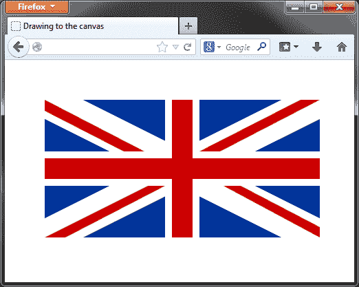
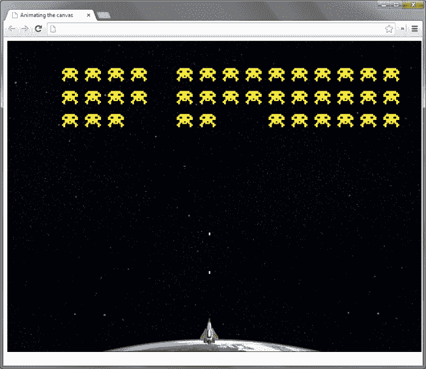

# 第十章：画布动画

*在上一章中，我们看了最新的 CSS3 功能之一，`transform`属性，它使我们能够创建动画旋转、扭曲、缩放和转换。在本章中，我们将看一下 HTML5 的新添加——`<canvas>`元素。*

*最好的方法是将`<canvas>`元素视为艺术家绘画的画布。我们可以使用 JavaScript API 方法绘制简单的线条或复杂的形状，并且还支持图像和文本。目前画布是二维的，但将来可能会扩展到包括 3D 支持。*

*`<canvas>`元素首先由苹果提出和使用，已被大多数现代浏览器实现，并被认为是 HTML5 规范中最稳定的元素之一。*

*我见过的关于`<canvas>`元素的最好描述是：“一个画布是你页面上的一个矩形，你可以用 JavaScript 来绘制任何你想要的东西”，来自[diveintohtml5.info](http://diveintohtml5.info)，我觉得这描述得很好。*

本章将讨论的主题包括：

+   HTMLCanvasElement 接口

+   绘制到`<canvas>`元素

+   动画化`<canvas>`元素

+   使用`<canvas>`与 jQuery

+   创建基于`<canvas>`的游戏

# 学习 HTMLCanvasElement 接口

HTMLCanvasElement 接口公开了允许我们定义和控制在画布上绘制的形状的方法和属性。HTMLCanvasElement 接口可以根据方法的作用被分解为不同的部分。

## 使用 canvas 元素

`<canvas>`元素本身有一些可以调用的方法，包括：

| 方法 | 用法 |
| --- | --- |
| `getContext(a)` | 返回一个对象（一个精确的`CanvasRenderingContext2D`对象），然后可以调用 API 的其他方法来操纵`<canvas>`元素。参数指定要检索的上下文类型。目前仅支持二维上下文。 |
| `toDataURL()` | 返回代表`<canvas>`元素上图像的数据 URL。可选参数包括数据 URL 表示的图像类型（默认为 image/PNG），以及特定于类型的任何参数，例如图像/JPG 数据 URL 的质量。 |

`<canvas>` 元素可以被视为类似于没有 `src` 属性的 `` 元素。允许的属性包括元素的 `width` 和 `height` 参数，以及 `id` 和 `class` 属性，等等。`<canvas>` 元素没有特殊的属性，尽管它可以包含其他元素。当浏览器无法显示 `<canvas>` 元素时，它可以将元素的内容显示为备用内容。我们只能访问 `<canvas>` 元素的 `width` 和 `height` 参数。设置其中任何一个属性会导致 `<canvas>` 元素将其内容重置为空，这在我们想要清除它时会很有用。

## 理解上下文方法

有两个方法与由 `getContext()` 方法返回的上下文对象直接相关。它们是：

| 方法 | 用法 |
| --- | --- |
| `save()` | 保存画布的当前状态；只保存转换，不保存形状或路径。 |
| `restore()` | 恢复保存的状态。 |

我们还可以设置一些适用于 `<canvas>` 元素上所有形状的全局属性。这些属性包括：

| 属性 | 用法 |
| --- | --- |
| `globalAlpha` | 设置形状的 alpha 透明度。取值范围为 0.0 到 1.0 的小数。 |
| `globalCompositeOperation` | 设置形状如何叠放在彼此之上。可以用来创建遮罩和清除形状的区域。 |

## 本地形状

`<canvas>` 元素仅定义了一个本地形状：矩形。这里需要注意的一点是，`<canvas>` 元素没有内部的 DOM 树——在 `<canvas>` 元素上绘制的形状或路径不会被创建为 `<canvas>` 元素的子元素，并且不能使用标准的 DOM 操作方法来访问它们。它们不是单独的对象，它们只是像素。与矩形相关的脚本 API 方法包括：

| 方法 | 用法 |
| --- | --- |
| `clearRect(a,` `b,` `c,` `d)` | 从画布的某个区域移除所有形状和路径。参数 `a` 和 `b` 指定开始清除的坐标，参数 `c` 和 `d` 指定要清除的区域的宽度和高度。 |
| `fillRect(a,` `b,` `c,` `d)` | 绘制矩形。参数 `a` 和 `b` 指定开始绘制的坐标，参数 `c` 和 `d` 指定其边的宽度和高度。 |
| `strokeRect(a,` `b,` `c,` `d)` | 绘制矩形的轮廓。参数 `a` 和 `b` 表示形状的起始坐标，参数 `c` 和 `d` 表示其边的宽度和高度。 |

我们可以使用以下属性设置描边（轮廓）或填充的颜色，以及阴影：

| 属性 | 用法 |
| --- | --- |
| `fillStyle` | 设置填充的颜色。可以设置为 CSS 颜色或渐变对象。 |
| `shadowBlur` | 设置阴影的模糊程度。 |
| `shadowColor` | 设置阴影的颜色。可以设置为 CSS 颜色或梯度对象。 |
| `shadowOffsetX` | 设置阴影沿 x 轴的相对位置。 |
| `shadowOffsetY` | 设置阴影沿 y 轴的相对位置。 |
| `strokeStyle` | 设置描边的颜色。可以设置为 CSS 颜色或梯度对象。 |

这些属性也可以设置在路径和文本上。它们不仅限于本地形状。

## 使用路径进行绘制

除了矩形之外的任何形状都必须使用路径来绘制。这为我们提供了绘制自定义和复杂形状的灵活方式。创建路径的一些方法包括：

| 方法 | 用法 |
| --- | --- |
| `arc(a, b, c, d, e, f)` | 绘制圆形子路径。参数 `a` 和 `b` 是子路径的起始坐标，`c` 是半径，`d` 是以弧度表示的起始角度，`e` 是以弧度表示的结束角度。最后一个参数 `f` 接受一个布尔值，表示是否逆时针绘制子路径。 |
| `arcTo(a, b, c, d, e)` | 绘制到指定点的圆形子路径。参数 `a` 和 `b` 是起始坐标，`c` 和 `d` 是结束坐标。参数 `e` 是半径。 |
| `beginPath()` | 开始新路径。 |
| `bezierCurveTo(a, b, c, d, e, f)` | 沿贝塞尔曲线绘制子路径，贝塞尔曲线具有两个控制点。参数 `a`、`b`、`c` 和 `d` 表示两个控制点的坐标，参数 `e` 和 `f` 表示子路径的结束坐标。 |
| `closePath()` | 通过从当前位置到当前路径列表中第一个子路径的起始位置绘制一条线来关闭路径。 |
| `fill()` | 给当前路径创建的形状上色。 |
| `lineTo(a, b)` | 从当前位置创建到指定坐标的新子路径。 |
| `moveTo(a, b)` | 移动到由参数指定的坐标，而不绘制新的子路径。 |
| `quadraticCurveTo(a, b, c, d)` | 沿二次曲线绘制子路径，二次曲线具有一个控制点。参数 `a` 和 `b` 表示控制点的坐标，而参数 `c` 和 `d` 表示子路径的结束坐标。 |
| `stroke()` | 给当前路径列表的轮廓上色。 |

路径具有可以设置的几个属性，包括样式、线条或端点以及路径如何连接：

| 属性 | 用法 |
| --- | --- |
| `lineCap` | 可以设置为 `butt`（默认）、`round` 或 `square`。 |
| `lineJoin` | 可以设置为 `miter`（默认）、`round` 或 `bevel`。 |
| `lineWidth` | 指定路径的宽度的小数。 |
| `miterLimit` | 确定两个路径连接的内点与连接斜接前的外点之间的长度。 |

## 绘制图像和图案

画布允许我们以与为其他元素分配背景图像的方式将图像绘制到画布上。我们还可以基于图像或渐变绘制图案。这类方法包括：

| 方法 | 用法 |
| --- | --- |
| `drawImage(a,` `b,` `c)` | 在`<canvas>`元素上绘制图像。参数`a`是要绘制的图像，参数`b`和`c`是放置图像左上点的坐标。请注意，该方法存在其他变体，允许以不同的参数组合放置、缩放和切片图像。 |
| `createPattern(a,` `b)` | 在`<canvas>`元素上绘制重复的图案。参数`a`是要用作图案的图像，`b`是重复的类型。 |
| `createLinearGradient(a,` `b,` `c,` `d)` | 在两个点之间创建线性渐变。参数`a`和`b`是渐变的起始坐标，`c`和`d`是结束坐标。 |
| `createRadialGradient(a,` `b,` `c,` `d,` `e,` `f)` | 在两个圆之间创建径向渐变。参数`a`和`b`是起始坐标，`c`是第一个圆的半径。参数`d`和`e`是第二个圆的起始坐标，`f`是它的半径。 |
| `addColorStop(a,` `b)` | 为渐变添加颜色。第一个参数是介于 0.0 和 1.0 之间的十进制数，表示要添加颜色的渐变内的相对位置。第二个参数是要使用的颜色。 |

`drawImage()`和`createPattern()`方法非常相似；它们都用于在`<canvas>`元素上绘制图像。不同之处在于图案是重复的。渐变方法返回一个渐变对象，然后可以将其用作形状的填充或描边样式。

## 文本字符串

可以将文本字符串写入画布，但我们无法对其进行太多的样式设置，因为文本没有关联的盒模型；这意味着没有填充、边距或边框。但是，我们可以使用其他属性设置字体和对齐方式，以及填充颜色或描边颜色。这些方法包括：

| 方法 | 用法 |
| --- | --- |
| `fillText(a,` `b,` `c)` | 在`<canvas>`元素上创建实心文本字符串。第一个参数`a`是要写入的文本，参数`b`和`c`是文本的起始坐标。 |
| `measureText(a)` | 测量指定的文本字符串，并返回一个具有宽度属性的度量对象。 |
| `stroketext(a,` `b,` `c)` | 在`<canvas>`元素上创建轮廓文本字符串。第一个参数是要写入的文本，参数`b`和`c`是文本的起始坐标。 |

我们可以设置文本的属性包括：

| 属性 | 用法 |
| --- | --- |
| `font` | 设置文本的大小和字体系列。 |
| `textAlign` | 设置文本的对齐方式。可以是`start`（默认值）、`end`、`left`、`right`或`center`。 |
| `textBaseline` | 设置文本的基线。可以是`alphabetic`（默认值）、`top`、`hanging`、`middle`、`ideographic`或`bottom`。 |

## 应用变换方法

`<canvas>`元素可以应用与上一章中看到的相同的变换，可以使用以下方法应用：

| 方法 | 用法 |
| --- | --- |
| `rotate(a)` | 将形状旋转指定的弧度数。 |
| `scale(a,` `b)` | 按指定量沿每个轴缩放形状，其中`a`为 x 轴，`b`为 y 轴。 |
| `translate(a,` `b)` | 沿每个轴按指定量平移形状，其中`a`为 x 轴，`b`为 y 轴。 |
| `transform(a,` `b,` `c,` `d,` `e,` `f)` | `transform()`方法等效于矩阵变换函数形式，可以用相同的方式来缩放、平移和/或倾斜形状。 |
| `setTransform(a, b, c, d, e, f)` | 将当前变换重置为标识矩阵，然后使用相同的参数调用`transform()`方法。这本质上是撤消当前变换，然后一次性设置指定的变换。 |

## 像素处理

`<canvas>`元素甚至允许我们直接处理画布中的像素，并且可以将形状检索为`imageData`对象，或者通过在像素级别操作`<canvas>`元素来直接创建形状。我们有以下用于操作像素的方法：

| 方法 | 用法 |
| --- | --- |
| `createImageData(a,` `b)` | 使用提供的参数作为宽度和高度属性创建一个新的空白`imageData`对象。此方法还可以传递给另一个`imageData`对象，这将导致该方法返回一个与原始对象相同宽度和高度的（空白的）`imageData`对象。 |
| `getImageData(a,` `b,` `c,` `d)` | 返回一个包含`<canvas>`元素指定区域的像素数据的`imageData`对象。参数`a`和`b`是区域的起始坐标，参数`c`和`d`是宽度和高度。 |
| `putImageData(a,` `b,` `c)` | 将像素数据绘制到`<canvas>`元素。第一个参数是要使用的`imageData`对象，第二个和第三个是结果形状的起始坐标。 |

所有`imageData`对象，无论是我们从`<canvas>`元素获取的对象，还是我们使用`createImageDate()`方法创建的对象，都有几个属性可供我们使用，包括：

| 属性 | 用法 |
| --- | --- |
| `data` | 此属性是`CanvasPixelArray`，当我们从`<canvas>`元素获取`imageData`对象时为只读。我们还可以使用它来设置我们创建的`imageData`对象中的像素数据。数组每个像素包含四个项：像素的`r`、`g`和`b`值以及 alpha 值。 |
| `height` | 图像的高度由`imageData`对象表示。此属性为只读。 |
| `width` | 图像的宽度由`imageData`对象表示。此属性为只读。 |

# 绘制到画布上

以编程方式绘制到 `<canvas>` 元素在理论上非常简单。方法和属性易于使用，在支持的浏览器之间相当一致。直接像素操作是掌握的 API 中最棘手的部分，但除此之外没有什么真正复杂的。

我们发现的一件事是我们的代码很快就会堆积起来。一旦我们绘制多个复杂形状，并设置各种属性，即使对于相对简单的绘图，我们的代码很容易就会达到几百行甚至更多。这在动画 `<canvas>` 元素的内容时尤为明显。

# 动作时间 - 绘制到画布上

让我们看一个快速绘制非动画形状的示例。我们甚至不需要 jQuery。

1.  将 `<canvas>` 元素添加到我们模板文件的 `<body>` 标签中：

    ```js

    <canvas id="c" width="500" height="300">

    <p>您的浏览器不支持画布元素！</p>

    </canvas>

    ```

1.  接下来，我们可以添加 JavaScript 来绘制 `<canvas>` 元素。我们将绘制一个联合国旗。在模板文件底部的 `<script>` 元素中的函数中添加以下代码，并将其替换为以下代码：

    ```js

    var canvas = document.getElementById("c"),

    context = canvas.getContext("2d");

    context.fillStyle = "#039";

    context.fillRect(50, 50, 400, 200);

    context.beginPath();

    context.strokeStyle = "#fff";

    context.lineWidth = 50;

    context.moveTo(250, 50);

    context.lineTo(250, 250);

    context.moveTo(50, 150);

    context.lineTo(450, 150);

    context.moveTo(50, 50);

    context.lineTo(450, 250);

    context.moveTo(50, 250);

    context.lineTo(450, 50);

    context.stroke();

    context.closePath();

    context.strokeStyle = "#C00";

    context.lineWidth = 30;

    context.beginPath();

    context.moveTo(250, 50);

    context.lineTo(250, 250);

    context.moveTo(50, 150);

    context.lineTo(450, 150);

    context.stroke();

    context.closePath();

    context.lineWidth = 1;

    context.fillStyle = "#C00";

    context.beginPath();

    context.moveTo(50, 50);

    context.lineTo(195, 125);

    context.lineTo(165, 125);

    context.lineTo(50, 66);

    context.fill();

    context.closePath();

    context.beginPath();

    context.moveTo(450, 50);

    context.lineTo(305, 125);

    context.lineTo(275, 125);

    context.lineTo(422, 50);

    context.lineTo(450, 50);

    context.fill();

    context.closePath();

    context.beginPath();

    context.moveTo(450, 250);

    context.lineTo(310, 175);

    context.lineTo(335, 175);

    context.lineTo(450, 235);

    context.lineTo(450, 250);

    context.fill();

    context.closePath();

    context.beginPath();

    context.moveTo(50, 250);

    context.lineTo(200, 175);

    context.lineTo(225, 175);

    context.lineTo(80, 250);

    context.lineTo(50, 250);

    context.fill();

    context.closePath();

    ```

1.  将文件保存为 `canvas.html`。

1.  如果我们现在在任何现代浏览器中运行页面，应该会看到类似以下截图的内容：

1.  在前面的屏幕截图中，我们可以看到组成英国国旗的简单几何形状的简单排列（注意国旗并非完全按比例缩放）。像这样的图像使用`<canvas>`元素很容易生成，但是即使简单的形状也可能需要大量的代码。

## *刚才发生了什么？*

我们首先使用 JavaScript 的`getElementById()`方法获取`<canvas>`元素，然后使用`getContext()`方法从`<canvas>`元素获取二维上下文对象。现在我们可以通过上下文对象与`<canvas>`元素交互了。

我们使用`fillStyle`属性设置一些上下文的颜色，然后使用`fillRect()`方法绘制一个实心矩形。指定的参数是矩形的起始 x 和 y 位置，以及宽度和高度。

填充的矩形采用我们刚刚设置的填充样式，即深蓝色，并将形成国旗的背景。现在我们需要在蓝色背景上创建一个白色的水平和对角十字。我们可以通过在国旗中间绘制两条粗线条，一条垂直，一条水平来实现这一点。我们将使用路径进行此操作，因此我们使用`beginPath()`方法开始一个新路径。

接下来，我们使用`strokeStyle`属性将描边颜色设置为白色，并使用`lineWidth`属性设置路径的宽度。要绘制路径，我们必须告诉`<canvas>`元素（或者实际上是上下文对象）从哪里开始路径，我们使用`moveTo()`方法，将要移动到的坐标作为参数指定（矩形的顶部中间）。

要生成路径，我们然后使用`lineTo()`方法并指定路径的结束坐标（矩形的底部中间）。这给我们了垂直线。要生成水平路径，我们重复相同的过程，移动到矩形的左中部并绘制到右中部。

使用`moveTo()`方法指定的坐标始终相对于画布本身，其中`0,` `0`代表画布的左上角。即使对于`lineTo()`方法也是如此，尽管所绘制的线条始于上一次调用`moveTo()`指定的点。

接下来，我们需要在背景矩形和垂直十字上绘制一个对角的白色十字，我们将使用相同的方法绘制路径，使用`moveTo()`和`lineTo()`方法的组合。

到目前为止，我们添加的所有路径都是同一路径的一部分——它们是子路径，并且此时它们实际上是不可见的。为了使它们可见，我们需要填充或描边它们，因此我们使用`stroke()`方法描边它们，然后使用`closePath()`方法关闭路径。

对于国旗的下一部分，我们需要在白色十字上绘制一个略细的红色十字。我们将使用另一个路径来实现这一点。我们设置新的颜色样式和宽度，并再次在矩形中心绘制新的路径，垂直和水平方向。

要完成国旗，我们需要添加四个形状来制作红色十字架的对角部分。对于这些部分，我们不能使用直线路径，因为它们不相交，而且它们的位置略有不同。这意味着我们必须手动绘制它们作为自定义形状并对其进行填充。

这四个形状实际上构成了大部分代码，但我们基本上在做与以前非常相似的事情。每个形状都是通过绘制子路径并填充它们来制作的。我们为每种形状使用新路径以保留线条的抗锯齿效果。如果我们为所有四个形状使用一个大路径，形状的边缘会变得锯齿状。

## 快速测验——绘制到画布上

Q1\. `fillRect()`方法需要什么参数？

1.  矩形的 x 和 y 位置

1.  矩形的宽度和高度

1.  矩形的 x 和 y 位置，宽度和高度以及颜色

1.  矩形的 x 和 y 位置，以及宽度和高度

Q2\. 使路径可见需要哪个方法？

1.  `strokeStyle`和`lineWidth`

1.  `moveTo()`和`lineTo()`

1.  `stroke()`或`fill()`

1.  `closePath()`

## 尝试英雄——创建你的国旗

如果你不是来自英国，可以尝试在画布上绘制你自己国家的国旗。我们可以使用标准 JavaScript for 循环创建重复形状的组合，所以尽可能充分利用它，以使你的国旗所需的代码尽可能少。如果你来自英国，可以尝试重新创建一个喜爱的标志或图标。

如果你的国旗（或 logo）的某一部分非常复杂，记住我们可以将图像绘制到`<canvas>`元素以外，还可以使用线条和形状，所以可以随意使用`<canvas>`元素的绘制方法绘制国旗的基本部分，然后对于复杂的部分使用图像。

# 画布动画

到目前为止，我们所看到的`<canvas>`方法很容易使用，它们无非就是有点重复。在`<canvas>`元素上对对象进行动画处理才是开始变得有趣的地方。动画比简单绘制在`<canvas>`上要复杂，而且因为我们除了试错之外没有真正的调试方法，解决 bug 可能很快变得棘手和耗时。

在我们的国旗例子中，使用`<canvas>`元素其实没有太大的好处。我们完全可以通过在页面上简单包含国旗图像来达到完全相同的效果，并且代码和处理量要少得多。但是，从`<canvas>`元素的动画开始才是它真正好处的地方。这是我们可以做比简单图像更多的东西的地方。动画`<canvas>`元素带来额外的复杂性完全是值得的。

# 行动时间——在画布上创建一个动画

在这个例子中，我们将像以前一样绘制相同的国旗，只是这一次我们将以动画不同的形状。此示例中使用的基本 HTML 与以前的示例完全相同。改变的只是在`<body>`元素末尾的`<script>`元素的内容。

1.  为了制作本示例的工作文件，只需删除 `canvas-explorer.html` 底部 `<script>` 元素中的所有内容，然后将文件另存为 `canvas-animated.html`。

1.  首先，我们将把蓝色矩形从 `<canvas>` 的侧面移动到 `<canvas>` 元素的中心。将以下代码添加到页面底部现在空的 `<script>` 元素中：

    ```js

    (function() {

    var canvas = document.getElementById("c"),

    init = function(context) {

        var width = 0,

        pos = 0,

        rectMotion = function() {

            if (width < 400) {

            width = width + 2;

            context.fillStyle = "#039";

            context.fillRect(0, 50, width, 200);

            } else if (pos < 50) {

            pos = pos + 2;

            canvas.width = 500;

            context.fillStyle = "#039";

            context.fillRect(pos, 50, 400, 200);

            } else {

            clearInterval(rectInt);

            whiteLines(context);

            }

        },

        rectInt = setInterval(function() { rectMotion() }, 1);

    };

    if (window.ActiveXObject) {

        window.onload = function() {

        var context = canvas.getContext("2d");

            init(context);

        }

    } else {

        var context = canvas.getContext("2d");

        init(context);

    }

    })();

    ```

## *刚才发生了什么？*

在本章的之前示例中，我们的所有变量都是全局的，这在实际编码中通常是不良的实践。在这个示例中，我们的代码位于匿名函数的范围内，因此变量只能在该函数内部访问，因此不被视为全局变量。

在 `init()` 函数中，我们声明 `width` 和 `pos` 变量，然后定义另一个内联函数 `rectMotion()`，该函数将被间隔地重复调用。在 `<canvas>` 元素的边界之外绘制的任何形状都不存在，因此我们无法在视图之外绘制一个矩形，然后将其动画化为视图内。相反，我们逐渐建立矩形，从左边缘开始逐渐增加矩形的宽度，直到它的宽度正确为止。

这是使用 `if` 语句的第一个分支完成的，当 `width` 变量小于 400 时将执行该分支。为了加快动画速度，我们实际上每次增加两个像素的矩形宽度（尽管动画速度在不同的浏览器之间也有很大的差异），通过增加 `width` 变量，然后将变量用作 `fillRect()` 方法的 `width` 参数。

一旦 `width` 变量达到 400，我们就切换到使用 `pos` 变量。在这部分条件中，我们将 `pos` 变量增加两个（矩形将看起来每次移动两个像素，再次为了速度），通过设置其宽度重置 `<canvas>` 元素，并设置 `fillStyle` 属性。然后，我们绘制新的矩形，使用 `pos` 变量作为 x 轴位置的参数。

看起来好像矩形正在向右移动，但实际上并非如此。我们实际上是销毁了矩形，然后绘制了一个完全新的矩形，它比原来的位置右移了两个像素。

矩形位于正确的位置后，我们清除间隔，然后调用下一个函数（很快我们将添加这个），传递上下文对象。在`rectMotion()`函数之后，我们添加一个包含调用函数以动画矩形的 ID 的最终变量。完成动画后，我们使用此变量清除间隔。

如果此时在浏览器中运行页面，蓝色矩形似乎从左侧移入`<canvas>`元素，然后停在中间。接下来，我们需要在蓝色矩形上方动画显示水平和对角线白色交叉线。

# 实施行动-动画显示白十字架

在动画的这一部分，我们将在矩形的中间和中心画一条白线，然后将对角线交叉点从中心扩展到角落。以下代码应该添加到目前为止的代码中的`canvas`和`init`变量之间：

```js

whiteLines = function(context) {

context.fillStyle = "＃fff";

context.strokeStyle = "＃fff";

context.lineWidth = 50;

var width = 0,

    height = 0,

    pos = {

    ne: { x: 250, y: 150 },

    se: { x: 250, y: 150 },

    nw: { x: 250, y: 150 },

    sw: { x: 250, y: 150 }

    },

    growDiagonal = function() {

    if (pos.ne.x >= 50) {

    context.beginPath();

    context.moveTo(pos.ne.x, pos.ne.y);

    context.lineTo(pos.ne.x - 4, pos.ne.y - 2);

    context.moveTo(pos.se.x, pos.se.y);

    context.lineTo(pos.se.x - 4, pos.se.y + 2);

    context.moveTo(pos.nw.x, pos.nw.y);

    context.lineTo(pos.nw.x + 4, pos.nw.y + 2);

    context.moveTo(pos.sw.x, pos.sw.y);

    context.lineTo(pos.sw.x + 4, pos.sw.y - 2);

    context.stroke();

    context.closePath();

    pos.ne.x = pos.ne.x - 2;

    pos.ne.y = pos.ne.y - 1;

    pos.se.x = pos.se.x - 2;

    pos.se.y = pos.se.y + 1;

    pos.nw.x = pos.nw.x + 2;

    pos.nw.y = pos.nw.y + 1;

    pos.sw.x = pos.sw.x + 2;

    pos.sw.y = pos.sw.y - 1;

    } else {

    clearInterval(crossInt);

    redCross(context);

    }

},

growVertical = function() {

    if (height < 200 || width < 400) {

    if (height < 200) {

        height = height + 2;

        context.fillRect(225, 50, 50, height);

    }

    if (width < 400) {

        width = width + 4;

        context.fillRect(50, 125, width, 50);

    }

    } else {

    clearInterval(rectInt);

    crossInt = setInterval(function() { growDiagonal() }, 1);

    }

},

rectInt = setInterval(function() { growVertical() }, 1);

},

```

## *发生了什么？*

本质上，我们有另一个内联函数，其中包含另一个函数，该函数以另一个间隔重复调用。由于我们这次画白色十字架，因此我们需要设置一些样式属性（在该函数中我们将画线和矩形，因此设置`fillStyle`和`strokeStyle`）以及`lineWidth`属性。

我们初始化`width`和`height`控制变量，这些变量将控制间隔运行的次数，还将起始位置垂直和对角线交叉点存储在一个名为`pos`的对象中。

接下来，我们定义两个内联函数，一个用于创建垂直十字架，另一个用于创建对角十字架。首先使用一个间隔调用`growVertical()`函数，我们只需在背景的中心从上到下绘制一个白色矩形，然后使用`width`和`height`变量重复间隔，直到矩形达到正确尺寸。一旦矩形的尺寸正确，间隔就会清除，然后使用另一个间隔调用`growDiagonal()`函数。

在这个函数中，我们需要绘制四条线，每条线都从垂直交叉点的中间开始。我们使用`pos`对象中的不同属性来实现这一点。每次执行函数时，我们移动到对象中每条线指定的 x 和 y 位置，然后绘制到相关的角落。然后我们更新对象中的属性，以准备函数的下一次迭代。

每个属性都需要以不同的量进行更新，例如，从中心移动到矩形的左上角的线需要沿着 x 和 y 轴负向移动，而移动到右上角的线需要沿着 x 轴正向移动，但沿着 y 轴负向移动。我们在函数的每次迭代中使用新路径来保留线条的反锯齿效果。

一旦线条绘制完成，我们清除间隔并调用下一个函数。现在我们来定义这个函数。它应该放在`canvas`变量之后，但直接放在我们刚刚添加的`whiteLines()`函数之前。

# 动手行动-为红色十字架添加动画

现在我们只需要绘制垂直红色十字架和四个自定义红色形状。在`<script>`元素顶部附近的`rectInt`变量声明和我们在上一节中定义的`whiteLines`函数之间添加以下代码：

```js

redCross = function(context) {

context.fillStyle = "#C00";

context.strokeStyle = "#C00";

context.lineWidth = 30;

var width = 0,

    height = 0,

    pos = {

    up : { x: 250, y: 150 },

    down : { x: 250, y: 150 },

    left: { x: 250, y: 150 },

    right: { x: 250, y: 150 }

    },

    addStripes = function() {

    context.lineWidth = 1;

    function makeStripe(props) {

        context.beginPath();

        context.moveTo(props.startX, props.startY);

        context.lineTo(props.line1X, props.line1Y);

        context.lineTo(props.line2X, props.line2Y);

        context.lineTo(props.line3X, props.line3Y);

        context.fill();

        context.closePath();

    }

    setTimeout(function() { makeStripe({

        startX: 50, startY: 50,

        line1X: 195, line1Y: 125,

        line2X: 165, line2Y: 125,

        line3X: 50, line3Y: 66

    })}, 1);

    setTimeout(function() { makeStripe({

        startX: 450, startY: 50,

        line1X: 305, line1Y: 125,

        line2X: 275, line2Y: 125,

        line3X: 422, line3Y: 50

    })}, 50);

    setTimeout(function() { makeStripe({

        startX: 450, startY: 250,

        line1X: 310, line1Y: 175,

        line2X: 335, line2Y: 175,

        line3X: 450, line3Y: 235

    })}, 100);

    setTimeout(function() { makeStripe({

        startX: 50, startY: 250,

        line1X: 200, line1Y: 175,

        line2X: 225, line2Y: 175,

        line3X: 80, line3Y: 250

    })}, 150);

    },

    growVertical = function() {

    if (height < 100 || width < 200) {

        如果 (height < 100) {

        context.beginPath();

        context.moveTo(pos.up.x, pos.up.y);

        context.lineTo(pos.up.x, pos.up.y - 2);

        context.moveTo(pos.down.x, pos.down.y);

        context.lineTo(pos.down.x, pos.down.y + 2);

        context.stroke();

        context.closePath();

        height = height + 2;

        pos.up.y = pos.up.y - 2;

        pos.down.y = pos.down.y + 2;

        }

        if (width < 200) {

        context.beginPath();

        context.moveTo(pos.left.x, pos.left.y);

        context.lineTo(pos.left.x - 2, pos.left.y);

        context.moveTo(pos.right.x, pos.right.y);

        context.lineTo(pos.right.x + 2, pos.right.y);

        context.stroke();

        context.closePath();

        width = width + 2

        pos.left.x = pos.left.x - 2;

        pos.right.x = pos.right.x + 2;

        }

    } else {

        clearInterval(crossInt);

        addStripes();

    }

    },

    crossInt = setInterval( function() { growVertical() }, 1);

},

```

## *刚刚发生了什么？*

再次，我们有一个外部内联函数（称为`redCross()`）包含设置颜色和线样式的一些属性，以及将用于绘制红十字和四个自定义形状的一些嵌套函数。与前一个函数一样，我们声明了`width`和`height`控制变量，以及一个名为`pos`的对象，其中包含组成十字形的线的起始位置。首先用`growVertical()`函数绘制十字。

这个函数与上一节代码中的函数非常相似。我们从矩形中间开始绘制四条线，向上和向下中心，以及右边和左边中心辐射。

四个自定义形状使用一个主函数来绘制，该函数接受一个配置对象，指定开始点（传递给`moveTo()`方法）和组成每个子路径的点（传递给`lineTo()`方法）。然后，我们使用`setTimeout` JavaScript 函数来依次创建每个形状，使用传递给主函数的对象来指定在画布上绘制每个形状的相关点。

这是我们需要的所有代码；因此，当我们运行页面时，我们应该看到绘制旗帜动画。代码在所有浏览器中都可以运行，每个浏览器的性能各不相同。动画`<canvas>`元素主要是关于条件`if`语句，间隔和超时。正如我们所见，代码本身非常简单。我们只需要相当多的代码来产生甚至简单的动画。

## 快速测验 – 动画化画布

Q1\. 为什么我们将每次调用`setInterval()`存储在一个变量中？

1.  出于性能原因

1.  为了在适当时清除间隔

1.  由于使用匿名函数作为函数的第一个参数创建的闭包

1.  以便我们可以将参数传递给间隔调用的函数

Q2\. 在第一个函数中，我们绘制了蓝色矩形，在每次间隔调用`rectMotion()`函数时，我们设置了`<canvas>`元素的宽度。为什么？

1.  确保`<canvas>`元素足够大，以容纳矩形随着其增长而增长

1.  为了纠正 Internet Explorer 中的一个错误

1.  重置`<canvas>`元素的状态，确保动画中每个点上只有一个矩形

1.  作为设置`fillStyle`属性的要求

## 试试吧——创建画布动画

返回您绘制的家乡国家的国旗（或您选择的标志或图像）的静态版本，并将其转换为动画，并呈现出不同的国旗部分。

# 创建一个画布游戏

最好的动画是那些交互性强、能够吸引用户的动画，这正是游戏可以被视为一种连续的、用户驱动的动画的方式。当它用于创建游戏时，`<canvas>`元素的强大功能最能得到展示，正如我们将在本节中看到的那样。

我们将创建一个非常基本的街机经典游戏*Space Invaders*的克隆版本，其中包括一系列慢慢向屏幕下方移动的外星飞船，以及底部由用户控制可以射击进来的外星飞船：



# 行动时间——创建初始页面

我们将用于此示例的初始页面与上一个示例中使用的类似：

1.  在文本编辑器中创建一个新页面，其中包含以下标记：

    ```js

    <!DOCTYPE html>

    <html lang="en">

    <head>

        <meta charset="utf-8">

        <title>一个画布和 jQuery 游戏</title>

        <link rel="stylesheet" href="css/canvas-game.css">

    </head>

    <body>

        <canvas tabindex="1" id="c" width="900" height="675">

        <p>您的浏览器不支持 canvas 元素！</p>

        </canvas>

        <script src="img/jquery.js"></script>

        <script>

        $(function() {

        });

        </script>

    </body>

    </html>

    ```

1.  将文件保存为`canvas-game.html`。我们还需要一个非常基本的样式表来制作我们的游戏。我们所做的全部就是对`<canvas>`元素本身进行样式设置。创建一个包含以下样式规则的新样式表：

    ```js

    画布 {

    border:1px solid #000;

    margin:auto;

    display:block;

    outline:none;

    背景:url(../img/bg.gif) no-repeat;

    }

    ```

1.  将此文件保存在`css`目录中，命名为`canvas-game.css`。

## *刚刚发生了什么？*

页面上的主要元素当然是`<canvas>`元素。与以前示例中使用的元素唯一的区别在于我们在其上设置了`tabindex`属性，以便它可以接收键盘事件，这对于检测和响应用户输入是必要的。在此示例中，我们还使用了 jQuery，并使用了标准的匿名函数和我们在整本书中一直使用的`$`别名构造。

我们使用的样式简单地将`<canvas>`元素定位在页面中央，给它加上边框，并移除一些浏览器中焦点元素周围出现的虚线轮廓。我们还在元素上设置了背景图像。

应用于`<canvas>`元素的背景图像有助于为我们的游戏设置场景，并且使用 CSS 在`<canvas>`元素上设置背景图像比在其中绘制图像要容易得多。

# 采取行动的时间 - 创建初始脚本

游戏的脚本相当长，因此我们将以不同的部分来查看它，从脚本的初始结构开始。以下代码应该放入页面底部的匿名函数中：

```js

var canvas = document.getElementById("c"),

context = canvas.getContext("2d"),

motionInt = null,

dirCounter = 0,

alienSpeed = 1000,

aliens = [],

alienMotion = function(dir) {

},

    addAliens = function() {

    },

    ship = new Image(),

    shipPos = [430, 600];

    ship.src = "img/ship.png";

    ship.onload = function() {

    context.drawImage(ship, shipPos[0], shipPos[1]);

    addAliens();

};

```

## *刚刚发生了什么？*

本质上，我们在这里所做的一切就是定义一系列变量和一个`onload`事件处理程序。首先定义`canvas`和`context`变量，就像以前的示例一样，以便访问和操作画布。

我们还设置了一个名为`motionInt`的变量，稍后将用于保存`setInterval()`函数的 ID，一个名为`dirCounter`的变量，用于确定外星人移动的方向，一个`alienSpeed`变量来设置外星人移动的速度，并且一个空的`aliens`数组，我们将用它来跟踪页面上的每个外星人。

接着，我们定义了两个内联函数，一个用于移动外星人，一个用于将外星人添加到页面。目前它们都是空的，但接下来我们将填充它们。我们还创建了一个新的图像，它将是用户控制的太空船，并且一个`shipPosition`数组，将用于跟踪船在页面上的位置。

定义了所有变量后，我们将新创建的图像对象的`src`设置为代表太空船的图像。然后，我们将一个`onload`事件处理程序附加到船对象，该处理程序将在图像加载完成后执行。在此函数中，我们使用存储在`imagePosition`数组中的值在画布上绘制船。然后，我们调用`addAliens()`函数，该函数将在画布上添加外星人。接下来，我们可以添加代码到`addAliens()`函数。

# 采取行动的时间 - 将外星人添加到页面

用以下代码替换前一代码块中的`addAliens()`内联函数：

```js

addAliens = function() {

var alienPos = [13, 0],

alien = new Image();

alien.src = "img/alien.gif";

alien.onload = function () {

    for (var x = 0; x < 15; x++) {

    for (var y = 0; y < 3; y++) {

        context.drawImage(alien, alienPos[0], alienPos[1]);

        var data = {

        img：alien，posX：alienPos[0]，posY：alienPos[1]

        };

        aliens.push(data);

        if (alienPos[1] < 100) {

        alienPos[1] = alienPos[1] + 50;

        } else {

        alienPos[0] = alienPos[0] + 50;

        alienPos[1] = 0;

        }

    };

    }

};

motionInt = setInterval(function () { alienMotion("right"); }, alienSpeed);

},

```

## *刚刚发生了什么？*

我们首先定义一个新数组，用于逐步设置每艘外星人飞船的位置，同时外星人最初被绘制到画布上。我们为将用于所有外星人飞船的图像定义一个新的`Image`对象，并设置其`src`属性。然后我们为新外星人图像设置一个`onload`处理程序，以便在图像加载完成后对图像进行操作。

我们想要创建三行各含 15 个外星人，所以在`onload`处理程序中，我们从两个嵌套的`for`循环开始，其中外部循环运行 15 次，在每次循环时，内部`for`循环执行三次。在嵌套循环内部，我们首先使用存储在`alienPos`数组中的值将新外星人绘制到画布上。然后，我们创建一个新的`data`对象，该对象存储了图像对象的引用以及图像在画布上的 x 和 y 位置。然后将新的`data`对象推入我们之前在脚本开始处定义的`aliens`数组中。

我们接着更新`alienPos`数组中的值。如果数组中的第二项（索引为`1`的项）小于`100`，我们就给该数组项的值加上`50`。数组中的第二项对应画布上 y 轴的位置。这样我们就得到了一个包含三个外星人的单列。请注意，我们将第一列外星人的 x 位置从`0`开始改为从`13`开始，这样画布的边缘和第一列外星人之间就有了间隙。

如果第二个数组项大于`100`，我们将`50`添加到数组中的第一个项，该项对应画布上的 x 轴，并将第二个数组项重置为零。这样我们就得到了三个外星人的 15 列。

一旦所有外星人都已绘制到画布上，我们就设置一个间隔，根据`alienSpeed`变量中包含的毫秒数，重复执行接下来的函数`alienMotion()`，该变量在脚本开始时最初设置为`1000`。间隔 ID 存储在我们在脚本开始时还创建的`motionInt`变量中。我们可以接着向`alienMotion()`函数中添加代码。

# 行动时间 - 移动外星人

我们接下来的代码块将赋予外星人运动，使它们先向右沿着画布前进，然后下移一行，然后向左移动，依此类推。用以下代码替换我们之前定义的`alienMotion()`函数：

```js

alienMotion = function (dir) {

var alienLength = aliens.length;

if (dirCounter < 4) {

    for (var x = 0; x < alienLength; x++) {

    context.clearRect(aliens[x].posX, aliens[x].posY, aliens[x].img.width, aliens[x].img.height);

    }

    for (var y = 0; y < alienLength; y++) {

    aliens[y].posX = (dir === "right") ?  aliens[y].posX + 35 : aliens[y].posX - 35;

    context.drawImage(aliens[y].img, aliens[y].posX, aliens[y].posY);

    }

    dirCounter++;

} else {

    clearInterval(motionInt);

    dirCounter = 0;

    for (var z = 0; z < alienLength; z++) {

    context.clearRect(aliens[z].posX, aliens[z].posY, aliens[z].img.width, aliens[z].img.height);

    }

    if (aliens[alienLength - 1].posY > 530) {

    canvas.width = 900;

    context.fillStyle = "#fff";

    context.textAlign = "center";

    context.font = "bold 36px Tahoma";

    context.fillText("GAME OVER!", 450, 350);

    $(canvas).blur().unbind("keydown");

    } else {

    for (var a = 0; a < alienLength; a++) {

        aliens[a].posY = aliens[a].posY + 29;

        context.drawImage(aliens[a].img, aliens[a].posX, aliens[a].posY);

    }

    motionInt = (dir === "right") ? setInterval(function () { alienMotion("left"); }, alienSpeed) : setInterval(function () { alienMotion("right"); }, alienSpeed);

    }

}

},

```

## *刚发生了什么?*

我们要做的第一件事是在一个本地变量中存储外星人数组的长度。在这个函数中我们会使用几个`for`循环，因此最好仅在开始时检索这个值，并将`for`循环的计数变量与该变量进行比较，而不是在各种循环的每次迭代中检查长度。

接着，我们使用一个`if`语句来检查`dirCounter`变量是否小于`4`。请记住，这是脚本开头设置的变量之一。如果变量小于`4`，我们首先使用一个`for`循环来遍历`aliens`数组中的每个项目，并使用`clearRect()`函数从画布中移除外星人。

然后我们使用第二个`for`循环再次遍历`aliens`数组，这次更新每个外星人的 x 位置，根据数组中当前项目中存储的当前 x 位置是增加还是减少 35。

添加或移除 35 取决于传递给函数的参数。第一次调用`alienMotion()`函数，它将接收参数`right`，所以外星人最初会向右移动到画布。然后在新位置绘制每个外星人。一旦`for`循环完成，所有外星人都以新位置绘制，我们更新`dirCounter`变量。

如果`dirCounter`变量等于`4`，外星人已经水平穿过画布所需的距离，这时我们需要将外星人从画布横向移动改为向下移动。在这个条件分支中，我们清除控制横向移动的时间间隔，然后将`dirCounter`变量重置为`0`。然后通过清除每个外星人覆盖的矩形来从画布中删除外星人。

在将外星人下移一行之前，我们首先检查数组中最后一个外星人的 y 位置是否大于`530`，因为这是外星人应该达到的距离的最大值。如果大于这个数字，至少有一个外星人已经达到了画布底部，对于玩家来说游戏已经结束。

在这种情况下，我们清除整个画布，删除太空船和任何存活的外星人，并在画布中央打印文本**游戏结束！**。我们还使用 jQuery 解除控制太空船的键盘事件（我们很快会添加这些绑定）。

如果外星人还没有到达画布底部，我们会使用另一个`for`循环遍历数组中的每个外星人，并将它们的 y 位置向下移动一行，然后在新位置上绘制每个外星人。

然后，我们设置一个新的间隔，向`alienMotion()`函数传递相反方向的字符串，这与先前使用的方法相反。这些四个步骤的循环，向右，向下一步，向左四步，依此类推，将持续到外星人到达画布底部并且游戏结束。接下来，我们需要添加处理程序，使玩家能够控制太空飞船。

# 行动时间-添加控制飞船的处理程序

以下代码块应该替换太空船图像对象的`onload`事件处理程序：

```js

ship.onload = function () {

context.drawImage(ship, shipPos[0], shipPos[1]);

addAliens();

$(canvas).focus().bind("keydown", function (e) {

    if (e.which === 37 || e.which === 39) {

    context.clearRect(shipPos[0], shipPos[1], ship.width, ship.height);

    if (e.which === 37 && shipPos[0] > 4) {

        shipPos[0] = shipPos[0] - 4;

    } else if (e.which === 39 && shipPos[0] < 896 - ship.width) {

        shipPos[0] = shipPos[0] + 4;

    }

    context.drawImage(ship, shipPos[0], shipPos[1]);

    } else if (e.which === 32) {

    context.fillStyle = "#fff";

    var bulletPos = shipPos[0] + 20,

        newBulletPos = [bulletPos, 596],

        alienLength = aliens.length,

        fire = function () {

        if (newBulletPos[1] > 0) {

            context.clearRect(newBulletPos[0], newBulletPos[1], 3, 6);

            newBulletPos[1] = newBulletPos[1] - 2;

            context.fillRect(newBulletPos[0], newBulletPos[1], 3, 6);

            for (var x = 0; x < alienLength; x++) {

            if (newBulletPos[1] === aliens[x].posY || newBulletPos[1] === aliens[x].posY + aliens[x].img.height) {

            if (newBulletPos[0] > aliens[x].posX && newBulletPos[0] - aliens[x].posX < aliens[x].img.width + 13) {

                context.clearRect(aliens[x].posX, aliens[x].posY, aliens[x].img.width, aliens[x].img.height);

                aliens.splice(x, 1);

                clearInterval(bulletInt);

                context.clearRect(newBulletPos[0], newBulletPos[1], 3, 6);

                if (!aliens.length) {

                clearInterval(motionInt);

                dirCounter = 0;

                alienSpeed = alienSpeed - 100;

                addAliens();

                }

            }

            }

        }

        } else {

        context.clearRect(newBulletPos[0], newBulletPos[1], 3, 6);

        clearInterval(bulletInt);

        }

    },

    bulletInt = setInterval(function () { fire(); }, 1);

    }

});

};

```

## *刚刚发生了什么？*

我们使用 jQuery 为`<canvas>`元素附加事件处理程序，监听`keydown`事件。尽管我们不需要 jQuery 用于在附加事件时进行跨浏览器规范化支持 IE，但其仍使事件处理过程更加简单。

在检测到 `keydown` 事件时执行的函数内部，我们检查左箭头或右箭头键的存在，这些键在事件对象的 `which` 属性中分别为 `37` 和 `39`，或者检查空格键，其代码为 `32`。

如果检测到代码 `37` 或 `39`，则我们使用嵌套的 `if` 语句来区分这两个键。我们还检查飞船是否已经到达了画布的左边缘或右边缘。

然后我们使用 `clearRect()` 函数删除飞船，并在左侧或右侧绘制新的飞船，具体取决于按下的键是左箭头还是右箭头。这样一来，飞船就在画布底部左右移动。

外层条件语句的第二个分支处理按下空格键的情况，这将导致子弹离开飞船直线向画布顶部移动。子弹将是白色的，因此我们将画布的 `fillStyle` 属性设置为 `#fff`。

我们还在此处声明了一些局部变量，包括 `bulletPos`，它是子弹的当前位置加上飞船宽度的一半，并且声明一个数组来保存子弹的 x 和 y 坐标。该数组的值设置为子弹的 x 位置，以及飞船鼻子正上方的位置。我们还将外星人数组的长度存储为局部变量，以便再次在 `for` 循环中使用。

我们定义了一个内联函数和我们的变量，名为 `fire()`。该函数与间隔一起使用以创建子弹的运动。在此函数中，我们检查子弹是否未到达画布顶部，并且只要它未到达，也就是说，如果其 y 位置大于 `0`，我们就使用 `clearRect()` 函数移除子弹，然后更新 `bulletPos` 数组中的值，并使用数组中的更新值在新位置绘制子弹。

更新子弹位置后，我们需要检查子弹在新位置是否与外星人发生碰撞，因此我们使用 `for` 循环迭代 aliens 数组中的每个外星人。

在每次迭代中，我们首先检查子弹是否在外星人的 y 轴范围内，即其位置是否小于外星人的底部边缘，但大于其顶部边缘。外星人的位置是根据其左上角确定的，因此要判断子弹是否已经通过了其底部边缘，我们只需将外星人的高度添加到其 y 位置即可。

如果子弹在 y 轴上与外星人重叠，则我们检查其在 x 轴上是否与外星人所占据的空间重叠。如果是，则使用 `clearRect()` 函数从画布上移除外星人，并从数组中删除外星人，以确保其不再出现。

然后我们再次使用`clearRect()`函数从画布中移除子弹，并清除`bulletInt`间隔。如果没有更多的外星人了，我们会清除产生外星人运动的间隔，重置`dirCounter`变量，将`alienSpeed`变量减小`100`，然后调用`addAliens()`函数在画布顶部重新绘制外星人。

这实际上是玩家升级到下一级的方式，每次重新绘制外星人时，它们移动得更快，从而创建了游戏的基本进展。现在我们来到了代码的结尾。如果我们现在在兼容标准的浏览器中运行游戏，比如 Firefox 或 Chrome，我们应该发现我们有一个完全可玩的游戏，完全使用 JavaScript 和`<canvas>`元素实现。

## 爆炸小测验——创建基于画布的游戏

Q1\. 在这个例子中，与玩家的太空飞船相关的许多特性都被放置在一个`onload`事件处理程序中。为什么？

1.  因为在图像完全加载之前，我们无法与图像进行交互

1.  为了让代码在 Internet Explorer 中正确工作

1.  因为图像加载完成后，代码运行速度更快

1.  帮助使我们的代码更模块化

Q2\. 当写下**GAME** **OVER!**消息时，为什么我们将画布的`textAlign`属性设置为居中？

1.  设置对齐是将文本写入画布的先决条件

1.  因为相比于计算文本的宽度并在 x 轴上设置其位置以将文本定位在画布中心，这种方法更简单。

1.  为了使文本具有反锯齿效果

1.  因为与使用填充相比更有效率

## 试试看吧——扩展太空入侵克隆

我们的游戏是原始太空入侵的一个简化版本。原始的街机游戏还有许多其他功能，包括外星人向玩家的飞船开火、可以躲藏在后面的基地，以及在游戏中随机出现并击中时会掉落奖励的一次性特殊外星人。

当然，游戏需要的一件事情是计分机制；否则就没有动力玩了。实现一个计分系统，跟踪玩家在整个游戏中的得分，并将最高分保存到玩家的机器上。这可以很容易地通过 jQuery 和 cookie 插件，或者使用 LocalStorage 来实现。

由于这是本书的最后一个例子，我还要敦促你实现一些其他缺失的功能，比如让外星人具有还击能力，并添加玩家在困境中可以躲藏在其下的基地或护盾。

# 总结

在本章中，我们研究了 HTML5 的`<canvas>`元素，并了解了它如何用于创建简单静态图像、基本动画，甚至复杂的交互式游戏。它提供了丰富的 API，允许我们以编程方式与之交互，并完全控制页面上的一个区域的像素级别。

在本章中，我们涵盖了`HTMLCanvasElement`接口，绘制到`<canvas>`元素，创建`<canvas>`元素上的动画，我们还使用`<canvas>`元素创建了一个交互式游戏。与上一章的 CSS3 示例一样，jQuery 没有专门用于`<canvas>`的方法或属性，尽管有一些插件结合了`<canvas>`的强大功能和 jQuery 的易用性，并且有几个项目扩展了 jQuery 的`animate()`方法，使其能够在画布上绘制的对象上工作。有关更多信息，请参阅 Steven Wittens 的博客 [`acko.net/blog/abusing-jquery-animate-for-fun-and-profit-and-bacon`](http://acko.net/blog/abusing-jquery-animate-for-fun-and-profit-and-bacon)。

我们现在已经到达了本书的结尾。我希望在这 10 章中，我已经为您提供了一个扎实的基础，以便使用 jQuery 制作动画，这是一个坚实的起点，让您的基于网络的用户界面生动起来。
