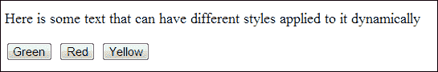
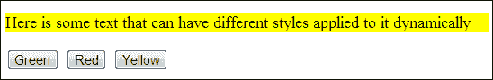
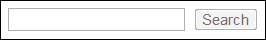
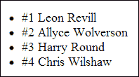

# 第一章：文档对象模型操作

在本章中，我们将涵盖：

+   选择元素

+   查找和选择兄弟元素

+   创建 DOM 元素

+   将内容插入元素中

+   修改 DOM 元素属性

+   添加和删除 CSS 类以动态更改其样式

+   通过更改其属性来启用和禁用按钮

+   在页面中更新图像

+   填充列表元素

+   了解分页

+   删除 DOM 元素

+   重复使用 DOM 元素

# 介绍

本章介绍了 jQuery 的基本原理—查找、选择和操作 DOM 元素。jQuery 让 JavaScript 开发人员可以使用各种方法轻松选择单个或多个 HTML 页面元素。

一旦开发人员选择了这些元素，jQuery 提供了操作每个元素的能力，以通过属性修改（如样式、禁用和类）创建更丰富的用户体验。

# 选择元素

有许多种方法可以使用 jQuery 来选择 DOM 元素。我们将在这里探讨主要方法。对于熟悉 CSS 的开发人员，可以在使用 jQuery 选择元素时使用相同的语法（即 `#content`，`.content` 等）。

## 准备工作

在您选择的文本编辑器或 IDE 中打开一个空白的 HTML 文档。确保您已经下载了最新版本的 jQuery，并且可以轻松地包含到此 HTML 文档中。在本章中创建新的 HTML 文件时，请确保它们都位于与 jQuery 库文件相同的目录中，这样就可以轻松地包含到 HTML 文档中。

## 如何做…

要了解如何使用 jQuery 选择各种 DOM 元素，请执行以下每个配方步骤：

1.  使用以下 HTML 和 JavaScript 代码创建一个网页：

    ```js
    <!DOCTYPE html>
    <html>
    <head>
       <title>Selecting Elements with jQuery</title>
       <script src="img/jquery.min.js"></script>
       <script>
          $(function(){
             var content = $("#content"); //Select the content div
             var span = $(".span-element"); //Select the span element
             var listelements = $("li"); //Select all the list elements
          });
       </script>
    </head>
    <body>
    <div class="division-container">Some text within a div which has a class</div>
    <div id="content">Some text within a div which has an ID attribute</div>
    <a href="#">A link</a>
    <a href="#" rel="dofollow">A second link</a>
    <ul class="info-list">
       <li>List Item 1</li>
       <li>List Item 2</li>
       <li>List Item 3</li>
    </ul>
    <button>Button 1</button>
    <span class="span-element">Span 1</span>
    </body>
    </html>
    ```

1.  要选择其中任何元素，请使用 jQuery 的 `$()` 函数。我们可以将此函数与要选择的元素的标识符或 CSS 选择器结合使用；例如，其 HTML 标签 `li` 和 ID `#content` 或类 `.content`。 

### 提示

**下载示例代码**

您可以从您在 [`www.packtpub.com`](http://www.packtpub.com) 购买的所有 Packt 图书中下载示例代码文件。如果您在其他地方购买了本书，您可以访问 [`www.packtpub.com/support`](http://www.packtpub.com/support) 并注册，将文件直接通过电子邮件发送给您。

## 工作原理…

选择 DOM 元素的最简单方法是通过其 ID。我们知道 HTML 文档中的所有 ID 应该是唯一的；因此，通过使用其 ID 选择元素，您将选择一个单独的元素。

关于前面的 HTML 文档，如果您想要选择具有 ID `content` 的 `<div>`，则可以使用以下 jQuery 代码来选择它：

```js
$(function(){
   var content = $('#content');
});
```

这将使 DOM 元素在 `content` 变量中可用。关于这意味着什么的更多内容在本章后面进行讨论。

### 注意

在`$(function(){ });`中的任何代码将在页面加载时由 jQuery 自动执行。

我们也可以以相同的方式通过它们的类选择元素。 代码与前面的示例非常相似，唯一不同的是我们使用类前缀（`.`）而不是 ID 前缀（`＃`），如下所示：

```js
$(function(){
   var span = $('.span-element');
});
```

我们不仅可以根据我们指定的标识符（如类或 ID）选择元素，还可以根据它们的标签名称选择元素。 如果您想选择页面中的所有`li`元素，您将使用`$('li')`，如下所示：

```js
$(function(){
   var listelements = $('li');
   var i = 1;
   listelements.each(function(){
      console.log("Loop: " + i);
      i++;
   });
});
```

前面的示例使用 jQuery 选择器来选择页面中的所有列表元素。 为了证明`listelements`现在包含多个元素，我们遍历这些元素，并在控制台输出一些信息。

### 注意

`.each()` 是一个 jQuery 函数。 在第三章 *使用 AJAX 和 JSON 加载和操作动态内容*中学习更多关于它的用法。

前面示例的控制台输出如下：

```js
Loop: 1
Loop: 2
Loop: 3
```

### 注意

您可以根据所选浏览器的不同方式来访问 JavaScript 控制台：

+   **Chrome**：*Ctrl* + *Shift* + *J*（**Mac**：*command* + *option* + *J*）

+   **互联网浏览器**：*F12*

+   **Firefox**：*Ctrl* + *Shift* + *K*

## 更多内容…

还可以根据其他属性（如`rel`或`disabled`属性）选择元素。

以下代码向我们展示了如何选择具有`rel`属性为`nofollow`的锚元素：

```js
$(function(){
   var nofollow = $('a[rel="nofollow"]');
});
```

## 另请参阅

+   *查找和选择兄弟元素*

# 查找和选择兄弟元素

您可能并不总是知道需要选择的具体元素。 您可能只知道其父级，因此，您将需要搜索父级中的元素，以找到您要查找的特定元素。 本示例将向您展示不同的方式通过它们的父级查找元素。

## 准备工作

打开您的文本编辑器或 IDE，其中包含最新版本的 jQuery，并准备被包含在您将作为本示例的一部分创建的 HTML 页面中。

## 如何操作…

要了解 jQuery 可以帮助您根据父元素搜索 DOM 元素的各种方式，请执行以下每个步骤：

1.  创建包含以下 HTML 和 JavaScript 代码的网页：

    ```js
    <!DOCTYPE html>
    <html>
    <head>
       <title>Finding and selecting sibling elements</title>
       <script src="img/jquery.min.js"></script>
       <script>
          $(function(){
             var element1 = $('#content .top .top-left'); //Select the top left division element
             var element2 = $('.parent').find('a'); //Select the anchor element
             var element3 = $('.parent').find('.grandchild'); //Select the grandchild element
          });
       </script>
    </head>
    <body>
    <div class="division-container">Some text <span>within</span> a div <span>which</span> has a many <span>span</span> elements.</div>
    <div id="content">
       <div class="top">
          <div class="top-left">Left</div>
          <div class="top-right">Right</div>
       </div>
    </div>
    <ul class="info-list">
       <li>List Item 1</li>
       <li>List Item 2</li>
       <li>List Item 3</li>
    </ul>
    <ul class="second-info-list">
       <li>Second List Item 1</li>
       <li>Second List Item 2</li>
       <li>Second List Item 3</li>
    </ul>
    <div class="parent">
       <div class="child">
          <div class="grandchild">
             <a href="#">A Link</a>
          </div>
       </div>
    </div>
    </body>
    </html>
    ```

1.  这段代码使用了多个类名，就像在 CSS 中选择 HTML 子元素一样。 或者，您可以在父元素上使用 jQuery 的`find()`函数进行搜索。

## 工作原理…

选择子元素最简单的方法是使用与 CSS 中相同的选择器（即 `.classname` `.anotherclass`）。 需要注意的是，你不总是知道要查找的同级元素的确切位置。 如果是这种情况，我们可以使用有用的 jQuery 的 `find()` 函数。 jQuery 的 `find()` 函数将在指定的父元素内查找你要查找的同级元素。

基于*“如何做”*部分内的 HTML，以下 JavaScript 演示了如何直接访问子元素，方法就像在 CSS 中那样：

```js
$(function(){
   var element1 = $('#content .top .top-left');
});
```

这将使 DOM 元素在 `content` 变量内可用。 更多关于这个意思的内容将在本章后面讨论。

要查找不知道确切位置的子元素，我们可以使用以下 JavaScript 来定位 `<div class="grandchild">` 元素内的锚点：

```js
$(function(){
   var element2 = $('.parent').find('a');
});
```

请注意，你只需指定父选择器和要查找的元素。`find()` 方法简单地基于指定的父元素遍历 DOM，直到找到你要查找的元素或没有元素可以检查为止。 你也可以在 `find()` 方法中使用 ID 和类名以及 HTML 标记。

## 还有更多...

你还可以在 `$()` 内使用 CSS3 选择器，如 `:first-child` 和 `:last-child` 来帮助你选择所需的 DOM 元素。

## 另请参阅

+   *选择元素*

# 创建 DOM 元素

为了创建丰富且交互式的用户界面，我们需要能够动态向网页添加 DOM 元素。 元素可能需要基于用户交互或其他事件（如页面加载）而添加到网页。

## 准备工作

对于这个步骤，你需要另一个空白的 HTML 文件。 在与前一个食谱文件相同的目录内创建一个名为 `recipe-3.html` 的新 HTML 文件。

## 如何做…

学习如何通过以下步骤使用 jQuery 创建 DOM 元素：

1.  将以下 HTML 代码添加到你的 `recipe-3.html` 文件中，以创建一个带有无序列表并包含 jQuery 库的基本 HTML 页面：

    ```js
    <!DOCTYPE html>
    <html>
    <head>
       <title>Creating DOM elements</title>
       <script src="img/jquery.min.js"></script>
       <script></script>
    </head>
    <body>
    <div id="container">
       <ul id="myList">
          <li>List Item 1</li>
          <li>List Item 2</li>
          <li>List Item 3</li>
       </ul>
    </div>
    </body>
    </html>
    ```

1.  将以下 JavaScript 添加到 HTML 文档头部的脚本标签内。 以下 JavaScript 代码将使用 jQuery 的 `after()` 和 `insertAfter()` 函数在 `#myList` 元素之后向 DOM 添加两个按钮： 

    ```js
    $(function(){
       $('#myList').after("<button>Button 1</button>");
       $('<button>Button 2</button>').insertAfter("#myList");
    });
    ```

## 工作原理…

要动态向文档的任何部分添加 DOM 元素，我们可以使用 jQuery 的 `append()`、`addAfter()`、`after()`、`addBefore()` 和 `before()` 函数。`after()` 和 `insertAfter()` 函数本质上执行相同的操作；不同之处在于指定表达式的顺序。 `insertBefore()` 和 `before()` 也是一样。

基于*“如何做”*部分的 HTML 文件，以下 JavaScript 将在无序列表元素之后添加两个按钮元素：

```js
$(function(){
   $('#myList').after("<button>Button 1</button>");
   $('<button>Button 2</button>').insertAfter("#myList");
});
```

一旦执行了前面的 JavaScript，浏览器中呈现的 HTML 将被修改如下：

```js
<!DOCTYPE html>
<html>
<head>
   <title> Creating DOM elements</title>
   </head>
<body>
<div id="container">
   <ul id="myList">
      <li>List Item 1</li>
      <li>List Item 2</li>
      <li>List Item 3</li>
   </ul>
      <button>Button 2</button>
      <button>Button 1</button>
</div>
</body>
</html>
```

请注意，即使第二个按钮是最后添加的，它也是 HTML 中的第一个。这是因为我们已经指定了按钮应该在无序列表元素之后插入。`.before()` 和 `.insertBefore()` 方法的工作原理完全相同，唯一的区别是按钮元素会位于无序列表元素之上。

动态网页和 Web 应用程序的一个常见需求是能够向列表中添加新项目。最佳方法是使用 `.append()` 函数：

```js
$(function(){
   $('#myList').append("<li>List Item 4</li>");
});
```

此 JavaScript 将向 `#myList` 无序列表元素底部添加带有文本 `List Item 4` 的新列表项。或者，也可以使用 `prepend()` 函数将列表项插入列表顶部。

## 还有更多...

jQuery 为开发者提供了许多向 DOM 中添加、追加、插入和更新元素的方式，这在单个示例中无法演示完全。通过阅读 jQuery 文档，确保你了解了替代方法。

## 另请参阅

+   *向元素插入内容*

+   *移除 DOM 元素*

+   *重用 DOM 元素*

# 向元素插入内容

交互式和动态的 Web 应用程序和网站不仅要求 Web 开发者能够创建 DOM 元素，还要求开发者能够添加动态内容。这可以通过另一组 jQuery 函数轻松实现。

## 准备工作

创建一个名为 `recipe-4.html` 的空白 HTML 文档，并确保你可以在该 HTML 文档中包含最新版本的 jQuery。

## 如何做到…

通过执行以下每个步骤学习如何将内容动态添加到 DOM 中：

1.  将以下代码添加到你新创建的 HTML 文档中，这将创建一个简单的 HTML 网页：

    ```js
    <!DOCTYPE html>
    <html>
    <head>
       <title>Insert content into an element</title>
       <script src="img/jquery.min.js"></script>
       <script>

       </script>
    </head>
    <body>
    <div id="container">
       <p>Here is some current HTML content</p>
    </div>
    <textarea id="myTextarea"></textarea>
    </body>
    </html>
    ```

1.  在文档头部的脚本标签中插入以下 JavaScript 代码。此代码将在各个点将不同的 HTML 内容和元素注入到 DOM 中。

    ```js
    $(function(){
       //Remove the container elements current HTML
       $('#container').html("<p>I have replaced the all the HTML within the #container element</p>");

       //Add some more HTML to the beginning of the container element
       $('#container').prepend("<p>Another paragraph that has been prepended.</p>");

       //Add a button to the end of the container element after all other HTML content
       $('#container').append("<button>A Button Appended</button>");

       //Add some text into the text area element
       $('#myTextarea').val("Added some text using .text()");
    });
    ```

## 工作原理...

向元素添加内容的最快方法是使用 `html()` 函数。通过将字符串作为参数提供给该函数，它将用提供的字符串替换所选元素的当前 DOM 内容。如果没有提供字符串，则该函数将返回元素的 DOM 内容格式化为 HTML 字符串。

除了替换元素的内容之外，我们还可以使用 `append()` 和 `prepend()` 分别在当前内容的末尾和开头添加附加内容。此外，我们还有其他可用的函数，例如 `text()`，它将在插入元素之前解码任何 HTML。出于这个原因，`text()` 函数通常用于文本区域。

基于前一节提供的 HTML，我们可以使用之前讨论过的 jQuery 函数来修改 `#container` 元素的内容，如下所示：

```js
$(function(){
$('#container').html("<p>I have replaced the all the HTML within the #container element</p>");

$('#container').prepend("<p>Another paragraph that has been prepended.</p>");

$('#container').append("<button>A Button Appended</button>");

$('#myTextarea').val("Added some text using .text()");
});
```

在执行了这些函数之后，浏览器渲染的 HTML 文件将会被转换，如下所示：

```js
<!DOCTYPE html>
<html>
<head>
   <title>Insert content into an element</title>
</head>
<body>
<div id="container">
   <p>Another paragraph that has been prepended.</p><p>I have replaced the all the HTML within the #container element</p>
   <button>A Button Appended</button>
</div>
<textarea id="myTextarea">Added some text using .text()</textarea>
</body>
</html>
```

## 另请参阅

+   *创建 DOM 元素*

# 修改 DOM 元素属性

我们可以使用 jQuery 动态修改元素属性，如类、样式和禁用，这意味着可以视觉上改变和改变一系列 HTML 元素的功能。

## 准备工作

再次说明，此配方需要额外的空白 HTML 文档。创建一个名为 `recipe-5.html` 的文件，并准备好打开并进行编辑。

## 如何实现…

学习如何通过执行以下每个步骤来更改 DOM 元素的属性：

1.  将以下 HTML 代码添加到你的空白 `recipe-5.html` 文件中，以创建一个带有两种类型输入的基本 HTML 页面：

    ```js
    <!DOCTYPE html>
    <html>
    <head>
       <title>Modifying DOM element attributes and properties</title>
       <script src="img/jquery.min.js"></script>
       <script>

       </script>
    </head>
    <body>
    <input type="checkbox" />
    <input type="text" />
    </body>
    </html>
    ```

1.  在上述 HTML 代码中，将以下 JavaScript 代码添加到 script 标签内，以禁用输入、修改其值并选中复选框：

    ```js
    $(function(){
       //Set the checkbox to be checked
       $('input[type="checkbox"]').prop('checked', true);
       //Disable any text inputs
       $('input[type="text"]').prop('disabled', true);
       //Change the value of any text inputs
       $('input[type="text"]').val("This is a new Value!");
    });
    ```

## 工作原理…

jQuery 提供了一个 `prop()` 函数，如果没有指定值，则会检索指定的属性，如果提供了值，则会修改所选元素上的指定属性。这可以用来更改诸如复选框上的 `checked` 或文本输入上的 `disabled` 属性值。我们可以使用 `prop()` 函数来修改文本输入的值；但是，最好使用专门用于此任务的 `val()` 函数。

通常，这将根据用户触发的事件来完成，但为了尽可能简单地说明这一点，以下 JavaScript 在页面加载时执行此操作：

```js
$(function(){
   $('input[type="checkbox"]').prop('checked', true);
});
```

此 JavaScript 将检查页面中的每个类型为 `checkbox` 的输入。类似地，我们可以仅通过少量修改来更改文本输入的禁用状态：

```js
$(function(){
   $('input[type="text"]').prop('disabled', true);
});
```

我们还可以使用 `val()` 函数来使用以下 JavaScript 向每个文本输入添加一些文本：

```js
$(function(){
    $('input[type="text"]').val("This is a new Value!");
});
```

通常，你可以使用 jQuery 来链式调用函数。你可以通过内联使用这两个函数（即，`$('input[type="text"]').prop('disabled', true).val("This is a new Value!");`）来实现前面两个操作，并且它们会依次执行。

## 另请参阅

+   *通过更改它们的属性启用和禁用按钮*

+   *添加和删除 CSS 类以动态更改它们的样式*

# 添加和删除 CSS 类以动态更改它们的样式

jQuery 随附了类操作函数，以便允许开发人员轻松更改任何 HTML 元素的样式。

## 准备工作

要使元素样式更改有用，我们首先需要在 HTML 文档中声明一些样式。以下 HTML 代码具有一系列我们可以使用的样式和元素，以说明 jQuery 的此功能：

```js
<!DOCTYPE html>
<html>
<head>
   <title>Add and remove CSS classes to dynamically change their style</title>
   <script src="img/jquery.min.js"></script>
   <script></script>
   <style type="text/css">
      .green {
         background-color: #008000;
         color: #FFFFFF;
      }
      .red {
         background-color: #FF0000;
         color: #FFFFFF;
      }
      .yellow {
         background-color: #FFFF00;
         color: #000000;
      }
   </style>
</head>
<body>
   <p id="sometext">
      Here is some text that can have different styles applied to it dynamically</p>
   <button id="green-btn">Green</button>
   <button id="red-btn">Red</button>
   <button id="yellow-btn">Yellow</button>
</body>
</html>
```

在此 HTML 代码中，我们有三个具有各自唯一 ID 的按钮。我们还有一个具有 ID 的段落。定义了三个 CSS 类：`green`、`red` 和 `yellow`。通过 jQuery，我们可以监听其中任一按钮的点击，然后动态地将其中一个类应用到段落元素上。

如果您保存此 HTML 文件并在浏览器中打开它，您应该会看到以下网页：



## 如何做…

1.  在您刚创建的 HTML 页面的脚本标签中添加以下 JavaScript 代码：

    ```js
    $(function(){
       //Listen for a click event on the green button
    $('#green-btn').click(function(){
       //When the green button has been clicked
       //Remove all classes current on the #sometext paragraph
       $('#sometext').removeClass();
       //Add the .green class to the #sometext paragraph
       $('#sometext').addClass('green');
    });
       //Listen for a click on the red button
    $('#red-btn').click(function(){
       //When the red button has been clicked
       //Remove all classes from the #sometext paragraph
       $('#sometext').removeClass(); 
       //Add the .red class to the #sometext paragraph 
       $('#sometext').addClass('red');
       });
       //Listen for a click on the yellow button
       $('#yellow-btn').click(function(){
          //When the yellow button has been clicked
          //Remove all classes from the #sometext paragraph
       $('#sometext').removeClass();
       //Add the .yellow class to the #sometext paragraph 
       $('#sometext').addClass('yellow');
       });
    });
    ```

1.  在浏览器中打开 HTML 文档现在将允许您通过选择三个可用按钮中的任意一个来更改 `#sometext` 段落的样式。

## 工作原理…

jQuery 允许我们通过使用 `click()` 函数将点击事件处理程序附加到任何元素。然后，我们可以通过将函数作为参数传递给 `click()` 方法来执行我们选择的一组代码。要向元素添加类，我们可以使用 `addClass()` 函数，并将类名作为字符串参数提供。此函数将指定的类名添加到所选元素中。

jQuery 还为我们提供了 `removeClass()` 函数。这使我们可以通过向 `removeClass()` 提供一个字符串来从元素中删除特定的类，或者当没有提供字符串时，它将从所选元素中删除所有类。我们将需要使用此功能，以防止当任一按钮被多次点击时多个类被添加到段落元素中。

下面的截图展示了点击**黄色**按钮后此网页的情况：



## 另请参阅

+   *修改 DOM 元素属性*

+   *通过更改其属性来启用和禁用按钮*

# 通过更改其属性来启用和禁用按钮

动态启用和禁用按钮的能力在诸如将数据保存到 Web 服务器之类的情况下特别有用。为了防止用户在请求正在进行并且客户端正在等待响应时进行多次保存请求，您可以动态禁用保存按钮。一旦客户端从 Web 服务器接收到响应，您可以重新启用保存按钮。

在简单情况下，例如在用户输入搜索词之后启用搜索按钮，此功能也可能非常有效。这使用户清楚地知道，除非已输入搜索词，否则他们无法搜索。

## 准备工作

创建一个名为 `recipe-7.html` 的空白 HTML 文档，并准备好进行编辑。

## 如何做…

1.  以下 HTML 代码创建了一个带有搜索输入和搜索按钮的网页，默认情况下搜索按钮被禁用。将以下代码添加到 `recipe-7.html` 中：

    ```js
    <!DOCTYPE html>
    <html>
    <head>
       <title>Enable and disable buttons by changing their properties </title>
       <script src="img/jquery.min.js"></script>
       <script>

       </script>
    </head>
    <body>
       <input type="text" id="search-input" />
       <button id="search-btn" disabled>Search</button>
    </body>
    </html>
    ```

1.  保存并在浏览器中打开此 HTML 将为您提供一个非常简单的网页，其中只有一个输入和一个已禁用的按钮，如下截图所示：

1.  在先前创建的 HTML 文档的 head 部分的 script 标签中添加以下 JavaScript：

    ```js
    $(function(){
       //Listen for a key up event on the search input
    $('#search-input').keyup(function(){
         //When a user presses and releases a key
         //Check to see if the length of the inputted 
         //data is greater than 2 
         if ($(this).val().length > 2) {
            //If the input length is greater than 
            //two then we enable the search button
            $('#search-btn').prop("disabled", false);
       } else {
          //If the input length is equal to 2 or less we disable the search button
          $('#search-btn').prop("disabled", true);
       }
    });
    });
    ```

1.  在网络浏览器中打开这个页面将会给你一个输入框和一个禁用的搜索按钮，直到你在搜索输入框中输入一些文本。当文本输入到搜索框中，并且文本长度大于两个字符时，搜索按钮将变为可用状态。

## 工作原理…

我们的目标是一旦用户在搜索输入框中输入了一些文本，就启用搜索按钮。为此，我们需要将 `.keyup()` 事件处理程序附加到搜索输入框上。这将允许我们在用户输入文本时执行一些代码。通过将一个函数作为`keyup()`函数的参数提供，我们可以检查输入的数据。如果输入的数据长度为两个或更多字符（因为少于三个字符的搜索可能会有些模糊），我们可以启用搜索按钮。

使用以下 JavaScript，我们能够监听数据输入，检查输入长度，并根据此来启用或禁用搜索按钮：

```js
$(function(){
$('#search-input').keyup(function(){
   if ($(this).val().length > 2) {
      $('#search-btn').prop("disabled", false);
   } else {
   $('#search-btn').prop("disabled", true);
   }
});
});
```

首先，我们使用 `$('#search-input').keyup();` 将`keyup`事件附加到搜索输入框上，引用其 ID。然后，在回调函数中，我们能够使用 `$(this)` 来检查当前输入文本的长度，它指的是我们附加`keyup`事件的元素。`val()` 函数然后获取输入的文本，我们可以使用 `length` 属性来获取其长度。使用 `if`/`else` 语句，我们可以决定搜索按钮是否需要启用或禁用。

要启用或禁用搜索按钮，我们使用 jQuery 的 `prop()` 函数，并将 disabled 属性设置为 `true` 或 `false`。

## 另请参见

+   *修改 DOM 元素属性*

+   *添加和删除 CSS 类以动态更改它们的样式*

# 更新页面内的图片

jQuery 允许开发者在网页上动态更改图片。这个配方将向你展示如何做到这一点，并且还会向你展示如何使用时间戳来防止浏览器使用缓存的图片，这在动态交换图片时经常会遇到问题。

## 准备工作

对于这个配方，你需要四张不同的图片。确保你有四张小图片，分别命名为`black.png`、`red.png`、`blue.png`和`green.png`。

## 如何操作…

要理解如何使用 jQuery 来更改图片，完成以下每个步骤：

1.  在一个易于访问的目录中创建一个名为`recipe-8.html`的文件，并在其中添加以下 HTML 代码：

    ```js
    <!DOCTYPE html>
    <html>
    <head>
       <title>Change an image source and tackle browser caching to ensure it is always updated</title>
       <script src="img/jquery.min.js"></script>
       <script>

       </script>
    </head>
    <body>
       
       <div>
          <button id="red-btn">Red</button>
          <button id="green-btn">Green</button>
          <button id="blue-btn">Blue</button>
       </div>
    </body>
    </html>
    ```

1.  在创建`recipe-8.html`文件的目录中，创建另一个名为`images`的目录，在其中添加以下四个图片：

    +   `black.png`

    +   `red.png`

    +   `blue.png`

    +   `green.png`

1.  在`recipe-8.html`的 `<script></script>` 标签中添加以下 JavaScript： 

    ```js
    $(function(){
       //Listen for a click on the red button
    $('#red-btn').click(function(){
       //When the red button has been clicked, change the source of the #square image to be the red PNG
       $('#square').prop("src", "images/red.png");
    });
       //Listen for a click on the green button
    $('#green-btn').click(function(){
       //When the green button has been clicked, change the source of the #square image to be the green PNG
       $('#square').prop("src", "images/green.png");
    });
    //Listen for a click on the blue button
    $('#blue-btn').click(function(){
       //When the blue button has been clicked, change the source of the #square image to be the blue PNG
       $('#square').prop("src", "images/blue.png");
    });
    });
    ```

1.  在浏览器中打开此网页将允许您根据点击的按钮来更改显示图像的源，从默认的 `black.png` 更改为另一个源。

## 如何运作…

要更改图像的源，我们可以使用 jQuery 的 `prop()` 函数并为 `src` 属性指定新的图像名称。为此，当我们使用我们的 HTML 代码创建的按钮之一被点击时，使用 `.click()` 为每个按钮附加点击事件处理程序，引用按钮的 ID，然后在 `click()` 回调函数中执行`.prop()` 并指定适当的图像源，如下所示：

```js
$(function(){
$('#red-btn').click(function(){
   $('#square').prop("src", "images/red.png");
});

$('#green-btn').click(function(){
   $('#square').prop("src", "images/green.png");
});

$('#blue-btn').click(function(){
   $('#square').prop("src", "images/blue.png");
});
});
```

## 还有更多…

这个示例说明了 jQuery 开发人员如何使用一个非常简单的例子轻松更改图像源的方式。在这种实现中更有可能被使用的是在 Web 应用程序中，例如当用户选择他们的头像时可以上传图像的情况。

传统上，用户将被呈现其当前头像的预览，然后能够从计算机中选择要上传的图像。使用 AJAX，网页可以将这个新图像发送到服务器；然后服务器可以处理并保存这个图像并响应客户端网页。然后，网页可以使用 jQuery 的 `prop()` 方法更新当前预览与新上传的图像，并创建一个无需刷新页面就能显示新图像的无缝过渡。

当服务器使用与旧图像相同的文件名时，就会出现问题。这在用户只能拥有一个头像的情况下经常发生；为了简单起见，头像图像会使用用户的唯一 ID 保存（例如，`123.png`）。

当服务器用新的图像文件名响应客户端时，由于文件名相同，浏览器会认为它是同一图像。这可能会导致浏览器使用头像图像的缓存版本，这将是旧图像。为了防止这种情况发生，我们可以在图像文件名前添加一个时间戳。这将使浏览器将图像视为新图像，并强制它加载新图像。我们可以修改上述 JavaScript 以实现以下内容：

```js
$(function(){
$('#red-btn').click(function(){
     $('#square').prop("src", "images/red.png?t=" + new Date().getTime());
});

$('#green-btn').click(function(){
     $('#square').prop("src", "images/green.png?t=" + new Date().getTime());
});

$('#blue-btn').click(function(){
     $('#square').prop("src", "images/blue.png?t=" + new Date().getTime());
});
});
```

使用 JavaScript 的 `new Date()` 方法，我们创建一个新的日期，该日期将等于当前时间并且时间等于当前时间的毫秒数。然后我们使用 `.getTime()` 返回毫秒级的时间戳。当源被更新时，它将如下所示：

```js

```

此代码将强制浏览器使用新指定的源重新加载图像，前提是用户在同一毫秒内没有更新他们的图像（实际上是不可能的）。

# 填充列表元素

列表元素在 Web 上经常使用；它们可以用于显示搜索结果、菜单和导航项等。由于 CSS 的存在，它们不再需要单调，可以通过样式化列表元素使您的数据更加美观。

使用 jQuery，可以动态填充列表元素。这可以直接从 JavaScript 数组通过 AJAX 响应、从 Web 服务器或其他来源获取的数据中完成。

## 准备工作

创建一个名为`recipe-9.html`的空白 HTML 文档，并确保它保存在可以包含最新版本 jQuery 的位置。

## 如何做…

通过执行以下每个步骤，学习如何使用 jQuery 动态填充列表：

1.  为了演示如何使用 jQuery 填充列表元素，我们将创建一个对象的 JavaScript 数组。在刚刚创建的`recipe-9.html`中添加以下 HTML 和 JavaScript 代码：

    ```js
    <!DOCTYPE html>
    <html>
    <head>
       <title>Populating list elements</title>
       <script src="img/jquery.min.js"></script>
       <script type="text/javascript">
          var names = [
             {
                id: 1,
                firstname: 'Leon',
                lastname: 'Revill'
             },
             {
                id: 2,
                firstname: 'Allyce',
                lastname: 'Wolverson'
             },
             {
                id: 3,
                firstname: 'Harry',
                lastname: 'Round'
             },
                {
                   id: 4,
                   firstname: 'Chris',
                   lastname: 'Wilshaw'
                }
             ];
             $(function(){

          });
       </script>
    </head>
    <body>
        <ul id="namelist"></ul>
    </body>
    </html>
    ```

    ### 注

    在我们的 JavaScript 代码顶部，我们已经创建了一个包含一组名称的对象数组。我们将使用这个数组来填充 HTML 代码中的列表元素`#namelist`。

1.  在`$(function(){})`中添加以下 JavaScript 代码，就在 JavaScript 数组的下面。此 JavaScript 将使用我们在*准备工作*部分中创建的 JavaScript 数组中的对象来填充页面上的列表元素。

    ```js
    $.each(names, function(index, obj){
    $('#namelist').append("<li>#" + obj.id + " " + obj.firstname + " " + obj.lastname + "</li>");
    });
    ```

## 工作原理…

我们使用 jQuery 的`$.each()`函数来循环遍历`names`数组中的每个 JavaScript 对象。然后，对于这些对象中的每一个，我们可以创建一个`<li>`元素，并插入`id`、`firstname`和`lastname`变量的值。最后，我们可以使用 jQuery 的`append()`函数将列表元素追加到无序列表的末尾。

在`$.each()`函数中，第一个参数是我们希望迭代的数组，第二个参数是我们希望对`names`数组中的每个对象执行的函数。指定的函数也有两个参数：`index`和`obj`。`index`参数将包含 JavaScript 对象的当前数组索引，`obj`变量将包含实际的 JavaScript 对象。这两个变量在指定的回调函数中都是可用的。

接着，我们可以引用`obj.propertyName`（用对象的属性替换`propertyName`）来访问我们希望使用的对象的特定部分。通过这样做，我们构造一个字符串并将其传递给`append()`函数，然后将其追加到指定的`#nameslist`无序列表中。

在浏览器中打开 HTML 页面，你应该看到列表中填充了 JavaScript 数组中的名称，如下所示：



## 参见

+   *创建 DOM 元素*

+   *重用 DOM 元素*

# 理解分页

分页是整理大量数据并将其呈现给用户的行为，分成小的、易于阅读的部分或页面。

结合 jQuery、JavaScript 函数和事件处理程序，我们能够轻松地整理并以页面的形式呈现数据给用户。

## 准备工作

要创建分页数据集，首先我们需要一些要分页的数据，然后是放置分页数据的位置。使用以下代码创建一个 HTML 页面：

```js
<!DOCTYPE html>
<html>
<head>
   <title>Chapter 1 :: DOM Manipulation</title>
   <script src="img/jquery.min.js"></script>
   <script>
      var animals = [
         {
            id: 1,
            name: 'Dog',
            type: 'Mammal'
         },
         {
            id: 2,
            name: 'Cat',
            type: 'Mammal'
         },
         {
            id: 3,
            name: 'Goat',
            type: 'Mammal'
         },
         {
            id: 4,
            name: 'Lizard',
            type: 'Reptile'
         },
         {
            id: 5,
            name: 'Frog',
            type: 'Amphibian'
         },
         {
            id: 6,
            name: 'Spider',
            type: 'Arachnid'
         },
         {
            id: 7,
            name: 'Crocodile',
            type: 'Reptile'
         },
         {
            id: 8,
            name: 'Tortoise',
            type: 'Reptile'
            },
            {
               id: 9,
               name: 'Barracuda',
               type: 'Fish'
            },
            {
               id: 10,
               name: 'Sheep',
               type: 'Mammal'
            },
            {
               id: 11,
               name: 'Lion',
               type: 'Mammal'
            },
            {
               id: 12,
               name: 'Seal',
               type: 'Mammal'
            }
         ];
      var pageSize = 4;
      var currentPage = 1;
      var pagedResults = [];
      var totalResults = animals.length;
      $(function(){
   });       
   </script>
</head>
<body>
   <ul id="list"></ul>
   <button class="previous"><< Previous</button>
   <button class="next">Next >></button>
</body>
</html>
```

在此页面的 JavaScript 中，我们声明了一个名为 `animals` 的大数组对象，表示一组动物。在该数组下面，我们声明了四个更多的变量，这些变量是我们分页 `animals` 数组所需的：

+   `pageSize`：这表示我们希望在单个页面上保留的结果数量

+   `currentPage`：这表示正在显示的当前页面

+   `pagedResults`：这表示一个包含 `animals` 数组部分的数组，代表页面

+   `totalResults`：这表示 `animals` 数组中的对象数量；在这种情况下，为 `12`

## 如何操作…

要创建带有分页的动态列表，请执行以下每个步骤：

1.  就在 `$(function(){});` 之后但仍然在 `<script></script>` 标签内，添加以下 JavaScript 函数：

    ```js
    function updateList() {
    //Grab the required section of results from the animals list
    var end = (currentPage * pageSize);
    var start = (end - pageSize);
    pagedResults = animals.slice(start, end);
    //Empty the list element before repopulation
    $('#list').empty();

    //Disable the previous button if we are on the first page
    if (currentPage <= 1) {
       $('.previous').prop("disabled", true);
    }
    //Enable the previous button if we are not on the first page
    else {
       $('.previous').prop("disabled", false);
    }

    //Disable the next button if there are no more pages
    if ((currentPage * pageSize) >= totalResults) {
       $('.next').prop("disabled", true);
    }
    //Enable the next button if there are results left to page
    else {
       $('.next').prop("disabled", false);
    }

    //Loop through the pages results and add them to the list
    $.each(pagedResults, function(index, obj){
       $('#list').append("<li><strong>" + obj.name + "</strong> (" + obj.type + ")</li>");
    });
    }
    ```

1.  在前述 HTML 页面中的 `$(function(){});` 中添加以下 JavaScript：

    ```js
    //Populate the list on load
    updateList();
    $('.next').click(function(){
    //Only increase the current page if there are enough results
    if ((currentPage * pageSize) <= totalResults) currentPage++;
    updateList();
    });

    $('.previous').click(function(){
    //Only decrease the current page if it is currently greater than 1
    if (currentPage > 1) currentPage--;
    updateList();
    });
    ```

## 工作原理…

尽管分页可能看起来相当复杂，但原理上很简单。我们需要使用 jQuery 的 `click()` 函数来监听下一页和上一页按钮的点击事件。当按下这些按钮时，根据点击的按钮，`currentPage` 变量要么递增要么递减。之后，`updateList()` 函数获取 `currentPage` 值，计算需要从 `animals` 数组中使用哪个数据部分，用这些数据填充 `pagedResults` 数组，然后将这些结果加载到 HTML 列表元素 `#list` 中。

另外，我们需要根据用户当前所在的页面禁用下一页或上一页按钮。如果他们当前正在查看第一页，我们可以使用 jQuery 的 `prop()` 函数将其 `disabled` 属性设置为 `true` 来禁用上一页按钮。如果用户正在查看最后一页（我们的函数可以使用 `totalResults`、`currentPage` 和 `pageSize` 变量来计算出来），我们需要禁用下一页按钮。

```js
//Populate the list on load
updateList();
$('.next').click(function(){
//Only increase the current page if there are enough results
if ((currentPage * pageSize) <= totalResults) currentPage++;
updateList();
});

$('.previous').click(function(){
//Only decrease the current page if it is currently greater than 1
if (currentPage > 1) currentPage--;
updateList();
});
```

为了扩展这个有详细注释的代码，我们首先调用一个名为 `updateList()` 的函数，稍后我们会在这个教程中详细介绍它。

### 注意

请记住，`$(function(){});` 中的任何代码都会在页面加载时执行。

接下来，我们通过将回调函数作为参数传递给下一页按钮来附加点击事件处理程序。对于此事件函数，我们能够指定每次点击下一页按钮时要执行的一些代码。我们指定的代码通过 `1` 递增 `currentPage` 变量。如果还有其他页面的数据可用，它会通过形成 `((currentPage * pageSize) <= totalResults)` 条件作为 `if` 语句的一部分来计算这一点。

最后，在此点击函数的一部分中，我们调用先前提到的 `updateList()` 函数。

我们也对上一页按钮应用相同的逻辑，只是如果当前页面大于一，我们会递减 `currentPage` 值；因此，有一页可以返回。

在 `$(function(){});` 下面但仍在 `<script></script>` 标签内，向您的 HTML 页面添加以下 JavaScript 函数：

```js
function updateList() {
//Grab the required section of results from the animals list
var end = (currentPage * pageSize);
var start = (end - pageSize);
pagedResults = animals.slice(start, end);
//Empty the list element before repopulation
$('#list').empty();

//Disable the previous button if we are on the first page
if (currentPage <= 1) {
   $('.previous').prop("disabled", true);
}
//Enable the previous button if we are not on the first page
else {
   $('.previous').prop("disabled", false);
}

//Disable the next button if there are no more pages
if ((currentPage * pageSize) >= totalResults) {
   $('.next').prop("disabled", true);
}
//Enable the next button if there are results left to page
else {
   $('.next').prop("disabled", false);
}

//Loop through the pages results and add them to the list
$.each(pagedResults, function(index, obj){
   $('#list').append("<li><strong>" + obj.name + "</strong> (" + obj.type + ")</li>");
});
}
```

为了保持良好的实践，再次对代码进行了充分注释。此函数执行的第一个操作是计算它需要使用 `animals` 数组的哪个部分。一旦计算出起始和结束值（例如，页面一的索引值为 `0` 到 `4`），它就会使用 JavaScript 的 `slice()` 函数将此数据从 `animals` 数组复制到 `pagedResults` 数组中。

### 注意

要小心不要使用类似的 JavaScript 的 `.splice()` 函数，因为这实际上会从 `animals` 数组中删除数据，并将其复制到 `pagedResults` 数组中。另外，`slice()` 接受两个参数：第一个是从数组开始位置开始的零索引数（即，`0` 表示开始），第二个参数不是数组中的位置，而是从起始点开始的元素数量。

使用所需结果存储在 `pagedResults` 数组中，它使用 jQuery 的 `empty()` 函数来清空无序列表 `#list` 中的任何数据。这是为了准备重新填充列表。否则，当单击下一个或上一个按钮并运行 `updateList()` 函数时，结果将仅附加到当前列表的末尾而不是替换。

代码的下一部分是确定下一个和上一个按钮是否需要禁用或启用。我们可以通过放置条件 `(currentPage <= 1)` 来计算是否需要禁用上一页按钮，该条件简单地检查当前页面是否小于或等于一；如果是，则需要禁用上一页按钮；否则，需要启用。这是使用 jQuery 的 `prop()` 函数完成的，该函数允许我们操作所选元素的属性；在这里，我们将 `disabled` 属性更改为 `true` 或 `false`。我们可以通过 `((currentPage * pageSize) >= totalResults)` 来确定是否需要禁用下一个按钮，该条件计算出 `animals` 数组中是否有足够的对象来创建下一页；如果没有，我们禁用按钮，但如果有，我们启用它。

最后，我们使用 jQuery 的 `$.each()` 函数遍历 `pagedResults` 数组中的每个对象，并将每个对象的数据附加到页面上的无序列表中的列表元素。

如果在浏览器中打开 HTML 页面，您应该看到与以下示例类似的页面：


在页面加载时，列表会填充为第一页的结果，因为 `currentPage` 设置为 `1`，并且 `updateList()` 函数也设置为在页面加载时运行，这会禁用上一页按钮。

# 删除 DOM 元素

jQuery 使开发人员可以轻松完全删除 DOM 元素，在创建丰富的用户界面时通常很有用。删除元素的能力在您的界面表示来自数据库的一些信息，并为用户提供删除数据库项目的方式时非常有用。如果此 UI 使用 AJAX 将删除请求发送到 Web 服务器，则需要在客户端反映删除操作并删除表示数据库项目的元素。

## 准备工作

创建一个空白的 HTML 文档，并将其保存为 `recipe-11.html`，放在您的计算机上易于访问的位置。

## 如何做…

学习如何使用 jQuery 删除 DOM 元素，执行以下每个步骤：

1.  将以下 HTML 代码添加到您刚刚创建的 `recipe-11.html` 页面中：

    ```js
    <!DOCTYPE html>
    <html>
    <head>
       <title>Removing DOM elements</title>
       <script src="img/jquery.min.js"></script>
       <script>

       </script>
    </head>
    <body>
       <ul id="list">
          <li>Item 1 <button class="remove-btn">X</button></li>
          <li>Item 2 <button class="remove-btn">X</button></li>
          <li>Item 3 <button class="remove-btn">X</button></li>
          <li>Item 4 <button class="remove-btn">X</button></li>
       </ul>
    </body>
    </html>
    ```

1.  在前一个 HTML 文档的 `<script></script>` 标记中，添加以下 JavaScript 代码：

    ```js
    $(function(){
    //Listen for a click on any of the remove buttons
    $('.remove-btn').click(function(){
       //When a remove button has been clicked
       //Select this buttons parent (the li element) and remove it
       $(this).parent().remove();
    });
    });
    ```

1.  在浏览器中打开 HTML 文档，并单击删除按钮以删除所选的列表项。

## 工作原理…

jQuery 为我们提供了一个 `remove()` 函数，它将从 DOM 中删除所选元素。在前面提到的情况下，您会有一个列表，其中包含表示数据库中记录的项目。每个列表项都会提供一个删除按钮，允许用户删除所选项目。

在实际情况下，此删除按钮将向 Web 服务器发出 AJAX 请求，等待响应，然后在客户端上删除所选元素。为了保持本示例简单，我们将只查看在客户端上删除元素的 JavaScript 代码，而不使用 AJAX。

### 注意

第三章，《使用 AJAX 和 JSON 加载和操作动态内容》，包含丰富的 AJAX 配方。

我们可以使用 jQuery 的 `click()` 函数来监听一个删除按钮的点击事件。然后，我们可以使用 `$(this).parent()` 来选择我们要删除的 `<li>` 元素，因为删除按钮是这个列表元素的兄弟元素。然后，我们可以使用不带参数的 `remove()` 方法来删除所选的列表元素。

## 另请参阅

+   *创建 DOM 元素*

+   *重用 DOM 元素*

# 重用 DOM 元素

当使用 jQuery 动态创建诸如列表项、部分和输入等元素时，能够重用这些元素而无需在 JavaScript 中重新编写它们可能非常有用。相反，复制这些元素并仅修改您希望更改的部分可能更有利。

## 准备工作

使用您选择的文本编辑器，在易于访问最新版本 jQuery 的位置中创建一个名为 `recipe-12.html` 的空白 HTML 文档。

## 如何做…

学习如何通过执行以下每个步骤来重用 DOM 元素：

1.  在你刚创建的`recipe-12.html`页面中，添加以下 HTML、CSS 和 JavaScript 代码：

    ```js
    <!DOCTYPE html>
    <html>
    <head>
       <title>Reusing DOM elements</title>
       <style type="text/css">
          .one {
             background-color: #CCC;
             color: #333;
          }
          .two {
             background-color: lawngreen;
             color: white;
          }
          .three {
             background-color: darkgreen;
             color: white;
          }
          .four {
             background-color: black;
             color: #666;
          }
          .dinosaur {
             background-color: darkred;
             color: red;
          }
       </style>
       <script src="img/jquery.min.js"></script>
       <script>
          var animals = [
             {
                id: 1,
                name: 'Dog',
                type: 'Mammal',
                class: 'one'
             },
             {
                id: 2,
                name: 'Cat',
                type: 'Mammal',
                class: 'one'
             },
             {
                id: 3,
                name: 'Goat',
                type: 'Mammal',
                class: 'one'
             },
             {
                id: 4,
                name: 'Lizard',
                type: 'Reptile',
                class: 'two'
             },
             {
                id: 5,
                name: 'Frog',
                type: 'Amphibian',
                class: 'three'
             },
             {
                id: 6,
                name: 'Spider',
                type: 'Arachnid',
                class: 'four'
             }
          ];
          $(function(){

          });
       </script>
    </head>
    <body>
    <ul id="animal-list">
       <li class='dinosaur'><strong><span class='name'>T-Rex</span></strong> <span class='type'>Dinosaur</span></li>
    </ul>
    </body>
    </html>
    ```

1.  在你从上述代码中创建的 HTML 页面中，在`$(function(){});`中添加以下 JavaScript：

    ```js
    $.each(animals, function(index, obj){
    //Clone the first element in the animal list
    var listTemplate = $('#animal-list li').first().clone();
    //Change its name to match this objects name
    listTemplate.find('.name').html(obj.name);
    //Changes its type to match this objects type
    listTemplate.find('.type').html(obj.type);
    //Remove all its current classes
    listTemplate.removeClass();
    //Add the class from this object
    listTemplate.addClass(obj.class);
    //Append the modified element to the end of the list
    $('#animal-list').append(listTemplate);
    });
    ```

1.  如果你在浏览器中打开你刚创建的网页，你应该会看到一个已填充的列表元素，它与 JavaScript 数组`animals`中的对象相匹配。

## 工作原理...

通过使用 jQuery 的`$.each()`方法，我们能够遍历 JavaScript 数组`animals`中的每个对象。然后，对于 JavaScript 对象中的每个对象，我们使用`$('#animal-list li').first().clone();`克隆无序列表中的第一个元素，并将其存储在`listTemplate`变量中。现在，该变量包含了无序列表`#animal-list`中的第一个列表元素的副本。我们现在可以像处理任何其他 DOM 元素一样操作此元素。我们可以使用 jQuery 的`find()`函数来定位带有`.name`和`.type`类名的 span 元素。然后，我们可以更改它们的内容以匹配当前对象的名称和类型值。接下来，我们使用`removeClass()`（不提供参数将删除所有当前类，而不必指定每个类）从克隆的元素中删除先前的样式，并使用 jQuery 提供的`addClass()`函数添加 JavaScript 对象中指定的样式。最后，我们可以使用`append()`将修改后的 HTML 元素附加到列表的末尾。

## 另请参阅

+   *删除 DOM 元素*

+   *创建 DOM 元素*
