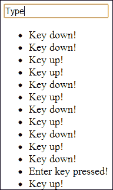

# 第二章：利用 jQuery 事件与用户进行交互

在本章中，我们将涵盖：

+   检测按钮点击

+   检测元素点击

+   检测变化

+   根据用户输入更新内容

+   检测输入框中的按键事件

+   限制输入字符长度

+   在鼠标悬停时更改页面元素

+   手动触发事件

+   阻止事件触发

+   创建自定义事件

# 介绍

本章将介绍如何利用 jQuery 的许多事件来允许您的界面响应不同的用户交互，例如按钮点击，以及 jQuery 事件如何帮助您进行表单验证。

# 检测按钮点击

点击网站元素是主要的用户交互；因此，检测这些点击是创建交互式 Web 应用程序中非常基本的一个方面。jQuery 开发人员可以通过各种方式监听其网页内的某些按钮按下。

## 准备工作

使用您喜欢的文本编辑器或 IDE，在易于访问的位置创建一个名为`recipe-1.html`的空白 HTML 页面。

## 如何实现...

通过执行以下步骤创建带有点击事件处理程序的两个按钮：

1.  在`recipe-1.html`中添加以下 HTML 代码。请确保在 JavaScript 文件中更改 jQuery 库的位置，指向您计算机上下载的 jQuery 最新版本的位置。

    ```js
    <!DOCTYPE html>
    <html>
    <head>
        <title>Chapter 2 :: jQuery Events</title>
        <script src="img/jquery.min.js"></script>
        <script>

        </script>
    </head>
    <body>
        <button class="button1">Button 1</button>
        <button class="button2">Button 2</button>
    </body>
    </html>
    ```

1.  在脚本标签中添加以下 JavaScript 代码，为两个按钮元素附加点击事件处理程序：

    ```js
    $(function() {
        $('.button1').click(function(){
        alert("Button 1 clicked");
        });
        $('body').on("click", ".button2", function(){
        alert("Button 2 clicked");
        });
    });
    ```

1.  在 Web 页面中打开`recipe-1.html`，并单击其中的任一按钮。您将为每个按钮显示不同的 JavaScript 警报，这表明事件处理程序已被执行。

## 工作原理...

我们可以使用各种选择器来选择按钮元素，然后为这些元素附加事件处理程序。在前面的示例中，我们使用类名`.button1`选择第一个按钮，使用类名`.button2`选择第二个按钮。

通过`$()`方法选择每个按钮后，我们可以选择一种方法将点击事件附加到我们的按钮上。`.click()`方法，如以下代码片段所示，专门用于此目的。通过将回调函数作为参数传递，我们可以指定一组命令，一旦按钮被点击，这些命令将被执行。

```js
$('.button1').click(function(){
  alert("Button 1 clicked");
});
```

前面的代码将在第一个按钮被点击后显示指定的警报。以下代码使用另一种函数`.on()`，也处理其他事件类型：

```js
$('body').on("click", ".button2", function(){
  alert("Button 2 clicked");
});
```

这种方法有些不同，因为我们首先选择按钮的容器，然后指定按钮标识符（即`.button2`）。

## 还有更多...

`.on()`方法与`.click()`方法相比具有一些额外的好处，除了之前提到的内存优势外。如果在调用`.click()`函数后动态地向 DOM 添加任何元素，则它们将不会有点击事件附加。如果使用`.on()`方法，只要动态添加的元素被添加到指定的容器内，它们将被点击事件处理程序捕获。考虑以下代码作为此情况的示例：

```js
<!DOCTYPE html>
<html>
<head>
    <title>Chapter 2 :: jQuery Events</title>
    <script src="img/jquery.min.js"></script>
    <script>
        $(function(){
            $('.button1').click(function(){
                alert("Button 1 clicked");
            });
            $('body').on("click", ".button2", function(){
                alert("Button 2 clicked");
            });
            setTimeout(function(){
                $('.additional').append("<button class='button1'>Button 1 again</button>");
                $('.additional').append("<button class='button2'>Button 2 again</button>");
            }, 2000);
        });
    </script>
</head>
<body>
<button class="button1">Button 1</button>
<button class="button2">Button 2</button>
<div class="additional"></div>
</body>
</html>
```

此代码将在页面加载时使用`.click()`和`.on()`方法分别为每个按钮附加事件处理程序。然后，使用`setTimeout()`函数，它将动态地向 DOM 添加另外两个按钮；一个带有`.button1`类，另一个带有`.button2`类。如果你在浏览器中打开这个网页，并等待第二组按钮被创建，然后点击额外的**按钮 1**按钮，将不会触发点击事件。点击额外的**按钮 2**按钮，你将看到警告框按预期被触发。

## 另请参阅

+   *检测元素点击*

+   *检测输入框上的按键事件*

# 检测元素点击

具有检测用户是否点击了除按钮以外的元素的能力可以为您的 Web 应用程序提供额外的灵活性。您可以像我们在前面的配方中所做的那样，将点击事件附加到任何 HTML 元素上。

## 准备工作

要完成本配方，我们首先需要一个名为`recipe-2.html`的空白 HTML 页面，与其他配方中的相同。请记住，您需要下载最新版本的 jQuery，并将其轻松地放在计算机上，以便将其包含在`recipe-2.html`中。

## 如何做…

要了解如何检测用户点击除按钮以外的元素，请执行以下步骤：

1.  将以下 HTML 添加到您刚创建的`recipe-2.html`页面中。此 HTML 创建了一个非常基本的 Web 页面，其中包含一个输入框，一个锚点和一个分隔元素。

    ```js
    <!DOCTYPE html>
    <html>
    <head>
        <title>Chapter 2 :: jQuery Events</title>
        <script src="img/jquery.min.js"></script>
        <script>

        </script>
    </head>
    <body>
    <a href="#">Link 1</a>
    <input type="text" name="input1" />
    <div class="clickme">Click Me!</div>
    </body>
    </html>
    ```

1.  在我们刚创建的 HTML 页面的头部标签中的脚本标签内，添加以下 JavaScript 代码。该 JavaScript 代码使用了两种不同的方法将点击事件处理程序附加到三个 DOM 元素上。

    ```js
    $(function() {
        $('a').click(function(){
        alert("You have clicked a link!");
        });
        $('body').on('click', 'input[type="text"]', function(){
        alert("You have clicked a text input!");
        });
        $('.clickme').click(function(){
        alert("You have clicked a division element");
        });
    });
    ```

1.  确保所有更改都已保存，然后在浏览器中打开`recipe-2.html`。当你点击任何元素时，你将看到不同的 JavaScript 警告，演示了我们在配方中早些时候创建的每个点击事件都被事件处理程序捕获。

## 工作原理…

我们可以使用它们的标签名称选择 DOM 元素，比如`a`选择一个链接，然后使用`.click()`或`.on()`函数附加一个点击事件处理程序，如下面的代码片段所示。我们也可以使用 CSS 选择器`input[type="text"]`来选择页面上的所有文本输入。

```js
$('.clickme').click(function(){
  alert("You have clicked a division element");
});
```

上述 jQuery 代码将点击事件附加到每个具有 `.clickme` 类的 DOM 元素。这些元素可以是任何 DOM 元素，例如 div、按钮、链接、输入和文本区域。这使得 jQuery 开发人员能够灵活地解释用户与所有页面元素的交互。

### 注意

参见本章的 *检测按钮点击* 配方，了解 `.click()` 和 `.on()` 之间的区别以及为什么 `.on()` 是首选实现方式。

## 另请参阅

+   *检测按钮点击*

+   *检测输入框上的按键按下事件*

# 检测更改

在创建动态和交互式网站和 Web 应用程序时，了解用户何时更改了页面上的某些内容（例如所选输入的值、文本输入或任何具有可修改值的其他元素）是很有用的。

## 准备工作

再次创建一个名为 `recipe-3.html` 的空白 HTML 文档。确保已下载最新版本的 jQuery，并将其包含到此 HTML 文件中。

## 如何操作…

要学习如何将更改事件处理程序附加到各种元素类型，请执行以下步骤：

1.  将以下 HTML 代码添加到您刚创建的 HTML 文档中，并更新对 jQuery 库的引用，以确保页面中包含的是最新版本的 jQuery：

    ```js
    <!DOCTYPE html>
    <html>
    <head>
        <title>Chapter 2 :: jQuery Events</title>
        <script src="img/jquery.min.js"></script>
        <script>

        </script>
    </head>
    <body>
    <select id="names">
        <option value="Leon">Leon</option>
        <option value="Allyce">Allyce</option>
        <option value="Jane">Jane</option>
    </select>
    <input type="text" value="The large cat sat on the mat" id="cat" />
    </body>
    </html>
    ```

1.  在脚本标签中，添加以下 JavaScript 代码来附加不同元素上的更改事件处理程序：

    ```js
    $(function(){
        $('#names').change(function(){
         var newValue = $(this).val();
         alert("Input value changed to: " + newValue);
        });
        $('#cat').change(function(){
         var newValue = $(this).val();
         alert("Input value changed to: " + newValue);
        });
    });
    ```

1.  确保所有更改都已保存。现在，在 Web 浏览器中打开 `recipe-3.html`；如果更改页面上某个元素的值，将显示一个提醒框通知您更改了。

## 工作原理…

使用 `$()` 选择每个输入元素，然后使用 `.change()` 函数附加更改事件处理程序，允许我们指定一旦用户更改每个输入的值后要执行的代码。

在回调函数中（作为参数提供给 `.change()` 函数），我们可以获取新值。使用 `this`，它引用所选元素，我们可以使用 `$(this).val()` 来检索新选择的值，并在警报框内显示它。

如果在浏览器中打开 Web 页面并将选定的输入值更改为 `Allyce`，将显示与以下截图类似的警报：


使用 `.val()` 来返回在下拉输入中所选选项上附加了更改事件处理程序的 `value="Allyce"` 属性。

当在文本输入上使用 `.change()` 事件处理程序时，该更改事件直到输入框失去焦点（即，用户单击 Web 页面的其他部分）才会触发。由于通常希望检测到即时更改，因此应考虑使用按键按下事件来捕获这些更改。

## 还有更多…

*检测按钮点击*配方讨论了使用`.on()`方法而不是使用`.click()`的好处。这些好处在这种情况下同样适用，因为`.on()`方法也可以与 change 事件一起使用。考虑以下代码：

```js
$('body').on("change", "#names", function(){
  var newValue = $(this).val();
  alert("Input value changed to: " + newValue);
});
```

## 另请参阅

+   *检测按钮点击*

+   *检测输入框的按键事件*

+   *根据用户输入更新内容*

# 根据用户输入更新内容

jQuery 允许开发人员轻松处理用户输入，然后更新页面以反映此输入。本章的先前配方已经介绍了检测输入值的更改和点击各种页面元素的操作。本配方将帮助您创建一个网页，根据从下拉菜单中选择的标题来更新标题元素。

## 准备工作

创建一个名为`recipe-4.html`的空 HTML 文档，其中包含最新版本的 jQuery 库，已下载并准备就绪。

## 如何做…

使用类似于您在先前配方中学到的技术，执行以下步骤根据用户交互来改变 DOM：

1.  将以下 HTML 代码添加到您刚刚创建的`recipe-4.html`中；不要忘记更新到 jQuery 库的引用。这个 HTML 创建了一个基本的 HTML 网页，其中包含一个下拉菜单元素，允许用户选择一些标题。还有一个头部元素，我们可以根据用户的选择来使用 jQuery 进行操作。

    ```js
    <!DOCTYPE html>
    <html>
    <head>
        <title>Chapter 2 :: jQuery Events</title>
        <script src="img/jquery.min.js"></script>
        <script>

        </script>
    </head>
    <body>
    <select id="title">
    <option value="#">Select your title...</option>
        <option value="1">Title 1</option>
        <option value="2">Title 2</option>
        <option value="3">Title 3</option>
    </select>
    <h1 id="main-title">No Title</h1>
    </body>
    </html>
    ```

1.  将以下 JavaScript 代码添加到`＃title`的选择输入中的脚本标记内，以附加 change 事件处理程序：

    ```js
    $(function(){
        $('#title').change(function(){
        var titleText = "";
        switch ($(this).val()) {
            case "1":
                   titleText = "This is the text for title 1";
                break;
            case "2":
                titleText = "This is the text for title 2";
                   break;
               case "3":
                   titleText = "This is the text for title 3";
                   break;
           default:
              titleText = "No Title";
         }
            $('#main-title').html(titleText);
        });
    });
    ```

1.  在浏览器中运行此网页，并从下拉菜单中选择一个新选项，将相应地更新标题的文本。

## 运作原理…

首先，我们指示 jQuery 使用以下代码将 change 事件处理程序附加到`＃title`选择输入：

```js
$(function() {
  $('#title').change(function(){

  });
}
```

当用户更改下拉输入中的选定选项时，change 事件处理程序就会执行。

在`function`参数中，我们可以使用`$(this)`来引用`＃title`选择输入，然后使用`$(this).val();`来获取其选定的值。一旦我们有了这个值，我们可以使用 JavaScript 执行所需的任何操作。在这个例子中，我们使用 JavaScript 的`switch`语句来确定选择了哪个标题，如下面的代码片段所示：

```js
var titleText = "";
switch ($(this).val()) {
    case "1":
      titleText = "This is the text for title 1";
      break;
    case "2":
      titleText = "This is the text for title 2";
      break;
    case "3":
      titleText = "This is the text for title 3";
      break;
    default:
      titleText = "No Title";
}
```

根据所选的标题值，我们创建一些文本，然后将其提供给`$('#main-title').html();`。这将更新`＃main-title`标题元素的 HTML 为提供的文本。

这展示了一个 jQuery 开发人员如何处理用户输入并执行操作以改变页面的一个非常简单的任务。

## 另请参阅

+   *检测更改*

+   *鼠标悬停时更改页面元素*

# 在输入框上检测按键事件

jQuery 提供了三个事件函数，允许 jQuery 开发者确定用户按下了哪个键，以及用户何时以何种方式按下了它。`.keyup()`函数是一个事件处理程序，可以附加到一个输入框上，并在按下的键完全释放后触发；同样，`.keydown()`将在按下键后完全释放时触发。第三个可用的事件处理程序是`.keypress()`，它在按下键时立即触发。

这些方法允许开发者提供强大的客户端验证，或者提供用户简单功能，比如在按下*Enter*键时触发表单提交。

## 准备工作

创建一个名为`recipe-5.html`的空白 HTML 文件，我们可以在这个配方中使用。

## 如何实现…

使用各种事件处理程序来检测用户按键事件，执行以下步骤：

1.  将以下 HTML 代码添加到您刚创建的网页中。更新对 jQuery 库的引用，以确保引用了最新版本到网页中。这个 HTML 创建了一个简单的页面，其中包含一个输入框和一个无序列表元素，我们可以使用它来输出一些事件信息，以说明我们的 jQuery 代码的每个部分都在实现什么。

    ```js
    <!DOCTYPE html>
    <html>
    <head>
        <title>Chapter 2 :: jQuery Events</title>
        <script src="img/jquery.min.js"></script>
        <script>

        </script>
    </head>
    <body>
    <input type="text" class="myInput" />
    <ul id="myList"></ul>
    </body>
    </html>
    ```

1.  在脚本标签中，添加以下 JavaScript 代码来附加`keyup`和`keydown`事件处理程序：

    ```js
    $(function(){
        $('.myInput').keyup(function(){
          $('#myList').append("<li>Key up!</li>");
        });
        $('.myInput').keydown(function(event){
          $('#myList').append("<li>Key down!</li>");
          if (event.which == 13) {
            $('#myList').append("<li>Enter key pressed!</li>");
          }
        });
    });
    ```

## 如何运作…

我们可以通过首先选择我们的`.myInput`元素，然后指定一个事件处理程序函数来附加`keyup`和`keydown`事件处理程序，如下面的代码所示：

```js
$('.myInput').keydown();
```

我们已经在`keydown`事件的回调函数中添加了一个`event`变量作为参数。通过这个`event`变量，我们可以使用`event.which`来检测按下了哪个键。这通常很有用，因为我们可以确定用户刚刚按下的键是否是*Enter*键，我们可能希望对其执行特定操作，比如表单提交或当我们想要触发 AJAX 调用时。在这个例子中，我们简单地将一个列表项附加到我们的`#myList`无序列表中，以说明这个概念。

我们在`keyup`事件处理程序中复制此过程，并使用`.append()`函数将新的 DOM 元素附加到列表中。

一旦您在浏览器中加载了这个网页并在输入框中输入文本，您就能看到事件被触发，因为每次按键时列表元素都会更新。您将能够看到类似以下截图的内容：



## 还有更多…

该配方提供了两个使用`keydown`和`keyup`的示例。尝试用代码进行实验，并以同样的方式使用替代`keypress()`函数来看看它是如何工作的。

## 另请参阅

+   *检测按钮点击*

+   *检测元素点击*

+   *限制输入字符长度*

+   *检测变化*

# 限制输入字符长度

可以使用 jQuery 的 `keypress` 事件限制用户能够输入到文本字段中的字符。在某些情况下，这可以是一个强大的用户体验功能，因为用户可以直观地了解到他们不能提供的字符，而不必等待服务器的响应通知他们发生了错误。

## 准备工作

再次，我们将需要一个带有最新版本 jQuery 的空白 HTML 文档来完成本教程。创建 `recipe-6.html` 并确保您已下载并准备好 jQuery。

## 如何做…

通过执行以下步骤学习如何使用 jQuery 限制用户输入到文本输入中的某些字符：

1.  将以下 HTML 代码添加到您新创建的 `recipe-6.html` 文件中，以创建一个带有单个输入元素的基本 HTML 网页：

    ```js
    <!DOCTYPE html>
    <html>
    <head>
        <title>Chapter 2 :: jQuery Events</title>
        <script src="img/jquery.min.js"></script>
        <script>

        </script>
    </head>
    <body>
    <input type="text" class="myInput" />
    </body>
    </html>
    ```

1.  在 HTML 页面的脚本标签中，添加以下 JavaScript 代码，将一个 `keypress` 事件处理程序绑定到输入，并阻止选定文本输入中的任何非字母数字字符输入：

    ```js
    $(function() {
        $('.myInput').keypress(function (event) {
          var regex = new RegExp("^[a-zA-Z0-9]+$");
          var key = String.fromCharCode(event.which);
          if (!regex.test(key)) {
            return false;
          }
        });
    });
    ```

1.  在浏览器中打开 `recipe-6.html` 并尝试在输入文本框中输入非字母数字字符；您会发现无法这样做。

## 工作原理…

我们将 `keypress` 事件处理程序附加到 `.myInput` 元素，并将 `event` 变量指定为参数，如下面的代码片段所示：

```js
$('.myInput').keypress(function (event) {

});
```

这允许我们在 `.myInput` 字段获得焦点时在 `keypress` 上指定要执行的命令。

我们声明一个正则表达式变量，可以使用它来评估输入的字符是否是字母数字字符。

```js
var regex = new RegExp("^[a-zA-Z0-9]+$");
```

键盘上的每个键都有一个独特的数字代码，可以使用 `event.which` 访问。然后，要确定按下的键是否是字母数字字符，我们需要检索其字符串值（例如，f 的字母数字值为 102 ），可以使用以下代码完成：

```js
var key = String.fromCharCode(event.which);
```

这现在使我们能够应用正则表达式并确定是否符合我们的字母数字要求。如果不符合，我们通过返回 `false` 来阻止该键值被输入，如下所示：

```js
if (!regex.test(key)) {
  return false;
}
```

如果按下的键是有效的字母数字字符，则允许字符显示在文本框中。

## 还有更多...

理解客户端验证的重要性很重要，例如这样的验证是一个强大的用户体验功能，但绝不能仅仅依赖于此。在客户端执行的任何验证都应始终在服务器端进行镜像。这是因为用户很容易绕过客户端验证。通常情况下，只需在浏览器设置中关闭 JavaScript 就可以绕过验证。请记住，任何客户端语言，如 JavaScript，都完全可以被最终用户操纵。因此，客户端验证应仅用作用户体验增强，而永远不是数据输入的明确验证形式。

## 另请参阅

+   *检测输入框上的按键事件*

# 鼠标悬停时更改页面元素

jQuery 提供了许多绑定鼠标事件处理程序的方法，这些方法可以比 CSS 伪类如 `:hover` 给 jQuery 开发人员更多的控制和灵活性。这些事件处理程序使得基于用户操作创建丰富和交互式的用户体验成为可能。

### 注意

随着 jQuery 2.0 的发布，jQuery 不再正式支持较早的浏览器，如 IE6、IE7 和 IE8。然而，诸如 `.hover()` 之类的方法仍然可以提供利益，使您能够支持较早版本的浏览器。但是，请注意，jQuery 库的某些部分可能已不再起作用。

## 准备工作

为了演示鼠标悬停事件，我们首先需要创建一个空白的 HTML 文档。在计算机上的一个易于访问的位置创建 `recipe-7.html`。

## 如何操作…

了解 jQuery 如何检测用户执行悬停操作的步骤如下：

1.  使用您新创建的 HTML 文档，添加以下 HTML 和 CSS 代码来创建一个带有一些基本表单元素的网页：

    ```js
    <!DOCTYPE html>
    <html>
    <head>
        <title>Chapter 2 :: jQuery Events</title>
        <style type="text/css">
            .info {
                width: 530px;
                border: solid 2px yellow;
                padding: 10px;
                text-align: center;
                margin-top: 10px;
                display: none;
            }
        </style>
        <script src="img/jquery.min.js"></script>
        <script>

        </script>
    </head>
    <body>
    <label>Your Name:</label>
    <input type="text" name="name" class="hoverinfo" rel="Please provide us with your name." />
    <label>Your Email:</label>
    <input type="text" name="email" class="hoverinfo" rel="Please provide us with your email address" />
    <button class="hoverinfo" rel="Click here to submit your information to us">Submit</button>
    <div class="info"></div>
    </body>
    </html>
    ```

1.  现在我们有了一个带有三个简单表单元素和一个 div 标签的网页，在其中我们可以显示有关悬停项的信息。使用以下 JavaScript 代码，并将其放置在 script 标记中，以将 `mouseover` 和 `mouseleave` 事件处理程序附加到具有 `.hoverinfo` 类的每个元素：

    ```js
    $(function(){
        $('.hoverinfo').mouseover(function(){
          $('.info').html($(this).attr("rel"));
          $('.info').fadeIn();
        }).mouseleave(function(){
          $('.info').hide();
        });
    });
    ```

1.  在浏览器中打开网页，悬停在不同的表单元素上；您将看到适当的消息显示。

## 工作原理…

我们使用以下 CSS 代码为我们的 `.info` div 元素添加一些基本样式，以便在显示后在页面上突出显示：

```js
.info {
  width: 530px;
  border: solid 2px yellow;
  padding: 10px;
  text-align: center;
  margin-top: 10px;
  display: none;
}
```

我们添加了 `display: none;` 以防止 `.info` 元素显示在屏幕上，将其留给 jQuery 代码。

我们将 `.hoverinfo` 类添加到包含额外信息的每个 HTML 元素中，以便在我们的 jQuery 代码中识别它们。然后，我们使用以下代码将 `mouseover` 和 `mouseleave` 事件处理程序附加到每个 `.hoverinfo` 元素：

```js
$('.hoverinfo').mouseover(function(){

}).mouseleave(function(){

});
```

当用户将鼠标移动到任何 `.hoverinfo` 元素上时，将执行 `mouseover` 事件处理程序。类似地，一旦用户的鼠标指针离开任何具有 `.hoverinfo` 类的 HTML 元素，`mouseleave` 事件将被执行。

在 `mouseover` 事件处理程序中，我们可以使用 `$(this).attr("rel");` 来获取我们添加到每个 `.hoverinfo` 元素上的 `rel` 属性的文本（或任何 HTML 属性的值）。然后，可以与以下代码一起使用：

```js
$('.info').html($(this).attr("rel"));
$('.info').fadeIn();
```

我们将 `rel` 属性的文本传递给 `.html()` 函数，该函数将替换 `.info` div 元素中的现有 HTML 代码。然后，我们使用 jQuery 的 `.fadeIn()` 函数提供动画，并显示具有 `rel` 属性值的 `.info` 元素。

最后，`mouseleave` 事件处理程序使用 `$('.info').hide();` 再次将元素隐藏起来，使得可以在另一个 `.hoverinfo` 元素的 `mouseover` 事件被触发后重复该过程。

## 更多内容…

jQuery 包含许多其他鼠标事件处理程序，可用于各种用户交互。确保选择最适合您情况的事件处理程序。访问 jQuery 文档 ([`api.jquery.com/category/events/mouse-events/`](http://api.jquery.com/category/events/mouse-events/)) 了解更多信息。

## 另请参阅

+   *基于用户输入更新内容*

# 手动触发事件

在您的 web 应用程序中可能会有部分需要对用户交互触发的事件做出反应是不够的。jQuery 允许我们从代码内部手动触发事件。

## 准备工作

在创建 web 应用程序时，可能会有时候需要一个仅由您的 jQuery 代码处理并且不作为典型 HTML 表单提交的表单，也许是为了执行 AJAX 请求。这就是我们将在这个示例中演示的内容。首先，再次创建一个名为 `recipe-8.html` 的空白 HTML 文档。确保它被放置在您计算机上易于访问的位置。

## 如何做…

通过执行以下步骤学习如何从 JavaScript 内部手动触发事件：

1.  将以下 HTML 代码添加到 `recipe-8.html` 中，以创建一个非常基本的网页，其中包含一组表单元素和一个提交按钮：

    ```js
    <!DOCTYPE html>
    <html>
    <head>
        <title>Chapter 2 :: jQuery Events</title>
        <script src="img/jquery.min.js"></script>
        <script>

        </script>
    </head>
    <body>
    <label>First Name:</label>
    <input type="text" name="firstname" />
    <label>Last Name:</label>
    <input type="text" name="lastname" />
    <label>Your Email:</label>
    <input type="text" name="email" />
    <button class="submit-btn">Submit</button>
    </body>
    </html>
    ```

1.  将以下 jQuery 代码添加到脚本标签中，以创建一个**提交**按钮的事件处理程序，并在用户在任何文本输入框内按下 *Enter* 键时手动触发提交按钮的点击事件：

    ```js
    $(function() {
        $('.submit-btn').on("click", function(){
          alert("Submit the form!");
        });
        $('input[type="text"]').keypress(function(event){
          if (event.which == 13) {
            $('.submit-btn').trigger("click");
          }
        });
    });
    ```

## 如何运作…

我们经常希望模仿典型行为，比如当在我们的表单输入框中按下 *Enter* 键时进行表单提交。我们可以使用以下代码监听所有文本输入框的按键事件：

```js
$('input[type="text"]').keypress(function(event){
  if (event.which == 13) {
    $('.submit-btn').trigger("click");
  }
});
```

一旦用户在文本输入框内按下键盘，此代码将被执行。当他们这样做时，我们使用 `event.which == 13` 来检查是否按下了 *Enter* 键（即 *Enter* 的字符代码为 `13`）。如果按下了 *Enter* 键，我们就使用 jQuery 函数 `.trigger()` 并传递字符串 `click` 来手动触发所选元素上的点击事件，这里选定的元素是 `.submit-btn`。

使用以下代码，可以将点击事件处理程序附加到 `.submit-btn`：

```js
$('.submit-btn').on("click", function(){
  alert("Submit the form!");
});
```

在 `function` 参数中的代码将被执行，并显示警报。

## 还有更多内容...

还有许多其他的 jQuery 事件处理程序函数，可以在没有提供回调函数作为参数时手动触发事件。例如，请考虑以下代码：

```js
$('input[type="text"]').keypress(function(event){
  if (event.which == 13) {
    $('.submit-btn').click();
  }
});
```

此代码使用 `.click()` 函数来手动触发点击事件，而不是使用 `.trigger()` 函数。两种方法之间没有明显的区别，但请注意两者都是可用的。

# 防止事件触发

有许多情况下，jQuery 开发人员将希望阻止正常 HTML 元素（例如表单、按钮甚至是他们自己的事件处理程序）的默认浏览器操作。jQuery 提供了停止这些事件的能力。这使开发人员可以防止诸如多次按钮点击、多次表单提交和意外提交等情况，或者通常允许开发人员更改典型事件的正常行为。

## 准备工作

创建一个名为 `recipe-9.html` 的空白 HTML 文件，并确保最新版本的 jQuery 库可用。

## 如何操作…

了解如何通过执行以下步骤阻止默认浏览器操作：

1.  将以下 HTML 代码添加到 `recipe-9.html` 中；确保您更新对 jQuery 库的引用以指向计算机上的正确位置：

    ```js
    <!DOCTYPE html>
    <html>
    <head>
        <title>Chapter 2 :: jQuery Events</title>
        <script src="img/jquery.min.js"></script>
        <script>

        </script>
    </head>
    <body>
    <form method="POST" id="myForm">
        <label>First Name:</label>
        <input type="text" name="firstname" />
        <label>Last Name:</label>
        <input type="text" name="lastname" />
        <label>Your Email:</label>
        <input type="text" name="email" />
        <button class="submit-btn">Submit</button>
    </form>
    </body>
    </html>
    ```

1.  使用以下 jQuery 代码并将其放置在脚本标签中以捕获 **提交** 按钮的点击并阻止表单被提交：

    ```js
    $(function() {
      $('.submit-btn').on("click", function(event){
        event.preventDefault();
        event.stopPropagation();
        var response = confirm("Are you sure you want to submit this form?");
        if (response) {
          $('#myForm').submit();
        }
      });
    });
    ```

1.  在浏览器中打开 `recipe-9.html` 并单击 **提交** 按钮将向您显示一个 JavaScript 确认消息，该消息将捕获您的响应，然后根据您的选择提交 HTML 表单。感谢 `event.preventDefault();` 和 `event.stopPropagation();` 方法，直到您对此消息框做出响应，表单才会被提交。

## 工作原理…

以下 jQuery 代码允许我们点击 **提交** 按钮并使用 `.on()` 函数创建一个点击事件处理程序。我们将 `click` 作为第一个参数提供，以指定我们需要点击事件处理程序，而 `.on()` 函数提供了许多其他类型事件的接口。

```js
$('.submit-btn').on("click", function(event){

});
```

我们在 `.on()` 回调函数中提供 `event` 变量作为参数。然后，我们可以使用以下 jQuery 函数来创建我们想要的效果：

```js
event.preventDefault();
event.stopPropagation();
```

`event.preventDefault();` 函数阻止当前事件的默认操作；在这种情况下，即表单提交。这样可以让我们以自己的方式处理事件，例如提供额外功能或导致完全不同的操作。`event.stopPropagation();` 函数将阻止事件冒泡通过父级和祖先 DOM 元素。当在元素上触发事件时，事件也会在父元素和 DOM 中的所有祖先元素上触发，因此，我们仍然可以触发最初尝试阻止的事件。

由于我们已经使用了这些方法来防止表单提交，我们可以询问用户是否确定要提交表单。我们使用原生的 JavaScript `confirm()` 函数来实现这一点，如下所示：

```js
var response = confirm("Are you sure you want to submit this form?");
  if (response) {
    $('#myForm').submit();
}
```

我们将用户的响应存储在一个变量中，然后对其进行评估。如果他们点击 **确定** 来确认表单提交，我们可以继续使用 `$('#myForm').submit();` 提交表单。否则，我们什么也不做，表单就不会被提交。

## 另请参阅

+   *手动触发事件*

# 创建自定义事件

jQuery 为开发者提供了处理内置 JavaScript 事件的方法，如 `.click()`、`.hover()` 等。jQuery 还允许开发者创建自己的事件类型以提供额外的功能。通过创建自定义事件，开发者还可以更轻松地在他们的应用程序中传递数据。

## 准备工作

在一个易于访问的位置创建另一个空白的 HTML 文档，命名为 `recipe-10.html`。

## 如何做……

学习如何使用 jQuery 创建自定义事件，执行以下步骤：

1.  将以下 HTML 代码添加到这个新创建的 HTML 文档中。记得更新对 jQuery 库的引用，指向你计算机上的本地位置。

    ```js
    <!DOCTYPE html>
    <html>
    <head>
        <title>Chapter 2 :: jQuery Events</title>
        <script src="img/jquery.min.js"></script>
        <script>

        </script>
    </head>
    <body>
        <button rel="green">Green</button>
        <button rel="blue">Blue</button>
        <p class="colourme"></p>
    </body>
    </html>
    ```

1.  现在我们可以绑定一个自定义事件处理程序到我们的段落上，并在其中一个按钮元素被点击时触发它。在脚本标签内添加以下 JavaScript 代码：

    ```js
    $(function() {
      $('.colourme').on("switchColour", function(event, colour, text){
        $(this).html(text);
        $(this).css("color", colour);
      });
      $("button").click(function(){
        var colour = $(this).attr("rel");
        $('.colourme').trigger("switchColour", colour, colour + ' button pressed... ']);
      });
    });
    ```

1.  打开你新创建的网页，并点击两个按钮中的任何一个，你应该看到段落文本随按钮的点击而改变，并且颜色也相应变化。

## 它是如何工作的……

jQuery 提供了一个 `.on()` 函数，允许我们指定要绑定到选定元素的事件的名称。我们可以指定内置的 jQuery 事件，或者我们可以提供我们自己事件的名称。我们使用以下 JavaScript 代码来做到这一点：

```js
$('.colourme').bind("switchColour", function(event, colour, text){
  $(this).html(text);
  $(this).css("color", colour);
});
```

此代码将事件处理程序绑定到具有 `colourme` 类的段落元素的自定义 `switchColour` 事件上。我们向 `.on()` 函数提供的第二个参数是一个回调方法，该方法有三个参数：`Event`，保存事件信息，然后是 `colour` 和 `text`，它们是我们自己的自定义属性，我们稍后可以使用它们。

在函数内部，我们使用 `$(this).html(text);` 来改变当前选择的 `.colourme` 段落元素的内容为 `text` 变量提供的文本。我们还使用 `$(this).css("color", colour);` 应用一些 CSS，将文本的颜色更改为提供的 `colour` 变量的值。（使用拼写 `color` 而不是 `colour`）。

现在我们已经创建了自定义事件，我们需要能够触发此事件，可以使用以下代码完成：

```js
$("button").click(function(){
  var colour = $(this).attr("rel");
  $('.colourme').trigger("switchColour", [colour, colour + ' button pressed... ']);
});
```

在前面的 JavaScript 代码中，我们使用 jQuery 提供的 `.click()` 函数来执行一组代码，一旦点击了其中一个按钮元素。在点击事件处理程序中，我们首先检索元素的 `rel` 属性，我们在 HTML 中指定为变量 `colour`。

然后我们使用 `.trigger()` 函数并指定要触发的自定义事件。我们提供第二个参数作为一个数组，包含我们在使用 `.on()` 指定的自定义事件中的变量，`colour` 和 `text`。

`.trigger()` 函数将触发我们自定义的事件，并为任何绑定的元素提供我们提供的信息。绑定到此事件的 `.colourme` 段落将其内部 HTML 更改，并修改其 CSS 颜色属性以成为指定的颜色。
