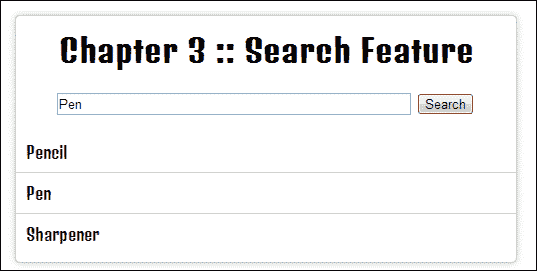
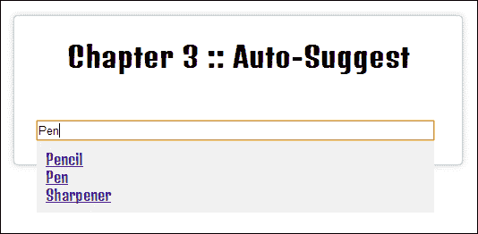

# 第三章：使用 AJAX 和 JSON 加载和操作动态内容

在本章中，我们将涵盖：

+   将 HTML 从 Web 服务器加载到页面中

+   使用 AJAX 并处理服务器错误

+   处理 JSON 数据

+   搜索 JavaScript 对象

+   排序 JavaScript 对象

+   缓存 JSON 和 AJAX 请求

+   创建搜索功能

+   创建自动建议功能

+   等待 AJAX 响应

# 简介

jQuery 允许开发人员进行 AJAX 调用，这将更新网站内容，而无需刷新完整的网页。 jQuery 的 AJAX 功能为网站增加了一个额外的维度，使其更像一个 Web 应用程序。 本章讨论了开发人员如何进行这些 AJAX 请求，接收数据并对其进行处理。 除了处理和利用从 AJAX 请求接收到的数据之外，本章还介绍了 AJAX 的一些其他主要功能，包括搜索和建议。

对于本章中的大多数示例，您要么需要在本地计算机上运行一个 Web 服务器，要么需要访问在线 Web 服务器。 一些关于 PHP 和 MySQL 的基本知识将会很有用，因为所需的 Web 服务器将使用这些技术。 要了解有关这些技术的更多信息，您可以参考以下资源：

+   要了解有关 PHP 的更多信息，请参阅[`www.php.net`](http://www.php.net)

+   要了解有关 MySQL 的更多信息，请参阅[`www.mysql.com`](http://www.mysql.com)

# 将 HTML 从 Web 服务器加载到页面中

在最基本的级别上，AJAX 允许我们使用来自 Web 服务器的新内容更新单个页面元素。 这个示例展示了如何设置一些数据以从一个使用 PHP 的 Web 服务器接收，以及如何接收此数据并将其应用到我们的网页中。

## 准备工作

确保您的 Web 服务器正在运行并且可以访问其 Web 根目录。

## 如何做…

执行以下步骤以创建所需的 PHP、MySQL 和 HTML，以便了解如何使用 jQuery 进行 AJAX：

1.  在我们能够从 Web 服务器请求任何数据以在我们的网页中显示之前，我们需要能够从 Web 服务器提供此数据。 创建一个名为 `request-1.php` 的 PHP 文件。 添加以下 PHP 代码，并将其保存在 Web 服务器的 Web 根目录中：

    ```js
    <?php
      $num = rand(1, 5);
      switch ($num) {
        case 1:
          $quote = "Learn from yesterday, live for today, hope for tomorrow. The important thing is not to stop questioning.";
          break;
        case 2:
          $quote = "Only two things are infinite, the universe and human stupidity, and I'm not sure about the former.";
          break;
        case 3:
          $quote = "The difference between stupidity and genius is that genius has its limits.";
          break;
        case 4:
          $quote = "Try not to become a man of success, but rather try to become a man of value.";
          break;
        case 5:
          $quote = "Any man who can drive safely while kissing a pretty girl is simply not giving the kiss the attention it deserves.";
          break;
      }
      echo $quote;
    ```

1.  第二步是创建一个使用 jQuery 的 HTML 页面，该页面可以从我们的 PHP 脚本请求数据。 在 Web 服务器的 Web 根目录中，创建一个名为 `recipe-1.html` 的 HTML 文件，并添加以下 HTML 代码：

    ```js
    <!DOCTYPE html>
    <html>
    <head>
      <title>Chapter 3 :: AJAX & JSON</title>
      <script src="img/jquery.min.js"></script>
      <style type="text/css">

      </style>
      <script>

      </script>
    </head>
    <body>
      <div class="left">
        Famous <br />Einstein Quotes
      </div>
      <div class="right">
        <p class="quote"></p>
        <button class="refresh">Get Quote</button>
      </div>
    </body>
    </html>
    ```

1.  现在我们将使用 CSS 来为我们的 HTML 页面添加样式。 在 `recipe-1.html` 文件的 `<style type="text/css"></style>` 标签中添加以下 CSS 代码：

    ```js
    .left {
      width: 200px;
      background-color: #CCC;
      float: left;
      height: 100px;
      text-align: center;
      font-size: 25px;
      padding: 40px 10px 10px 10px;
    }
    .right {
      width: 300px;
      float: left;
      margin-left: 10px;
      background-color: #333;
      color: #FFF;
      height: 120px;
      font-size: 20px;
      position: relative;
      padding: 20px 10px 10px 10px;
    }
    .refresh {
      position: absolute;
      right: 5px;
      top: 5px;

    }
    ```

1.  最后一步是添加一些 jQuery 代码，以便从 PHP 脚本请求数据并将其加载到我们的网页中。 在 `recipe-1.html` 文件的头部的脚本标签中，添加以下 jQuery 代码：

    ```js
    $(function() {
      $('.refresh').click(function() {
        $.ajax({
          url: '/request-1.php',
          type: 'GET'
        }).done(function(data){
          $('.quote').html(data);
        });
      });
    });
    ```

## 它是如何工作的…

现在，让我们详细了解之前执行的步骤。

### PHP

使用 PHP 脚本的目的是将**阿尔伯特·爱因斯坦**的随机引用提供为字符串。要能够随机执行此操作，我们首先需要生成一个随机数。这通过以下方式使用 PHP `rand()` 函数完成：

```js
$num = rand(1, 5);
```

这将创建一个随机整数值的变量，范围在 `1` 到 `5` 之间。然后，我们可以使用此随机数来确定要输出哪个引用。我们使用基于 `$num` 变量的 switch 语句创建一个具有随机爱因斯坦引用的 `$quote` 变量：

```js
switch ($num) {
    case 1:
      $quote = "Learn from yesterday, live for today, hope for tomorrow. The important thing is not to stop questioning.";
      break;
    case 2:
      $quote = "Only two things are infinite, the universe and human stupidity, and I'm not sure about the former.";
      break;
    case 3:
      $quote = "The difference between stupidity and genius is that genius has its limits.";
      break;
    case 4:
      $quote = "Try not to become a man of success, but rather try to become a man of value.";
      break;
    case 5:
      $quote = "Any man who can drive safely while kissing a pretty girl is simply not giving the kiss the attention it deserves.";
      break;
  }
```

最后，我们输出`$quote`的值：

```js
echo $quote;
```

如果您在浏览器中访问此文件（即`http://localhost/request.php`）从 Web 服务器提供的文件，您将每次刷新页面都会看到一个随机引用，如下面的截图所示：


### HTML

我们需要一个 HTML 页面来加载我们的 PHP 生成的引用。在 HTML 中，我们定义一个简单的 HTML 布局。我们创建一个具有 `left` 类的分区元素。此框仅包含标题**著名的爱因斯坦语录**。我们定义一个具有 `right` 类的第二个 div 元素和两个子元素，一个段落和一个按钮。


在上述截图中，右侧的由带有 `quote` 类的段落元素组成的框是我们将使用 jQuery 加载动态内容的地方。我们将使用按钮允许用户触发引用的动态加载。请注意，您还可以在页面加载时加载引用，而无需用户交互。

### CSS

要创建包含我们动态引用的网页，我们使用一些非常基本的 CSS 来样式化和对齐我们在 HTML 中创建的各种元素，如下所示：

```js
.left {
  width: 200px;
  background-color: #CCC;
  float: left;
  height: 100px;
  text-align: center;
  font-size: 25px;
  padding: 10px;
  padding-top: 40px;
}
```

我们使具有 `left` 类的 div 元素具有固定的宽度和高度，然后强制其浮动到浏览器窗口的左侧。设置固定高度以确保左侧和右侧 div 元素具有相等的高度。我们还添加了一些基本的文本格式设置，包括 `line-height`、`text-align` 和 `font-size`，这些都是不言自明的。我们还更改了 div 元素的背景颜色，并添加了一些填充以进一步对齐文本。

```js
.right {
  width: 300px;
  float: left;
  margin-left: 10px;
  background-color: #333;
  color: #FFF;
  height: 120px;
  font-size: 20px;
  position: relative;
  padding: 10px;
  padding-top: 20px;
}
```

我们向右侧的分区元素添加了非常相似的样式，还添加了 `position: relative;`，这样可以防止具有绝对位置的兄弟元素漂浮到此 div 元素之外。

```js
.refresh {
  position: absolute;
  right: 5px;
  top: 5px;
}
```

由于父级 `.right` 分区元素具有相对位置，我们可以使 `.refresh` 按钮的位置为绝对，并将顶部和右侧位置值设置为静态，从而强制按钮浮动到我们的 `.right` 分区框的右上角。

### jQuery

使用 jQuery，我们可以向我们的 Web 服务器上早些时候创建的 `request.php` 页面发出请求。首先，我们创建一个事件处理程序并将其附加到刷新按钮上，以便在用户单击此按钮时进行请求。

```js
$('.refresh').click(function() {

});
```

当用户点击`.refresh`按钮时，`function(){}`内的任何代码都将被执行。在这个回调函数中，我们可以使用 jQuery 提供的`$ajax`进行 AJAX 请求：

```js
$.ajax({
  url: '/request.php',
  type: 'GET'
}).done(function(data){
  $('.quote').html(data);
});
```

我们向`$.ajax()`提供一个对象，该对象允许我们指定进行 AJAX 调用所需的一组参数。在本例中，我们提供了`url`和`type`参数，告诉 jQuery 在哪里进行请求以及请求的类型。

### 注意

阅读`$.ajax()`的文档，了解可以提供的其他参数。API 文档可以在[`api.jquery.com/jQuery.ajax/`](http://api.jquery.com/jQuery.ajax/)找到。

另外，我们在 AJAX 请求方法后添加`.done()`函数，并提供一个接受`data`参数的回调函数。这个`data`参数将保存来自服务器的响应。在回调函数中，我们使用`$('.quote').html(data);`来用我们的 PHP 脚本的响应替换`.quote`段落中的 HTML。如果用户访问这个 HTML 页面并点击**获取报价**按钮，他们将看到如下截图中的结果：


## 请参见

+   *创建搜索功能*

+   *创建自动建议功能*

+   *等待 AJAX 响应*

# 使用 AJAX 处理服务器错误

在理想的世界里，你的 Web 应用程序永远不会出错。不幸的是，事实并非如此，Web 开发人员需要优雅地处理错误，并为用户提供有用的反馈。

例如，当服务器无法访问或文件/网页丢失时，会发生系统错误。系统错误通常是不可避免的，超出用户的控制范围。它们与应用程序错误（如无效的数据输入）不同，用户可以进行更正。

## 准备工作

由于这个示例涉及到 AJAX 错误，并且我们将调用一个不存在的 PHP 脚本，所以我们只需要 HTML 和 JavaScript。创建一个名为`recipe-2.html`的空白 HTML 文档，并确保你已经下载并准备好了最新版本的 jQuery。

## 怎样去做…

学习如何通过仔细执行以下步骤来处理 AJAX 错误：

1.  添加以下 HTML 代码以创建一个简单的网页，其中只有一个按钮，将触发一个 AJAX 请求：

    ```js
    <!DOCTYPE html>
    <html>
    <head>
      <title>Chapter 3 :: AJAX & JSON</title>
      <script src="img/jquery.min.js"></script>
      <script>

      </script>
    </head>
    <body>
      <button id="makeRequest">Make AJAX request</button>
    </body>
    </html>
    ```

1.  在脚本标签中，添加以下的 jQuery 代码，当`#makeRequest`按钮被点击时，将向不存在的文件发出 AJAX 请求：

    ```js
    $(function() {
      $('#makeRequest').click(function() {
      $.ajax({	
        url: 'i-do-not-exist.html',
        type: 'GET'
      }).done(function(data){
        //Will not succeed as no file exists
      });
      });
    });
    ```

1.  在 AJAX 请求之后（但仍在`$(function(){});`中），添加以下代码，它将创建一个全局的 AJAX 错误事件处理程序，每当 AJAX 请求失败时都会触发：

    ```js
    $(document).ajaxError(function(event, request, settings) {
      alert("Error trying to reach '" + settings.url + "'. ERROR CODE: " + request.status + " ERROR MESSAGE: " + request.statusText);
    });
    ```

## 运作原理…

我们创建的 HTML 页面是不言自明的。我们创建了一个按钮，可以触发 AJAX 请求。这显然是用来说明错误处理概念的最简单的例子，然后可以应用到使用 jQuery 的任何 AJAX 请求情况。

我们为`#makeRequest`按钮创建了一个事件处理程序，并提供了一个回调函数来在单击时执行：

```js
$('#makeRequest').click(function() {
  $.ajax({
    url: 'i-do-not-exist.html',
    type: 'GET'
  }).done(function(data){
  //Will not succeed as no file exists
  });
});
```

我们通过 jQuery 提供的`$.ajax()`函数在回调函数中添加了 AJAX 请求。然后，我们将一个 JavaScript 对象传递给这个方法，在这个方法中，我们指定了一个不存在文件的 URL 和请求的类型；在这种情况下，`GET`。请注意，如果 AJAX 请求失败，则`$.ajax()`函数链接到`.done()`函数的功能将永远不会被执行。

我们创建了一个全局 AJAX 错误处理程序，并将其附加到文档上，以便它能够捕获我们页面中的所有 AJAX 错误：

```js
$(document).ajaxError(function(event, request, settings) {
  alert("Error trying to reach '" + settings.url + "'. ERROR CODE: " + request.status + " ERROR MESSAGE: " + request.statusText);
});
```

在`.ajaxError`方法的回调函数中提供了三个参数，我们可以使用这些参数了解有关错误的更多信息。在这个例子中，我们从`settings`变量和`request`对象中提取目标 URL 的信息和状态信息。

如果您在 Web 浏览器中打开此 HTML 文件并单击`#makeRequest`按钮，将显示一个 JavaScript 警报框，其中提供有关错误的信息，如下面的屏幕截图所示：


## 还有更多...

在这个例子中，我们创建了一个全局 AJAX 错误处理程序来捕获页面中的所有 AJAX 请求错误。全局 AJAX 错误处理程序非常适合请求错误，例如文件丢失或主机不可达。在这些情况下，可以以相同的方式处理所有 AJAX 请求的错误，并且不需要有关个别请求的更具体的信息。

在您的应用程序中可能会出现这样的情况，您可能需要以不同的方式处理一个或多个 AJAX 请求错误。为此，您可以使用`.fail()`函数，该函数与`.done()`的使用方式相同。以下 jQuery 代码提供了一个使用`.fail()`的示例用法，以实现一个简单的 AJAX 请求的全局错误处理相同的结果：

```js
$.ajax({
  url: 'i-do-not-exist.html',
  type: 'GET'
}).done(function(data){
  //Will not succeed as now file exists
}).fail(function(event){
  alert("An error occurred. Error Code: " + event.status);
});
```

请注意，关于错误的直接可用信息较少。

# 处理 JSON 数据

**JavaScript 对象表示法**（**JSON**）为 Web 开发人员提供了一种干净高效的数据编码方式。JSON 是一种被广泛采用的格式。它简化了数据处理和操作。要了解更多关于为什么应该使用 JSON 的信息，请访问[`www.revillweb.com/why-use-json/`](http://www.revillweb.com/why-use-json/)。

## 准备工作

确保您的 Web 服务器正在运行，并且您可以访问您可以保存/上传作为此配方的一部分创建的文件的网络根目录。

## 如何做...

通过执行以下步骤来学习如何使用 JavaScript 处理 JSON 格式的数据：

1.  创建一个名为`request-3.php`的 PHP 文件，并将其保存到您的网络服务器的网络根目录中。使用以下 PHP 代码创建并输出一个名字列表作为 JSON 数据：

    ```js
    <?php
      //Create an array of people
      $people = array(
        1 => array(
          "firstname" => "Luke",
          "lastname" => "Skywalker"
        ),
        2 => array(
          "firstname" => "Darth",
          "lastname" => "Vader"
        ),
        3 => array(
          "firstname" => "Mace",
          "lastname" => "Windu"
        )
      );
      //Ensure the browser is expecting the correct content
      //type format and charset
      header("Content-Type: application/json; charset=UTF-8");
      //Encode the array of people into JSON data
      echo json_encode($people);
    ?>
    ```

1.  在您的网络服务器的网络根目录中创建一个名为`recipe-3.html`的 HTML 页面。将以下 HTML 添加到此页面中，它创建了一个无序列表元素，一旦处理完成我们的 JSON 数据，就可以填充该元素：

    ```js
    <!DOCTYPE html>
    <html>
    <head>
      <title>Chapter 3 :: AJAX & JSON</title>
      <script src="img/jquery.min.js"></script>
      <script>
      </script>
    </head>
    <body>
      <ul id="peopleList"></ul>
    </body>
    </html>
    ```

1.  在 HTML 页面的 head 标签内的 script 标签中，添加以下 jQuery 代码以执行对之前创建的`request-3.php`页面的 AJAX 请求：

    ```js
    $(function(){
      $.ajax({
        url: '/request-3.php',
        type: 'GET'
      }).done(function(data){

      });
    });
    ```

1.  在`.done()`回调函数中，使用 jQuery 的`$.each()`函数处理来自我们的 PHP 页面返回的 JSON 数据，并为列表中的每个人添加一个新的列表项到我们的 HTML 页面中：

    ```js
    $.each(data, function(key, value) {
      $('#peopleList').append("<li>#" + key + " " + value.firstname + " " + value.lastname + "</li>");
    });
    ```

## 运行原理...

现在，让我们详细了解之前执行的步骤。

### PHP

在实际应用中，你通常会从数据库中检索数据。在这个示例中，我们创建了一个简单的二维姓名数组作为我们的“数据库”，允许我们集中精力编写 jQuery 代码。

```js
$people = array(
  1 => array(
    "firstname" => "Luke",
    "lastname" => "Skywalker"
  ),
  2 => array(
    "firstname" => "Darth",
    "lastname" => "Vader"
  ),
  3 => array(
    "firstname" => "Mace",
    "lastname" => "Windu"
  )
);
```

接下来，我们手动指定响应内容类型和字符集。要指定响应的内容类型和字符集，以便 web 浏览器和 jQuery 代码知道期望数据的格式。大多数 web 浏览器都可以很好地解决这个问题。然而，Internet Explorer 9 及更低版本在这个领域特别棘手，手动使用 PHP 的 `header()` 函数指定内容类型和字符集始终是一个好的做法：

```js
header("Content-Type: application/json; charset=UTF-8");
```

请注意，我们的字符集设置为`UTF-8`，而不是 `utf8` 或 `utf-8`。再次提醒，大多数浏览器都可以接受任一种设置，但一些较早的 Internet Explorer 版本在字符集格式不正确时会产生不良影响。

### 注意

在这个示例中，与这样简单的数据不太可能出现本文中提到的与浏览器相关的问题。这是一种最佳实践，将为更大型、更复杂的使用 AJAX 和 JSON 的 Web 应用程序提供更大的益处。

最后，我们使用 PHP 提供的 `json_encode()` 函数将我们的 PHP 数组编码为 JSON 格式，并使用`echo`输出结果如下：

```js
echo json_encode($people);
```

如果直接访问`request-3.php`页面，你会在浏览器窗口中看到以下格式的`people`数组的输出：

```js
{"1":{"firstname":"Luke","lastname":"Skywalker"},"2":{"firstname":"Darth","lastname":"Vader"},"3":{"firstname":"Mace","lastname":"Windu"}}
```

或者，可以使用浏览器开发工具并选择网络选项卡，以更可读的方式查看响应。

### HTML

我们的 HTML 页面除了包含 jQuery 库外，还创建了一个 HTML 无序列表元素，我们可以在 jQuery 处理后将其填充为 JSON 数据。

### jQuery

将我们的代码放在`$(function(){});`中将导致页面加载时执行它。我们使用 jQuery 的`$.ajax()`功能来对先前创建的 PHP 文件执行 AJAX 请求，方法如下：

```js
$.ajax({
  url: '/request.php',
  type: 'GET'
}).done(function(data){
});
```

通过在对象中提供`url`和`type`参数给这个方法，我们告诉方法对我们的 web 服务器的 web root 中存在的`request-3.php`文件发出`GET`请求。然后我们在`$.ajax();`方法上附加了一个`.done()`函数，当请求成功发送时，将执行该函数。`.done()`方法采用回调函数作为参数，该回调函数包含来自请求的响应数据的`data`变量——来自 PHP 文件的 JSON 数据。

现在我们已经在`data`变量中获得了响应数据，我们可以处理 JSON 数据并使用以下代码填充我们的 HTML 列表元素：

```js
$.each(data, function(key, value) {
  $('#peopleList').append("<li>#" + key + " " + value.firstname + " " + value.lastname + "</li>");
});
```

`$.each();`是 jQuery 提供的另一个函数，它允许我们循环遍历作为第一个参数指定的一组数据（在本例中是`data`）。第二个参数是要对`data`变量中找到的每个项目执行的回调函数。这个回调函数还接受两个参数，`key`和`value`。使用这些变量，我们可以从 JSON 数据中获取所有信息，包括数组键（例如，1、2、3 等）和值；每个对象的名字和姓氏。

最后，我们选择`#peopleList`元素，并使用`append()`函数将 HTML 列表项附加到每个`people`JSON 对象的无序列表中。

## 另请参阅

+   *搜索 JavaScript 对象*

+   *对 JavaScript 对象进行排序*

# 搜索 JavaScript 对象

由于对象是在应用程序中保存数据的主要方法，因此能够找到符合特定条件的对象非常有用。jQuery 并未为我们提供直接搜索对象和对象数组的方法；但是，我们可以很容易地创建此功能。

## 准备工作

使用你喜欢的文本编辑器，创建一个名为`recipe-4.html`的空白 HTML 文档，并确保你已安装了最新版本的 jQuery。将以下 HTML 代码添加到此 HTML 文件中：

```js
<!DOCTYPE html>
<html>
<head>
  <title>Chapter 3 :: AJAX & JSON</title>
  <script src="img/jquery.min.js"></script>
  <script>

  </script>
</head>
<body></body>
</html>
```

确保你更新了对 jQuery 库的引用，以指出它在计算机上保存的位置。这个 HTML 页面为我们提供了一个网页，我们可以在此处执行这个配方的 JavaScript。

## 如何做…

创建一个 JavaScript 函数，通过执行以下步骤可以轻松地搜索对象：

1.  在新创建的`recipe-4.html`页面的脚本标签中，创建一个对象数组，我们可以对其执行搜索：

    ```js
    var people = [
    {
      title: "Mr",
      firstname: "John",
      lastname: "Doe"
    },
    {
      title: "Mrs",
      firstname: "Jane",
      lastname: "Doe"
    },
    {
      title: "Sir",
      firstname: "Johnathan",
      lastname: "Williams"
    },
    {
      title: "Sir",
      firstname: "Edward",
      lastname: "Tailor"
    }
    ];
    ```

1.  在这个对象数组下面，添加以下递归函数，我们可以用它来遍历前面的对象，并根据提供的参数找到匹配项：

    ```js
    function findObjects(parameter, value, object) {
      var matches = [];
      for (var i in object) {
        if (typeof object[i] == 'object') {
          matches = matches.concat(findObjects(parameter, value, object[i]));
        } else if (i == parameter && object[parameter] == value) {
          matches.push(object);
        }
      }
    return matches;
    }
    ```

1.  通过指定要查找的参数、要匹配的值，然后是要搜索的对象/对象来调用该函数：

    ```js
    var results = findObjects("title", "Sir", people);
    console.log(results);
    ```

1.  在浏览器中打开`recipe-4.html`，然后打开 JavaScript 控制台（在 Chrome 中按 *Ctrl* + *Shift* + *J*）；你将看到搜索结果。

## 工作原理…

首先，创建一个表示人员的对象数组。这不需要是静态数据集，可以像前面的示例中那样从 AJAX 请求中加载。

我们的 `findObjects()` 函数将允许我们搜索一个对象或对象数组。这个函数接受三个参数。第一个参数是 `parameter`，即我们想要在其中搜索的对象；在这个例子中是 `title`。第二个参数是我们想要查找匹配项的实际值；上面的例子使用了 `Sir`。最后一个参数是我们创建的对象数组。

我们首先在函数内部创建一个空数组，这个数组将保存符合我们指定条件的每个对象：

```js
var matches = [];
```

使用原生的 JavaScript `for` 循环，我们可以遍历对象/对象数组。

```js
for (var i in object) {
}
```

如果我们提供了一个对象数组，`object[i]` 在每次迭代中将代表数组内的不同对象。如果我们提供了单个对象，那么 `i` 将在每次迭代中代表所提供对象内的不同属性。

由于 JavaScript 对象也可以包含其他对象或数组，我们需要允许递归，以便能够搜索无限深度的对象。为此，我们首先检查 `object[i]`（当前迭代的对象或属性值）是否为对象。如果是，我们从函数内部调用我们自己的 `findObjects()` 函数，并将当前对象作为最后一个参数提供：

```js
if (typeof object[i] == 'object') {
  matches = matches.concat(findObjects(parameter, value, object[i]));
}
```

由于 `findObjects()` 函数将返回一组匹配项，我们使用 `matches = matches.concat()` 将返回结果的数组添加到当前匹配项数组中。我们添加了一个 `else if` 语句来过滤值不是对象的情况。

```js
if (typeof object[i] == 'object') {
  matches = matches.concat(findObjects(parameter, value, object[i]));
} else if (i == parameter && object[parameter] == value) {
  matches.push(object);
}
```

在 `else if` 语句中，我们检查当前属性（由 `i` 表示）是否与我们提供的参数匹配。如果是，则检查该属性的值是否与我们提供的参数值匹配。如果也是，则使用 `matches.push(object)` 将当前对象添加到 `matches` 数组中。最后，一旦我们遍历了所有对象和属性，我们就返回 `matches` 数组。

在上面的例子中，我们简单地使用 `console.log();` 将匹配的对象数组输出到浏览器的 JavaScript 控制台。这个数组可以以任何方式使用，比如填充 HTML 列表元素。

## 还有更多…

在 JavaScript 对象中搜索通常会成为你应用程序的常见部分。确保将此类函数尽可能地制作成通用的，并且不要将其编码为单一操作。然后，你将能够在应用程序中全局使用此函数，并在整个应用程序中重复使用它。此外，在编写递归函数时要小心，因为很容易创建无限循环和复杂难读的代码。

## 另请参阅

+   *处理 JSON 数据*

+   *对 JavaScript 对象进行排序*

# 对 JavaScript 对象进行排序

除了能够高效地找到符合条件的对象外，你通常还需要将对象按照某种顺序输出。

## 准备工作

与前一个示例一样，创建一个名为 `recipe-5.html` 的 HTML 页面，我们可以使用以下代码为此示例添加和执行 JavaScript 代码：

```js
<!DOCTYPE html>
<html>
<head>
  <title>Chapter 3 :: AJAX & JSON</title>
  <script src="img/jquery.min.js"></script>
  <script >

  </script>
</head>
<body></body>
</html>
```

更新 jQuery 库的引用，以确保在您的计算机上包含正确的文件。

## 如何做…

创建一个可重复使用的函数来对 JavaScript 对象进行排序，执行以下逐步说明：

1.  在您刚刚创建的 `recipe-5.html` 文件中的脚本标签中，添加以下 JavaScript 代码：

    ```js
    var people = [
      {
        title: "Mrs",
        firstname: "Jane",
        lastname: "Doe"
      },
      {
        title: "Sir",
        firstname: "Johnathan",
        lastname: "Williams"
      },
      {
        title: "Mr",
        firstname: "John",
        lastname: "Andrews"
      },
      {
        title: "Sir",

        firstname: "Edward",
        lastname: "Tailor"
      }
    ];
    ```

1.  在此数组下方，添加以下可用于对数组中的 JavaScript 对象进行排序的函数：

    ```js
    function sortObjectsByParam(param) {
      return function(a, b) {
        if (a[param] == b[param]) { return 0; }
        if (a[param] > b[param]) { return 1; }
        else { return -1; }
      }
    }
    ```

1.  使用此函数与原生 JavaScript 的 `.sort()` 函数如下所示：

    ```js
    people.sort(sortObjectsByParam("lastname"));
    console.log(people);
    ```

1.  在浏览器中打开此网页并查看 JavaScript 控制台，将为您提供我们在步骤 1 中创建的 JavaScript 数组中的对象列表。不同之处在于它们将按姓氏排序，而不是它们的原始顺序。

## 工作原理…

我们必须有一个对象数组，才能成功使用我们的 `.sort()` 函数对其进行重新排序。这个对象数组可以是静态的，就像示例中一样，也可以通过 AJAX 请求从服务器加载。

JavaScript 提供了一个 `.sort()` 函数，它将一个函数作为参数，并将两个参数提供给此回调函数。`.sort()` 的典型用法如下：

```js
people.sort(function(a, b){
  //Compare objects here
});
```

`a` 和 `b` 参数是数组中的两个对象。我们可以比较这两个对象，并确定哪个对象需要放在另一个对象之前。

在我们的示例中，我们需要一些额外的功能；我们需要能够指定要对其进行排序的参数。由于无法向 `.sort()` 回调函数提供额外的参数，因此我们将回调包装在另一个函数中，如下所示：

```js
function sortObjectsByParam(param) {
  return function(a, b) {

  }
}
```

然后，我们可以指定一个属性来对对象进行排序，然后在回调函数中使用。回调函数必须返回 `0` 或正数或负数。在我们的示例中，`0` 表示不需要排序，两个对象相等。`1` 表示应将 `a` 放在 `b` 之前，`-1` 表示应将 `b` 放在 `a` 之前。我们可以在回调函数中进行此评估，如下所示：

```js
function sortObjectsByParam(param) {
  return function(a, b) {
    if (a[param] == b[param]) { return 0; }
    if (a[param] > b[param]) { return 1; }
    else { return -1; }
  }
}
```

我们使用 `a[param]` 和 `b[param]` 仅检查对象的指定参数。现在，我们可以将此函数与原生 JavaScript 的 `.sort()` 函数结合使用，根据指定的参数重新排序我们的对象，如下所示：

```js
$(function(){
  people.sort(sortObjectsByParam("lastname"));
  console.log(people);
});
```

这将按字母顺序重新排列我们稍早创建的对象数组，按其姓氏排序。因此，对象 `Mr John Andrews` 将是数组中的第一个对象，依此类推。

## 还有更多…

与用于搜索对象的函数类似，此函数不应编码为单个操作，以便在整个应用程序中重复使用。可重复使用的代码将使您的应用程序更易于管理和调试。

## 另请参阅

+   *处理 JSON 数据*

+   *搜索 JavaScript 对象*

# 缓存 JSON 和 AJAX 请求

Web 开发人员可以增加其 Web 应用程序的速度的一种方法是限制向 Web 服务器发出的请求数量。确保仅在需要时进行数据调用非常重要。我们可以使用缓存来确保只有在需要新的数据集时才发出请求。

## 准备工作

确保你的 Web 服务器正在运行，并且你有权限将文件添加到服务器的 Web 根目录中。

## 如何做…

学习如何通过简单的缓存方法加速你的 JavaScript 应用程序，按照以下说明执行：

1.  在你的 Web 服务器的 Web 根目录中创建一个名为 `request-6.php` 的 PHP 文件。使用以下 PHP 代码创建并输出名称列表作为 JSON 数据：

    ```js
    <?php
      //Create an array of people
      $people = array(
        1 => array(
          "firstname" => "Luke",
          "lastname" => "Skywalker"
        ),
        2 => array(
          "firstname" => "Darth",
          "lastname" => "Vader"
        ),
        3 => array(
          "firstname" => "Mace",
          "lastname" => "Windu"
        )
      );
      //Ensure the browser is expecting the correct content
      //type format and charset
      header("Content-Type: application/json; charset=UTF-8");
      //Encode the array of people into JSON data
      echo json_encode($people);
    ```

1.  使用以下 HTML 代码在 Web 服务器的 Web 根目录中创建一个名为 `recipe-6.html` 的页面，以便你可以向你的 PHP 文件发出 AJAX 请求：

    ```js
    <!DOCTYPE html>
    <html>
    <head>
      <title>Chapter 3 :: AJAX & JSON</title>
      <script src="img/jquery.min.js"></script>
      <script>

      </script>
    </head>
    <body>
      <ul id="peopleList"></ul>
      <button class="getPeople">Get People</button>
    </body>
    </html>
    ```

1.  在 HTML 页面的 head 标签中的 script 标签中，添加以下 jQuery 代码以发出 AJAX 请求，以检索在 PHP 文件中创建的 `people` 数组，然后缓存结果：

    ```js
    var cache = [];
    $(function(){
      $('.getPeople').click(function(){
        if (cache.length == 0) {
          $.ajax({
              url: '/request-6.php',
              type: 'GET',
              async: false
          }).done(function(data){
              cache = data;
          });
        }
        $('#peopleList').empty();
        $.each(cache, function(key, value){
          $('#peopleList').append("<li>#" + key + " " + value.firstname + " " + value.lastname  + "</li>");
        });
      });
    });
    ```

## 工作原理…

现在，让我们详细了解之前执行的步骤。

### PHP

请参考本章的上一个示例，*处理 JSON 数据*，以详细了解这段 PHP 代码的工作原理。

### HTML

我们创建的 HTML 页面非常基础，不需要太多解释。我们只是创建了一个无序列表元素，我们可以用 jQuery 填充它，并且一个按钮，用户可以点击它来触发从 PHP 文件加载 JSON 数据的 AJAX 请求。

### jQuery

首先，我们创建一个空的 JavaScript 数组，我们可以用来缓存从 AJAX 请求接收到的数据，如下所示：

```js
var cache = [];
```

然后，在 `$(function(){});` 中，这将在页面加载时执行，我们将点击事件处理程序附加到 `.getPeople` 按钮上。

```js
$(function(){
  $('.getPeople').click(function(){

  });
});
```

在此事件处理程序的回调函数中，我们通过评估 `cache` 数组的长度来检查当前是否有任何内容：

```js
if  (cache.length == 0) {

}
```

如果 `cache` 数组中没有任何内容，那么我们没有任何缓存的数据。我们需要向我们的 PHP 文件发出 AJAX 请求，以获取 JSON 数据，如下所示的代码片段所示。这将确保仅在需要数据时才进行 AJAX 请求，并且每次点击按钮时不会进行请求。

```js
if  (cache.length == 0) {
  $.ajax({
    url: '/request.php',
    type: 'GET',
    async: false
  }).success(function(data){
    cache = data;
  });
}
```

在 AJAX 请求成功时，我们将结果存储在我们的 `cache` 数组中。请注意，我们将 `async` 属性设置为 `false`，这意味着在 AJAX 请求之后任何 JavaScript 代码都不会被执行，直到有响应为止。这是为了在 `cache` 数组填充数据之前防止 HTML 列表被填充的理想解决方案。对于大型应用程序来说，这不是理想的解决方案，因为如果 AJAX 请求花费很长时间响应，这可能会导致浏览器挂起或崩溃。阅读本章的 *等待 AJAX 响应* 示例，以了解等待 AJAX 请求完成的首选方法。

当 `cache` 数组被填充后，我们可以使用它来向我们的 HTML 无序列表中添加项目。我们使用了 jQuery 的 `$.each()` 函数，它允许我们遍历 `cache` 数组中的每个对象。对于这些对象中的每一个，我们使用 `.append()` 来添加一个列表项以及对象中的数据到 `#peopleList` 列表中。

```js
$('#peopleList').empty();
$.each(cache, function(key, value){
  $('#peopleList').append("<li>#" + key + " " + value.firstname + " " + value.lastname  + "</li>");
});
```

在我们填充列表之前，我们首先使用 `$('#peopleList').empty();` 来清空 DOM 中的列表。这是为了防止额外的按钮点击添加重复的项目。

## 还有更多…

这种数据缓存方法可以加快你的 Web 应用程序。然而，这种方法对于请求的数据经常变化的情况不太适用，因为用户只有在刷新或重新访问页面时才会得到更新的数据。

jQuery 中的 AJAX 请求有它们自己的一种缓存方式，本质上与浏览器缓存是一样的。通过提供给 `$.ajax()` 函数的设置，你可以控制这种缓存的工作方式。虽然这种缓存很有用，但它并没有手动缓存方法所提供的同样级别的控制。

# 创建一个搜索特性

允许用户在你的 Web 应用程序中搜索数据是一个基本原则。这个示例将向你展示如何使用 jQuery 和 AJAX 来创建一个快速高效的搜索功能，后端使用 PHP 和 MySQL。

## 准备工作

这个方法不仅要求你有一个运行着 PHP5 的 Web 服务器，还需要一个准备好接受 PHP 脚本连接的 MySQL 服务器。

## 如何做…

了解如何从零开始创建一个搜索特性，这将向你展示有价值的 jQuery 原则在实际操作中的运行，执行以下步骤：

1.  我们需要创建一个数据库和一张表来存储用户可以搜索的数据。在你的数据库服务器上创建一个名为 `jquerycookbook` 的数据库，并使用下面的 SQL 代码来创建并填充一张包含一些数据的表：

    ```js
    USE `jquerycookbook`;

    CREATE TABLE IF NOT EXISTS `stationary` (
      `id` bigint(20) unsigned NOT NULL AUTO_INCREMENT,
      `title` varchar(128) NOT NULL,
      PRIMARY KEY (`id`)
    ) ENGINE=InnoDB  DEFAULT CHARSET=latin1 AUTO_INCREMENT=6 ;

    INSERT INTO `stationary` (`id`, `title`) VALUES
    (1, 'Ruler'),
    (2, 'Pencil'),
    (3, 'Pen'),
    (4, 'Rubber'),
    (5, 'Sharpener');
    ```

1.  为了让用户能够从他们的浏览器（客户端）搜索到我们的数据库中的数据，我们需要能够根据他们的搜索提取出数据库中的信息。我们可以使用 PHP 来查询 MySQL 数据库，以根据用户通过客户端提供的搜索词来获取数据。在我们能够做到这一点之前，我们需要能够连接到刚刚创建的数据库。在 Web 服务器的根目录下创建一个名为 `db.inc.php` 的 PHP 文件，并添加以下代码：

    ```js
    <?php
      $dbhost = 'localhost'; //hostname
      $dbuser = 'root'; //database username
      $dbpass = ''; //database password
      $dbname = 'jquerycookbook'; //database name

      $db = new mysqli($dbhost, $dbuser, $dbpass);

      $db->select_db($dbname);
      if($db->connect_errno > 0){
        die('ERROR! - COULD NOT CONNECT TO mySQL DATABASE: ' . $db->connect_error);
      }
    ```

1.  请确保将`$dbhost`，`$dbuser`和`$dbpass`的值改为与你的配置匹配。

1.  在 Web 服务器的根目录下创建一个名为 `search.php` 的 PHP 文件，并添加以下代码：

    ```js
    <?php
      //Prepare an object to hold data we are going to send
      //back to the jQuery
      $data = new stdClass;
      $data->success = false;
      $data->results = array();
      $data->error = NULL;
      //Has the text been posted?
      if (isset($_POST['text'])) {
        //Connect to the database
        require_once('db.inc.php');
        //Escape the text to prevent SQL injection
        $text = $db->real_escape_string($_POST['text']);
        //Run a LIKE query to search for titles that are like
        //the entered text
        $q = "SELECT * FROM `stationary` WHERE `title` LIKE '%{$text}%'";
        $result = $db->query($q);
        //Did the query complete successfully?
        if (!$result) {
          //If not add an error to the data array
          $data->error = "Could not query database for search results, MYSQL ERROR: " . $db->error;
        } else {
          //Loop through the results and add to the results
          //array
          while ($row = $result->fetch_assoc()) {
            $data->results[] = array(
              'id' => $row['id'],
              'title' => $row['title']
            );
          }
          //Everything went to plan so set success to true
          $data->success = true;
        }
      }
      //Set the content type for a json object and ensure
      //charset is UTF-8\. Not utf8 otherwise it will not work in IE
      header("Content-Type: application/json; charset=UTF-8");
      //json encode the data
      echo json_encode($data);
    ```

1.  在 Web 服务器的根目录下创建一个名为 `recipe-7.html` 的 HTML 文件，使用以下 HTML 代码：

    ```js
    <!DOCTYPE html>
    <html>
    <head>
      <title>Chapter 3 :: AJAX & JSON</title>
      <script src="img/jquery.min.js"></script>
      <script src='script-7.js'></script>
      <link href='style-7.css' rel="stylesheet" />
    </head>
    <body>
      <div id='frame'>
        <div class='search'>
          <div class='header'>
            <h1>Chapter 3 :: Search Feature</h1>
            <input type='text' id='text' /> <button id='search'>Search</button>
          </div>
          <div id='results-holder'>
            <div class="loading-holder">
              <div class="loading">Loading...</div>
            </div>
            <ul id='results-list'></ul>
          </div>
        </div>
      </div>
    </body>
    </html>
    ```

1.  为了使我们的搜索功能更加吸引人，我们可以使用 CSS 来为我们刚刚创建的 HTML 页面添加样式。您可能已经注意到，在 HTML 页面头部，我们包含了一个名为 `style-7.css` 的 CSS 文件。创建 `style-7.css` 文件，将其保存到您的 Web 服务器的 Web 根目录中，并添加以下 CSS 代码：

    ```js
    /* Include a web font from Google  */
    @import url(http://fonts.googleapis.com/css?family=Denk+One);
    /* Basic CSS for positioning etc */
    body {
      font-family: 'Denk One', sans-serif;
    }
    #frame {
      width: 500px;
      margin: 125px auto auto auto;
      border: solid 1px #CCC;
      /* SOME CSS3 DIV SHADOW */
      -webkit-box-shadow: 0 0 10px #CCC;
      -moz-box-shadow: 0 0 10px #CCC;
      box-shadow: 0 0 10px #CCC;
      /* CSS3 ROUNDED CORNERS */
      -moz-border-radius: 5px;
      -webkit-border-radius: 5px;
      -khtml-border-radius: 5px;
      border-radius: 5px;
      background-color: #FFF;
    }
    .search .header {
      margin: 25px;
    }
    .search .header {
      text-align: center;
    }
    .search .header input {
      width: 350px;
    }
    #results-holder {
      min-height: 200px;
    }
    .loading {
      text-align: center;
      line-height: 30px;
      display: none; /* DONT DISPLAY BY DEFAULT */
    }
    .loading-holder {
      height: 30px;
    }
    /* Styling for the results list */
    #results-list {
      margin: 0;
      padding: 0;
      list-style: none; /* REMOVE THE BULLET POINTS */
    }
    #results-list li {
      line-height: 30px;
      border-bottom: solid 1px #CCC;
      padding: 5px 5px 5px 10px;
        color: #333;
    }
    /* REMOVE THE BORDER FROM THE LAST LIST ELEMENT SO IT DOESN'T CLASS WITH THE FRAME BORDER */
    #results-list li:last-child {
    	border: none;
    }

    /* STYLE THE NO RESULTS LIST ITEM */
    #results-list .no-results {
      text-align: center;
      font-weight: bold;
      font-size: 14px;
    }
    ```

1.  使用 jQuery，我们将能够接受用户的搜索查询，并将请求发送到我们的 PHP 脚本。在您的 Web 服务器的 Web 根目录中创建一个名为 `script-7.js` 的 JavaScript 文件。请注意，这也包含在 HTML 文件的头部中。将以下 jQuery 代码添加到此文件中：

    ```js
    $(function(){
      //Hide the result list on load
      $('#results-list').hide();
      //Click event when search button is pressed
      $('#search').click(function(){
        doSearch();
      });
        //Keypress event to see if enter was pressed in text
        //input
      $('#text').keydown(function(e){
      if(e.keyCode == 13){
        doSearch();
      }
      });
    });

    function doSearch() {
      var searchText = $('#text').val();
      //Rehide the search results
      $('#results-list').hide();
      $.ajax({
        url: '/search.php',
        type: 'POST',
        data: {
          'text': searchText
        },
        beforeSend: function(){
          $('.loading').fadeIn();
        },
        success: function(data) {
          $('.loading').fadeOut();
          //Was everything successful, no errors in the PHP
          //script
          if (data.success) {
            $('#results-list').empty();
            if(data.results.length > 0) {
              $.each(data.results, function(){
                $('#results-list').append("<li>" + this.title + "</li>");
              });
            } else {
              $('#results-list').append("<li class='no-results'>Your search did not return any results</li>");
            }
            //Show the results list
            $('#results-list').fadeIn();
          } else {
            //Display the error message
            alert(data.error);
          }
        }
      });
    }
    ```

1.  访问您的 Web 服务器上的 `recipe-7.html` 文件将呈现给您一个简单样式的搜索输入，允许您在我们添加到 MySQL 数据库的静态项上执行搜索。下面的截图与完成搜索后您将看到的类似：

## 工作原理…

现在，让我们详细了解之前执行的步骤。

### SQL

通过 SQL 代码，我们简单地告诉 SQL 脚本使用我们创建的 `jquerycookbook` 数据库；我们创建一个名为 `stationary` 的表，然后向表中插入五个静态项。

### PHP

我们创建的第一个 PHP 脚本，`db.inc.php`，只是用来连接到我们创建的数据库，然后允许我们查询其中的数据。我们创建了四个变量来保存数据库服务器的主机名（通常是 localhost）、用户名、密码，以及我们希望连接的数据库的名称。

```js
$dbhost = 'localhost'; //hostname
$dbuser = 'root'; //database username
$dbpass = ''; //database password
$dbname = 'jquerycookbook'; //database name
```

在我们的 PHP 脚本中有了这些信息后，我们创建一个新的 `mysqli` 连接，并选择 `jquerycookbook` 数据库供使用。

```js
$db = new mysqli($dbhost, $dbuser, $dbpass);
$db->select_db($dbname);
```

最后，我们添加了一些基本的错误处理代码，如果连接到数据库服务器失败，将停止任何进一步的执行。我们还提供了一些关于错误的信息以供调试。

```js
if ($db->connect_errno > 0){
  die('ERROR! - COULD NOT CONNECT TO mySQL DATABASE: ' . $db->connect_error);
}
```

现在我们有了一个可以调用以连接到数据库的脚本，我们可以编写 PHP 脚本，从客户端获取信息并对数据库执行查询。

首先，我们创建一个名为 `$data` 的对象，用于保存脚本的结果和任何错误。我们使用 PHP 的 `stdClass` 来创建此对象，如下所示：

```js
$data = new stdClass;
$data->success = false;
$data->results = array();
$data->error = NULL;
```

接下来，我们检查客户端请求是否包含一些以 `text` 为键的 `POST` 信息。如果没有查询文本，这会防止脚本无谓地运行。

```js
if (isset($_POST['text'])) {
```

PHP 的`isset()`函数简单地检查提供的参数是否已设置并可供使用。如果已经有一些数据通过键`text`发布到脚本中，我们可以通过使用`require_once();`包含我们的数据库连接脚本来继续连接到数据库。有多种方法可以包含额外的 PHP 文件。我们使用`require_once()`是因为在没有数据库连接的情况下无法继续执行。如果在使用`require_once()`时找不到指定的文件，则脚本会提供致命错误并停止执行。

```js
if (isset($_POST['text'])) {
  //Connect to the database
  require_once('db.inc.php');
  //Escape the text to prevent SQL injection
  $text = $db->real_escape_string($_POST['text']);
}
```

在包含数据库连接文件并连接到数据库之后，我们可以引用在该文件中实例化的`$db`连接变量。然后我们使用`real_escape_string()`函数，该函数将从提供的`text`字符串中删除任何有害字符，以防止安全漏洞，如 MySQL 注入（在[`dev.mysql.com/tech-resources/articles/guide-to-php-security-ch3.pdf`](http://dev.mysql.com/tech-resources/articles/guide-to-php-security-ch3.pdf)上阅读更多内容）。我们将`$_POST['text']`传递给此函数，并将结果存储在一个`$text`变量中，现在我们可以安全地在 MySQL 查询中使用它。

```js
$q = "SELECT * FROM `stationary` WHERE `title` LIKE '%{$text}%'";
$result = $db->query($q);
if (!$result) {
  $data->error = "Could not query database for search results, MYSQL ERROR: " . $db->error;
} else {

}
```

我们使用`$text`字符串构造一个 MySQL`LIKE`查询，然后使用`$result = $db->query($q);`在数据库上执行查询。我们首先评估`$result`变量是否为`false`值，以确定查询是否成功执行。如果查询未成功执行，则在`$data`对象中存储错误。

如果查询成功执行，我们可以准备将结果发送回客户端，如下所示：

```js
if (!$result) {
  $data->error = "Could not query database for search results,MYSQL ERROR: " . $db->error;
} else {
  while ($row = $result->fetch_assoc()) {
    $data->results[] = array(
      'id' => $row['id'],
      'title' => $row['title']
    );
  }
  $data->success = true;
}
```

通过使用带有`$result->fetch_assoc()`的`while`循环，我们能够迭代返回的每个结果从数据库查询。然后，我们可以提取所需的信息，并将结果数组中的每个项目存储在`$data`对象中。完成此操作后，我们将`$data`对象的`success`变量设置为`true`，这将告诉客户端内部的 jQuery 一切都按计划进行。

最后，我们设置标题以强制 jQuery 期望 JSON 数据，将我们的`$data`对象编码为 JSON，并将编码数据输出如下：

```js
header("Content-Type: application/json; charset=UTF-8");
echo json_encode($data);
```

### HTML

我们创建的 HTML 页面为用户提供了一个输入框，他们可以在其中输入他们的搜索查询，并提供了一个按钮来提交搜索。它为我们提供了一个无序列表元素来向用户显示结果。我们还使用 jQuery 创建一个显示**加载中...**消息的 div 元素，这将在进行 AJAX 请求时显示。

### CSS

我们创建的 CSS 将我们的 HTML 元素定位在页面上并为每个项目设置样式，以提供更好的用户体验。请注意，我们正在使用 Google 字体为我们的搜索功能添加额外的美学效果；您可以在[`www.google.com/fonts/`](http://www.google.com/fonts/)上阅读更多相关信息。

### jQuery

在 `script-7.js` 文件中，我们在页面加载时执行三个操作，如下所示：

```js
$(function(){
  $('#results-list').hide();
  $('#search').click(function(){
    doSearch();
  });
  $('#text').keydown(function(e){
    if(e.keyCode == 13){
      doSearch();
    }
  });
});
```

首先，我们使用 `$('#results-list').hide();` 隐藏结果列表，这样默认情况下它将被隐藏。然后，我们将点击事件处理程序附加到搜索按钮，当单击此按钮时将执行搜索。在此事件处理程序的回调函数中，我们调用 `doSearch();` 函数，该函数在我们的 JavaScript 文件中稍后声明。我们在页面加载时执行的最后一个操作是向搜索输入添加 `keydown` 事件处理程序，以便我们可以检测是否按下了 *Enter* 键。如果是，我们可以调用 `doSearch();` 函数来触发搜索。

`doSearch()` 函数执行 AJAX 请求，将搜索查询文本发送到 PHP 脚本。它还处理响应并相应地更新 HTML 页面。该函数使用 `$('#text').val();` 从搜索输入中获取输入的文本，并将其存储在 `searchText` 变量中以供使用。它还隐藏 `#results-list`，以确保在进行 AJAX 请求之前始终隐藏它，为显示加载文本提供空间。

```js
function doSearch() {
  var searchText = $('#text').val();
  $('#results-list').hide();
}
```

此函数使用 jQuery 提供的 `$.ajax()` 方法来设置并发出到我们的 `search.php` 脚本的 AJAX 请求：

```js
$.ajax({
  url: '/search.php',
  type: 'POST',
  data: {
    'text': searchText
  },
  beforeSend: function(){
    $('.loading').fadeIn();
  },
  success: function(data) {
    $('.loading').fadeOut();
  }
});
```

我们提供给 AJAX 函数的初始参数是我们希望进行请求的 URL、我们希望进行的请求类型以及我们希望随请求发送的数据。我们将请求目标指定为 `search.php` 文件，将请求类型指定为 `POST`，这样我们就可以发送数据到 PHP 文件而无需将其放在 URL 中。在数据对象中，我们将 `searchText` 变量放置在 `text` 键下，这将被我们之前创建的 PHP 脚本拾取，使其能够使用用户输入的文本。

在这些初始参数之后，我们包含 `beforeSend`，这允许我们指定在 AJAX 请求发出之前执行的回调函数。我们能够通过此函数使用 `$('.loading').fadeIn();` 添加一些动画并显示 `.loading` div 元素。这将显示 **Loading…** 文本，告知用户请求正在进行中。在 `success` 回调函数中，该函数在请求成功且已收到响应时执行，我们能够使用 `$('.loading').fadeOut();` 使用一些额外的动画隐藏 **Loading…** div 元素。

`success` 回调函数具有数据参数，该参数将保存来自 PHP 文件的所有响应数据。回顾一下 PHP 脚本，您将记得我们创建的 `$data` 对象用于存储有关响应的信息。我们检查此对象的 `success` 属性是否设置为 `true`，这意味着查询成功。

```js
success: function(data) {
  $('.loading').fadeOut();
  if (data.success) {

} else {
  alert(data.error);
  }
}
```

如果 `success` 属性未设置为 `true` 并且出现了问题，我们将使用 `alert(data.error);` 通过 `search.php` 脚本创建的错误消息警告用户。

如果`data.success`被设置为`true`，我们可以按照以下方式处理搜索结果并更新 HTML 页面：

```js
success: function(data) {
  $('.loading').fadeOut();
  if (data.success) {
    $('#results-list').empty();
    if(data.results.length > 0) {
      $.each(data.results, function(){
        $('#results-list').append("<li>" + this.title + "</li>");
      });
    } else {
      $('#results-list').append("<li class='no-results'>Your search did not return any results</li>");
    }
    $('#results-list').fadeIn();
  } else {
    alert(data.error);
  }
}
```

在`if`语句内，我们清空结果列表中的任何数据，以防止多次搜索重复结果。我们使用`$('#results-list').empty();`来执行此操作。然后，我们检查`results`的长度。如果有结果，我们需要处理它们；否则，我们向用户显示消息，告知他们的搜索没有返回任何结果。以下是代码：

```js
$('#results-list').append("<li class='no-results'>Your search did not return any results</li>");
```

如果`data.results.length > 0`条件被评估为`true`，这意味着有结果要显示，因此，我们使用 jQuery 的`$.each()`函数来迭代响应中的每个结果，并将它们附加到结果列表中，如下所示：

```js
$.each(data.results, function(){
  $('#results-list').append("<li>" + this.title + "</li>");
});
```

现在，用户的搜索结果将显示在列表中。

## 另请参阅

+   *创建自动建议功能*

# 创建自动建议功能

互联网上有大量的自动建议功能。有许多可用于 jQuery 和 jQuery UI 的插件，可以让您快速轻松地将自动建议功能添加到您的网站中。本配方将向您展示如何从头开始创建一个自动建议功能，您可以自定义并添加自己的独特功能。

## 准备工作

本配方的服务器端代码与上一个配方相似。确保您的 Web 服务器和 MySQL 数据库服务器正在运行并且可以使用。

## 如何做…

下面是创建自动建议功能的步骤：

1.  请参考本章的前一配方*创建搜索功能*，以创建和设置一个静态数据库和`search.php`脚本。我们将使用完全相同的代码来实现自动建议功能。

1.  在您的 Web 服务器的 Web 根目录中，创建一个名为`recipe-8.html`的 HTML 文件。添加以下 HTML 代码以创建自动建议用户界面的基础：

    ```js
    <!DOCTYPE html>
    <html>
    <head>
      <title>Chapter 3 :: AJAX & JSON</title>
      <script src="img/jquery.min.js"></script>
      <script src='script-8.js'></script>
      <link href='style-8.css' rel="stylesheet" />
    </head>
    <body>
      <div id='frame'>
        <div class='search'>
          <div class='header'>
            <h1>Chapter 3 :: Auto-Suggest</h1>
          </div>
          <div class="suggest-input">
            <input type='text' id='text' />
            <ul class="suggest-list"></ul>
          </div>
        </div>
      </div>
    </body>
    </html>
    ```

1.  您可能已经注意到，在我们的`recipe-8.html`文件的头部，我们已经包含了一个名为`style-8.css`的级联样式表。创建此文件并将其保存在您的 Web 服务器的 Web 根目录中。添加以下 CSS 代码，将样式和定位应用到`recipe-8.html`中的 HTML 元素：

    ```js
    /* Include a web font from Google  */
    @import url(http://fonts.googleapis.com/css?family=Denk+One);
    /* Basic CSS for positioning etc */
    body {
      font-family: 'Denk One', sans-serif;
    }
    #frame {
      width: 500px;
      margin: 125px auto auto auto;
      border: solid 1px #CCC;
      /* SOME CSS3 DIV SHADOW */
      -webkit-box-shadow: 0 0 10px #CCC;
      -moz-box-shadow: 0 0 10px #CCC;
      box-shadow: 0 0 10px #CCC;
      /* CSS3 ROUNDED CORNERS */
      -moz-border-radius: 5px;
      -webkit-border-radius: 5px;
      -khtml-border-radius: 5px;
      border-radius: 5px;
      background-color: #FFF;
    }
    .search .header {
      margin: 25px;
    }
    .search .header {
      text-align: center;
    }
    .suggest-input input {
      width: 440px;
    }
    .suggest-input {
      position: relative;
      padding: 25px;
    }
    /* SUGGESTION LIST STYLES */
    .suggest-list {
      position: absolute;
      width: 424px;
      background-color: #f1f1f1;
      margin: 0;
      left: 25px;
      top: 50px;
      z-index: 100;
      display: none;
      list-style: none;
      padding: 10px;
    }
    ```

1.  除了 CSS 文件之外，我们还将`script-8.js`包含在我们的 HTML 页面中。创建此 JavaScript 文件并添加以下代码：

    ```js
    $(function(){
      $('#text').keyup(function(e){
        if ($('#text').val().length > 2) {
          $('.suggest-list').show();
          makeSuggestion();
        } else {
          $('.suggest-list').hide();
        }
      });
      $('.search').on("click", ".suggestion", function(){
        $('#text').val($(this).html());
      });
    });

    function makeSuggestion() {
      var searchText = $('#text').val();
      $('.suggest-list').empty();
      $.ajax({
        url: '/search.php',
        type: 'POST',
        data: {
          'text': searchText
        },
        beforeSend: function(){
          $('.suggest-list').append("<li class='loading'>Loading...</li>");
        },
        success: function(data) {
          if (data.success) {
            $('.suggest-list').empty();
            if(data.results.length > 0) {
              $.each(data.results, function(){
                $('.suggest-list').append("<li><a href='#' class='suggestion'>" + this.title + "</a></li>");
              });
            } else {
              $('.suggest-list').append("<li class='no-results'>Nothing to suggest...</li>");
            }
          } else {
            alert(data.error);
          }
        }
      });
    }
    ```

1.  访问由 Web 服务器提供的`recipe-8.html`将向您呈现自动建议功能。它将根据输入到文本框中的文本提供建议，而您键入。在用户输入超过两个字符之前，不会提供任何建议。这在以下截图中显示：

## 工作原理…

现在，让我们详细了解以前执行的步骤。

### SQL 和 PHP

请参考本章的前一配方*创建搜索功能*，其中详细说明了 SQL 和 PHP 代码的创建过程。

### HTML

我们创建的 HTML 文件非常简单。我们创建一个输入框，允许用户输入文本，然后我们创建一个无序列表元素，我们可以使用 jQuery 填充建议。

### CSS

我们创建的 CSS 代码为我们的功能添加了基本样式，包括定位主文本输入区域。

这段 CSS 代码的主要任务是定位建议列表，使建议直接显示在输入框下方。为了实现这一点，我们首先需要将`.suggest-input` div 元素的位置设置为`relative`。这将允许我们有绝对定位的兄弟元素，而不会让它们漂移到页面的其他区域。

```js
.suggest-input {
  position: relative;
  padding: 25px;
}
```

有了这个定位设置，我们可以继续为我们的`.suggest-list`元素添加所需的样式，该元素将保存建议。我们需要将该元素定位在输入框的正下方。这意味着我们需要使`.suggest-list`元素的宽度与输入框相同。我们还需要确保`.suggest-list`元素的左和顶部位置被指定，考虑到输入文本框的大小和填充。

```js
.suggest-list {
  position: absolute;
  width: 424px;
  background-color: #f1f1f1;
  margin: 0px;
  padding: 0px;
  left: 25px;
  top: 50px;
  z-index: 100;
  display: none;
  list-style: none;
  padding: 10px;
}
```

在这段 CSS 中，我们从列表元素中移除任何默认填充和边距，并将其位置设置为绝对。具有绝对定位的任何元素都不会受到页面上其他元素的影响，除了它们的父元素，如果它们具有相对位置的话。这使我们能够设置其左和顶部位置值，精确控制其相对于文本输入框的位置。我们还将此元素的`z-index`值设置为`100`，以确保它始终浮在页面上的其他元素之上。最后，我们使用`display: none;`，这将使此元素默认隐藏，因为我们希望使用 jQuery 动态显示它。

### jQuery

在我们的`script-8.js`文件中，当页面加载时，我们执行两个动作如下：

```js
$(function(){
  $('#text').keyup(function(e){
    if ($('#text').val().length > 2) {
      $('.suggest-list').show();
      makeSuggestion();
    } else {
      $('.suggest-list').hide();
    }
  });
  $('.search').on("click", ".suggestion", function(){
    $('#text').val($(this).html());
  });
});
```

前一个动作是将一个`keyup`事件处理程序附加到文本输入上。当用户在输入框中输入字符并释放键时，此事件处理程序将执行。在回调函数中，我们使用`$('#text').val();`检查文本输入的当前长度。如果此值大于`2`，我们需要寻找一些建议；所以，我们调用`makeSuggestion()`函数，该函数在 JavaScript 文件中进一步声明。我们还使用`$('.suggest-list').show();`显示`.suggest-list`元素，以便用户能够看到它。如果输入的文本长度小于两个字符，我们只需确保`.suggest-list`被隐藏，使用`$('.suggest-list').hide();`。

我们在页面加载时执行的另一个动作是附加另一个事件处理程序。此事件处理程序将监听具有`.suggestion`类的任何元素上的点击。我们使用 jQuery 提供的`.on()`函数，以便我们可以监听动态添加到 DOM 中的元素的点击事件，这是使用`.click()`函数不可能的。请参阅第二章中的*通过使用 jQuery 事件与用户进行交互*，以了解更多关于这些事件处理程序函数的信息。在此事件处理程序的回调函数中，我们使用`$(this).html()`获取点击元素的 HTML 代码。将其提供给`$('#text').val();`函数，该函数将更新文本输入的值。这将用于允许用户点击建议并使用其值更新文本输入。

我们的`makeSuggestion()`函数获取输入元素的文本，并向我们的`search.php`文件发送 AJAX 请求以查询数据库并查找与用户输入的任何内容相似的内容。然后，此函数获取结果并为用户选择填充`.suggest-list`列表。

函数的第一部分获取文本输入的当前值并清空`.suggest-list`无序列表元素。

```js
var searchText = $('#text').val();
$('.suggest-list').empty();
```

接下来，我们使用`$.ajax()`函数设置 AJAX 请求。我们使用`url`参数将`search.php`文件指定为目标，请求类型为`POST`，并将输入的文本作为数据提供给要发送到 PHP 文件的数据。请参阅*创建搜索功能*配方以获取更多关于此的详细信息。

```js
$.ajax({
  url: 'search.php',
  type: 'POST',
  data: {
    'text': searchText
  },
  beforeSend: function(){
    $('.suggest-list').append("<li class='loading'>Loading...</li>");
  },
  success: function(data) {

  }
});
```

我们使用`beforeSend`参数并提供一个回调函数，该函数将一个带有`.suggest-list`元素的列表项附加上文本**正在加载……**。此回调函数将在进行 AJAX 请求之前执行，允许我们通知用户请求正在加载，如下面的屏幕截图所示：


`success`回调函数在请求成功时执行，这是我们检查数据库查询是否返回所需结果的函数；是否有任何建议可以填充列表。

```js
success: function(data) {
  if (data.success) {
    $('.suggest-list').empty();
    if(data.results.length > 0) {
      $.each(data.results, function(){
        $('.suggest-list').append("<li><a href='#' class='suggestion'>" + this.title + "</a></li>");
      });
    } else {
      $('.suggest-list').append("<li class='no-results'>Nothing to suggest...</li>");
    }
  } else {
    alert(data.error);
  }
}
```

在`success`回调函数内的`data`参数保存了从 PHP 文件发送的所有数据。我们在 PHP 中创建的发送回客户端的对象具有`success`参数，我们可以使用它来检查一切是否按计划进行。

```js
if (data.success) {

} else {
  alert(data.error);
}
```

如果出现问题，我们将错误消息显示为警报，该消息由 PHP 中的`error`参数提供。

如果查询成功执行，则首先再次清空建议列表，以删除在`beforeSend()`回调函数中添加的加载项。然后，我们使用`data.results.length`检查结果的长度，以查看是否有任何建议可以填充我们的列表元素。如果有的话，我们使用 jQuery 的`$.each()`函数来遍历每个项并将其附加到我们的`.suggest-list`元素。我们还使用`.suggestion`类将建议包装在`<a></a>`标签中。单击这些建议将触发我们之前创建的事件处理程序，然后使用建议的文本更新文本输入。

## 这还不止……

由于自动建议功能在现代网站和 Web 应用程序中是如此常见的实现，因此有许多 jQuery 插件可帮助您将此功能添加到您的应用程序中。jQuery UI，即 jQuery 自己的用户界面框架，具有现成的自动建议模块。您应进一步调查此功能，以查看您的应用程序是否可以从此现成的解决方案中受益。第九章，*jQuery UI*，专门介绍了 jQuery UI，正如其名称所示，您还将找到一个关于实现自动完成功能的整个食谱。

## 另请参阅

+   *创建搜索功能*

# 等待 AJAX 响应

jQuery AJAX 请求的默认行为是异步运行，这意味着您可以同时运行许多 AJAX 请求或其他 JavaScript 进程。如果使用默认设置调用`$.ajax()`函数，则此 AJAX 请求之后的任何 JavaScript 代码都将在等待响应的情况下执行。在大多数情况下，这是期望的行为，但有一些情况下，您希望在等待 AJAX 调用的响应之前阻止进一步执行。这可能是因为您需要从第一个 AJAX 调用获取一些信息来进行第二个调用，或者只是您的应用程序在运行第二个调用之前需要第一个调用的数据。有几种方法可以实现这一点；请参考本章的*缓存 JSON 和 AJAX 请求*部分，看看一个非常基本的实现，其中您只需关闭异步行为。但首选的实现是使用 jQuery 的`.when()`和`.done()`函数。

## 准备工作

确保您的 Web 服务器正在运行，并且您有权限向 Web 根目录添加文件。

## 如何实现…

通过执行以下步骤来了解使用 jQuery 等待 AJAX 响应的正确方法：

1.  在您的 Web 服务器的 Web 根目录中创建一个名为`recipe-9.html`的 HTML 文件。添加以下代码，其中有一个按钮可以触发一系列 AJAX 请求，并且有一个可以使用响应信息更新的元素：

    ```js
    <!DOCTYPE html>
    <html>
    <head>
      <title>Chapter 3 :: AJAX & JSON</title>
      <script src="img/jquery.min.js"></script>
       <script src="img/script-9.js"></script>
    </head>
    <body>
      <button class="load">Load</button>
      <div class="info"></div>
    </body>
    </html>
    ```

1.  为了能够等待一组 AJAX 请求，我们需要能够成功地调用 Web 服务器。在 Web 服务器的网站根目录中创建一个名为`loading1.php`的 PHP 文件，并添加以下代码来模拟一个有效的 PHP 脚本。在你的应用程序中，这可以是任何 PHP 脚本。

    ```js
    <?php
    for ($i = 1; $i <= 2; $i++) {
      sleep(1);
    }
    echo "Call 1 complete.";
    ```

1.  在 Web 服务器的网站根目录中创建另一个名为`loading2.php`的 PHP 文件，并添加以下代码：

    ```js
    <?php
    for ($i = 1; $i <= 5; $i++) {
      sleep(1);
    }
    echo "Call 2 complete.";
    ```

1.  你可能已经注意到在 HTML 页面的头部，我们包含了`script-9.js`。创建这个文件并将其保存在 Web 服务器的网站根目录中，添加以下代码：

    ```js
    $(function(){
      $('.load').click(function(){
        $.when(call1(), call2()).done(function(c1, c2){
          $('.info').append("Both AJAX requests complete!");
        });
      });
    });
    function call1() {
      return $.ajax({
        url: '/loading1.php',
        type: 'GET'
      }).success(function(data){
        $('.info').append(data);
      });
    }
    function call2() {
      return $.ajax({
        url: '/loading2.php',
        type: 'GET'
      }).success(function(data){
        $('.info').append(data);
      });
    }
    ```

1.  在 Web 浏览器中打开`recipe-9.html`，点击**Load**按钮将给你每个 AJAX 调用的输出。最后，你将看到`.done()`函数的输出，它只有在两个 AJAX 请求都完成后才会执行。

## 工作原理...

现在，让我们更详细地了解之前执行的步骤。

### HTML

我们非常基本的 HTML 页面只是创建一个按钮，来触发 AJAX 请求，并为我们提供一个 HTML 元素，用于从响应中更新数据。

### PHP

我们创建的两个 PHP 脚本只是模拟 AJAX 调用的终点。两个脚本几乎是相同的，只有两处细微的差异。`loading1.php`脚本循环两次，调用 PHP 的`sleep()`方法，并提供`1`作为参数。这将在`for`循环的每次迭代中暂停脚本 1 秒钟。

```js
<?php
  for ($i = 1; $i <= 2; $i++) {
    sleep(1);
  }
  echo "Call 1 complete.";
?>
```

在`for`循环执行后，脚本输出`Call 1 complete`消息，然后可以使用 jQuery 在 Web 浏览器中显示。第二个脚本`loading2.php`也是一样的，只是它的`for`循环迭代五次，我们提供了一个不同的输出来区分这两个脚本。

这两个脚本循环的次数不同，以确保前一个脚本会先完成，这样我们可以展示我们可以在我们的 jQuery 代码中等待两个脚本都完成。

### jQuery

在我们的 JavaScript 文件中，我们为`.load`按钮附加一个点击事件处理程序，在页面加载时将创建这个按钮。在这个事件的回调函数中，我们使用 jQuery `$.when()`函数，并将`call1()`和`call2()`函数的结果作为参数提供。然后我们在`$.when()`函数的末尾链接`.done()`，这将在`when()`函数完成后执行。在`.done()`函数中，我们提供一个回调函数，它允许我们为`$.when()`提供的每个函数提供一个参数。由于我们在`$.when()`中提供的函数是 AJAX 请求，所以`.done()`函数的回调中提供的参数将包含每个 AJAX 请求的响应、状态和`jqXHR`对象。

`jqXHR`对象是 jQuery `$.ajax()` 函数的返回值，其中包含有关 AJAX 请求的大量信息。直到`call1()`和`call2()`从各自的 AJAX 请求接收到完整响应并完成执行之前，`.done()`函数将不会被执行。

```js
$(function(){
  $('.load').click(function(){
    $.when(call1(), call2()).done(function(c1, c2){
      $('.info').append("Both AJAX requests complete!");
    });
  });
});
```

在`.done()`函数的回调中，我们向`.info`HTML 元素附加一些文本，显示`$.when()`中的两个 AJAX 调用都已完成。

我们创建的两个调用函数简单地返回`$.ajax()`，它们都会向我们创建的 PHP 文件发出`GET`请求。对于这两个 AJAX 请求，我们都附加了`.success()`函数，一旦相应的 AJAX 调用成功，该函数就会被执行。在`.success()`的回调函数中，我们使用`$('.info').append();`将调用的响应附加到`.info`HTML 元素上。

如果您使用浏览器访问您的 Web 服务器的根目录并选择加载按钮，您将首先看到从`loading1.php`脚本添加到`.info` div 元素的响应。不久后，您将看到从`loading2.php`脚本和`.done()`回调添加的文本的响应。

## 另请参见

+   *缓存 JSON 和 AJAX 请求*
