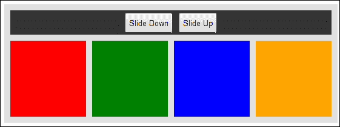
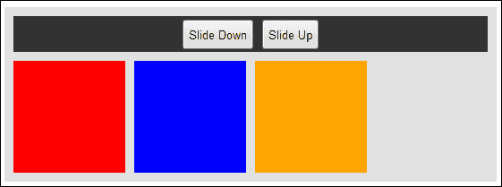
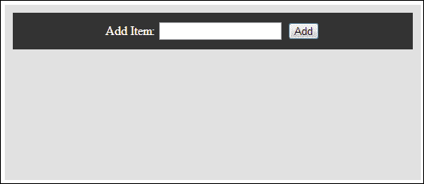
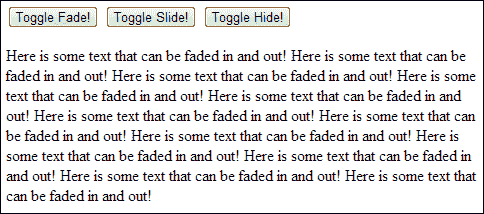
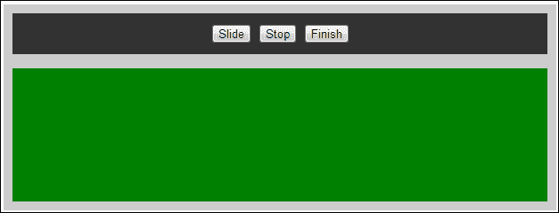
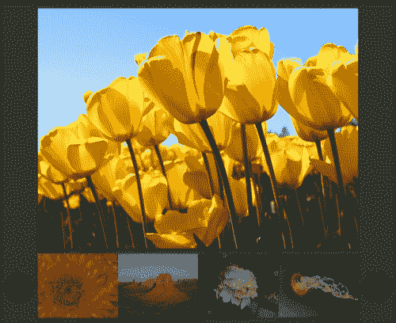

# 第四章：用 jQuery 效果添加引人入胜的视觉效果

在本章中，我们将涵盖：

+   滑动页面元素

+   隐藏和显示元素

+   淡入淡出元素

+   切换效果

+   停止效果

+   链接效果

+   创建一个基本的相册

+   创建一个闪烁的按钮

+   使用效果删除元素

# 介绍

本章将向您展示如何向您的界面添加简单的效果，以增强网站的整体美观度和用户体验。向元素添加基本效果可以对用户的印象产生巨大影响。jQuery 提供了让开发人员快速添加效果（如滑动、淡入淡出、隐藏等）的功能。

# 滑动页面元素

滑动页面元素的能力使开发人员能够创建一系列接口，如手风琴。这个食谱将向您展示如何将滑动效果应用于一系列元素。

## 准备工作

使用你喜欢的文本编辑器或 IDE，在一个易于访问的位置创建一个空白的 HTML 页面，并将此文件保存为`recipe-1.html`。确保你已经在与此 HTML 文件相同的位置下载了最新版本的 jQuery。

## 如何做…

通过执行以下步骤学习如何使用 jQuery 滑动页面元素：

1.  将以下 HTML 代码添加到`recipe-1.html`中。确保将 jQuery 库的源位置更改为下载并放置在您计算机上的最新版本 jQuery 的位置。

    ```js
    <!DOCTYPE html>
    <html>
    <head>
      <script src="img/jquery.min.js"></script>
      <script src="img/recipe-1.js"></script>
      <title>Chapter 4 :: JQuery Effects</title>
      <link type="text/css" media="screen" rel="stylesheet" href="recipe-1.css" />
    </head>
    <body>
      <div class="frame">
        <div class="actions">
          <button id="down">Slide Down</button>
          <button id="up">Slide Up</button>
        </div>
        <div class="box one"></div>
        <div class="box two"></div>
        <div class="box three"></div>
        <div class="box four"></div>
      </div>
    </body>
    </html>
    ```

1.  除了 jQuery 库文件之外，您可能还注意到我们还包含了一个名为`recipe-1.js`的第二个 JavaScript 文件。创建此 JavaScript 文件并将其保存在与 HTML 文件相同的目录中。将以下 JavaScript 代码添加到`recipe-1.js`文件中：

    ```js
    $(function(){
      $('#up').click(function(){
        $('.one').slideUp(4000);
        $('.two').slideUp(3000);
        $('.three').slideUp(2000);
        $('.four').slideUp(1000);
      });
      $('#down').click(function(){
        $('.one').slideDown(4000);
        $('.two').slideDown(3000);
        $('.three').slideDown(2000);
        $('.four').slideDown(1000);
      });
    });
    ```

1.  除了这两个 JavaScript 文件，我们还包含了一个 CSS 文件，为我们的 HTML 元素添加了一些样式。在同一目录中创建`recipe-1.css`文件，并添加以下代码：

    ```js
    .frame {
      width: 530px;
      height: 190px;
      margin: 50px auto auto auto;
      background-color: #E1E1E1;
      padding: 10px;
    }
    .frame .box {
      width: 125px;
      height: 125px;
      float: left;
      margin-right: 10px;
    }
    .frame .box:last-child {
      margin-right: 0;
    }
    .frame .actions {
      background-color: #333333;
      margin-bottom: 10px;
      text-align: center;
      padding: 10px;
    }
    .frame .actions button {
      height: 35px;
    }
    .one {
      background-color: red;
    }
    .two {
      background-color: green;
    }
    .three {
      background-color: blue;
    }
    .four {
      background-color: orange;
    }
    ```

1.  在网络浏览器中打开`recipe-1.html`，您应该看到一个类似以下截图的网页：

1.  单击**向上滑动**按钮，以看到应用于每个彩色框元素的向上滑动效果，速度各异；然后单击**向下滑动**以查看相反效果。

## 它是如何工作的…

现在，让我们详细了解以前执行的步骤。

### HTML

我们为此食谱创建的 HTML 文件简单地使用 div 元素创建了四个框，然后提供了两个按钮，可与 jQuery 结合使用来触发元素效果。

### jQuery

我们将所有 JavaScript 代码都包裹在`$(function(){});`中。这将确保我们的代码在页面加载时执行。在函数内部，我们按照以下代码片段所示，将点击事件附加到每个按钮：

```js
$('#up').click(function(){
  $('.one').slideUp(4000);
  $('.two').slideUp(3000);
  $('.three').slideUp(2000);
  $('.four').slideUp(1000);
});
$('#down').click(function(){
  $('.one').slideDown(4000);
  $('.two').slideDown(3000);
  $('.three').slideDown(2000);
  $('.four').slideDown(1000);
});
```

`.click()` 函数允许我们在用户点击相应按钮后执行一组代码。在每个 `.click()` 方法的回调函数中，我们选择每个框的 div 元素，并使用 jQuery 的 `.slideUp()` 和 `.slideDown()` 函数，具体取决于用户单击了哪个按钮。

jQuery 的幻灯片函数允许您指定一系列参数。在上面的例子中，我们已经指定了效果持续时间（以毫秒为单位）。这使我们能够控制每个框元素向上或向下滑动所花费的时间，从而提供瀑布效果。

### CSS

我们创建的 CSS 文件添加了样式并定位了每个 HTML 元素，使我们能够最好地展示 jQuery 的幻灯片功能。它允许我们更改每个框的背景颜色，并允许我们将界面居中对齐。

## 还有更多...

在前面的例子中，如果您多次单击 **向上滑动** 和 **向下滑动** 按钮，您可能会注意到不同框元素之间的一些闪烁。这种闪烁是因为当向上滑动效果完成时，框元素的 CSS `display` 属性被设置为 `none`。这意味着该元素不仅将不可见，而且还不会影响任何相邻元素的位置。

因此，将设置为左浮动的元素会有更多空间向左移动，因为完成其向上滑动效果的框元素不再妨碍。如下截图所示：



在这里，您可以看到第二个绿色框元素的显示值设置为 `none`，导致其他框元素进一步向左浮动。当幻灯片动画已经多次触发并且元素必须向左移动以使其他元素变得不可见时，显示可能会闪烁更多。可以通过不允许触发多次触发效果来防止此类问题。在本章后面的 *创建基本相册* 配方中已经解释了这个问题的一个简单解决方案。

## 另请参阅

+   *淡入淡出元素*

+   *隐藏和显示元素*

+   *创建基本的相册*

# 隐藏和显示元素

jQuery 包含一些函数，可以让您简单地隐藏和显示元素，尽管您可以将这些函数与其他效果结合使用。

## 准备就绪

创建一个名为 `recipe-2.html` 的新 HTML 文件，并将其保存到与您的 jQuery 库相同的文件夹中。

## 如何做…

通过执行以下步骤，了解如何使用 jQuery 轻松隐藏和显示 DOM 中的元素：

1.  在 `recipe-2.html` 中，添加以下 HTML 代码。确保对 jQuery 库的引用指向您下载版本的正确位置和文件名。

    ```js
    <!DOCTYPE html>
    <html>
    <head>
      <title>Chapter 4 :: JQuery Effects :: Recipe 2</title>
      <script src="img/jquery.min.js"></script>
      <script src="img/recipe-2.js"></script>
    </head>
    <body>
    <button class="show">Show</button>
    <button class="hide">Hide</button>
    <p class="text">Hiding and showing HTML elements with jQuery is so easy!</p>
    </body>
    </html>
    ```

1.  创建一个名为 `recipe-2.js` 的 JavaScript 文件，并将其保存在与您刚刚创建的 HTML 文件相同的目录中。将以下 JavaScript 代码添加到此文件中：

    ```js
    $(function(){
      $('#show').click(function(){
          $('.text').show();
      });
      $('#hide').click(function(){
          $('.text').hide();
      });
    });
    ```

1.  在网页浏览器中打开`recipe-2.html`将呈现出一个非常基本的网页，其中包含两个按钮和一些文本。单击**显示**和**隐藏**按钮将在文本上执行相关效果，演示如何使用 jQuery 显示和隐藏元素是多么简单。

## 工作原理…

现在，让我们详细了解之前执行的步骤。

### HTML

此配方中使用的 HTML 代码非常基础，需要很少的解释。HTML 代码创建了一个带有两个按钮的网页。每个按钮都有自己的 ID——`show`和`hide`。还有一个具有`text`类的单个段落元素。jQuery 将使用这些 ID 来监听点击事件并在段落元素上执行效果。

### jQuery

与前一篇配方类似，我们为每个按钮附加了一个点击事件处理程序。这使我们能够根据点击了哪个按钮来执行效果。为此，我们使用以下代码：

```js
$('#show').click(function(){
  $('.text').show();
});
$('#hide').click(function(){
  $('.text').hide();
});
```

要执行显示和隐藏效果，我们使用相应的 jQuery 函数`show()`和`hide()`。这些 jQuery 函数简单地切换所选元素的显示属性（在本例中，段落元素具有`text`类）。将`display`属性设置为`none`可隐藏元素；将其设置为`block`可显示元素。

## 还有更多…

使用 jQuery 的`show()`和`hide()`函数有额外的好处。使用 jQuery，您可以根据它们的内部 HTML 代码显示和隐藏元素。您还可以将`show()`和`hide()`函数与其他 jQuery 效果或动画一起使用。

## 参见

+   *淡入淡出元素*

+   *滑动页面元素*

# 淡入淡出元素

如果仅仅显示或隐藏元素还不够，jQuery 提供了淡入淡出 HTML 元素的功能。此配方利用了 jQuery 的淡入和淡出功能，在选择显示或隐藏元素时添加了更多效果。

## 准备工作

创建一个名为`recipe-3.html`的空白 HTML 文件，并将其保存在与最新版本的 jQuery 相同的目录中。

## 如何做…

使用 jQuery 执行以下步骤来淡入淡出 DOM 元素：

1.  将以下 HTML 代码添加到`recipe-3.html`，确保对 jQuery 库的引用正确：

    ```js
    <!DOCTYPE html>
    <html>
    <head>
      <title>Chapter 4 :: JQuery Effects :: Recipe 3</title>
      <script src="img/jquery.min.js"></script>
      <script src="img/recipe-3.js"></script>
      <link type="text/css" media="screen" rel="stylesheet" href="recipe-3.css" />
    </head>
    <body>
      <div class="frame">
        <div class="top">
          <label>Add Item:</label>
          <input type="text" id="new-item" />
          <button id="add-new-item">Add</button>
        </div>
        <ol class="list"></ol>
      </div>
    </body>
    </html>
    ```

1.  在相同目录中创建一个 CSS 文件。将其保存为`recipe-3.css`，并添加以下代码来为 HTML 页面设置样式：

    ```js
    .frame {
      width: 500px;
      min-height: 200px;
      margin: 50px auto auto auto;
      background-color: #E1E1E1;
      padding: 10px;
    }
    .top {
      background-color: #333333;
      padding: 10px;
      text-align: center;
      color: #FFF;
    }
    .list li {
      line-height: 30px;
    }
    ```

1.  创建一个名为`recipe-3.js`的 JavaScript 文件，并添加以下 jQuery 代码：

    ```js
    $(function(){
      $('#add-new-item').click(function(){
        var item = $('#new-item').val();
        if (item.length > 0) {
          var newItem = $("<li>" + item + "</li>").fadeIn();
          $('.list').append(newItem);
          $('#new-item').val("");
        }
      });
    });
    ```

1.  在网页浏览器中打开`recipe-3.html`，你将看到一个类似以下截图的网页:

1.  在**添加项目**文本框中输入一些文本，然后单击**添加**按钮将使用 jQuery 淡入效果将输入的文本追加到列表中。

## 工作原理…

现在，让我们详细了解之前执行的步骤。

### HTML

HTML 代码创建了一个包含文本输入和按钮以及一个空有序列表元素的简单界面，然后可以使用 jQuery 填充它。

### CSS

添加了一个 CSS 文件以定位和样式化简单的用户界面，这样我们就可以更好地用 jQuery 展示淡入效果。

### jQuery

首先，jQuery 代码使用以下代码将一个点击事件附加到**添加**按钮：

```js
$(function(){
  $('#add-new-item').click(function(){

  });
});
```

我们在此回调函数中添加了以下代码，以提供所需的效果，使用`fadeIn()`函数将输入文本添加到列表中：

```js
var item = $('#new-item').val();
if (item.length > 0) {
var newItem = $("<li>" + item + "</li>");
$('.list').append(newItem).fadeIn();
$('#new-item').val("");
}
```

此代码创建了`item`变量，并使用`$('#new-item').val()`将输入框的值赋给它。然后我们检查这个值的长度是否大于零，因为我们不想向列表中添加空白项。我们可以使用 JavaScript 简单地使用`variablename.length`（在本例中为`item.length`）来检查字符串的长度。

在这个`if`语句内部，我们创建另一个名为`newItem`的变量。我们将一个新创建的 HTML 列表项元素赋值给它，值是来自输入框的`item`变量。我们使用 jQuery 的选择器（`$()`）将列表项封装起来，这使我们能够对此 DOM 元素使用`fadeIn()`函数。

现在我们有了一个列表项，我们可以使用 jQuery 提供的`append()`函数将其追加到具有类名`list`的有序列表元素中。这将把新创建的 DOM 元素添加为有序列表的最后一个子元素。因为我们在这个 DOM 元素上使用了`fadeIn()`函数，它首先会隐藏，然后淡入，从而得到我们想要的效果。

## 还有更多...

在本文中，我们使用了`fadeIn()`函数，它允许我们使用淡入效果将一个不可见的元素变为可见。jQuery 还为我们提供了一个`fadeOut()`函数，它提供了相反的功能。这两个函数都接受一系列参数，允许开发人员调整行为。主要参数是持续时间，它允许我们以毫秒为单位指定元素淡入或淡出的时间。阅读有关这些函数的可用选项的更多信息，请访问[`api.jquery.com/fadeIn/`](http://api.jquery.com/fadeIn/)。

此外，jQuery 提供了一个`fadeTo()`函数，允许您在效果完成后不完全隐藏或显示元素，调整元素的不透明度。了解更多功能，请访问[`api.jquery.com/fadeTo/`](http://api.jquery.com/fadeTo/)。

## 另请参阅

+   *使用效果删除元素*

+   *创建一个基本的照片库*

+   *创建一个闪烁的按钮*

# 切换效果

许多 jQuery 效果都有相反的功能，例如`hide()`和`show()`以及`fadeIn()`和`fadeOut()`。到目前为止，本章中的代码示例已经分别处理了每一个函数；例如，一个按钮用于显示，另一个按钮用于隐藏。对于其中一些函数，jQuery 提供了能够切换这些相反效果的能力。这是有益的，因为我们不需要单独处理每种情况，或者决定我们需要使用其中的哪一个。本文将查看切换功能，并向您展示如何使用它们。

## 准备工作

在您喜欢的文本编辑器或 IDE 中，创建一个名为`recipe-4.html`的空白 HTML 文件，并将其保存在与您的 jQuery 库相同的目录中。

## 操作步骤…

1.  将以下 HTML 代码添加到`recipe-4.html`以创建一个基本的网页：

    ```js
    <!DOCTYPE html>
    <html>
    <head>
      <script src="img/jquery.min.js"></script>
      <script src="img/recipe-4.js"></script>
      <title>Chapter 4 :: JQuery Effects :: Recipe 4</title>
    </head>
    <body>
      <div>
        <button class="fadeToggle">Toggle Fade!</button>
        <button class="slideToggle">Toggle Slide!</button>
        <button class="hideToggle">Toggle Hide!</button>
      </div>
      <p class="text">Here is some text that can be faded in and out! Here is some text that can be faded in and out! Here is some text that can be faded in and out! Here is some text that can be faded in and out! Here is some text that can be faded in and out! Here is some text that can be faded in and out! Here is some text that can be faded in and out! Here is some text that can be faded in and out! Here is some text that can be faded in and out! Here is some text that can be faded in and out! Here is some text that can be faded in and out! Here is some text that can be faded in and out!</p>
    </body>
    </html>
    ```

1.  您可能已经注意到我们在此 HTML 页面中包含了一个 JavaScript 文件。在与`recipe-4.html`相同的目录中创建此 JavaScript 文件，并将其保存为`recipe-4.js`。将以下 jQuery 代码添加到此文件中，以将点击事件处理程序附加到 HTML 中的按钮元素：

    ```js
    $(function(){
      $('.fadeToggle').click(function(){
        $('.text').fadeToggle();
      });
      $('.slideToggle').click(function(){
        $('.text').slideToggle();
      });
      $('.hideToggle').click(function(){
        $('.text').toggle();
      });
    });
    ```

1.  在 web 浏览器中打开`recipe-4.html`，您应该看到一个类似于以下截图的网页：

1.  单击其中一个按钮将切换相关效果并将其应用于段落元素。

## 工作原理…

现在，让我们详细了解先前执行的步骤。

### HTML

本示例中的 HTML 代码创建了一个带有一些文本的段落元素。该元素具有`text`类名，允许我们选择此元素并执行一系列效果。除了这个段落元素之外，HTML 还提供了三个不同的按钮。每个按钮都有不同的类名，允许我们使用 jQuery 检测每个单独的点击并根据点击的按钮执行不同的效果。

### jQuery

本示例中的 jQuery 代码非常基础。在页面加载时，我们为每个按钮附加一个点击事件处理程序。每个点击事件处理程序在其回调函数内部有一个不同的切换功能。

jQuery 的切换函数确定了所选元素的状态，然后执行相反的效果。这意味着我们不需要将此逻辑编程到我们的应用程序中，而可以将其卸载到 jQuery。通过使用`toggleFade()`函数，我们可以使用一行代码来淡入或淡出段落元素，而无需针对每种情况编码，就像我们在先前的示例中所做的那样。对于执行滑动动画的`slideToggle()`方法也是如此。最后，我们可以使用`toggle`方法，它简单地隐藏或显示所选元素。

## 更多内容……

与其他 jQuery 效果函数一样，切换函数还可以接受一组可选参数。主要参数是效果持续时间。以下代码将强制幻灯片效果持续 1000 毫秒：

```js
$('.slideToggle').click(function(){
$('.text').slideToggle(1000);
});
```

您可以在 jQuery API 文档中阅读有关其他可用选项的信息，该文档位于[`api.jquery.com/slideToggle/`](http://api.jquery.com/slideToggle/)。

# 停止效果

随着您的应用程序的增长以及开始使用更复杂的效果，您可能希望能够停止这些效果和转换。这可能是由于用户动作导致不再需要当前效果或某种其他形式的事件。

## 准备工作

创建一个名为`recipe-5.html`的空白 HTML 文档，并将其保存到最新版本的 jQuery 库所在的相同目录中。

## 操作步骤…

学习通过执行以下步骤停止 jQuery 效果：

1.  将以下 HTML 代码添加到`recipe-5.html`中，以创建一个基本的网页，用于演示如何停止效果：

    ```js
    <!DOCTYPE html>
    <html>
    <head>
      <script src="img/jquery.min.js"></script>
      <script src="img/recipe-5.js"></script>
      <title>Chapter 4 :: JQuery Effects :: Recipe 5 </title>
      <link type="text/css" media="screen" rel="stylesheet" href="recipe-5.css" />
    </head>
    <body>
    <div class="frame">
      <div class="actions">
        <button id="slide">Slide</button>
        <button id="stop">Stop</button>
        <button id="Finish">Finish</button>
      </div>
      <ul class="output"></ul>
      <div class="slideMe"></div>
    </div>
    </body>
    </html>
    ```

1.  为了更好地演示 jQuery 效果，我们需要添加一些 CSS 代码来样式化和定位`recipe-5.html`中的 HTML 元素。在同一目录中创建一个名为`recipe-5.css`的 CSS 文件，并添加以下代码：

    ```js
    .frame {
      width: 600px;
      margin: auto;
      background-color: #CCC;
      padding: 10px;
    }
    .actions {
      padding: 10px;
      background-color: #333;
      text-align: center;
    }
    .slideMe {
      background-color: green;
      height: 150px;
      margin-top: 10px;
    }
    ```

1.  要启动和停止 jQuery 效果，请创建一个名为`recipe-5.js`的 JavaScript 文件，并将其保存在与 HTML 和 CSS 文件相同的目录中。添加以下 jQuery 代码：

    ```js
    $(function(){
      $('#slide').click(function(){
        $('.slideMe').slideToggle(1000, function(){
          $('.output').append("<li>Slide effect completed.</li>");
        });
      });
      $('#stop').click(function(){
        $('.slideMe').stop();
      });
      $('#finish').click(function(){
        $('.slideMe').finish();
      });
    });
    ```

1.  在 Web 浏览器中打开`recipe-5.html`，您将看到一个类似以下屏幕截图的网页：

1.  单击**Slide**按钮将开始该效果，绿色框 division 元素将开始向上滑动 1000 毫秒。单击**Stop**按钮将在您单击它的点停止效果，**Finish**按钮将立即完成效果。

## 工作原理…

现在，让我们详细了解之前执行的步骤。

### HTML

我们这个教程的简单 HTML 为我们提供了一个可以应用效果的 division 元素，一些可以用于触发 jQuery 代码的按钮，以及我们可以用来输出有关执行的 jQuery 代码的一些信息的列表。

### CSS

包含在 HTML 页面中的 CSS 代码使我们能够以一种能够轻松演示本教程中效果的方式定位每个 HTML 元素。

### jQuery

我们在 HTML 页面中为三个按钮附加了三个不同的点击事件处理程序，通过使用它们的 ID 进行选择：`slide`、`stop`和`finish`。在这些事件处理程序的回调函数中，我们使用以下代码启动幻灯片效果：

```js
$('#slide').click(function(){
$('.slideMe').slideToggle(1000, function(){
  $('.output').append("<li>Slide effect completed.</li>");
});
});
```

我们使用`slideToggle()`函数来启动滑下或滑上效果，这取决于`slideMe`division 元素当前是否可见。我们向`slideToggle()`函数提供了两个参数。第一个参数是我们希望滑动效果生效的持续时间。第二个参数是一个回调函数，一旦动画完成，将执行该函数。

在这个回调函数中，我们向具有类名`output`的无序列表元素追加了一个列表项。这意味着当幻灯片效果完全完成时，将在`output`列表中可见一个新的列表项。我们这样做是为了演示停止效果和完成效果之间的区别，后面的部分将对此进行描述。

另外两个事件处理程序，如下面的代码片段所述，以与先前提到的事件处理程序相同的方式选择`slideMe`division 元素，除了这些不会启动一个效果，而是停止当前的效果：

```js
$('#stop').click(function(){
  $('.slideMe').stop();
});
$('#finish').click(function(){
  $('.slideMe').finish();
});
```

`stop()`函数将停止在所选元素上当前正在运行的任何效果。如果滑动向上效果已经完成一半，您单击了**Stop**，您将看到一半绿色的`slideMe`分区元素。`stop()`函数不会完成滑动效果，因此`slideToggle()`回调函数不会被执行，并且不会向输出列表添加列表项。相反，`finish()`函数会立即完成在所选元素上正在执行的任何效果。这意味着如果滑动向上效果已经完成一半，您单击了**Finish**，`slideMe`分区元素将立即变为不可见，然后向输出列表添加一个新项，上面写着**滑动效果已完成**。如果在效果回调函数中存在对您的应用程序至关重要的代码，您可以使用`finish()`来确保它被执行。或者，您可能不想执行此代码和/或想要明显地停止效果；在这种情况下，您将使用`stop()`。

# 串联效果

jQuery 允许我们将不同的效果函数链到单个选定元素上。这使我们能够轻松地按顺序执行多个效果。

## 如何操作…

通过执行以下步骤，学习使用 jQuery 的强大功能来编写更好的代码：

1.  创建一个名为`recipe-6.html`的空白 HTML 文件，并将其保存在计算机上易于访问的位置。将以下 HTML 代码添加到此文件中，并确保更新对 jQuery 库的引用：

    ```js
    <!DOCTYPE html>
    <html>
    <head>
      <title>Chapter 4 :: JQuery Effects :: Recipe 6</title>
      <script src="img/jquery.min.js"></script>
      <script src="img/recipe-6.js"></script>
      <link type="text/css" media="screen" rel="stylesheet" href="recipe-6.css" />
    </head>
    <body>
      <button id="start">Start</button>
      <div class="box"></div>
    </body>
    </html>
    ```

1.  创建一个名为`recipe-6.css`的 CSS 文件，并添加以下代码：

    ```js
    .box {
      width: 200px;
      height: 200px;
      background-color: red;
    }
    Create a JavaScript file and save it as recipe-6.js. Add the following JavaScript code.
    $(function(){
      $('#start').click(function(){                                              $('.box').fadeOut().fadeIn().slideUp().slideDown().fadeTo(1000, 0.1).fadeTo(1000, 1);
      });
    });
    ```

1.  在网页中打开`recipe-6.html`文件，然后单击**Start**按钮。红色框将执行一系列效果。

## 工作原理…

本示例提供了一个非常简单的例子，说明了如何串联 jQuery 提供的不同效果函数。在此示例中，我们对盒子 div 元素执行`fadeOut()`、`fadeIn`、`slideUp()`、`slideDown()`和两个`fadeTo()`效果。由于以下代码位于`start`按钮的单击事件处理程序回调函数中，因此这些效果将依次执行：

```js
$('.box').fadeOut().fadeIn().slideUp().slideDown().fadeTo(1000, 0.1).fadeTo(1000, 1);
```

`fadeTo()`函数会为选定的元素动画并改变其不透明度，它们都被提供了两个参数。第一个参数是效果持续的毫秒数，第二个是效果应该完成的不透明度。

## 参见

+   *创建基本的图库*

# 创建基本的图库

大多数人都知道网络上有许多 jQuery 图库实现可供使用；其中许多是 jQuery 插件，可以快速实现。学习如何创建自己的图库也有好处。您将深入了解其中一些插件的工作原理，从而更轻松地定制它们以更好地满足您的需求。您还将了解更多关于 jQuery 的强大功能以及如何在本书中前面学到的技能。

## 准备工作

我们首先需要一个名为`recipe-7.html`的空白 HTML 文件，保存在与最新版本的 jQuery 相同的目录中。要创建一个图像画廊，我们还需要一些图像。在与`recipe-7.html`文件相同的目录中创建一个名为`images`的文件夹，并保存至少八张在 Internet 上免费可用的图像。

## 如何做…

通过执行以下步骤学习如何从头开始使用 jQuery 创建一个吸引人的相册：

1.  将以下 HTML 代码添加到`recipe-7.html`以创建我们的网页和图像画廊 HTML 模板：

    ```js
    <!DOCTYPE html>
    <html>
    <head>
      <script src="img/jquery.min.js"></script>
      <script src="img/recipe-7.js"></script>
      <link rel="stylesheet" type="text/css" href="recipe-7.css" media="screen" />
      <title>Chapter 4 :: JQuery Events :: Recipe 7 - jQuery image gallery</title>
    </head>
    <body>
      <div class="gallery" data-thumb-width="150">
        <div class="frame">
          
          
          
          
          
          
          
          
        </div>
        <div class="bottom">
          <a href="#" class="arrow left-arrow" data-direction="left"><i class="arrow-left"></i></a>
          <a href="#" class="arrow right-arrow" data-direction="right"><i class="arrow-right"></i></a>
          <div class="thumbs"></div>
        </div>
      </div>
    </body>
    </html>
    ```

1.  更新 frame division 元素内每个图像的源（`src="img/code>`），使其指向您刚刚添加的图像。

1.  在与`recipe-7.html`相同的目录中创建一个名为`recipe-7.css`的 CSS 文件，并添加以下 CSS 代码来样式化我们的画廊：

    ```js
    body {
      margin: 0;
      padding: 0;
      background-color: #333;
    }
    .gallery {
      width: 600px;
      margin: 50px auto auto auto;
      position: relative;
    }
    .gallery .frame {
      height: 450px;
      margin-bottom: 10px;
      position: relative;
    }
    .gallery .frame img {
      display: block;
      width: 100%;
      position: absolute;
      left: 0;
      top: 0;
    }
    .gallery .bottom {
      overflow: hidden;
    }
    .gallery .thumbs {
      height: 120px;
      white-space: nowrap;
      text-align: center;
    }
    .gallery .thumbs a {
      display: inline-block;
      opacity: 0.5;
      -webkit-transition: opacity 0.5s ease-in-out;
      -moz-transition: opacity 0.5s ease-in-out;
      -ms-transition: opacity 0.5s ease-in-out;
      -o-transition: opacity 0.5s ease-in-out;
      transition: opacity 0.5s ease-in-out;
    }
    .gallery .thumbs a:hover {
      opacity: 1.0;
    }
    .gallery .arrow {
      width: 50px;
      height: 50px;
      background-color: #000;
      position: absolute;
      -webkit-border-radius: 50px;
      -moz-border-radius: 50px;
      border-radius: 50px;
      bottom: 35px;
    }
    .gallery .arrow.disabled {
      background-color: #252525;
    }
    .gallery .left-arrow {
      left: -60px;
    }
    .gallery .right-arrow {
      right: -60px;
    }
    .gallery .arrow-right {
      width: 0;
      height: 0;
      border-top: 12px solid transparent;
      border-bottom: 12px solid transparent;
      border-left: 12px solid #1a1a1a;
      position: absolute;
      right: 16px;
      top: 13px;
    }
    .gallery .arrow-left {
      width: 0;
      height: 0;
      border-top: 12px solid transparent;
      border-bottom: 12px solid transparent;
      border-right:12px solid #1a1a1a;
      position: absolute;
      right: 21px;
      top: 13px;
    }
    ```

1.  创建一个名为`recipe-7.js`的 JavaScript 文件，并添加以下 JavaScript 代码来启动我们的画廊：

    ```js
    /** DECLARE SOME DEFAULT VARIABLES WHICH WILL BE USED THROUGHOUT **/
    var images;
    var imageWidth;
    $(function(){
      imageWidth = $('.gallery').data("thumb-width");
      /** COLLECT ALL THE IMAGES FROM WITHIN THE .gallery DIV **/
      images = $('.gallery').find('img');
      /** FOR EACH OF THESE IMAGES, CREATE A THUMBNAIL AND ADD A CLASS TO IDENTIFY THE IMAGE AND THUMBNAIL RELATIONSHIP **/
      $.each(images, function(index, value){
        $(value).addClass("img" + index);
        $('.gallery .thumbs').append("<a href='#' data-index='" + index + "' class='thumb'></a>");
      });
      /** UPDATE THE SCROLL BUTTONS **/
      updateScrollButtons();
      /** EVENT HANDLERS FOR SCROLL BUTTONS **/
      $('.arrow').click(function(){
        var element = $(this);
        if (!element.hasClass('disabled')) {
          element.addClass('disabled');
          var scrollString = "-=";
          if ($(this).data("direction") == "left") {
            scrollString = "+=";
          }
          $('.thumbs').animate({
            marginLeft: scrollString + imageWidth + "px"
          }, "fast", function(){
            element.removeClass('disabled');
            updateScrollButtons();
          });
        }
      });
      /** EVENT HANDLERS FOR IMAGES **/
      $('.gallery').on("click", ".thumb", function(){
        var thumb = $(this);
        var image = $('.img' + thumb.data('index'));
        $.each(images, function(index, value){
          if (!$(value).hasClass('img' + thumb.data('index'))) {
            $(value).hide();
          }
        });
        if (image.css("display") != "block") {
          image.fadeIn();
        }
      });
    });
    function updateScrollButtons() {
      var thumbs = $('.thumbs');
      var thumbsMarginLeft = parseInt(thumbs.css("margin-left"));
      var thumbsMaxWidth = (images.length * imageWidth);
      if (thumbsMarginLeft >= 0) {
        $('.left-arrow').addClass('disabled');
      } else {
        $('.left-arrow').removeClass('disabled');
      }
      if ((thumbsMarginLeft * -1) >= (thumbsMaxWidth - thumbs.width() / 2)) {
        $('.right-arrow').addClass('disabled');
      } else {
        $('.right-arrow').removeClass('disabled');
      }
    }
    ```

1.  在 Web 浏览器中打开`recipe-7.html`，您将看到一个类似以下截图的 jQuery 图像画廊：`

1.  选择左右箭头将允许您滚动照片，单击照片将在主框架中显示较大版本。

## 工作原理…

现在，让我们详细了解之前执行的步骤。

### HTML

由于 jQuery 的帮助，我们能够用极少的 HTML 代码创建一个吸引人且功能齐全的画廊。除了基本的 HTML 文档结构之外，我们还定义了一个类为`gallery`的 division 元素。以下是 jQuery 将用来基于大多数 DOM 交互的 division 元素代码：

```js
<div class="gallery" data-thumb-width="150"></div>
```

另外，我们还使用 HTML5 数据属性来定义缩略图的宽度。我们的 jQuery 代码将使用此值来调整缩略图的大小。

使用以下 HTML 代码，我们还创建了一个类名为`frame`的 division 元素，其兄弟元素是我们想要在画廊中显示的图像：

```js
<div class="frame">


</div>
```

最后，在我们的 HTML 中，我们创建一个左右箭头，它将与 jQuery 一起使用来滚动图像缩略图。我们还创建了一个类为`thumbs`的 div 元素，将使用以下 jQuery 代码填充缩略图图像：

```js
<div class="bottom">
<a href="#" class="arrow left-arrow" data-direction="left"><i class="arrow-left"></i></a>
<a href="#" class="arrow right-arrow" data-direction="right"><i class="arrow-right"></i></a>
<div class="thumbs"></div>
</div>
```

### CSS

此配方中使用的大部分 CSS 代码都非常基础，只是将元素放置在页面的适当位置。主画廊 division 元素设置为 600 像素宽，并居中显示在屏幕上。为了使我们能够将左右箭头放在画廊框架外部，我们将它们的位置设置为绝对，并使用负边距将它们推到更左和更右。

主缩略图滚动部分的 `overflow` 值设置为 `hidden`，防止大部分缩略图被显示。 这使我们可以使用 jQuery 将这些元素滚动到视图中。 缩略图本身的 `display` 值设置为 `inline-block`，允许它们在单行中左到右堆叠在一起。

为了产生附加效果，我们还使用了一些基本的 CSS 动画。 缩略图的不透明度设置为 `0.5`，以便它们不会成为应用程序的主要焦点。 当用户悬停在缩略图上时，使用 CSS 过渡创建淡入效果，如下所示：

```js
.gallery .thumbs a {
  display: inline-block;
  opacity: 0.5;
  -webkit-transition: opacity 0.5s ease-in-out;
  -moz-transition: opacity 0.5s ease-in-out;
  -ms-transition: opacity 0.5s ease-in-out;
  -o-transition: opacity 0.5s ease-in-out;
  transition: opacity 0.5s ease-in-out;
}
.gallery .thumbs a:hover {
  opacity: 1.0;
}
```

除了官方的 CSS3 `transition` 属性之外，我们还使用了浏览器特定的替代方案，以确保 CSS 动画在所有最流行的浏览器中都能正常工作。

```js
-webkit-transition: opacity 0.5s ease-in-out;
-moz-transition: opacity 0.5s ease-in-out;
-ms-transition: opacity 0.5s ease-in-out;
-o-transition: opacity 0.5s ease-in-out;
```

### jQuery

`JavaScript` 文件开头声明了两个变量，以便它们的值可以在整个应用程序中使用；这些变量称为全局变量。 应用程序代码的大部分被放置在 jQuery 的加载函数中，这样一旦页面加载完成，代码就会执行，如下所示：

```js
var images;
var imageWidth;
$(function(){
  imageWidth = $('.gallery').data("thumb-width");
  /** COLLECT ALL THE IMAGES FROM WITHIN THE .gallery DIV **/
  images = $('.gallery').find('img');
  /** FOR EACH OF THESE IMAGES, CREATE A THUMBNAIL AND ADD A CLASS TO IDENTIFY THE IMAGE AND THUMBNAIL RELATIONSHIP **/
  $.each(images, function(index, value){
    $(value).addClass("img" + index);
    $('.gallery .thumbs').append("<a href='#' data-index='" + index + "' class='thumb'></a>");
  });
});
```

使用 jQuery 的 `data()` 函数从我们之前创建的 HTML 代码中提取缩略图宽度。 然后将该值存储在 `imageWidth` 变量中，供以后在应用程序中使用。 使用 `$('.gallery').find('img')` 函数搜索 `gallery` div 元素中的所有 `img` 元素并将它们存储为 `images` 变量中的数组。 使用 jQuery `$.each()` 函数来迭代 images 数组中的每个 `img` 元素。 在 `$.each()` 的回调函数中，我们首先使用 `addClass()` 函数基于数组索引为主图像元素添加一个类（即 `img0`、`img1` 等等）。 然后，创建一个带有图像的锚元素，并使用先前声明的 `imageWidth` 变量来设置宽度。 使用 `append()` 函数，然后将锚元素插入到 DOM 中 `thumbs` div 元素中。 此外，该锚元素的 `data-index` 属性值设置为与较大图像的类名相匹配。

在 `$.each()` 函数中，我们调用一个名为 `updateScrollButtons` 的自定义函数，该函数在 JavaScript 文件的末尾声明。 该函数用于根据当前缩略图的位置确定是否应该启用箭头按钮。 这可以防止用户将缩略图滚动到图像库的底部部分。 一旦用户向右滚动到最后的缩略图，右箭头按钮就会被禁用。 一旦用户向左滚动到第一个缩略图，左箭头按钮就会被禁用。

接下来，使用以下代码为每个箭头按钮附加了一个点击事件处理程序，以便我们可以检测用户何时想要浏览缩略图图像。

```js
$('.arrow').click(function(){
var element = $(this);
if (!element.hasClass('disabled')) {
  element.addClass('disabled');
  var scrollString = "-=";
  if ($(this).data("direction") == "left") {
    scrollString = "+=";
  }
  $('.thumbs').animate({
    marginLeft: scrollString + imageWidth + "px"
  }, "fast", function(){
    element.removeClass('disabled');
    updateScrollButtons();
  });
}
});
```

在点击事件处理程序的回调函数中，我们首先声明一个变量，并将点击的元素存储在其中，引用为 `$(this)`，意思是点击的元素。使用此变量，我们可以使用 jQuery 函数 `hasClass` 来确定点击的元素是否具有类 `disabled`。我们将此函数中的所有代码包装在 `if` 语句中，以便如果点击的元素具有 `disabled` 类，则不执行此代码。在 `if` 语句中，我们使用 `addClass` 将 `disabled` 类添加到点击的元素中。这是为了防止用户能够频繁点击滚动箭头并导致不希望的动画效果。

我们还声明了一个名为 `scrollString` 的变量，其默认值为 `-=`。该值将在 jQuery 的 `animate()` 函数中使用，该函数将为我们的缩略图提供滚动动画。根据所点击的箭头的 `data-direction` 属性值，此值将保持为 `-=`，这意味着 `thumbs` div 的左边距将被减去（即向右滚动），或者该值将更改为 `+=`，这意味着左边距将被添加（即向左滚动）。

最后，在此事件处理程序回调函数中，使用 jQuery 的 `animate()` 函数修改 `thumbs` div 元素的左边距，从而提供滚动效果。再次使用 `imageWidth` 变量来设置滚动位置以匹配缩略图的宽度，如下所示：

```js
$('.gallery').on("click", ".thumb", function(){
var thumb = $(this);
var image = $('.' + thumb.attr('rel'));
$.each(images, function(index, value){
    if (!$(value).hasClass(thumb.attr('rel'))) {
        $(value).hide();
    }
});
if (image.css("display") != "block") {
    image.fadeIn();
}
});
```

下一段代码的下一步是将点击事件处理程序附加到 `gallery` div 元素上。点击事件处理程序监听任何具有 `thumb` 类的元素上的点击。这使我们能够指定在单击缩略图后要执行的代码。在回调函数中，我们选择被点击的缩略图并将元素引用存储在 `thumb` 变量中。我们还使用点击的元素的 `data-index` 属性值来选择较大的图像，并将其引用存储在 `image` 中。

再次使用 `$.each()` 函数来迭代所有图像。我们隐藏与点击的缩略图中的图像不匹配的每个图像。这样只有所选图像才会出现在主查看面板中。我们还使用 `css()` 函数来检查较大图像的 `display` 属性，以确定图像当前是否可见。如果不可见，我们使用 jQuery 的淡入效果来显示它，完成图像库功能。

# 创建一个闪烁的按钮

使用 jQuery 的效果函数，我们可以创建一个闪烁的按钮，可以在 Web 应用程序或网站中使用，以吸引用户的注意力。

## 准备工作

创建一个名为 `recipe-8.html` 的空白 HTML 文档，并确保您已下载并准备好将其包含在此 HTML 文件中的最新版本的 jQuery。

## 如何做...

通过执行以下步骤了解如何使用 jQuery 创建一个简单的闪烁按钮效果：

1.  将以下代码添加到刚刚创建的`recipe-8.html`中，记得更新对 jQuery 库的引用。

    ```js
    <!DOCTYPE html>
    <html>
    <head>
      <script src="img/jquery.min.js"></script>
      <script src="img/recipe-8.js"></script>
      <title>Chapter 4 :: JQuery Effects :: Recipe 8 </title>
      <link type="text/css" media="screen" rel="stylesheet" href="recipe-8.css" />
    </head>
    <body>
    <div class="frame">
      <h1>Newsletter!</h1>
      <p>Enter your email address below to sign-up for our monthly newsletter.</p>
      <form>
        <input type="text" class="email-input" name="email" placeholder="Your Email" />
         <button class="blinker">Sign-up Now!</button>
      </form>
    </div>
    </body>
    </html>
    ```

1.  创建一个名为`recipe-8.css`的 CSS 文件，并添加以下 CSS 代码以为 HTML 中创建的通讯表单添加样式：

    ```js
    @import url(http://fonts.googleapis.com/css?family=Leckerli+One);
    @import url(http://fonts.googleapis.com/css?family=Happy+Monkey);
    body {
      background-color: #333333;
      font-family: 'Happy Monkey', cursive;
    }
    h1 {
      font-family: 'Leckerli One', cursive;
      font-size: 60px;
      line-height: 80px;
      padding: 0;
      margin: 0;
      text-align: center;
      color: #333;
    }
    .frame {
      width: 500px;
      margin: 50px auto auto auto;
      height: 300px;
      background-color: #FFF;
      box-shadow: #000 3px 3px 2px;
      border-radius: 10px;
      padding: 20px;
      text-align: center;
    }
    .frame p {
      font-size: 18px;
      line-height: 25px;
    }
    .frame form .email-input {
      height: 40px;
      font-size: 30px;
      width: 400px;
      font-family: 'Happy Monkey', cursive;
    }
    .frame form .blinker {
      height: 40px;
      width: 150px;
      font-size: 20px;
      margin-top: 20px;
      font-family: 'Happy Monkey', cursive;
    }
    ```

1.  在与 CSS 和 HTML 文件相同的目录中创建一个 JavaScript 文件。将此文件保存为`recipe-8.js`并添加以下 jQuery 代码：

    ```js
    $(function(){
      $('.email-input').on('focus', function(){
        $('.blinker').fadeTo(300, 0.1).fadeTo(300, 1);
      })
    });
    ```

1.  在 Web 浏览器中打开`recipe-8.html`，你会看到一个类似下面截图的网页：

1.  单击文本框内部将使“**立即注册！**”按钮闪烁以吸引用户的注意。

## 工作原理是…

在此配方中使用的 HTML 和 CSS 代码创建了一个页面，允许用户订阅通讯。HTML 或 CSS 代码中没有复杂的元素，因此不需要进一步解释。

这个配方提供了一个简单的示例，演示了我们如何使用 jQuery 来实现按钮闪烁的外观。其思想是，当用户点击文本框输入电子邮件地址时，“**立即注册！**”按钮会闪烁以吸引他们的注意。

在我们的 jQuery 代码中，我们首先将事件处理程序附加到文本输入以获得焦点。当页面上的元素受到用户的关注时，即通过点击它或通过标签切换到表单元素时，将触发“焦点”事件。在此事件处理程序的回调函数中，我们使用`fadeTo()`jQuery 效果函数来顺序淡出并淡入按钮，创建闪烁效果。在本示例中，`fadeTo()`函数接受两个参数，效果持续时间和元素不透明度。我们在第一个`fadeTo()`函数中指定元素的不透明度为`0.1`，以淡出按钮。然后我们指定`1.0`以淡入按钮。我们可以通过改变指定的持续时间来控制效果的速度，该持续时间设置为`300`毫秒。

## 还有更多……

有许多方法可以使用 jQuery 创建闪烁效果。在 第六章 *用户界面* 中，您将学习如何更改元素的 CSS 属性，从而可以添加阴影和彩色边框，以大大增强闪烁效果。`fadeTo()`函数提供了创建此效果的最简单方法，但请注意，有一些替代方法可以提供更大的影响，可能更适合您的需求。

当强制元素闪烁、移动或闪烁以吸引用户的注意时，必须非常小心，以免引起烦恼，因为这可能会产生相反的效果，使他们远离。这些效果只应用作微妙的提示，以促使用户与您的用户界面进行交互。

## 另请参见

+   *淡出元素*

+   *创建一个基本的照片库*

# 带有效果的删除元素

通常，您会创建诸如列表或表格之类的界面，用于表示来自数据库的数据。如果界面是用于管理目的，通常可以添加、编辑和删除这些项目。当添加这些项目时，我们可以使用 jQuery 效果来增强用户体验，如*淡出元素*示例中所述。当从 DOM 中删除项目时，我们也可以提供效果。由于 jQuery，这非常容易做到。

## 准备就绪

与本章中的其他示例一样，您需要一个空白的 HTML 文档。将此文档保存为`recipe-9.html`，并确保它与最新版本的 jQuery 在同一个目录中。

## 如何做...

了解如何通过执行以下步骤以带有效果的方式移除 DOM 元素：

1.  将以下 HTML 代码添加到您刚刚创建的 HTML 文档中：

    ```js
    <!DOCTYPE html>
    <html>
    <head>
      <script src="img/jquery.min.js"></script>
      <script src="img/recipe-9.js"></script>
       <title>Chapter 4 :: JQuery Effects :: Recipe 9 </title>
      <link type="text/css" media="screen" rel="stylesheet" href="recipe-9.css" />
    </head>
    <body>
    <div class="frame">
      <h1>User Management</h1>
      <table width="100%" id="user-table">
        <thead>
        <tr>
          <th>Username</th>
          <th>Email</th>
          <th>Full Name</th>
          <th>Date of Birth</th>
          <th></th>
        </tr>
        </thead>
        <tbody>
        <tr>
          <td>jd101</td>
          <td>j.doe@somewhere.com</td>
          <td>John Doe</td>
          <td>16-05-1987</td>
          <td><button class="delete">Delete</button></td>
        </tr>
        <tr>
          <td>msmith17</td>
          <td>smithy@nowhere.com</td>
          <td>Jane Smith</td>
          <td>18-08-1988</td>
          <td><button class="delete">Delete</button></td>
        </tr>
        <tr>
          <td>tommy22</td>
          <td>tom@idontknow.com</td>
          <td>Thomas Knowhow</td>
          <td>10-08-1980</td>
          <td><button class="delete">Delete</button></td>
        </tr>
        </tbody>
      </table>
    </div>
    </body>
    </html>
    ```

1.  您可能已经注意到了前一个 HTML 代码的标题中包含的 CSS 文件。创建`recipe-9.css`并添加以下 CSS 代码：

    ```js
    @import url(http://fonts.googleapis.com/css?family=Lato:300,400);
    body {
      background-color: #333333;
      font-family: 'Lato', sans-serif;
    }
    h1 {
      line-height: 60px;
      padding: 0;
      margin: 0 0 15px 0;
      text-align: center;
      color: #333;
      font-weight: 300;
    }
    .frame {
      width: 700px;
      margin: 50px auto auto auto;
      background-color: #FFF;
      box-shadow: #000 3px 3px 2px;
      border-radius: 10px;
      padding: 20px;
      text-align: center;
    }
    ```

1.  除了 CSS 文件外，HTML 页面还包含了一个 JavaScript 文件。创建一个名为`recipe-9.js`的 JavaScript 文件，并将其保存在与 HTML 和 CSS 文件相同的目录中。将以下 jQuery 代码添加到此文件中：

    ```js
    $(function(){
      $('#user-table').on("click", ".delete", function(){
        var response = confirm("Are you sure you want to delete this user?");
        if (response) {
          $(this).parent().parent().fadeOut().remove();
        }
      });
    });
    ```

1.  在网页浏览器中打开`recipe-9.html`，你将看到一个简单的用户管理界面。点击任何条目旁边的**删除**按钮将提示你确认是否要删除。当用户点击**确定**时，该特定用户的条目将淡出并从 DOM 中移除。

## 工作原理...

这个示例也有一些基本的 HTML 和 CSS 代码，不需要解释。相反，让我们专注于 jQuery 代码。

我们所有的 jQuery 代码都包装在`$(function(){});`中，这是 jQuery 的加载函数，允许我们在页面加载时执行。我们将点击事件处理程序附加到用户表，并监听任何具有`delete`类的元素的点击，如下所示。从 HTML 代码中，您将知道这些元素是`delete`按钮。

```js
$('#user-table').on("click", ".delete", function(){

});
```

在此事件处理程序的回调函数内部，我们使用原生 JavaScript 函数`confirm()`并将其输出分配给`response`变量。这将向用户显示一个弹出窗口，其中包含消息**确定要删除此用户吗？**。如果用户点击**确定**，则`response`变量将等于`true`。如果他们点击**取消**，它将是`false`。通过使用这个`response`变量，我们可以确定他们是否想要继续删除用户。如果是，我们可以从 DOM 中移除表格行。

要删除表格行，我们首先需要选择它。我们可以引用`$(this)`，它是被点击的项目（在本例中是按钮），然后选择其父级的父级，即`tr`表。这是使用以下代码完成的：

```js
$(this).parent().parent().fadeOut().remove();
```

然后我们使用`fadeOut()`函数应用效果，并使用`remove()`函数从 DOM 中删除元素。

## 还有更多...

这种简单的用户界面通常会与服务器端调用结合使用，这些调用还会从数据库中删除用户输入。回顾一下第三章，*使用 jQuery 和 AJAX 加载和操作动态内容*，看看如何使用 jQuery 和 AJAX 完成这项任务。

## 另请参阅

+   *淡入淡出元素*
