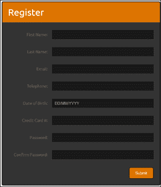
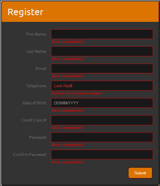
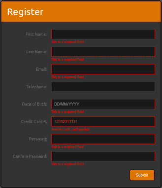
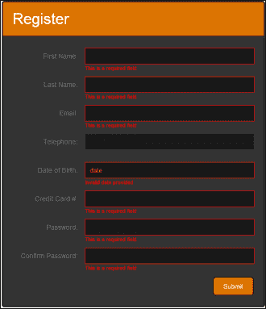

# 第五章：表单处理

在本章中，我们将探讨如何创建具有动画、验证和用户反馈的健壮而引人入胜的网络表单。我们将涵盖：

+   实施基本表单验证

+   添加数字验证

+   添加信用卡号验证

+   添加日期验证

+   添加电子邮件地址验证

+   实施实时表单验证

+   添加密码强度指示器

+   添加反垃圾邮件措施

+   实施输入字符限制

# 介绍

收集用户数据是许多网站和网络应用程序的基本功能，从简单的数据收集技术，如注册或登录信息，到更复杂的情景，如付款或账单信息。重要的是只收集来自用户的相关和完整信息。为了确保这一点，Web 开发人员必须对所有数据输入进行验证。在执行数据完整性的同时提供良好的用户体验也很重要。这可以通过向用户提供有关其数据可能引起的任何验证错误的有用反馈来实现。本章将向您展示如何创建一个引人入胜的网络表单，同时保持高质量的用户体验。

非常重要的一点是，任何 JavaScript 或 jQuery 验证都容易被用户操纵。JavaScript 和 jQuery 位于 Web 浏览器中，所以用户可以轻松修改代码以绕过任何客户端验证技术。这意味着不能完全依赖客户端验证来防止用户提交无效数据。在客户端进行的任何验证都必须在服务器上进行复制，服务器不容易被用户操纵。

我们使用客户端验证来提高用户体验。因此，用户不需要等待服务器响应。

# 实施基本表单验证

在最基本的表单验证级别上，您需要能够阻止用户提交空值。本教程将为本章的第 1 至 8 个配方提供用于网络表单的 HTML 和 CSS 代码。

## 准备工作

使用您喜欢的文本编辑器或 IDE，在易于访问的位置创建一个空白的 HTML 页面，并将此文件保存为`recipe-1.html`。确保您已将最新版本的 jQuery 下载到与此 HTML 文件相同的位置。

这个 HTML 页面将成为本章大部分内容的基础，请在完成本教程后记得保存它。

## 如何做...

通过执行以下步骤学习如何使用 jQuery 实现基本表单验证：

1.  将以下 HTML 代码添加到`index.html`中。确保更改包含 jQuery 库的 JavaScript 的源位置，指向您计算机上下载的 jQuery 的最新版本所在位置。

    ```js
    <!DOCTYPE html>
    <html >
    <head>
       <title>Chapter 5 :: Recipe 1</title>
       <link type="text/css" media="screen" rel="stylesheet" href="styles.css" />
       <script src="img/jquery.min.js"></script>
       <script src="img/validation.js"></script>
    </head>
    <body>
       <form id="webForm" method="POST">
          <div class="header">
             <h1>Register</h1>
          </div>
          <div class="input-frame">
             <label for="firstName">First Name:</label>
             <input name="firstName" id="firstName" type="text" class="required" />
          </div>
          <div class="input-frame">
             <label for="lastName">Last Name:</label>
             <input name="lastName" id="lastName" type="text" class="required" />
          </div>
          <div class="input-frame">
             <label for="email">Email:</label>
             <input name="email" id="email" type="text" class="required email" />
          </div>
          <div class="input-frame">
             <label for="number">Telephone:</label>
             <input name="number" id="number" type="text" class="number" />
          </div>
          <div class="input-frame">
             <label for="dob">Date of Birth:</label>
             <input name="dob" id="dob" type="text" class="required date" placeholder="DD/MM/YYYY"/>
          </div>
          <div class="input-frame">
             <label for="creditCard">Credit Card #:</label>
             <input name="creditCard" id="creditCard" type="text" class="required credit-card" />
          </div>
          <div class="input-frame">
             <label for="password">Password:</label>
             <input name="password" id="password" type="password" class="required" />
          </div>
          <div class="input-frame">
             <label for="confirmPassword">Confirm Password:</label>
                <input name="confirmPassword" id="confirmPassword" type="password" class="required" />
          </div>
          <div class="actions">
             <button class="submit-btn">Submit</button>
          </div>
       </form>
    </body>
    </html>
    ```

1.  在同一目录下创建名为`styles.css`的 CSS 文件，并添加以下 CSS 代码以为我们的 HTML 页面和表单添加样式：

    ```js
    @import url(http://fonts.googleapis.com/css?family=Ubuntu);
    body {
       background-color: #FFF;
       font-family: 'Ubuntu', sans-serif;
    }
    form {
       width: 500px;
       padding: 20px;
       background-color: #333;
       border-radius: 5px;
       margin: 10px auto auto auto;
       color: #747474;
       border: solid 2px #000;
    }
    form label {
       font-size: 14px;
       line-height: 30px;
       width: 27%;
       display: inline-block;
       text-align: right;
    }
    .input-frame {
       clear: both;
       margin-bottom: 25px;
       position: relative;
    }
    form input {
       height: 30px;
       width: 330px;
       margin-left: 10px;
       background-color: #191919;
       border: solid 1px #404040;
       padding-left: 10px;
       color: #DB7400;
    }
    form input:hover {
       background-color: #262626;
    }
    form input:focus {
       border-color: #DB7400;
    }
    form .header {
       margin: -20px -20px 25px -20px;
       padding: 10px 10px 10px 20px;
       position: relative;
       background-color: #DB7400;
       border-top-left-radius: 4px;
       border-top-right-radius: 4px;
    }
    form .header h1 {
       line-height: 50px;
       margin: 0px;
       padding: 0px;
       color: #FFF;
       font-weight: normal;
    }
    .actions {
       text-align: right;
    }
    .submit-btn {
       background-color: #DB7400;
       border: solid 1px #000;
       border-radius: 5px;
       color: #FFF;
       padding: 10px 20px 10px 20px;
       text-decoration: none;
       cursor: pointer;
    }
    .error input {
       border-color: red;
    }
    .error-data {
       color: red;
       font-size: 11px;
       position: absolute;
       bottom: -15px;
       left: 30%;
    }
    ```

1.  除了 jQuery 库外，先前的 HTML 页面还使用了另一个 JavaScript 文件。在保存`index.html`文件的目录中创建一个空白的 JavaScript 文件。将该文件保存为`validation.js`，并添加以下 JavaScript 代码：

    ```js
    $(function(){
       $('.submit-btn').click(function(event){
          //Prevent form submission
          event.preventDefault();
          var inputs = $('input');
          var isError = false;
          //Remove old errors
          $('.input-frame').removeClass('error');
          $('.error-data').remove();
          for (var i = 0; i < inputs.length; i++) {
             var input = inputs[i];
             if ($(input).hasClass('required') && !validateRequired($(input).val())) {
                addErrorData($(input), "This is a required field");
                isError = true;
             }

          }
          if (isError === false) {
             //No errors, submit the form
             $('#webForm').submit();
          }
       });
    });

    function validateRequired(value) {
       if (value == "") return false;
       return true;
    }

    function addErrorData(element, error) {
       element.parent().addClass("error");
       element.after("<div class='error-data'>" + error + "</div>");
    }
    ```

1.  在网络浏览器中打开`index.html`，您应该会看到一个类似下面截图的表单：

1.  如果您单击**提交**按钮提交一个空表单，将会在必填字段下方显示错误消息。

## 工作原理…

现在，让我们详细了解之前执行的步骤。

### HTML

HTML 创建了一个包含各种字段的网络表单，这些字段将接受一系列数据输入，包括文本、出生日期和信用卡号码。该页面构成了本章大部分内容的基础。每个输入元素都被赋予了不同的类，具体取决于它们需要什么类型的验证。对于本示例，我们的 JavaScript 只会查看`required`类，该类表示必填字段，因此不能为空。其他类已添加到输入字段中，例如`date`和`number`，这些类将在本章后续示例中使用。

### CSS

已添加基本 CSS 以创建吸引人的网络表单。CSS 代码为输入字段添加样式，使其与表单本身融为一体，并添加了悬停效果。还使用了谷歌 Web 字体 Ubuntu 来改善表单的外观。

### jQuery

jQuery 代码的第一部分被包裹在`$(function(){});`中，这将确保代码在页面加载时执行。在这个包装器内部，我们将点击事件处理程序附加到表单提交按钮，如下所示：

```js
$(function(){
    $('.submit-btn').click(function(event){
        //Prevent form submission
        event.preventDefault();

    });
});
```

由于我们希望根据是否提供了有效数据来处理表单提交，所以我们使用`event.preventDefault();`来最初阻止表单提交，从而允许我们首先执行验证，如下所示：

```js
var inputs = $('input');
var isError = false;
```

在`preventDefault`代码之后，声明了一个`inputs`变量，用于保存页面内所有输入元素，使用`$('input')`来选择它们。此外，我们创建了一个`isError`变量，并将其设置为`false`。这将是一个标志，用于确定我们的验证代码是否在表单中发现了错误。这些变量声明如上所示。通过`inputs`变量的长度，我们能够循环遍历页面上的所有输入。我们为每个迭代的输入创建一个输入变量，该变量可用于使用 jQuery 对当前输入元素执行操作。使用以下代码完成此操作：

```js
for (var i = 0; i < inputs.length; i++) {
var input = inputs[i];
}
```

在输入变量被声明并分配了当前输入后，使用以下代码从元素中移除任何先前的错误类或数据：

```js
$(input).parent().removeClass('error');
$(input).next('.error-data').remove();
```

第一行代码从输入框的父元素（`.input-frame`）中移除了`error`类，该类将为输入元素添加红色边框。第二行代码会移除在输入数据验证检查确定该输入数据无效时在输入框下方显示的错误信息。

接下来，使用 jQuery 的`hasClass()`函数来确定当前输入元素是否具有`required`类。如果当前元素确实具有这个类，我们需要执行所需的验证以确保该字段包含数据。我们在`if`语句内调用`validateRequired()`函数，并通过当前输入的值，如下所示：

```js
if ($(input).hasClass('required') && !validateRequired($(input).val())) {
addErrorData($(input), "This is a required field");
   isError = true;
}
```

我们使用感叹号 `!` 前置调用`validateRequired()`函数来检查是否该函数的结果等于`false`；因此，如果当前输入具有`required`类且`validateRequired()`返回`false`，则当前输入的值无效。如果是这种情况，我们在`if`语句内调用`addErrorData()`函数，并传递当前输入和错误消息，该消息将显示在输入框下方。我们还将`isError`变量设置为`true`，以便在之后的代码中我们将知道发生了验证错误。

JavaScript 的`for`循环将对页面上选择的每个输入元素重复执行这些步骤。`for`循环完成后，我们检查`isError`标志是否仍然设置为`false`。如果是，我们使用 jQuery 手动提交表单，如下所示：

```js
if (isError === false) {
   //No errors, submit the form
   $('#webForm').submit();
}
```

请注意，运算符`===`用于比较`isError`的变量类型（即`Boolean`）及其值。在 JavaScript 文件的底部，我们声明了之前在脚本中调用的两个函数。第一个函数`validateRequired()`简单地获取输入值并检查它是否为空。如果值为空，函数返回`false`，表示验证失败；否则，函数返回`true`。可以编码如下：

```js
function validateRequired(value) {
    if (value == "") return false;
    return true;
}
```

使用的第二个函数是`addErrorData()`函数，它接受当前输入和错误消息。它使用 jQuery 的`addClass()`函数将错误类添加到输入的父级，这将使用 CSS 在输入元素上显示红色边框。然后，它使用 jQuery 的`after()`函数将一个`<div>`元素插入到 DOM 中，在当前输入字段下方显示指定的错误消息，如下所示：

```js
function validateRequired(value) {
   if (value == "") return false;
   return true;
}
function addErrorData(element, error) {
   element.parent().addClass("error");
   element.after("<div class='error-data'>" + error + "</div>");
}
```

## 还有更多内容...

这个结构使我们能够轻松地为我们的 Web 表单添加附加的验证。因为 JavaScript 正在迭代表单中所有的输入字段，我们可以轻松地检查附加的类，比如`date`、`number`和`credit-card`，并调用额外的函数来提供替代验证。本章其他的示例将详细讨论附加的验证类型，并将这些函数添加到当前的`validation.js`文件中。

## 另请参阅

+   *实施输入字符限制*

# 添加数字验证

当从用户那里收集数据时，有许多情况下您只想允许表单字段中的数字。例如，这可能是电话号码、PIN 码或邮政编码等。本配方将向您展示如何验证前一个配方中创建的表单中的电话号码字段。

## 准备工作

确保您已经完成了上一个配方，并且有相同的文件可用。在您选择的文本编辑器或 IDE 中打开`validation.js`。

## 如何做…

通过执行以下步骤将数字验证添加到前一个配方中创建的表单中：

1.  将`validation.js`更新如下，添加`valdiateNumber()`函数并在`for`循环内部添加额外的`hasClass('number')`检查：

    ```js
    $(function(){
       $('.submit-btn').click(function(event){
          //Prevent form submission
          event.preventDefault();
          var inputs = $('input');
          var isError = false;
          //Remove old errors
          $('.input-frame').removeClass('error');
          $('.error-data').remove();
          for (var i = 0; i < inputs.length; i++) {
             var input = inputs[i];

             if ($(input).hasClass('required') && !validateRequired($(input).val())) {
                   addErrorData($(input), "This is a required field");
                   isError = true;
                }
    /* Code for this recipe */
             if ($(input).hasClass('number') && !validateNumber($(input).val())) {
                   addErrorData($(input), "This field can only contain numbers");
                   isError = true;
                }
    /* --- */

          }
          if (isError === false) {
             //No errors, submit the form
             $('#webForm').submit();
          }
       });
    });

    function validateRequired(value) {
       if (value == "") return false;
       return true;
    }

    /* Code for this recipe */
    function validateNumber(value) {
       if (value != "") {
          return !isNaN(parseInt(value, 10)) && isFinite(value);
          //isFinite, in case letter is on the end
       }
       return true;
    }
    /* --- */
    function addErrorData(element, error) {
       element.parent().addClass("error");
       element.after("<div class='error-data'>" + error + "</div>");
    } 
    ```

1.  在 Web 浏览器中打开`index.html`，在电话号码字段中输入除了有效整数以外的内容，然后单击**提交**按钮。您将看到一个类似以下截图的表单:

## 工作原理…

首先，我们在`validation.js`的主`for`循环中添加了额外的`if`语句，以检查当前输入字段是否具有`number`类，如下所示：

```js
if ($(input).hasClass('number') && !validateNumber($(input).val())) {
   addErrorData($(input), "This field can only contain numbers");
   isError = true;
}
```

如果是这样，此输入值需要验证为数字。为此，在`if`语句内联调用`validateNumber`函数：

```js
function validateNumber(value) {
   if (value != "") {
      return !isNaN(parseInt(value, 10)) && isFinite(value);
      //isFinite, in case letter is on the end
   }
   return true;
}
```

此函数将当前输入字段的值作为参数。它首先检查值是否为空。如果是，我们就不需要在这里执行任何验证，因为这是由本章第一个配方中的`validateRequired()`函数处理的。

如果有值需要验证，在`return`语句上执行一系列操作。首先，该值被解析为整数并传递给`isNaN()`函数。JavaScript 的`isNaN()`函数简单地检查提供的值是否为**NaN**（**Not a Number**）。在 JavaScript 中，如果尝试将一个值解析为整数，并且该值实际上不是整数，则会得到`NaN`值。`return`语句的第一部分是确保提供的值是有效的整数。然而，这并不阻止用户输入无效字符。如果用户输入`12345ABCD`，`parseInt`函数将忽略`ABCD`，只解析`12345`，因此验证将通过。为了防止这种情况，我们还使用`isFinite`函数，如果提供`12345ABCD`，则返回`false`。

## 另请参阅

+   *添加信用卡号码验证*

# 添加信用卡号码验证

数字验证可能足以验证信用卡号码；然而，使用正则表达式，可以检查数字组合以匹配 Visa、MasterCard、American Express 等信用卡号码。

## 准备工作

确保您已经打开并准备修改本章前两个配方中的`validation.js`。

## 如何做…

使用 jQuery 执行以下逐步说明，为信用卡号提供表单输入验证：

1.  更新`validation.js`以添加信用卡验证函数和在输入字段上进行额外的类检查：

    ```js
    $(function(){
       $('.submit-btn').click(function(event){
          //Prevent form submission
          event.preventDefault();
          var inputs = $('input');
          var isError = false;
          for (var i = 0; i < inputs.length; i++) {

    // -- JavaScript from previous two recipes hidden            

             if ($(input).hasClass('credit-card') && !validateCreditCard($(input).val())) {
                addErrorData($(input), "Invalid credit card number");
                isError = true;
             }

          }
    // -- JavaScript from previous two recipes hidden
       });
    });

    // -- JavaScript from previous two recipes hidden

    function validateCreditCard(value) {
       if (value != "") {
          return /^(?:4[0-9]{12}(?:[0-9]{3})?|5[1-5][0-9]{14}|6(?:011|5[0-9][0-9])[0-9]{12}|3[47][0-9]{13}|3(?:0[0-5]|[68][0-9])[0-9]{11}|(?:2131|1800|35\d{3})\d{11})$/.test(value);
       }
       return true;
    }
    // -- JavaScript from previous two recipes hidden
    } 
    ```

1.  打开`index.html`，输入无效的信用卡号。你将看到表单中呈现以下错误信息：

## 运作原理…

要添加信用卡验证，与前两个示例一样，在主`for`循环中添加额外的检查来查找输入元素上的`credit-card`类，如下所示：

```js
if ($(input).hasClass('credit-card') && !validateCreditCard($(input).val())) {
   addErrorData($(input), "Invalid credit card number");
   isError = true;
}
```

此处还添加了`validateCreditCard`函数，该函数使用正则表达式验证输入值，如下所示：

```js
function validateCreditCard(value) {
   if (value != "") {
      return /^(?:4[0-9]{12}(?:[0-9]{3})?|5[1-5][0-9]{14}|6(?:011|5[0-9][0-9])[0-9]{12}|3[47][0-9]{13}|3(?:0[0-5]|[68][0-9])[0-9]{11}|(?:2131|1800|35\d{3})\d{11})$/.test(value);
   }
   return true;
}
```

此函数的第一部分确定提供的值是否为空。如果不为空，函数将执行进一步的验证；否则，它将返回`true`。大多数信用卡号以前缀开头，这使我们能够在数值验证之上添加额外的验证。此函数中使用的正则表达式将允许 Visa、MasterCard、American Express、Diners Club、Discover 和 JCB 卡。

## 也可以参考

+   *添加数字验证*

# 添加日期验证

日期是常见的数据项，用户能够轻松地在您的 Web 表单中输入日期非常重要。通常，您会使用包含日期验证的日期选择器来提供简单的输入方法。本示例向您展示如何手动验证英国格式的日期（即`DD/MM/YYYY`）。日期选择器在第九章中进行了讨论，*jQuery UI*，使用流行的 jQuery UI 框架。有关更多信息，请参阅本示例的*也可以参考*部分。

## 准备工作

继续本章前几个示例的趋势，确保你已经打开并准备修改`validation.js`，并且已经完成了前三个示例。

## 操作步骤…

通过以下简单的步骤为您的 Web 表单添加日期验证：

1.  更新`validation.js`以添加附加的日期验证函数和在主`for`循环内进行类检查，如下所示：

    ```js
    $(function(){
       $('.submit-btn').click(function(event){

    // -- JavaScript from previous three recipes hidden

          for (var i = 0; i < inputs.length; i++) {

    // -- JavaScript from previous three recipes hidden

             if ($(input).hasClass('date') && !validateDate($(input).val())) {
                addErrorData($(input), "Invalid date provided");
                isError = true;
             }

             // -- JavaScript from previous three recipes hidden

          }
          // -- JavaScript from previous three recipes hidden    });
    });

    // -- JavaScript from previous three recipes hidden

    function validateDate(value) {
       if (value != "") {
          if (/^\d{2}([.\/-])\d{2}\1\d{4}$/.test(value)) {
             // Remove leading zeros
             value = value.replace(/0*(\d*)/gi,"$1");
             var dateValues = value.split(/[\.|\/|-]/);
             // Correct the month value as month index starts at 0 now 1 (e.g. 0 = Jan, 1 = Feb)
             dateValues[1]--;
             var date = new Date(dateValues[2], dateValues[1], dateValues[0]);
             if (
                date.getDate() == dateValues[0] && date.getMonth() == dateValues[1] &&
                date.getFullYear() == dateValues[2]
                ) {
                return true;
             }
          }
          return false;
       } else {
          return true;
       }
    }
    // -- JavaScript from previous three recipes hidden
    ```

1.  在 Web 浏览器中打开`index.html`，输入一个无效的日期，并点击**提交**以生成无效日期错误，如下图所示：

## 运作原理…

再次，在主`for`循环中添加一个额外的类检查，以查看当前输入是否需要应用日期验证。如果需要，将调用`validateDate()`函数。

就像其他验证函数一样，我们首先检查值是否为空。如果不为空，则可以验证该值。使用正则表达式来确定提供的字符串值是否是有效的日期格式，如下所示：

```js
if (/^\d{2}([.\/-])\d{2}\1\d{4}$/.test(value)) {
```

如果提供的值以斜杠、连字符或句点分隔，并且前两部分由两个数字组成，最后一部分由四个数字组成，则此测试将通过。这将确保提供的值是`DD/MM/YYYY`，符合要求。

如果此测试通过，则下一步是删除所有前导零，以便将提供的日期字符串转换为 JavaScript 的日期对象（例如，`08-08-1989` 将变为 `8-8-1989`）。相同的代码如下所示：

```js
value = value.replace(/0*(\d*)/gi,"$1");
```

之后，创建一个数组，将日期字符串分割为`-`、`/` 或：

```js
var dateValues = value.split(/[\.|\/|-]/);
```

现在，可以使用这些日期值来创建 JavaScript 日期对象并测试其有效性。在此之前，我们必须转换月份值。JavaScript 月份从`0`开始，而我们的用户将从`1`开始。例如，用户将使用`1`表示一月，`2`表示二月，依此类推，而 JavaScript 使用`0`表示一月，`1`表示二月，依此类推。为此，我们只需从提供的日期值中减去`1`，如下所示：

```js
dateValues[1]--;
```

这样做后，就可以创建 JavaScript 日期对象并检查结果是否与输入日期匹配，从而证明其有效性：

```js
var date = new Date(dateValues[2], dateValues[1], dateValues[0]);
if (
   date.getDate() == dateValues[0] &&
   date.getMonth() == dateValues[1] &&
   date.getFullYear() == dateValues[2]
) {
   return true;
}
```

## 另请参阅

+   在 第九章 的 *快速向输入框添加日期选择器界面* 配方中，*jQuery UI*

# 添加电子邮件地址验证

电子邮件地址验证是网络上最常见的验证类型之一。大多数人会认为有效的电子邮件地址只包含字母数字字符，除了`@`符号和句点。虽然大多数电子邮件地址通常是这种格式，但实际上有效的电子邮件地址可能包含各种其他字符。本文将向您展示如何将电子邮件验证添加到我们在过去四个配方中使用的 Web 表单中。

## 如何执行…

通过执行以下说明，创建可以反复使用的电子邮件验证：

1.  在 `validation.js` 主 `for` 循环中添加额外的 `hasClass` 检查和 `if` 语句，如下所示：

    ```js
    if ($(input).hasClass('email') && !validateEmail($($(input)).val())) {
       addErrorData($(input), "Invalid email address provided");
       isError = true;
    }
    ```

1.  在 `validation.js` 末尾添加以下 `validateEmail()` 函数：

    ```js
    function validateEmail(value) {
       if (value != "") {
          return /[a-z0-9!#$%&'*+/=?^_`{|}~-]+(?:\.[a-z0-9!#$%&'*+/=?^_`{|}~-]+)*@(?:a-z0-9?\.)+a-z0-9?/i.test(value);
       }
       return true;
    }
    ```

1.  在网络浏览器中打开 `index.html`，输入一个无效的电子邮件地址，并提交表单。您将以与其他类型验证错误相同的方式收到适当的错误提示。

## 工作原理…

然而简单的电子邮件验证函数包含一个复杂的正则表达式，用于将电子邮件地址验证为 RFC 5322 标准的实用版本，该版本由 [`www.regular-expressions.info/email.html`](http://www.regular-expressions.info/email.html) 提供。

`validateEmail()` 函数的第一部分检查是否有值可验证。如果有，它将使用复杂的正则表达式测试字符串值的有效性，并相应地返回`true`或`false`。

最后，与其他验证函数一样，主`for`循环中有一个类检查，用于确定哪些输入需要对电子邮件地址进行验证。如果这些输入字段未通过验证，则会在屏幕上提供相应的错误输出。

## 还有更多…

重要的是要理解，此电子邮件验证方法仅验证语法，以减少用户提供的垃圾数据量。要真正验证电子邮件地址，您必须实际发送电子邮件以验证其是否存在并准备接收电子邮件。

# 实现实时表单验证

对于用户在网页表单中输入时即时获取验证错误的反馈非常有用。如果您同时执行客户端验证和服务器端验证，那么这可以轻松实现，因为您不需要每次用户在输入时发送请求到服务器，您可以在客户端内完成所有操作。再次强调，相同的数据在服务器端进行额外验证非常重要。然后可以在用户提交表单后将服务器端验证结果反馈给网页表单。

## 准备工作

本示例将调整作为前五个示例的一部分创建的客户端验证。确保您在此之前已经完成了这些示例。

## 如何做…

通过执行以下步骤为用户提供实时验证：

1.  首先，我们需要将`for`循环中的所有类检查移到它们自己的函数中，以便它们可以被重复使用。将执行`required`、`email`、`number`、`date`和`credit-card`的`hasClass`检查的所有`if`语句移动到一个名为`doValidation()`的函数中，如下所示：

    ```js
    // --- Hidden JavaScript from previous recipes

    function doValidation(input) {
       //Remove old errors
       $(input).parent().removeClass('error');
       $(input).next('.error-data').remove();
       if ($(input).hasClass('required') && !validateRequired($(input).val())) {
          addErrorData($(input), "This is a required field");
       }
       if ($(input).hasClass('email') && !validateEmail($($(input)).val())) {
          addErrorData($(input), "Invalid email address provided");
       }
       if ($(input).hasClass('number') && !validateNumber($(input).val())) {
          addErrorData($(input), "This field can only contain numbers");
       }
       if ($(input).hasClass('date') && !validateDate($(input).val())) {
          addErrorData($(input), "Invalid date provided");
       }
       if ($(input).hasClass('credit-card') && !validateCreditCard($(input).val())) {
          addErrorData($(input), "Invalid credit card number");
       }
    }

    // --- Hidden JavaScript
    ```

1.  现在，我们需要更新主`for`循环以使用此函数，以便当用户单击提交按钮时仍执行表单验证，如下所示：

    ```js
    for (var i = 0; i < inputs.length; i++) {
       var input = inputs[i];
       doValidation(input);
    }
    ```

1.  在`for`循环后更新`isError`检查，以使用另一种方法来确定是否存在错误，以便仍然可以提交表单，如下所示：

    ```js
    if ($('.error-data').length == 0) {
       //No errors, submit the form
       $('#webForm').submit();
    }
    ```

1.  要对用户正在输入的字段执行验证，我们需要在`keyup`事件上调用`doValidation()`函数。将以下代码添加到`$(function(){});`块中，以将`keyup`事件处理程序附加到每个表单输入：

    ```js
    $('input').on("keyup", function(){
       doValidation($(this));
    });
    ```

1.  在 Web 浏览器中打开`index.html`，在电子邮件字段中开始输入，您将在输入时提供适当的错误消息，直到输入有效的电子邮件地址。

## 工作原理…

将之前的验证代码适应为为用户提供实时验证非常容易。将主验证触发器移动到另一个函数意味着可以重复使用代码而无需重复。包含这些触发器的函数接受一个参数，即它需要执行验证检查的输入。仍然使用`for`循环提供此输入，如下所示：

```js
for (var i = 0; i < inputs.length; i++) {
   var input = inputs[i];
   doValidation(input);
}
```

不再依赖`doValidation`函数返回`isError`值，我们直接查看 DOM，通过查找带有`error-data`类的任何元素来查看屏幕上是否显示了任何错误，如下所示：

```js
if ($('.error-data').length == 0) {
   //No errors, submit the form
   $('#webForm').submit();
}
```

如果没有错误，则如前所述手动提交表单。

为了提供实时验证，使用以下 jQuery 代码为每个表单输入附加一个`keyup`事件处理程序：

```js
$('input').on("keyup", function(){
   doValidation($(this));
});
```

`on()`方法的回调函数将在用户在输入字段内按下并释放键时每次执行。然后可以使用`$(this)`，它引用触发事件的输入，从而为`doValidation()`函数提供所需的输入对象来执行验证检查。

# 添加密码强度指示器

用户喜欢创建一个非常简单的密码，如 cat、john 或甚至 password，以便记住。然而，大多数人，特别是 Web 开发人员，知道这些类型的密码太不安全了，并且使用技术如字典攻击非常容易从加密数据库中解密出来。例如，密码强度指示器对于引导用户使用更复杂的密码非常有用。

## 准备工作

为了能够验证密码强度，我们需要创建一些规则供我们的代码使用。关于最佳密码类型有很多在线信息，但没有硬性规定。我们将为密码打分，根据以下每个规则得分一分：

+   长度超过六个字符

+   长度超过八个字符

+   同时包含大写和小写字符

+   至少包含一个数字

+   它包含以下符号之一：`@`、`$`、`!`、`&` 和 `^`

此处的配方将在过去六个配方中创建的 Web 表单中添加密码强度指示器。在开始此步骤之前，请确保您已经获取了这些配方中的代码。

## 如何做…

为 Web 表单创建一个有效的密码强度指示器，需执行以下每个步骤：

1.  更新`index.html`，为密码表单元素添加一些额外的类，并添加一些额外的 HTML，这将创建密码强度指示器，如下所示：

    ```js
    // --- ADDITIONAL HTML HIDDEN
    <div class="input-frame">
    <label for="password">Password:</label>
    <input name="password" id="password" type="password" class="required password" />
    <div class="password-strength">
       <div class="inner"></div>
       <div class="text"></div>
    </div>
    </div>
    <div class="input-frame">
    <label for="confirmPassword">Confirm Password:</label>
    <input name="confirmPassword" id="confirmPassword" type="password" class="confirm-password" />
    </div>
    // --- ADDITIONAL HTML HIDDEN
    ```

1.  将以下样式添加到`styles.css`的末尾，以将强度指示器定位在密码字段下方。这些样式还将允许强度指示器作为显示密码强度百分比的加载条。

    ```js
    .password-strength {
       position: absolute;
       width: 150px;
       height: 20px;
       left: 69%;
       top: 35px;
       line-height: 20px;
       border: solid 1px #191919;
    }
    .password-strength .inner {
       position: absolute;
       left: 0;
       top: 0;
    }
    .password-strength .text {
       font-size: 11px;
       color: #FFF;
       text-align: center;
       position: relative;
       z-index: 10;
    }
    ```

1.  将`validatePasswords()`函数添加到`validation.js`的末尾，用于确保输入了两个密码并确保它们匹配，如下所示：

    ```js
    // --- HIDDEN JAVASCRIPT
    function validatePasswords(value) {
       var password = $('.password').val();
       if (value == "") {
          return "Both passwords are required";
       } else if (value != password) {
          return "Passwords do not match";
       }
       return true;
    }
    ```

1.  将以下代码添加到`doValidation()`函数的末尾，以在`confirm-password`输入上运行`validatePasswords()`函数：

    ```js
    function doValidation(input) {
    // --- HIDDEN JAVASCRIPT
    if ($(input).hasClass('confirm-password')) {
       var result = validatePasswords($(input).val());
          if (result != true) {
             addErrorData($(input), result);
          }
       }
    }
    ```

1.  在 `validation.js` 中的 `$(function(){});` 块内添加以下 `keyup` 事件处理程序，以在用户在第一个密码字段中输入时评分密码强度：

    ```js
    $('.password').on("keyup", function(){
       var score = 0;
       var password = $('.password');
       var passwordAgain = $('.confirm-password');
       //Remove any old errors for the password fields
       password.parent().removeClass('error');
       password.next('.error-data').remove();
       passwordAgain.parent().removeClass('error');
       passwordAgain.next('.error-data').remove();
       //Password is greater than 6 characters
       if (password.val().length > 6) {
          score++;
       }
       //Password is greater than 8 characters
       if (password.val().length > 8) {
          score++;
       }
       //Password has both uppercase and lowercase characters
       if (/(?=.*[A-Z])(?=.*[a-z])/.test(password.val())) {
          score++;
       }
       //Password has at least one number
       if (/(?=.*[0-9])/.test(password.val())) {
          score++;
       }
       //Password has at least one symbol (@$!&^) character
       if (/@|\$|\!|&|\^/.test(password.val())) {
          score++;
       }
       var fill = (100 - ((score * 2) * 10));
       var percent = (100 - fill);
       var level,
       colour;
       switch (score) {
       case 0:
       case 1:
       level = "Weak";
       colour = "green";
       break;
       case 2:
       case 3:
       level = "Medium";
       colour = "orange";
       break;
       case 4:
       level = "Strong";
       colour = "red";
       break;
       case 5:
       level = "Excellent";
       colour = "purple";
       break;
       }
       $('.password-strength .inner').css('right', fill + "%").css('background-color', colour);
       $('.password-strength .text').html(level + " (" + percent + "%)");
       });
    ```

1.  在 Web 浏览器中打开 `index.html`，您会看到在第一个密码字段下方出现了一个额外的黑色框。开始输入密码，这个字段会在您输入时提供有关密码强度的信息。如下截图所示：

## 工作原理...

指示器本身的 HTML 具有 `inner` 元素和 `text` 元素。`text` 元素由 jQuery 用于显示基于输入密码的计算得分的密码强度和百分比。`inner` 元素用于形成彩色条。根据计算得分，jQuery 用于更改 `inner` 元素的颜色和定位，从而创建加载条效果，如前述截图所示。

使用的 CSS 需要很少的解释，因为它提供了基本的样式和定位。`inner` 元素具有绝对位置，以便在不同百分比下填充 `password-strength` 元素。`text` 分区具有设置了 `z-index` 参数，以确保文本始终显示在 `inner` 元素之上。

`validatePasswords` 函数是作为本篇配方的一部分创建的，它简单地为我们的应用程序添加了基本的密码验证。它检查确认密码字段是否已填写，并且该值是否与第一个密码字段匹配。在 `doValdiation` 函数中添加了额外的检查，以确保此验证与早期配方中创建的其他验证方法一起应用。

为了在用户在密码字段中输入时更新密码强度指示器，使用与 *实施实时表单验证* 配方中使用的相同方法，即使用 `keyup` 事件。使用 jQuery `on()` 函数将事件处理程序附加到 `password` 字段，如下所示：

```js
$('.password').on("keyup", function(){
});
```

用于计算得分并更新 `password-strength` HTML 元素的代码随后放置在此事件处理程序的回调函数中。此代码的第一部分是删除密码字段当前显示的任何错误。

之后，有一系列的 `if` 语句，用于根据在本篇配方开始时定义的规则验证密码。首先是密码长度的基本验证，如下所示：

```js
//Password is greater than 6 characters
if (password.val().length > 6) {
   score++;
}
//Password is greater than 8 characters
if (password.val().length > 8) {
   score++;
}
```

每次满足验证条件时，使用 `score++` 将 score 变量递增 `1`。

更复杂的规则使用正则表达式来确定密码值是否符合额外得分点的要求，如下所示：

```js
//Password has both uppercase and lowercase characters
if (/(?=.*[A-Z])(?=.*[a-z])/.test(password.val())) {
   score++;
}
//Password has at least one number
if (/(?=.*[0-9])/.test(password.val())) {
   score++;
}
//Password has at least one symbol (@$!&^) character
if (/@|\$|\!|&|\^/.test(password.val())) {
   score++;
}
```

在考虑了五条规则后，最终分数用于计算填充值。填充值是需要从强度指示器右侧填充的`inner`元素的百分比。这允许我们创建加载条效果。除了填充值，还计算出一个普通百分比，以与强度级别文字一起显示，如下所示：

```js
var fill = (100 - ((score * 2) * 10));
var percent = (100 - fill);
```

之后，分数值再次被用来确定`inner`元素的背景颜色和强度级别文字，如下所示：

```js
var level,
colour;
switch (score) {
case 0:
case 1:
   level = "Weak";
   colour = "green";
break;
case 2:
case 3:
   level = "Medium";
   colour = "orange";
   break;
case 4:
   level = "Strong";
   colour = "red";
break;
case 5:
   level = "Excellent";
   colour = "purple";
break;
}
```

最后，使用 jQuery `password-strength`，HTML 代码更新为获取的信息，以向用户显示结果，如下所示：

```js
$('.password-strength .inner').css('right', fill + "%").css('background-color', colour);
$('.password-strength .text').html(level + " (" + percent + "%)");
```

## 还有更多…

这段代码应该很容易调整，这样你就可以添加自己关于密码强度的规则。在网上有很多讨论和资源可以告诉你一个强密码应该是什么样子的。

## 另请参阅

+   *实现实时表单验证*

# 添加反垃圾邮件措施

大多数网页开发者都会知道，如果你的网站上有联系表单或任何类型的网页表单公开可用，就会有网页机器人提交和大量垃圾邮件。在过去的七个配方中，我们一直在创建仅使用 JavaScript 的网页表单来阻挡大多数网页机器人，但随着浏览器自动化和网页机器人变得更加聪明，向你的网页表单添加反垃圾邮件措施仍然很重要。

## 准备工作

确保你已经完成了最后七个配方，并且代码随时可用。记住，如果你只想使用代码而不完全理解它是如何工作的，跳到本章末尾的*它是如何工作的...*部分，获取所有内容。

## 如何去做…

通过执行以下每个步骤，向你的网页表单添加简单的反垃圾邮件措施：

1.  更新`index.html`，在标记为`确认密码`的输入下添加一个额外的表单输入，如下所示：

    ```js
    <!-- HIDDEN HTML CODE -->
    <div class="input-frame">
       <label>Confirm Password:</label>
       <input type="password" class="confirm-password" />
    </div>
    <div class="input-frame">
       <label>Enter the number <span class="anti-spam-number"></span>:</label>
       <input type="text" class="required anti-spam-input" />
    </div>
    <!-- HIDDEN HTML CODE -->
    ```

1.  使用 JavaScript，在`validation.js`顶部使用以下代码生成一个介于`1`和`100`之间的随机数：

    ```js
    var spamNumber = Math.floor(Math.random() * (100 - 1 + 1)) + 1;
    $(function(){
    // --- HIDDEN JAVASCRIPT CODE
    ```

1.  在`$(function(){});` jQuery 区块的最后，添加以下代码，以更新 HTML 的`anti-spam-number` span 元素为随机数字：

    ```js
    // --- HIDDEN JAVASCRIPT CODE
    $('.anti-spam-number').html(spamNumber);
    });
    ```

1.  在`doValidation()`函数的末尾添加以下附加验证检查：

    ```js
    if ($(input).hasClass('anti-spam-input') && !validateAntiSpam($(input).val())) {
       addErrorData($(input), "Incorrect Anti-Spam answer");
    }
    ```

1.  最后，在`validation.js`的末尾，添加`validateAntiSpam()`函数，之前的代码调用该函数：

    ```js
    // --- HIDDEN JAVASCRIPT CODE
    function validateAntiSpam(value) {
       if (value != "") {
          if (parseInt(value)!= spamNumber) return false;
       }
       return true;
    }
    ```

1.  在 web 浏览器中打开`index.html`，你会看到额外的反垃圾邮件表单输入字段。每次刷新页面，它会要求你输入不同的数字。

## 它是如何工作的…

通过将`spamNumber`全局变量声明在任何函数之外，它可供整个 JavaScript 文件使用。在每次页面加载时，生成一个介于`1`和`100`之间的新数字，这样网页机器人就不能存储答案并提交表单。在 HTML 代码中，有一个具有类`anti-spam-number`的`span`元素，使用以下代码在页面加载时更新为随机数字：

```js
$('.anti-spam-number').html(spamNumber);
```

这将确保用户被告知输入正确的数字。我们创建了一个额外的验证函数，名为`validateAntiSpam`，并从`doValidation()`函数中调用所有具有`anti-spam-input`类的输入。然后，这将使用全局可用的`spamNumber`变量验证用户输入的数字，如下所示：

```js
function validateAntiSpam(value) {
   if (value != "") {
      if (parseInt(value)!= spamNumber) return false;
   }
   return true;
}
```

请注意，将输入解析为整数以确保数字之间的比较。如果值不匹配，这个函数将返回`false`，以便`doValidation()`函数可以为用户在屏幕上创建适当的错误消息。

## 还有更多…

这种客户端垃圾邮件验证不能完全信赖。它对一般网页机器人有效，但不能对直接针对你的网站的机器人起作用。如果有人想要为你的网站编写一个特定的机器人脚本，那么绕过这个 JavaScript 并不是一个困难的过程。如果你觉得这是可能的，那么必须使用更极端的服务器端垃圾邮件预防方法。

在互联网上有许多有效的防垃圾邮件方法可以免费获得。最流行的是 CAPTCHA。最流行的 CAPTCHA 之一是谷歌在[`www.google.com/recaptcha`](http://www.google.com/recaptcha)上免费提供的。

## 另请参阅

+   *添加密码强度指示器*

# 实现输入字符限制

到目前为止，本章中的所有示例都集中在输入验证和向用户提供适当反馈的方面。有些情况下，最好是阻止用户根本不输入无效的字符。通常不会使用这种方法，因为对于一些用户来说这可能会很令人困惑；例如，如果他们不被告知为什么不能输入*％*。这种方法适用的情况是登录表单。如果你知道你的注册系统不允许用户名中含有*％*，你就知道用户输入*％*是错误的，因此阻止输入是可以接受的。这个示例提供了一种方法，可以防止用户在输入字段中输入非字母数字字符。

## 准备工作

这个示例不使用前八个示例中的代码；不过，CSS 代码中有相似之处。完成这个示例，你将需要三个文件。在存储最新版本的 jQuery 的同一目录中创建`recipe-9.html`、`recipe-9.js`和`recipe-9.css`。

## 如何做…

使用 jQuery 来防止用户通过以下步骤在文本输入中输入无效的章节：

1.  将以下 HTML 代码添加到`recipe-9.html`中。这将创建一个基本的登录表单，并包括另外两个文件以及 jQuery 库：

    ```js
    <!DOCTYPE html>
    <html >
    <head>
       <title>Chapter 5 :: Recipe 7</title>
       <link type="text/css" media="screen" rel="stylesheet" href="recipe-9.css" />
       <script src="img/jquery.min.js"></script>
       <script src="img/recipe-9.js"></script>
    </head>
    <body>
    <form id="webForm" method="POST">
       <div class="header">
          <h1>Register</h1>
       </div>
       <div class="input-frame">
          <label for="username">Username:</label>
          <input name="username" id="username" type="text" class="username" />
       </div>
       <div class="input-frame">
          <label for="password">Password:</label>
          <input name="password" id="password" type="text" class="required" />
       </div>
       <div class="actions">
          <button class="submit-btn">Submit</button>
       </div>
    </form>
    </body>
    </html>
    ```

1.  将以下 CSS 代码添加到`recipe-9.css`中，为登录表单添加样式：

    ```js
    @import url(http://fonts.googleapis.com/css?family=Ubuntu);
    body {
       background-color: #FFF;
       font-family: 'Ubuntu', sans-serif;
    }
    form {
       width: 500px;
       margin: 10px auto auto auto;
       padding: 20px;
       background-color: #333;
       border-radius: 5px;
       color: #747474;
       border: solid 2px #000;
    }
    form label {
       font-size: 14px;
       line-height: 30px;
       padding-bottom: 8px;
       width: 140px;
       display: inline-block;
       text-align: right;
    }
    .input-frame {
       clear: both;
       margin-bottom: 25px;
       position: relative;
    }
    form input {
       height: 30px;
       width: 330px;
       margin-left: 10px;
       background-color: #191919;
       border: solid 1px #404040;
       padding-left: 10px;
       color: #DB7400;
    }
    form input:hover {
       background-color: #262626;
    }
    form input:focus {
       border-color: #DB7400;
    }
    form .header {
       margin: -20px -20px 25px -20px;
       padding: 10px 10px 10px 20px;
       position: relative;
       background-color: #DB7400;
       border-top-left-radius: 4px;
       border-top-right-radius: 4px;
    }
    form .header h1 {
       line-height: 50px;
       margin: 0;
       padding: 0;
       color: #FFF;
       font-weight: normal;
    }
    .actions {
       text-align: right;
    }
    .submit-btn {
       background-color: #DB7400;
       border: solid 1px #000;
       border-radius: 5px;
       color: #FFF;
       padding: 10px 20px 10px 20px;
       text-decoration: none;
       cursor: pointer;
    }
    ```

1.  将以下 JavaScript 代码添加到`recipe-9.js`中，以监视`username`字段上的用户输入，并确保不输入非字母数字字符：

    ```js
    $(function(){
        $('.username').on("keypress", function(event){
            //Get key press character code
            var key = String.fromCharCode(event.which);
            if (/[^a-zA-Z\d\s:]/.test(key)) {
                event.preventDefault();
                return false;
            }
        });
    });
    ```

1.  在 Web 浏览器中打开 `recipe-9.html` 并尝试在 `username` 字段中输入非字母数字字符（例如，`$`）。你会发现它不会被放置在字段中。

## 工作原理…

页面加载时将键按下事件处理程序附加到 `username` 字段。此事件处理程序的回调函数有一个参数，即 `event` 对象。此 `event` 对象提供对用户按下的键的键码的访问。当 `username` 字段具有焦点并且用户按下键时，将执行回调函数。

首先，`String.fromCharCode(event.which);` 用于获取按下键的字符串值；例如，`D`、`H` 和 `4`。然后使用正则表达式来确定该字符是否是字母数字字符。如果不是，则使用以下代码阻止该字符输入到表单字段中：

```js
if (/[^a-zA-Z\d\s:]/.test(key)) {
   event.preventDefault();
   return false;
}
```

## 更多内容…

确保此示例中使用的事件是 `keypress` 事件。如果使用了替代事件，如 `keydown`，可能无法达到预期的结果。如果使用 `keydown` 事件，当用户按下 *Shift* + *4* 来输入 `$` 符号时，`keydown` 事件将以 `4` 而不是 `$` 提供其事件处理程序，因此未通过验证。
