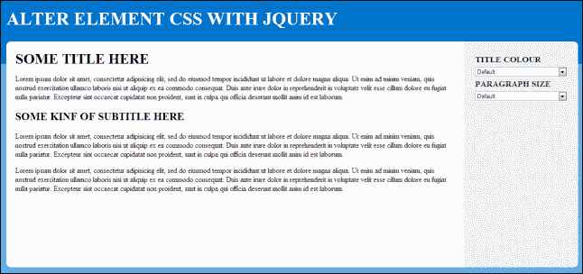
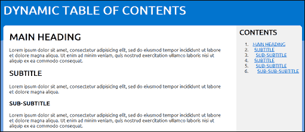
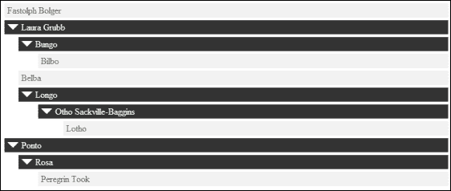
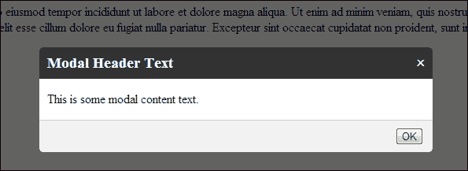

# 第六章：用户界面

在本章中，我们将涵盖以下主题：

+   操纵元素的 CSS

+   创建一个新闻滚动条

+   创建固定元素

+   实现平滑滚动

+   创建一个动态目录表

+   创建基本的拖放功能

+   创建一个动态动画树形菜单

+   创建一个手风琴内容滑块

+   创建标签式内容

+   创建一个模态框弹出窗口

+   创建一个可拖动的内容弹出窗口

# 介绍

jQuery 赋予开发人员轻松创建复杂用户界面元素的能力。正因为如此，有大量的 jQuery 插件允许开发人员快速将这些界面添加到其网站中。另外，jQuery 的 UI 框架还拥有许多热门界面元素，如手风琴、表格内容、模态框等。如果您想了解如何在自己的网站上使用 jQuery UI，请直接跳转至第九章，*jQuery UI*。本章将专注于从头开始开发一些这些常见的 UI 元素，提供无限的定制性，并让您了解其他插件的工作原理。

# 操纵元素的 CSS

jQuery 允许开发者直接访问 DOM 元素的 CSS 属性。这为您基于 JavaScript 中的数据轻松改变应用程序的外观和感觉提供了一种简单的方式。本教程将向您展示如何在各种元素中操纵 DOM CSS。

## 准备工作

对于这个教程，您将需要三个文件。使用您选择的编辑器，在与最新版本的 jQuery 库相同的目录中创建`recipe-1.html`、`recipe-1.js`和`recipe-1.css`。

## 如何做…

在您刚刚创建的三个文件中，打开每个文件进行编辑，并执行以下步骤：

1.  将以下 HTML 代码添加到`recipe-1.html`；确保更改包含 jQuery 库的 JavaScript 的源位置，将其指向您计算机上下载的最新版本的 jQuery：

    ```js
    <!DOCTYPE html>
    <html>
    <head>
        <title>Chapter 6 :: Recipe 1</title>
        <link href="recipe-1.css" rel="stylesheet" 
              type="text/css" />
        <script src="img/jquery.min.js"></script>
        <script src="img/recipe-1.js"></script>
    </head>
    <body>
        <div class="header">
            <h1>ALTER ELEMENT CSS WITH JQUERY</h1>
        </div>
        <div class="content-frame">
            <div class="left">
                <h1>SOME TITLE HERE</h1>
                <p>Lorem ipsum dolor sit amet, consectetur adipisicing elit, sed do eiusmod tempor incididunt ut labore et dolore magna aliqua. Ut enim ad minim veniam, quis nostrud exercitation ullamco laboris nisi ut aliquip ex ea commodo consequat. Duis aute irure dolor in reprehenderit in voluptate velit esse cillum dolore eu fugiat nulla pariatur. Excepteur sint occaecat cupidatat non proident, sunt in culpa qui officia deserunt mollit anim id est laborum.</p>
                <h2>SOME KIND OF SUBTITLE HERE</h2>
                <p>Lorem ipsum dolor sit amet, consectetur adipisicing elit, sed do eiusmod tempor incididunt ut labore et dolore magna aliqua. Ut enim ad minim veniam, quis nostrud exercitation ullamco laboris nisi ut aliquip ex ea commodo consequat. Duis aute irure dolor in reprehenderit in voluptate velit esse cillum dolore eu fugiat nulla pariatur. Excepteur sint occaecat cupidatat non proident, sunt in culpa qui officia deserunt mollit anim id est laborum.</p>
                <p>Lorem ipsum dolor sit amet, consectetur adipisicing elit, sed do eiusmod tempor incididunt ut labore et dolore magna aliqua. Ut enim ad minim veniam, quis nostrud exercitation ullamco laboris nisi ut aliquip ex ea commodo consequat. Duis aute irure dolor in reprehenderit in voluptate velit esse cillum dolore eu fugiat nulla pariatur. Excepteur sint occaecat cupidatat non proident, sunt in culpa qui officia deserunt mollit anim id est laborum.</p>
            </div>
            <div class="right">
                <h3>TITLE COLOUR</h3>
                <select class="title-colour">
                    <option value="#">Default</option>
                    <option value="red">Red</option>
                    <option value="green">Green</option>
                    <option value="orange">Orange</option>
                    <option value="blue">Blue</option>
                </select>
                <h3>PARAGRAPH SIZE</h3>
                <select class="p-size">
                    <option value="#">Default</option>
                    <option value="10px">10px</option>
                    <option value="15px">15px</option>
                    <option value="20px">20px</option>
                    <option value="25px">25px</option>
                </select>
            </div>
        </div>
    </body>
    </html>
    ```

1.  将以下 CSS 代码添加到`recipe-1.css`：

    ```js
    body {
        margin: 0;
        background-color: #5dace7;
    }
    .header {
        height: 150px;
        background-color: #0174cd;
    }
    .header h1 {
        margin: 0 50px 0 50px;
        padding: 0;
        line-height: 100px;
        font-size: 40px;
        color: #FFFFFF;
    }
    .content-frame {
        margin: -50px 50px 0 50px;
        background-color: #FFFFFF;
        border-radius: 10px;
        min-height: 500px;
        position: relative;
    }
    .content-frame .left {
        margin-right: 20%;
        padding: 20px;
    }
    .content-frame .left h1 {
        margin: 0;
    }
    .content-frame .right {
        width: 16%;
        padding: 2%;
        position: absolute;
        top: 0;
        right: 0;
        background-color: #F1F1F1;
        border-top-right-radius: 10px;
        border-bottom-right-radius: 10px;
    }
    .content-frame .right h3 {
        margin: 0;
        line-height: 30px;
        color: #333333;
    }
    .content-frame .right select {
        width: 100%;
    }
    ```

1.  将以下 jQuery 代码添加到`recipe-1.js`中，以为 HTML 代码中的 select 下拉框添加功能：

    ```js
    $(function(){
        $('.title-colour').on("change", function(){
            var colour = $(this).val();
            if (colour == "#") {
                colour = "";
            }
            $('h1, h2').css("color", colour);
        });
        $('.p-size').on("change", function(){
            var size = $(this).val();
            if (size == "#") {
                size = "";
            }
            $('p').css("font-size", size);
        });
    });
    ```

1.  在 web 浏览器中打开`recipe-1.html`，您应该会看到以下简单的网页：

1.  使用右侧的下拉菜单来修改标题和段落元素的 CSS。

## 它是如何工作的…

HTML 创建了一个基本的网页，提供这样的元素，以便它们的 CSS 可以被 jQuery 操纵，并提供一个简单的界面来启动这些更改。`recipe-1.css`中的 CSS 代码添加了基本的样式来创建我们的网页布局。

要更改元素的 CSS，将`change`事件处理程序附加到两个 select 下拉框，使用它们各自的类名：

```js
$(function(){
   $('.title-colour').on("change", function(){

});
$('.p-size').on("change", function(){

});
});
```

这将允许我们在用户更改标题颜色 (`title-colour`) 或段落大小 (`p-size`) 下拉菜单的值时执行一些代码。使用 `$(this).val()`，可以获取所选选项的值，如下面的代码片段所示：

```js
$(function(){
    $('.title-colour').on("change", function(){
        var colour = $(this).val();
        if (colour == "#") {
            colour = "";
        }
        $('h1, h2').css("color", colour);
    });
    $('.p-size').on("change", function(){
        var size = $(this).val();
        if (size == "#") {
            size = "";
        }
        $('p').css("font-size", size);
    });
});
```

使用 `colour` 或 `size` 变量（它们保存了各自下拉菜单中选定的值），我们确定默认选项是否已被选中，使用其值 `#`。如果已选择，则我们将 `colour` 或 `size` 值设置为空，允许用户将操纵的 CSS 重置为默认值。

如果选择了除默认选项之外的选项，则该值将与 jQuery 的 `css()` 函数中的相应 CSS 选项一起使用，如下面的代码片段中所示：

```js
$(function(){
    $('.title-colour').on("change", function(){
        var colour = $(this).val();
        if (colour == "#") colour = "";
        $('h1, h2').css("color", colour);
    });
    $('.p-size').on("change", function(){
        var size = $(this).val();
        if (size == "#") size = "";
        $('p').css("font-size", size);
    });
});
```

# 创建一个新闻滚动条

本教程将向您展示如何创建一个带有停止/暂停功能的简单新闻滚动条。新闻滚动条是在小空间中显示大量信息（如推文、引用语或一般新闻项目）的绝佳方式。

## 准备工作

再次，您需要创建三个文件。在与最新版本的 jQuery 相同的目录中创建 `recipe-2.html`、`recipe-2.css` 和 `recipe-2.js`。

## 如何操作…

按照以下逐步说明创建一个动画新闻滚动条：

1.  将以下 HTML 代码添加到 `recipe-2.html` 中，以创建一个简单的网页和我们的滚动条内容：

    ```js
    <!DOCTYPE html>
    <html>
    <head>
        <title>Chapter 6 :: Recipe 2</title>
        <link href="recipe-2.css" rel="stylesheet" type="text/css" />
        <script src="img/jquery.min.js"></script>
        <script src="img/recipe-2.js"></script>
    </head>
    <body>
    <div class="header">
        <h1>CONTENT TICKER</h1>
    </div>
    <div class="content-frame">
        <ul id="ticker">
            <li>Learn from yesterday, live for today, hope for tomorrow. The important thing is not to stop questioning</li>
            <li>Try not to become a man of success, but rather try to become a man of value</li>
            <li>Logic will get you from A to B. Imagination will take you everywhere</li>
            <li>Reality is merely an illusion, albeit a very persistent one</li>
        </ul>
    </div>
    </body>
    </html>
    ```

1.  将以下简单的 CSS 添加到 `recipe-2.css` 中，为我们的网页添加样式：

    ```js
    body {
        margin: 0;
        background-color: #5dace7;
    }
    .header {
        height: 130px;
        background-color: #0174cd;
    }
    .header h1 {
        margin: 0 50px 0 50px;
        padding: 0;
        line-height: 100px;
        font-size: 40px;
        color: #FFFFFF;
    }
    .content-frame {
        margin: -30px 50px 0 50px;
        background-color: #FFFFFF;
        border-radius: 10px;
        height: 50px;
        position: relative;
        padding: 0 20px 0 20px;
        overflow: hidden;
    }
    .content-frame ul {
        list-style: none;
        margin: 0;
        padding: 0;
    }
    .content-frame ul li {
        line-height: 50px;
    }
    ```

1.  将以下 jQuery 代码添加到 `recipe-2.js` 中，使我们的滚动条生效：

    ```js
    var tick = null;
    var interval = 2000;
    $(function(){
        tick = setInterval(function(){
            ticker()
        }, interval);
        $('.content-frame').on("mouseover", function(){
            clearInterval(tick);
        });
        $('.content-frame').on("mouseout", function(){
            tick = setInterval(function(){
                ticker()
            }, interval);
        });
    });
    function ticker() {
        $('#ticker li:first-child').slideUp(function(){
            $(this).appendTo($('#ticker')).slideDown();
        });
    }
    ```

1.  在网络浏览器中打开 `recipe-2.html` 将呈现一个简单的网页和一个动画滚动条，每两秒显示爱因斯坦的不同引用语。

## 工作原理…

由于 HTML 和 CSS 代码非常简单，因此唯一需要解释的是 jQuery 代码。请注意，HTML 网页包含一个无序列表元素，其中包含四条爱因斯坦的引用语，位于名为 `content-frame` 的 division 元素内。`content-frame` 元素的 `overflow` 属性设置为 `hidden`，以便一次只显示一个引用语。

在 `recipe-2.js` 文件的顶部声明了两个变量：`tick` 和 `interval`。`tick` 变量是 JavaScript 的 `setInterval()` 函数将要声明的地方。JavaScript 的 `setInterval()` 函数允许我们指定一个函数和一个间隔。然后，指定的函数将在指定的间隔内再次调用。这使我们能够循环遍历新闻滚动条内容。

通过在 JavaScript 文件顶部声明 `tick` 变量，我们可以在以后的某个时间点停止间隔以添加暂停功能。`interval` 变量只是保存我们希望 `setInterval()` 函数在再次调用指定函数之前等待的毫秒数：

```js
var tick = null;
var interval = 2000;
$(function(){

});
```

在 jQuery 的加载函数内部，我们将`tick`变量分配给`setInterval()`函数，指定函数再次调用，然后使用`interval`变量设置间隔持续时间，如以下代码段所示：

```js
$(function(){
    tick = setInterval(function(){
        ticker();
    }, interval);
});
```

要添加停止/启动功能，根据用户将鼠标悬停在滚动条上时停止滚动并在将鼠标移开时重新启动滚动的要求，我们需要为`content-frame`部分元素附加两个事件处理程序，如下所示：

```js
$(function(){
    tick = setInterval(function(){
        ticker()
    }, interval);
    $('.content-frame').on("mouseover", function(){
        clearInterval(tick);
    });
    $('.content-frame').on("mouseout", function(){
        tick = setInterval(function(){
            ticker()
        }, interval);
    });
});
```

`mouseover`事件处理程序使用 JavaScript 的`clearInterval()`函数，并将`tick`变量作为参数传递。当用户将鼠标悬停在`content-frame`元素上时，这将阻止`setInterval()`函数再次调用`ticker()`函数。在`mouseout`事件的回调函数中，使用相同的`setInterval()`函数重新声明`tick`变量，重新初始化新闻滚动条并再次启动它。

最后，还有`ticker()`函数本身。此函数使用 jQuery 的`slideUp()`函数将第一个列表元素向上滑动。这提供了下一个元素进入视图的效果。然后，它使用`appendTo()`将使用`slideUp()`函数隐藏的元素移动到滚动条列表的末尾。最后，它使用`slideDown()`将此元素再次滑动下来，以便在最终再次移动到列表顶部时准备显示。如以下代码段所示：

```js
function ticker() {
    $('#ticker li:first-child').slideUp(function(){
        $(this).appendTo($('#ticker')).slideDown();
    });
}
```

## 更多内容…

可以以任何你喜欢的方式采用启动和停止功能，例如，使用启动和停止按钮，或者甚至一个单独的暂停按钮，以便更明显地表明可以暂停滚动。本示例中使用的方法的好处是，链接通常会显示在滚动内容中。当用户试图点击滚动内容中的链接时，滚动将停止，允许他们点击链接，而不是在他们点击之前链接就移开。

## 另请参阅

+   *创建动态目录*

# 创建固定元素

固定元素是页面元素，在用户滚动时会固定在浏览器中的位置。固定元素用于始终保持内容在用户视线内。这些内容可以是导航、重要信息，甚至是广告。本示例将展示如何创建固定元素，并且使用 jQuery 在用户滚动到页面上某一点时激活它们。

## 准备工作

使用你喜欢的编辑器，在与你的 jQuery 库相同的目录下创建三个文件，分别命名为`recipe-3.html`、`recipe-3.css`和`recipe-3.js`。

## 如何做…

对于每个新创建的文件，执行以下步骤：

1.  将以下 HTML 代码添加到`recipe-3.html`中；它创建了一个长网页，可以滚动，并且一个`div`元素，其中包含一些重要内容需要始终保持在用户视线内：

    ```js
    <!DOCTYPE html>
    <html>
    <head>
        <title>Chapter 6 :: Recipe 3</title>
        <link href="recipe-3.css" rel="stylesheet" type="text/css" />
        <script src="img/jquery.min.js"></script>
        <script src="img/recipe-3.js"></script>
    </head>
    <body>
    <div class="header">
        <h1>STICKY ELEMENTS RECIPE</h1>
    </div>
    <div class="content-frame">
        <div class="left">
            <h1>STICKY ELEMENTS</h1>
            <p>Sticky elements are great to keep important content within the users view, such as share buttons, navigation and also table of contents.</p>
            <p>Scroll down this page and when you are about to go past the important content on the right hand side, it will start to follow you down the screen.</p>
        </div>
        <div class="right">
            <ul>
                <li><a href="#">Navigation Item 1</a></li>
                <li><a href="#">Navigation Item 2</a></li>
                <li><a href="#">Navigation Item 3</a></li>
                <li><a href="#">Navigation Item 4</a></li>
                <li><a href="#">Navigation Item 5</a></li>
                <li><a href="#">Navigation Item 6</a></li>
            </ul>
            <div class="important">
                <p>Here is some important content.</p>
            </div>
        </div>
    </div>
    </body>
    </html>
    ```

1.  为了给这个页面添加样式，将以下 CSS 代码添加到 `recipe-3.css` 文件中；代码中还包含一个 `sticky` 类，在用户滚动页面时会被 jQuery 应用到重要元素上：

    ```js
    @import url(http://fonts.googleapis.com/css?family=Ubuntu);
    body {
        margin: 0;
        background-color: #5dace7;
        font-family: 'Ubuntu', sans-serif;
    }
    .header {
        height: 150px;
        background-color: #0174cd;
    }
    .header h1 {
        width: 1000px;
        margin: auto;
        padding: 0;
        line-height: 100px;
        font-size: 40px;
        color: #FFFFFF;
    }
    .content-frame {
        margin: -50px auto auto auto;
        width: 1000px;
        background-color: #FFFFFF;
        border-radius: 10px;
        min-height: 1300px;
        position: relative;
    }
    .content-frame .left {
        margin-right: 240px;
        padding: 20px;
    }
    .content-frame .left h1 {
        margin: 0;
    }
    .content-frame .right {
        width: 200px;
        padding: 10px;
        position: absolute;
        top: 0;
        right: 0;
        background-color: #F1F1F1;
        border-top-right-radius: 10px;
        border-bottom-right-radius: 10px;
    }
    .content-frame .right .important {
        border: solid 1px #CCCCCC;
        text-align: center;
        width: 200px;
    }
    .sticky {
        position: fixed;
        top: 10px;
    }
    ```

1.  最后，将以下 jQuery 代码添加到 `recipe-3.js` 中，当用户试图滚过时，将激活固定元素：

    ```js
    var importantOrigin = {};
    $(function(){
        importantOrigin = $('.important').offset();
        $(window).scroll(function(){
            sticky();
        });
    });
    function sticky() {
        var _important = $('.important');
        var scrollPosition = $('body, html').scrollTop();
        if (importantOrigin.top < scrollPosition) {
            _important.addClass("sticky");
        } else {
            _important.removeClass("sticky");
        }
    }
    ```

## 工作原理...

在 `recipe-3.js` 的顶部，有一个名为 `importantOrigin` 的变量，它将用于存储重要部分元素的原始位置。在 jQuery 的加载块中，使用 `$('.important').offset()` 获取重要元素的顶部和左侧位置，并将这些值存储在先前创建的 `importantOrigin` 变量中。如下面的代码片段所示：

```js
var importantOrigin = {};
$(function(){
    importantOrigin = $('.important').offset();
    $(window).scroll(function(){
        sticky();
    });
});
```

jQuery 的 `scroll()` 函数用于在用户滚动页面时执行 `sticky()` 方法：

```js
function sticky() {
    var _important = $('.important');
    var scrollPosition = $('body, html').scrollTop();
    if (importantOrigin.top < scrollPosition) {
        _important.addClass("sticky");
    } else {
        _important.removeClass("sticky");
    }
}
```

`sticky()` 方法使用 `$('body, html').scrollTop()` 获取页面的当前垂直位置，然后将其与重要元素的顶部位置进行比较。如果用户滚过了重要元素，则使用 `addClass()` 方法将 `sticky` CSS 类应用于重要元素：

```js
.sticky {
    position: fixed;
    top: 10px;
}
```

如果页面的当前垂直位置低于 `sticky` 元素的顶部，则使用 `removeClass()` 将 `sticky` 类移除，将重要元素恢复到其原始状态。在 CSS 中使用 `position: fixed;`，可以使元素固定在页面的某一点。使用 jQuery 条件性地应用此 CSS，我们可以控制何时应用元素固定，因为通常直到用户滚动过元素，使其不再在屏幕上可见，才希望这样做。

## 还有更多...

有一个流行的 jQuery 插件叫做 `sticky.js`，可以在 [`stickyjs.com/`](http://stickyjs.com/) 找到。该插件使用了您在本文档中学到的相同原理，并将所有功能打包成插件，以便于重用。

## 参见

+   *创建一个动态目录表*

# 实现平滑滚动

锚点链接用于导航到页面的不同部分，使用户能够轻松地跳过他们不感兴趣的信息，直接进入感兴趣的部分。然而，当屏幕上有大量文本数据时，在这些不同部分之间跳转通常会让用户感到困惑。使用平滑滚动并将屏幕动画地缓慢向上或向下移动到所选部分，用户可以更容易地可视化自己导航到的位置，而不会感到迷失方向。

## 准备工作

只需创建三个标准的配方文件，`recipe-4.html`、`recipe-4.css` 和 `recipe-4.js`，并将它们保存到与最新版本的 jQuery 库相同的目录中。

## 实现方法...

执行以下简单步骤，为网站或网页添加平滑滚动效果：

1.  通过将以下 HTML 代码添加到 `recipe-4.html` 文件中，可以创建一个较长的网页：

    ```js
    <!DOCTYPE html>
    <html>
    <head>
        <title>Chapter 6 :: Recipe 4</title>
        <link href="recipe-4.css" rel="stylesheet" type="text/css" />
        <script src="img/jquery.min.js"></script>
        <script src="img/recipe-4.js"></script>
    </head>
    <body>
    <div class="header">
        <h1 id="top">SMOOTH SCROLLING RECIPE</h1>
    </div>
    <div class="content-frame">
        <div class="left">
            <h2 id="one">SECTION 1 <a href="#top" class="top-link">[TOP]</a></h2>
            <div class="section"></div>
            <h2 id="two">SECTION 2 <a href="#top" class="top-link">[TOP]</a></h2>
            <div class="section"></div>
            <h2 id="three">SECTION 3 <a href="#top" class="top-link">[TOP]</a></h2>
            <div class="section"></div>
            <h2 id="four">SECTION 4 <a href="#top" class="top-link">[TOP]</a></h2>
            <div class="section"></div>
        </div>
        <div class="right">
            <h2>NAVIGATION</h2>
            <ul>
                <li><a href="#one">SECTION ONE</a></li>
                <li><a href="#two">SECTION TWO</a></li>
                <li><a href="#three">SECTION THREE</a></li>
                <li><a href="#four">SECTION FOUR</a></li>
                <li><a href="http://www.google.com" target="_blank">EXTERNAL LINK</a></li>
                <li><a href="#">EMPTY LINK</a></li>
            </ul>
        </div>
    </div>
    </body>
    </html>
    ```

1.  通过将以下 CSS 代码添加到`recipe-4.css`中（此文件在前面的 HTML 页面中已经包含）来为这个页面添加样式：

    ```js
    @import url(http://fonts.googleapis.com/css?family=Ubuntu);
    body {
        margin: 0;
        background-color: #5dace7;
        font-family: 'Ubuntu', sans-serif;
    }
    .header {
        height: 150px;
        background-color: #0174cd;
    }
    .header h1 {
        width: 1000px;
        margin: auto;
        padding: 0;
        line-height: 100px;
        font-size: 40px;
        color: #FFFFFF;
    }
    .content-frame {
        margin: -50px auto auto auto;
        width: 1000px;
        background-color: #FFFFFF;
        border-radius: 10px;
        min-height: 1300px;
        position: relative;
    }
    .content-frame .left {
        margin-right: 240px;
        padding: 20px;
    }
    .content-frame .left h1 {
        margin: 0;
    }
    .content-frame .right {
        width: 200px;
        padding: 10px;
        position: absolute;
        top: 0; 
        right: 0;
        background-color: #F1F1F1;
        border-top-right-radius: 10px;
        border-bottom-right-radius: 10px;
    }
    .content-frame .right h2 {
        margin: 0;
        padding: 0;
    }
    .section {
        height: 400px;
        background-color: #CCCCCC;
        margin-bottom: 20px;
    }
    .top-link {
        width: 50px;
        text-align: right;
        float: right;
        font-size: 12px;
    }
    ```

1.  将以下 jQuery 代码添加到`recipe-4.js`以捕捉锚点元素点击并提供平滑滚动效果：

    ```js
    $(function(){
        $('a[href*=#]:not([href=#])').click(function(){
            if (this.hash.length > 0) {
                $('body, html').animate({
                    scrollTop: $(this.hash).offset().top
                }, 1000);
            }
            return false;
        });
    });
    ```

## 工作原理…

jQuery 代码首先将`click`事件处理程序附加到某些锚点元素上：

```js
$(function(){
    $('a[href*=#]:not([href=#])').click(function(){

    });
});
```

前面的代码将仅将`click`事件处理程序附加到其`href`属性中具有哈希（`#`）的锚点。还使用`:not([href=#])`，以便不会将事件处理程序附加到其`href`属性只有一个哈希的锚点。现在，我们可以指定要执行的代码，以便在页面上导航到其他部分的链接。空白和外部链接将被忽略并像往常一样运行。

在`click`事件处理程序的`callback()`函数内，我们可以使用`this.hash`来检索点击的锚点元素的`href`属性中的哈希值。如果锚点链接到`#two`，我们会收到字符串值`"#two"`。使用`this.hash.length`，我们可以确保值是有效的，并且我们可以继续提供平滑滚动动画：

```js
$(function(){
    $('a[href*=#]:not([href=#])').click(function(){
        if (this.hash.length > 0) {

        }
        return false;
    });
});
```

在`this.hash.length`的`if`语句内，我们使用 jQuery 的`animate()`函数如下来动画和滚动用户到锚点目标的位置：

```js
$('body, html').animate({
   scrollTop: $(this.hash).offset().top
}, 1000);
```

`scrollTop`参数是动画应该滚动到的位置。我们通过使用`$(this.hash)`选择目标元素，然后使用 jQuery 的`offset()`函数获取其顶部位置。

最后，在`this.hash.length`的`if`语句之后返回`false`，以防止点击事件的默认操作。如果去掉`return false`，在动画开始之前会出现屏幕闪烁，因为点击事件的默认操作（将用户发送到链接的部分）发生在动画开始之前。

## 另见

+   *创建一个动态目录*

# 创建一个动态目录

目录是让用户快速找到他们正在寻找的内容部分的常见方式。使用 jQuery，可以根据页面上的 HTML 标题元素动态创建目录。这对于博客文章或其他拥有许多不同内容页面的网站非常有用。

## 准备工作

创建`recipe-5.html`、`recipe-5.css`和`recipe-5.js`，并像以前一样都准备好进行编辑。

## 如何做…

创建了必需的文件之后，按照以下步骤创建一个动态目录：

1.  使用以下 HTML 代码创建一个基本网页，并将其添加到`recipe-5.html`中：

    ```js
    <!DOCTYPE html>
    <html>
    <head>
        <title>Chapter 6 :: Recipe 5</title>
        <link href="recipe-5.css" rel="stylesheet" type="text/css" />
        <script src="img/jquery.min.js"></script>
        <script src="img/recipe-5.js"></script>
    </head>
    <body>
    </body>
    </html>
    ```

1.  将以下 HTML 代码添加到刚刚添加的 `body` 标签内的 `recipe-5.html` 中；这将创建一个带有分节内容和有序列表元素的页面，可以填充内容：

    ```js
    <div class="header">
        <h1>DYNAMIC TABLE OF CONTENTS</h1>
    </div>
    <div class="content-frame">
        <div class="left">
            <h1 id="one">MAIN HEADING</h1>
            <p>Lorem ipsum dolor sit amet, consectetur adipisicing elit, sed do eiusmod tempor incididunt ut labore et dolore magna aliqua. Ut enim ad minim veniam, quis nostrud exercitation ullamco laboris nisi ut aliquip ex ea commodo consequat.</p>
            <h2 id="two">SUBTITLE</h2>
            <p>Lorem ipsum dolor sit amet, consectetur adipisicing elit, sed do eiusmod tempor incididunt ut labore et dolore magna aliqua.</p>
            <h3 id="three">SUB-SUBTITLE</h3>
            <p>Lorem ipsum dolor sit amet, consectetur adipisicing elit, sed do eiusmod tempor incididunt ut labore et dolore magna aliqua. Ut enim ad minim veniam, quis nostrud exercitation ullamco laboris nisi ut aliquip ex ea commodo consequat.</p>
            <h2 id="four">SUBTITLE</h2>
            <p>Ut enim ad minim veniam, quis nostrud exercitation ullamco laboris nisi ut aliquip ex ea commodo consequat.</p>
            <h3 id="five">SUB-SUBTITLE</h3>
            <p>Ut enim ad minim veniam, quis nostrud exercitation ullamco laboris nisi ut aliquip ex ea commodo consequat.</p>
            <p>Ut enim ad minim veniam, quis nostrud exercitation ullamco laboris nisi ut aliquip ex ea commodo consequat.</p>
            <h4 id="six">SUB-SUB-SUBTITLE</h4>
            <p>Ut enim ad minim veniam, quis nostrud exercitation ullamco laboris nisi ut aliquip ex ea commodo consequat.</p>
        </div>
        <div class="right">
            <h2>CONTENTS</h2>
            <ol class="contents"></ol>
        </div>
    </div>
    ```

1.  将以下 CSS 添加到`recipe-5.css`以向此页面添加基本样式。这段 CSS 代码再次与本章前两个示例中的代码非常相似：

    ```js
    @import url(http://fonts.googleapis.com/css?family=Ubuntu);
    body {
        margin: 0;
        background-color: #5dace7;
        font-family: 'Ubuntu', sans-serif;
    }
    .header {
        height: 150px;
        background-color: #0174cd;
    }
    .header h1 {
        width: 1000px;
        margin: auto;
        padding: 0;
        line-height: 100px;
        font-size: 40px;
        color: #FFFFFF;
    }
    .content-frame {
        margin: -50px auto auto auto;
        width: 1000px;
        background-color: #FFFFFF;
        border-radius: 10px;
        min-height: 1300px;
        position: relative;
    }
    .content-frame .left {
        margin-right: 240px;
        padding: 20px;
    }
    .content-frame .left h1 {
        margin: 0;
    }
    .content-frame .right {
        width: 200px;
        padding: 10px;
        position: absolute;
        top: 0;
        bottom: 0;
        right: 0;
        background-color: #F1F1F1;
        border-top-right-radius: 10px;
        border-bottom-right-radius: 10px;
    }
    .content-frame .right h2 {
        margin: 0;
        padding: 0;
    }
    ```

1.  将以下 jQuery 代码添加到`recipe-5.js`中，它将根据我们刚刚创建的 HTML 页面中的标题部分填充有序列表：

    ```js
    $(function(){
        var _contents = $('.content-frame .left');
        var _headers = _contents.find("h1, h2, h3, h4");
        _headers.each(function(index, value){
            var _header = $(value);
            var level = parseInt(_header.context.localName.replace("h", ""));
            if (typeof _header.attr("id") != "undefined") {
                var listItem = $("<li><a href='#" + _header.attr("id") + "'>" + _header.html() + "</a></li>");
            } else {
                var listItem = $("<li>" + _header.html() + "</li>");
            }
            listItem.css("padding-left", (level * 5));
            $('.contents').append($(listItem));
        });
    });
    ```

1.  在网页中打开`recipe-5.html`将向您展示内容在屏幕左侧，动态生成的内容列表在右侧，如下截图所示：

## 它是如何运行的...

HTML 代码提供了一个包含由`h1`、`h2`、`h3`和`h4`标签标头的各种部分以及一个空的有序列表元素的内容窗格。

我们的 jQuery 代码首先选择内容部分，然后使用 jQuery `find()`函数找到其中的所有标题元素，并指定`h1, h2, h3, h4`作为唯一参数。这将创建一个找到的元素数组，并将它们存储在`_headers`数组中，如下代码片段所示：

```js
$(function(){
    var _contents = $('.content-frame .left');
    var _headers = _contents.find("h1, h2, h3, h4");
// --- HIDDEN CODE
});
```

然后使用 jQuery `each()`函数，可以遍历找到的所有标题元素并构建目录。首先声明本地变量`_header`，并将当前标题元素存储在此变量中。

为了能够缩进目录中的子节，使用户更容易看到内容结构，代码需要确定当前标题的级别：`h1`为顶级，`h5`为底级。使用`_header.context.localName`，我们可以获取标题元素的标签（例如，`h1`）并使用 JavaScript 的`replace()`删除"`h`"。然后，我们可以使用`parseInt()`将剩余值转换为整数。我们得到一个值，可以用来确定标题元素的级别。这个过程在以下代码片段中显示：

```js
$(function(){
    var _contents = $('.content-frame .left');
    var _headers = _contents.find("h1, h2, h3, h4");
    _headers.each(function(index, value){
        var _header = $(value);
        var level = parseInt(_header.context.localName.replace("h", ""));
        // --- HIDDEN CODE
    });
});
```

现在我们可以创建列表元素，并将其插入有序列表中。为了将目录中的项目链接到内容的适当部分，我们需要检查标题元素是否有我们可以链接到的 ID。如果有，我们通过执行以下代码创建带有链接的列表元素；否则，我们通过执行以下代码创建基本列表元素：

```js
$(function(){
    var _contents = $('.content-frame .left');
    var _headers = _contents.find("h1, h2, h3, h4");
    _headers.each(function(index, value){
        var _header = $(value);
        var level = parseInt(_header.context.localName.replace("h", ""));
        if (typeof _header.attr("id") != "undefined") {
            var listItem = $("<li><a href='#" + _header.attr("id") + "'>" + _header.html() + "</a></li>");
        } else {
            var listItem = $("<li>" + _header.html() + "</li>");
        }
        listItem.css("padding-left", (level * 5));
        $('.contents').append($(listItem));
    });
});
```

最后，创建完列表项后，使用`css()`函数和`level`变量添加所需的缩进填充，并将创建的列表项附加到内容的有序列表中。

## 还有更多...

您可以将此配方与*实现平滑滚动*和*创建粘性元素*配方结合使用，迫使目录随用户向下滚动页面并为更好的用户体验提供滚动动画。

## 参见

+   *创建粘性元素*

+   *实现平滑滚动*

# 创建基本的拖放功能

通过向网站添加拖放元素，可以创建有趣且直观的界面。jQuery UI 带有内置插件，用于拖放界面。本产品介绍将向您展示如何创建基本的拖放功能，而无需使用任何插件，从而为您扩展代码提供自由和理解。

## 准备工作

创建一个名为`recipe-6.html`的空白 HTML 页面，并将`recipe-6.css`和`recipe-6.js`文件放在与最新版本 jQuery 库相同的目录中。

## 如何做…

按照以下分步说明执行以下操作完成此步骤：

1.  将以下 HTML 代码添加到`recipe-6.html`中，在容器`div`中创建一个基本的 HTML 页面，其中包含三个`draggable`元素：

    ```js
    <!DOCTYPE html>
    <html>
    <head>
        <title>Chapter 6 :: Recipe 6</title>
        <link href="recipe-6.css" rel="stylesheet" type="text/css" />
        <script src="img/jquery.min.js"></script>
        <script src="img/recipe-6.js"></script>
    </head>
    <body>
        <div class="container">
            <div class="draggable"></div>
            <div class="draggable"></div>
            <div class="draggable"></div>
        </div>
    </body>
    </html>
    ```

1.  将以下 CSS 代码添加到`recipe-6.css`中，为 HTML 页面和`draggable`元素添加样式：

    ```js
    .container {
        width: 800px;
        height: 500px;
        border: solid 2px #333333;
        margin: 20px auto auto auto;
    }
    .draggable {
        width: 120px;
        height: 120px;
        margin: 10px;
        background-color: darkred;
           cursor: pointer;
    }
    .draggable.dragging {
        box-shadow: 5px 5px 5px #CCC;
    }
    ```

1.  将以下 jQuery 代码插入`recipe-6.js`中，为`draggable`元素应用拖放功能：

    ```js
    $(function(){
        $('.draggable').on("mousedown", function(){
           $(this).addClass('dragging');
        }).on("mousemove mouseout", function(event){
                if ($(this).hasClass("dragging")) {
                    //Get the parents position
                    var parentPosition = $(this).parent().offset();

                    //Don't allow the draggable element to go over the parent's left and right
                    var left = (event.pageX - ($(this).width() / 2));
                    var parentRight = parentPosition.left + $(this).parent().width();
                   if (left > (parentRight - $(this).width())){
                        left = (parentRight - $(this).width());
                    } else if(left <= parentPosition.left) {
                        left = parentPosition.left;
                    }

                    //Don't allow the draggable element to go over the parent's top and bottom
                    var top = (event.pageY - ($(this).height() / 2));
                    var parentBottom = parentPosition.top + $(this).parent().height();
                    if (top > (parentBottom - $(this).height())) {
                        top = (parentBottom - $(this).height());
                    } else if (top <= parentPosition.top) {
                        top = parentPosition.top;
                    }

                    //Set new position
                    $(this).css({
                        top: top + "px",
                        left: left + "px",
                        position: "absolute"
                    });
                }
        }).on("mouseup", function(){
            $(this).removeClass('dragging');
        });
    });
    ```

1.  在 Web 浏览器中打开`recipe-6.html`并单击其中一个红色框。这将向元素应用`dragging` CSS 类，允许您在页面内的框划分中移动它。

## 运作原理…

HTML 页面提供一个充当`draggable`元素容器的`div`元素。`frame`元素内有三个额外的`div`元素。这三个元素具有`draggable`类，jQuery 将使用这个类应用拖放功能。

配方中使用的 CSS 代码在`frame`元素上创建边框，并为`draggable`元素设置高度、宽度和背景颜色。还有一个`dragging`类，当移动`draggable`元素时，会为其应用阴影。

在 jQuery 代码本身中，使用一系列鼠标事件来创建拖放功能。使用 jQuery 的`on()`函数将不同的事件处理程序应用于`draggable`元素。应用在`draggable`元素上的第一个事件处理程序是`mousedown`事件，如下所示：

```js
$('.draggable').on("mousedown", function(){
       $(this).addClass('dragging');
})
```

这只是向刚刚被点击的元素（`mousedown`）添加`dragging`类。

接下来要绑定的事件处理程序是`mousemove`和`mouseout`事件。这允许我们根据用户在点击选定元素的同时移动鼠标指针时，根据鼠标位置更新点击元素的位置。我们还针对用户移动太快并将鼠标指针移出选定的`draggable`框时使用相同的代码来处理`mouseout`事件。由于相同的代码附加到`mouseout`事件上，框的位置将被更新为鼠标的位置。

```js
.on("mousemove mouseout", function(event){
            if ($(this).hasClass("dragging")) {
                //Get the parents position
                var parentPosition = $(this).parent().offset();

                //Don't allow the draggable element to over the parent's left and right
                var left = (event.pageX - ($(this).width() / 2));
                var parentRight = parentPosition.left + $(this).parent().width();
                if (left > (parentRight - $(this).width())) {
                    left = (parentRight - $(this).width());
                } else if(left <= parentPosition.left) {
                    left = parentPosition.left;
                }

                //Don't allow the draggable element to go over the parent's top and bottom
                var top = (event.pageY - ($(this).height() / 2));
                var parentBottom = parentPosition.top + $(this).parent().height();
                if (top > (parentBottom - $(this).height())) {
                    top = (parentBottom - $(this).height());
                } else if (top <= parentPosition.top) {
                    top = parentPosition.top;
                }

                //Set new position
                $(this).css({
                    top: top + "px",
                    left: left + "px",
                    position: "absolute"
                });
            }
    })
```

这两个事件的回调函数是添加主要功能的地方。这段代码看起来很复杂，但一旦我们将它分解开来，就很容易理解。首要的是，除非点击的元素有`dragging`类，否则什么也不会发生。这是通过以下`if`语句来实现的，它检查`dragging`类：

```js
if ($(this).hasClass("dragging")) {
   //MAIN FUNCTIONALITY HERE
}
```

在这个`if`语句内，首先获取了点击元素的父元素位置（`frame`元素），这样我们就可以计算出`draggable`元素的边界：

```js
var parentPosition = $(this).parent().offset();
```

下一块代码查看了点击元素的位置，并确定了它是否小于`frame`元素的左侧位置或大于容器元素的右侧位置。如果是其中一个，`dragging`元素的位置被设置为边界限制，而不是鼠标指针的位置，从而阻止用户能够将元素拖到容器元素的左右边界之外：

```js
//Don't allow the draggable element to over the parent's left and right
var left = (event.pageX - ($(this).width() / 2));
var parentRight = parentPosition.left + $(this).parent().width();
if (left > (parentRight - $(this).width())) {
left = (parentRight - $(this).width());
} else if(left <= parentPosition.left) {
left = parentPosition.left;
}
```

如果`draggable`元素的位置不在边界上方，那么它的位置将被更新为鼠标指针的左侧位置减去`dragging`元素的宽度，以便在拖动时鼠标指针始终在元素的中心。

接下来，相同的逻辑应用于顶部和底部的边界：

```js
//Don't allow the draggable element to go over the parent's top and bottom
var top = (event.pageY - ($(this).height() / 2));
var parentBottom = parentPosition.top + $(this).parent().height();
if (top > (parentBottom - $(this).height())) {
    top = (parentBottom - $(this).height());
} else if (top <= parentPosition.top) {
    top = parentPosition.top;
}
```

最后，现在`draggable`元素的新顶部和左侧位置已经计算出来，知道它是鼠标指针的位置减去`draggable`元素的宽度/高度除以二或边界限制，就可以使用 jQuery CSS 函数应用这些位置，并同时将 CSS`position`属性设置为`absolute`：

```js
//Set new position
$(this).css({
top: top + "px",
left: left + "px",
position: "absolute"
});
```

最后，使用了最后一个事件——`mouseup`事件——当用户释放鼠标指针时触发，这时将从`dragging`元素中移除`dragging` CSS 类：

```js
.on("mouseup", function(){
        $(this).removeClass('dragging');
});
```

## 另请参见

+   *创建一个可拖动的内容弹出窗口*

# 创建一个动态的动画树状菜单

树状菜单是在有限的空间内显示大量信息并允许用户选择他们希望看到的信息的好方法。这个配方将向你展示如何基于一组 JSON 对象动态创建具有上下滑动效果的树状菜单。

## 准备工作

为了这个配方创建`recipe-7.html`、`recipe-7.js`和`recipe-7.css`，并确保它们保存在与 jQuery 的最新版本相同的目录中。

## 如何操作…

为了创建一个动态的动画树状菜单，请确保您完成以下所有指示：

1.  在`recipe-7.html`中添加以下 HTML 代码，以创建此配方所需的基本网页：

    ```js
    <!DOCTYPE html>
    <html>
    <head>
        <title>Chapter 6 :: Recipe 7</title>
        <link href="recipe-7.css" rel="stylesheet" type="text/css" />
        <script src="img/jquery.min.js"></script>
        <script src="img/recipe-7.js"></script>
    </head>
    <body>
    <div class="container">
        <div class="list-container"></div>
    </div>
    </body>
    </html>
    ```

1.  在`recipe-7.css`中添加以下样式：

    ```js
    .list-container {
        width: 800px;
        margin: 20px auto auto auto;
    }
    ul {
        margin: 0;
        padding: 0;
        list-style: none;
    }
    ul li {
        line-height: 25px;
        margin: 5px 0 5px 0;
        position: relative;
        padding: 0 0 0 5px;
        color: #666;
    }
    ul li a {
        display: block;
        background-color: #333;
        padding: 0 0 0 30px;
        margin-left: -5px;
        text-decoration: none;
        color: #FFF;
    }
    .arrow {
        position: absolute;
        width: 20px;
        height: 20px;
        left: 5px;
        top: 2px;
    }
    .right-arrow {
        width: 0;
        height: 0;
        border-top: 10px solid transparent;
        border-bottom: 10px solid transparent;
        border-left: 10px solid white;
    }
    .down-arrow {
        width: 0;
        border-left: 10px solid transparent;
        border-right: 10px solid transparent;
        border-top: 10px solid white;
        top: 7px;
    }
    .list-bg {
        background-color: #F1F1F1;
    }
    ```

1.  在`recipe-7.js`中添加以下 jQuery 代码，该代码提供了创建动态树菜单的数据和功能：

    ```js
    var tree = [
        {
            name: "Fastolph Bolger",
            children: []
        },
        {
            name: "Laura Grubb",
            children: [
                {
                    name: "Bungo",
                    children: [
                        {
                            name: "Bilbo",
                            children: []
                        }
                    ]
                },
                {
                    name: "Belba",
                    children: []
                },
                {
                    name: "Longo",
                    children: [
                        {
                            name: "Otho Sackville-Baggins",
                            children: [
                                {
                                    name: "Lotho",
                                    children: []
                                }
                            ]
                        }
                    ]
                }
            ]
        },
        {
            name: "Ponto",
            children: [
                {
                    name: "Rosa",
                    children: [
                        {
                            name: "Peregrin Took",
                            children: []
                        }
                    ]
                }
            ]
        }
    ];
    $(function(){
        var list = createList(tree, 1);
        $('.list-container').html(list);
        $(document).on('click', '.show-children', function(){
            $(this).next('ul').slideToggle();
            $(this).find('.right-arrow').toggleClass('down-arrow');
        });
    });

    function createList(children, level) {
        var style = "margin-left: " + (10 * level) + "px;"
        if (level > 1) {
            style += "display: none;";
        }
        var list = "<ul style='" + style + "'>";
        level++;
        for (var i = 0; i < children.length; i++) {
            if (children[i].children.length > 0) {
                list += "<li><a href='javascript:void(0)' class='show-children'><div class='arrow right-arrow'></div> " + children[i].name + "</a>";
                list += createList(children[i].children, level);
                list += "</li>";
            } else {
                list += "<li class='list-bg'>" + children[i].name + "</li>";
            }
        }
        list += "</ul>";
        return list;
    }
    ```

1.  在 web 浏览器中打开`recipe-7.html`并单击突出显示的列表项，以展开具有子项的列表，如下图所示：

## 如何运作…

HTML 代码仅包含有效 HTML 页面和`list-container`分区元素的基本元素，jQuery 代码将使用该元素在创建后将列表 HTML 插入其中。CSS 代码包含基本列表样式以及一些样式以创建右箭头和向下箭头，如上一个屏幕截图所示。

JavaScript 代码的第一部分是一个对象数组，代表了一个家族谱系。家族谱中的每个人都可以有子女，并且树的深度没有限制。

jQuery 代码的主要功能在`createList()`函数中。此函数接受两个参数：对象数组（子女）和当前列表级别。在此函数内，根据`level`的值计算了一些内联样式。如果当前的`level`值不是`1`，这意味着当前级别不是最顶层级别，则列表默认隐藏。还根据级别应用左边距，以便每个较低级别时，列表都会向右移动，以创建您在应用程序中看到的典型树视图。创建一个`list`变量，并将无序列表元素的 HTML 添加到其中。接下来，循环遍历提供的每个对象，并为每个对象创建一个列表项。检查对象的`children`属性的长度以确定当前对象是否具有子女。如果有子女，则将链接和右箭头添加到列表中。然后，递归调用`createList()`函数，传入更新后的级别和当前对象自己的子女。此函数将返回一个填充有对象自己的子女的无序列表的 HTML。这将在树变量中的每个对象中发生，直到完全创建列表。然后，使用`$('.list-container').html(list);`将列表插入到 DOM 中，并将在页面上可见。

因为除了顶级项目之外的所有项目都是隐藏的，所以需要将`click`事件处理程序附加到每个具有子女的项目上，如下所示：

```js
$(document).on('click', '.show-children', function(){
        $(this).next('ul').slideToggle();
        $(this).find('.right-arrow').toggleClass('down-arrow');
});
```

一个单独的事件将监听任何具有`show-children`类的元素上的点击，并附加到文档上。当这些项目中的一个被点击时，`slideToggle()`函数将用于下一个无序列表元素（子女列表）以将其上下滑动。当子女列表打开时，`toggleClass()`函数也会用于`arrow`元素以使箭头向下指。

## 还有更多...

此示例使用静态 JavaScript 数组，但可以轻松地改为从 Web 服务器加载一组 JSON 对象。

## 另请参阅

+   *创建手风琴内容滑块*

+   *创建选项卡内容*

# 创建一个手风琴内容滑块

折叠内容允许用户轻松地跳过内容。有许多提供折叠功能的 jQuery 插件。但是，本示例将向您展示如何从头开始创建一个简单且吸引人的 jQuery 折叠内容滑块。

## 准备工作

在与 jQuery 库相同的目录中创建`recipe-8.html`、`recipe-8.css`和`recipe-8.js`。

## 如何做……

使用您新创建的文件，按照以下逐步说明完成操作：

1.  将以下 HTML 代码添加到`recipe-8.html`中，以创建一个包含折叠和内容的基本网页：

    ```js
    <!DOCTYPE html>
    <html>
    <head>
        <title>Chapter 6 :: Recipe 8</title>
        <link href="recipe-8.css" rel="stylesheet" type="text/css" />
        <script src="img/jquery.min.js"script>
        <script src="img/recipe-8.js"></script>
    </head>
    <body>
    <div class="container">
        <div class="accordion">
            <section>
                <a href="#" class="header"><div class='arrow right-arrow down-arrow'></div> Section 1</a>
                <div class="content">
                    <p>Lorem ipsum dolor sit amet, consectetur adipisicing elit, sed do eiusmod tempor incididunt ut labore et dolore magna aliqua. Ut enim ad minim veniam, quis nostrud exercitation ullamco laboris nisi ut aliquip ex ea commodo consequat. Duis aute irure dolor in reprehenderit in voluptate velit esse cillum dolore eu fugiat nulla pariatur. Excepteur sint occaecat cupidatat non proident, sunt in culpa qui officia deserunt mollit anim id est laborum.</p>
                </div>
            </section>
            <section>
                <a href="#" class="header"><div class='arrow right-arrow'></div> Section 2</a>
                <div class="content">
                    <p>Lorem ipsum dolor sit amet, consectetur adipisicing elit, sed do eiusmod tempor incididunt ut labore et dolore magna aliqua. Ut enim ad minim veniam, quis nostrud exercitation ullamco laboris nisi ut aliquip ex ea commodo consequat. Duis aute irure dolor in reprehenderit in voluptate velit esse cillum dolore eu fugiat nulla pariatur. Excepteur sint occaecat cupidatat non proident, sunt in culpa qui officia deserunt mollit anim id est laborum.</p>
                    <p>Lorem ipsum dolor sit amet, consectetur adipisicing elit, sed do eiusmod tempor incididunt ut labore et dolore magna aliqua. Ut enim ad minim veniam, quis nostrud exercitation ullamco laboris nisi ut aliquip ex ea commodo consequat. Duis aute irure dolor in reprehenderit in voluptate velit esse cillum dolore eu fugiat nulla pariatur. Excepteur sint occaecat cupidatat non proident, sunt in culpa qui officia deserunt mollit anim id est laborum.</p>
                </div>
            </section>
            <section>
                <a href="#" class="header"><div class='arrow right-arrow'></div> Section 3</a>
                <div class="content">
                    <p>Lorem ipsum dolor sit amet, consectetur adipisicing elit, sed do eiusmod tempor incididunt ut labore et dolore magna aliqua. Ut enim ad minim veniam, quis nostrud exercitation ullamco laboris nisi ut aliquip ex ea commodo consequat. Duis aute irure dolor in reprehenderit in voluptate velit esse cillum dolore eu fugiat nulla pariatur. Excepteur sint occaecat cupidatat non proident, sunt in culpa qui officia deserunt mollit anim id est laborum.</p>
                </div>
            </section>
        </div>
    </div>
    </body>
    </html>
    ```

1.  将以下 CSS 代码添加到`recipe-8.css`中，以为折叠添加样式：

    ```js
    .container {
        width: 800px;
        margin: 20px auto auto auto;
    }
    .accordion section a.header {
        display: block;
        line-height: 30px;
        /* fallback */
        background-color: #333333;
        background-repeat: repeat-x;
        /* Safari 4-5, Chrome 1-9 */
        background: -webkit-gradient(linear, 0% 0%, 0% 100%, from(#666666), to(#333333));
        /* Safari 5.1, Chrome 10+ */
        background: -webkit-linear-gradient(top, #666666, #333333);
        /* Firefox 3.6+ */
        background: -moz-linear-gradient(top, #666666, #333333);
        /* IE 10 */
        background: -ms-linear-gradient(top, #666666, #333333);
        /* Opera 11.10+ */
        background: -o-linear-gradient(top, #666666, #333333);
        padding: 0 10px 0 30px;
        position: relative;
        text-decoration: none;
        color: #FFFFFF;
        border-radius: 5px;
    }
    .accordion section .content {
        padding: 10px;
        margin: 0 3px 0 3px;
        background-color: #F1F1F1;
        color: #333333;
    }

    .accordion section .content p {
        margin-top: 0;
    }

    .arrow {
        position: absolute;
        width: 20px;
        height: 20px;
        left: 10px;
        top: 5px;
    }
    .right-arrow {
        width: 0;
        height: 0;
        border-top: 10px solid transparent;
        border-bottom: 10px solid transparent;
        border-left: 10px solid white;
    }
    .down-arrow {
        width: 0;
        border-left: 10px solid transparent;
        border-right: 10px solid transparent;
        border-top: 10px solid white;
        top: 10px;
        left: 6px;
    }
    ```

1.  将以下 jQuery 代码添加到`recipe-8.js`中，以启动折叠内容滑块的操作：

    ```js
    $(function(){
        //Hide all accordion content except the first one
        $('.accordion section:not(:first-child) .content').hide();
        $(document).on("click", ".accordion a.header", function(){
            var _contents = $('.accordion section .content');
            var _currentContent = $(this).parent().find('.content');
            for (var i = 0; i < _contents.length; i++) {
                var content = $(_contents[i]);
                //Only slide the element up if its not the currently selected element
                if (content[0] != _currentContent[0]) {
                    content.slideUp();
                    content.parent().find('.right-arrow').removeClass('down-arrow');
                }
            }
            _currentContent.slideDown();
            _currentContent.parent().find('.right-arrow').addClass('down-arrow');
        });
    });
    ```

1.  在网络浏览器中打开`recipe-8.html`，您将看到以下截图中显示的交互式折叠内容滑块：

## 它是如何工作的……

此示例中使用的 HTML 代码创建了一个包含主要折叠标记的基本网页。有一个包含多个部分的主折叠部分元素。每个部分都包含一个带有类`header`的锚标签和一个包含折叠内容的内容部分元素。jQuery 代码使用头部锚元素根据用户点击的锚元素来隐藏和显示内容部分。

CSS 代码非常简单，为折叠添加了基本样式。与前一个示例一样，我们使用 CSS 中的右箭头和下箭头来指示某个部分是否打开或关闭。我们还使用 CSS3 渐变将渐变背景添加到折叠标题中。

由于 jQuery 的性质，我们能够仅使用 18 行 JavaScript 创建整个折叠。 jQuery 代码的第一部分隐藏了除第一个以外的所有折叠内容部分：

```js
$('.accordion .section:not(:first-child) .content').hide();
```

然后，将一个`click`事件处理程序附加到文档上，以监听折叠内容标题的点击，如下面的代码片段所示：

```js
$(document).on("click", ".accordion a.header", function(){
});
```

在此事件的回调函数内部，我们选择所有折叠内容部分，并获取属于当前点击的标题元素的部分：

```js
var _contents = $('.accordion .section .content');
var _currentContent = $(this).parent().find('.content');
```

选定折叠部分时，我们只想显示其中一个。为此，循环遍历以下代码中的所有内容部分以隐藏它们，除了所选部分：

```js
for (var i = 0; i < _contents.length; i++) {
var content = $(_contents[i]);
//Only slide the element up if it's not the currently selected element
if (content[0] != _currentContent[0]) {
     content.slideUp();
     content.parent().find('.right-arrow').removeClass('down-arrow');
}
}
```

使用 jQuery 的`slideUp()`函数，我们可以隐藏带有滑动效果的元素。标题中的箭头也更改为右箭头，表示内容尚未展开。

最后，扩展所选的内容部分，并添加向下箭头以指示内容已展开，如下代码所示：

```js
_currentContent.slideDown();
_currentContent.parent().find('.right-arrow').addClass('down-arrow');
```

## 另请参阅

+   *创建动态动画树菜单*

+   *创建选项卡内容*

# 创建选项卡内容

类似于手风琴，选项卡式内容是在单个页面上显示大量信息的另一种好方法，允许用户跳转到对他们重要的部分。与前一示例类似，有许多提供此功能的 jQuery 插件。本示例将向您展示如何从头开始创建此功能，使您更深入地了解这些类型的用户界面的内部工作原理。

## 准备工作

在与 jQuery 库相同的目录中创建用于示例的常规文件，`recipe-9.html`、`recipe-9.css` 和 `recipe-9.js`。

## 如何做…

按照以下逐步说明完成所有步骤：

1.  使用以下 HTML 代码在`recipe-9.html`中创建一个基本的网页：

    ```js
    <!DOCTYPE html>
    <html>
    <head>
        <title>Chapter 6 :: Recipe 9</title>
        <link href="recipe-9.css" rel="stylesheet" type="text/css" />
        <script src="img/jquery.min.js"></script>
        <script src="img/recipe-9.js"></script>
    </head>
    <body>
    </body>
    </html>
    ```

1.  在您刚创建的 HTML 页面的`body`标签中，添加以下 HTML 代码以创建选项卡式内容：

    ```js
    <div class="container">
        <div class="tabs">
            <ul class="tab-nav">
                <li><a href="#section1" class="active">Section 1</a></li><li><a href="#section2">Section 2</a></li><li><a href="#section3">Section 3</a></li>
            </ul>
            <div class="tab-content">
                <div class="section" id="section1">
                    <p><strong>Section 1 content...</strong></p>
                    <p>Lorem ipsum dolor sit amet, consectetur adipisicing elit, sed do eiusmod tempor incididunt ut labore et dolore magna aliqua. Ut enim ad minim veniam, quis nostrud exercitation ullamco laboris nisi ut aliquip ex ea commodo consequat. Duis aute irure dolor in reprehenderit in voluptate velit esse cillum dolore eu fugiat nulla pariatur. Excepteur sint occaecat cupidatat non proident, sunt in culpa qui officia deserunt mollit anim id est laborum.</p>
                </div>
                <div class="section" id="section2">
                    <p><strong>Section 2 content...</strong></p>
                    <p>Lorem ipsum dolor sit amet, consectetur adipisicing elit, sed do eiusmod tempor incididunt ut labore et dolore magna aliqua. Ut enim ad minim veniam, quis nostrud exercitation ullamco laboris nisi ut aliquip ex ea commodo consequat. Duis aute irure dolor in reprehenderit in voluptate velit esse cillum dolore eu fugiat nulla pariatur. Excepteur sint occaecat cupidatat non proident, sunt in culpa qui officia deserunt mollit anim id est laborum.</p>
                    <p>Lorem ipsum dolor sit amet, consectetur adipisicing elit, sed do eiusmod tempor incididunt ut labore et dolore magna aliqua. Ut enim ad minim veniam, quis nostrud exercitation ullamco laboris nisi ut aliquip ex ea commodo consequat. Duis aute irure dolor in reprehenderit in voluptate velit esse cillum dolore eu fugiat nulla pariatur. Excepteur sint occaecat cupidatat non proident, sunt in culpa qui officia deserunt mollit anim id est laborum.</p>
                </div>
                <div class="section" id="section3">
                    <p><strong>Section 3 content...</strong></p>
                    <p>Lorem ipsum dolor sit amet, consectetur adipisicing elit, sed do eiusmod tempor incididunt ut labore et dolore magna aliqua. Ut enim ad minim veniam, quis nostrud exercitation ullamco laboris nisi ut aliquip ex ea commodo consequat. Duis aute irure dolor in reprehenderit in voluptate velit esse cillum dolore eu fugiat nulla pariatur. Excepteur sint occaecat cupidatat non proident, sunt in culpa qui officia deserunt mollit anim id est laborum.</p>
                </div>
            </div>
        </div>
    </div>
    ```

1.  打开`recipe-9.css`，添加以下 CSS 代码以样式化选项卡式内容，并在页面加载时显示第一组内容：

    ```js
    .container {
        width: 800px;
        margin: 20px auto auto auto;
    }
    .tabs .tab-nav {
        margin: 0;
        padding: 0;
        list-style: none;
        background-color: #E1E1E1;
        border-top-right-radius: 5px;
        border-top-left-radius: 5px;
    }
    .tabs .tab-nav li {
        display: inline-block;
    }
    .tabs .tab-nav li a {
        display: block;
        text-decoration: none;
        text-align: center;
        line-height: 50px;
        color: #FFF;
        background-color: #333;
        padding: 0 20px 0 20px;
        border-right: solid 1px #5c5c5c;
    }
    .tabs .tab-nav li a:hover, .tabs .tab-nav li a.active {
        background-color: #5c5c5c;
    }
    .tabs .tab-nav li:first-child a {
        border-top-left-radius: 5px;
    }
    .tabs .tab-nav li:last-child a {
        border-top-right-radius: 5px;
        border-right: none;
    }
    .tabs .section {
        padding: 10px;
        background-color: #F1F1F1;
        border-bottom-right-radius: 5px;
        border-bottom-left-radius: 5px;
    }
    .tabs .section p {
        margin-top: 0;
    }

    .tabs .section:not(:first-child) {
        display: none;
    }
    ```

1.  在`recipe-9.js`中插入以下 jQuery 代码：

    ```js
    $(function(){
        $(document).on("click", ".tabs .tab-nav a", function(){
            var contentId = this.hash;
            $('.tab-nav a').removeClass("active");
            $(this).addClass("active");
            $('.tab-content .section').hide();
            $(contentId).fadeIn();
        });
    });
    ```

1.  在 Web 浏览器中打开`recipe-9.html`，单击部分选项卡以在内容部分之间切换。

## 工作原理…

这是一个快速简单的示例，但却具有强大的结果。此示例中的 HTML 代码创建了包含导航和内容的选项卡部分。每个内容分区元素都有一个与导航中的链接相对应的 ID。例如，要链接到`section1`内容，需要在导航中有一个相应的链接链接到`#content1`，如下所示：`<a href='#content1'>标题在此</a>`。这使得 jQuery 知道在点击选项卡时要显示哪个内容部分。

此示例中的 CSS 非常简单，无需进一步解释。

仅用了九行 JavaScript，这是一个非常简单的示例。jQuery 代码将点击事件处理程序附加到文档主体，监听对选项卡导航的点击。当点击其中一个选项卡时，将从锚哈希中收集内容部分 ID，如下所示：

```js
$(document).on("click", ".tabs .tab-nav a", function(){
        var contentId = this.hash;
});
```

接下来，从所有选项卡导航项中删除活动类，并将其添加到点击的项目中。此类用于通过 CSS 更改背景颜色来显示当前活动的选项卡，如下所示：

```js
$('.tab-nav a').removeClass("active");
$(this).addClass("active");
```

最后，隐藏所有内容部分，然后使用最近获取的选定选项卡的内容 ID，使用`fadeIn()`函数使所选内容可见，当内容出现时应用动画：

```js
$('.tab-content .section').hide();
$(contentId).fadeIn();
```

## 还有更多…

此示例使用了 jQuery 提供的淡入动画来显示所选内容。通过回顾第四章中的内容，*使用 jQuery 效果添加吸引人的视觉效果*，你可以使用该章节中描述的任何效果和动画来显示和隐藏此示例中的内容。

# 创建一个模态弹出框

模态是网页内的一个弹出窗口，覆盖在所有其他内容之上，引起读者的注意。模态通常是基于用户交互而打开的，例如点击按钮。本示例将展示如何创建一个简单的模态，该模态在按下按钮时打开，并可以在模态内部关闭。

## 准备工作

再次，在开始此示例之前，创建 `recipe-10.html`、`recipe-10.css` 和 `recipe-10.js`，确保最新版本的 jQuery 可用于与这些文件相同的目录中。

## 如何实现…

执行以下步骤创建模态弹出框：

1.  将以下 HTML 添加到 `recipe-10.html` 中，以创建一个基本的网页和构建模态弹出框的代码：

    ```js
    <!DOCTYPE html>
    <html>
    <head>
        <title>Chapter 6 :: Recipe 10</title>
        <link href="recipe-10.css" rel="stylesheet" type="text/css" />
        <script src="img/jquery.min.js"></script>
        <script src="img/recipe-10.js"></script>
    </head>
    <body>
        <button class="openModal">Open Modal</button>
        <p>Lorem ipsum dolor sit amet, consectetur adipisicing elit, sed do eiusmod tempor incididunt ut labore et dolore magna aliqua. Ut enim ad minim veniam, quis nostrud exercitation ullamco laboris nisi ut aliquip ex ea commodo consequat. Duis aute irure dolor in reprehenderit in voluptate velit esse cillum dolore eu fugiat nulla pariatur. Excepteur sint occaecat cupidatat non proident, sunt in culpa qui officia deserunt mollit anim id est laborum.</p>
        <p>Lorem ipsum dolor sit amet, consectetur adipisicing elit, sed do eiusmod tempor incididunt ut labore et dolore magna aliqua. Ut enim ad minim veniam, quis nostrud exercitation ullamco laboris nisi ut aliquip ex ea commodo consequat. Duis aute irure dolor in reprehenderit in voluptate velit esse cillum dolore eu fugiat nulla pariatur. Excepteur sint occaecat cupidatat non proident, sunt in culpa qui officia deserunt mollit anim id est laborum.</p>
        <div class="modal">
            <div class="modal-header">
                <h3>Modal Header Text <a class="close-modal" href="#">&times;</a></h3>
            </div>
            <div class="modal-body">
                <p>This is some modal content text.</p>
            </div>
            <div class="modal-footer">
                <button class="modalOK close-modal">OK</button>
            </div>
        </div>
        <div class="modal-backdrop"></div>
    </body>
    </html>
    ```

1.  将以下 CSS 代码添加到 `recipe-10.css` 中，以样式化模态框并允许其覆盖页面上的所有其他内容：

    ```js
    .modal-backdrop {
        background-color: rgba(0, 0, 0, 0.61);
        position: absolute;
        top: 0;
        bottom: 0;
        left: 0;
        right: 0;
        display: none;
    }
    .modal {
        width: 500px;
        position: absolute;
        top: 25%;
        z-index: 1020;
        background-color: #FFF;
        border-radius: 6px;
        display: none;
    }
    .modal-header {
        background-color: #333;
        color: #FFF;
        border-top-right-radius: 5px;
        border-top-left-radius: 5px;
    }
    .modal-header h3 {
        margin: 0;
        padding: 0 10px 0 10px;
        line-height: 40px;
    }
    .modal-header h3 .close-modal {
        float: right;
        text-decoration: none;
        color: #FFF;
    }
    .modal-footer {
        background-color: #F1F1F1;
        padding: 0 10px 0 10px;
        line-height: 40px;
        text-align: right;
        border-bottom-right-radius: 5px;
        border-bottom-left-radius: 5px;
        border-top: solid 1px #CCC;
    }
    .modal-body {
        padding: 0 10px 0 10px;
    }
    ```

1.  将以下 jQuery 代码添加到 `recipe-10.js` 中，以打开模态、将其居中并允许用户关闭它：

    ```js
    $(function(){
        modalPosition();
        $(window).resize(function(){
            modalPosition();
        });
        $('.openModal').click(function(){
            $('.modal, .modal-backdrop').fadeIn('fast');
        });
        $('.close-modal').click(function(){
            $('.modal, .modal-backdrop').fadeOut('fast');
        });
    });
    function modalPosition() {
        var width = $('.modal').width();
        var pageWidth = $(window).width();
        var x = (pageWidth / 2) - (width / 2);
        $('.modal').css({left: x + "px"});
    }
    ```

1.  在 Web 浏览器中打开 `recipe-10.html`，然后点击 **打开模态框** 按钮。你将会看到如下截图中显示的模态弹出框：

## 如何运作…

HTML 创建了基本的网页和创建模态的代码。模态本身包含一个主模态容器、一个标题、一个主体和一个页脚。页脚包含操作，本例中是 **确定** 按钮，标题包含标题和关闭按钮，主体包含模态内容。

CSS 应用了绝对定位样式到模态，使其可以自由移动到页面上而不受其他内容的干扰。为了创建模态背景，其位置被设置为 `absolute`，其左、右、上和下位置被设置为 `0`，使其可以扩展并覆盖整个页面。模态和其背景元素上设置了 `z-index` 值，确保它们始终位于其他内容之上，并且模态位于背景之上。

jQuery 代码将点击事件处理程序应用于模态打开按钮和任何具有 `close-modal` 类的元素。使用 jQuery 提供的 `fadeIn()` 和 `fadeOut()` 函数来显示模态。对这两个函数都传递了 `fast` 参数，以加快动画速度。

此外，jQuery 代码用于计算模态的左侧位置，使其始终位于屏幕中心。当页面加载时和当浏览器窗口大小调整时，调用 `modalPosition()` 函数如下：

```js
$(function(){
   modalPosition();
   $(window).resize(function(){
    modalPosition();
});
});
```

这样可以确保无论用户如何改变窗口的宽度，模态都将保持在浏览器窗口的中心。

`modalPosition()` 函数使用模态的宽度和浏览器窗口的宽度来计算模态的左侧位置。然后，该函数使用 jQuery 的 `css()` 函数将此值设置为模态的位置。

## 更多内容…

Twitter Bootstrap 是一个非常受欢迎的 HTML 框架，它带有一个非常出色的模态框实现，可以立即使用。现在你已经了解了模态框的工作原理，你可以受益于 Twitter Bootstrap 提供的完整解决方案。

## 另请参见

+   *创建一个可拖动的内容弹出框*

# 创建一个可拖动的内容弹出框

可拖动的内容弹出框类似于模态窗口。然而，它可以被用户移动，不会带有背景来引起用户的注意，可以让他们同时查看其他内容。这个教程将适配前一个教程中使用的模态框代码和本章前面看到的 *创建基本的拖放功能* 教程中的 jQuery 代码。

## 准备就绪

即使我们将重用之前章节中的代码，也确保你已经创建并准备好`recipe-11.html`、`recipe-11.css`和`recipe-11.js`。

## 如何做…

执行以下步骤：

1.  将以下 HTML 代码添加到`recipe-11.html`中，以创建一个模态框和一个基本的网页：

    ```js
    <!DOCTYPE html>
    <html>
    <head>
        <title>Chapter 6 :: Recipe 11</title>
        <link href="recipe-11.css" rel="stylesheet" type="text/css" />
        <script src="img/jquery.min.js"></script>
        <script src="img/recipe-11.js"></script>
    </head>
    <body>
    <button class="openModal">Open Modal</button>
    <p>Lorem ipsum dolor sit amet, consectetur adipisicing elit, sed do eiusmod tempor incididunt ut labore et dolore magna aliqua. Ut enim ad minim veniam, quis nostrud exercitation ullamco laboris nisi ut aliquip ex ea commodo consequat. Duis aute irure dolor in reprehenderit in voluptate velit esse cillum dolore eu fugiat nulla pariatur. Excepteur sint occaecat cupidatat non proident, sunt in culpa qui officia deserunt mollit anim id est laborum.</p>
    <p>Lorem ipsum dolor sit amet, consectetur adipisicing elit, sed do eiusmod tempor incididunt ut labore et dolore magna aliqua. Ut enim ad minim veniam, quis nostrud exercitation ullamco laboris nisi ut aliquip ex ea commodo consequat. Duis aute irure dolor in reprehenderit in voluptate velit esse cillum dolore eu fugiat nulla pariatur. Excepteur sint occaecat cupidatat non proident, sunt in culpa qui officia deserunt mollit anim id est laborum.</p>
    <div class="modal draggable">
        <div class="modal-header">
            <h3>Modal Header Text <a class="close-modal" href="#">&times;</a></h3>
        </div>
        <div class="modal-body">
            <p>This is some modal content text.</p>
        </div>
        <div class="modal-footer">
            <button class="modalOK close-modal">OK</button>
        </div>
    </div>
    </body>
    </html>
    ```

1.  将以下 CSS 代码添加到`recipe-11.css`中以样式化模态框：

    ```js
    .modal {
        width: 500px;
        position: absolute;
        top: 25%;
        z-index: 600;
        background-color: #FFF;
        border-radius: 6px;
        display: none;
        box-shadow: 3px 3px 5px #CCC;
    }
    .modal-header {
        background-color: #333;
        color: #FFF;
        border-top-right-radius: 5px;
        border-top-left-radius: 5px;
    }
    .modal-header h3 {
        margin: 0;
        padding: 0 10px 0 10px;
        line-height: 40px;
    }
    .modal-header h3 .close-modal {
        float: right;
        text-decoration: none;
        color: #FFF;
    }
    .modal-footer {
        background-color: #F1F1F1;
        padding: 0 10px 0 10px;
        line-height: 40px;
        text-align: right;
        border-bottom-right-radius: 5px;
        border-bottom-left-radius: 5px;
        border-top: solid 1px #CCC;
    }
    .modal-body {
        padding: 0 10px 0 10px;
    }
    ```

1.  将以下 jQuery 代码插入`recipe-11.js`中，以允许打开、关闭和拖动模态框：

    ```js
    $(function(){
        modalPosition();
        $('.openModal').click(function(){
            $('.modal, .modal-backdrop').fadeIn('fast');
        });
        $('.close-modal').click(function(){
            $('.modal, .modal-backdrop').fadeOut('fast');
        });
        $('.draggable').on("mousedown", function(){
            $(this).addClass('dragging');
        }).on("mousemove mouseout", function(event){
            if ($(this).hasClass("dragging")) {
                //Don't allow the draggable element to go over the parent's left and right
                var left = (event.pageX - ($(this).width() / 2));
                if (left > ($(window).width() - $(this).width())) {
                    left = ($(window).width() - $(this).width());
                } else if(left <= 0) {
                    left = 0;
                }
                //Don't allow the draggable element to go over the parent's top and bottom
                var top = (event.pageY - ($(this).height() / 2));
                if (top > ($(window).height() - $(this).height())) {
                    top = ($(window).height() - $(this).height());
                } else if (top <= 0) {
                    top = 0;
                }
                //Set new position
                $(this).css({
                    top: top + "px",
                    left: left + "px",
                    position: "absolute"
                });
            }
        }).on("mouseup", function(){
            $(this).removeClass('dragging');
        });
    });
    function modalPosition() {
        var width = $('.modal').width();
        var pageWidth = $(window).width();
        var x = (pageWidth / 2) - (width / 2);
        $('.modal').css({left: x + "px"});
    }
    ```

1.  在 Web 浏览器中打开`recipe-11.html`，并像在前一个教程中一样点击**打开模态框**按钮。然后你将看到同样的模态弹出框，没有背景，可以清楚地看到页面的其他内容。你还可以通过点击和拖动鼠标指针来在页面上移动模态框。

## 工作原理...

之前的一些适配过的食谱已经详细解释了模态框和`draggable`元素的工作原理，因此在本节中不会重复介绍。

与前一个模态框食谱的 HTML 的主要区别是没有模态背景，而模态元素具有额外的`draggable`类，这是 jQuery 用于对元素应用拖放功能的。

CSS 仍然非常相似，只是背景的代码已被移除，并且使用 CSS `box-shadow`属性向模态框添加了阴影。

jQuery 使用与前一个模态框教程相同的代码，只是移除了窗口调整大小事件处理程序。这个事件处理程序被移除，因为模态框可以被用户移动，所以没有必要保持模态框处于页面中心。`modalPosition()`函数只在页面加载时被调用，这样当首次打开模态框时，它就处于页面的中心位置。

从基本的拖放食谱中使用的代码非常相似，唯一的区别是不再使用`draggable`元素的父元素作为边界，而是使用浏览器窗口。这消除了一些复杂性，因为我们知道窗口的左右位置始终是`0`。

## 另请参见

+   *创建基本的拖放功能*

+   *创建一个模态弹出框*
