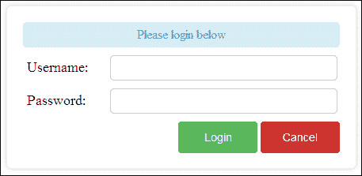
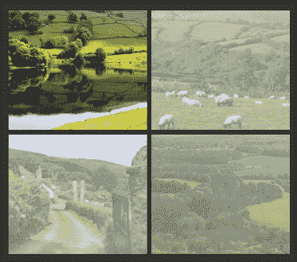

# 第七章：用户界面动画

在本章中，我们将介绍以下主题：

+   创建一个动态登录表单

+   添加照片放大功能

+   创建一个动态内容滑块

+   背景图像动画

+   创建一个动态导航菜单

# 介绍

使用 jQuery，可以通过引人注目的动画增强常见的用户界面元素。这些动画可以为任何网站或 Web 应用程序提供交互式操作，从而提升用户体验。本章将向您展示如何使用现代动画创建一些流行的用户界面，您可以在新项目或当前网站中使用这些动画。

# 创建一个动画登录表单

登录表单是许多网站和 Web 应用程序的主要入口点——第一印象至关重要。使用 jQuery 动画，我们可以创建一个在打开、关闭和出现错误时都会进行动画处理的登录表单，从而创造出通过动画加强的高品质用户体验。

此示例需要支持 PHP 的 Web 服务器。这个服务器可以托管在云中或一个简单的本地开发服务器上。在开始本示例之前，请确保您已经完成了这个设置。

## 准备工作

在与最新版本的 jQuery 库相同的目录中创建 `recipe-1.html`、`recipe-1.js` 和 `recipe.css`。因为我们正在创建一个登录表单，所以我们还需要一个 PHP 脚本来发布我们的登录数据。在 Web 服务器的 Web 根目录内创建一个名为 `index.php` 的 PHP 文件，并添加以下代码：

```js
$response = new stdClass;
$response->success = false;
$response->error = "Username and password must be provided";
if (isset($_POST['username']) && isset($_POST['password'])) {
   $username = $_POST['username'];
   $password = $_POST['password'];
   if ($username == "MyUsername" && $password == "MyPassword") {
      $response->success = true;
   } else {
      $response->error = "Incorrect login credentials";
   }
}
header("Content-type: application/json; charset=UTF-8");
echo json_encode($response);
```

在实际实现中，PHP 脚本将对用户的凭据进行验证，并与数据库记录进行比对。为了保持这个示例简单，并专注于 jQuery 代码，我们的 PHP 代码仅对用户提交的用户名和密码进行字符串比较，分别为 `MyUsername` 和 `MyPassword`。

## 操作步骤…

要创建使用上述 PHP 脚本的动画登录表单，请按照以下逐步说明操作：

1.  将以下 HTML 代码添加到 `recipe-1.html` 中，创建登录表单和打开它的按钮：

    ```js
    <!DOCTYPE html>
    <html>
    <head>
       <title>Chapter 7 :: Recipe 1</title>
       <link href="recipe-1.css" rel="stylesheet" type="text/css" />
       <script src="img/jquery.min.js"></script>
       <script src="img/recipe-1.js"></script>
    </head>
    <body>
       <button class="open-login">Open Login Box</button>
       <div class="login-frame">
          <div class="login-box">
             <div class="login-msg">Please login below</div>
             <div class="form-group">
                <label class="form-label">Username:</label>
                <input type="text" class="form-control" id="username" />
             </div>
             <div class="form-group">
                <label class="form-label">Password:</label>
                <input type="text" class="form-control" id="password" />
             </div>
             <div class="login-actions">
                <button class="btn login-btn">Login</button>
                <button class="btn close-login">Cancel</button>
             </div>
          </div>
       </div>
    </body>
    </html>
    ```

1.  将以下 CSS 代码添加到 `recipe-1.css` 中，为网页添加基本样式：

    ```js
    .login-frame {
       position: absolute;
       top: 0;
       bottom: 0;
       left: 0;
       right: 0;
       display: none;
    }
    .login-box {
       width: 400px;
       height: 165px;
       padding: 20px;
       margin: auto;
       top: -165px;
       box-shadow: 0 0 10px #CCC;
       border-radius: 5px;
       position: relative;
    }
    .form-group {
       margin-bottom: 10px;
    }
    .form-group .form-control {
       margin-left: 55px;
       width: 275px;
       height: 30px;
       padding: 0 5px 0 5px;
       font-size: 16px;
       border-radius: 5px;
       border: solid 1px #CCCCCC;
       color: #999;
    }
    .form-group .form-label {
       width: 50px;
       font-size: 18px;
       display: block;
       float: left;
       line-height: 30px;
       padding-left: 5px;
       color: #333;
    }
    .login-msg {
       border: solid 1px #bce8f1;
       text-align: center;
       line-height: 30px;
       margin-bottom: 10px;
       border-radius: 5px;
       color: rgba(58, 135, 173, 0.90);
       background-color: rgba(217, 237, 247, 0.99);
    }
    .login-msg.success {
       color: rgba(70, 136, 71, 0.96);
       background-color: rgba(223, 240, 216, 0.97);
       border-color: rgba(214, 233, 198, 0.98);
    }
    .login-msg.error {
       color: rgba(185, 74, 72, 0.98);
       background-color: rgba(242, 222, 222, 0.98);
       border-color: rgba(238, 211, 215, 0.98);
    }
    .login-actions {
       text-align: right;
    }
    .btn {
       height: 40px;
       width: 100px;
       display: inline-block;
       padding: 6px 12px;
       margin-bottom: 0;
       font-size: 14px;
       text-align: center;
       white-space: nowrap;
       vertical-align: middle;
       cursor: pointer;
       border: 1px solid transparent;
       border-radius: 4px;
    }

    .login-btn {
       color: #ffffff;
       background-color: #5cb85c;
       border-color: #4cae4c;
    }
    .login-btn:hover {
       background-color: #458a45;
    }
    .close-login {
       color: #ffffff;
       background-color: #d2322d;
       border-color: #ac2925;
    }
    .close-login:hover {
       background-color: #ac2c2c;
    }
    ```

1.  将以下 jQuery 代码添加到 `recipe-1.js` 中，以允许用户打开和使用登录表单：

    ```js
    $(function(){
       $(document).on('click', '.open-login', function(){
          $('.login-frame').fadeIn(500);
          $('.login-box').animate({'top' : '50px'}, 500);
       });
       $(document).on('click', '.close-login', function(){
          $('.login-box').animate({'top' : '-165px'}, 500);
          $('.login-frame').fadeOut(500);
       });
       $(document).on('click', '.login-btn', function(){
          var username = $('#username').val();
          var password = $('#password').val();
          $.ajax({
             url: '/index.php',
             type: 'POST',
             data: {
                'username': username,
                'password': password
             },
             success: function(response) {
                var _loginMsg = $('.login-msg');
                if (response.success) {
                   _loginMsg.addClass("success").removeClass("error");
                   _loginMsg.html("Login was successful!");
                } else {
                   _loginMsg.addClass("error").removeClass("success");
                   _loginMsg.html(response.error);
                   $('.login-box')
                   .animate({ left: -25 }, 20)
                   .animate({ left: 0 }, 60)
                   .animate({ left: 25 }, 20)
                   .animate({ left: 0 }, 60);
                }
             }
          });
       });
    });
    ```

1.  在 Web 浏览器中打开 `recipe-1.html`，单击 **打开登录框** 按钮，您将看到以下截图中显示的界面：

## 工作原理…

允许用户拥有帐户并登录到这些帐户的网站通常会在主导航的某个地方提供一个登录按钮。本教程中的 HTML 代码创建了一个非常基本的网页，只有一个按钮来表示用户可以访问登录表单的位置。HTML 代码还提供了基本的登录表单，默认情况下使用 CSS 隐藏。CSS 代码提供了登录表单的定位以及登录错误和表单按钮的样式。除了最初隐藏登录表单的 CSS 之外，它还将登录表单的顶部位置的值设置为负数，将登录表单强制移出页面。这样我们就可以创建滑入动画，将登录框带入用户的视野。

jQuery 代码的第一部分创建了一个点击事件处理程序，用于监听登录按钮的点击，如下所示：

```js
$(document).on('click', '.open-login', function(){
   $('.login-frame').fadeIn(500);
   $('.login-box').animate({'top' : '50px'}, 500);
});
```

当用户点击具有`open-login`类的按钮时，使用 jQuery 的`fadeIn()`函数来淡入隐藏的登录表单，使用`animate()`函数将登录表单移动到屏幕上，创建滑入效果。

创建了一个点击事件处理程序，用于监听点击`close-login`按钮的事件，然后触发反向动画，淡出登录框并将其移出屏幕，如下所示：

```js
$(document).on('click', '.close-login', function(){
   $('.login-box').animate({'top' : '-165px'}, 500);
   $('.login-frame').fadeOut(500);
});
```

### 注意

两个动画函数的持续时间都设置为 500 毫秒，允许淡入和位置动画同时开始和结束。

本教程的主要功能放在登录按钮的点击事件处理程序的回调函数中；如下所示：

```js
$(document).on('click', '.login-btn', function(){
   // -- HIDDEN CODE --
});
```

这个点击事件处理程序监听登录按钮的点击，获取输入数据并将其提交给我们在本教程开始时创建的 PHP 脚本。首先，从表单中收集用户名和密码，并存储在`username`和`password`变量中，如下所示：

```js
var username = $('#username').val();
var password = $('#password').val();
```

这些数据然后通过 jQuery 的内置 AJAX 功能发送到 PHP 脚本：

```js
$.ajax({
   url: 'http://localhost:8003/index.php',
   type: 'POST',
   data: {
      'username': username,
      'password': password
   },
   success: function(response) {
   // --- HIDDEN CODE
   }
});
```

上面的代码通过指定 PHP 文件的 URL 并将`type`参数设置为`POST`来创建一个 AJAX `POST`请求。还提供了一个数据对象，其中包含来自表单的信息。

为`success`参数指定了一个回调函数；这个函数在 PHP 脚本成功响应时被调用，如下所示：

```js
success: function(response) {
   var _loginMsg = $('.login-msg');
   if (response.success) {
      // -- HIDDEN CODE
   } else {                         
      // -- HIDDEN CODE
   }
```

通过创建我们的 PHP 代码，我们知道响应将包含一个成功值，要么是`true`要么是`false`。如果成功值是`false`，则会有一个错误消息与之相配。还有一种 AJAX 请求可能会失败；这是由服务器错误引起的，例如`500 文件未找到`。为了处理这些错误，应该使用 jQuery AJAX `.fail()`函数。更多信息请参阅[`api.jquery.com/jquery.ajax/`](http://api.jquery.com/jquery.ajax/)。

在成功的回调函数中，我们选择`login-msg`元素，该元素将用于在屏幕上打印任何消息。评估由 PHP 脚本提供的成功值以确定登录是否成功。

如果登录成功，`login-msg`元素将被更新，其中包含通知用户登录成功的消息，并添加`success`类以使消息元素呈绿色，如下所示：

```js
_loginMsg.addClass("success").removeClass("error");
_loginMsg.html("Login was successful!");
```

`removeClass()`函数用于确保`error`类不作为任何先前登录尝试的遗留物存在。在实际情况下，您可能希望将用户重定向到网站的会员区域。这段代码可以被替换为执行此操作；请参阅本配方的*还有更多...*部分。

如果登录尝试失败，则向`login-msg`元素添加了`error`类，并附有 PHP 脚本的消息。我们使用`response.error`来检索此数据。还使用一系列动画函数将登录框从左到右移动，以创建摇晃效果，强调错误给用户的重要性；如下所示：

```js
_loginMsg.addClass("error").removeClass("success");
_loginMsg.html(response.error);
$('.login-box')
   .animate({ left: -25 }, 20)
   .animate({ left: 0 }, 60)
   .animate({ left: 25 }, 20)
   .animate({ left: 0 }, 60);
}
```

## 还有更多...

如果需要，jQuery 回调的成功登录部分可以轻松替换为重定向用户的操作。可以使用以下代码的原生 JavaScript 代码将用户发送到所需页面，将`/memebers.php`替换为适当的 URL，如下所示：

```js
window.location.href = "/members.php";
```

## 请参阅

+   第五章，*表单处理*

# 添加照片缩放

照片缩放是一个很棒的效果，可以在许多界面中使用，以增加对照片库或产品页面的额外用户交互，使用户可以清晰地看到较小的图像。这个配方将向您展示如何将照片缩放效果添加到列表中的四张图片中。

## 准备工作

在这个配方中，你需要四张图片。确保它们的宽度不超过`800 px`，高度不超过`600 px`。一旦收集到将在这个配方中使用的四张图片，请在与这些图片和 jQuery 库相同的目录中创建`recipe-2.html`、`recipe-2.css`和`recipe-2.js`。

## 如何做...

执行以下说明以将缩放效果添加到您选择的图像中：

1.  将以下 HTML 代码添加到`recipe-2.html`中；确保更新与您选择的图像对应的图像引用：

    ```js
    <!DOCTYPE html>
    <html>
    <head>
       <title>Chapter 7 :: Recipe 2</title>
       <link href="recipe-2.css" rel="stylesheet" type="text/css" />
       <script src="img/jquery.min.js"></script>
       <script src="img/recipe-2.js"></script>
    </head>
    <body>
       <div class="container">
          <ul class="photos">
             <li></li>
             <li></li>
             <li></li>
             <li></li>
          </ul>
       </div>
    </body>
    </html>
    ```

1.  将以下 CSS 代码添加到`recipe-2.css`中以样式化和定位图像：

    ```js
    body {
       background-color: #333;
    }
    .container {
       width: 600px;
       height: 600px;
       margin: 50px auto auto auto;
    }
    .photos {
       list-style: none;
       margin: 0;
       padding: 0;
    }
    .photos li {
       display: inline-block;
       width: 290px;
       height: 250px;
       background-color: #E1E1E1;
       margin: 0 5px 5px 0;
       overflow: hidden;
       position: relative;
          cursor: pointer;
    }
    .photos li img {
       top: -50%;
       left: -50%;
       position: absolute;
       opacity: 0.5;
    }
    ```

1.  将以下 jQuery 代码添加到`recipe-2.js`中，以在用户将鼠标悬停在图像上时为图像添加照片缩放动画：

    ```js
    var images = [];
    $(function(){
       $(document).on("mouseover", ".photos li", function(){
          var _image = $(this).find('img');
          _image.finish();
          images[$(this).index()] = {
             width: _image.width(),
             height: _image.height()
          };
          _image.animate({
             width: '290px',
             height: '250px',
             top: 0,
             left: 0,
             opacity: 1.0
          });
       }).on("mouseout", ".photos li", function(){
          var _image = $(this).find('img');
          _image.finish();
          _image.animate({
             width: images[$(this).index()].width + "px",
             height: images[$(this).index()].height + "px",
             top: '-50%',
             left: '-50%',
             opacity: 0.5
          });
       });
    });
    ```

1.  在网页浏览器中打开`recipe-2.html`，将鼠标悬停在四张图像之一上，即可看到缩放动画，如下所示：

## 它是如何工作的...

本配方中的 HTML 代码非常基本，只是创建一个带有类名`container`的 division 元素，该元素在页面上使用 CSS 居中。在 frame division 内部，有一个无序列表元素，它有四个子元素，每个子元素都包含一个图像。

CSS 代码从无序列表中删除任何边距和填充，将其子项设置为内联显示，并将每个子元素的溢出属性设置为`hidden`。这样做是为了让我们最初加载比列表元素大的图像而不显示任何溢出，以提供放大的效果。

CSS 代码还将图像的顶部和左侧位置设置为`-50%`，以使它们居中在列表元素内。图像的不透明度也设置为`0.5`，以防止图像最初显眼。

在 jQuery 代码的开头，声明了一个`images`变量，用于存储稍后可以在代码中重复使用的图像数据。在 jQuery 的加载块内，将两个事件处理程序附加到文档上，以监听照片列表元素上的`mouseover`和`mouseout`事件，如下所示：

```js
$(document).on("mouseover", ".photos li", function(){
   // --  HIDDEN CODE
}).on("mouseout", ".photos li", function(){
   // -- HIDDEN CODE
});
```

在`mouseover`事件处理程序内，使用`$(this).find('img')`来查找鼠标悬停的列表元素内的图像。选定了此图像后，使用`$(this).index()`将其大小存储在`images`变量中，如下所示：

```js
images[$(this).index()] = {
   width: _image.width(),
   height: _image.height()
};
```

然后，使用 jQuery 的`animate()`函数，将图像的宽度和高度设置为与列表元素的大小相匹配，以创建缩小效果。其顶部和左侧位置也设置为`0`，覆盖了 CSS 中设置的`-50%`位置，以确保图像填满列表元素的 100%。图像的不透明度设置为`1`（即 100%），以便悬停和放大的图像在其他图像中突出显示。此代码如下所示：

```js
_image.animate({
   width: '290px',
   height: '250px',
   top: 0,
   left: 0,
   opacity: 1.0
});
```

在`mouseout`事件处理程序内，先前讨论的动画使用存储的图像信息有效地被反转，并将图像重置回鼠标悬停前的位置，执行如下：

```js
var _image = $(this).find('img');
_image.finish();
_image.animate({
   width: images[$(this).index()].width + "px",
   height: images[$(this).index()].height + "px",
   top: '-50%',
   left: '-50%',
   opacity: 0.5
});
```

在上述代码中，可以看到使用`$(this).index()`引用了`images`数组，以获取图像的原始高度和宽度。再次将其顶部和左侧位置设置为`-50%`，使其在列表元素内居中。

### 注意

在事件处理程序回调中都使用`_image.finish();`来完成任何当前动画。这可以防止用户快速切换图像时出现奇怪的结果。

## 另请参阅

+   *创建一个动画导航菜单*

# 创建一个动画内容滑块

您可能已经意识到，在线有一整片 jQuery 内容滑块插件、教程和可下载脚本的森林，其中大部分内容都可以免费使用。内容滑块非常受欢迎，因为它们是向用户展示重要内容（如图像、新闻和促销活动）的一种非常吸引人和引人注目的方式。本篇文章将向您展示如何使用 jQuery 轻松创建内容滑块。本篇食谱中使用的滑块将允许您使用 CSS 轻松自定义其外观和感觉，以使其符合您自己的需求。

## 准备工作

在与您的 jQuery 库相同的目录中创建通常的配方文件：`recipe-3.html`、`recipe-3.css` 和 `recipe-3.js`。

## 如何操作...

执行以下逐步说明以创建引人入胜的内容滑块：

1.  将以下 HTML 代码添加到 `recipe-3.html`，其中包括基本网页和内容滑块的结构：

    ```js
    <!DOCTYPE html>
    <html>
    <head>
       <title>Chapter 7 :: Recipe 3</title>
       <link href="recipe-3.css" rel="stylesheet" type="text/css" />
       <script src="img/jquery.min.js"></script>
       <script src="img/recipe-3.js"></script>
    </head>
    <body>
       <div class="slider-frame">
          <ul class="slider-content">
             <li>
                <h1>Section 1</h1>
                <p>Some content for section one.</p>
             </li>
             <li>
                <h1>Section 2</h1>
                <p>Some content for section two.</p>
             </li>
             <li>
                <h1>Section 3</h1>
                <p>Some content for section three.</p>
             </li>
             <li>
                <h1>Section 4</h1>
                <p>Some content for section four.</p>
             </li>
          </ul>
          <ul class="slider-nav"></ul>
       </div>
    </body>
    </html>
    ```

1.  在 `recipe-3.css` 中添加以下 CSS 代码以添加基本样式并定位内容滑块：

    ```js
    .slider-frame {
       width: 600px;
       height: 250px;
       margin: 50px auto auto auto;
       overflow: hidden;
       position: relative;
    }
    .slider-content {
       margin: 0;
       padding: 0;
       list-style: none;
       position: relative;
    }
    .slider-content li {
       float: left;
       width: 600px;
       height: 250px;
       background-color: #E1E1E1;
    }
    .slider-content li h1 {
       margin: 10px;
    }
    .slider-content li p {
       margin: 10px;
    }
    .slider-nav {
       list-style: none;
       padding: 0;
       margin: 0;
       height: 35px;
       position: absolute;
       bottom: 0;
       left: 0;
       right: 0;
       text-align: center;
    }
    .slider-nav li {
       display: inline-block;
       margin-right: 5px;
    }
    .slider-nav li a {
       display: block;
       color: #FFF;
       text-decoration: none;
       border-radius: 30px;
       background-color: #333;
       width: 25px;
       height: 25px;
       text-align: center;
       line-height: 25px;
    }
    .slider-nav li a:hover {
       background-color: #000;
    }
    .slider-nav li a.active {
       background-color: #FFF;
       color: #333;
    }
    ```

1.  在 `recipe-3.js` 中添加以下 jQuery 代码，以允许用户在内容幻灯片之间切换：

    ```js
    $(function(){
       var _sliderContent = $('.slider-content li');
       for (var i = 0; i < _sliderContent.length; i++) {
          $('.slider-nav').append("<li><a href='#" + i + "' " + ((i == 0) ? "class='active'" : "") + ">" + (i + 1) + "</a></li>");    
       }
       $('.slider-content').width((600 * _sliderContent.length) + "px");
       $(document).on("click", ".slider-nav li a", function(){
          var index = this.hash.replace("#", "");
          $(".slider-nav li a").removeClass("active");
          $(this).addClass("active");
          $('.slider-content').animate({
             left: -(index * 600) + "px"
          });
       });
    });
    ```

## 工作原理...

滑块内容是一个无序列表，其子元素包含要在每个幻灯片中显示的内容。在内容列表下面是另一个无序列表元素，jQuery 将动态填充该元素，以创建每个幻灯片之间的导航。

此配方中的 CSS 代码用于定位滑块框架并设置其静态宽度和高度。将滑块框架的溢出值设置为 `hidden`，以便一次只能看到一个幻灯片。将滑块内容列表项元素设置为 `float left`，以便以行内方式显示它们，从而可以使用 jQuery 动画将它们移入视图中。

jQuery 代码的第一部分选择所有滑块内容子元素并将它们存储在一个局部变量中。对于每个滑块内容列表元素，都会创建一个导航列表项并将其附加到 `slider-nav` 无序列表中，该列表项链接到滑块内容的索引，如下代码所示；还将 `active` 类添加到第一个导航锚点：

```js
var _sliderContent = $('.slider-content li');
for (var i = 0; i < _sliderContent.length; i++) {
   $('.slider-nav').append("<li><a href='#" + i + "' " + ((i == 0) ? "class='active'" : "") + ">" + (i + 1) + "</a></li>");
}
```

为了使滑块内容项能够与彼此一起浮动，需要使 `slider-content` 无序列表元素足够宽。由于 CSS 代码无法知道滑块有多少个幻灯片，因此使用 jQuery 计算内容项的数量，然后将此值乘以滑块的宽度，使用 jQuery `width()` 函数将此结果应用于 `slider-content` 元素，如下所示：

```js
$('.slider-content').width((600 * _sliderContent.length) + "px");
```

执行上述代码将确保 `slider-content` 无序列表元素的宽度足够，以允许每个列表元素的行内定位。

jQuery 代码的最后部分将点击事件处理程序附加到文档，以便监听滑块导航上的点击。当用户点击导航元素之一时，将调用此处理程序的回调函数如下所示：

```js
$(document).on("click", ".slider-nav li a", function(){
   var index = this.hash.replace("#", "");
   $(".slider-nav li a").removeClass("active");
   $(this).addClass("active");
   $('.slider-content').animate({
      left: -(index * 600) + "px"
   });
});
```

在回调函数中，使用 `var index = this.hash.replace("#", "");` 检索点击链接的哈希值，这将导致幻灯片的索引整数。利用这个值，可以使用 jQuery 的 `animate()` 函数在 `slider-content` 无序列表元素上设置负左位置；这将使幻灯片内容动画显示所选幻灯片。`removeClass()` 函数用于从导航列表中的所有锚元素中移除 `active` 类。然后，使用 `addClass` 将 `active` 类添加到点击的元素上。这将向用户指示已选择导航中的哪个幻灯片，因为它会比其他导航项的颜色浅。

## 还有更多…

许多流行的 jQuery 内容滑块都有一个 `auto` 模式，其中每个内容幻灯片都会自动循环，无需任何用户交互。可以通过在示例中添加更多的 jQuery 代码轻松实现这一点。如果想要此功能，请将以下 jQuery 代码添加到 `recipe-3.js` 的 `$(function(){});` 块的底部：

```js
var count = 0;
setInterval(function(){
   if (count >= _sliderContent.length) count = 0;
   $('.slider-content').animate({
      left: -(count * 600) + "px"
   });
   $(".slider-nav li a").removeClass("active");
   $(".slider-nav li").find("a[href='#" + count + "']").addClass("active");
   count++;
}, 3000);
```

使用原生 JavaScript 函数 `setInterval()`，可以连续执行指定间隔的函数。在上述示例中，指定的函数将在每 3000 毫秒后执行。

在上述代码中，声明了一个 `count` 变量来跟踪当前幻灯片。在提供给 `setInterval` 的函数内部，如果已达到可用幻灯片的最大数量，则将 `count` 值设置为 `0`。然后，jQuery 动画函数与单击事件处理程序的方式相同，用于将下一个内容幻灯片动画显示出来。再次使用 `$(".slider-nav li a").removeClass("active");` 从所有导航锚点中移除 `active` 类，然后使用 `$(".slider-nav li").find("a[href='#" + count + "']").addClass("active");` 仅将类添加到链接到下一个内容幻灯片的元素上。最后，增加计数，以便下一次迭代将下一个内容幻灯片动画显示出来。

还值得一提的是，每次调用 jQuery 的 `append()` 函数时，DOM 都会重新绘制。如果使用 `append()` 函数添加了许多项目，例如在这个示例中，这可能会导致应用程序变慢。避免这种情况的一种简单方法是通过创建要添加的所有列表元素的字符串，并在循环后包含单个 `append()` 函数。

## 另见

+   *动画背景图*

# 动画背景图

全屏图像背景可以为任何网站提供非常吸引人的闪屏。本示例将向您展示如何使用 jQuery 动态更改网站的背景图像。

## 准备工作

在与 jQuery 库相同的目录中创建 `recipe-4.html`、`recipe-4.css` 和 `recipe-4.js`。对于此示例，您还需要一组将用作背景图像的图像。找到三到四个大图像（最大尺寸为 1280 x 1024 像素），并将它们保存在您刚刚创建的三个文件相同的目录中。

## 实施方法如下：

打开并准备编辑刚刚创建的三个文件。

1.  将以下 HTML 代码添加到 `recipe-4.html` 中，以创建基本的网页和用于容纳背景图像和文本的元素：

    ```js
    <!DOCTYPE html>
    <html>
    <head>
       <title>Chapter 7 :: Recipe 4</title>
       <link href="recipe-4.css" rel="stylesheet" type="text/css" />
       <script src="img/jquery.min.js"></script>
       <script src="img/recipe-4.js"></script>
    </head>
    <body>
       <div class="background"></div>
       <div class="text-frame">
          <div class="text-inner">
             <h1>BACKGROUND IMAGE ANIMATION</h1>
             <p>This recipe shows you how to alternate the background image of an element using jQuery animations.</p>
          </div>
       </div>
    </body>
    </html>
    ```

1.  将以下 CSS 代码添加到 `recipe-4.css` 中，将基本样式应用于新创建的网页；确保更新图像引用以与您选择的图像之一相对应：

    ```js
    body {
       background-color: #333;
    }
    .background {
       background: url(recipe-4-1.jpg)  no-repeat center center fixed;
       -webkit-background-size: cover;
       -moz-background-size: cover;
       -o-background-size: cover;
       background-size: cover;
       position: absolute;
       top: 0;
       bottom: 0;
       left: 0;
       right: 0;
    }
    .text-frame {
       position: absolute;
       top: 0;
       bottom: 0;
       left: 0;
       right: 0;
    }
    .text-inner {
       width: 600px;
       margin: 15% auto auto auto;
       background-color: rgba(0, 0, 0, 0.78);
       padding: 20px;
       color: #E1E1E1;
       border-radius: 5px;
    }
    .text-inner h1 {
       margin: 0;
       padding: 0;
    }
    .text-inner p {
       font-size: 22px;
       line-height: 30px;
       margin: 5px 0 5px 0;
       color: #CCC;
    }
    ```

1.  将以下 jQuery 代码添加到 `recipe-4.js` 中，以激活刚刚添加到 `recipe-4.html` 的 `background` 分割元素中的背景动画：

    ```js
    var _images = ['recipe-4-1.jpg', 'recipe-4-2.jpg', 'recipe-4-3.jpg'];
    var index = 1;
    $(function(){
       setInterval(function(){
          if (index >= _images.length) index = 0;
          $('.background').animate({
             opacity: 0
          }, 1500, function(){
             $(this).css({
                'background-image': "url('" + _images[index] + "')"
             }).animate({
                opacity: 1
             }, 1500);
             index++;
          });
       }, 6000);
    });
    ```

1.  在 `recipe-4.js` 开头的 _`images` 数组中更新文件名，使其与您为此示例选择的图像文件名匹配。

## 工作原理如下：

这个示例创建的基本网页主要分为两个部分。首先是一个具有 `background` 类的分割元素，它被制作成填满整个屏幕，并使用所选的图像作为背景。其次，有一个 `text-frame` 分割元素，简单地将一些文本浮动在屏幕中央。

`recipe-4.css` 中的 CSS 代码将背景元素的位置设置为 `absolute`，并将其左、右、底部和顶部位置设置为 `0`，强制其填满整个屏幕。然后使用以下代码设置其背景属性：

```js
background: url(recipe-4-1.jpg)  no-repeat center center fixed;
-webkit-background-size: cover;
-moz-background-size: cover;
-o-background-size: cover;
background-size: cover;
```

背景选项将其中一个所选图像设置为其初始背景，并确保其居中和固定。使用 `background-size` 属性确保背景图像始终填满 `background` 分割元素的 100%。

使用类似的 CSS 确保 `text-frame` 元素填满屏幕，并使用百分比和自动边距，使包含文本的 `text-inner` 元素在垂直和水平方向上居中。

`recipe-4.js` 开头的 `_images` 数组保存了对所选背景图像的引用。`index` 变量用于跟踪当前显示的背景图像。在 jQuery 加载函数内部，声明 `setInterval` 来执行一组动画，以在六秒钟内更改背景图像。这类似于上一个示例的 *There's more...* 部分。

因为 jQuery 的`animate()`函数不支持直接对背景图像进行动画处理，所以我们必须提供一个变通方法。在`setInterval()`函数中，将`animate()`函数用于背景元素的不透明度，以将元素淡出。然后，通过为 jQuery 的`animate()`函数指定回调，一旦动画完成，就使用 jQuery 的`css()`函数修改背景元素的`background-image`属性。使用`css()`，更改背景图像，然后再次使用`animate()`函数将不透明度更改回`1`，以淡入元素。通过引用`_images`数组的索引值，可以在`setInterval()`函数的每次迭代中选择不同的背景图像，如下所示：

```js
$(this).css({
   'background-image': "url('" + _images[index] + "')"
}).animate({
   opacity: 1
}, 1500);
index++;
```

一旦最后一个动画完成，索引值将增加一，以确保下一次迭代显示不同的图像。

## 另请参阅

+   *创建一个动画内容滑块*

# 创建动画导航菜单

您的网站导航允许访问者轻松找到托管在您网站上的内容。为用户提供一个既有趣又交互式的导航菜单，并且易于使用，可以给他们留下深刻的印象。本秘诀向您展示了如何创建一个现代动画导航菜单。

## 准备工作

在与最新版本的 jQuery 库相同的目录中创建`recipe-5.html`、`recipe-5.css`和`recipe-5.js`。

## 操作方法…

执行以下所有步骤，为任何站点创建一个独特和现代的动画导航菜单：

1.  在`recipe-5.html`中添加以下 HTML，以创建基本网页，并包括新创建的文件以及 jQuery 库：

    ```js
    <!DOCTYPE html>
    <html>
    <head>
       <title>Chapter 7 :: Recipe 5</title>
       <link href="recipe-5.css" rel="stylesheet" type="text/css" />
       <script src="img/jquery.min.js"></script>
       <script src="img/recipe-5.js"></script>
    </head>
    <body>
    </body>
    </html>
    ```

1.  在`recipe-5.html`中身体标签的 HTML 代码中，添加以下代码来创建导航菜单的结构：

    ```js
    <div class="container">
       <ul class="navigation">
          <li>
             <a href="#" class="link-base">
                <div class="link-content">
                   <div class="nav-item">HOME</div>
                   <div class="nav-item hover">HOME</div>
                </div>
             </a>
          </li>
          <li>
             <a href="#" class="link-base">
                <div class="link-content">
                   <div class="nav-item">ABOUT <div class="down-arrow"></div></div>
                   <div class="nav-item hover">ABOUT <div class="down-arrow"></div></div>
                </div>
             </a>
             <ul class="sub-nav">
                <li>
                   <a href="#">
                      <div class="sub-link-content">
                         <div class="sub-nav-item">SECTION 1</div>
                         <div class="sub-nav-item hover">SECTION 1</div>
                        </div>
                     </a>
                  </li>
               <li>
                   <a href="#">
                      <div class="sub-link-content">
                         <div class="sub-nav-item">SECTION 2</div>
                         <div class="sub-nav-item hover">SECTION 2</div>
                      </div>
                   </a>
                </li>
                <li>
                   <a href="#">
                      <div class="sub-link-content">
                         <div class="sub-nav-item">SECTION 3</div>
                         <div class="sub-nav-item hover">SECTION 3</div>
                      </div>
                   </a>
                </li>
             </ul></li>
          <li>
             <a href="#" class="link-base">
                <div class="link-content">
                   <div class="nav-item">CONTACT</div>
                   <div class="nav-item hover">CONTACT</div>
                </div>
             </a>
          </li>
       </ul>
    </div>
    ```

1.  添加以下 CSS 代码到`recipe-5.css`，为导航菜单和网页提供基本样式：

    ```js
    .container {
       width: 800px;
       margin: 100px auto auto auto;
    }
    .navigation {
       margin: 0;
       padding: 0;
       list-style: none;
       background-color: #333;
       height: 50px;
    }
    .navigation li {
       float: left;
       position: relative;
    }
    .navigation li a {
       display: block;
       text-align: center;
       color: #FFF;
       text-decoration: none;
       overflow: hidden;
       height: 50px;
    }
    .navigation li a .nav-item {
       line-height: 50px;
       padding: 0 15px 0 15px;
       height: 50px;
    }
    .navigation li a .nav-item.hover {
       background-color: #ff3600;
    }
    .sub-nav {
       list-style: none;
       margin: 0;
       padding: 50px 0 0 0;
       opacity: 0;
       position: absolute;
       top: 0;
       left: -10000px;
       opacity: 0;
    }
    .sub-nav li {
       display: block;
       height: 40px;
    }
    .sub-nav li a {
       display: block;
       width: 120px;
       height: 40px;
       line-height: 40px;
       text-align: center;
       color: #FFF;
       background-color: #333333;
    }
    .sub-nav li a .sub-link-content {
       width: 240px;
    }
    .sub-nav li a .sub-nav-item {
       float: left;
       width: 120px;
    }
    .sub-nav li a .sub-nav-item.hover {
       background-color: #ff3600;
    }
    .down-arrow {
       width: 0;
       border-left: 7px solid transparent;
       border-right: 7px solid transparent;
       border-top: 7px solid white;
       display: inline-block;
       vertical-align: middle;
       margin: -5px 0 0 5px;
    }
    ```

1.  要根据用户交互将动画添加到导航菜单，将以下 jQuery 代码添加到`recipe-5.js`中：

    ```js
    $(function(){
       //Base navigation
       $(document).on("mouseenter", "ul.navigation li a.link-base", function(){
          $(this).find(".link-content").stop().animate({
             marginTop: -50
          }, 200, function(){
             $(this).parent().parent().find('.sub-nav').css({
               left: 0
            }).animate({
               opacity: 1
            });
          });
       }).on("mouseleave", "ul.navigation li a", function(){
          //Only reverse the animation if this link doesn't have a sub menu
          if ($(this).parent().find('.sub-nav').length == 0) {
             $(this).find(".link-content").stop().animate({
                marginTop: 0
            }, 200);
          }
       }).on("mouseleave", "ul.navigation li .sub-nav", function(){
          $(this).animate({
             opacity: 0
          }, 200, function(){
             $(this).css({
                left: -10000
           });
             //When the mouse leaves the sub menu, also reverse the base link animation
             $(this).parent().find('.link-content').stop().animate({
                marginTop: 0
             }, 200);
          });
       }).on("mouseenter", "ul.sub-nav li a", function(){
          $(this).find(".sub-link-content").stop().animate({
             marginLeft: -120
          }, 200);
       }).on("mouseleave", "ul.navigation li a", function(){
          $(this).find(".sub-link-content").stop().animate({
             marginLeft: 0
          }, 200);
       });
    });
    ```

1.  在 Web 浏览器中打开`recipe-5.html`，您将看到一个简单的导航菜单。在**关于**项目上悬停将会启动动画，并向您呈现相关的子菜单，如下面的屏幕截图所示：

## 运行原理…

当我们逐步分解时，本秘诀的代码将很容易理解。用于创建导航菜单的 HTML 代码具有一个带有 class `frame`的分区元素，它作为菜单容器来控制宽度和位置。

菜单本身由带有导航类的无序列表元素组成。在这个列表中，有多个作为菜单页面链接的锚的一级列表元素。

每个这些一级链接都有一个包含两个`nav-item`分区元素的`link-content`容器元素。使用 CSS 将其中两个`nav-item`元素进行不同的样式设置，可以使我们创建下拉动画，因为我们一次只显示其中一个。

`about`一级导航项也有一个子菜单。为了实现这一点，列表项包含另一个具有`sub-nav`类的无序列表。使用 CSS，当子菜单可见时，将此子导航元素放置在原始的一级页面链接上，以便鼠标指针不会离开该区域。这样，我们可以保持原始链接处于悬停状态，并且子菜单保持打开状态，直到用户的鼠标完全离开子菜单。

子菜单页面链接的结构与它们包含两个相同文本的一级链接相同。这样做是为了让我们能够创建类似的悬停动画。

在`recipe-5.js`中，第一部分将`mouseenter`事件处理程序附加到文档上，以查找鼠标指针是否进入导航的一级链接之一，如下所示：

```js
$(document).on("mouseenter", "ul.navigation li a.link-base", function(){
   $(this).find(".link-content").stop().animate({
      marginTop: -50
   }, 200, function(){
      $(this).parent().parent().find('.sub-nav').css({
      left: 0
   }).animate({
      opacity: 1
      });
   });
})
```

当发生这种情况时，将在链接的`link-content`子元素上使用`animate()`函数，将其顶部边距设置为`-50`。这将使第二个`nav-item`类移入具有 CSS 橙色背景的视图中。在 200 毫秒后，动画完成时，将调用额外的回调函数。

这将执行代码以打开当前悬停项目包含的任何子菜单。首先使用`css()`函数将子菜单的左侧位置设置为`0`，将其带到屏幕上，然后使用`animate()`函数将元素的不透明度设置为`1`，将图像淡入视图中。子菜单元素最初使用左侧位置`-10000`放置在屏幕外，以便它们不会妨碍用户可能在页面上执行的任何点击操作。

第二个事件处理程序是针对`mouseleave`事件的。此事件处理程序检查最近设置为`left`的顶级链接是否具有子菜单，使用`if($(this).parent().find('.sub-nav').length == 0)`。如果没有，悬停动画将被恢复，将`link-content`元素的顶部边距设为`0`。这样，我们可以在用户浏览子菜单时保持悬停状态处于活动状态。

下一个事件处理程序是另一个`mouseleave`事件处理程序，它处理用户离开子菜单，如下所示：

```js
.on("mouseleave", "ul.navigation li .sub-nav", function(){
   $(this).animate({
      opacity: 0
   }, 200, function(){
      $(this).css({
      left: -10000
   });
   //When the mouse leaves the sub menu, also reverse the base link animation
   $(this).parent().find('.link-content').stop().animate({
      marginTop: 0
      }, 200);
   });
})
```

一旦用户的鼠标离开了子菜单，就会使用`animate()`函数将子菜单的不透明度设为`0`，使其淡出。然后，在完成了 200 毫秒的动画后，使用`css()`函数将子菜单移到屏幕外-10000 像素的位置。最后，使用`find()`来选择第一级`link-content`元素，将原始的悬停动画恢复，将菜单放回休眠状态。

文档附加了两个额外的事件处理程序。额外的`mouseenter`和`mouseleave`事件用于为子菜单项创建悬停动画。与一级导航菜单相同的代码和技术被使用，只是改变了左边距而不是顶边距，以使`sub-link-content`元素从左到右进行动画，而不是从上到下。

## 亦参见

+   *创建一个动态内容滑块*

+   *动画背景图片*
