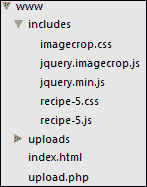
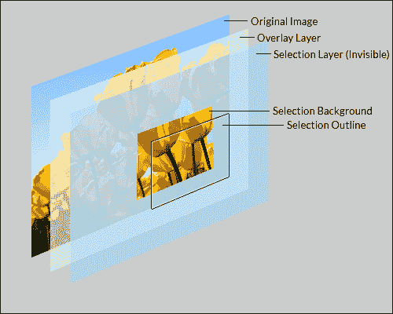

# 第八章：理解插件开发

在本章中，我们将涵盖以下主题：

+   创建一个插件模板

+   创建一个工具提示插件

+   构建内容和图像滑块插件

+   创建一个 RSS 订阅阅读器插件

+   从头开始编写一个图像裁剪插件

# 介绍

jQuery 插件允许开发人员编写可在任何 jQuery 项目中快速重用的可移植代码。作为本书的一部分，我们已经创建了许多功能，您可能希望在多个项目中使用。通过创建具有所需功能的 jQuery 插件，您可以抽象出这些功能的复杂性，并使其简单地包含在您需要的任何地方。

在开始本章之前，请创建一个名为`chapter8`的易于访问的目录。在此文件夹中，添加最新版本的 jQuery 库，该库将在本章中使用。

# 创建一个插件模板

多年来，创建 jQuery 插件已经变得非常流行，有许多关于插件创建最佳实践的文章和在线讨论。这些文章中的许多都深入讨论了如何创建一个插件模板，该模板可用作任何 jQuery 插件的起点。本配方将向您展示如何创建自己的 jQuery 插件模板，该模板将在本章中使用。

## 准备就绪

在前面创建的`chapter8`文件夹内，创建一个名为`jquery.plugin-template.js`的 JavaScript 文件。

## 如何做…

要创建一个基本的插件模板，该模板将成为本章中使用的所有插件的基础，请将以下代码添加到`jquery.plugin-template.js`中：

```js
;(function ($) {

    var name = 'pluginName';
    Plugin.prototype = {
        defaults: {

        }
    };

    // The actual plugin constructor
    function Plugin(element, options) {
        var $scope = this;
        $scope.$element = $(element);
        $scope.element = element;
        $scope.options = $.extend({}, this.defaults, options);
        $scope.init = function () {

        }
    }

    $.fn[name] = function (options) {
        return this.each(function () {
            new Plugin(this, options).init();
        });
    }
})(jQuery);
```

## 它是如何工作的…

在 jQuery 网站上阅读插件文档([`learn.jquery.com/plugins/basic-plugin-creation/`](http://learn.jquery.com/plugins/basic-plugin-creation/)) ，以查看一组指南和最佳实践。

在本配方中创建的插件使用简单的概念和最佳实践来创建一个轻量级的插件模板。 Addy Osmani 撰写了一篇很受欢迎的文章([`coding.smashingmagazine.com/2011/10/11/essential-jquery-plugin-patterns/`](http://coding.smashingmagazine.com/2011/10/11/essential-jquery-plugin-patterns/)) ，其中提供了关于插件编写的深入见解，同时遵循这些推荐的最佳实践。

看看我们的插件模板，首先要注意的是文档开头的分号。这是为了确保任何之前包含的插件或脚本都已正确关闭。

为了符合 jQuery 的作者建议，整个插件被包裹在一个**立即调用的函数表达式**（**IIFE**）中，以为插件提供范围。jQuery 作为本地变量`$`提供给 IIFE，以允许开发人员以通常的方式引用 jQuery 库而不会发生冲突。

在插件构造函数中，声明了一个`$scope`变量，以便清楚地表示插件的范围。然后将插件正在初始化的元素分配给插件的范围，以及任何提供的插件选项。使用 jQuery 的`extend()`函数将`defaults`对象与`options`对象合并，覆盖可能在`options`中提供的任何默认值。最后，将`init()`函数添加到插件的范围，这是您将放置插件初始化代码的地方，如下所示：

```js
$.fn[name] = function (options) {
   return this.each(function () {
      new Plugin(this, options).init();
   });
}
```

上述代码使得插件可用，就像任何其他使用指定插件名称（`($('.element').pluginName();`）的 jQuery 对象方法一样。使用`this.each()`，它将为插件初始化的每个元素创建一个新的插件实例，并调用插件的`init()`函数。

# 创建一个提示框插件

提示框是向用户展示关于他们正在使用的 UI 的其他信息的一种流行方式。本步骤将向您展示如何创建自己的基本提示框插件，您可以在所有项目中轻松使用。

## 准备工作

复制`jquery.plugin-template.js`文件，并创建`jquery.tooltip.js`，它将成为此步骤的插件文件。在与插件文件和 jQuery 库相同的目录中创建`recipe-2.html`和`recipe-2.js`。

## 如何做…

要创建一个简单的提示框插件和示例网页，请执行以下步骤：

1.  在`recipe-2.html`中添加以下 HTML 代码，创建一个非常简单的网页，网页中的元素可以有一个提示框。

    ```js
    <!DOCTYPE html>
    <html>
    <head>
        <title>Chapter 8 :: Recipe 2</title>
        <script src="img/jquery.min.js"></script>
        <script src="img/jquery.tooltip.js"></script>
        <script src="img/recipe-2.js"></script>
    </head>
    <body>
    <p><input type="text" class="hasTooltip" data-title="This is a tooltip on an input box" /></p>
    <p><a href="http://www.google.com/" target="_blank" class="hasTooltip" title="External link to http://www.google.com/">Google.com</a></p>
    <button class="hasTooltip" data-title="A button with a tooltip">Button</button>
    </body>
    </html>
    ```

1.  在`jquery.tooltip.js`的顶部，更新`name`变量，并将插件默认设置更改如下：

    ```js
    var name = 'tooltip';
    Plugin.prototype = {
    defaults: {
                'height': 30,
                'fadeInDelay': 200
    }
    };
    ```

1.  使用以下代码更新`$scope.init()`函数：

    ```js
    $scope.init = function() {
    $scope._text = (typeof $scope.$element.data('title') != "undefined") ? $scope.$element.data('title') : $scope.$element.prop("title");
                //Only display the tooltip if a title has been specified
                if (typeof $scope._text != "undefined") {
                    var $html = $("<div class='tooltip-frame'>"
                        +   "<div class='tooltip-arrow'></div>"
                        +   "<div class='tooltip-text'>" + $scope._text + "</div>"
                        + "</div>");

                    $html.css({
                        'position': 'absolute',
                        'text-align': 'center',
                        'height': $scope.options.height,
                        'line-height': $scope.options.height + "px",
                        'left': $scope.$element.offset().left + $scope.$element.outerWidth() + 15,
                        'top': $scope.$element.offset().top + ($scope.$element.outerHeight() / 2) - ($scope.options.height / 2),
                        'background-color': 'rgba(0, 0, 0, 0.81)',
                        'color': '#FFF',
                        'padding': '0 10px 0 10px',
                        'border-radius': '5px',
                        'opact': 'none'
                    }).find('.tooltip-arrow').css({
                            'width': 0,
                            'height': 0,
                            'border-top': '10px solid transparent',
                            'border-bottom': '10px solid transparent',
                            'border-right': '10px solid rgba(0, 0, 0, 0.81)',
                            'position': 'absolute',
                            'left': '-10px',
                            'top': (($scope.options.height / 2) - 10)
                        });

                    $scope.$element.on("mouseover", function(){
                        $html.fadeIn($scope.options.fadeInDelay);
                        $scope.$element.after($html);
                    }).on("mouseout", function(){
                        $html.remove();
                    });
                }
            }
    ```

1.  将以下 jQuery 代码添加到`recipe-2.js`中，为所有具有`hasTooltip`类的 HTML 元素初始化提示框插件：

    ```js
    $(function(){
        $('.hasTooltip').tooltip();
    });
    ```

1.  在 Web 浏览器中打开`recipe-2.html`，将鼠标悬停在屏幕上的一个元素上，以查看提示框出现。

## 它是如何工作的…

作为此步骤的一部分创建的 HTML 页面仅用于提供可以附加提示框的一些元素。

对插件模板的第一个更改是设置默认设置。在这种情况下，我们设置了提示框的高度和淡入动画持续时间。您可以通过将这些功能添加到此处的默认设置中，引入自己的其他功能。

当为每个选定的元素初始化插件时，将调用`init()`函数，该函数包含此插件的大部分逻辑。

插件模板使得元素的“jQueryfied”版本通过`$scope.$element`可用。我们可以使用`prop()`和`data()`函数来检查元素上是否指定了标题，并将其存储在`$scope._text`中，这将被用作提示框的文本。

然后将检查此变量，以确保有可用的文本来显示。如果没有文本，我们将不显示提示框。

如果 `$scope._text` 被定义，我们使用以下代码创建工具提示 HTML：

```js
var $html = $("<div class='tooltip-frame'>"
       +   "<div class='tooltip-arrow'></div>"
       +   "<div class='tooltip-text'>" + $scope._text + "</div>"
       + "</div>");
```

`var` 语句很重要，以确保为每个选定的元素创建一个新的工具提示元素。通过将 HTML 代码包装在 `$()` 内，我们可以在将其插入到 DOM 中之前在此元素上使用 jQuery 函数。工具提示的 HTML 代码添加了标题文本并创建了一个将显示左箭头的元素。

使用 jQuery 的 `css()` 函数，一系列 CSS 样式被应用于新创建的 HTML 代码，以定位和样式化工具提示。工具提示的左侧和顶部位置是使用将显示工具提示的选定元素的偏移量、宽度和高度来计算的。请注意，使用 `outerWidth()` 和 `outerHeight()` 函数而不是 `width()`/`height()` 函数，以包含填充和边框并返回尺寸。

jQuery 的 `find()` 函数也与 `css()` 函数一起使用，用于向左箭头添加样式。

最后，两个事件侦听器被附加到选定的元素上，以便当用户的鼠标移动到元素上时显示工具提示，并在用户的鼠标移出时移除工具提示。`fadeIn()` 函数从 `defaults` 对象中取得 `duration` 参数，当初始化工具提示插件时可以被覆盖。

要为所有具有 `hasTooltip` 类的元素初始化工具提示插件，将以下 jQuery 代码添加到 `recipe-2.js`：

```js
$(function(){
    $('.hasTooltip').tooltip();
});
```

在这里，你可以覆盖默认设置，例如，使用以下代码：

```js
$(function(){
    $('.hasTooltip').tooltip({
       'height': 50,
          'fadeInDelay': 500              
    });
});
```

## 这还不是全部...

这个配方提供了一个非常基本的工具提示插件。你可以在此基础上扩展很多额外的功能，比如定位，并允许插件用户指定工具提示在哪个事件上打开。

# 构建内容和图片滑块插件

在第七章中，*用户界面动画*，你看到了如何使用 jQuery 创建一个简单的内容滑块。本配方将向你展示如何将该配方转换为一个可重用的 jQuery 插件，还可以向滑块添加图片。你不需要阅读前一个配方来完成这个，但建议你这样做，以便更好地理解代码的工作原理。

## 准备工作

复制 `jquery.plugin-template.js` 文件并将其重命名为 `jquery.slider.js`，它将成为此配方的插件。你还需要找到一张宽度为 600 像素、高度为 250 像素的图片，将其用于滑块。最后，在 `jquery.slider.js` 文件和 jQuery 库相同目录下创建 `recipe-3.html`、`slider.css` 和 `recipe-3.js`。

## 如何做...

执行以下步骤来创建您的图片和内容滑块插件：

1.  将以下 HTML 添加到 `recipe-3.html`：

    ```js
    <!DOCTYPE html>
    <html>
    <head>
        <title>Chapter 8 :: Recipe 3</title>
        <link href="slider.css" rel="stylesheet" type="text/css" />
        <script src="img/jquery.min.js"></script>
        <script src="img/jquery.slider.js"></script>
        <script src="img/recipe-3.js"></script>
    </head>
    <body>
    <div class="mySlider">
        <div>Slider Content 1</div>
        
        <div>Slider Content 3</div>
        <div>Slider Content 4</div>
    </div>
    </body>
    </html>
    ```

1.  在 `jquery.slider.js` 的顶部，将插件名称更新为 `slider`，并将默认设置如下：

    ```js
    var name = 'slider';
    Plugin.prototype = {
       defaults: {
          width: 600,
          height: 250
    }
    };
    ```

1.  更新插件的 `$scope.init()` 函数如下所示：

    ```js
    $scope.init = function () {
    $scope.$element.addClass("slider-frame").css({
       width: $scope.options.width,
       height: $scope.options.height
    });
    $scope.$element.append('<ul class="slider-nav"></ul>');
    var _sliderItems = $scope.$element.find('div, img');
    _sliderItems.wrapAll("<div class='slider-content'></div>");
    $scope.$element.find('.slider-content').css({
       width: $scope.options.width * _sliderItems.length,
       position: 'relative'
    });
    _sliderItems.css({
       float: 'left',
       width: $scope.options.width,
       height: $scope.options.height
    });
    var _sliderNav = $scope.$element.find('.slider-nav');
    for (var i = 0; i < _sliderItems.length; i++) {
       _sliderNav.append("<li><a href='#" + i + "' " + ((i == 0) ? "class='active'" : "") + ">" + (i + 1) + "</a></li>");
    }
    _sliderNav.on("click", "li a", function(){
       var index = this.hash.replace("#", "");
       _sliderNav.find('li a').removeClass("active");
       $(this).addClass("active");
       $scope.$element.find('.slider-content').animate({
          left: -(index * $scope.options.width) + "px"
       });
    });
    }
    ```

1.  将以下 jQuery 代码添加到 `recipe-3.js` 中以初始化滑块插件：

    ```js
    $(function(){
        $('.mySlider').slider();
    });
    ```

1.  将以下 CSS 代码添加到 `slider.css` 中：

    ```js
    .slider-frame {
        overflow: hidden;
        position: relative;
        margin: auto;
        border: solid 1px #CCC;
    }
    .slider-nav {
        list-style: none;
        padding: 0;
        margin: 0;
        height: 35px;
        position: absolute;
        bottom: 0;
        left: 0;
        right: 0;
        text-align: center;
    }
    .slider-nav li {
        display: inline-block;
        margin-right: 5px;
    }
    .slider-nav li a {
        display: block;
        color: #FFF;
        text-decoration: none;
        border-radius: 30px;
        background-color: #333;
        width: 25px;
        height: 25px;
        text-align: center;
        line-height: 25px;
    }
    .slider-nav li a:hover {
        background-color: #000;
    }
    .slider-nav li a.active {
        background-color: #FFF;
        color: #333;
    }
    ```

1.  在 Web 浏览器中打开 `recipe-3.html`，您将看到一个动态创建的图像和内容滑块。

## 工作原理…

HTML 页面设置了滑块插件所需的 HTML。有一个包含子项的容器分区，滑块插件将使用这些子项作为幻灯片。子项可以是分区元素或图像。

`recipe-3.js` 中的 jQuery 代码选择 `mySlider` 分区元素并初始化滑块插件。

我们之前创建的插件模板负责 jQuery 插件的设置。我们的滑块插件的功能放在 `init()` 函数中。在此函数的开头，将 `slider-frame` 类添加到选定的元素（`.mySlider`）中，以便它从 `slider.css` 样式表中继承一些基本样式。使用来自 `options` 对象的值，使用 jQuery `css()` 函数设置元素的宽度和高度，如下所示：

```js
$scope.$element.addClass("slider-frame").css({
width: this.options.width,
height: this.options.height
});
```

之后，使用 `$scope.$element.append('<ul class="slider-nav"></ul>');` 将空的无序列表插入到滑块中，该列表已准备好创建幻灯片导航。

代码的下一部分设置了动画的滑块。如在 第七章 *用户界面动画* 的 *创建动画内容滑块* 配方中所解释的，滑块需要其容器的宽度为其幻灯片的组合宽度，以便幻灯片可以浮动在一起，并使用动画移动到视图中，如下面的代码所示：

```js
var _sliderItems = $scope.$element.find('div, img');
_sliderItems.wrapAll("<div class='slider-content'></div>");
$scope.$element.find('.slider-content').css({
width: $scope.options.width * _sliderItems.length,
position: 'relative'
});
```

为此，选择滑块的子项（幻灯片），然后使用 jQuery `wrapAll()` 函数将其包装在一个分区元素中。该元素的宽度设置为幻灯片的个数乘以单个幻灯片的宽度。为了浮动每个幻灯片，使用 `css()` 函数设置 `float` 属性，如下面的代码所示：

```js
_sliderItems.css({
   float: 'left',
   width: $scope.options.width,
   height: $scope.options.height
});
```

配置了每个幻灯片后，代码的下一步是为 `slider-nav` 无序列表元素添加每个幻灯片的列表项，以形成导航：

```js
var _sliderNav = $scope.$element.find('.slider-nav');
for (var i = 0; i < _sliderItems.length; i++) {
   _sliderNav.append("<li><a href='#" + i + "' " + ((i == 0) ? "class='active'" : "") + ">" + (i + 1) + "</a></li>");
 }
```

插件的最后阶段是监听导航列表中锚元素的点击，代码如下，以允许用户使用此导航更改可见幻灯片：

```js
_sliderNav.on("click", "li a", function(){
   var index = this.hash.replace("#", "");
   _sliderNav.find('li a').removeClass("active");
   $(this).addClass("active");
   $scope.$element.find('.slider-content').animate({
      left: -(index * $scope.options.width) + "px"
});
});
```

当用户点击链接时，使用 `animate()` 函数根据所选链接更改 `slider-content` 分区元素的左侧位置。在 第七章 *用户界面动画* 的 *创建动画内容滑块* 配方中可以阅读更多相关信息。

## 还有更多…

要将流行的自动滑块效果添加到此插件，回顾一下 第七章 中的 *创建一个带动画内容滑块* 配方，*用户界面动画*。

## 另请参阅

+   *创建一个带动画内容滑块的* 配方在 第七章，*用户界面动画*

# 创建一个 RSS 阅读器插件

RSS 阅读器是许多网站非常受欢迎的附加组件。此配方将向您展示如何使用 Google Feed API 创建可配置的 feed 阅读器插件，从而使您可以轻松地在任何网站上重用该插件。

## 准备工作

再次复制 `jquery.plugin-template.js` 文件并将其重命名为 `jquery.rssreader.js`，以提供此配方插件的基础。在同一目录中，创建 `recipe-4.js`、`rssreader.css` 和 `recipe-4.html`。

## 如何实现…

要创建 RSS 阅读器插件，请执行以下步骤：

1.  将以下 HTML 代码添加到 `recipe-4.html` 中，以创建一个基本的网页，并使 Google Feed API 可供页面内使用：

    ```js
    <!DOCTYPE html>
    <html>
    <head>
        <title>Chapter 8 :: Recipe 4</title>
        <link href="rssreader.css" rel="stylesheet" type="text/css" />
        <script src="img/jquery.min.js"></script>
        <script src="img/jsapi"></script>
        <script type="text/javascript">
            google.load("feeds", "1");
        </script>
        <script src="img/jquery.rssreader.js"></script>
        <script src="img/recipe-4.js"></script>
    </head>
    <body>
    <div class="myRSSContent"></div>
    </body>
    </html>
    ```

1.  将以下 CSS 代码添加到 `rssreader.css` 中，以创建 RSS 阅读器的样式：

    ```js
    @import url(http://fonts.googleapis.com/css?family=Source+Sans+Pro:200,300,400);
    .rssreader-frame {
        background-color: #333;
        border-radius: 5px;
        border: solid 1px #1f1f1f;
        padding: 0 10px 10px 10px;
        font-family: 'Source Sans Pro', sans-serif !important;
    }
    .rssreader-frame h1 {
        margin: 5px 0 5px 0;
        padding: 0;
        font-size: 22px;
        color: #FFF;
        line-height: 30px;
        font-weight: 200;
    }
    .rssreader-frame ul {
        margin: 0;
        padding: 0;
        list-style: none;
    }
    .rssreader-frame ul h4 {
        margin: 0;
        position: relative;
        font-weight: 200;
        color: #E1E1E1;
    }
    .rssreader-frame p.description {
        margin: 0 -10px 10px -10px;
        padding: 0 10px 10px 10px;
        color: #CCC;
        font-size: 12px;
        border-bottom: solid 1px #494949;
    }
    .rssreader-frame ul h4 a {
        line-height: 25px;
        margin-right: 110px;
        display: block;
        text-decoration: none;
        color: #8bd;
    }
    .rssreader-frame ul h4 .entry-date {
        width: 100px;
        position: absolute;
        right: 0;
        top: 0;
        height: 25px;
        line-height: 25px;
        text-align: right;
    }
    .rssreader-frame ul li p {
        color: #666;
        margin: 0 0 10px 0;
        padding: 0 0 10px 0;
        border-bottom: dotted 1px #494949;
    }
    ```

1.  在 `jquery.rssreader.js` 的顶部，更新 `defaults` 对象和 `name` 变量如下所示：

    ```js
    var name = 'rssreader';
    Plugin.prototype = {
    defaults: {
        url: 'http://feeds.bbci.co.uk/news/technology/rss.xml',
        amount: 5,
        width: null,
        height: null
       }
    };
    ```

1.  更新插件 `init()` 函数以包含以下代码：

    ```js
            $scope.init = function () {
                $scope.$element.addClass("rssreader-frame");
                if ($scope.options.width != null) {
                   $scope.$element.width($scope.options.width);
                }
                var feed = new google.feeds.Feed($scope.options.url);
                feed.setNumEntries($scope.options.amount);
                feed.load(function(result) {
                    if (!result.error) {
                        var _title = $("<h1>" + result.feed.title + "</h1>");
                        var _description = $("<p class='description'>" + result.feed.description + "</p>");
                        var _feedList = $("<ul class='feed-list'></ul>");
                        for (var i = 0; i < result.feed.entries.length; i++) {
                            var entry = result.feed.entries[i];
                            var date = new Date(entry.publishedDate);
                            var dateString = date.getDate() + "/" + (date.getMonth() + 1) + "/" + date.getFullYear();
                            var _listElement = $("<li></li>");
                            _listElement.append("<h4><a href='" + entry.link + "'>" + entry.title + "</a><div class='entry-date'>" + dateString + "</div></h4>");
                            _listElement.append("<p>" + entry.content + "</p>");
                            _feedList.append(_listElement);
                        }
                        $scope.$element.append(_title);
                        $scope.$element.append(_description);
                        $scope.$element.append(_feedList);
                        if ($scope.options.height != null && (_feedList.outerHeight() + _title.outerHeight()) > $scope.options.height) {
                            _feedList.css({
                                'height': ($scope.options.height - _title.outerHeight()),
                                'overflow-y': 'scroll',
                                'padding-right': 10
                            });
                        }
                    }
                });
            }
    ```

1.  将以下几行 jQuery 添加到 `recipe-4.js` 中，以为 `myRSSContent` 元素初始化插件：

    ```js
    $(function(){
        $('.myRSSContent').rssreader({
            width: 400,
            height: 300
        });
    });
    ```

1.  在 Web 浏览器中打开 `recipe-4.html`，您将看到以下 RSS 阅读器：

## 它是如何工作的…

创建此配方的网页的 HTML 代码有一个用于初始化 RSS 阅读器插件的单个 `division` 元素，并作为 RSS 内容的容器。此外，Google Feed API 也被用于此页面，位于 `jquery.rssreader.js` 文件之前。使用 Google Feed API 意味着我们可以轻松创建一个插件，而不需要任何服务器端工作。这也使得插件很容易移植到任何网站上。在 [`developers.google.com/feed/v1/devguide#hiworld`](https://developers.google.com/feed/v1/devguide#hiworld) 上阅读更多关于此 API 的信息。

CSS 代码为插件内部创建的 RSS 阅读器元素设置样式。不需要进一步解释此代码。

与本章中的其他插件一样，模板负责插件设置，我们的插件功能位于 `init()` 函数内，该函数在插件初始化后执行一次。

此函数的第一部分将 `rssreader-frame` 类添加到所选元素中，CSS 代码使用该类应用各种样式。然后，查看 `options` 变量，如果已提供，则在所选元素上设置宽度。

使用 Google Feed API，使用`options`对象的`URL`和`amount`值配置了反馈请求，如下所示。这将告诉 API 在哪里收集 RSS 内容以及要返回多少个项目。

```js
var feed = new google.feeds.Feed($scope.options.url);
feed.setNumEntries($scope.options.amount);
```

之后，使用`load()`函数进行请求，并指定回调函数，如下所示：

```js
feed.load(function(result) {
if (!result.error) {
// -- HIDDEN CODE
}
}
```

如果没有发生错误，则创建标题、描述和无序列表元素，并将它们存储在本地变量中，如以下代码所示：

```js
var _title = $("<h1>" + result.feed.title + "</h1>");
var _description = $("<p class='description'>" + result.feed.description + "</p>");
var _feedList = $("<ul class='feed-list'></ul>");
```

使用`result.feed`对象，可以提取用于放置在这些元素中的反馈标题和描述。这些元素被创建并包裹在 jQuery 选择器（`$()`）内，以便 jQuery 的函数可以在稍后对这些元素进行操作。

然后我们循环遍历每个条目，并为每个条目创建一个列表项。在每个列表项内，我们添加了反馈内容、日期、标题和链接。使用 JavaScript 的`Date()`函数，创建一个更易读的日期以插入到 DOM 中。要将每个元素添加到先前创建的无序列表元素中，使用了`_feedList.append(_listElement);`。

标题、描述和现在已完全填充了 RSS 内容的列表可以使用以下代码插入到 DOM 中：

```js
$scope.$element.append(_title);
$scope.$element.append(_description);
$scope.$element.append(_feedList);
```

最后，使用以下代码来为 RSS 订阅阅读器应用任何指定的高度，并在内容过大无法适应指定高度时添加滚动条：

```js
if ($scope.options.height != null && (_feedList.outerHeight() + _title.outerHeight()) > $scope.options.height) {
   _feedList.css({
   'height': ($scope.options.height - _title.outerHeight()),
   'overflow-y': 'scroll',
   'padding-right': 10
});
}
```

## 另请参阅

+   第六章中的*创建新闻滚动条*示例，*用户界面*

# 从头开始编写图像裁剪插件

当允许用户上传自己的图像时，无论是用于个人资料图片还是其他用途，让他们能够在浏览器中裁剪图像为用户提供了巨大的好处。这是因为大多数用户不会知道如何使用诸如 Photoshop 之类的第三方应用程序来更改图像。Internet 上有许多免费的图像裁剪插件和许多教程可以帮助您使用它们，但几乎没有提供完整解决方案的示例。本篇将向您展示如何从零开始创建自己的图像裁剪插件，如何将图像上传到 Web 服务器，并如何从图像裁剪器获取数据以按照用户的规范调整并保存图像。

## 准备就绪

由于此示例包含客户端和服务器端代码，因此请确保您仔细遵循每个步骤。在开始此示例之前，请在 Web 服务器的 Web 根目录中设置以下目录结构：



根据上述结构，您需要在您的 Web 根目录（前图中的**www**）下创建`includes`和`uploads`文件夹。在`includes`文件夹中，保存 jQuery 库并创建以下四个文件：

+   `imagecrop.css`

+   `jquery.imagecrop.js`（像以前一样复制`jquery.plugin-template.js`文件以创建此插件的基础）

+   `recipe-5.css`

+   `recipe-5.js`

在 Web 根目录中，您需要创建 `index.html` 和 `upload.php` 文件。

### 注意

本示例将 *不会* 在 IE9 或更低版本中工作，因为较旧的浏览器不支持 `XMLHttpRequest`、`FormData` 和 `FileReader` API。

## 如何做…

仔细按照以下每个步骤，然后阅读 *工作原理…* 部分，以充分理解插件及其相关代码：

1.  将以下 HTML 代码添加到 `index.html` 中，以创建一个带有图像上传表单的 Web 页面：

    ```js
    <!DOCTYPE html>
    <html>
    <head>
        <title>Chapter 8 :: Recipe 5 - Image Crop Plugin</title>
        <link href="includes/imagecrop.css" rel="stylesheet" type="text/css" />
        <link href="includes/recipe-5.css" rel="stylesheet" type="text/css" />
        <script src="img/jquery.min.js"></script>
        <script src="img/jquery.imagecrop.js"></script>
        <script src="img/recipe-5.js"></script>
    </head>
    <body>
        <div class="container">
            <h3>#1: Select Image</h3>
            <input type="file" id="selectedImage" />
            <h3>#2: Crop Image</h3>
            <div class="image-preview">
                <div class="preview-msg">Select and image to upload</div>
                
            </div>
            <h3>#3: Upload</h3>
            <div class="progress-bar"><div class="inner"></div></div>
            <div class="actions">
                <button class="upload-button">Upload</button>
            </div>
        </div>
    </body>
    </html>
    ```

1.  将以下 CSS 代码放入 `recipe-5.css` 中，为您刚刚创建的 HTML 页面和表单添加样式：

    ```js
    @import url(http://fonts.googleapis.com/css?family=Source+Sans+Pro:200,300,400);
    body {
        background-color: #F1F1F1;
        font-family: 'Source Sans Pro', sans-serif !important;
    }
    h1, h2, h3 {
        font-weight: 300;
        margin: 0;
    }
    .container {
        width: 800px;
        margin: 50px auto auto auto;
        background-color: #FFFFFF;
        padding: 20px;
        border: solid 1px #E1E1E1;
    }
    .container h3 {
        line-height: 40px;
    }
    .container .image-preview {
        border: solid 1px #E1E1E1;
        width: 800px;
        height: 600px;
        overflow: hidden;
        margin: auto;
        position: relative;
    }
    .container .image-preview .preview-msg {
        position: absolute;
        top: 0;
        left: 0;
        right: 0;
        bottom: 0;
        background-color: #F1F1F1;
        text-align: center;
        font-size: 22px;
        line-height: 600px;
        font-weight: 300;
        z-index: 1;
    }
    #croppable-image {
        position: relative;
        z-index: 2;
    }
    .container .progress-bar {
        height: 30px;
        border: solid 1px #E1E1E1;
    }
    .container .progress-bar .inner {
        height: 30px;
        width: 0;
        background-color: #54ee86;
    }
    .container .actions {
        text-align: right;
        margin-top: 10px;
    }
    .container .actions .upload-button {
        height: 30px;
        width: 60px;
    }
    ```

1.  将以下 jQuery 代码添加到 `recipe-5.js` 中，该代码将允许用户从其本地文件系统中选择并预览图像，然后启动图像裁剪插件：

    ```js
    $(function(){
        var _selectedFile;
        $(document).on("change", "#selectedImage", function(){
            var reader = new FileReader();
            var files = $(this).prop("files");
            if (files.length > 0) {
                _selectedFile = files[0];
                reader.onload = function() {
                    var image = new Image;
                    image.src = this.result;
                    if (image.width > 800 || image.height > 600) {
                        alert("Image cannot be larger that 800x600");
                    } else {
                        $('.preview-msg').hide();
                        $('#croppable-image').prop("src", this.result).fadeIn().imagecrop();
                    }
                };
                reader.readAsDataURL(_selectedFile);
            }
        });
        $(document).on("click", ".upload-button", function(){
            var _selectedImage = $('#croppable-image');
            if (_selectedImage.data("selection-width") > 0 && _selectedImage.data("selection-height") > 0) {
                var data = new FormData();
                data.append("image", _selectedFile);
                data.append("selection-width", _selectedImage.data("selection-width"));
                data.append("selection-height", _selectedImage.data("selection-height"));
                data.append("selection-left", _selectedImage.data("selection-x"));
                data.append("selection-top", _selectedImage.data("selection-y"));
                var xhr = new XMLHttpRequest();
                xhr.open("POST", "/upload.php");
                xhr.onprogress = function(event) {
                    var percent = (event.loaded / event.total * 100);
                    $('.progress-bar .inner').width(percent + "%");
                }
                xhr.onload = function() {
                    var response = JSON.parse(this.response);
                    if (response.success == false) {
                        alert(response.error);
                    }
                }
                xhr.send(data);
            } else {
                alert("Please crop the image before upload");
            }
        });
    });
    ```

1.  在 `jquery.imagecrop.js` 中，按照以下代码片段的示例，更新插件名称和默认值：

    ```js
    var name = 'imagecrop';
        Plugin.prototype = {
            defaults: {
                minWidth: 100,
                minHeight: 100
       }
    };
    ```

1.  在由插件模板文件创建的插件构造函数中，在声明 `$scope.options` 之后直接添加以下声明，如下面的代码片段所示：

    ```js
    $scope.options = $.extend({}, this.defaults, options);
    $scope.imageSelection = {
       start: {
          x: 0,
          y: 0
       },
       end: {
          x: 0,
          y: 0
       },
       top: 0,
       left: 0
    };
    var _frame;
    var _overlayLayer;
    var _selectionLayer;
    var _selectionOutline;
    ```

1.  更新插件 `$scope.init()` 函数，包括以下代码：

    ```js
    //Has this element already been initialised?
    if (typeof $scope.$element.data("selection-x") != "undefined") {
       //Yes, so reuse the DOM elements...
       _frame = $(document).find('.crop-frame').css({
          width: $scope.$element.width(),
          height: $scope.$element.height()
       });
          _overlayLayer = $(document).find('.overlay-layer');
          _selectionLayer = $(document).find('.selection-layer');
          _selectionOutline = $(document).find('.selection-outline');
    } else {
       //No, let's initialise then...
       _frame = $("<div class='crop-frame'></div>").css({
          width: $scope.$element.width(),
          height: $scope.$element.height()
       });
       _overlayLayer = $("<div class='overlay-layer'></div>");
       _selectionLayer = $("<div class='selection-layer'></div>");
       _selectionOutline = $("<div class='selection-outline'></div>");
       //Wrap the image with the frame
       $scope.$element.wrap(_frame);
       _overlayLayer.insertAfter($scope.$element);
       _selectionLayer.insertAfter($scope.$element);
       _selectionOutline.insertAfter($scope.$element);
       /** EVENTS **/
       _selectionLayer.on("mousedown", $scope.onSelectionStart);
       _selectionLayer.on("mouseup", $scope.onSelectionEnd);
       _selectionOutline.on("mouseup", $scope.onSelectionEnd); 
       _selectionOutline.on("mousedown", $scope.onSelectionMove);
    }
    $scope.updateElementData();
    /** UPDATE THE OUTLINE BACKGROUND **/
    _selectionOutline.css({
       'background': 'url(' + $scope.$element.prop("src") + ')',
       'display': 'none'
    });
    ```

1.  在 `$scope.init()` 函数之后，添加以下额外的函数：

    ```js
    /**
    * MAKING THE SELECTION
    */
    $scope.onSelectionStart = function(event) {
       $scope.imageSelection.start = $scope.getMousePosition(event);
       _selectionLayer.bind({
         mousemove: function(event) {
       $scope.imageSelection.end = $scope.getMousePosition(event);
       $scope.drawSelection();
        }
      });
    };
    $scope.onSelectionEnd = function() {
       _selectionLayer.unbind("mousemove");
       //Hide the element if it doesn't not meet the minimum specified dimensions
       if (
          $scope.getSelectionDimentions().width < $scope.options.minWidth || $scope.getSelectionDimentions().height < $scope.options.minHeight
    ) {
          _selectionOutline.hide();
       }
       _selectionOutline.css({
          'z-index': 1001
       });
    };
    $scope.drawSelection = function() {
       _selectionOutline.show();
       //The smallest top value and the smallest left value are used to set the position of the element
       $scope.imageSelection.top = ($scope.imageSelection.end.y < $scope.imageSelection.start.y) ? $scope.imageSelection.end.y : $scope.imageSelection.start.y;
    $scope.imageSelection.left = ($scope.imageSelection.end.x < $scope.imageSelection.start.x) ? $scope.imageSelection.end.x : $scope.imageSelection.start.x;
    _selectionOutline.css({
       position: 'absolute',
       top: $scope.imageSelection.top,
       left: $scope.imageSelection.left,
       width: $scope.getSelectionDimentions().width,
       height: $scope.getSelectionDimentions().height,
       'background-position': '-' + $scope.imageSelection.left + 'px -' + $scope.imageSelection.top + 'px'
    });
    $scope.updateElementData();
    };
       /**
    * MOVING THE SELECTION
    */
    $scope.onSelectionMove = function() {
       //Prevent trigger the selection events
       _selectionOutline.addClass('dragging');
       _selectionOutline.on("mousemove mouseout", function(event){
          if ($(this).hasClass("dragging")) {
             var left = ($scope.getMousePosition(event).x - ($(this).width() / 2));
            //Don't allow the draggable element to over the parent's left and right
            if (left < 0) left = 0;
            if ((left + $(this).width()) > _selectionLayer.width()) left = (_selectionLayer.width() - $(this).outerWidth());
            var top = ($scope.getMousePosition(event).y - ($(this).height() / 2));
            //Don't allow the draggable element to go over the parent's top and bottom
            if (top < 0) top = 0;
            if ((top + $(this).height()) > _selectionLayer.height()) top = (_selectionLayer.height() - $(this).outerHeight());
            $scope.imageSelection.left = left;
            $scope.imageSelection.top = top;
            //Set new position
            $(this).css({
               top: $scope.imageSelection.top,
               left: $scope.imageSelection.left,
               'background-position': '-' + $scope.imageSelection.left + 'px -' + $scope.imageSelection.top + 'px'
            });
       }
       }).on("mouseup", function(){
       $(this).removeClass('dragging');                $scope.updateElementData();
       });
    }
    ```

1.  在您添加的函数下方插入以下辅助函数：

    ```js
    /**
    * HELPER FUNCTIONS
    */
    $scope.getMousePosition = function(event) {
       return {
          y: (event.pageY - _selectionLayer.offset().top),
          x: (event.pageX - _selectionLayer.offset().left)
       };
    };
    $scope.getSelectionDimentions = function() {
       //Work out the width and height based on the start and end positions
       var width = ($scope.imageSelection.end.x - $scope.imageSelection.start.x);
       var height = ($scope.imageSelection.end.y - $scope.imageSelection.start.y);
       //If any negatives turn them into positives
       if (height < 0) height = (height * -1);
       if (width < 0) width = (width * -1);
       return {
          width: width,
          height: height,
          x: $scope.imageSelection.start.x,
          y: $scope.imageSelection.start.y
       };
    }
    $scope.updateElementData = function() {
        $scope.$element.data({
          "selection-x": $scope.imageSelection.left,
          "selection-y": $scope.imageSelection.top,
          "selection-width": $scope.getSelectionDimentions().width,
          "selection-height": $scope.getSelectionDimentions().height
       });
    }
    ```

1.  将以下 CSS 代码添加到 `imagecrop.css` 中，为图像裁剪插件创建的元素添加样式：

    ```js
    .crop-frame {
        position: relative;
        margin: auto;
    }
    .selection-layer {
        position: absolute;
        top: 0;
        left: 0;
        right: 0;
        bottom: 0;
        z-index: 1000;
    }
    .selection-outline {
        border: dotted 1px #000000;
        z-index: 999;
    }
    .selection-outline:hover, .selection-outline:active {
        cursor: move;
    }
    .overlay-layer {
        background-color: rgba(255, 255, 255, 0.60);
        position: absolute;
        top: 0;
        left: 0;
        right: 0;
        bottom: 0;
        z-index: 998;
    }
    ```

1.  最后，将以下 PHP 代码添加到 `upload.php` 中，该代码将从您刚刚创建的 Web 表单中获取数据，然后裁剪图像并将其保存到 `uploads` 目录中：

    ```js
    <?php
    if (isset($_FILES['image'])) {
        $response = array(
            "success" => false,
            "error" => ""
        );
        //GET SELECTION DATA
        $selectionWidth = (isset($_POST['selection-width'])) ? $_POST['selection-width'] : 0;
        $selectionHeight = (isset($_POST['selection-height'])) ? $_POST['selection-height'] : 0;
        $selectionTop = (isset($_POST['selection-top'])) ? $_POST['selection-top'] : 0;
        $selectionLeft = (isset($_POST['selection-left'])) ? $_POST['selection-left'] : 0;
        //GET IMAGE DATA
        $fileName = $_FILES['image']['name'];
        $ext = pathinfo($fileName, PATHINFO_EXTENSION);
        if ($selectionWidth > 800 || $selectionHeight > 600) {
            $response["error"] = "Image cannot be larger than 800 x 600";
        } else if (!in_array($ext, array("png", "jpg"))) {
            $response["error"] = "Invalid file type";
        } else {
    if ($ext == "png") {
    $source = imagecreatefrompng($_FILES['image']['tmp_name']);
            } else {
    $source = imagecreatefromjpeg($_FILES['image']['tmp_name']);
            }        $dest = imagecreatetruecolor($selectionWidth, $selectionHeight);
    imagecopyresampled($dest, $source, 0, 0, $selectionLeft, $selectionTop, $selectionWidth, $selectionHeight, $selectionWidth, $selectionHeight);
            $path = "/uploads/";
            if (!imagejpeg($dest, getcwd() . $path . $fileName, 100)) {
                $response["error"] = "Could not save uploaded file";
            } else {
                $response["success"] = true;
            }
        }
        header("Content-Type: application/json; charset=UTF-8");
        echo json_encode($response);
    }
    ```

1.  在您的 Web 浏览器中导航到 `index.html` 文件，您将看到一个包含三个步骤的简单 Web 表单。通过选择 **选择文件** 按钮并从计算机中选择图像，您将看到图像显示在预览框内。在预览框中，您可以点击并拖动一个选择区域到图像上。完成后，点击 **上传** 将图像上传到 Web 服务器（通过进度条指示），并且图像将被裁剪并保存到您之前创建的 `uploads` 文件夹中。

## 工作原理…

了解本示例的不同部分非常重要。本示例的第一个元素是上传表单本身，在上传之前，它提供了在浏览器中查看用户选择的图像的功能。本示例的第二个元素是图像裁剪插件本身，这是我们将重点关注的内容。最后，为了提供完整的解决方案，本示例的上传元素接收图像裁剪插件提供的数据，并将其发布到 PHP 脚本。然后，该 PHP 脚本将获取这些数据进行裁剪，并将图像保存到用户指定的位置。

### 图像选择和预览

`index.html` 中的 HTML 代码创建了一个带有文件输入元素的基本界面。当用户点击 **选择文件** 按钮时，将会打开浏览窗口，允许他们从计算机中选择文件。使用 JavaScript 的 `FileReader` 类，我们可以读取此文件并在浏览器中显示它。查看 `recipe-5.js`，您将看到一个包含执行此操作的代码的 `change` 事件处理程序。

在代码中的这一点上，有一个基本的验证检查，以确保所选图片不大于 800 x 600 像素。如果是，则向用户显示警报，并且图片不会加载。

图片加载完成后，`#cropableImage` 元素的 `source` 属性被更新为所选图片，将其显示在屏幕上。最后，在图片元素上初始化了图片裁剪插件，如下所示：

```js
$('#croppable-image').prop("src", this.result).fadeIn().imagecrop();
```

### 图片裁剪插件

图片裁剪插件动态创建了一系列元素，充当图层和容器，允许我们让用户进行选择。为了更容易理解每个图层的作用，它们在下图中进行了说明：



**遮罩** 层用白色背景和 0.6 的不透明度淡化了大部分图片。**选择** 层是监听鼠标事件的层，指示用户正在进行选择。这样做的主要原因是，如果将鼠标事件附加到图片本身，我们将在某些允许您将图片拖动到一个带有图片的可视化表示的浏览器中遇到困难，这会妨碍我们的功能。**选择轮廓** 层是插件在用户进行选择时绘制的内容。其背景是所选图片，除了位置被调整以仅显示已选择的图片部分，提供对遮罩遮挡的原始图片的聚焦。

插件初始化时，有一组局部变量和默认值声明，插件将在其运行过程中使用；这些显示在以下代码片段中：

```js
$scope.imageSelection = {
start: {
   x: 0,
   y: 0
},
end: {
   x: 0,
   y: 0
},
top: 0,
left: 0
};
var _frame;
var _overlayLayer;
var _selectionLayer;
var _selectionOutline;
```

以 `var` 开头的变量将存储代表图层的不同 DOM 元素。`imageSelection` 对象存储用户的初始点击坐标，然后是用户完成选择时的坐标。然后，我们可以使用这些坐标来计算选择的宽度和位置。`top` 和 `left` 参数存储了选择的最终坐标，一旦宽度和高度已经计算出来。

在插件的 `init()` 函数内部，有一个初始检查以确定图片是否已初始化。如果是，则图层 DOM 元素已经被创建并插入，如下所示：

```js
if (typeof $scope.$element.data("selection-x") != "undefined") {
   // -- HIDDEN CODE
} else {
   // -- HIDDEN CODE
}
```

如果 DOM 元素可用，则使用 jQuery 的`find()`函数选择元素并将它们存储在关联变量中。如果没有，则创建并存储。可能已为图像初始化插件的一种场景是用户决定更改所选图像。图像源发生变化，但 DOM 元素可以保持原位并以不同的尺寸重用。

当图层元素首次创建时，会创建一个容器分隔元素，其类名为`crop-frame`，尺寸与所选图像相同，如下面的代码片段所示：

```js
_frame = $("<div class='crop-frame'></div>").css({
    width: $scope.$element.width(),
    height: $scope.$element.height()
});
```

用户选择必须精确匹配实际图像像素尺寸，否则裁剪计算将不正确。然后，选定的图像元素将使用 jQuery 的`wrap()`函数包装在此框架内，如下所示：

```js
$scope.$element.wrap(_frame);
_overlayLayer.insertAfter($scope.$element);
_selectionLayer.insertAfter($scope.$element);
_selectionOutline.insertAfter($scope.$element); 
```

其他创建的图层插入到所选图像元素之后，位于`crop-frame`分隔元素内，如上面的代码所示。

图层创建的最后一部分附加了各种处理选择过程不同部分的事件处理程序函数：

```js
_selectionLayer.on("mousedown", $scope.onSelectionStart);
_selectionLayer.on("mouseup", $scope.onSelectionEnd);
_selectionOutline.on("mouseup", $scope.onSelectionEnd);
_selectionOutline.on("mousedown", $scope.onSelectionMove);
```

这里指定的每个函数稍后在`plugin`类中声明。在`init()`函数的末尾，调用`updateElementData()`函数，该函数设置所选图像元素上的初始选择尺寸（例如，`selection-x`）并在选择轮廓图层上设置背景图像。

当用户首次单击选择图层时，鼠标位置将被存储为起始坐标。然后，当用户拖动鼠标进行选择时，新的鼠标坐标被存储为结束坐标，并调用`drawSelection()`函数。`drawSelection()`函数使用起始和结束坐标来计算选择的宽度和高度，并更新选择轮廓图层的 CSS 以显示此内容，如下所示：

```js
$scope.drawSelection = function() {
   _selectionOutline.show();
   //The smallest top value and the smallest left value are used to set the position of the element
$scope.imageSelection.top = ($scope.imageSelection.end.y < $scope.imageSelection.start.y) ? $scope.imageSelection.end.y : $scope.imageSelection.start.y;
$scope.imageSelection.left = ($scope.imageSelection.end.x < $scope.imageSelection.start.x) ? $scope.imageSelection.end.x : $scope.imageSelection.start.x;
_selectionOutline.css({
   position: 'absolute',
   top: $scope.imageSelection.top,
   left: $scope.imageSelection.left,
   width: $scope.getSelectionDimentions().width,
   height: $scope.getSelectionDimentions().height,
   'background-position': '-' + $scope.imageSelection.left + 'px -' + $scope.imageSelection.top + 'px'
});
$scope.updateElementData();
};
```

作为此函数的一部分，选择轮廓图层的背景位置将被更新以显示实际选择，并调用`updateElementData()`函数以将新的选择数据应用于所选图像。

当用户完成选择并释放鼠标按钮时，将调用`onSelectionEnd()`函数。此函数确定选择是否小于允许的最小值；如果是，则隐藏选择。将鼠标移动事件从选择图层解绑，以避免与后续功能发生冲突，并更新选择轮廓图层的`z-index`属性，以便选择轮廓图层移动到选择图层上方，从而实现拖动功能。拖动功能在第六章*用户界面*中的*创建基本拖放功能*配方中进行了详细介绍。有关详细说明，请参阅该配方。

### 图像上传

在 `recipe-5.js` 中，为 **上传** 按钮的点击事件附加了事件处理程序。在此事件的回调函数内，首先确定用户是否已经进行了选择。如果没有，则显示警告，要求用户进行裁剪选择。

如果已经进行了有效的选择，将创建一个新的 `FormData` 对象来存储要上传到 PHP 脚本的数据，如下所示：

```js
var data = new FormData();
data.append("image", _selectedFile);
data.append("selection-width", _selectedImage.data("selection-width"));
data.append("selection-height", _selectedImage.data("selection-height"));
data.append("selection-left", _selectedImage.data("selection-x"));
data.append("selection-top", _selectedImage.data("selection-y"));
```

`_selectedFile` 变量包含对所选文件的引用，在文件输入的更改事件中可用。

将所需数据存储在 `FormData` 对象中后，创建一个新的 `XMLHttpRequest` 对象来将数据发送到 PHP 上传脚本，如下代码片段所示：

```js
var xhr = new XMLHttpRequest();
xhr.open("POST", "/upload.php");
xhr.onprogress = function(event) {
   var percent = (event.loaded / event.total * 100);
   $('.progress-bar .inner').width(percent + "%");
}
xhr.onload = function() {
   var response = JSON.parse(this.response);
   if (response.success == false) {
      alert(response.error);
}
}
xhr.send(data);
```

此代码不言自明，简单地允许我们直接从 JavaScript 中进行 POST，无需 HTML 表单。 `onprogress()` 函数由 XHR 请求调用，当图像正在上传时允许我们更新 HTML 页面上的进度条以反映上传进度。 `onload()` 函数在操作完成时调用，允许我们显示任何发生的错误。

### 使用 PHP 进行裁剪和保存图像

PHP 脚本相对简单。它接受并存储通过 JavaScript 提供的 POST 请求中的信息，并对图像宽度和扩展名进行基本验证，仅允许 JPG 和 PNG 图像。

如果图像通过了验证，则根据提供的图像使用 `imagecreatefrompng()` 或 `imagecreatefromjpeg()` 在 PHP 中创建图像资源。然后，如下所示的代码行创建了一个具有指定裁剪尺寸的空白图像：

```js
$dest = imagecreatetruecolor($selectionWidth, $selectionHeight);
```

你可以将这个空白图像看作是 PHP 将用来在上面绘制修改后图像的画布。然后，提供的图像被裁剪，并且使用 `imagecopyresampled()` 将新图像存储在空白画布上，如下所示：

```js
imagecopyresampled($dest, $source, 0, 0, $selectionLeft, $selectionTop, $selectionWidth, $selectionHeight, $selectionWidth, $selectionHeight);
```

最后，新图像将保存到在此配方开始时创建的 `uploads` 目录中，如下所示：

```js
imagejpeg($dest, getcwd() . $path . $fileName, 100)
```

当你打开 `uploads` 目录时，你应该能看到新图像。

## 还有更多...

本配方提供了一个基本的完整解决方案，用于预览、裁剪、上传和保存图像，但还有许多可以改进的地方。客户端和服务器端的验证都可以进行大幅改进，以允许其他图像类型，并检查文件大小以及尺寸。

当 `FileReader` 正在将本地文件读入浏览器时，可以像为上传部分实现进度条一样添加加载器或进度条。

最后，可以改进拖放功能，使选择区域的中心不会“捕捉”到鼠标指针，因为这可能会对用户造成困惑。

## 另请参阅

+   在 第六章 *用户界面* 的 *创建基本的拖放功能* 配方中
