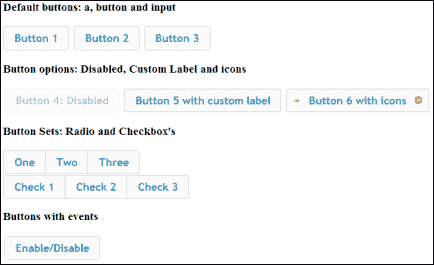
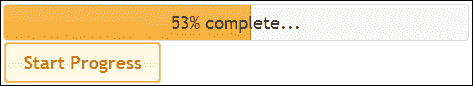
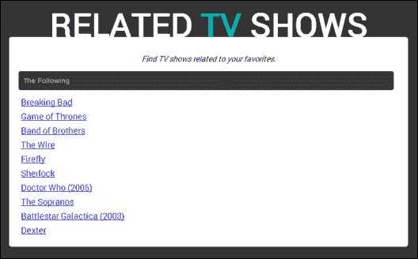

# 第九章：jQuery UI

在本章中，我们将涵盖：

+   创建时尚且功能性的按钮

+   创建用户信息和输入对话框

+   在应用程序中实现进度条

+   快速向输入框添加日期选择器界面

+   创建自动完成搜索功能

# 介绍

jQuery UI 是建立在 jQuery JavaScript 库之上的用户界面库。jQuery UI 提供了许多交互式插件、效果和界面元素，开发人员可以在其界面中使用。本章将演示 jQuery UI 的最常见元素，如按钮和日期选择器，并向您展示如何快速将它们添加到您的网站或 Web 应用程序中。

在开始本章之前，请确保您已访问过[`jqueryui.com/`](http://jqueryui.com/)并下载了 jQuery UI 库。通过他们网站上的**Download Builder**下载库；确保所有默认选项保持选中状态。本章中使用的 jQuery UI 版本为 v1.10.3，但大多数示例也适用于更新版本。他们的网站还提供了丰富的文档和示例，帮助您快速入门 jQuery UI。

要开始本章的示例，请创建一个名为 `chapter9` 的易于访问的文件夹，并将 jQuery 库放入其中。创建一个名为 `jquery-ui` 的子文件夹，并将 jQuery UI 库的 `css` 和 `js` 文件夹放入此子文件夹。

# 创建时尚且功能性的按钮

使用 CSS3 快速创建时尚按钮相对容易，但要添加额外的功能通常需要更多的时间投入。jQuery UI 提供了一个按钮 API，可用于创建各种按钮控件，这些控件可以轻松添加到 UI 中，并在 JavaScript 代码中进行交互。本示例演示了如何创建常见的按钮控件，以便您可以在需要时重新使用代码。

## 准备工作

在之前创建的 `chapter9` 文件夹中，创建 `recipe-1.html` 和 `recipe-1.js`。

## 如何做…

使用 jQuery UI 库创建一系列不同的按钮控件，执行以下步骤：

1.  为了添加各种按钮元素，请将以下 HTML 代码添加到 `recipe-1.html` 中，确保在必要时更新对 jQuery 和 jQuery UI 库的引用：

    ```js
    <!DOCTYPE html>
    <html>
    <head>
       <title>Chapter 9 :: Recipe 1</title>
       <script src="img/jquery.min.js"></script>
       <script src="img/jquery-ui-1.10.3.custom.min.js"></script>
       <link type="text/css" rel="stylesheet" href="jquery-ui/css/ui-lightness/jquery-ui-1.10.3.custom.min.css" />
       <script src="img/recipe-1.js"></script>
    </head>
    <body>
       <h3>Default buttons: a, button and input</h3>
       <a href="#">Button 1</a>
       <button>Button 2</button>
       <input type="submit" name="button3" value="Button 3" />
       <h3>Button options: Disabled, Custom Label and icons</h3>
       <button class="button4">Button 4: Disabled</button>
       <button class="button5">Button 5</button>
       <button class="button6">Button 6 with icons</button>
       <h3>Button Sets: Radio and Checkbox's</h3>
       <div class="buttonSet1">
          <button>One</button>
          <button>Two</button>
          <button>Three</button>
       </div>
       <div class="buttonSet2">
          <input type="checkbox" id="check1" /><label for="check1">Check 1</label>
          <input type="checkbox" id="check2" /><label for="check2">Check 2</label>
          <input type="checkbox" id="check3" /><label for="check3">Check 3</label>
       </div>
       <h3>Buttons with events</h3>
       <button class="enableDisable">Enable/Disable</button>
    </body>
    </html>
    ```

1.  将以下 jQuery 代码添加到 `recipe-1.js` 中，以将 UI 样式和功能应用于按钮元素：

    ```js
    $(function(){
       //Default buttons
       $('a, button, input[type=submit]').button();
       //Button options
       $('#button4').button('option', 'disabled', true);
       $('#button5').button({label: 'Button 5 with custom label'});
       $('#button6').button('option', 'icons', {primary: 'ui-icon-arrowthick-1-e', secondary: 'ui-icon-circle-arrow-e'});
       //Button sets
       $('.buttonSet1').buttonset();
       $('.buttonSet2').buttonset();
       //Button events
       $('.enableDisable').button().click(function(){
          var _button4 = $('.button4');
          if (_button4.button('option', 'disabled')) {
             _button4.button('option', 'disabled', false);
          } else {
             _button4.button('option', 'disabled', true);
          }
       });
    }); 
    ```

1.  在 Web 浏览器中打开 `recipe-1.html`，您将看到用默认 jQuery UI 主题样式化的各种按钮元素。

## 工作原理…

HTML 提供了一系列不同的按钮元素，可以通过 jQuery UI 按钮 API 使用。通过查看此网页，您将能够了解以下元素的工作原理，并在需要时重新使用代码：

+   包括 `a`、`input` 和 `button` 元素的默认按钮

+   默认按钮及其选项，如自定义标签、图标和禁用

+   允许复选框和单选按钮功能的按钮集

+   按钮上的事件

要初始化 jQuery UI 按钮 API，请以典型的 jQuery 方式选择按钮或一组按钮元素，并使用 `button()` 函数，如下所示：

```js
$('a, button, input[type=submit]').button();
```

这将为所选按钮应用 jQuery UI CSS 和附加功能。`button()` 函数还接受一系列选项，以便您可以单独操作按钮元素。这在 `recipe-1.js` 中的 `Button options` 部分中显示。

通过在 HTML 代码中分组按钮，并使用 `buttonset()` 函数，您可以创建一组按钮，这些按钮共同形成复选框或单选按钮功能，如下所示：

```js
<div class="buttonSet1">
   <button>One</button>
   <button>Two</button>
   <button>Three</button>
</div>
```

您仍然可以使用正常的 jQuery 与 HTML 按钮元素进行交互，以附加事件并执行操作。使用此配方，标记为**启用/禁用**的按钮具有附加的点击事件处理程序，如下所示：

```js
$('.enableDisable').button().click(function(){
   var _button4 = $('.button4');
   if (_button4.button('option', 'disabled')) {
      _button4.button('option', 'disabled', false);
   } else {
      _button4.button('option', 'disabled', true);
   }
});
```

这使用了 jQuery UI 提供的 `button('option')` 功能来检查按钮的禁用状态，然后根据其当前状态将其设置为 `true` 或 `false`。在打开的 Web 浏览器中的 `recipe-1.html` 中，单击此按钮将视觉上启用和禁用标记为**按钮 4**的按钮。请注意，在上面的示例中，可以在 `button()` 函数后方便地链接 `click()` 函数。

## 还有更多内容…

jQuery UI 库提供了更多类型的按钮。转到其网站提供的文档（[`jqueryui.com/button/`](http://jqueryui.com/button/)）了解简单示例和更多详细信息。

## 另请参阅

+   *为用户信息和输入创建对话框*

# 为用户信息和输入创建对话框

在第六章，*用户界面*中，您已经学会了如何创建自己的模态弹出窗口。jQuery UI 提供了一个易于使用的 API，帮助您快速地向应用程序添加模态或对话框。这个配方将研究 jQuery UI 对话框的默认行为，并向您展示如何使用它们。再次强调，这个配方旨在让您能够轻松找到所需的代码，并在方便时重用它。

## 准备工作

在 `chapter9` 文件夹中，创建 `recipe-2.html` 和 `recipe-2.js` 并打开它们以供编辑。

## 如何做…

要了解如何快速向应用程序添加对话框或模态，请执行以下步骤：

1.  将以下 HTML 添加到 `recipe-2.html` 中，以便在 JavaScript 代码中使用按钮和对话框元素：

    ```js
    <!DOCTYPE html>
    <html>
    <head>
       <title>Chapter 9 :: Recipe 2</title>
       <script src="img/jquery.min.js"></script>
       <script src="img/jquery-ui-1.10.3.custom.min.js"></script>
       <link type="text/css" rel="stylesheet" href="jquery-ui/css/ui-lightness/jquery-ui-1.10.3.custom.min.css" />
       <script src="img/recipe-2.js"></script>
    </head>
    <body>
    <div class="actions">
       <button id="openSecondDialog">Open Second Dialog with Animation</button>
       <button id="openModalDialog">Open Modal Dialog</button>
       <button id="openConfirmationDialog">Open Confirmation Dialog</button>
    </div>
    <div id="default-dialog" title="Default Dialog">
       <p>This is a dialog with default behaviour.</p>
    </div>
    <div id="second-dialog" title="Second Dialog">
       <p>This is a dialog with animation that is opened by a button.</p>
    </div>
    <div id="modal-dialog" title="Modal Dialog">
       <p>This is a modal dialog.</p>
    </div>
    <div id="confirmation-dialog" title="Confirmation Dialog">
       <p>Are you sure you want to close this dialog?</p>
    </div>
    </body>
    </html>
    ```

1.  将以下 JavaScript 代码添加到 `recipe-2.js` 中，以初始化打开对话框的对话框元素和按钮：

    ```js
     $(function(){
       //Set up the dialog elements
       $('#default-dialog').dialog();
       $('#second-dialog').dialog({
          autoOpen: false,
          show: {
             effect: "fade",
             duration: 500
          },
          hide: {
             effect: "explode",
             duration: 1000
          }
       });
       $('#modal-dialog').dialog({
          autoOpen: false,
          modal: true
       });
       $('#confirmation-dialog').dialog({
          autoOpen: false,
          resizable: false,
          buttons: {
             "Yes": function() {
                $(this).dialog("close");
             },
             "No": function() {
                alert("Your dialog will stay open.");
             }
          }
       });
       //Set up button elements
       $('.actions').buttonset();
       $('#openSecondDialog').click(function(){
          $('#second-dialog').dialog("open");
       });
       $('#openModalDialog').click(function(){
          $('#modal-dialog').dialog("open");
       });
       $('#openConfirmationDialog').click(function(){
          $('#confirmation-dialog').dialog("open");
       });
    });
    ```

1.  在 Web 浏览器中打开 `recipe-2.html`，您将看到默认对话框已经打开。使用按钮集中的按钮打开各种其他对话框类型。

## 工作原理…

与前面的食谱一样，HTML 代码创建了 jQuery UI 库将用于应用所需功能和样式的元素。页面中有四个对话框元素和三个按钮，用于打开附加对话框。

JavaScript 代码依次初始化每个对话框元素，提供不同的选项和设置。第一个对话框元素`#default-dialog`通过简单地使用以下 jQuery UI 代码而不使用任何选项进行初始化：

```js
$('#default-dialog').dialog();
```

这将把`#default-dialog` HTML 元素转换为 jQuery UI 对话框，并在屏幕上显示它。

第二个对话框初始化时，`autoOpen`选项设置为`false`，因此当用户首次访问页面时不会自动打开。要打开此对话框，用户必须单击标有**Open Second Dialog with Animation**的按钮。第二个对话框提供了一些动画选项，如下所示：

```js
$('#second-dialog').dialog({
   autoOpen: false,
   show: {
   effect: "fade",
   duration: 500
},
hide: {
   effect: "explode",
    duration: 1000
   }
});
```

这将确保在打开对话框时使用淡入动画，并在关闭对话框时使用爆炸动画。阅读 jQuery UI 对话框文档([`api.jqueryui.com/dialog/`](http://api.jqueryui.com/dialog/))，以发现可用的动画效果。

第三个对话框是一个模态对话框。只需在打开模态时将`modal: true`选项添加到`dialog()`函数中，即可添加一个遮罩，遮挡页面的其余部分视图。

本食谱中的第四个对话框是一个确认对话框。使用按钮选项，您可以指定一些按钮和回调来保存按钮操作，如下所示：

```js
$('#confirmation-dialog').dialog({
   autoOpen: false,
   resizable: false,
   buttons: {
   "Yes": function() {
      $(this).dialog("close");
   },
   "No": function() {
      alert("Your dialog will stay open.");
      }
   }
});
```

将`resize`选项设置为`false`，以覆盖允许用户更改对话框大小的默认行为。

## 更多内容...

通过阅读文档([`api.jqueryui.com/dialog/`](http://api.jqueryui.com/dialog/))，您将发现更多可供选择的对话框类型。表单对话框特别有用，可以快速检索用户输入，并具有内置的验证功能。

## 另请参阅

+   *创建时尚和功能性按钮*

# 在您的应用程序中实现进度条

进度条允许用户详细了解应用程序正在执行的过程。进度条是更新用户请求的任务进度的理想解决方案，该任务可能需要很长时间才能完成。此操作可以是文件上传或其他耗时的服务器端进程。本食谱将向您展示如何使用 jQuery UI 进度条 API 轻松地将进度条添加到您的应用程序中。

## 准备工作

在您之前创建的`chapter9`文件夹中创建`recipe-3.html`、`recipe-3.js`和`recipe-3.css`。

## 如何实现...

学习如何快速将进度条添加到您的应用程序中，执行以下步骤：

1.  将以下 HTML 代码添加到`recipe-3.html`中，以创建具有所需进度条 HTML 元素的网页：

    ```js
    <!DOCTYPE html>
    <html>
    <head>
       <title>Chapter 9 :: Recipe 3</title>
       <script src="img/jquery.min.js"></script>
       <script src="img/jquery-ui-1.10.3.custom.min.js"></script>
       <link type="text/css" rel="stylesheet" href="jquery-ui/css/ui-lightness/jquery-ui-1.10.3.custom.min.css" />
       <link type="text/css" rel="stylesheet" href="recipe-3.css" />
       <script src="img/recipe-3.js"></script>
    </head>
    <body>
    <div class="progress-bar"><div class="progress-label">Press "Start Progress" to begin load...</div></div>
    <button class="start-progress">Start Progress</button>
    </body>
    </html>
    ```

1.  为了为进度条标签提供一些基本样式，将以下 CSS 代码添加到 `recipe-3.css` 中：

    ```js
    .progress-bar {
       position: relative;
    }
    .progress-label {
       position: absolute;
       left: 0;
       top: 0;
       right: 0;
       bottom: 0;
       text-align: center;
       line-height: 35px;
    }
    ```

1.  将以下 JavaScript 代码添加到 `recipe-3.js` 中，以初始化进度条并为开始进度按钮提供功能：

    ```js
    $(function(){
       var progressBar = $('.progress-bar');
       var progressLabel = $('.progress-label');
       progressBar.progressbar({
          change: function() {
             progressLabel.text(progressBar.progressbar("value") + "% complete...");
          },
          complete: function() {
             progressLabel.text("Completed!");
          }
       });
       $('.start-progress').button().click(doStuff);
       function doStuff() {
          var progressValue = ((progressBar.progressbar("value") || 0) + 1);
          progressBar.progressbar("value", progressValue);
          if (progressValue < 100) {
             setTimeout(doStuff, 100);
          }
       }
    });
    ```

1.  在网页浏览器中打开 `recipe-3.html`，然后单击**开始进度**按钮。进度条将开始显示进度，直到达到 100%。

## 工作原理…

HTML 页面创建了两个元素，jQuery UI 将使用它们来创建进度条和标签：

```js
<div class="progress-bar"><div class="progress-label">Press "Start Progress" to being load...</div></div>
```

默认的标签文本被添加到标签元素中，在用户首次访问网页时将显示。网页还添加了一个**开始进度**按钮，以便用户可以启动加载操作。

本示例中的加载操作只是一个虚假过程。您可以轻松地将此代码与 `XmlHttpRequest` 结合使用，用于图像上传，例如在 第八章 的*从头开始编码图像裁剪插件*配方中使用的代码，*理解插件开发*。

要初始化添加到 HTML 页面中的 `progress-bar` 元素中的进度条，使用 `progressbar()` 函数：

```js
progressBar.progressbar({
   change: function() {
   progressLabel.text(progressBar.progressbar("value") + "% complete...");
   },
   complete: function() {
      progressLabel.text("Completed!");
   }
});
```

提供一个具有两个属性的对象给此函数设置更改和完成事件回调函数。这使我们能够在进度值发生变化时执行操作，以及在进度完成时执行操作。在本示例中，我们只是更新进度标签，以通知用户完成的百分比值。确保您阅读文档 ([`jqueryui.com/progressbar/`](http://jqueryui.com/progressbar/))，以便您了解所有可用的选项。

使用 `progressBar.progressbar("value")`，可以从进度条元素中检索进度值。然后可以使用该值来更新进度标签文本。

当用户单击**开始进度**按钮时调用的 `doStuff()` 函数作为进度。它使用 `setTimeout()` 每 100 毫秒调用自身，然后按如下方式增加进度条值：

```js
var progressValue = ((progressBar.progressbar("value") || 0) + 1);
progressBar.progressbar("value", progressValue);
```

## 另请参阅

+   *从头开始编码图像裁剪插件* 配方在 第八章 中，*理解插件开发*

# 快速向输入框添加日期选择器界面

日期选择器为用户提供了一个易于使用的界面，以便他们快速选择所需的日期。jQuery UI 提供了一个可以快速添加到输入字段的日期选择器。日期选择器提供了许多配置选项，如日期格式化和限制，使开发人员更容易根据需要限制用户的输入。本示例将向您展示如何将日期选择器添加到两个输入字段中，更改日期选择器的日期格式，并为每个字段应用日期限制。

## 准备就绪

与前一个示例一样，在之前创建的 `chapter9` 文件夹中创建 `recipe-4.html`、`recipe-4.js` 和 `recipe-4.css`。

## 如何操作…

按照以下每个步骤创建一个简单的界面，其中包含两个日期选择器和配置选项：

1.  将以下 HTML 代码插入到 `recipe-4.html` 中，以创建带有日期选择器元素的基本网页和用户界面：

    ```js
    <!DOCTYPE html>
    <html>
    <head>
       <title>Chapter 9 :: Recipe 4</title>
       <script src="img/jquery.min.js"></script>
       <script src="img/jquery-ui-1.10.3.custom.min.js"></script>
       <link type="text/css" rel="stylesheet" href="jquery-ui/css/ui-lightness/jquery-ui-1.10.3.custom.min.css" />
       <link type="text/css" rel="stylesheet" href="recipe-4.css" />
       <script src="img/recipe-4.js"></script>
    </head>
    <body>
       <div class="frame">
          <div class="settings">
             <label>Restrict:</label>
             <select class="restrict">
                <option value="1">1 Year</option>
                <option value="2">2 Years</option>
                <option value="3">3 Years</option>
            </select>
            <label>Format:</label>
            <select class="formatDate">
               <option value="dd/mm/yy">English Format</option>
               <option value="mm/dd/yy">American Format</option>
             </select>
          </div>
          <div class="datepickers">
             Start: <input type="text" class="start" />
             End: <input type="text" class="end" />
          </div>
       </div>
    </body>
    </html>
    ```

1.  添加以下 CSS 到 `recipe-4.css`，以为用户界面提供基本样式和定位：

    ```js
    .frame {
       width: 500px;
       margin: 100px auto auto auto;
       background-color: #494949;
       border-radius: 5px;
       box-shadow: 5px 5px 5px #CCC;
    }
    .frame .settings {
       line-height: 40px;
       text-align: center;
       background-color: #333;
       color: #FFF;
       border-top-left-radius: 5px;
       border-top-right-radius: 5px;
    }
    .frame .datepickers {
       line-height: 100px;
       text-align: center;
       color: #CCC;
    }
    ```

1.  添加以下 jQuery 代码到 `recipe-4.js`，以设置日期选择器元素并为 `recipe-4.html` 中的其他元素提供功能：

    ```js
    $(function(){
       var _start = $('.start');
       var _end = $('.end');
       var _restrict = $('.restrict');
       var _formatDate = $('.formatDate');
       var _dateFormat = 'dd/mm/yy';
       _start.datepicker({
          dateFormat: _dateFormat,
          minDate: new Date(),
          onClose: function(selectedDate) {
             _end.datepicker("option", "minDate", selectedDate);
             restrictDates();
          }
       });
       _end.datepicker({
          dateFormat: _dateFormat,
          onClose: function(selectedDate) {
             _start.datepicker("option", "maxDate", selectedDate);
          }
       });
       _formatDate.change(function(){
          _dateFormat = _formatDate.val();
          _start.datepicker("option", "dateFormat", _dateFormat);
          _end.datepicker("option", "dateFormat", _dateFormat);
       });
       _restrict.change(function(){
          restrictDates();
       });
       function restrictDates() {
          var maxDate = _start.datepicker("getDate");
          if (maxDate != null) {
          maxDate.setFullYear(maxDate.getFullYear() + parseInt(_restrict.val()));
          _end.datepicker("option", "maxDate", maxDate);
    }
       }
    });
    ```

1.  在 Web 浏览器中打开 `recipe-4.html`，您将看到一个简单的界面，其中包含两个输入和两个下拉菜单。标记为 `start` 和 `end` 的两个输入在您点击输入字段时会为您提供一个日期选择器界面。然后，您可以使用日期选择器选择要插入到相关输入中的日期。通过使用两个下拉菜单，您可以更改日期和日期选择器的行为。格式选项将日期格式更改为英文或美式。限制下拉菜单将允许您选择结束日期选择器允许用户选择的最大年数，超过所选开始日期。

## 工作原理…

HTML 和 CSS 为我们提供了一个简单的界面，可与 jQuery UI 结合使用，以演示一些日期选择器的功能。在 `recipe-4.js` 的顶部，有一些变量保存了将由 jQuery 使用的不同 HTML 元素的引用，以及保存了英文日期格式的变量。

要为输入元素添加日期选择器，需要使用 jQuery UI 的 `datepicker()` 函数以及所需的选项：

```js
_start.datepicker({
   dateFormat: _dateFormat,
   minDate: new Date(),
   onClose: function(selectedDate) {
      _end.datepicker("option", "minDate", selectedDate);
      restrictDates();
   }
});
```

`dateFormat` 选项设置所选日期选择器的格式。`minDate` 选项设置日期选择器允许用户选择的最小日期；使用 `new Date()` 来将此限制设置为当前日期。在关闭日期选择器后将执行指定的 `onClose` 函数。在此函数中，为结束输入设置了 `minDate` 选项。这将确保用户无法选择早于所选开始日期的结束日期。`restrictDates()` 函数也在此处被调用。`restrictDates()` 函数定义如下：

```js
function restrictDates() {
   var maxDate = _start.datepicker("getDate");
   if (maxDate != null) {
      maxDate.setFullYear(maxDate.getFullYear() + parseInt(_restrict.val()));
      _end.datepicker("option", "maxDate", maxDate);
   }
}
```

此函数对结束日期选择器应用限制，使用户无法选择比所选开始日期大 *n* 年的结束日期。这里，*n* 是**限制**下拉菜单指定的值。就像设置 `minDate` 一样，设置 `maxDate` 使用的是所选开始日期加上指定年数的数量。当用户更改下拉菜单选择时，也会使用 `change()` 函数调用此函数。

当用户选择更改日期格式时，以下代码用于更新每个日期选择器元素的格式：

```js
_formatDate.change(function(){
   _dateFormat = _formatDate.val();
   _start.datepicker("option", "dateFormat", _dateFormat);
   _end.datepicker("option", "dateFormat", _dateFormat);
});
```

日期选择器 API 的一部分提供了许多选项。阅读文档 ([`api.jqueryui.com/datepicker/`](http://api.jqueryui.com/datepicker/)) 以了解其他可用选项。

# 创建自动完成搜索功能

本配方将向用户建议搜索词，当他们在搜索输入框中输入时。这是一个非常受欢迎的功能，对用户非常有帮助，因为它在用户甚至还没有进行搜索之前就提供了一些关于搜索结果的见解。jQuery UI 提供了可以快速添加到任何输入元素中的自动完成功能。

## 准备工作

在你保存其他配方文件的 `chapter9` 文件夹中创建 `recipe-5.html`、`recipe-5.js` 和 `recipe-5.css`。

本配方利用了 Trakt.tv 提供的高质量 API（[`trakt.tv/api-docs/`](http://trakt.tv/api-docs/)）。在开始本配方之前，你需要注册（免费）并获取一个 API 密钥。一旦注册成功，你可以在以下页面找到你的 API 密钥：[`trakt.tv/api-docs/authentication`](http://trakt.tv/api-docs/authentication)。

### 注意

在编写本配方时，已知 Google Chrome 中存在一个已知的错误，在该错误中，如果你尝试从本地机器（即使用 `file://` 而不是 `http(s)://` 访问 `recipe-5.html`）调用 AJAX 中的 jQuery 来调用外部源，你可能会收到一个 `Access-Control-Allow-Origin` 错误。如果你遇到了这个问题，要么通过 web 服务器提供你的配方文件，要么使用其他浏览器。

为了演示自动完成功能如何在真实情境中使用，本配方将使用上述 API 创建相关的电视节目搜索。它将允许用户搜索一个电视节目（并通过自动完成提供建议），一旦用户选择了一个，与所选节目相关的节目将被显示。

## 如何操作...

要添加自动搜索功能，请执行以下操作：

1.  将以下 HTML 代码添加到 `recipe-5.html` 中，以创建基本的网页：

    ```js
    <!DOCTYPE html>
    <html>
    <head>
       <title>Chapter 9 :: Recipe 5</title>
       <script src="img/jquery.min.js"></script>
       <script src="img/jquery-ui-1.10.3.custom.min.js"></script>
       <link type="text/css" rel="stylesheet" href="jquery-ui/css/ui-lightness/jquery-ui-1.10.3.custom.min.css" />
       <link type="text/css" rel="stylesheet" href="recipe-5.css" />
       <script src="img/recipe-5.js"></script>
    </head>
    <body>
    <div class="frame">
       <h1>RELATED <span>TV</span> SHOWS</h1>
       <div class="head">
          <p>Find TV shows related to your favorites.</p>
          <div class="search-input-frame">
             <input type="text" id="searchInput" placeholder="Search for a TV show..." />
       </div>
       </div>
       <div class="results">
          <div class="searching">Searching for related shows...</div>
          <ul id="results-list"></ul>
       </div>
    </div>
    </body>
    </html>
    ```

1.  将以下 CSS 放置在 `recipe-5.css` 中，将 HTML 代码转换成一个具有吸引力的网页：

    ```js
    @import url(http://fonts.googleapis.com/css?family=Roboto:400,300,100);
    body {
       background-color: #333;
       font-family: 'Roboto', sans-serif;
    }
    .frame {
       width: 800px;
       background-color: #FFF;
       margin: 100px auto auto auto;
       padding: 20px;
       border-radius: 5px;
    }
    .frame h1 {
       margin: -93px 0 0 0;
       color: #FFF;
       font-size: 70px;
       text-align: center;
    }
    .frame h1 span {
       color: #00B5B5;
    }
    .search-input-frame #searchInput {
       width: 780px;
       border: none;
       font-weight: bold;
       color: #999;
       background: #373737;
       font-size: 14px;
       height: 40px;
       padding: 0 0 0 10px;
       margin: 0;
       border-radius: 5px;
       line-height: 40px;
    }
    .frame .head p {
       font-style: italic;
       text-align: center;
    }
    .frame .results ul {
       list-style: none;
       margin: 10px 0 0 5px;
       padding: 0;
    }
    .frame .results ul li {
       line-height: 30px;
       font-size: 18px;
    }
    .frame .results .searching {
       display: none;
       text-align: center;
       font-style: italic;
       font-size: 18px;
       line-height: 100px;
    }
    .frame .results ul li.no-results {
       line-height: 100px;
       text-align: center;
       font-size: 16px;
       font-weight: bold;
    }
    ```

1.  将以下 jQuery 添加到 `recipe-5.js` 中，以初始化搜索输入元素上的自动完成功能：

    ```js
    $(function(){
       $('#searchInput').autocomplete({
          minLength: 2,
          source: function(input, response) {            
       },
       select: function (event, ui) { 
       }
       });
    });
    ```

1.  在你刚刚添加的源函数中插入以下代码，根据用户的输入调用 Trakt.tv API，以提供自动完成功能所需的数据。确保你将 `[API KEY HERE]` 替换为你的 Trakt.tv API 密钥，如下所示：

    ```js
    $.ajax({
    type: 'GET',
    url: 'http://api.trakt.tv/search/shows.json/[API KEY HERE]?query=' + input.term + "&limit=10",
    dataType: 'jsonp',
    success: function(data) {
       var results = [];
    for (var i = 0; i < data.length; i++) {
    results.push({
    id: data[i].tvdb_id,
    label: data[i].title,
    value: data[i].title
       });
       }
       response(results);
    }
    });
    ```

1.  为了基于用户的自动完成部分填充主要结果列表，将以下 jQuery 代码添加到你刚刚添加的 select 函数中。再次记得用你的 API 密钥替换 `[API KEY HERE]`：

    ```js
    var showId = ui.item.id;
    var _searchingMsg = $('.searching');
    var _resultList = $('#results-list');
    _resultList.empty();
    _searchingMsg.fadeIn();
    $.ajax({
    type: 'GET',
       url: 'http://api.trakt.tv/show/related.json/[API KEY HERE]/' + showId,
       dataType: 'jsonp',
    success: function(data) {
    _searchingMsg.hide();
    for (var i = 0; i < data.length; i++) {
       resultList.append("<li><a target='_blank' href='" + data[i].url + "'>" + data[i].title + "</a></li>");
    }
    }
    });
    ```

1.  在网页浏览器中打开 `recipe-5.html`，并搜索你最喜欢的电视节目：

## 工作原理...

jQuery UI 自动完成功能将所有复杂性封装起来，以便开发者只需要考虑提供数据和选择后的操作。

这个配方中的 HTML 页面创建了一个用户可以在其中进行搜索的网页。然后在 jQuery 代码中选择此输入，并使用`autocomplete()`函数来初始化所选元素上的自动完成功能，如下所示：

```js
$('#searchInput').autocomplete({
   minLength: 2,
   source: function(input, response) {            

},
select: function (event, ui) { 

}
});
```

在提供给`autocomplete()`函数的对象上的`source`属性是显示给用户的下拉菜单中使用的数据。`source`属性可以是数组、字符串或函数。当`source`是字符串时，它期望值是提供数据的资源 URL，以期望的格式提供数据。因为我们使用的是一个不会提供期望格式数据的外部 API，所以我们使用第三个选项，并在函数内进行一些额外的处理。`minLength`属性允许我们控制用户必须输入多少字符才能触发自动完成功能

首先，需要从 Trackt.tv 检索数据。为此，使用熟悉的 jQuery `$.ajax()`函数：

```js
$.ajax({
   type: 'GET',
   url: 'http://api.trakt.tv/search/shows.json/[API KEY HERE]?query=' + input.term + "&limit=10",
   dataType: 'jsonp',
   success: function(data) {

}
});
```

`source()`函数接受两个参数：`input`（对象）和`response`（函数）。使用`input.term`，我们可以获取用户输入到搜索输入框中的值，并将其插入到 API URL 中以搜索电视节目。限制查询字符串变量被设置为`10`，以便只返回 10 个结果。

注意，这个配方中的两个 AJAX 请求的`dataType`属性都被设置为`jsonp`。这是为了在与 API 一起工作时防止任何跨域问题。在[`www.jquery4u.com/json/jsonp-examples/`](http://www.jquery4u.com/json/jsonp-examples/)上阅读更多关于 jQuery 的 JSONP 的信息。

如果请求成功，我们可以遍历所有结果并创建一个以自动完成功能期望的格式的数组，如下所示：

```js
var results = [];
for (var i = 0; i < data.length; i++) {
   results.push({
      id: data[i].tvdb_id,
      label: data[i].title,
      value: data[i].title
});
}
response(results);
```

调用`response()`函数，这是`source()`函数的第二个参数；这将把结果发送给自动完成功能以显示。

在这些配方中，下一段功能发生在用户从自动完成建议列表中选择选项时。在提供给`autocomplete()`函数的对象上的`select`属性接受一个回调函数，当用户做出选择时执行。使用`ui`参数，然后可以从表示用户选择的对象中检索数据。在这种情况下，我们需要 ID，以便我们可以将其传递回到 Trackt.tv API，并检索相关的电视节目列表：

```js
var showId = ui.item.id;
```

这个变量被用作另一个`$.ajax()`请求的一部分。在这个请求成功后，结果将被循环遍历，并且为每个相关的电视节目插入一个列表项。还会添加一个链接到 Trakt.tv 网页，显示更多关于每个节目的信息，如下所示：

```js
for (var i = 0; i < data.length; i++) {
   resultList.append("<li><a target='_blank' href='" + data[i].url + "'>" + data[i].title + "</a></li>");
}
```

## 另见

+   在 [第三章 *使用 AJAX 和 JSON 加载和操作动态内容*中创建自动建议功能] 这个示例
