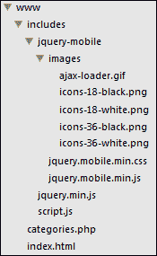
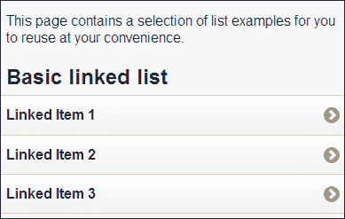
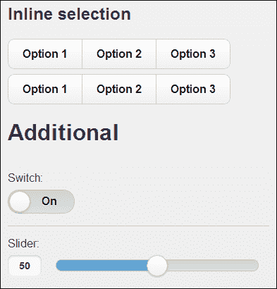
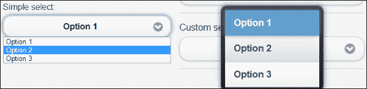
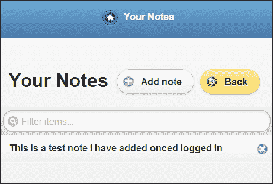

# 第十章：使用 jQuery Mobile

在本章中，我们将涵盖以下主题：

+   创建基本的移动网站模板

+   构建完整的静态网站

+   构建动态移动网站

+   实现快速呼叫功能

+   实现发送短信功能

+   添加移动友好的列表

+   使用面向触摸的事件

+   创建移动兼容表单

+   构建完整的注册和登录系统

+   构建完整的移动 Web 应用程序

# 介绍

jQuery Mobile 是一个精心设计的框架，旨在使创建移动友好的网站和应用程序更容易。jQuery Mobile 结合了为移动体验量身定制的可主题化 UI 元素，并提供了针对触摸屏设备上特殊事件的自定义事件。

本章介绍了 jQuery Mobile 并深入了解其功能。在本章中，您将学习如何创建一个利用常见元素（如按钮和列表）的基本移动网站。然后，您将继续学习一些移动特定功能，如**触摸呼叫**。

在开始本章之前，请确保您已从 jQuery 网站([`jquerymobile.com/download`](http://jquerymobile.com/download))下载了最新版本的 jQuery Mobile 框架。创建一个名为`chapter10`的文件夹，用于保存本章的所有配方文件。在此文件夹中，创建一个名为`jquery-mobile`的文件夹，并将主要的 jQuery Mobile JavaScript 和 CSS 文件放入其中，包括`images`文件夹，其中包含 CSS 中引用的所有图标精灵。

本章使用的 jQuery Mobile 版本是 1.3.2，但大多数配方也适用于更新版本。

对于本章中的一些配方，您将需要运行 PHP 和 MySQL 的 Web 服务器。该 Web 服务器可以是本地开发服务器，也可以是托管在云中的服务器。您还需要访问 MySQL 管理界面，如 PHPMyAdmin，以便运行 SQL 脚本。

# 创建基本的移动网站模板

这个配方将展示一个简单的 jQuery Mobile 网页的基本布局是什么样的。您还将能够将此 HTML 页面用作未来 jQuery 移动项目的模板。

## 准备工作

在您之前创建的`chapter10`文件夹中，创建`recipe-1.html`。

## 如何操作…

将以下 HTML 代码插入到`recipe-1.html`中，以创建一个非常基本的 jQuery Mobile 单页网站：

```js
<!DOCTYPE html>
<html>
<head>
    <title>Chapter 10 :: jQuery Mobile Template</title>
    <meta name="viewport" content="width=device-width, initial-scale=1" />
    <link rel="stylesheet" href="jquery-mobile/jquery.mobile.min.css" />
    <script src="img/jquery.min.js"></script>
    <script src="img/jquery.mobile.min.js"></script>
</head>
<body>
<div data-role="page">
    <header data-role="header">
        <h1>Chapter 10 :: Recipe 1 :: jQuery Mobile Webpage Template</h1>
    </header>
    <div data-role="content">
        <p>This is where your page content will go.</p>
    </div>
    <footer data-role="footer">
        <h4>Look how easy it is to add a styled footer</h4>
    </footer>
</div>
</body>
</html>
```

确保更新对 jQuery 库和 CSS 的引用，以反映您下载的文件。在 Web 浏览器中打开`recipe-1.html`，您将看到如何使用 jQuery Mobile 快速创建一个基本的移动友好网页。

## 工作原理…

乍一看，模板页面与典型的 HTML 网页并没有太大区别。文档中声明了 HTML5 标准化文档类型`<!DOCTYPE html>`，所需的 CSS 和 JavaScript 包含在文档的头部。

与一般 HTML 页面不同的是，视口的`meta`标签，并不总是存在。它告诉浏览器如何设置页面的尺寸和缩放级别。如果这些没有被设置，大部分移动设备将使用虚拟宽度，使网页看上去缩小。

### 注意

`data-`属性是 HTML5 的新实现，允许自定义元素属性，并仍提供有效的标记。这些`data-*`属性允许你存储关于特定元素的任意信息，而 jQuery Mobile 利用了这个能力。

在 jQuery Mobile 中，使用`data-role`属性来指示元素的作用。在这个配方中创建的简单模板中，我们使用了 page、header、content 和 footer 角色来创建简单页面的结构。这些角色都不言而喻，但在本章的过程中也会变得更加清晰。

## 还有更多…

正如所有 jQuery 实现一样，提供了丰富的文档可供参考（[`jquerymobile.com`](http://jquerymobile.com)），所有开发者都应该加以利用。要充分利用 jQuery Mobile，请确保阅读文档。

## 参见

+   *创建一个完整的静态网站*

# 创建一个完整的静态网站

这个配方将向你展示如何快速使用 jQuery Mobile 创建一个简单的静态网站。在前一个配方中创建的模板中，只需要添加带有正确角色的附加元素，就能创建额外的页面和它们之间的导航。

## 准备工作

在之前创建的`chapter10`文件夹中创建`recipe-2.html`，并确保你已准备好你新创建的 jQuery Mobile 模板。

## 如何做…

要使用 jQuery Mobile 创建功能性移动网站，请执行以下步骤：

1.  将之前创建的 jQuery Mobile 模板复制到`recipe-2.html`中，并删除`<body>`标签内的所有内容，如以下代码片段所示：

    ```js
    <!DOCTYPE html>
    <html>
    <head>
        <title>Chapter 10 :: jQuery Mobile Template</title>
        <meta name="viewport" content="width=device-width, initial-scale=1" />
        <link rel="stylesheet" href="jquery-mobile/jquery.mobile.min.css" />
        <script src="img/jquery.min.js"></script>
        <script src="img/jquery.mobile.min.js"></script>
    </head>
    <body>

    </body>
    </html>
    ```

1.  在`<body>`标签之间插入以下代码，可创建简单静态网站的主页：

    ```js
    <div data-role="page" id="home">
        <header data-role="header">
            <h1>Home Page</h1>
        </header>
        <div data-role="content">
            <p>This is the content for the home page. You can choose to go to another page using the buttons below.</p>
            <a href="#about" data-role="button" data-theme="a">About</a>
            <a href="#contact" data-role="button" data-theme="a">Contact</a>
        </div>
        <footer data-role="footer">
            <h4>Chapter 10 :: Recipe 2</h4>
        </footer>
    </div>
    ```

1.  要创建一个链接到主页的关于页面，请在主页声明后但仍在`<body>`标签内添加以下代码：

    ```js
    <div data-role="page" id="about" data-title="About Page">
        <header data-role="header">
            <h1><a href="#home" data-role="button" data-theme="b" data-icon="arrow-l" data-inline="true">Back</a> About Page</h1>
        </header>
        <div data-role="content">
            <p>This is the content for the about page.</p>
        </div>
        <footer data-role="footer">
            <h4>Chapter 10 :: Recipe 2</h4>
        </footer>
    </div>
    ```

1.  重复上一步，使用以下代码来添加最终的联系页面：

    ```js
    <div data-role="page" id="about" data-title="About Page">
        <header data-role="header">
            <h1><a href="#home" data-role="button" data-theme="b" data-icon="arrow-l" data-inline="true">Back</a> About Page</h1>
        </header>
        <div data-role="content">
            <p>This is the content for the about page.</p>
        </div>
        <footer data-role="footer">
            <h4>Chapter 10 :: Recipe 2</h4>
        </footer>
    </div>
    ```

1.  在网页浏览器中打开`recipe-2.html`，你将看到移动网站，并且你可以使用主页上的按钮浏览到关于和联系页面之间。

## 它是如何运行的…

在这个配方的代码中，你会看到`data-role`属性被多次使用来指示许多 HTML 元素的功能。要声明多个页面，只需重复使用模板中使用的基本页面结构，并根据需要更改内容。考虑下面的例子：

```js
<div data-role="page" id="about" data-title="About Page">
    <header data-role="header">

    </header>
    <div data-role="content">

    </div>
    <footer data-role="footer">

    </footer>
</div>
```

这是用于本案例中的关于页面的基本结构。主`div`元素被指定为使用`data-role="page"`表示一个页面。为了允许导航到此页面，定义了一个唯一的 ID，就像你会对任何 HTML 元素一样（`id="about"`）。页面分割线上还有`data-title`属性，使得可以覆盖文档头中的`<title>`标签的内容，这样就可以根据每页更改页面标题。

您可以使用锚元素创建到此方式创建的页面之一的内部链接，就像下面的代码行所示：

```js
<a href="#about" data-role="button" data-theme="a">About</a>
```

当用户点击链接时，他们将看到带有唯一 ID `about`的页面，该 ID 在`href`属性中表示为`#about`。默认页面转换也将被用来提供平滑的导航效果。`data-role="button"`属性用于将元素样式设置为按钮，而`data-theme="a"`属性指定了要使用的主题样式。阅读上述文件以查看默认可用的主题以及如何创建自己的主题。

## 参见也

+   *创建基本移动网站模板*

+   *构建动态移动网站*

# 构建动态移动网站

在上一个案例中，我们创建了一个基本网站，允许您为用户提供内容并相对容易地手动更新它。在大多数情况下，这是不够的。今天的大多数网站依赖某种形式的数据库，以便定期为它们提供丰富的、新的内容，移动网站也应该一样。本案例将向您展示如何使用 PHP 与 jQuery Mobile 创建动态页面，该页面的内容来自 Web 服务器。

## 准备工作

您需要在 Web 服务器的 Web 根目录中创建以下目录结构。在下面的图中，`www`是 Web 根目录；这可能对您来说是不同的：



在 Web 服务器的 Web 根目录（`www`）中，创建一个`includes`文件夹以及文件`index.html`和`categories.php`。在`includes`文件夹中，创建一个名为`jquery-mobile`的子文件夹，并确保所有 jQuery Mobile 库文件都已复制到其中。此外，在`includes`文件夹中，创建`script.js`并添加 jQuery 库（`jquery.min.js`）。

## 如何实现…

要使用 PHP 创建一个动态移动网站，请仔细执行以下步骤：

1.  重新使用作为第一个案例模板的结构，将以下代码添加到`index.html`。这将创建一个主页和一个 ID 为`categorypage`的额外空白页面。

    ```js
    <!DOCTYPE html>
    <html>
    <head>
        <title>Chapter 10 :: Recipe 3</title>
        <meta name="viewport" content="width=device-width, initial-scale=1" />
        <link rel="stylesheet" href="includes/jquery-mobile/jquery.mobile.min.css" />
        <script src="img/jquery.min.js"></script>
        <script src="img/jquery.mobile.min.js"></script>
        <script src="img/script.js"></script>
    </head>
    <body>
    <div id="home" data-role="page">
        <header data-role="header"><h1>Dynamic page creation demo</h1></header>
        <div data-role="content">
            <h2>Select a category:</h2>
            <a href="#categorypage?cat=colours" data-role="button">Colours</a>
            <a href="#categorypage?cat=shapes" data-role="button">Shapes</a>
            <a href="#categorypage?cat=sounds" data-role="button">Sounds</a>
        </div>
    </div>
    <div id="categorypage" data-role="page">
        <div data-role="header"><h1></h1></div>
        <div data-role="content"></div>
    </div>
    </body>
    </html>
    ```

1.  添加以下 PHP 代码到`categories.php`中，以能够根据 jQuery Mobile 站点上的请求提供内容：

    ```js
    <?php
    $categories = array(
        "colours" => array(
            "title" => "Colours",
            "description" => "Some of my favorite colours",
            "items" => array(
                "Black",
                "Green",
                "Red",
                "Blue",
                "Purple"
            )
        ),
        "shapes" => array(
            "title" => "Shapes",
            "description" => "Some shapes I really like",
            "items" => array(
                "Triangle",
                "Circle",
                "Square"
            )
        ),
        "sounds" => array(
            "title" => "Sounds",
            "description" => "Some crazy sounds",
            "items" => array(
                "Buzz",
                "Swish",
                "Boom!",
                "Tick"
            )
        )
    );
    if (isset($_POST['category'])) {
        $response = array(
            "success" => true,
            "data" => array()
        );
        $category = $_POST['category'];
        if (isset($categories[$category])) {
            $response["data"] = $categories[$category];
        } else {
            $response["success"] = false;
            $response["data"] = "Invalid category provided";
        }
        header("Content-Type: application/json; charset-UTF-8");
        echo json_encode($response);
    }
    ```

1.  为了捕捉用户对动态页面之一的请求，将以下 jQuery 代码添加到`script.js`，它将监听`pagebeforechange`事件。这允许我们在用户发送到类别页面之前进行拦截。

    ```js
    $(document).bind("pagebeforechange", function(e, data) {
        if (typeof data.toPage === "string") {
            var urlObject = $.mobile.path.parseUrl(data.toPage);
            if (urlObject.hash.search(/^#categorypage/) !== -1 && urlObject.hash.search(/cat=*/) !== -1) {
                displayCategory(urlObject, data.options);
                //We are handling the change page event ourselves so prevent the default behaviour
                e.preventDefault();
            }
        }
    });
    ```

1.  为了能够生成动态页面，需要从 PHP 脚本中获取内容。在`script.js`的末尾添加以下 JavaScript 函数，以便发起 AJAX 请求收集这些数据并生成动态页面的标记：

    ```js
    function displayCategory(urlObject, options) {
        var catName = urlObject.hash.replace(/.*cat=/, "");
        var pageId = urlObject.hash.replace( /\?.*$/, "");
        var _page = $(pageId);
        var _header = _page.children(":jqmData(role=header)");
        var _content = _page.children(":jqmData(role=content)");
        $.ajax({
            url: 'categories.php',
            type: 'POST',
            data: {
                category: catName
            },
            success: function(response) {
                if (response.success) {
                    var category = response.data;
                    //Add title to header
                    _header.find("h1").html(category.title);
                    //Create content HTML
                    var contentHtml = "<p>" + category.description + ":</p><ul>";
                    for (var i = 0; i < category.items.length; i++) {
                        var item = category.items[i];
                        contentHtml += "<li>" + item + "</li>";
                    }
                    contentHtml += "</ul>";
                    _content.html(contentHtml);
                    //Update the URL to reflect the page the user is actually on
                    _page.data("url", urlObject.href);
                    $.mobile.changePage(_page, options);
                } else {
                    alert(response.data);
                }
            }
        });
    }
    ```

1.  通过网页浏览器（例如，`http://localhost/`）访问您新创建的移动网站，您将看到首页，其中提供了三个不同类别的按钮。单击其中一个按钮，将进入新页面，该页面显示的内容是从您刚刚创建的 PHP 脚本提供的。

## 工作原理...

在此配方中用于创建移动站点的 HTML 代码与之前的静态移动站点几乎没有区别。唯一的区别是只有一个附加页面，没有标题或内容。这是因为附加页面将被重复使用以动态创建多个页面，并且其标题和内容将根据用户请求设置。

在`index.html`中的 HTML 代码创建了带有标签为**颜色**、**形状**和**声音**的三个按钮的首页。这些按钮中的每一个都是指向相同内部页面的链接，该页面带有一些额外信息，如以下代码行所示：

```js
#categorypage?cat=colours
```

每个按钮为`cat`变量提供不同的值，表示不同的类别页面。当用户单击其中一个页面时，默认行为是使 jQuery Mobile 将用户导航到此内部页面。由于我们正在动态创建这些内部页面，因此我们需要拦截此行为，从 PHP 脚本中收集请求的类别内容，然后生成页面。为此，我们绑定到`pagebeforechange`事件，如下所示：

```js
$(document).bind("pagebeforechange", function(e, data) {
    if (typeof data.toPage === "string") {
        var urlObject = $.mobile.path.parseUrl(data.toPage);
        if (urlObject.hash.search(/^#categorypage/) !== -1 && urlObject.hash.search(/cat=*/) !== -1) {
            displayCategory(urlObject, data.options);
            //We are handling the change page event ourselves to prevent the default behaviour
            e.preventDefault();
        }
    }
});
```

由于我们只想拦截特定的页面请求，在我们请求动态内容之前，我们执行了一些检查。我们可以从提供给事件处理程序函数的`data`对象中获取请求 URL。我们首先检查 URL 是否为字符串，如下所示：

```js
if (typeof data.toPage === "string") {
```

如果是字符串，则按照以下方式解析为 URL 对象：

```js
var urlObject = $.mobile.path.parseUrl(data.toPage);
```

创建了 URL 对象后，可以执行两个最终检查，以查看请求的页面是否属于类别页面，如下所示：

```js
if (urlObject.hash.search(/^#categorypage/) !== -1 && urlObject.hash.search(/cat=*/) !== -1) {
```

使用`search()`函数，可以搜索字符串`#categorypage`以检查是否正在请求类别页面，然后再次检查是否还提供了一个`cat`变量。

如果这些检查通过，则调用`displayCategory()`函数来收集和呈现动态页面的内容。还使用了`e.preventDefault()`来阻止 jQuery Mobile 在生成具有动态内容之前将用户导航到请求的页面。

在`displayCategory()`函数的顶部，声明了一系列变量，如下所示：

```js
var catName = urlObject.hash.replace(/.*cat=/, "");
var pageId = urlObject.hash.replace( /\?.*$/, "");
var _page = $(pageId);
var _header = _page.children(":jqmData(role=header)");
var _content = _page.children(":jqmData(role=content)");
```

前两个从请求 URL 获取值，即请求的类别和页面 ID（即`#categorypage`）。

然后，使用页面 ID 通过典型的 jQuery 选择器从 `index.html` 中选择页面 DOM 元素。接着，使用 `page` 元素，可以找到并存储页面标题和内容的 DOM 元素，稍后可以使用标准的 jQuery 进行操作。

然后，使用 jQuery 的 `$.ajax()` 函数进行 AJAX 请求，向 `categories.php` 发起 POST 请求，指定了来自请求页面 URL 的 `catName` 的值。

此 `categories.php` PHP 脚本保存一个多维数组，其中存储了三种不同类别的数据。此 PHP 脚本获取了提交的类别并使用 `isset()` 检查 `$categories` 数组中是否存在匹配的类别。如果存在，则将 `$response` 数组的数据值更新为请求的类别的数据。如果没有请求的类别数据，则将 `$response` 数组的成功值设置为 `false` 并提供错误消息。

最后，PHP 脚本在将 `$response` 数组编码为 JSON 并输出之前设置内容类型和字符集。

`displayCategory()` 函数发起的 AJAX 请求将接收此 JSON 数据并相应处理。

通过检查 `response.success` 是否为真，可以确定是否有一些数据要显示给请求的类别。如果有，则可以添加页面的标题以及为内容创建的 HTML 代码，如下所示：

```js
var category = response.data;
//Add title to header
_header.find("h1").html(category.title);
//Create content HTML
var contentHtml = "<p>" + category.description + ":</p><ul>";
for (var i = 0; i < category.items.length; i++) {
var item = category.items[i];
contentHtml += "<li>" + item + "</li>";
}
contentHtml += "</ul>";
_content.html(contentHtml);
```

为确保 URL 反映用户正在查看的页面，使用 jQuery 的 `data()` 函数设置 `categorypage` 元素的 `url` 属性如下：

```js
_page.data("url", urlObject.href);
```

最后，调用 `changePage()` 函数将用户导航到新生成的页面，在那里，他们将看到从 PHP 脚本提供的请求内容。`changePage()` 函数还会插入一个条目到浏览器历史中，以提供典型的浏览器导航行为。

## 更多信息…

此配方中的 PHP 脚本提供了填充附加类别页面的内容，并将此内容存储在 PHP 数组中。这仅供演示目的，可以轻松地是存储在由 PHP 脚本访问的数据库中的内容。

## 参见

+   *构建完整的静态网站*

# 实现快速呼叫功能

HTML5 允许开发人员告知浏览器启动应用程序以进行电话呼叫，方式与发邮件类似。本配方将向您展示如何使用 jQuery Mobile 按钮来实现此功能，以便用户点击此按钮时，他们的默认呼叫应用程序将打开，并预填充电话号码。

## 准备工作

在 `chapter10` 文件夹中，创建 `recipe-4.html` 以供本配方使用。

## 如何做…

为了让用户能够点击按钮进行电话呼叫，而不必将号码复制粘贴到其通话应用程序中，执行以下简单步骤：

1.  将以下 HTML 代码添加到 `recipe-4.html` 中，以重复使用移动网站模板：

    ```js
    <!DOCTYPE html>
    <html>
    <head>
        <title>Chapter 10 :: jQuery Mobile Template</title>
        <meta name="viewport" content="width=device-width, initial-scale=1" />
        <link rel="stylesheet" href="jquery-mobile/jquery.mobile.min.css" />
        <script src="img/jquery.min.js"></script>
        <script src="img/jquery.mobile.min.js"></script>
    </head>
    <body>
    <div data-role="page">
        <header data-role="header">
            <h1>Chapter 10 :: Recipe 4</h1>
        </header>
        <div data-role="content">

        </div>
        <footer data-role="footer">
            <h4>The HTML5 tel: attribute allows you to provide interaction to telephone numbers</h4>
        </footer>
    </div>
    </body>
    </html>
    ```

1.  在主页的 `content` 部分中添加一个具有 `tel:` 属性的按钮，一旦按下即会启动通话应用程序，如下所示：

    ```js
    <p>This is my simple mobile website, click the button below to call me!</p>
    <a href="tel: 01234 567891" data-role="button">Call Me!</a>
    ```

1.  在 Google Chrome 中打开 `recipe-4.html`，并点击 **Call Me!** 按钮，将弹出一个警告，提示该网站正在请求打开外部应用程序。在移动浏览器上打开该网页将会打开您设备的默认通话应用程序，允许您使用按钮元素上指定的号码进行通话。

## 它是如何工作的…

多年来，`mailto:` 属性一直可用于允许网站打开用户的默认邮件客户端。以下代码行显示了一个示例：

```js
<a href="mailto:name@domain.com">E-Mail Me</a>
```

HTML5 允许一些额外的属性以类似的方式工作，以允许额外的功能。`tel:` 属性是其中之一。支持此属性的浏览器将在用户点击链接时打开设备或计算机上安装的默认通话应用程序。请注意，要打开 Skype，一款流行的 VOIP 应用程序，您可能需要使用一个名为 `callto:` 的替代属性。

## 另请参阅

+   *实现发送短信功能*

# 实现发送短信功能

上一个配方介绍了如何直接从您的移动网站拨打电话。让用户轻松发送短信也是一个有用的功能。本配方将向您展示如何添加一个按钮，当点击时将在用户设备上打开默认的短信客户端。

## 准备工作

在开始本章之前创建的 `chapter10` 文件夹中创建 `recipe-5.html`。

## 如何做…

允许用户通过您的移动网站快速发送短信消息非常容易。执行以下简单步骤来了解如何：

1.  再一次，使用本章第一个配方中创建的 jQuery Mobile 模板，在 `recipe-5.html` 中创建一个简单的移动网站，使用以下代码：

    ```js
    <!DOCTYPE html>
    <html>
    <head>
        <title>Chapter 10 :: Recipe 5</title>
        <meta name="viewport" content="width=device-width, initial-scale=1" />
        <link rel="stylesheet" href="jquery-mobile/jquery.mobile.min.css" />
        <script src="img/jquery.min.js"></script>
        <script src="img/jquery.mobile.min.js"></script>
    </head>
    <body>
    <div data-role="page">
        <header data-role="header">
            <h1>Chapter 10 :: Recipe 5</h1>
        </header>
        <div data-role="content">

        </div>
        <footer data-role="footer">
            <h4>Use the HTML5 sms: attribute to open the default SMS client on click</h4>
        </footer>
    </div>
    </body>
    </html>
    ```

1.  在 `recipe-5.html` 的主页的 `content` 部分中添加以下文本和锚元素：

    ```js
    <p>This is my simple mobile website, click the button below to send me an SMS message!</p>
    <a href="sms:01234 567891" data-role="button">SMS Me!</a>
    ```

1.  在移动设备上打开 `recipe-5.html`，并点击 **SMS Me!** 按钮。你的默认短信客户端将打开，接收者字段已经填充了 HTML 中指定的号码。

## 它是如何工作的…

除了 HTML5 提供的新 `tel:` 属性外，还提供了 `sms:` 属性。这将告诉兼容的设备使用指定的电话号码打开默认的短信客户端。以下代码行显示了一个示例：

```js
<a href="sms:01234 567891" data-role="button">SMS Me!</a>
```

此锚元素还具有 `data-role` 属性和一个按钮的值，以便 jQuery Mobile 为简单按钮添加适当的样式。

## 还有更多…

除了电话号码外，还可以指定一些文本自动添加到消息正文中；将锚元素更改如下以添加此功能：

```js
<a href="sms:01234 567891?body=This is some text in the body" data-role="button">SMS Me!</a>
```

## 另请参阅

+   *实现快速通话功能*

# 添加移动友好的列表

在此食谱书中，有各种利用 HTML 列表以简单有效的方式呈现数据的食谱。jQuery Mobile 允许开发人员快速将移动友好且易于触摸的列表添加到其 jQuery Mobile 网站中。此食谱为您提供了 jQuery Mobile 提供的更常见类型的列表的多个示例。您可以随时复制和重用这些列表的代码。

## 准备工作

在之前创建的`chapter10`文件夹中，创建一个名为`recipe-6.html`的 HTML 文件。

## 如何做…

要了解如何添加不同类型的移动友好列表，请执行以下步骤：

1.  通过将以下 HTML 添加到`recipe-6.html`中，创建一个基本的 jQuery Mobile 网站：

    ```js
    <!DOCTYPE html>
    <html>
    <head>
        <title>Chapter 10 :: Recipe 6</title>
        <meta name="viewport" content="width=device-width, initial-scale=1" />
        <link rel="stylesheet" href="jquery-mobile/jquery.mobile.min.css" />
        <script src="img/jquery.min.js"></script>
        <script src="img/jquery.mobile.min.js"></script>
    </head>
    <body>
    <div data-role="page">
        <header data-role="header">
            <h1>Chapter 10 :: Recipe 6 :: Lists</h1>
        </header>
        <div data-role="content">

        </div>
    </div>
    </body>
    </html>
    ```

1.  要创建最常见的列表类型 - 基本链接列表 - 在`recipe-6.html`的`content`部分元素中添加以下代码：

    ```js
    <p>This page contains a selection of list examples for you to reuse at your convenience.</p>
    <h2>Basic linked list</h2>
    <ul data-role="listview">
    <li><a href='#'>Linked Item 1</a></li>
    <li><a href='#'>Linked Item 2</a></li>
    <li><a href='#'>Linked Item 3</a></li>
    </ul>
    ```

1.  要创建嵌套列表，请在`content`部分元素中添加以下 HTML 结构。请注意 HTML 中的注释，为了使此列表正确工作，您需要从 Web 服务器提供`recipe-6.html`。这样做的原因在本食谱的*如何做...*部分中给出。

    ```js
    <h2>Nested list</h2>
    <p>Please note that the sub-list will not work if you have opened recipe-6.html directly in a web browser. For the sub-list navigation to work you must serve this HTML file from a web server. i.e. http://localhost/recipe-6.html.</p>
    <ul data-role="listview">
    <li><a href='#'>Top Level Item 1</a></li>
    <li><a href='#'>Top Level Item 2</a></li>
    <li><a href='#'>Top Level Item 3 - With Sub-Level</a>
    <ul data-role="listview">
    <li><a href='#'>Second Level Item 1</a></li>
    <li><a href='#'>Second Level Item 2</a></li>
    </ul>
    </li>
    </ul>
    ```

1.  当在列表中显示内容时，可能需要允许用户以多种方式与每个列表项进行交互。jQuery Mobile 允许开发人员轻松地在列表元素旁边添加带有图标的按钮，以增强其功能性。使用`data-split-icon`属性将此功能添加到列表中，如下面的代码所示：

    ```js
    <h2>List items with buttons</h2>
    <ul data-role="listview" data-split-icon="delete">
    <li><a href='#'>Jane Doe</a><a href='#'></a></li>
    <li><a href='#'>John Doe</a><a href='#'></a></li>
    <li><a href='#'>James Mathews</a><a href='#'></a></li>
    </ul>
    ```

1.  长列表可能会变得难以导航。jQuery Mobile 允许开发人员快速为任何列表添加过滤选项，使用户可以查找他们需要的列表项。要添加具有此功能的列表，请使用以下代码：

    ```js
    <h2>List with filter</h2>
    <ul data-role="listview" data-filter="true">
    <li><a href='#'>Cat</a></li>
    <li><a href='#'>Dog</a></li>
    <li><a href='#'>Lizard</a></li>
    <li><a href='#'>Rabbit</a></li>
    </ul>
    ```

1.  在 Web 浏览器中打开`recipe-6.html`将呈现一系列列表示例，如下面的屏幕截图所示，您可以在将来的项目中随时使用：

## 工作原理…

使用`data-role="listview"`属性和值，可以将基本的 HTML 列表转换为移动友好的实现。jQuery Mobile 会自动添加样式，就像按钮和其他元素一样。

如果您参考文档（[`jquerymobile.com/demos/1.2.1/docs/lists/docs-lists.html`](http://jquerymobile.com/demos/1.2.1/docs/lists/docs-lists.html)），您将获得所有可用列表类型的完整列表以及详细示例。

此食谱中使用的大多数示例都很简单且不言自明。食谱的嵌套列表部分具有一些额外的功能，可能不太明显。对于大多数移动设备，屏幕空间非常有限，特别是在纵向模式下。因此，不允许嵌套列表以传统方式展开（向右展开并具有不同的缩进），如下列表所示是没有意义的：

+   顶层项目 1

+   顶层项目 2

+   顶层项目 3 – 带有子级

    +   第二级项目 1

    +   第二级项目 2

为了节省空间并提供更好的用户体验，当您添加嵌套列表时，jQuery Mobile 将创建一个附加页面，并在其中显示子列表项。当用户选择一个带有列表的列表项时，他们将被带到一个额外的页面，其中显示子级项目。

撰写本食谱时，除非从使用 HTTP 的 Web 服务器提供页面，否则为子级项目创建的附加页面不起作用。

在这个示例中更为强大的一项是能够快速为您的列表添加过滤器。只需在 HTML 列表上添加 `data-filter="true"` 属性和值，jQuery Mobile 就会自动在列表顶部添加过滤器输入框，允许用户过滤掉不需要的列表项。

# 使用面向触摸的事件

除了 jQuery 提供的典型事件，如 `click` 和 `hover`，jQuery Mobile 还为开发者提供了触摸中心的事件。使用这些事件，可以为您的移动应用程序添加额外的功能，以适应这些额外的用户交互。本食谱提供了许多有用事件的示例，您可以随时重复使用它们。

## 准备工作

在您的 Web 服务器的 Web 根目录中，创建 `recipe-7.html` 和 `recipe-7.js`。

## 如何做…

要了解可用的触摸中心事件及其用法，请执行以下步骤：

1.  通过将以下 HTML 添加到 `recipe-7.html` 来创建一个基本的移动网站，其中包含一个空列表。确保根据需要更新所包含库的引用。

    ```js
    <!DOCTYPE html>
    <html>
    <head>
        <title>Chapter 11 :: Recipe 1</title>
        <meta name="viewport" content="width=device-width, initial-scale=1" />
        <link rel="stylesheet" href="includes/jquery-mobile/jquery.mobile.min.css" />
        <script src="img/jquery.min.js"></script>
        <script src="img/jquery.mobile.min.js"></script>
        <script src="img/recipe-7.js"></script>
    </head>
    <body>
    <div data-role="page">
        <header data-role="header">
            <h1>Chapter 10 :: Recipe 7 :: jQuery Mobile Touch Events</h1>
        </header>
        <div data-role="content">
            <p>Perform various touch events and watch the output below.</p>
            <ul id="touch-event-response" data-role="listview"></ul>
        </div>
    </div>
    </body>
    </html>
    ```

1.  在 `recipe-7.js` 的顶部，添加以下函数，该函数将在您刚刚在 `recipe-7.html` 中创建的列表中添加新的列表项：

    ```js
    function addEvent(msg) {
        var _list = $('#touch-event-response');
        _list.append("<li>" + msg + "</li>");
        _list.listview('refresh');
    }
    ```

1.  要在用户轻触时添加新的列表项，请将以下 JavaScript 代码添加到 `recipe-7.js` 中：

    ```js
    $(function(){
        $(document).bind('tap', function(){
            addEvent("Tap");
        });
    });
    ```

1.  若要监听 `taphold` 事件并添加新的列表项，请在 `$(function(){})` 块中的前一个 `.bind()` 语句下直接添加以下代码：

    ```js
    $(document).bind('taphold', function(){
    addEvent("Tap & Hold");
    });
    ```

1.  可以使用相同的方法来监听 `swipe` 事件。追加以下 `.bind()` 定义：

    ```js
    $(document).bind('swipe', function(){
    addEvent("Swipe");
    });
    ```

1.  若要在用户向左滑动时清除列表，请追加以下 JavaScript 代码：

    ```js
    $(document).bind('swipeleft', function(){
    $('#touch-event-response').empty();
    });
    ```

1.  最后，要在用户更改设备方向时检测，请在 `swipeleft` 绑定定义之后添加以下代码：

    ```js
    $(window).bind('orientationchange', function(event){
    addEvent("Orientation changed to: " + event.orientation);
    });
    ```

1.  使用支持移动和触摸的设备，打开 `recipe-7.html` 并执行一系列触摸事件，以查看添加到列表的适当响应。当您向左滑动时，列表应该被清空，当您改变设备的方向时，将添加一个新的列表项，指示新的方向（纵向或横向）。

## 工作原理…

通过使用以下代码，可以监听 jQuery Mobile 提供的各种事件：

```js
$(document).bind('[EVENT]', function() {
});
```

要查看可用的完整事件列表，请阅读 jQuery Mobile 网站上的文档（[`jquerymobile.com/demos/1.2.1/docs/api/events.html`](http://jquerymobile.com/demos/1.2.1/docs/api/events.html)），其中提供了详细的带有示例的全面列表。

在这个食谱中，`addEvent()`函数接受一个字符串，它将附加到在`recipe-7.html`中创建的简单移动网站中的列表元素中。当您使用 JavaScript 操作 jQuery Mobile 列表时，您必须调用`refresh`方法，以确保样式重新应用到新添加的元素上。如以下代码所示：

```js
var _list = $('#touch-event-response');
_list.append("<li>" + msg + "</li>");
_list.listview('refresh');
```

知道用户何时更改设备的方向可以帮助重新整理页面上的元素，以改善用户体验。通过 jQuery Mobile，这非常容易实现。只需绑定到`orientationchange`事件，并准备`event`对象的`orientation`属性来确定新的方向是什么，如下面的代码所示：

```js
$(window).bind('orientationchange', function(event){
addEvent("Orientation changed to: " + event.orientation);
});
```

请注意，与本食谱中的其他事件不同，这个事件被绑定到`window`而不是`document`，因为`document`不知道浏览器或设备的方向。

## 另请参阅

+   第二章，*通过使用 jQuery 事件与用户进行交互*

# 创建兼容移动设备的表单

jQuery Mobile 提供了一系列与 jQuery UI 类似但针对移动设备进行优化的表单组件。本食谱提供了更常用的表单元素的示例，以便您随时重复使用。

## 准备工作

在您之前创建的`chapter10`文件夹中，创建 `recipe-8.html`。

## 如何操作…

要了解 jQuery Mobile 提供了哪些表单元素以及如何使用它们，请执行以下每一步：

1.  创建一个简单的 jQuery Mobile 网站来存放所有的示例。将以下 HTML 代码添加到`recipe-8.html`：

    ```js
    <!DOCTYPE html>
    <html>
    <head>
        <title>Chapter 10 :: Recipe 8</title>
        <meta name="viewport" content="width=device-width, initial-scale=1" />
        <link rel="stylesheet" href="jquery-mobile/jquery.mobile.min.css" />
        <script src="img/jquery.min.js"></script>
        <script src="img/jquery.mobile.min.js"></script>
    </head>
    <body>
    <div data-role="page" id="home">
        <header data-role="header" data-theme="b">
            <h1>Chapter 10 :: Recipe 8</h1>
        </header>
        <div data-role="content">
        </div>
    </div>
    </body>
    </html>
    ```

1.  在您刚刚添加的`content`区域元素内添加以下代码，以创建一系列文本输入元素：

    ```js
    <h1>Text Input</h1>
    <div data-role="fieldcontain">
    <label for="textInput">Text input:</label>
    <input type="text" name="textInput" id="textInput" />
    </div>
    <div data-role="fieldcontain">
    <label for="textArea">Text area:</label>
    <textarea id="textArea" name="textArea"></textarea>
    </div>
    <div data-role="fieldcontain">
    <label for="textSearch">Text search:</label>
    <input type="text" name="textSearch" id="textSearch" data-type="search">
    </div>
    ```

1.  要创建两种不同类型的选择菜单，请在文本输入下添加以下代码：

    ```js
    <h1>Select Menu</h1>
    <div data-role="fieldcontain">
    <label for="simpleSelect">Simple select:</label>
    <select id="simpleSelect">
    <option value="1">Option 1</option>
    <option value="2">Option 2</option>
           <option value="3">Option 3</option>
    </select>
    </div>
    <div data-role="fieldcontain">
    <label for="customSelect">Custom select:</label>
    <select id="customSelect" data-native-menu="false">
    <option value="1">Option 1</option>
    <option value="2">Option 2</option>
          <option value="3">Option 3</option>
    </select>
    </div>
    ```

1.  要创建复选框和单选按钮，请使用以下代码：

    ```js
    <h1>Selection</h1>
    <h2>Checkboxes</h2>
    <fieldset data-role="controlgroup">
    <input type="checkbox" name="checkbox-1" id="checkbox-1">
    <label for="checkbox-1">Option 1</label>
    <input type="checkbox" name="checkbox-2" id="checkbox-2">
    <label for="checkbox-2">Option 2</label>
    <input type="checkbox" name="checkbox-3" id="checkbox-3">
    <label for="checkbox-3">Option 3</label>
    </fieldset>
    <h2>Radio buttons</h2>
    <fieldset data-role="controlgroup">
    <input type="radio" name="radio-1" id="radio-1">
    <label for="radio-1">Option 1</label>
    <input type="radio" name="radio-1" id="radio-2">
    <label for="radio-2">Option 2</label>
    <input type="radio" name="radio-1" id="radio-3">
    <label for="radio-3">Option 3</label>
    </fieldset>
    <h2>Inline selection</h2>
    <fieldset data-role="controlgroup" data-type="horizontal">
    <input type="checkbox" name="checkbox-1" id="checkbox-4">
    <label for="checkbox-4">Option 1</label>
    <input type="checkbox" name="checkbox-2" id="checkbox-5">
    <label for="checkbox-5">Option 2</label>
    <input type="checkbox" name="checkbox-3" id="checkbox-6">
    <label for="checkbox-6">Option 3</label>
    </fieldset>
    <fieldset data-role="controlgroup" data-type="horizontal">
    <input type="radio" name="radio-2" id="radio-4">
    <label for="radio-4">Option 1</label>
    <input type="radio" name="radio-2" id="radio-5">
    <label for="radio-5">Option 2</label>
    <input type="radio" name="radio-2" id="radio-6">
    <label for="radio-6">Option 3</label>
    </fieldset>
    ```

1.  最后，要创建一些附加元素——开关和滑块——请添加以下代码：

    ```js
    <h1>Additional</h1>
    <div data-role="fieldcontain">
    <label for="switch">Switch:</label>
    <select id="switch" data-role="slider">
    <option value="1">On</option>
          <option value="0">Off</option>
    </select>
    </div>
    <div data-role="fieldcontain">
    <label for="slider">Slider:</label>
    <input type="number" data-type="range" name="slider" id="slider" value="50" min="0" max="100" data-highlight="true">
    </div>
    ```

1.  在网络浏览器中打开`recipe-8.html`将呈现出一系列不同的表单元素。然后你可以轻松地选择并重复使用任何元素类型的代码，如下面的屏幕截图所示：

## 它是如何工作的…

本食谱中使用的每种类型的 jQuery Mobile 元素在以下各节中都有详细解释。

### 文本输入

jQuery Mobile 提供了不同的文本输入元素。典型的文本输入和文本区域元素可以通过在`div`元素内添加标签和`input`或`textarea`元素，并将其放在具有`fieldcontain`类的`div`元素内来轻松创建，如以下代码所示：

```js
<div data-role="fieldcontain">
<label for="textInput">Text input:</label>
<input type="text" name="textInput" id="textInput" />
</div>
```

要创建搜索输入，只需将`data-type="search"`添加到`input`元素中。这会向`input`元素添加一个搜索图标，并在用户输入一些文本后提供清除按钮。

### 选择菜单

此教程中提供的两个选择菜单在外观上看起来相同。当选择第一个简单示例时，您将获得一个下拉列表，看起来像在一个普通非移动优化网站上的典型选择菜单。

第二个示例添加了额外的`data-native-menu="false"`属性，一旦单击，将提供不同的选择菜单。这个额外的菜单使得使用触摸界面更容易进行选择。以下屏幕截图对两种类型的选择菜单进行了比较：



### 复选框和单选按钮

使用具有`data-role="controlgroup"`属性的`fieldset`元素，非常容易创建复选框和单选按钮，如下面的代码片段所示：

```js
<fieldset data-role="controlgroup">
<input type="checkbox" name="checkbox-1" id="checkbox-1">
<label for="checkbox-1">Option 1</label>
<input type="checkbox" name="checkbox-2" id="checkbox-2">
<label for="checkbox-2">Option 2</label>
<input type="checkbox" name="checkbox-3" id="checkbox-3">
<label for="checkbox-3">Option 3</label>
</fieldset>
```

要创建一组单选按钮，可以重复使用前面的代码，将`type`属性更改为`radio`并确保它们的`name`属性中都有相同的值。

除了这些界面元素外，jQuery Mobile 还可以提供嵌入式等效物。只需将`data-type="horizontal"`属性添加到`fieldset`元素上，就可以获得复选框或单选按钮的嵌入式版本。

### 额外信息

作为此教程的最后两个元素提供的是一个开关和一个滑块。`switch`元素实质上是一个只有两个选项的选择菜单，但以更适合触摸的方式呈现。通过将`data-type="range"`属性添加到数字输入中（如下所示的代码），可以创建`slider`元素，允许用户轻松地在表单上输入和更改数字值：

```js
<div data-role="fieldcontain">
<label for="slider">Slider:</label>
<input type="number" data-type="range" name="slider" id="slider" value="50" min="0" max="100" data-highlight="true">
</div>
```

## 还有更多…

作为此教程的一部分提供的所有示例都显示为默认尺寸。当默认尺寸稍大时，jQuery Mobile 为所有表单元素提供额外的较小尺寸。

要使用小型等效物，将属性`data-mini="true"`添加到需要较小尺寸的元素中。

# 建立完整的注册和登录系统

本教程向您展示如何使用 jQuery Mobile 和 PHP 与 MySQL 数据库从头开始创建简单的注册和登录系统。这个教程将为本章的下一个教程中的完整网络应用程序奠定基础。

## 准备工作

您应该已经准备好一个可用于完成此教程的 PHP 和 MySQL 服务器。在 Web 服务器的 Web 根目录中，创建`index2.html`和`script2.js`，它们将保存应用程序的主要功能。

## 如何去做…

要创建完整的注册和登录系统，请确保您仔细遵循以下每个说明：

1.  将以下 HTML 代码添加到`index2.html`中，以创建一个简单的 jQuery Mobile 网站和主页：

    ```js
    <!DOCTYPE html>
    <html>
    <head>
        <title>Chapter 10 :: Register & Login</title>
        <meta name="viewport" content="width=device-width, initial-scale=1" />
        <link rel="stylesheet" href="includes/jquery-mobile/jquery.mobile.min.css" />
        <script src="img/jquery.min.js"></script>
        <script src="img/jquery.mobile.min.js"></script>
        <script src="img/script2.js"></script>
        <link rel="stylesheet" href="styles.css" />
    </head>
    <body>
    <div data-role="page" id="home">
        <header data-role="header" data-theme="b">
            <h1><a href="#home" data-role="button" data-icon="home" data-iconpos="notext" data-inline="true"></a> Home Page</h1>
        </header>
        <div data-role="content">
            <p>Welcome to my community.</p>
            <a data-role="button" href="#login">Login</a>
            <a data-role="button" data-theme="a" href="#register">Register</a>
        </div>
    </div>
    </body>
    </html>
    ```

1.  使用以下 HTML 将登录页面添加到`index2.html`：

    ```js
    <div data-role="page" id="login" data-title="Login">
        <header data-role="header" data-theme="b">
            <h1><a href="#home" data-role="button" data-icon="home" data-iconpos="notext" data-inline="true"></a> Login</h1>
        </header>
        <div data-role="content">
            <div data-role="fieldcontain">
                <label for="login-username">Username:</label>
                <input type="text" name="username" id="login-username" value="" />
            </div>
            <div data-role="fieldcontain">
                <label for="login-password">Password:</label>
                <input type="password" name="password" id="login-password" value="" />
            </div>
            <button data-role="button" id="login-account" data-theme="a">Login</button>
            <p>Don't have an account? <a href='#register'>Register</a>.</p>
        </div>
    </div>
    ```

1.  还可以使用以下 HTML 代码创建注册页面，确保将页面代码添加到`index2.html`中 HTML 文档的`body`部分中：

    ```js
    <div data-role="page" id="register" data-title="Register">
        <header data-role="header" data-theme="b">
            <h1><a href="#home" data-role="button" data-icon="home" data-iconpos="notext" data-inline="true"></a> Register</h1>
        </header>
        <div data-role="content">
            <div data-role="fieldcontain">
                <label for="register-username">Username:</label>
                <input type="text" name="username" id="register-username" value="" />
            </div>
            <div data-role="fieldcontain">
                <label for="register-password">Password:</label>
                <input type="password" name="password" id="register-password" value="" />
            </div>
            <div data-role="fieldcontain">
                <label for="register-passwordagain">Password Again:</label>
                <input type="password" name="register-passwordagain" id="register-passwordagain" value="" />
            </div>
            <button data-role="button" id="register-account" data-theme="a">Register</button>
            <p>Already have an account? <a href='#login'>Login</a>.</p>
        </div>
    </div>
    ```

1.  最后一个要添加的页面是成员页面。使用以下 HTML 代码创建此页面：

    ```js
    <div data-role="page" id="member">
        <header data-role="header" data-theme="b">
            <h1><a href="#home" data-role="button" data-icon="home" data-iconpos="notext" data-inline="true"></a> Member's Page</h1>
        </header>
        <div data-role="content">
            <p>You're logged in.</p>
            <button data-role="button" data-theme="a" id="logout">Logout</button>
        </div>
    </div>
    ```

1.  使用以下 SQL 代码，在您的 MySQL 数据库中创建名为`chapter10`的数据库和名为`user`的表：

    ```js
    SET SQL_MODE="NO_AUTO_VALUE_ON_ZERO";
    SET time_zone = "+00:00";

    --
    -- Database: `chapter10`
    --
    CREATE DATABASE `chapter10` DEFAULT CHARACTER SET latin1 COLLATE latin1_swedish_ci;
    USE `chapter10`;

    -- --------------------------------------------------------

    --
    -- Table structure for table `user`
    --

    CREATE TABLE IF NOT EXISTS `user` (
      `id` bigint(20) unsigned NOT NULL AUTO_INCREMENT,
      `username` varchar(128) DEFAULT NULL,
      `password` varchar(512) DEFAULT NULL,
      UNIQUE KEY `id` (`id`),
      UNIQUE KEY `username` (`username`)
    ) ENGINE=InnoDB  DEFAULT CHARSET=latin1 AUTO_INCREMENT=8;
    ```

1.  在您的 Web 服务器的 Web 根目录中创建`connect.db.php`并添加以下 PHP 代码来连接到`chapter10`数据库。如有需要，请更新数据库用户名和密码。

    ```js
    <?php
    $mysqli = new mysqli("localhost", "root", "", "chapter10");
    if ($mysqli->connect_errno) {
        die("Failed to connect to MySQL: (" . $mysqli->connect_errno . ") " . $mysqli->connect_error);
    }
    $pwsalt = "TH1SISF0RCHAPTER10";
    ```

1.  为了能够向`user`表中添加新用户，创建`register.php`并在您的 Web 服务器的 Web 根目录中添加以下 PHP 代码：

    ```js
    <?php
    require_once("connect.db.php");
    $username = isset($_POST['username']) ? strtolower($_POST['username']) : "";
    $password = isset($_POST['password']) ? $_POST['password'] : "";
    $passwordAgain = isset($_POST['passwordagain']) ? $_POST['passwordagain'] : "";

    $response = array(
        "success" => false,
        "errors" => array()
    );

    if (strlen($username) < 3 || strlen($username) > 32) {
        $response["errors"]["username"] = "Username must be between 3 and 64 characters in length";
    } else {
        $query = "SELECT `id` FROM `user` WHERE `username` = ? LIMIT 1";
        $stmt = $mysqli->stmt_init();
        if ($stmt->prepare($query)) {
            $stmt->bind_param("s", $username);
            if ($stmt->execute()) {
                $stmt->store_result();
                if ($stmt->num_rows > 0) {
                    $response["errors"]["username"] = "Username has already been taken";
                }
            } else {
                $response["errors"]["username"] = "Could not execute query";
            }
        } else {
            $response["errors"]["username"] = "Could query database for existing usernames";
        }
        $stmt->close();
    }

    if (strlen($password) < 6 || strlen($password) > 32) {
        $response["errors"]["password"] = "Password must be between 6 and 32 characters in length";
    }
    if ($password != $passwordAgain) {
        $response["errors"]["passwordagain"] = "Passwords must match";
    }

    if (empty($response["errors"])) {
        $query = "INSERT INTO `user` (`username`, `password`) VALUES (?, ?)";
        $stmt = $mysqli->stmt_init();
        if ($stmt->prepare($query)) {
            $password = crypt($password, $pwsalt);
            $stmt->bind_param("ss", $username, $password);
            if ($stmt->execute()) {
                $stmt->close();
                $response["success"] = true;
            } else {
                $response["errors"]["username"] = "Could not execute query";
            }
        } else {
            $response["errors"]["username"] = "Could not insert new user, please try again";
        }
    }
    $mysqli->close();
    header("Content-Type: application/json; charset=UTF-8");
    echo json_encode($response);
    ```

1.  为了允许用户使用他们新创建的帐户登录，创建`login.php`并在您的 Web 服务器的 Web 根目录中添加以下 PHP 代码：

    ```js
    <?php
    session_start();
    require_once("connect.db.php");
    $username = isset($_POST['username']) ? strtolower($_POST['username']) : "";
    $password = isset($_POST['password']) ? $_POST['password'] : "";

    $response = array(
        "success" => false,
        "error" => "",
        "user" => array()
    );

    $query = "SELECT `id` FROM `user` WHERE `username` = ? AND `password` = ? LIMIT 1";
    $stmt = $mysqli->stmt_init();
    if ($stmt->prepare($query)) {
        $password = crypt($password, $pwsalt);
        $stmt->bind_param("ss", $username, $password);
        if ($stmt->execute()) {
            $res = $stmt->get_result();
            if ($res->num_rows > 0) {
                $row = $res->fetch_assoc();
                $response["success"] = true;
                $_SESSION['uid'] = $response["user"]["id"] = $row["id"];
                $_SESSION['username'] = $response["user"]["username"] = $username;
            } else {
                $response["error"] = "Incorrect username or password";
            }
        } else {
            $response["error"] = "Could not execute query";
        }
    } else {
        $response["error"] = "Could not query database";
    }
    $stmt->close();
    $mysqli->close();
    header("Content-Type: application/json; charset=UTF-8");
    echo json_encode($response);
    ```

1.  为了实现登出功能，在与`login.php`相同的目录中创建`logout.php`并添加以下代码：

    ```js
    <?php
    session_start();
    $response = array(
        "success" => false,
        "error" => ""
    );
    if (isset($_SESSION["uid"]) && isset($_SESSION["username"])) {
        $_SESSION = array();
        session_destroy();
     $response["success"] = true;
    } else {
        $response["success"] = false;
        $response["error"] = "Not logged in";
    }
    header("Content-Type: application/json; charset=UTF-8");
    echo json_encode($response);
    ```

1.  为了允许用户提交他们的注册信息，将以下 JavaScript 代码添加到`script2.js`的 jQuery 加载块`($(function(){});)`中：

    ```js
    $('#register-account').click(function(){
            $('.input-error').remove();
            var data = {
                username: $('#register-username').val(),
                password: $('#register-password').val(),
                passwordagain: $('#register-passwordagain').val()
            };
            $.ajax({
                type: 'POST',
                url: 'register.php',
                data: data,
                beforeSend: function() {
                    $.mobile.loading('show');
                },
                success: function(data) {
                    $.mobile.loading('hide');
                    if (data.success) {
                        $.mobile.showPageLoadingMsg("b", "Registration successful! You may now login.", true);
                    } else {
                        $.each(data.errors, function(key, value){
                            $('#register-' + key).parent().after("<div class='input-error'>" + value + "</div>");
                        });
                    }
                }
            });
        });
    ```

1.  当用户尝试从登录页面登录时，将以下 JavaScript 代码添加到`script2.js`中刚刚为注册添加的代码下面，以对登录进行反应：

    ```js
    $('#login-account').click(function(){
            var data = {
                username: $('#login-username').val(),
                password: $('#login-password').val()
            };
            $.ajax({
                type: 'POST',
                url: 'login.php',
                data: data,
                beforeSend: function() {
                    $.mobile.loading('show');
                },
                success: function(data) {
                    $.mobile.loading('hide');
                    if (data.success) {
                        $.mobile.showPageLoadingMsg("b", "Login Successful", true);
                        localStorage.setItem("user", JSON.stringify(data.user));
                        $.mobile.changePage("#member");
                    } else {
                        $.mobile.showPageLoadingMsg("b", data.error, true);
                    }
                }
            });
        });
    ```

1.  为了让用户能够单击登出按钮并注销，将以下代码添加到`script2.js`中：

    ```js
     $('#logout').click(function(){
            $.ajax({
                type: 'POST',
                url: 'logout.php',
                beforeSend: function() {
                    $.mobile.loading('show');
                },
                success: function(data) {
                    $.mobile.loading('hide');
                    if (data.success) {
                        localStorage.removeItem("user");
                        $.mobile.changePage("#home");
                    } else {
                        $.mobile.showPageLoadingMsg("b", data.error, true);
                    }
                }
            });
        });
    ```

1.  为了在用户尝试导航到此页面时检查用户是否已登录，添加以下代码以防止访问成员页面：

    ```js
    $(document).bind("pagebeforechange", function(e, data) {
            if (typeof data.toPage === "string") {
                var urlObject = $.mobile.path.parseUrl(data.toPage);
                if (urlObject.hash.search(/^#member/) !== -1) {
                    if (getUser() === false) {
                        e.preventDefault();
                        $.mobile.showPageLoadingMsg("b", "You must be logged in to access this page", true);
                        setTimeout(function(){
                            $.mobile.hidePageLoadingMsg();
                            $.mobile.changePage("#home");
                        }, 1500);
                    }
                }
            }
        });
    ```

1.  前面的代码使用`getUser()`函数来确定用户是否已登录。将以下函数添加到`script2.js`的末尾，确保它添加在`$(function(){});`块之外：

    ```js
    function getUser() {
        var user = localStorage.getItem("user");
        if (user == null) {
            return false;
        } else {
            return JSON.parse(user);
        }
    }
    ```

1.  为了对 Web 服务器的错误消息添加一些基本样式，创建一个名为`styles.css`的文件，并添加以下 CSS 代码：

    ```js
    .input-error {
        position: absolute;
        font-size: 10px;
        color: #ff0800;
    }
    ```

1.  访问提供`index2.html`的 Web 服务器将允许您注册一个帐户。如果尝试访问成员页面而未登录，您将收到一条消息，告诉您必须登录，然后将被发送回主页。

## 工作原理...

本配方中创建的每个代码部分都在接下来的各节中有详细说明。

### HTML

`index2.html`中的 HTML 创建了一个简单的 jQuery Mobile 网站，包括以下四个页面：

+   主页

+   注册页面

+   登录页面

+   成员页面

主页提供了指向登录和注册页面的链接，每个页面分别链接到对方。成员页面有一个登出按钮，允许用户一旦获得访问成员页面后退出登录。HTML 代码简单，每个元素都在本章的先前配方中有详细说明。

### SQL

作为此配方的一部分提供的 SQL 代码可用于创建所需的`chapter10`数据库和存储用户帐户的`user`表。

### PHP

此配方中创建了四个 PHP 文件。第一个是`connect.db.php`，它建立与 MySQL 数据库的连接，并包含在其他三个 PHP 文件中。PHP `mysqli`类用于在此配方中的 PHP 文件中连接和查询 MySQL 数据库。您可以在 PHP.net（[`www.php.net/mysqli`](http://www.php.net/mysqli)）上找到有关此类的更多信息。

`register.php`文件通过 POST 请求接收一组值。这些值如下所示：

+   `用户名`

+   `密码`

+   `再次输入密码`

PHP 脚本对所有三个输入执行基本验证，以确保指定的用户名长度在 3 到 32 个字符之间，并且已提供的密码至少为 6 个字符长。它还确保两个密码匹配，并查询数据库以确保请求的用户名尚未被占用。

如果通过了所有验证，将在数据库中插入新用户，然后允许此用户使用指定的详细信息登录。重要的是要注意，密码使用 PHP `crypt()`函数进行加密，使用默认设置。这是一种简单的加密方法，在生产环境中应使用更强大的加密技术。

`login.php`脚本通过 POST 请求接收用户名和密码，并查询用户表以查看是否有任何匹配的用户凭据；如果有，将为该用户创建一个 PHP 会话，并将用户对象返回给客户端。

`logout.php`脚本只是销毁 PHP 会话（如果存在），将用户注销。

这些 PHP 脚本中的每一个都以本配方中多次使用的标准格式返回数据。在每个脚本的顶部，创建一个数组，如以下代码所示：

```js
$response = array(
    "success" => false,
    "errors" => array()
);
```

如果脚本成功执行且无需输出错误，则成功值更改为`true`，而`errors`数组保持为空。对于`register.php`脚本，当输入之一未通过验证时，将返回一个具有与输入匹配的键的关联数组。以下是一个示例：

```js
$response["errors"]["username"] = "Username has already been taken";
```

这样，客户端上的 JavaScript 就知道在哪个输入框下放置错误消息，使用户更容易理解他们需要进行哪些更改。

输出响应数组时，它被转换为 JSON 对象，并使用 PHP `header()`函数适当地设置内容类型和字符集，如以下代码所示：

```js
header("Content-Type: application/json; charset=UTF-8");
echo json_encode($response);
```

### JavaScript

此示例中使用的 JavaScript 简单而且并不新奇。为注册、登录和注销按钮创建了三个 `click` 事件处理程序。提供给这些事件处理程序的回调函数从相关表单收集数据，并使用 jQuery `$.ajax()` 函数向 `register.php`、`login.php` 或 `logout.php` 脚本分别发出 POST 请求。AJAX 与 jQuery 在 第三章 *使用 AJAX 和 JSON 加载和操作动态内容* 中已经广泛讨论过。

对于每个 AJAX 请求，`beforeSend()` 函数用于打开并显示一个旋转图像，向用户指示正在进行请求。在 AJAX 请求成功时，此旋转图像将被移除。以下代码展示了这一点：

```js
$.ajax({
type: 'POST',
url: 'register.php',
data: data,
beforeSend: function() {
$.mobile.loading('show');
},
success: function(data) {
       $.mobile.loading('hide');
// -- HIDDEN CODE
}
});
```

此外，正如下面的代码所示，在每个 AJAX 请求的 `success()` 函数中，使用 `$.mobile.showPageLoadingMsg()` 函数向用户显示消息，无论是出错还是提供关于成功注册的信息：

```js
$.mobile.showPageLoadingMsg("b", "Registration successful! You may now login.", true);
```

函数的第一个参数是主题，第二个参数是您希望显示的消息，将第三个参数设置为 `true` 将移除旋转图像，仅显示简单的文本消息。

如前所述，`login.php` 脚本返回一个表示新登录用户的对象。由于客户端 JavaScript 无法感知 PHP 会话，因此需要将此用户对象存储在本地，以便客户端知道已登录的用户。为此，使用本地存储，如下所示的代码行所示：

```js
localStorage.setItem("user", JSON.stringify(data.user));
```

本地存储只允许存储字符串，但我们需要存储整个对象。为了解决这个问题，我们将对象转换为 JSON 字符串，然后当从本地存储中检索时再次转换为对象。上述示例使用 `JSON.stringify()` 函数将用户对象转换为字符串，并将其存储在名为 `user` 的本地存储中。

然后使用 `getUser()` 函数来检索并将字符串值转换为对象，如果当前没有登录用户，则返回 `false`：

```js
function getUser() {
    var user = localStorage.getItem("user");
    if (user == null) {
        return false;
    } else {
        return JSON.parse(user);
    }
}
```

当向销毁服务器会话的 `logout.php` 脚本发起的 AJAX 调用成功时，也会使用 `localStorage.removeItem("user")` 来移除客户端上的用户对象。

此示例中 JavaScript 的最后一个元素是限制访问成员页面。请注意，使用客户端代码强制执行的任何限制都可以被具有适当知识的任何用户绕过。这种类型的客户端限制仅用于增强用户体验，并且服务器端始终要求阻止用户无法执行的任何操作。

在*构建动态移动网站*示例中，使用了 jQuery Mobile `pagebeforechange` 事件来检测用户尝试访问某个页面。在此示例中，使用相同的功能来捕获用户尝试访问成员页面时的情况。然后使用`getUser()`函数来确定用户是否已登录。如果他们没有登录，则阻止他们导航到成员页面，并在告知他们必须登录才能访问成员页面后将其发送回主页。

## 还有更多...

目前，要提交网站上的任何表单，用户需要点击或按下相关按钮。为了改进这一点，如果用户可以从表单中的任何输入框中按下 *Enter* 键或移动设备的等效按钮，则会更有益。

## 另请参阅

+   *构建动态移动网站*

# 构建完整的移动 Web 应用程序

此示例向您展示了如何创建一个简单但完整的 Web 应用程序，允许注册用户编写可以在所有设备上访问的笔记。笔记应用程序在之前的登录和注册示例的基础上进行扩展，允许已登录用户创建和管理笔记或待办事项清单。

## 准备工作

在开始此示例之前，请确保您已完成之前的示例*构建完整的注册和登录系统*。您仍然需要一个运行 PHP 和 MySQL 的 Web 服务器才能完成此示例。

## 如何做...

要创建一个可以在所有移动设备和桌面设备上访问的完整移动 Web 应用程序，请执行以下步骤：

1.  要存储用户创建的笔记，需要另一个数据库表。使用以下 SQL 代码在`chapter10`数据库中创建一个名为`note`的表：

    ```js
    CREATE TABLE IF NOT EXISTS `note` (
      `id` bigint(20) unsigned NOT NULL AUTO_INCREMENT,
      `user_id` bigint(20) unsigned NOT NULL,
      `text` varchar(2048) DEFAULT NULL,
      `added` datetime DEFAULT NULL,
      UNIQUE KEY `id` (`id`),
      KEY `user_id` (`user_id`)
    ) ENGINE=InnoDB  DEFAULT CHARSET=latin1;

    ALTER TABLE `note`
      ADD CONSTRAINT `note_ibfk_1` FOREIGN KEY (`user_id`) REFERENCES `user` (`id`) ON DELETE CASCADE ON UPDATE CASCADE;
    ```

1.  虽然在`index2.html`中定义的大多数页面保持不变，但我们需要更新成员页面，以便有一个按钮将用户带到他们当前的笔记。使用以下 HTML 在`index2.html`中更新成员页面：

    ```js
    <div data-role="page" id="member">
        <div data-role="header" data-theme="b">
            <h1><a href="#home" data-role="button" data-icon="home" data-iconpos="notext" data-inline="true"></a> Member's Page</h1>
        </div>
        <div data-role="content">
            <p>Welcome <strong><span class="username"></span></strong>, what would you like to do?</p>
            <a href="#notes" data-role="button" data-inline="true" data-icon="arrow-r">View Notes</a>
            <button data-role="button" data-theme="a" id="logout" data-inline="true" data-icon="delete">Logout</button>
        </div>
    </div>
    ```

1.  现在，我们需要创建新按钮将用户带到的笔记页面。使用以下 HTML 代码在`index2.html`中的成员页面之后创建笔记页面： 

    ```js
    <div data-role="page" id="notes">
        <div data-role="header" data-theme="b">
            <h1><a href="#home" data-role="button" data-icon="home" data-iconpos="notext" data-inline="true"></a> Your Notes</h1>
        </div>
        <div data-role="content">
            <h1>Your Notes <a href="#add-note" data-icon="plus" data-role="button" data-inline="true">Add note</a><a href="#member" data-theme="e" data-icon="back" data-role="button" data-inline="true">Back</a></h1>
            <ul data-role="listview" data-filter="true" id="current-notes" data-icon="delete"></ul>
        </div>
    </div>
    ```

1.  有了笔记页面，用户将能够查看他们当前的笔记，因此需要一种方法来创建新的笔记。使用以下 HTML 代码，将创建笔记页面添加到`index2.html`中：

    ```js
    <div data-role="page" id="add-note" data-title="Add new note">
        <div data-role="header" data-theme="b">
            <h1>Add new note</h1>
        </div>
        <div data-role="content">
            <textarea id="note-text"></textarea>
            <div class='input-error' style="display: none;" id="note-error"></div>
            <div class="actions">
                <button data-role="button" id="save-new-note" data-theme="a" data-icon="check" data-inline="true">Save</button>
                <a href="#notes" data-role="button" data-theme="e" data-icon="delete" data-inline="true">Cancel</a>
            </div>
        </div>
    </div>
    ```

1.  通过创建一个新的数据库表并更新用于附加功能的 HTML UI，我们现在需要创建提供与数据库交互的 PHP。为了让用户创建新的笔记，在您的 Web 服务器的 Web 根目录中创建一个名为`addNote.php`的文件，并插入以下代码：

    ```js
    <?php
    session_start();

    require_once("connect.db.php");
    $text = isset($_POST['text']) ? $_POST['text'] : "";

    $response = array(
        "success" => false,
        "error" => "",
        "note" => array()
    );

    if (!isset($_SESSION['uid'])) {
        $response["error"] = "You must be logged in to add a new note";
    } else if (strlen($text) <= 0 || strlen($text) > 1024) {
        $response["error"] = "A note must be between 1 and 1024 characters in length";
    } else {
        $query = "INSERT INTO `note` (`user_id`, `text`, `added`) VALUES (?, ?, ?)";
        $stmt = $mysqli->stmt_init();
        if ($stmt->prepare($query)) {
            $now = date("Y-m-d H:i:s");
            $stmt->bind_param("sss", $_SESSION['uid'], $text, $now);
            if ($stmt->execute()) {
                $stmt->close();
                $response["success"] = true;
                $response["note"] = array(
                    "id" => $mysqli->insert_id,
                    "text" => $text,
                    "added" => $now
                );
            } else {
                $response["error"] = "Could not execute query";
            }
        } else {
            $response["error"] = "Could not insert new note, please try again";
        }
    }
    $mysqli->close();
    header("Content-Type: application/json; charset=UTF-8");
    echo json_encode($response);
    ```

1.  要使用用户当前的笔记填充笔记页面，我们需要能够从数据库中检索笔记。创建一个名为`getNotes.php`的文件，并添加以下 PHP 代码：

    ```js
    <?php
    session_start();
    require_once("connect.db.php");

    $response = array(
        "success" => false,
        "error" => "",
        "notes" => array()
    );

    if (!isset($_SESSION['uid'])) {
        $response["error"] = "You must be logged in to add a new note";
    } else {
        $query = "SELECT * FROM `note` WHERE `user_id` = ? ORDER BY `added` DESC";
        $stmt = $mysqli->stmt_init();
        if ($stmt->prepare($query)) {
            $stmt->bind_param("s", $_SESSION['uid']);
            if ($stmt->execute()) {
                $res = $stmt->get_result();
                $response["success"] = true;
                if ($res->num_rows > 0) {
                    while ($row = $res->fetch_assoc()) {
                        $response["notes"][] = array(
                            "id" => $row["id"],
                            "text" => $row["text"],
                            "added" => $row["added"]
                        );
                    }
                }
            } else {
                $response["error"] = "Could not execute query";
            }
        } else {
            $response["error"] = "Could not query database";
        }
        $stmt->close();
    }
    $mysqli->close();
    header("Content-Type: application/json; charset=UTF-8");
    echo json_encode($response);
    ```

1.  用户还需要能够删除不需要的笔记。为此，在您的 Web 服务器的 Web 根目录中创建一个名为`deleteNote.php`的文件，并添加以下代码：

    ```js
    <?php
    session_start();

    require_once("connect.db.php");
    $id = isset($_POST['id']) ? (int)$_POST['id'] : 0;

    $response = array(
        "success" => false,
        "error" => ""
    );

    if (!isset($_SESSION['uid'])) {
        $response["error"] = "You must be logged in to delete a note";
    } else if ($id <= 0) {
        $response["error"] = "Invalid note ID specified";
    } else {
        $query = "DELETE FROM `note` WHERE `id` = ?";
        $stmt = $mysqli->stmt_init();
        if ($stmt->prepare($query)) {
            $stmt->bind_param("i", $id);
            if ($stmt->execute()) {
                $stmt->close();
                $response["success"] = true;
            } else {
                $response["error"] = "Could not execute query";
            }
        } else {
            $response["error"] = "Could not insert new note, please try again";
        }
    }
    $mysqli->close();
    header("Content-Type: application/json; charset=UTF-8");
    echo json_encode($response);
    ```

1.  当所有后端代码都就位后，我们现在可以添加 JavaScript 来将用户界面与这些后端代码联系起来。首先，我们需要对前一个示例中 `script2.js` 中的原始 JavaScript 代码进行一些更改。在 `script2.js` 的顶部，但仍然在 jQuery 的加载完成块 `$(function(){});` 内部，添加以下一行代码：

    ```js
    var _currentNotes = $('#current-notes');
    ```

1.  在注销 AJAX 调用的 `success()` 函数中，在 `$.mobile.changePage("#home");` 之前添加以下一行代码：

    ```js
    _currentNotes.data("initialized", false);
    ```

1.  在 `pagebeforechange` 事件处理程序中，我们需要添加一些代码，以便我们可以在成员页面中显示当前登录用户的用户名。更新代码如下，添加 `$('.username').html(user.username);`：

    ```js
    if (urlObject.hash.search(/^#member/) !== -1) {
    var user = getUser();
    if (user === false) {
          e.preventDefault();
    $.mobile.showPageLoadingMsg("b", "You must be logged in to access this page", true);
    setTimeout(function(){
    $.mobile.hidePageLoadingMsg();
    $.mobile.changePage("#home");
    }, 1500);
    } else {
          $('.username').html(user.username);
    }
    }
    ```

1.  在进行所需的 JavaScript 更新后，我们需要添加额外的功能。为了允许用户添加一个新的笔记，将以下代码插入到 `script2.js` 中，以捕获当用户点击保存笔记按钮时的情况：

    ```js
    $('#save-new-note').click(function(){
            $('#note-error').hide();
            var _text = $('#note-text');
            $.ajax({
                type: 'POST',
                url: 'addNote.php',
                data: {
                    'text': _text.val()
                },
                beforeSend: function() {
                    $.mobile.loading('show');
                },
                success: function(data) {
                    $.mobile.loading('hide');
                    if (data.success) {
                        _text.val("");
                        _currentNotes.prepend(createNoteItem(data.note));
                        //If the list view has already been initialized then we need to refresh it
                        if (_currentNotes.hasClass('ui-listview')) {
                            _currentNotes.listview('refresh');
                        }
                        $.mobile.changePage("#notes");
                    } else {
                        $('#note-error').html(data.error).fadeIn();
                    }
                }
            });
        });
    ```

1.  要填充笔记页面上当前可用的所有笔记，我们需要向 `pagebeforechange` 事件处理程序添加一些附加功能。将代码更新如下（一些代码已隐藏以示说明）：

    ```js
    $(document).bind("pagebeforechange", function(e, data) {
     if (typeof data.toPage === "string") {
      var urlObject = $.mobile.path.parseUrl(data.toPage);
      if (urlObject.hash.search(/^#member/) !== -1) {
       //HIDDEN CODE – DO NOT REMOVE
      } else if(urlObject.hash.search(/^#notes/) !== -1) {
       if (_currentNotes.data("initialized") != true) {
        e.preventDefault();
        _currentNotes.empty();
        _currentNotes.data("initialized", true);
        $.ajax({
         type: 'GET',
         url: 'getNotes.php',
         beforeSend: function() {
          $.mobile.loading('show');
         },
         success: function(data) {
          $.mobile.loading('hide');
          if (data.success) {
           for (var i = 0; i < data.notes.length; i++) {
            _currentNotes.append(createNoteItem(data.notes[i]));
           }
           //If the list view has already been initialized then we need to refresh it
           if (_currentNotes.hasClass('ui-listview')) {                                       _currentNotes.listview("refresh");
            }
           $.mobile.changePage("#notes");
           } else {
            alert(data.error);
           }
          }
        });
       }
      }
     }
    });
    ```

1.  列出的当前可用笔记需要是可点击的，以允许用户删除它们。在 `script2.js` 中添加以下代码来监听当前笔记列表项的点击，然后发出 AJAX 调用到 `deleteNote.php` 脚本：

    ```js
    $(document).on('click', '.delete-note', function(){
            var _listItem = $(this).closest('li');
            var id = _listItem.data("id");
            var response = confirm("Are you sure you want to delete this note?");
            if (response) {
                $.ajax({
                    type: 'POST',
                    url: 'deleteNote.php',
                    data: {
                        'id': id
                    },
                    beforeSend: function() {
                        $.mobile.loading('show');
                    },
                    success: function(data) {
                        $.mobile.loading('hide');
                        if (data.success) {
                            _listItem.remove();
                            _currentNotes.listview("refresh");
                        } else {
                            alert(data.error);
                        }
                    }
                });
            }
        });
    ```

1.  最后，在 jQuery 的加载完成块 (`$(function(){});`) 外部添加以下函数，用于构建一个笔记的列表项：

    ```js
    function createNoteItem(note) {
        return "<li data-id='" + note.id + "'><a href='javascript:void(0);' class='delete-note'>" + note.text + "</a></li>";
    }
    ```

1.  通过访问从 Web 服务器提供的 `index2.html`，您将能够注册一个帐户，然后登录，就像之前的示例一样。一旦登录，点击**查看笔记**按钮将带您到一个空列表的页面。点击**添加笔记**按钮以添加新的笔记。一旦添加了新的笔记，您将会被带回到当前笔记列表，并显示您的新笔记。您可以通过点击它并确认要删除它来删除此笔记。您可以在已登录的会话跨多个设备上访问您的笔记。

## 工作原理…

此示例代码的每个部分在接下来的几节中都有详细说明。

### HTML

此示例中的 HTML 代码添加了一些额外的页面，以便已登录用户可以创建笔记并查看以前的笔记。笔记页面使用了一个带有过滤器的列表视图，该过滤器在本章的*添加移动友好的列表*示例中已经展示过。

### SQL

在此示例中的简单 SQL 代码创建了一个名为 `note` 的附加表，用于存储所有用户的笔记。还定义了 `note` 表上的 `user_id` 字段和 `user` 表上的 `id` 字段之间的外键关系。

### PHP

此示例中的所有 PHP 脚本都使用了与前一个示例相同的数据库连接文件和结构。为此示例创建了另外三个 PHP 脚本，如下所示：

+   `addNote.php`: 此脚本接受一个带有笔记文本的 POST 请求。然后，它使用 PHP `$_SESSION`超全局变量检查当前是否有已登录用户。如果有已登录用户，则验证提供的文本以确保其长度在 0 到 1024 个字符之间。如果是，则将其插入到数据库中，并附加用户 ID 和添加日期。为了获取新创建的笔记项的数据库 ID，使用了`$mysqli->insert_id`。然后，此 ID 在返回到请求脚本的`note`对象中。

+   `deleteNote.php`: 此脚本与`addNote.php`类似，接受一个带有笔记 ID 的 POST 请求。它还检查是否有已登录用户，如果有，则使用简单的 SQL 查询从数据库中删除指定的笔记。

+   `getNotes.php`: 通过使用已登录用户的 ID，从数据库中检索该用户的所有笔记，并将其转换为 JSON，以便可以使用 JavaScript 填充列表元素。

    ### 注意

    如果 PHP 脚本需要访问会话数据，则必须在脚本顶部调用`session_start()`函数，即在任何其他代码之前。

### JavaScript

在`script2.js`的顶部，声明了`_currentNotes`变量，如下代码所示：

```js
var _currentNotes = $('#current-notes');
```

这是因为在整个代码中需要当前笔记列表，并且通过重用相同的变量，jQuery 不会被强制多次重新选择元素。

为了动态填充`#current-notes`列表元素，使用了`pagebeforechange`事件。通过`if...else`语句的额外检查，可以确定用户何时尝试转到笔记页面，如下一行代码所示：

```js
else if(urlObject.hash.search(/^#notes/) !== -1) {
```

当用户使用`_currentNotes.data("initialized")`访问此页面时，可以检查列表是否已填充。如果 initialized `data`属性已经设置，则已填充，并且无需再次从数据库中获取所有数据。如果 initialized 属性尚未设置为`true`，则会发出 AJAX 调用来收集当前的笔记并填充列表，如下代码所示：

```js
_currentNotes.empty();
    _currentNotes.data("initialized", true);
    $.ajax({
     type: 'GET',
     url: 'getNotes.php',
     beforeSend: function() {
      $.mobile.loading('show');
     },
     success: function(data) {
      $.mobile.loading('hide');
      if (data.success) {
       for (var i = 0; i < data.notes.length; i++) {
        _currentNotes.append(createNoteItem(data.notes[i]));
       }
       //If the list view has already been initialized then we need to refresh it
if (_currentNotes.hasClass('ui-listview')) {                                       _currentNotes.listview("refresh");
        }
       $.mobile.changePage("#notes");
       } else {
        alert(data.error);
       }
      }
       });
```

`_currentNotes.data("initialized", true);`行用于将 initialized 属性设置为`true`，以便当用户返回页面时，脚本知道不要重新收集数据。然后，向`getNotes.php`脚本发出 AJAX 调用，并为每个返回的`note`对象使用`createNoteItem()`函数创建一个新的列表项。

如果 jQuery Mobile 已经初始化了`#current-notes`列表（意味着用户之前已经访问过该页面），则需要刷新列表视图。这是使用以下代码完成的，该代码取自 AJAX 调用的`success()`函数：

```js
//If the list view has already been initialized then we need to refresh it
if (_currentNotes.hasClass('ui-listview')) {
   _currentNotes.listview("refresh");
      }
```

此食谱中的创建笔记和删除笔记功能非常简单，并且在本书中已经多次介绍过。简而言之，当单击保存笔记按钮或笔记列表项时，将分别向`addNote.php`或`deleteNote.php`脚本发出 AJAX 调用。

在添加新笔记时，使用以下代码将新笔记项添加到当前笔记列表并将用户返回到笔记页面：

```js
_currentNotes.prepend(createNoteItem(data.note));
//If the list view has already been initialized then we need to refresh it
if (_currentNotes.hasClass('ui-listview')) {
_currentNotes.listview('refresh');
}
$.mobile.changePage("#notes");
```

删除笔记时，使用以下代码来删除已删除的笔记项：

```js
var _listItem = $(this).closest('li');
_listItem.remove();
```

由于 jQuery Mobile 为 DOM 添加了许多额外的元素来对列表进行样式设置，因此在单击锚点（在列表内）时，使用`closest()`函数来查找列表元素。另外，请注意使用`$(document).on('click', '.delete-note'`而不是`$('.delete-note').click()`，以便为动态添加的元素触发`click`事件处理程序。这在第二章中有介绍，*通过使用 jQuery 事件与用户进行交互*。

## 还有更多...

本食谱提供了一个非常简单的完整移动 Web 应用程序的示例。有许多方面可以改进，但为了确保本食谱尽可能简洁，它们被省略了。

有一个可以改进的要素是`deleteNote.php`脚本的安全性方面。目前该脚本允许已登录的用户删除任何笔记，只要指定正确的 ID 即可。有一些知识的用户可以通过指定他们选择的笔记 ID 来劫持请求，潜在地删除另一个用户的笔记。通过检查指定的笔记 ID 是否属于已登录用户，可以很容易地避免这种情况。

## 请参阅

+   第二章，*通过使用 jQuery 事件与用户进行交互*

+   *构建完整的注册和登录系统*
