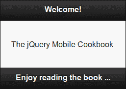
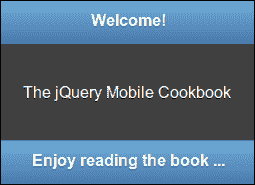
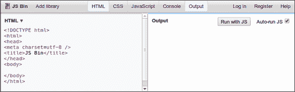
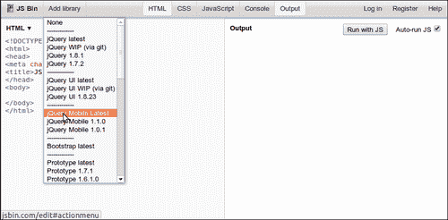
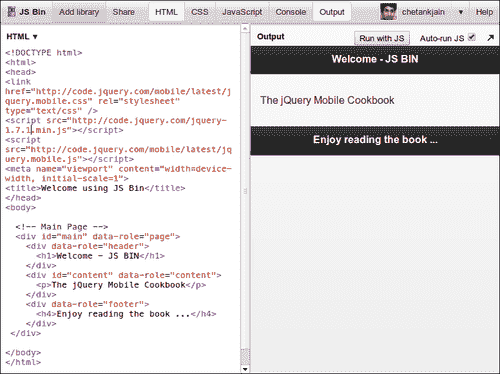

# 第一章：入门

在本章中，我们将涵盖以下内容：

+   编写您的第一个 jQuery Mobile 应用程序

+   使用 JS Bin 创建一个简单的应用程序

# 介绍

**jQuery Mobile 框架**是一个开源的跨平台 UI 框架。它使用 HTML5、CSS3 和非常流行的 jQuery JavaScript 库构建，并遵循开放网络标准。它提供了专为移动设备设计的触摸友好型 UI 小部件。它具有强大的主题框架，可为您的应用程序设置样式。它支持 AJAX 以执行各种任务，如页面导航和过渡效果。

由于 jQuery Mobile 遵循开放网络标准，您可以确保您的应用程序能够在广泛的浏览器和平台上获得最大的支持和兼容性。您只需编写一次应用程序，它就能在 iPhone、iPad、Android 手机和平板电脑、Blackberry、Bada、Windows、Symbian、Meego 甚至即将推出的基于 HTML5 的平台（如 Boot2Gecko 和 Tizen）上无缝运行。同样的代码将在 Chrome、Firefox、Opera、IE、Safari 和桌面上的其他浏览器上运行。此外，它甚至可以在您的智能电视或任何具有与开放网络标准兼容的浏览器的其他设备上运行。市场覆盖潜力是巨大的。

目前认证的支持浏览器、平台和支持等级的列表可在 jQuery Mobile 网站上查看 [`www.jquerymobile.com/gbs`](http://www.jquerymobile.com/gbs)。请注意，某些功能，如 CSS 3D 动画和 AJAX，可能不受某些较老和传统平台的支持。在这种情况下，该框架采用 **渐进增强**。这意味着最初支持基本功能。以后，当更有能力的未来浏览器或平台可用时，您的应用程序将自动利用其功能并提供升级功能。在大多数情况下，您不需要编写代码或以任何方式干预。与移动原生应用程序相比，这是一个很大的优势。

在编写本机应用程序时，您将不得不使用不同的语言编写代码，这取决于平台。然后，您将不得不为每个平台编译代码，并构建可以在设备上运行的二进制包。升级应用程序以支持下一个版本意味着您必须回过头来重新执行整个检查/修复代码、重新构建和重新打包的过程。随着您为更多平台添加支持，这种额外的工作量会不断增加。在某个点之后，整个过程就变得难以管理。您最好只支持应用程序的前一两个平台。

当然，使用原生应用程序也有优势。你的应用程序的性能可能是一个非常关键的因素。在某些应用程序中，你必须使用原生应用程序，特别是当你期望实时响应时。此外，使用原生应用程序，你可以访问核心操作系统和设备功能，例如摄像头、加速计、联系人和日历。今天使用 HTML5 实现这些并不容易。

**HTML5**是移动应用程序的一个相对新的参与者。但是差距正在逐渐缩小。已经有库可用，使用简单的 JavaScript API 暴露原生功能，该 API 直接可用于你的 HTML5 应用程序。PhoneGap 就是这样一个流行的库。Firefox 的 Boot2Gecko 和 Intel/Samsung 的 Tizen 完全基于 HTML5，你应该能够直接从浏览器中访问核心设备功能。未来看起来非常有前途。

jQuery Mobile 框架拥有大量的插件和工具，可以帮助您构建应用程序。它拥有一个非常活跃和充满活力的开发者社区，并且不断添加新功能。它受到诸如 Filament Group、Mozilla、Nokia、Palm、Adobe、Rhomobile 等公司的大力支持。在它的第一年（2011 年），该框架已经获得了 Packt 开源奖和.NET 创新奖等奖项。

基于 Web 的移动应用程序已经发展了。在早期，它们使用纯原生代码进行 UI 开发，然后出现了 Flash 和其他基于插件的 UI（例如 Silverlight）。但是，即使是 Adobe 和微软（使用其 Windows 8 平台）也在全力推进 HTML5 开发。因此，情况非常适合像 jQuery Mobile 这样的基于开源 Web 标准的跨平台框架迅猛增长。

jQuery Mobile 框架要求你对大多数基本任务和构建 UI 使用声明性语法（HTML 标记）。你必须仅在声明性语法无法帮助的情况下以及当然要添加你的应用程序逻辑时，才退回到只使用 JavaScript 编写脚本。这与今天市场上的许多其他 UI 框架不同。其他框架要求你编写更多的 JavaScript，并且学习曲线更陡峭。

如果你熟悉 HTML、CSS 和 jQuery/JavaScript，那么学习 jQuery Mobile 将会变得非常容易。有许多流行的 IDE 和 UI 构建工具可供您使用，以便通过可视化拖放 UI 控件并在 jQuery Mobile 中进行开发。但是，要开始，你只需要你喜欢的文本编辑器来编写代码。你还需要一个浏览器（在你的桌面或移动设备上运行）来测试应用程序。现在，你已经准备好编写你的第一个 jQuery Mobile 跨平台应用程序了。

# 编写你的第一个 jQuery Mobile 应用程序

简单的 jQuery Mobile 应用程序由一个页面组成，这是构建应用程序的基本构建块。页面遵循具有三个主要部分的基本结构，即**页眉**、**页面内容** 和**页脚**。您可以使用多个页面构建功能丰富的应用程序，每个页面具有自己的功能、逻辑和导航流程。此示例展示了如何创建一个页面并编写您的第一个 jQuery Mobile 应用程序。

## 准备就绪

从 `code/01/welcome` 文件夹复制此示例的完整代码。您可以使用以下 URL 启动此代码：`http://localhost:8080/01/welcome/main.html`。

## 如何做...

执行以下步骤：

1.  使用您喜欢的文本编辑器创建以下 `main.html` 文件：

    ```js
    <!DOCTYPE html>
    <html>
      <head>
        <title>Welcome</title>
        <meta name='viewport' content='width=device-width, 
          initial-scale=1'>
    ```

1.  包含 jQuery 和 jQuery Mobile JavaScript 文件：

    ```js
     <link rel='stylesheet' href='http://code.jquery.com
     /mobile/1.1.1/jquery.mobile-1.1.1.min.css' />
     <script src='http://code.jquery.com/jquery-
     1.7.1.min.js'></script>
     <script src='http://code.jquery.com/mobile
     /1.1.1/jquery.mobile-1.1.1.min.js'></script>
      </head>
      <body>
    ```

1.  创建 jQuery Mobile 页面：

    ```js
        <!-- Main Page -->
     <div id='main' data-role='page'>
          <div data-role='header'>
            <h1>Welcome!</h1>
          </div>
     <div id='content' data-role='content'>
            <p>The jQuery Mobile Cookbook</p>
          </div>
     <div data-role='footer'>
            <h4>Enjoy reading the book ...</h4>
          </div>
        </div>
      </body>
    </html>
    ```

## 它是如何工作的...

创建 `main.html` 作为一个以 `<!DOCTYPE html>` 声明开始的 HTML5 文档。在文件的 `<head>` 标签中，添加一个 `<meta>` 标签，并通过使用 `content='width=device-width'` 属性指定视口应占用整个设备宽度。通过使用指向 jQuery Mobile 内容交付网络 (CDN) 站点上 CSS 文件位置的 `<link>` 标签，包含 jQuery Mobile 样式表。

接下来，包含 JavaScript 库；先是 jQuery，然后是 jQuery Mobile JavaScript 文件。使用 `<script>` 标签，将 `src` 指向 CDN 位置，如代码所示。现在您已经准备好创建页面了。

页面、其页眉、页脚和内容都是 `<div>` 容器，通过使用 `data-role` 属性进行样式设置。在 `<body>` 标签中添加一个带有 `data-role='page'` 的 `<div>` 标签。在页面内作为子元素分别添加三个带有 `data-role='header'`、`'content'` 和最后 `'footer'` 的 `<div>` 标签。这将分别创建页面的页眉、内容和页脚。您可以在这些 `<div>` 标签内添加任何文本、表单、列表或其他 HTML 控件。框架将以触摸友好的移动启用样式增强和渲染控件。

现在，使用您喜欢的浏览器打开 `main.html` 文件，您将看到类似以下截图的输出：



在不同的浏览器、移动设备和平板电脑中打开并比较此文件的输出。您将看到在所有符合规范和认证的浏览器/设备上，页面都会打开并且看起来几乎一样。

恭喜！您刚刚创建了您的第一个跨平台 jQuery Mobile Web 应用程序。

## 还有更多...

在编写此示例时，jQuery Mobile v1.1.1 是稳定版本，并在本书中的所有示例中使用。建议使用的支持的 jQuery 库是 jQuery v1.7.1。

您可以直接从 jQuery Mobile CDN 使用库，就像本示例中所示的那样。您还可以从 [`www.jquerymobile.com/download`](http://www.jquerymobile.com/download) 下载库文件（以单个压缩文件的形式提供），并将文件托管到您的网络中。当本地托管时，您只需更新代码中的链接，以指向文件在您的网络上的正确位置（或您硬盘上的路径），如下面的代码片段所示：

```js
<link rel="stylesheet" href='[local path]/jquery.mobile-
  1.1.1.min.css' />
<script src='[local path]/jquery-1.7.1.min.js'></script>
<script src='[local path]/mobile/1.1.1/jquery.mobile-
  1.1.1.min.js'></script>
```

### 页面主题

默认情况下，框架提供了五种基本的颜色方案或组合，称为**颜色样本**。它们被命名为 `a`、`b`、`c`、`d` 和 `e`。默认情况下，创建页面时使用样本 `d`。这使得页面具有白色和黑色的明亮组合，如前面的屏幕截图所示。您可以通过使用 `data-theme` 属性来更改页面和页眉/页脚的颜色样本，如以下代码片段所示：

```js
<div data-role='page' data-theme='a'>
  <div data-role='header' data-theme='b'>
….
  <div data-role='footer' data-theme='b'>
```

输出现在将类似于以下屏幕截图：



## 另请参阅

+   *使用 JS Bin 创建一个简单应用程序*示例

+   第二章中的*编写单页模板应用程序*和*编写多页模板应用程序*示例，*页面和对话框*

# 使用 JS Bin 创建一个简单应用程序

**JS Bin** 是由 *Remy Sharp* 开发的开源网络应用程序，位于 [`www.jsbin.com`](http://www.jsbin.com)。JS Bin 允许您在线直接输入您的 HTML、CSS 和 JavaScript 代码，并允许您包含所需的 jQuery 和 jQuery Mobile 库。您可以添加和直接运行您的 JavaScript 代码，并在浏览器上预览输出。您还可以共享您的代码，并与他人合作进行审查或故障排除。一切按照预期工作后，您最终可以下载您的代码。这是一个非常受许多 jQuery Mobile 开发人员欢迎的工具。本示例向您展示了如何使用 JS Bin 创建一个简单的 jQuery Mobile 应用程序。

## 准备就绪

本示例中的代码是使用 [JS Bin 网页应用](http://www.jsbin.com) 创建的。代码位于 `code/01/jsbin` 源文件夹中。您可以使用 `http://localhost:8080/01/jsbin/main.html` URL 启动代码。

## 如何实现...

1.  打开 [JS Bin 网页应用工具](http://www.jsbin.com)，你会看到一个基本的 HTML 模板。

1.  在左上角面板上选择 **添加库** 链接，并包含最新的 jQuery Mobile 库文件。接下来，编辑 `<head>` 部分，如以下代码片段所示：

    ```js
    <html>
      <head>
        <link href="http://code.jquery.com/mobile/latest
          /jquery.mobile.css" rel="stylesheet" type="text/css" />
     <script src="http://code.jquery.com
     /jquery-1.7.1.min.js"></script>
        <script src="http://code.jquery.com
          /mobile/latest/jquery.mobile.js"></script>
     <meta name="viewport" content="width=device-width, 
     initial-scale=1">
     <title>Welcome using JS Bin</title>
      </head>
    ```

1.  向 `<body>` 部分添加代码以创建一个简单的 jQuery Mobile 页面：

    ```js
      <body>
        <!-- Main Page -->
        <div id="main" data-role="page">
          <div data-role="header">
            <h1>Welcome - JS BIN</h1>
          </div>
          <div id="content" data-role="content">
            <p>The jQuery Mobile Cookbook</p>
          </div>
          <div data-role="footer">
            <h4>Enjoy reading the book ...</h4>
          </div>
        </div>
      </body>
    </html>
    ```

1.  预览或输出现在显示在屏幕右侧的 **输出** 面板中。

1.  您现在可以下载源文件（或将其复制粘贴到本地文件中），以获得一个简单的可工作的 jQuery Mobile 应用程序。

## 工作原理...

在浏览器中启动 JS Bin Web 应用程序。您将在浏览器中看到以下屏幕，左侧有一个基本的 HTML 模板（您可以编辑），顶部有一个菜单栏，右侧有一个**输出**窗格，可立即预览代码的输出：



您可以单击各种菜单选项，查看**CSS**或**JavaScript**窗格如何可见或隐藏。选择**自动运行 JS**选项将允许您自动运行您的 JS 代码；您可以将其保留。您也可以通过单击**Run with JS**按钮手动运行脚本。

单击**添加库**菜单选项，并选择**jQuery Mobile Latest**选项，如下截图所示：



这将在 HTML 的`<head>`部分包含指向 jQuery Mobile 和 jQuery 库的链接和引用。

### 注意

当您使用 JS Bin 添加 jQuery Mobile 库到您的代码时，请确保编辑并设置要与您的应用程序一起使用的 jQuery Mobile 和 jQuery 库的正确版本。在编写此示例时，JS Bin 使用的是 jQuery v1.6.4，而 jQuery v1.7.1 推荐与 jQuery Mobile v1.1.1 一起使用。

接下来，编辑`<meta>`标签以设置正确的视口`宽度`和`缩放`，如代码所示。然后，使用`data-role="page"`的`div`标签向`<body>`标签添加一个页面。创建标题(`data-role="header"`)、页面内容(`data-role="content"`)和页脚(`data-role="footer"`)，如所示。当您添加这些部分时，您会注意到屏幕右侧的**输出**窗格会更新，并显示代码的输出预览。



您还可以添加 CSS 样式和 JavaScript，并检查其工作原理。最后，您的代码已准备就绪，您可以将其复制粘贴到本地编辑器中。您还可以点击左上角的**JS Bin**菜单选项下载文件。现在，启动本地文件在浏览器中，您会发现输出与 JS Bin 的**输出**窗格中显示的内容相匹配。

## 还有更多...

这个示例向您展示了使用 JS Bin 创建基本 jQuery Mobile 应用程序所需的简单步骤。JS Bin 提供了许多方便使用的功能，例如创建和使用准备好的模板、使用 GitHub 保存和分叉您的代码以及克隆您的代码。此工具最适合您想要在线存储文件并在源文件上进行协作时使用。有关使用 JS Bin 的更多信息和教程，请参阅[`jsbin.tumblr.com/`](http://jsbin.tumblr.com/)。

### 注意

您可以免费注册并使用您的用户帐户登录 JS Bin 以使用保存、下载或克隆功能。没有用户登录时只提供基本功能。

## 另请参阅

+   *编写您的第一个 jQuery Mobile 应用程序*示例
