# 第二章：页面和对话框

在本章中，我们将讨论：

+   编写单页模板应用程序

+   编写多页模板应用程序

+   预取页面以实现更快的导航

+   使用 DOM 缓存以提高性能

+   自定义样式对话框

+   使用 CSS 创建跳转页面过渡效果

+   使用 JS 创建幻灯片和淡入淡出的页面过渡效果

+   使用`data-url`处理登录页面导航

+   使用 History API 创建自定义错误弹出框

# 介绍

一个**页面**是写在`<div data-role="page">`容器内的基本 jQuery Mobile 对象，它显示在屏幕上。它可以包含页眉、页面内容和页脚。您可以在页面内嵌入各种 HTML5 控件和微件。jQuery Mobile 框架会自动增强和显示所有这些控件，使它们适合轻触（手指触摸）。您的应用程序可以有一系列单独的 HTML 文件，每个文件代表一个单独的页面，或者可以有一个包含多个页面`div`容器的单个 HTML 文件。您可以提供链接以在一个页面内打开其他页面，用户点击链接时，新页面将使用 Ajax 和 CSS3 动画打开。当前页面然后不再显示。

一个**对话框**是具有`data-role="dialog"`属性的页面。您还可以通过为页面链接添加`data-rel="dialog"`属性来将页面加载为对话框。对话框的样式与页面不同，并且出现在页面上方的屏幕中间。对话框的标题栏还提供了一个关闭按钮。

# 编写单页模板应用程序

在**单页模板**应用程序中，应用程序的每个页面都有自己的 HTML 文件。页面包装在`<div data-role="page">`内。启动应用程序时，jQuery Mobile 框架将第一页（或主要页面）加载到 DOM 中，并在整个应用程序周期中保留其引用。当用户导航到另一个页面时，主页面仅被隐藏，并且现在标记为活动页面的其他所有页面都会从 DOM 中被删除。页面之间的导航使用锚链接指定。锚链接使用`data-role="button"`属性装饰为按钮。单击任何链接时，将使用一些精彩的 CSS3 过渡进行导航，并通过 Ajax 拉入新页面。

此示例向您展示如何创建一个单页模板应用程序，并在应用程序的页面之间导航。

## 准备工作

从`code/02/single-page`源文件夹中复制此示例的完整代码。您可以使用`http://localhost:8080/02/single-page/main.html`网址启动此代码。

## 如何做...

执行以下步骤：

1.  创建`main.html`，并向其中添加一个包含页眉、页脚和页面内容的页面容器。添加打开`page2.html`的链接：

    ```js
    <div id="main" data-role="page">
      <div data-role="header">
        <h1>Header of main.html</h1>
      </div>
      <div data-role="content">
     <a href="page2.html" data-role="button">
     Go to Page 2</a>
       </div>
     <div data-role="footer">
       <h4>Footer of main.html</h4>
     </div>
    </div>
    ```

1.  由于这是一个单页模板应用程序，将每个页面添加到自己的 HTML 文件中。接下来，创建`page2.html`并将应用程序的第二个页面添加到其中。添加一个链接以返回到`main.html`。

    ```js
    <div id="page2" data-role="page">
      <div data-role="header">
        <h1>Header of page2.html</h1>
      </div>
      <div data-role="content">
     <a href="#" data-role="button" data-rel="back" 
     data-theme="b">Go Back</a>
      </div>
      <div data-role="footer">
        <h4>Footer of page2.html</h4>
      </div>
    </div>
    ```

## 它是如何工作的...

创建`main.html`，并使用指定了`data-role="page"`属性的`<div>`页面容器向其中添加页面。按照代码所示的方式，添加页眉、页脚和页面内容。现在，在页面内容中，添加一个锚链接以打开第二页`page2.html`。你可以使用`data-role="button"`属性来将此链接样式化为按钮。

接下来，创建`page2.html`并使用指定了`data-role="page"`属性的`<div>`页面容器向其中添加页面。按照代码清单中所示的方式，添加页眉、页脚和页面内容。在页面内容中，添加一个锚链接以返回到`main.html`。同时，设置`data-role="button"`属性来将此链接样式化为按钮。

现在，当你启动应用程序时，`main.html`页面首先加载到 DOM 中。此页面在整个应用程序的生命周期内保持在 DOM 中。如下图所示：

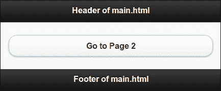

当你点击按钮打开`page2.html`时，主页面被隐藏，`page2.html`被显示并激活，如下图所示：

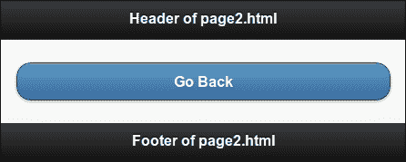

现在，点击链接返回到`main.html`。浏览器再次打开`main.html`页面并隐藏`page2.html`。

在`page2.html`中，锚按钮具有`data-rel="back"`属性。这表示应该加载浏览器历史记录中的上一个页面。`href`链接将被忽略，因此可以将其设置为`#`。

### 提示

**为单页模板应用程序设置标题**

使用`<title>`标签为单页应用的每个页面设置页面标题。这样可以确保在浏览应用程序的各个页面时显示相关的标题。

## 还有更多...

推荐大多数应用程序使用单页模板，原因如下：

+   页面更轻量、更干净、更模块化，因此更易于维护。

+   DOM 大小相对较小。

+   页面在多个平台和环境下工作良好。它们即使在不支持 JavaScript 的情况下也可以工作。这样可以使你的应用程序能够覆盖更多设备。

另一方面：

+   每次访问页面时都会生成一个新的请求，这会消耗更多的带宽。

+   再次打开先前加载的页面将生成一个全新的请求。

+   第一次加载更快，但随后每个页面都必须被获取。

总之，单页模板应用程序更适合于较大的应用程序以及希望覆盖尽可能多平台的情况。

### 关闭 Ajax 导航

在此示例中，在`#page2`中，`href`值设置为`#`。如果您将`href`值设置为页面的绝对或相对 URL，即`href="main.html"`，那么 Ajax 导航仍将工作。要防止通过 Ajax 加载页面，请将`data-ajax="false"`属性添加到链接中。当关闭 Ajax 时，框架将不使用自定义 CSS3 过渡。

```js
<a href="page2.html" data-role="button" data-ajax="false">text</a>
```

### 提示

**使用 URL 而不是`data-rel="back"`**

在单页应用程序中导航时，最好始终在锚链接的`href`中使用 URL。这样，Ajax 导航将在支持 Ajax 的情况下工作。在不支持 Ajax 的 C 级浏览器中，应用程序仍将继续工作，因为它使用`href`进行导航。在这样的浏览器中，如果您的应用程序仅依赖于`data-rel="back"`属性，而不使用`href`，那么页面导航将中断。

### 使用`data-rel`和`data-direction`

当您同时向锚链接添加`href`和`data-rel="back"`属性时，框架将忽略`href`属性。页面将仅考虑`data-rel`属性并导航“返回”; 也就是说，它将导航到浏览器历史堆栈中作为前一个条目的页面。如果指定了`data-direction="reverse"`属性，则框架将反转最近使用的页面转换的方向。`data-direction`属性不依赖于`data-rel`属性，并且可以在任何转换中独立使用。

```js
<a href="page2.html" data-role="button" 
    data-direction="reverse">text</a>
```

### 页面容器是可选的

在单页模板应用程序中，指定`<div data-role="page">`页面容器是可选的。页面内容将由 jQuery Mobile 框架自动包装为页面容器。

### 注意

始终使用`div`页面容器来包装您的页面。这样做更易读，更易维护代码。它还允许您向页面添加特定于页面的数据属性，例如`data-theme`。

## 另请参阅

+   *编写多页模板应用*、*为了更快的导航而预取页面*和*使用 DOM 缓存来提高性能*的技巧

+   *编写您的第一个 jQuery Mobile 应用程序*在第一章，*介绍*

# 编写多页模板应用

在多页面模板应用程序中，HTML 文件将包含多个页面。每个页面都包装在 `<div data-role="page">` 中。页面 ID 用于标识页面以便在它们上面进行链接或调用任何操作。页面 ID 在你的应用程序中必须是唯一的。当你启动应用程序时，jQuery Mobile 框架会将所有可用页面加载到 DOM 中，并显示在 HTML 中找到的第一个页面。页面之间的导航通过使用锚链接指定，并且你可以通过使用 `data-role="button"` 属性将这些链接装饰为按钮。单击任何链接时，导航通过一些很酷的 CSS3 过渡发生，并且通过 Ajax 拉入新页面。本配方向你展示如何创建一个多页面模板应用程序，并在其中多个页面之间导航。

## 准备工作

从`code/02/multi-page`源文件夹中复制此配方的完整代码。你可以使用 URL `http://localhost:8080/02/multi-page/main.html` 启动此代码。

## 如何做...

执行以下步骤：

1.  创建 `main.html`，并向其添加 `#main` 页面。按照以下代码片段中所示的方式定义页眉、页面内容和页脚。在页面内容中添加一个链接来打开 `#page2` 页面：

    ```js
    <div id="main" data-role="page">
      <div data-role="header">
        <h1>Header of #main</h1>
      </div>
      <div data-role="content">
     <a href="#page2" data-role="button">Go to Page 2</a>
      </div>
      <div data-role="footer">
        <h4>Footer of #main Page</h4>
      </div>
    </div>
    ```

1.  接下来，在 `main.html` 中，如下所示地在其自己的页面 `div` 容器中添加第二个 `#page2` 页面。向此页面添加页眉、页面内容和页脚。最后，在页面内容中添加一个链接以返回 `#main` 页面：

    ```js
    <div id="page2" data-role="page" data-title="Multi-Page Template">
      <div data-role="header">
        <h1>Header of #page2</h1>
      </div>
      <div data-role="content">
     <a href="#" data-role="button" data-rel="back" data-theme="b">Go Back</a>
      </div>
      <div data-role="footer">
        <h4>Footer of #page2</h4>
      </div>
    </div>
    ```

    ### 提示

    **下载示例代码**

    你可以从你在[`www.PacktPub.com`](http://www.PacktPub.com)账户购买的所有 Packt 书籍中下载示例代码文件。如果你在其他地方购买了这本书，你可以访问[`www.PacktPub.com/support`](http://www.PacktPub.com/support)并注册，直接将文件通过电子邮件发送给你。

## 工作原理...

创建`main.html`，并向其添加两个页面，`#main` 和 `#page2`。首先，使用指定了 `data-role="page"` 属性的 `<div>` 页面容器添加 `#main` 页面。按照代码中所示的方式添加页眉、页脚和页面内容。现在，添加一个锚链接到页面内容，以打开第二个页面 `#page2`。你可以通过使用 `data-role="button"` 属性将此链接样式化为按钮。

接下来，使用指定了 `data-role="page"` 属性的 `<div>` 页面容器添加 `#page2` 页面。按照代码列表中所示的方式向其添加页眉、页脚和页面内容。在这里，页面内容中添加了回到 `#main` 页面的锚链接。设置 `data-role="button"` 属性将其样式化为按钮。还将 `data-rel="back"` 属性添加到其中。这指示 jQuery Mobile 框架，此链接应打开浏览器历史记录中可用的上一页。

现在，当你启动应用时，所有页面都加载到 DOM 中，并在整个应用的生命周期内保留在 DOM 中。框架将打开它找到的第一个页面。所以，`#main`显示有一个按钮可以打开`#page2`，如下所示：

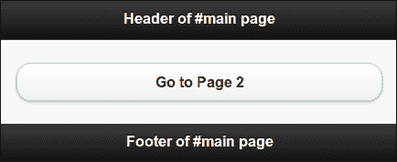

当你点击按钮打开第二个页面时，`#main`页面会从视图中隐藏，而`#page2`页面会显示并激活，如下所示：

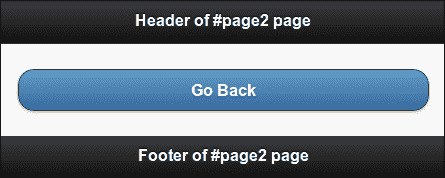

最后，点击链接返回`#main`页面。由于使用了`data-rel="back"`，浏览器会再次打开`#main`页面并隐藏`#page2`。

### 提示

**为多页面模板应用设置标题**

使用`<title>`标签为多页面模板应用的第一个或主要页面设置页面标题。使用`data-title`属性为所有其他页面设置标题。这将确保每个页面显示正确的标题。

## 还有...

在使用多页面模板构建应用之前，建议考虑以下因素：

+   多页面模板应用由于 DOM 尺寸较大而更加沉重。

+   由于所有页面都预加载到 DOM 中，因此 DOM 尺寸较大且更沉重。

+   应用需要 JavaScript 支持。这会限制你的目标平台选择，并且你可能需要忽略许多流行的旧平台。但随着老旧电话/平台逐渐淘汰，这个排除列表正在变得越来越短。

此外：

+   只有第一次页面加载较慢，但后续的页面导航都很快。

+   所有页面都预加载到 DOM 中，因此后续页面导航不需要新请求（到服务器）。这意味着更少的带宽。

总之，多页面模板应用更适合相对较小的应用和你知道目标平台能力（包括 JavaScript 支持）的情况。

### 注意

jQuery Mobile 支持的浏览器和平台的更新列表可在[`www.jquerymobile.com/gbs`](http://www.jquerymobile.com/gbs)找到。它还详细说明了这些平台上提供的支持等级。

### 使用过渡效果

`data-transition`属性可用于指定 jQuery Mobile 默认可用的各种过渡效果。下面的代码使用了翻转过渡效果来打开`#page2`：

```js
<a href="#page2" data-transition="flip" data-role="button">text</a>
```

### 关闭 Ajax 导航

如果在加载多模板应用中的页面时传递了`data-ajax="false"`属性，则这并不完全停止了 Ajax 导航。无论`data-transition`属性中指定的过渡效果如何，都将使用默认的淡入淡出过渡效果来加载页面。

```js
<a href="#page2" data-ajax="false" data-role="button">text</a>
```

### 页面容器是必须的

对于多页面模板应用内的所有页面，指定`<div data-role="page">`页面容器是必需的。无论是单页面模板还是多页面模板，都使用页面容器来制作你的应用和所有页面。

## 另请参见

+   *编写单页模板应用程序*、*为了更快地导航而预取页面*和*使用 DOM 缓存来提高性能*的配方

+   *编写您的第一个 jQuery Mobile 应用程序*在第一章中的*介绍*中的配方

# 为了更快地导航而预取页面

使用单页模板制作移动应用程序使您的移动应用程序更快、更轻便。但是在导航期间必须获取每个页面。每次加载页面时，您都可以看到`ui-loader`旋转图标。这个问题在多页模板应用程序中不会发生，因为所有页面都已经预加载到 DOM 中。通过使用**预取**功能，可以使单页模板应用程序模仿多页模板应用程序。

预取的页面在后台加载，并在用户尝试打开它时立即可用。可以通过两种方式预取页面。第一种是只需将`data-prefetch`属性添加到锚链接。第二种方式是使用 JavaScript 调用`loadPage()`方法。本配方向您展示如何通过在您的 jQuery Mobile 应用程序中预取页面来提高页面加载速度。

## 准备工作

从`code/02/prefetch`源文件夹中复制此配方的完整代码。您可以使用 URL `http://localhost:8080/02/prefetch/main.html`来启动此代码。

## 如何操作...

应该遵循的步骤是：

1.  创建`main.html`并向其添加两个链接。第一个链接指向`prefetch.html`，第二个链接指向`prefetch-JS.html`。在加载`main.html`文件后，其中的链接页面可以使用第一个链接上的`data-prefetch`属性在后台预取，如以下代码片段所示：

    ```js
    <div id="main" data-role="page">
      <div data-role="header">
        <h1>Header of Main Page</h1>
      </div>
      <div data-role="content">
     <a href="prefetch.html" data-role="button" 
     data-prefetch>Prefetch Page</a> 
        <a href="prefetch-JS.html" data-role="button">
            Prefetch Page using JS</a>
      </div>
      <div data-role="footer">
        <h4>Footer of Main Page</h4>
      </div>
    </div>
    ```

1.  接下来，将以下代码片段中给出的 JavaScript 添加到`main.html`的`<head>`部分。在这里，使用`loadPage()`方法将`prefetch-JS.html`文件后台加载到 DOM 中：

    ```js
      $("#main").live("pageshow", function(event, data) {
     $.mobile.loadPage( "prefetch-JS.html", 
     { showLoadMsg: false } );
      });
    </script>
    ```

1.  现在，按照以下代码片段所示创建`prefetch.html`文件。这是一个常规页面，通过`data-prefetch`属性在`main.html`页面（在步骤 1 中）中预取。还要添加一个链接以返回到`main.html`：

    ```js
    <div id="prefetch" data-role="page">
      <div data-role="header">
        <h1>Header of Prefetched Page</h1>
      </div>
      <div data-role="content">
        <a href="#" data-role="button" data-rel="back" 
            data-theme="b">Go Back</a>
      </div>
      <div data-role="footer">
        <h4>Footer of Prefetched Page</h4>
      </div>
    </div>
    ```

1.  你会看到在第 2 步中，使用 JavaScript 预取了`prefetchJS.html`。现在，按照以下代码片段所示创建`prefetchJS.html`，并添加一个链接以返回到`main.html`：

    ```js
    <div id="jsprefetch" data-role="page">
      <div data-role="header">
        <h1>Header of JS Prefetched Page</h1>
      </div>
      <div data-role="content">
        <a href="#" data-role="button" data-rel="back" 
            data-theme="b">Go Back</a>
      </div>
      <div data-role="footer">
        <h4>Footer of JS Prefetched Page</h4>
      </div>
    </div>
    ```

## 工作原理...

创建`main.html`，并向其添加两个链接。将第一个链接指向`prefetch.html`，并将`data-prefetch`属性设置为此链接。此页面现在在`main.html`加载时会自动在后台获取，并在打开`main.html`时立即可用。

将第二个链接指向`prefetch-JS.html`文件。要使用 JavaScript 预取此页面，请为`#main`的`pageshow`事件添加事件处理程序。在此回调函数中，调用`loadPage()`方法以获取`prefetch-JS.html`文件。还设置`showLoadMsg`选项为`false`，以防止显示旋转的`页面 ui-loader`消息。接下来，按照代码中所示创建两个 HTML 文件。在这两个页面中都添加返回到`main.html`的链接。

现在，当您启动应用程序时，两个 HTML 文件都会被预取。您可以使用浏览器的代码检查器观察此预取行为，如下面的截图所示：

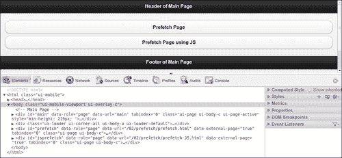

此截图显示了在加载`main.html`页面后的 Google Chrome 浏览器中的代码检查器。我们可以看到`#prefetch`和`#jsprefetch`页面已经被预取并在 DOM 中可用。现在，导航到这些预取页面几乎是即时的，旋转的`ui-loader`图标动画不会显示出来。这使得您的应用程序速度更快，并为用户提供了更好的用户体验。如果没有使用预取，只有在导航到它时才会加载页面。

使用`data-prefetch`属性是预取页面的更简单方法，因为您不必再写任何代码。但是，使用`loadPage()`用 JavaScript 预取页面允许您向`loadPage()`方法提供更多选项，并更好地控制页面加载的行为。您还可以使用此方法构建有条件的预取。

## 还有更多...

避免在太多页面上使用预取，因为所有页面都必须被获取并存储在 DOM 中。这意味着更多的内存利用率，而内存在移动设备上是一种稀缺资源。这会减慢您的应用程序。预取的页面越多，意味着利用的带宽越多。因此，请谨慎使用。

### 当预取未完成时

如果页面尚未完全预取，并且您尝试导航到该页面，则`ui-loader`旋转器将出现，并且只有在页面完全获取后才会显示该页面。这可能发生在较慢的连接上。

### 预取的页面不会永久缓存

当页面被预取时，它会在 DOM 中可用。如果您导航到此页面，然后再次导航，该页面将自动从 DOM 中删除。因此，如果它是一个频繁访问的页面，您必须将其添加到 DOM 缓存中。

## 请参阅

+   *使用 DOM 缓存来提高性能* 配方

+   在第九章*方法和实用程序*中的*使用 loadPage()加载页面* 配方

# 使用 DOM 缓存来提高性能

在单页模板应用程序中的页面导航期间，每个新页面都会被提取并存储在 DOM 中。该页面留在 DOM 中，并在您从该页面导航离开时被删除。只有应用程序的主页面或第一个页面始终留在 DOM 中。如前面的示例所示，预取常用页面可能在一定程度上有助于提高性能。但是当您访问一个预取的页面并从中导航离开时，该页面将从缓存中移除。因此，频繁访问页面的多次提取问题并未完全解决。

使用 DOM 缓存，特定页面会在 DOM 中标记为缓存。这些页面一旦加载，就会在应用程序的整个生命周期内保留在 DOM 中。你可以以两种方式使用 DOM 缓存。第一种是通过向要缓存的页面的页面容器添加`data-dom-cache`属性。第二种方式是使用 JavaScript。本教程向你展示如何通过使用 DOM 缓存来提高应用程序的性能。

## 准备工作

从`code/02/dom-cache`源文件夹复制此教程的完整代码。您可以使用 URL `http://localhost:8080/02/dom-cache/main.html`启动此代码。

## 如何实现...

需要遵循的步骤包括：

1.  创建`main.html`文件，并添加链接以导航到两个页面，`cached.html`和`cached-JS.html`。而这两个页面又指定它们在 DOM 中应该被缓存：

    ```js
    <div id="main" data-role="page">
      <div data-role="header">
        <h1>Header of Main Page</h1>
      </div>
      <div data-role="content">
        <a href="cached.html" data-role="button">
          Cached Page
        </a>
        <a href="cached-JS.html" data-role="button">
          JS Cached Page
        </a>
      </div>
      <div data-role="footer">
        <h4>Footer of Main Page</h4>
      </div>
    </div>
    ```

1.  创建`cached.html`页面，并将其页面容器的`data-dom-cache`属性设置为 true。还添加一个按钮以返回到`main.html`页面：

    ```js
    <div id="cached" data-role="page" data-dom-cache="true">
      <div data-role="header">
        <h1>Header of Cached Page</h1>
      </div>
      <div data-role="content">
        <a href="#" data-role="button" data-rel="back">
          Go Back
        </a>
      </div>
      <div data-role="footer">
        <h4>Footer of Cached Page</h4>
      </div
    </div>
    ```

1.  最后，创建`cached-JS.html`文件，并通过添加到页面的`div`容器的 JavaScript 来将其缓存，如下面的代码段所示。添加一个按钮以导航回到`main.html`：

    ```js
    <div id="jscached" data-role="page">
      <script>
     $("#jscached").page({ domCache: true });
      </script>

      <div data-role="header">
        <h1>Header of JS Cached Page</h1>
      </div>
      <div data-role="content">
        <a href="#" data-role="button" data-rel="back">
          Go Back
        </a>
      </div>
      <div data-role="footer">
        <h4>Footer of JS Cached Page</h4>
      </div
    </div>
    ```

## 工作原理...

创建`main.html`并添加两个链接，以打开`cached.html`和`cached-JS.html`文件。接下来，创建`cached.html`文件，并添加一个返回`main.html`的链接。在这里，将`data-dom-cache="true"`属性设置为页面容器。这表示页面在加载后必须在 DOM 中缓存。

现在创建`cached-JS.html`文件，并添加返回到`main.html`的链接。在这里，将给定的脚本添加到页面的`div`容器中。在脚本中，将页面的`domCache`选项设置为`true`。现在，当加载此页面时，它将被缓存在 DOM 中。

启动应用程序并在页面之间导航。在页面导航期间，每个新页面都会被提取并存储在 DOM 中。您可以使用浏览器的代码检查器观察 DOM 缓存的行为。以下图片显示了 Chrome 代码检查器快照，显示了两个页面都被访问并在 DOM 中被缓存后的情况。当前活动的页面显示为`#main`；这通过将`ui-page-active`类添加到页面的`div`容器来指示。其他两个页面也被缓存，并且在 DOM 中也是可用的。

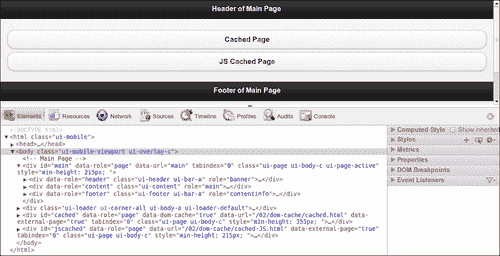

### 提示

**将脚本添加到页面的 div 而不是<head>元素**

当使用 Ajax 导航时，`<head>`部分仅在第一个页面或应用程序的主页面上处理。忽略了其余页面的`<head>`元素，仅处理它们页面的`div`容器。因此，为了确保您的脚本在这些页面中执行，您必须在页面的`div`容器内包含`<script>`标签。

## 还有更多...

如果你想缓存应用程序中曾经访问过的所有页面，那么在每个页面中添加缓存选项将变得很麻烦。有一种方法可以使用 JavaScript 在全局范围内执行此操作。将以下脚本添加到主页的`<head>`部分。现在，每次访问的页面都会自动在 DOM 中缓存起来。

```js
<script>
 $.mobile.page.prototype.options.domCache = true;
</script>
```

### DOM 缓存可能会减慢应用程序的运行速度

在 DOM 中缓存大量页面可能会使您的应用程序变得非常笨重，并减慢其运行速度。在这种情况下，您将不得不编写额外的代码来管理 DOM 中缓存的页面，并执行任何所需的清理操作。因此，只在选定的频繁访问页面上使用 DOM 缓存。

## 另请参阅

+   *预取页面以加快导航速度* 示例

# 自定义对话框样式

你可以通过在页面容器上使用`data-role="dialog"`属性来将页面样式化为对话框。您还可以在用于打开页面的锚链接中指定`data-rel="dialog"`属性。页面现在会被样式化为对话框，并以弹出过渡方式打开。当您向对话框添加标题时，默认情况下，关闭图标会在标题的左侧创建。在某些应用程序/平台中，您可能希望将此关闭按钮定位在标题的右侧。没有现成的选项可用来更改此图标的位置。本示例向您展示了如何构建一个具有自定义样式标题的对话框，以将关闭按钮定位在标题的右侧。

## 准备工作

从`code/02/custom-dialog`源文件夹中复制此示例的完整代码。你可以使用网址`http://localhost:8080/02/custom-dialog/main.html`来运行此代码。

## 如何操作...

需要执行的步骤是：

1.  使用`#main`页面创建`main.html`。在这里添加一个链接，以使用`data-rel="dialog"`属性将`#customdialog`页面作为对话框打开：

    ```js
    <div id="main" data-role="page">
      <div data-role="header">
        <h1>Header of Main Page</h1>
      </div>
      <div data-role="content">
     <a href="#customdialog" data-role="button" 
     data-rel="dialog">Open Custom Dialog</a>
      </div>
      <div data-role="footer">
        <h4>Footer of Main Page</h4>
      </div>
    </div>
    ```

1.  在`main.html`中创建`#customdialog`页面，并将自定义标题添加到对话框中，将关闭按钮定位在标题的右侧。在此代码中阻止了默认标题的增强功能：

    ```js
    <div id="customdialog" data-role="page">  
     <div class="ui-corner-top ui-overlay-shadow ui-header ui-bar-a" 
     role="banner">
     <a href="#main" data-icon="delete" data-iconpos="notext" 
     class="ui-btn-right ui-btn ui-btn-icon-notext ui-btn-corner-
     all ui-shadow ui-btn-up-a" title="Close" data-theme="a" data-
     transition="pop" data-direction="reverse">
          <span class="ui-btn-inner ui-btn-corner-all">
            <span class="ui-btn-text">Close</span>
     <span class="ui-icon ui-icon-delete ui-icon-shadow"></span>
          </span>
        </a>
        <h1 class="ui-title" tabindex="0" role="heading" 
            aria-level="1">Custom Dialog</h1>
      </div>
    ```

1.  最后，添加页面内容并添加一个链接，以返回到`#main`页面：

    ```js
      <div data-role="content">
        <a href="#" data-role="button" data-rel="back" 
            data-theme="b">Go Back</a>
      </div>
      <div data-role="footer">
        <h4>Footer of Dialog</h4>
      </div>
    </div>
    ```

## 工作原理...

创建包含两个页面`#main`和`#customdialog`的`main.html`。在`#main`页面中添加一个链接，以设置`data-rel="dialog"`属性打开`#customdialog`页面作为对话框。接下来，创建`#customdialog`页面，并添加一个按钮返回`#main`页面。现在，在`#customdialog`的标题中，不要使用`data-role="header"`属性。这将防止对话框标题使用默认样式进行增强。关闭图标现在不会放置在标题的左侧。现在，可以添加自定义标题并对其进行自定义样式设置，就像之前的代码清单中所示。启动应用程序并打开对话框，您将看到对话框弹出。此对话框现在具有自定义样式的标题，并且关闭图标位于标题的右侧，如以下屏幕截图所示：

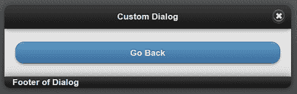

要了解如何得到自定义样式，首先创建一个打开常规对话框的页面。使用浏览器的代码检查器，并观察 jQuery Mobile 框架对对话框标题所做的代码增强。将生成的代码“原样”复制到自定义对话框代码中。然后，必须进行以下各节中提到的更改。

第一个更改是修复关闭图标的位置。您会看到使用添加到标题代码中的锚链接执行关闭操作。在这里，将`ui-btn-left`类替换为`ui-btn-right`类。这将使图标在标题中右侧位置。`jquery.mobile.css`文件中已经包含了这些类定义。

通过此更改，现在关闭图标同时出现在标题的左侧和右侧位置。这是因为标题仍然具有`data-role="header"`属性。这使得框架增强整个标题并自动在左侧添加关闭图标。但是，由于您已经手动添加了所有这些生成的类，现在可以安全地从代码中删除`data-role="header"`属性。保留您添加的所有其他代码和类。现在，当您启动代码时，您只会看到标题右侧位置上的单个关闭图标。

## 还有更多...

此技术非常重要。它可用于自定义 jQuery Mobile 应用程序的外观和感觉。该框架提供了许多基本选项、元素和属性，可以添加到您的应用程序中。然后，框架通过在内部添加更多的标记代码和样式来增强这些内容，使其在您的浏览器中看起来很好。增强的代码在浏览器的**查看源代码**选项中是不可见的。但是，通过代码检查器或调试工具，您可以查看增强的代码，将其复制到您的 HTML 文件中，进行调整，获得您想要的结果。以下屏幕截图显示了使用此方法创建的自定义对话框标题的代码检查器视图：

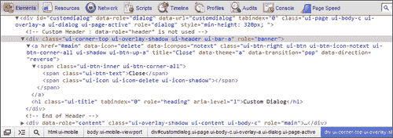

### 自定义 CSS

对话框页面可以通过在自定义 CSS 文件中引入自己的样式来进一步增强。检查`jquery.mobile.css`文件中所有包含`ui-dialog`的类。将要调整的样式复制到您的自定义 CSS 中，并设置适当的新值。下面的代码行显示了一个示例更改，其中将对话框的顶部边距设置为 `-12px`，而不是默认值 `-15px`：

```js
.ui-dialog { margin-top: -12px; };
```

## 另请参阅

+   在第三章中的*向标题添加自定义圆形按钮*配方中，*工具栏*

# 使用 CSS 创建弹跳页面过渡

当您在应用程序的各个页面之间导航时，jQuery Mobile 框架使用 CSS3 动画来显示一些很酷的过渡效果。 **淡入淡出** 过渡默认用于页面，**弹出** 过渡用于对话框。您可以使用特定过渡导航到页面，并且在导航出页面时，您可以反转过渡的方向。截至 v1.1.1 版，jQuery Mobile 自带一套默认的 10 个过渡效果。jQuery Mobile 在线文档中有一个漂亮的在线演示，显示了所有可用的过渡效果。但这还不是全部；您可以使用 CSS 创建自己的自定义过渡效果，并在应用程序中使用它们。此配方向您展示如何使用 CSS 并在页面过渡期间创建弹跳页面效果。

## 准备工作

从`code/02/custom-css-transition`源文件夹中复制此配方的完整代码。您可以使用 URL`http://localhost:8080/02/custom-css-transition/main.html`启动此代码。

## 如何做…

应遵循的步骤是：

1.  创建`customtransition.css`文件，并按以下代码片段所示定义`bounceup`自定义转换。在 CSS 中对页面的 `Y` 位置属性进行动画处理：

    ```js
    .bounceup.in, .bounceup.in.reverse {
      -webkit-transform: translateY(0) ;
     -webkit-animation-name: bounceupin;
      -webkit-animation-duration: 1s;
      -webkit-animation-timing: cubic-bezier(0.1, 0.2, 0.8, 0.9);	    
    }
    @-webkit-keyframes bounceupin {
      0% { -webkit-transform: translateY(100%); }
      90% { -webkit-transform: translateY(-10%); }
      100% {-webkit-transform: translateY(0); }
    }
    ```

1.  定义下一个反向动画：

    ```js
    .bounceup.out, .bounceup.out.reverse {
      -webkit-transform: translateY(100%);
     -webkit-animation-name: bounceupout;
      -webkit-animation-duration: 1s;
      -webkit-animation-timing: cubic-bezier(0.1, 0.2, 0.8, 0.9);
    }
    @-webkit-keyframes bounceupout {
      0% { -webkit-transform: translateY(0); }
      90% { -webkit-transform: translateY(110%); }
      100% {-webkit-transform: translateY(100%); }
    }
    ```

1.  创建`main.html`并在其`<head>`部分中包含对`customtransition.css`样式表的引用，如下所示：

    ```js
    <meta name="viewport" content="width=device-width, 
      initial-scale=1">
    <link rel="stylesheet" href="http://code.jquery.com
      /mobile/1.1.1/jquery.mobile-1.1.1.min.css" /> 
    <link rel="stylesheet" href="customtransition.css" />
    <script src="img/jquery-1.7.1.min.js">
    </script>
    <script src="http://code.jquery.com/mobile
      /1.1.1/jquery.mobile-1.1.1.min.js"></script>
    ```

1.  创建一个带有打开`#page2`链接的`#main`页面。将之前定义的`bounceup`自定义转换设置为`data-transition`属性：

    ```js
    <div id="main" data-role="page">
      <div data-role="header">
        <h1>Header of Main Page</h1>
      </div>
      <div data-role="content">
     <a href="#page2" data-role="button" 
     data-transition="bounceup">Go to Page 2</a>
      </div>
      <div data-role="footer">
        <h4>Footer of Main Page</h4>
      </div>
    </div>
    ```

1.  最后，创建一个带有链接返回`#main`页面的`#page2`页面：

    ```js
    <div id="page2" data-role="page" data-title="Custom 
      Transition using CSS">
      <div data-role="header">
        <h1>Header of Page 2</h1>
      </div>
      <div data-role="content">
        <a href="#" data-role="button" data-rel="back" 
            data-theme="b">Go Back</a>
      </div>
      <div data-role="footer">
        <h4>Footer of Page 2</h4>
      </div>
    </div>
    ```

## 它是如何工作的…

创建`customtransition.css`文件并定义自定义`bounceup`转换。首先，定义`.bounceup.in`和`.bounceup.in.reverse`类，两者具有相同的值。这将使进入新页面和离开新页面（反向）的转换看起来类似。在类中，使用`translateY`属性设置屏幕上新页面的 `Y` 坐标或垂直位置。在给定的持续时间内，使用立方贝塞尔动画曲线对该属性进行动画处理 1 秒。接下来，定义动画`Y`坐标的关键帧（这是使用`bounceupin`动画名称指定的）。关键帧定义了动画中各个时刻的 `Y` 值。

您可以使用一个简单的技巧来获得此动画中使用的弹跳效果。将`Y`的值设置为超出屏幕的 90％持续时间，然后将其设置为 100％持续时间或动画完成时的屏幕边缘。这使得它在新页面动画到屏幕时具有整洁的弹跳效果，短暂地延伸出屏幕，然后回到正确的位置。类似地，当页面导航到屏幕外时，为当前页面定义`.bounceup.out`和`.bounceup.out.reverse`动画，如代码所示。

现在，创建`main.html`，并在`jquery.mobile.css`文件包含之后，在其`<head>`部分包含 CSS 文件。创建`#main`页面，并使用`data-transition="bounceup"`属性添加一个链接以打开`#page2`页面，并使用自定义转换。最后，创建`#page2`页面，并添加一个链接以返回`#main`页面。现在，当你启动应用程序并单击按钮时，页面导航将发生，使用一个漂亮的自定义弹跳动画。

在页面转换期间，有一个**from**页面和一个**to**页面。jQuery Mobile 在 from 页面（当前页面）上应用`out`类样式，并在**to**页面（新页面）上应用`in`类样式。如果要支持反向转换，则在`in`和`out`类后缀中添加单词`reverse`，如 CSS 文件中所示。使用这些样式，jQuery Mobile 将在页面上应用正确的转换效果。您可以进一步调整此配方中的代码，并通过 CSS 动画进行更多页面动画的探索。您可以尽情发挥创意！

## 还有更多...

此配方中列出的 CSS 样式仅支持 web kit 浏览器（Chrome 和 Safari）。您可以进一步探索并尝试在其他浏览器上运行，如 IE、Firefox 或 Opera。您将需要为 CSS 属性添加供应商特定前缀。此外，浏览器应能够支持使用的 CSS 属性。流行浏览器所需的供应商前缀如下所示：

+   **Chrome 和 Safari**：`–webkit`

+   **Opera**：`–o`

+   **Firefox**: `–moz`

+   **IE**：`–ms`

### 向`customtransition.css`文件添加供应商前缀

要为其他浏览器增加支持，您将需要扩展此配方中提供的`customtransition.css`文件。您可以通过添加属性的供应商前缀来执行此操作，如下所示：

```js
.bounceup.in, .bounceup.in.reverse {
  -webkit-transform: translateY(0);
  -moz-transform: translateY(0);
  -ms-transform: translate(0)
  -o-transform: translate(0)
  transform: translate(0)

  -webkit-animation-name: bounceupin;
  -moz-animation-name: bounceupin;
  -ms-animation-name: bounceupin;
  -o-animation-name: bounceupin;
  animation-name: bounceupin;
}
```

对于代码中列出的具有`–webkit`前缀的所有指定 CSS 属性，都必须执行此操作。

### 提示

各种浏览器中的**CSS3 动画支持**

支持 CSS3 动画所需的最低浏览器版本是桌面上的 Chrome、Firefox 5.0、IE 10、Safari 4.0 和 Android 浏览器 4、Firefox 移动版 5.0 以及移动端的 Safari 移动版（iOS 2）。

### 当 CSS3 属性成为标准时

在上述 CSS 中，每个属性的最后一行是它变成标准后的属性名。在这一点上，浏览器将不再支持特定属性的供应商前缀。但是您不必修改 CSS 中的任何一行代码，因为标准属性已经在您的文件中可用。浏览器将跳过它不理解的所有属性，并拾取标准属性。所以一切都会正常工作。

### 渐进增强

你会注意到，此处的过渡动画在某些浏览器上不会正常工作。但是页面导航的基本功能在任何地方都能正常工作。截至撰写本文时，对 CSS3 动画的最佳支持是由 Webkit 浏览器提供的。但是 CSS3 的美妙之处在于，随着浏览器的不断改进和用户设备的升级，用户将自动获得更好的应用体验。您不必修改任何代码或发布任何升级版本。这就是所谓的**渐进增强**。使用 jQuery Mobile 意味着您的代码已经使用了渐进增强。如果您的应用是原生编写的，这将不会那么容易。

## 另请参阅

+   *使用 JS 创建幻灯片和淡入淡出页面过渡*配方

+   在第七章 *配置*中的 *配置默认过渡效果* 配方

# 使用 JS 创建幻灯片和淡入淡出页面过渡

在上一个配方中，您学会了如何使用 CSS 为您的 jQuery Mobile 应用添加自定义过渡。您也可以使用 JavaScript 创建自定义过渡。本配方向您展示如何使用 JavaScript 在应用程序中的页面过渡期间创建“slidefade”（滑动和淡入淡出）效果。

## 准备工作

从`code/02/custom-js-transition`源文件夹复制此处配方的完整代码。您可以使用 URL `http://localhost:8080/02/custom-js-transition/main.html` 启动此代码。

## 如何做...

执行以下步骤：

1.  创建`customtransition.js` JavaScript 文件，并通过添加一个`mycustomTransition()`方法来定义您的自定义过渡，如下面的代码片段所示。在此处，定义`from`和`to`页面在过渡期间应如何动画显示：

    ```js
    function mycustomTransition( name, reverse, $to, $from ) {
        var deferred = new $.Deferred();
        // Define your custom animation here
        $to.width("0");
        $to.height("0");
        $to.show();
        $from.animate(
            { width: "0", height: "0", opacity: "0" },
            { duration: 750 },
            { easing: 'easein' }
        );
        $to.animate(
            { width: "100%", height: "100%", opacity: "1" },
            { duration: 750 },
            { easing: 'easein' }
        );
    ```

1.  接下来，使用直接从`jquery.mobile.js`文件复制的标准模板来完成过渡函数定义：

    ```js
    // Standard template from jQuery Mobile JS file
    reverseClass = reverse ? " reverse" : "";
    viewportClass 
      = "ui-mobile-viewport-transitioning viewport-" + name;
    $to.add( $from ).removeClass( "out in reverse " + name );
    if ( $from && $from[ 0 ] !== $to[ 0 ] ) {
      $from.removeClass( $.mobile.activePageClass );
    }
    $to.parent().removeClass( viewportClass );
    deferred.resolve( name, reverse, $to, $from );
    $to.parent().addClass( viewportClass );
    if ( $from ) {
      $from.addClass( name + " out" + reverseClass );
    }
    $to.addClass( $.mobile.activePageClass + " " + name 
      + " in" + reverseClass );

    return deferred.promise();
    }
    ```

1.  最后，使用 jQuery Mobile 框架注册名为`slidefade`的自定义过渡：

    ```js
    // Register the custom transition
    $.mobile.transitionHandlers["slidefade"] = mycustomTransition;

    ```

1.  接下来，创建`main.html`文件，并在`<head>`部分包含`customtransition.js`文件：

    ```js
    <meta name="viewport" content="width=device-width, 
      initial-scale=1">
    <link rel="stylesheet" href="http://code.jquery.com
      /mobile/1.1.1/jquery.mobile-1.1.1.min.css" />
    <script src="img/jquery-1.7.1.min.js">
    </script>
    <script src="http://code.jquery.com/mobile/1.1.1
      /jquery.mobile-1.1.1.min.js"></script>
    <script src="img/customtransition.js"></script>

    ```

1.  定义`#main`页面，并包含一个链接以打开`#page2`。使用带有`data-transition`属性的自定义`slidefade`过渡：

    ```js
    <div id="main" data-role="page">
      <div data-role="header">
        <h1>Header of Main Page</h1>
      </div>
      <div data-role="content">
     <a href="#page2" data-role="button" 
     data-transition="slidefade" data-theme="b">Go to Page 2</a>
      </div>
      <div data-role="footer">
        <h4>Footer of Main Page</h4>
      </div>
    </div>
    ```

1.  最后，使用一个链接定义`#page2`页面，以返回`#main`页面：

    ```js
    <div id="page2" data-role="page" data-title="Custom Transition using JS">
      <div data-role="header">
        <h1>Header of Page 2</h1>
      </div>
      <div data-role="content">
        <a href="#" data-role="button" data-rel="back" 
            data-theme="b">Go Back</a>
      </div>
      <div data-role="footer">
        <h4>Footer of Page 2</h4>
      </div>
    </div>
    ```

## 工作原理...

创建`customtransition.js`文件并定义`mycustomTransition`函数。在这里，首先创建一个 jQuery`$.Deferred`对象。然后，编写自定义转换代码。将目标页面的初始宽度和高度设置为零。通过调用`show()`函数使其可见。接下来，定义`to`和`from`页面（from 页面是当前页面）的动画。

### 注意

jQuery 的`$.Deferred`对象可用于注册和调用多个同步或异步回调，然后返回它们的结果。您可以在[`api.jquery.com/category/deferred-object/`](http://api.jquery.com/category/deferred-object/)了解更多关于此功能及其提供的方法。

调用`animate()`函数并设置选项，如动画的宽度、高度、不透明度、持续时间以及动画曲线，如代码清单所示。设置数值，使得起始页面在指定持续时间内以宽度和不透明度为零进行动画。这将慢慢隐藏页面并将其向左滑动。同样，动画目标页面，使得在给定的持续时间内，宽度、高度和不透明度从零达到 100%。目标页面从左边淡入，占据整个屏幕。现在，这两个动画同时发生，给过渡带来了良好的最终结果。

转换完成后，代码必须确保正确页面设置为活动页面。您可以直接从`jquery.mobile.js`文件中的标准模板中复制此代码片段和框架所需的其他默认操作。现在，一旦转换完成，调用`deferred.resolve()`函数。还要从转换处理程序返回延迟对象的承诺。

最后，您应该使用`slidefade`名称将自定义转换处理程序注册到框架中。这将确保当您在`data-transition`属性中指定`slidefade`转换名称时，将从`$.mobile.transitionHandlers`目录中选择并使用正确的转换。

创建`main.html`并在`<head>`部分包含`customtransition.js`文件。定义`#main`页面，其中包含使用`data-transition="slidefade"`属性打开`#page2`的链接，如代码所示。还要定义`#page2`，其中包含返回`#main`页面的链接。您不必在`#page2`中设置转换，因为 JavaScript 已经处理了反向动画。启动您的应用程序，并在页面之间导航时，您将看到新页面滑入，同时当前页面淡出，为您提供自定义滑动和淡出过渡效果。再考虑一下，也许"滑动和收缩"会是这个转换的更好名称。

## 还有更多...

如果您在应用程序中定义了自定义过渡并在大多数页面导航中使用它，那么可以直接将此自定义过渡设置为所有页面使用的默认过渡。这样，就不需要在每个链接中指定 `data-transition` 属性。这在 `customtransition.js` 文件中指定。在注册自定义过渡处理程序之后（文件末尾），添加如下行：

```js
$.mobile.defaultTransitionHandler = myCustomTransition;
```

在上面的代码片段中，`myCustomTransition` 是新定义的过渡处理程序。现在，所有页面都将使用 `slidefade` 过渡。但这不会影响默认使用弹出过渡的 `Dialog` 过渡。

### JavaScript 过渡与 CSS3 过渡的比较

尽管可能会遇到供应商前缀和不兼容的浏览器，但在 CSS3 过渡中使用 CSS3 过渡而不是 JS 过渡。使用 CSS3 过渡，所需的代码较少，开发和维护起来更容易。而且，您不必从头开始编写动画的整个逻辑。随着 jQuery Mobile 的未来版本，页面过渡框架或逻辑可能会发生变化，这将破坏您的自定义 JS 过渡。

而在 CSS3 中，美妙之处在于您的应用程序在 CSS3 支持不足时会逐步增强并退回到基本功能。随着浏览器的改进和升级，供应商前缀将确保您的代码无需修改即可更好地工作。当供应商前缀消失时，标准属性将得到选择，然后所有内容将继续正常工作。因此，只有当您想要做更复杂的事情并且 CSS3 过渡不能完全支持您的需求时，才使用 JS 过渡。

## 另请参阅

+   *使用 CSS 创建弹跳页面过渡* 配方

+   第七章 *配置你的默认过渡* 配方

# 使用 data-url 处理登录页面导航

当您在应用程序中编写登录页面时，一旦用户输入有效凭据，您将希望在成功时将用户重定向到不同的页面或不同的文件夹。本配方向您展示了如何使用`data-url`属性在登录页面导航情景中将用户重定向到不同页面。

## 准备工作

从`code/02/data-url`源文件夹中复制此配方的全部代码。您可以使用 URL `http://localhost:8080/02/data-url/login/main.html`来启动此代码。

## 如何实现...

应该遵循以下步骤：

1.  创建名为 `login` 和 `records` 的两个文件夹。`login` 文件夹将包含 `main.html` 文件，`records` 文件夹将包含 `index.html` 和 `data.html` 文件。

1.  在`login`文件夹中，将`main.html`创建为多页文档。在这里，首先添加如下代码片段中显示的`#main`页面。还要添加一个链接以打开`#login`页面。

    ```js
    <div data-role="page" id="main">
      <div data-role="header">
        <h1>Header of Main Page</h1>
      </div>
      <div data-role="content">
        <p>Page: login/main.html #main</p>
        <p><a href="#login" data-role="button">
          Login to Records folder</a></p>
      </div>
    </div>
    ```

1.  接下来，在`main.html`中创建`#login`页面，并添加一个打开`index.html`文件的链接。指定`data-url`属性指向`records`文件夹（用于页面重定向），如下面的代码片段所示：

    ```js
    <div data-role="page" id="login" 
     data-url="http://localhost:8080/02/data-url/records/"
        data-title="data-url main# Login Page">
      <div data-role="header">
        <h1>Header of Login Page</h1>
      </div>
      <div data-role="content">
        <p>Page: login/main.html #login</p>
        <p><a href="index.html" data-role="button">
          Go to Index Page</a></p>
      </div>
    </div>
    ```

1.  现在，在`records`文件夹中创建`index.html`文件，如下面的代码片段所示。在这里添加一个链接以打开`data.html`文件。还为页面设置`data-url`，如以下代码所示：

    ```js
    <div data-role="page" 
     data-url="http://localhost:8080/02/data-url/records/"
      <div data-role="header">
        <h1>Header of Index Page</h1>
      </div>
      <div data-role="content">
        <p>Page: records/index.html</p>
        <p><a href="data.html" data-role="button">
            Go to Data Page</a></p>
      </div>
    </div>
    ```

1.  最后，在`records`文件夹中创建`data.html`文件。在这里添加一个链接到`index.html`文件。此处未设置`data-url`属性，但导航仍将正常工作，因为之前的页面重定向成功完成：

    ```js
    <div data-role="page">
      <div data-role="header">
        <h1>Header of Data Page</h1>
      </div>
      <div data-role="content">
        <p>Page: records/data.html</p>
        <p><a href="index.html" data-role="button" 
            data-theme="b">Go to Index Page</a></p>
      </div>
    </div>
    ```

## 工作原理...

在上述代码列出的每个页面中，还在页面标题下方显示当前页面的页面 URL。请注意此文本，并将其与浏览器地址栏中显示的地址进行比较，以便在此示例中导航到各个页面时进行观察。

首先，创建`login`和`records`文件夹。在`login`文件夹中，创建`main.html`文件，这是一个多页文档。将`#main`和`#login`页面添加到其中。在`#main`页面中，添加一个**登录到记录文件夹**按钮以打开`#login`页面。接下来，创建`#login`页面，并将其`data-url`属性指定为`http://localhost:8080/02/data-url/records`。在此页面添加一个**打开索引页**按钮，以打开位于`records`文件夹中的`index.html`文件。现在，当您启动应用程序并单击`login`按钮时，将显示`#login`页面。但浏览器地址栏将显示 URL 为`http://localhost:8080/02/data-url/records/`，如下图所示。而**转到索引页**按钮上方的文本仍然显示当前页面位置为`login/main.html #login`。

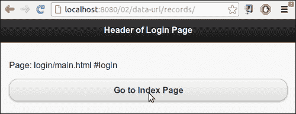

这个重定向发生了，因为在`#login`页面的`div`容器中使用了`data-url`属性。jQuery Mobile 框架会更新地址栏，显示此属性的值，而不是用于获取页面的实际 URL。

这是一个非常方便的功能，允许您在应用程序中执行重定向。这个示例没有显示服务器验证的用户名或密码。但在实际生活中，用户会在`#main`页面输入用户名/密码凭据，然后在服务器成功响应后，您可以将用户重定向到受限文件夹和网页。不要将任何未经身份验证的用户重定向，并且他们将无法访问`records`文件夹中的任何页面。

接下来，按照代码中给出的内容添加`index.html`和`records.html`文件。添加这些页面的链接以实现它们之间的导航。现在，在`#login`页面中，当您点击**打开索引页**按钮时，代码中`href`属性只指定了`index.html`。但是此时重定向已经发生，`records`文件夹中的`index.html`文件被打开。`index.html`现在是这里的着陆页面，使您能够访问其他页面，比如位于`records`文件夹中的`data.html`等。使用`data-url`的另一种方法是，您还可以在成功登录时使用`changePage()`方法将用户重定向到`index.html`页面。

在`index.html`中，将`data-url="http://localhost:8080/02/data-url/records"`属性设置为支持当用户点击浏览器的后退或前进按钮时的正确导航，如果不这样做，当您在`index.html`中单击后退按钮时，导航将中断。`data-url`可帮助您在历史堆栈中设置正确的值。

您可以通过浏览器的后退和前进按钮来玩转，看看在应用程序中导航时，地址栏是如何更新的，与标题下方显示的文本相比如何更新。

### 提示

**使用正确的值来设置 data-url**

您可以为`data-url`属性指定任何值，在地址栏中都将显示相同值。但您应该注意确保它是有效的引用，并且浏览器应该能够呈现页面。指定不正确或不存在的 URL 将在刷新浏览器或单击后/前按钮时中断导航。

## 还有更多...

jQuery Mobile 为您的应用程序中的所有页面设置并维护`data-url`属性。应用程序的第一页不需要`data-url`，因为它始终在 DOM 中，并且可以通过其 ID 或 URL 引用。对于所有其他页面，如果未指定`data-url`属性，则默认情况下会添加带有页面 ID 的值。对于相同域中的外部页面，将页面的相对路径用作`data-url`的值。对于来自不同域的页面，将使用绝对路径。

### 使用`data-url`作为 href 链接

如果一个页面的`div`标签同时包含页面 ID 和`data-url`，则在`href`属性值中可以使用`data-url`或页面 ID，以导航到该页面。

### 使用子散列 URL

一些插件动态将页面分成单独的页面。这些页面必须通过深链接到达。这些页面的`data-url`属性应以以下方式指定：

```js
data-url="page.html&ui-page=subpage"
```

## 另请参阅

+   在第六章的*提交使用 POST 的表单*中，*表单*

# 使用 History API 创建自定义错误弹窗

jQuery Mobile 框架不会跟踪对话框的历史记录。因此，当您单击浏览器的返回按钮时，对话框不会重新出现。对于一些功能，例如显示错误弹出或警报，使用对话框存在一个很明显的小问题。当对话框从一个页面打开时，地址栏将显示带有`#&ui-state=dialog`文本后缀的页面 URL。这可能不是所有人都希望看到的。这个示例向您展示了如何使用**历史 API**并自定义常规对话框以出现，例如弹出而不对 URL 进行任何更改，利用历史 API。

## 准备就绪

从`code/02/history`源文件夹中复制此示例的完整代码。您可以使用 URL`http://localhost:8080/02/history/main.html`启动此代码。

## 如何做...

需要遵循的步骤是：

1.  创建`main.html`，并添加一个链接以打开`errordialog.html`文件作为对话框。还添加一个`input`按钮，如下面的代码片段所示：

    ```js
    <div id="main" data-role="page">
      <div data-role="header">
        <h1>Header of Main</h1>
      </div>
      <div data-role="content">
        <a href="errordialog.html" data-theme="b" 
          data-role="button" data-rel="dialog">
          Dialog
        </a>
     <input type="submit" value="Popup" id="linkButton"
     data-theme="b"/>
      </div>
      <div data-role="footer">
        <h4>Footer of Main</h4>
      </div>
    </div>
    ```

1.  将以下脚本添加到`main.html`的`<head>`部分，以在`input`按钮的`click`事件上打开`errorpopup.html`作为对话框：

    ```js
      $("#main").live("pageinit", function(event) {
          $("#linkButton").bind( "click", function(event, ui) {
     $.mobile.changePage( "errorpopup.html", {
     changeHash: false,
     role: "dialog"
     });
        });
      });
    ```

1.  创建`errordialog.html`文件以显示自定义错误消息。还添加一个按钮返回到`main.html`，如下面的代码片段所示：

    ```js
    <div id="errordialog" data-role="page">
      <div data-role="header">
        <h1>Error !</h1>
      </div>
      <div data-role="content">
        <p>Please correct and resubmit<p>
        <a href="main.html" data-role="button" 
            data-theme="b">Close</a>
      </div>
    </div>
    ```

1.  创建`errorpopup.html`，并在页面容器内添加以下脚本。这是一个常规对话框，但它具有自定义样式的标题。单击锚链接时，从历史堆栈中删除它的条目：

    ```js
    <div id="errorpopup" data-role="page">
      <script>
        $("#errorpopup").live("pageinit", function(event) {
          $("a").click(function(event) {
     history.back();
          });
        });
      </script>
    ```

1.  然后，为页面添加自定义标题，并添加返回到`main.html`的链接：

    ```js
     <div class="ui-corner-top ui-overlay-shadow ui-header ui-bar-a" 
     role="banner">
        <h1 class="ui-title" tabindex="0" role="heading" 
          aria-level="1">
          Error !
        </h1>
      </div>
      <div data-role="content">
        <p>Please correct and resubmit<p>
        <a href="main.html" data-role="button" data-
          theme="b">
          Close
        </a>
      </div>
    </div>
    ```

## 它是如何工作的...

创建`main.html`，其中`#main`页面有一个链接可以打开`errordialog.html`页面。添加一个输入提交按钮（`id="linkButton"`），如下所示。接下来，按照以下代码创建`errordialog.html`页面，其中有一个按钮可以返回到`main.html`。当你启动应用程序并点击第一个按钮（**对话框**）时，`errordialog.html`页面会作为常规对话框打开，并具有弹出过渡效果。你会看到地址栏发生变化，并在 URL 末尾显示`#&ui-state=dialog`文本，如下面的屏幕截图所示。关闭并打开这个对话框几次，然后如果你按住返回按钮，浏览器的历史记录将被显示，并且你会看到**错误对话框**在历史堆栈列表中的条目：

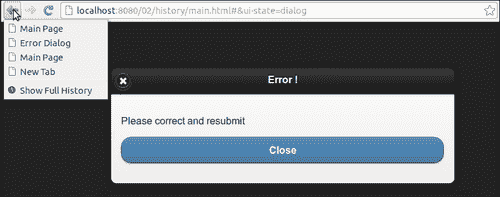

现在，在`main.html`中，添加给定的脚本到`pageinit`事件处理程序中，当应用程序启动时调用。在这里，处理`#linkButton`输入按钮的`click`事件，并在回调中使用以下部分描述的选项调用`changePage()`方法，以打开`errorpopup.html`页面。将`role`选项设置为`dialog`以打开页面作为对话框。此外，将`changeHash`选项设置为`false`，以指示打开页面时不更改地址栏中的 URL 哈希。

接下来，创建 `errorpopup.html` 并将给定的脚本添加到页面容器中。在这个脚本中，绑定 `pageinit` 事件，该事件在页面初始化时触发。在这里，为锚点按钮的 `click` 事件添加一个事件处理程序。在这个回调中，调用 `history.back()` 方法来删除历史记录堆栈中的历史记录条目。您应该将此脚本添加到页面容器中，以便每次页面在 DOM 中加载和初始化时都会被调用。

接下来，向错误弹出页容器添加一个自定义标题。这个自定义标题与本章前面 *自定义样式对话框* 部分使用的相同。这个对话框标题被定制，使其看起来更像一个弹出窗口，并避免了默认情况下在对话框标题中出现的关闭按钮。最后，在页面内容中，添加一个按钮返回到 `main.html`。

现在，重新启动应用程序，单击第二个按钮（**Popup**）。创建的自定义对话框将显示为弹出窗口，如下图所示：

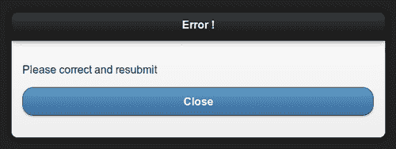

此弹出窗口的行为与默认对话框不同。**关闭** 图标不存在。您会注意到浏览器的地址栏未更改。您还会看到单击并按住浏览器的后退按钮时，**Error Popup** 页面标题不会显示在历史记录列表中。关闭弹出窗口并返回到 `main.html`。您可以单击并按住浏览器的后退或前进按钮，以查看弹出窗口从未显示在历史记录列表中，而对话框则列在其中，如下图所示：

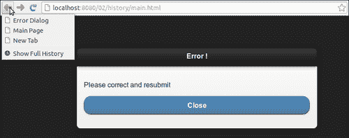

## 还有更多...

历史 API 使用起来非常简单，并提供了额外的方法，您可以使用这些方法来处理和操作浏览器中的历史记录堆栈。您可以使用 `pushState()` 方法向历史记录中添加一个新条目。使用 `replaceState()` 方法，您可以替换历史记录中的条目和现有条目的 URL。这是一个非常方便的方法，可以让您根据应用程序的需要来操作历史记录。如本示例代码所示，`history.back()` 将您带回历史记录中的上一步，而 `history.forward()` 则让您向前迈进一步。要转到历史记录堆栈中的特定条目，还可以使用 `history.go()` 方法，将一个数字值传递给它，表示您要跳过多少条目。因此，`history.go(-3)` 将使您回退三个条目，而正值将使您向前跳三个条目。

### 对话框上的 popstate 事件

每当单击后退或前进按钮时，都会触发 `popstate` 事件。该事件由框架使用 `onpopstate` 处理程序处理，并根据需要导航到下一个或上一个页面。如果 `popstate` 导致目标页面是对话框，则框架会处理该事件，不会导航回对话框。因此，当您单击浏览器的后退或前进按钮时，对话框不会再次显示。

### 弹出窗口小部件

在编写本配方时，使用的是 jQuery Mobile v1.1.1。因此，在此配方中创建的错误弹出对话框不是真正的弹出式窗口，因为它仍然显示在单独的页面上，并且不悬停在原始页面上。**弹出**小部件将在 jQuery Mobile v1.2.0 中提供。然后，您可以使用`data-rel="popup"`属性添加一个简单的、真正的弹出窗口，如下面的代码片段所示：

```js
<a href="#myPopup" data-rel="popup">Open Popup</a>
<div data-role="popup" id="myPopup">
  <p>A simple true popup!<p>
</div>
```

您可以选择使用`data-history="false"`属性将弹出窗口设置为不在历史记录中跟踪。您可以在[`jquerymobile.com/demos/1.2.0/docs/pages/popup/index.html`](http://jquerymobile.com/demos/1.2.0/docs/pages/popup/index.html)了解更多关于使用弹出窗口的信息。

## 另请参阅

+   *自定义对话框样式*配方

+   第八章的*使用页面初始化事件*配方，*事件*

+   使用`changePage()`方法更改页面的*使用 changePage() 方法更改页面*配方 第九章，*方法与实用工具*
