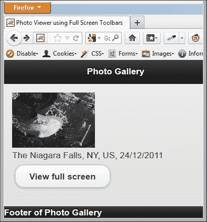
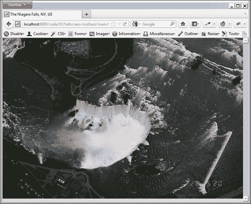
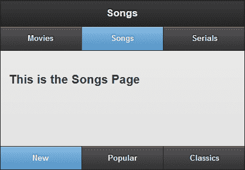
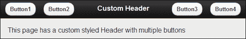
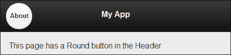
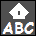
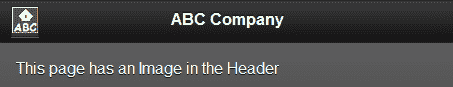
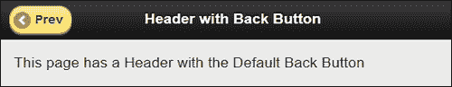
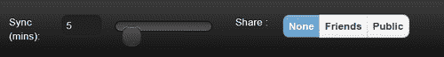

# 第三章 工具栏

在本章中，我们将涵盖：

+   使用全屏固定工具栏

+   使用持久导航栏工具栏

+   使用多个按钮自定义页眉

+   向页眉添加自定义圆形按钮

+   向页眉添加图像

+   添加自定义返回按钮

+   向页脚添加布局网格

# 介绍

jQuery Mobile 框架提供了两个工具栏，**页眉** 和 **页脚**。 页眉是页面中的第一个容器，页脚是最后一个。 页眉用于指定应用程序或页面的标题，并可以包含用于导航的标准 **导航栏**。 页脚用于各种目的。 它可以包含标准按钮和表单控件，并可以根据您的需要进行自定义。 它还可以包含用于页面导航的导航栏。 页脚通常也用于显示版权和许可信息。

# 使用全屏固定工具栏

**固定工具栏** 在页面滚动时保持在屏幕上的相同位置。 当您的应用程序页面内容占据整个视口时，固定工具栏将重叠在页面内容上。 你不能在这里切换固定工具栏的可见性。 要切换工具栏的可见性，您可以在 **全屏模式** 中使用固定工具栏。 此示例向您展示了如何创建一个使用全屏工具栏的简单 **照片查看器** 应用程序。

## 准备就绪

从 `code/03/fullscreen-toolbars` 源文件夹中复制此示例的完整代码。 可以使用 URL `http://localhost:8080/03/fullscreen-toolbars/main.html` 启动此代码。

## 如何操作...

1.  在 `main.html` 中创建 `#main` 页面和一个 `` 标签，以显示缩小的 **尼亚加拉瀑布** 图像，如下代码所示：

    ```js
    <div id="main" data-role="page">
      <div data-role="header">
        <h1>Photo Gallery</h1>
      </div>
      <div data-role="content">
        
        <br>The Niagara Falls, NY, US, 24/12/2011
        <br><a href="#photo" data-role="button" data-inline="true">View full screen</a>
      </div>
      <div data-role="footer" data-position="fixed">
        Footer of Photo Gallery
      </div>
    </div>
    ```

1.  创建 `#photo` 页面以全屏模式显示图像：

    ```js
    <div id="photo" data-role="page" data-fullscreen="true" data-add-back-btn="true">
     <div data-role="header" data-position="fixed" >
        <h1>The Niagara Falls, NY, US</h1>
      </div>
      <div data-role="content">
        
      </div>
     <div data-role="footer" data-position="fixed">
        Date taken: 24/12/2011
      </div>
    </div>
    ```

## 它是如何工作的...

在 `main.html` 中，创建 `#main` 页面以使用 `` 标签显示 **尼亚加拉瀑布** 的缩略图，使用较小的 `width` 和 `height`。 添加一个链接以打开 `#photo` 页面。 当您首次启动应用程序时，将显示以下屏幕，并带有较小尺寸的快照图像：



接下来创建 `#photo` 页面，使用 `data-fixed="true"` 属性添加固定工具栏。 使用 `data-fullscreen="true"` 属性设置页面容器占据整个屏幕。 使用 `` 标签添加图像，宽度为 `100%`，高度为 `height`。

现在，当您单击 `#main` 中的 **查看全屏** 按钮时，将打开 `#photo` 页面，显示全屏图像的 **尼亚加拉瀑布**。 也可以看到固定工具栏。 现在，当您点击屏幕时，工具栏的可见性将切换。 全屏显示如下截图所示：



## 还有更多...

默认情况下，全屏工具栏将覆盖页面内容。您将无法访问工具栏下方显示的任何内容。您需要点击屏幕，切换工具栏的可见性，然后访问页面内容。这可能会成为您的应用程序用户的可用性问题。因此，请明智地使用此功能。

### 注

全屏工具栏在需要显示全屏内容的页面中非常理想，例如照片、预览、幻灯片或视频。

### CSS 属性 `position:fixed`

浏览器必须支持 `position:fixed` CSS 属性，才能正确动态定位固定工具栏。大多数现代浏览器都支持此属性。对于较旧的浏览器，可能不支持此功能，框架将会优雅地降级并回退到使用常规静态工具栏。在这些旧平台上，您可以使用**Polyfills**来支持固定工具栏，并在 [`jquerymobile.com//test/docs/toolbars/bars-fixed.html`](http://jquerymobile.com//test/docs/toolbars/bars-fixed.html) 中提供有关此的详细说明。

### 切换固定工具栏的可见性

正如本文中已经提到的，您可以点击屏幕来切换固定工具栏的可见性。通过使用 **fixedtoolbar 插件** 的 `tapToggle` 属性（默认为 `true`），可以控制此点击行为的变化。要启用或禁用点击，请使用以下代码片段，该代码片段使用 jQuery 选择器来找到工具栏：

```js
// to disable tap to toggle toolbars use
$("[data-position='fixed']").fixedtoolbar({ tapToggle: false });

// to enable tap to toggle toolbars use
$("[data-position='fixed']").fixedtoolbar({ tapToggle: true });
```

### 使用 JavaScript 切换固定工具栏的可见性

你也可以使用 JavaScript 调用 `fixedtoolbar` 插件上的 `show` 或 `hide` 方法来切换固定工具栏的可见性，如下面的代码所示。代码片段使用 jQuery 选择器来找到工具栏。

```js
$("[data-position='fixed']").fixedtoolbar('show');
// or
$("[data-position='fixed']").fixedtoolbar('hide');
```

## 参见

+   *在工具栏中使用持久性导航栏* 食谱

# 在工具栏中使用持久性导航栏

**Navbar widget** 可用于在您的应用程序中提供导航链接。**Persistent Navbar** 保持在您的应用程序中的同一位置固定，就像一个固定的选项卡栏一样，在您页面之间导航时不会移动。本文向您展示如何在工具栏中使用持久性导航栏来创建一个简单的**电视菜单 UI**。

## 准备工作

从 `code/03/persistent-navbar` 源文件夹中复制此处食谱的全部代码。可以使用 URL `http://localhost:8080/03/persistent-navbar/main.html` 来启动此代码。

## 如何操作...

1.  在 `main.html` 中创建一个简单的**电视菜单 UI**，其中包含三个页面，分别是 "`#movies`"、"`#songs`" 和 "`#serials`"。在下面的代码中，添加带有导航栏的 `#movies` 页面，其页眉和页脚如下所示：

    ```js
    <div id="movies" data-role="page" >
     <div data-role="header" data-id="persistheader" data-position="fixed">
        <h1>Movies</h1>
        <div data-role="navbar">
          <ul>
            <li><a href="#" data-role="button" 
     class="ui-btn-active ui-state-persist">
                Movies</a></li>
            <li><a href="#songs" data-role="button">Songs</a></li>
            <li><a href="#serials" data-role="button">Serials</a></li>
          </ul>
        </div>
      </div>
      <div data-role="content">
        <h3>This is the Movies Page</h3>
      </div>
     <div data-role="footer" data-id="persistfooter" data-position="fixed" >
        <div data-role="navbar">
          <ul>
            <li><a href="#" data-role="button">New</a></li>
            <li><a href="#" data-role="button">Popular</a></li>
            <li><a href="#" data-role="button">Classics</a></li>
          </ul>
        </div>
      </div>
    </div>
    ```

1.  接下来，按照以下代码添加 `#songs` 页面，内容相似：

    ```js
    <div id="songs" data-role="page" >
     <div data-role="header" data-id="persistheader" data-position="fixed">
        <h1>Songs</h1>
        <div data-role="navbar">
          <ul>
            <li><a href="#movies" data-role="button">Movies</a></li>
            <li><a href="#" data-role="button"
     class="ui-btn-active ui-state-persist">
                Songs</a></li>
            <li><a href="#serials" data-role="button">Serials</a></li>
          </ul>
        </div>
      </div>
      <div data-role="content">
        <h3>This is the Songs Page</h3>
      </div>
     <div data-role="header" data-id="persistheader" data-position="fixed">
        <div data-role="navbar">
          <ul>
            <li><a href="#" data-role="button">New</a></li>
            <li><a href="#" data-role="button">Popular</a></li>
            <li><a href="#" data-role="button">Classics</a></li>
          </ul>
        </div>
      </div>
    </div>
    ```

1.  最后，按照以下代码添加 `#serials` 页面：

    ```js
    <div id="serials" data-role="page" >
     <div data-role="header" data-id="persistheader" data-position="fixed">
        <h1>Serials</h1>
        <div data-role="navbar">
          <ul>
            <li><a href="#movies" data-role="button">Movies</a></li>
            <li><a href="#songs" data-role="button">Songs</a></li>
            <li><a href="# " data-role="button"
     class="ui-btn-active ui-state-persist">
                Serials</a></li>
          </ul>
        </div>
      </div>
      <div data-role="content">
        <h3>This is the Serials Page</h3>
      </div>
     <div data-role="header" data-id="persistheader" data-position="fixed">
        <div data-role="navbar">
          <ul>
            <li><a href="#" data-role="button">New</a></li>
            <li><a href="#" data-role="button">Popular</a></li>
            <li><a href="#" data-role="button">Classics</a></li>
          </ul>
        </div>
      </div>
    </div>
    ```

## 它的工作原理...

创建`main.html`并向其添加三个页面：`#movies`、`#songs`和`#serials`。在`#main`页面中，通过指定`data-position="fixed"`来添加一个固定页眉。为了在所有页面中保持此页眉不变，请设置属性`data-id="persistheader"`。现在添加一个具有三个链接的`navbar`，如前面的代码所示。第一个链接指向相同的页面，因此对于`href`标签，使用`#`。还要添加属性`class="ui-btn-active ui-state-persist`，表示当您进入此页面时，此按钮应处于活动状态。接下来，在页面底部添加一个带有三个链接的页脚，分别为**New**、**Popular**和**Classics**，如前面的代码所示。添加属性`data-id="persistfooter"`和`data-position="fixed"`，以指示这是一个固定的页脚，并且要在所有页面中保持不变。您应该为所有三个页面的页眉使用相同的`data-id`值。同样，页脚的三个页面应使用相同的`data-id`。使用相同的值将创建一个粘性的`navbar`，在页面转换时保持不动。

接下来，添加`#songs`页面，其内容与**Movies**页面相似。与之前提到的相同，将标题和页脚的`data-id`值设置为相同。现在，在页眉`navbar`中将第二个按钮设置为活动状态，将属性`class="ui-btn-active ui-state-persist"`设置为它。最后，添加带有固定持久页眉和页脚的`"#serials"`页面，就像之前的页面一样。在这里，将页眉`navbar`中的第三个按钮设置为活动状态。当您启动应用程序时，您可以使用页眉导航栏导航到这三个页面。这三个页面都有相同的页眉和页脚。

您可以在三个页面的页脚中随机选择不同的按钮。当您在页面之间来回导航时，您会看到页脚按钮的状态被保持和记住了。屏幕显示如下截图所示：



### 注意

在菜单驱动的应用程序中，持续的导航栏非常方便，通常用于页面之间的导航。

## 还有更多...

您可以通过添加`data-icon`属性为`navbar`按钮设置图标。可以使用`data-iconpos`属性将图标位置设置为`top`、`bottom`、`right`或`left`，如下面的代码所示：

```js
<a href="#" data-role="button" data-icon="home" data-iconpos="right">Home</a>
```

### 具有固定持久工具栏的 3D 页面过渡

如果您将具有 3D 页面过渡的持久固定工具栏与页面一起使用，则可能会遇到定位问题。性能也可能较慢。因此，最好将这些页面转换为使用 2D 动画，例如`slide`、`slidup`、`slidedown`、`fade`或`none`。

## 另请参见

+   *使用全屏固定工具栏*配方

# 自定义具有多个按钮的页眉

当您将按钮添加到页面标题时，它们会排列到标题的左侧，并且默认情况下只能将一个按钮定位到右侧。本配方向您展示如何将四个按钮添加到标题中，并且其中两个按钮位于右侧。

## 准备工作

从`code/03/multiple-header-buttons`源文件夹复制此配方的完整代码。可以使用 URL`http://localhost:8080/03/multiple-header-buttons/main.html`启动此代码。

## 如何做...

1.  创建一个名为`jqm.css`的新样式表，并根据以下代码中的给定内容定义两个新的自定义样式：

    ```js
    .ui-btn-nexttoleft {
      position: absolute; 
      left: 80px; 
      top: .4em; 
    }
    .ui-btn-nexttoright {
      position: absolute; 
      right: 80px; 
      top: .4em; 
    }
    ```

1.  在`main.html`的`<head>`标签中包含前一个样式表，如下所示：

    ```js
    <link rel="stylesheet" href="http://code.jquery.com/mobile/1.1.1/jquery.mobile-1.1.1.min.css" /> 
    <link rel="stylesheet" href="jqm.css" />
    <script src="img/jquery-1.7.1.min.js"></script>
    <script src="img/jquery.mobile-1.1.1.min.js"></script>
    ```

1.  现在，使用 jQuery Mobile 框架提供的默认样式向页面标题添加四个按钮，同时也使用您的自定义样式，如下代码所示：

    ```js
    <div id="main" data-role="page">
      <div data-role="header">
        <a href="#" data-role="button" data-theme="c" 
     class="ui-btn-left">
            Button1</a>
        <a href="#" data-role="button" data-theme="c" 
     class="ui-btn-nexttoleft">
            Button2</a>
        <h1>Custom Header</h1>
        <a href="#" data-role="button" data-theme="c" 
     class="ui-btn-nexttoright">
            Button3</a>
        <a href="#" data-role="button" data-theme="c" 
     class="ui-btn-right">
            Button4</a>
      </div>
      <div data-role="content">
       This page has a custom styled Header with multiple buttons
      </div>
    </div>
    ```

## 工作原理...

创建`jqm.css`样式表，并定义两个新类`.ui-btn-nexttoleft`和`.ui-btn-nexttoright`，以指定按钮将使用的绝对位置。创建`main.html`并在包含`jquery.mobile.css`文件的链接之后包含对前一个样式表的链接，如前述代码所示。

接下来，在页眉中添加一个带有`<h1>`文本的页眉，并在其两侧添加两个锚按钮。将属性`class="ui-btn-left"`添加到第一个按钮，使其出现在左上角。将属性`class="ui-btn-nexttoleft"`添加到第二个按钮。类似地，将属性`class="ui-btn-nexttoright"`添加到第三个按钮，最后将`class="ui-btn-right"`添加到第四个按钮，它将出现在右上角。第二和第三个按钮使用您定义的自定义类。现在，当您启动页面时，按钮将按照以下屏幕截图中所示的方式在页眉中定位：



### 注意

在样式表中使用绝对值时要小心；如果文本大小或布局发生变化，可能需要修改绝对位置。

## 更多信息...

使用属性`data-role="header"`添加到页眉`div`容器会使 jQuery Mobile 框架以标准方式增强页眉。您可以跳过此属性，并通过在`div`容器中使用类`"ui-bar"`自定义页眉。您还可以在页眉中包含除按钮之外的小部件。

```js
<div class="ui-bar">

```

## 另请参阅

+   第二章中的*自定义样式对话框*配方，*页面和对话框*

+   *在页眉中添加自定义圆形按钮*配方

+   *在页眉中添加图像*配方

# 在页眉中添加自定义圆形按钮

jQuery Mobile 框架允许您向页面的页眉中添加自定义控件。本配方向您展示如何向应用程序的页眉中添加自定义圆形按钮。

## 准备工作

从 `code/03/round-button-header` 源文件夹中复制此配方的完整代码。此代码可使用 URL `http://localhost:8080/03/round-button-header/main.html` 启动。

## 如何做...

1.  创建名为 `jqm.css` 的新样式表，并在其中定义一个自定义的 `roundbtn` 类：

    ```js
    .roundbtn  {
      width: 40px;
      height: 40px;
      margin-top: 20px;
      -webkit-border-radius: 20px; 
      -moz-border-radius: 20px; 
      -ms-border-radius: 20px;
      -o-border-radius: 20px;
      border-radius: 20px;
    }
    ```

1.  创建 `main.html`，在 `<head>` 标签中包含先前的样式表：

    ```js
    <link rel="stylesheet" href="http://code.jquery.com/mobile/1.1.1/jquery.mobile-1.1.1.min.css" /> 
    <link rel="stylesheet" href="jqm.css" />
    <script src="img/jquery-1.7.1.min.js"></script>
    <script src="img/jquery.mobile-1.1.1.min.js"></script>
    ```

1.  使用新定义的 `roundbtn` 样式，在 `#main` 页面的页眉中添加一个 `About` 按钮，如下面的代码所示：

    ```js
    <div id="main" data-role="page" >
     <div data-role="header" style="height: 50px" >
        <h1 style="margin: 15px">Custom Round Button</h1>
        <a href="#about" data-rel="dialog" data-role="button"
     class="roundbtn ui-btn ui-shadow ui-btn-up-c ui-btn-left">
          <br>About</a>
      </div>
      <div data-role="content">
        This page has a Round button in the Header
      </div>
    </div>
    ```

1.  将 `#about` 对话框添加如下代码中：

    ```js
    <div id="about" data-role="page" >
      <div data-role="header" >
        <h1>About</h1>
      </div>
      <div data-role="content">
        Round Button Demo
      </div>
    </div>
    ```

## 它是如何工作的...

创建 `jqm.css` 样式表，并在其中定义一个名为 `roundbtn` 的新类，其中包含 `width`、`height` 和 `border-radius` 属性，如前面的代码所示。要创建一个圆形按钮，将 `border-radius` 属性的值设置为 `width` 属性值的一半。最后，添加供应商特定的属性以确保边框半径在各种浏览器上正常工作。

创建 `main.html`，在包含链接到 `jquery.mobile.css` 文件之后，包含上述样式表的链接，如前面的代码所示。接下来创建 `#main` 页面，并在其中添加带有 `<h1>` 文本的页眉。使用样式属性将页眉的 `height` 设置为 `50px`，以确保圆形按钮的 `height`（如 CSS 中指定的）适合页眉。接下来，在页眉中添加一个锚链接，其属性为 `data-role="button"` 和 `data-rel="dialog"`，以将 `"#about"` 页面作为对话框打开。使用 `class` 属性为此按钮添加 `roundbtn` 样式。还要添加框架在将锚链接增强为按钮时添加的其他类。您可以通过使用浏览器的开发者工具检查锚元素来获取这些类的列表。您必须手动添加这些类，以确保圆形按钮获得正确的样式，因为它已被定制。

最后，根据前面的代码定义 `#about` 页面。当您启动应用程序时，页眉中现在会显示一个圆形按钮，如下面的屏幕截图所示。单击圆形按钮将打开 `#about` 对话框。



## 还有更多...

您的浏览器应支持 CSS 中的 `border-radius` 或相应的供应商特定前缀 `border-radius` 属性。如果不支持，则会看到一个矩形按钮而不是一个圆形按钮。

## 另请参见

+   第二章 中的 *使用 CSS 创建弹跳页面过渡* 配方，*页面和对话框*，关于供应商前缀的注意事项

+   第二章 中的 *自定义样式对话框* 配方，*页面和对话框*

+   *使用多个按钮自定义页眉* 配方

+   *在页眉中添加图像* 配方

# 在页眉中添加图像

jQuery Mobile 页面的页眉通常包含要用作页面页眉的文本。您还可以向页眉添加其他内容和标记。本配方向您展示如何向应用程序的页眉添加图像。

## 准备工作

从`code/03/header-image`源文件夹中复制此配方的全部代码。可以使用 URL`http://localhost:8080/03/header-image/main.html`来启动这段代码。

## 如何做…

在这个配方中，图像`ABC.png`被用作一个虚构公司 ABC Inc.的标志图像。



1.  创建`main.html`并将上述图像添加到其页眉。图片链接到对话框，代码如下所示：

    ```js
    <div id="main" data-role="page" data-theme="a">
      <div data-role="header" data-theme="a">
        <h1>ABC Company</h1>
     <a href="#about" data-rel="dialog" data-theme="a" class="ui-btn ui-shadow ui-btn-up-a">
     </a>
      </div>
      <div data-role="content">
        This page has an Image in the Header
      </div>
    </div>
    ```

1.  如下代码所示，添加`#about`对话框：

    ```js
    <div id="about" data-role="page" >
      <div data-role="header" >
        <h1>About ABC</h1>
      </div>
      <div data-role="content">
        ABC Company Inc.
      </div>
    </div>
    ```

## 工作原理…

在`main.html`中，创建一个`#main`页面，并在其中添加一个带有`<h1>`文本的页眉。现在，使用属性`data-rel="dialog"`在页眉中添加一个锚点链接，以打开`#about`页面作为对话框。使用属性`class="ui-btn ui-shadow ui-btn-up-a"`指定锚点链接的自定义样式。请不要添加`data-role="button"`，因为框架会将此链接增强为按钮。接下来，如前面的代码中所示，添加指向`ABC.png`图像的``元素。通过使用`width`和`height`属性将该图像缩放到适当的大小。最后，如下代码中所示，定义`#about`页面。启动应用程序后，`#main`页面的页眉会显示左上角的`ABC.png`图像，如下截图所示。单击该图像将打开`#about`对话框页面。



## 还有更多…

您还可以为图像使用本机样式，避免在锚点元素上设置任何自定义样式以仅显示图像。使用属性`data-role="none"`即可实现，代码如下所示：

```js
<a href="#about" data-role="none" data-rel="dialog" data-theme="a">
  
</a>
```

## 另请参阅

+   *使用多个按钮自定义页眉*的配方

+   *在页眉中添加自定义的圆形按钮*配方

# 添加一个定制的返回按钮

在应用程序中打开新页面时，jQuery Mobile 框架提供了一个选项，可以在页面的页眉中添加一个**返回**按钮，以帮助您导航回上一页。默认情况下，**返回**按钮是不可见的。本配方向您展示如何使用 JavaScript 动态添加和自定义应用程序中的**返回**按钮。

## 准备工作

从`code/03/custom-back-button`源文件夹中复制此配方的全部代码。可以使用 URL`http://localhost:8080/03/custom-back-button/main.html`来启动这段代码。

## 如何做…

1.  创建`main.html`并在其中添加两个锚点链接。第一个链接打开一个带有页眉中**返回**按钮的页面，而第二个链接则打开一个没有**返回**按钮的页面。

1.  同时在页面中添加一个提交按钮，如下代码所示：

    ```js
    <div id="main" data-role="page">
      <div data-role="header">
        <h1>Header of Main Page</h1>
      </div>
      <div data-role="content">
        <a href="page1.html" data-role="button">Page with Header Back Button</a>
        <a href="page2.html" data-role="button">Page without Header Back Button</a>
        <input type="submit" id="addbackbtns" value="Click to Add and Customize the Back Button" data-inline="true" data-role="button">
      </div>
    </div>
    ```

1.  将以下脚本添加到页面的`<head>`部分，并将其绑定到提交按钮的`click`事件：

    ```js
    $("#main").live("pageinit", function(event) {
      $("#addbackbtns").bind("click", function(event, ui) {
        $.mobile.page.prototype.options.addBackBtn = true;
        $.mobile.page.prototype.options.backBtnText = "Prev";
        $.mobile.page.prototype.options.backBtnTheme = "e";
      });});
    ```

1.  在页面页眉中创建带有**返回**按钮的`page1.html`，如下所示的代码：

    ```js
    <div id="page1" data-role="page" data-add-back-btn="true">
      <div data-role="header">
        <h1>Header with Back Button</h1>
      </div>
      <div data-role="content">
        This page has a Header with the Default Back Button
      </div>
    </div>
    ```

1.  创建`page2.html`，默认情况下没有**返回**按钮：

    ```js
    <div id="page2" data-role="page">
      <div data-role="header">
        <h1>Header without Back Button</h1>
      </div>
      <div data-role="content">
        This page has a Header without any buttons
        <a href="main.html" data-rel="back" data-direction="reverse" data-role="button">Back</a>
      </div>
    </div>
    ```

## 工作原理...

创建`main.html`并向其添加两个锚链接，分别打开`page1.html`和`page2.html`。创建`page1.html`并在页面`div`容器中添加属性`data-add-back-btn="true"`，如前面的代码所示。现在，当你点击`main.html`中的第一个按钮时，它会打开`page1.html`，你可以看到页面页眉中显示了**返回**按钮。点击它返回到`main.html`。

创建`page2.html`，并且不要添加`data-add-back-btn`属性。现在，当你点击`main.html`中的第二个按钮时，它会打开`page2.html`，而页眉中没有**返回**按钮。你可以在页面内容中添加一个锚链接来返回`main.html`。

现在，在`main.html`中，添加一个提交按钮，带有`id="addbackbtns"`和文本**点击添加和自定义返回按钮**。在页面初始化后启动的`pageinit`事件处理程序中，将提交按钮的`click`事件绑定到回调函数。在这里，像前面的代码中所示，将`$.mobile.page.prototype`对象的`addBackBtn`选项设置为`true`。这将自动在应用程序的所有页面上启用**返回**按钮。此外，您还可以通过设置`backBtnText`和`backBtnTheme`选项进一步自定义**返回**按钮的文本和主题，如前面的代码所示。

现在你可以从`main.html`访问这两个页面，并看到返回按钮现在可用且样式相同。两者都是黄色的，文本设置为**Prev**，如下图所示：



## 还有更多...

如食谱中所述，你可以设置以下属性并在应用程序的所有页面上全局启用**返回**按钮：

```js
$.mobile.page.prototype.options.addBackBtn = true;
```

当所有页面默认启用**返回**按钮时，你可以通过将属性`data-add-back-btn="false"`添加到其页面`div`容器中来关闭特定页面的按钮：

```js
<div id="page3" data-role="page" data-add-back-btn="false">
```

## 另请参阅

+   *使用多个按钮自定义页眉*的方法

+   *在页眉中添加自定义的圆形按钮*的方法

# 在页脚中添加布局网格

**布局网格**允许您在相邻的列中放置控件。这个食谱向您展示了如何使用布局网格在页脚添加多个表单控件。

## 准备工作

从`code/03/footer-layoutgrid`源文件夹复制此食谱的完整代码。可以使用 URL`http://localhost:8080/03/footer-layoutgrid/main.html`启动此代码。

## 如何操作...

1.  创建`main.html`并在其页面中添加一个页脚。向页面页脚添加布局网格，并像下面的代码中所示添加表单控件：

    ```js
    <div data-role="footer" data-position="fixed" class="ui-bar">
     <fieldset class="ui-grid-a">
        <div class="ui-block-a" data-role="fieldcontain">
          <label for="syncslider">Sync (mins):</label>
          <input type="range" name="syncslider" id="syncslider" value="5" min="1" max="60"/>
        </div>
        <div class="ui-block-b">
          <div data-role="fieldcontain">
            <fieldset data-role="controlgroup" data-type="horizontal">
              <legend>Share :</legend>
              <input type="radio" name="sharefile" id="shareFileNone" value="sharefile-1" checked="checked" data-theme="c"/>
              <label for="shareFileNone">None</label>
              <input type="radio" name="sharefile" id="shareFileFriends" value="sharefile-2" data-theme="c"/>
              <label for="shareFileFriends">Friends</label>
              <input type="radio" name="sharefile" id="shareFilePublic" value="sharefile-3" data-theme="c"/>
              <label for="shareFilePublic">Public</label>
            </fieldset>
          </div>
        </div>
      </fieldset>
    </div>
    ```

## 工作原理...

创建`main.html`并向其添加一个页脚。通过指定属性`class="ui-bar"`来样式化页脚。这将创建一个水平栏，您可以在其中添加自定义控件。现在通过创建一个具有属性`class="ui-grid-a"`的`fieldset`元素向页脚添加一个两列布局网格。

在布局网格的第一列添加一个带有属性`data-role="fieldcontain"`的`div`容器。必须添加属性`class="ui-block-a"`，以指示该`div`容器放置在网格的第一列中。现在通过添加一个带有`type="range"`属性的`input`元素将滑块小部件添加到此列。

类似地，添加一个带有属性`data-role="fieldcontain"`和`class="ui-block-b"`的`div`容器，以指示该`div`容器应放置在布局网格的第二列中。通过添加属性`data-role="controlgroup"`将三个单选按钮添加到单个组中，还添加属性`data-type="horizontal"`将单选按钮放置在水平行中（默认情况下，它们是垂直排列在彼此下方）。

现在页脚的外观如下图所示：



## 还有更多...

可以通过为网格添加相应的类来指定布局网格中的最多五列，如下面的代码所示：

+   两列网格 - 使用`ui-grid-a`类

+   三列网格 - 使用`ui-grid-b`类

+   四列网格 - 使用`ui-grid-c`类

+   五列网格 - 使用`ui-grid-d`类

    ### 注意

    鉴于移动设备的屏幕空间有限，要有选择地使用四列或五列的布局网格。界面可能会显得拥挤，可能没有足够的空间来填充表单控件。

### 布局网格中控件的大小

向布局网格列添加表单控件或小部件将导致该控件占据整个列的宽度。如果不想要这种行为，您将需要修改控件的样式。

### 注意

按钮和选择表单控件支持`data-inline="true"`属性。您可以将此属性设置为控件，它们将保持其实际的紧凑大小，并且不会调整大小以占据整个列的宽度。

### 在布局网格中换到下一行

如果您的布局网格有多行，您必须将各种控件添加到它们自己的`div`容器中，从第一列开始为`class="ui-block-a"`，移动到第五列为`class="ui-block-e"`。在任何时候添加第六个`ui-block`或在中间使用`class="ui-block-a"`的`div`容器将导致列换行，新添加的`div`容器现在移至下一行。

### 注意

从`ui-block-a`类开始一行，按正确的顺序向`ui-block-e`移动。

不要在同一行中重复相同的 ui 块。

## 另请参阅

+   *在工具栏中使用持久性导航栏*方法

+   在第四章的*创建自定义布局网格*配方，*按钮和内容格式化*
