# 第四章：按钮和内容格式化

在本章中，我们将涵盖：

+   编写动态添加按钮的脚本

+   在按钮中使用自定义图标

+   添加自定义图标精灵

+   替换默认的图标精灵

+   在可折叠区域中使用替代图标

+   创建嵌套的手风琴

+   创建自定义布局网格

+   使用 XML 内容

+   使用 JSON 内容

# 介绍

在 jQuery Mobile 应用中，你可以将按钮、表单控件和列表添加为应用的页面内容。页面内容是一个带有属性`data-role="content"`的`div`容器。你可以使用框架提供的就绪样式和布局显示数据并格式化数据。你可以以**可折叠块**和**可折叠集**或**手风琴**的形式分组和显示数据。你可以使用**布局网格**在多列中显示数据。你还可以在你的应用程序中使用表格和其他 HTML 元素。

# 编写动态添加按钮的脚本

按钮是标准的 HTML 表单元素，在 jQuery Mobile 框架中通过**按钮插件**进行增强，使其易于触摸操作，并在各种移动设备上具有良好的外观。你可以使用 `<button>` 标签或 `<input>` 标签向你的应用程序中添加按钮。你也可以通过将`data-role="button"`属性添加到锚元素来将锚元素样式化为按钮。本配方向你展示了如何使用 JavaScript 动态添加按钮到页面并绑定动作到这个新添加的按钮。

## 准备工作

从`code/04/dynamic-button`源文件夹复制此配方的全部代码。你可以使用网址`http://localhost:8080/04/dynamic-button/main.html`来启动此代码。

## 如何做...

在`main.html`中，创建`#main`页面并添加一个按钮。当你点击这个按钮时，使用 JavaScript 创建第二个按钮并为其分配一个动作：

1.  在`main.html`中创建`#main`页面，并将以下代码内容添加到其中：

    ```js
    <div data-role="content">
     <input type="submit" id="addContentBtn" data-inline="true"
     value="Click to add new button"><br>
     <div id="newcontent"></div>
    </div>
    ```

1.  将以下脚本添加到处理按钮的`click`事件中。在回调函数中，创建新按钮并为其分配一个动作。

    ```js
    $("#main").live("pageinit", function(event) {
      $("#addContentBtn").bind("click", function(event, ui) {
        var str="<a href='#page2' data-role='button' data-inline='true'>"
               +"Disable 1st button and Go to Page 2</a>";
     $("#newcontent").html(str).trigger("create")
     .bind("click", function(event, ui) {
          $("#addContentBtn").button("disable");
        });
      });
    });
    ```

1.  根据以下代码添加`#page2`。这是一个多页面文档。当你点击动态添加的按钮时，此页面将被打开。

    ```js
    <div id="page2" data-role="page" data-add-back-btn="true">
      <div data-role="header">
        <h1>Page2 Header</h1>
      </div>
      <div data-role="content">
        <h3>This is Page 2</h3>
      </div>
    </div>
    ```

## 工作原理...

在`main.html`中创建一个带有页面`#main`的页面，并在页面内容中添加一个带有`id="addContentBtn"`的按钮。还在页面上添加一个空的`div`容器，`id="newcontent"`。当你加载这个页面时，你只会看到一个按钮，上面显示着**点击添加新按钮**的文本。

接下来添加给定的脚本。添加一个`pageinit`事件处理程序，该处理程序在页面初始化后被调用。在这里，将按钮的`click`事件绑定到一个回调函数。在回调函数中，将具有`data-role="button"`的锚链接添加到空的`"#newcontent"` div 中。由于页面已经初始化，你必须显式调用`create`方法来触发框架重新访问此链接并将其增强为按钮。现在当你点击第一个按钮时，你会看到第二个按钮，**禁用第一个按钮并转到第 2 页**，被创建并显示。在脚本中还添加代码来绑定新按钮的`click`事件到一个回调函数。在这里，调用第一个按钮的`disable`方法。

最后创建一个`id="page2"`的新页面，当你点击新按钮时会打开该页面。将`#page2`添加`data-add-back-btn="true"`以提供一个**返回**按钮，帮助导航回`#main`页面。现在当你点击第二个按钮时，动态添加的脚本会被调用，第一个按钮被禁用，并且页面导航到打开`page2`。你可以点击`page2`上的**返回**按钮回到`#main`页面。你会发现，你之前添加的动态脚本已经禁用了第一个按钮。

## 还有更多...

按钮插件还提供了`enable`、`disable`和`refresh`按钮的方法：

```js
$(buttonselector).button("enable");
$(buttonselector).button("disable");
$(buttonselector).button("refresh");

```

### 按钮选项

按钮使用`data-`属性提供许多标记选项。它们是**corners**（`data-corners`）、**icon**（`data-icon`）、**iconpos**（`data-iconpos`）、**shadow**（`data-shadow`）、**iconshadow**（`data-iconshadow`）、**inline**（`data-inline`）和**theme**（`data-theme`）。

你可以调用`buttonMarkup`方法来增强锚链接以将其作为按钮使用。以下代码行接受原生锚链接，并将按钮角色添加到它，并设置`data-icon="alert"`和`data-inline="true"`属性：

```js
$("a").buttonMarkup({ icon: "alert", inline: "true"});

```

# 在按钮中使用自定义图标

按钮可以包含文本、图标或两者兼有。图标可以在按钮内的四个方向中的一个位置。jQuery Mobile 框架提供了一组标准图标，你可以在你的应用中使用。这个示例向你展示了如何向按钮添加自定义图标以及框架提供的标准图标。

## 准备工作

从`code/04/custom-icon`源文件夹中复制这个示例的完整代码。你可以使用 URL`http://localhost:8080/04/custom-icon/main.html`启动这个代码。

## 操作方法...  

在这个示例中，使用了名为`square.png`的自定义图标：

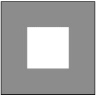

1.  创建一个新的样式表`jqm-icon.css`，并按照以下代码定义自定义图标样式：

    ```js
    .ui-icon-square {
      background: #fff;
      background: rgba(0,0,0,.4);
     background-image: url("../../resources/images/square.png");
    }
    @media only screen and (-webkit-min-device-pixel-ratio: 1.5),
        only screen and (min--moz-device-pixel-ratio: 1.5), 
        only screen and (min-resolution: 240dpi) {
     .ui-icon-square {
     background-image: url("../../resources/images/square-HD.png");
        background-size: 18px 18px;
      }
    }
    ```

1.  在`main.html`的`<head>`部分包含 CSS，如下所示：

    ```js
    <link rel="stylesheet" href="http://code.jquery.com/mobile/1.1.1/jquery.mobile-1.1.1.min.css" /> 
    <link rel="stylesheet" href="jqm-icon.css" />

    ```

1.  使用自定义图标与提交按钮，并使用以下不同的主题。也添加默认的`"home"`图标以进行比较。

    ```js
    <div data-role="content">
      <h3>Default Icon with text</h3>	
      <input type="submit" data-inline="true" value="Home" data-icon="home" data-theme="a"/>
      <h3>Custom Icon with text</h3>
     <input type="submit" data-inline="true" value="Square" data-icon="square" data-theme="a"/>
      <h3>Default Icon without text</h3>	
      <input type="submit" data-inline="true" data-iconpos="notext" data-icon="home" data-theme="a"/>
      <h3>Custom Icon without text</h3>
     <input type="submit" data-inline="true" data-iconpos="notext" data-icon="square" data-theme="a"/>
    </div>
    ```

## 工作原理...

创建一个 `jqm-icon.css` 样式表，并在其中添加一个新的图标类 `ui-icon-square`。指定 `background-image` 属性并将其指向要使用的图像文件。为图标指定 `background` 颜色，并为具有透明度的 **图标圆盘** 指定背景颜色，如所示。这里，前缀文本 **ui-icon** 表示按钮插件，这是一个自定义图标，并生成一个 `square` 类。现在，您可以在按钮中使用 `data-icon="square"` 属性，框架将获取并显示按钮上的 `square` 图标。

创建 `main.html`，使用 input 标签添加提交按钮，并使用 `data-icon` 属性为这些按钮设置图标。首先使用默认的 `home` 图标，然后使用新添加的自定义 `square` 图标，有时带文本，有时不带文本。为了进行详细比较，您可以添加多个按钮，使用不同的主题色板（`data-theme="a"` 到 `data-theme="e"`）。最终结果如下图所示。自定义图标看起来和默认图标一样好。

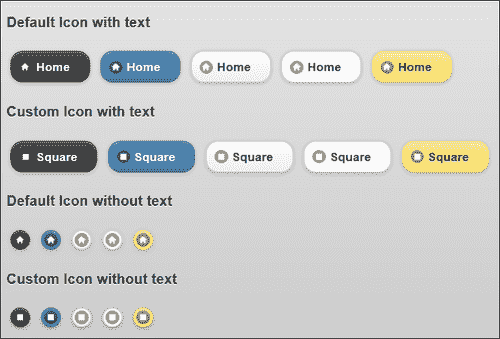

## 还有更多内容...

CSS 中定义的图标 `.ui-icon-square` 是标准分辨率的。今天大多数新设备都支持高清分辨率。因此，为了在高清分辨率上正常工作，您可以创建一个新的高分辨率图像，`square-HD.png`，尺寸为 36 x 36 像素。在 CSS 中使用这个图像，并在 `@media` 查询中指定此高分辨率图标应该适用的目标设备分辨率。有关 `@media` 查询的更多详细信息，请参见 [`jquerymobile.com/demos/1.1.1/docs/buttons/buttons-icons.html`](http://jquerymobile.com/demos/1.1.1/docs/buttons/buttons-icons.html)。

对于标准分辨率的自定义图标，请使用尺寸为 18 x 18 像素的图片，以 **PNG-8** 格式保存，并设置透明度为 `0.4`，背景颜色为 `#666`。现在你的图标将看起来与框架提供的默认图标类似。

### 使用 data-inline

默认情况下，按钮会拉伸以适应其容器的宽度。您可以指定属性 `data-inline="true"` 来显示按钮的紧凑模式。您还可以在同一行中相邻放置多个内联按钮。

### 使用 data-iconpos

通过使用 `data-icon="home"` 属性，按钮可以与图标图像关联。这里，`"home"` 是所使用的图标的名称。`data-iconpos` 属性可用于指定图标应显示在按钮的何处。可能的值为 `top`、`bottom`、`left` 和 `right`。使用 `data-iconpos="notext"` 属性完全隐藏文本，并调整按钮大小以仅显示图标。

### 使用阴影和按钮的圆角

按钮默认使用圆角，可以使用布尔属性`data-corners`进行控制。阴影也默认启用了按钮及其图标。这可以通过使用属性`data-shadow`和`data-iconshadow`进行控制。`data-corners`、`data-shadow`和`data-iconshadow`属性都是布尔类型的，可以取`true`或`false`值。

## 另请参阅

+   *添加自定义图标精灵*示例

+   *替换默认图标精灵*示例

# 添加自定义图标精灵

jQuery Mobile 框架使用默认的**图标精灵**并从中派生所有图标。本示例向您展示如何向默认标准图标集中添加一个自定义图标精灵，其中包含**除法**和**等于**图标，形成一个计算器的键。标准图标集已经包含**加**、**减**和**删除**（**乘**）图标。

## 准备工作

从`code/04/add-icon-sprite`源文件夹中复制此示例的完整代码。您可以使用 URL`http://localhost:8080/04/add-icon-sprite/main.html`启动此代码。

## 如何实现...

在这个示例中，下面的图像`calc-sprite.png`提供了除法和等于图标：

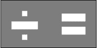

1.  创建一个新的`jqm-sprite.css`样式表，并为从自定义图标精灵派生的新图标定义类`.ui-icon-divide`和`.ui-icon-equals`：

    ```js
    .ui-icon-divide, .ui-icon-equals {
      background: #fff;
      background: rgba(0,0,0,.4);
     background-image: url("../../resources/images/calc-sprite.png");
      background-repeat: no-repeat;
      -moz-border-radius: 9px;
      -webkit-border-radius: 9px;
      -o-border-radius: 9px;
      border-radius: 9px;
    }
    @media only screen and (-webkit-min-device-pixel-ratio: 1.5), 
        only screen and (min--moz-device-pixel-ratio: 1.5), 
        only screen and (min-resolution: 240dpi) {
     .ui-icon-divide, .ui-icon-equals {
     background-image: url("../../resources/images/calc-sprite- 
     HD.png");
          -moz-background-size: 36px 18px;
          -o-background-size: 36px 18px;
          -webkit-background-size: 36px 18px;
          background-size: 36px 18px;
      }
    }
    .ui-icon-divide { background-position: -0px 50%; }
    .ui-icon-equals { background-position: -18px 50%; }

    ```

1.  将 CSS 包含在`main.html`的`<head>`部分中，如以下代码所示：

    ```js
    <link rel="stylesheet" href="http://code.jquery.com/mobile/1.1.1/jquery.mobile-1.1.1.min.css" /> 
    <link rel="stylesheet" href="jqm-sprite.css" />

    ```

1.  使用从自定义图标精灵派生的新图标以及默认图标，如以下代码所示。首先显示带有文本的按钮：

    ```js
    <div data-role="content">
      <h3>Default and Custom Icons with Text</h3>
      <input type="submit" data-inline="true" value="plus" data-icon="plus" />
      <input type="submit" data-inline="true" value="minus" data-icon="minus" />
      <input type="submit" data-inline="true" value="delete" data-icon="delete" />
     <input type="submit" data-inline="true" value="divide" data-icon="divide" />
     <input type="submit" data-inline="true" value="equals" data-icon="equals" />

    ```

1.  然后，显示没有文本的按钮以进行比较：

    ```js
    <h3>Default and Custom Icons without Text</h3>
      <input type="submit" data-inline="true" data-iconpos="notext" data-icon="plus" />
      <input type="submit" data-inline="true" data-iconpos="notext" data-icon="minus" />
      <input type="submit" data-inline="true" data-iconpos="notext" data-icon="delete" />
     <input type="submit" data-inline="true" data-iconpos="notext" data-icon="divide" />
     <input type="submit" data-inline="true" data-iconpos="notext" data-icon="equals" />
    </div>
    ```

## 工作原理...

创建一个样式表`jqm-sprite.css`，并在其中添加新的图标类`.ui-icon-divide`和`.ui-icon-equals`。指定`background-image`属性并将其指向要用作图标精灵的图像文件。接下来指定图标和**图标圆盘**的`background`颜色，并指定透明度，如所示。还为图标指定`border-radius`为`9px`。添加供应商前缀以确保它在各种浏览器平台上工作。最后，在 CSS 文件的最后两行中定义每个新图标在图标精灵中的位置。添加`@media`查询以指定图标应在其中工作的目标设备分辨率；这在本章早期的*在按钮中使用自定义图标*示例中已经解释过了。

这里，前缀文本**ui-icon**指示按钮插件这些是自定义图标，这将生成相应的类，不带前缀文本。现在，您可以使用属性`data-icon="divide"`或`data-icon="equals"`在按钮上使用新图标，框架将获取并显示正确的自定义图标。

在`main.html`中，通过添加使用输入标签的提交按钮创建一个简单计算器的按钮。使用`data-icon`属性设置这些按钮的图标，如下所示。为了比较，显示有文本和无文本的按钮。这里，**加**，**减**和**删除**图标来自默认图标精灵。自定义图标精灵贡献了**除以**和**等于**图标。屏幕显示如下图所示：

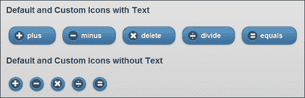

## 还有更多...

为了创建一个图标精灵，使用高度为`18px`的 PNG 图像。总宽度是图标精灵中图标数量乘以`18px`的倍数。默认图标精灵使用`0.4`的 alpha 值和`#666`的背景颜色。为了与默认图标保持一致的外观，使用相同的设置来创建您的自定义图标精灵。将图像保存为带有 alpha 透明度的**PNG-8**格式。

### 指定无效的图标名称

在代码中，如果指定一个无效的图标名称，比如`data-icon="random"`，框架会在文本前面添加`.ui-icon-`并尝试在样式表中查找该类。如果这不能解析为有效的图标，则框架现在会从默认图标精灵中选择第一个图标并显示出来。默认精灵中的第一个图标是`plus`图标，并且在无法解析图标名称的所有位置都使用它。

## 另请参阅

+   *替换默认图标精灵*配方

+   *在按钮中使用自定义图标*配方

# 替换默认图标精灵

本配方向您展示了如何替换 jQuery Mobile 提供的默认图标精灵并使用您自己的图标精灵。此处使用的自定义图标精灵包含形成骰子六个面的图标。

## 准备工作

从`code/04/replace-icon-sprite`源文件夹中复制此配方的完整代码。您可以使用 URL `http://localhost:8080/04/replace-icon-sprite/main.html`启动此代码。

## 如何操作...

在这个配方中，下面的图像，`dice.png`是一个包含六个骰子面图标的图标精灵。这个图标精灵用于替换默认图标精灵。


1.  创建一个新的样式表`jqm-sprite.css`，并重新定义 jQuery Mobile 框架中可用的默认`.ui-icon`类。将默认图标类替换为从自定义图标精灵派生的新类，如下所示的代码所示：

    ```js
    .ui-icon {
      background: #fff;
      background: rgba(0,0,0,.4);
     background-image: url("../../resources/images/dice.png");
      background-repeat: no-repeat;
      -moz-border-radius: 9px;
      -webkit-border-radius: 9px;
      -o-border-radius: 9px;
      border-radius: 9px;
    }
    @media only screen and (-webkit-min-device-pixel-ratio: 1.5), 
      only screen and (min--moz-device-pixel-ratio: 1.5), 
      only screen and (min-resolution: 240dpi) {
     .ui-icon-one, .ui-icon-two, .ui-icon-three, .ui-icon-four, .ui-icon-five, .ui-icon-six {
     background-image: url("../../resources/images/dice-HD.png");
          -moz-background-size: 108px 18px;
          -o-background-size: 108px 18px;
          -webkit-background-size: 108px 18px;
          background-size: 108px 18px;
      }
    }
    .ui-icon-one { background-position: -0px 50%; }
    .ui-icon-two { background-position: -18px 50%; }
    .ui-icon-three { background-position: -36px 50%; }
    .ui-icon-four { background-position: -54px 50%; }
    .ui-icon-five{ background-position: -72px 50%; }
    .ui-icon-six{ background-position: -90px 50%; }

    ```

1.  在`main.html`的`<head>`部分包含 CSS，如下所示的代码：

    ```js
    <link rel="stylesheet" href="http://code.jquery.com/mobile/1.1.1/jquery.mobile-1.1.1.min.css" /> 
    <link rel="stylesheet" href="jqm-sprite.css" />

    ```

1.  使用替换的图标精灵派生的新图标来显示骰子的六个面，如下所示的代码。显示带文本的按钮：

    ```js
    <div data-role="content">
      <input type="submit" data-inline="true" value="one" data-icon="one" />
      <input type="submit" data-inline="true" value="two" data-icon="two" />
      <input type="submit" data-inline="true" value="three" data-icon="three" />
      <input type="submit" data-inline="true" value="four" data-icon="four" />
      <input type="submit" data-inline="true" value="five" data-icon="five" />
      <input type="submit" data-inline="true" value="six" data-icon="six" />
    ```

1.  然后显示无文本的按钮以进行比较：

    ```js
    <h3>This is how they look without Text</h3>
      <input type="submit" data-inline="true" data-iconpos="notext" data-icon="one" />
      <input type="submit" data-inline="true" data-iconpos="notext" data-icon="two" />
      <input type="submit" data-inline="true" data-iconpos="notext" data-icon="three" />
      <input type="submit" data-inline="true" data-iconpos="notext" data-icon="four" />
      <input type="submit" data-inline="true" data-iconpos="notext" data-icon="five" />
      <input type="submit" data-inline="true" data-iconpos="notext" data-icon="six" />
    </div>
    ```

## 它是如何工作的...

创建一个样式表 `jqm-sprite.css`，并从 `jquery.mobile.css` 文件中直接复制代码片段以保持不变。将图标精灵的 `background-image` URL 更改为指向自定义图标精灵 `dice.png` 图像。添加名为 `.ui-icon-one` 到 `.ui-icon-six` 的单个图标类。指定这些图标在图标精灵中的位置。类 `.ui-icon` 已经为图标指定了 `background` 颜色。它还为需要的供应商前缀指定了图标的 `border radius` 为 `9px`。修改 `@media` 查询并更新新图标的名称，而不是默认图标，如所示。

这里，前缀文本 **ui-icon** 表示按钮插件，这些是自定义图标，这将生成相应的类而不包含前缀文本。您现在可以使用属性 `data-icon="one"` 至 `data-icon="six"` 在按钮上使用替换的图标，框架将获取并显示正确的自定义图标。

在 `main.html` 中，通过使用 input 标签添加提交按钮来创建骰子的六个面的按钮。使用 `data-icon` 属性为这些按钮设置图标，如所示。显示带文本和不带文本的按钮进行比较。骰子的六个面的按钮现在显示如下屏幕截图所示，首先是带有文本的，然后是不带文本的：

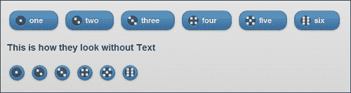

## 还有更多...

本配方向您展示如何用自己的自定义图标精灵替换默认的图标精灵。您将不能再在您的应用程序中使用默认的图标。所以，只有在您有充分的理由并且您的应用程序需要定制所有图标时才替换默认图标集。一个更好的方法是在默认精灵的基础上添加一个自定义精灵，就像前面的配方中所示的那样。

## 另请参阅

+   *在按钮中使用自定义图标* 配方

+   *添加自定义图标精灵* 配方

# 在可折叠块中使用替代图标

**可折叠块** 是带有 `data-role="collapsible"` 属性的容器。您可以在可折叠内容中添加标题和其他控件，当可折叠块折叠时，只显示标题。您可以单击可折叠块旁边的 **+** 图标来展开它。本配方向您展示如何在可折叠块中使用替代图标。

## 准备工作

从 `code/04/collapsible` 源文件夹复制此配方的完整代码。您可以使用 URL `http://localhost:8080/04/collapsible/main.html` 启动此代码。

## 如何做...

1.  在 `main.html` 中使用 `data-role="collapsible"` 添加两个可折叠块，如下所示的代码。默认情况下，第一个可折叠块使用标准图标（**加号** 和 **减号**）。

    ```js
    <div data-role="content">
     <div data-role="collapsible" data-collapsed="false"
          data-theme="c" data-content-theme="c">
        <h3>Header of the collapsible element</h3>
        The header uses the default plus/minus icons
      </div>
     <div id="collapser" data-role="collapsible" 
    data-collapsed="false" data-theme="d" data-content-theme="d">
        <h3>Header of the collapsible element</h3>
        The header uses the alternate expand/collapse icons
      </div>
    </div>
    ```

1.  将以下脚本添加到页面的 `<head>` 部分，以为第二个可折叠块设置替代箭头图标：

    ```js
    //on initial load
    $("#main").live("pagebeforeshow", function(event, data) {      
      $("#collapser").find( ".ui-icon-plus" )
        .toggleClass("ui-icon-arrow-r");
      $("#collapser").find( ".ui-icon-minus")
        .toggleClass("ui-icon-arrow-d");
    });
    // handle expand and collapse events below
    $("#main").live("pageshow", function(event, data) {      
     $("#collapser").bind("expand collapse", function(event) {
        var isCollapse = (event.type === "collapse");
        $(this).find( ".ui-icon" )
          .toggleClass( "ui-icon-arrow-d", !isCollapse )
          .toggleClass( "ui-icon-arrow-r", isCollapse );
      });
    });
    ```

## 它是如何工作的...

在 `main.html` 中，添加两个可折叠块；它们在加载时具有默认的 **加号** 和 **减号** 图标。添加脚本并为 `pagebeforeshow` 事件创建事件处理程序以更改第二个可折叠块（带有 `id="collapser"`）的图标。使用 jQuery 的 `find()` 方法查找类 `.ui-icon-plus`（**加号** 图标）并使用 `toggleClass()` 方法将其替换为类 `.ui-icon-arrow-r`（**右箭头**）。类似地，将类 `.ui-icon-minus`（**减号** 图标）替换为类 `.ui-icon-arrow-d`（**向下箭头**）。在可折叠块上设置 `data-collapsed="false"` 属性以展开显示。当页面显示时，第二个可折叠块现在具有箭头图标而不是默认图标：

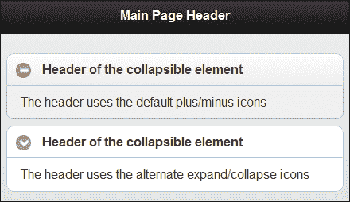

当可折叠块展开或折叠时，框架会使用标准图标切换图标。您可以通过为 `pageshow` 事件添加事件处理程序来覆盖此行为。根据可折叠块上的事件（`expand` 或 `collapse`），找到 `.ui-icon` 类并将其替换为 `.ui-icon-arrow-d` 或 `.ui-icon-arrow-r` 类以显示 **向下** 或 **向右** 箭头。折叠的块现在如下图所示：

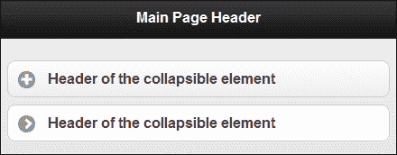

## 还有更多...

您可以使用 `data-content-theme` 属性为可折叠内容设置主题。标题不受影响。以下代码将可折叠内容主题设置为 `e`：

```js
<div data-role="collapsible" data-content-theme="e">
```

### 为可折叠标题设置主题

使用 `data-theme` 属性并将主题设置为包括标题在内的整个可折叠块。现在，您可以使用 `data-content-theme` 属性为可折叠内容设置不同的主题。现在，它看起来好像您单独为标题设置了样式。以下代码片段将标题主题设置为 `a`，正文主题设置为 `e`：

```js
<div data-role="collapsible" 
  data-theme="a" data-content-theme="e" >
```

## 另请参阅

+   *创建嵌套手风琴* 配方

# 创建嵌套手风琴

**手风琴** 或 **可折叠集** 是一个带有 `data-role="collapsible-set"` 的容器中的可折叠块组。一次只能展开一个可折叠块，其他可折叠块会返回到折叠状态。您不能直接嵌套手风琴。本配方向您展示如何在一个简单的应用程序中创建一个 **嵌套手风琴**，该应用程序显示了可购买的各种房地产属性。

## 准备工作

从 `code/04/nested-accordion` 源文件夹中复制此配方的完整代码。您可以使用 URL `http://localhost:8080/04/nested-accordion/main.html` 启动此代码。

## 如何操作...

1.  在 `main.html` 中添加一个嵌套手风琴，使用 `data-role="collapsible-set"` 如下所示：

    ```js
    <div data-role="content">
      <h4>Our current housing projects</h4>
     <div data-role="collapsible-set" data-theme="d" data-content-
     theme="d"> 
        <div data-role="collapsible" data-collapsed="false">
          <h3>Villas and Row Houses</h3>
     <div data-role="collapsible-set" data-theme="e" data-
     content-theme="e">
            <div data-role="collapsible">
              <h3>ABC Lake View</h3>
              Premium Villas with each villa having its own private 
              beach
            </div>
            <div data-role="collapsible">
              <h3>ABC Nest</h3>
              Serene row houses amidst acres of trees
            </div>
          </div>
        </div>
        <div data-role="collapsible">
          <h3>Apartments</h3>
          <div data-role="collapsible" data-theme="e" data-content-
          theme="e">
            <h3>ABC Sky Rise</h3>
            Luxury 3 bedroom apartments 2 blocks away from ABC Mall
          </div>
        </div>
      </div>
    </div>
    ```

## 工作原理...

在`main.html`中，创建一个折叠集，其中包含两个可折叠块。第一个可折叠块显示**别墅和排屋**，第二个显示**公寓**。您现在可以在**别墅和排屋**可折叠块下嵌套另一个可折叠块，如前面的代码片段所示。

添加两个可折叠块，将它们嵌套在第一个可折叠块内以列出两个属性。使用 `data-theme` 和 `data-content-theme` 属性将嵌套内容与其父可折叠块进行不同主题设置。嵌套可折叠块显示如下截屏所示：

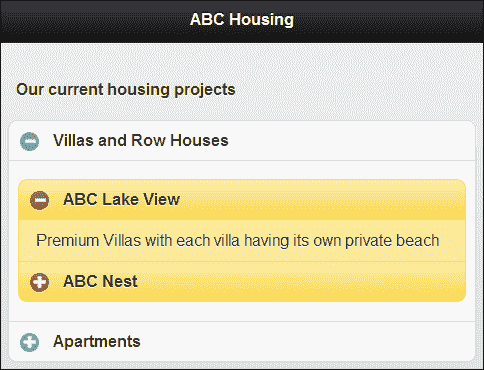

现在，为第二个可折叠块**公寓**添加内容以完成代码。在此嵌套手风琴中，任何时候只有一个可折叠块是展开的，如下截屏所示：

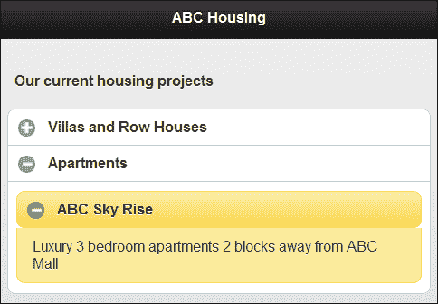

## 还有更多内容...

在可折叠集中的两个可折叠块之间引入任何其他元素或内容都会破坏该集合。当您展开或折叠它们时，可折叠块不再同步，并且它们变得彼此独立。

### 注意

正如名称所示，可折叠集必须仅包含可折叠块。

## 另请参阅

+   *在可折叠块中使用替代图标* 配方

# 创建自定义布局网格

您可以使用**布局网格**将控件放置在应用程序中相邻的位置。默认情况下，布局网格创建具有相等宽度的列单元格。本配方向您展示如何自定义此功能，并创建具有不同高度和宽度的单元格。

## 准备工作

从`code/04/layoutgrid`源文件夹中复制此配方的完整代码。您可以使用 URL `http://localhost:8080/04/layoutgrid/main.html` 启动此代码。

## 如何执行...

1.  如下代码所示，在`main.html`中添加布局网格，使用 `ui-grid` 和 `ui-block` 类：

    ```js
    <div data-role="content">
     <fieldset class="ui-grid-a">
     <div class="ui-block-a" style="width: 25%">
          <div class="ui-bar ui-bar-e">Col A</div>
        </div>
        <div class="ui-block-b" style="width: 50%">
          <div class="ui-bar ui-bar-e">Col B</div>
        </div>
        <div class="ui-block-c" style="width: 25%">
          <div class="ui-bar ui-bar-e">Col C</div>
        </div>
     <div class="ui-grid-solo">
          <div style="height: 40px" class="ui-bar ui-bar-e">A    Single Cell</div>
        </div>
      </fieldset>
    </div>
    ```

## 如何运作...

通过添加带有属性 `class="ui-grid-a"` 的 `fieldset` 元素来在其页面中为 `main.html` 添加布局网格。这将默认创建具有相等宽度的两列。但是，您可以通过添加如代码所示的 `ui-block-a`、`ui-block-b` 和 `ui-block-c` divs 来添加三个单元格。每个 div 的宽度不同，其中 **Col B** 的宽度为 `50%`，另外两列的宽度分别为 `25%`。总宽度总和为 100%，框架会自动将它们排列在单行中。如果总和超过 100%，则额外的单元格将移到下一行。

现在在第二行添加一个带有类`ui-grid-solo`的单个`div`，这将使单元格的宽度达到 100%。您可以像代码中所示使用`style="height:"`属性来更改此单元格的高度。 `ui-bar` 和 `ui-bar-e` 类样式的单元格具有边框和渐变颜色，并使用 swatch `e`对其进行主题化。网格布局现在如下截屏所示：

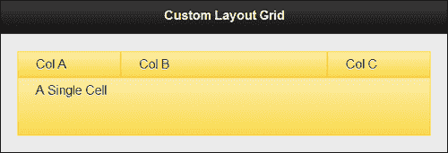

## 还有更多内容...

你可以通过向其添加 `data-theme` 属性来使单个单元格 `ui-block` 与其他单元格不同的主题化。要使整行与网格中的其他行不同主题化，你需要将相同的 `data-theme` 属性添加到该行的所有单元格。

### 添加内容到布局网格单元格

你可以在布局网格的 `ui-block` 单元格中添加任何类型的元素。你甚至可以在此单元格中添加一个布局网格。你必须明智地选择你想要的屏幕外观，记住移动设备的有限屏幕尺寸。

### 向任何容器添加网格布局

通过将 `ui-grid` 类添加到任何容器中，你可以向任何容器添加网格。以下代码片段将整个页面样式化为两列网格：

```js
<div id="main" data-role="page" class="ui-grid-a">
```

## 另请参见

+   *向页脚添加布局网格*的方法见第三章, *工具栏*

# 使用 XML 内容

你可以在应用程序中显示从各种格式和来源获得的数据。此示例向你展示如何显示从 XML 文件中获取的一组示例**学生记录**。

## 准备工作

从 `code/04/xml-content` 源文件夹中复制此方法的完整代码。你可以使用 URL `http://localhost:8080/04/xml-content/main.html` 启动此代码。

## 如何做...

1.  创建带有具有属性 `name` 和 `age` 的学生节点的 `student.xml` 文件。每个 `student` 节点有多个 `course` 子元素。每个 `course` 元素都有一个 `name` 属性和一个如下所示的子 `marks` 元素：

    ```js
    <?xml version="1.0" encoding="utf-8" ?>
    <students>
     <student name="Alex" age="22">
        <course name="HTML5">
          <marks>89</marks>
        </course>
        <course name="CSS3">
          <marks>88</marks>      
        </course>
        <course name="JavaScript">
          <marks>80</marks>      
        </course>
      </student>
      . . . . 
    </students>
    ```

1.  创建 `main.html` 文件并添加一个隐藏的 `div` 容器。你可以将 XML 数据读取到这个 `div` 中，然后格式化并显示它：

    ```js
    <div id="content" data-role="content" data-theme="b">
      <div id="hiddendiv" hidden="true">hi</div>
    </div>
    ```

1.  在 `main.html` 的 `<head>` 部分中包含以下 JavaScript 代码，以加载 XML 文件，格式化数据，然后显示它：

    ```js
    $("#main").live("pageinit", function(event) {
      var str="";
     $("#hiddendiv").load("student.xml", function() {
        $("#hiddendiv").find("student").each(function() {
          str += "<div data-role='collapsible' data-theme='d'
            data-content-theme='d'>";
          str += "<h3>" + $(this).attr("name") + ", "
              + $(this).attr("age") +" years</h3>";
          str += "<ul data-role='listview'>";
          var i=0;
          $(this).find("course").each(function() {
            str += "<li>" + $(this).attr("name") + " : " 
                + $(this).children("marks").html() + "</li>";
          });
          str += "</ul></div>";
        });
     $("#content").html(str).trigger("create");
      });
    });
    ```

## 工作原理...

在 `main.html` 中，添加一个带有 `id="hiddendiv"` 的 `div` 容器，并通过设置属性 `hidden="true"` 来隐藏它。为 `pageinit` 事件创建事件处理程序，以便在页面初始化和内存可用时处理 XML 数据的加载。使用 jQuery Ajax 的 `load()` 方法将 XML 数据加载到 `hiddendiv` 中。加载成功后，使用 jQuery 的 `find()` 方法找到每个 `student` 节点。对于每个 `student`，通过创建可折叠项（使用 `data-role="collapsible"`）生成 HTML 代码。将可折叠项标题设置为学生的 `name` 和 `age`。你可以使用 jQuery 的 `attr()` 方法从 `student` 节点的属性中获取这些值。接下来，找到 `student` 节点内的每个课程并获取 `course` 的 `name` 和 `marks`。通过使用 `children()` 调用读取 `marks` 值，该调用提取 `course` 节点的第一个子元素。将 `course` 元素添加到无序列表中（使用 `data-role="listview"`）。

一旦 HTML 内容构建完成，将其设置为`"#content"`页面内容 div，并触发`"create"`方法，让 jQuery Mobile 框架发挥其作用并生成增强控件，如下面的屏幕截图所示：

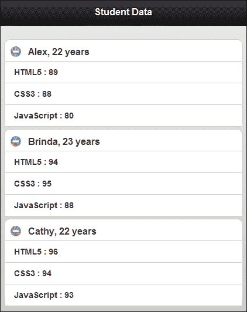

## 还有更多...

本教程向您展示如何通过 Ajax 从位于相同文件夹中的 XML 文件中读取内容。您也可以向服务器发送 Ajax 请求，获取此 XML 作为响应。jQuery 库有一大堆选择器和操作器，可以用来读取和写入 XML 数据。访问[`docs.jquery.com`](http://docs.jquery.com)了解更多信息。

### 注意

XML 结构需要结束标记，这使它变得臃肿。尽量使用更多的属性，而不是子节点，尽量使您的 XML 尽可能轻巧。您还可以使用诸如*gzip*之类的算法来压缩 XML。

### 使用本机浏览器渲染 XML

几乎所有浏览器都知道如何直接渲染和显示 XML 数据。如果 XML 内容有相关的样式表，还可以对 XML 内容进行格式化和样式化。在您的 jQuery Mobile 应用程序中，您可以在可以使用`target`属性在锚链接上打开内容的情况下，利用此功能，如下面的代码所示：

```js
<a href="student.xml" target="student" data-role="button">Open Student details</a>
```

## 另请参阅

+   *使用 JSON 内容*教程

# 使用 JSON 内容

**JSON**代表**JavaScript 对象表示法**。它是一种轻量级的数据交换格式，非常容易使用。本教程向您展示如何从 JSON 文件中显示**贵金属**的价格。

## 准备工作

从`code/04/json-content`源文件夹中复制此教程的完整代码。您可以使用 URL `http://localhost:8080/04/json-content/main.html` 来启动此代码。

## 如何做...

1.  创建包含五种贵金属数组的`precious.json`文件。名称、符号以及日内`open`，`close`，`high`和`low`价格也可用，如下面的代码所示：

    ```js
    [
      {
        "name": "Gold",
        "symbol": "Au",
        "price": { "open": 1642.46, "close": 1682.42, "high": 1699.66, "low": 1638.51 }
      },
      {
        "name": "Silver",
        "symbol": "Ag",
        "price": { "open": 31.24, "close": 33.11, "high": 33.65, "low": 31.21 }
      },
      {
        "name": "Platinum",
        "symbol": "Pt",
        "price": { "open": 1621.15, "close": 1623.87, "high": 1624.45, "low": 1620.98 }
      },
      {
        "name": "Paladium",
        "symbol": "Pd",
        "price": { "open": 656.05, "close": 657.35, "high": 657.75, "low": 655.25 }
      },
      {
        "name": "Rhodium",
        "symbol": "Rh",
        "price": { "open": 1434.38, "close": 1434.68, "high": 1434.98, "low": 1434.12 }
      }
    ]
    ```

1.  创建`main.html`，并向其中添加一个带有`id="preciousdata"`的空的`div`。您可以在这里读取 JSON 文件，格式化并显示数据：

    ```js
    <div id="content" data-role="content" data-theme="b">
      <div id="preciousdata"></div>
    </div>
    ```

1.  在`main.html`的`<head>`部分中包含以下 JavaScript 代码，以获取和加载 JSON 文件，格式化数据，并在布局网格中显示贵金属的价格表：

    ```js
    $("#main").live("pageinit", function(event) {
     $.getJSON("precious.json", function(metal) { 

    ```

1.  接下来，将用于创建布局网格的 HTML 字符串存储在本地变量中：

    ```js
        var blocka = "<div class='ui-block-a' style='width: 40%'>";
        var blockb = "<div class='ui-block-b' style='width: 15%'>";
        var blockc = "<div class='ui-block-c' style='width: 15%'>";
        var blockd = "<div class='ui-block-d' style='width: 15%'>";
        var blocke = "<div class='ui-block-e' style='width: 15%'>";
        var title = "<div class='ui-bar ui-bar-a' style='text-align: right'>";
        var uibarc = "<div class='ui-bar ui-bar-c' style='text-align: right'>";
        var uibare = "<div class='ui-bar ui-bar-e' style='text-align: right'>";
    ```

1.  使用上面定义的本地变量构建布局网格标题的 HTML 内容：

    ```js
        var str="<div class='ui-grid-d'>";
        str += blocka + title + "Precious Metal (USD)</div></div>";
        str += blockb + title + "Open</div></div>";
        str += blockc + title + "High</div></div>";
        str += blockd + title + "Low</div></div>";
        str += blocke + title + "Close</div></div>";
    ```

1.  现在为每个金属创建包括其价格详细信息的 HTML 内容：

    ```js
        for (var i in metal) {
          str += blocka + uibare + metal[i].name 
              + " (" + metal[i].symbol + ")</div></div>";
          str += blockb + uibarc + metal[i].price.open 
              + "</div></div>";
          str += blockc + uibare + metal[i].price.high 
              + "</div></div>";
          str += blockd + uibarc + metal[i].price.low 
              + "</div></div>";
          str += blocke + uibare + metal[i].price.close 
              + "</div></div>";
        }
        str += "</div>";
    ```

1.  最后，将这些数据添加到`#preciousdata` div 中，并触发`"create"`方法来显示格式化的 JSON 数据：

    ```js
     $("#preciousdata").html(str).trigger("create");
      });
    });
    ```

## 它是如何工作的...

在 `main.html` 中，添加一个空的 `div` 容器，其 `id="preciousdata"`。您可以使用此容器稍后显示格式化的 JSON 数据。为 `pageinit` 事件创建事件处理程序，以在页面初始化并在内存中可用时处理 JSON 数据的加载。使用 `$.getJSON()` jQuery 调用通过 GET 请求从服务器获取 JSON 编码的数据。现在，JSON 数据可用在 `metal` 对象中。

在 `getJSON` 方法的回调函数中，使用 `ui-grid-d` 类创建一个五列布局网格的 HTML 内容。五列标题分别是 **贵金属（美元）**、**开盘价**、**最高价**、**最低价** 和 **收盘价**。使用 `ui-block` 类为每个列单元格创建标题行。接下来，循环遍历 `metal` 中的对象，并构造列单元格，如下所示。

使用样式 `e` 和样式 `c` 交替为列设置主题。您可以使用样式 `a` 不同地设置标题。最后，将生成的 HTML 内容设置为 `#preciousdata` div，并触发 `create` 方法以让 jQuery Mobile 增强布局网格。现在，以以下截图所示的方式显示了包含贵金属价格数据的 JSON：

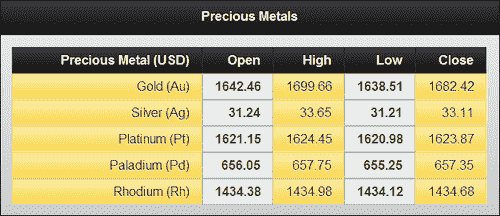

## 还有更多...

本方法向您展示如何使用 `jQuery.getJSON()` 方法从服务器获取 JSON 数据。jQuery 库还提供了一个 `jQuery.parseJSON()` 方法，您可以使用它将 JSON 字符串直接解析为 JavaScript 对象，如下面的代码所示：

```js
var preciousobject= jQuery.parseJSON('{"name":"Gold"}');
```

### 用于数据存储和数据传输的 JSON

JSON 在今天非常流行，用于存储和传输数据。JSON 是 JavaScript 的一个子集，正如本示例所示，使用 JavaScript 读取 JSON 数据非常简单。与 XML 相比，JSON 轻量且使用的带宽较少（例如，没有开始和结束标记）。JSON 还得到了许多面向文档的数据库的原生支持，如 CouchDB 和 MongoDB。

### JSON 解析器

JSON 数据也可以使用 JavaScript 的 `eval()` 方法加载。但是，只有在绝对必要且非常确定 JSON 文本文件的来源时才能这样做。使用 **JSON 解析器** 加载数据始终更安全，因为这将仅接受有效的 JSON 数据，并防止潜在的恶意代码运行。有关更多详细信息以及访问各种可用的 JSON 解析器，请参阅 [www.json.org](http://www.json.org)。通常首选 jQuery JSON 方法，因为它们非常方便且安全可靠。

### 注意

始终使用正确实现的 JSON 解析器来读取和写入 `.json` 文件。避免使用 `eval()` 方法，这是不安全的。

## 另请参见

+   使用 XML 内容的方法
