# 第五章：表单

在本章中，我们将介绍：

+   表单控件的原生样式

+   禁用文本控件

+   在网格中分组单选按钮

+   自定义复选框组

+   创建动态翻转开关和滑块控件

+   使用选项来自动初始化选择菜单

+   验证表单

+   使用 POST 提交表单

+   使用 GET 获取数据

+   创建一个可访问的表单

# 介绍

jQuery Mobile 框架默认增强标准 HTML 表单元素，使其触摸友好，同时在多个设备和平台上运行。表单可以包含多个控件，而你可以使用在其上设置 `data-role='controlgroup'` 的 `fieldset` 来对这些控件进行分组。默认情况下，控件以垂直方式列出。你可以使用 `data-type='horizontal'` 属性将它们水平排列。表单支持 **HTTP GET** ，**POST** 和其他操作。在适当的情况下，使用 Ajax 进行表单提交。

# 表单控件的原生样式

jQuery Mobile 框架默认增强表单及其控件。这个配方向你展示了设置表单控件原生样式的不同方法，以及如何自动初始化这些控件。

## 准备工作

从 `code/05/native-style` 源文件夹中复制此配方的全部代码。可以使用 URL `http://localhost:8080/05/native-style/main.html` 启动此代码。

## 如何进行...

1.  在 `<head>` 部分中，向 `main.html` 添加以下脚本以使所有按钮以原生样式呈现：

    ```js
    $(document).bind('mobileinit', function() {
     $.mobile.page.prototype.options.keepNative = 'button';
    });
    ```

1.  在页面内容中添加一个表单，以设置控件的原生样式：

    ```js
    <form action='#' method='post'>
      <p><label for='button1'>Button 1</label></p>
      <button name='button1'>Button: keepNative configuration</button>
      <p><label for='button2'>Button 2</label></p>
     <button name='button2' data-role='button'>Button: data-role='button'</button>
      <p><label for='button3'>Button 3</label></p>
      <button id='button3' name='button3'>Button: buttonMarkup()</button>
     <script>$('#button3').buttonMarkup(); </script>
      <p><label for='input1'>Input 1</label></p>
      <input type='submit' name='input1' value='Input: default'></input>
      <p><label for='input2'>Input 2</label></p>
      <input type='submit' name='input1' data-role='none' value="Input: data-role='none'"></input><p>
      <a href='#'>Default anchor link</a></p>
     <a href='#' data-role='button'>Anchor: data-role='button'></a>
    </form>
    ```

## 它是如何工作的...

在 `main.html` 中，添加一个事件处理程序，处理应用程序启动时触发的 `mobileinit` 事件。在这里，将页面插件的 `keepNative` 属性设置为 `'button'`。现在，框架将不会增强按钮控件，而是以原生样式呈现它们。现在在表单中添加 `button1` ，它将以原生样式呈现。要覆盖这种原生样式，添加 `button2` 并设置属性 `data-role='button'`。类似地，添加 `button3` 并在脚本中调用 `buttonMarkup（）` 方法，如前面的代码中所示。现在，`button2` 和 `button3` 都通过覆盖默认的原生样式来进行增强。

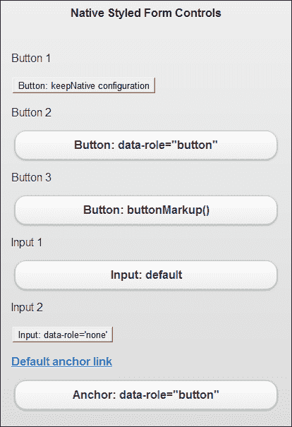

框架默认增强所有其他控件。添加一个输入按钮 `input1`，你会看到它已被增强。要使用原生样式控件，可以像上面代码中显示的那样使用 `data-role='none'` 属性来设置输入控件 `input2`。

对于锚链接，默认情况下使用原生样式。你可以用 `data-role='button'` 属性来增强锚链接。创建的表单如上所示。

## 还有更多...

如前所述，框架会增强表单控件，使其在所有平台上都能轻松使用手指操作。但这些控件可能在其他小容器（如工具栏）中使用时会显得稍大。您可以通过在控件上设置`data-mini='true'`属性，使用控件的**迷你版本**。控件现在变小了一点，但仍然是手指友好的。您可以直接在`controlgroup`上设置此属性，所有子元素将自动缩小。访问 jQuery Mobile 在线文档，查看各种控件的比较：[`jquerymobile.com/test/docs/forms/forms-all-compare.html`](http://jquerymobile.com/test/docs/forms/forms-all-compare.html)。

### 设置多个控件使用原生样式

您可以使用**页面插件**指定多个控件以使用原生样式。下面一行代码会原生样式化表单中的所有按钮、输入控件和选择菜单：

```js
$.mobile.page.prototype.options.keepNative = 'button, input, select';
```

### `data-role='none'`属性

根据控件类型，框架通过使用相应的插件来初始化和增强控件。当指定`data-role='none'`时，控件不会被框架增强，并且控件会使用原生样式。使用`data-theme`属性设置控件主题等操作将被忽略。

### 注意

jQuery Mobile 提供的增强样式是轻触友好的，非常适合移动设备。尽量避免在应用程序中使用原生样式。

# 禁用文本控件

此教程向您展示了在表单中启用和禁用文本控件的不同方法。

## 准备就绪

从`code/05/text-controls`源文件夹中复制此教程的全部代码。可以使用 URL `http://localhost:8080/05/text-controls/main.html`启动此代码。

## 如何做...

1.  在`main.html`中，在表单中创建以下文本控件：

    ```js
    <form action='#' method='post'>
      <input type='search' id='searchitem' name='searchitem' autofocus
          placeholder='Enter search text' value='' />
      <input type='text' id='textitem' name='textitem' 
          placeholder='Enter text item' value='' />
      <textarea id='textarea' name='textarea' 
          placeholder='Enter description'></textarea>
     <a href='#' data-role='button' class='ui-disabled'>More Details</a>
    </form>
    ```

1.  将以下脚本添加到`<head>`部分以禁用所有控件：

    ```js
      $('#main').live('pageinit', function(event) {
     $('#textitem').prop('disabled', true);
     $('#textarea').textinput('disable');

    ```

1.  然后处理搜索文本控件的`change`事件来启用所有表单控件：

    ```js
       $('#searchitem').bind('change', function(event, ui) {
          var str = $(this).attr('value');
     $('#textitem').prop('disabled', true);
     $('#textarea').textinput('enable').append(str
     + ' is absolutely awesome!');
          $('a').removeClass('ui-disabled');
       });
    });
    ```

## 它的运作方式...

在`main.html`中，添加一个带有`type='search'`的搜索控件，并添加一个带有`type='text'`的文本。现在，按照上面的代码添加一个空的`textarea`。添加一个链接并通过设置`class='ui-disabled'`属性来禁用它。在脚本中，添加一个`pageinit`事件处理程序，在页面初始化后调用。在这里，通过调用`prop('disabled', true)`方法来设置其`disabled`属性来禁用文本输入。然后通过调用**textinput 插件**的`textinput('disable')`方法来禁用`textarea`。现在，当应用程序加载时，除搜索输入外，表单上的所有控件都被禁用，如下面的屏幕截图所示：

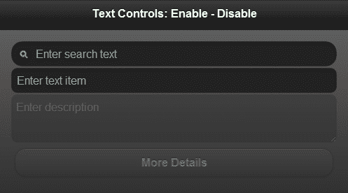

### 注意

您不能在使用`data-role='button'`将增强为按钮的锚链接上使用`disabled`属性。此属性会被忽略。

现在，为了启用控件，将搜索控件的 `change` 事件绑定到事件处理程序上。在这里，通过调用 `prop('disabled', false)` 方法来启用 `textitem` 控件。接下来，在 `textarea` 上调用 `textinput('enable')` 方法来调用其 **textinput 插件** 上的 enable 方法。在 `textarea` 上调用 `append()` 方法以向其添加文本。最后，在锚链接上调用 jQuery `removeClass()` 方法来移除 '`ui-disabled'` 类。现在，一旦您在搜索字段中输入内容，表单控件都会被启用，如下图所示：

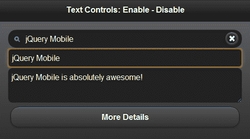

## 更多内容...

您还可以通过使用 `attr()` 和 `removeAttr()` jQuery 方法将 `disabled` 属性添加到控件来启用或禁用控件，如下所示：

```js
$('#textitem').attr('disabled', 'disabled'); // to disable
$('#textitem').removeAttr('disabled'); // to enable
```

### 文本控件的自动初始化

文本区域和文本输入控件（`input type='text'`）会自动由框架增强。您还可以使用 `data-theme` 属性为文本控件设置主题。

# 将单选按钮分组到网格中

jQuery Mobile 框架允许您在水平或垂直方向上分组单选按钮。本示例向您展示如何在简单的座位预订表单中将单选控件分组为 3 x 3 网格。

## 准备工作

从 `code/05/radiobutton-grid` 源文件夹中复制此示例的完整代码。此代码可使用 URL `http://localhost:8080/05/radiobutton-grid/main.html` 运行。

## 如何执行...

1.  在 `main.html` 中，使用 3 x 3 布局网格创建九个单选控件。这些单选按钮是同一个控件组的一部分。

    ```js
    <form action='#' method='post'>
      <fieldset data-role='controlgroup' data-type='horizontal' 
          class='ui-grid-a'>
        <div class='ui-block-a' style='width: 30%'>
            <legend>First Row</legend></div>
        <div class='ui-block-b' style='width: 70%'>
          <input type='radio' name='radio-1' id='radio-11' value='Seat-A1' checked />
          <label for='radio-11'>A-1</label>
          <input type='radio' name='radio-1' id='radio-12' value='Seat-A2' />
          <label for='radio-12'>A-2</label>
          <input type='radio' name='radio-1' id='radio-13' value='Seat-A3'/>
     <label id='l-13' for='radio-13' class='ui-corner-right'>A-3</label>
        </div>
        <div class='ui-block-a' style='width: 30%'>
            <legend>Mid Row</legend></div>
        <div class='ui-block-b' style='width: 70%'>
          <input type='radio' name='radio-1' id='radio-21' value='Seat-B1' />
     <label id='l-21' for='radio-21' class='ui-corner-left'>B-1</label>
          <input type='radio' name='radio-1' id='radio-22' value='Seat-B2' />
          <label for='radio-22'>B-2</label>
          <input type='radio' name='radio-1' id='radio-23' value='Seat-B3'/>
     <label id='l-23' for='radio-23' class='ui-corner-right'>B-3</label>
        </div>
        <div class='ui-block-a' style='width: 30%'>
            <legend>Last Row</legend></div>
          <div class='ui-block-b' style='width: 70%'>
            <input type='radio' name='radio-1' id='radio-31' value='Seat-C1' />
     <label id='l-31' for='radio-31' class='ui-corner-left'>C-1</label>
            <input type='radio' name='radio-1' id='radio-32' value='Seat-C2' />
            <label for='radio-32'>C-2</label>
            <input type='radio' name='radio-1' id='radio-33' value='Seat-C3'/>
            <label for='radio-33'>C-3</label>
        </div>
      </fieldset>
    </form>
    ```

1.  将以下脚本添加到 `<head>` 部分以修复边缘单选按钮的样式：

    ```js
    $('#main').live('pageshow', function(event) {
      $('#l-13').children('span').addClass('ui-corner-right ui-controlgroup-last');
      $('#l-23').children('span').addClass('ui-corner-right ui-controlgroup-last');
      $('#l-21').children('span').addClass('ui-corner-left');
      $('#l-31').children('span').addClass('ui-corner-left');
    });
    ```

## 工作原理...

在 `main.html` 中，通过指定 `data-role='controlgroup'` 和 `data-type='horizontal'` 来添加水平单选控件组。现在将 `ui-grid-a` 类添加到此 `fieldset` 容器中，以创建两列布局网格。对于每一行，通过将 `class='ui-block-a'` 指定给 `div` 容器，在第一列添加图例，并通过 `class='ui-block-b'` 在第二列添加单选按钮。根据上述代码，添加九个具有适当标签的单选按钮，每行包含三个单选按钮。这将创建一个 3 x 3 单选按钮组的网格。

在上面的代码中，你会发现网格中的第一个和最后一个单选按钮样式正确，但所有其他边缘单选按钮（带有标签 l-13、l-21、l-23 和 l-31）样式不正确。它们具有矩形边缘而不是圆角。为了解决这个问题，你需要将框架为第一个单选按钮的标签生成的样式（`class='ui-corner-left'`）复制到标签 l-21 和 l-31 的内部`span`中。同样地，将框架为最后一个单选按钮的标签生成的样式（`class='ui-corner-right ui-controlgroup-last'`）复制到标签 l-13 和 l-23 的内部`span`中。现在单选按钮网格的样式已经正确，如下截图所示，你现在可以一次仅选择整个网格中的一个单选按钮：

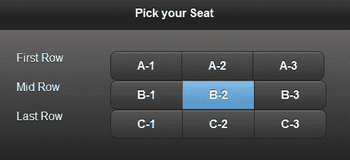

## 还有更多...

当框架遇到一个带有`type='radio'`的`input`控件时，它会自动使用**checkboxradio 插件**将其增强为样式化的单选按钮。你可以通过在初始化期间使用`data-theme`属性来为单选按钮设置主题。你可以通过使用`data-role='none'`属性来关闭自动初始化并使用原生样式。

## 另请参阅

+   *自定义复选框控件组* 示例

# 自定义复选框控件组

默认的水平分组复选框控件没有图标，垂直分组的复选框控件不使用活动状态主题。这个示例向你展示了如何自定义复选框并添加这些样式。它还向你展示了如何调整布局以处理不同的屏幕尺寸。在这个示例中，你将创建一个简单的**博客订阅**表单。

## 准备工作

从`code/05/custom-checkbox`源文件夹中复制这个示例的全部代码。你可以使用`http://localhost:8080/05/custom-checkbox/main.html`网址来运行这段代码。

## 如何实现...

首先创建一个包含水平和垂直复选框控件组的表单。通过 JavaScript 在`pageshow`事件处理程序中向水平复选框控件添加图标来自定义水平复选框控件。复选框控件的`change`事件指示复选框`checked`状态是否已更改。使用`change`事件处理程序来添加和切换复选框的活动状态。

1.  在`main.html`中，创建一个带有垂直复选框控件组的表单：

    ```js
    <form action='#' method='post'>
      <div data-role='fieldcontain'>
        <fieldset data-role='controlgroup'>
          <legend>Subscribe to:</legend>
          <input type='checkbox' name='posts' id='posts' />
     <label for='posts' id='postslbl'>New Posts</label>
          <input type='checkbox' name='comments' id='comments' />
     <label for='comments' id='commentslbl'>Comments</label>
        </fieldset>
      </div>
    ```

1.  接下来添加两个水平切换集或复选框组：

    ```js
      <div data-role='fieldcontain'>
        <fieldset data-role='controlgroup' data-type='horizontal'>
          <legend>Notify Me:</legend>
          <input type='checkbox' name='notify' id='notify' />
          <label for='notify'>Immediate</label>
          <input type='checkbox' name='digest' id='digest' />
          <label for='digest'>Daily Digest</label>
        </fieldset>
      </div>
      <div data-role='fieldcontain'>
        <fieldset data-role='controlgroup' data-type='horizontal'>
          <legend>Share To:</legend>
          <input type='checkbox' name='twitter' id='twitter' />
     <label for='twitter' id='twitterlbl'>Twitter</label>
          <input type='checkbox' name='facebook' id='facebook' />
     <label for='facebook' id='facebooklbl'>Facebook</label>
        </fieldset>
      </div>
    </form>
    ```

1.  将以下脚本添加到`<head>`部分以向水平组添加图标：

    ```js
    $('#main').live('pageshow', function(event, data) {
      $('#twitterlbl').children('span').append("<span class='ui-icon ui-icon-shadow ui-icon-checkbox-off'>").trigger('create');
      $('#twitterlbl').addClass('ui-btn-icon-left').trigger('refresh');
      $('#facebooklbl').children('span').append("<span class='ui-icon ui-icon-shadow ui-icon-checkbox-off'>").trigger('create');
      $('#facebooklbl').addClass('ui-btn-icon-left').trigger('refresh');
      updatePosts();
      updateComments();
      $('#posts').bind('change', updatePosts);
      $('#comments').bind('change', updateComments);
    });
    ```

1.  接下来，绑定`change`事件来处理控件的`checked`状态变化：

    ```js
    function updatePosts(event, ui) {
     if($('#posts').prop('checked')) {
        $('#postslbl').addClass('ui-btn-active').trigger('refresh');
      } else {
        if($('#postslbl').hasClass('ui-btn-active'))
          $('#postslbl').removeClass('ui-btn-active').trigger('refresh');
      }
    }
    ```

1.  最后，根据垂直复选框的`checked`状态切换活动状态：

    ```js
    function updateComments(event, ui) {
     if($('#comments').prop('checked')) {
        $('#commentslbl').addClass('ui-btn-active').trigger('refresh');
      } else {
        if($('#commentslbl').hasClass('ui-btn-active'))
          $('#commentslbl').removeClass('ui-btn-active').trigger('refresh');
      }
    }
    ```

## 工作原理...

在`main.html`中，向**博客订阅**表单添加三个具有`data-role='controlgroup'`的`fieldset`元素。向第一个`fieldset`元素添加一个垂直复选框组，其中包含**文章**和**评论**的复选框。第二个控制组是用于选择博客通知的水平切换集合（**立即**和**作为每日摘要**）。第三组复选框也是水平的，选项包括在**Twitter**和**Facebook**上分享。

默认情况下，水平切换集合不带图标。你可以自定义并向其添加图标。为`pageshow`事件创建事件处理程序，并将所需的样式添加到第三个水平切换集合的标签中。在具有`id='twitterlbl'`和`id='facebooklbl'`的标签中添加具有`class='ui-icon ui-icon-shadow ui-icon-checkbox-off'`的内部 span，并且还将`ui-btn-icon-left`类添加到标签中。这将在两个复选框的左侧添加一个图标，类似于垂直复选框控件提供的图标。将其与其他水平切换集合进行比较。

默认情况下，垂直复选框具有图标，并且在选中时这些图标显示为勾号。垂直复选框不会获得`btn-active`样式（与水平复选框不同）。要添加活动按钮样式，请为两个垂直复选框（具有`id='posts'`和`id='comments'`）创建`change`事件的事件处理程序。对于这两个复选框，使用`prop('checked')`调用来查找控件是否被`checked`，然后添加或删除`ui-btn-active`类以为垂直复选框设置样式，类似于水平复选框。屏幕显示如下截图所示：

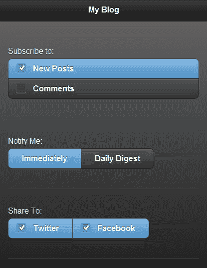

## 更多内容...

在上述代码中，每个复选框组都包装在具有属性`data-role='fieldcontain'`的容器中。此属性将使框架根据屏幕大小动态调整控件的布局和其标签的位置。还添加了一个小的水平分隔线以显示分隔。在较宽的屏幕或使用横向方向时，显示如下截图所示：

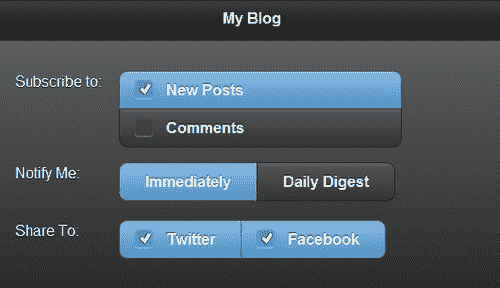

### 复选框控件的自动初始化

当框架遇到具有`type='checkbox'`的`input`控件时，它会自动使用**checkboxradio 插件**将其增强为样式化复选框。您可以在初始化期间使用`data-theme`属性为复选框设置主题。您可以通过使用`data-role='none'`属性关闭自动初始化并使用原生样式。

## 另请参阅

+   *在网格中对单选按钮进行分组* 的方法

# 创建动态翻转开关和滑块控件

本方法向您展示了如何使用 JavaScript 将**翻转开关**和**滑块**控件动态添加到页面，并处理其事件。在这里，您将创建一个简单的**音量控制**表单，其中包含一个音量滑块，在音量非常高时会向用户发出警告。

## 准备就绪

从`code/05/dynamic-slider`源文件夹中复制这个配方的全部代码。可以使用 URL `http://localhost:8080/05/dynamic-slider/main.html`启动这段代码。

## 如何做...

1.  在`main.html`中，向页面内容添加以下空表单：

    ```js
    <form id='volumeForm' action='#' method='post'></form>
    ```

1.  在`<head>`部分添加以下脚本，动态添加一个开关和一个滑块：

    ```js
    $('#main').live('pageinit', function(event) {
      var str="<div data-role='fieldcontain' style='width: 50%'><label for='flipswitch'>Volume:</label>"
        + "<select name='flipswitch' id='flipswitch' data-role='slider' data-track-theme='d'>"
        + "<option value='no'>Off</option><option value='yes'>On</option></select></div>"
        + "<div id='volcontainer' data-role='fieldcontain' style='width: 100%'>"
        + "<input type='range' name='volume' id='volume' value='8' min='0' max='15' data-track-theme='b' disabled /></div>";
     $('#volumeForm').html(str).trigger('create');

    ```

1.  处理翻转开关的`change`事件以启用音量滑块控件：

    ```js
      $('#flipswitch').bind('change', function(event, data) {
     if ($(this).slider().val() == 'no') {
          $('#volume').slider('disable');
        } else {
          $('#volume').slider('enable');
        }
      });
    });
    ```

1.  处理音量滑块的`change`事件以根据其值设置滑块样式：

    ```js
    $('#main').live('pageshow', function(event) {
     $('#volume').bind('change', function(event, data) {
        if ($(this).slider().val() > 10) {
          $('#volcontainer').find('.ui-btn-down-b')
          .removeClass('ui-btn-down-b').addClass('ui-btn-down-e');
        } else {
          $('#volcontainer').find('.ui-btn-down-e')
          .removeClass('ui-btn-down-e').addClass('ui-btn-down-b');
        }
      });
    });
    ```

## 它是如何工作的...

在`main.html`中添加一个空表单`id='volumeForm'`。为`pageinit`事件创建一个事件处理程序，该事件在页面初始化后触发。在这里，生成表单的 HTML 内容。使用带有`data-role='slider'`的选择控件添加一个翻转开关控件（`id='flipswitch'`）。这个翻转开关将切换音量**On**和**Off**。添加一个带有`type='range'`的输入控件以创建滑块控件（`id='volume'`）。在启动时将`disabled`属性添加到滑块上，以便控件在启动时被禁用。将此 HTML 内容设置为空表单并触发`'create'`方法以让框架初始化和增强控件。当页面加载时，您将看到**音量控制**表单，其中包含动态添加的翻转开关和禁用的滑块控件，如下图所示：

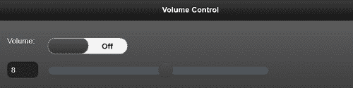

接下来添加代码来处理`#flipswitch`的`change`事件，在事件处理程序中，使用`slider().val()`调用检查翻转开关是**on**还是**off**。根据这个值，通过调用`slider('enable')`或`slider('disable')`来启用或禁用滑块音量控制。现在当你切换翻转开关的值时，你会看到滑块在屏幕截图中启用或禁用，如下所示：

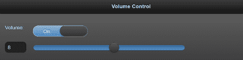

在`pageshow`事件处理程序中绑定音量滑块控件的`change`事件，并在此处使用`slider().val()`调用检查滑块的值。如果值大于**10**的阈值音量，则将滑块设置为主题`'e'`，如果尚未设置样式，则设置。如果值低于**10**的阈值，则将主题设置回主题`'b'`。您可以使用 jQuery 的`find()`方法并将`ui-btn-down-b`类替换为`ui-btn-down-e`类，反之亦然。现在当您设置一个高音量时，滑块会变成黄色，如下图所示：

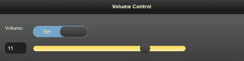

## 还有更多...

您可以使用`data-theme`属性为翻转开关和滑块控件设置主题，使用`data-theme-track`属性在初始化时使用滑块轨道。要在初始化后操作这些控件，您将不得不操作底层本机控件，然后在它们上调用`'refresh'`方法。

### 滑块的自动初始化

当框架遇到一个带有 `type='range'` 的 `input` 控件时，它会自动使用 **滑块插件** 将其增强为滑块控件。同样地，滑块插件会将带有 `data-role='slider'` 的选择控件增强为翻转开关。你可以通过使用 `data-role='none'` 属性关闭自动初始化并使用原生样式。

# 使用选项自动初始化选择菜单

原生 HTML 选择菜单被 jQuery Mobile 框架增强，使其对移动设备更加友好。本示例展示了如何通过 JavaScript 设置其控件选项以自动初始化 **选择菜单**。

## 准备工作

从 `code/05/select-menu` 源文件夹复制本示例的完整代码。可以使用 URL `http://localhost:8080/05/select-menu/main.html` 启动此代码。

## 怎样做...

1.  在 `main.html` 中，添加以下代码以创建选择菜单：

    ```js
    <form action='#' method='post'>
      <div data-role='fieldcontain'>
        <label for='selectid' class='select'>Sample Select Menu</label>
        <select name='selectid' id='selectid' multiple data-native-menu='false' data-overlay-theme='e'>
          <option value='Sample Select Menu' data-placeholder='true'>Sample Select Menu</option>
          <option value='opt1'>Option 1</option>
     <option value='disabledopt' disabled>Disabled Option</option>
          <option value='opt2'>Option 2</option>
     <optgroup label='Options in Group1'>
            <option value='grp1'>&nbsp;&nbsp;&nbsp;&nbsp;Group Option1</option>
            <option value='grp2'>&nbsp;&nbsp;&nbsp;&nbsp;Group Option2</option>
          </optgroup>
     <optgroup label='Options in GroupA'>
            <option value='grpA'>&nbsp;&nbsp;&nbsp;&nbsp;Group OptionA</option>
            <option value='grpB'>&nbsp;&nbsp;&nbsp;&nbsp;Group OptionB</option>
          </optgroup>
        </select>
      </div>
    </form>
    ```

1.  将以下脚本添加到 `<head>` 部分以设置选择菜单控件选项：

    ```js
    $('#main').live('pageinit', function(event) {
     $('#selectid').selectmenu({ 
        theme: 'd', 
        inline: false, 
        corners: true,
        icon: 'star',
        iconpos: 'left',
        shadow: true,
        iconshadow: true
      });
    });
    ```

## 它是如何工作...

在 `main.html` 中，创建一个表单，并向表单添加一个带有 `multiple` 属性的选择控件以启用多选。设置属性 `data-native-menu='false'` 表示选择菜单应由框架增强。还设置 `data-overlay-theme='e'` 属性以指定应该使用 `e`（黄色）的样式覆盖层。

添加第一个带有 `data-placeholder` 属性的选项元素，表示此选项元素的文本必须用作选择菜单的标题。现在按照前面的代码所示添加不同的选项元素。`opt1` 和 `opt2` 元素是常规选项项目。通过向选项元素添加 `disabled` 属性来禁用 `disableopt` 元素。然后使用 `optgroup` 元素添加两个选项组（**Group1** 和 **GroupA**），如前面的代码所示。这些可以包含子选项元素。`选择菜单显示如下截图所示：`

``

`在 `pageinit` 事件处理程序中添加脚本，该事件处理程序在启动时初始化页面后被调用。在这里，通过将选项值传递给 **selectmenu 插件** 来设置选择菜单控件的初始配置选项。在代码中，设置选择菜单的 `theme`、`inline`、`corners`、`icon`、`iconpos`、`shadow` 和 `iconshadow` 属性的值。现在当你点击选择菜单时，样式化的菜单选项如下截图所示：`

``

## `更多内容...`

当框架遇到一个 `select` 元素时，它会自动使用 **selectmenu 插件** 将其增强为选择菜单。你可以通过使用 `data-role='none'` 属性关闭自动初始化并使用原生样式。

### `打开和关闭选择菜单`

`您可以调用`selectmenu`插件上的`open`和`close`方法，并以以下屏幕截图所示的方式以编程方式打开或关闭选择菜单：`

```js
$('#selectid').selectmenu('open'); // open select menu
$('#selectid').selectmenu('close'); // close select menu
```

`#验证表单

在提交到服务器之前验证表单可以节省带宽和时间，因为错误可以在客户端捕获。因此可以避免服务器请求。在 jQuery Mobile 应用程序中，可以使用 JavaScript 验证表单。此配方向您展示了如何验证**博客评论表单**中输入的条目。

## 准备就绪

从`code/05/validate-form`源文件夹中复制此配方的完整代码。可以使用 URL `http://localhost:8080/05/validate-form/main.html`启动此代码。

## 如何做...

1.  在`main.html`中，添加以下代码以创建一个表单：

    ```js
    <form id='commentform' action='#' method='post'>
      <div data-role='fieldcontain'>
        <label for='username'>Name</label>
        <input id='username' name='username' type='text' required placeholder='Enter Name' />
      </div>
      <div data-role='fieldcontain'>
        <label for='email'>Email ID</label>
        <input id='email' name='email' type='email' required placeholder='Enter Email' />
      </div>
      <div data-role='fieldcontain'>
        <label for='comments'>Comments</label>
        <textarea id='comments' name='comments' required placeholder='Enter Comments <10-100 chars long>'></textarea>
      </div>
      <div id='errmsg' style='color: #f00'></div>
      <input id='submitid' type='submit' data-transition='pop' value='Submit Comment'/>
    </form>
    ```

1.  添加以下脚本来验证评论字段：

    ```js
    $('#main').live('pageinit', function(event) {
     $('#commentform').submit(function() {
        var len = $('#comments').val().length;
        if ( len < 10 || len > 100 ) {
          $('#errmsg').text('Invalid comments. Length must be between 10-100 chars').show().fadeOut(5000);
          return false;
        }
        else
          return true;
      });
    });
    ```

## 它是如何工作的...

在`main.html`中，添加一个表单（`id='commentform'`），并向表单添加以下三个字段，**用户名**（`type='text'`），**电子邮件**（`type='email'`）和**评论**（`textarea`）。对所有三个字段添加`required`属性以将它们指定为必填项。通过使用`placeholder`属性添加适当的提示给用户，如前述代码所示。向表单添加一个空的 div（`id='errmsg'`）以在表单验证时显示任何错误消息。

当您加载表单并单击**提交评论**按钮而不输入**姓名**字段时，将显示以下错误消息：

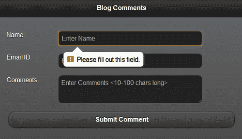

单击提交按钮而不输入有效的**电子邮件 ID**时，将显示以下错误：

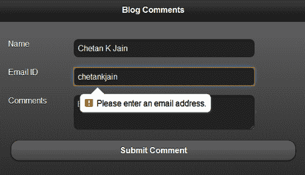

如上一个脚本中所示，添加`pageinit`事件处理程序。这将在页面在启动时被初始化后调用。在这里定义表单的`submit()`方法来验证评论的长度。如果评论长度无效，则在五秒后显示错误消息，然后淡出。现在因为有错误，所以从`submit`方法返回`false`；表单将不会被提交。

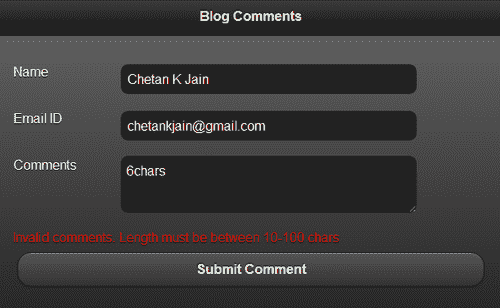

在成功验证后，从`submit()`方法返回`true`以成功将表单提交到服务器。

## 还有更多...

在此配方中，表单的`action`设置为`#`或与当前 HTML 页面相同的 URL。这种表单称为**自提交表单**。在这种情况下的默认响应是表单内容本身。如果表单由 Web 服务器提供，则可以自定义生成 post 的响应。如果您使用的是随本书源代码一起提供的 nodejs Web 服务器，则会得到自定义成功响应，而不是表单内容。

### 表单中的唯一 ID

在 jQuery Mobile 应用程序中，由于多个页面可以同时存在于 DOM 中，因此应确保表单控件的 ID 是唯一的。ID 应该在整个应用程序中是唯一的，而不仅仅是在单个页面中。如果不遵循此规则，查找和表单行为可能会失败或表现不同。一些浏览器可能仍然在一定程度上支持重复的 ID，但这并不保证。

## 另请参阅

+   使用 POST 提交表单 的方法

+   *使用 GET 获取数据* 的方法

# 使用 POST 提交表单

这个方法向你展示了如何使用 Ajax **POST** 并提交表单，也展示了不使用 Ajax 时如何提交同一个论坛。在上一个方法中使用的**博客评论**表单在此用于提交。

## 准备工作

从 `code/05/submit-form` 源文件夹中复制此方法的完整代码。此代码可以使用 URL `http://localhost:8080/05/submit-form/main.html` 启动。要尝试此方法，您还需要启动随本书源代码一起提供的简单 nodejs web 服务器。使用以下命令启动服务器：

```js
node jqmserver.js

```

## 怎么做...

1.  在 `main.html` 中，按照以下代码创建**博客评论**表单：

    ```js
    <form id='commentform' action='/postComment' data-transition='pop' method='post'>
      <div data-role='fieldcontain'>
        <label for='username'>Name</label>
        <input id='username' name='username' type='text' required placeholder='Enter Name' />
      </div>
      <div data-role='fieldcontain'>
        <label for='email'>Email ID</label>
        <input id='email' name='email' type='email' required placeholder='Enter Email' />
      </div>
      <div data-role='fieldcontain'>
        <label for='comments'>Comments</label>
        <textarea id='comments' name='comments' required placeholder='Enter Comments <10-100 chars long>'></textarea>
      </div>
      <div id='errmsg' style='color: #f00'></div>
      <input id='submitid' type='submit' value='Submit Comment'/>
    </form>
    ```

1.  将以下脚本添加到 `<head>` 部分以验证评论字段：

    ```js
    $('#main').live('pageinit', function(event) {
     $('#commentform').submit(function() {
        var len = $('#comments').val().length;
        if ( len < 10 || len > 100 ) {
          $('#errmsg').text('Invalid comments. Length must be between 10-100 chars').show().fadeOut(5000);
          return false;
        }
        else
          return true;
      });
    });
    ```

## 如何运作...

在 `main.html` 中，创建**博客评论**表单。将表单的 `action` 设置为 `'/postComment'`，并且还要指定 `data-transition='pop'` 属性。其余的代码和表单验证与前一个方法中的相同，并在那里详细解释。当你启动应用程序时，表单会显示如下截图所示：

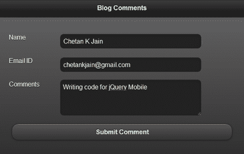

填写表单，然后点击**提交评论**按钮。如果没有发现错误，表单将通过 Ajax 提交。自定义的 nodejs web 服务器响应 `/postComment` 请求，生成以下 HTML 内容作为带有 mime 类型 `'text/html'` 的响应：

```js
<div data-role='page' data-theme='a'>
  <div data-role='header'>
    <h1>Comments Added</h1>
  </div>
  <div data-role='content'>
    Hi {User name entered}!
    <p>Your Email ID: {Email ID entered}</p>
    <p>Added your comment: {Comments entered}</p>
    <a href='#' data-role='button' data-rel='back'>Back</a>
  </div>
</div>
```

框架渲染响应如下截图所示：

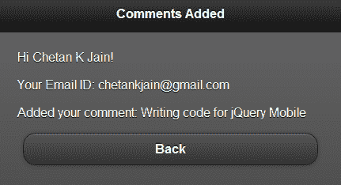

页面过渡平稳，使用了 `pop` 动画。你可以点击**返回**按钮并导航回原始页面，因为也指定了 `data-rel='back'` 属性。

## 还有更多...

你可以通过向表单元素指定 `data-ajax='false'` 属性来提交此表单而不使用 Ajax。此代码在与 `main.html` 相同文件夹中的 `non-ajax.html` 文件中提供：

```js
<form id='commentform' action='/postComment' method='post' data-ajax='false'>
```

当不使用 Ajax 时，响应会触发整个页面的刷新。在此方法中，服务器响应仅返回页面 `div` 容器，并且不返回具有任何链接到 jQuery Mobile 样式表的 `<head>` 元素。此外，响应中缺少对 jQuery 和 jQuery Mobile 库的引用。因此，结果页面如下截图所示。在此响应页面中没有样式，如果点击**返回**链接，它不起作用。

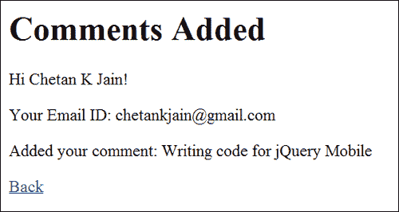

### Ajax 响应

通过 Ajax 的服务器响应会替换请求表单的内容，就像本篇食谱中所示。您可以通过使用 DOM 检查器来查看此响应。但是，如果您查看页面源代码，则仍会显示原始页面。POST 请求不能被书签标记，因为它们在哈希中不包含任何查询参数。对 POST 请求的响应将返回与请求相同的 URL，并且不会更新 URL 哈希。

### 其他非 Ajax 提交表单的方式

本篇食谱向您展示了如何通过设置属性 `data-ajax='false'` 来提交表单，而不使用 Ajax。另一种不使用 Ajax 的方法是向表单指定一个 `target` 属性，如下所示：

```js
<form id='commentform' action='/postComment' method='post' target='sometarget'>
```

这适用于 POST 和 GET 服务器请求。

Ajax 还可以通过使用 `mobileinit` 事件处理程序中以下代码中显示的全局配置来关闭应用程序：

```js
$.mobile.ajaxEnabled = false;
```

## 参见

+   *验证表单* 食谱

+   *使用 GET 获取数据* 食谱

+   *在 第七章 中的*配置 ajaxEnabled* 食谱，*配置*

# 使用 GET 获取数据

本篇食谱向您展示了如何使用 Ajax **GET** 请求并从服务器获取数据。在本篇食谱中，服务器会通过来自 **足球联赛分数** 表单的 GET 请求返回足球比分。

## 准备工作

从`code/05/get-request`源文件夹中复制本篇食谱的完整代码。这段代码可以通过 URL `http://localhost:8080/05/get-request/main.html` 运行。要尝试这个食谱，您需要启动随本书源代码一起提供的简单 nodejs web 服务器。使用以下命令启动服务器：

```js
node jqmserver.js

```

## 如何操作...

1.  在`main.html`中，添加以下代码以创建一个表单：

    ```js
    <div id='scores' data-role='fieldcontain'>
     <form id='scoreform' action='/getScores' method='get'>
        The latest scores are now available!
        <input id='submitid' type='submit' name='submitid' data-inline='true' value='Fetch Scores' />
      </form>
    </div>
    ```

1.  将以下脚本添加到 `<head>` 部分以使用 Ajax 获取并显示分数：

    ```js
    $('#main').live('pageshow', function(event) {
      $('#scoreform').submit(function() {
     $.get('/getScores').success(showScores).error(errMsg);
        return false; // cancel the default submit
      });
    });
    function showScores(data) { // on success
     $('#scores').html(data).trigger('create');
    }
    function errMsg() { // on error
      $('#scores').html('Unable to fetch scores, try later');
    }
    ```

## 它是如何工作的...

在`main.html`中，添加一个`<div>`容器，其`id='scores'`，并设置其属性`data-role='fieldcontain'`。这个`<div>`容器将显示分数。向页面添加一个表单（`id='scoreform'`），并将其`action`设置为`'/getScores'`，`method`设置为`'get'`。在表单中添加一个文本为 **获取分数** 的提交按钮，以从服务器获取分数。您可以向页面添加一个装饰的页脚，使用`class='ui-bar ui-bar-e'`。加载应用程序后，显示以下屏幕：

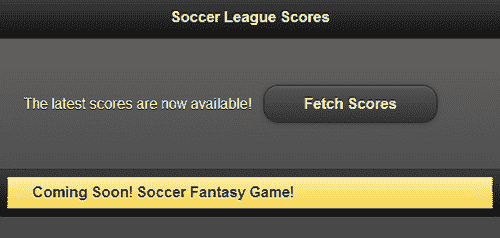

如前面代码所示，添加`pageshow`事件处理程序。当您单击`submit`按钮时，它调用 jQuery `submit()`方法。默认表单`submit()`的服务器响应将用新的内容替换整个页面。要获取部分页面更新，请调用 jQuery 的`.get()` Ajax 方法来从`'/getScores'`服务器 URL 获取数据。然后通过返回`false`取消默认的`submit()`方法。`.get()`方法指定了`success`和`error`的回调函数，如前面的代码所示。在成功的回调函数`showScores()`中，用从服务器获得的 HTML 响应替换`#scores` div 的内容。触发`'create'`方法以让 jQuery Mobile 框架初始化和增强新添加的内容。任何错误都由`errMsg()`错误处理程序处理，如前面的代码所示。

自定义的 Nodejs Web 服务器通过生成以下 HTML 内容作为响应来响应`/getScores` get 请求，MIME 类型为`'text/html'`：

```js
<ul data-role='listview'>
  <li data-role='list-divider'>Group A</li>
    <li>Team A beat Team B [ 5 - 3 ]</li>
    <li>Team C lost to Team D [ 1 - 2 ]</li>
  <li data-role='list-divider'>Group B</li>
    <li>Team E drew Team F [ 0 - 0 ]</li>
    <li>Team G lost to Team H [ 3 - 4 ]</li>
</ul>
```

现在，仅通过此服务器响应替换了`#scores <div>`容器的内容。标题和页脚保持不变。结果显示如下截图所示：

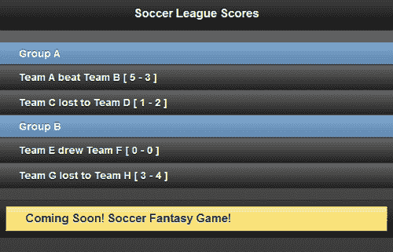

## 还有更多...

您可以通过向表单元素指定`data-ajax='false'`属性来提交不使用 Ajax 的表单，如下代码所示。当不使用 Ajax 时，响应会触发完整页面刷新。因此确保服务器响应中返回一个正确的 jQuery Mobile 页面，否则结果页面可能存在样式和其他问题。

```js
<form action='/someAction' method='get' data-ajax='false'>
```

### Ajax 响应

服务器通过 Ajax 响应完全替换了请求表单的内容。您可以使用 DOM 检查器查看响应。但如果您查看页面源代码，原始页面仍然会显示。GET 请求可以被收藏夹添加为它们支持哈希中的查询参数。GET 响应允许更新 URL 哈希。

### 表单提交默认值

您也可以提交一个没有指定任何动作或方法属性的表单，如下代码中所示：

```js
<form>
```

表单将使用动作和方法属性的默认值。方法将默认为`'get'`，动作将默认为当前页面的相对路径。您可以通过调用`$.mobile.path.get()`方法访问此路径。

### 注意

始终为表单指定`action`和`method`属性。

## 另请参阅

+   *验证表单* 配方

+   使用 POST 提交表单的 *配方*

+   第七章中*配置 ajaxEnabled* 配方，*配置*

# 创建一个可访问的表单

jQuery Mobile 框架对无障碍功能（如**WAI-ARIA**）提供了很好的支持。这为无障碍工具（如屏幕阅读器）提供了支持。这使得您的应用程序屏幕可以被依赖这些辅助技术的用户阅读。此外，现在一些浏览器（如使用 Webkit 引擎的 Chrome）已经提供了语音输入控件。这些控件接受语音输入。本文介绍了如何生成支持语音输入并支持屏幕阅读器的无障碍表单控件。

## 准备工作

从 `code/05/accessible-controls` 源文件夹中复制本文的完整代码。您可以使用 URL `http://localhost:8080/05/accessible-controls/main.html` 启动此代码。

## 如何做…

1.  在 `main.html` 中，添加以下代码以创建一个表单：

    ```js
    <form action='#' method='post'>
     <div data-role='fieldcontain' class='ui-hide-label'>
        <input type='text' name='username' id='username' placeholder='Enter Name' speech x-webkit-speech/>
        <label for='username'>Name</label>
      </div>
      <div data-role='fieldcontain'>
     <input type='number' name='age' id='age' placeholder='Enter Age' speech x-webkit-speech/>
        <label for='age' class='ui-hidden-accessible'>Age</label>
      </div>
      <div data-role='fieldcontain'>
        <input type='text' name='city' id='city' placeholder='Enter City' class='custom' speech x-webkit-speech/>
     <label for='city' class='ui-hidden-accessible'>City</label>
      </div>
      <input type='submit' name='submit' id='submit' value='Submit' />
    </form>
    ```

## 它是如何工作的…

在 `main.html` 中，按如下方式添加三个字段，**用户名**（输入 `type='text'`）、**年龄**（输入 `type='number'`）和 **城市**（输入 `type='text'`）。为每个字段关联一个标签，并为每组标签和输入控件添加一个 `div` 容器，该容器具有属性 `data-role='fieldcontain'`。这有助于框架根据平台和设置动态重新排列和调整布局。`placeholder` 属性用于为用户提供适当的输入提示。

要启用语音输入，请按照之前代码中所示为每个输入控件添加 `speech` 和 `x-webkit-speech` 属性。语音输入的支持完全取决于浏览器的实现，一些浏览器仍然没有实现它们。当页面加载时，您将看到以下截图：

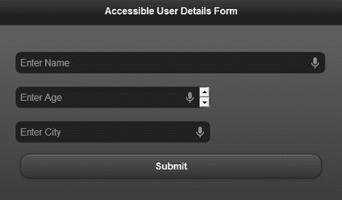

您将在每个输入控件的右上角看到一个小麦克风图标。用户可以点击此图标，然后会提示用户为输入控件说出值。一旦用户说完，**语音转文字引擎**会将声音转换为文本，并在控件中显示输入值文本。虽然不是完全准确，但语音转文字技术正在日益改进。

## 还有更多…

正如前面提到的，jQuery Mobile 框架对 WAI-ARIA 等无障碍功能提供了很好的支持。因此，请为所有表单元素添加有意义的标签。当页面初始化时，框架会自动向屏幕阅读器公开这些标签。如果您已经使用占位符为用户提供提示，那么标签可能是多余的。但如果您希望建立一个支持无障碍功能的应用程序，那么您也应该定义标签。

如果你想使用占位符功能并支持辅助功能，jQuery Mobile 提供了一个简单的选项，通过在表单控件上使用样式`'ui-hidden-accessible'`隐藏标签。你也可以通过在表单字段容器中添加样式`'ui-hide-label'`来隐藏标签，代码中已经展示。现在标签不会显示在屏幕上，但依然可以被屏幕阅读器访问。你可以通过运行你喜欢的屏幕阅读器并访问创建的页面来验证这一点。

### 移动设备的受欢迎的语音阅读器

当今市场上有许多语音阅读器，你可以根据你的平台尝试任何受欢迎的语音阅读器。苹果手机有**VoiceOver** (见 [`www.apple.com/accessibility/iphone/vision.html`](http://www.apple.com/accessibility/iphone/vision.html)), 安卓手机有**TalkBack** , **Spiel** , **Mobile Accessibility** for Android, 以及安卓应用商店中的其他应用。

### 桌面语音阅读器

对于 Chrome 桌面浏览器，可以从 [`code.google.com/p/google-axs-chrome`](http://code.google.com/p/google-axs-chrome) 安装**ChromeVox** 扩展，一旦启用，它将开始为你朗读表单控件。你可以验证屏幕阅读器是否也读出了隐藏的标签内容。
