# 第六章：列表视图

在本章中我们将涵盖：

+   使用嵌入式和非嵌入式列表

+   创建自定义编号列表

+   使用嵌套列表

+   使用只读的嵌套列表

+   格式化列表中的内容

+   使用分隔按钮列表

+   使用图标

+   创建自定义搜索过滤器

+   用 JavaScript 修改列表

# 介绍

通过以下代码创建 jQuery Mobile 中的简单列表：

```js
<ul data-role='listview'>
  <li><a href='link1'>Item 1</a></li>
  <li><a href='link2'>Item 2</a></li>
</ul>
```

前面的代码是一个普通的 HTML 无序列表，你可以在其中添加属性`data-role='listview'`。框架现在可以增强、美化并移动端友好地呈现该列表。它为锚点元素添加了右箭头，并且当你点击列表中的任何项目时，链接的页面会被加载到 DOM 中，并在可能时使用 AJAX 过渡打开。

# 使用嵌入式和非嵌入式列表

**嵌入式列表**是嵌入在容器（页面、表单或其他列表）中的列表。本教程向你展示了如何创建嵌入式和非嵌入式列表，并强调了在使用非嵌入式列表与其他表单控件时需要注意的事项。

## 准备工作

从`code/06/inset-list`源文件夹中复制本教程的完整代码。该代码可通过以下 URL 启动：`http://localhost:8080/06/inset-list/main.html`。

## 如何实现...

1.  按如下代码在`main.html`中创建三个列表和几个按钮：

    ```js
    <div data-role='content'>
      <a href='#' data-role=button data-theme='b'>Button 1</a>
     <ul data-role='listview' data-inset='true'>
        <li data-theme='e'><a href='#'>Item 1</a></li>
        <li data-theme='e'><a href='#'>Item 2</a></li>
      </ul>
      <a href='#' data-role=button data-theme='b'>Button 2</a>
     <ul data-role='listview'>
        <li data-theme='e'><a href='#'>Item A</a></li>
        <li data-theme='e'><a href='#'>Item B</a></li>
      </ul>
      <a href='#' data-role=button data-theme='b'>Button 3</a>
     <ul data-role='listview' style='margin: 15px'>
        <li data-theme='e'><a href='#'>Item 3</a></li>
        <li data-theme='e'><a href='#'>Item 4</a></li>
      </ul>
      <a href='#' data-role=button data-theme='b'>Button 4</a>
    </div>
    ```

## 工作原理...

在代码中，第一个列表是嵌入式列表，其他两个是非嵌入式列表。你可以通过在列表中添加属性`data-inset='true'`来创建嵌入式列表。这样可以使列表的四周都有`15px`的美化边距。如果你将按钮或其他形式控件放在嵌入式列表旁边，布局会自动调整。

代码中的下一个列表是非嵌入式列表，没有`data-inset`属性。框架会给该列表加上`-15px`的填充，让它拉伸至整个屏幕宽度。如果你将按钮或其他表单控件放在该列表旁边，由于负填充，这些控件会重叠在一起。该列表具有矩形角落。

代码中的第三个列表也是非嵌入式列表。但这里通过使用属性`style='margin: 15px'`来处理控件重叠的问题。这样可以为列表增加`15px`的边距，并抵消默认填充。三个列表显示如下截图所示：

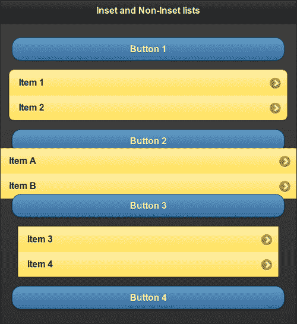

### 注意

当使用非嵌入式列表与其他表单控件时，添加额外的边距以避免控件重叠。

## 更多内容...

你可以配置框架在你的应用中默认使用嵌入式列表。通过在`listview`插件的`mobileinit`事件中将`inset`选项设置为`true`来实现这一点，如下代码所示：

```js
$(document).bind('mobileinit',function(){
  $.mobile.listview.prototype.options.inset = 'true';
});
```

### 设置列表视图主题

你可以使用`data-theme`属性并像以下代码中所示为列表设置主题。以下代码中列表使用`e`色块：

```js
<ul data-role='listview' data-theme='e'>
```

### 设置列表项主题

可以使用 `data-theme` 属性并为每个列表项设置不同的主题。以下代码将 swatch `e` 设置给列表项 **Item 1**，而列表项 **Item 2** 将使用 swatch `d`。

```js
<ul data-role='listview' data-theme='e'>
  <li>Item 1</a>
  <li data-theme='d'>Item 2</li>
</ul>
```

# 创建自定义编号列表

默认情况下，**有序列表** 在 jQuery Mobile 中使用十进制数。框架使用 CSS 添加编号。JavaScript 用于无法使用 CSS 的地方。本示例向您展示如何使用 JavaScript 为列表添加字母编号。

## 准备工作

从 `code/06/custom-numbered-list` 源文件夹中复制此示例的全部代码。可以使用 URL `http://localhost:8080/06/custom-numbered-list/main.html` 启动此代码。

## 如何做…

1.  在 `main.html` 中，按照以下代码创建一个有序列表和一个无序列表：

    ```js
    <div data-role='content'>
     <ol data-role='listview' data-theme='e' data-inset='true'>
        <li>Soccer</li>
        <li>Basketball</li>
        <li>Hockey</li>
        <li>Tennis</li>
      </ol>
     <ul id='alphalist' data-role='listview' data-theme='e' data-inset='true'>
        <li>Soccer</li>
        <li>Basketball</li>
        <li>Hockey</li>
        <li>Tennis</li>
      </ul>
    </div>
    ```

1.  添加以下脚本以为无序列表添加字母编号：

    ```js
    $('#main').live('pageinit', function(event) {
      var alph = 'a';
      $('#alphalist').find('li').each(function() {
        var str = "<span style='font-weight: normal'>" + alph 
            + '.&nbsp;</span>' + $(this).html();
        $(this).html(str);
        alph = String.fromCharCode(alph.charCodeAt(0)+1);
      });
    });
    ```

## 工作原理…

代码中的第一个列表是一个有序列表，默认情况下使用十进制数。接下来的列表具有 `id='alphalist'`，是一个无序列表。将给定的脚本添加到页面容器或 `main.html` 的 `<head>` 部分。

在脚本中，将 `pageinit` 事件绑定到一个函数，该函数注入字母编号。在这个函数中，使用 jQuery 的 `find('li')` 方法获取列表中的所有列表项。使用 jQuery 的 `each()` 方法循环遍历每个列表项。在 `each()` 的回调函数中，使用 `$(this).html()` 获取列表项的当前文本，并在此文本前添加字母（使用 `normal` 字体重量）。通过使用 `$(this).html(str)` 将这个新字符串（`str`）设置给列表项。最后，通过使用 JavaScript 的 `charCodeAt()` 和 `fromCharCode()` 方法在循环中增加字母。当页面显示时，两个列表现在显示如下截图中所示：

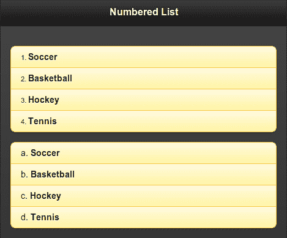

## 更多内容…

您可以使用 JavaScript 创建任何类型的编号列表（例如罗马数字、小写或大写字母、项目符号等）。但是，您必须确保处理这些列表的所有情况（例如，处理嵌套列表的项目编号）。

# 使用嵌套列表

**嵌套列表** 是一个嵌套在另一个列表项中的列表。默认情况下，列表项上显示右箭头图标，当您点击它时，框架会打开一个单独的子页面来显示嵌套列表。默认情况下，显示的子页面使用主题 `b` 作为页面标题。框架可以处理到 n 级的嵌套。本示例向您展示如何使用嵌套列表，并且还向您展示如何使用 JavaScript 获取嵌套列表的子页面。

## 准备工作

从 `code/06/nested-list` 源文件夹中复制此示例的全部代码。可以使用 URL `http://localhost:8080/06/nested-list/main.html` 启动此代码。

## 如何做…

1.  在 `main.html` 中，添加以下代码以创建作者列表。将书名添加到某些作者的嵌套列表中。

    ```js
    <div data-role='content'>
      <ul data-role='listview' data-theme='b' data-inset='true'>
        <li><a href='#'>H.G. Wells</a></li>
        <li><a href='#'>Rabindranath Tagore</a>
     <ul data-role='listview' data-theme='a' data-inset='true'>
            <li><a href='#'>The Gardener</a></li>
            <li><a href='#'>Gitanjali</a></li>
          </ul>
        </li>
        <li><a href='#'>William Shakespeare</a>
     <ul data-role='listview' data-theme='a' data-inset='true'>
            <li><a href='#'>Merchant of Venice</a></li>
            <li><a href='#'>Romeo and Juliet</a></li>
          </ul>
        </li>
      </ul>
     <div id='nestedlists'></div>
    </div>
    ```

1.  添加以下脚本以获取嵌套列表的子页面：

    ```js
    $('#main').live('pageinit', function(event) {
      var str = '';
     $('ul').listview('childPages').each(function() {
        str = $(this).find("div[class$='ui-title']").html() + ', ' + str;
      });
      $('#nestedlists').html('Books available for authors : ' + str);
    });
    ```

## 工作原理...

在代码中，使用作者姓名作为带有锚链接的列表项添加作者**拉宾德拉纳特·泰戈尔**和**威廉·莎士比亚**的书名的嵌套列表。作者**H.G.威尔斯**没有嵌套列表。

将给定的脚本添加到页面容器或`main.html`中的`<head>`标签中。在脚本中，将`pageinit`事件绑定到事件处理程序以调用**listview 插件**的`childPages`方法。使用 jQuery 的`each()`方法遍历子页面数组。在`each()`的回调函数中，使用 jQuery 的`find()`方法获取子页面的标题文本。查找具有属性`class='ui-title'`的标题 div。将此文本连接到字符串中，一旦获取了所有作者子页面，将此字符串设置为空的`'nestedlists'` div 的内容。这将显示具有书籍嵌套列表的作者列表。作者**H.G.威尔斯**没有嵌套列表，不会显示。

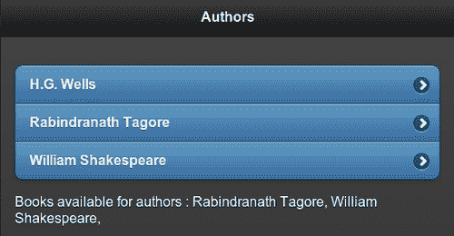

嵌套列表嵌入在列表项`<li>`标签中的锚链接`<a>`标签之后。当您单击此列表项时，它会打开子页面，如以下屏幕截图所示。锚链接文本被设置为子页面的标题，并且标题默认使用主题`b`。

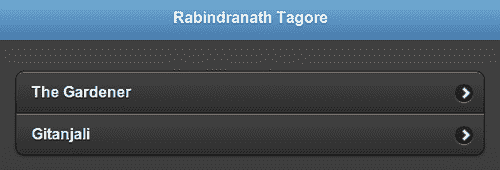

## 更多内容...

您将注意到与主页面相比，子页面的主题差异。主页面使用主题`a`作为页面内容和标题的主题。它使用主题`b`作为列表的主题。子页面标题默认设置为主题`b`。由于嵌套列表使用了`data-theme='a'`属性，因此整个子页面，包括嵌套列表，都使用样式`a`。在您的应用程序中使用嵌套列表时，这可能不是理想的情况。请参阅第十章中的 *主题化嵌套列表* 示例，*主题框架*，了解如何正确设置嵌套列表的主题。

### 主题化嵌套列表的子页面标题

如本示例所示，默认情况下，嵌套列表的子页面标题设置为样式`b`。您可以使用以下代码中显示的`data-header-theme`属性来设置子页面的标题主题：

```js
<ul data-role='listview' data-theme='d' data-header-theme='a'>
```

### 配置列表视图的标题主题选项

你可以通过设置`listview`插件的`headerTheme`选项来配置应用程序中嵌套列表的默认标题主题。以下代码将其设置为主题`a`并绑定到`mobileinit`事件：

```js
$(document).bind('mobileinit',function(){
  $.mobile.listview.prototype.options.headerTheme = 'a';
});
```

## 另请参阅

+   *使用只读嵌套列表* 示例

+   第十章中的 *主题化嵌套列表* 示例，*主题框架*

# 使用只读嵌套列表

**只读列表**是包含非交互式项目或不包含锚链接的项目的列表。框架将只读项目与常规项目样式不同。只读项目具有主题颜色较浅的颜色，并且它们的大小也较小，因为预期用户不会点击它们。

此配方演示了如何创建只读嵌套列表，并使用**选项**配置列表视图。它还演示了如何将嵌套列表显示为插入式列表。

## 准备工作

从`code/06/read-only-list`源文件夹复制此配方的完整代码。可以使用 URL `http://localhost:8080/06/read-only-list/main.html` 启动此代码。

## 它的操作方法...

1.  在`main.html`中，添加以下代码以创建作者列表。为一些作者添加嵌套的书名列表。

    ```js
    <div data-role='content'>
      <ul data-role='listview'>
        <li>H.G. Wells</li>
     <li><a href='#'>Mark Twain</a></li>
        <li>Rabindranath Tagore
     <ul data-role='listview'>
            <li>The Gardener</li>
            <li>Gitanjali</li>
          </ul>
        </li>
        <li>William Shakespeare
     <div><ul data-role='listview'>
              <li>Merchant of Venice</li>
              <li>Romeo and Juliet</li>
     </ul></div>
        </li>
      </ul>
    </div>
    ```

1.  将以下脚本添加到页面以配置列表视图选项:

    ```js
    <script>
     $.mobile.listview.prototype.options.theme = 'e';
     $.mobile.listview.prototype.options.headerTheme = 'a';
     $.mobile.listview.prototype.options.inset = true;
    </script>
    ```

## 工作原理...

在代码中，将作者名字作为无锚链接的列表项添加。为**拉宾德拉纳特·泰戈尔**和**威廉·莎士比亚**添加嵌套书籍列表。作者**H.G.威尔斯**没有嵌套列表。作者**马克·吐温**有一个锚链接。该列表使用主题`e`，即黄色。没有嵌套列表或锚链接的项目以浅一些的色调和较小的字体显示。具有嵌套列表或锚链接的项目以常规颜色显示，并具有更大的字体。

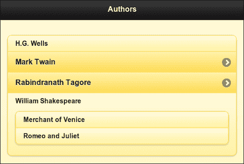

将上述脚本添加到页面或`main.html`的`<head>`标签中，如代码所示。该脚本配置了`listview`插件的默认选项。在此配方中，配置了`theme`，`headerTheme`和`inset`选项。使用`headerTheme`选项将子页面头的主题设置为`a`，如上面的代码所示。现在，当您单击列表项**拉宾德拉纳特·泰戈尔**时，嵌套列表的子页面将打开。具有头部主题`a`的嵌套列表如下图所示:

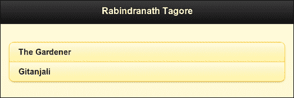

## 还有更多...

有时，您可能想要将嵌套列表显示为插入式列表。您可以通过将内部列表包装在`<div>`标签中来实现这一点。框架现在不会为嵌套列表创建子页面。

### 注

在`listview`插件上调用`childPages`方法将不返回嵌入了`<div>`标签的列表。

**威廉·莎士比亚**的书籍列表在此配方中嵌入在`<div>`标签中，因此没有创建嵌套列表。

### 注

使用插入嵌套列表会使您的列表垂直拉伸，用户将不得不滚动页面以查看所有内容。因此，请有选择地使用它们。

## 另请参阅

+   *使用嵌套列表* 配方

+   第十章中的 *主题化嵌套列表* 配方, *主题框架*

# 在列表中格式化内容

这个配方向你展示了如何在列表项中格式化文本。它还向你展示了如何使用可折叠项目和**计数气泡**在列表项中。

## 准备工作

从`code/06/format-content`源文件夹中复制此配方的完整代码。可以使用 URL `http://localhost:8080/06/format-content/main.html`启动此代码。

## 怎么做...

1.  在`main.html`中，添加以下代码以创建一个交通方式列表：

    ```js
    <div data-role='content'>
      <ul data-role='listview'>
        <li>
     <p class='ui-li-aside' style='font-size: 15px'>
              <strong>High Speed</strong></p>
          <div data-role='collapsible' data-theme='e'>
            <h2>Air</h2>
            <ul data-role='listview'>
              <li>Aeroplane</li><li>Helicopter</li>
            </ul>
          </div>
     <p class='ui-li-count'>2</p>
        </li>
        <li  data-theme='e'>
          <p class='ui-li-aside' style='font-size: 15px'>
              <strong>Moderate Speed</strong></p>
          <div data-role='collapsible' data-theme='e'>
            <h2>Land</h2>
            <ul data-role='listview'>
              <li>Bus</li><li>Car</li><li>Bike</li><li>Train</li>
            </ul>
          </div>
     <p class='ui-li-count'>4</p>
        </li>
        <li>
          <p class='ui-li-aside' style='font-size: 15px'>
              <strong>Slow Speed</strong></p>
          <div data-role='collapsible' data-theme='e'>
            <h2>Water</h2>
            <ul data-role='listview'>
              <li>Ship</li><li>Submarine</li><li>Boat</li>
            </ul>                
          </div>
     <p class='ui-li-count'>3</p>
        </li>
      </ul>
    </div>
    ```

1.  将以下脚本添加到页面以配置列表视图选项：

    ```js
    <script>
     $.mobile.listview.prototype.options.theme = 'e';
     $.mobile.listview.prototype.options.countTheme = 'a';
     $.mobile.listview.prototype.options.inset = true;
    </script>
    ```

## 它是如何工作的...

将上一个代码中显示的三种交通方式作为列表项添加。为每个列表项添加一个`data-role='collapsible'`的可折叠块。为每个可折叠块添加一个标题文本，并创建一个带有不同车辆类型的列表作为其内容。添加一个样式设置为`class='ui-li-aside'`的字符串。这将创建一个字符串，并将其位置设置在列表项的右上角。最后，通过使用`class='ui-li-count'`将所列车辆的数量设置为**计数气泡**的样式。对每个列表项都这样做。

将代码中显示的脚本添加到页面或`main.html`的`<head>`标签中，以配置列表选项`theme`，`inset`和`countTheme`的默认值。现在列表显示如下所示：

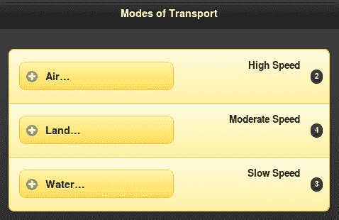

以下图片显示了展开了一个可折叠块的列表：

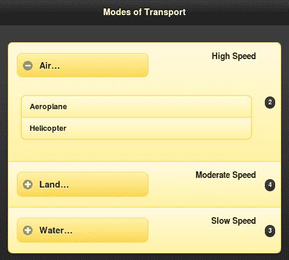

## 还有更多...

您可以使用`countTheme`选项对计数气泡进行主题设置，如本配方中已提到的。您还可以在列表上设置属性`data-count-theme`，如下面的代码所示：

```js
<ul data-role='listview' data-count-theme='a'>
```

### 在列表项中使用表单控件

这个配方向你展示了如何向列表项添加具有列表的可折叠内容。您还可以像下面的代码中所示向列表项添加任何表单控件。框架通过在列表项内添加所需的填充和边距来增强表单控件，并使表单控件更易于点击。

```js
<li><input type='text' name='username' placeholder='Enter name'/></li>
```

## 请参阅

+   *使用分隔按钮列表*配方

# 使用分隔按钮列表

**分隔按钮列表**是一个为同一列表项提供两种不同操作的列表。这是通过向列表项添加两个锚链接来创建的。然后，框架会自动将列表项转换为分隔按钮。添加到第一个链接的任何图像都会缩小为`80 x 80px`大小的缩略图。第二个链接将替换为一个称为**分隔图标**的图标，并位于分隔按钮的右上角。这个配方向你展示了如何创建一个分隔按钮列表来显示列表中的图像。

## 准备工作

从`code/06/split-button-list`源文件夹中复制此配方的完整代码。可以使用 URL `http://localhost:8080/06/split-button-list/main.html`启动此代码。

## 怎么做...

1.  将`main.html`作为多页面模板应用程序创建。在`#main`页面中添加一个分隔按钮列表，如下面的代码所示：

    ```js
    <div data-role='content'>
     <ul data-role='listview' data-inset='true' data-theme='b' 
     data-split-theme='e' data-split-icon='arrow-d'>
        <li>
     <a href='#viewphoto' data-rel='dialog'>
            
            <h3>Lal Bagh</h3>
            <p>Bangalore, India</p>
          </a>
     <a href='#download' data-rel='dialog'>Lal Bagh, Bangalore</a>
        </li>
        <li>
          <a href='#viewphoto' data-rel='dialog'>
            
            <h3>Peacock</h3>
            <p>Mysore, India</p>
          </a>
          <a href='#download' data-rel='dialog'>Peacock, Mysore</a>
        </li>
        <li>
          <a href='#viewphoto' data-rel='dialog'>
            
            <h3>Ganesha</h3>
            <p>Bangalore, India</p>
          </a>
          <a href='#download' data-rel='dialog'>Ganesha, Bangalore</a>
        </li>
      </ul>
    </div>
    ```

1.  添加将在点击拆分按钮左侧时打开的`#viewphoto`页面。

    ```js
    <div id='viewphoto' data-role='page' data-theme='e' >
      <div data-role='header' data-theme='e'>
        <h1>Photo View</h1>
      </div>
      <div data-role='content'>
        Showing photo here ...
      </div>
    </div>
    ```

1.  添加将在点击拆分图标时打开的`#download`页面。

    ```js
    <div id='download' data-role='page' data-theme='e' >
      <div data-role='header' data-theme='e'>
        <h1>Download</h1>
      </div>
      <div data-role='content'>
          Downloading file ...
      </div>
    </div>
    ```

## 工作原理...

在`#main`页面的列表中添加列表项，如前面的代码所示。每个列表项都有两个链接，通过设置`data-rel='dialog'`属性，这两个链接都会作为对话框打开。将第一个链接指向`#viewphoto`页面。添加指向照片的图像，并为锚链接文本添加格式化描述。根据缩略图像的大小，您可以像前面的代码所示添加填充。

将第二个链接指向`#download`页面。第二个链接会自动转换为拆分图标。默认情况下，拆分图标使用右箭头。您可以通过在列表视图上使用`data-split-icon`属性来配置这一点。使用`data-split-theme`属性对拆分图标进行主题设置。拆分按钮列表显示如下图所示：

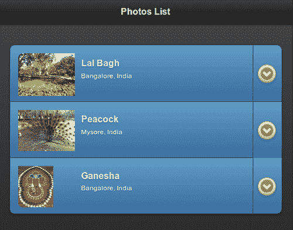

点击照片图像或列表项中的左按钮会打开**照片查看**对话框，如下图所示：

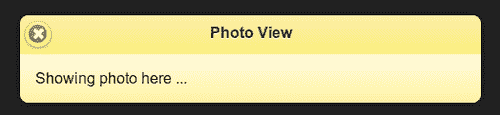

点击拆分图标会打开**下载**对话框，如下图所示：

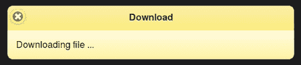

## 更多信息...

要在`#viewphoto`对话框中显示照片图像，您将需要编写一些 JavaScript 代码来处理`pagechange`事件。此在第九章 *方法和实用程序*中的 *使用 changePage()更改页面* 配方中有所介绍。

### 使用 listview 选项配置拆分按钮列表

您可以使用`listview`插件的`splitTheme`和`splitIcon`选项配置拆分图标和拆分图标主题的默认值，并将其绑定到`mobileinit`事件。以下代码将星形图标和主题`e`设置为列表视图选项的默认值：

```js
$(document).bind('mobileinit',function(){
  $.mobile.listview.prototype.options.splitIcon = 'star';
  $.mobile.listview.prototype.options.splitTheme = 'e';
});
```

## 另请参见

+   *在列表中格式化内容* 配方

+   *使用图像图标*配方

+   第九章 *方法和实用程序* 中的 *使用 changePage( )更改页面* 配方

# 使用图像图标

jQuery Mobile 框架将图标添加到交互式列表项（具有链接的列表项）的右侧。您还可以将图标添加到列表项文本中，框架会将此图标大小调整为`40 x 40px`。此配方向您展示如何在列表项中显示图标。

## 准备工作

从`code/06/list-icons`源文件夹中复制此配方的完整代码。可以使用 URL `http://localhost:8080/06/list-icons/main.html` 启动此代码。

## 如何操作...

1.  在`main.html`中，添加一个包含如下代码的列表：

    ```js
    <div data-role='content'>
      <ul data-role='listview' data-theme='b' data-inset='true'>
        <li data-icon='star'>
          <a href='#'>
     
            <h3 style='margin-left: 25px'>Lal Bagh, Bangalore</h3>
          </a>
        </li>
        <li data-icon='star'>
          <a href='#'>
     
            <h3 style='margin-left: 25px'>Peacock, Mysore</h3>
          </a>
        </li>
        <li data-icon='star'>
          <a href='#'>
     
            <h3 style='margin-left: 25px'>Ganesha, Bangalore</h3>
          </a>
        </li>
      </ul>
    </div>
    ```

## 工作原理...

在列表项的锚链接中为每个列表项添加图像。将 `class='ui-li-icon'` 属性设置为此图像元素。这会指示框架将图像样式化为图标，并且图像会自动缩小以适应列表项内。您可以设置所需的边距以便文本在调整图像大小后正确显示。列表显示如下截图所示：

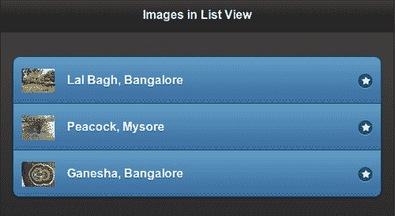

## 还有更多...

对于具有链接的交互式列表项，默认情况下，框架会在列表项的右侧添加一个右箭头图标。可以使用列表项上的 `data-icon` 属性进行更改。本步骤中的代码使用 `star` 图标作为列表项。

## 另请参阅

+   *在列表中格式化内容* 的步骤

+   *使用分割按钮列表* 的步骤

# 创建自定义搜索过滤器

当使用 **列表搜索过滤器** 时，框架会遍历列表项并显示与过滤文本匹配的项。备用文本也可以与搜索过滤器一起使用。当使用备用文本时，将忽略列表项文本。搜索是一种通用匹配，文本中的任何出现都将显示在结果中。

本步骤向您展示如何使用可以同时搜索列表项文本和备用文本的搜索过滤器。它还向您展示了如何配置搜索过滤器，以及如何实现使用自定义搜索逻辑的自定义搜索回调函数。

## 准备工作

从 `code/06/custom-search` 源文件夹复制此步骤的完整代码。可以使用 URL `http://localhost:8080/06/custom-search/main.html` 启动此代码。

## 如何做...

1.  在 `main.html` 中，创建以下移动平台列表。列表项还包含属性 `data-filtertext` 中的操作系统制造商名称。

    ```js
    <div data-role='content' data-theme='e'>
      <ul id='oslist' data-role='listview'>
     <li data-role='list-divider'>Open Source</li>
        <li data-filtertext='Google'>Android</li>
        <li data-filtertext='HP'>WebOS</li>
        <li data-filtertext='Samsung Intel'>Tizen</li>
        <li data-filtertext='Linux Foundation'>LiMo</li>
        <li data-filtertext='Mozilla'>Boot2Gecko</li>    
     <li data-role='list-divider'>Closed</li>
        <li data-filtertext='Apple'>iOS</li>
        <li data-filtertext='Nokia'>Symbian</li>
        <li data-filtertext='Nokia'>S40</li>
        <li data-filtertext='RIM'>Blackberry OS</li>
        <li data-filtertext='Microsoft'>Windows Phone</li>
        <li data-filtertext='Samsung'>Bada</li>
      </ul>
    </div>
    ```

1.  将以下脚本添加到页面以配置默认列表选项：

    ```js
    $.mobile.listview.prototype.options.theme = 'e';
    $.mobile.listview.prototype.options.inset = true;      
    $.mobile.listview.prototype.options.dividerTheme = 'e';
    $.mobile.listview.prototype.options.filter = true;
    $.mobile.listview.prototype.options.filterTheme = 'e';
    $.mobile.listview.prototype.options.filterPlaceholder = 'Search for ...';
    $.mobile.listview.prototype.options.filterCallback = customFilter;

    ```

1.  以下代码片段包含搜索文本中的列表项文本：

    ```js
    $('#main').live('pageinit', function(event) {
      $('#oslist').find('li').each(function() {
        $(this).attr('data-filtertext', 
            $(this).attr('data-filtertext') + ' ' + $(this).html());
      });
    });
    ```

1.  自定义搜索回调定义如下代码：

    ```js
    function customFilter(text, searchValue) {
      var regx='\\b'+searchValue;
     return !(text.match(new RegExp(regx, 'i')));
    }
    ```

## 工作原理...

在 `main.html` 中，创建一个带有 `id='oslist'` 的列表。按照代码所示为各种移动操作系统平台添加列表项。使用属性 `data-role='list-divider'` 创建列表项，并将列表项分为 **开源** 和 **闭源**。使用 `data-filtertext` 属性将操作系统制造商名称作为备用搜索文本。

将给定的脚本添加到页面或 `main.html` 的 `<head>` 标签中。设置各种列表视图配置选项，如 `theme='e'` 和 `inset='true'`。这是一个 **只读列表**，列表项着以浅黄色阴影。使用 `dividerTheme='e'` 选项来对列表分隔符项进行主题化。列表分隔符项由框架以较深色调样式化。

接下来，添加 `filter='true'` 和 `filterTheme='e'` 选项，为列表添加搜索过滤器，并使用 `e` 主题对其进行主题化。使用 `filterPlaceholder` 选项指定搜索过滤器文本控件的自定义文本（默认为 '`Filter Items...`'）。最后，通过设置选项 `filterCallback=customFilter` 设置自定义搜索回调函数。列表显示如下所示：

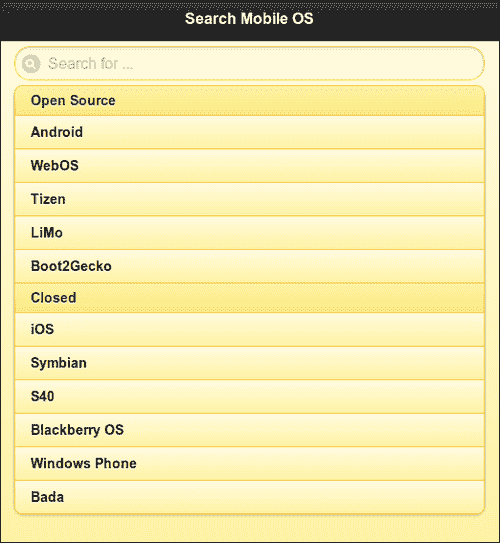

列表中的默认搜索功能匹配文本中搜索字符串的任何出现。要覆盖此行为，请按照前面的代码所示定义自定义过滤器回调。该函数接受两个参数，`text` 和 `searchValue`。创建一个正则表达式来搜索给定文本中单词开头处的 `searchValue` 出现。忽略单词之间的搜索值出现。使用 `match()` 方法将正则表达式与文本进行匹配。参数 `i` 使其大小写不敏感。

如果使用 `filtertext` 属性与列表项，那么默认搜索仅使用此文本，忽略列表项文本。要同时使用列表项文本和过滤文本，请添加 `pageinit` 事件处理程序，如前面的代码所示。在此函数中，使用 jQuery `find('li).each()` 方法找到每个列表项，并在 `each()` 的回调中，获取列表项文本并将其添加到过滤文本中。这不会对列表项产生任何可见影响。但是列表项文本现在是过滤文本的一部分，因此可供搜索过滤器使用。因此，搜索 **a** 将列出 **Android** 和 **iOS**（filtertext 的值为 **Apple**）。但这不会列出 **Symbian** 或 **Bada**，因为它们的单词中间包含 **a**，如下屏幕截图所示：

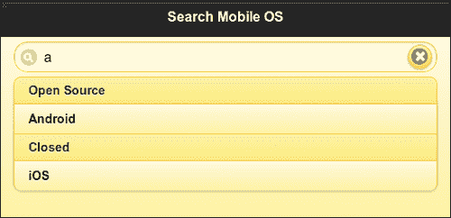

如果搜索 **Bo**，则仅将 **Boot2Gecko** 作为候选项，如下屏幕截图所示：

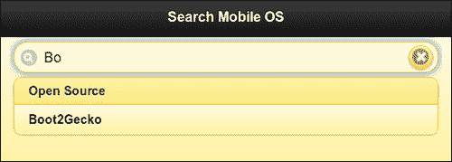

## 还有更多...

搜索回调函数返回一个布尔值，指示是否应通过搜索过滤器隐藏文本。因此，搜索过滤器回调应为所有匹配元素返回 `false`。不匹配的文本元素返回 `true`，并由搜索过滤器隐藏。

### 使用数据属性配置列表分隔主题

该示例使用 `dividerTheme` 选项对列表分隔项进行主题化。您还可以使用 `data-divider-theme` 属性，如下面的代码所示：

```js
<ul data-role='listview' data-theme='e' data-divider-theme='e'>
```

### 使用数据属性配置列表搜索过滤器

该示例向您展示如何使用 `filter`、`filterTheme` 和 `filterPlaceholder` 选项来配置列表视图。这些选项也可以使用 `data-filter`、`data-filter-theme` 和 `data-filter-placeholder` 属性进行设置，如下面的代码所示：

```js
<ul data-role='listview' data-filter='true' data-filter-theme='e' data-filter-placeholder='Search for...'>
```

# 使用 JavaScript 修改列表

您可以使用 JavaScript 动态修改列表及其内容。本示例向您展示如何使用 JavaScript 在只读列表中添加或删除列表项。

## 准备工作

从 `code/06/scripting-lists` 源文件夹复制此配方的完整代码。此代码可以使用网址 `http://localhost:8080/06/scripting-lists/main.html` 运行。

## 如何做...

1.  在 `main.html` 中，添加以下代码以在布局网格中创建一个空列表：

    ```js
    <div data-role='content'>
      <div data-role='fieldcontain'>
        <fieldset class='ui-grid-b'>
          <div class='ui-block-a' style='width: 65%'>
     <ul id='numlist' data-role='listview' data-theme='e' 
     data-inset='true'>
     </ul>
          </div>
          <div class='ui-block-b'>
            <button data-theme='b' id='addBtn'>Add</button>
            <button data-theme='b' id='removeBtn'>Remove</button>
          </div>
        </fieldset>
      </div>
    </div>
    ```

1.  添加以下脚本以动态添加或删除列表项：

    ```js
    var count = 0;
    $('#main').live('pagecreate', function(event) {
     $('#numlist').listview({create: function(event, ui) {
        $('#addBtn').bind('click', function(event, ui) {
          var str = "<li><a href='#'>Item " + (++count) + '</a></li>';
          $('#numlist').append(str);
     $('#numlist').listview('refresh');
        });
        $('#removeBtn').bind('click', function(event, ui) {
          if (--count < 0) {
            count = 0;
            return;
          }
          $('#numlist').find('li').last().remove();
     $('#numlist').listview('refresh');
        });
      }});
    });
    ```

## 它是如何工作的...

在 `main.html` 中使用 `class='ui-grid-b'` 属性在 `fieldset` 容器上添加一个两列布局网格。在第一列中添加一个空列表，其 `id='numlist'`。在第二列中添加两个按钮，ID 分别为 `addBtn` 和 `removeBtn`。单击这些按钮时，列表项会动态更新到第一列的空列表中。

将给定的脚本添加到页面或 `main.html` 的 `<head>` 部分。在脚本中，为 `pagecreate` 事件创建一个事件处理程序，在页面完全初始化之前触发。在此处，为 `listview` 元素的 `create` 事件添加一个事件处理程序。当创建 `listview` 元素时，将触发此事件。在其回调函数中，绑定 `addBtn` 和 `removeBtn` 按钮的 `click` 事件，如前述代码所示。

按下 `addBtn` 时，将一个列表项添加到列表中。列表项文本保存在内存中，并在添加新元素时递增。按下 `removeBtn` 时，通过调用 jQuery 的 `find('li').last()` 方法获取最近添加的列表项元素。通过调用 `remove()` 方法移除此最后一个元素。在对列表进行任何修改后，调用 **listview 插件** 上的 `refresh()` 方法来更新列表。

当启动应用时，显示如下截图所示，其中包含一个空列表：

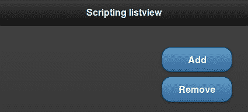

按下**添加**按钮会向列表中添加新的列表项，如下面的截图所示：

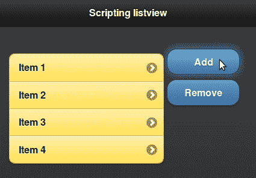

按下**删除**按钮会删除最近添加的列表项。

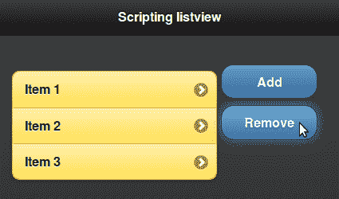

## 还有更多...

正如此配方中所述，您必须在对列表进行任何修改后调用 **listview 插件** 上的 `refresh()` 方法。在添加新列表项或删除列表项时，`refresh()` 方法会触发列表的更新，并在列表项上应用必要的样式和增强效果。

```js
$('#numlist').listview('refresh');
```
