# 第七章：配置

本章将涵盖以下内容：

+   配置活动类

+   配置`ajaxEnabled`

+   配置`autoInitializePage`

+   配置默认转换

+   配置`ignoreContentEnabled`

+   配置页面加载和错误消息

+   配置默认命名空间

+   配置`hashListeningEnabled`和`subPageUrlKey`

+   配置`pushStateEnabled`和`linkBindingEnabled`

# 介绍

jQuery Mobile 框架会在文档加载后立即增强标记和元素。您可以通过在文档对象上设置`mobileinit`事件处理程序中的值来调整用于这些增强的默认配置。本章向您展示了如何使用框架中提供的各种配置。

# 配置活动类

jQuery Mobile 框架默认使用 CSS 类`activeBtnClass`来为主题为`b`的活动状态的按钮设置样式。`activeBtnClass`类具有默认字符串值`ui-btn-active`。为了为活动页面（正在查看或正在过渡的页面）设置样式，框架使用 CSS 类`activePageClass`，该类具有默认字符串值`ui-page-active`。本配方向您展示如何配置框架以使用这些默认类的自定义类。

## 准备就绪

从`code/07/active-class`源文件夹中复制此配方的完整代码。您可以使用以下网址启动此代码：`http://localhost:8080/07/active-class/main.html`。

## 如何实现...

1.  在`main.html`中，将以下样式添加到页面的`<head>`标签中，以定义自定义的活动按钮类和活动页面类：

    ```js
    <link rel="stylesheet" 
      href="http://code.jquery.com/mobile
      /1.1.1/jquery.mobile-1.1.1.min.css" />
    <style>
     .ui-custom-btn-active {
        background: #53C584;
        background-image: -webkit-gradient(linear, left top, 
          left bottom, from( #53C584 ), to( #6FD598 ));
        background-image: -webkit-linear-gradient( #53C584 , 
          #6FD598 );
        background-image: -moz-linear-gradient( #53C584 , 
          #6FD598 );
        background-image: -ms-linear-gradient( #53C584 , 
          #6FD598 );
        background-image: -o-linear-gradient( #53C584 , 
          #6FD598 );
        background-image: linear-gradient( #53C584 , 
          #6FD598 );
      }
     .ui-mobile .ui-custom-page-active {
        border: 3px;
        border-style: dotted;
        width: 99%;
        display: block;
        overflow: visible;
      }
    </style>
    ```

1.  在包含 jQuery Mobile 脚本之前添加以下脚本：

    ```js
    $(document).bind("mobileinit", function() { 
     $.mobile.activePageClass = "ui-custom-page-active"; 
     $.mobile.activeBtnClass = "ui-custom-btn-active";
    });
    ```

1.  创建带有链接以打开`#page1`的`#main`页面，如下所示：

    ```js
    <div id="main" data-role="page" data-theme="e">
      <div data-role="header" data-theme="e">
        <h1>Active Classes</h1>
      </div>
      <div data-role="content">
        <a href="#page1" data-role="button">Open Page 1</a>
      </div>
    </div>
    ```

1.  创建`#page1`，并添加一个链接以返回到`#main`页面，如下所示；这是一个多页文档：

    ```js
    <div id="page1" data-role="page" data-theme="e">
      <div data-role="header" data-theme="e">
        <h1>Page 1</h1>
      </div>
      <div data-role="content">
        <a href="#main" data-rel="back" data-role="button">
          Go Back
        </a>
      </div>
    </div>
    ```

## 工作原理...

在`main.html`中，添加一个样式标签并定义类`ui-custom-btn-active`，以在活动按钮上设置不同的渐变背景（绿色阴影）。默认的活动按钮背景是明亮的蓝色阴影。还添加一个`ui-custom-page-active`类，该类为页面设置`3px`厚的虚线边框。接下来，在包含对`jquery.mobile.js`引用之前，添加给定的脚本。在脚本中，为`mobileinit`事件添加一个事件处理程序，该事件在应用程序启动时触发。在这里，将`$.mobile.activePageClass`和`$.mobile.activeBtnClass`属性设置为这两个新类。最后，添加`#main`和`#page1`页面容器。当您启动应用程序时，`#main`页面现在将显示为带有虚线边框，如下面的屏幕截图所示：

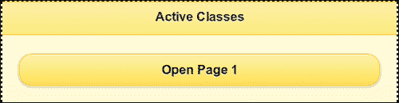

当您点击**打开页面 1**按钮时，按钮的活动状态在按下时显示绿色阴影，如下面的屏幕截图所示：

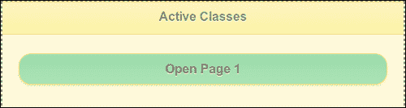

接下来，页面 `#page1` 打开，它也有虚线边框：


单击时，**返回**按钮也会变成绿色：

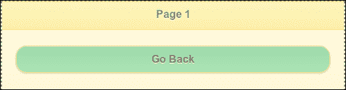

## 还有更多...

你可以使用 `mobileinit` 事件处理程序来自定义和配置 jQuery Mobile 框架的默认设置。你必须在包含 `jquery.mobile.js` 脚本之前添加此自定义脚本，以确保框架使用你的设置进行初始化。

### 使用 jQuery 的 `.extend()` 调用

你也可以使用 `.extend()` jQuery 调用来扩展 `$.mobile` 对象，而不是直接在 `$.mobile` 上设置属性，如下所示：

```js
$.extend( $.mobile, {
  $.mobile.activeBtnClass = "ui-custom-btn-active";
});
```

## 另请参阅

+   第二章, *页面和对话框*, *使用 CSS 创建弹跳页面转换*：此教程提供了供应商前缀的概述

# 配置 ajaxEnabled

在可能的情况下，jQuery Mobile 框架会自动使用 Ajax 处理链接点击和表单提交。这可以使用 `$.mobile.ajaxEnabled` 属性进行配置，默认情况下其布尔值为 `true`。如果禁用了 Ajax 或不支持它，则使用普通的 HTTP 请求并进行完整页面加载。URL 散列监听也被禁用。这个教程向你展示了如何配置 `$.mobile.ajaxEnabled` 属性。

## 准备就绪

从 `code/07/ajax-enabled` 源文件夹中复制此教程的完整代码。你可以使用以下 URL 启动此代码：`http://localhost:8080/07/ajax-enabled/main.html`。

## 怎么做...

1.  在 `main.html` 中，在包含 `jquery.mobile.js` 之前添加以下脚本：

    ```js
    $(document).bind("mobileinit", function() {
     $.mobile.ajaxEnabled = true;
    });
    ```

1.  创建包含链接以打开 `page1.html` 的主页面：

    ```js
    <div id="main" data-role="page" data-theme="e">
      <div data-role="header" data-theme="a">
        <h1>Ajax Enabled</h1>
      </div>
      <div data-role="content">        
        <p>This is the main page</p>
        <a href="page1.html" data-role="button">
          <p>Open Page 1</p>
        </a>
      </div>
    </div>
    ```

1.  最后，创建 `page1.html`，其中包含一个返回到 `main.html` 的链接，如下所示：

    ```js
    <div data-role="page" data-theme="e" data-add-back-
      btn="true">
      <div data-role="header">
        <h1>Page 1</h1>
      </div>
      <div data-role=content>    
        <p>Sub Page Contents</p>
        <a href="main.html" data-role="button">Go back</a>
      </div>
    </div>
    ```

## 如何运作...

在包含对 `jquery.mobile.js` 的引用之前，在代码中添加给定的脚本。在脚本中，添加一个用于在应用程序启动时触发的 `mobileinit` 事件的事件处理程序。在这里，设置配置 `$.mobile.ajaxEnabled=true`。

### 注意

由于 `$.mobile.ajaxEnabled` 默认为 `true`，因此您不必在代码中明确设置它。它包含在此教程中，因为您将在代码中稍后将此值更改为 `false`。

添加 `#main` 页面。按照代码中所示创建 `page1.html`（请注意，`page1.html` 中没有 `<head>` 元素）。显示 `#main` 页面，如下图所示：

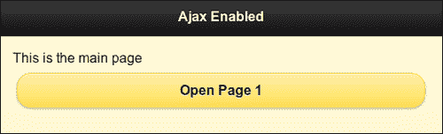

单击 **打开第一页** 按钮以打开 `page1.html`，如下所示。此页面通过 Ajax 加载，并且框架增强了控件。

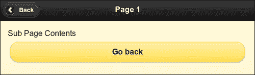

然后，在 `main.html` 中将 `ajaxEnabled` 属性设置为 `false`，然后重新加载页面。现在，当打开 `page1.html` 时，元素不会被增强，如下图所示：


## 还有更多...

当禁用 Ajax 时，将加载整个页面。在`page1.html`中，由于缺少指向 jQuery Mobile 框架库的链接的`<head>`元素，因此页面不会获得任何样式或增强效果。

# 配置 autoInitializePage

当您导航到新页面或将页面加载到 DOM 中时，框架会初始化页面并使其可见。这由`$.mobile.intializePage`属性控制，默认情况下其布尔值为`true`。如果将其设置为`false`，则不会显示页面。您将不得不手动将其设置回`true`以显示页面。本示例向您展示了如何执行相同操作。

## 准备就绪

从`code/07/auto-initialize`源文件夹中复制此示例的全部代码。您可以通过使用 URL 启动此代码：`http://localhost:8080/07/auto-initialize/main.html`。

## 如何操作...

1.  在`main.html`中，在包含`jquery.mobile.js`之前，添加以下脚本：

    ```js
    $(document).bind("mobileinit", function() {
     $.mobile.autoInitializePage = false;
    });
    ```

1.  创建具有以下内容的主页：

    ```js
    <div data-role="content">
      <a href="#" data-role="button">A button</a>
      <script>
     $.mobile.autoInitializePage = true;
      </script>
    </div>
    ```

## 工作原理...

在包含对`jquery.mobile.js`的引用之前，将给定的`autoInitializePage`脚本添加到代码中。在脚本中，添加一个在应用程序启动时触发的`mobileinit`事件处理程序。在这里，将配置`$.mobile.autoInitializePage=false`。最后，添加`#main`页面。页面内容将类似于以下屏幕截图：

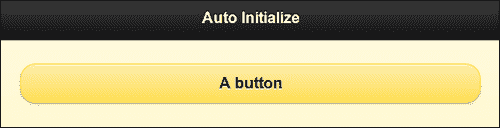

初始化内容并将其设置为`$mobile.autoInitializePage`的值手动设置为`true`，如代码所示。您可以注释此行（在页面内容部分）并重新加载页面，以发现什么也没有显示。

## 还有更多...

您可以使用此功能延迟显示页面，同时在后台执行一些后台工作或从服务器后台获取数据时。在手动处理页面更改时很有用。

# 配置默认过渡效果

默认情况下，jQuery Mobile 框架在使用 Ajax 加载页面时使用**fade**过渡。在使用 Ajax 打开对话框时，默认使用**pop**过渡。本示例向您展示了如何为您的应用设置不同的默认过渡效果。

## 准备就绪

从`code/07/default-transitions`源文件夹中复制此示例的全部代码。您可以使用以下 URL 启动此代码：`http://localhost:8080/07/default-transitions/main.hml`。

## 如何操作...

1.  在`main.html`中，在包含`jquery.mobile.js`之前，添加以下脚本：

    ```js
    $(document).bind("mobileinit", function() {
     $.mobile.defaultDialogTransition = "flow";
     $.mobile.defaultPageTransition = "turn";
    });
    ```

1.  创建`#main`页面如下：

    ```js
    <div id="main" data-role="page" data-theme="e">
      <div data-role="header">
        <h1>Configure Transitions</h1>
      </div>
      <div data-role=content>
        <a href="#page1" data-role="button">Open as Page</a>
        <a href="#page1" data-rel="dialog" data-role="button">Open as Dialog</a>
      </div>
    </div>
    ```

1.  创建`#page1`如下；这是一个多页面文档：

    ```js
    <div id="page1" data-role="page" data-theme="e" data-add-back-btn="true">
      <div data-role="header">
        <h1>Page 1</h1>
      </div>
      <div data-role=content>
        <p>Page 1 Content</p>
      </div>
    </div>
    ```

## 工作原理...

创建`main.html`并在代码中包含给定的脚本，然后再包含对`jquery.mobile.js`的引用。在脚本中，添加一个在应用程序启动时触发的`mobileinit`事件处理程序。在这里，使用`$.mobile.defaultDialogTransition`和`$.mobile.defaultPageTransition`属性设置页面和对话框的默认过渡效果。最后，如所示，添加`#main`和`#page1`页面容器。

在`#main`中，有两个按钮。第一个按钮将`#page1`作为页面打开，第二个按钮将其作为对话框打开。您将看到默认转换已更改。页面现在使用`turn`转换，对话框使用`flow`转换。

## 还有更多...

您还可以将页面和对话框的默认转换都设置为`none`。这将只是加载页面或对话框而不使用任何转换：

```js
$.mobile.defaultDialogTransition = "none";
$.mobile.defaultPageTransition = "none";
```

### 使用自定义转换

你可以配置框架以使用自定义转换作为默认转换。您必须按以下方式设置转换名称：

```js
$.mobile.defaultDialogTransition = "myDialogTransition";
$.mobile.defaultPageTransition = "myPageTransition";
```

### 转换回退

`fade`转换是默认转换，它使用 2D。所有其他转换都使用 3D。不支持 3D 变换的旧浏览器和设备将退回到使用`fade`。您可以将此默认回退转换配置为`none`，或者您可以将其设置为自己的自定义 2D 转换。可以为每个单独的 3D 转换执行此操作，如下所示：

```js
$.mobile.transitionFallbacks.slideout = "none";
$.mobile.transitionFallbacks.flip = "myCustom2DTransition";
```

## 另请参阅

+   第二章, *使用 CSS 创建弹跳页面转换*

+   第二章, *使用 JS 创建滑动'淡出'转换*

# 配置 ignoreContentEnabled

jQuery Mobile 框架会自动增强页面中找到的控件和标记。要跳过增强某些标记部分，您可以使用`$.mobile.ignoreContentEnabled`配置（默认为`false`）。此示例向您展示如何执行相同操作。

## 准备工作

从`code/07/content-enabled`源文件夹中复制此示例的完整代码。您可以使用以下网址启动此代码：`http://localhost:8080/07/content-enabled/main.html`。

## 如何做...

1.  在`main.html`中，在包含`jquery.mobile.js`之前添加以下脚本：

    ```js
    $(document).bind("mobileinit", function() {
     $.mobile.ignoreContentEnabled = true;
    });
    ```

1.  创建带有以下内容的`#main`页面：

    ```js
    <div data-role="content">
     <div data-enhance="false">
        <input type="checkbox" name="chkbox1" id="chkbox1" 
          checked />
        <label for="chkbox1">Checkbox</label>
        <input type="radio" name="radiobtn1" id="radiobtn1" 
          checked />
        <label for="radiobtn1">Radio Button</label>
     </div>
      <div>
        <input type="checkbox" name="chkbox2" id="chkbox2" 
          checked />
        <label for="chkbox2">Enhanced Checkbox</label>
        <input type="radio" name="radiobtn2" id="radiobtn2" 
          checked />
        <label for="radiobtn2">Enhanced Radio Button</label>
      </div>
    </div>
    ```

## 它是如何工作的...

创建`main.html`并在包含对`jquery.mobile.js`的引用之前添加代码中的给定脚本。在脚本中，为在应用程序启动时触发的`mobileinit`事件添加事件处理程序。在这里，将属性`$.mobile.ignoreContentEnabled=true`设置为`true`。在`#main`中，添加两个 div。在每个`div`中添加一个复选框和一个单选按钮。将属性`data-enhance=false`设置为第一个`div`。现在，框架不会增强添加到此`div`中的元素。第二个`div`中的元素会自动增强。页面显示如下截图所示：

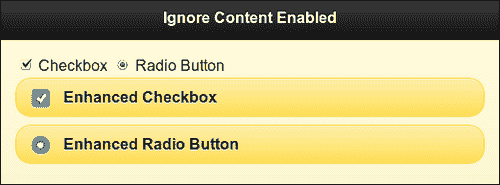

## 还有更多...

当您使用`$.mobile.ignoreContentEnabled=true`配置时，它告诉框架避免增强某些标记部分。通过使用`data-enhance="false"`属性来执行此操作，如此示例所示。现在，当框架遇到每个控件或标记时，它首先检查父元素是否将`data-enhance`属性设置为`false`。如果是，则跳过将样式或任何增强应用于控件。

### 注意

使用 `$.mobile.ignoreContentEnabled` 和 `data-enhance` 可能会在页面增强时导致性能下降。

# 配置页面加载和错误消息

默认情况下，jQuery Mobile 框架在加载新页面时显示一个带有主题 `a` 的旋转动画，不带任何文本。如果出现错误，页面加载超时，将显示错误消息 `Error Loading Page`，带有主题 `e`。本教程向你展示如何更改和自定义页面加载和错误消息。

## 准备工作

从 `code/07/load-message` 文件夹的源文件中复制此教程的全部代码。要尝试此教程，请使用该文件夹中可用的简单 `nodejs` web 服务器，使用以下命令：

```js
node jqmserver.js

```

然后，您可以使用以下 URL 启动代码：`http://localhost:8080/07/load-message/main.hml`。

## 如何做...

1.  在 `main.html` 中，添加以下脚本以在包含 `jquery.mobile.js` 之前使用：

    ```js
    $(document).bind("mobileinit", function() {
     $.mobile.loadingMessage = "Fetching it...";
     $.mobile.loadingMessageTextVisible = true;
     $.mobile.loadingMessageTheme = "b";
     $.mobile.pageLoadErrorMessage = "Oops, it's missing!";
     $.mobile.pageLoadErrorMessageTheme = "b";
    });
    ```

1.  创建以下内容的 `#main` 页面：

    ```js
    <div data-role="content">
     <a href="/delay" data-role="button">Dummy page</a>
    </div>
    ```

## 它是如何工作的...

创建 `main.html`，并在包含对 `jquery.mobile.js` 的引用之前添加给定脚本。在脚本中，为 `mobileinit` 事件添加一个事件处理程序，该事件在应用程序启动时触发。在这里，设置默认的页面加载消息和错误消息如代码所示。

在 `#main` 中，有一个尝试打开 `"/delay"` 页面的链接。这是对 `nodejs` 服务器的 `GET` 操作。服务器处理此请求，并在暂停几秒钟后返回错误代码。在此持续时间内显示带有文本消息的旋转控件，如下截图所示：

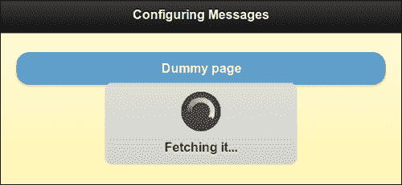

错误响应会导致以下错误消息显示：

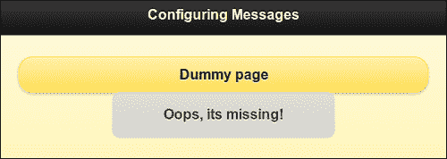

# 配置默认命名空间

本教程向你展示如何配置 jQuery Mobile 框架以使用你自定义的命名空间作为 `data-` 属性。

## 准备工作

从 `code/07/namespace` 源文件夹中复制此教程的全部代码。您可以使用以下命令启动此代码：`http://localhost:8080/07/namespace/main.html`。

## 如何做...

1.  在 `main.html` 中，添加以下脚本以在包含 `jquery.mobile.js` 之前使用：

    ```js
    $(document).bind("mobileinit", function() {
     $.mobile.ns = "my-";
    });
    ```

1.  在 `<head>` 标签中添加以下样式：

    ```js
    <link rel="stylesheet" href="http://code.jquery.com/mobile/1.1.1/jquery.mobile-1.1.1.min.css" />
    <style>
     .ui-mobile [data-my-role=page], .ui-mobile [data-my-role=dialog], 
     .ui-page { top: 0; left: 0; width: 100%; min-height: 100%; 
     position: absolute; display: none; border: 0; } 
    </style>
    ```

1.  创建主页面如下所示：

    ```js
    <div id="main" data-my-role="page" data-my-theme="e">
      <div data-my-role="header" data-my-theme="a">
        <h1>Configure Namespace</h1>
      </div>
     <div data-my-role="content"> 
        <p>This is the main page</p>
        <a href="#dialog" data-my-role="button">
          Open Dialog
        </a>
      </div>
    </div>
    ```

1.  创建 `#dialog` 页面如下；这是一个多页面文档：

    ```js
    <div id="dialog" data-my-role="dialog" data-my-theme="e">
      <div data-my-role="header" data-my-theme="a">
        <h1>Dialog</h1>
      </div>
      <div data-my-role="content">
        <p>This is a dialog</p>
     <a href="#" data-my-role="button" data-my-
     rel="back">Go Back</a>
      </div>
    </div>
    ```

## 它是如何工作的...

要使用自定义命名空间，您必须在 `jquery.mobile.css` 文件中覆盖一个特定的选择器，即 `.ui-mobile [data-my-role=page]` 和 `.ui-mobile [data-my-role=dialog]` 选择器。按照代码中所示覆盖此样式。使用 `data-my-role` 意味着命名空间设置为 `my`。

创建 `main.html`，并在包含对 `jquery.mobile.js` 的引用之前添加前述脚本以设置此配置。在脚本中，为 `mobileinit` 事件添加一个事件处理程序，该事件在应用程序启动时触发。在这里，使用 `$.mobile.ns="my-"` 配置设置默认命名空间。添加 `#main` 和 `#dialog` 页面。

以下截图显示了通过 DOM 检查器看到的页面：

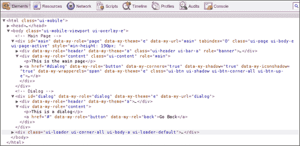

您会注意到代码还使用了`data-my-`属性。您还会观察到框架已添加增强功能，甚至这些增强功能在整个页面上都使用自定义命名空间。

### 注意

对于自定义命名空间，使用尾随连字符，例如`"my-"`。这样增强代码更易读。

# 配置`hashListeningEnabled`和`subPageUrlKey`

当您使用嵌套`listview`时，jQuery Mobile 框架会生成一个子页面，形式为`pagename.html&ui-page=subpageidentifier`。在子页面 URL 键`(&ui-page)`之前的哈希段由框架用于导航。本示例向您展示了如何使用自定义子页面 URL 键。它还向您展示了如何使用`$.mobile.hashListeningEnabled`配置。

## 准备工作

从源文件夹`code/07/sub-page`中复制此示例的完整代码。您可以使用以下 URL 启动此代码：`http://localhost:8080/07/sub-page/main.html`。

## 如何做...

1.  在`main.html`中，在包含`jquery.mobile.js`之前添加以下脚本：

    ```js
    $(document).bind("mobileinit", function() {
     $.mobile.subPageUrlKey = "my-page";
     $.mobile.hashListeningEnabled = false; 
    });
    ```

1.  在其内容中创建带有嵌套列表的`#main`页面如下所示：

    ```js
    <div data-role="content">
     <ul data-role="listview" data-theme="e">
        <li>Main Page Item 1</li>
        <li>Sub Page Items
     <ul data-role="listview">
            <li>Sub Page Item A</li>
            <li>Sub Page Item B</li>
          </ul>
        </li>
      </ul>
    </div>
    ```

## 它是如何工作的...

创建`main.html`，并在包含对`jquery.mobile.js`的引用之前在代码中添加给定的脚本。在脚本中，添加一个在应用程序启动时触发的`mobileinit`事件的事件处理程序。在这里，设置`$.mobile.subPageUrlKey="my-page"`和`$.mobile.hashListeningEnabled=false`配置。最后，在代码中添加`#main`页面与嵌套列表一样。输出将类似于以下截图：

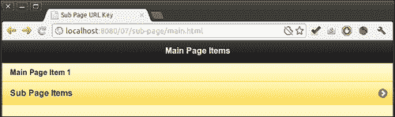

点击**子页面项**，并在子页面中打开嵌套列表。地址栏显示自定义的子页面 URL 键`my-page`，如下面的截图所示：

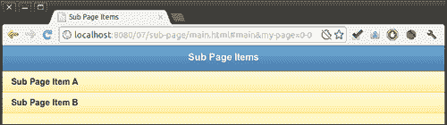

现在，使用浏览器的**返回**按钮返回。地址栏中的 URL 会更新，但页面不会返回到上一个屏幕，如下面的代码所示：

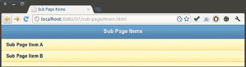

这是因为在启动时将`hashListeningEnabled`配置为`false`。这将阻止框架监听和处理位置哈希更改。如果将`hashListeningEnabled`设置为`true`（默认值）并重新加载页面，则页面导航将正常工作，并且主列表将再次显示为嵌套列表。

### 注意

只有在想要自定义管理哈希更改而不是允许框架处理它时，才配置`hashListeningEnabled`。

## 另请参阅

+   第七章，*配置*，*配置`pushStateEnabled`和`link**BindingEnabled`*

# 配置`pushStateEnabled`和`linkBindingEnabled`

当您单击链接时，将进行导航并更新 URL 散列。框架允许您在支持 `history.replaceState` API 的浏览器中将 URL 散列替换为完整路径。此示例向您展示了如何使用 `$.mobile.pushStateEnabled` 配置来实现此目的。它还向您展示了如何使用 `$.mobile.linkBindingEnabled` 配置，该配置允许框架自动绑定文档中锚链接的单击事件。这两者默认值均为 `true`。

## 准备工作

从 `code/07/push-state` 文件夹中复制此示例的完整代码。您可以使用以下 URL 启动此代码：`http://localhost:8080/07/push-state/main.html`。

## 如何操作...

1.  在 `main.html` 中，在包含 `jquery.mobile.js` 前添加以下脚本：

    ```js
    $(document).bind("mobileinit", function() {
     $.mobile.linkBindingEnabled = true;
     $.mobile.pushStateEnabled = false; 
    });
    ```

1.  创建以下内容的 `#main` 页面：

    ```js
    <div data-role="content">
      <a href="page1.html" data-role="button">Go to Page 1</a>
    </div>
    ```

1.  创建 `page1.html` 如下：

    ```js
    <div id="page1" data-role="page" data-theme="e">
      <div data-role="header">
        <h1>Header of Page 1</h1>
      </div>
      <div data-role="content">
        <a href="#" data-role="button" data-rel="back">Go Back</a>
      </div>
    </div>    
    ```

## 它的工作原理...

创建 `main.html`，并在引用 `jquery.mobile.js` 之前在代码中添加给定的脚本。在脚本中，为在应用程序启动时触发的 `mobileinit` 事件添加事件处理程序。在这里，设置 `$.mobile.pushStateEnabled=false` 和 `$.mobile.linkBindingEnabled=true` 配置。最后，根据代码中所示添加 `#main` 页面内容和 `page1.html`。输出将类似于以下屏幕截图：

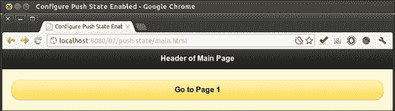

当您打开 **页面 1** 时，URL 地址栏将完整路径附加到 `main.html`，如下截图所示：

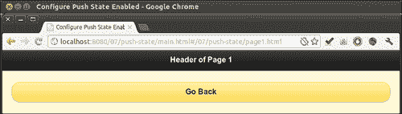

这是因为在启动时将 `pushStateEnabled` 设置为了 `false`。如果您将其设置为 `true`（默认值）并重新加载页面，URL 散列将被替换，并显示为 `http://localhost:8080/07/push-state/page1.html`。

### 注意

当应用程序中未使用 Ajax 或者大量使用外部链接时，将 `pushStateEnabled` 配置设置为 `false`。

## 还有更多...

在本示例中，在启动时将 `linkBindingEnabled` 配置设置为了 `true`（其默认值）。如果您将其设置为 `false` 并重新加载页面，您将注意到单击 **转到页面 1** 按钮时它未获得活动状态。在这种情况下，框架不会自动绑定链接点击。

### 注意

仅在您希望您的自定义代码（或其他库）处理链接点击时，使用 `linkBindingEnabled` 配置。

## 参见也

+   第七章, *配置*, *配置 hashListeningEnabled 和 subPageUrlKey*
