# 第八章：事件

在本章中，我们将涵盖：

+   使用方向事件

+   使用滚动事件

+   使用触摸事件

+   使用虚拟鼠标事件

+   使用页面初始化事件

+   使用页面加载和移除事件

+   使用页面切换事件

+   使用页面过渡和动画事件

+   使用布局事件

# 介绍

jQuery Mobile 框架不仅提供了默认的本机事件，还为桌面和移动平台提供了特定的事件。它允许你使用 jQuery 的 `bind()` 或 `live()` 方法绑定到这些事件，并允许你执行自定义操作。本章将向您展示如何使用 jQuery Mobile 框架中提供的事件。

# 使用方向事件

当移动设备的方向（**纵向** 或 **横向**）改变时，jQuery Mobile 框架会触发一个 `orientationchange` 事件。这个示例向您展示如何使用 `orientationchange` 事件。

## 准备工作

从 `code/08/orientation` 源文件夹中复制此示例的完整代码。您可以通过使用 URL `http://localhost:8080/08/orientation/main.html` 启动此代码。

## 如何实现...

执行以下步骤：

1.  创建 `main.html` 如下所示：

    ```js
    <div id="main" data-role="page" data-theme="e">
      <div data-role="header" data-theme="a">
     <h1>Orientation Events</h1>
      </div>    
      <div data-role="content">
        <p>Change orientation</p>
      </div>
    </div>
    ```

1.  在 `<head>` 部分添加处理 `orientationchange` 事件的脚本：

    ```js
    $(window).bind("orientationchange", function(event, data) {
     $("h1").html(data.orientation);
    });
    ```

## 工作原理...

创建 `main.html`，其中包含页面内容，如前面的代码片段所示。添加给定的脚本，并将 `orientationchange` 事件绑定到回调函数。在这里，将设备的当前方向设置为页面的 `h1` 标题。您可以通过回调函数的 `data.orientation` 属性获取设备的方向。

当页面加载时，改变设备的方向；头部文本将根据当前方向显示 **纵向** 或 **横向**。

## 更多信息...

在不支持 orientation 属性的平台（`$.support.orientation` 为 `false`）或者 `$.mobile.orientationChangeEnabled` 全局配置设置为 `false` 时，框架会绑定 resize 事件处理程序来处理设备方向的改变。

### orientationChangeEnabled 全局配置

您可以在应用程序开始时调用的 `mobileinit` 事件处理程序中配置 `$.mobile.orientationChangeEnabled` 配置。这必须在包含 `jquery.mobile.js` 脚本之前完成。

```js
$(document).bind("mobileinit", function() {
  $.mobile.orientationChangeEnabled = false;
});
```

# 使用滚动事件

当您滚动时，jQuery Mobile 框架会触发 scrollstart 事件。当您停止滚动时，会触发 `scrollstop` 事件。这个示例向您展示如何使用这两个事件。

## 准备工作

从 `code/08/scroll` 源文件夹中复制此示例的完整代码。您可以通过使用 URL `http://localhost:8080/08/scroll/main.html` 启动此代码。

## 如何实现...

执行以下步骤：

1.  创建 `main.html`，其中页面内容的 `div` 元素使用一个较大的高度值进行样式设置，以便出现滚动条：

    ```js
    <div id="main" data-role="page" data-theme="e">
      <div data-role="header" data-theme="a" data-
      position="fixed">
     <h1>Scroll Events</h1>
      </div>    
      <div data-role="content">
        <div style="height: 1000px">Scroll now</div>
      </div>
    </div>
    ```

1.  在 `<head>` 部分添加以下脚本来处理 `scroll` 事件：

    ```js
    $(window).bind("scrollstart", function(event) {
      $("h1").html("Scrolling now...");
    });
    $(window).bind("scrollstop", function(event) {
      $("h1").html("Scrolling done!");
    });
    ```

## 工作原理...

在前面的代码中创建`main.html`。在页面内容中添加一个高度为`1000px`的`div`容器。这将使垂直滚动条出现。现在，在页面的`<head>`部分添加给定的脚本。将`scrollstart`事件绑定到一个回调函数，该函数更新页面头部文本。类似地，将`scrollstop`事件绑定到一个回调函数，该函数更新头部文本。现在，保持垂直滚动条手柄，滚动页面。您可以看到页面头部文本显示为`"正在滚动..."`，当您停止或暂停滚动时，文本更新为`"滚动完成!"`。

## 还有更多...

在 iOS 设备上，`scrollstart`事件的工作方式存在问题。在滚动期间不允许 DOM 操作，并且事件被排队，一旦滚动停止就会触发。因此，在处理 iOS 设备上的滚动事件时，请记住这一点。您将不得不在滚动开始之前进行更改，而不是一开始就进行更改。

# 使用触摸事件

jQuery Mobile 框架提供了五个触摸事件。它们是`tap`、`taphold`、`swipe`、`swipeleft`和`swiperight`事件。当您点击屏幕时，将触发`tap`事件。如果点击持续时间较长，则首先触发`taphold`事件，然后在您放开手指后触发`tap`事件。当您在屏幕上滑动时，首先触发`swipe`事件，然后根据您滑动的方向触发`swipeleft`或`swiperight`事件。本配方向您展示了如何使用这些触摸事件。

在这个配方中，显示一个黄色框，显示您最后点击屏幕的位置。每次您点击并保持时，都会创建一个绿色框。您还可以通过将蓝色条拉到屏幕的左侧或右侧来查看滑动操作的工作方式。

## 准备工作

从`code/08/touch`源文件夹复制此配方的完整代码。您可以通过使用 URL `http://localhost:8080/08/touch/main.html` 来启动此代码。

## 如何操作...

应该遵循的步骤是

1.  在`main.html`中，在`<head>`标签中定义以下样式：

    ```js
    <style>
      .box { width:60px; height:60px; position:fixed }
      .yellow { background-color:yellow; z-index:1 }
      .green { background-color:green; z-index:2 }
      .blue { background-color: blue; z-index:3; height:100% }
    </style>
    ```

1.  使用两个带有蓝色条和黄色框样式的`<div>`标签添加页面内容：

    ```js
    <div id="content" data-role="content">
      <div id="movingbox" class="box yellow" style="top:0px; left:0px"></div>
      <div id="edgebar" class="box blue" style="top:0px; left:0px"></div>
    </div>
    ```

1.  在`<head>`部分添加以下脚本，以处理`tap`和`taphold`事件：

    ```js
    var tapholdflag = false;
    $("#main").live("tap", function(event) {
      var stylestr = "left:" + event.clientX + "px; top:" 
        + event.clientY + "px;"
      if (tapholdflag) {
        var str = "<div class=''box green'' style=''" + 
          stylestr + "''></div>";
        $("#content").append(str).trigger("create");
      } else {
        $("#movingbox").attr("style", 
          stylestr).trigger("refresh");
      }
      tapholdflag = false;
    });
    $("#main").live("taphold", function(event) {
      tapholdflag = true;
    });
    ```

1.  最后，处理`swipe`、`swipeleft`和`swiperight`事件：

    ```js
    $("#main").live("swipe", function(event) {
      $.event.special.swipe.scrollSupressionThreshold = 15;
      $.event.special.swipe.durationThreshold = 1250;
      $.event.special.swipe.horizontalDistanceThreshold = 25;
      $.event.special.swipe.verticalDistanceThreshold = 50;
    });  
    $("#main").live("swipeleft", function(event) {
      $("#edgebar").attr("style", "top:0px; 
        left:0px").trigger("refresh");
    });
    $("#main").live("swiperight", function(event) {
      $("#edgebar").attr("style", "top:0px; 
        right:0px").trigger("refresh"); 
    });
    ```

## 它是如何工作的...

在`main.html`中，添加`style`标签，并定义`box`、`yellow`、`green`和`blue`类。添加一个空的`div`标签，设置属性`id="movingbox"`，并设置属性`class="box yellow"`。这将创建一个`60px`宽的黄色方块。接下来，添加一个空的`div`标签，设置属性`id="edgebar"`，并设置属性`class="box blue"`。这将在屏幕边缘创建一个`60px`宽的蓝色条，如下面的截图所示。黄色框隐藏在蓝色条下面，因为它具有较低的`z-index`值。

``

现在将给定的脚本添加到`main.html`的`<head>`部分。将五个触摸事件中的每一个绑定到如所示的回调函数。如果触摸持续时间长，则为`taphold`。因此，定义一个布尔值`tapholdflag`来跟踪`tap`事件是否为`taphold`。在`taphold`事件处理程序中将其设置为`true`，并在触发`tap`事件后将其清除。

在`tap`事件的回调中，首先检查` tapholdflag`是否已设置。如果是，则这是一个`taphold`事件。创建一个新的绿色框并调用`"create"`方法，如所示。如果`tapholdflag`为`false`，则这是一个简单的点击。更新黄色框的新位置，并触发`"refresh"`方法。最后，清除`tapholdflag`并将其设置为`false`。

通过使用`event.clientX`和`event.clientY`参数，可以获取触摸位置。将这些值设置为盒子的`left`和`top`样式属性，以更新其位置。在几次`tap`和`taphold`事件后，屏幕看起来类似于以下截图：

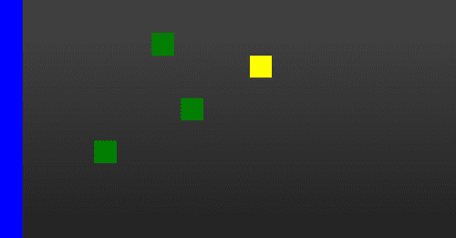

现在，将`swipe`事件绑定到回调函数，并按照代码中所示配置`swipe`事件属性。代码向您展示如何配置`scrollSupressionThreshold`、`durationThreshold`、`horizontalDistanceThreshold`和`verticalDistanceThreshold`属性。

将`swipeleft`事件绑定到回调以设置蓝色条的`left`和`top`样式属性，并调用`"refresh"`方法。这将将条移到屏幕的左边缘。类似地，将`swiperight`事件绑定到回调以设置蓝色条的`right`和`top`样式属性，并调用`"refresh"`。这将把条移到屏幕的右边缘。现在，当您向屏幕的右侧滑动时，该条将移动到右边缘，如以下截图所示；向左侧滑动，则该条将移回左边缘：

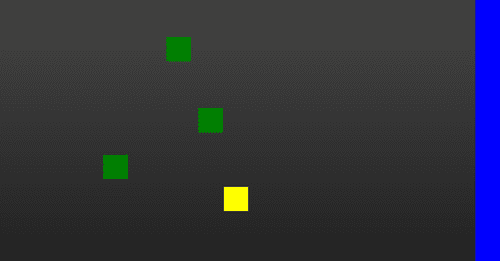

## 还有更多...

在代码中，`swipe`事件的回调向您展示了如何配置`swipe`事件属性。可用的配置如下：

+   `scrollSupressionThreshold`（默认为`10px`）：必须滑动距离超过此值才能触发事件，否则就是`scroll`事件。

+   `durationThreshold`（默认为`1000ms`）：如果滑动持续时间超过此值，则阻止`swipe`事件的触发。

+   `horizontalDistanceThreshold`（默认为`30px`）：水平滑动距离必须超过此值才能触发事件。

+   `verticalDistanceThreshold`（默认为`75px`）：垂直滑动距离必须小于此值才能触发事件。

### `tapholdThreshold`属性

`每当您点击屏幕时，将触发 `tap` 事件。如果点击持续时间超过一定值（默认为 `750ms`），则将其视为 `taphold` 事件。您可以通过设置 `$.event.special.tap.tapholdThreshold` 属性来配置此持续时间，如下所示：`

```js
$("#main").live("tap", function(event) {
  $.event.special.tap.tapholdThreshold = 1000;
});
```

### `注意`

`默认 `tap` 事件配置对大多数平台都很有效。因此，只有在有非常强烈的理由时才修改它们。`

## `另请参阅`

+   `使用虚拟鼠标事件` 示例

`# 虚拟鼠标事件

jQuery Mobile 框架提供虚拟 `mouse` 或 `vmouse` 事件来抽象鼠标和触摸事件。

您无需为每个受支持的平台或设备的触摸和鼠标事件编写单独的处理程序。您只需为 `vmouse` 事件编写事件处理程序，它将在各种平台上正常工作。框架支持七个 `vmouse` 事件：`vmousemove`、`vmouseover`、`vmouseout`、`vmousedown`、`vmouseup`、`vclick` 和 `vmousecancel`。此示例向您展示如何使用这些 `vmouse` 事件。

## 准备工作

从 `code/08/vmouse` 源文件夹中复制此示例的完整代码。您可以通过以下 URL `http://localhost:8080/08/vmouse/main.html` 启动此代码。

## 如何实现...

应遵循以下步骤：

1.  创建包含七个 `div` 标签的 `main.html`，用于展示七个 `vmouse` 事件，如下所示：

    ```js
    <div data-role="content">
      <div id="move"></div>
      <div id="over"></div>        
      <div id="out"></div>        
      <div id="down"></div>
      <div id="up"></div>
      <div id="click"></div>
      <div id="cancel"></div>
    </div>
    ```

1.  将以下脚本添加到 `<head>` 部分以处理 `vmousemove`、`vmouseover` 和 `vmouseout` 事件：

    ```js
    $("#main").live("pageinit", function(e) {
     $("#main").bind("vmousemove", function(e) {
        $("#move").html("<p>Move: " + e.clientX + ", " 
          + e.clientY + "</p>");
      });
     $("#main").bind("vmouseover", function(e) {
        $("#over").html("<p>Over: " + e.clientX + ", " 
          + e.clientY + "</p>");
      });
     $("#header").bind("vmouseout", function(e) {
        $("#out").html("<p>Out: " + e.clientX + ", " + 
          e.clientY + "</p>");
      });
    ```

1.  接下来，按如下方式处理 `vmousedown`、`vmouseup` 和 `vclick` 事件：

    ```js
     $("#main").bind("vmousedown", function(e) {
        var whichbtn;
        switch (e.which) {
          case 1: whichbtn = "Left Button"; break;
          case 2: whichbtn = "Center Button"; break;
          case 3: whichbtn = "Right Button"; break;
          default: whichbtn = "Tap"; break;
        }                        
        $("#down").html("<p>Down: " + e.clientX + ", " 
          + e.clientY + " - " + whichbtn + " </p>");
      });
     $("#main").bind("vmouseup", function(e) {
        $("#up").html("<p>Up: " + e.clientX + ", " + 
          e.clientY + "</p>");
      });
     $("#main").bind("vclick", function(e) {
        $("#click").html("<p>Click: " + e.clientX + ", 
          " + e.clientY + "</p>");
      });
    ```

1.  最后，按如下方式处理 `vmousecancel` 事件：

    ```js
     $("#main").bind("vmousecancel", function(e) {
        $("#cancel").html("<p>Cancel: " + e.clientX + ", 
          " + e.clientY + "</p>");
      });
    });
    ```

## 工作原理...

创建 `main.html`，并添加七个空的 `divs` 来显示七个 `vmouse` 事件的位置。添加给定的脚本，并绑定每个 `vmouse` 事件的回调函数，如 `pageinit` 事件处理程序所示。使用传递给回调函数的事件参数的 `e.clientX` 和 `e.clientY` 值来获取 `vmouse` 事件的位置。当您加载页面并执行描述的各种鼠标操作时，屏幕显示如下：

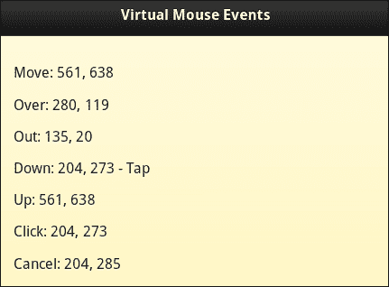

当鼠标移动（或在 `touchmove` 事件上）时，将触发 `vmousemove` 事件。当移动操作在事件绑定的元素上完成时，将触发 `vmouseover` 事件。当移动操作移出事件绑定的元素时，将触发 `vmouseout` 事件。在上述代码中，`vmouseout` 事件绑定到 `h1` 标题上。将鼠标移动到标题上，然后移出，以查看屏幕上的此参数是否更新。当鼠标点击（或在 `touchstart` 事件上）时，将触发 `vmousedown` 事件。当点击结束时（`touchend` 事件），`vmouseup` 事件紧随 `down` 事件。在点击或触摸动作时，将同时触发 `vclick` 事件和 `vmousedown`、`vmouseup` 事件。在 `vmousedown` 事件处理程序中，您可以使用 `event.which` 属性来查找点击了哪个鼠标按钮。对于 `tap` 事件，此值为 `0`。您可以尝试点击鼠标上的不同按钮，以相应地查看屏幕更新。最后，当存在被取消的鼠标或触摸事件时，将触发 `vmousecancel` 事件。

## 还有更多...

框架为 `vmouse` 事件提供了以下三个配置：

+   `$.vmouse.moveDistanceThreshold`（默认为 `10px`）：如果移动超过此值，则为 `scroll` 事件。将调用 `vmousecancel` 事件并取消 `TouchMove` 事件。

+   `$.vmouse.clickDistanceThreshold`（默认为 `10px`）：如果已捕获 `vmouse` 点击事件，则它在阻止列表中。然后，所有小于此距离的 `vmouse` 点击都将被忽略。

+   `$.vmouse.resetTimerDuration`（默认为 `1500ms`）：如果 `vmouse` 点击之间的间隔大于此持续时间，则不是触摸事件。`Scroll`、`TouchMove` 和 `TouchEnd` 事件使用此值。阻止列表将被清除。

    ### 注意

    默认的 `vmouse` 配置适用于大多数平台。因此，只有在有很强的理由时才修改它们。

### 鼠标坐标

此配方向您展示如何使用 `event.clientX` 和 `event.clientY` 属性获取鼠标坐标。您还可以使用 `event.pageX`、`event.pageY`、`screen.pageX` 和 `screen.pageY` 属性获取屏幕和页面坐标。

### 在触摸设备上使用 vclick 事件

在触摸设备上，`webkit` 浏览器会在触发 `touchend` 事件后大约 300 毫秒的延迟后处理点击事件。如果在此间隙内更改底层对象或背景，则可能选择不同的目标。另一个问题是由于时间延迟而将事件与相应目标匹配；例如，当使用 `event.preventDefault()` 时。为了避免这些问题，在触摸设备上使用 `click` 事件而不是 `vclick` 事件。

## 另请参阅

+   *使用触摸事件* 配方

# 页面初始化事件

jQuery Mobile 框架提供了**页面插件**，它自动处理页面初始化事件。 `pagebeforecreate`事件在页面创建之前触发。 `pagecreate`事件在页面创建后但在小部件初始化之前触发。 `pageinit`事件在完全初始化后触发。此示例向您展示如何使用这些事件。

## 准备工作

从`code/08/pageinit`源文件夹中复制此配方的完整代码。您可以使用 URL`http://localhost:8080/08/pageinit/main.html`启动此代码。

## 如何操作...

执行以下步骤：

1.  创建`main.html`，其中包含三个空的`<div>`标签，如下所示：

    ```js
    <div id="content" data-role="content">
      <div id="div1"></div>
      <div id="div2"></div>
      <div id="div3"></div>
    </div>
    ```

1.  将以下脚本添加到`<head>`部分以处理`pagebeforecreate`事件：

    ```js
    var str = "<a href='#' data-role='button'>Link</a>";
    $("#main").live("pagebeforecreate", function(event) {
      $("#div1").html("<p>DIV1 :</p>"+str);
    });
    ```

1.  接下来，处理`pagecreate`事件：

    ```js
    $("#main").live("pagecreate", function(event) {
      $("#div1").find("a").attr("data-icon", "star");
    });
    ```

1.  最后，处理`pageinit`事件：

    ```js
    $("#main").live("pageinit", function(event) {
      $("#div2").html("<p>DIV 2 :</p>"+str);
      $("#div3").html("<p>DIV 3 :</p>"+str);
      $("#div3").find("a").buttonMarkup({"icon": "star"});
    });
    ```

## 工作原理...

在`main.html`中，如下所示将三个空的`divs`添加到页面内容中。将给定的脚本添加到页面中。在脚本中，`str`是一个具有`data-role="button"`属性的创建锚链接的 HTML 字符串。

添加`pagebeforecreate`事件的回调，并将`str`设置为`div1`容器。由于页面尚未创建，因此`div1`中的按钮会自动初始化和增强，如下图所示。

添加`pagecreate`事件的回调。使用 jQuery 的`find()`方法选择`div1`中的前一个锚按钮，并设置其`data-icon`属性。由于此更改是在页面初始化之后但在按钮初始化之前进行的，所以`div1`按钮自动显示为`star`图标，如下图所示。最后，添加`pageinit`事件的回调，并将`str`添加到`div2`和`div3`容器中。此时，页面和小部件已经初始化和增强。现在添加一个锚链接将仅显示为`div2`的原生链接，如下图所示。但是，对于`div3`，找到锚链接，并在按钮插件上手动调用`buttonmarkup`方法，并将其图标设置为`star`。现在当您加载页面时，`div3`中的链接将被增强如下所示：

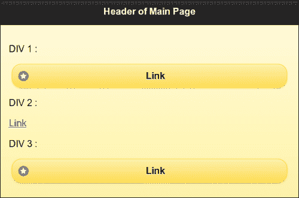

## 还有更多...

您可以在插件上触发`"create"`或`"refresh"`，以让 jQuery Mobile 框架增强对页面或小部件进行的动态更改后的初始化。

### 页面初始化事件仅触发一次

页面初始化事件仅触发一次。因此，这是进行任何特定初始化或添加自定义控件的好地方。

### 不要使用$(document).ready()

`$(document).ready()`处理程序仅在加载第一个页面或 DOM 首次准备就绪时起作用。如果通过 Ajax 加载页面，则不会触发`ready()`函数。而`pageinit`事件在页面创建或加载和初始化时触发。因此，这是在应用程序中进行后初始化活动的最佳位置。

```js
$(document).bind("pageinit", callback() {…});
```

# 页面加载和移除事件

jQuery Mobile 框架在将外部页面加载到 DOM 时会触发页面加载事件。它会在加载页面之前触发`pagebeforeload`事件，然后根据页面加载的状态触发`pageload`或`pageloadfailed`事件。当页面从 DOM 中移除时会触发`pageremove`事件。本教程向您展示如何使用页面加载和页面移除事件。

## 准备工作

从`code/08/pageload`源文件夹中复制此配方的完整代码。您可以使用 URL `http://localhost:8080/08/pageload/main.html`启动此代码。

## 如何做...

执行以下步骤：

1.  根据以下代码片段创建带有四个按钮和一个空的`div`元素的`main.html`：

    ```js
    <div id="content" data-role="content">
      <a href="page1.html" data-role="button" data-
        inline="true">Page 1</a>
      <a href="page2.html" data-role="button" data-
        inline="true">Page 2</a>        
      <a href="page3.html" data-role="button" data-
        inline="true">Page 3</a>
      <a href="page4.html" data-role="button" data-
        inline="true">Page 4</a>
      <div id="msgdiv"></div>
    </div>
    ```

1.  在`<head>`部分添加以下脚本来处理`pagebeforeload`事件：

    ```js
    $(document).bind("pagebeforeload", function(event, data) {
      var str = "<p>LOADING PAGE ...</p>"
        + "<p>url: " + data.url + "</p>"
        + "<p>absUrl : " + data.absUrl + "</p>"
        + "<p>dataUrl : " + data.dataUrl + "</p>"
        + "<p>options.type: " + data.options.type + "</p>";
      var re = /page2.html/;
      if ( data.url.search(re) !== -1 ) {
        str += "<p>ABORTED!!! page2.html does not 
          exist.</p>";
        event.preventDefault();
     data.deferred.reject( data.absUrl, data.options);
      }
      re = /page4.html/;
      if ( data.url.search(re) !== -1 ) {
        str += "<p>ABORTED!!! error dialog shown 
          instead.</p>";
        event.preventDefault();
     data.deferred.resolve( data.absUrl, data.options, 
     $("#subpage")); 
      }
      $("#msgdiv").html(str).trigger("refresh");
    });
    ```

1.  接下来，处理`pageload`事件：

    ```js
    $(document).bind("pageload", function(event, data) {
      var str = "<p>PAGE LOADED!</p><p>textStatus: " + data.textStatus 
        +   "</p><p>xhr.status : " + data.xhr.status + "</p>";
      $("#msgdiv").append(str).trigger("refresh");
    });
    ```

1.  接着，处理任何`pageloadfailed`事件中的错误：

    ```js
    $(document).bind("pageloadfailed", function(event, 
     data) {
      var str = "<p>PAGE LOAD FAILED!</p>"+ "<p>textStatus: " + data.textStatus + "</p>"
        + "<p>xhr.status : " + data.xhr.status + "</p>"
        + "<p>errorThrown : " + data.errorThrown + "</p>";
      $("#msgdiv").append(str).trigger("refresh");
    });
    ```

1.  同样处理`pageremove`事件：

    ```js
    $("#page1").live("pageremove", function(event) {
      $("#msgdiv").append("<p>PAGE 
        REMOVED!</p>").trigger("refresh");
    });
    ```

1.  现在，按照以下步骤创建带有`id="dialog"`的对话框：

    ```js
    <div id="dialog" data-role="dialog" data-theme="e" data-add-back-btn="true">
      <div data-role="header">
        <h1>Page Load Failed!</h1>
      </div>
      <div data-role="content">
        <p>There was an error</p>
      </div>      
    </div>
    ```

1.  最后，根据以下代码片段创建带有返回到`#main`按钮的`page1.html`：

    ```js
    <div id="page1" data-role="page" data-theme="e">
      <div data-role="header">
        <h1>Header of Page 1</h1>
      </div>
      <div data-role="content">
        <a href="#" data-role="button" data-
          rel="back">Go to Main Page</a>
      </div>
    </div>
    ```

## 它是如何工作的...

在`main.html`中创建`#main`页面，并添加四个锚链接，带有`data-role="button"`和`data-inline="true"`属性，以创建四个内联按钮。这些链接指向`page1.html`、`page2.html`、`page3.html`和`page4.html`。同时添加一个空的`div`容器，带有`id="msgdiv"`用于显示消息。接着，在`main.html`中添加一个带有`id="dialog"`的对话框。最后，只创建`page1.html`，如下所示，其中包含一个返回主页的链接。其他三个页面不需要创建。将页面加载和页面移除事件绑定到脚本中给出的回调函数。这些回调函数有两个参数可用。第一个是`event`对象，第二个是`data`对象。

在`pagebeforeload`事件的回调中，从`data`对象中获取`url`、`absUrl`（绝对 URL）、`dataUrl`（数据 URL）和`options.type`属性。将它们显示在`msgdiv`容器中。`options`对象与传递给`$.mobile.loadPage()`调用的相同。

在`pageload`事件的回调中，获取`xhr.status`（jQuery `XMLHttpRequest`对象）和`textStatus`属性，指示页面加载成功，并在`msgdiv`容器中显示它们。

添加`pageloadfailed`回调函数以在页面加载错误时显示`data.xhr.status`和`data.errorThrown`属性。最后，添加`pageremove`回调函数并显示页面已被移除的消息。

现在，当您首次加载应用程序并点击**页面 1**按钮打开`page1.html`时，首先触发`pagebeforeload`事件，然后在完全加载页面之后触发`pageload`事件。返回主页时触发`pageremove`事件。您可以看到下面的屏幕截图中显示的这些消息：

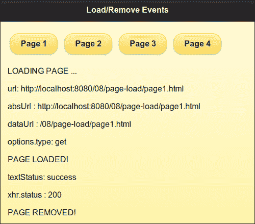

接下来，在`pagebeforeload`事件处理程序中，使用正则表达式搜索来检查所请求的页面或`data.url`是否为`page2.html`（该页面不存在）。如果请求了`page2.html`，则显示自定义错误消息。还通过调用`event.preventDefault()`来阻止对此请求的进一步操作。最后必须调用`data.deferred.reject()`方法来拒绝数据对象中包含的延迟对象引用。现在，当您单击**Page 2**按钮时，不会触发`pageloadfailed`事件，如下面的屏幕截图所示，而是显示自定义错误消息**ABORTED!!! page2.html 不存在。**：

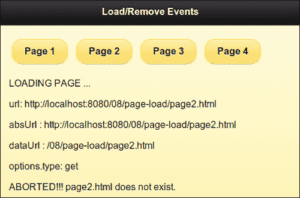

点击**Page 3**按钮；它现在尝试加载`page3.html`，但是找不到，并显示了默认的**Error Loading Page**错误消息，如下面的屏幕截图所示。您还可以在这里看到`pageloadfailed`事件处理程序的消息。在这种情况下没有进行自定义事件处理。

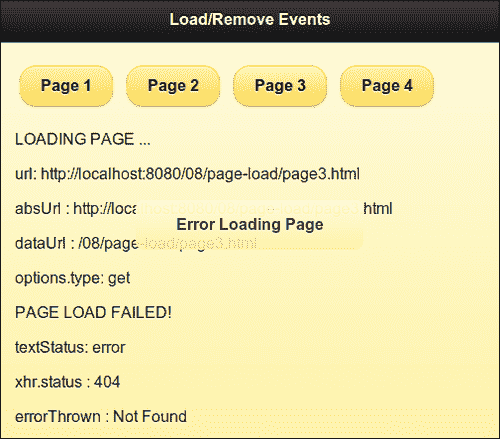

最后，在`pagebeforeload`回调函数中添加代码，以搜索`data.url`对象中的`page4.html`。如果找到字符串，则将请求重定向到加载`#dialog`对话框。还如果请求了`page4.html`，则显示自定义消息。现在，要阻止`pagebeforeevent`上的默认操作，请调用`event.preventDefault()`方法。还必须调用`data.deferred.resolve()`方法来解析`data`对象中包含的延迟对象引用。然后，通过将其作为参数传递给`resolve`方法，打开`#dialog`页面，如代码所示。现在，当您单击**Page 4**按钮时，将显示自定义错误对话框弹出窗口。当关闭对话框时，将显示您的自定义消息**ABORTED!!!显示错误对话框。**，如下面的屏幕截图所示。您会注意到`pageloadfailed`事件回调函数没有被调用。

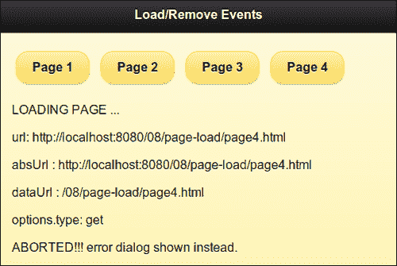

## 还有更多...

如果通过调用`event.preventDefault()`方法来阻止默认的页面加载事件，那么在完成后，必须通知框架恢复处理其他`changePage()`请求。您可以通过在事件的回调函数中对传递给`data.deferred`对象调用`reject()`或`resolve()`方法来实现这一点。

## 另请参阅

+   在第九章*方法和实用程序*中的*使用 loadPage()加载页面*中的配方

# 页面更改事件

每当`$.mobile.changePage()`方法将页面加载到 DOM 中时，jQuery Mobile 框架都会触发页面更改事件。首先触发`pagebeforechange`事件，然后触发`pagechange`事件（成功时）或`pagechangefailed`事件（失败时）。本节介绍如何使用页面更改事件。

## 准备好了

从 `code/08/pagechange` 源文件夹中复制此配方的完整代码。你可以使用 `http://localhost:8080/08/pagechange/main.html` URL 启动此代码。

## 如何做...

执行以下步骤：

1.  创建 `main.html`，其中包含两个链接以打开两个对话框，并在其页面内容中包含一个空的 `div` 元素，如下所示：

    ```js
    <div id="content" data-role="content">
      <a href="#dialog1" data-role="button">Dialog 1</a>
      <a href="#dialog2" data-role="button">Dialog 2</a>        
      <div id="msgdiv"></div>
    </div>
    ```

1.  将以下脚本添加到 `<head>` 部分以处理 `pagebeforechange` 事件：

    ```js
    $(document).bind("pagebeforechange", function(event, data) {
      var str = "<p>CHANGING PAGE ...</p><p>toPage: ";
      str += (!!data.toPage.attr)? data.toPage.attr("data-
        url") : data.toPage;
      str += "</p>";
      $("#msgdiv").html(str).trigger("refresh");
      $("#dialogdiv").html(str).trigger("refresh");
    });
    ```

1.  接下来，处理 `pagechange` 事件：

    ```js
    $(document).bind("pagechange", function(event, data) {
      var str = "<p>CHANGED PAGE ...</p><p>fromPage: ";
      str += (!!data.options.fromPage && !!data.options.fromPage.attr)? 
      data.options.fromPage.attr("data-url") : "none";
      str += "</p><p>options.transition: " + data.options.transition + "</p>";
      $("#msgdiv").append(str).trigger("refresh");
      $("#dialogdiv").append(str).trigger("refresh");
    });
    ```

1.  接下来，处理 `pagechangefailed` 事件中的任何错误：

    ```js
    $(document).bind("pagechangefailed", function(event, 
     data) {
      var str = "<p>PAGE CHANGE FAILED ...</p>";
      $("#msgdiv").append(str).trigger("refresh");
    });
    ```

1.  最后，按以下方式创建 `#dialog1` 对话框。第二个对话框 `#dialog2` 不会被创建。

    ```js
    <div id="dialog1" data-role="dialog" data-theme="e" 
      data-add-back-btn="true">
      <div data-role="header">
        <h1>Dialog Header</h1>
      </div>
      <div data-role="content">
        <div id="dialogdiv"></div>
      </div>
    </div> 
    ```

## 工作原理...

在 `main.html` 中，将两个锚链接添加到 `#main` 页面的内容中，这些链接指向 `#dialog1` 和 `#dialog2` 对话框。还添加一个带有 `id="msgdiv"` 的空 `div` 容器以显示消息。最后，只向 `main.html` 添加一个带有 `id="dialog1"` 的对话框。将一个空的带有 `id="dialogdiv"` 的 `div` 容器添加到此对话框中。另一个对话框不会被创建。将页面更改事件绑定到给定的脚本中的回调函数。这些回调函数有两个可用参数。第一个是 `event` 对象，第二个是 `data` 对象。

在 `pagebeforechange` 事件的回调中，获取 `data.toPage`（目标页面）属性。这可以是字符串或对象。检查这是否是一个对象（是否具有 `toPage` 属性），然后使用 `data.toPage.data-url` 字符串。在两个消息 `div` 容器中显示 `toPage` 消息。

在 `pagechange` 事件的回调中，获取 `data.fromPage`（源页面）属性。再次检查这是对象还是字符串，并在消息 `div` 容器中显示 `data.fromPage.data-url` 字符串，如果它是一个对象。另外，`data.options` 对象具有属性，例如 `transition`，你可以使用。

最后，在 `pagechangefailed` 事件的回调中，显示自定义错误消息。当页面首次加载时，可以看到以下图像。**main** 文本显示为 **toPage**；这里没有 **fromPage**：

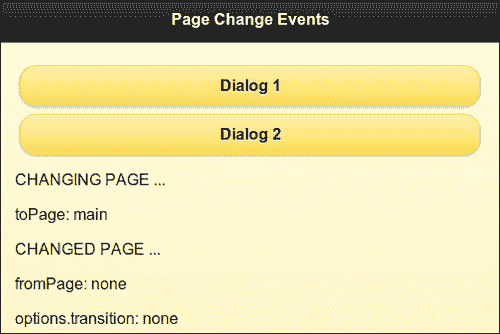

单击 **Dialog 1** 按钮，将显示以下对话框。 **toPage** 值是 **dialog1**， **fromPage** 是 **main**。所使用的转换显示为 **pop**，这是对话框的默认转换：

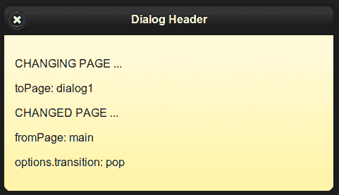

关闭此对话框，然后打开 `#main` 页面，显示与以下截图中显示的消息类似的消息。 **toPage** 是 **main**， **fromPage** 是 **dialog1**。所使用的转换再次显示为 **pop**：

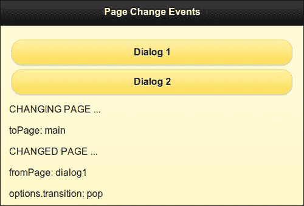

最后，单击 **Dialog 2** 按钮；由于 `#dialog2` 不存在，所以会显示自定义错误消息 **PAGE CHANGE FAILED**，如你在 `pagechangefailed` 回调中所见：

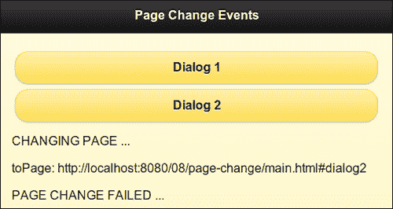

## 还有更多...

你可以在`pagebeforechange`事件处理程序中调用`event.preventDefault()`方法来阻止默认的页面更改操作。你可以使用`$.mobile.changePage()`方法将导航重定向到另一个页面。

### 页面转换事件的顺序

在触发`pagebeforechange`事件后, `changePage()` 请求将页面加载到 DOM 中，然后页面过渡发生。此刻触发`pageshow`和`pagehide`事件。最后，只有在此之后才会触发`pagechange`事件。

## 参见

+   第九章中的*使用 changePage()来更改页面*示例，*方法和工具*

# 页面过渡和动画事件

在页面导航期间，当前页面变换出去，新的活动页面变换进来。在支持的情况下会使用动画效果。jQuery Mobile 框架在页面导航期间会触发四个页面转换事件，如下所示：

+   `pagebeforehide`: 在当前页面隐藏之前触发此事件

+   `pagehide`: 当前页面隐藏后触发此事件

+   `pagebeforeshow`: 在新的活动页面显示之前触发此事件

+   `pageshow`: 一旦活动页面显示出来就会触发此事件

你也可以访问`animationComplete`插件，以便在动画完成后立即执行自定义操作。此示例向你展示如何使用页面过渡事件，以及如何使用`animationComplete`插件。

## 准备工作

从`code/08/transition`源文件夹中复制此示例的完整代码。你可以使用 URL`http://localhost:8080/08/transition/main.html`运行此代码。

## 如何做...

执行以下步骤：

1.  创建`main.html`，并添加带有指向打开`#page`页面的链接和一个空的`div`容器`#main`页面的代码片段如下所示：

    ```js
    <div id="main" data-role="page" data-theme="e">
      <div data-role="header">
        <h1>Page Transition and Animation Events</h1>
      </div>
      <div id="content" data-role="content">
        <a href="#page" data-role="button" data-
          transition="slide">Page 1</a>
      <div id="msgdiv"></div>
    </div>
    ```

1.  创建`#page`页面，包括一个回到`#main`的按钮和一个空的`div`容器来显示消息：

    ```js
    <div id="page" data-role="page" data-theme="e">
      <div data-role="header">
        <h1>Page Header</h1>
      </div>
      <div data-role="content">
        <a href="#" data-rel="back" data-role="button">Go Back</a>
      <div id="pagediv"></div>
    </div>
    ```

1.  在`<head>`部分添加以下脚本，以便在点击链接时清除消息`div`容器：

    ```js
    $("#main").live("pageinit", function(event) {
      $("a").bind("click", function(event, ui) {
        $("#msgdiv").html("");
        $("#pagediv").html("");
      });
    });
    ```

1.  处理`pagebeforeshow`事件：

    ```js
    $(document).bind("pagebeforeshow", function(event, data) {
      var str = "<p>BEFORE PAGE SHOW ...</p><p>Previous 
        Page: ";
      str += (!!data.prevPage.attr)? 
        data.prevPage.attr("data-url") : "none";
      str += "</p>";
      $("#msgdiv").append(str).trigger("refresh");
      $("#pagediv").append(str).trigger("refresh");
    });
    ```

1.  处理`pagebeforehide`事件：

    ```js
    $(document).bind("pagebeforehide", function(event, 
     data) {
     $(data.nextPage).animationComplete(anim);
      var str = "<p>BEFORE PAGE HIDE ...</p><p>Current Page: ";
      str += (!!data.nextPage.attr)?
        data.nextPage.attr("data-url") : "none";
      str += "</p>";        
      $("#msgdiv").append(str).trigger("refresh");
      $("#pagediv").append(str).trigger("refresh");
    });
    ```

1.  处理`pageshow`事件：

    ```js
    $(document).bind("pageshow", function(event, data) {
      var str = "<p>PAGE SHOW!</p><p>Previous Page: ";
      str += (!!data.prevPage.attr)? 
        data.prevPage.attr("data-url") : "none";
      str += "</p>";
      $("#msgdiv").append(str).trigger("refresh");
      $("#pagediv").append(str).trigger("refresh");
    });
    ```

1.  处理`pagehide`事件：

    ```js
    $(document).bind("pagehide", function(event, data) {
      var str = "<p>PAGE HIDE!</p><p>Current Page: ";
      str += (!!data.nextPage.attr)? 
        data.nextPage.attr("data-url") : "none";
      str += "</p>";        
      $("#msgdiv").append(str).trigger("refresh");
      $("#pagediv").append(str).trigger("refresh");
    });
    ```

1.  添加`animationComplete()`方法的回调函数：

    ```js
    anim = function() {
      $("#msgdiv").append("ANIMATION 
        DONE!!!").trigger("refresh");
      $("#pagediv").append("ANIMATION 
        DONE!!!").trigger("refresh");          
    }
    ```

## 工作原理...

创建`main.html`，并添加一个带有`data-role="button"`的锚链接到`#main`页面的内容。此链接打开`main.html`中的`#page`页面。创建`#page`页面，如下所示，其中包含返回到`#main`的链接。分别向页面添加空的`#msgdiv`和`#pagediv`容器来显示消息。在`pageinit`事件处理程序中绑定锚链接的`click`事件，并清除先前显示的消息。每当你在应用中点击链接时，都会触发此回调。

现在，按照脚本中给定的方式将四个页面转换事件绑定到它们的回调函数。这些回调函数有两个可用参数。第一个参数是`event`对象，第二个是`data`对象。

在`pagebeforeshow`事件的回调函数中，获取`data.prevPage`（上一页）对象。第一次加载时可能为空。检查是否可用（是否具有`prevPage`属性），并使用`data.prevPage.data-url`字符串。在消息`div`容器中显示`prevPage`消息。在`pagehide`事件的回调函数中使用类似的逻辑。

类似地，在`pagebeforehide`和`pagehide`事件的回调函数中，获取并显示`data.toPage`（源页面）属性。最后，调用`animationComplete`插件，并在`pagebeforehide`事件处理程序中定义`anim`回调函数，如下所示。在`anim()`函数中编写代码，在两个 div 容器中显示简单的**动画完成!!!**消息。

当页面首次加载时，您可以看到以下图片，显示了`pagebeforeshow`和`pageshow`事件处理程序被调用。此时`prevPage`是未定义的。

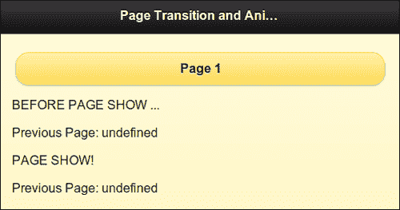

点击**Page 1**按钮打开`#page`。您可以看到来自`pagebeforehide`和`pagebeforeshow`事件处理程序的消息，即**当前页**是**page**，**上一页**是**main**。然后，您可以看到来自`animationComplete()`回调的**动画完成!!!**消息。此时页面可见，并且还可以看到来自`pagehide`和`pageshow`事件的消息：

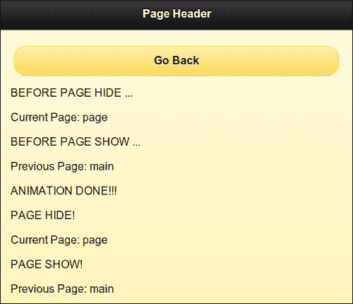

点击**返回**按钮。现在，`#main`被显示，消息与之前一样显示。这次，**当前页**是**main**，**上一页**是**page**：

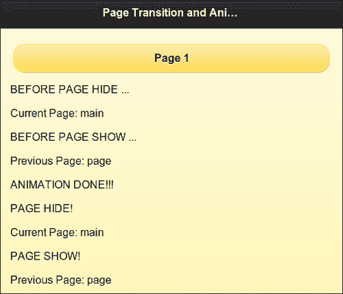

## 还有更多...

第一次加载时，`pagebeforeshow`和`pageshow`事件处理程序显示一个空的`data.nextPage`对象。为了在第一次加载时显示正确的值，这两个事件必须在`mobileinit`处理程序中绑定到它们的回调函数，即在页面加载之前以及加载`jquery.mobile.js`脚本文件之前，如下面的代码片段所示：

```js
<script>
 $(document).bind("mobileinit", function() {
    $(document).bind("pagebeforeshow", function(event, data) {
    alert(data.nextPage);
  });
  $(document).bind("pageshow", function(event, data) {
    alert(data.nextPage);
  });
});
</script>
<script src="img/jquery.mobile-1.1.1.min.js"></script>
```

## 另请参阅

+   在第七章的*Configuring the default transitions*一节中，*配置*

# 使用布局事件

用户交互动态调整大小的组件，例如列表视图和可折叠块，会导致控件重叠或定位问题。为防止此情况发生，这些组件会触发`updatelayout`事件，而 jQuery Mobile 框架会更新整个文档，确保所有组件都正确布局。本文介绍如何使用`updatelayout`事件。

## 准备工作

从`code/08/layout`源文件夹中复制此配方的所有代码。您可以通过使用 URL`http://localhost:8080/08/layout/main.html`来启动此代码。

## 它是如何实现的...

执行以下步骤：

1.  使用以下代码创建 `main.html`，其中包含三个可折叠块和一个 `<div>` 容器，如下面的代码片段所示：

    ```js
    <div data-role="content">
     <div id="msgdiv">Collapsible Blocks</div>
      <div data-role="collapsible" data-theme="a" data-
        collapsed="false">
        <h3>Tallest Mountain</h3>
        Mt. Everest
      </div>
      <div data-role="collapsible" data-theme="a" data-
        collapsed="false">
        <h3>Longest River</h3>
        R. Nile
      </div>
      <div data-role="collapsible" data-theme="a" data-
        collapsed="false">
        <h3>Largest Ocean</h3>
        Pacific
      </div>
    </div>
    ```

1.  在 `<head>` 部分添加以下脚本，来处理 `updatelayout` 事件：

    ```js
    $("#main").live("pageshow", function(event, ui) {
     $("div").bind("updatelayout", function(event) {
        $("#msgdiv").html("updatelayout on : " + event.target.innerHTML);
      });
    });
    ```

## 它是如何工作的...

在 `main.html` 中，向页面内容添加一个 `id="msgdiv"` 的 `div` 容器。添加三个带有 `data-collapsed="false"` 属性的可折叠块。添加下面给出的脚本来绑定 `pageshow` 事件（在页面显示时触发），指向一个事件处理程序。在这里，把 `updatelayout` 事件绑定到一个回调函数。在这个回调函数中，使用 `event.target.innerHTML` 属性来获取触发 `updatelayout` 事件的可折叠块的文本。如所示，显示在 `msgdiv` 块中。现在，当加载页面时，这三个可折叠块都是展开的。

点击第一个块，显示 **最高的山**。你会看到它折叠，并且 `msgdiv` 文本被更新为显示 **更新布局在：珠穆朗玛峰**，如下面的截图所示：

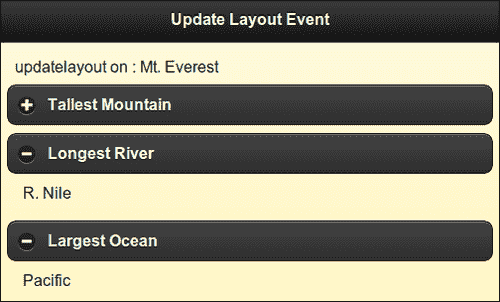

## 还有更多内容...

jQuery Mobile 框架在你在页面中添加或操作组件或切换它们的可见性的情况下，会根据大多数场景动态更新布局并调整位置。你必须在这些元素上触发 `create` 或 `refresh` 方法。但是在一些情况下，当你添加或操作控件或切换它们的可见性时，框架可能无法正确处理定位。在这种情况下，你可以触发 `updatelayout` 事件，并告诉框架更新所有组件并重新定位它们。你可以通过以下代码来实现：

```js
(yourselector).trigger("updatelayout");
```
