# 第十章：主题框架

在本章中，我们将涵盖以下配方：

+   为嵌套列表设置主题

+   使用自定义背景

+   使用自定义字体

+   设置角落样式

+   覆盖全局活动状态主题

+   覆盖现有的颜色板

+   使用 ThemeRoller 工具创建一个颜色板

# 简介

jQuery Mobile 框架提供了一个轻量级的主题系统，支持许多 CSS3 属性，如圆角、阴影和渐变。它还提供了一个精灵中的轻量级图标集，你可以在移动应用中使用（图标精灵在第四章*按钮和内容格式化*中进行了介绍）。该框架提供了五个默认的颜色板（**a**到**e**），并支持多达 26 个颜色板。这些颜色板可以为你的应用提供不同的外观和感觉。

# 为嵌套列表设置主题

当你为嵌套列表设置不同于页面主题的主题时，列表子页面会与主页面不一致。这在第六章的*使用嵌套列表*配方中进行了描述，*列表视图*。这个配方向你展示了如何以一致的方式为嵌套列表设置主题。

## 准备工作

从`code/10/nested-list`文件夹中复制此配方的完整代码。你可以使用`http://localhost:8080/10/nested-list/main.html`网址来运行此代码。

## 如何做...

1.  创建一个带有嵌套列表的`main.html`，如下所示：

    ```js
    <div id='main' data-role='page' data-theme='a'>
      <div data-role='header' data-theme='a'>
        <h1>Movies</h1>
      </div>
      <div data-role='content'>
        <ul data-role='listview' data-header-theme='a' data-
          theme='b' data-inset='true'>
          <li><a href='#'>Director 1</a>
            <ul data-role='listview' data-inset='true'>
              <li><a href='#'>Movie 1</a></li>
              <li><a href='#'>Movie 2</a></li>
              <li><a href='#'>Movie 3</a></li>
            </ul>
          </li>
     <li><a href='#'>Director 2</a>
     <ul data-theme='a' data-role='listview' data-
     inset='true'>
     <li data-theme='b'><a href='#'>Movie A</a></li>
              <li data-theme='b'><a href='#'>Movie B</a></li>
              <li data-theme='b'><a href='#'>Movie C</a></li>
            </ul>
          </li>
        </ul>
      </div>
    </div>
    ```

## 工作原理...

在`main.html`中，添加具有`data-theme='a'`的`#main`页面，以赋予它黑色主题。在页面内容中添加一个蓝色的列表视图，使用`data-theme='b'`。设置头部为黑色，并使用`data-header-theme='a'`。在列表中添加两个项目**导演 1**和**导演 2**。列表现在将如下图所示：

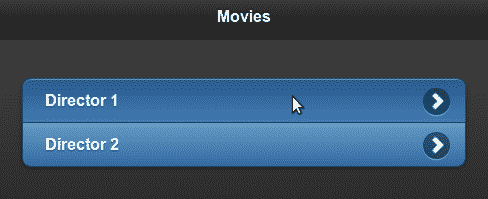

在这两个列表项中添加嵌套列表。第一个嵌套列表不指定任何其他主题属性。当你点击第一个列表项时，将显示**导演 1** 的子页面。你会注意到子页面的背景是`data-theme='b'`，与主页面不一致，如下截图所示：

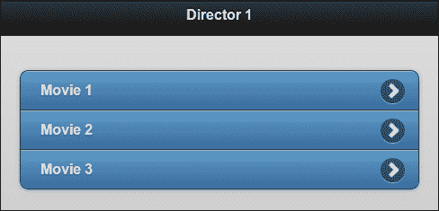

现在，在第二个嵌套列表上设置`data-theme='a'`。为每个嵌套列表项添加`data-theme='b'`属性。这将创建具有黑色背景的子页面。嵌套列表项会得到蓝色。子页面如下图所示；现在与主页一致：

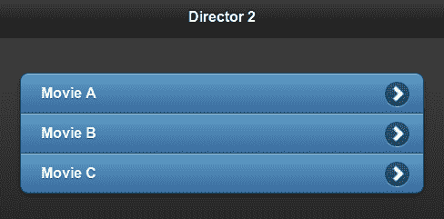

## 另请参阅

+   在第六章的*列表视图*，*使用嵌套列表*配方

# 使用自定义背景

这个配方向你展示了如何在你的应用中使用自定义背景。

## 准备工作

从`code/10/custom-background`源文件夹复制此配方的完整代码。您可以使用以下 URL 启动此代码：`http://localhost:8080/10/custom-background/main.html`。

## 如何做...

1.  创建`main.html`并在`<head>`部分定义`orangebar`和`orangebody`类，如下所示：

    ```js
    <style>
     .orangebar {
        border: 1px solid #e3b264;
        background: #f7e0bb;
        color: #000;
        text-shadow: 0 1px 0 #bfbfbf;
        background-image: -webkit-gradient(linear, left top, 
          left bottom,
          from( #f7e0bb ), to( #f7bd5e ));
        background-image: -webkit-linear-gradient( #f7e0bb , 
          #f7bd5e );
        background-image: -moz-linear-gradient( #f7e0bb , 
          #f7bd5e );
        background-image: -ms-linear-gradient( #f7e0bb , 
          #f7bd5e );
        background-image: -o-linear-gradient( #f7e0bb , 
          #f7bd5e );
        background-image: linear-gradient( #f7e0bb , #f7bd5e );
      }
     .orangebody {
        border: 1px solid #e3b264;
        background: #f4ffde;
        color: #000;
        text-shadow: 0 1px 0 #bfbfbf; 
        background-image: -webkit-gradient(linear, left top, 
          left bottom,
          from( #fef9f1 ), to( #f2d5a6 ));
        background-image: -webkit-linear-gradient( #fef9f1 , 
          #f2d5a6 );
        background-image: -moz-linear-gradient( #fef9f1 , 
          #f2d5a6 );
        background-image: -ms-linear-gradient( #fef9f1 , 
          #f2d5a6 );
        background-image: -o-linear-gradient( #fef9f1 , 
          #f2d5a6 );
        background-image: linear-gradient( #fef9f1 , #f2d5a6 );
      }
    </style>
    ```

1.  添加以下内容的`#main`页面：

    ```js
    <div id='main' data-role='page' class='orangebody'>
     <div data-role='header' class='orangebar'>
        <h1>Orange Background</h1>
      </div>
      <div data-role='content'>
        <p>Page Content</p>
      </div>
    </div>
    ```

## 它是如何工作的...

在`main.html`中，在`<style>`标签中定义`orangebar`和`orangebody`类。定义`border`、`background`和`background-image` CSS 属性的值。为`background-image`属性指定带有多个供应商特定值的线性渐变。创建`#main`页面并样式化页面以使用`orangebody`类。将标题样式化为使用`orangebar`类。页面现在显示为橙色背景，如下面的屏幕截图所示：

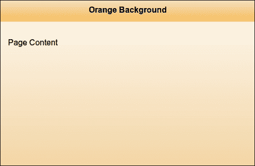

## 还有更多...

此配方展示了如何快速更改页面及其标题的背景。但如果您向此页面添加按钮或任何控件，控件将使用默认主题，看起来格格不入。您将不得不为控件设置与页面相匹配的主题。您可以使用 jQuery Mobile 的**ThemeRoller**工具创建主题或修改现有主题，该工具位于[`www.jquerymobile.com/themeroller`](http://www.jquerymobile.com/themeroller)。

### 注意

最好使用单独的 CSS 文件存储样式信息。这样可以将样式与 HTML 或文档结构分开，使得以后更容易维护和升级样式。

## 另请参阅

+   *主题化活动状态*和*使用 ThemeRoller 工具创建色板*的配方

+   第二章中的*使用 CSS 创建弹跳页面转换*配方，*页面和对话框*：此配方提供了有关供应商前缀的详细信息

# 使用自定义字体

jQuery Mobile 框架默认使用 Helvetica、Arial 和 Sans Serif 字体。此配方展示了如何在您的应用程序中包含和使用其他字体。

## 准备工作

从`code/10/custom-font`源文件夹复制此配方的完整代码。本配方中使用的**Komika TrueType Font**可在`code/resources/font`文件夹中找到。使用的**Syncopate Web Font**来自**Google Web Fonts**网站。您可以使用以下 URL 启动此代码：`http://localhost:8080/10/custom-font/main.html`。

## 如何做...

1.  创建`main.html`，并添加到 Syncopate Google web font 样式表的链接，如下所示：

    ```js
    <link rel='stylesheet' href='http://code.jquery.com/mobile/1.1.1/jquery.mobile-1.1.1.min.css' />
    <link rel='stylesheet' href='http://fonts.googleapis.com/css?family=Syncopa
    te:400,700'/> 

    ```

1.  在`<style>`标签中定义样式类以使用两种自定义字体：

    ```js
    <style>
      h1 {font-family: 'Syncopate', sans-serif; }
      .divstyle {font-family: 'Syncopate'; font-weight: 400; }  
     @font-face { 
     font-family: KomikaDisplay; 
        src: url('../../resources/font/Komika_display.ttf'); 
      }
     .komikafont { font-family: KomikaDi
    splay; }
    </style>
    ```

1.  使用以下方式添加`#main`页面容器，并使用自定义字体：

    ```js
    <div id='main' data-role='page' data-theme='a'>
      <div data-role='header'>
        <h1>Custom Font</h1>
      </div>
      <div data-role='content'>
        <p>In Default font</p>
     <div class='komikafont'><p>In Komika Display Font</p></div>
     <div class='divstyle'><p>In Syncopate Font</p></div>
      </div>
    </div>
    ```

## 它是如何工作的...

创建`main.html`，并在包含 jQuery Mobile 样式表之后，从 Google Web 字体网站添加到 Syncopate 样式表的链接，如示所示。使用`font-family` CSS 属性定义标题`h1`使用 Syncopate 和`sans-serif`字体。创建一个名为`divstyle`的 CSS 类，并将`font-family`属性设置为带有`400`的`Syncopate`的`font-weight`。要包含 Komika Display TrueType 字体，请使用 CSS `@font-face` 功能定义字体系列。将其源指向`.ttf`文件的位置。最后，定义一个`komikafont`类，并将其`font-family`设置为`KomikaDisplay`。

现在，创建带有标题`h1`的`#main`页面。标题现在将使用 Syncopate Web 字体。向页面内容添加一个带有`class='komikafont'`的`div`标记，此`div`标记中的文本将使用 Komika Display 字体。最后，添加另一个带有`class='divstyle'`的`div`标记，此标记将使用带有`400`字体权重的 Syncopate 字体。屏幕将显示如下：

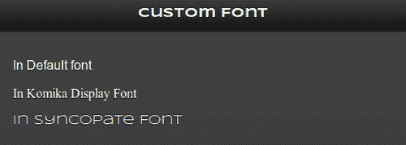

## 还有更多...

本配方向您展示了如何为特定元素使用自定义字体。要在整个应用程序中全局更改字体，请使用位于[`www.jquerymobile.com/themeroller`](http://www.jquerymobile.com/themeroller)的 jQuery Mobile`ThemeRoller`工具。以下屏幕截图显示了全局设置为**Verdana**字体：

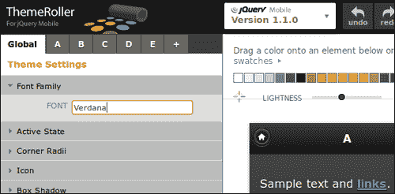

### 使用 TrueType 字体

**TrueType**（**TTF**）或**OpenType**字体在大多数现代浏览器中都受支持。如果您的目标是旧浏览器或大多数旧设备和功能手机，则需要注意，因为这些字体可能不受`@font-face`支持。您可以参考[`www.caniuse.com/#search=ttf`](http://www.caniuse.com/#search=ttf)来获取各种浏览器中对 TTF 支持的最新状态。您会注意到旧版本的 iOS 不支持 TTF。您可能需要改用 SVG 字体。

### 下载字体

您可以访问并使用 Google Web 字体页面上的其他 Web 字体，网址为[`www.google.com/webfonts`](http://www.google.com/webfonts)。所有字体都是开源的，可以自由使用。由 Apostrophic Labs 设计的 Komika Display 字体可在 Font Squirrel 网页上找到([`www.fontsquirrel.com/fonts/Komika-Display`](http://www.fontsquirrel.com/fonts/Komika-Display))。Font Squirrel 网站提供大量可用的字体，全部为免费软件。

## 另请参阅

+   使用 ThemeRoller 工具创建调色板的配方

# 角的样式

本配方向您展示了如何使用 jQuery Mobile 中提供的不同角样式。

## 准备工作

从`code/10/corner-styles`源文件夹复制此配方的完整代码。您可以使用 URL`http://localhost:8080/10/corner-styles/main.html`启动此代码。

## 如何操作...

1.  创建`main.html`，并将以下`<style>`标签添加到其`<head>`部分：

    ```js
    <style>
      .mydiv { border: 2px solid #000; margin: 5px; text-align: center; }
    </style>
    ```

1.  创建`#main`页面，其中包含四个`div`元素，布局如下：

    ```js
    <div id='main' data-role='page' data-theme='a'>
     <div data-role='header' data-theme='e'  class='ui-
     corner-top' style='margin-top: 10px'>
        <h1>Header Text</h1>
      </div>
      <div id='content' data-theme='e' data-role='content'>
        <fieldset data-role='controlgroup' data-
          type='horizontal' class='ui-grid-a'>
          <div class='ui-block-a ui-corner-tl mydiv' 
            style='width: 45%'><p>Top Left</p></div>
          <div class='ui-block-b ui-corner-tr mydiv' 
            style='width: 45%'><p>Top Right</p></div>
          <div class='ui-block-a ui-corner-bl mydiv' 
            style='width: 45%'><p>Bottom Left</p></div>
          <div class='ui-block-b ui-corner-br mydiv' 
            style='width: 45%'><p>Bottom Right</p></div>
        </fieldset>
      </div>
     <div data-role='footer' class='ui-corner-bottom' data-
     theme='e'>
        <h4>Footer Text</h4>
      </div>
    </div>
    ```

## 工作原理...

在`main.html`中，按照示例定义`.mydiv`类别，并设置边框、边距以及文本居中对齐。创建`#main`页面，并使用`class='ui-corner-top'`样式为标题添加角。这将在标题的顶部添加角。使用`class='ui-corner-bottom'`定义页脚，以在页脚的底部添加角。不要为内容`div`添加任何样式，因此默认情况下使用`class='ui-corner-none'`样式。现在，使用两列布局网格(`grid-a`)在两行中添加四个`div`标签。使用`mydiv`类别为这些`div`标签设置样式。同时，为这些`div`标签添加不同的角样式(`ui-corner-tl`、`ui-corner-tr`、`ui-corner-bl`和`ui-corner-br`)。四个`div`标签现在的样式如下所示：

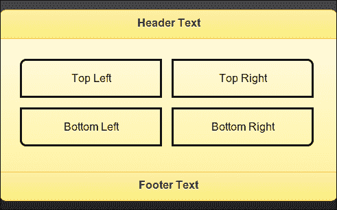

## 还有更多...

你可以通过[`www.jquerymobile.com/themeroller`](http://www.jquerymobile.com/themeroller)上的 jQuery Mobile `ThemeRoller`工具全局设置角半径。

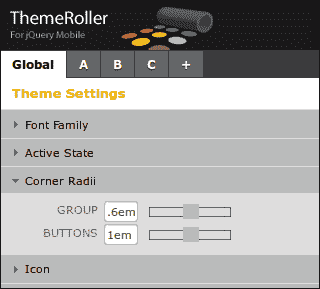

## 另请参阅

+   *使用 ThemeRoller 工具创建色板*示例

+   *第五章*中的*将单选按钮分组在网格中*示例，*表单*

# 覆盖全局活动状态主题

jQuery Mobile 框架使用明亮的蓝色来指示按钮和其他控件的活动状态。这个**活动状态**主题对所有默认色板都是一致的，并且无法通过标记覆盖。本示例演示了如何覆盖活动状态主题。

## 准备工作

从`code/10/active-state`源文件夹中复制此示例的完整代码。你可以使用以下网址启动此代码：`http://localhost:8080/10/active-state/main.html`。

## 如何实现...

1.  创建`active-state.css`样式表以设置活动状态的样式，如下所示：
    ```js
    .ui-btn-active {
      border: 1px solid #137000;
      background: #93ff86;
      font-weight: bold;
      color: #000;
      text-shadow: 0 1px 1px #eee;
      cursor: pointer;
      text-decoration: none;
      background-image: -webkit-gradient(linear, left top, 
        left bottom, from( #a1ff93), to( #14b800));
      background-image: -webkit-linear-gradient( #a1ff93, 
        #14b800);
      background-image: -moz-linear-gradient( #a1ff93, 
        #14b800);
      background-image: -ms-linear-gradient( #a1ff93, 
        #14b800);
      background-image: -o-linear-gradient( #a1ff93, 
        #14b800);
      background-image: linear-gradient( #a1ff93, #14b800);
      font-family: Helvetica, Arial, sans-serif;
    }
    ```

1.  指定焦点事件的样式：

    ```js
    .ui-focus, .ui-btn:focus {
      -moz-box-shadow: 0px 0px 12px #37bf37;
      -webkit-box-shadow: 0px 0px 12px #37bf37;
      box-shadow: 0px 0px 12px #37bf37;
    }
    ```

1.  `指定复选框和单选按钮控件的开启状态样式：

    ```js
    .ui-checkbox-on .ui-icon, .ui-radio-on .ui-icon {
      background-color: #50cf44;
    }
    ```

1.  在`main.html`中包含上述样式表：

    ```js
    <link rel='stylesheet' href='http://code.jquery.com/mobile/1.1.1/jquery.mobile-1.1.1.min.css' />
    <link rel='stylesheet' href='./active-state.css' />

    ```

1.  现在，在`#main`页面中创建带有`navbar`控件的标题：

    ```js
    <div id='main' data-role='page' data-theme='a'>
      <div data-role='header'>
        <h1>Active State</h1>
        <div data-role='navbar'>
          <ul>
            <li><a href='#'>Nav1</a></li>
     <li><a href='#' class='ui-btn-
     active'>Nav2</a></li>
            <li><a href='#'>Nav3</a></li>
          </ul>
        </div>
      </div>
    ```

1.  最后，根据以下方式添加页面内容：水平复选框、垂直复选框和滑块：

    ```js
      <div data-role='content'>
        <div data-role='fieldcontain'>
          <fieldset data-role='controlgroup' data-
            type='horizontal'>
            <legend>CheckBox</legend>
            <input type='checkbox' name='hchkbox' 
              id='hchkbox'/>
            <label for='hchkbox'>Horizontal</label>
          </fieldset>
        </div>
        <div data-role='fieldcontain'>
          <fieldset data-role='controlgroup'>
            <legend>CheckBox</legend>
            <input type='checkbox' name='vchkbox' 
              id='vchkbox'/>
            <label for='vchkbox'>Vertical</label>
          </fieldset>
        </div>    
        <div data-role='fieldcontain'>
          <label for='sldr'>Input slider:</label>
          <input type='range' name='sldr' id='sldr' 
            value='50' min='0' max='100' data-
            highlight='true' />
        </div>
      </div>
    </div>
    ```

## 工作原理...

创建`active-state.css`样式表以将样式信息与 HTML 文件分离。默认情况下，复选框和单选按钮控件的活动状态、焦点事件和开启状态样式都使用明亮的蓝色主题。你可以在 CSS 文件中覆盖它们，如代码所示。首先，覆盖`.ui-btn-active`类，并为`border`、`background`、`color`和`background-image` CSS 属性指定你的设置。然后，覆盖`.ui-focus`和`.ui-btn:focus`类，并为`box-shadow`指定颜色`.ui-checkbox-on`和`.ui-radio-on`样式，如代码所示。`

创建 `main.html`，并在标题中添加一个 `navbar` 控件。在 `navbar` 中的第二个链接上添加 `ui-btn-active` 类。当页面加载时，你将看到第二个链接上设置了活动状态。接下来，添加水平和垂直组合的复选框控件。最后，向页面添加一个输入滑块。现在，页面加载如下截图所示，将默认的鲜蓝色活动状态主题替换为荧光绿色主题：

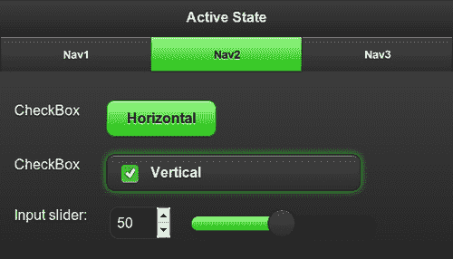

## 还有更多...

你也可以使用位于 [`www.jquerymobile.com/themeroller`](http://www.jquerymobile.com/themeroller) 的 jQuery Mobile ThemeRoller 工具全局设置活动状态主题。

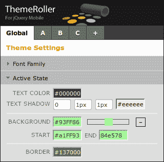

## 另请参阅

+   *使用 ThemeRoller 工具创建色板* 配方

+   *在 第二章 中的 *使用 CSS 创建弹跳页面转换* 配方，*页面和对话框*：该配方提供了有关供应商前缀的注释

+   *在 第七章 中的 *配置活动类* 配方，*配置*

`# 覆盖现有色板

jQuery Mobile 框架使用 `ui-btn-hover` 类来设置 **按钮悬停** 事件的样式。此配方向你展示了如何覆盖现有色板的按钮悬停事件样式。

## 准备工作

从 `code/10/button-hover` 源文件夹复制此配方的完整代码。你可以使用以下 URL 启动此代码：`http://localhost:8080/10/button-hover/main.html`。

## 如何实现...

1.  创建 `main.html`，并在 `<head>` 部分添加以下 `<style>` 标签：

    ```js
    <link rel='stylesheet' href=
      'http://code.jquery.com/mobile/1.1.1/jquery.mobile-
      1.1.1.min.css' />
    <style>
     .ui-btn-hover-a {
        border: 1px solid #115e00;
        background: #51b54a;
        font-weight: bold;
        color: #fff;
        text-shadow: 0 1px 1px #197d19;
        background-image: -webkit-gradient(linear, left top, 
          left bottom, from( #7ad66f), to( #41a343));
        background-image: -webkit-linear-gradient( #7ad66f, 
          #41a343);
        background-image: -moz-linear-gradient( #7ad66f, 
          #41a343);
        background-image: -ms-linear-gradient( #7ad66f, 
          #41a343);
        background-image: -o-linear-gradient( #7ad66f, 
          #41a343);
        background-image: linear-gradient( #7ad66f, #41a343);  }
    </style>
    ```

1.  创建 `#main` 页面并向页面内容中添加一个按钮：

    ```js
      <a href='#' data-role='button'>button</a>
    ```

## 工作原理...

在 `main.html` 中，按照以下代码的方式链接 jQuery Mobile 样式表后，定义 `.ui-btn-hover-a` 类的覆盖。指定 `border`、`background`、`color`、`text-shadow` 和 `background-image` CSS 属性。创建 `#main` 页面并设置 `data-theme='a'`，然后在页面内容中添加一个按钮。加载页面，在按钮悬停时，你会看到按钮的颜色变为鲜绿色，而不是默认的悬停样式，如下截图所示：

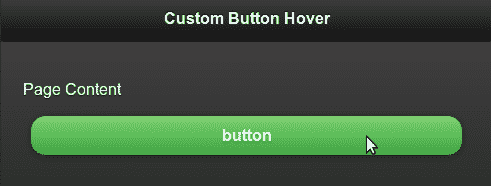

## 还有更多...

你也可以使用位于 [`www.jquerymobile.com/themeroller`](http://www.jquerymobile.com/themeroller) 的 jQuery Mobile ThemeRoller 工具为 **色板 A** 设置按钮悬停样式。

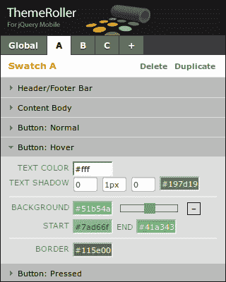

### buttonMarkup.hoverDelay 配置

你可以通过在 `mobileinit` 上设置 `buttonMarkup.hoverDelay`（默认为 `200` ms）配置来配置按钮悬停的延迟。但要注意，使用值太大或太小会影响用户体验。你可以使用以下代码来配置此属性：

```js
$(document).bind('mobileinit', function() {
  $.mobile.buttonMarkup.hoverDelay = 500;
});
```

## 另请参阅

+   *使用 ThemeRoller 工具创建色板* 配方

+   在第二章的*CSS 创建弹跳页面过渡*配方中，*页面和对话框*：这个配方提供了关于供应商前缀的说明

# 使用 ThemeRoller 工具创建一个颜色样本

此配方向你展示了如何使用 jQueryMobile ThemeRoller web 工具创建一个颜色样本。

## 准备就绪

此配方中的代码是使用[`www.jquerymobile.com/themeroller`](http://www.jquerymobile.com/themeroller)的 jQueryMobile ThemeRoller web 工具创建的。代码位于`code/10/myTheme`源文件夹中。你可以通过 URL `http://localhost:8080/10/myTheme/index.html`启动此代码。

## 如何操作...

1.  使用 jQueryMobile ThemeRoller 工具生成`myTheme.css`文件。它将包含在生成的`index.html`文件中，如下所示：

    ```js
    <link rel='stylesheet' href='themes/myTheme.min.css' />
    <link rel="stylesheet" 
     href="http://code.jquery.com/mobile
     /1.1.1/jquery.mobile.structure-1.1.1.min.css" />
    <script src="img/jquery-1.7.1.min.js">
    </script>
    <script src="http://code.jquery.com/mobile/
      1.1.1/jquery.mobile-1.1.1.min.js"></script>
    ```

1.  在`index.html`中的`<body>`内容如下生成：

    ```js
    <div data-role="page" data-theme="a">
      <div data-role="header" data-position="inline">
        <h1>It Worked!</h1>
      </div>
      <div data-role="content" data-theme="a">
        <p>
          Your theme was successfully downloaded. You can use 
            this page as a reference for how to link it up!
        </p>
        <pre> .... </pre>
        <p>
          This is content color swatch "A" and a preview of a 
            <a href="#" class="ui-link">link</a>.
        </p>
        <label for="slider1">Input slider:</label>
        <input type="range" name="slider1" id="slider1" 
          value="50" min="0" max="100" data-theme="a" />
        <fieldset data-role="controlgroup"  data-
          type="horizontal" data-role="fieldcontain">
          <legend>Cache settings:</legend>
          <input type="radio" name="radio-choice-a1" id=
            "radio-choice-a1" value="on" checked="checked" />
          <label for="radio-choice-a1">On</label>
          <input type="radio" name="radio-choice-a1" id=
            "radio-choice-b1" value="off"  />
          <label for="radio-choice-b1">Off</label>
        </fieldset>
      </div>
    </div>
    ```

## 它的运作原理...

启动 jQuery Mobile ThemeRoller web 工具。你会在称为**检查器窗格**的左窗格中看到可用的颜色样本。样本始终以**A**开头，并且你可以添加、复制或删除样本。其他样本会立即按字母顺序排序。你最多可以创建 26 个样本（从**A**到**Z**）。你可以直接在**检查器**窗格中修改 CSS 属性。

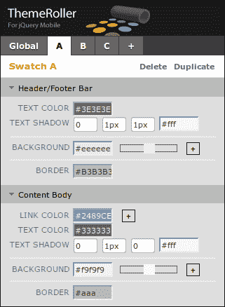

你也可以使用屏幕顶部的**Adobe Kuler**颜色样本栏来代替手动输入颜色。直接将你选择的颜色拖放到预览屏幕中的组件上。组件立即被新颜色更新。

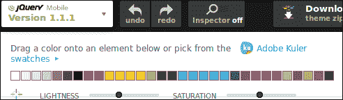

你可以点击 Kuler 样本链接，访问在线提供的多种现成的颜色组合。

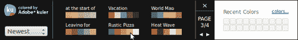

现在，在屏幕组件上拖放你选择的颜色。你会看到屏幕预览（如下图所示）立即反映出主题变化。你还可以在这里设置活动状态的主题。

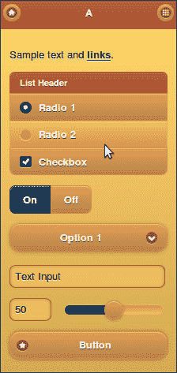

一旦主题准备好，你可以点击屏幕顶部的**下载**按钮来下载它。输入一个名称并下载压缩文件。压缩文件包含所需的图标、CSS 文件，还有一个名为`index.html`的示例文件。提取这些文件并打开`index.html`文件时，新主题将显示出来。

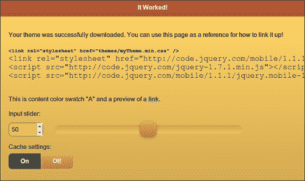

### 注意

生成的`index.html`文件中没有使用`jquery.mobile.css`文件。相反，它包含了指向`myTheme.css`（用于自定义主题）和`jquery.mobile.structure.css`（与结构相关的 CSS 属性）的链接。将可主题化的属性分开可以更容易地维护、升级，并分享你的主题。

## 还有更多...

你可以使用 ThemeRoller 工具顶部的 **打开/关闭检查器** 按钮来同步 **预览** 窗格和 **检查器** 窗格。将鼠标悬停在 **预览** 窗格中的任何控件上，该控件将以蓝色边框突出显示。点击控件以在 **检查器** 窗格中打开其 CSS 设置。这在开发主题时非常方便。

### 导入和升级主题

你可以将现有的 CSS 主题导入到 ThemeRoller 工具中，并扩展它们以创建新的主题。你也可以使用 ThemeRoller 将旧版本的 jQuery Mobile 主题升级到最新的 v1.1.1。点击 **ThemeRoller** 屏幕顶部的 **导入** 或 **升级** 按钮以打开 **导入主题** 对话框。

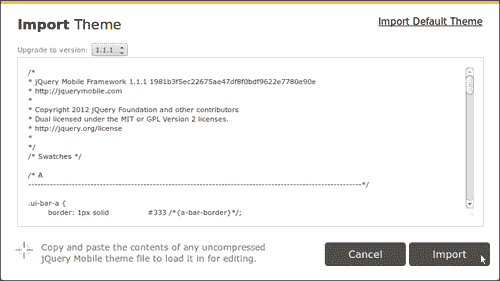

你可以复制粘贴现有的主题，然后点击 **导入** 按钮。新升级的主题已准备好，并加载到工具中。你也可以通过点击 **导入默认主题** 选项来加载 jQuery Mobile 框架提供的默认主题。这会将五个默认的样式加载到 ThemeRoller 中。现在你可以将这一套作为创建新主题的起点。

### 分享主题

ThemeRoller 工具还提供了一个很酷的功能，可以与他人分享你的工作。点击工具顶部的 **分享主题链接** 按钮即可获取链接，你可以与他人分享该链接。拥有此链接的任何人都可以直接访问、使用或复制你的主题进行工作。
