# 第十一章：HTML5 和 jQuery Mobile

在本章中，我们将涵盖以下内容：

+   使用新的 HTML5 语义

+   提高速度并使应用程序脱机运行

+   使用 Web Workers 进行密集任务

+   使用本地和会话存储

+   用 Canvas 进行 2D 绘图

+   在 SVG 图像上应用高斯模糊

+   使用地理位置 API 跟踪你的位置

+   使用`<audio>`元素播放音乐

+   使用`<video>`元素观看视频

# 介绍

HTML5 引入了新的语义和许多新的酷功能，如应用程序缓存，2D 画布，地理位置，本地和会话存储，Web Workers 以及对音频和视频的支持。jQuery Mobile 框架构建在 HTML5 和 CSS3 上，并提供对这些新的语义和新功能的出色支持。本章介绍了一些建议，你可以在你的 jQuery Mobile 应用中使用这些功能。

### 注

有许多关于学习 HTML5 的网络资源。举几个例子，你可以在 HTML5 Rocks ([`www.html5rocks.com/en`](http://www.html5rocks.com/en)), HTML5 Demos ([`www.html5demos.com`](http://www.html5demos.com)), 和 Mozilla Developer Network ([`developer.mozilla.org/en-US/docs/HTML/HTML5`](https://developer.mozilla.org/en-US/docs/HTML/HTML5))阅读更多信息。

各种浏览器和平台对 HTML5 元素和功能的支持程度各不相同。在使用特定功能时，你必须小心，并确保它在你的目标平台上可以运行。这种支持程度每一天都在不断提高。

### 注

[`www.caniuse.com`](http://www.caniuse.com)提供了关于各种 HTML5 功能的平台支持更新状态的良好参考。

# 使用新的 HTML5 语义

HTML5 定义了新的语义，以更好地将 HTML 文档组织为更加合乎逻辑的部分。这个建议向你展示如何使用新的 HTML5 语义来定义你的 jQuery Mobile 应用。本建议涵盖了以下 HTML5 元素：

+   `section`：这定义了文档中的部分。页眉，页脚和页面内容都是部分。

+   `header`：这定义了文档的页眉。

+   `footer`：这定义了文档的页脚。

+   `aside`：这定义了与文档主要内容相关的附加内容，通常放置在侧边栏中。

+   `article`：这定义了与文档相关的内容，但也可以独立存在并且可以独立分发。

+   `nav`：这是提供导航链接并且可以包含一个或多个锚链接的部分。

## 准备工作

从`code/11/semantics`文件夹复制此示例的完整代码。你可以使用以下 URL 启动此代码：`http://localhost:8080/11/semantics/main.html`。

## 如何做...

需要遵循的步骤如下：

1.  创建`main.html`，在页面中使用新的 HTML5 语义；不要在这里使用`<div>`标签：

    ```js
    <section id='main' data-role='page' data-theme='a'>
     <header data-role='header' data-theme='b'>
        <h1>New HTML5 Tags</h1>
      </header>
     <section data-role='content'>
        Main content goes here
     <aside style='border: 2px; border-style: solid; 
     border-color: #666'> 
          <h3>Aside</h3>
          Standalone content but related to main
        </aside>
        <section>
          <h3>Articles</h3>
     <article>
            <h4>Item 1</h4>
            Item 1 description here            
          </article>
          <article>
            <h4>Item 2</h4>
            Item 2 description here           
          </article>
        </section>
      </section>
     <footer data-role='footer' data-theme='b'>
     <nav class='ui-bar' data-theme='d'>
          <a href='#' data-role='button'>Link 1</a> 
          <a href='#' data-role='button' class='ui-btn-
            right'>Link 2</a>          
        </nav>
      </footer>
    </section>
    ```

## 它是如何工作的...

创建 `main.html`，并使用带有 `data-role='page'` 属性的 `<section>` 标签将 `#main` 页面添加到其中。添加带有 `data-role='header'` 属性的 `<header>` 标签以创建页面页眉。接下来，添加带有 `data-role='content'` 属性的 `<section>` 标签以创建页面内容部分。最后，使用带有 `data-role='footer'` 属性的 `<footer>` 标签添加页脚。现在，您已经准备好了具有页眉、内容和页脚的页面。到目前为止，您会注意到还没有使用 `<div>`。

在页面内容中添加 `<aside>` 和 `<article>` 元素，如代码所示。由于有多篇文章，您可以将它们分组在一个 `<section>` 元素中。最后，在页面页脚添加一个带有两个按钮链接的 `<nav>` 元素。添加 `ui-btn-right` 类来将第二个按钮移到屏幕右侧。现在，当您启动应用程序时，将显示以下屏幕：

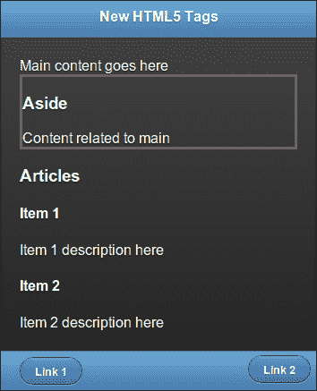

## 还有更多...

HTML5 支持许多新元素，例如：

+   `figure`: 用于包含图像、照片、图表、插图等。

+   `figcaption`: 为 `<figure>` 定义标题。

+   `hgroup`: 用于对一组标题元素（`<h1>`、`<h2>`等）进行分组。

+   `mark`: 用于突出显示文本。

+   `meter`: 用于指定在最小-最大范围内的数值。您还可以指定阈值（低和高）。

+   `progress`: 用于指示进度。

+   `time`: 用于标记日期/时间值。

### 关于使用 <div>

在 HTML5 之前，`<div>` 被用作容器来组合元素。但这不是很描述性的。HTML5 文档结构更加描述性和有意义，具有页眉、页脚等。

### 注意

当使用 HTML5 时，请使用 `<div>` 来组合不符合任何新 HTML5 元素描述的元素，例如 `<section>`。

### 使用 <section> 与 jQuery Mobile

在当前市场上可用的多个平台上，对 HTML5 语义的支持各不相同且不断改善。截至 v1.1.1，jQuery Mobile 框架建议使用带有 `data-role` 属性的 `<div>` 元素来指定各种页面组件，例如页眉和页脚。这是为了确保与旧版浏览器（如 IE8）的兼容性，同时也支持尽可能多的设备和平台。在不久的将来版本的 jQuery Mobile 中，当对旧版本浏览器的支持被放弃时，这肯定会发生变化。在那之前，请根据您的目标用户使用新的 HTML5 元素。

# 提高速度并使您的应用脱机化

HTML5 引入了一个称为 **Application Cache** 的新功能，允许你的 Web 应用将网络资源缓存在本地。你还可以比以前的浏览器缓存技术更好地控制和配置这个缓存。有了 Application Cache，你的移动应用即使在网络覆盖不好或没有网络的情况下也能更好地运行。你的应用会更快，因为它可以在本地找到许多资源，而不是从服务器获取它们。这也有助于用户降低服务提供商可能收取的数据传输费用。

这个配方向你展示了如何在你的 jQuery Mobile 应用中使用 **Application Cache** 功能。它还向你展示了如何使用本地存储的 jQuery Mobile 库，而不是从 CDN 获取库文件。

## 准备工作

从 `code/11/appcache` 文件夹复制本配方的完整代码。你需要将此代码托管在 Web 服务器上才能查看 Application Cache 的工作原理。`sources` 文件夹包含一个 `nodejs` Web 服务器，你可以用来运行此应用程序。你可以使用以下 URL 启动此代码：`http://localhost:8080/11/appcache/main.html`。

## 如何操作...

需要遵循的步骤是：

1.  创建 `main.html`，并在 `<html>` 标签中指定清单文件：

    ```js
    <!DOCTYPE html>
    <html manifest="jqmcookbook.appcache"> 

    ```

1.  在 `main.html` 页面内容中添加以下三个链接：

    ```js
    <div data-role="content">
      <a href="cached.html" data-role="button">CACHE</a>
      <a href="online.html" data-role="button">FALLBACK</a>
      <a href="network.html" data-role="button">NETWORK</a>
    </div>
    ```

1.  创建以下 `jqmcookbook.appcache` 清单文件，并指定要缓存的文件：

    ```js
    CACHE MANIFEST
    *# jQuery Mobile*
     *Cookbook Edition 1.0*

    *# Cached resources (also caching jQuery Mobile files for* offline access)
    CACHE:
    main.html
    cached.html
    http://code.jquery.com/mobile/1.1.1/jquery.mobile-1.1.1.min.css
    http://code.jquery.com/jquery-1.7.1.min.js
    http://code.jquery.com/mobile/1.1.1/jquery.mobile-1.1.1.min.js

    *# offline.html will be displayed as fall back*
    FALLBACK:
    online.html offline.html

    *# Accessible only when online*
    NETWORK:
    network.html
    ```

1.  创建以下 `cached.html` 文件，它会被应用程序缓存，并可供离线访问：

    ```js
    <!-- Cached Page : Cached and works offline too -->  
    <div id="cached" data-role="page">
      <div data-role="content">
        <h1>
          This page is shown from cache and even works when 
            offline
        </h1>
        <a href="#" data-role="button" data-rel="back" 
            data-theme="b">Go Back</a>
      </div>
    </div>
    ```

1.  创建以下 `online.html` 文件，它不会被缓存，并且每次访问时都会从网络获取：

    ```js
    <!-- Online Page : Shown only when Online -->  
    <div id="online" data-role="page">
      <div data-role="content">
        <h1>This page is shown only when online</h1>
        <a href="#" data-role="button" data-rel="back" 
            data-theme="b">Go Back</a>
      </div>     
    </div>
    ```

1.  创建以下 `offline.html` 文件，它会被缓存，并在无法访问 `online.html` 页面时用作回退：

    ```js
    <!-- Offline Page : Shown as a fall back -->  
    <div id="offline" data-role="page">
      <div data-role="content">
        <h1>This is a fallback for online.html</h1>
        <a href="#" data-role="button" data-rel="back" 
            data-theme="b">Go Back</a>
      </div>
    </div>
    ```

1.  最后，创建以下 `network.html` 文件，它不会被缓存，并且总是从网络获取；它不使用任何回退：

    ```js
    <!-- Network Page : Shown only when online -->
    <div id="network" data-role="page">
      <div data-role="content">
        <h1>This is always fetched from the network</h1>
        <a href="#" data-role="button" data-rel="back" 
            data-theme="b">Go Back</a>
      </div>
    </div>
    ```

## 工作原理...

创建 `main.html`，并在其 `<html>` 标签中指定 `jqmcookbook.appcache` 作为清单文件。这表示向浏览器指示应该缓存 HTML 文件。它还表示清单文件必须被处理以找到所有要在本地缓存的资源。按照示例添加 `cached.html`、`online.html` 和 `network.html` 页面的三个链接。这些将被用作本配方中将要缓存的资源。

创建带有 `CACHE MANIFEST` 文本的 `jqmcookbook.appcache` 清单文件。你可以在清单文件中添加注释，它们以 `#` 字符开头。现在，将要由你的应用程序缓存的资源添加到清单文件中。每个文件名必须在单独的一行上，并且你可以使用相对或绝对路径。Cache Manifest 文件有三个部分，分别用 `CACHE`、`FALLBACK` 和 `NETWORK` 标头标识。

定义默认的`CACHE`部分，并列出应该在本地缓存的文件。将`main.html`和`cached.html`添加到此部分。当你启动应用程序并点击第一个按钮时，无论设备是在线还是离线，它都会打开`cached.html`。

### 注意

图像、图标、样式表、JavaScript 和其他静态文件都是你应该在本地缓存的资源。

缓存文件只有在第一次下载时才会被下载。当应用尝试访问这些文件中的任何一个时，它们总是首先从缓存中获取，或者只有在缓存中不存在时才会从服务器获取。

### 注意

在应用程序中缓存主 HTML 文件（在其`<html>`标签中定义了清单）是个不错的做法。

接下来，定义`FALLBACK`部分，每行定义两个文件名。将`online.html`指定为第一个文件，然后将`offline.html`指定为后备。现在，当你点击应用程序中的第二个按钮时，只有在设备在线时才会显示`online.html`。如果设备离线，那么`offline.html`将自动从缓存中显示。在这里，第一个文件总是从网络获取，而不会被缓存。

最后，定义`NETWORK`部分，并将`network.html`列在其中。使用这部分来定义在您的应用中永远不应该被缓存的文件列表。这些文件总是从网络获取。现在，当你点击第三个按钮时，只有在设备在线时才会显示`network.html`，如果设备离线，则会显示错误。

## 还有更多...

你可以使用大多数浏览器提供的开发者/调试工具在浏览器中看到当前缓存的文件列表。以下截图显示了 Chrome 开发者工具中对本文档中`main.html`文件缓存资源的视图。清单中列出的文件都在**Application Cache**部分中看到。

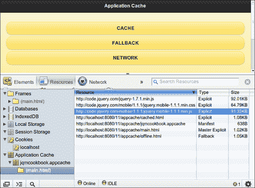

### 缓存大小的限制

浏览器对本地存储的数据量有限制。通常是 5 到 10 MB，需要用户允许超过此限制。一些浏览器，如 Chrome，允许你将此值设置为无限制。因此，小心地缓存文件，并包括你经常访问的资源。还包括那些需要让您的应用离线的资源。

### 刷新应用程序缓存

每次访问`main.html`文件时，远程清单文件都会被获取并与本地清单文件进行比较。只有清单文件已更改（这甚至可能只是一个注释），新的清单文件才会被获取。然后缓存将被清除，并且整套缓存文件将从服务器刷新。与此相对的是，即使其他文件没有发生变化，向清单文件中添加一个新文件也会触发完全刷新。

### 注意

在清单文件的注释中使用版本号是保持缓存文件更新的好方法。

### 清单文件的 MIME 类型

您应该始终以 **MIME** 类型为 text/cache-manifest 提供清单文件。您可以将此清单命名为任何内容。您的服务器应该能够识别此 MIME 类型。如果没有，请将此 MIME 类型添加到服务器配置中。本配方所附源代码中附带的 nodejs Web 服务器已经支持 text/cache-manifest MIME 类型。

### Ajax 预过滤器解决方案

应用缓存在某些浏览器上无法正常工作，因此在这种情况下需要使用 Ajax 预过滤器的解决方法。在这些浏览器中，成功的 Ajax 调用会在成功时返回 `0` HTTP 状态。为了解决这个问题，您应该使用 jQuery Ajax 预过滤器，并将 `isLocal` 属性设置为 `true`。有关使用 `isLocal` 解决方法的详细 GitHub 讨论线程，请参阅 [`github.com/jquery/jquery-mobile/issues/1579`](https://github.com/jquery/jquery-mobile/issues/1579)。

## 另请参阅

+   *为密集任务使用 Web Workers* 配方

+   第二章，*页面和对话框*，*为更快的导航预取页面* 和 *使用 DOM 缓存以提高性能* 配方

# 为密集任务使用 Web Workers

当运行执行复杂或耗时活动的脚本时，浏览器线程会冻结并且在任务完成前不响应。这可以通过使用 Web Worker 来克服——这是一个在后台独立运行 JavaScript 的线程。浏览器线程不会被阻塞，因此可以继续响应用户操作。本配方向您展示如何使用 Web Workers。

## 准备就绪

从 `code/11/webworkers` 文件夹中复制此配方的完整代码。您可以使用以下 URL 启动此代码：`http://localhost:8080/11/webworkers/main.html`。

## 如何做...

执行的步骤如下：

1.  创建 `main.html`，其页面内容包括复选框和滑块：

    ```js
    <div data-role='content'>
      <div id='msgdiv'></div>
      <div data-role='fieldcontain'>
        <input type="range" name="myslider" id="myslider" 
          value='0' min="0" max="100" />
        <label for="myslider">Slide me:</label>
      </div>
      <div data-role='fieldcontain'>
        <input type="checkbox" name="countchk" id="countchk" />
        <label for="countchk">Count with Webworkers</label>        
      </div>
    </div>
    ```

1.  在复选框被点击时添加以下脚本以触发长时间运行的循环。选中时，循环在 Web worker 中运行，没有 UI 冻结，并且您可以继续使用页面。当复选框未选中时，一切立即冻结，直到循环完成。

    ```js
    $('#main').live('pageinit', function(event) {
      $('#countchk').bind('change', function(event, ui) {
        if($('#countchk').prop("checked")) {
          $('#msgdiv').html('Worker is counting ...');
     var myworker = new Worker('webworker.js');
     myworker.onmessage = function(event) {
          $('#msgdiv').html(event.data);
        }
     myworker.postMessage('start'); 
      } else {
        $('#msgdiv').html('Started Counting ...');        	

        var count = 0;
        for (var i=1; i<=10000000000; i++)
          count++;
          $('#msgdiv').html('Loops : ' + count);                      

        }
      });
    });
    ```

1.  最后，添加 `webworker.js` JavaScript 文件来处理循环：

    ```js
    self.onmessage = function(event) {
      var count = 0;
      for (var i=1; i<10000000000; i++)
        count++;
     self.postMessage('Worker Loops : ' + count);
    };
    ```

## 工作原理...

创建 `main.html`，并将一个复选框和一个带有 `id='countchk'` 的滑块添加到 `#main` 的内容中。此外，添加一个空的 `#msgdiv` 属性来显示消息。将复选框的 `change` 事件绑定到 `pageinit` 回调中的事件处理程序。

当选中复选框时，在 Web Worker 中触发循环。通过调用 `new Worker()` 来启动 Web Worker，并将 JavaScript `webworker.js` 文件的名称传递给它。定义 `onmessage` 事件处理程序来处理工作器接收到的消息。您可以在 `#msgdiv` 中显示此消息。最后，通过向其发送 `start` 消息来调用工作器。这个消息可以是任何东西，必须在工作器中编写代码来处理它。在文件 `webworker.js` 中，定义 `onmessage` 回调来处理来自浏览器线程的传入消息。运行循环并向主线程返回相应的消息。

当您启动页面并选择复选框时，循环将在 Web Worker 中启动。您可以使用滑块，即使循环仍在运行，也可以看到页面中的消息被更新：

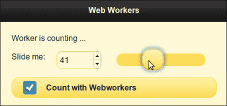

当复选框未被选中时，循环将在主浏览器线程中运行。现在，在复选框可以反映您的选择之前，整个界面都会冻结，并且只有在循环完成后界面才会响应：

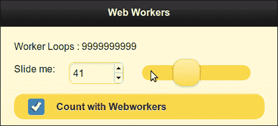

## 还有更多……

在所有浏览器中可能并不支持 Web Workers。您可以通过调用以下代码来检查应用程序中对 Web Worker 的支持情况，该代码检查 `window` 对象的 `Worker` 属性是否存在。如果未定义，则表示不支持该功能。

```js
if (!!window.Worker)
  // Web workers are supported
else
  // Web workers are not supported
```

### 使用 Modernizr 检查 Web Worker 的支持

**Modernizr**（位于 [`www.modernizr.com`](http://www.modernizr.com)）是一个非常受欢迎和方便的库，可用于检测浏览器中对 Web Worker 和其他 HTML5 和 CSS3 功能的支持。它提供 **polyfills** 或 **fallbacks** ，以防某个属性在浏览器中不受支持。它使用 **MIT** **许可证** ，可以自由使用。如果您的浏览器支持 Web Workers，`Modernizr.webworkers` 属性将被定义和可用。

## 另请参阅

+   *改进速度并使应用离线* 配方

# 使用本地和会话存储

**Cookies** 曾是以前用于存储客户端信息的机制。但是一个 cookie 只能存储最多 4 KB 的数据，这些数据将随每个请求发送到服务器。**Web Storage** 是在 HTML5 中引入的客户端存储标准。它有两种类型：**本地存储** 和 **会话存储** 。会话存储中存储的数据在用户会话处于活动状态时可用，并在会话结束后丢失。本地存储中的数据在会话之间持久存在。该配方向您展示如何使用本地存储和会话存储。

## 准备工作

从 `code/11/storage` 文件夹复制此配方的全部代码。您可以使用以下 URL 启动此代码：`http://localhost:8080/11/storage/main.html`。

## 如何做到……

应遵循的步骤为：

1.  创建带有三个文本字段和一个 **保存** 按钮的 `main.html`：

    ```js
    <div data-role='content'>
      <div data-role='fieldcontain'>
        <label for='nostore'>No Storage</label>
        <input type="text" id="nostore" name="nostore" 
          autofocus placeholder="Enter text" value="" />
      </div>
      <div data-role='fieldcontain'>
        <label for='sessionstore'>Session Storage</label>
        <input type="text" id="sessionstore" 
          name="sessionstore" placeholder="Enter text" 
          value="" />
      </div>
      <div data-role='fieldcontain'>
        <label for='localstore'>Local Storage</label>
        <input type="text" id="localstore" name="localstore" 
          placeholder="Enter text" value="" />
      </div>
      <button id='savebtn'>Save</button>
    </div>
    ```

1.  将以下脚本添加到点击**保存**按钮以保持文本字段内容的持久性：

    ```js
    $('#main').live('pageinit', function(event) {
      $('#savebtn').bind('click', function(event, ui) {
     window.localStorage.setItem('localval', $('#localstore').val());
     window.sessionStorage.setItem('sessionval', $('#sessionstore').val());
      });
    });
    ```

1.  最后，在显示页面时恢复持久化的值：

    ```js
    $('#main').live('pageshow', function(event, data) {
     $('#localstore').val(window.localStorage.getItem('localval'));
     $('#sessionstore').val(window.sessionStorage.getItem('sessionval')); 
    });
    ```

1.  刷新页面，然后稍后关闭并重新打开页面，查看这些持续存在的值在单个会话和多个会话中的行为如何。

## 它是如何工作的...

添加三个带有 ID 的文本：`nostore`、`sessionstore` 和 `localstore`。添加一个带有`id='savebtn'`的按钮，并将其`click`事件绑定到`pageinit`事件处理程序中的回调函数。在回调函数中，通过在`window.sessionStorage`和`window.localStorage`对象上分别调用`setItem()`方法并使用唯一键（`localval` 和 `sessionval`）来持久化文本字段。

要在页面重新加载或刷新时恢复这些持久化的值，请向`pageshow`事件添加事件处理程序。将`localval`键传递给`window.localStorage.getItem()`函数以从本地存储中读取。将`sessionval`键传递给`window.sessionStorage.getItem()`以从会话存储中读取。将这些值设置到相应的文本字段中。

应用程序加载时，请输入文本值，然后单击**保存**按钮以使它们持久化。

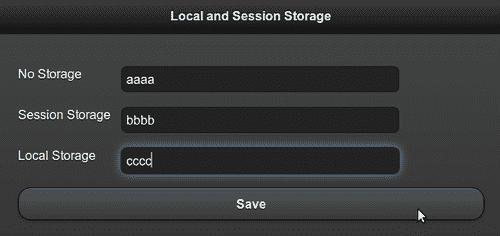

接下来，刷新浏览器以重新加载页面。会话仍然存在，您将看到本地和会话存储值被恢复。第一个字段被清除，因为它没有被持久化，如下图所示：

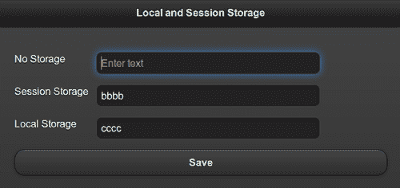

最后，关闭应用程序并重新打开它。这次，会话已终止。您将看到只显示**本地存储**数据，其他两个文本字段已清除：

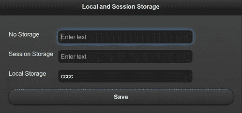

## 还有更多...

不同浏览器可能不支持 Web 存储功能。您可以通过运行以下代码检查`window`对象是否具有有效的`localstorage`或`sessionStorage`属性以验证您是否可以使用该功能：

```js
If (('localStorage' in window) && window['localStorage'] !== null)
  // Local storage is supported
If (('sessionStorage' in window) && window['sessionStorage'] !== null)
  // Session storage is supported
```

您还可以使用免费的`Modernizr`库来测试 Web 存储支持，方法是检查`Modernizr.localstorage`和`Modernizr.sessionstorage`属性是否有效。

### 检查 Web 存储

您可以在浏览器中打开开发者工具，检查浏览器中存储的本地和会话存储的当前键值集。以下截图显示了在此示例中保存的本地存储键值：

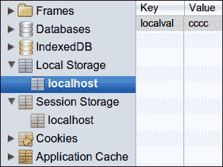

以下截图显示了使用**会话存储**存储的键值：

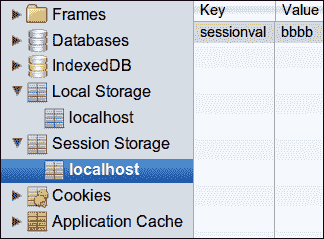

### WebSQL 存储

WebSQL 存储是 HTML5 中定义的另一个功能，用于存储客户端数据。它使用 SQLite 查询执行数据操作。IE 和 Firefox 都不支持此功能。此规范已不再维护，并且可能会在未来被放弃。

### IndexedDB 存储

**IndexedDB 存储** 是使用索引数据查询的另一种形式的客户端存储。在编写本教程时，只有 Firefox 和 Chrome 浏览器很好地支持此功能。旧版 IE、Safari 和 Opera 不支持此功能。

# 使用 Canvas 进行 2D 绘图

**Canvas** 是您的网页中的矩形区域，您可以使用 JavaScript 绘制 2D 形状，并渲染位图图像。它用于图表、动画、图像、照片合成、实时视频处理和游戏。本教程向您展示了如何在 jQuery Mobile 应用程序中使用 Canvas。

## 准备就绪

从 `code/11/canvas` 文件夹中复制本教程的完整代码。您可以使用以下 URL 启动此代码：`http://localhost:8080/11/canvas/main.html`。

## 如何做...

应遵循的步骤是：

1.  创建带有 `canvas` 元素的页面内容的 `main.html`：

    ```js
    <div data-role='content'>
     <canvas id="myCanvas" width="500" height="500">
        Canvas is not supported on your browser
      </canvas>
    </div>
    ```

1.  添加以下脚本以获取 2D 上下文，然后绘制两个矩形：

    ```js
    $('#main').live('pageinit', function(event) {
     var cxt = $('#myCanvas')[0].getContext("2d");
      cxt.fillStyle = '#5f98c5';
      cxt.fillRect(20,20, 100, 100);
      cxt.strokeRect(10,10,120, 120);
    });
    ```

## 工作原理...

创建 `main.html`，并在 `#main` 页面上添加一个 `id='mycanvas'` 的 `<canvas>` 元素，宽度和高度均为 `500` 像素。如果浏览器不支持 Canvas 功能，则显示文本 **Canvas is not supported on your browser**。接下来，在 `pageinit` 回调函数中添加脚本以获取 `mycanvas` 元素的 2D 上下文 (`cxt`)。将 `cxt` 的 `fillStyle` 定义为灰色阴影 `#5f98c5`。现在，使用 `fillRect()` 绘制一个填充的矩形，传递原点、长度和宽度作为参数。接下来，使用 `strokeRect()` 绘制一个没有填充的矩形轮廓。屏幕现在显示如下截图所示：

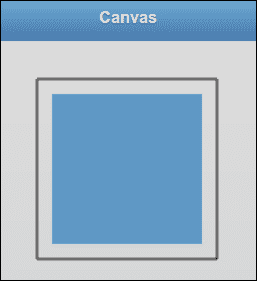

## 还有更多...

本教程只是对 Canvas 元素进行了基本介绍，并向您展示了如何在 jQuery Mobile 应用程序中使用它。Canvas 是一个非常强大的元素，支持各种 API。您可以设置颜色、样式、渐变、图案、字体和文本对齐方式。您可以绘制几何形状，如线条、矩形、路径、弧线和贝塞尔曲线。画布支持变换 API，如缩放、旋转、平移和变换。您可以绘制图像，也可以在像素级别对其进行操作。Canvas 有助于图像合成。您还可以将画布的绘制状态保存在堆栈中，并从堆栈中恢复任何以前保存的绘制状态。

### 注意

在画布上绘制的元素采用绝对坐标。因此，在使用这些值时，请注意目标设备的实际屏幕尺寸。

## 另请参阅

+   *在 SVG 图像上应用高斯模糊* 教程

# 在 SVG 图像上应用高斯模糊

**可缩放矢量图形** (**SVG**) 是用于 2D 可缩放矢量图形的一系列规范。它们基于 XML，可以是静态的或动态的（动画或交互式）。本教程向您展示了如何在应用程序中使用 SVG 图像，并在单击时应用高斯滤镜。

## 准备就绪

从 `code/11/svg` 文件夹中复制此示例的完整代码。SVG 图像位于 `code/resources/images` 文件夹中。您可以使用以下 URL 启动此代码：`http://localhost:8080/11/svg/main.html`。

## 如何做...

需要遵循的步骤是：

1.  在页面内容中创建 `main.html`，其中包含一个 SVG 元素。绘制一个 SVG 矩形，并在矩形内显示 SVG 图像：

    ```js
    <div data-role='content'>
      <svg  version="1.1">
        <defs>
          <filter id="gausfilter" x="0" y="0">
     <feGaussianBlur in="SourceGraphic" 
     stdDeviation="5" />
          </filter>
        </defs>
     <rect width="180px" height="220px" x='10' y='10'
     style="fill:none;stroke-
     width:2;stroke:rgb(0,0,0)"/>
        <image id='svgimg' width='160px' height='200px' 
          x='20' y='20' 
          xlink:href='../../resources/images
          /Chrisdesign_green_comic_egg.svg'>
        </image>
      </svg>
    </div>
    ```

1.  当点击图像时，将 Guassian 滤波器应用于 SVG 图像：

    ```js
    $('#main').live('pageinit', function(event) {
      $('#svgimg').bind('click', function(event, ui) {
     $(this).attr('filter', 
     'url(#gausfilter)').trigger('refresh'); 
      });
    });
    ```

## 它是如何工作的...

创建 `main.html`，并在其页面内容中添加一个 `<svg>` 元素。如代码所示，指定 SVG 命名空间和版本。使用 `<rect>` 元素创建一个矩形，并指定其属性，如宽度、高度、x 和 y 位置，还设置其 `stroke` 样式。接下来，添加一个 `id='svgimg'` 指向 SVG 图像的 `<image>` 元素，并指定要使用的图像的位置、位置和大小。加载页面时，将显示以下截图：


现在，通过在 `<defs>` 元素内部添加 `id='gausfilter'` 的 `<filter>` 元素来定义高斯滤波器。在 `<filter>` 内部添加 `<feGaussianBlur>` 元素，并设置标准差为 `5`。最后，在 `pageinit` 回调函数中将 `click` 事件绑定到 `#svgimg` 图像上的事件处理程序。在这里，使用 jQuery 的 `attr()` 调用向 `<image>` 标签添加 `filter='gausfilter'` 属性。现在，当你点击 SVG 图像时，高斯模糊将被应用，如下截图所示：


## 还有更多...

SVG 支持矢量图形、光栅图形和文本元素。它允许您在 SVG 图像上进行变换、裁剪路径、应用 alpha 蒙版和滤镜效果。本示例中使用的 SVG 图像是由 ChrisDesign ([`chrisdesign.wordpress.com`](http://chrisdesign.wordpress.com)) 设计并贡献给 *Open Clipart* 网站 ([`openclipart.org`](http://openclipart.org)) 的。Open Clipart 网站还有成千上万的免费 SVG 图像可供使用，属于公共领域。

### SVG Tiny 规范

**SVG Tiny**（**SVGT**）规范有一个移动版，目前 SVGT v1.2 是 W3C 的推荐标准。它在大多数移动设备和平台上得到良好支持，而且支持程度每天都在不断提高。

## 另请参阅

+   *使用 Canvas 进行 2D 绘图* 示例

# 使用 Geolocation API 跟踪您的位置

**地理位置 API** 是一个独立的规范，是 HTML5 技术栈的一部分。您可以使用 JavaScript 并使用各种技术（如 IP 地址、Wi-Fi、GSM/CDMA 小区 ID 或设备全球定位系统（GPS））定位客户端设备的位置。本示例向您展示了如何在应用程序中使用 Geolocation API 查找当前位置。

## 准备工作

从 `code/11/geolocation` 文件夹中复制此示例的完整代码。您可以使用以下 URL 启动此代码：`http://localhost:8080/11/geolocation/main.html`。

## 如何做...

要遵循的步骤是：

1.  创建一个空的 `div` 标签 `main.html` 来显示地理位置信息。

    ```js
    <div data-role='content'>
      <p>You current Position is ...</p>
      <div id='geopos'></div>
    </div>
    ```

1.  调用 `getCurrentPosition()` 方法使用 `show_pos()` 回调函数获取当前位置。

    ```js
    $('#main').live('pageinit', function(event) {
      if (navigator.geolocation)
     navigator.geolocation.getCurrentPosition(show_pos);
      else
        $('#geopos').html('Error: Unable to get your position!');
    });
    ```

1.  最后，在 `show_pos()` 回调函数中显示当前位置：

    ```js
    function show_pos(pos) {
      var geostr = '<p>Latitude (deg): ' 
        + pos.coords.latitude
        + '</p><p>Longitude (deg): ' + pos.coords.longitude
        + '</p><p>Altitude (m): ' + pos.coords.altitude
        + '</p><p>Accuracy (m): ' + pos.coords.accuracy
        + '</p><p>AltitudeAccuracy (m): ' 
        + pos.coords.altitudeAccuracy
        + '</p><p>Heading (deg): ' + pos.coords.heading
        + '</p><p>Speed (m/s): ' + pos.coords.speed
        + '</p><p>Timestamp: '+ pos.timestamp;
      $('#geopos').html(geostr);
    }
    ```

## 工作原理...

创建 `main.html`，并向 `#main` 页面添加一个空的 `div` 标签，其 `id='geopos'` 用于显示位置信息。使用 `pageinit` 事件处理程序首先检查是否可用 `navigator.geolocation` 对象。如果可用，调用 `getCurrentPosition()` 方法并使用回调函数 `show_pos()` 获取位置信息。`show_pos()` 回调函数可以访问位置 (`pos`) 对象，该对象具有当前位置的各种属性。访问 `pos.coords` 以获取诸如纬度、经度、高度和精度等信息。`pos` 对象还具有与当前位置读数相关联的时间戳。现在，在 `#geopos` 的 `div` 属性中显示位置详细信息。

当您启动应用时，浏览器首先会询问您是否同意访问位置信息。一旦您同意，以下位置详情将显示在屏幕上：

### 注意

Geolocation API 规范要求用户位置信息是机密的，并且浏览器在访问或分享此信息之前应发出警告并获得用户的许可。

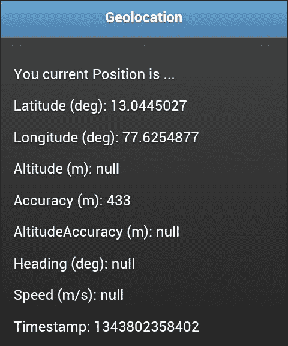

## 还有更多...

在这个示例中，`getCurrentPosition()` 调用仅一次获取用户位置，并使用 `show_pos()` 回调函数显示信息。但是，如果您希望跟踪移动设备，可以使用 `watchCurrentPosition()` 调用获取连续的位置读数。语法保持不变，但此方法持续并定期获取设备位置并在每次调用时调用 `show_pos()` 回调。此方法还填充 `pos.coords.speed` 和 `pos.coords.heading` 属性，以提供有关移动设备速度和方向的反馈。用户仅在第一次调用时被提示共享位置详细信息的权限。

```js
if (navigator.geolocation)
 navigator.geolocation.watchCurrentPosition(show_pos);

```

### Google Gears

在 Geolocation API 规范之前，Google Gears JavaScript 库非常流行，用于获取位置信息。随后，Google Gears 对 Geolocation API 的发展做出了相当大的贡献，并且现已被弃用。

### 桌面浏览器上的地理位置

在桌面浏览器上获取的位置信息基于从 ISP 服务器获取的 IP 和 MAC 地址详细信息。因此，此信息具有较大的精度范围，有时在几公里范围内，而移动设备依赖于网络基站和 GPS 设备（如果已启用）来进行定位。因此，移动设备可以在几米范围内非常准确地确定位置、高度、速度和方向信息。

# 使用 <audio> 元素播放音乐

HTML5 引入了一个新的`<audio>`元素，可以直接在浏览器中播放音频文件。在此之前，浏览器必须使用插件，如 Flash Player、Real Player 或 Quick Time 来播放音频文件。`<audio>`元素提供了一个轻量级的替代方案，本示例向您展示如何在您的应用程序中使用它来播放音频文件。

## 准备工作

从`code/11/audio`文件夹复制此示例的完整代码。音频片段可在`code/resources/audio`文件夹中找到。您可以使用以下网址启动此代码：`http://localhost:8080/11/audio/main.html`。

## 如何实现...

需要遵循的步骤是：

1.  在页面内容中创建带有`<audio>`元素的`main.html`：

    ```js
    <div data-role='content'>
     <audio controls autoplay preload='auto'>
        <source src='../../resources/audio/song.mp3' 
          type='audio/mpeg' /> 
        <source src='../../resources/audio/song.oga' 
          type='audio/ogg' /> 
        <source src='../../resources/audio/song.webma' 
          type='audio/webm' /> 
        <p>Browser does not support audio tag</p>          
      </audio>
    </div>
    ```

## 工作原理...

在`#main`页面上添加`<audio>`元素，并使用`controls`、`autoplay`和`preload`属性。`controls`属性显示播放按钮、音量滑块和其他控件。`preload='auto'`选项表示浏览器可以在页面准备好后立即开始流式传输音频文件。`autoplay`属性告诉浏览器可以在下载和准备好时直接开始播放音频文件。

### 注意

`<audio>`元素还支持`loop`属性，使音频以连续循环的方式播放。

不同的浏览器支持不同的音频格式，并选择并播放第一个受支持的音频格式。因此，使用`<source>`元素添加`.mp3`、`.oga`和`.webma`格式的音频文件的 URL 链接，如代码所示。这三种音频格式中的一种将被大多数浏览器识别。最后，在末尾添加错误消息`浏览器不支持音频标签`。如果浏览器不支持`audio`元素，则会显示此消息。现在，当您加载页面时，将看到类似以下的截图，并且音频文件开始播放：


## 还有更多...

较旧的浏览器，如 IE8，不支持`<audio>`元素。在这种情况下，您将需要使用 Flash 回退机制。

有关音频格式和编解码器、使用 Flash 回退和 HTML5 媒体播放器的注意事项，请参阅下一个有关`<video>`元素的示例。

## 另请参阅

+   使用`<audio>`元素查看视频的*Viewing videos with the <video> element*示例

# 使用`<video>`元素查看视频

HTML5 引入了一个新的`<video>`元素，可以直接在浏览器中播放视频文件。在此之前，浏览器必须使用插件，如 Flash Player、Real Player 或 Quick Time 来播放视频文件。`<video>`元素是一个轻量级的替代方案，本示例向您展示如何在您的应用程序中使用它来查看视频。

## 准备工作

从`code/11/video`文件夹复制此示例的完整代码。视频片段可在`code/resources/video`文件夹中找到。您可以使用以下网址启动此代码：`http://localhost:8080/11/video/main.html`。

## 如何实现...

需要遵循的步骤是：

1.  在页面内容中创建带有`<video>`元素的`main.html`：

    ```js
    <div data-role='content'>
     <video controls autoplay preload='auto' width='300' 
     height='300'>
        <source src='../../resources/video/spiral.mp4' 
          type='video/mpeg' /> 
        <source src='../../resources/video/spiral.ogv' 
          type='video/ogg' /> 
        <source src='../../resources/video/spiral.webmv' 
          type='video/webm' /> 
        <p>Browser does not support video tag</p>
      </video>
    </div>
    ```

## 工作原理...

在`#main`页面上添加`<video>`元素，带有`controls`，`autoplay`和`preload`属性。`controls`属性显示播放按钮、音量滑块、全屏按钮和其他控件。`preload='auto'`选项表示浏览器可以在页面准备就绪后立即开始流式传输视频文件。`autoplay`属性告诉浏览器可以在准备就绪时直接播放视频。此外，添加`width`和`height`属性以像素为单位调整视频大小。

不同的浏览器支持不同的视频格式，并选择并播放第一个受支持的视频格式。因此，使用`<source>`元素向`.mp4`，`.ogv`和`.webmv`格式的视频文件添加 URL 链接，如示例代码所示。这三种视频格式中的一种将被大多数浏览器识别。最后，在末尾添加错误消息`浏览器不支持视频标签`。如果浏览器不支持视频元素，则显示此消息。现在，当您加载页面时，将显示类似以下内容的屏幕截图，并且视频文件开始播放：

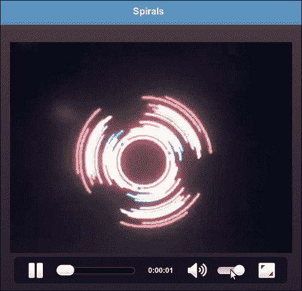

## 还有更多...

`<video>`标签还支持一些额外的属性，如`loop`（以连续循环播放视频）、`muted`（关闭音频）和`poster`（在视频开始播放之前作为海报显示的图像的 URL）。

### 注

将`preload`设置为`auto`以自动下载媒体文件，因为一些浏览器出于安全原因不支持`preload`。

### 闪回

较旧的浏览器，如 IE8，不支持`<video>`和`<audio>`元素。您仍然可以通过使用 Flash 播放器作为后备机制在不受支持的浏览器中播放 HTML5 音频和视频。您必须在`<video>`或`<audio>`元素的末尾使用`<object>`标签嵌入播放器。在这种情况下，浏览器不识别新的 HTML5 标签，并继续使用 Flash 后备播放音频/视频。

### 编解码器

当今网络上有多种流行的音频/视频格式。不同浏览器的支持程度各异，只支持特定的音频/视频编解码器。您必须通过包括同一音频/视频文件的不同格式（必要时）来确保您的应用程序在最大平台上正常工作，如本文所示。有关此事的详细信息，包括显示支持矩阵的表格，请参见[`diveintohtml5.info/video.html`](http://diveintohtml5.info/video.html)。

### 音频和视频 API

**音频 API** 和 **视频 API** 现在已经可以直接使用 JavaScript 控制 `<audio>` 和 `<video>` 元素。它们允许您触发操作（播放、暂停等）并监听事件（播放、结束等）。

### HTML5 媒体播放器

HTML5 标签本身提供了非常简单的 UI 和控件。你可以使用音频和视频 API 来增强外观和功能。另外，你也可以很轻松地使用任何流行的库，比如**jPlayer**（[`jplayer.org`](http://jplayer.org)）、**MediaElement.js**（[mediaelementjs.com](http://mediaelementjs.com)）、**JW Player**（[`longtailvideo.com`](http://longtailvideo.com)）、**Video.js**（[`videojs.com`](http://videojs.com)）以及**Audio.js**（[`kolber.github.com/audiojs/`](http://kolber.github.com/audiojs/)）。

## 另请参阅

+   *使用 <audio> 元素播放音乐* 示例
