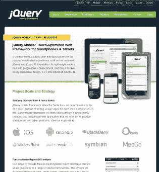
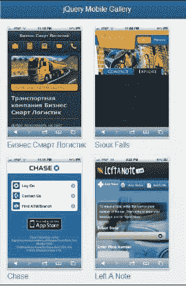
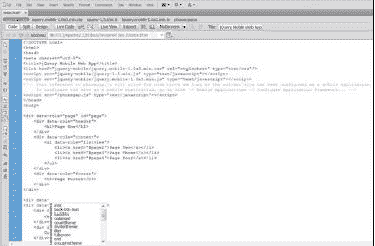

# 序言

# 什么是 jQuery Mobile？

在将近两年之前的 2010 年 8 月 11 日，John Resig（jQuery 的创建者）宣布了 jQuery Mobile 项目。虽然重点是 UI 框架，但这也是对 jQuery 本身作为移动网站工具的认可，以及将对核心框架本身进行工作，使其在设备上运行更顺畅。随着版本的发布，jQuery Mobile 项目逐渐演变成一个强大的框架，每次更新都融合了更多的平台、更多的功能和更好的性能。

但是当我们说 *UI 框架* 时，我们是指什么？这对开发人员和设计师意味着什么？jQuery Mobile 提供了一种将常规 HTML（和 CSS）转换为移动友好站点的方法。正如您将很快在第一章中看到的，您可以取一个常规的 HTML 页面，加入 jQuery Mobile 所需的部分（基本上是五行 HTML），然后发现您的页面立即转变为移动友好版本。

与其他框架不同，jQuery Mobile 专注于 HTML。事实上，作为与 jQuery 绑定的框架，您可以在不写一行 JavaScript 的情况下完成大量工作。这是一种强大、实用的创建移动网站的方式，任何现有 HTML 开发人员都可以在几小时内掌握并调整。将此与其他框架进行比较，比如 Sencha Touch。Sencha Touch 也是一个强大的框架，但其方法与众不同，使用 JavaScript 来帮助定义和布局页面。jQuery Mobile 对于熟悉 HTML 而不是 JavaScript 的人更加友好。jQuery Mobile 是*触摸友好*的，这对于任何曾经使用过智能手机并苦于在网站上点击准确位置的人都是有意义的。对于任何无意中点击重置按钮而不是提交按钮的人也是有意义的。jQuery Mobile 将增强您的内容以帮助解决这些问题。常规按钮变成了大、厚实且易于点击的按钮。链接可以转变为基于列表的导航系统。内容可以分割成具有平滑动画效果的虚拟页面。您会惊讶地发现，jQuery Mobile 几乎不需要编写代码就能工作得很好。

jQuery Mobile 有一些非常大的赞助商。它们包括诺基亚、黑莓、Adobe 和其他大公司。这些公司投入了资金、硬件和开发资源，以帮助确保该项目的成功： 



## 成本是多少？

啊，百万美元问题。幸运的是，这个问题很容易回答：什么也不需要。像 jQuery 本身一样，jQuery Mobile 完全免费供任何目的使用。不仅如此，它完全开源。不喜欢某些功能的工作方式？您可以更改它。希望有些框架不支持的功能？您可以添加它。公平地说，深入挖掘代码库可能是大多数人不太愿意做的事情。然而，您需要知道的是，如果有需要，您可以这样做，而其他人也可以这样做，这导致了一个社区可以共同开发的产品。

## 您需要了解什么？

最后，除了不花一分钱获取并使用 jQuery Mobile 外，最好的事情可能是您可能已经具备了使用该框架所需的所有技能。正如您将在接下来的章节中看到的，jQuery Mobile 是基于 HTML 的框架。如果您了解 HTML，即使只是简单的 HTML，您也可以使用 jQuery Mobile 框架。了解 CSS 和 JavaScript 是一种优势，但并非完全必需的。（虽然 jQuery Mobile 在幕后使用了大量 CSS 和 JavaScript，但您实际上不必自己编写任何内容！）

## 那么原生应用程序呢？

jQuery Mobile 并不创建原生应用程序。您将在本书后面看到，如何将 jQuery Mobile 与 *包装器* 技术（如 PhoneGap）结合起来创建原生应用程序，但总的来说，jQuery Mobile 是用于构建网站的。关于开发网站还是移动应用程序的问题并非本书可以回答的。您需要查看您的业务需求并确定哪种方式会满足它们。因为我们不是在构建移动应用程序本身，所以您不必担心在 Google 或 Apple 上设置任何帐户，也不必为市场支付任何费用。任何带有浏览器的移动设备用户都可以查看您的移动优化网站。

再次强调 - 如果您想使用 jQuery Mobile 开发真正的移动应用程序，这绝对是一个选项。

## 求救！

虽然我们希望这本书涵盖您所有 jQuery Mobile 需要的每一个可能的主题，但很可能会有一些我们无法涵盖的内容。如果您需要帮助，有几个地方您可以尝试。

其次，jQuery Mobile 文档 ([`jquerymobile.com/demos/1.0/`](http://jquerymobile.com/demos/1.0/))，涵盖了语法、功能和一般开发，与本书类似。虽然内容可能有些重复，但如果您在这里发现有些内容令人困惑，请尝试官方文档。有时，第二个解释确实可以帮助理解。

首先，jQuery Mobile 论坛 ([`forum.jquery.com/jquery-mobile`](http://forum.jquery.com/jquery-mobile))，是一个开放式讨论列表，讨论 jQuery Mobile 主题。这是提问的完美场所。此外，这也是了解其他人遇到的问题的好地方。您甚至可能能够帮助他们。学习新主题的最佳方式之一就是帮助他人。

## 例子

想要看看 jQuery Mobile 的实际效果吗？有一个网站可以满足您。JQM Gallery ([`www.jqmgallery.com/`](http://www.jqmgallery.com/))，是用户提交的使用 jQuery Mobile 构建的网站集合。毫不奇怪，这个网站也使用了 jQuery Mobile，这使它成为另一种抽样 jQuery Mobile 的方式：



# 本书涵盖内容

第一章，*准备您的第一个 jQuery Mobile 项目*，指导您完成第一个 jQuery Mobile 项目。它详细说明了必须添加到项目目录和源代码中的内容。

第二章，*处理 jQuery Mobile 页面*，延续了上一章的工作，并介绍了 jQuery Mobile 页面的概念。

第三章，*用页眉、页脚和工具栏增强页面*，解释了如何使用精美格式化的页眉和页脚增强您的页面。

第四章，*列表处理*，描述了如何创建 jQuery Mobile 列表视图。这些是移动优化的列表，特别适用于导航。

第五章，*实践 —— 构建一个简单的酒店移动网站*，引导您创建您的第一个“真实”（尽管简单）的 jQuery Mobile 应用程序。

第六章，*处理表单和 jQuery Mobile*，解释了使用 jQuery Mobile 优化的表单的过程。布局和特殊表单功能都有详细介绍。

第七章，*创建模态对话框、网格和可折叠块*，指导您使用 jQuery Mobile 特有的用户界面项目来创建基于网格的布局、对话框和可折叠内容区域。

第八章，*jQuery Mobile 配置、工具和 JavaScript 方法*，描述了您的代码可能需要的各种基于 JavaScript 的实用工具。

第九章，*处理事件*，详细说明了由各种 jQuery Mobile 相关功能引发的事件，例如页面加载和卸载。

第十章，*进一步操作 Notekeeper 移动应用程序*，指导您完成创建另一个网站的过程，一个增强了 HTML5 的笔记应用程序。

第十一章，*增强 jQuery Mobile*，演示了如何通过选择和创建独特主题来更改您的 jQuery Mobile 站点的默认外观。

第十二章, *创建原生应用*，将之前学习的内容进行扩展，说明如何使用开源项目 PhoneGap 创建真正的原生应用。

第十三章, *成为专家 ­ 构建一个 RSS 阅读器应用*，通过创建一个可以让您在移动设备上添加和阅读 RSS 订阅的应用，对之前的章节进行了拓展。

# 您为本书所需的内容

无需什么！技术上您需要一台计算机，还有一个浏览器，但是 jQuery Mobile 是用 HTML、CSS 和 JavaScript 构建的。与框架一同工作时不需要集成开发环境（IDE）或特殊工具。如果您的系统上有任何编辑器（所有操作系统都包括某种免费编辑器），您都可以使用 jQuery Mobile 进行开发。

有一些可以帮助您更加高效的好的集成开发环境。例如，Adobe Dreamweaver CS 5.5 可以原生支持 jQuery Mobile，包括代码辅助和设备预览：

 

总的来说，您可以免费使用 jQuery Mobile 进行开发。您可以免费下载、开发和发布 jQuery Mobile 站点。

# 本书适合人群

本书适用于任何希望拥抱移动开发并将技能扩展到桌面之外的人。

# 惯例

在本书中，您会发现一些文本样式，用于区分不同类型的信息。以下是这些样式的一些示例，以及它们的含义解释。

文本中的代码词显示如下："注意到添加到 `div` 标签的新`data-title`标签。"

代码块设置如下：

```js
<html>
<head>
<meta name="viewport" content="width=device-width, initial- scale=1">
<title>Multi Page Example</title>

```

**新术语**和**重要单词**以粗体显示。屏幕上看到的单词，比如菜单或对话框中出现的单词，如下文所示："想象一下我们的**Megacorp**页面。它有三个页面，但**产品**页面是单独的 HTML 文件。"

### 注意 

警告或重要说明会以这样的方式显示。

### 提示

提示和技巧以这种方式出现。
