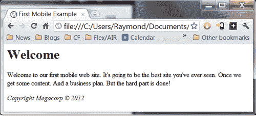
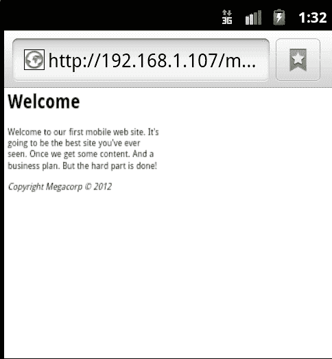
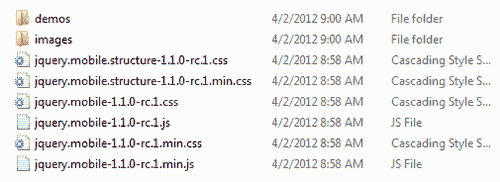
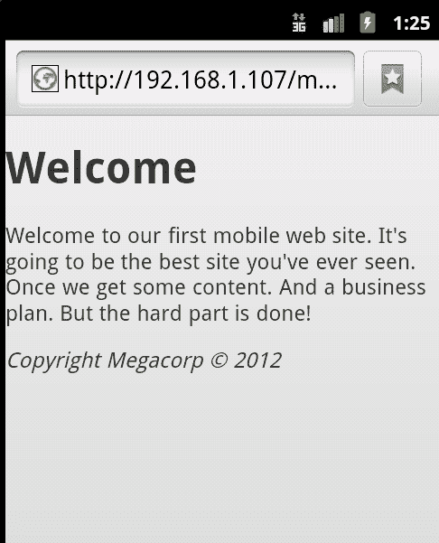

# 第一章：准备你的第一个 jQuery Mobile 项目

你知道 jQuery Mobile 是什么，它的历史以及它的特点和目标。现在我们实际上要构建我们的第一个 jQuery Mobile 网站（好吧，网页），看看它的使用是多么简单。

在本章中我们将：

+   创建一个简单的 HTML 页面

+   将 jQuery Mobile 添加到页面中

+   利用自定义数据属性（data-*）

+   更新 HTML 以利用 jQuery Mobile 认可的数据属性

# 重要的初步要点

你可以在你从 Github 下载的 ZIP 文件的 c1 文件夹中找到本章的所有源代码。如果你想手工输入所有内容，我们建议你使用类似的文件名。

# 构建一个 HTML 页面

让我们从一个不是移动优化的简单网页开始。明确地说，我们并不是说它不能在移动设备上使用。完全不是。但是在移动设备上可能*使用起来*可能不太方便。它可能很难阅读（文本太小）。它可能太宽。它可能使用在触摸屏上工作不好的表单。我们根本不知道会有什么样的问题，直到我们开始测试。（我们都在移动设备上测试过我们的网站，看看它们的工作情况，对吧？）

让我们看一看 `列表 1-1：`

```js
Listing 1-1: test1.html
<html>
<head>
<title>First Mobile Example</title>
</head>
<body>
<h1>Welcome</h1>
<p>
Welcome to our first mobile web site. It's going to be the best site you've ever seen. Once we get some content. And a business plan. But the hard part is done!
</p>
<p>
<i>Copyright Megacorp &copy; 2012</i>
</p>
</body>
</html>

```

正如我们所说的，没有什么太复杂的，对吧？让我们在浏览器中快速看一下这个：



### 注意

您还可以从您在 [`www.packtpub.com`](http://www.packtpub.com) 购买的所有 Packt 图书的帐户中下载示例代码文件。如果您在其他地方购买了这本书，您可以访问 [`www.packtpub.com/support`](http://www.packtpub.com/support) 并注册，将文件直接发送到您的邮箱。

没那么糟糕，对吧？但是让我们在移动模拟器中看看同样的页面：



哇，这太小了。你可能在移动设备上以前见过这样的网页。当然，你通常可以使用捏和缩放或双击操作来增大文本的大小。但是最好立即以移动友好的视图呈现页面。这就是 jQuery Mobile 的作用所在。

# 获取 jQuery Mobile

在前言中，我们谈到了 jQuery Mobile 只是一组文件。这并不是为了减少创建这些文件所需的工作量，或者它们有多么强大，而是为了强调使用 jQuery Mobile 意味着您不需要安装任何特殊工具或服务器。您可以下载这些文件并简单地将它们包含在您的页面中。如果这样做对您来说太麻烦，您甚至有一个更简单的解决方案。jQuery Mobile 的文件托管在内容交付网络（CDN）上。这是他们托管的资源，并保证（尽可能保证）在线并可用。已经有多个网站在使用这些 CDN 托管的文件。这意味着当用户访问您的站点时，他们已经在他们的缓存中具有了这些资源。对于本书，我们将使用 CDN 托管的文件，但是对于这个第一个示例，我们将下载并提取这些文件。我建议无论如何都这样做，因为有时候当您在飞机上时想要迅速创建一个移动站点时。

要获取这些文件，请访问 [`jquerymobile.com/download`](http://jquerymobile.com/download)。这里有几个选项，但您需要选择 ZIP 文件选项。继续下载该 ZIP 文件并解压缩它。（您之前从 Github 下载的 ZIP 文件已经包含了一份拷贝。）下面的截图演示了从 ZIP 文件中提取文件后应该看到的内容：



### 注意

重要说明：在撰写本书时，jQuery Mobile 正在准备发布 1.1 版本。已发布的版本是 1.0.1。但是，由于 1.1 版本即将发布，因此正在使用该版本。显然，在您阅读本书时，可能会发布更高版本。您在前面截图中看到的文件名是特定于版本的，因此请记住它们在您那里可能会有所不同。

注意 ZIP 文件包含了用于 jQuery Mobile 的 CSS 和 JavaScript 文件，以及它们的压缩版本。通常情况下，在生产应用程序中您会想要使用压缩版本，在开发过程中使用常规版本。图像文件夹包含了 6 张图像，在生成移动优化页面时由 CSS 使用。因此，明确地说，整个框架，以及本书余下部分将要讨论的所有功能，都将由 8 个文件的框架组成。当然，您还需要包含 jQuery 库。您可以在 [www.jquery.com](http://www.jquery.com) 分别下载。

# 实现 jQuery Mobile

好的，我们已经获取了这些文件，如何使用它们呢？要将 jQuery Mobile 支持添加到网站中，至少需要以下三个步骤：

1.  首先在页面中添加 HTML 5 doctype：`<!DOCTYPE html>`。这用于帮助通知浏览器将要处理的内容类型。

1.  添加视口元标记：`<meta name="viewport" content="width=device-width, initial-scale="1">`。这有助于在移动设备上查看页面时设置更好的默认值。

1.  最后 - 必须将 CSS、JavaScript 库和 jQuery 本身包含到文件中。

让我们看看修改后的上一个 HTML 文件，添加了以上所有内容：

```js
Listing 1-2: test2.html
<!DOCTYPE html>
<html>
<head>
<title>First Mobile Example</title>
<meta name="viewport" content="width=device-width, initial- scale=1">
<link rel="stylesheet" href ="jquery.mobile-1.1.0-rc.1.css" />
<script type="text/javascript" src ="http://code.jquery.com/jquery-1.7.1.min.js"></script>
<script type="text/javascript" src="img/jquery.mobile-1.1.0- rc.1.min.js"></script>
</head>
<body>
<h1>Welcome</h1>
<p>
Welcome to our first mobile web site. It's going to be the best site you've ever seen. Once we get some content. And a business plan. But the hard part is done!
</p>
<p>
<i>Copyright Megacorp &copy; 2012</i>
</p>
</body>
</html>

```

大部分情况下，这个版本和`listing 1`完全一样，只是增加了 doctype、CSS 链接和我们的两个 JavaScript 库。请注意，我们指向了托管版本的 jQuery 库。混合本地 JavaScript 文件和远程文件是完全可以的。如果你想确保可以离线工作，你也可以简单地下载 jQuery 库。

因此，在`body`标签之间的代码没有变化，但是在浏览器中现在会有一个完全不同的视图。下面的截图显示了安卓手机浏览器现在如何呈现该页面：



立即看到了一些差异。最大的区别是文本的相对大小。注意它有多大，更容易阅读。正如我们所说，用户可以放大上一个版本，但许多移动用户并不知道这种技巧。这个页面立即加载，更适用于移动设备。

# 使用数据属性操作

正如我们在前面的例子中看到的，只需添加 jQuery Mobile 就可以大大更新我们页面以支持移动设备。但是，要真正为移动设备准备我们的页面，还涉及到更多工作。在本书的过程中，我们将使用各种数据属性来标记我们的页面，使其符合 jQuery Mobile 的要求。但是数据属性是什么？

HTML5 引入了数据属性的概念，作为向 DOM（文档对象模型）添加临时值的一种方式。例如，这是一个完全有效的 HTML：

```js
<div id="mainDiv" data-ray="moo">Some content</div>

```

在上一个 HTML 中，`data-ray`属性是完全虚构的。但是，因为我们的属性以`data-`开头，所以它也是完全合法的。那么当你在浏览器中查看时会发生什么？什么也不会发生！这些数据属性的目的是与其他代码集成，比如 JavaScript，它基本上可以对它们做任何想做的事情。因此，例如，你可以编写 JavaScript 来查找 DOM 中具有`data-ray`属性的每个项目，并将背景颜色更改为值中指定的任何值。

这就是 jQuery Mobile 的作用，大量使用数据属性，既用于标记（创建微件）也用于行为（控制链接点击时发生的事情）。让我们看看在 jQuery Mobile 中数据属性的主要用法之一 - 定义页面、标题、内容和页脚：

```js
Listing 1-3: test3.html
<!DOCTYPE html>
<html>
<head>
<title>First Mobile Example</title>
<meta name="viewport" content="width=device-width, initial- scale=1">
<link rel="stylesheet" href ="jquery.mobile-1.1.0-rc.1.css" />
<script type="text/javascript" src ="http://code.jquery .com/jquery-1.7.1.min.js"></script>
<script type="text/javascript" src="img/jquery. mobile-1.1.0-rc.1.min.js"></script>
</head>
<body>
<div data-role="page">
<div data-role="header">Welcome</div>
<div data-role="content">
<p>
Welcome to our first mobile web site. It's going to be the best site you've ever seen. Once we get some content. And a business plan. But the hard part is done!
</p>
</div>
<div data-role="footer">
<i>Copyright Megacorp &copy; 2012</i>
</div>
</div>
</body>
</html>

```

将以前的代码片段与`listing 1-2`进行比较，您会发现主要的区别在于增加了`div`块。一个`div`块定义了页面。请注意，它包裹了`body`标签中的所有内容。在`body`标签内，有三个单独的`div`块。一个具有"header"角色，另一个具有"content"角色，最后一个标记为"footer"角色。所有块都使用`data-role`，这应该能给你一个线索，我们为每个块定义了一个角色。正如我们在上面所述，这些数据属性对浏览器本身并没有意义。但让我们看一下当 jQuery Mobile 遇到这些标签时会发生什么：


请立即注意到，现在页眉和页脚都有黑色背景。这使它们从其他内容中更加突出。说到内容，页面文本现在与两侧之间有一些空白。一旦应用了识别的`data-roles`的`div`标签，所有这些都是自动完成的。这是一个主题，我们在本书中会一再看到。你将要做的绝大部分工作将涉及使用数据属性。

# 概要

在本章中，我们谈到了网页在移动浏览器中可能并不总是呈现良好。我们谈论了简单使用 jQuery Mobile 如何可以极大改善网站的移动体验。具体来说，我们讨论了如何下载 jQuery Mobile 并将其添加到现有的 HTML 页面，HTML 中的数据属性的含义，以及 jQuery Mobile 如何利用数据属性来增强您的页面。在下一章中，我们将在此基础上进行构建，并开始处理链接和多个内容页面。
