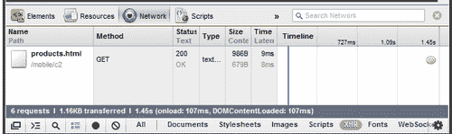
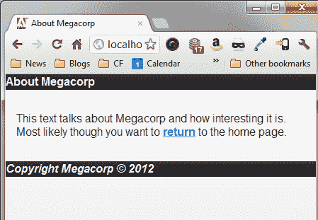

# 第二章：使用 jQuery Mobile 页面

在上一章中，您看到了向简单 HTML 页面添加 jQuery Mobile 有多么容易。虽然每个网站仅由一个页面组成会很好，但实际网站由多个通过链接连接的页面组成。jQuery Mobile 使得使用多个页面变得简单，并提供了许多不同的方式来创建和链接这些页面。

在本章中，我们将：

+   将多个页面添加到一个 jQuery Mobile 文件中

+   讨论 jQuery Mobile 如何修改链接（以及如何禁用它）

+   演示如何链接和添加额外文件到 jQuery Mobile 站点

+   讨论 jQuery Mobile 如何自动处理 URL 以便于简单的书签标记

# 重要的初步要点

如上一章所述，本章所有代码都可通过在 Github 下载的 ZIP 文件获取。

# 将多个页面添加到一个文件中

在上一章中，我们处理了一个具有简单文本页面的文件。对于我们的第一个修改，我们将向文件中添加另一页并创建一个链接到它。如果你还记得，jQuery Mobile 寻找一个特定的`<div>`包装器来帮助它知道你的页面在哪里：`<div data-role="page">`。jQuery Mobile 如此简单易用的原因在于我们可以通过简单地添加另一个具有相同格式的 div 来添加另一页。以下代码段 `Listing 2-1` 显示了此功能的一个简单示例：

```js
Listing 2-1: test1.html
<!DOCTYPE html>
<html>
<head>
<meta name="viewport" content="width=device-width, initial- scale=1">
<title>Multi Page Example</title>
<link rel ="stylesheet" href="http://code.jquery.com/mobile/ latest/jquery.mobile.min.css" />
<script src ="http://code.jquery.com/jquery- 1.7.1.min.js"></script>
<script src ="http://code.jquery.com/mobile/latest/ jquery.mobile.min.js"></script>
</head>
<body>
<div data-role="page" id="homePage">
<div data-role="header">Welcome</div>
<div data-role="content">
<p>
Welcome to our first mobile web site. It's going to be the best site you've ever seen. Once we get some content. And a business plan. But the hard part is done!
</p>
<p>
You can also <a href= "#aboutPage">learn more</a> about Megacorp.
</p>
</div>
<div data-role="footer">
<i>Copyright Megacorp &copy; 2012</i>
</div>
</div>
<div data-role="page" id="aboutPage">
<div data-role="header">About Megacorp</div>
<div data-role="content">
<p>
This text talks about Megacorp and how interesting it is. Most likely though you want to
<a href= "#homePage">return</a> to the home page.
</p>
</div>
<div data-role="footer">
<i>Copyright Megacorp &copy; 2012</i>
</div>
</div>
</body>
</html>

```

好的，像往常一样，我们从一些必需的内容开始：HTML5 文档类型，meta 标签，一个 CSS 包含以及两个 JavaScript 文件。这在上一章已经涵盖了，我们不会再提及它。请注意，此模板切换到了 CSS 和 JavaScript 库的 CDN 版本：

```js
<link rel="stylesheet" href="http://code.jquery.com/ mobile/latest/jquery.mobile.min.css" />
<script src="img/jquery-1.7.1.min.js"></script>
<script src="img/ jquery.mobile.min.js"></script>

```

这些版本由 jQuery 团队托管，并具有始终是最新版本的好处。大多数情况下，您的访问者在到达您的移动站点之前已经加载了这些库，因此它们存在于他们的缓存中。虽然这是我们在进一步的示例中要采取的路线，但请记住，您始终可以使用您下载的版本。

现在请注意我们有两个`<div>`块。第一个与上一个示例没有太多变化。我们添加了一个唯一的 ID（`homepage`），以及一个第二段落。请注意第二段落中的链接。它使用了标准的内部链接（`#aboutPage`）告诉浏览器我们只想简单地将浏览器滚动到页面的那部分。指定的目标 `aboutPage` 在另一个 `div` 块中定义在下面。

在传统的网页中，这将显示为页面上的两个主要文本块。点击其中任何一个链接将简单地使浏览器上下滚动。然而，jQuery Mobile 将在这里做一些显著不同的事情。下图显示了页面在移动浏览器中的渲染方式：


注意到了吗？即使我们的 HTML 包含了两个文本块（两个`<div>`块），但它只渲染了一个。jQuery Mobile 总是显示它找到的第一个页面，并且仅显示该页面。最棒的部分来了。如果你点击链接，第二个页面将自动加载。使用你设备上的返回按钮，或者简单点击链接，将带你回到第一个页面。你还会注意到平滑的过渡效果。这是你稍后可以配置的内容。但所有这些交互，页面的显示和隐藏，过渡，都是由 jQuery Mobile 自动完成的。现在是谈论链接以及点击它们时 jQuery Mobile 所做的事情的好时机。

# jQuery Mobile、链接和你

当 jQuery Mobile 遇到一个简单的链接 `(<a href= "something.html"> Foo</a>)` 时，它会自动捕获对该链接的任何点击，并将其更改为基于 Ajax 的加载。这意味着如果它检测到目标是页面上的某个东西，也就是说，我们上面使用的 hashmark 样式 (`href="#foo"`) 链接，它将处理将用户过渡到新页面。如果它检测到一个指向同一服务器上另一个文件的页面，则会使用 Ajax 加载页面并替换当前可见的页面。

如果你链接到外部网站，那么 jQuery Mobile 将保持链接不变，正常的链接行为将发生。可能会有时候你想要完全禁用 jQuery Mobile 对你的链接的任何操作。在这种情况下，你可以利用一个数据属性，让框架知道它根本不应该做任何事情。一个例子：

```js
<a href= "foo.html" data-ajax="false">Normal, non-special link</a>

```

正如我们在第一章中看到的*准备您的第一个 jQuery 移动项目*，jQuery Mobile 大量使用数据属性。它还非常擅长让你禁用你不喜欢的行为。当我们在本书中继续阅读时，你会看到一个又一个的例子，展示 jQuery Mobile 如何增强你的网站以适配移动设备。在所有这些情况下，框架都意识到可能有时你想要禁用它。

# 使用多个文件

在理想的世界中，我们可以用一个文件构建整个网站，永远不需要进行修订，并且每个项目都在周五下午 2 点之前完成。但在现实世界中，我们必须处理大量的文件，进行大量的修订，不幸的是，还有大量的工作。在前面的代码清单中，你看到了我们如何在一个文件中包含两个页面。jQuery Mobile 处理起来也很容易。但你可以想象，在一段时间后，这将变得难以控制。虽然我们可以包含十个、二十个、甚至三十个页面，但这将使文件变得难以处理，并且对用户的初始下载速度也会更慢。

要处理多个页面和文件，我们只需在第一个文件的同一域中制作简单的链接到其他文件。我们甚至可以将第一种技术（一个文件中的两个页面）与链接到其他文件相结合。在`listing 2-2`中，我们修改了第一个示例以添加到一个新页面的链接。请注意我们保留了现有的`关于`页面。

```js
Listing 2-2:test2.html
<!DOCTYPE html>
<html>
<head>
<meta name="viewport" content="width=device-width, initial- scale=1">
<title>Multi Page Example (2)</title>
<link rel="stylesheet" href="http://code.jquery.com/mobile/ latest/jquery.mobile.min.css" />
<script src="img/jquery- 1.7.1.min.js"></script>
<script src="img/jquery.mobile.min.js"></script>
</head>
<body>
<div data-role="page" id="homePage">
<div data-role="header">Welcome</div>
<div data-role="content">
<p>
Welcome to our first mobile web site. It's going to be the best site you've ever seen. Once we get some content. And a business plan. But the hard part is done!
</p>
<p>
Find out about our wonderful
<a href= "products.html">products</a>.
</p>
<p>
You can also <a href= "#aboutPage">learn more</a> about Megacorp.
</p>
</div>
<div data-role="footer">
<i>Copyright Megacorp &copy; 2012</i>
</div>
</div>
<div data-role="page" id="aboutPage">
<div data-role="header">About Megacorp</div>
<div data-role="content">
<p>
This text talks about Megacorp and how interesting it is. Most likely though you want to
<a href= "#homePage">return</a> to the home page.
</p>
</div>
<div data-role="footer">
<i>Copyright Megacorp &copy; 2012</i>
</div>
</div>
</body>
</html>

```

现在，让我们看一看`listing 2-3`，我们的产品页面:

```js
Listing 2-3: products.html
<!DOCTYPE html>
<html>
<head>
<meta name="viewport" content="width=device-width, initial- scale=1">
<title>Products</title>
<link rel="stylesheet" href="http://code.jquery.com/mobile/ latest/jquery.mobile.min.css" />
<script src="img/jquery- 1.7.1.min.js"></script>
<script src="img/jquery.mobile.min.js"></script>
</head>
<body>
<div data-role="page" id="productsPage">
<div data-role="header">Products</div>
<div data-role="content">
<p>
Our products include:
</p>
<ul>
<li>Alpha Series</li>
<li>Beta Series</li>
<li>Gamma Series</li>
</ul>
</div>
</div>
</body>
</html>

```

我们的产品页面相当简单，但请注意我们在顶部包含了 jQuery 和 jQuery Mobile 资源。为什么？我之前提到 jQuery Mobile 将使用 Ajax 加载其他页面。如果在 Chrome 或支持 Firebug 的 Firefox 中打开`test2.html`，您可以自行查看。点击产品链接将触发 XHR（类似 Ajax）请求，如下图所示:



这很棒。但是当有人收藏该应用程序时会发生什么？现在让我们看看 jQuery Mobile 如何处理 URL 和导航。

### 提示

**什么是 Firebug?**

Firebug 是 Firefox 的一个扩展程序 ([www.getfirebug.com](http://www.getfirebug.com))，为您的浏览器提供一套开发者相关工具。Chrome 内置了类似的工具。这些工具提供了许多功能，其中之一是监视与 XHR（或 Ajax）相关的请求。

# jQuery Mobile 和 URL

如果您在浏览器中打开了`test2.html`并进行了操作，您可能已经注意到在导航时 URL 的一些有趣之处。以下是初始 URL。(地址和文件夹当然会在您的计算机上有所不同):`http://localhost/mobile/c2/test2.html`。

点击产品后，URL 将更改为`http://localhost/mobile/c2/products.html`。如果我点击返回，然后点击**了解更多**，我会得到`http://localhost/mobile/c2/test2.html#aboutPage`。

在两个子页面中（产品页面和关于页面），URL 是由框架本身更改的。框架在支持的浏览器中使用`history.pushState`和`history.replaceState`。对于较旧的浏览器或不支持 JavaScript 操作 URL 的浏览器，将改用基于哈希的导航。 在 Internet Explorer 中查看产品链接时，如下所示:

`http://localhost/mobile/c2/test2.html#/mobile/c2/products.html`。

有趣的是，在这种书签样式中，始终首先加载`test2.html`。实际上，您可以构建您的`products.html`只包括 div，并确保如果首先请求了产品，它仍然会正确渲染。问题出在更新、更高级的浏览器上。如果您没有包括正确的 jQuery 和 jQuery Mobile 包含文件，当他们直接访问`products.html`时，您将得到一个没有样式的页面。最好始终包括适当的页头文件（CSS、JavaScript 等）。任何良好的编辑器都将提供创建模板的简单方法。

# 额外的自定义操作

在 jQuery Mobile 中处理多个页面非常简单。您可以将前两章中讨论的内容应用到现在，构建一个相当简单但符合移动设备的网站。以下是您可能想要考虑的一些更有趣的技巧。

## 页面标题

在前面的示例中，当您单击**Products**页面时，您可能已经注意到浏览器的标题正确更新为`Products`。这是因为 jQuery Mobile 注意到并解析了`products.html`文件中的标题标签。但是，如果您单击**About**链接，您不会得到相同的行为。显然，由于**About**页面位于同一 HTML 文件中，它也具有相同的标题标签。jQuery Mobile 提供了一种简单的方法来解决这个问题，再次涉及到数据标签。以下代码片段显示了一种为嵌入页面添加标题的简单方法：

```js
<div data-role="page" id="aboutPage" data-title="About Megacorp">
<div data-role="header">About Megacorp</div>
<div data-role="content">
<p>
This text talks about Megacorp and how interesting it is. Most likely though you want to
<a href= "#homePage">return</a> to the home page.
</p>
</div>
<div data-role="footer">
<i>Copyright Megacorp &copy; 2012</i>
</div>
</div>

```

注意新添加到`div`标签中的`data-title`标签。当加载**About**页面时，jQuery Mobile 会注意到这一点，并更新浏览器标题。同样，这仅在在一个 HTML 文件中包含多个页面时才需要。您可以在`test3.html`中找到这个版本：



## 预取内容

将所有内容包含在一个 HTML 文件中的好处是所有页面都可以立即使用。但是负面影响（更新困难，初始下载速度慢）远远超过了这一点。大多数 jQuery Mobile 应用程序将包含多个文件，通常每个文件只包含一个或两个页面。但是，您可以确保某些页面加载更快以帮助改善用户体验。想象一下我们的**Megacorp**页面。它有三个页面，但是**Products**页面是一个单独的 HTML 文件。由于这是站点上唯一的真实内容，最有可能所有用户都会点击该链接。我们可以告诉 jQuery Mobile 在主页面加载时立即预取内容。这样，当用户单击该链接时，页面将加载得更快。再次，这归结为一个简单的数据属性。

```js
<p>
Find out about our wonderful <a href= "products.html" data- prefetch>products</a>.
</p>

```

在前面的链接中，我们所做的只是在链接中添加了`data-prefetch`。当 jQuery Mobile 在链接中发现这一点时，它将自动立即获取内容。现在，当用户单击**Products**链接时，他们将更快地看到内容。这个修改已保存在`test4.html`中。

显然，这种技术应谨慎使用。给定一个具有四个主要链接的页面，您可能只想考虑预取两个最受欢迎的页面，而不是全部四个。

## 更改页面过渡方式

之前，我们提到您可以配置 jQuery Mobile 在页面之间使用的过渡效果。在本书后面，我们将讨论如何在全局范围内执行此操作，但是如果您想要在特定链接中切换到不同的过渡效果，只需在链接中包含`data-transition`属性即可：

```js
<p>
Find out about our wonderful <a href= "products.html" data- transition="pop">products</a>.
</p>

```

许多转场还支持反向操作。通常情况下，jQuery Mobile 会判断您是否需要这样做，但如果您想强制指定一个方向，请使用 data-direction 属性：

```js
<p>
Find out about our wonderful <a href= "products.html" data- transition="pop" data-direction="reverse">products</a>.
</p>

```

# 总结

本章进一步阐述了 jQuery Mobile 页面的概念以及如何处理多个页面。具体来说，我们看到一个物理文件可以包含许多不同的页面。jQuery Mobile 将处理除第一个页面外的所有隐藏页面。我们还看到了如何链接到其他页面以及 jQuery Mobile 如何使用 Ajax 动态加载内容到浏览器中。接下来，我们讨论了 jQuery Mobile 如何处理更新浏览器的 URL 以便启用书签功能。最后，我们讨论了两种工具，这些工具将有助于改善您的页面。第一种方法是为嵌入页面提供标题。第二种技术演示了如何预取内容以进一步改善访问您网站的用户的体验。

在下一章中，我们将看看标题、页脚和导航栏。这些将极大地增强我们的页面，并使其更易于导航。
