# 第三章：通过标题、页脚和工具栏增强页面

工具栏提供了一种简单的方法来为移动网站添加导航元素。它们可以为用户始终可以在导航应用程序中浏览时参考的一致性或站点范围导航控件提供特别有用的功能。

在本章中，我们将：

+   讨论如何同时创建标题和页脚

+   讨论如何将这些标题和页脚转换为有用的工具栏

+   演示如何创建固定定位的工具栏，无论页面的内容多大，它们都会始终显示出来

+   展示导航栏的示例

# 重要的预备知识点

如前一章所述，本章的所有代码都可以通过在 Github 下载的 ZIP 文件中获得。本章中的大多数代码示例都很简短，因此在测试时应使用完整的代码。

# 添加标题

您之前已经使用过标题，所以代码会很熟悉。在本章中，我们将更深入地研究它们，并演示如何向您的站点标题添加其他功能，例如按钮。

如果您记得，标题可以通过简单地使用具有适当角色的 div 来定义：

```js
<div data-role="header">My Header</div>

```

前一个标签将为文本添加漂亮的黑色背景，使其更加突出，如下面的截图所示：

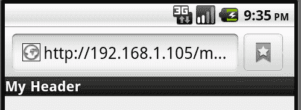

但是，我们可以做得更好。通过在我们的文本周围包含一个`h1`标签，jQuery Mobile 将使标题变得更大，并自动居中文本，如以下标签后面的截图所示：

```js
<div data-role="header"><h1>My Header</h1></div>

```

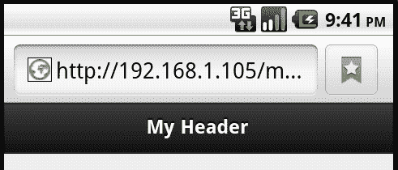

立即您就能看到差别。我们可以通过添加按钮进一步增加标题的功能。按钮可以用于导航（例如返回主屏幕），或提供到相关页面的链接。因为标题的中心用于文本，所以只有两个*空格*可用于左侧和右侧的按钮。您只需在标题中创建链接即可添加按钮。第一个链接将位于文本左侧，第二个链接将位于右侧。以下代码片段是一个示例：

```js
<div data-role="header">
<a href= "index.html">Home</a>
<h1>My Header</h1>
<a href= "contact.html">Contact</a>
</div>

```

在移动浏览器中查看时，您将看到以下截图：

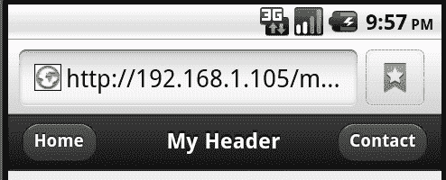

注意，更简单的链接会自动转换为大按钮，使它们更易于使用，并对标题更具“控制”性。您可能会想，如果您只想要一个按钮，并且希望它在右侧，该怎么办？删除第一个按钮并保留第二个不起作用，如下面的代码片段所示：

```js
<div data-role="header">
<h1>My Header</h1>
<a href= "contact.html">Contact</a>
</div>

```

前面的代码片段在标题中创建了一个按钮，但位于左侧。为了将按钮定位到右侧，只需添加类`ui-btn-right`。以下代码片段是一个示例：

```js
<div data-role="header">
<h1>My Header</h1>
<a href= "contact.html" class="ui-btn-right">Contact</a>
</div>

```

您还可以指定`ui-btn-left`将链接放在左侧，但如前面的代码片段所示，那是正常的行为：

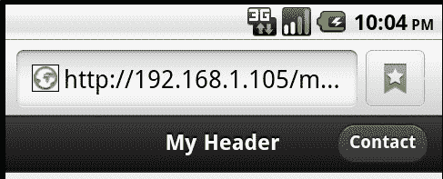

# 图标预览

虽然不是特定的页眉工具栏功能，但 jQuery Mobile 中所有按钮都可以使用的一个有趣功能是指定一个图标。jQuery Mobile 随附了一组简单易识别的图标，并可立即使用。这些图标将在第六章中进一步讨论，*创建移动优化表单*，但是作为一个快速预览，以下代码片段显示了一个带有两个自定义图标的页眉：

```js
<div data-role="header">
<a href= "index.html" data-icon="home">Home</a>
<h1>My Header</h1>
<a href= "contact.html" data-icon="info">Contact</a>
</div>

```

注意新属性 `data-icon`。在浏览器中查看时，你会看到以下截图所示内容：

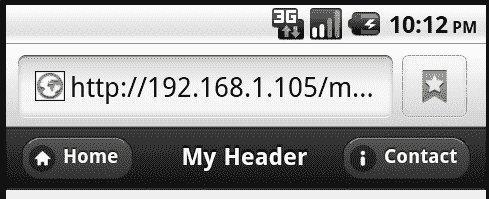

# 处理返回按钮

根据用户的硬件，他们可能有或者没有物理返回按钮。对于有返回按钮的设备，比如安卓手机，在 jQuery Mobile 应用中点击返回按钮会很好用。用户点击按钮后，之前所在的页面会立即加载。但是在其他设备上，比如 iPhone，没有这样的按钮可以点击。虽然你可以提供链接自己导航到其他页面，但 jQuery Mobile 提供了一些很好的内置支持，可以直接向后导航。

有两种方式可以添加自动返回按钮。 `清单 3-1` 显示了一个简单的、两个页面的 jQuery Mobile 网站。在第二个页面中，我们添加了一个新的数据属性 `data-add-back-btn="true"`。这将在第二个页面的页眉中自动创建一个返回按钮。接下来，我们还在页面内容中添加了一个简单的链接。虽然链接的实际 URL 是空白的，请注意 `data-rel="back"` 属性。jQuery Mobile 会检测到此链接，并自动将用户发送到上一页。以下代码片段是一个示例：

```js
Listing 3-1: back_button_test.html
<!DOCTYPE html>
<html>
<head>
<title>Back Examples</title>
<meta name="viewport" content="width=device-width, initial- scale=1">
<link rel="stylesheet" href="http://code.jquery.com/mobile/ latest/jquery.mobile.min.css" />
<script src="img/jquery- 1.7.1.min.js"></script>
<script src="img/jquery.mobile.min.js"></script>
</head>
<body>
<div data-role="page">
<div data-role="header"><h1>My Header</h1></div>
<div data-role="content">
<p>
<a href= "#subpage">Go to the sub page...</a>
</p>
</div>
</div>
<div data-role="page" id="subpage" data-add-back-btn="true">
<div data-role="header"><h1>Sub Page</h1></div>
<div data-role="content">
<p>
<a href= "" data-rel="back">Go back...</a>
</p>
</div>
</div>
</body>
</html>

```

下面的截图展示了该功能的运行方式：

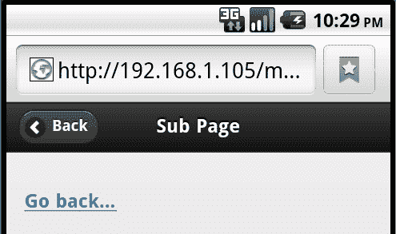

如果你好奇，按钮的文本可以通过在页面 div 中简单使用另一个数据属性来自定义：`data-add-back-btn="true" data-back-btn-text="返回"`。你也可以通过 JavaScript 全局地启用返回按钮支持并更改文本。这将在第九章中讨论，*jQuery Mobile 中的 JavaScript 配置和实用工具*。

# 处理页脚

页脚在大部分情况下会与页眉类似。我们之前演示过使用 data-role 创建页脚：

```js
<div data-role="footer">My Footer</div>

```

但是，就像我们的标题一样，如果我们在 div 标签内添加适当的 HTML，我们可以获得更好的格式：

```js
<div data-role="header"><h4>My Footer</h4></div>

```

添加了 `h4` 标签后，我们的页脚现在居中并且稍微填充，以使它们更加突出，如以下截图所示：

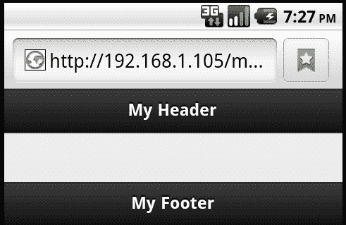

与页眉一样，您可以在页脚中包含按钮。与页眉不同，页脚中的按钮不会自动定位到文本的左右两侧。事实上，如果您决定使用文本和按钮，您需要确保从页脚文本中删除`h4`标签，否则您的页脚会变得相当大。以下是一个简单的示例，其中包含两个按钮：

```js
<div data-role="footer">
<a href= "credits.html">Credits</a>
<a href= "contact.html">Contact</a>
</div>

```

以下屏幕截图展示了这个变化：

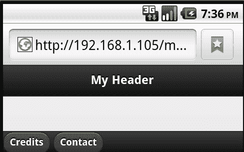

这是有效的 - 但请注意按钮周围的空间不多。您可以通过将一个称为`ui-bar`的类添加到页脚`div`标签中来改进，如下面的代码片段所示：

```js
<div data-role="footer" class="ui-bar">
<a href= "credits.html">Credits</a>
<a href= "contact.html">Contact</a>
</div>

```

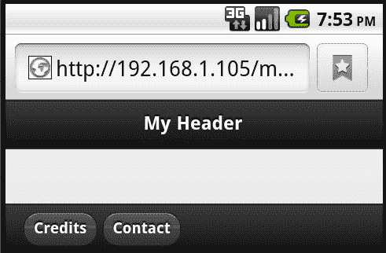

# 创建固定和全屏页眉和页脚

在前面关于页眉和页脚的讨论中，您看到了一些如何添加按钮的示例。这些按钮可以用于在您的站点中导航。但是如果某个页面特别长怎么办？例如，博客条目在移动设备上查看时可能会非常长。当用户滚动时，页眉或页脚可能会离开屏幕。jQuery Mobile 提供了一种创建固定位置页眉和页脚的方法。启用此功能后，页眉和页脚将始终可见。当用户滚动时，它们可能会消失，但只要他们抬起手指并停止滚动，页眉和页脚就会重新出现。可以通过向用于页眉或页脚的 div 标签添加`data-position="fixed"`来启用此功能。`清单 3-2`展示了一个示例。为了确保页面实际上滚动，许多文本段落被重复。这已从书中的代码中删除，但存在于实际文件中。

```js
Listing 3-2: longpage.html
<!DOCTYPE html>
<html>
<head>
<title>Fixed Positioning Example</title>
<meta name="viewport" content="width=device-width, initial- scale=1">
<link rel="stylesheet" href="http://code.jquery.com/mobile/ latest/jquery.mobile.min.css" />
<script src="img/jquery- 1.7.1.min.js"></script>
<script src="img/jquery.mobile.min.js"></script>
</head>
<body>
<div data-role="page">
<div data-role="header" data-position="fixed"><h1>My Header</h1></div>
<div data-role="content">
<p>
Lorem ipsum dolor sit amet, consectetur adipiscing elit. Suspendisse id posuere lacus. Nulla ac sem ut eros dignissim interdum a et erat. Class aptent taciti sociosqu ad litora torquent per conubia nostra, per inceptos himenaeos. In ac tellus est. Nunc consequat metus lobortis enim mattis nec convallis tellus pulvinar. Nullam diam ligula, dictum sed congue nec, dapibus id ipsum. Ut facilisis pretium dui, nec varius dui iaculis ultricies. Maecenas sollicitudin urna felis, non faucibus
leo. Cum sociis natoque penatibus et magnis dis parturient montes, nascetur ridiculus mus. In id volutpat lectus.Quisque mauris ipsum, vehicula id ornare aliquet, auctor volutpat dui. Sed euismod sem in arcu dapibus condimentum dictum nibh consequat.
</p>
</div>
<div data-role="footer" data-position="fixed"><h4>My Footer</h4></div>
</div>
</body>
</html>

```

我们不会为这个示例提供截图，因为它不会很好地传达功能，但如果您在移动设备上尝试此操作，请注意，当您向上或向下滚动时，只要您抬起手指，页眉和页脚就会同时弹出。这使用户无论页面有多大都可以访问它们。

## 全屏定位

要考虑的另一种选择是所谓的全屏定位。这是一个常用于图片的比喻，但也可以用于使用固定定位页眉和页脚的情况。在这种情况下，页眉和页脚会随着点击的出现和消失而出现和消失。因此，对于照片，这允许您查看照片的原样，但也可以通过简单的点击重新获取页眉和页脚。也许，与其称之为全屏定位，不如考虑将其视为*可检索的*页眉和页脚。一般来说，当您希望查看页面内容时最好使用，再次，这是一个很好的例子。

要启用此功能，只需将`data-fullscreen="true"`添加到用于定义页面的 div 标签中即可。`清单 3-3`展示了此功能，如下面的代码片段所示：

```js
Listing 3-3: fullscreen.html
<!DOCTYPE html>
<html>
<head>
<title>Full Screen Example</title>
<meta name="viewport" content="width=device-width, initial- scale=1">
<link rel="stylesheet" href="http://code.jquery.com/mobile/ latest/jquery.mobile.min.css" />
<script src="img/jquery- 1.7.1.min.js"></script>
<script src="img/jquery.mobile.min.js"></script>
</head>
<body>
<div data-role="page" data-fullscreen="true">
<div data-role="header" data-position="fixed"><h1>My Header</h1></div>
<div data-role="content">
<p>

</p>
<p>
</div>
<div data-role="footer" data-position="fixed"><h4>My Footer</h4></div>
</div>
</body>
</html>

```

和前一个示例一样，前面的代码片段在静态截图中展示效果不太好。在手机浏览器中打开它，看一看吧。记住，你可以点击多次来切换效果的开启和关闭。

# 使用导航栏

你现在已经看到了一些示例，其中包括带有页眉和页脚的按钮，但是 jQuery Mobile 还有一个更简洁的版本，称为 NavBars（或导航栏）。这些是全屏宽的条形用来放置按钮。jQuery Mobile 还支持将一个按钮标记为活动按钮。在用于导航时，这是一种标记页面为活动状态的简单方法。

NavBar 简单地说就是包含在使用`data-role="navbar"`的 div 标签中的无序列表。放在页脚中时，它看起来类似于以下代码片段：

```js
<div data-role="footer">
<div data-role="navbar">
<ul>
<li><a href= "persistent_footer_index.html" class="ui-btn- active">Home</a></li>
<li><a href= "persistent_footer_credits.html" >Credits</a></li>
<li><a href= "persistent_footer_contact.html" >Contact</a></li>
</ul>
</div>
</div>

```

注意第一个链接使用了`class="ui-btn-active"`。这会将第一个按钮标记为活动状态。jQuery Mobile 不会自动为你完成这个操作，所以在构建每个页面并使用`navbar`时，你需要*适当地*移动类。以下截图显示了它的外观：

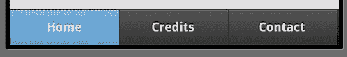

你最多可以添加 5 个按钮，jQuery Mobile 会适当调整按钮大小以使其适应。如果超过五个，则按钮将简单地分成多行。很可能这不是你想要的。用太多的按钮来混淆用户，最终只会激怒他们。

你还可以在页眉中包括一个`navbar`。如果放置在文本或其他按钮之后，jQuery Mobile 将自动将其放置到下一行：

```js
<div data-role="header">
<h1>Home</h1>
<div data-role="navbar">
<ul>
<li><a href= "persistent_footer_index.html" class="ui-btn- active">Home</a></li>
<li><a href= "persistent_footer_credits.html" >Credits</a></li>
<li><a href= "persistent_footer_contact.html" >Contact</a></li>
</ul>
</div>
</div>

```

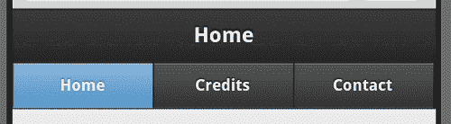

你可以在名为`header_and_footer_with_navbar.html`的文件中看到这两者的应用示例。

## 跨多个页面持久化导航栏页脚

现在让我们将前面的两个主题合并成一个令人难以置信的小功能 - 多页面持久化页脚。这需要做一些额外工作，但你可以创建一个页脚 NavBar，在切换页面时不会消失。为了做到这一点，你需要遵循一些简单的规则：

+   你的页脚 div 必须出现在所有页面上

+   你的页脚 div 必须在所有页面上使用相同的`data-id`值

+   在 NavBar 中的*活动*页面上，必须使用两个 CSS 类：`ui-state-persist` 和 `ui-btn-active`。

+   你还必须使用持久化页脚功能

这听起来有点复杂，但实际上在模板中只需要增加一小部分 HTML 代码。在`listing 3-4`中，一个虚构公司的索引页面使用了页脚 NavBar。注意当前选定页面使用了`ui-state-persist`和`ui-btn-active`。

```js
Listing 3-4: persistent_footer_index.html
<!DOCTYPE html>
<html>
<head>
<title>Persistent Footer Example</title>
<meta name="viewport" content="width=device-width, initial- scale=1"> <link rel="stylesheet" href="http://code.jquery.com/mobile/ latest/jquery.mobile.min.css" />
<script src="img/jquery- 1.7.1.min.js"></script>
<script src="img/jquery.mobile.min.js"></script>
</head>
<body>
<div data-role="page">
<div data-role="header"><h1>Home</h1></div>
<div data-role="content">
<p>
This is the Home Page
</p>
</div>
<div data-role="footer" data-position="fixed" data- id="footernav">
<div data-role="navbar">
<ul>
<li><a href= "persistent_footer_index.html" class="ui-btn- active ui-state-persist">Home</a></li>
<li><a href= "persistent_footer_credits.html"> Credits</a></li>
<li><a href= "persistent_footer_contact.html"> Contact</a></li>
</ul>
</div>
</div>
</div>
</body>
</html>

```

下面的截图显示了页面的完整外观：

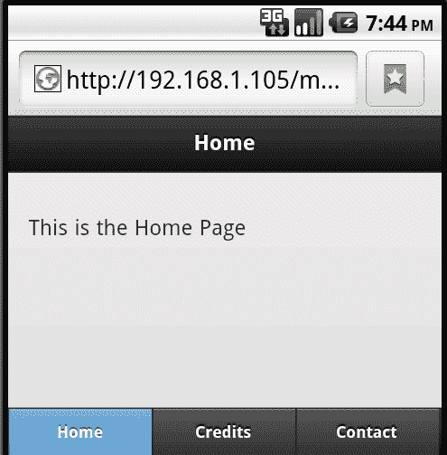

我们不需要太担心另外两个页面。你可以在下载的 ZIP 文件中找到它们。以下代码片段是第二个页面的页脚部分。请注意，这里唯一的变化是`ui-btn-active`类的移动：

```js
<div data-role="footer" data-position="fixed" data-id="footernav">
<div data-role="navbar">
<ul>
<li><a href= "persistent_footer_index.html">Home</a></li>
<li><a href= "persistent_footer_credits.html" class="ui-btn- active ui-state-persist">Credits</a></li>
<li><a href= "persistent_footer_contact.html">Contact</a></li>
</ul>
</div>
</div>

```

点击从一个页面到另一个页面时，每个页面都显示平滑的过渡，但页脚栏保持不变。就像一个有框架的站点（不要抖动 - 框架并不总是被鄙视），当用户在整个站点中导航时，页脚将保持不变。

# 摘要

在本章中，我们讨论了如何向您的 jQuery Mobile 页面添加标题、页脚和导航栏（NavBars）。我们展示了正确的 div 标记如何在您的页面上创建格式良好的标题和页脚，以及如何使这些标题和页脚在长页面中持续存在。此外，我们演示了*全屏模式*用于标题和页脚。这些是点击时出现和消失的标题和页脚 - 完美用于您想在移动设备上以全屏视图显示的图像和其他项目。最后，我们看到了如何结合持久页脚和 NavBars 以创建页脚，当页面更改时不会消失。

在下一章中，我们将深入探讨列表。列表是人们为其移动站点添加导航和菜单的主要方式之一。jQuery Mobile 提供了大量选项来创建和样式化列表。
