# 第四章：与列表一起工作

列表是为移动网站的用户提供菜单的绝佳方式。jQuery Mobile 提供了丰富的列表选项，从简单的列表到带有自定义缩略图和多个用户操作的列表。

在这一章中，我们将：

+   谈论如何创建列表

+   如何创建链接和子菜单样式的列表

+   如何创建不同样式的列表

# 创建列表

正如您（希望！）所学到的，jQuery Mobile 在 UI 方面采取了一种*增强*的方法。您采用普通的、简单的 HTML，添加一些标记（有时候！），jQuery Mobile 将完成增强 UI 的繁重工作。同样的过程也适用于列表。我们之前都使用过 HTML 中的简单列表，下面的代码片段就是一个示例：

```js
<ul>
<li>Raymond Camden</li>
<li>Scott Stroz</li>
<li>Todd Sharp</li>
<li>Dave Ferguson</li>
</ul>

```

我们都知道它们是如何显示的（在前一个代码片段中是一个项目符号列表）。让我们将该列表放在一个简单的 jQuery Mobile 优化页面中。`Listing 4-1`将一个典型页面放入我们的列表中：

```js
Listing 4-1: test1.html
<!DOCTYPE html>
<html>
<head>
<title>Unordered List Example</title>
<meta name="viewport" content="width=device-width, initial- scale=1">
<link rel="stylesheet" href="http://code.jquery.com/mobile/ latest/jquery.mobile.min.css" />
<script src="img/jquery- 1.7.1.min.js"></script>
<script src="img/jquery.mobile.min.js"></script>
</head>
<body>
<div data-role="page">
<div data-role="header">
<h1>My Header</h1>
</div>
<div data-role="content">
<ul>
<li>Raymond Camden</li>
<li>Scott Stroz</li>
<li>Todd Sharp</li>
<li>Dave Ferguson</li>
</ul>
</div>
<div data-role="footer">
<h1>My Footer</h1>
</div>
</div>
</body>
</html>

```

给定这个 HTML，jQuery Mobile 立即为我们提供了一些好东西，如下截图所示：

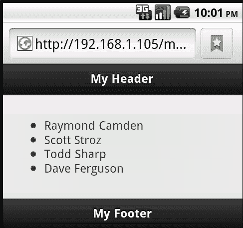

我们可以通过简单的更改来增强该列表。从`listing 4-1`中取出普通的`<ul>`标签，并添加一个`data-role="listview"`属性，如下代码所示：

```js
<ul data-role="listview">

```

在您从 Github 下载的代码中，您可以在`test2.html`中找到这个修改。虽然变化很大，如下截图所示：

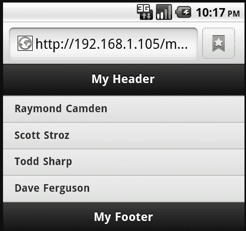

您可以看到项目不再在前面有圆点符号，但它们更大，更容易阅读。当我们开始向列表中添加链接时，事情变得更加有趣。在下面的代码片段中，我为每个列表项添加了一个链接：

```js
<ul data-role="listview">
<li><a href= "ray.html">Raymond Camden</a></li>
<li><a href= "scott.html">Scott Stroz</a></li>
<li><a href= "todd.html">Todd Sharp</a></li>
<li><a href= "dave.html">Dave Ferguson</a></li>
</ul>

```

再次，您可以在之前下载的 ZIP 文件中找到这个代码片段的完整文件。这个文件可以在`test3.html`中找到。下面的截图展示了该代码的渲染效果：

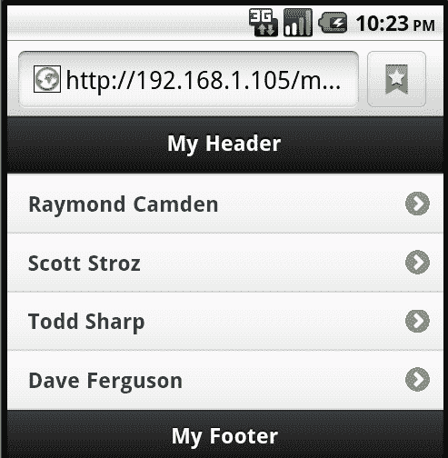

注意新的箭头图片。当 jQuery Mobile 检测到列表中有链接时，它会自动添加。现在，您已经将一个相对简单的 HTML 无序列表转换为一个简单的菜单系统。这本身就相当令人印象深刻，但是正如我们将在本章的其余部分中看到的那样，jQuery Mobile 提供了丰富的渲染选项，让您定制列表。

您可能想知道您可以创建多复杂的菜单系统。因为 HTML 本身支持嵌套列表，jQuery Mobile 也会将它们渲染出来。`Listing 4-2`演示了一个嵌套列表的示例：

```js
Listing 4-2: Nested List
<!DOCTYPE html>
<html>
<head>
<title>List Example</title>
<meta name="viewport" content="width=device-width, initial- scale=1">
<link rel="stylesheet" href="http://code.jquery.com/mobile/ latest/jquery.mobile.min.css" />
<script src="img/jquery- 1.7.1.min.js"></script>
<script src="img/jquery.mobile.min.js"></script>
</head>
<body>
<div data-role="page">
<div data-role="header">
<h1>My Header</h1>
</div>
<div data-role="content">
<ul data-role="listview">
<li>Games
<ul>
<li>Pong</li>
<li>Breakout</li>
<li>Tron</li>
</ul>
</li>
<li>Weapons
<ul>
<li>Nukes</li>
<li>Swords</li>
<li>Ninja Stars</li>
</ul>
</li>
<li>Planets
<ul>
<li>Earth</li>
<li>Jupiter</li>
<li>Uranus</li>
</ul>
</li>
</ul>
</div>
<div data-role="footer">
<h1>My Footer</h1>
</div>
</div>
</body>
</html>

```

在前面示例中使用的嵌套列表的 HTML 并没有特别之处。它是标准的。但是 jQuery Mobile 将采取内部列表并实际隐藏内容。即使在*上*级 LI 项中没有链接，它们也会变成链接：

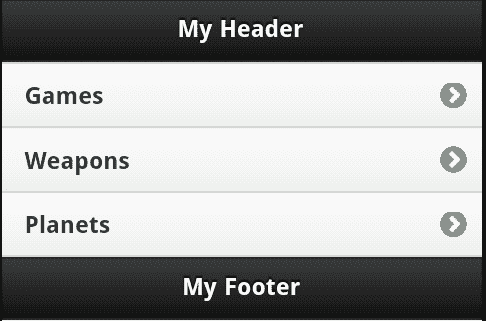

单击菜单项中的一个会加载内部菜单。如果在您自己的移动设备上（或在浏览器中）运行此操作，请注意 URL 也会发生变化，它们会创建一个可书签的应用程序视图：

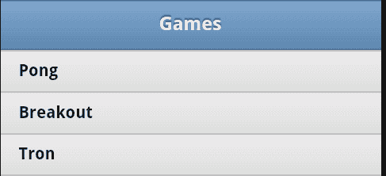

# 使用列表功能

jQuery Mobile 提供多种不同样式的列表，以及可以应用于它们的不同功能。本章的下一部分将介绍其中的一些可用选项。这些选项没有特定的顺序，并且被呈现为您可用的选项的画廊。您可能不会（也不应该！）尝试在一个应用程序中使用所有这些选项，但是牢记 jQuery Mobile 提供的各种列表样式是件好事。

## 创建插入式列表

最简单、最精致的列表变化之一是将它们转换为**插入式列表**。这些列表不会占满设备的整个宽度。我们可以对之前用`data-role="content"`修改过的初始列表添加另一个属性，即`data-inset="true"`，在以下代码块（位于`test5.html`中）中实现：

```js
<ul data-role="listview" data-inset="true">
<li>Raymond Camden</li>
<li>Scott Stroz</li>
<li>Todd Sharp</li>
<li>Dave Ferguson</li>
</ul>

```

结果现在与之前的示例非常不同：

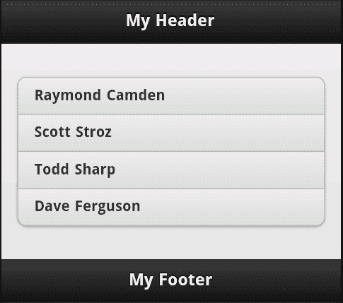

## 创建列表分隔符

您可能希望向列表中添加的另一个有趣的 UI 元素是分隔符。这是将长列表分隔成稍微容易扫描的内容的好方法。添加列表分隔符就像添加一个使用了`data-role="list-divider"`的`li`标签一样简单。下面的代码片段展示了此元素的一个简单示例：

```js
<ul data-role="listview" data-inset="true">
<li data-role="list-divider">Active</li>
<li>Raymond Camden</li>
<li>Scott Stroz</li>
<li>Todd Sharp</li>
<li data-role="list-divider">Archived</li>
<li>Dave Ferguson</li>
</ul>

```

在上一个代码块中，请注意两个使用了`list-divider`角色的新`li`标签。在本示例中，我将它们用于将人员列表分成两组。您可以在`test6.html`中找到完整的模板。以下截图显示了此内容的呈现方式：

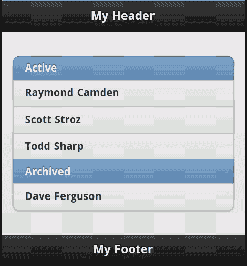

## 创建带有计数气泡的列表

jQuery Mobile 列表中的另一个有趣的 UI 技巧是*计数气泡*。这是一种 UI 增强，它在每个列表项的末尾添加一个简单的数字。这些数字被包裹在类似于*气泡*的外观中，通常用于电子邮件样式的界面。在下面的代码片段中，计数气泡用于表示在技术会议上消耗的 cookie 数量：

```js
<ul data-role="listview" data-inset="true">
<li data-role="list-divider">Cookies Eaten</li>
<li>Raymond Camden <span class="ui-li-count">9</span></li>
<li>Scott Stroz <span class="ui-li-count">4</span></li>
<li>Todd Sharp <span class="ui-li-count">13</span></li>
<li>Dave Ferguson <span class="ui-li-count">8</span></li>
</ul>

```

在上一个代码片段中，我们使用了一个带有类名`ui-list-count`的`span`标签来包裹表示每个人吃的 cookie 数量的数字。一个简单的 HTML 更改，但考虑一下它如何被很好地呈现，如下面的截图所示：

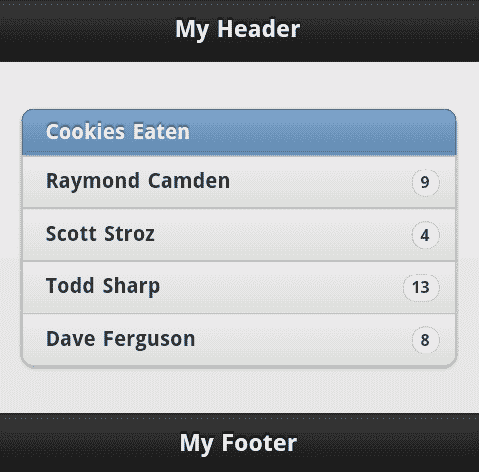

您可以在`test7.html`中找到此功能的完整示例。

## 使用缩略图和图标

列表的另一个常见需求是包含图像。jQuery Mobile 支持缩略图（较小的图像）和图标（更小的图像），它们在列表控件内显示得很好。让我们首先看一下如何在列表中包含缩略图。假设您已经有了大小适中的图像（我们的示例都是宽高都为 160 像素），您可以简单地在每个`li`元素中包含它们，如以下代码片段所示：

```js
<ul data-role="listview" data-inset="true">
<li><a href="ray.html"> Raymond Camden</a></li>
<li><a href="scott.html"> Scott Stroz</a></li>
<li><a href="todd.html"> Todd Sharp</a></li>
<li><a href="dave.html"> Dave Ferguson</a></li>
</ul>

```

对图像没有做任何特殊处理，也没有添加任何数据属性或类。jQuery Mobile 将自动左对齐图像，并将项目文本对齐到每个`li`块的顶部：


你可以在`test8.html`中找到前面的演示。那么图标呢？要在代码中包含图标，请将类`ui-li-icon`添加到您的图像中（请注意，类的开头是`ui`，而不是`ul。`）以下代码片段是具有相同列表的示例：

```js
<ul data-role="listview" data-inset="true">
<li><a href="ray.html"> Raymond Camden</a></li>
<li><a href="scott.html"> Scott Stroz</a></li>
<li><a href="todd.html"> Todd Sharp</a></li>
<li><a href="dave.html"> Dave Ferguson</a></li>
</ul>

```

使用此类时，jQuery Mobile 会缩小图像，但根据我的经验，当图像在之前被调整大小时，格式会更好。这样做还可以提高网页的速度，因为较小的图像应该会导致更快的下载时间。上面的图像都是宽高各 16 像素。结果是...

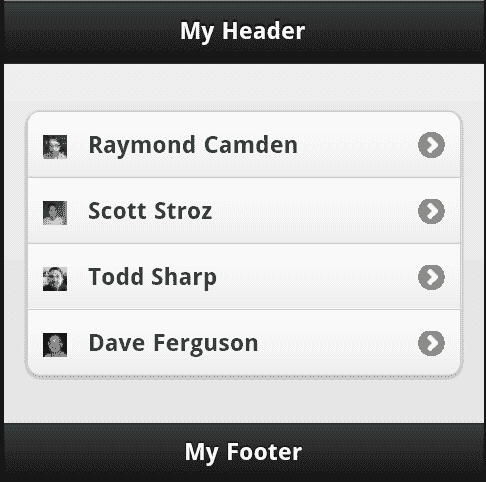

你可以在`test9.html`中找到前面的例子。

## 创建分割按钮列表

jQuery Mobile 列表的另一个有趣功能是 Split Button 列表。这只是一个具有多个操作的列表。当用户单击列表项时，会激活一个主要操作，并且通过列表项末尾的按钮可用于辅助操作。对于此示例，让我们首先从截图开始，然后再展示如何实现它：

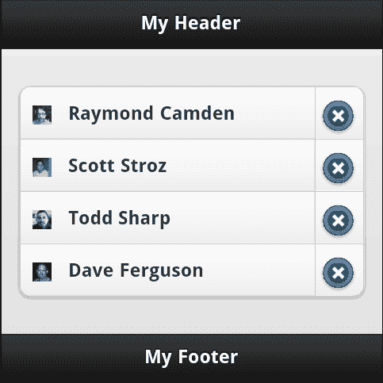

如您所见，每个列表项在行末都有一个辅助图标。这是一个分割项目列表的示例，简单地通过向列表项添加第二个链接来定义。例如：

```js
<ul data-role="listview" data-inset="true">
<li><a href= ray.html"> Raymond Camden</a><a href="foo.html">Delete</a></li>
<li><a href= scott.html"> Scott Stroz</a><a href="foo.html">Delete</a></li>
<li><a href= todd.html"> Todd Sharp</a><a href="foo.html">Delete</a></li>
<li><a href= dave.html"> Dave Ferguson</a><a href="foo.html">Delete</a></li>
</ul>

```

请注意，第二个链接的文本**删除**实际上被图标替换了。您可以通过将数据属性`split-icon`添加到您的`ul`标记中来指定图标，如下代码行所示：

```js
<ul data-role="listview" data-inset="true" data-split-icon="delete">

```

此示例的完整代码可以在`test10.html`中找到。

## 使用搜索过滤器

对于我们最后一个列表功能，我们将查看搜索过滤器。到目前为止，我们处理的列表都相当短。但是，较长的列表可能会使用户难以找到他们要找的内容。jQuery Mobile 提供了一种非常简单的方法来向列表添加搜索过滤器。通过将`data-filter="true"`添加到任何列表中，jQuery Mobile 将自动在顶部添加一个搜索字段，当您输入时会进行过滤：

```js
<ul data-role="listview" data-inset="true" data-filter="true">
<li><a href="ray.html">Raymond Camden</a></li>
<li><a href="scott.html">Scott Stroz</a></li>
<li><a href="todd.html">Todd Sharp</a></li>
<li><a href="dave.html">Dave Ferguson</a></li>
(lots of items....)
</ul>

```

结果看起来类似于以下截图：

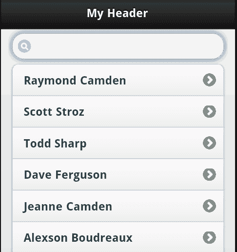

如果您在上一个字段中开始输入，列表会在您输入时自动过滤出结果：

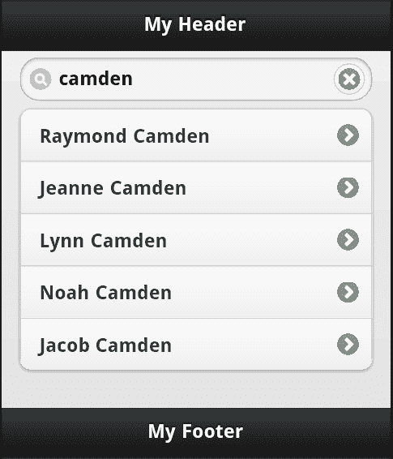

默认情况下，搜索是不区分大小写的，并且匹配列表项的任何位置。您可以在`ul`标签中使用`data-placeholder-text="Something"`来为搜索表单指定占位文本。您还可以使用`data-filter-theme`指定表单的特定主题。最后，您可以使用 JavaScript 根据情况添加自定义的列表过滤逻辑。

# 总结

本章讨论了如何在 jQuery Mobile 中使用列表视图。我们看到如何将常规 HTML 列表转换为移动优化列表，并演示了框架提供的众多列表功能类型。

在下一章中，我们将利用已学到的知识构建一个真实（尽管有点简单）的酒店移动优化网站。
