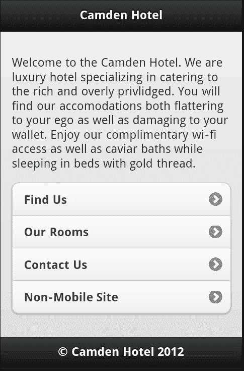
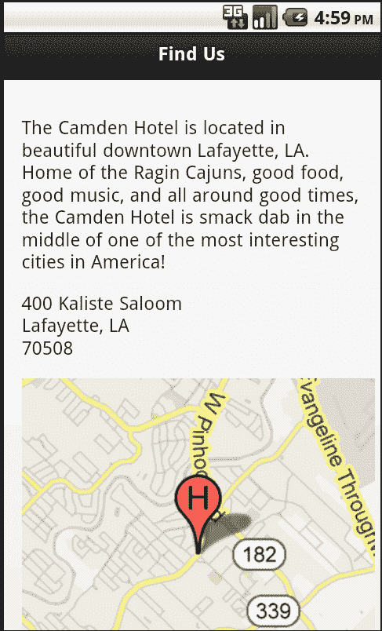
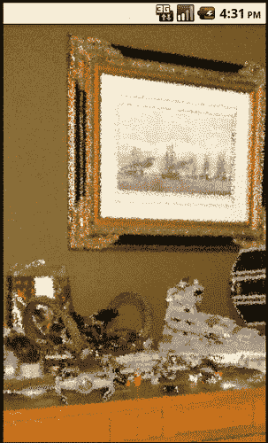
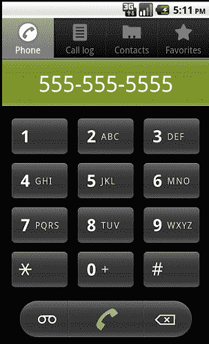

# 第五章：实践中的一些 —— 构建一个简单的酒店移动网站

在过去的四章中，我们已经看了 jQuery Mobile 的一些特性，但我们已经有足够的知识来构建一个简单、相当基本的移动优化网站了。

在本章中，我们将：

+   讨论我们酒店移动网站将包含什么

+   使用 jQuery Mobile 创建酒店移动网站

+   讨论使网站更具互动性的方法

# 欢迎来到 Hotel Camden

世界闻名的 Hotel Camden 现在已经有了一段时间的网络存在。（好吧，为了明确起见，我们是在编造这个！）他们是网络世界的早期创新者，从 1996 年开始建立一个简单的网站，并逐年改进他们的在线存在。现在，Hotel Camden 的在线访客可以看到房间的虚拟游览，使用令人惊叹的 3D Adobe Flash 插件查看场地，并实际上可以在线预订。不过，最近，Hotel Camden 的业主们决定他们想进入移动空间。目前，他们想要简单地开始，创建一个包含以下功能的移动优化网站：

+   **联系信息：**这将包括电话号码和电子邮件地址。理想情况下，用户将能够点击这些联系方式并与真人联系。

+   **酒店位置地图：**这应该包括地址，可能还有地图。

+   **可用的房间类型：**这可以是一个从最简单到最华丽的房间的简单列表。

+   最后 - 提供一种让用户进入真正网站的方式。我们接受我们的移动版本在某种程度上会有所限制（对于这个版本），所以至少我们应该提供一种让用户返回站点桌面版本的方式。

# 主页

让我们从 Camden Hotel 的初始主页开始。这将提供一个简单的选项列表，以及顶部的一些营销文本。这些文本实际上对任何人都没有帮助，但是营销人员不会让我们在没有它的情况下发布网站：

```js
Listing 5-1: index.html
<!DOCTYPE html>
<html>
<head>
<title>The Camden Hotel</title>
<meta name="viewport" content="width=device-width, initial- scale=1">
<link rel="stylesheet" href="http://code.jquery.com/mobile/ latest/jquery.mobile.min.css" />
<script src="img/jquery- 1.7.1.min.js"></script>
<script src="img/jquery.mobile.min.js"></script>
</head>
<body>
<div data-role="page">
<div data-role="header">
<h1>Camden Hotel</h1>
</div>
<div data-role="content">
<p>
Welcome to the Camden Hotel. We are a luxury hotel specializing in catering to the rich and overly privileged. You will find our accommodations both flattering to your ego, as well as damaging to your wallet. Enjoy our complimentary wi-fi access, as well as caviar baths while sleeping in beds with gold thread.
</p>
<ul data-role="listview" data-inset="true">
<li><a href= "find.html">Find Us</a></li>
<li><a href= "rooms.html">Our Rooms</a></li>
<li><a href= "contact.html">Contact Us</a></li>
<li><a href= "">Non-Mobile Site</a></li>
</ul>
</div>
<div data-role="footer">
<h4>&copy; Camden Hotel 2012</h4>
</div>
</div>
</body>
</html>

```

在高层次上，`listing 5-1` 中的代码只是我们之前讨论过的 jQuery 页面模型的另一个实例。您可以看到包括的 CSS 和 JavaScript，以及设置页面、页眉、页脚和内容的 div 包装器。在我们的内容 div 中，您还可以看到正在使用的列表。我们留空了非移动站点选项（“非移动站点”）的 URL，因为我们没有一个真正的网站用于 Camden Hotel。

列表项的顺序也经过深思熟虑。每个项目按照员工认为的最常见请求的顺序列出，第一个是简单地找到酒店，而最后一个选项（忽略离开网站）是能够联系酒店。

总的来说 - 这个示例的想法是为我们认为酒店客户最需要的最重要的方面提供快速访问。以下截图显示了网站的外观：



它并不是非常吸引人，但渲染效果很好，而且使用起来相当容易。稍后你会学习如何为 jQuery Mobile 设计主题，使您的网站不像其他所有示例一样。

# 寻找酒店

我们移动网站的下一页专注于帮助用户找到酒店。这将包括地址以及地图。`Listing 5-2` 显示了这是如何完成的：

```js
Listing 5-2: find.html
<!DOCTYPE html>
<html>
<head>
<title>The Camden Hotel - Find Us</title>
<meta name="viewport" content="width=device-width, initial- scale=1">
<link rel="stylesheet" href="http://code.jquery.com/mobile/ latest/jquery.mobile.min.css" />
<script src="img/jquery- 1.7.1.min.js"></script>
<script src="img/ jquery.mobile.min.js"></script>
</head>
<body>
<div data-role="page">
<div data-role="header">
<h1>Find Us</h1>
</div>
<div data-role="content">
<p>
The Camden Hotel is located in beautiful downtown Lafayette, LA. Home of the Ragin Cajuns, good food, good music, and all around good times, the Camden Hotel is smack dab in the middle of one of the most interesting cities in America!
</p>
<p>
400 Kaliste Saloom<br/>
Lafayette, LA<br/>
70508
</p>
<p>

</p>
</div>
<div data-role="footer">
<h4>&copy; Camden Hotel 2012</h4>
</div>
</div>
</body>
</html>

```

模板的开头再次包含了我们的样板，并且与以前一样，顶部有一些营销用语。但是在这之下，就是地址和地图。我们使用了谷歌的一个很酷的功能，静态地图。您可以在其主页上了解更多关于谷歌静态地图的信息：[`code.google.com/apis/maps/documentation/staticmaps/`](http://code.google.com/apis/maps/documentation/staticmaps/)。基本上，这是通过 URL 参数创建静态地图的一种方式。这些地图没有缩放或平移，但如果您只想向用户展示您的业务所在的位置，这是一种非常强大且简单的方法。虽然您可以使用此 API 的大量选项，但我们的示例只是将其居中到一个地址，并在那里添加一个标记。标签 **H** 用于标记，但也可以使用自定义图标。以下截图显示了这是什么样子的：



您可以稍微调整一下地图 URL，更改缩放比例，更改颜色等，以满足您的喜好。

# 列出酒店房间

现在让我们看看 `rooms.html`。这是我们将列出酒店可用房型的地方：

```js
Listing 5-3: rooms.html
<!DOCTYPE html>
<html>
<head>
<title>The Camden Hotel - Our Rooms</title>
<meta name="viewport" content="width=device-width, initial- scale=1">
<link rel="stylesheet" href="http://code.jquery.com/mobile/ latest/jquery.mobile.min.css" />
<script src="img/jquery- 1.7.1.min.js"></script>
<script src="img/jquery.mobile.min.js"></script>
</head>
<body>
<div data-role="page">
<div data-role="header">
<h1>Our Rooms</h1>
</div>
<div data-role="content">
<p>
Select a room below to see a picture.
</p>
<ul data-role="listview" data-inset="true">
<li><a href= "room_poor.html">Simple Elegance</a></li>
<li><a href= "room_medium.html">Gold Standard</a></li>
<li><a href= "room_high.html">Emperor Suite</a></li>
</ul>
</div>
<div data-role="footer">
<h4>&copy; Camden Hotel 2012</h4>
</div>
</div>
</body>
</html>

```

房间页面只是他们房间的一个列表。酒店有三个级别的房间，每个都链接到列表中，用户可以获取详情。您可以在从 Github 下载的 ZIP 中找到所有三个文件，但让我们详细看看其中一个：

```js
Listing 5-4: room_high.html
<!DOCTYPE html>
<html>
<head>
<title>The Camden Hotel - Emperor Suite</title>
<meta name="viewport" content="width=device-width, initial- scale=1">
<link rel="stylesheet" href="http://code.jquery.com/mobile/ latest/jquery.mobile.min.css" />
<script src="img/jquery- 1.7.1.min.js"></script>
<script src="img/jquery.mobile.min.js"></script>
</head>
<body>
<div data-role="page" data-fullscreen="true">
<div data-role="header" data-position="fixed">
<h1>Emperor Suite</h1>
</div>
<div data-role="content">

</div>
<div data-role="footer" data-position="fixed">
<h4>&copy; Camden Hotel 2012</h4>
</div>
</div>
</body>
</html>

```

房间详细信息页面只是一个图片。不是很有用，但它可以传达重点。但请注意，我们使用了在 第三章 中学到的一个技巧，*通过工具栏增强页面* - 全屏模式。这允许用户快速点击并隐藏标题，以便他们可以看到房间的全部风采：



# 联系酒店

现在让我们来看看联系页面。这将为用户提供到达酒店的信息：

```js
Listing 5-5: contact.html
<!DOCTYPE html>
<html>
<head>
<title>The Camden Hotel - Contact</title>
<meta name="viewport" content="width=device-width, initial- scale=1">
<link rel="stylesheet" href="http://code.jquery.com/mobile/ latest/jquery.mobile.min.css" />
<script src="img/jquery- 1.7.1.min.js"></script>
<script src="img/jquery.mobile.min.js"></script>
</head>
<body>
<div data-role="page">
<div data-role="header">
<h1>Contact Us</h1>
</div>
<div data-role="content">
<p>
<b>Phone:</b> <a href= "tel:555-555-5555"> 555-555-5555</a><br/>
<b>Email:</b> <a href= "mailto:people@camdenhotel.fake"> people@camdenhotel.fake</a>
</p>
</div>
<div data-role="footer">
<h4>&copy; Camden Hotel 2012</h4>
</div>
</div>
</body>
</html>

```

与以前一样，我们将页面包装在正确的脚本块和 `div` 标签中。特别注意我们的两个链接。手机和电子邮件链接都使用可能对您不熟悉的 URL。第一个 `tel:555-555-555` 实际上是请求移动设备拨打电话号码的一种方式。点击它会弹出拨号器，如下图所示：



这使得用户可以快速拨打酒店电话。同样，mailto 链接可以让用户快速给酒店发送电子邮件。还有其他的 URL 方案，包括用于发送短信的方案。正如你可能猜到的那样，这个方案使用形式“sms”，所以要开始向电话号码发送短信，你可以使用以下 URL：`sms://5551112222`。

# 摘要

在本章中，我们总结了到目前为止所学的知识，并为一家虚拟酒店建立了一个非常简单但有效的网站。这个网站分享了关于酒店的基本信息，方便需要在移动设备上了解酒店情况的人，利用了 Google 的静态地图 API 来创建一个显示酒店位置的简单地图，并演示了使用`tel`和`mailto`URL 方案进行自动拨打电话和发送电子邮件的方法。

在下一章中，我们将看看表单以及如何使用 jQuery Mobile 自动改进它们。
