# 第六章：使用表单和 jQuery Mobile

在本章中，我们将研究表单。表单是大多数网站的关键部分，因为它们为用户提供了与网站交互的主要方式。jQuery Mobile 在使表单既可用又为移动设备设计上有很大帮助。

在本章中，我们将：

+   讨论 jQuery Mobile 处理表单的方式

+   使用示例表单并描述结果的处理方式

+   讨论如何构建特定类型的表单并利用 jQuery Mobile 的惯例

# 在您开始之前

在本章中，我们将讨论表单以及 jQuery Mobile 如何增强它们。作为我们讨论的一部分，我们将把我们的表单提交到服务器上。为了让服务器实际对响应做些什么，我们将使用 Adobe 的一个称为 ColdFusion 的应用服务器。ColdFusion 在生产中不免费，但是在开发中是 100%免费的，并且是构建 Web 应用程序的一个很好的服务器。您不需要下载 ColdFusion。如果不这样做，您在本章中使用的表单不应该提交。本章确实讨论了如何提交表单，但是对表单的响应并不是真正关键的。如果您了解另一种语言，比如 PHP，您应该能够简单地模仿 ColdFusion 使用的代码来回显表单数据。

ColdFusion（当前版本为 9）可在[`www.adobe.com/go/coldfusion`](http://www.adobe.com/go/coldfusion)下载。Windows、OS X 和 Linux 版本都存在。如上所述，您可以在开发服务器上免费运行 ColdFusion，没有超时限制。

# jQuery Mobile 对表单的处理

在我们进入代码之前，有两件非常重要的事情您应该知道 jQuery Mobile 将如何处理您的 HTML 表单：

+   所有表单都将通过 Ajax 提交其数据。这意味着数据直接发送到您表单的操作，并且结果将被带回给用户并放置在容纳表单的页面中。这样可以防止完整页面重新加载。

+   所有表单字段都会自动增强，每个都有自己的方式。随着我们在本章中的进行，您将看到这方面的示例，但基本上 jQuery Mobile 修改您的表单字段以在移动设备上更好地工作。一个很好的例子是按钮。jQuery Mobile 自动扩大和增高按钮，使其更易于在手机的小型形式因素中点击。如果出于某种原因您不喜欢这样做，jQuery Mobile 提供了一种方法来禁用此功能，可以在全局或每次使用的基础上。

考虑到这一点，让我们看看我们第一个示例`列表 6-1：`

```js
Listing 6-1: test1.html
<!DOCTYPE html>
<html>
<head>
<title>Form Example 1</title>
<meta name="viewport" content="width=device-width, initial- scale=1">
<link rel="stylesheet" href="http://code.jquery.com/mobile/ latest/jquery.mobile.min.css" />
<script src="img/jquery- 1.7.1.min.js"></script>
<script src="img/jquery.mobile.min.js"></script>
</head>
<body>
<div data-role="page">
<div data-role="header">
<h1>Form Demo</h1>
</div>
<div data-role="content">
<form action="echo.cfm" method="post">
<div data-role="fieldcontain">
<label for="name">Name:</label>
<input type="text" name="name" id="name" value="" />
</div>
<div data-role="fieldcontain">
<label for="email">Email:</label>
<input type="text" name="email" id="email" value="" />
</div>
<div data-role="fieldcontain">
<input type="submit" name="submit" value="Send" />
</div>
</form>
</div>
</div>
</body>
</html>

```

与往常一样，模板从适当的包含开始，并使用特殊标记的`div`标签包裹页面的主要内容。我们将专注于主要内容区域的表单字段。建议每个表单字段都用以下标记包装：

```js
<div data-role="fieldcontain">
</div>

```

这将帮助 jQuery Mobile 对齐标签和表单字段。一会儿你就会明白原因。我们的表单有两个文本字段，一个用于姓名，一个用于电子邮件。最后一项只是提交按钮。所以除了使用`fieldcontain`包装器并确保我们的表单字段有标签之外，这里没有发生任何特别的事情。不过马上你就会看到表单发生了一些相当令人印象深刻的变化：

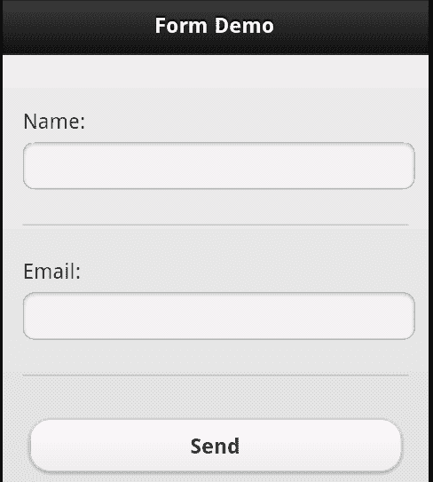

请注意标签是如何显示在表单字段上方的。这在移动设备上为字段提供了更多的空间。同时请注意提交按钮很大且易于点击。如果我们旋转设备，jQuery Mobile 会更新显示以利用额外的空间：

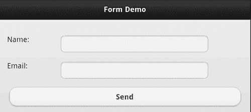

请注意，字段现在直接对齐到其标签的右侧。那么当表单提交时会发生什么？正如本章开头所提到的，我们将使用 ColdFusion 来处理对表单请求的响应。我们的`echo.cfm`模板将简单地循环遍历所有表单字段并将它们显示给用户：

```js
Listing 6-2: echo.cfm
<div data-role="page">
<div data-role="header">
<h1>Form Result</h1>
</div>
<div data-role="content">
<cfloop item="field" collection="#form#">
<cfoutput>
<p>
The form field #field# has the value #form[field]#.
</p>
</cfoutput>
</cfloop>
</div>
</div>

```

如果您不想安装 ColdFusion，您可以简单地编辑`listing 6-1`中的表单操作值，将其指向一个 PHP 文件，或者任何其他服务器端处理器。您也可以将其简单地更改为文件本身`test1.html`。当您提交时，什么都不会发生，但您也不会收到错误。这是设备在提交后显示的内容：

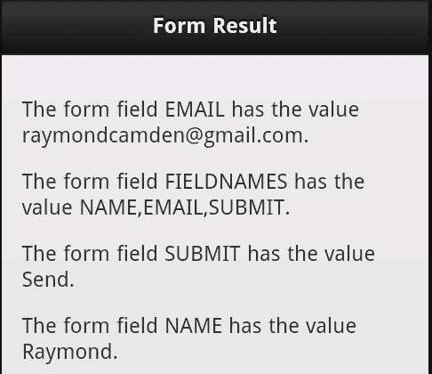

jQuery Mobile 更新表单字段的另一个很好的例子是`textarea。textarea`，默认情况下，在移动设备上使用起来可能会非常困难，特别是当文本量超出`textarea`的大小并添加滚动条时。在以下代码清单中，我们只是修改了先前的表单，包括第三个项目，一个使用了`textarea`的个人简介字段。完整文件可在本书的代码 ZIP 文件中找到。以下代码片段是添加到前两个字段之后的`div`块：

```js
<div data-role="fieldcontain">
<label for="bio">Bio:</label>
<textarea name="bio" id="bio" />
</div>

```

当在设备上查看时，`textarea`会展开以吸收更多的宽度，就像常规文本字段一样，并且会变得更高：


但一旦您开始输入并输入多行文本时，`textarea`会自动扩展：

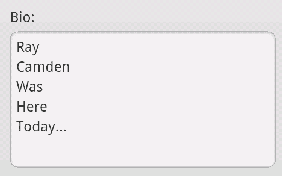

这样比使用滚动条更容易阅读。现在让我们看看另一个常见的表单选项——单选按钮和复选框。

## 操作单选按钮和复选框

单选按钮和复选框也被更新为在移动设备上很好地工作，但需要稍微多一点的代码。在之前的例子中，我们用一个`div`标签包装了表单字段，该标签使用了`data-role="fieldcontain"`。当操作单选按钮和复选框时，需要一个额外的标签：

```js
<fieldset data-role="controlgroup">

```

此`fieldset`标签将用于将您的单选按钮或复选框分组在一起。`清单 6-3`演示了一组单选按钮和一组复选框：

```js
Listing 6-3: test3.html
<!DOCTYPE html>
<html>
<head>
<title>Form Example 3</title>
<meta name="viewport" content="width=device-width, initial- scale=1">
<link rel="stylesheet" href="http://code.jquery.com/mobile/ latest/jquery.mobile.min.css" />
<script src="img/jquery- 1.7.1.min.js"></script>
<script src="img/jquery.mobile.min.js"></script>
</head>
<body>
<div data-role="page">
<div data-role="header">
<h1>Form Demo</h1>
</div>
<div data-role="content">
<form action="echo.cfm" method="post">
<div data-role="fieldcontain">
<fieldset data-role="controlgroup">
<legend>Favorite Movie:</legend>
<input type="radio" name="favoritemovie" id="favoritemovie1" value="Star Wars">
<label for="favoritemovie1">Star Wars</label>
<input type="radio" name="favoritemovie" id="favoritemovie2" value="Vanilla Sky">
<label for="favoritemovie2">Vanilla Sky</label>
<input type="radio" name="favoritemovie" id="favoritemovie3" value="Inception">
<label for="favoritemovie3">Inception</label>
</fieldset>
</div>
<div data-role="fieldcontain">
<fieldset data-role="controlgroup">
<legend>Favorite Colors:</legend>
<input type="checkbox" name="favoritecolor" id="favoritecolor1" value="Green">
<label for="favoritecolor1">Green</label>
<input type="checkbox" name="favoritecolor" id="favoritecolor2" value="Red">
<label for="favoritecolor2">Red</label>
<input type="checkbox" name="favoritecolor" id="favoritecolor3" value="Yellow">
<label for="favoritecolor3">Yellow</label>
</fieldset>
</div>
<input type="submit" name="submit" value="Send" />
</div>
</form>
</div>
</div>
</body>
</html>

```

我们的表单有两个主要问题——您最喜欢的电影是什么以及您最喜欢的颜色是什么？每个块都包裹在我们之前提到的`div`标签中。在其中是使用`data-role="controlgroup"`的`fieldset`。最后，您然后有您的单选按钮和复选框组。重要的是要在适当的标签标签内包含标签，就像之前的每个示例中一样。一旦渲染，jQuery Mobile 将这些组合成一个漂亮的、单一的控件：

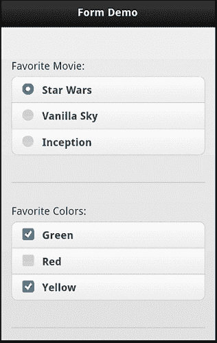

注意每个项目的宽可点击区域。这样在移动设备上更容易选择项目。这两个控件的另一个有趣功能是将它们转换为水平按钮栏的能力。在`test4.html`中，两个`fieldset`标签被修改以包含一个新的数据属性：

```js
<fieldset data-role="controlgroup" data-type="horizontal">

```

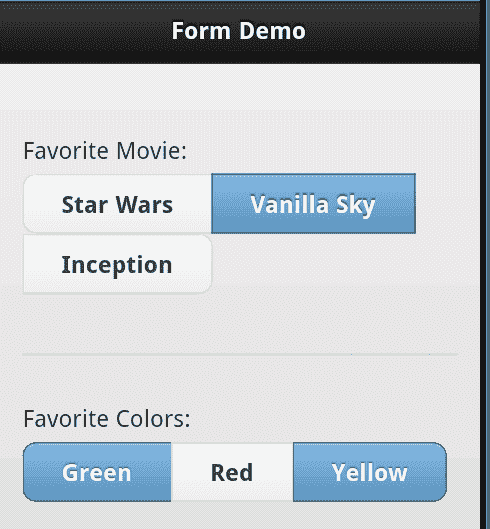

正如您所见，效果在第一组中的较长文本中效果不佳，因此请务必进行测试。

## 使用选择菜单

另一个 jQuery Mobile 表单增强的示例是使用选择菜单。与我们之前的示例一样，我们利用一个`fieldcontain div`和`label`标签，但在那之外，`select`标签像往常一样使用。以下代码片段来自`test5.html`：

```js
<div data-role="fieldcontain">
<label for="favmovie">Favorite Movie:</label>
<select name="favmovie" id="favmovie">
<option value="Star Wars">Star Wars</option>
<option value="Revenge of the Sith">Revenge of the Sith</option>
<option value="Tron">Tron</option>
<option value="Tron Legacy">Tron Legacy</option>
</select>
</div>

```

在移动设备上，选择的初始显示被修改为更容易点击：

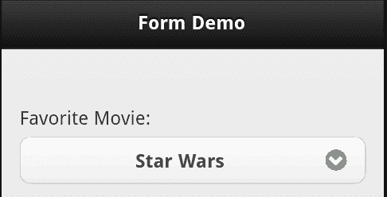

但是，一旦点击，设备的原生菜单将接管。在您使用的平台上，这将看起来不同。以下截图显示了 Android 如何渲染菜单：

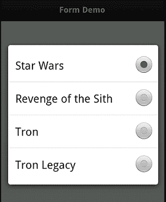

另一个与选择字段一起使用的选项是分组。jQuery Mobile 允许您垂直或水平将多个选择字段组合在一起。在这两种情况下，唯一需要的就是将您的选择字段包装在一个`fieldset`中，并使用`data-role`为`controlgroup`，就像我们之前为单选按钮和复选框所做的那样。以下代码片段是垂直对齐的选择字段组的示例：

```js
<div data-role="fieldcontain">
<fieldset data-role="controlgroup">
<legend>Trip Setup:</legend>
<label for="location">Location</label>
<select name="location" id="location">
<option value="Home">Home</option>
<option value="Work">Work</option>
<option value="Moon">Moon</option>
<option value="Airport">Airport</option>
</select>
<label for="time">Time</label>
<select name="time" id="time">
<option value="Morning">Morning</option>
<option value="Afternoon">Afternoon</option>
<option value="Evening">Evening</option>
</select>
<label for="time">Meal</label>
<select name="meal" id="meal">
<option value="Meat">Meat</option>
<option value="Vegan">Vegan</option>
<option value="Kosher">Kosher</option>
</select>
</fieldset>
</div>

```

此模板的其余部分可以在`test6.html`中找到。以下截图显示了它的外观：

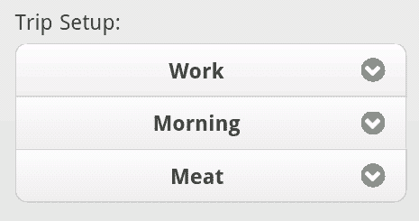

请注意 jQuery Mobile 如何将它们分组在一起，并将边角圆润地呈现出来。水平版本可以通过在 fieldset 标签中添加一个`data-type="horizontal"`属性来实现。另外，重要的是要删除使用“fieldcontain”的`div`。这是一个示例（完整文件可以在`test7.html`中找到）：

```js
<div data-role="page">
<div data-role="header">
<h1>Form Demo</h1>
</div>
<div data-role="content">
<form action="echo.cfm" method="post">
<fieldset data-role="controlgroup" data-type="horizontal">
<legend>Trip Setup:</legend>
<label for="location">Location</label>
<select name="location" id="location">
<option value="Home">Home</option>
<option value="Work">Work</option>
<option value="Moon">Moon</option>
<option value="Airport">Airport</option>
</select>
<label for="time">Time</label>
<select name="time" id="time">
<option value="Morning">Morning</option>
<option value="Afternoon">Afternoon</option>
<option value="Evening">Evening</option>
</select>
<label for="meal">Meal</label>
<select name="meal" id="meal">
<option value="Meat">Meat</option>
<option value="Vegan">Vegan</option>
<option value="Kosher">Kosher</option>
</select>
</fieldset>
<div data-role="fieldcontain">
<input type="submit" name="submit" value="Send" />
</div>
</form>
</div>
</div>

```

以下截图显示了结果：


## 搜索、切换和滑块字段

除了接受常规表单字段并使其更好地工作外，jQuery Mobile 还有助于使一些较新的 HTML5 表单字段在多个浏览器上正确工作。尽管在桌面上对于每个主要浏览器的支持尚未确定，但 jQuery Mobile 为搜索、切换和滑块字段提供了内置支持。让我们看看每个字段。

### 搜索字段

这三个新字段中最简单的是搜索字段，它在您开始输入后在字段末尾添加了一个快速删除图标。某些设备还会在前面放置一个沙漏图标，以帮助传达该字段用于某种类型的搜索的概念。要使用此字段，只需将类型从文本切换到搜索即可。就像下面的来自`test8.html`的例子一样：

```js
<div data-role="fieldcontain">
<label for="name">Name:</label>
<input type="search" name="name" id="name" value="" />
</div>

```

以下截图是结果。请注意，我已经输入了一些内容，字段会自动在末尾添加一个**删除**图标：

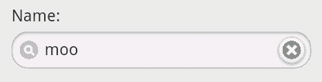

### 翻转切换字段

翻转切换字段是在一个值和两个值之间切换的控件。创建切换字段涉及使用具有特定 data-role 值的选择控件。现在，这里可能会有点混乱。要使选择字段变为切换字段，您可以使用`data-role="slider"`。稍后我们将看到另一个滑块控件，但它使用了不同的技术。只需记住，即使您在 HTML 中看到`"slider"`，我们实际上正在创建的是一个切换控件。让我们看一个简单的例子。（您可以在`test9.html`中找到此完整源代码）：

```js
<div data-role="fieldcontain">
<label for="gender">Gender:</label>
<select name="gender" id="gender" data-role="slider">
<option value="0">Male</option>
<option value="1">Female</option>
</select>
</div>

```

一旦由 jQuery Mobile 渲染，以下截图显示了结果，首先是默认的**男性**选项，然后是**女性**：


### 滑块字段

对于我们特殊字段中的最后一个，我们来看看滑块。与搜索字段一样，这是基于一项 HTML5 规范，在某些浏览器中有效，在其他浏览器中无效。jQuery Mobile 只需使其在所有地方都起作用。为了启用此字段，我们将普通文本字段切换类型为`"range"`，为我们的滑块提供范围，我们还提供了`min`和`max`值。您还可以通过添加属性`data-highlight="true"`为滑块添加额外的颜色。以下代码片段是一个示例。（您可以在`test10.html`中找到完整文件）：

```js
<div data-role="fieldcontain">
<label for="coolness">Coolness:</label>
<input type="range" name="coolness" id="coolness" min="0" max="100" value="22" data-highlight="true">
</div>

```

结果是一个滑块控件和一个输入字段。两者都允许您在最小值和最大值之间修改值：

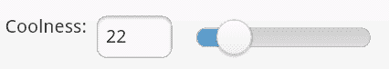

请注意，范围的 HTML5 规范支持步长属性。虽然这在一些浏览器中有效，但 jQuery Mobile 尚未直接支持。换句话说，jQuery Mobile 不会尝试在没有内置支持的浏览器上添加此支持。只要您意识到它可能不始终按预期工作，就可以添加该属性。

## 使用原生表单控件

现在你已经看到 jQuery Mobile 为增强和加强你的表单字段以在移动设备上更好地工作所做的努力，但如果你不喜欢 jQuery Mobile 的工作呢？如果你喜欢它对按钮的更新但厌恶它对下拉框的更改呢？幸运的是，jQuery Mobile 提供了一种简单的方法来禁用自动增强。在每个你希望保持不变的字段中，只需在标记中添加 `data-role="none"`。所以根据以下 HTML，第一个项目将被更新，而第二个项目不会：

```js
<input type="submit" value="Awesome">
<input type="submit" value="Not So Awesome" data-role="none">

```


另一个选项是在初始化 jQuery Mobile 时禁用它。该选项将在第九章中讨论，*jQuery Mobile 中的 JavaScript 配置和实用程序*。

# 使用“迷你”字段

在前面的示例中，我们看到了 jQuery Mobile 如何自动增强表单字段，使它们在较小的、基于触摸的设备上更易于使用。一般来说，jQuery Mobile 将你的字段变得更大更漂亮。虽然这在大多数情况下是可取的，但你可能希望让你的表单字段减肥一点。这对于将表单字段放置在页眉或页脚中尤其如此。jQuery Mobile 支持任何表单字段上的属性，可以创建字段的更小版本：`data-mini="true"`。以下代码片段是一个完整的示例：

```js
<div data-role="fieldcontain">
<label for="name">Name:</label>
<input type="search" name="name" id="name" value="" />
</div>
<div data-role="fieldcontain">
<label for="name">Name (Slim):</label>
<input type="search" name="name" id="name" value="" data- mini="true" />
</div>

```

结果有点微妙，但你可以在以下截图的第二个字段中看到高度差异：

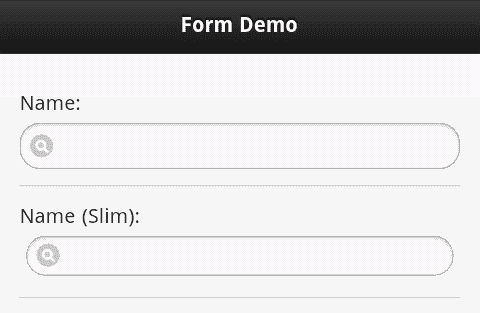

这个例子可以在名为 `test12.html` 的文件中找到。

# 摘要

在本章中，我们讨论了表单以及它们在 jQuery Mobile 应用程序中的呈现方式。我们讨论了 jQuery Mobile 如何自动将所有表单提交转换为基于 Ajax 的调用，并更新表单字段以在移动设备上更好地工作。不仅所有的表单字段都会自动更新，而且你还可以使用新的控件，如切换、滑块和搜索输入。

在下一章中，我们将看一下模态对话框、小部件和布局网格。这些为你的移动优化站点提供了额外的 UI 选项。
