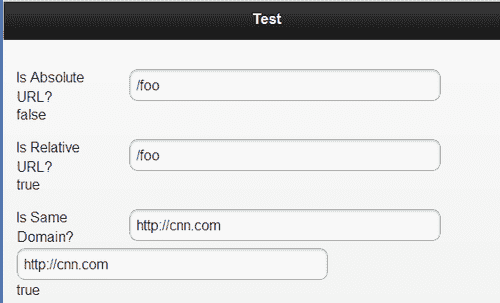
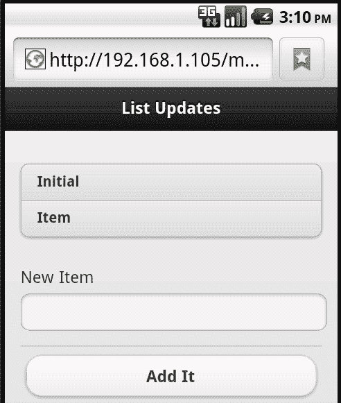
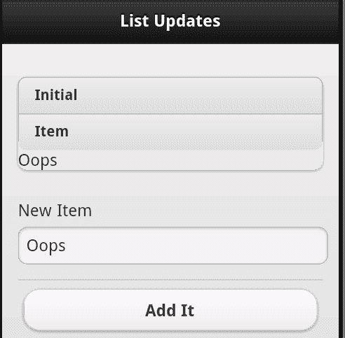
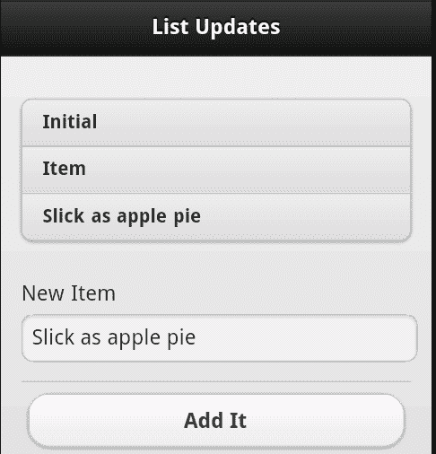

# 第八章：jQuery Mobile 配置、实用工具和 JavaScript 方法

在本章中，我们将看看如何使用 JavaScript 进一步配置和增强 jQuery Mobile 网站。到目前为止，我们已经使用 HTML 和 CSS 来生成所有内容。现在我们将看看额外的脚本，为您的网站添加额外的功能。

在本章中，我们将：

+   解释了如何通过 JavaScript 配置 jQuery Mobile 网站

+   讨论了使用 jQuery Mobile 的各种 JavaScript 实用工具以及它们的使用方式

+   解释了用于处理增强的 jQuery Mobile 表单和小部件控件的 API

# 配置 jQuery Mobile

jQuery Mobile 对您做了许多事情 - 从改善页面导航到改变表单控件的工作方式。所有这些都是为了让您的内容在移动环境中更好地运行。然而，有时您并不希望 jQuery Mobile 做某些事情，或者也许您只是想微调框架的行为。这就是配置的作用所在。

要配置 jQuery Mobile 网站，您首先需要编写代码来监听`mobileinit`事件。这可以使用普通的 jQuery 事件处理程序来监听，类似以下代码片段：

```js
$(document).bind("mobileinit", function() {
//your customization here
});

```

为了捕获此事件，您必须在 jQuery Mobile 实际加载之前对其进行配置。最简单的方法，也是 jQuery Mobile 文档建议的方法，就是将此代码放在加载 jQuery Mobile JavaScript 库之前的脚本中。以下代码片段显示了我们文件标头的典型样式：

```js
<!DOCTYPE html>
<html>
<head>
<title>Dialog Test</title>
<meta name="viewport" content="width=device-width, initial- scale=1">
<link rel="stylesheet" href="http://code.jquery.com/mobile/ latest/jquery.mobile.min.css" />
<script src="img/jquery- 1.7.1.min.js"></script>
<script src="img/jquery.mobile.min.js"></script>
</head>

```

请注意，jQuery Mobile 库是最后一个加载的。我们可以简单地在其之前添加一个新的脚本标签：

```js
<!DOCTYPE html>
<html>
<head>
<title>Dialog Test</title>
<meta name="viewport" content="width=device-width, initial- scale=1">
<link rel="stylesheet" href="http://code.jquery.com/mobile/ latest/jquery.mobile.min.css" />
<script src="img/jquery- 1.7.1.min.js"></script>
<script src="img/config.js"></script>
<script src="img/jquery.mobile.min.js"></script>
</head>

```

配置 jQuery Mobile 就像更新`$.mobile`对象一样简单。以下代码片段是一个简单的示例：

```js
$(document).bind("mobileinit", function() {
$.mobile.someSetting="some value here";
});

```

此对象包含一组可配置的各种设置的键/值对。实际上不需要创建它 - 它在运行事件处理程序时已经存在。另一个选项是利用 jQuery 的`extend()`功能，如下面的代码片段所示：

```js
$(document).bind("mobileinit", function() {
$.extend($.mobile, {
someSetting:"some value here"
});
});

```

两种表单都可以，并且完全相同。可以使用您觉得更舒适的任何一种。现在，让我们看看各种配置选项：

| 设置 | 使用 |
| --- | --- |
| `ns` | 这是用于数据属性的命名空间值。默认为空。如果要为 jQuery Mobile-recognized 数据属性添加前缀，则可以在此处指定值。因此，例如，如果要使用`data-jqm-role="page"`而不是`data-role="page"`，则可以将`ns`值配置为`jqm`。 |
| `activeBtnClass` | 这只是设置在活动状态下按钮使用的类名。默认值为`ui-btn-active`。 |
| `activePageClass` | 这设置了当前正在查看的页面的类名。默认值为`ui-page-active`。 |
| `ajaxEnabled` | 我们之前讨论过 Ajax 既用于页面加载，也用于表单提交。如果你希望禁用此功能，请将此值设置为 `false`。默认情况下是`true`。 |
| `allowCrossDomainPages` | 一个默认值为 false 的安全设置，将其设置为 true 允许通过 `$.mobile.loadPage` 加载来自另一个服务器的远程页面。通常仅在需要从另一个服务器加载内容的 PhoneGap 应用程序中需要。 |
| `autoInitializePage` | 通常情况下，jQuery Mobile 在加载时会运行 `$.mobile.initializePage`。这会显示渲染页面。（目前，这个特定功能并没有得到很好的文档记录。）如果你希望禁用此默认值，请将`autoInitializePage`设置为 `false`。你需要手动运行`$.mobile.initializePage`。 |
| `defaultDialogTransition` | 指定显示或隐藏对话框时使用的过渡效果。默认值为 `pop`。可能的值包括：`fade, flip, pop, slide, slidedown` 和 `slideup`。 |
| `defaultPageTransition` | 类似于前一个选项，这个设置用于页面加载时的过渡效果。默认值为 `slide`，可能的选项与前一个选项类似。 |
| `gradea` | 用于确定什么才是一个“好”浏览器。这由 jQuery Mobile 处理，但如果你想否决框架，或定义必须满足的其他条件，你可以在这里提供一个返回布尔值（true 或 false）的函数。 |
| `hashListeningEnabled` | 指的是监听浏览器的 `location.hash` 属性的能力。jQuery Mobile 通常会处理这个，但如果将值设置为 `false`，你可以编写自己的代码来响应这些变化。 |
| `ignoreContentEnabled` | 通常情况下，jQuery Mobile 会自动增强任何可能的东西。你可以在某些情况下在控件级别禁用该功能，但也可以通过添加 `data-enhance=true` 告诉 jQuery Mobile 忽略特定容器内的所有内容。如果你使用了这个功能，那么你的配置必须设置 `ignoreContentEnabled` 为 `true`。这告诉 jQuery Mobile 寻找并遵守该特定标志。默认情况下设置为 `false`，可以让 jQuery Mobile 更快地完成它的工作。 |
| `linkBindingEnabled` | jQuery Mobile 通常会监听所有链接点击。如果你希望全局禁用这个功能，可以通过这个设置来实现。 |
| `loadingMessage` | 这指定了页面加载时使用的文本。通常是“loading”，但你可能会在此处使用自定义代码来检查用户的语言环境，并使用特定的本地化版本。然而，消息通常是隐藏的。有关更多信息，请参阅下一个设置。 |
| `loadingMessageTextVisible` | 当页面由 jQuery Mobile 加载时，只会使用一个加载图形。如果你希望显示一条消息，将这个值设置为 `true`。默认值为 `false`。 |
| `loadingMessageTheme` | 用于页面加载对话框的主题。默认值为 `a`。 |
| `minScrollBack` | 当用户返回到页面时，jQuery Mobile 将尝试记住您在页面中滚动的位置。这在用户在访问另一个页面后返回到的大页面上可能很有用。默认情况下，如果滚动超过默认值 `150`，则会记住滚动位置。 |
| `pageLoadErrorMssage` | 如果加载页面时发生错误，则向用户显示的消息。默认为 **Error Loading Page**，但出于本地化原因（或其他任何原因），可能会更改。 |
| `pageLoadErrorMessageTheme` | 显示页面加载错误对话框时要使用的主题。默认值为 `e`。 |
| `pushStateEnabled` | 告诉 jQuery Mobile 使用 HTML5 `pushState` 功能而不是基于哈希的方式进行页面导航。默认值为 `true`。 |
| `subPageUrlKey` | jQuery Mobile 支持一个文件中的多个页面。为了使这些“虚拟”页面可书签化，jQuery Mobile 将在 URL 中追加一个值，该值包含前缀 `ui-page`。例如，`ui-page=yourpage`。此设置允许您自定义前缀。 |

这是相当多的选项，但通常您只需要配置其中一个或两个设置。让我们看一个简单的示例，其中使用了其中几个设置。`Listing 8-1` 是应用程序的主页。请注意，使用额外的脚本标签加载我们的配置：

```js
Listing 8-1: test1.html
<!DOCTYPE html>
<html>
<head>
<title>Page Transition Test</title>
<meta name="viewport" content="width=device-width, initial- scale=1">
<link rel="stylesheet" href="http://code.jquery.com/mobile/ latest/jquery.mobile.min.css" />
<script src="img/jquery- 1.6.4.min.js"></script>
<script src="img/config.js"></script>
<script src="img/jquery.mobile.min.js"></script>
</head>
<body>
<div data-role="page" id="first">
<div data-role="header">
<h1>Dialog Test</h1>
</div>
<div data-role="content">
<p>
<a href="#page2">Another Page</a><br/>
<a href="test2.html">Yet Another Page</a><br/>
</p>
</div>
</div>
<div data-role="page" id="page2">
<div data-role="header">
<h1>The Second</h1>
</div>
<div data-role="content">
<p>
This is the Second. Go <a href="#first">first</a>.
</p>
</div>
</div>
</body>
</html>

```

文件包含两个页面，并链接到另一个 `test2.html`。该页面只提供一个返回链接，因此不会包含在文本中。现在让我们看看 `config.js:`

```js
Listing 8-2: config.js
$(document).bind("mobileinit", function() {
$.mobile.defaultPageTransition = "fade";
$.mobile.loadingMessage="Fetching page...";
});

```

在 `config.js` 中，修改了两个设置 - 默认页面转换和页面加载消息。

在前一章中，我们讨论了表单以及 jQuery Mobile 如何自动增强控件。虽然您可以在 HTML 中禁止对控件的此增强，但还可以告诉 jQuery Mobile 一系列永远不要增强的控件。要设置此列表，请为 `$.mobile.page.prototype.options.keepnative` 指定一个值。该值应为一个选择器列表。与其中一个选择器匹配的任何字段都将*不会*被增强。

# 使用 jQuery Mobile 实用程序

现在我们已经讨论了 jQuery Mobile 的配置，请让我们看一下可用于您的应用程序的实用程序。这些是框架提供的实用程序，可在任何应用程序中使用。您可能不需要它们（或其中任何一个）在您的网站上，但知道它们存在可以帮助您节省将来的时间。

## 页面方法和实用程序

让我们开始查看与页面和页面之间导航相关的方法和实用程序：

+   `$.mobile.activePage:` 此属性是对当前页面的引用。

+   `$.mobile.changePage(page,options):` 此方法用于切换到另一个页面。第一个参数 page 可以是一个字符串（URL），也可以是 jQuery DOM 对象。`options` 参数是一个可选的键/值对对象。这些选项包括：

    +   `allowSamePageTransition:` 通常情况下，jQuery Mobile 不会允许您转换到相同的页面，但如果设置为 `false`，则会允许这样做。

    +   `changeHash:` 确定 URL 是否应该更改。

    +   `data:` 传递给下一页的值的字符串或对象。

    +   `data-url:` 用于浏览器中的 URL 的值。通常由用户要发送到的页面设置。你可以在这里覆盖它。

    +   `pageContainer:` jQuery Mobile 将页面放置在作为所有页面的 *包* 的 DOM 项中。你可以绕过此自动收集并使用 DOM 中的另一个项。

    +   `reloadPage:` 如果页面已经存在于浏览器中，jQuery Mobile 将从内存中获取它。将此设置为 `true` 将强制 jQuery Mobile 重新加载页面。

    +   `role:` jQuery Mobile 通常会查找加载的页面的 `data-role` 属性。要指定另一个角色，请设置此选项。

    +   `showLoadMsg:` 通常当页面被获取时，jQuery Mobile 会显示一个加载消息。你可以通过将此值设置为 `false` 来禁用此功能。

    +   `transition:` 使用什么过渡效果。请记住，这可以在全局级别进行配置。

    +   `type:` 我们之前提到过，jQuery Mobile 通过基于 Ajax 的请求加载新页面。`type` 选项允许你指定用于加载页面的 HTTP 方法。默认为 `get`。

+   `$.mobile.loadPage(page,options):` 这是一个更低级别的函数，当 `$.mobile.changePage` 被传递一个字符串 URL 来加载时使用。它的第一个参数与 `$.mobile.changePage` 相同，但其选项限于 `data, loadMsgDelay, pageContainer, reloadPage, role` 和 `type`。这些选项与前一个选项中列出的相同，除了 `loadMsgDelay`。此值为框架尝试首先通过缓存获取页面提供时间。

+   `$.mobile.showPageLoadingMsg()` 和 `$.mobile.hidePageLoadingMsg():` 显示或隐藏页面加载消息。`showPageLoadingMsg` 函数允许自定义文本、主题和仅图标视图。

在 `listing 8-2` 中，演示了 `$.mobile.changePage` 的一个简单示例：

```js
Listing 8-2: test3.html
<!DOCTYPE html>
<html>
<head>
<title>Page Tester</title>
<meta name="viewport" content="width=device-width, initial- scale=1">
<link rel="stylesheet" href="http://code.jquery.com/mobile/ latest/jquery.mobile.min.css" />
<script src="img/jquery- 1.7.1.min.js"></script>
<script src="img/jquery.mobile.min.js"></script>
</head>
<body>
<div data-role="page" id="third">
<div data-role="header">
<h1>Test</h1>
</div>
<div data-role="content">
<input type="button" id="pageBtn" value="Go to page">
</div>
</div>
<script>
$("#pageBtn").click(function() {
$.mobile.changePage("test2.html", {transition:"flip"});
});
</script>
</body>
</html>

```

页面只包含一个按钮。文件底部是一个 jQuery 事件监听器，用于监听该按钮。当点击时，使用 `$.mobile.changePage` 加载 `test2.html`，同时使用翻转过渡效果。

## 与路径和 URL 相关的实用程序

这些实用程序与应用程序的当前位置、URL 或路径相关：

+   `$.mobile.path.isAbsoluteUrl` 和 `$.mobile.path.isRelativeUrl:` 这两个函数查看一个 URL 并允许你检查它们是完整的、绝对的 URL 还是相对的 URL。

+   `$.mobile.path.isSameDomain(first url, second url):` 允许你比较两个 URL，并确定它们是否在同一个域中。此方法将注意到 http 与 https 并正确地将它们视为不同的域。

+   `$.mobile.path.makePathAbsolute(relative path, absolute path):` 获取一个相对路径，将其与一个绝对路径进行比较，并返回相对路径的绝对路径版本。

+   `$.mobile.path.makeUrlAbsolute(relative url, absolute url):` 这个工具与前一个函数稍有不同，它处理绝对 URL。

+   `$.mobile.path.parseUrl(url):` URL 由许多不同的部分组成。此函数将接受完整或相对 URL，并返回一个包含以下属性的对象：hash、host、hostname、href、pathname、port、protocol 和 search。除了这些相当典型的 URL 属性外，该函数还返回以下属性：

    +   `authority:` 包含用户名、密码和主机属性。

    +   `directory:` 给定 URL 的路径部分，这将只返回目录。

    +   `domain:` 包含 URL 的授权和协议部分。

    +   `filename:` 返回 URL 的文件名部分。

    +   `hrefNoHash:` 给定带有哈希的 URL，返回除哈希外的 href。

    +   `hrefNoSearch:` 给定带有搜索属性的 URL，返回除搜索值外的 href。

    +   `username` 和 `password:` 包含 URL 中的用户名和密码（如果有）。

`Listing 8-3` 是一个 *测试* 应用程序。它包含表单字段，允许您测试先前讨论过的所有方法：

```js
Listing 8-3: test4.html
<!DOCTYPE html>
<html>
<head>
<title>Path Tester</title>
<meta name="viewport" content="width=device-width, initial- scale=1">
<link rel="stylesheet" href="http://code.jquery.com/mobile/ latest/jquery.mobile.min.css" />
<script src="img/jquery- 1.6.4.min.js"></script>
<script src="img/jquery.mobile.min.js"></script>
</head>
<body>
<div data-role="page" id="third">
<div data-role="header">
<h1>Test</h1>
</div>
<div data-role="content">
<form>
<div data-role="fieldcontain">
<label for="isabsurl">Is Absolute URL?</label>
<input type="text" name="isabsurl" id="isabsurl" value="" />
<div id="isabsurlresult"></div>
</div>
<div data-role="fieldcontain">
<label for="isrelurl">Is Relative URL?</label>
<input type="text" name="isrelurl" id="isrelurl" value="" />
<div id="isrelurlresult"></div>
</div>
<div data-role="fieldcontain">
<label for="issamedomain">Is Same Domain?</label>
<input type="text" name="issamedomain" id="issamedomain" value="" />
<input type="text" name="issamedomain2" id="issamedomain2" value="" />
<div id="issamedomainresult"></div>
</div>
<div data-role="fieldcontain">
<label for="makepath">Make Path Absolute</label>
<input type="text" name="makepath" id="makepath" value="" placeholder="Relative Path" />
<input type="text" name="makepath2" id="makepath2" value="" placeholder="Absolute Path" />
<div id="makepathresult"></div>
</div>
<div data-role="fieldcontain">
<label for="makeurl">Make URL Absolute</label>
<input type="text" name="makeurl" id="makeurl" value="" placeholder="Relative URL" />
<input type="text" name="makeurl2" id="makeurl2" value="" placeholder="Absolute URL" />
<div id="makeurlresult"></div>
</div>
<div data-role="fieldcontain">
<label for="parseurl">Parse URL</label>
<input type="text" name="parseurl" id="parseurl" value="" />
<div id="parseurlresult"></div>
</div>
</form>
</div>
</div>
<script>
$("#isabsurl").keyup(function() {
var thisVal = $(this).val();
var isAbsUrl = $.mobile.path.isAbsoluteUrl(thisVal);
$("#isabsurlresult").text(isAbsUrl);
});
$("#isrelurl").keyup(function() {
var thisVal = $(this).val();
var isRelUrl = $.mobile.path.isRelativeUrl(thisVal);
$("#isrelurlresult").text(isRelUrl);
});
$("#issamedomain,#issamedomain2").keyup(function() {
var domainVal1 = $("#issamedomain").val();
var domainVal2 = $("#issamedomain2").val();
var isSameDomain = $.mobile.path.isSameDomain(domainVal1,domainVal2);
$("#issamedomainresult").text(isSameDomain);
});
$("#makepath,#makepath2").keyup(function() {
var pathVal1 = $("#makepath").val();
var pathVal2 = $("#makepath2").val();
var makePathResult = $.mobile.path.makePathAbsolute(pathVal1,pathVal2);
$("#makepathresult").text(makePathResult);
});
$("#makeurl,#makeurl2").keyup(function() {
var urlVal1 = $("#makeurl").val();
var urlVal2 = $("#makeurl2").val();
var makeUrlResult = $.mobile.path.makeUrlAbsolute(urlVal1,urlVal2);
$("#makeurlresult").text(makeUrlResult);
});
$("#parseurl").keyup(function() {
var thisVal = $(this).val();
var parsedUrl = $.mobile.path.parseUrl(thisVal);
var s = "";
for (k in parsedUrl) {
s+= k+"="+parsedUrl[k]+"<br/>";
}
$("#parseurlresult").html(s);
});
</script>
</body>
</html>

```

`Listing 9-4` 有点长，但实际上非常简单。每个 `fieldcontain` 块都由路径方法和实用工具的一个特定测试组成。在模板的下半部分，您可以看到我们已经使用 `keyup` 事件侦听器来监视这些字段的更改并运行每个测试。您可以使用此模板来查看这些方法如何根据不同的输入而反应。以下截图显示了一个示例：



## 杂项实用程序

还有一些您可能想了解的其他实用程序：

+   `$.mobile.fixedToolbars.hide()` 和 `$.mobile.fixedToolbars.show():` 显示或隐藏固定工具栏。这两个实用程序都可以接受一个布尔参数，指定隐藏（或显示）动作是否立即发生。如果未指定（或传递 false），则工具栏将在隐藏或显示时进行动画处理。

+   `$.mobile.silentScroll(position):` 将页面滚动到特定的 y 位置。这里的 `silent` 一词指的是此方法*不*会触发任何监听滚动事件的代码。

+   `jqmData()` 和 `jqmRemoveData():` 由于 jQuery Mobile 大量使用数据属性进行各种功能，因此应该用这些替代 jQuery 的数据函数的“常规”用法。它们处理识别对默认命名空间的任何更新。

# jQuery 小部件和表单实用工具

我们已经多次提到，jQuery Mobile 会自动更新各种项目并支持诸如列表和可折叠内容之类的功能。但是，您可能会遇到的一件事是尝试使 jQuery Mobile 与页面渲染*后*加载的内容一起工作。因此，例如，想象一下列表视图，通过一些 JavaScript 代码向其添加数据。`Listing 8-4` 展示了一个简单的示例。它有一个 `listview`，其中包含一些项目，但也有一个人可以通过其中一个表单添加新条目的表单：

```js
Listing 8-4: test5.html
<!DOCTYPE html>
<html>
<head>
<title>List Updates</title>
<meta name="viewport" content="width=device-width, initial- scale=1">
<link rel="stylesheet" href="http://code.jquery.com/mobile/ latest/jquery.mobile.min.css" />
<script src="img/jquery- 1.7.1.min.js"></script>
<script src="img/jquery.mobile.min.js"></script>
</head>
<body>
<div data-role="page" id="third">
<div data-role="header">
<h1>List Updates</h1>
</div>
<div data-role="content">
<ul id="theList" data-role="listview" data-inset="true">
<li>Initial</li>
<li>Item</li>
</ul>
<form>
<div data-role="fieldcontain">
<label for="additem">New Item</label>
<input type="text" name="additem" id="additem" value="" />
</div>
<input type="button" id="testBtn" value="Add It">
</form>
</div>
</div>
<script>
$("#testBtn").click(function() {
var itemToAdd = $.trim($("#additem").val());
if(itemToAdd == "") return;
$("#theList").append("<li>"+itemToAdd+"</li>");
});
</script>
</body>
</html>

```

最初加载时，请注意一切似乎都很正常：



但是，以下屏幕截图显示了将项目添加到列表末尾时发生的情况：



正如您所见，新项目确实被添加到了列表的末尾，但是没有正确地绘制。这提出了一个关键问题。jQuery Mobile 仅对数据属性解析您的代码并一次性检查表单字段。在这样做之后，它认为自己的工作完成了。幸运的是，这些 UI 项更新有一种标准方法。对于我们的`listview`，只需在列表本身上调用`listview`方法就可以了。`listview`方法可用于将新列表转换为`listview`，或刷新现有的`listview`。要刷新我们的`listview`，我们只需修改代码，如下面的代码片段所示：

```js
<script>
$("#testBtn").click(function() {
var itemToAdd = $.trim($("#additem").val());
if(itemToAdd == "") return;
$("#theList").append("<li>"+itemToAdd+"</li>");
$("#theList").listview("refresh");
});
</script>

```

您可以在`test6.html`中找到前一个代码片段。以下屏幕截图显示了应用程序如何处理新项目：



那个`listview`方法也可以用于全新的列表。考虑以下代码片段`清单 8-5：`

```js
Listing 8-5: test7.html
<!DOCTYPE html>
<html>
<head>
<title>List Updates</title>
<meta name="viewport" content="width=device-width, initial- scale=1">
<link rel="stylesheet" href="http://code.jquery.com/mobile/ latest/jquery.mobile.min.css" />
<script src="img/jquery- 1.7.1.min.js"></script>
<script src="img/jquery.mobile.min.js"></script>
</head>
<body>
<div data-role="page" id="third">
<div data-role="header">
<h1>List Updates</h1>
</div>
<div data-role="content" id="contentDiv">
<input type="button" id="testBtn" value="Add A List">
</div>
</div>
<script>
$("#testBtn").click(function() {
$("#contentDiv").append("<ul data-role='listview' data- inset='true' id='theList'><li>Item One</li><li>Item Two</li></ul>");
$("#theList").listview();
});
</script>
</body>
</html>

```

在这个例子中，一个全新的列表被附加到`div`标签上。请注意，我们仍然包含适当的`data-role`。但是，仅此而已是不够的。我们在 HTML 插入后紧跟着调用`listview`方法来增强刚添加的列表。

对于其他字段也存在类似的 API。例如，添加到页面的新按钮可以通过在其上调用`button()`方法来增强。一般来说，假设对增强控件的任何更改都需要通过它们各自的 JavaScript API 进行更新。

# 概要

在本章中，我们（终于！）深入了解了一些 JavaScript。我们看了一下您如何配置各种 jQuery Mobile 设置，存在哪些实用程序，以及如何处理对增强控件的后渲染更新。

在下一章中，我们将继续使用 JavaScript，并查看您的代码可以监听的各种事件。
