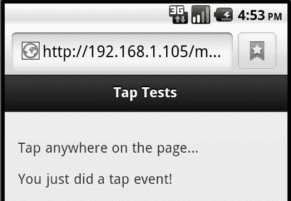
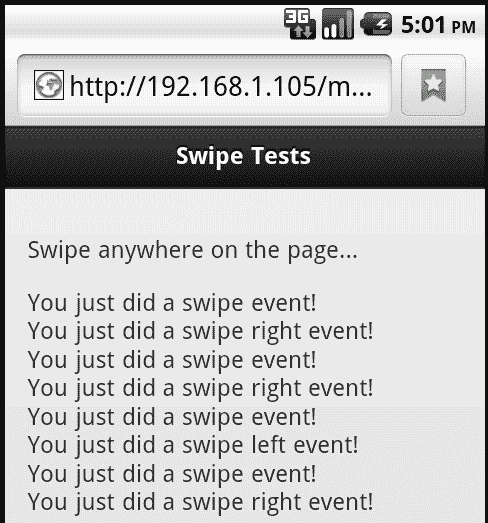
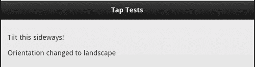
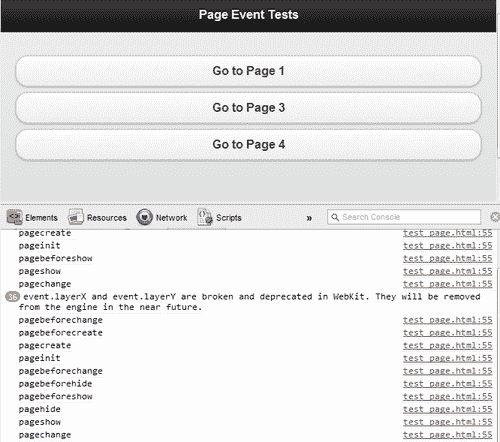
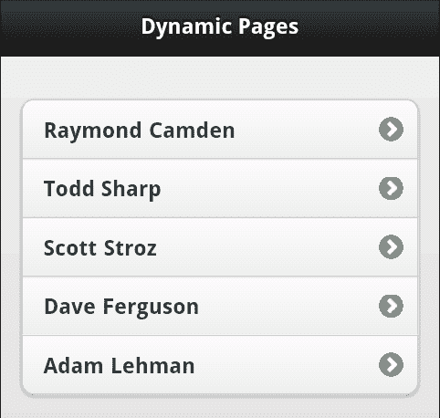
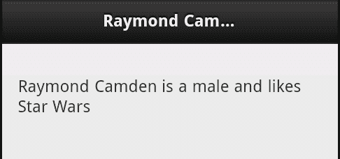

# 第九章：处理事件

在本章中，我们将看看 jQuery Mobile 中事件是如何工作的。虽然开发人员显然可以访问常规事件（按钮点击等），但 jQuery Mobile 也为开发人员提供了自己的事件来使用。

在本章中，我们将：

+   讨论触摸、滑动、滚动和其他物理事件

+   讨论页面事件

# 处理物理事件

在本章的第一部分，我们将专注于“物理”事件，或者与使用设备时的触摸和其他操作相关的事件。

### 提示

对于那些一直在使用常规浏览器测试 jQuery Mobile 的人，请注意，以下一些示例在桌面浏览器上可能无法正常工作。如果愿意，可以下载并安装各种手机模拟器。例如，Android 有一个支持创建虚拟移动设备的 SDK。苹果也有一种模拟 iOS 设备的方法。设置和安装这些模拟器超出了本章的范围，但这当然是一种选择。当然，您也可以使用真实的硬件设备。

物理事件包括以下内容：

+   `tap` 和 `taphold: tap` 表示其听起来就像 — 网页上的快速物理触摸。 `taphold` 是一个较长时间的触摸。许多应用程序将使用两种不同的操作 — 一个用于 `tap`，另一个用于 `taphold`。

+   `swipe, swipeleft` 和 `swiperight:` 这些表示滑动，或者对大多数设备的手指移动。 `swipe` 事件是通用事件，而 `swipeleft` 和 `swiperight` 表示特定方向的滑动。不支持向上或向下的滑动事件。

+   `scrollstart` 和 `scrollstop:` 分别处理页面滚动的开始和结束。

+   `orientationchange:` 当设备方向改变时触发。

+   `vclick、vmousedown、vmouseup、vmousemove、vmousecancel` 和 `vmouseover:` 所有这些都是“虚拟”事件，旨在屏蔽对触摸或鼠标点击事件的检查。由于这些主要只是点击和触摸事件的别名，因此不会进行演示。

现在我们已经列出了基本的物理事件，让我们开始看一些示例。 `清单 9-1` 演示了 `tap` 和 `taphold` 事件的一个简单示例：

```js
Listing 9-1: test1.html
<!DOCTYPE html>
<html>
<head>
<title>Tap Tests</title>
<meta name="viewport" content="width=device-width, initial- scale=1">
<link rel="stylesheet" href="http://code.jquery.com/mobile/ latest/jquery.mobile.min.css" />
<script src="img/jquery- 1.7.1.min.js"></script>
<script src="img/jquery.mobile.min.js"></script>
</head>
<body>
<div data-role="page" id="first">
<div data-role="header">
<h1>Tap Tests</h1>
</div>
<div data-role="content">
<p>
Tap anywhere on the page...
</p>
<p id="status"></p>
</div>
</div>
<script>
$("body").bind("tap", function(e) {
$("#status").text("You just did a tap event!");
});
$("body").bind("taphold", function(e) {
$("#status").text("You just did a tap hold event!");
});
</script>
</body>
</html>

```

该模板相当简单。页面上有一些解释性文本，要求用户点击它。其下是一个空段落。请注意，文档末尾有两个绑定。一个监听 `tap`，另一个监听 `taphold`。用户可以执行任一操作，并显示不同的状态消息。尽管相当简单，但这给了您一个很好的想法，即根据用户按住手指的时间长短做出不同的响应。（`taphold` 事件触发的时间大约为一秒）：



现在让我们来看 `清单 9-2`，一个关于滑动事件的示例：

```js
Listing 9-2: test2.html
<!DOCTYPE html>
<html>
<head>
<title>Swipe Tests</title>
<meta name="viewport" content="width=device-width, initial- scale=1">
<link rel="stylesheet" href="http://code.jquery.com/mobile/ latest/jquery.mobile.min.css" />
<script src="img/jquery- 1.7.1.min.js"></script>
<script src="img/ jquery.mobile.min.js"></script>
</head>
<body>
<div data-role="page" id="first">
<div data-role="header">
<h1>Swipe Tests</h1>
</div>
<div data-role="content">
<p>
Swipe anywhere on the page...
</p>
<p id="status"></p>
</div>
</div>
<script>
$("body").bind("swipe", function(e) {
$("#status").append("You just did a swipe event!<br/>");
});
$("body").bind("swipeleft", function(e) {
$("#status").append("You just did a swipe left event!<br/>");
});
$("body").bind("swiperight", function(e) {
$("#status").append("You just did a swipe right event!<br/>");
});
</script>
</body>
</html>

```

这个例子与前一个例子非常相似，只是现在我们的事件处理程序监听`swipe, swipeleft`和`swiperight`。一个重要的区别是我们附加到状态 div 而不是简单地设置它。为什么呢？`swiperight`或`swipeleft`事件自动是一个滑动事件。如果我们简单地设置段落中的文本，一个将覆盖另一个。下面的截图显示了设备在几次滑动后的外观：



更复杂的例子呢？考虑以下代码片段，`9-3 清单`：

```js
Listing 9-3: test3.html
<!DOCTYPE html>
<html>
<head>
<title>Swipe Tests</title>
<meta name="viewport" content="width=device-width, initial- scale=1">
<link rel="stylesheet" href="http://code.jquery.com/mobile/ latest/jquery.mobile.min.css" />
<script src="img/jquery- 1.7.1.min.js"></script>
<script src="img/jquery.mobile.min.js"></script>
</head>
<body>
<div data-role="page" id="first">
<div data-role="header">
<h1>First</h1>
</div>
<div data-role="content">
<p>
Swipe to navigate
</p>
</div>
</div>
<div data-role="page" id="second">
<div data-role="header">
<h1>Second</h1>
</div>
<div data-role="content">
<p>
Swipe to the right...
</p>
</div>
</div>
<script>
$("body").bind("swipeleft swiperight", function(e) {
var page = $.mobile.activePage[0];
var dir = e.type;
if(page.id == "first" && dir == "swipeleft") $.mobile.changePage("#second");
if(page.id == "second" && dir == "swiperight") $.mobile.changePage("#first");
});
</script>
</body>
</html>

```

在这个例子中，我们有一个包含两个单独页面的文件，一个页面的 id 为`first`，另一个页面的 id 为`second`。注意我们没有链接。那么我们如何导航呢？用滑动！我们的事件处理程序现在同时监听`swipeleft`和`swiperight`。我们首先使用`$.mobile.activePage`获取活动页面，如第八章 *jQuery Mobile 中的 JavaScript 配置和实用工具*中所述，关于方法和实用工具。末尾的`[0]`表示该值实际上是一个 jQuery 选择器。使用`[0]`会获取实际的 DOM 项。事件类型将是`swipeleft`或`swiperight`。一旦我们知道了这一点，我们就可以根据用户当前所在的页面和他们滑动的方向积极地移动用户。

现在让我们来看一下滚动。你可以检测滚动何时开始以及何时结束。`9-4 清单`是另一个这样操作的简单示例：

```js
Listing 9-4: test4.html
<!DOCTYPE html>
<html>
<head>
<title>Scroll Tests</title>
<meta name="viewport" content="width=device-width, initial- scale=1">
<link rel="stylesheet" href="http://code.jquery.com/mobile/ latest/jquery.mobile.min.css" />
<script src="img/jquery- 1.7.1.min.js"></script>
<script src="img/jquery.mobile.min.js"></script>
</head>
<body>
<div data-role="page" id="first">
<div data-role="header">
<h1>Scroll Tests</h1>
</div>
<div data-role="content">
<p>
Scroll please....<br/>
<br/>
<br/>
(Many <br/> tags removed to save space!)
<br/>
<br/>
</p>
<p id="status"></p>
</div>
</div>
<script>
$("body").bind("scrollstart", function(e) {
$("#status").append("Start<br/>");
});
$("body").bind("scrollstop", function(e) {
$("#status").append("Done!<br/>");
});
</script>
</body>
</html>

```

这个模板与`test1.html`，即点击测试器非常相似，只是现在我们监听了`scrollstart`和`scrollstop`。还要注意`<br/>`标签的列表。在真实的源文件中，这些标签有很多。这将确保在测试时页面确实是可滚动的。当滚动开始和结束时，我们只是将其附加到另一个状态`div`。（请注意，当前将 DOM 操作列为在监听`scrollstart`时存在错误。前面的例子在 iOS 上可能无法工作，但在 Android 上工作正常。）

现在让我们来看一下方向。虽然前面的例子大部分可以在你的桌面上测试，但你肯定需要一个真实的移动设备来测试下一个例子：

```js
Listing 9-5: test5.html
<!DOCTYPE html>
<html>
<head>
<title>Orientation Tests</title>
<meta name="viewport" content="width=device-width, initial- scale=1">
<link rel="stylesheet" href="http://code.jquery.com/mobile/ latest/jquery.mobile.min.css" />
<script src="img/jquery- 1.7.1.min.js"></script>
<script src="img/jquery.mobile.min.js"></script>
</head>
<body>
<div data-role="page" id="first">
<div data-role="header">
<h1>Orientation Tests</h1>
</div>
<div data-role="content">
<p>
Tilt this sideways!
</p>
<p id="status"></p>
</div>
</div>
<script>
$(window).bind("orientationchange", function(e,type) {
$("#status").html("Orientation changed to "+e.orientation);
});
</script>
</body>
</html>

```

前一个代码清单的关键部分是最后的 JavaScript，特别是用于更改方向的事件侦听器。这实际上不是 jQuery Mobile 支持的事件，而是浏览器本身支持的事件。一旦事件侦听器被附加，你可以根据设备的方向进行任何操作。以下截图是演示：



# 处理页面事件

现在我们已经讨论了物理类型事件，是时候将注意力转向页面事件了。请记住，jQuery Mobile 有自己的页面概念。为了在 jQuery Mobile 中给开发人员更多控制页面工作的能力，支持了许多页面事件。并非所有事件都一定在日常开发中有用。一般来说，页面事件可以分为以下几类：

+   load：这些是与页面加载相关的事件。它们是`pagebeforeload，pageload`和`pageloadfailed。pagebeforeload`在请求页面之前触发。您的代码可以根据逻辑批准或拒绝此请求。如果加载页面，则会触发`pageload`。相反，`pageloadfailed`将在任何未完成的加载上触发。

+   change：这些事件与从一个页面更改到另一个页面有关。它们是：`pagebeforechange，pagechange`和`pagechangefailed`。与以前一样，`pagebeforechange`函数充当编程方式拒绝事件的一种方式。如果完成，将触发`pagechangefailed`事件。`pagebeforechange`在`pagebeforeload`事件之前触发。`pagechange`将在显示页面后触发。

+   transition：与从一个页面转换到另一个页面相关的事件。它们是：`pagebeforeshow，pageshow，pagebeforehide，pagehide`。`pagebeforeshow`和`pagebeforehide`在其相关事件之前运行，但与`pagebeforeload`和`pagebeforechange`不同，它们实际上不能阻止下一个事件的发生。

+   init：正如本书中多次显示的那样，jQuery Mobile 对基本 HTML 执行多次更新，以使其优化为移动显示。这些是与初始化相关的事件。您可以监听的事件是：`pagebeforecreate，pagecreate`和`pageinit。pagebeforecreate`在您的控件上的任何自动更新触发之前触发。这允许您在布局由 jQuery Mobile 更新之前通过 Javascript 操纵您的 HTML。`pagecreate`在页面内容存在于 DOM 中之后触发，但仍然在 jQuery Mobile 更新布局之前触发。官方文档建议这是进行任何自定义小部件处理的地方。最后，`pageinit`将在初始化完成后运行。

+   remove：此类别有一个事件`pageremove`。在 jQuery Mobile 从 DOM 中删除非活动页面之前触发此事件。您可以监听此事件以防止框架删除页面。

+   layout：最后一个类别与布局相关，有一个事件`updatelayout`。这通常是由其他布局更改触发的一种方式，用于通知页面需要更新自身。

这还真是不少啊！看待这些事件的一个简单方法就是简单地听取它们的全部。在`列表 9-6`中，我们有一个这样的简单示例：

```js
Listing 9-6: test_page.html
<!DOCTYPE html>
<html>
<head>
<title>Page Event Tests</title>
<meta name="viewport" content="width=device-width, initial- scale=1">
<link rel="stylesheet" href="http://code.jquery.com/mobile/ latest/jquery.mobile.min.css" />
<script src="img/jquery- 1.7.1.min.js"></script>
<script src="img/jquery.mobile.min.js"></script>
</head>
<body>
<div data-role="page" id="first">
<div data-role="header">
<h1>Page Event Tests</h1>
</div>
<div data-role="content">
<p>
<a href="#page2" data-role="button">Go to Page 2</a>
<a href="test_pagea.html" data-role="button"> Go to Page 3</a>
<a href="test_pageb.html" data-role="button"> Go to Page 4</a>
<a href="test_pageDOESNTEXIST.html" data-role="button"> Go to Page Failed</a>
</p>
</div>
</div>
<div data-role="page" id="page2">
<div data-role="header">
<h1>Page Event Tests</h1>
</div>
<div data-role="content">
<p>
<a href="#first" data-role="button">Go to Page 1</a>
<a href="test_pagea.html" data-role="button"> Go to Page 3</a>
<a href="test_pageb.html" data-role="button"> Go to Page 4</a>
</p>
</div>
</div>
<script>
$(document).bind("pagebeforeload pageload pageloadfailed pagebeforechange pagechange pagechangefailed pagebeforeshow pagebeforehide pageshow pagehide pagebeforecreate pagecreate pageinit pageremove updatelayout", function(e) {
console.log(e.type);
});
</script>
</body>
</html>

```

这个模板是一个四页、三文件的简单应用程序的一部分，它有按钮链接到其他每一页。其他页面可以在你下载的 ZIP 文件中找到。为了测试这个应用程序，你**应该**使用支持控制台的桌面浏览器。任何版本的 Chrome，最近的 Firefox 浏览器（或带有 Firebug 的 Firefox）和最新的 Internet Explorer。浏览器控制台的完整说明无法在本章中适用，但你可以把它看作是一个隐藏的调试日志，用于记录事件和其他消息。在这种情况下，我们已经告诉 jQuery 监听我们所有的 jQuery Mobile 页面事件。然后我们将特定的事件类型记录到控制台。点击了一些东西之后，以下屏幕截图显示了在 Chrome 浏览器中控制台日志的样子：



在 Chrome 中打开控制台很简单。点击浏览器右上角的扳手图标。选择**工具**然后选择**JavaScript 控制台**。在测试这些文件之前打开控制台，你可以实时监控页面事件的发生情况。

## `$(document).ready`怎么样？

如果你是一个 jQuery 用户，你可能会好奇`$(document).ready`在 jQuery Mobile 站点中是如何发挥作用的。几乎所有的 jQuery 应用程序都使用`$(document).ready`进行初始化和其他重要的设置操作。然而，在 jQuery Mobile 应用程序中，这样做效果不佳。由于使用 Ajax 加载页面，`$(document).ready`只对*第一个*页面有效。因此，在过去使用`$(document).ready`的情况下，应该使用`pageInit`事件。

## 创建一个真实的例子

那么真实的例子呢？我们的下一组代码将演示如何创建一个简单但动态的 jQuery Mobile 网站。内容将通过 Ajax 加载。通常这将是动态数据，但出于我们的目的，我们将使用简单的静态 JSON 数据文件。JSON，代表 JavaScript 对象表示法，是一种将复杂数据表示为简单字符串的方法。`列表 9-7`是应用的首页：

```js
Listing 9-7: test_dyn.html
<!DOCTYPE html>
<html>
<head>
<title>Test Dynamic</title>
<meta name="viewport" content="width=device-width, initial- scale=1">
<link rel="stylesheet" href="http://code.jquery.com/mobile/ latest/jquery.mobile.min.css" />
<script src="img/jquery- 1.7.1.min.js"></script>
<script src="img/ jquery.mobile.min.js"></script>
</head>
<body>
<div data-role="page" id="homepage">
<div data-role="header">
<h1>Dynamic Pages</h1>
</div>
<div data-role="content">
<ul id="peopleList" data-role="listview" data-inset="true"></ul>
</div>
</div>
<script>
$("#homepage").bind("pagebeforecreate", function(e) {
//load in our people
$.get("people.json", {}, function(res,code) {
var s = "";
for (var i = 0; i < res.length; i++) {
s+="<li><a href='test_people.html ?id="+res[i].id+"'>"+res[i].name+"</a></li>";
}
$("#peopleList").html(s).listview("refresh");
}, "json");
});
$("#personpage").live("pagebeforeshow", function(e) {
var thisPage = $(this);
var thisUrl = thisPage.data("url");
var thisId = thisUrl.split("=")[1];
$.get("person"+thisId+".json", {}, function(res, code) {
$("h1",thisPage).text(res.name);
s = "<p>"+res.name +" is a "+res.gender+" and likes "+res.hobbies+"</p>";
$("#contentArea", thisPage).html(s);
}, "json");
});
</script>
</body>
</html>

```

这个 jQuery Mobile 页面的第一印象是，实际内容几乎不存在。至少在 jQuery Mobile 页面的内容块中是这样的。有一个`listview`但实际内容却不存在。那么内容从哪里来呢？在页面底部，你可以看到两个事件监听器。现在让我们只关注第一个。

这里的代码绑定到了 jQuery Mobile 为页面触发的`pagebeforecreate`事件。我们已经告诉 jQuery Mobile 在创建页面之前运行此事件。这个事件将运行一次且仅运行一次。在这个事件中，我们使用 jQuery 的`get`功能对文件`people.json`进行了一个 Ajax 请求。该文件只是一个以 JSON 格式表示的名字数组。

```js
[{"id":1,"name":"Raymond Camden"},{"id":2,"name":"Todd Sharp"},{"id":3,"name":"Scott Stroz"},{"id":4,"name":"Dave Ferguson"},{"id":5,"name":"Adam Lehman"}]

```

每个名称都有一个 ID 和实际的名称值。当通过 jQuery 加载时，这将转换为一组实际的简单对象。回顾事件处理程序，您会发现我们只需循环遍历此数组并创建表示一组`li`标签的字符串。请注意，每个都有一个指向`test_people.html`的链接，以及一个动态名称。还请注意链接本身是动态的。它们包括从 JSON 字符串中检索到的每个人的 ID 值：



早些时候提到过，但请注意调用`listview("refresh")`：

```js
$("#peopleList").html(s).listview("refresh");

```

没有`listview("refresh")`部分，我们添加到列表视图的项目将无法正确设置样式。

让我们快速看看下一个`test_people.html`：

```js
Listing 9-8: test_people.html
<!DOCTYPE html>
<html>
<head>
<title>Test Dynamic</title>
<meta name="viewport" content="width=device-width, initial- scale=1">
<link rel="stylesheet" href="http://code.jquery.com/mobile/ latest/jquery.mobile.min.css" />
<script src="img/jquery- 1.7.1.min.js"></script>
<script src="img/ jquery.mobile.min.js"></script>
</head>
<body>
<div data-role="page" id="personpage">
<div data-role="header">
<h1></h1>
</div>
<div data-role="content" id="contentArea">
</div>
</div>
</body>
</html>

```

与我们的上一页一样，这一页几乎没有内容。请注意，标题和内容区域都是空白的。但是，如果您记得`test_dyn.html`中的第二个事件处理程序，我们支持在这里加载内容。这次我们使用了`pagebeforeshow`事件。为什么？我们希望在每次显示页面之前运行此代码。我们需要知道要加载的特定人员是谁。如果您记得，人员的 ID 是通过 URL 传递的。我们可以通过页面对象上存在的数据属性`url`获取它。这返回完整的 URL，但我们只关心它的末尾，即我们的 ID。因此，我们拆分字符串并抓取最后一个值。一旦我们有了，我们就可以为每个人加载特定的 JSON 文件。此文件名的形式为`personX.json`，其中`X`是 1 到 5 的数字。以下代码行是一个示例：

```js
{"name":"Raymond Camden","gender":"male","hobbies":"Star Wars"}

```

显然，真实的人物对象会有更多的数据。一旦我们获取了这个字符串，我们就可以解析它并将结果布局在页面上：



# 总结

在本章中，我们研究了 jQuery Mobile 应用程序可以监听和响应的事件。这些事件包括物理类型（滚动、方向、触摸）和基于页面的事件。

在下一章中，我们将看看 jQuery Mobile 站点如何主题化 - 包括开箱即用的主题和自定义主题。
