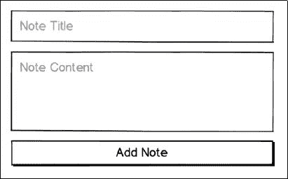
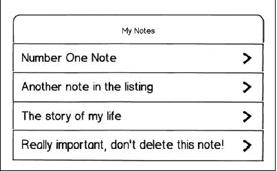
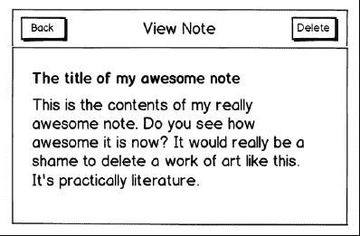
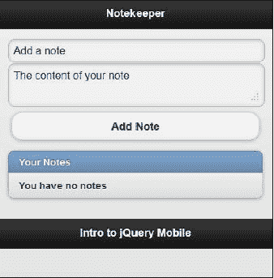
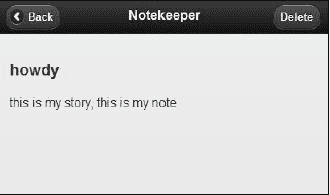

# 第十章：进一步了解 Notekeeper 移动应用程序

在这一章中，我们将开始将迄今为止学到的关于列表、表单、页面和内容格式化的所有内容组合成一个可用的“移动应用程序”；即 Notekeeper 应用程序。

在本章中，我们将：

+   使用表单接受用户输入

+   使用 HTML5 localStorage 功能在本地存储用户输入的数据

+   演示如何动态地向页面添加、编辑和删除项目

# 什么是移动应用程序？

在编写我们的第一个移动应用程序之前，也许我们应该定义一下什么是移动应用程序。维基百科说，移动应用程序是*为小型低功耗手持设备开发的软件，如个人数字助理、企业数字助理或移动电话*。虽然 jQuery Mobile 应用程序是用 HTML、CSS 和 JavaScript 编写的，但这并不妨碍它们成为复杂的软件。它们肯定是针对移动设备开发的。

一些评论家可能会指出，除非“安装”，否则它实际上不能成为软件。正如您将在本书的后面看到的，与开源库 PhoneGap 配合使用时，jQuery Mobile 应用程序实际上可以安装在各种设备上（包括 iOS、Android 和 Windows Mobile）。这意味着您将能够兼得。您可能会问自己，使用 jQuery Mobile 编写的代码是否可以被视为软件，正如您将在本章中了解到的那样，答案是肯定的。

# 设计您的第一个移动应用程序

任何软件的目标都是满足需求。Gmail 通过让用户摆脱单一计算机并让他们可以从任何 Web 浏览器检查电子邮件来满足需求。Photoshop 通过允许用户以前所未有的方式操纵照片来满足需求。我们的 Notekeeper 应用程序通过允许我们记录简单的笔记以供以后参考来满足需求。我知道，与之相比有点令人失望，但我们必须从某个地方开始对吧？

在构建软件时，最好花时间事先撰写项目的规格说明：它将做什么，它将是什么样子，以及它应该具有什么。记住，如果你不知道你在构建什么，你怎么会知道它是否完成了？

## 列出要求

我们已经知道我们的应用想要做什么，记笔记。问题在于有很多种方式可以构建一个笔记应用，因此必须勾勒出我们想要的功能。不多不少，但目前足够。对开发人员来说，一个事实是我们的应用永远不会“完成”，它们只是暂时“完成”。对于 Notekeeper，我们决定我们想要用我们的应用程序做以下三件事：

+   添加笔记

+   显示笔记列表

+   查看笔记/删除笔记

在决定我们的应用程序需要完成哪些任务之后，我们需要决定它将如何完成这些任务。最简单的方法就是简单地将这些事情写成一个列表。通过将每个部分细分为更小的部分，我们使它更容易理解，并且看到我们需要做些什么才能让它工作。这就像得到去你最喜欢的餐厅的指南一样；这里拐个弯，那里转个圈，你转眼间就坐在餐桌前了。让我们看看我们希望 Notekeeper 做什么，以及下面的部分和部件：

+   添加一个注释（表单）

    +   一个表单容器。所有用户输入的小部件都被包装成一个表单。

    +   一个标题，注释的名称。这也将用于显示现有的注释。

    +   注释本身。注释的内容或主体。

    +   保存按钮。这个按钮会触发实际的保存操作。

+   显示注释列表的能力（列表视图）

    +   包含注释标题的行项。此行应该是指向包含注释主体的页面的链接。

    +   一个部分标题行可能很好。

+   查看注释的能力，并删除注释（标签，段落，按钮）

    +   标题的标签

    +   包含注释内容的段落

    +   一个标有**删除**的按钮

    +   返回按钮

### 制作线框图

现在我们已经列出了我们的应用程序的功能，那么我们如何勾画出每一部分，以便我们知道我们想要的是什么样子？如果你的艺术功底不好，或者你连一个竖直线都画不出来，不要担心。如果你有尺子，可以使用尺子，或者考虑使用微软 Excel 或 PowerPoint。你只需要能够画一些框和一些文本标签。

### 设计添加注释线框图

现在，添加注释部分怎么样？我们决定它需要一个标题，一个注释框和一个提交按钮。表单是一个不可见的容器，所以我们不需要画出来：



### 显示注释框架

列表视图是移动开发的一个重要部分。这是将类似项目简单地分组在一起的最简单方法，另外它还提供了许多额外的功能，比如滚动和内置图片链接。我们将使用列表视图来显示我们的注释列表：



### 查看注释/删除按钮框架

最后，一旦我们添加了一个注释，我们需要能够删除证据，我是说清除旧注释以为新注释腾出空间。请注意，我们还勾画了一个返回按钮。一旦你开始看到事情摆放出来，你会发现你忘记了一些非常重要的事情（比如能够返回到上一页）：



## 编写 HTML

现在我们的线框图已经完成，我们对它们感到满意，是时候将铅笔画变成 1 和 0 了。由于我们的应用程序相对简单，HTML 中的任何内容都不应该难倒你。毕竟，你已经过了书的一半了，而且你应该能够做到这些事情。

你所提出的 HTML 应该看起来与下面的代码片段非常相似。让我们一起来检查一下：

```js
Listing 10-1: notekeeper.html
<!DOCTYPE html>
<html>
<head>
<title>Notekeeper</title>
<meta name="viewport" content="width=device-width, initial- scale=1">
<link rel="stylesheet" href="http://code.jquery.com/mobile/ latest/jquery.mobile.min.css" />
<script src="img/jquery-1.6.4.js"></script>
<script src="img/ jquery.mobile.min.js"></script>
<script src="img/application.js"></script>
</head>
<body>
<div data-role="page">
<div data-role="header">
<h1>Notekeeper</h1>
</div>
<div data-role="content">
<form>
<div>
<input id="title" type="text" placeholder="Add a note" />
</div>
<div>
<textarea id="note" placeholder="The content of your note"></textarea>
</div>
<div class="ui-grid-a">
<div class="ui-block-a">
<input id="btnNoThanks" type="submit" value="No Thanks" />
</div>
<div class="ui-block-b">
<input id="btnAddNote" type="button" value="Add Note" />
</div>
</div>
</form>
<ul id="notesList" data-role="listview" data-inset="true">
<li data-role="list-divider">Your Notes</li>
<li id="noNotes">You have no notes</li>
</ul>
</div>
<div data-role="footer" class="footer-docs">
<h5>Intro to jQuery Mobile</h5>
</div>
</div>
</body>
</html>

```

我们的笔记管理应用程序将使用单个 HTML 文件（`notekeeper.html`）和单个 JavaScript 文件（`application.js`）。直到这一点，您编写的代码都不需要 JavaScript，但是一旦您开始编写更复杂的应用程序，JavaScript 就会成为必需品。在您的网络浏览器中预览 `列表 10-1` 中的 HTML，您应该会看到类似以下截图的内容：



请注意，我们在同一个页面上显示**添加笔记**表单和查看笔记。在移动应用程序开发中，尽可能压缩东西是个好主意。不要将这个作为硬性规则，但由于我们的应用程序很简单，把这两部分放在一起是可以接受的决定，只要它们清晰地标记出来。你可以看到，这个页面满足了我们为添加笔记和显示现有笔记设定的所有要求。它有一个标题输入字段，一个笔记输入字段，一个保存按钮，并且整个东西都包裹在一个表单容器中。它还有一个列表视图，用于显示我们添加笔记后的笔记。这里看不到的是一个删除按钮，但一旦我们添加了第一个笔记并查看详细页面，它就会显示出来。

# 使用 JavaScript 添加功能

正如本书所提到的，您不需要编写任何 JavaScript 就能从 jQuery Mobile 中获得物有所值。但是随着您在 jQuery Mobile 中的经验不断增加，您将开始看到 JavaScript 可以为您的项目增加多少附加值。在我们查看代码之前，让我们谈谈它将如何结构化。如果您有任何网络设计或开发经验，您可能已经看到过 JavaScript。毕竟，它从 1995 年就开始存在了。问题是，JavaScript 有很多种不同的方法来做同样的事情，而不是所有方法都是好的。

这个应用程序中的 JavaScript 代码将使用所谓的设计模式。这只是一个花哨的术语，用来指定代码的某种结构。使用现有设计模式的主要原因有三个：

+   它帮助我们的代码保持组织和整洁。

+   它防止我们编写的变量和函数被我们可能添加的任何其他代码意外覆盖或更改。也许是一个 jQuery 插件，或者是从第三方网站加载的代码。

+   它将帮助未来的开发人员更快地适应你的代码。你在开发下一个 Facebook 的时候有考虑到未来的开发人员吗？

在我们深入了解完整代码之前，让我们先来看一个非常简单的实现这个设计模式的示例：

```js
Listing 10-2: kittyDressUp.js
$(document).ready(function(){
// define the application name
var kittyDressUp = {};
(function(app){
// set a few variables which can be used within the app
var appName = 'Kitty Dress Up';
var version = '1.0';
app.init = function(){
// init is the typical name that developers give for the
// code that runs when an application first loads
// use whatever word you prefer
var colors = app.colors();
}
app.colors = function(){
var colors = ['red','blue','yellow','purple'];
return colors;
}
app.init();
})(kittyDressUp);
});

```

如果您熟悉 JavaScript 或 jQuery，您可能会看到一些您熟悉的元素。对于那些不熟悉 jQuery 或 JavaScript 的读者，我们将逐行审查这个示例。`KittyDressUp.js` 以 jQuery 的最好朋友开头。包含在花括号内的任何代码都会等到文档或 HTML 页面完全加载后再执行。这意味着您，开发人员，可以确保您的代码在页面上需要的一切都加载完成后才运行：

```js
$(document).ready({
// I'm ready captain!
});

```

简单来说，下一行创建了一个名为 `kittyDressUp` 的变量，并将其赋值为空对象的值。但是，在我们的代码中，这个新对象将包含我们的整个应用程序：

```js
// define the application name
var kittyDressUp = {};

```

下面的声明是 Kitty Dress Up 应用程序的核心。它创建了一个接受单个参数的函数，然后立即调用自身，并传入我们在前一行中创建的空对象。这个概念称为自执行函数，它是使外部代码无法干扰我们的应用程序的方法。

```js
(function(app){
// define the app functionality
})(kittyDressUp);

```

接下来的两行设置了一些只能从我们应用程序的上下文或范围中访问的变量：

```js
// set a few variables which can be used within the app
var appName = 'Kitty Dress Up';
var version = '1.0';

```

最后，最后几行设置了两个在应用程序中可用的函数。您可以看到每个函数都被分配了一个在更大应用程序范围内的名称。`app` 变量是函数所在的地方，. 后面的单词是函数名称。请注意，在 `init` 函数内部，我们正在调用同一应用程序内的另一个函数，`app.colors()`。我们也可以引用我们在顶部定义的任何变量。

```js
app.init = function(){
// init is the typical name that developers give for the
// code that runs when an application first loads
// use whatever word you prefer
var colors = app.colors();
}
app.colors = function(){
var colors = ['red','blue','yellow','purple'];
return colors;
}
app.init();

```

请记住，`app` 是传递给自执行函数的参数名称，其值为空对象。作为整体，这几行代码创建了一个名为 `kittyDressUp` 的对象，其中包含两个变量（`appName` 和 `version`），以及两个函数（`init` 和 `colors`）。这个示例以及 Notekeeper 的代码都是简单的示例，但它们说明了您可以如何将代码包装成离散包以用于更大应用程序的各个部分。事实上，在 `kittyDressUp.js` 运行之后，您甚至可以将 `kittyDressUp` 传递到另一组代码中以供使用。

哎呀... 大家休息五分钟，你们赚了它。

## 存储 Notekeeper 数据

现在我们从五分钟的休息中回来了，是时候卷起袖子开始为我们的应用程序添加功能了。虽然我们已经讨论了我们希望 Notekeeper 的行为方式，但我们还没有讨论到存储笔记数据的核心问题。有几种可能性，都有利弊。让我们列出它们：

+   **数据库（MySQL、SQL Server、PostgreSQL）：** 虽然数据库是理想的解决方案，但它对我们的应用程序来说有点复杂，它需要互联网连接，并且您需要一个服务器端组件（ColdFusion、PHP、.NET）作为中间人将笔记保存到数据库中。

+   **文本文件：** 文本文件非常棒，因为它们占用的空间很小。问题在于作为 Web 应用程序，Notekeeper 无法将文件保存到用户的设备上。

+   **localStorage：** localStorage 相对较新，但它迅速成为一个很好的选择。它以键/值对的形式存储信息在用户的设备上。它有大小限制，但对于纯文本来说相当大，大多数现代浏览器都支持它，并且可以在离线模式下使用。

### 使用 localStorage

为了本章的目的，我们将选择`localStorage`作为我们的首选方法。让我们快速看一下其行为，这样当你看到它时，你就会熟悉它。如前所述，`localStorage`的工作原理是存储键/值对中的数据。将值保存到`localStorage`有两种方式，无论你选择哪一种，都很容易：

```js
localStorage.setItem('keyname','this is the value I am saving');

```

或

```js
localStorage['keyname'] = 'this is the value I am saving';

```

选择哪个版本完全取决于个人偏好，但因为输入较少，我们将使用第二种方法，方括号。我们将遇到的一个问题是，`localStorage`无法存储如数组或对象之类的复杂数据。它只能存储字符串。这是一个问题，因为我们将把所有数据存储在一个变量中，以便始终知道其位置。别担心，我们可以欺骗`localStorage`，使用一个名为`stringify()`的内置函数将我们的复杂对象转换为其自身的字符串表示。

以下代码片段显示了它是如何工作的：

```js
// create our notes object
var notes = {
'note number one': 'this is the contents of note number one', 'make conference call': 'call Evan today'
}
// convert it to a string, then store it.
localStorage['Notekeeper'] = JSON.stringify(Notekeeper);

```

检索值与设置值一样简单，并且也提供两个选项。通常需要定义一个变量来接收`localStorage`变量的内容。

```js
var family = localStorage.getItem('my family');

```

或

```js
var family = localStorage['my family'];

```

如果您正在检索复杂的值，则必须在使用变量内容之前执行另一步。正如我们刚才提到的，要存储复杂的值，您必须首先使用`stringify()`函数，它有一个称为`parse()`的相对应函数。`parse()`函数接受包含该复杂对象的字符串，并将其转换回纯粹的 JavaScript。它的用法如下：

```js
var myFamily = ['andy', 'jaime', 'noelle', 'evan', 'mason'];
localStorage['family'] = JSON.stringify(myFamily);
var getFamily =JSON.parse(localStorage['family']);

```

最后，如果你想完全删除该密钥，那么你可以在单行代码中完成，有两种选择：

```js
localStorage.removeItem('my family');

```

或

```js
delete localStorage[my family'];

```

值得注意的是，如果您尝试检索在`localStorage`中不存在的密钥，JavaScript 不会引发错误。它只会返回“未定义”，这是 JavaScript 表示“抱歉，什么也没有”的方式。以下代码片段是一个示例：

```js
var missing = localStorage['yertl the turtle'];
console.log(missing);
// returns undefined

```

## 有效使用样板文件

在我们开始构建 JavaScript 文件之前，还有一件事情。在我们的应用程序中，我们只会有一个 JavaScript 文件，它将包含整个代码库。这对于像我们这样的小型应用程序来说是可以的，但对于更大的应用程序来说不是一个好主意。最好将项目分解为不同的部分，然后将每个部分放入它们自己的文件中。这样做可以使开发团队更容易地协同工作（例如，Noelle 负责登录流程，而 Mason 则负责供应商列表）。它还使每个文件变得更小且更容易理解，因为它只涉及整体的一部分。当您希望应用程序的所有部分具有相似的结构和设计时，最好的方法是从一个模板开始每个部分。我们将为我们应用程序的唯一文件使用一个模板（你可以在以下代码片段中看到，`Listing 10-3`）。你可能会注意到它看起来非常类似于 `kittyDressUp` 示例，你是对的：

```js
Listing 10-3: application.js
$(function(){
// define the application
var Notekeeper = {};
(function(app){
// variable definitions go here
app.init = function(){
// stuff in here runs first
}
app.init();
})(Notekeeper);
});

```

## 构建添加注释功能

最后，我们可以开始构建了！由于要显示不存在的笔记列表很困难，更不用说删除笔记了，我们将首先编写 `添加注释` 功能。用户要能够添加注释，他们必须输入标题、注释内容，然后点击提交按钮。所以我们从那里开始。

### 添加绑定

我们将在 `app.init()` 函数定义下创建一个新的、空的函数块。它应该看起来类似于以下代码行：

```js
app.bindings = function(){
}

```

绑定函数将包含在我们的应用程序中当用户执行某些操作时需要触发的任何代码片段，例如点击提交按钮或删除按钮。我们将这些代码片段组合在一起以便组织。在 `bindings()` 函数内部，我们将添加以下行。这将在用户单击 `添加注释` 表单的提交按钮时触发：

```js
// set up binding for form
$('#btnAddNote').bind('click', function(e){
e.preventDefault();
// save the note
app.addNote(
$('#title').val(),
$('#note').val()
);
});

```

jQuery 的 `val()` 函数是一个简写方法，用于获取任何表单输入字段的当前值。

关于这个新添加的一些说明：

+   当使用 jQuery 时，总会有更多的方法来完成某件事情，在大多数情况下，你只需选择自己喜欢的方法即可（它们通常具有相同的性能）。你可能更熟悉 `$('#btnAddNote').click()`，那也完全可以。

+   请注意，`click` 函数接受一个参数：`e`，它是事件对象（在本例中是点击事件）。我们调用 `e.preventDefault()` 来阻止在此元素上发生标准点击事件，但仍允许其余代码继续运行。你可能已经看到其他开发人员使用 `return false`，但 jQuery 最佳实践建议使用 `e.preventDefault()`。

+   在点击绑定中，我们调用 `addNote` 函数，并将用户输入的标题和注释传递给它。空白不重要，仅仅是为了更容易看到我们在做什么。

即使我们已经将绑定添加到我们的代码中，如果你现在运行应用程序，当你点击**添加笔记**按钮时什么也不会发生。原因是还没有任何东西调用`bindings()`函数。在`init()`函数内添加以下行，然后你就可以准备好了：

```js
app.init = function(){
app.bindings();
}

```

### 收集和存储数据

接下来，在`app.bindings`下面添加另一个新的空函数块：

```js
app.addNote = function(title, note){
}

```

现在，因为我们将所有的笔记都存储在`localStorage`的一个键中，我们首先需要检查是否已经存在任何笔记。从`localStorage`中检索 Notekeeper 键，将其保存到一个变量中，然后进行比较。如果我们要求的键的值是一个空字符串或`undefined`，我们将需要创建一个空对象。如果有一个值，那么我们将取出该值并使用`parse()`函数将其转换为 JavaScript：

```js
var notes = localStorage['Notekeeper'];
if (notes == undefined || notes == '') {
var notesObj = {};
} else {
var notesObj = JSON.parse(notes)
}

```

注意我们期望将两个变量传递给`addNote()`函数，`title`和`note`。接下来，我们用破折号替换标题中的任何空格，这样某些浏览器更容易理解文本字符串。然后我们将键值对放入我们新创建的笔记对象中：

```js
notesObj[title.replace(/ /g,'-')] = note;

```

JavaScript 的`replace`方法使字符串操作非常简单。它作用于一个字符串，接受一个搜索项和一个替换项。搜索项可以是一个简单的字符串，也可以是一个复杂的正则表达式。

下一步是将我们的`notesObj`变量`stringify()`并放入`localStorage`中。然后我们清除两个输入字段的值，以便用户更轻松地输入另一个笔记。在构建软件时，一般在添加或删除内容后将界面恢复到原始状态是一个不错的举措：

```js
localStorage['Notekeeper'] = JSON.stringify(notesObj);
// clear the two form fields
$note.val('');
$title.val('');
//update the listview
app.displayNotes();

```

所有这些变量定义对你来说应该很熟悉，也许有一个例外，我们应该指出。许多 jQuery 开发人员喜欢为包含 jQuery 对象的变量使用传统命名。

具体来说，它们在变量名前面加上了`$`符号，就像在 jQuery 中一样。这让他们或者未来的开发者知道变量中包含的是什么。让我们继续在我们的应用程序顶部添加这些定义。在读取`// 变量定义放在这里`后面的一行，添加以下行。它们分别指的是标题输入字段和笔记文本区域字段：

```js
var $title = $('#title');
var $note = $('#note');

```

作为这个函数的最后一步，我们调用`app.displayNotes()`来更新笔记列表。由于该函数尚不存在，接下来我们来创建它。

### 构建显示笔记功能

在编写上一节时，你可能已经测试了`添加笔记`功能。这意味着你至少已经在`localStorage`中保存了一个笔记，用于测试`显示笔记`功能。到现在为止，你已经熟悉了我们在任何新节的第一步。继续添加你的空白`displayNotes()`函数来保存我们的代码：

```js
app.displayNotes = function(){
}

```

接下来，我们需要从`localStorage`中检索所有的笔记：

```js
// get notes
var notes = localStorage['Notekeeper'];
// convert notes from string to object
return JSON.parse(notes);

```

你可能会注意到我们的许多函数都有一个模式，几乎所有这些函数都以从 `localStorage` 中检索笔记开始。虽然只需要两行代码来执行此任务，但我们不需要在每次需要获取笔记时重复这两行代码。所以我们将编写一个包含这两行代码的快速辅助函数。它看起来类似于以下代码片段：

```js
app.getNotes = function(){
// get notes
var notes = localStorage['Notekeeper'];
// convert notes from string to object
return JSON.parse(notes);
}

```

有了我们的新辅助函数，我们可以像下面的代码片段中所示，在 `displayNotes()` 函数中使用它：

```js
app.displayNotes = function(){
// get notes
var notesObj = app.getNotes();
}

```

现在我们有了包含我们笔记数据的 `notesObj` 变量，我们需要循环遍历该数据包并输出内容：

```js
// create an empty string to contain html
var html = '';
// loop over notes
for (n in notesObj) {
html += li.replace(/ID/g,n.replace(/-/g,' ')).replace(/LINK/g,n);
}
$ul.html(notesHdr + html).listview('refresh');

```

对于 `for` 循环内的一行具有多个替换语句可能看起来有些奇怪，但是 JavaScript 的性质允许方法链式调用。链式调用指的是返回其操作结果的整个结果的方法。添加额外的方法调用只是简单地重复该过程。

这个代码块中可能有一些新概念，所以让我们仔细看看。名为 `html` 的变量并不特别，但我们如何使用它可能是特别的。当我们遍历现有的笔记时，我们将新信息存储到 `html` 变量中，以及其他任何内容。我们通过使用 `+=` 运算符来实现这一点，该运算符允许我们同时赋值和追加。

第二件你可能注意到的事情是赋值右边的 `li`。它从哪里来？那是一个尚未创建的单个列表项的模板。让我们在谈论它之前就做这件事。在你的 `app.js` 文件顶部，在读取 `// 变量定义在此` 之后的一行之后，添加以下两行代码：

```js
var $ul = $('#notesList');
var li = '<li><a href="#pgNotesDetail?title=LINK">ID</a></li>';

```

你应该已经熟悉了在变量前加`$`来表示一个 jQuery 对象的约定。这就是我们在 `$ul` 变量中所做的事情。第二个变量，`li` 有些不同。它包含了一个单独的列表项的 HTML，用于显示一个笔记标题。最好的做法是尽可能避免在 JavaScript 中混合使用 HTML 或 CSS。我们现在将其声明为一个模板，以防将来决定在多个地方使用它。

另一个可能感兴趣的部分是我们如何使用 `li` 变量。在调用字符串替换函数时，我们正在查找单词 LINK 的所有出现，并用笔记的标题替换它。因为 JavaScript 是大小写敏感的语言，所以我们可以安全地假设我们不会遇到该单词的自然出现。

## 动态添加笔记到我们的列表视图

在我们的笔记显示在页面上之前，还有最后一件事情要安排。您可能已经注意到，唯一调用`displayNotes()`函数的地方出现在`addNote()`函数内部。这是一个很好的地方，但它不能是唯一的地方。我们需要在页面首次加载时运行某些内容。这个地方最好是在`init()`函数中，并且这就是我们要放置它的地方。

不过，有一个问题，我们不能只加载我们的笔记然后运行，如果没有笔记会发生什么？我们需要向用户显示一个友好的消息，以便他们不会认为出了什么问题。让我们创建一个名为`app.checkForStorage()`的新函数来处理所有这些：

```js
app.checkForStorage = function(){
// are there existing notes?
if (localStorage['Notekeeper']) {
// yes there are. pass them off to be displayed
app.displayNotes();
} else {
// nope, just show the placeholder
$ul.html(notesHdr + noNotes).listview('refresh');
}
}

```

到现在为止，所有这些对你来说应该都很熟悉：检查`localStorage`是否有笔记，并在找到它们时调用`displayNotes()`函数。不过，第二部分有一些新内容。当我们为`$ul`jQuery 对象设置 html 时，我们调用了两个新变量。一个是列表视图的标题，另一个是如果我们没有任何笔记时的情况。让我们现在添加这两个变量定义。在`// 变量定义在此处`下面，添加以下两行：

```js
var notesHdr = '<li data-role="list-divider">Your Notes</li>';
var noNotes = '<li id="noNotes">You have no notes</li>';

```

行的最后一部分通常可能会被忽视，但我们不会让它被忽视。这真的很重要。jQuery Mobile 为开发人员提供了选择。一种选择是使用静态 HTML 代码，在页面加载时已经存在；jQuery Mobile 还提供了在运行时添加 HTML 代码的选项。这确实给开发人员带来了很大的灵活性，但同时也提出了一个独特的挑战。按设计，jQuery Mobile 在页面加载之前将 HTML 转换为时尚的按钮。这意味着在此之后添加的任何 HTML 将以没有任何样式的方式呈现给用户。

然而，jQuery Mobile 也提供了一种方法来解决这个问题，即内置刷新每个转换的元素的功能。大多数元素都有一个与元素名称对应的内置函数；在我们的情况下，它是`listview()`函数。实际上，这种方法提供了向页面添加一个全新列表视图的能力。在我们的情况下，我们只关心刷新我们已经拥有的列表视图，因此我们只需添加`refresh`关键字，jQuery Mobile 就会将你的纯文本列表视图转换。试着省略最后一部分，看看 jQuery Mobile 能为你节省多少工作量。也许你应该将 jQuery Mobile 团队加入你的圣诞卡列表？

最后，我们必须实际调用我们的最新函数。在`init()`函数中添加以下行。然后重新加载页面，看看你的笔记如何加载。

```js
app.checkForStorage();

```

## 查看笔记

此时，我们应该能够创建一个新的笔记，并且该笔记会立即显示在我们的列表视图中。事实上，列表视图中的行已经是链接，它们只是不起作用，让我们立即更改它。

### 使用 Live 函数

将以下行添加到`bindings()`函数中：

```js
$('#notesList a').live('click',function(e){
e.preventDefault();
var href = $(this)[0].href.match(/\?.*$/)[0];
var title = href.replace(/^\?title=/,'');
app.loadNote(title);
});

```

这个新的绑定有一些新概念，所以让我们来解析一下。首先，我们不使用 `bind` 函数，而是使用 jQuery 的 `live`函数。区别在于 `bind` 仅适用于现有的页面元素，而 `live` 是主动的。它既适用于现有元素，也适用于应用绑定后创建的元素。

绑定的第二行和第三行可能看起来有点混乱，但它们只做一件事。它们从被点击的链接的 href 属性中检索 URL。我们在本章前面定义的 `li` 模板包含每个列表项的以下 URL：

```js
#pgNotesDetail?title=LINK

```

`displayNote()` 函数运行后，URL 看起来像这样（将鼠标悬停在每个列表项上，以查看其在浏览器窗口底部的链接）：

```js
#pgNotesDetail?title=the-title-of-the-note

```

最后，我们告诉我们的代码运行一个名为 `app.loadNote()` 的新函数。

## 动态创建一个新页面

如果你还没有为我们的新 `loadNote()` 函数创建一个新的空函数块，现在就去做吧。记住，我们要传入要查看的笔记的标题，所以确保在 `loadNote()` 函数中添加这个作为参数：

```js
app.loadNote = function(title){
}

```

然后将以下两行放在函数的顶部：

```js
// get notes
var notes = app.getNotes();
// lookup specific note
var note = notes[title];

```

第一行检索我们的笔记对象，而第二行提取用户请求的具体笔记。下一个变量定义打破了我们之前在本章提到的关于混合 HTML 和 JavaScript 的规则，但每个规则都有例外。我们在这里定义它，而不是在我们的 JS 文件的标题，因为它只在这里需要。这仍然可以保持文档的组织性。

```js
var page = '<div data-role="page" data-url="details" data-add-back- btn="true">\
<div data-role="header">\
<h1>Notekeeper</h1>\
<a id="btnDelete" href ="" data-href="http://ID data-role="button" class="ui-btn-right">Delete</a>\
</div>\
<div data-role="content"><h3>TITLE</h3><p>NOTE</p></div>\
</div>';

```

`page` 变量现在包含了显示"笔记详情"页面所需的所有 HTML。你还记得我们的应用只有一个 HTML 文件吗？我们实际上正在使用先前的 HTML 代码从头开始创建整个页面。其中也有一些值得指出的细节：

+   默认情况下 jQuery Mobile 不为页面提供返回按钮。然而，你可以在每个页面上使用 `data-add-back-btn="true"` 属性来启用返回按钮，该属性需要添加在带有 `data-role="page"` 属性的任何 `div` 标签上。

+   `data-url` 属性是 jQuery Mobile 使用的标识符，以便可以跟踪生成的多个页面。

现在我们在一个变量中包含了整个页面，我们可以对它做什么？我们可以将它转换为 jQuery 对象。通过用 `$()` 将任何独立的 HTML 块包装起来，我们就可以将其转换为一流的 jQuery 对象：

```js
var newPage = $(page);

```

然后我们可以取出新创建页面的 HTML，并用我们选择的笔记的值替换部分内容。

```js
//append it to the page container
newPage.html(function(index,old){
return old
.replace(/ID/g,title)
.replace(/TITLE/g,title
.replace(/-/g,' '))
.replace(/NOTE/g,note)
}).appendTo($.mobile.pageContainer);

```

从版本 1.4 开始，jQuery 提供了在某些函数内部使用**回调**的选项。这些函数包括`.html()`、`.text()`、`.css()`等几个。该函数期望两个参数，第二个参数包含当前匹配元素中包含的完整 HTML。这意味着我们可以对`newPage`变量内包含的 HTML 进行微调，而不必完全更改它。太棒了，不是吗？

接下来，我们将整个`newPage`变量追加到当前页面的末尾，这里通过`$.mobile.pageContainer`常量引用。最后，因为我们取消了绑定中的默认点击操作，所以我们必须告诉链接执行一个操作，即将用户转到这个新创建的页面。jQuery Mobile 提供了内置的方法来实现这一点：

```js
$.mobile.changePage(newPage);

```

现在是大揭示的时刻。如果你在浏览器中加载`notekeeper.html`，你应该能够在一个浏览器窗口内添加、显示和最终查看笔记。jQuery Mobile 是不是很棒？



## 删除笔记

回顾我们应用程序的需求，我们做得相当不错。我们编写了设置文档结构的 HTML 代码，允许我们添加笔记、显示笔记和查看笔记。剩下的只是删除一个笔记，它始于我们在`bindings()`函数中设置的最后一个绑定。现在就让我们添加它：

```js
$('#btnDelete').live('click',function(e){
e.preventDefault();
var key = $(this).data('href');
app.deleteNote(key);
});

```

在这个绑定中，可能有一个对你来说是新的项目，那就是 jQuery 的`.data()`函数的使用。HTML 5 允许你通过使用以`data-`为前缀的属性直接在任何 HTML 元素上存储任意数据，而这种能力是 jQuery Mobile 功能的核心。任何你看到`data-role="something"`的地方，你都在看 HTML 5 数据的作用。此外，jQuery 允许你通过使用`.data()`函数并传入你想查看的项目的键来检索任何`data-`值。在上面的情况中，我们将笔记的标题存储到了查看页面中的删除按钮上的`data-href`属性中。因为我们正在添加的绑定是一个分配给删除按钮的点击处理程序，所以我们可以通过调用`$(this).data('href')`来检索笔记的标题。太棒了！

这将是我们在本章中添加的最后一个函数。你难过吗？这确实是一个令人难忘的时刻，但是在你成为一名成功的 jQuery Mobile 开发人员之后，我们可以怀着美好的回忆回顾这一刻。再次，我们从一个接受单个参数，即我们要删除的笔记的标题的空函数开始。

```js
app.deleteNote = function(key){
}

```

随后是我们用于检索笔记的辅助函数的函数定义：

```js
// get the notes from localStorage
var notesObj = app.getNotes();

```

然后我们删除笔记。你已经在我们审阅`localStorage`时看到了它的作用，所以应该对你来说很熟悉：

```js
// delete selected note
delete notesObj[key];
// write it back to localStorage
localStorage['Notekeeper'] = JSON.stringify(notesObj);

```

删除备注紧随其后的是将剩余备注重新写入`localStorage`。`deleteNote()`函数中的最后两行将我们带回到应用程序的主页面，即备注列表。它们还会触发原始的`checkForStorage()`函数。

```js
// return to the list of notes
$.mobile.changePage('notekeeper.html');
// restart the storage check
app.checkForStorage();

```

最后一行可能对你来说有些奇怪，但请记住，我们事先不知道是否还有任何备注。运行存储检查允许我们显示占位文本，以防没有备注。养成这种习惯很好，因为它有助于减少我们的应用程序出现错误的可能性。

# 摘要

在本章中，我们使用 jQuery Mobile 构建了一个活生生的移动应用程序。停下来给自己一个赞。我们通过列出应用程序的要求、构建线框图和编写 HTML 的过程来完成了这一过程。我们学习了关于 HTML 5 的`localStorage`，使用模板进行文本替换，以及 jQuery Mobile 的一些更酷的功能，包括动态添加和刷新页面上的元素。

在下一章中，你将学习如何为 jQuery Mobile 设置全局配置选项，如何在 jQuery Mobile 中使用其他 API 来处理表单和内容块。
