# 第十一章：增强 jQuery Mobile

在本章中，我们将学习如何增强 jQuery Mobile，如何通过创建主题和图标来改善应用程序的外观和功能，使您的移动应用程序真正脱颖而出。

在本章中，我们将：

+   了解 jQuery Mobile 的构建模块

+   使用 ThemeRoller 创建我们自己的 jQuery Mobile 主题

+   为我们的应用设计并实现自定义图标

# 有什么可能？

当许多开发人员第一次使用 jQuery Mobile 时，他们的反应是对其易于实现丰富、引人入胜的移动网站感到敬畏。它轻松将普通 HTML 转换为美观、可用的按钮和列表视图。表单元素非常容易处理。jQuery Mobile 团队甚至随包提供了五种设计良好、吸引人的主题和 18 个常用图标。他们甚至建立了一个工具，供我们使用来构建自己的主题；**ThemeRoller**。

在使用 jQuery Mobile 一段时间后，开发人员可能会问"我还可以用这个做什么*别的*吗？" 就像 60 年代和 70 年代的肌肉车一样。它们已经很棒了，但调整者和发烧友还想做更多。如果你有这种心态，那么本章就是为你准备的。

关于 jQuery Mobile 的美妙之处在于，因为它全部是普通的 CSS 和 HTML，我们几乎可以用很少的工作做任何我们想做的事情。在本章中，我们将使用 ThemeRoller 为 jQuery Mobile 从头开始创建自己的主题。我们将设计按钮并编写必要的 CSS 代码来实现低分辨率和高分辨率版本。我们还将探讨如何扩展 jQuery Mobile 中已有的样式和类，并制作出不同和独特的东西。那么，让我们开始吧？

# jQuery Mobile 的视觉构建模块

正如你已经看到的，jQuery Mobile 非常用户友好且外观令人愉悦。它充分利用了圆角、微妙的渐变、投影来突出元素与周围环境的区别，以及其他*技巧*，这些技巧多年来一直是平面设计师在印刷品中使用的。但在网络上，这些效果只能通过使用图片或复杂且支持不佳的插件和小程序来实现。

随着 Web 2.0 和 CSS 3 的出现，所有这些选项都已提供给我们，即普通的网页开发人员。只需记住，权力越大，责任越大。jQuery Mobile 基于渐进增强的原则运作。这个繁琐的短语只是意味着您应该为理解这些增强的浏览器开发，并为理解它们的浏览器提供增强。

幸运的是，这些样式上的附加几乎纯粹是装饰性的。如果浏览器不理解`border-radius`声明，那么它将简单地显示方形边角。渐变和阴影也是如此。虽然 jQuery Mobile 默认为您的应用程序添加这些效果，但了解如何自己添加它们也是值得的。

## 圆角

圆角可以是最优雅和吸引人的效果之一，也是最简单的效果之一。开发人员需要了解此效果和其他效果的一些注意事项。虽然 W3C 推荐了`border-radius`的规范，但事实证明，每个主要浏览器制造商对其支持的方式略有不同。最终结果是相同的，但路径不同。让我们来看一下最基本的`border-radius`声明，以下屏幕截图是其结果：

```js
#rounded {
border-radius: 10px;
}

```

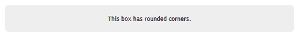

您还可以选择仅使某些角变圆，以及调整值，使角不是完美的四分之一圆。让我们看几个更多的示例。以下代码片段和屏幕截图演示了一个示例，以获得两个圆角：

```js
#topLeftBottomRight {
border-radius: 15px 0 15px 0;
}

```

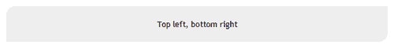

以下代码片段和屏幕截图演示了一个示例，以获得一个圆角：

```js
#bottomLeft {
border-top-left-radius: 100px 40px;
}

```


遗憾的是，目前情况并不像这么简单。因为每个浏览器供应商都对此效果有自己独特的渲染，像谷歌或 Mozilla 这样的软件开发者已经开始创建自己的版本，通常称为**厂商前缀**。为了使先前的样式声明具有最广泛的覆盖范围，您需要添加以下代码行：

```js
#rounded {
-webkit-border-radius: 10px;
-moz-border-radius: 10px;
border-radius: 10px;
}
#topLeftBottomRight {
-webkit-border-top-left-radius: 15px;
-webkit-border-bottom-right-radius: 15px;
-moz-border-radius-topleft: 15px;
-moz-border-radius-bottomright: 15px;
border-top-left-radius: 15px;
border-bottom-right-radius: 15px;
/* mozilla and webkit prefixes require you to define each corner individually when setting different values */
}
#bottomLeft {
-webkit-border-top-left-radius: 100px 40px;
-moz-border-radius-topleft: 100px 40px;
border-top-left-radius: 100px 40px;
}

```

## 应用投影阴影

CSS 中的投影阴影有两种形式：文本阴影（应用于文本）和框阴影（应用于其他所有内容）。与`border-radius`一样，如果您查看 W3C 规范，投影阴影也相对简单。

### 使用 text-shadow

让我们先看一下`text-shadow`：

```js
p {
text-shadow: 2px 2px 2px #000000;
/* horizontal, vertical, blur, color */
}

```

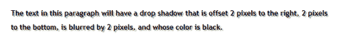

该属性还通过在逗号分隔的列表中添加附加声明来支持多个阴影，如以下代码片段和输出所示：

```js
p {
text-shadow: 0px 0 px 4px white,
0 px -5px 4px #ffff33,
2px -10px 6px #ffdd33,
-2px -15px 11px #ff8800,
2px -25px 18px #ff2200
}

```


与`border-radius`属性不同，`text-shadow`属性不需要厂商前缀。这并不意味着所有浏览器都支持它，这只是意味着支持此属性的浏览器会按预期显示，而不支持此属性的浏览器则会看不到任何内容。

### 使用 box-shadow

Box-shadow 遵循与 text-shadow 非常相似的模型，只是增加了一个关键词`inset`，允许内部阴影。让我们看一些示例。第一个示例显示了标准外部阴影：

```js
#A {
-moz-box-shadow: -5px -5px #888888;
-webkit-box-shadow: -5px -5px #888888;
box-shadow: -5px -5px #888888; /* horizontal, vertical, color */
}
#B {
-moz-box-shadow: -5px -5px 5px #888888;
-webkit-box-shadow: -5px -5px 5px #888888;
box-shadow: -5px -5px 5px #888888;
/* horizontal, vertical, blur, color */
}
#C {
-moz-box-shadow: 0 0 5px 5px #888888;
-webkit-box-shadow: 0 0 5px 5px #888888;
box-shadow: 0 0 5px 5px #888888;
/* horizontal, vertical, blur, spread, color */
}

```

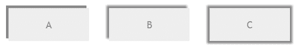

现在，在以下示例中，看看这些内部阴影。很酷，对吧？

```js
#D {
-moz-box-shadow: inset -5px -5px #888888;
-webkit-box-shadow: inset -5px -5px #888888;
box-shadow: inset -5px -5px #888;}
#E {
-moz-box-shadow: inset -5px -5px 5px #888888;
-webkit-box-shadow: inset -5px -5px 5px #888888;
box-shadow: inset 0px 0px 10px 20px #888888;
}
#F {
-moz-box-shadow: inset -5px -5px 0 5px #888888;
-webkit-box-shadow: inset -5px -5px 0 5px #888888;
box-shadow: inset 0 0 5px 5px #888888;
}

```

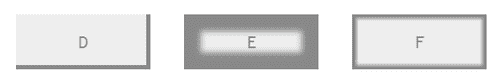

值得一提的是，阴影和文本阴影都可以使用不常用的 `rgb` 和 `rgba` 声明来设置它们的颜色。这使得开发者可以使用更熟悉的 RGB 值的约定来设置颜色。`rgba` 声明还允许设置颜色的不透明度从 `0` 到 `1`。修改的代码如下所示：

```js
#opacity {
box-shadow: inset 0 0 5px 5px rgb(0,0,0); /* black */
}
#transparent {
box-shadow: inset 0 0 5px 5px rgba(0,0,0,.5);
/* black with 50% transparency */
}

```

### CSS 渐变

CSS 渐变是向你的网站添加美感和冲击力的绝佳方式。选项包括线性渐变（从右到左，从上到下等等），以及径向渐变（从中心向外）。默认情况下，渐变由起始颜色和结束颜色组成。CSS 渐变也可以使用颜色停止来添加额外的色调。

然而，老版本浏览器对 CSS 渐变的支持并不完美，特别是在 Internet Explorer 中。好消息是，有办法解决 IE 的问题，可以让开发者可靠地在开发中使用渐变。坏消息是，支持该功能的代码*非常复杂*。让我们来看一下最简单的渐变声明：

```js
div {
width: 500px;
height: 100px;
background: linear-gradient(left, #ffffff 0%,#000000 100%);
}

```

渐变声明可能相当复杂，所以让我们用一个信息图来分解它：

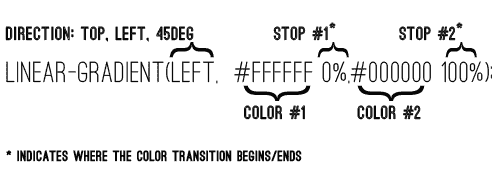

现在关键来了......在撰写本文时，没有浏览器支持使用实际属性的 W3C 规范。让我们来看一下支持多个浏览器的代码，你会更加喜欢 jQuery Mobile：

```js
div {
width: 500px;
height: 100px;
border: 1px solid #000000;
/* Old browsers */
background: #ffffff;
/* FF3.6+ */
background: -moz-linear-gradient(left, #ffffff 0%, #000000 100%);
/* Chrome10+,Safari5.1+ */
background: -webkit-linear-gradient(left, #ffffff 0%,#000000 100%);
/* Opera 11.10+ */
background: -o-linear-gradient(left, #ffffff 0%,#000000 100%);
/* IE10+ */
background: -ms-linear-gradient(left, #ffffff 0%,#000000 100%);
/* W3C spec*/
background: linear-gradient(left, #ffffff 0%,#000000 100%);
/* IE6-9 */
filter: progid:DXImageTransform.Microsoft.gradient( startColorstr='#ffffff', endColorstr='#000000',GradientType=1 );
}

```

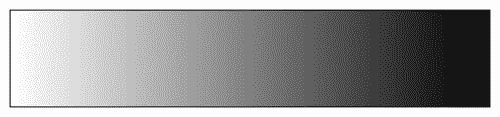

你可以通过添加额外的逗号分隔声明来将多种颜色添加到你的渐变中。例如，以下代码：

```js
div {
width: 500px;
height: 100px;
border: 1px solid #000000;
/* Old browsers */
background: #ffffff;
/* FF3.6+ */
background: -moz-linear-gradient(left, #ffffff 0%, #000000 35%, #a8a8a8 100%);
/* Chrome10+,Safari5.1+ */
background: -webkit-linear-gradient(left, #ffffff 0%,#000000 35%,#a8a8a8 100%);
/* Opera 11.10+ */
background: -o-linear-gradient(left, #ffffff 0%,#000000 35%,#a8a8a8 100%);
/* IE10+ */
background: -ms-linear-gradient(left, #ffffff 0%,#000000 35%,#a8a8a8 100%);
/* W3C */
background: linear-gradient(left, #ffffff 0%,#000000 35%,#a8a8a8 100%);
/* IE6-9 */
filter: progid:DXImageTransform.Microsoft.gradient( startColorstr='#ffffff', endColorstr='#a8a8a8',GradientType=1 );
}

```

结果显示在以下渐变中：

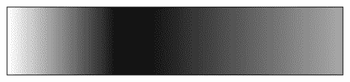

正如你在阅读最近几页后可能猜到的那样，jQuery Mobile 为你做了很多繁重的工作。它不仅添加了漂亮的渐变页面背景，还必须跟踪可能阻止甜美的阴影出现的所有浏览器怪癖。当我们进入下一节时，你可能会对它处理主题和色板的方式更为印象深刻。

# jQuery Mobile 主题的基础知识

在 jQuery Mobile 中进行主题设置对开发者来说是直接简单易用的，但是在幕后却相当复杂。幸运的是，很少有时候你需要知道为你所做的一切。然而，花点时间了解它的工作原理也是值得的。

jQuery Mobile 的开箱即用版本包含了一个由五种颜色色板组成的主题集，每个与 A-E 中的一个字母相关联。该主题包含了一系列基本的 CSS 类，可以随意应用于几乎任何元素，并且它们包含了宽度、高度、边框半径、阴影的全局设置。各个色板包含了有关颜色、字体等方面的具体信息。

可以将额外的样本添加到来自 F-Z 的五个原始样本中，或者可以随意替换或覆盖原始样本。这个系统允许共有 26 个不同的样本，从而可以产生数百万种主题颜色、样式和图案的可能组合。您可以通过添加一个`data-theme`属性和所需主题的字母来将 jQuery Mobile 主题应用于所选元素：

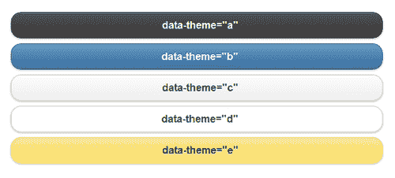

开发人员通常会选择使用`data-theme`属性方法来应用样式，但也可以直接将 CSS 类名附加到页面元素以获得更精细的控制。有几个主要前缀允许这种灵活性。

## 条（.ui-bar-?）

bar 前缀通常应用于标题、页脚和其他重要区域：

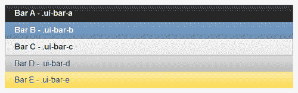

## 内容块（.ui-body-?）

内容块通常应用于预期出现段落文本的区域。它的颜色有助于确保文本颜色与其放置在其上的文本颜色之间具有最大的可读性：

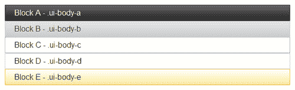

## 按钮和列表视图（.ui-btn-?）

按钮和列表视图是 jQuery Mobile 库中最重要的两个元素，您可以放心地知道团队花了很多时间来完善它们。`.ui-btn`前缀还包括用于上升、下降、悬停和活动状态的样式：

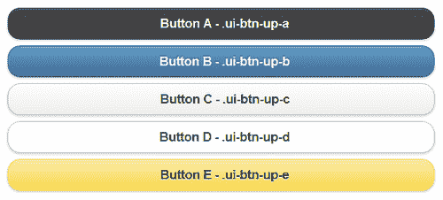

## 混搭样本

jQuery Mobile 中主题的一个好处是，除非另有说明，否则子元素会从其父元素继承。这意味着，如果您在页眉或页脚栏中放置一个没有自己`data-theme`属性的按钮，该按钮将使用与其父元素相同的主题。酷，对吧？

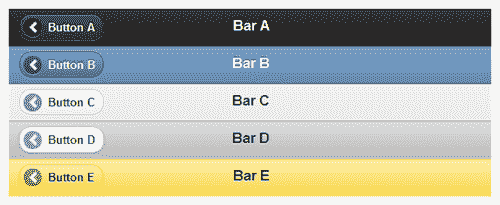

在一个元素中使用一个样本并在另一个元素的子元素中使用另一个样本也是完全可以接受甚至是鼓励的。这可以帮助元素更加突出，或者与应用程序的不同部分匹配，或者开发人员选择的任何其他原因。这是可能的，而且更重要的是，它很容易。只需将按钮（或其他元素）放置在页眉栏内，并为其分配自己的`data-theme`属性：

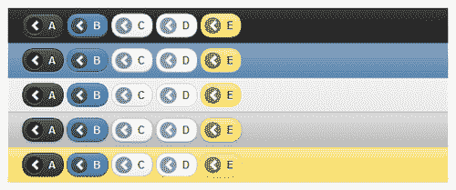

## 全站活动状态

jQuery Mobile 还为所有元素应用了一个全局 *活动* 状态。此活动状态用于按钮、表单元素、导航等任何需要指示当前选择的地方。更改此颜色值的唯一方法是通过 CSS 设置（或覆盖）它。活动状态的 CSS 类名是`.ui-btn-active`：

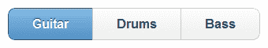

## 默认图标

jQuery Mobile 集中包含了 18 个图标，涵盖了开发人员广泛的需求。图标集是白色的透明图标，jQuery Mobile 在半透明的黑色圆圈上覆盖以提供与所有样品的对比度。要添加图标，请使用所需图标的名称指定 `data-icon` 属性：

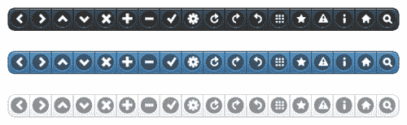

jQuery Mobile 还提供了使用 `data-iconpos="[top, right, bottom, left]"` 属性在按钮的顶部、右侧、底部或左侧放置图标的功能，其中左侧是默认位置。开发人员还可以通过指定 `data-iconpos="notext"` 来仅显示图标而不显示文本：

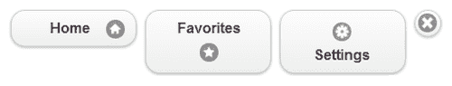

部署自定义图标也是可能的，将在本章后面进行讨论。

# 创建和使用自定义主题

我们已经讨论过 jQuery Mobile 中主题设置的强大功能。它使得用简单而优雅的样式开发丰富的移动网站变得轻而易举。更强大的是，您可以创建自己的样品库，以使您的应用程序或网站真正独特。可以通过以下两种方式之一来处理自己的主题开发：

1.  下载并打开现有的 jQuery Mobile CSS 文件，并按自己的意愿进行编辑。

1.  将您的网络浏览器指向 jQuery Mobile 的 ThemeRoller：[`jquerymobile.com/themeroller/`](http://jquerymobile.com/themeroller/)。

我们将专注于第二种选择，因为说实话，为什么要费劲地浏览所有的 CSS 呢？您可以在 10 分钟内使用指点、点击和拖放的方式创建一个充满样品的新主题。让我们了解一下 ThemeRoller 是什么。

## 什么是 ThemeRoller？

ThemeRoller for jQuery Mobile 是为 jQuery UI 项目编写的一个基于 Web 的应用程序的扩展。它允许用户使用拖放颜色管理在几分钟内快速组装一个充满样品的主题。它具有交互式预览功能，因此您可以立即看到您的更改如何影响您的主题。它还具有内置的检查器工具，可帮助您深入了解细节（如果您需要）。它还集成了 Adobe® Kuler®，一个颜色管理工具。您可以在完成后下载您的主题，可以通过自定义 URL 与他人共享，也可以重新导入过去的主题进行最后的微调。它是一个强大的工具，是 jQuery Mobile 的完美补充。

五个默认样品的特点之一是，jQuery Mobile 团队花了相当多的时间来改善可读性和可用性。这些样品的对比度从最高（A）到最低（E）不等。在单个主题中，对比度最高的区域是页面上最突出的区域。这包括页眉（和列表视图的标题）和按钮。在创建自己的主题时，牢记这一点是个好主意。我们总是希望专注于应用程序的可用性，对吗？如果由于颜色选择不当而无法阅读，那么漂亮的应用有什么用呢？

### 使用 ThemeRoller

当你加载 ThemeRoller 时，第一件事就是看到一个看起来很漂亮的启动屏幕，然后是一个有用的**入门**屏幕：

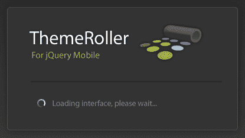

**入门**屏幕上有一些有用的提示，所以在点击**开始**按钮之前一定要看一眼：

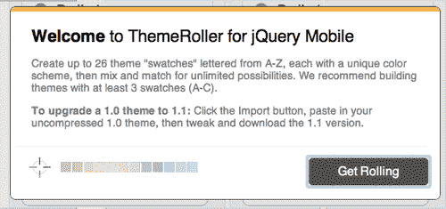

当所有的启动屏幕都结束后，你将会看到主要界面：

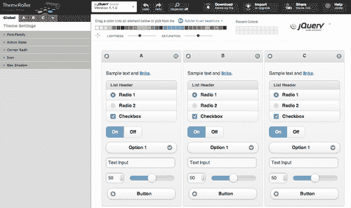

ThemeRoller 分为四个主要区域：预览、颜色、检查员和工具。每个区域都包含了我们需要审查的重要功能。我们将从预览部分开始。

### 预览

除非你正在加载现有主题，否则预览区域将呈现三个完整、相同且交互式的 jQuery 移动页面，上面装满了各种小部件：

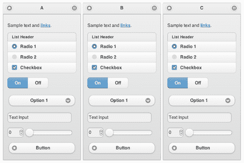

将鼠标移到上面，你会发现每个页面都是功能性的。每个页面的页眉包含了一个字母，指示了哪个色板控制了它的外观。

## 颜色

在页面顶部，你会看到一系列颜色芯片，以及两个滑块控件和一个切换按钮。右边更远处，你会看到另外十个颜色芯片，应该是空白的。这些专门用于最近使用的颜色，直到你选择了颜色为止：

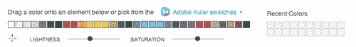

在颜色芯片下面有两个标有**亮度**和**饱和度**的滑块。亮度滑块调整了一系列色板的明亮和暗色调，而饱和度使颜色更加鲜艳或柔和。综合在一起，用户应该能够近似于他们选择的任何颜色。要使用 Kuler®的颜色，点击标有**Adobe Kuler 色板**的文本链接。

每个颜色芯片都可以拖放到预览区域内的任何元素上。这使得色板集的开发非常容易。请注意，许多 jQuery Mobile 样式重叠，比如页顶的标题栏与列表视图的标题接收到相同的样式。根据需要调整颜色，然后将每个色片拖放到页面上的元素上。请记住，每个单独的页面都是自己的色板，所以在选择混合颜色时要小心。

### 检查员

界面最左侧是检查员面板，分为两部分。顶部包含了一系列按钮，允许开发者下载他们的主题，导入现有主题，并分享他们的主题链接。还有一个**帮助**链接给那些没有购买这本书的人：

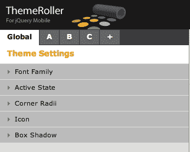

底部区域包含一系列标有**全局, A, B, C**和**+**的标签。每个标签都包含一个手风琴面板，其中包含了单个色板的所有值，除了全局标签，它适用于所有色板。

选择**全局**选项卡，然后点击**活动状态**，手风琴面板将展开，显示整个主题的活动状态设置。选项包括文本颜色、文本阴影、背景和边框。在全局更改值会导致每个当前（和将来的）色板都反映新的设置。

可以通过两种方式向主题添加额外的色板。点击检查器顶部的**+**选项卡会在你的主题中的最后位置添加一个新的色板。你也可以通过点击预览区域底部的**添加色板**按钮来添加一个新的色板。通过选择要删除的色板的选项卡，然后单击该色板名称右侧的**删除**链接来删除色板。请注意，从堆栈顶部删除色板会导致其余色板被重命名。

### 工具

页面顶部有一系列按钮。这些按钮允许你执行各种任务，我们马上就会介绍，但首先，仔细看看这些按钮本身：


你会注意到以下按钮：一个切换按钮，允许你在当前 1.1 版本和 1.0.1 版本之间切换，撤销/重做，以及检查器的切换按钮。将此切换打开可以检查预览区域中的任何小部件。将鼠标悬停在小部件上会用蓝框突出显示该元素。单击该元素将导致检查器区域的手风琴菜单展开，显示特定于该元素的设置。

还有四个额外的按钮，允许你下载你的主题，导入或升级先前创建的主题，与他人分享你的主题，以及一个帮助按钮。

## 创建 Notekeeper 的主题

现在我们熟悉了 ThemeRoller 的界面，那么我们何不继续创建我们的第一个主题呢？与其在抽象中构建一个主题，不如创建一个我们实际将在之前构建的 Notekeeper 应用程序中使用的主题。让我们简单地开始，通过修改 jQuery Mobile 随附的现有主题之一。团队很友好地让用户导入默认主题作为新主题的起点，所以我们首先要去那里。点击窗口左上角的**导入**按钮，然后你会得到一个框，允许你粘贴现有主题的内容：

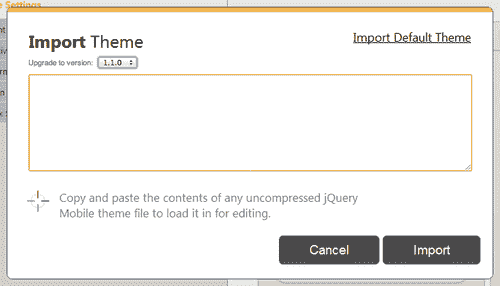

在右上角点击链接，适当命名为**导入默认主题**来导入默认主题。在文本区域填充 CSS 后，点击**导入**。预览区域将重新加载并显示从 **A** 到 **E** 的色板。

我们将集中精力改变白色色板 **D**，因为它最接近我们的最终目标。由于我们更愿意使用色板 **A** 作为名称，让我们删除其他色板，以便只剩下 **D**。请记住，当你删除色板 **A** 时，ThemeRoller 会将其他色板重命名。这意味着当你删除色板 **A** 时，色板 **B** 变成 **A**，色板 **C** 变成 **D**，依此类推。

继续进行，直到原来是**D**的样本现在位于**A**位置。最后，删除样本 **B**（原来是样本 **E**），这样我们就只剩下样本 **A：**

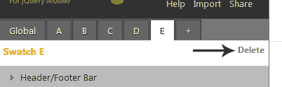

这个样本看起来不错，但有点单调。让我们通过将页眉改为漂亮的绿色来注入一点色彩。确定任何元素的哪些值应该更改的最简单方法是使用检查器。在顶部切换检查器到**On**，然后点击主题 **A** 的页眉的任何地方。如果左侧选择了 **A** 选项卡，并且**页眉/页脚栏**面板展开，你就会知道你做对了：

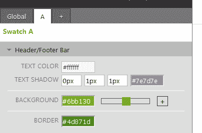

你可以通过几种方式之一改变颜色。你可以直接将一个颜色芯片从顶部拖到背景上。你也可以将一个颜色芯片拖到输入字段上。最后，你可以手动输入值。注意，当你点击包含颜色值的字段时，你会看到一个时髦的颜色选择器。继续，并将此面板中的输入字段中的值更改为上一张截图中显示的值。

看起来不错，但现在主题活动状态的蓝色与我们的绿色不搭配。使用检查器工具，在 On/Off 切换栏的**On**部分单击一次。这将导致**全局**选项卡内的**活动状态**面板展开。我们将把蓝色改成一个漂亮的暖灰色。全局面板现在应该看起来类似于以下截图：

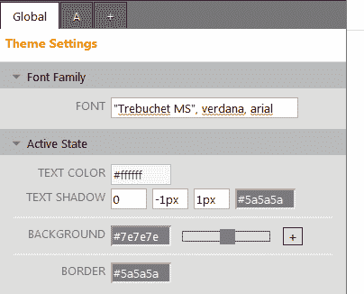

我们新主题唯一的不足之处是段落顶部的蓝色文本链接。回到我们可靠的检查器，让我们直接点击链接，这将展开**内容主体**面板，位于**A**选项卡内。现在，对于那些已经熟悉 CSS 的人来说，你知道你不能简单地改变链接颜色而不改变悬停状态，`visited:hover` 和活动状态。问题在于没有选项可以进行这些更改，但是 ThemeRoller 为你提供了解决方案。点击**链接颜色**输入字段右侧的**+**以显示其他选项，然后根据以下截图更改颜色：

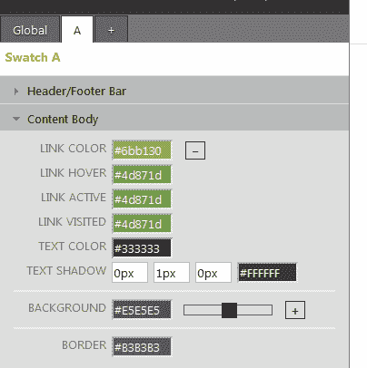

就是这样。随时在探索检查器区域时进行其他主题的额外更改。无论你喜欢什么，都可以更改，现在只是位和字节而已。但请记住，目前没有撤销选项。如果你真的喜欢某些东西，请考虑写下值，以免丢失它们，或者将其导出为它是什么。说到…

### 导出你的主题

在我们实际导出主题之前，必须注意一件事。还记得带有“有用”信息的闪屏页面吗？事实证明，有一条不是建议，而是要求的。

**我们建议用至少 3 个样本（A-C）来构建主题**。

为了使我们的主题正确应用到我们的 Notekeeper 应用程序中，我们需要将我们的单个色板（字母 **A**）复制到色板 **B** 和 **C** 中。幸运的是，这是一件很容易的事情。在检查器顶部选择 **A** 选项卡，然后点击两次 **+** 选项卡。你应该会看到三个相同的色板，现在我们完成了。

现在我们已经完成了我们的主题，我们将导出它以在我们的 Notekeeper 应用中使用。这是一个简单的过程，从页面中间顶部的**下载主题**按钮开始。你将看到一个框，允许你为主题命名，一些关于如何应用主题的信息，以及一个标记为**下载 Zip**的按钮。在将我们的主题命名为 Notekeeper 后，点击**下载 Zip**按钮，你将在下载文件夹中收到一个美味的小东西。

解压缩 ZIP 文件的内容，你将看到以下的目录结构：

+   index.html

+   themes/

    +   `Notekeeper.css`（你的主题的未压缩版本）

    +   `Notekeeper.min.css`（压缩版本。在生产中使用此版本）

    +   images/

        +   `ajax-loader.gif`

        +   `icons-18-black.png`

        +   `icons-18-white.png`

        +   `icons-36-black.png`

        +   `icons-36-white.png`

树顶部的 HTML 文件包含了如何实现你的主题的信息，以及一些小部件来确认主题是否有效。示例文件中的所有链接都是相对的，因此你应该能够将其拖放到任何浏览器窗口中并查看结果。

关于主题的下载和实施的一些注意事项：

1.  jQuery 团队之所以向你提供此 ZIP 文件中的按钮图标是有原因的。主题要求这些图像与 CSS 文件相关联。这意味着，除非你已经在使用默认主题，否则在将你的主题上传到网站时，你还需要包含图像文件夹，否则图标将不会显示出来。

1.  **牢记你的主题的未压缩版本**。虽然由于体积原因你不希望在生产中使用它，但是如果你希望在 ThemeRoller 中编辑它，你将需要它。截止到撰写本文时，ThemeRoller 无法导入被压缩的 CSS 文件。

# 创建和使用自定义图标

我们已经看到了使用 ThemeRoller 向 jQuery Mobile 添加自己的主题是多么简单。现在我们将通过创建一个自定义图标为我们的 Notekeeper 应用增添一些趣味。本节中的说明将专门针对 Photoshop，但任何能够导出透明 PNG 文件的图形应用程序都应该是可以接受的。

## CSS 精灵

在我们创建和使用图标之前，我们应该先了解 jQuery Mobile 如何使用图标并应用它们。在你刚刚创建的主题中有几个图像文件（themes/images）。打开 `icons-18-black.png` 和 `icons-36-black.png`，在你选择的图形编辑器中将它们放大到 400% 或更多，你应该会看到与以下图像非常相似的东西：

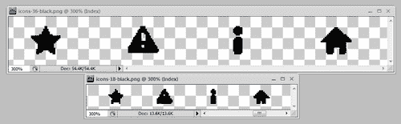

当打开这些文件时，你可能会注意到每个图像都包含所有图标。这是因为 jQuery Mobile 利用了一种称为 **CSS 雪碧图** 的技术，它本身利用了 CSS 允许开发人员通过指定其容器内的位置来 *裁剪* 背景图像的事实，并隐藏通常显示在该容器外部的背景的任何其他部分。它的主要优点包括以下几点：

1.  减少浏览器发出的请求数量。请求越少，通常意味着页面加载速度会更快。

1.  图片位置居中。所有图标都可以在一个位置找到。

以下截图是该技术的简单说明：


浏览器始终从图像的左上角引用图像。在 CSS 语言中，即 `0,0`。要实现此效果，您将背景图像设置在一个容器上，然后简单地调整 `X` 和 `Y` 坐标，直到图像的位置与您的设计匹配。然后设置容器的溢出以裁剪或隐藏图像的其余部分。请记住，您正在 *移动* 图像到左侧，因此对于 `X` 位置，您将使用负数。使用前面的示例作为参考，以下代码片段用于实现此效果：

```js
<html>
<head>
<title></title>
<style>
div {
background: url("icons-36-black.png");
background-position: -929px 4px;
background-repeat: no-repeat;
border: 1px solid #000000;
height: 44px;
overflow: hidden;
width: 44px;
}
</style>
</head>
<body>
<div></div>
</body>
</html>

```

## 设计你的第一个图标

我们只会创建一个单一图标，所以我们不需要图标周围的所有空白空间。让我们先决定我们想要描绘什么。我们的应用叫做 Notekeeper，它创建笔记。也许一个描绘纸张的图标会起作用？这样做的额外好处是在小尺寸下相对容易表示。在你选择的图像编辑器中创建一个新文档，尺寸为 `36x36` 像素，分辨率为 `72` dpi。将其命名为 `notekeeper-icon-black-36.png`：

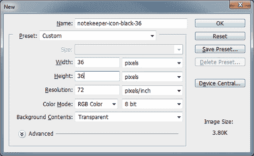

尽管文档的尺寸是 36x36 像素，但图标的有效区域只有 22x22 像素。这是为了与 jQuery Mobile 团队提供的图标保持一致，以确保我们的图标看起来不奇怪。为了更容易地保持在线条内，使用矩形选择工具在 22px 处绘制一个正方形，然后将其位置设置在文档的顶部边缘和左侧边缘各 7px 处。

接下来，沿着每条边绘制指南线，使得你的文档看起来类似以下截图：

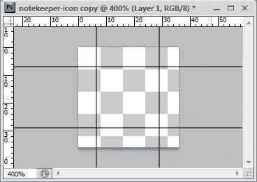

在绘制图标时，你需要考虑所描绘事物的尺寸和属性。你不可能表现出所有细节，但你需要传达事物的精神。一张纸比它宽高比更高，并且上面有线条。让我们从这两点开始，看看我们能得出什么。此套图标中的其他图标都有较粗的感觉，以便它们能在背景中显眼。让我们填充一个实心形状，然后删除页面的线条，以便图标具有相同的粗糙感。我们将用黑色绘制线条，以便它们在书中更好地打印出来，但我们的图标需要是白色的。确保你相应调整你的设计：

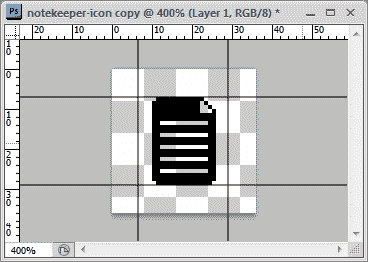

这个图标似乎符合我们所有的标准。它比宽高比更高，并且像纸一样有线条。它还有一个活泼的小翻页，给它一些态度。这不就是每个人在他们的纸图标上寻找的东西吗？确保图标的线条是白色的，然后保存它。jQuery Mobile 图标已保存为透明的 PNG-8 文件。这类似于 GIF 格式，但不是必需的。如果你愿意，可以使用透明 GIF 或透明 PNG-24。

当我们创建第一个图标时，我们创建了高分辨率版本。 为了简洁起见，我们将快速浏览创建低分辨率图标的步骤：

1.  创建一个新的图像文档，尺寸为 18x18 像素。将其命名为`notekeeper-icon-18`。

1.  这个图标的活动区域将是 12x12 像素。绘制一个 12px 的正方形选择区域，然后将其位置设置为距离顶部 3px，距离左侧 3px。

1.  绘制你的辅助线，然后草图出图标，使用以前的版本作为参考。在这么小的空间里画图标确实很难，不是吗？

1.  你的最终结果应该类似于以下截图：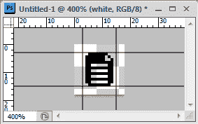

将两个图像与你的 Notekeeper 主题一起保存并关闭 Photoshop。

## 高分辨率和低分辨率

分辨率是可以显示在给定区域内的点数或像素数。来自网络世界的你们通常将所有东西都以 72dpi 进行测量，因为大多数显示器都显示这个分辨率。如果你有很多移动设备的经验，你可能知道每个设备的分辨率可能与其旁边的设备不同。这样做的问题在于，分辨率更高的设备在屏幕上只是显示更多的像素。这意味着在高分辨率屏幕上显示的图像将比在低分辨率屏幕上显示的同一图像要小。

jQuery Mobile 通过为高分辨率和低分辨率设备提供两个版本的每个图标以及两套代码来解决此问题。在下一节中，我们将为我们的 Notekeeper 应用程序应用自定义主题和自定义图标。

# 更新 Notekeeper 应用程序

是时候将所有这些松散的端点联系在一起了。我们有一个使用 ThemeRoller 构建的自定义主题，我们有我们漂亮的自定义图标，现在是时候将所有的片段组合在一起了。您需要以下内容来完成：

1.  你在 Notekeeper 章节末尾完成的代码。

1.  您在本章前面创建的自定义主题。

1.  您的自定义图标；白色；分别为 18px 和 36px 尺寸。

## 添加我们的自定义主题

让我们从最简单的部分开始。添加我们的自定义主题非常简单。打开`notekeeper.html`（在您的浏览器中，并在您选择的文本编辑器中）。查找`<head>`标签并添加以下行：

```js
<title>Notekeeper</title>
<meta name="viewport" content="width=device-width, initial-scale=1">
<link rel="stylesheet" href="http://code.jquery.com/mobile/ latest/jquery.mobile.min.css" />
<link rel="stylesheet" href ="themes/Notekeeper.min.css" />
<link rel="stylesheet" href ="styles.css" />
<script src="img/jquery-1.6.4.js"></script>
<script src="img/jquery.mobile.min.js"></script>
<script src="img/application.js"></script>

```

第一行新加入了我们创建的新主题。第二行目前指向一个缺失的文件（因为我们还没有创建它）。即使像 jQuery Mobile 这样拥有丰富主题系统的系统，我们仍然会为各种事物编写一些自定义 CSS。`styles.css`是我们将放置各种样式的地方，特别是我们自定义图标的定义。

顺便说一句，您可以重新加载浏览器窗口，看看我们的新主题是如何运行的。是不是很漂亮？当我们的自定义图标出现时，它会看起来更加漂亮。

## 添加我们的自定义图标

接着，在你的 Notekeeper 应用代码的根目录下创建`styles.css`，然后打开它。我们将首先添加我们的 18px 图标的声明。它是低分辨率的，将在您的桌面浏览器中看到。高分辨率图标目前只在 iPhone 4 和 iPhone 4S 上显示。

要添加我们的自定义图标，我们遵循 jQuery Mobile 设定的模式。它使用`.ui-icon`前缀为按钮和其他元素应用图标。这意味着为了使我们的图标在框架中起作用，我们必须将我们的 CSS 类命名为以下内容：

```js
.ui-icon-notekeeper-note {
background-image: url("themes/images/notekeeper-icon-white-18.png");
}

```

然后，将图标添加到我们的“添加笔记”按钮中就像添加一个`data-icon`属性一样简单，如下所示的代码行所示：

```js
<div class="ui-block-b">
<input id="btnAddNote" type="button" value="Add Note" data- icon="notekeeper-note" />
</div>

```

请记住，字符串`notekeeper-note`可以是任何东西，只要它与您之前创建的 CSS 类的后半部分匹配即可。最后让我们为我们的应用程序添加剩下的一部分，即高分辨率图标。

jQuery Mobile 的一个显著特点是它对**媒体查询**的支持。媒体查询本质上允许您查询给定设备的各种信息，基于其媒体类型：屏幕、打印、电视、手持设备等。对这个查询的回答允许开发人员对 CSS 代码进行分支，并为桌面浏览器（屏幕）显示页面的一种方式，为电视（电视）显示页面的另一种方式。对于我们的图标，我们想要询问任何视图设备，其类型为屏幕，是否支持一个名为`-webkit-min-device-pixel-ratio`的属性，以及该属性的值是否为`2`。在低分辨率图标的声明之后，将以下行添加到`styles.css`中：

```js
@media only screen and (-webkit-min-device-pixel-ratio: 2) {
.ui-icon-notekeeper-note {
background-image: url("themes/images/notekeeper-icon-white-36.png");
background-size: 18px 18px;
}
}

```

除了媒体查询代码之外，这个唯一与众不同的是`background-size`属性。它允许开发人员指定给定背景应按指定大小（18x18 像素）缩放，而不是其原始大小 36x36 像素。由于 iPhone 4 和 4S 上的分辨率恰好是低分辨率设备的两倍，这意味着我们将两倍的像素打包到与较小图标相同的空间中。最终结果是图标看起来更加清晰和锐利。如果您拥有其中一款设备，请将您的代码上传到服务器并查看它。您的耐心将会得到回报。

# 总结

在本章中，我们学习了对于 jQuery Mobile 体验至关重要的高级 CSS 技术，以及 jQuery Mobile 如何利用它们为最终用户提供丰富的界面。我们深入探讨了 jQuery Mobile 主题化的基础知识以及它的工作原理。我们使用 ThemeRoller 工具构建了一个自定义主题，用我们自己的双手创建了一个自定义图标，并学习了如何将所有这些东西联系在一起并在我们的应用程序中实现它们。

在下一章中，您将学习如何运用过去 11 章学到的原则，并创建一个可以在 iOS 和 Android 平台上运行的本机应用程序（以及其他几个平台），使用 Phonegap 开源库。
