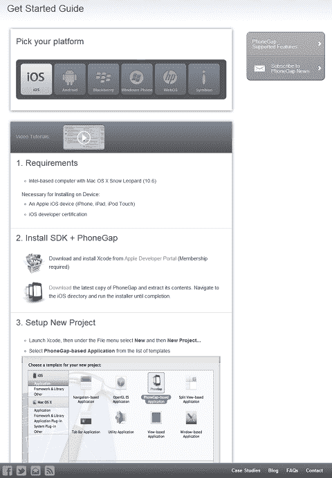
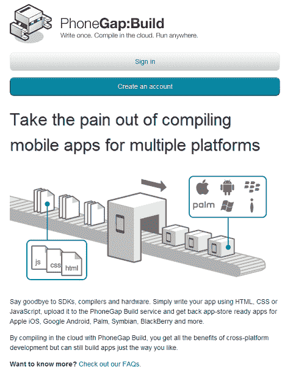
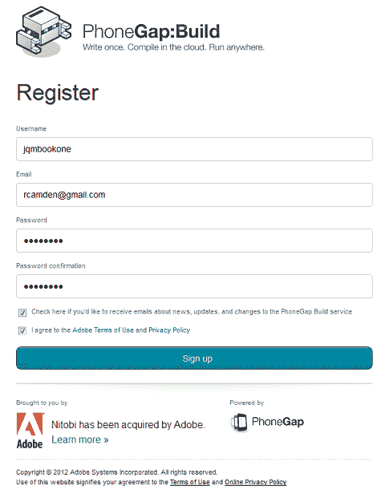
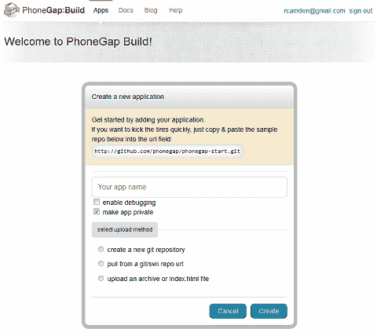
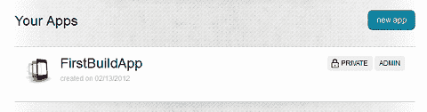
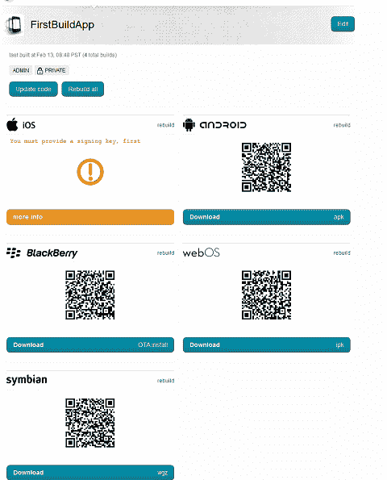
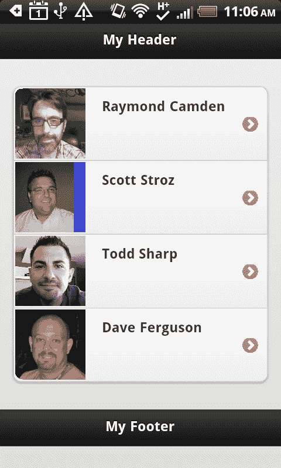
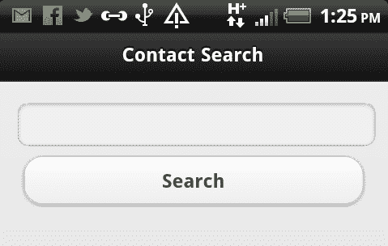
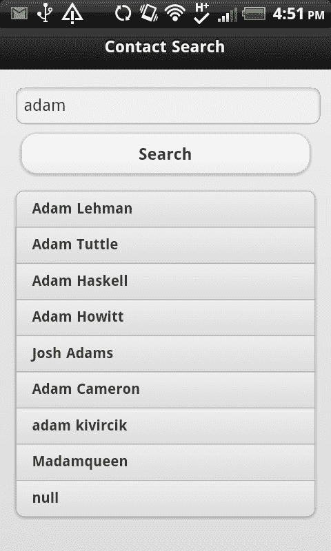

# 第十二章：创建原生应用程序

在本章中，我们将看看如何将基于 jQuery Mobile 的 Web 应用程序转化为移动设备的原生应用程序。我们将讨论 PhoneGap 框架以及它如何允许您利用设备的硬件。

在本章中，我们将：

+   讨论 PhoneGap 项目及其功能

+   演示如何使用 PhoneGap 的构建服务来创建原生应用程序

# HTML 作为原生应用

对大多数人来说，在诸如 Android 或 iOS 之类的平台上创建原生应用程序需要学习全新的编程语言。虽然学习新语言并扩展技能的范围总是很好，但如果您可以利用现有的 HTML 技能并在移动设备上本地使用它们，那岂不是很酷？

幸运的是，正好有这样一个平台。PhoneGap ([`www.phonegap.com`](http://www.phonegap.com))是一个开源项目，允许您使用 HTML 页面创建原生应用程序。这段代码完全免费，可用于开发 iOS（iPhone 和 iPad）、Android（手机和平板电脑）、Blackberry、WebOS、Windows Phone 7、Symbian 和 Bada 的应用程序。PhoneGap 通过在原生环境中创建一个项目并指向一个 HTML 文件来工作。一旦设置好，您可以利用现有的 HTML、CSS 和 JavaScript 技能来创建应用程序的用户界面和功能。

更好的是，PhoneGap 还为您的 JavaScript 代码提供了额外的 API。这些 API 允许：

+   加速器：允许您的代码检测设备上的基本运动

+   摄像头：允许您的代码与相机配合使用

+   Compass：让您访问设备上的指南针

+   联系人：提供基本的搜索和联系人创建支持

+   文件：读/写访问设备存储

+   地理定位：提供一种检测设备位置的方式

+   媒体：允许基本的视频/音频捕获支持

+   网络：确定设备的网络连接设置

+   通知：创建通知的简单方式（通过弹出窗口、声音或振动）

+   存储：访问一个简单的 SQL 数据库

通过使用这些 API，您可以将普通的 HTML 网站转化为功能强大的类原生应用程序，用户可以下载并安装到他们的设备上。

在我们继续之前，让我们简要了解一下**PhoneGap**。PhoneGap 是 Apache 目前处于孵化状态的开源项目。它已更名为**Cordova**。你可能会听到人们用这两个名字来指代它。在写这本书的时候，大多数人仍然把这个项目称为 PhoneGap，这也是我们将使用的术语。重要的是要记住，PhoneGap 是免费且开源的！

在我们继续之前，让我们快速讨论一下 PhoneGap 应用程序与原生应用程序的比较。在大多数情况下，原生应用程序的性能比使用 PhoneGap 创建的应用程序要快。PhoneGap 并不意味着取代原生开发。但通过允许您使用现有技能并一次部署到多个平台，其好处可能远远超过对性能的任何关注。

## 使用 PhoneGap

创建一个 PhoneGap 项目有两种主要方法。人们使用 PhoneGap 的主要方式是首先使用他们正在为之构建的平台的开发工具。所以，对于一个安卓项目，这涉及使用具有正确插件的 Eclipse 编辑器，而在 iOS 上则涉及使用 XCode。*入门指南* ([`www.phonegap.com/start`](http://www.phonegap.com/start)) 提供了如何为您选择的设备平台设置环境的详细信息：



对于每个平台的设置细节对于本书来说太多了（而且只是重复了 PhoneGap 网站上的内容），所以我们将专注于创建原生应用的另一种选项，即 **PhoneGap Build** 服务。PhoneGap Build ([`build.phonegap.com`](https://build.phonegap.com)) 是一个在线服务，简化并自动化了创建原生应用的过程。它允许您简单地上传代码（或使用公共源代码控制存储库）以生成原生二进制文件。更好的是，您可以使用 PhoneGap Build 为所有受支持的平台生成二进制文件。这意味着您可以编写您的代码，并从该网站生成 iPhone、安卓、黑莓和其他版本的代码：



PhoneGap Build 服务并不免费。定价计划和其他详情可以在该网站上找到，但幸运的是有一个免费的开发者计划。这就是我们将在本章中使用的服务。让我们开始创建一个账户。（在接下来的屏幕截图和示例中，请确保将细节更改为您自己的特定内容。）

首先点击 **创建账户** 按钮并填写相关细节：



注册后，您将返回到 PhoneGap Build 的首页，您不会看到任何类型的确认消息。这有点不幸，但如果您检查您的电子邮件，您应该会看到他们发来的一封验证注册的消息。点击那个链接，您将被带到一个页面，询问您要创建您的第一个 PhoneGap Build 项目：



请注意，构建服务支持从新的 Github 存储库、现有的 Git 或 Subversion 存储库或通过上传的 ZIP 或 HTML 文件中的项目种子。此时，让我们离开网站，再回到代码。我们想要从一个非常简单的代码集开始。稍后在本章中我们会做一些更有趣的事情，但现在，我们的目标只是上传一些 HTML 并看看接下来会发生什么。在你从 GitHub 下载的代码中，打开`c12`文件夹，看看`app1`文件夹。其中包含了第四章 *Working with Lists*中一个列表示例的副本。它使用 jQuery Mobile 创建了一个简单的包括缩略图片的四人列表。这并不是太令人兴奋，但对我们目前的目的来说已经足够了。你会注意到已经有一个`app1.zip`文件。

如果你回到网站并选择**上传存档**，然后可以浏览到你从计算机上解压文件的位置并选择那个 ZIP 文件。确保还为应用程序输入一个名称。我选择了`FirstBuildApp`。点击**创建**后，你会被带到包含您所有应用程序的页面，如果您是一个新的构建用户，那里将只包含刚刚创建的一个应用程序。



点击应用程序标题，然后您可以选择下载各种版本的应用程序。信不信由你——你已经能够在大多数平台上下载版本。但使用 iOS 需要你提供额外的细节：



如果你看不到**下载**链接而是看到一个**排队**通知，请给构建服务一两分钟来赶上。如果你简单地重新加载页面，最终你就会看到链接显示出来。

真正使用应用程序取决于你选择的平台。对于安卓，你需要确保已启用**允许安装非市场应用程序**设置。该设置的确切措辞和位置将取决于您的设备。这个短语可以在我的 HTC Inspire 设备的**应用**设置中找到。您可以通过在 PhoneGap Build 网站上编辑设置来对应用程序签名。一旦你做过了，你就可以将你的应用程序提交到安卓市场。但由于安卓允许您测试时使用未签名的应用程序，您可以跳过此步骤。如果您下载 APK（表示您的应用程序的实际文件），您可以以几种方式将其放在设备上。安卓 SDK 包括从命令行安装应用程序的工具。最简单的方法是使用你的电子邮件。如果你将文件发给自己，并在设备上检查你的电子邮件，你应该能够在那里安装它。以下屏幕截图显示了我的手机上运行的应用程序：



## 添加 PhoneGap 功能

我们刚刚演示了如何使用 PhoneGap Build 服务将 HTML（当然还包括 JavaScript、CSS 和图像）转换为真正的本机应用程序，以适应多个平台。然而，在本章的前面部分提到过，PhoneGap 提供的不仅仅是简单的包装器来将 HTML 转换为本机应用程序。PhoneGap JavaScript API 提供了对许多酷炫的设备中心服务的访问，这些服务可以极大地增强您的应用程序的功能。对于我们的第二个示例，我们将看一下其中一个功能——联系人 API（有关详细信息，请参阅*联系人 API 文档*，可在[`docs.phonegap.com/en/1.4.1/phonegap_contacts_contacts.md.html#Contacts)`](http://docs.phonegap.com/en/1.4.1/phonegap_contacts_contacts.md.html#Contacts)上找到）。

应用程序在`Listing 12-1`中是一个简单的联系人搜索工具。让我们看看代码，然后解释一下其中的内容：

```js
Listing 12-1: index.html
<!DOCTYPE html>
<html>
<head>
<title>Contact Search</title>
<meta name="viewport" content="width=device-width, initial- scale=1">
<link rel="stylesheet" href ="jquery.mobile.min.css" />
<script src="img/jquery.js"></script>
<script src="img/jquery.mobile.min.js"></script>
<script src="img/phonegap-1.4.1.js"></script>
<script>
document.addEventListener("deviceready", onDeviceReady, false);
function onDeviceReady(){
$("#searchButton").bind("touchend", function() {
var search = $.trim($("#search").val());
if(search == "") return;
var opt = new ContactFindOptions();
opt.filter = search;
opt.multiple = true;
navigator.contacts.find(["displayName","emails"], foundContacts, errorContacts, opt);
});
foundContacts = function(matches){
//create results in our list
var s = "";
for (var i = 0; i < matches.length; i++) {
s += "<li>"+matches[i].displayName+"</li>";
}
$("#results").html(s);
$("#results").listview("refresh");
}
errorContacts = function(err){
navigator.notification.alert("Sorry, we had a problem and gave up.", function() {});
}
}
</script>
</head>
<body>
<div data-role="page">
<div data-role="header">
<h1>Contact Search</h1>
</div>
<div data-role="content">
<input type="text" id="search" value="adam" />
<button id="searchButton">Search</button>
<ul id="results" data-role="listview" data-inset="true"></ul>
</div>
</div>
</div>
</body>
</html>

```

让我们首先看看应用程序的布局部分，它位于文件的下半部分。您可以看到我们的 jQuery Mobile 页面结构，其中包括一个输入字段、一个按钮和一个空列表。这里的想法是用户将输入要搜索的名称，点击按钮，结果将显示在列表中。以下屏幕截图展示了输出：



现在看一下 JavaScript 代码。我们所做的第一个更改是包含 PhoneGap JavaScript 库：

```js
<script src="img/phonegap-1.4.1.js"></script>

```

此 JavaScript 库可从您从 PhoneGap 下载的 ZIP 文件中获得。即使我们不打算在本地构建我们的应用程序（当然您也可以），我们也需要在发送到 Build 服务的 ZIP 文件中包含 JavaScript 文件。这里有一个棘手的部分。截至 PhoneGap v 1.4.1，每个平台的 JavaScript 文件都是唯一的。这意味着 PhoneGap 支持的每个操作系统都有一个不同的 JavaScript 文件。Build 服务足够智能，可以用适当平台的正确文件替换您的文件引用。如果您使用本书的 Github 存储库中的代码，则是 Android 版本。如果您想将此代码用于 iOS，请务必在本地替换 JavaScript 文件。

下一个有趣的细节是以下代码行：

```js
document.addEventListener("deviceready", onDeviceReady, false);

```

`deviceready`事件是由 PhoneGap 触发的特殊事件。它基本上意味着您的代码现在可以使用高级功能，例如 Contacts API。

在事件处理程序`onDeviceReady`中，我们有一些事情要做。值得注意的第一个函数是搜索按钮的事件处理程序。前几行代码只是获取、修整和验证值。

在确保实际有内容可以搜索后，您可以看到对 Contacts API 的第一个实际使用，如下面的代码片段所示：

```js
var opt = new ContactFindOptions();
opt.filter = search;
opt.multiple = true;
navigator.contacts.find(["displayName","emails"], foundContacts, errorContacts, opt);

```

联系人 API 具有搜索方法。其第一个参数是要搜索和返回的字段数组。在我们的案例中，我们表示我们要针对联系人的姓名和电子邮件值进行搜索。第二个和第三个参数是成功和错误回调。最后一个选项是搜索的选项集。你可以在调用之前看到它被创建。过滤器键仅是搜索词条。默认情况下，联系人搜索返回一个结果，所以我们特别要求多个结果。

现在让我们来看一下成功处理程序：

```js
foundContacts = function(matches){
//create results in our list
var s = "";
for (var i = 0; i < matches.length; i++) {
s += "<li>"+matches[i].displayName+"</li>";
}
$("#results").html(s);
$("#results").listview("refresh");
}

```

联系人搜索的结果将是一个结果数组。记住你只会得到你要求的内容，所以我们的结果对象包含 `displayName` 和 `emails` 属性。目前，我们的代码只是获取 `displayName` 并将其添加到列表中。根据我们从之前的章节学到的知识，我们还知道每当修改列表时，我们需要刷新 jQuery Mobile listview。以下屏幕截图显示了一个示例搜索：



# 摘要

在本章中，我们研究了 PhoneGap 开源项目以及它如何允许你使用 HTML、JavaScript 和 CSS 创建多种不同设备的原生应用程序。我们使用 Build 服务并用它来上传我们的代码和下载编译后的原生应用程序。虽然 jQuery Mobile 不是 PhoneGap 的必需品，但两者组合在一起非常强大。

在下一章中，我们将使用这个团队创建我们的最终应用程序，一个功能齐全的 RSS 阅读器。
