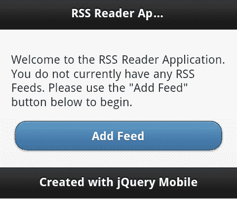
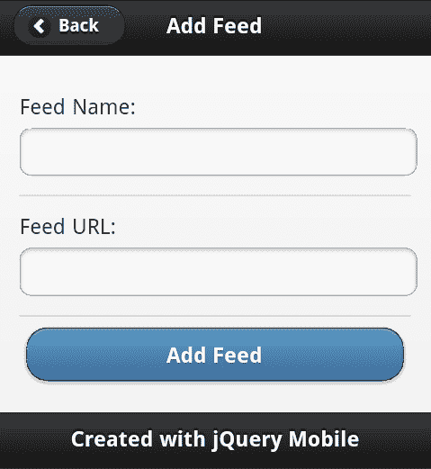
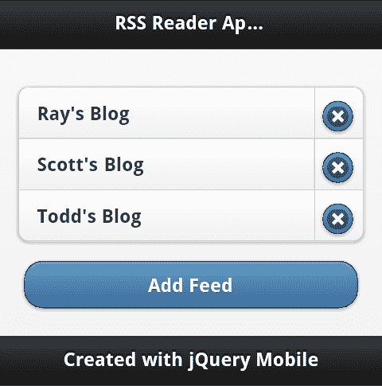
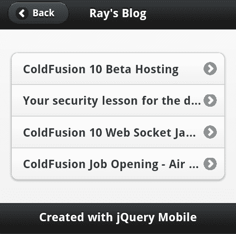
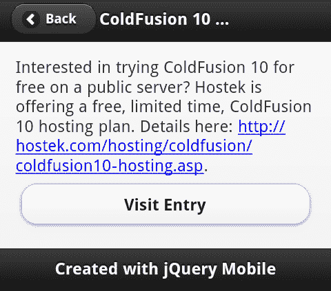

# 第十三章：成为专家 - 构建一个 RSS 阅读器应用程序

现在您已经了解了 jQuery Mobile 及其功能，是时候构建我们最终的完整应用程序了 —— 一个 RSS 阅读器。

在这一章中，我们将：

+   讨论 RSS 阅读器应用程序及其功能

+   创建应用程序

+   讨论可以添加到应用程序的内容

# RSS 阅读器 —— 应用程序

在深入代码之前，可能有必要快速展示应用程序的最终工作形式，以便您可以看到各个部分及其如何一起工作。RSS 阅读器应用程序就是这样一个应用程序，它旨在获取 RSS 源（例如来自 CNN、ESPN 和其他网站的源），将它们解析为可读数据，并提供一种查看文章的方式。该应用程序将允许您添加和删除源，提供名称和 URL，并提供一种查看源当前条目的方法。

应用程序始于一组基本说明。只有在您运行应用程序而没有任何已知源时才会显示这些说明：



单击 **添加源** 按钮会带您进入一个简单的表单，允许输入名称和 URL。（不幸的是，URL 必须手动输入。幸运的是，现代移动设备支持复制和粘贴。我强烈建议使用这个！）：



添加源后，您将返回到主页。以下截图显示添加了一些源后的视图：



要开始阅读条目，用户只需选择其中一个源。然后，它将获取该源并显示当前的条目：



应用程序的最后部分是入口视图本身。有些博客不会通过 RSS 提供“完整”的入口副本，显然您可能希望在博客本身发表评论。因此，在底部我们提供了一种简单的方法来访问真正的网站，如下图所示：



现在您已经看到了应用程序，让我们来构建它。我们将再次使用 PhoneGap Build 来创建最终结果，但这个应用程序实际上也可以在常规网站上运行。（我们将稍后讨论为什么。）

# 创建 RSS 阅读器应用程序

我们的应用程序从第一个页面 `index.html` 开始。此页面将加载 jQuery 和 jQuery Mobile。它的核心任务是列出您当前的源，但它必须在用户没有任何源时识别出来，并提供一些文本鼓励他们添加他们的第一个源：

```js
Listing 13-1: index.html
<!DOCTYPE html>
<html>
<head>
<title>RSS Reader App</title>
<meta name="viewport" content="width=device-width, initial- scale=1">
<link rel="stylesheet" href ="jquery.mobile/jquery.mobile- 1.1.0.min.css" />
<script src="img/jquery-1.6.4.min.js"></script>
<script src="img/jquery.mobile-1.1.0.min.js"></script>
<script src="img/main.js"></script>
</head>
<body>
<div data-role="page" id="intropage">
<div data-role="header">
<h1>RSS Reader Application</h1>
</div>
<div data-role="content" id="introContent">
<p id="introContentNoFeeds" style="display:none">
Welcome to the RSS Reader Application. You do not currently have any RSS Feeds. Please use the "Add Feed" button below to begin.
</p>
<ul id="feedList" data-role="listview" data-inset="true" data- split-icon="delete"></ul>
<a href ="addfeed.html" data-role="button" data-theme="b">Add Feed</a>
</div>
<div data-role="footer">
<h4>Created with jQuery Mobile</h4>
</div>
</div>
<script>
$("#intropage").bind("pagecreate", function(e) {
init();
});
</script>
</body>
</html>

```

如代码清单前所述，我们需要首先加载 jQuery 和 jQuery Mobile 模板。您可以在前面的代码清单的开头看到这一点。页面的大部分是您在上一章中看到的模板 HTML，所以让我们指出一些具体的内容。

首先注意下导语段落。注意 CSS 来隐藏文本吗？这里的假设是 — 大多数情况下 — 用户不会需要这段文字，因为他们会有订阅源。我们的代码将在必要时处理显示它。

在该段落之后是一个空列表，将显示我们的 feeds。在下面是用于添加新 feeds 的按钮。

最后，我们在最后放了一小段脚本。这创建了一个 jQuery Mobile 页面事件 `pagecreate` 的事件监听器，我们将它与启动我们的应用程序任务相关联。

我们所有的代码（我们的自定义代码）都将存储在 `main.js` 中。这个文件有点大，所以我们只显示与每个部分相关的部分。在阅读本章时，请记住这一点。整个文件可以在书中的示例代码中找到：

```js
Listing 13-2: Portion of main.js
function init() {
//handle getting and displaying the intro or feeds
$("#intropage").live("pageshow",function(e) {
displayFeeds();
});

```

我们从 `main.js` 中的 `init` 函数开始。记住这个函数在首页的 `pagecreate` 上运行。它在页面显示之前运行。这使得它成为一个很好的地方去注册一个函数，用于页面显示时。我们已经将大部分逻辑提取到自己的函数中，所以接下来让我们来看看它。

## `displayFeeds` 函数

`displayFeeds` 处理检索我们的 feeds 并显示它们。逻辑很简单。如果没有 feeds，我们想要显示导语文本：

```js
Listing 13-3: displayFeeds from main.js
function displayFeeds() {
var feeds = getFeeds();
if(feeds.length == 0) {
//in case we had one form before...
$("#feedList").html("");
$("#introContentNoFeeds").show();
} else {
$("#introContentNoFeeds").hide();
var s = "";
for(var i=0; i<feeds.length; i++) {
s+= "<li><a href ='http://feed.html?id="+i+"' data- feed='"+i+"'>"+feeds[i].name+"</a> <a href ='http:// class='deleteFeed' data-feedid='"+i+"'>Delete</a></li>";
}
$("#feedList").html(s);
$("#feedList").listview("refresh");
}
}

```

注意我们还清空了列表。可能用户有 feeds 并删除了它们。通过将列表重置为空字符串，我们确保我们不留下任何东西。如果有 feeds，我们动态创建列表，确保在最后调用 `listview("refresh")` API，请求 jQuery Mobile 对列表进行美化。

## 存储我们的 feeds

那 feeds 是从哪里来的？我们如何存储它们？虽然我们正在使用 PhoneGap 并且可以使用嵌入式 SQLite 数据库实现，但我们可以使用更简单的东西 `localStorage`。`localStorage` 是一个 HTML5 功能，允许你在客户端存储键值对。虽然你不能存储复杂的数据，但你可以在存储之前使用 JSON 序列化来编码复杂的数据。这使得数据的存储非常简单。但请记住 `localStorage` 包含文件存储。当数据发生变化时，您的应用程序需要从文件中读取。尽管我们谈论的是一个简单的 feed 列表，但这些数据应该相对较小：

```js
Listing 13-3: getFeeds, addFeed, and removeFeed
function getFeeds() {
if(localStorage["feeds"]) {
return JSON.parse(localStorage["feeds"]);
} else return [];
}
function addFeed(name,url) {
var feeds = getFeeds();
feeds.push({name:name,url:url});
localStorage["feeds"] = JSON.stringify(feeds);
}
function removeFeed(id) {
var feeds = getFeeds();
feeds.splice(id, 1);
localStorage["feeds"] = JSON.stringify(feeds);
displayFeeds();
}

```

前三个函数代表了我们存储系统的整个封装。`getFeeds` 简单地检查 `localStorage` 的值，如果存在，则处理将 JSON 数据转换为原生 JavaScript 对象。`addFeed` 接受一个 feed 名称和 URL，创建一个简单的对象，并存储 JSON 版本。最后，`removeFeed` 函数简单地处理找到数组中的正确项，删除它，并将其存储回 `localStorage`。

## 添加一个 RSS feed

目前一切顺利。现在让我们看看添加 feed 所需的逻辑。如果你记得，我们用来添加 feed 的链接指向`addfeed.html`。让我们来看看它：

```js
Listing 13-4: addfeed.html
<!DOCTYPE html>
<html>
<head>
<title>Add Feed</title>
<meta name="viewport" content="width=device-width, initial-scale=1">
</head>
<body>
<div data-role="page" id="addfeedpage" data-add-back-btn="true">
<div data-role="header">
<h1>Add Feed</h1>
</div>
<div data-role="content">
<form id="addFeedForm">
<div data-role="fieldcontain">
<label for="feedname">Feed Name:</label>
<input type="text" id="feedname" value="" />
</div>
<div data-role="fieldcontain">
<label for="feedurl">Feed URL:</label>
<input type="text" id="feedurl" value="" />
</div>
<input type="submit" value="Add Feed" data-theme="b">
</div>
<div data-role="footer">
<h4>Created with jQuery Mobile</h4>
</div>
</div>
</body>
</html>

```

除了表单外，这个页面没有太多内容。请注意，我们的表单没有 action。我们在这里不使用服务器。相反，我们的代码将处理表单提交并执行某些操作。还要注意，我们没有按照之前建议的做法——将 jQuery 和 jQuery Mobile 包含在顶部。在桌面应用程序中，这些包含是必需的，因为用户可能会将页面添加到应用程序的主页之外的书签中。由于该代码的最终目标是 PhoneGap 应用程序，我们不必担心这一点。这使得我们的 HTML 文件稍微小了一点。现在让我们返回到`main.js`，看看处理这一逻辑的代码。

以下代码是`main.js`的`init`方法的片段。它处理表单上的按钮点击：

```js
Listing 13-5: Add Feed event registration logic
//Listen for the addFeedPage so we can support adding feeds
$("#addfeedpage").live("pageshow", function(e) {
$("#addFeedForm").submit(function(e) {
handleAddFeed();
return false;
});
});

```

现在我们可以看看`handleAddFeed`了。我已经将这段代码抽象出来，只是为了简化事情：

```js
Listing 13-6: handleAddFeed
function handleAddFeed() {
var feedname = $.trim($("#feedname").val());
var feedurl = $.trim($("#feedurl").val());
//basic error handling
var errors = "";
if(feedname == "") errors += "Feed name is required.\n";
if(feedurl == "") errors += "Feed url is required.\n";
if(errors != "") {
//Create a PhoneGap notification for the error
navigator.notification.alert(errors, function() {});
} else {
addFeed(feedname, feedurl);
$.mobile.changePage("index.html");
}
}

```

在大部分情况下，这里的逻辑应该很容易理解。我们获取 feed 名称和 URL 值，确保它们不为空，并可选地提醒任何错误。如果没有发生错误，那么我们运行之前描述的`addFeed`方法。请注意，我们使用`changePage`API 返回用户到主页。

我在这里特别指出一段代码，处理显示错误的那一行：

```js
navigator.notification.alert(errors, function() {});

```

这一行来自于 PhoneGap API。它为您的设备创建了一个针对移动设备的特定警报通知。你可以把它想象成一个更高级的 JavaScript `alert()` 调用。第二个参数是警报窗口解除时的回调函数。因为我们在那种情况下不需要执行任何操作，所以我们提供了一个什么都不做的空回调。

## 查看 feed

当用户点击查看 feed 时会发生什么？这可能是应用程序中最复杂的部分。我们从 HTML 模板开始，这相当简单，因为大部分工作将在 JavaScript 中完成：

```js
Listing 13-7: feed.html
<!DOCTYPE html>
<html>
<head>
<title>Feed</title>
<meta name="viewport" content="width=device-width, initial-scale=1">
</head>
<body>
<div data-role="page" id="feedpage" data-add-back-btn="true">
<div data-role="header">
<h1></h1>
</div>
<div data-role="content" id="feedcontents">
</div>
<div data-role="footer">
<h4>Created with jQuery Mobile</h4>
</div>
</div>
</body>
</html>

```

这个页面基本上充当一个外壳。请注意，它根本没有真正的内容，只是空的 HTML 元素等待填充。让我们返回到`main.js`，看看这是如何工作的：

```js
Listing 13-8: Feed display handler (part 1)
//Listen for the Feed Page so we can displaying entries
$("#feedpage").live("pageshow", function(e) {
//get the feed id based on query string
var query = $(this).data("url").split("=")[1];
//remove ?id=
query = query.replace("?id=","");
//assume it's a valid ID, since this is a mobile app folks won't be messing with the urls, but keep
//in mind normally this would be a concern
var feeds = getFeeds();
var thisFeed = feeds[query];
$("h1",this).text(thisFeed.name);
if(!feedCache[thisFeed.url]) {
$("#feedcontents").html("<p>Fetching data...</p>");
//now use Google Feeds API
$.get("https://ajax.googleapis.com/ajax/services/feed/ load?v=1.0&num=10&q="+encodeURI(thisFeed.url)+"&callback=?", {}, function(res,code) {
//see if the response was good...
if(res.responseStatus == 200) {
feedCache[thisFeed.url] = res.responseData.feed.entries;
displayFeed( thisFeed.url);
} else {
var error = "<p>Sorry, but this feed could not be loaded:</p><p>"+res.responseDetails+"</p>";
$("#feedcontents").html(error);
}
},"json");
} else {
displayFeed(thisFeed.url);
}
});

```

这段代码片段处理了对`feed.html`上的`pageshow`事件的监听。这意味着每次查看该文件时都会运行该代码，这正是我们想要的，因为它用于每个不同的 feed。这是如何工作的？记得我们的 feeds 列表包括了 feed 本身的标识符：

```js
for(var i=0; i<feeds.length; i++) {
s+= "<li><a href='http://feed.html?id="+i+"' data- feed='"+i+"'>"+feeds[i].name+"</a> <a href='http:// class='deleteFeed' data-feedid='"+i+"'>Delete</a></li>";
}

```

jQuery Mobile 通过数据（"url"）API 为我们提供了对 URL 的访问。由于这会返回整个 URL，而我们只关心问号后的内容，因此我们可以使用一些字符串函数来清理它。最终结果是一个数值查询，我们可以使用它来从我们的 feed 查询中提取数据。在常规的桌面应用程序中，用户很容易搞乱 URL 参数。因此，我们在这里进行一些检查，以确保请求的值确实存在。由于这是一个移动设备上的单用户应用程序，因此不需要担心这个问题。

在我们尝试获取 feed 之前，我们利用了一个简单的缓存系统。在 `main.js` 中的第一行创建了一个空对象：

```js
//used for caching
var feedCache= {};

```

此对象将存储我们的 feeds 结果，以便我们不必不断重新获取它们。这就是为什么有下面这行代码：

```js
if(!feedCache[thisFeed.url]) {

```

在我们执行任何额外的网络调用之前运行。那么我们如何实际获取 feed 呢？Google 有一个很酷的服务叫做 Feed API（[`developers.google.com/feed/`](https://developers.google.com/feed/)）。它允许我们使用 Google 来处理获取 RSS feed 的 XML 并将其转换为 JSON。JavaScript 可以处理 XML，但 JSON 更容易，因为它变成了常规的、简单的 JavaScript 对象。我们有一些错误处理，但如果一切顺利，我们只需缓存结果。最后一部分是对 `displayFeed:` 的调用：

```js
Listing 13-9: displayFeed
function displayFeed(url) {
var entries = feedCache[url];
var s = "<ul data-role='listview' data-inset='true' id='entrylist'>";
for(var i=0; i<entries.length; i++) {
var entry = entries[i];
s += "<li><a href ='entry.html?entry="+i+"&url="+encodeURI(url)+"'>"+ entry.title+"</a></li>";
}
s += "</ul>";
$("#feedcontents").html(s);
$("#entrylist").listview();
}

```

前面的代码块只是迭代了结果 feed。当 Google 解析 feed 中的 XML 时，它转换为我们可以循环的对象数组。虽然 feed 中有许多我们可能感兴趣的属性，但我们只关心标题。注意我们如何构建我们的链接。我们传递数值索引和 URL（我们将在下一部分中使用）。然后，这被呈现为一个简单的 jQuery Mobile listview。

## 创建条目视图

准备好了最后一部分了吗？让我们来看看个别条目的显示。与之前一样，我们将从模板开始：

```js
Listing 13-10: entry.html
<!DOCTYPE html>
<html>
<head>
<title>Entry</title>
<meta name="viewport" content="width=device-width, initial-scale=1">
</head>
<body>
<div data-role="page" id="entrypage" data-add-back-btn="true">
<div data-role="header">
<h1></h1>
</div>
<div data-role="content">
<div id="entrycontents"></div>
<a href ="" id="entrylink" data-role="button">Visit Entry</a>
</div>
<div data-role="footer">
<h4>Created with jQuery Mobile</h4>
</div>
</div>
</body>
</html>

```

与之前的 `feed.html` 类似，`entry.html` 是一个空壳。请注意，标题、内容和链接都是空的。所有这些都将被真实的代码替换。让我们返回到 `main.js` 并查看处理此页面的代码：

```js
Listing 13-11: Entry page event handler
$("#entrypage").live("pageshow", function(e) {
//get the entry id and url based on query string
var query = $(this).data("url").split("?")[1];
//remove ?
query = query.replace("?","");
//split by &
var parts = query.split("&");
var entryid = parts[0].split("=")[1];
var url = parts[1].split("=")[1];
var entry = feedCache[url][entryid];
$("h1",this).text(entry.title);
$("#entrycontents",this).html(entry.content);
$("#entrylink",this).attr("href",entry.link);
});

```

那么这里发生了什么？记得我们传递了一个索引值（点击了哪个条目，第一个，第二个？）和 feed 的 URL。我们从 URL 中解析出这些值。一旦我们知道了 feed 的 URL，我们就可以使用我们的缓存来获取特定的条目。一旦我们有了这个，更新标题、内容和链接就是一件简单的事情了。就是这样！

## 更进一步

现在，您可以从此应用程序中获取代码，并将其上传到 PhoneGap Build 服务，以便在您自己的设备上尝试。但是我们还能做些什么？以下是考虑的一些事项：

+   PhoneGap 提供了一个连接 API（[`docs.phonegap.com/en/1.4.1/phonegap_connection_connection.md.html`](http://docs.phonegap.com/en/1.4.1/phonegap_connection_connection.md.html)），返回设备连接状态的信息。你可以添加对此的支持，以防止用户在设备离线时尝试阅读订阅。

+   虽然我们将用户的订阅存储在`localStorage`中，但从阅读 RSS 条目缓存的数据是临时存储的。你也可以存储这些数据，并在用户离线时使用它。

+   PhoneGap 有一个出色的插件 API，并且已经有很多插件可用（[`github.com/phonegap/phonegap-plugins`](https://github.com/phonegap/phonegap-plugins)）。其中一个插件可以更轻松地发送短信。你可以添加一个选项，通过短信向朋友发送条目标题和链接。我们提到过 PhoneGap 还让你可以使用你的联系人，详细信息请参见联系人 API：[`docs.phonegap.com/en/1.4.1/phonegap_contacts_contacts.md.html`](http://docs.phonegap.com/en/1.4.1/phonegap_contacts_contacts.md.html)。

希望你能明白。这只是 jQuery Mobile 和 PhoneGap 强大功能的一个例子。

# 摘要

在本章中，我们利用了上一章学到的 PhoneGap 知识，创建了一个完整但相当简单的移动应用程序，利用了 jQuery Mobile 来进行设计和交互。
