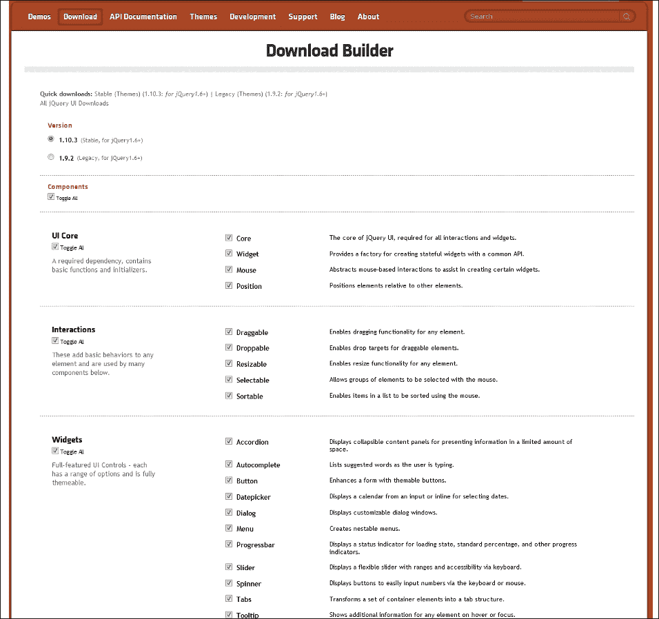
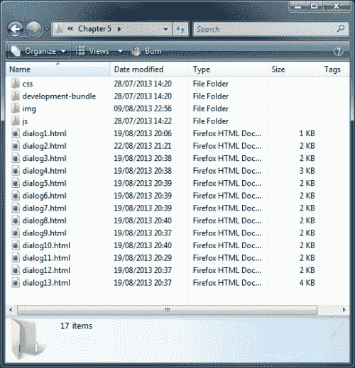
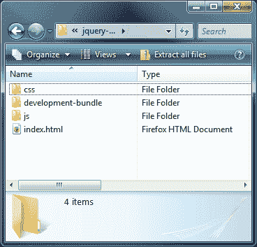
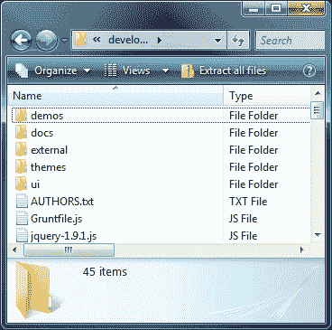
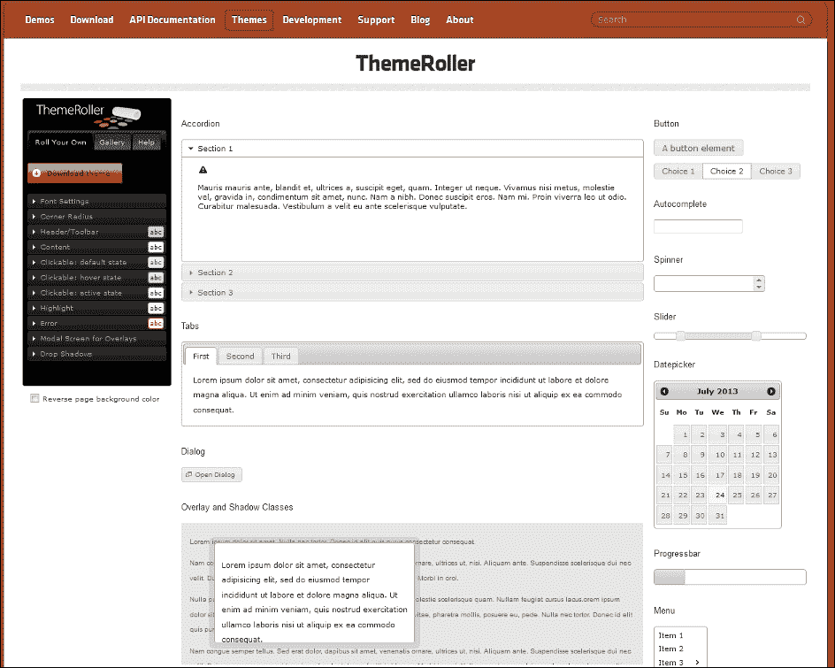
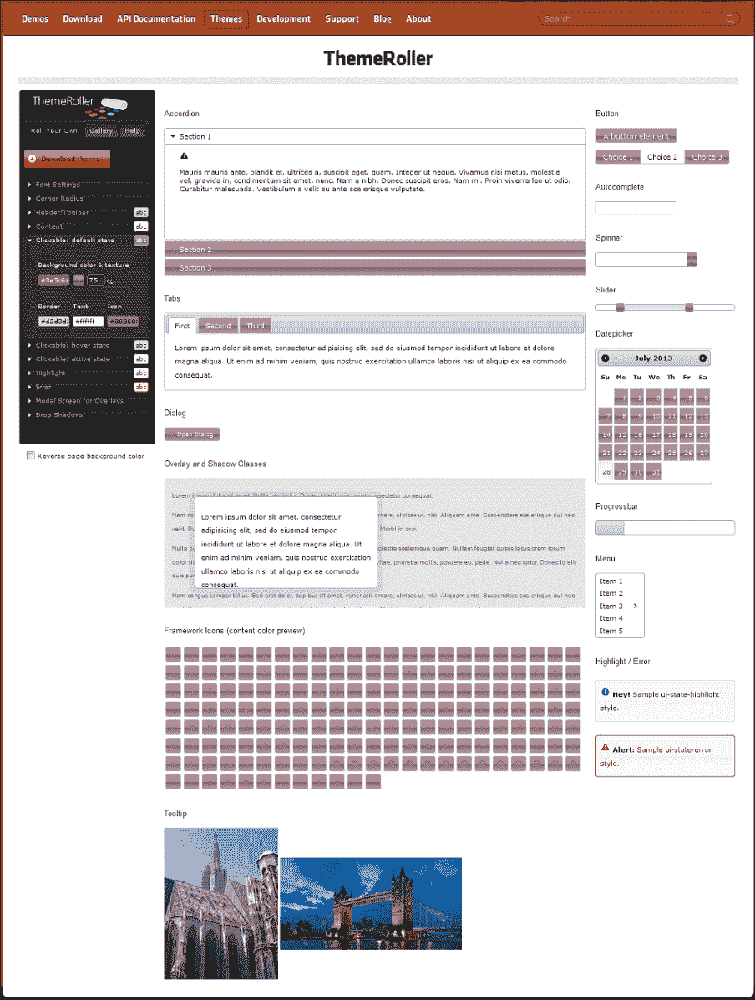

# 第一章：介绍 jQuery UI

欢迎来到*jQuery UI 1.10：* *用于 jQuery 的用户界面库*。这个资源旨在带您从您的第一步到使用 JavaScript UI 小部件和交互助手的高级用法，这些小部件和交互助手是构建在非常流行和易于使用的 jQuery 之上的。

jQuery UI 扩展了基础的 jQuery 库，提供了一套丰富和交互式的小部件以及节省代码的交互助手，旨在增强您的网站和 Web 应用程序的用户界面。jQuery Core 和 UI 都根据严格的编码约定构建，这些约定定期更新，并遵循当前的 JavaScript 设计最佳实践。作为 jQuery 的官方 UI 库，正是对当前 JavaScript 标准的严格遵守使其成为 jQuery 中最好的 UI 库之一。

在本章中，我们将涵盖以下主题:

+   如何获取库的副本

+   如何设置开发环境

+   库的结构

+   主题生成器

+   浏览器支持

+   库的许可形式

+   API 的格式

由于其不断增长的常见 UI 小部件、高度可配置性和出色的实现便利性，jQuery 迅速成为当今最流行的 JavaScript 库之一，被许多知名公司支持和使用，如 Microsoft、WordPress、Adobe 和 Intel。

jQuery UI 运行在 jQuery 之上，因此用于初始化、配置和操作不同组件的语法与 jQuery 具有相同舒适和易用的风格。由于 jQuery 构成了 UI 的基础，我们也可以利用所有出色的 jQuery 功能。该库还受到一系列非常有用的工具的支持，例如提供一系列辅助 CSS 类的 CSS 框架，以及优秀的 ThemeRoller 应用程序，该应用程序允许我们可视化地创建自己的自定义主题，或者从日益增长的预定义主题库中进行选择。我们将在本章稍后查看 ThemeRoller 应用程序。

在本书中，我们将查看构成该库的每个现有组件。我们还将查看它们的配置选项，并尝试它们的方法，以充分理解它们的工作原理和能力。在本书结束时，您将成为 jQuery UI 库中每个小部件配置和使用的专家。当我们添加新的小部件或交互助手时，由于我们实现库中不同组件的一致性，当我们创建自定义组件时，我们将已经具备了基本的工作知识。因此，我们只需要学习任何特定于小部件的功能，以掌握我们希望使用的特定组件。

# 下载该库

本书专门针对 jQuery UI 的版本 1.10，并且需要 jQuery 1.6 或更高版本；在本书中，我们将在代码示例中使用 jQuery 2.0.3。

### 注意

如果你仍然需要支持 IE6，那么可以下载遗留的 jQuery UI 库的版本 1.9.2。你还需要使用 jQuery 1.10 的副本，因为 jQuery 2.0 不支持 IE 6-8。

要获取库的副本，我们应该访问 [`www.jqueryui.com/download`](http://www.jqueryui.com/download) 上的下载构建器。该工具为我们提供了一系列不同的选项，用于构建一个符合我们特定需求的下载包。以下截图显示了 **下载构建器**：



我们可以下载完整的当前版本发布或遗留版本的完整包。我们还可以仅选择我们想要的组件并下载自定义包——这在生产环境中特别推荐，因为我们只使用 UI 库的子集；这有助于减少在查看页面时使用的带宽。

页面布局友好且易于使用。它列出了所有不同组件及其各自的分组（**UI 核心**、**交互**和**小部件**），并允许我们从 24 种不同的预设计主题（或不使用主题）中进行选择。页面还提供了有关包的信息（包括其压缩和未压缩大小）。

### 小贴士

如果作为开发人员想要查看 jQuery UI 在源代码控制下的最新快照，那么可以从 GitHub 下载一个副本，该副本可在 [`github.com/jquery/jquery-ui`](https://github.com/jquery/jquery-ui) 上获取。

我们稍后将查看库中找到的不同文件，但现在我们应该下载完整的库。它将包含我们需要的一切，包括 JavaScript 和 CSS 文件，以及依赖于不同组件的当前主题中的任何图像。它甚至包含了 jQuery 的最新版本，因此我们不需要担心单独下载这个。

现在，只需使用页面顶部的自定义 **下载** 链接，然后在接下来的页面上选择 **Smoothness** 作为主题，然后点击 **下载**。我们将在下一章中介绍下载和使用其他主题。

附带本书的代码下载包括每个章节练习文件夹中的 jQuery 2.03 的副本。如果你需要下载新副本，可以这样做——下载新副本的说明在 附录 *帮助与支持* 中。

## 使用托管版本的 jQuery UI

我们不需要下载库以便在生产 Web 应用程序中实现它。jQuery 和 jQuery UI 都托管在 Google、CDNJS、Microsoft 和 MediaTemple（他们为 jQuery UI 提供 CDN）提供的内容交付网络（CDN）上。

在接收大量国际流量的实时站点上，使用 CDN 将有助于确保库文件从距离访问者较近的服务器下载到他们的计算机上。这有助于加快响应速度，并节省我们自己的带宽。但这不推荐用于本地开发！

### 提示

**托管的文件**

如果你想要使用 CDN 链接，那么可以在以下位置找到：

+   谷歌的 CDN：[`code.google.com/apis/libraries/`](http://code.google.com/apis/libraries/)

+   CDNJS 的 CDN：[`cdnjs.com`](http://cdnjs.com)

+   jQuery 的 CDN：[`code.jquery.com`](http://code.jquery.com)

+   微软的 CDN：[`www.asp.net/ajaxlibrary/CDN.ashx`](http://www.asp.net/ajaxlibrary/CDN.ashx)

# 设置开发环境

我们需要一个位置来解压 jQuery UI 库，以便在我们自己的文件中轻松访问它的不同部分。我们应该首先创建一个`project`文件夹，将所有示例文件以及整个库和其他相关资源保存在其中。

在你的`C:`驱动器或你的主目录中创建一个名为`jqueryui`的新文件夹。这将是我们项目的根文件夹，也将是我们在书中制作的所有示例文件的存储位置。

### 注意

这本书附带的代码下载的结构将反映我们正在创建的本地环境。

要解压这个库，你可以使用 Windows Explorer（如果在 PC 上工作），或者像 7-zip 这样的压缩程序。当解压这个库时，请选择我们刚刚创建的`jqueryui`文件夹。如果你是 Mac 用户，你可能需要将`jqueryui-1.10.3.custom`文件夹中的内容复制到我们刚刚创建的新`jqueryui`文件夹中。（我们将在本章的后面介绍`jqueryui`文件夹的结构。）

### 注意

7-zip 是一个类似于 WinZip 或 WinRAR 的开源存档应用程序；我个人觉得它更好、更容易使用。你可以免费从[`www.7-zip.org`](http://www.7-zip.org)下载它。

我们将要查看的代码示例使用其他资源，主要是图像，但偶尔也会使用一些 PHP 文件。在*Packt Publishing*网站上提供的附带代码下载包含我们将使用的所有图像。如果可以的话，你应该从[`www.packtpub.com/support/book/user-interface-library-for-jquery`](http://www.packtpub.com/support/book/user-interface-library-for-jquery)下载这个。你需要在`jqueryui`项目文件夹内创建一个名为`img`的新文件夹，然后将存档中图像文件夹内的所有图像解压到这个新文件夹中。

一旦你解压了`jqueryui`文件夹并添加了任何所需的额外文件夹，你将看到类似于以下屏幕截图的东西——这里我以**第五章**为例，需要创建一个额外的`img`文件夹：



代码下载还包含所有示例以及库本身。提供这些文件是希望它们仅用于参考目的。我建议你在阅读时跟随书中的示例，手动创建每个文件，而不是仅仅参考代码下载中的文件。学习编码的最佳方式就是编写代码。

这就是我们需要做的一切，不需要安装任何额外的平台或应用程序，也不需要配置或设置任何内容。只要您有一个浏览器和某种代码或文本编辑器，一切都已准备好开始使用该库进行开发。

有很多可用的编辑器，其中任何一个都可以与 jQuery UI 一起使用，如果您还没有首选的编辑器，那么对于 Windows 用户，您可以尝试 Notepad++（可以从[`www.notepad-plus-plus.org`](http://www.notepad-plus-plus.org)免费下载），或 Sublime Text 2（共享软件，可以从[`www.sublimetext.com/2`](http://www.sublimetext.com/2)下载）。我建议避免使用占用内存过多的集成开发环境，因为它们倾向于过多地促使工作，从而影响使用 jQuery UI 时的学习曲线。

### 注意

对于那些喜欢使用本地 Web 服务器进行开发的人来说，您可以使用像 WAMP（对于 PC）或 MAMP（对于 Mac）这样的东西，如果您还没有将其设置为日常工作流程的一部分。Linux 用户应该找到适合的 Web 服务器，可以从他们的发行版中找到。

# 理解库的结构

让我们花点时间来查看一下库解压后的结构，这样我们就知道在哪里查找特定的工具和文件。这将让我们对其构成和结构有所了解。打开我们解压库的地方的`jqueryui`文件夹。此文件夹的内容应该如下：

+   一个`css`文件夹

+   一个`development-bundle`文件夹

+   一个`js`文件夹

+   一个`index.html`文件

我们可以从以下截图中看到结构是什么样的：



为了使用 jQuery UI，只需知道`js`和`css`文件夹就足够了；这些可以像现在这样直接放入您的站点结构中，并从您的代码中相应地引用相关的压缩文件。

如果您是以开发者身份使用该库，则我建议使用`development-bundle`文件夹；其中包含与各个源文件相同的代码，但以未压缩的格式提供。

## 详细检查文件夹结构

对于大多数人来说，了解 jQuery UI 库的构成并不必要；毕竟，可以将两个关键文件夹简单地放入您的站点中，并相应地引用它们。在这种情况下，您可能希望跳过本节，转到*使用 ThemeRoller*。

如果您的技能更加先进，并且您想更多地了解库的结构，请继续阅读。我建议您在阅读本节时下载 jQuery 的副本，以便更好地理解库的组成。

`css` 文件夹用于存储与库一起提供的完整 CSS 框架。在此文件夹中，将有一个具有我们在构建下载包时选择的主题名称的目录。其中包含一个包含所有 CSS 框架的单个文件，以及一个包含主题使用的所有图像的文件夹。我们还可以将我们将在此 `css` 目录中创建的 `css` 文件存储在其中。

`js` 文件夹包含经过缩小的 jQuery 版本和完整的 jQuery UI 库，其中所有组件都打包到一个文件中。在实际项目中，我们会将 `js` 和 `css` 文件夹放入我们的网站。

索引是一个 HTML 文件，简要介绍了库，并显示了所有小部件以及一些 CSS 类。如果这是您第一次使用该库，您可以查看此文件，以查看我们将在本书中使用的一些内容。

`development-bundle` 目录包含一系列资源，以帮助我们使用库进行开发。它包括以下子目录：

1.  一个 `demos` 文件夹

1.  一个 `docs` 文件夹

1.  一个 `external` 文件夹

1.  一个 `themes` 文件夹

1.  一个 `ui` 文件夹

以下截图显示了文件夹结构的外观：



目录中还包含许可文件、JSON 源文件、显示库版本及其主要贡献者的文档，以及一个未压缩版本的 jQuery。

`demos` 文件夹包含一系列基本示例，展示所有不同组件的功能。`docs` 文件夹包含每个不同组件的 API 文档。

`external` 文件夹包含一组对开发人员可能有用的工具。它们如下：

+   `globalize` 插件

+   `jshint` 插件

+   `mousewheel` 插件

+   单元测试套件 `qunit`（包括一个 JavaScript 文件和一个 CSS 文件）

`globalize` 插件为 jQuery 提供本地化支持，并可用于在超过 350 种文化中格式化字符串、日期和数字。`jshint` 插件是 `jslint` 插件的一个衍生工具，用于检测 JavaScript 代码中的错误和潜在问题，并强制执行您自己的编码约定。由 Brandon Aaron 设计的 `mousewheel` 插件为您的网站或在线应用程序添加了跨浏览器鼠标滚轮支持。QUnit 框架是 jQuery 的单元测试套件，我们可以使用它来运行我们创建的任何代码的单元测试。

### 提示

要获取有关 QUnit 的更多信息，请访问 [`docs.jquery.com/QUnit`](http://docs.jquery.com/QUnit)。

`themes`文件夹包含默认主题或在下载构建器过程中选择的主题。稍后下载或创建的其他主题也可以存储在这里。

`ui`文件夹包含库的各个组件的单独未压缩源文件。

### 注意

如果您从主页选择**稳定**下载选项，您会发现内容呈现不同——**稳定**下载选项只包含`development-bundle`文件夹的内容，并且默认包含的主题称为**Base**。这在视觉上类似于我们在自定义包中下载的**Smoothness**主题。

# 使用 ThemeRoller

ThemeRoller 是一个使用 jQuery 和 PHP 编写的自定义工具。它允许我们直观地生成自己的 jQuery UI 主题，并将其打包成一个方便下载的存档文件，然后我们可以将其直接放入我们的项目中，无需进行进一步的编码（当然，除了在 HTML `<link>`元素中使用样式表之外）。

[`ui.jquery.com/themeroller`](http://ui.jquery.com/themeroller)上托管的 ThemeRoller 是由 Filament Group, Inc.创建的，并使用了一些发布到开源社区的 jQuery 插件。它可用于为 jQuery UI 1.10 或 jQuery UI 1.9 的传统版本生成主题。

### 提示

**托管主题**

如果我们使用主站点提供的主题之一，甚至不需要下载主题。在生产环境中，您可能更喜欢使用 CDN 版本的主题，就像您可能使用 CDN 链接来引用主库一样。

您可以使用以下链接导入基本或光滑主题：[`code.jquery.com/ui/1.10.3/themes/smoothness/jquery-ui.css`](http://code.jquery.com/ui/1.10.3/themes/smoothness/jquery-ui.css)。如果您想使用其他主题之一，请将 URL 中的`光滑`替换为您喜欢的主题。

ThemeRoller 肯定是创建自己的 jQuery UI 主题的最全面的工具。我们可以非常快速和轻松地创建一个包含所有所需的样式的完整主题，以便针对组成库的不同小部件进行定位，包括我们将需要的图像。



如果您之前看过`index.html`文件，那么 ThemeRoller 首发页面将会让您立即感到熟悉，因为它显示了页面上所有 UI 小部件，并使用默认的**Smoothness**主题进行美化。

ThemeRoller 页面左侧有一个交互式菜单，用于操作该应用程序。菜单中的每个项目都会展开，让您访问每个部件的可用样式设置，如小部件的**内容**和**可点击**区域，小部件的**标题**和**内容**区域以及其他相关内容，如警告和**错误**消息。

在这里，我们可以轻松创建自定义主题，并且可以在应用于页面上每个小部件的不同可见部分时立即看到更改，如下图所示：



如果在创建主题时感觉不太灵感，还有一个预配置主题的画廊，您可以立即使用它来生成一个完全配置的主题。除了方便之外，这些预选主题最好的一点是，当您选择其中一个时，它会加载到左侧菜单中。因此，您可以根据需要轻松进行小调整。

这是创建与现有站点样式匹配的视觉上吸引人的自定义主题的绝佳方法，也是创建自定义皮肤的推荐方法。

安装和使用新主题就像选择或创建它一样简单。上面截图中的 **下载主题** 按钮将我们带回下载生成器，该生成器将新主题的 CSS 和图像集成到下载包中。

如果我们只想要新主题，我们可以取消选择实际组件，只下载主题。下载后，在下载的存档中的 `css` 文件夹中将包含一个以主题名称命名的文件夹。我们只需将此文件夹拖放到我们自己的本地 `css` 文件夹中，然后从我们的页面链接到样式表。

在本书中我们不会详细介绍这个工具。我们将重点放在需要在我们自己的定制样式表中手动覆盖的样式规则上，以手动生成所需的示例外观。

# 将组件类别分类

jQuery UI 库中有三种类型的组件，如下所示：

+   **低级交互助手**：这些组件主要设计用于鼠标事件

+   **小部件**：这些组件在页面上产生可见对象

+   **核心组件**：这些组件是库的其他部分所依赖的组件

让我们花点时间考虑构成每个类别的组件，从核心组件开始。

核心组件包括：

+   核心

+   小部件

+   鼠标

+   定位

核心文件建立了所有组件使用的构造，并添加了一些所有库组件共享的核心功能，例如键盘映射、父级滚动和 z-index 管理器。这个文件不是设计用于独立使用的，并且不暴露任何可以在另一个组件之外使用的功能。

交互助手包括以下组件：

+   可拖动的

+   可放置的

+   可调整大小

+   可选择的

+   可排序

交互助手向任何元素添加基本的基于鼠标的行为；这使您可以创建可排序的列表，在飞行中调整元素的大小（例如对话框）或甚至构建功能（例如基于拖放的购物车）。

较高级别的小部件（在撰写时）包括：

+   折叠菜单

+   自动完成

+   按钮

+   日期选择器

+   对话框

+   菜单

+   进度条

+   滑块

+   标签页

+   菜单

+   工具提示

小部件是将桌面应用程序功能的丰富性带入 Web 的 UI 控件。每个小部件都可以完全自定义，外观和行为。

## 介绍小部件工厂和效果

当使用 jQuery UI 的小部件时，你会遇到小部件工厂。它实际上创建了库公开的所有可见小部件的基础。它实现了所有小部件共享的 API，例如 `create` 和 `destroy` 方法，并提供了事件回调逻辑。它还允许我们创建继承共享 API 的自定义 jQuery UI 小部件。我们将在本章后面详细介绍小部件工厂。

除了这些组件和交互式助手之外，还有一系列 UI 效果，可以在页面上的目标元素上产生不同的动画或过渡效果。这些效果非常适合为我们的页面添加风采和风格。我们将在本书的最后一章中查看这些效果，*UI Effects*。

jQuery UI 简化的 API 的好处在于，一旦你学会了使用所有现有的组件（就像这本书会向你展示的那样），你将能够非常快速地掌握任何新组件。未来版本中还计划添加许多新组件，包括将 jQuery Mobile 合并到库中！

# 浏览器支持

与 jQuery 本身一样，这个版本的 jQuery UI 官方支持当前和上一个版本的浏览器，尽管该库可以在旧版本的主要浏览器上正常工作，包括以下浏览器：IE7+、Firefox 2+、Opera 9+、Safari 3+ 和 Chrome 1+。

### 提示

**对 IE6 和 IE7 的支持**

如前所述，jQuery UI 团队在 UI 1.10 中停止了对 IE6 的支持；尽管如此，你仍然可以通过下载遗留的版本 1.9.2 使用 jQuery UI。IE7 的用户可能会注意到，计划也将放弃对该浏览器的支持；在撰写本文时，这一计划目前计划在版本 1.11 中实现，尽管这尚未确认。

小部件是从语义上正确的 HTML 元素中构建的，根据需要由组件生成。因此，我们不会看到创建或使用过多或不必要的元素。

# 使用本书示例

这个库和标准 JavaScript 一样灵活。我的意思是，通常有多种方法来做同样的事情，或者达到同样的目的。例如，用于不同组件的配置对象中的回调事件通常可以接受函数引用或内联匿名函数，并且可以同样轻松高效地使用它们。

在实践中，建议尽可能保持代码的最小化（无论如何，jQuery 都可以帮助实现这一点）。但为了使示例更易读和理解，我们将尽可能将代码分离为独立的模块。因此，回调函数和配置选项将与调用或使用它们的代码分开定义。

在本书中，我们将把 JavaScript 和 CSS 代码分开存储到不同的文件中；虽然这对开发工作来说有些过分，但对于生产网站来说是可取的。存在外部`js`文件中的脚本可被浏览器缓存，从而大大提高加载速度；而直接写在`<script>`标签中的内联脚本则不能被浏览器缓存。

我还想澄清一点，即本书的整个过程的主要目的是学习如何使用组成 jQuery UI 的不同组件。如果某个示例看起来有点复杂，可能是因为这是暴露特定方法或属性功能的最简单方法，而不是我们编码常规实现所会遇到的情况。

我想在这里补充一下，jQuery UI 库目前正在经历快速扩展、bug 修复和开发阶段。对于这个版本，jQuery 团队正在专注于 bug 修复，以帮助使库尽可能稳定。从长远来看，jQuery UI 团队正在专注于重新设计每个小部件的 API，并计划在未来的版本中添加大量新的小部件，并完成与 jQuery Mobile 已计划的合并。

# 库许可

与 jQuery 一样，jQuery UI 库也是根据 MIT 开源许可发布的。这是一个非常不限制的许可，允许创建者对其制作进行归属，并保留其知识产权，同时不妨碍我们开发者以任何方式在任何类型的网站上使用该库。

MIT 许可明确规定了软件使用者（在本例中是 jQuery UI）可以自由使用、复制、合并、修改、发布、分发、许可和出售。这让我们可以几乎为所欲为地使用库。这个许可所施加的唯一要求是我们必须保持原始的版权和保修声明完整。

这一点很重要。您可以随意使用库。您可以在库的基础上构建应用程序，然后销售这些应用程序或免费提供。您可以将库放入嵌入式系统，例如手机操作系统，并出售它们。但无论做什么，都要保留带有 John Resig 名字的原始文本文件。您还可以在应用程序的帮助文件或文档中逐字复制它。

MIT 许可非常宽松，但因为它本身没有版权，我们可以自由改变它。因此，我们可以要求软件使用者向我们归功，而不是 jQuery 团队，或将代码冒充为我们自己的。

许可证并不限制我们的任何方式，并且与您可能购买并安装在您自己计算机上的软件附带的许可证不同。在大多数情况下，库的许可将不会成为使用它时的考虑因素。但是，插件作者将希望确保其插件以类似的许可发布。

# API 介绍

一旦您使用了库中的任何一个组件，您在使用其他任何组件时会立即感到自如，因为每个组件的方法都以完全相同的方式调用。

每个组件的 API 由一系列不同的方法组成。尽管这些在技术上都是方法，但根据它们的特定功能对它们进行分类可能是有用的。

| 方法类型 | 描述 |
| --- | --- |
| 插件方法 | 此方法用于初始化组件，只是组件名称，后跟括号。我将在本书中始终将其称为插件方法或小部件方法。 |
| 共享 API 方法 | `destroy` 方法可用于任何组件，以完全禁用正在使用的小部件，并且在大多数情况下将底层 HTML 返回到其原始状态。`option` 方法由所有组件使用，用于在初始化后获取或设置任何配置选项。`enable` 和 `disable` 方法由大多数库组件使用，用于启用或禁用组件。所有小部件都公开的 `widget` 方法返回对当前小部件的引用。 |
| 专用方法 | 每个组件都有一个或多个特定于该特定组件的方法，执行特定的功能。 |

方法通过将我们想要调用的方法作为简单字符串传递给组件的 `plugin` 方法，在每个不同的组件中始终一致地调用，该方法接受方法接受的任何参数作为方法名称之后的字符串。

例如，要调用手风琴组件的 `destroy` 方法，我们只需使用以下代码：

```js
$("#someElement").accordion("destroy");
```

看，多么简单！所有不同组件公开的每个方法都以相同简单的方式调用。

一些方法，如标准 JavaScript 函数，接受触发组件不同行为的参数。例如，如果我们想在标签部件中调用 `disable` 方法，则会使用以下代码：

```js
$("#someElement").tabs("disable", 1);
```

`disable` 方法与标签部件一起使用时，接受一个整数，该整数指的是小部件内单个标签的索引。同样，要再次启用该标签，我们将使用以下代码中显示的 `enable` 方法：

```js
$("#someElement").tabs("enable", 1);
```

再次，我们提供了一个参数来修改方法的使用方式。有时，传递给方法的参数在组件之间会有所不同。例如，手风琴部件不会启用或禁用单个手风琴面板，只会启用或禁用整个部件，因此在方法名称之后不需要其他参数。

`option` 方法略微比其他常见方法复杂，但它也更强大，并且使用起来同样简单。该方法用于在组件初始化后获取或设置任何可配置选项。

要在 `getter` 模式中使用 option 方法检索选项的当前值，我们可以使用以下代码：

```js
$("#someElement").accordion("option", "navigation");
```

前面的代码会返回折叠小部件的 `navigation` 选项的当前值。因此，要触发 `getter` 模式，我们只需提供要检索的选项名称。

要改用 `setter` 模式中的 `option` 方法，我们可以提供选项名称和新值作为参数：

```js
$("#someElement").accordion("option", "navigation", true);
```

前面的代码会将 `navigation` 选项的值设置为 `true`。请注意，也可以通过传递对象字面量来一次性设置多个不同的选项给 `option` 方法。例如：

```js
$("#someElement").accordion("option", {
  animate: "bounceslide",
  heightStyle: "fill"
});
```

如您所见，尽管 `option` 方法为我们提供了使用 `get` 和 `set` 配置选项的功能，但其仍保留了其他方法相同易于使用的格式。

## 事件和回调函数

每个组件的 API 还包含丰富的事件模型，允许我们轻松地对不同的交互做出反应。每个组件都公开其自己一组独特的自定义事件，但无论使用哪个事件，其使用方式都相同。

在 jQuery UI 中，我们有两种处理事件的方式。每个组件都允许我们添加在指定事件触发时执行的回调函数，作为配置选项的值。例如，要使用选项卡小部件的 `select` 事件，该事件在每次选择选项卡时触发，我们可以使用以下代码：

```js
var options = {
  select: function() {
  ...
  }
};
$("#myTabs").tabs(options);
```

事件的名称用作 `option` 名称，匿名函数用作 `option` 值。我们将在后面的章节中查看与每个组件一起使用的所有单独事件。

通过使用 jQuery 的 `on()` 方法，另一种处理事件的方式是。要以这种方式使用事件，我们只需指定组件的名称，然后是事件的名称：

```js
$("#someElement").on("tabsselect", function() {
...
});
```

通常，但并非总是，使用 `on()` 方法与回调函数一起使用的回调函数在事件触发后执行，而使用配置选项指定的回调函数在事件触发前直接执行。回调函数在触发事件的 DOM 元素的上下文中调用。例如，在具有多个选项卡的选项卡小部件中，`select` 事件将由实际选择的选项卡触发，而不是整个选项卡小部件。这对我们非常有用，因为它允许我们将事件与特定选项卡关联起来。

一些由 jQuery UI 组件触发的自定义事件是可取消的，如果停止，则可用于阻止某些操作。其中最好的例子（我们将在本书后面介绍）是通过在 `beforeClose` 事件的回调函数中返回 `false` 来阻止对话框小部件关闭：

```js
beforeClose: function() {
  if (readyToClose === false) {
    event.preventDefault();
}
```

如果在此示例中不满足任意条件，则回调函数将返回 `false`，并且对话框将保持打开状态。这是一个非常出色且强大的功能，可以让我们对每个小部件的行为进行精细控制。

## 回调函数参数

使用任何小部件的一个重要特性是其接受回调的能力。我们可以使用回调来运行执行特定任务的匿名函数。例如，我们可以在单击手风琴小部件中的特定标题时每次在屏幕上触发一个警报。

我们向不同事件提供作为回调函数的匿名函数时，这些匿名函数会自动传递两个参数：原始的、扩展的或修改后的事件对象，以及包含有关小部件的有用信息的对象。第二个对象中包含的信息在各组件之间有所不同。举个例子，让我们看看在使用手风琴小部件时可以实现的回调：

```js
$("#myAccordion").accordion({
  activate: function (event, ui) {
    if(ui.newHeader.length > 0){
      alert(ui.newHeader.attr("id"));
    } else {
      // closed
    }
  }
});
```

在这里，我们将参数传递给函数，并使用它们来确定哪个手风琴标题是打开的，然后在屏幕上显示结果。将这些对象传递给我们定义的任何回调函数的原理适用于所有组件；我们将在后续章节中详细介绍这一点。

# 摘要

jQuery UI 消除了构建引人入胜和有效用户界面的困难。它提供了一系列组件，可以快速且轻松地直接使用，并且只需少量配置即可。每个组件都公开了一套完整的属性和方法，以便与您的页面或应用程序集成，如果需要更复杂的配置，则可以利用这些属性和方法。

每个组件都设计为高效、轻量级和语义正确，同时利用了 JavaScript 的最新面向对象特性，并使用了简洁、经过充分测试的框架。与 jQuery 结合使用时，它为任何网页开发者的工具包提供了强大的补充。

到目前为止，我们已经看到了如何获取库，如何设置系统以利用它，以及库的结构。我们还看过如何为不同的小部件添加或自定义主题，如何简单而一致地公开库的功能，以及不同类别的组件。在本章的过程中，我们涵盖了一些重要的主题，但现在我们可以开始使用 jQuery UI 的组件，进行一些真正的编码，首先来看看 CSS 框架。
