# 第二章：CSS 框架和其他工具

在 1.7 版中添加，jQuery UI 库包含一个更新的 CSS 框架，可用于有效和一致地为库中提供的每个小部件设置主题。该框架由许多辅助类组成，我们可以在自己的代码中使用，即使我们没有使用库组件。

在本章中，我们将涵盖以下主题：

+   构成框架的文件

+   如何使用框架提供的类

+   如何快速轻松地切换主题

+   覆盖主题

+   使用位置工具

# 处理构成框架的文件

依赖于您选择下载的库的版本，库结构中有两个位置存放着构成框架的 CSS 文件。

以下是它们：

+   `css`: 此文件夹包含完整的 CSS 框架，包括在构建下载包时选择的主题。所有必需的 CSS 已经放置在一个单独的、精简的样式表中，以最小化生产环境中的 HTTP 请求。CSS 文件存储在一个文件夹中，文件夹的名称取决于下载生成器上选择的主题。该框架的此版本将包含下载生成器中选择的所有组件的样式，因此其大小将根据使用的库的多少而变化。

+   `themes`: 框架的另一个版本存在于 `development-bundle` 文件夹中，其中您将找到 `themes` 文件夹。此文件夹中提供了两个主题——基础主题和在下载库时选择的任何主题。基础主题是一个灰色的、中性的主题，与平滑主题在视觉上完全相同。

在每个主题文件夹中，都有构成框架的各个文件。框架的不同组件被分割到各自的文件中：

| 组件 | 用途 |
| --- | --- |

|

```js
jquery.ui.all.css

```

| 在开发中，可以通过使用此文件链接所有主题所需的文件。它包含了 `@import` 指令，引入了 `ui.base.css` 和 `ui.theme.css` 文件。 |
| --- |

|

```js
jquery.ui.base.css

```

| 此文件被 `ui.all.css` 使用。它还包含 `@import` 指令，引入 `ui.core.css` 文件以及每个小部件 CSS 文件。但是，它不包含控制每个小部件外观的主题样式。 |
| --- |

|

```js
jquery.ui.core.css

```

| 此文件提供核心框架样式，如清除辅助程序和通用覆盖。 |
| --- |

|

```js
jquery.ui.accordion.css
jquery.ui.datepicker.css
jquery.ui.button.css
jquery.ui.autocomplete.css
jquery.ui.dialog.css
jquery.ui.progressbar.css
jquery.ui.resizable.css
jquery.ui.selectable.css
jquery.ui.slider.css
jquery.ui.spinner.css
jquery.ui.tabs.css
jquery.ui.menu.css
jquery.ui.tooltip.css
jquery-ui.css

```

| 这些文件是控制每个小部件布局和基本外观的个别源文件。 |
| --- |

|

```js
jquery.ui.theme.css

```

| 此文件包含库中每个小部件的完整视觉主题和目标的所有视觉元素。 |
| --- |

让我们更详细地查看每个文件。

## jquery.ui.all.css

`jquery.ui.all.css`文件使用 CSS 导入，使用`@import`规则读取两个文件——`jquery.ui.base.css`和`jquery.ui.theme.css`文件。这就是文件中存在的所有内容，以及实现完整框架和选定主题所需的所有内容。

从此文件中找到的两个指令中，我们可以看到使小部件功能的框架部分和赋予其视觉外观的主题之间的分隔。

## jquery.ui.base.css

`jquery.ui.base.css`文件还包括仅有的`@import`规则，并且导入了`jquery.ui.core.css`文件以及每个单独的小部件 CSS 文件。此时，我应该提到可调整大小的组件有自己的框架文件，以及每个小部件。

## jquery.ui.core.css

`jquery.ui.core.css`文件为所有组件提供通用样式。它包含以下类：

| 类 | 用途 |
| --- | --- |
| `.ui-helper-hidden` | 这个类通过`display: none`隐藏元素。 |
| `.ui-helper-hidden-accessible` | 这个类通过裁剪元素来隐藏它们，以便元素仍然完全可访问。元素没有被隐藏或定位到屏幕外。 |
| `.ui-helper-reset` | 这是 jQuery UI 的重置机制（它不使用单独的重置样式表），它中和了浏览器通过通用元素应用的边距、填充和其他常见默认样式。有关重置默认浏览器样式的重要性的介绍，请访问：[`sixrevisions.com/css/css-tips/css-tip-1-resetting-your-styles-with-css-reset/`](http://sixrevisions.com/css/css-tips/css-tip-1-resetting-your-styles-with-css-reset/)。 |
| `.ui-helper-clearfix` | `.ui-helper-clearfix`样式应用于容器本身。 |
| `.ui-helper-zfix` | `.ui-helper-zfix`类提供了应用于`<iframe>`元素的规则，以解决使用覆盖时的 z-index 问题。 |
| `.ui-state-disabled` | 这个类将禁用元素的光标设置为默认，并使用`important`指令确保它不会被覆盖。 |
| `.ui-icon` | 这条规则是库用背景图替换元素的文本内容的方法。设置库中的不同图标的背景图像的责任被委托给`jquery.ui.theme.css`文件。 |
| `.ui-widget-overlay` | 这个类设置了显示对话框和其他模态弹出窗口时应用于页面的叠加的基本样式属性。由于叠加使用了图像，因此该类的一些样式也在主题文件中找到。 |

核心文件为框架的其余部分奠定了基础。我们还可以将这些类名赋予我们自己的元素，以在使用库时清除浮动或隐藏元素，并且在使用 ThemeRoller 一致主题的情况下构建新的 jQuery UI 插件时使用。

### 解释各个组件框架文件

库中的每个小部件以及可调整大小的交互助手都有一个控制 CSS 并使小部件正确运行的框架文件。例如，选项卡小部件中的选项卡标题必须向左浮动，以便将它们显示为选项卡。框架文件设置了此规则。当我们在自定义主题中覆盖框架时，这些样式将需要呈现出来。

这些文件很简短，每个组件使用的规则数量尽可能少，以确保其正确运行。通常，文件非常紧凑（通常不超过 15 条样式规则）。Datepicker 源文件是个例外，因为它需要大量规则才能正确运行。

## jquery.ui.theme.css

此文件将根据使用 ThemeRoller 选择或创建的主题进行自定义。

它设置了构成每个小部件的不同元素的所有视觉属性（颜色、图像等）。

在`jquery.ui.theme.css`文件中，有许多注释，其中包含在大括号中的描述性标签。这些称为**占位符**，当主题生成时，ThemeRoller 会自动更新它们之前的 CSS 样式。

这是为完整主题生成的文件，其中包含在使用 ThemeRoller 创建或选择主题时创建的每个小部件的所有可见部分的样式。当在自定义主题中覆盖框架时，主要是这个文件中的规则将被覆盖。

每个小部件都是由一组共同的元素构成的。例如，每个小部件的外部容器都具有名为`ui-widget`的类，而小部件内的任何内容都将放在名为`ui-widget-content`的容器中。正是这种一致的布局和分类约定使得该框架如此有效。

### 提示

**下载示例代码**

您可以从您在[`www.packtpub.com`](http://www.packtpub.com)的帐户中下载您购买的所有 Packt 书籍的示例代码文件。如果您在其他地方购买了本书，您可以访问[`www.packtpub.com/supportand`](http://www.packtpub.com/supportand)注册，直接将文件发送到您的电子邮件中。

这是框架中使用的最大样式表，其中包含太多类，无法在此完整列出（但现在可以打开它并查看）。以下表格列出了不同类别的类：

| 类别 | 用途 |
| --- | --- |
| 容器 | 此类别为小部件、标题和内容容器设置样式属性。 |
| 交互状态 | 这些类设置了任何可点击元素的默认、悬停和活动状态。 |
| 交互提示 | 此类别为元素应用了视觉提示，包括高亮、错误、禁用、主要和次要样式。 |
| 状态和图像 | 这些类设置了在内容和标题容器中显示的图标的图片，以及包括默认状态、悬停状态、活动状态、高亮状态、焦点状态和错误状态在内的可点击元素的图像。 |
| 图像定位 | 主题中使用的所有图标图像都存储在单个精灵文件中，并通过操作精灵文件的背景位置属性来单独显示它们。这个类别设定了所有个别图标的背景位置。 |
| 角半径 | CSS3 用于为支持的浏览器（如 Firefox 3+，Safari 3+，Chrome 1+，Opera 10+ 和 IE9+）提供圆角。 |
| 叠加 | 在核心 CSS 文件中定义的通用叠加所使用的图像在这里设置，因为它是一个实现了对指定元素的半透明叠加效果的类。 |

jQuery UI 文档中详细介绍了主题 API：[`api.jqueryui.com/category/theming/`](http://api.jqueryui.com/category/theming/)。

# 链接到所需的框架文件

在开发环境中，为了快速主题化所有 jQuery UI 小部件，我们可以使用`jquery.ui.all.css`链接到所有个别文件：

```js
<link rel="stylesheet"
href="development-bundle/themes/smoothness/jquery.ui.all.css">
```

例如，要在测试选项卡小部件等组件时单独使用每个文件，我们将使用以下`<link>`元素：

```js
<link rel="stylesheet"
  href="development-bundle/themes/base/jquery.ui.core.css">
<link rel="stylesheet"
  href="development-bundle/themes/base/jquery.ui.tabs.css">
<link rel="stylesheet"
  href="development-bundle/themes/base/jquery.ui.theme.css">
```

当单独链接到 CSS 资源时，应按以下顺序将其添加到 HTML 页面中：`core.css`，小部件的 CSS 文件，以及`theme.css`文件。

当然，在生产环境中，我们将使用高效的合并文件来最小化对 CSS 文件的 HTTP 请求数量。我们需要链接到合并的`jquery-ui-x.x.x.min.css`样式表，该文件位于`css/themename/`目录中，其中 x.x.x 是您下载的 jQuery UI 的版本号：

```js
<link rel="stylesheet"
  href="css/smoothness/jquery-ui-x.x.x.custom.css">
```

为了更轻松地编码和方便起见，在我们的所有示例中，我们将链接到`development-bundle/themes/base/jquery.ui.all.css`文件。如果您按照上一章节所示解压了库，那么与`css`，`development-bundle`和`js`文件夹一起，先前的 CSS 文件路径将是正确的。如果您使用不同的结构，请相应地修改 CSS 文件的路径。

### 提示

**创建本书的示例**

在本书中，您会注意到我们提到将文件保存在`jqueryui`文件夹中；您可能希望为每个章节创建一个子文件夹，以便代码可以与其他章节分开存储。这在本书附带的代码下载中有所体现。

# 使用框架类

在实现官方 jQuery UI 小部件的同时，我们还可以在部署自定义插件时使用它。

## 与容器一起工作

推荐使用容器，因为这意味着我们编写的小部件或插件将准备好 ThemeRoller，并且更容易为最终开发人员提供主题和定制。让我们看看用我们自己的元素使用框架有多容易。

在文本编辑器中，创建一个新文件并添加以下代码：

```js
<!DOCTYPE html>
<html>
<head>
  <meta charset="utf-8">
  <title>CSS Framework - Containers</title>
  <link rel="stylesheet"
    href="development-bundle/themes/base/jquery.ui.all.css">
</head>
<body>
  <div class="ui-widget">
    <div class="ui-widget-header ui-corner-top">
      <h2>This is a .ui-widget-header container</h2>
    </div>
    <div class="ui-widget-content ui-corner-bottom">
      <p>This is a .ui-widget-content container</p>
    </div>
  </div>
</body>
</html>
```

将此页面保存为`containers.html`，放在我们在第一章创建的`jqueryui`项目文件夹中，*介绍 jQuery UI*，当我们解压缩库时。我们正在从库中的基本开发主题中链接到`jquery.ui.all.css`文件。如果我们要构建更复杂的小部件，我们可能也想链接到`jquery.ui.core.css`文件。

在创建小部件或插件时，使用此文件非常重要，因为它可以让我们验证我们为容器提供的类名是否会获取适当的样式，并向我们保证它们将准备好供 ThemeRoller 使用。我们需要自己应用的任何样式都将放入单独的样式表中，就像库中的每个小部件都有自己的自定义样式表一样。

在这个例子中，我们只使用了几个元素。我们的外部容器被赋予了类名`ui-widget`。

在外部容器内部，我们有两个其他容器。一个是`ui-widget-heading`容器，另一个是`ui-widget-content`容器。我们还为这些元素提供了圆角类的变体：分别是`ui-corner-top`和`ui-corner-bottom`。

在标题和内容容器内部，我们只有一些适当的元素，我们可能想要放入其中，比如标题中的`<h2>`和内容元素中的`<p>`。这些元素将继承一些规则，来自各自的容器，但不会直接由主题文件进行样式设置。

当我们在浏览器中查看这个基本页面时，我们应该看到我们的两个容器元素从主题文件中获取样式，如下面的屏幕截图所示：

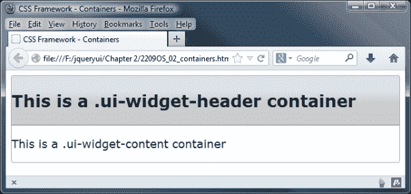

## 使用交互

让我们看看框架类的更多实际操作。在`containers.html`中，删除带有`<body>`标签的标记，并添加以下内容：

```js
<body>
 <div class="ui-widget">
 <div class="ui-state-default ui-state-active ui-corner-all">
 <a href="#">I am clickable and selected</a>
 </div>
 <div class="ui-state-default ui-corner-all">
 <a href="#">I am clickable but not selected</a>
 </div>
 </div>
</body>
```

我们也要修改标题，以便反映我们在代码中正在创建的内容——删除现有的`<title>`，并替换为以下内容：

```js
<title>CSS Framework - Interaction states</title>
```

将此文件保存为`interactions.html`，放在`jqueryui`项目文件夹中。在这些示例中，我们定义了两个可点击元素，它们由一个容器`<div>`和一个`<a>`元素组成。两个容器都被赋予了类名`ui-state-default`和`ui-corner-all`，但第一个还被赋予了选定状态`ui-state-active`。

这将使我们的可点击元素呈现如下外观：

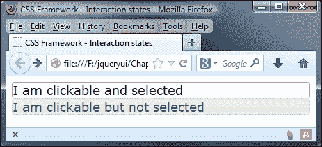

CSS 框架不提供对`:hover` CSS 伪类的样式。相反，它使用一个类名应用一组样式，该类名是使用 JavaScript 添加的。在闭合`</body>`标签之前，添加以下代码以查看其效果：

```js
<script type="text/javascript" src="img/jquery-2.0.3.js"> </script>
<script>
  $(document).ready(function($){
    $(".ui-widget a").hover(function() {
      $(this).parent().addClass("ui-state-hover");
    }, function() {
      $(this).parent().removeClass("ui-state-hover");    
    });
  });
</script>
```

将此前一个示例文件的变体保存为`interactionsHovers.html`。

### 注意

jQuery 的版本号将随着库的不断发展而更改；我们在本书中始终使用版本 2.03。如果版本不同，请将其替换为您下载的版本。

我们简单的脚本将`ui-state-hover`类名称添加到可点击元素上，当鼠标指针移动到上面时，然后当鼠标指针移开时将其移除。当我们在浏览器中运行页面并悬停在第二个可点击元素上时，我们应该看到`ui-state-hover`样式：

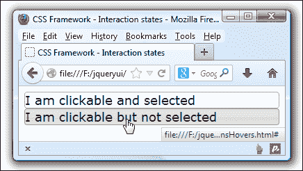

## 添加图标

框架还提供了一系列可用作图标的图像。更改`interactionsHovers.html`中的 ui-widget 容器的内容，使其如下所示：

```js
<div class="ui-widget">
  <div class="ui-state-default ui-state-active ui-corner-all">
 <span class="ui-icon ui-icon-circle-plus"></span>

```

```js
    <a href="#">I am clickable and selected</a>
  </div>
  <div class="ui-state-default ui-corner-all">
 <span class="ui-icon ui-icon-circle-plus"></span>

```

```js
    <a href="#">I am clickable but not selected</a>
  </div>
</div>
```

将此保存为`icons.html`在`jqueryui`目录中。在这个示例中，我们的嵌套`<div>`元素，其具有`ui-icon`和`ui-icon-circle-plus`类，从精灵文件中获得了正确的图标：

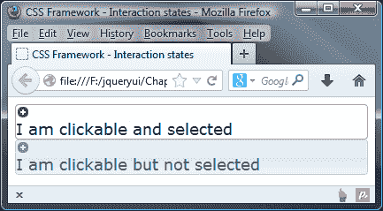

### 注意

如果您还不熟悉精灵是如何工作的，那么值得了解一下这种技术——请参阅[`nerdwith.me/news/css-sprites-for-beginners/`](http://nerdwith.me/news/css-sprites-for-beginners/)，了解如何创建精灵图像的示例。如果您需要创建精灵图像，那么[`csssprites.com/`](http://csssprites.com/)的 CSS Sprites 生成器是一个很好的网站。

如您所见，`ui-state-active`图标与`ui-state-default`图标（以及`ui-state-hover`图标）略有不同。在此示例中，我们没有定位图标，因为这将需要创建一个新的样式表。

本示例的重点是查看如何使用框架的类名称自动添加图标，而无需默认添加任何额外的 CSS 样式。

### 注意

如果我们想要调整定位，我们可以通过添加额外的样式来覆盖`.existing .ui-icon`类，例如`span.ui-icon { float: left; }`，这将将图标重新定位到每个`<span>`中文本的左侧。

### 详细检查图标

现在我们已经看到一些图标的使用，让我们更详细地了解如何使用它们。

图标以精灵图的形式呈现，作为主题的一部分进行下载。在库中的主要`css`文件夹中，您会发现不止一个主题文件夹。根据您需要下载的数量，每个主题库都包含多个由 jQuery UI 使用的精灵图像，用于生成图标，例如我们在前面示例中看到的那些。

查看包含我们图标的图像精灵，它们将看起来像下面这样：

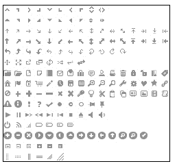

如果我们检查 DOM 检查器（如 Firebug）中的代码，您将发现至少添加了两种样式，例如：

```js
<span class="ui-icon ui-icon-circle-plus"></span>

```

图标 CSS 的格式通常遵循`.ui-icon-{图标类型}-{图标子描述}-{方向}`；应该注意，如果你在小部件中使用`icon`选项，例如手风琴，则会添加第三个类。

每个图标元素都被赋予一个基本类`.ui-icon`，它将图标的尺寸设置为 16 像素的方块，隐藏内部文本，并使用选择的精灵图像设置背景图像。使用的背景精灵图像将取决于其父容器；例如，在`ui-state-default`容器中的`ui-icon`元素将根据`ui-state-default`的图标颜色进行着色。

### 添加自定义图标

向小部件添加图标不必局限于库中的图标。你可以使用自定义图标。

要做到这一点，我们有两个选项——你可以引用单个文件，或者使用类似的图像精灵；后者更可取，特别是如果你使用多个自定义图标，因为包含它们的精灵在加载后将被缓存。

### 提示

你可以在 [`api.jqueryui.com/theming/icons/`](http://api.jqueryui.com/theming/icons/) 上看到核心 jQuery UI 库中提供的所有图标及其图标类名的完整列表。

为了引用这些图标，你需要添加你自己的自定义样式，覆盖`.ui-icon`类——这是为了确保 jQuery UI 不会尝试应用取消你自己样式的样式。这样一个自定义类的示例如下所示：

```js
.ui-button .ui-icon.you-own-cusom-class {
    background-image: url(your-path-to-normal-image-file.png);
    width: your-icon-width;
    height: your-icon-height; 
}
.ui-button.ui-state-hover .ui-icon.you-own-cusom-class {
    background-image: url(your-path-to-highlighted-image-file.png);
    width: your-icon-width;
    height: your-icon-height;
}
```

我们可以将新样式应用到我们选择的小部件中，就像使用 jQuery UI 按钮的示例所示：

```js
       $('selector-to-your-button').button({
         text: false,
         icons: {
           primary: "you-own-cusom-class"   // Custom icon
         }
       });
```

只要图标格式正确，并且在我们的代码中正确引用，那么我们可以自由地添加任何我们想要的图标；值得在线上搜索选项，因为会有大量可供使用的图标，例如 [`fortawesome.github.io/Font-Awesome/icons/`](http://fortawesome.github.io/Font-Awesome/icons/) 上的 Font Awesome 库，或者可以从 [`icomoon.io/`](http://icomoon.io/) 下载的 IcoMoon。

### 提示

**为什么我的图标会出现在新行上？**

在某些情况下，你可能会发现你的图标出现在小部件中的文本上方或下方的新行中，就像本章早些时候的图标示例所示。这是由于`.ui-icon`类中的`display: block`属性造成的：

为了解决这个问题，你可以使用浮动属性，并将其设置为适当的左、右或中心位置来显示图标。

### 使用自定义图标 - 一则说明

如果你决定使用自定义图标，那么没有任何东西会阻止你这样做，这将打开大量的可能性！你需要注意的是，使用自定义图标需要使用两个类——`base .ui-icon`，然后是你自己的自定义类。这是为了确保图标显示正确，并防止 jQuery UI 尝试覆盖你自己的图标。

如果不注意确保图标的尺寸正确，使用自己的图标可能会与框架内的样式冲突；强烈建议您仔细查看提供的现有图标库，因为 jQuery UI 团队可能已经转换了一些可能有用的内容。另外，线上搜索也可能会有帮助；为 jQuery UI 编写了自定义主题，您可能会找到包含您需要的图标的主题。

## 交互提示

另一组我们可以使用的类是交互提示。我们将看另一个使用这些的例子。在文本编辑器中的新页面中，添加以下代码。这将创建一个表单示例，我们可以在其中看到提示的作用：

```js
<!DOCTYPE html>
<html>
<head>
  <meta charset="utf-8">
  <title>CSS Framework - Interaction cues</title>
  <link rel="stylesheet" href="development-bundle/themes/base/jquery.ui.all.css">
  <link rel="stylesheet" href="css/jquery.ui.form.css">
</head>
<body>
  <div class="ui-widget ui-form">
    <div class="ui-widget-content ui-corner-all">
      <div class="ui-widget-header ui-corner-all">
        <h2>Login Form</h2>
      </div>
      <form action="#" class="ui-helper-clearfix">
        <label>Username</label>
        <div class="ui-state-error ui-corner-all">
          <input type="text">
          <div class="ui-icon ui-icon-alert"></div>           
          <p class="ui-helper-reset ui-state-error-text">Required field</p>
        </div>
      </form>
    </div>
  </div>
</body>
</html>
```

将此文件保存为`cues.html`，放在`jqueryui`文件夹中。这次我们链接到一个自定义文件，`jquery.ui.form.css`，我们马上就会创建它。

在页面上，我们有外部小部件容器，具有`ui-form`和`ui-widget`类名。`ui-form`类将用于从`jquery.ui.form.css`样式表中选取我们的自定义样式。在小部件内部，我们有`ui-widget-header`和`ui-widget-content`容器。

在内容部分，我们有一个带有一行元素的`<form>`，一个`<label>`元素，后面跟着一个`<div>`元素，其中硬编码了`ui-state-error`和`ui-corner-all`类名。

在这个`<div>`元素内部，我们有一个标准的`<input>`，一个带有`ui-icon`和`ui-icon-alert`类的`<div>`，以及一个添加了`ui-state-error-text`类名的`<p>`元素。因为`<form>`将有由于我们将在`jquery.ui.form.css`中添加的样式而浮动的子元素，所以我们可以利用`ui-helper-clearfix`类来清除浮动，我们将其添加为一个类名。

现在我们应该创建自定义的`jquery.ui.form.css`样式表。在文本编辑器中的新文件中，添加以下代码：

```js
.ui-form { width: 470px; margin: 0 auto; }
.ui-form .ui-widget-header h2 { margin: 10px 0 10px 20px; }
.ui-form .ui-widget-content { padding: 5px; }
.ui-form label, .ui-form input, .ui-form .ui-state-error,
.ui-form .ui-icon, .ui-form .ui-state-error p { float: left; }
.ui-form label, .ui-state-error p { font-size: 12px; padding: 10px 10px 0 0; }
.ui-form .ui-state-error { padding: 4px; }
.ui-form .ui-state-error p { font-weight: bold; padding-top: 5px; }
.ui-form .ui-state-error .ui-icon { margin:5px 3px 0 4px; }
.ui-helper-clearfix:before, .ui-helper-clearfix:after { margin-top: 10px; } 
```

在我们的`jqueryui`项目文件夹中，有一个名为`css`的文件夹，用于存储框架的单文件生产版本。我们在本书中创建的所有 CSS 文件也将保存在这里以方便使用。将此文件保存为`jquery.ui.form.css`，放在`css`文件夹中。

想象我们有更多的表单元素和一个提交按钮。通过将`ui-state-error`类添加到`<div>`元素，我们可以使用表单验证的错误类，如果提交不成功，将显示图标和文本。以下截图显示页面应该是什么样子的：

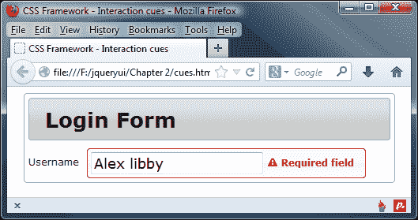

# 快速轻松地切换主题

一旦我们使用基本主题开发了内容，我们可能会决定将主题更改为与我们整体网站主题更好地匹配的主题；幸运的是，CSS 框架使更换主题变得轻松。看看之前的例子，要改变小部件的外观只需选择一个新的主题使用 ThemeRoller（可在[`www.jqueryui.com/themeroller`](http://www.jqueryui.com/themeroller)获得），然后下载新主题。我们可以通过在下载构建器中选择所有组件并单击**下载**来下载新主题以获取新主题。

在下载的存档中，会有一个以所选主题命名的目录，比如**redmond**。我们将`theme`文件夹从存档中拖到`development-bundle\themes`文件夹中，并从我们的页面链接新的主题文件，使我们的表单呈现出全新的外观，如下面的截图所示：

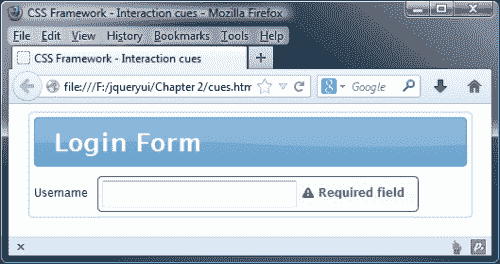

我用来获得这个截图的主题是 redmond。这个主题使用了各种蓝色的色调，要么是作为背景要么是作为普通文本；选定的选项，比如选项卡标题或小部件中选定的项目将以橙色文本或橙色背景显示。在本书的剩余部分中，我们将使用这个主题，或者我们自己创建的主题。

## 覆盖主题

使用 ThemeRoller 画廊和自定义工具，我们可以生成大量独特的主题。但有时候我们可能需要比使用 ThemeRoller 能够达到的更深层次的定制化；在这种情况下，我们有两个选择。

我们可以要么自己从头创建完整的主题文件，要么创建一个额外的样式表，只覆盖我们需要的`jquery.ui.theme.css`文件中的规则。后者可能是最简单的方法，并且需要编写的代码更少。

现在我们将看一下主题的这个方面。如果你已经为之前的示例更改了基本主题，请切换回`cues.html`的`<head>`中的基本主题。将页面保存为`cuesOverridden.html`，然后创建以下新样式表：

```js
.ui-corner-all { border-radius: 4px; }
.ui-widget-header { font-family: Helvetica; background:   #251e14; border-radius: 4px 4px 0 0; border: 1px solid #362f2d;color: #c7b299; }
.ui-form .ui-widget-header h2 { margin: 0; padding: 5px; font-style: italic; font-weight: normal; }
.ui-form .ui-widget-content { background: #eae2d8; border: 1px solid #362f2d; border-top: 0; width:  500px; padding: 0; }
.ui-widget-content form { padding: 20px; border: 1px solid #f3eadf; border-radius: 0 0 4px 4px; }
.ui-widget-content .ui-state-error-text { color: #9A1B1E; }
.ui-form .ui-state-error { border-radius:  4px 4px 4px 4px; }
```

将其保存为`overrides.css`放在`css`文件夹中。在这个样式表中，我们主要是覆盖了`jquery.ui.theme.css`文件中的规则。这些是简单的样式，我们只是改变了颜色、背景和边框。通过在`cuesOverridden.html`的其他样式表下面添加以下代码行来链接到这个样式表：

```js
<link rel="stylesheet" href="css/overrides.css">
```

我们谦逊的表单现在应该呈现如下截图中所示：

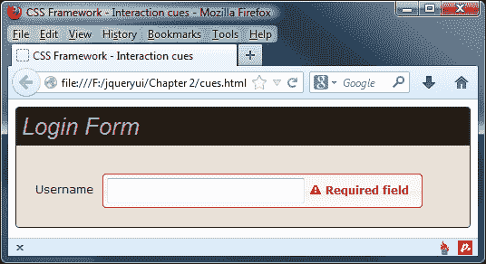

只要我们的样式表出现在`theme`文件之后，并且我们的选择器特异性匹配或超过了`jquery.ui.theme.css`文件中使用的选择器，我们的规则就会优先。对 CSS 选择器权重的长时间讨论超出了本书的范围。但是，简要解释特异性可能是有益的，因为它是覆盖所选主题的关键。CSS 特异性指的是 CSS 选择器的特异性程度——它越具体，权重就越大，随后将覆盖其他选择器应用于其他选择器所针对的元素的规则。例如，考虑以下选择器：

```js
#myContainer .bodyText
.bodyText
```

第一个选择器比第二个选择器更具体，因为它不仅使用了目标元素的类名，还使用了其父容器的 ID。因此，它将覆盖第二个选择器，无论第二个选择器是否在其之后出现。

### 注意

如果您想了解更多关于 CSS 特异性的信息，那么互联网上有许多优秀的文章。作为一个开始，您可能想看看 [`designshack.net/articles/css/what-the-heck-is-css-specificity/`](http://designshack.net/articles/css/what-the-heck-is-css-specificity/)，或者 [`reference.sitepoint.com/ css/specificity`](http://reference.sitepoint.com/ css/specificity)。或者，您可能想完成克里斯·科耶的示例，网址是 [`css-tricks.com/specifics-on-css-specificity/`](http://css-tricks.com/specifics-on-css-specificity/)。

在这个示例中，我们完全控制了我们正在修饰的元素。但是，当与库中的任何小部件或由第三方编写的插件一起工作时，可能会自动生成大量标记，我们无法控制（除非修改实际的库文件本身）。

因此，我们可能需要依赖这种方式来覆盖样式。我们只需在文本编辑器中打开`jquery.ui.theme.css`文件并查看其中使用的选择器即可找到要覆盖的样式。如果未能做到这一点，我们可以使用 Firebug 的 CSS 查看器来查看我们需要覆盖的规则，就像下面的示例一样：

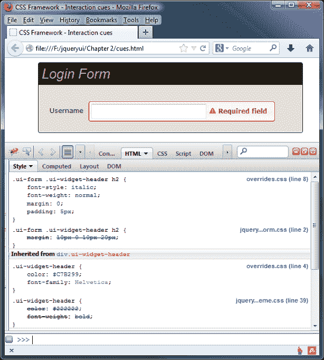

### 提示

**DOM 探查器**

所有现代浏览器都有像 Firebug 这样的 DOM 探查器和 CSS 检查器，可以用来查看 CSS 规则应用的顺序。使用浏览器的 CSS 检查器通常是检查 CSS 顺序的最方便方式。

# 定位实用工具

定位实用工具是一个强大的独立工具，用于将任何元素相对于窗口、文档、特定元素或鼠标指针定位。它在库组件中是独一无二的，因为它不需要`jquery.ui.core.js`或`jquery.effects.core.js`作为依赖项。

它不公开任何独特或自定义的方法（除了`position()`方法），也不触发任何事件，但它确实提供了一系列配置选项，让我们可以使用它。这些选项在下表中列出：

| 选项 | 格式 | 用于 |
| --- | --- | --- |
| at | 字符串 | 指定要对齐的定位元素的边缘。格式为，例如，left bottom。 |
| collision | 字符串 | 当定位元素溢出其容器时，将定位元素移动到替代位置。 |
| my | 字符串 | 指定预期与要定位的元素对齐的定位元素的边缘，例如 right top。 |
| of | 选择器，jQuery，对象，事件对象 | 指定相对于定位元素的元素。当提供选择器或 jQuery 对象时，使用第一个匹配的元素。当提供事件对象时，使用 pageX 和 pageY 属性 |
| using | 函数 | 接受一个函数，实际上定位定位元素。该函数接收一个包含新位置的 top 和 left 值的对象。 |

## 使用位置实用程序

使用位置实用程序非常简单。让我们看几个例子；在您的文本编辑器中创建以下页面：

```js
<!DOCTYPE html>
<html>
<head>
  <meta charset="utf-8">
  <title>Position Utility - position</title>
  <link rel="stylesheet" href="css/position.css">
  <script src="img/jquery-2.0.3.js"></script>
  <script src="img/jquery.ui.position.js"> </script>
  <script>
    $(document).ready(function() {
      (function($) {
        $(".ui-positioned-element").position({
          of: ".ui-positioning-element"
        });
      })(jQuery);
    });
  </script>
</head>
<body>
  <div class="ui-positioning-element">I am being positioned against</div>
  <div class="ui-positioned-element">I am being positioned </div>
</body>
</html>
```

将此保存为`position.html`。在这个例子中，我们还使用了一个非常基本的样式表，其中包含以下样式：

```js
.ui-positioning-element { width: 200px; height: 200px; border: 1px solid #000; }
.ui-positioned-element { width: 100px; height: 100px; border: 1px solid #f00; }
```

将此文件保存在`css`文件夹中，命名为`position.css`。我们正在定位的元素以及我们自身的定位元素可以设置为相对、绝对或静态定位，而不会影响定位元素的行为。如果我们要定位的元素使用其 top、left、bottom 或 right 样式属性移动，我们要定位的元素将考虑到这一点，并且仍然可以正常工作。

在页面上，我们只有两个`<div>`元素：一个是我们要定位的元素，另一个是我们要定位的实际元素。jQuery 本身是一个要求，所以我们在`<head>`元素中链接到它，并且我们还链接到位置实用程序的源文件。正如我之前提到的，当单独使用位置时，我们不需要链接到`jquery.ui.core.js`文件。

我们可以使用的最小配置，就像我们在这个例子中所做的那样，就是设置`of`选项，以指定我们要定位的元素。当我们只设置了这一个选项时，我们要定位的元素会被放置在我们要定位的元素的正中央，如下面的截图所示：

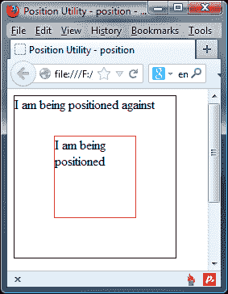

这本身就非常有用，因为元素不仅在水平方向上居中，而且在垂直方向上也是如此。

通过使用`my`和`at`属性，我们还可以将定位元素的任何边缘放置在我们正在定位的元素的任何边缘上。更改外部函数中的代码，使其显示如下（新/更改的代码以粗体显示）：

```js
$(".ui-positioned-element").position({
 of: ".ui-positioning-element",
 my: "right bottom",
 at: "right bottom"
});
```

以下截图显示了此代码的输出：

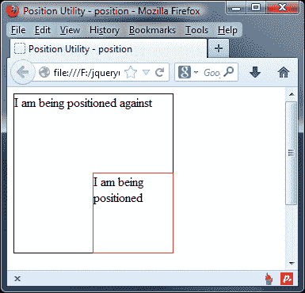

`my`选项指的是正在定位的元素。该选项的值作为字符串的第一部分被提供，它是水平轴，可以设置为左、中或右。第二部分是垂直轴，可以设置为顶部、中部或底部。

`at`选项指的是正在定位的元素的水平和垂直边缘。它还接受与`my`配置选项相同格式的字符串。

## 解释碰撞避免

定位实用程序具有内置的碰撞检测系统，以防止正在定位的元素溢出视口。我们可以使用两种不同的选项来设置检测到碰撞时发生的情况。默认值为`flip`，这会导致元素翻转并将其对齐到已配置的相反边缘。

例如，如果我们将一个`<div>`元素的右边缘定位到另一个元素的左边缘，如果它溢出了视口，它将被翻转，使其右边缘与定位元素的右边缘对齐。

将`position.html`中的配置更改为以下内容：

```js
$(".ui-positioned-element").position({
 of: ".ui-positioning-element",
 my: "right",
 at: "left"
});
```

这将导致以下定位：

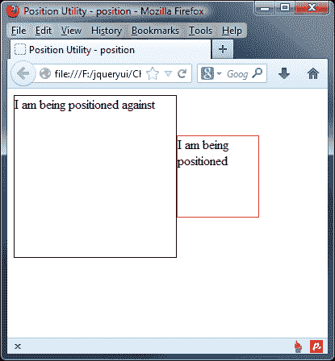

碰撞避免的另一种模式是`fit`，它会尽可能尊重配置的定位，但调整元素的定位，使其保持在视口内。将碰撞选项配置如下：

```js
$(".ui-positioned-element").position({
 collision: "fit",
 of: ".ui-positioning-element",
 my: "right",
 at: "left"
});
```

将此文件保存为`positionFit.html`。这次，元素被尽可能地定位到其预期位置：

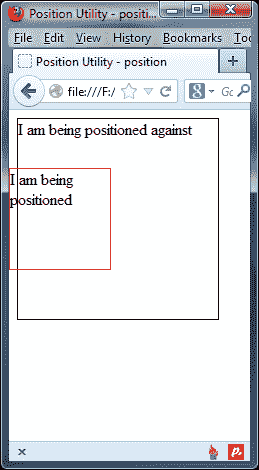

### 提示

我们还可以将`collision`选项的值设置为`none`，以完全禁用碰撞检测，并允许定位元素溢出视口。

# 使用函数进行定位

我们可以将`using`选项设置为一个函数，并手动定位被定位的元素。更改配置，使其显示如下：

```js
$(".ui-positioned-element").position({
  of: ".ui-positioning-element",
 my: "right bottom",
 at: "right bottom",
 using: function(pos) {
 $(this).css({
 backgroundColor: "#fc7676",
 top: pos.top,
 left: pos.left
 });
 }
});
```

将此更改保存为`positionFunction.html`。我们将一个匿名函数作为`using`选项的值提供。此函数作为单个参数传递，该参数是一个包含属性 top 和 left 的对象，这些属性对应于我们正在定位的元素应该具有的值。

如你从这段代码中所见，我们仍然需要手动定位元素，但该函数允许我们对可能需要的元素进行任何预处理。在函数内部，`this`对象被设置为被定位的元素。

# 在实际示例中使用定位小部件

到目前为止，我们已经考虑了使用位置小部件的理论；在转向查看小部件工厂之前，让我们花点时间考虑一下如何在实际情况中使用位置小部件。

一个完美的例子是 jQuery UI 的对话框小部件，配置为作为模态对话框运行。在这里，我们可以使用位置小部件将对话框放置在页面上，相对于按钮当前的位置。

要了解如何做，请将以下代码添加到文本编辑器中的新文件中：

```js
<!DOCTYPE html>
<html>
<head>
  <meta charset="utf-8">
  <title>Dialog</title>
  <link rel="stylesheet" href="development-bundle/themes/redmond/jquery.ui.all.css">
  <script src="img/jquery-2.0.3.js"></script>
  <script src="img/jquery.ui.core.js"></script>
  <script src="img/jquery.ui.widget.js"></script>
  <script src="img/jquery.ui.position.js"></script>
  <script src="img/jquery.ui.dialog.js"></script>
  <script src="img/jquery.ui.button.js"></script>
  <script></script>
</head>
<body></body>
</html>
```

我们需要一些标记，因此请在`<body>`标签之间添加以下代码：

```js
<div id="myDialog" title="This is the title!">
  Lorem ipsum dolor sit amet, consectetuer adipiscing elit.
  Aenean sollicitudin. Sed interdum pulvinar justo. Nam iaculis
  volutpat ligula. Integer vitae felis quis diam laoreet
  ullamcorper. Etiam tincidunt est vitae est.
</div>
Lorem ipsum dolor sit amet, consectetuer adipiscing elit.
Aenean sollicitudin. Sed interdum pulvinar justo. Nam iaculis
volutpat ligula. Integer vitae felis quis diam laoreet
ullamcorper. Etiam tincidunt est vitae est.
<button id="showdialog">Click me</button>
```

最后，为了将其整合并使其正常工作，请在关闭`</head>`标签之前添加以下脚本作为最后一个条目：

```js
$(document).ready(function($){
  $("#showdialog").button();
  $("#myDialog").dialog({ autoOpen: false, modal: true, });
  $("#showdialog").click(function() {
    $("#myDialog").dialog("open");
  });
  $("#showdialog").position({
    my: "left+20 top+100",
    at: "left bottom",
    of: myDialog
  });
});
```

如果我们在浏览器中预览这个页面，你会发现当点击按钮时，我们无法对背景中的文本进行任何操作：

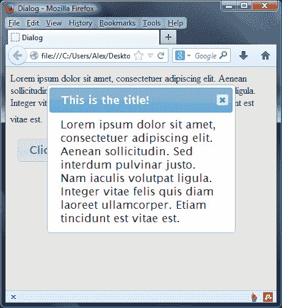

在这里，我们启动了一个 UI 对话框，并将其配置为作为模态对话框运行；`autopen`已设置为`false`，以便在显示页面时不显示对话框。然后，我们创建了一个简单的点击处理程序，在按钮点击时显示对话框；然后调用位置小部件，其中我们设置了`my`和`at`属性，以正确显示对话框相对于按钮的当前位置。

# 小部件工厂

jQuery UI 库中的另一个工具是小部件工厂，它是在 jQuery UI 1.8 版中引入的，并且此后已经经历了一些重要变化。它将允许轻松创建小部件的功能分割成一个单独且独立的实用程序文件。这就是`jquery.ui.widget.js`文件，我们可以使用它轻松创建我们自己的 jQuery UI 插件。就像 jQuery 本身提供`fn.extend()`方法轻松创建插件一样，jQuery UI 也提供了使插件创建更容易的机制，并确保在新插件中保留常见 API 功能。我们将在本书的一个单独章节中更详细地介绍小部件工厂，该章节可以下载。

# 总结

在本章中，我们看到了 CSS 框架如何一致地为每个库组件设置样式。我们查看了组成它的文件以及它们如何共同工作以提供完整的外观和感觉。我们还看到了 ThemeRoller 应用程序与框架的紧密集成程度，并且很容易使用 ThemeRoller 安装或更改主题。我们还看到了如果需要对无法仅通过 ThemeRoller 获得的小部件进行根本性自定义，我们如何可以覆盖主题文件。

该章节还介绍了如何构建与框架兼容并可以利用框架的自定义小部件或插件，以及确保我们的创建可以使用 ThemeRoller。我们还可以利用框架提供的助手类，例如`ui-helper-clearfix`类，来快速实现常见的 CSS 解决方案。

我们还研究了位置实用工具，它允许我们将一个元素的任何边与另一个元素的任何边对齐，为我们提供了一个强大而灵活的定位元素的方式，无论是创建还是操作元素。

在接下来的章节中，我们将开始查看库提供的小部件，从标签小部件开始。
