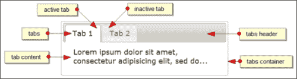
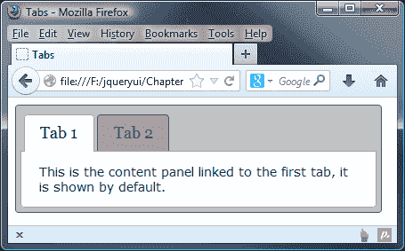
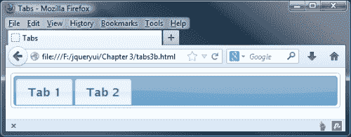
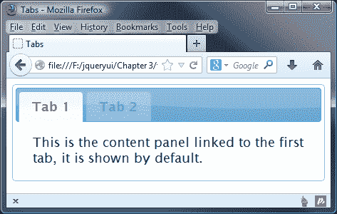
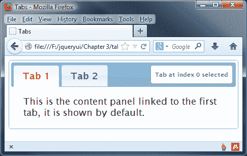
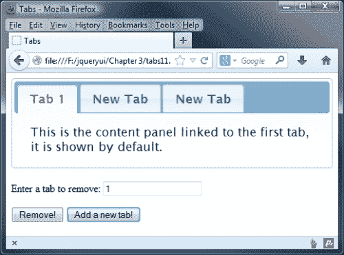
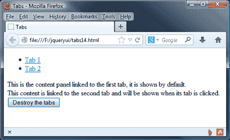
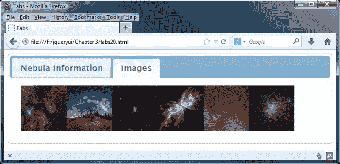

# 第三章：使用标签小部件

现在我们已经正式介绍了 jQuery UI 库、CSS 框架和一些实用工具，我们可以开始查看库中包含的各个组件了。在接下来的七章中，我们将着眼于小部件。这些是一组视觉吸引力强、高度可配置的用户界面小部件。

UI 标签小部件用于在不同元素之间切换可见性，每个元素都包含通过点击其标签标题可以访问的内容。每个内容面板都有自己的标签。标签标题通常显示在小部件顶部，尽管也可以重新定位它们，使它们出现在小部件底部。

标签被结构化成水平排列在一起，而内容部分除了活动面板外都被设置为`display: none`。点击一个标签将突出显示该标签并显示其关联的内容面板，同时确保所有其他内容面板都被隐藏。一次只能打开一个内容面板。可以配置标签使得没有内容面板打开。

在本章中，我们将查看以下主题：

+   小部件的默认实现

+   CSS 框架如何定位标签小部件

+   如何为一组标签应用自定义样式

+   使用它们的选项配置标签

+   内容面板变化的内置转换效果

+   使用它们的方法控制标签

+   由标签定义的自定义事件

+   AJAX 标签

下面的截图标有 jQuery UI 标签组件的不同元素：



# 实现一个标签小部件

标签基于的底层 HTML 元素的结构相对严格，小部件需要一定数量的元素才能工作。标签必须由一个列表元素（有序或无序）创建，每个列表项必须包含一个`<a>`元素。每个链接都需要有一个与链接的`href`属性关联的指定`id`的元素。我们将在第一个示例后澄清这些元素的确切结构。

在文本编辑器中创建一个新文件，创建以下页面：

```js
<!DOCTYPE html>
<html>
<head>
  <meta charset="utf-8">
  <title>Tabs</title>
  <link rel="stylesheet" href="development-bundle/themes/base/jquery.ui.all.css">
  <script src="img/jquery-2.0.3.js"></script>
  <script src="img/jquery.ui.core.js"> </script>
  <script src="img/jquery.ui.widget.js"> </script>
  <script src="img/jquery.ui.tabs.js"> </script>
  <script>
    $(document).ready(function($){
    $("#myTabs").tabs();
 });
  </script>  
</head>
<body>
  <div id="myTabs">
    <ul>
      <li><a href="#a">Tab 1</a></li>
      <li><a href="#b">Tab 2</a></li>
    </ul>
    <div id="a">This is the content panel linked to the first tab, it is shown by default.</div>
    <div id="b">This content is linked to the second tab and will be shown when its tab is clicked.</div>
  </div>
</body>
</html>
```

将代码保存为`jqueryui`工作文件夹中的`tabs1.html`。让我们回顾一下使用了什么。默认标签小部件配置需要以下脚本和 CSS 资源：

+   `jquery.ui.all.css`

+   `jquery-2.0.3.js`

+   `jquery.ui.core.js`

+   `jquery.ui.widget.js`

+   `jquery.ui.tabs.js`

标签小部件通常由若干个标准 HTML 元素构成，以特定方式排列：

+   调用标签方法的外部容器元素

+   列表元素（`<ul>`或`<ol>`）

+   为每个标签的`<li>`元素内的`<a>`元素

+   每个标签的内容面板元素

### 注意

这些元素可以硬编码到页面中，动态添加，或者根据需求可以是两者的混合。

外部容器中的列表和锚元素构成可点击的选项卡标题，用于显示与选项卡关联的内容部分。链接的`href`属性应设置为带`#`前缀的片段标识符。它应与形成其关联的内容部分的`id`属性相匹配。

每个选项卡的内容部分是使用`<div>`元素创建的。`id`属性是必需的，并且将由对应的`<a>`元素进行定位。在此示例中，我们已经使用`<div>`元素作为每个选项卡的内容面板，但只要提供相关配置并且生成的 HTML 有效，就可以使用其他元素。`panelTemplate`和`tabTemplate`配置选项可用于更改用于构建小部件的元素（有关更多信息，请参见本章后面的*配置*部分）。

我们在`<head>`部分的关闭标签之前链接到库中的多个`<script>`资源。脚本可以使用`document.ready()`命令在`<head>`部分加载，或者在样式表和页面元素之后加载。将它们放在最后加载是一种提高页面视觉加载时间的成熟技术，尽管这样做真正带来了多大的性能优势还有待商榷。

连接到 jQuery 后，我们链接到`jquery.ui.core.js`文件，该文件是所有组件（除了效果组件，它们有自己的核心文件）所需的。然后链接到`jquery.ui.widget.js`文件。然后链接到组件的源文件，本例中是`jquery.ui.tabs.js`。

在库中引入的三个必需脚本文件之后，我们可以转向自定义的`<script>`元素，其中包含创建选项卡的代码。我们在 jQuery 的`DOMReady`语句中封装用于创建选项卡的代码；这样做可确保代码仅在页面元素加载并准备好进行操作时才执行。我们还通过 jQuery 对象（`$`）传递来帮助避免与其他基于 JavaScript 的库发生冲突。

在`DOMReady`函数中，我们只需在表示选项卡容器元素的 jQuery 对象上调用`tabs()`小部件方法（具有`id`为`myTabs`的`<ul>`）。当我们在浏览器中运行此文件时，我们应该看到选项卡的外观与本章第一张截图中显示的一样（当然没有注释）。

# 为选项卡小部件添加样式

使用火狐浏览器的 Firebug（或其他通用 DOM 探查器），我们可以看到各种类名添加到不同的底层 HTML 元素中。让我们简要回顾这些类名，并看看它们如何对小部件的整体外观产生影响。以下类名被添加到外部容器`<div>`中：

| 类名 | 目的 |
| --- | --- |
| `ui-tabs` | 允许应用特定于标签的结构 CSS。 |
| `ui-widget` | 设置嵌套元素继承的通用字体样式。 |
| `ui-widget-content` | 提供主题特定的样式。 |
| `ui-corner-all` | 对容器应用圆角。 |

容器中的第一个元素是`<ul>`元素。这个元素获取以下类名：

| 类名 | 目的 |
| --- | --- |
| `ui-tabs-nav` | 允许应用特定于标签的结构 CSS。 |
| `ui-helper-reset` | 中和应用到`<ul>`元素的浏览器特定样式。 |
| `ui-helper-clearfi` | 应用清除浮动，因为这个元素有浮动的子元素。 |
| `ui-widget-header` | 提供特定主题的样式。 |
| `ui-corner-all` | 应用圆角。 |

构成`tab`标题的单独`<li>`元素有以下类名：

| 类名 | 目的 |
| --- | --- |
| `ui-state-default` | 将标签标题应用为标准状态，非活动，非选择，非悬停状态。 |
| `ui-corner-top` | 对元素的顶边应用圆角。 |
| `ui-tabs-selected` | 仅应用于活动标签。在默认实现页面加载时，这将是第一个标签。选择其他标签将从当前选定的标签中移除这个类，并将其应用到新选择的标签。 |
| `ui-state-active` | 对当前选定的标签应用特定主题的样式。这个类名将被添加到当前被选中的标签，就像之前的类名一样。有两个类名的原因是，`ui-tabs-selected`提供了功能性的 CSS，而`ui-state-active`提供了视觉上的装饰样式。 |

每个`<li>`内的`<a>`元素没有任何类名，但它们仍然通过框架应用了结构和特定主题的样式。

最后，包含每个标签内容的面板元素具有以下类名：

| 类名 | 目的 |
| --- | --- |
| `ui-tabs-panel` | 将结构性 CSS 应用于内容面板。 |
| `ui-widget-content` | 应用特定主题的样式。 |
| `ui-corner-bottom` | 对内容面板的底边应用圆角。 |

所有这些类都是自动添加到基础 HTML 元素中的。在编写页面或添加基本标记时，我们不需要手动添加它们。

# 将自定义主题应用于标签

在下一个例子中，我们可以看到如何改变标签的基本外观。我们可以用我们自己的样式规则来覆盖纯粹用于显示目的的任何规则，快速轻松地自定义，而不改变与标签功能或结构相关的规则。

在你的文本编辑器中新建一个非常小的样式表：

```js
#myTabs { min-width: 400px; padding: 5px; border: 1px solid #636363; background: #c2c2c2 none; }
.ui-widget-header { border: 0; background: #c2c2c2 none; font-family: Georgia; }
#myTabs .ui-widget-content { border: 1px solid #aaa; background: #fff none; font-size: 80%; }
.ui-state-default, .ui-widget-content .ui-state-default { border: 1px solid #636363; background: #a2a2a2 none; }
.ui-state-active, .ui-widget-content .ui-state-active { border: 1px solid #aaa; background: #fff none; }
```

这就是我们需要的一切。将文件保存为`tabsTheme.css`在你的`css`文件夹中。如果你将这些类名与之前页面上的表格进行比较，你会发现我们正在覆盖特定主题的样式。因为我们正在覆盖主题文件，我们需要匹配或超越`theme.css`中选择器的特殊性。这就是为什么有时我们会同时针对多个选择器。

在这个示例中，我们覆盖了`jquery.ui.tabs.css`中的一些规则。我们需要使用`jquery.ui.theme.css`中的选择器（`.ui-widget-content`），以及我们容器元素的 ID 选择器，以打败双类选择器`.ui-tabs .ui-tabs-panel`。

在`tabs1.html`的`<head>`中添加对这个新样式表的引用，并将文件另存为`tabs2.html`：

```js
<link rel="stylesheet" href="css/tabsTheme.css">
```

### 注意

确保我们刚刚创建的自定义样式表出现在`jquery.ui.tabs.css`文件之后，因为如果样式表的链接顺序不正确，则无法覆盖我们尝试覆盖的规则。

如果我们在浏览器中查看新页面，它应该显示如下截图：



我们的新主题与默认的平滑主题（如第一张截图所示）并没有明显的区别，但我们可以看到，为了适应其环境，更改小部件外观是多么容易，以及需要多少代码。

# 配置选项卡小部件

库中的每个不同组件都有一系列选项，用于控制小部件的哪些功能默认启用。可以将对象文字或对象引用传递给`tabs()`小部件方法以配置这些选项。

可用的选项来配置非默认行为如下表所示：

| 选项 | 默认值 | 用于... |
| --- | --- | --- |
| `active` | `0` | 表示打开的面板。 |
| `collapsible` | `false` | 允许点击活动选项卡时取消选择它，以便隐藏所有内容面板，只显示选项卡标题。 |
| `disabled` | `false` | 在页面加载时禁用小部件。我们还可以传递一个选项卡索引（从零开始）的数组，以便禁用特定的选项卡。 |
| `event` | `"click"` | 指定触发内容面板显示的事件。 |
| `heightStyle` | `content` | 控制选项卡小部件和每个面板的高度。可能的值是`auto`，`fill`和`content`。 |
| `hide` | `null` | 控制是否以及如何动画隐藏面板。 |
| `show` | `null` | 控制是否以及如何动画显示面板。 |

# 使用选项卡

选项卡小部件提供了一些选项，我们可以使用这些选项执行操作，例如选择或禁用选项卡，或添加过渡效果。在接下来的几个示例中，我们将查看其中一些选项，从选择选项卡开始。

## 选择选项卡

让我们看看如何使用这些可配置属性。例如，让我们配置小部件，使得页面加载时显示第二个选项卡。在`tabs2.html`的`<head>`中删除`tabsTheme.css`的链接，并将最终的`<script>`元素更改为以下内容：

```js
<script>
 $(document).ready(function($){
 var tabOpts = {
 active: 1
 };
 $("#myTabs").tabs(tabOpts);
 })
</script>
```

将此保存为`tabs3.html`。不同的选项卡及其关联的内容面板由从零开始的数字索引表示。指定默认打开的不同选项卡与提供其索引号作为`active`属性的值一样容易。现在页面加载时，默认应选择第二个选项卡。

除了更改选定的选项卡外，我们还可以通过为`collapsible`属性提供一个值来指定初始情况下不应选择任何选项卡。将`tabs4.html`中的`<script>`元素更改为以下内容：

```js
<script>
 $(document).ready(function($){
 var tabOpts = {
 active: false,
 collapsible: true
 };
 $("#myTabs").tabs(tabOpts); 
})
</script>
```

这将导致小部件在页面加载时如下所示：



## 禁用选项卡

您可能希望在满足特定条件之前禁用特定选项卡。通过操纵选项卡的`disabled`属性，这很容易实现。将`tabs4.html`中的`tabOpts`配置对象更改为以下内容：

```js
var tabOpts = {
 disabled: [1]
};
```

将此保存为`jqueryui`文件夹中的`tabs5.html`。在此示例中，我们删除了`active`属性，并将第二个选项卡的索引添加到禁用数组中。我们还可以将其他选项卡的索引以逗号分隔的方式添加到此数组中，以默认禁用多个选项卡。

当页面在浏览器中加载时，第二个选项卡的类名为`ui-widget-disabled`，并且会应用来自`ui.theme.css`的禁用样式。正如下面的截图所示，它不会以任何方式响应鼠标交互：



## 添加转换效果

我们可以使用`show`属性轻松添加引人注目的转换效果。当打开或关闭选项卡时，这些效果会显示出来。此选项是使用我们的配置对象内的另一个对象文字（或数组）配置的，该对象启用一个或多个效果。例如，我们可以使用以下配置对象启用淡入淡出效果：

```js
var tabOpts = {
 show: { effect: "toggle", duration: "slow" }
};
```

将此文件保存为`jqueryui`文件夹中的`tabs6.html`。我们创建的`show`对象具有两个属性。第一个属性是在更改选项卡时使用的动画。要使用淡入淡出动画，我们指定`effect`，因为这是要调整的内容。切换效果只是反转其当前设置。如果当前可见，则将其设置为不可见，反之亦然。您可以使用任何一个效果选项，例如`toggle`、`fadeIn`或`slideDown`；我们将在第十四章中更详细地了解效果，*UI Effects*。

第二个属性`duration`指定动画发生的速度。此属性的值为`slow`或`fast`，分别对应`200`和`600`毫秒。任何其他字符串都将导致默认持续时间为`400`毫秒。我们还可以提供一个表示动画应持续的毫秒数的整数。

当我们运行文件时，我们可以看到在选项卡关闭时选项卡内容慢慢淡出，当新的选项卡打开时淡入。两个动画在单个选项卡交互期间发生。为了只在选项卡关闭时显示动画一次，例如，我们需要将`show`对象嵌套在数组中。将`tabs6.html`中的配置对象更改为以下内容：

```js
var tabOpts = {
 show: [{ opacity: "toggle", duration: "slow" }, null]
};
```

当前打开的内容面板的关闭效果包含在数组的第一项中的对象中，而新选项卡的打开动画是第二项。通过将数组的第二项指定为`null`，我们在选择新选项卡时禁用了打开动画。将此保存为`tabs7.html`，并在浏览器中查看结果。

我们还可以通过在第二个数组项上添加另一个对象而不是`null`来指定不同的动画和速度以用于打开和关闭动画。

## 折叠选项卡

默认情况下，单击当前活动的选项卡时不会发生任何事情。但是我们可以更改这一点，使得当选择其选项卡标题时，当前打开的内容面板关闭。将`tabs7.html`中的配置对象更改为以下内容：

```js
var tabOpts = {
 collapsible: true
};
```

保存此版本为`tabs8.html`。此选项允许关闭所有内容面板，就像在前面的`selected`属性中提供`null`时那样。单击停用的标签将选择该标签并显示其关联的内容面板。再次单击相同的选项卡会关闭它，将小部件缩小，以便只有选项卡标题可见。

# 使用选项卡事件

选项卡小部件定义了一系列有用的选项，允许您添加回调函数以在检测到小部件公开的特定事件时执行不同的操作。下表列出了能够在事件上接受可执行函数的配置选项：

| 事件 | 当...时触发 |
| --- | --- |
| `add` | 添加了一个新选项卡。 |
| `disable` | 选项卡已禁用。 |
| `enable` | 选项卡已启用。 |
| `load` | 选项卡的远程数据加载完毕。 |
| `remove` | 移除了一个选项卡。 |
| `select` | 选择了一个选项卡。 |
| `show` | 选项卡显示。 |

库中的每个组件都有回调选项（例如上表中的选项），它们被调整为查找任何访客交互中的关键时刻。我们在这些回调中使用的任何函数通常在更改发生之前执行。因此，您可以从回调中返回 false 并阻止操作发生。

在我们的下一个示例中，我们将看到使用标准非绑定技术如何轻松地对选择的特定选项卡作出反应。将`tabs8.html`中最后的`<script>`元素更改为以下内容：

```js
$(document).ready(function($){
 var handleSelect = function(e, tab) {
 $("<p></p>", {
 text: "Tab at index " + tab.newTab.index() + " selected", 
 "class": "status-message ui-corner-all"
 }).appendTo(".ui-tabs-nav", "#myTabs").fadeOut(5000, function() {
 $(this).remove();
 });
 },
 tabOpts = {
 beforeActivate: handleSelect
 }
 $("#myTabs").tabs(tabOpts);
});
```

将此文件保存为`tabs9.html`。我们还需要一些 CSS 来完成这个示例。在我们刚刚创建的页面的`<head>`中，添加以下`<link>`元素：

```js
<link rel="stylesheet" href="css/tabSelect.css">
```

然后，在文本编辑器的新页面中添加以下代码：

```js
.status-message { padding:11px 8px 10px; margin:0; border:1px solid #aaa; position: absolute; right: 10px; top: 9px; font-size: 11px; background-color: #fff; }
.ui-widget-header { color: #2e6e9e; font-weight: bold; }
```

将此文件保存为`tabSelect.css`，并放在`css`文件夹中。在本示例中，我们在生产环境中链接了多个 CSS 文件；您可能希望考虑将 CSS 合并为一个文件，以减少 CSS HTTP 请求。尽管这将有助于在较大的站点上提高性能，但它的代价是无法替换 jQuery UI CSS 文件，因为您将丢失添加的任何自定义。

在本示例中，我们利用了`beforeActivate`回调来创建一个使用`<p>`标签的新元素，尽管原理对于标签页触发的任何其他自定义事件都是相同的。我们的回调函数名称作为我们配置对象中`beforeActivate`属性的值提供。

当回调函数被执行时，小部件将自动传递两个参数，即原始事件对象和包含从所选标签页中提取的有用属性的自定义对象。

要找出点击了哪个标签页，我们可以查看第二个对象的`index()`属性（请记住这些是从零开始的索引）。这与一些解释性文本一起添加到我们动态创建的段落元素中，并附加到小部件标题中：



每当选择一个标签页时，它前面的段落就会消失。请注意，事件在更改发生之前被触发。

## 绑定事件

使用每个组件公开的事件回调是处理交互的标准方法。但是，除了前面表中列出的回调之外，我们还可以在每个组件在不同时间点触发的另一组事件中插入钩子。

我们可以使用标准的 jQuery `on()` 方法将事件处理程序绑定到由标签页小部件触发的自定义事件，这与我们可以绑定到标准 DOM 事件（例如点击）的方式相同。

下表列出了标签小部件的自定义绑定事件及其触发器：

| 事件 | 在什么时候触发... |
| --- | --- |
| `tabsselect` | 一个标签页被选中。 |
| `tabsload` | 远程标签页已加载。 |
| `tabsshow` | 显示一个标签页时。 |
| `tabsadd` | 一个标签页已添加到界面中。 |
| `tabsremove` | 一个标签页已从界面中移除。 |
| `tabsdisable` | 一个标签页已被禁用。 |
| `tabsenable` | 一个标签页已被启用。 |

前三个事件按顺序连续触发，即它们在表中出现的事件顺序。如果没有标签页是远程的，那么`tabsbeforeactivate`和`tabsactivate`将按照此顺序触发。这些事件可以在动作发生之前或之后触发，这取决于使用哪个事件。

让我们看看这种事件使用方式的实际效果；将`tabs8.html`中的最后一个`<script>`元素更改为以下内容：

```js
<script>
 $(document).ready(function($){
 $("#myTabs").tabs();
 $("#myTabs").on("tabsbeforeactivate", function(e, tab) {
 alert("The tab at index " + tab.newTab.index() + " was selected");
 });
 });
</script>
```

将此更改保存为`tabs10.html`。通过这种方式绑定到`tabsbeforeactivate`将产生与前一个示例相同的结果，使用`select`回调函数。与上次一样，警报应该在激活新标签页之前出现。

所有小部件公开的所有事件都可以使用`on()`方法，只需将小部件的名称前缀与事件的名称相结合即可。

### 注意

尽管每个回调名称都是使用驼峰格式拼写的，但每个事件名称必须以小写字母书写。

# 使用选项卡方法

选项卡小部件包含许多不同的方法，这意味着它具有丰富的行为集。它还支持实现高级功能，允许我们以编程方式使用它。让我们看一下列在下表中的方法：

| 方法 | 用于... |
| --- | --- |
| `destroy` | 完全移除选项卡小部件。 |
| `disable` | 禁用所有选项卡。 |
| `enable` | 启用所有选项卡。 |
| `load` | 重新加载 AJAX 选项卡的内容，指定选项卡的索引号。 |
| `option` | 在小部件初始化后获取或设置任何属性。 |
| `widget` | 返回调用`tabs()`小部件方法的元素。 |

# 启用和禁用选项卡

我们可以使用`enable`或`disable`方法在程序中启用或禁用特定的选项卡。这将有效地启用最初被禁用的任何选项卡，或者禁用当前处于活动状态的选项卡。

让我们使用`enable`方法来启用默认情况下在早期示例中禁用的选项卡。在`tabs5.html`中现有选项卡小部件的标记之后直接添加以下新的`<button>`元素：

```js
<button type="button" id="enable">Enable</button>
<button type="button" id="disable">Disable</button>
```

接下来，更改最后的`<script>`元素，使其显示如下：

```js
<script>
$(document).ready(function($){
 $("#myTabs").tabs({
 disabled: [1]
 });
 $("#enable").click(function() {
 $("#myTabs").tabs("enable", 1);
 });
 $("#disable").click(function() {
 $("#myTabs").tabs("disable", 1);
 });
});
</script>
```

将更改后的文件保存为`tabs11.html`。在页面上，我们添加了两个新的`<button>`元素——一个用于启用被禁用的选项卡，另一个用于再次禁用它。

在 JavaScript 中，我们使用**启用**按钮的`click`事件调用`tabs()`小部件方法。为此，我们将字符串`enable`作为第一个参数传递给`tabs()`方法。此外，我们将要启用的选项卡的索引号作为第二个参数传递。jQuery UI 中的所有方法都是这样调用的。我们将要调用的方法的名称指定为小部件方法的第一个参数。`disable`方法的使用方式相同。不要忘记，我们可以在不需要额外参数的情况下使用这两种方法，以启用或禁用整个小部件。

# 添加和移除选项卡

除了在程序中启用和禁用选项卡之外，我们还可以在运行时删除它们或添加全新的选项卡。在`tabs11.html`中，删除现有的`<button>`元素，并添加以下内容：

```js
<label>Enter a tab to remove:</label>
<input for="indexNum" id="indexNum">
<button type="button" id="remove">Remove!</button>
<button type="button" id="add">Add a new tab!</button>
```

然后按以下方式更改最后的`<script>`元素：

```js
<script>
  $(document).ready(function($){
 $("#myTabs").tabs();
 $("#remove").click(function() {
 var indexTab = parseInt($("#indexNum").val(), 10);
 var tab = $("#myTabs").find(".ui-tabs-nav li:eq(" + indexTab + ")").remove();
 $("#myTabs").tabs("refresh");
 });
 $("#add").click(function() {
 $("<li><a href='remoteTab.txt'>New Tab</a></li>") .appendTo("#myTabs .ui-tabs-nav");
 $("#myTabs").tabs("refresh");
 });
  });
</script>
```

我们还需要提供一些内容，这些内容将被远程加载到选项卡中——在一个新文件中，添加`远程选项卡内容！`，并将其保存为`remoteTab.txt`。

将此保存为`tabs12.html`——要预览此示例，您将需要使用诸如**WAMP**（用于 Windows）或**MAMP**（用于苹果 Mac）之类的本地 Web 服务器查看它。如果使用文件系统访问，演示将无法工作。

在页面上，我们添加了一个新的指令`<label>`，一个`<input>`和一个`<button>`，用于指定要移除的选项卡。我们还添加了第二个`<button>`，用于添加一个新选项卡。

在`<script>`中，我们的第一个新函数处理删除选项卡，使用`remove`方法。此方法使用 jQuery 的`:eq()`函数查找要删除的选项卡的索引。我们获取输入到文本框中的值，并使用索引标识要删除的选项卡，然后使用`refresh`方法更新 Tabs 的实例。

### 注意

jQuery 的`val()`方法返回的数据格式为字符串，因此我们将调用包装在 JavaScript 的`parseInt`函数中以进行转换。

`add`方法用于向小部件添加新选项卡，其工作原理类似。在这里，我们创建了一个列表项的实例，然后使用 jQuery 的`appendTo()`方法将其添加到现有的选项卡中并更新它们。在此示例中，我们指定应将`remoteTab.txt`文件中的内容添加为新选项卡的内容。可选地，我们还可以将新选项卡应插入的索引号指定为第四个参数。如果未提供索引，则新选项卡将添加为最后一个选项卡。

添加并可能移除一些选项卡后，页面应该如下所示：



# 模拟点击

有时您可能需要以编程方式选择特定的选项卡并显示其内容。这可能是由于访问者的某些其他交互而发生的。

我们可以使用`option`方法来执行此操作，该方法与单击选项卡的操作完全类似。将`tabs12.html`中的最后一个`<script>`块更改为以下内容：

```js
<script>
  $(document).ready(function($){
    $("#myTabs").tabs();
    $("#remove").click(function() {
      var indexTab = parseInt($("#indexNum").val(), 10);
      var tab = $( "#myTabs" ).find(".ui-tabs-nav li:eq(" + indexTab + ")").remove();
      $("#myTabs").tabs("refresh");
    });
    $("#add").click(function() {
      $("<li><a href='remoteTab.txt'>New Tab</a></li>").appendTo("#myTabs .ui-tabs-nav");
      $("#myTabs").tabs("refresh");
 var tabCount = $("#myTabs ul li").length;
 $("#myTabs").tabs("option", "active", tabCount - 1);
    });
 });
</script>  
```

将此保存为`jqueryui`文件夹中的`tabs13.html`。现在当添加新选项卡时，它将自动选中。`option`方法需要两个额外的参数：第一个是要使用的选项的名称，第二个是要设置为活动状态的选项卡的 ID。

由于默认情况下（尽管可以更改），我们添加的任何选项卡都将是界面中的最后一个选项卡，并且由于选项卡索引是从零开始的，因此我们只需使用`length`方法返回选项卡的数量，然后从该数字中减去 1 以获取索引。结果传递给`option`方法。

有趣的是，立即选择新添加的选项卡会修复，或者至少隐藏，来自上一个示例的额外空间问题。

# 销毁选项卡

如前所示，我们可以轻松添加选项卡，但在某些情况下，您可能需要完全销毁一组选项卡。这可以使用`destroy`方法来实现，该方法对 jQuery UI 中找到的所有小部件都是通用的。让我们看看它是如何工作的。在`tabs13.html`中，立即删除现有的标记，然后添加一个新的`<button>`如下所示：

```js
<br>
<button type="button" id="destroy">Destroy the tabs</button>

```

接下来，将最后一个`<script>`元素更改为：

```js
<script>
 $(document).ready(function($){
 $("#myTabs").tabs();
 $("#destroy").click(function() {
 $("#myTabs").tabs("destroy");
 });
 });
</script> 

```

将此文件保存为`tabs14.html`。我们通过单击按钮调用的`destroy`方法完全删除了选项卡小部件，将底层 HTML 返回到其原始状态。单击按钮后，您应该会看到一个标准的 HTML 列表元素和来自每个选项卡的文本，类似于以下屏幕截图：



### 注意

如果销毁选项卡，则页面中硬编码的原始选项卡将保留，而不会保留使用`add`方法添加的选项卡。

# 获取和设置选项

像`destroy`方法一样，`option`方法由库中找到的所有不同组件公开。此方法用于在获取器模式和设置器模式下使用可配置选项和函数。让我们看一个基本示例；在`tabs9.html`中的选项卡小部件之后添加以下`<button>`：

```js
<button type="button" id="show">Show Selected!</button>
```

然后更改最后的`<script>`元素，使其如下所示：

```js
<script>
$(document).ready(function($){
 $("#myTabs").tabs();
 $("#show").click(function() {
 $("<p></p>", {
 text: "Tab at index " + $("#myTabs").tabs("option", "active") + " is active"
 }).appendTo(".ui-tabs-nav").fadeOut(5000);
 });
});
</script>
```

我们还需要调整所显示文本的位置，因此从现有代码中删除到`tabSelect.css`的链接，并在`<head>`部分中添加以下内容：

```js
  <style type="text/css">
    ul.ui-tabs-nav p { margin-top: 2px; margin-left: 210px;}
  </style>
```

将此文件保存为`tabs15.html`。页面上的`<button>`已更改，因此它显示当前活动的选项卡。我们所做的就是向状态栏消息中添加所选选项卡的索引，就像我们在早期示例中所做的那样。我们通过将字符串`active`作为第二个参数传递来获取`active`选项。可以以这种方式访问任何选项的任何值。

### 注意

**链接 UI 方法**

链接小部件方法（与其他 UI 方法或核心 jQuery 方法一起）是可能的，因为与底层 jQuery 库中的方法一样，它们几乎总是返回 jQuery（$）对象。请注意，当使用返回数据的获取器方法时，例如`length`方法时，这是不可能的。

要触发设置器模式，我们可以提供包含我们想要设置的选项的新值的第三个参数。因此，要更改`active`选项的值，以更改显示的选项卡，我们可以使用以下 HTML，而不是，为此，请按照以下所示更改 HTML，在`tabs15.html`底部：

```js
<br>
<label for="newIndex">Enter a tab index to activate</label>
<input id="newIndex" type="text">
<button type="button2" id="set">Change Selected</button>

```

接下来，按照所示添加点击处理程序：

```js
<script>
  $(document).ready(function($){
    $("#myTabs").tabs();
 $("#set").click(function() {
 $("#myTabs").tabs("option", "active", parseInt($("#newIndex").val()));
 });
  });
</script>
```

将此保存为`tabs16.html`。新页面包含一个`<label>`，一个`<input>`，以及一个用于获取应将`active`选项设置为的索引号的`<button>`。单击按钮时，我们的代码将检索`<input>`的值并使用它来更改所选索引。通过提供新值，我们将该方法置于设置器模式中。

当我们在浏览器中运行此页面时，我们应该看到，通过将其索引号输入为`1`并单击**更改所选**按钮，我们可以切换到第二个选项卡。

# 使用 AJAX 选项卡

我们看到了如何使用 `add` 方法将 AJAX 选项卡动态添加到小部件中，但我们也可以使用底层 HTML 添加远程内容到选项卡。在此示例中，我们希望始终可用于显示远程内容的选项卡，并不仅限于点击按钮后。这个示例也只能在已安装和配置了 PHP 的完整 Web 服务器上正确运行，例如 WAMP（PC）或 MAMP（Macs）。

在 `tabs16.html` 中的小部件的基础 HTML 中添加以下新的 `<a>` 元素：

```js
<li><a href="remoteTab.txt">AJAX Tab</a></li>
```

我们还应该从最后一个示例中移除 `<button>`。

最终的 `<script>` 元素可用于调用 `tabs` 方法；不需要额外的配置：

```js
$("#myTabs").tabs();
```

将其保存为 `tabs17.html`。我们所做的只是使用底层标记中 `<a>` 元素的 `href` 属性指定远程文件的路径（与我们在早期示例中使用的相同），从中创建选项卡。

与静态选项卡不同，我们不需要一个与链接的 `href` 匹配的 `<div>` 元素和 `id`。选项卡内容所需的附加元素将由小部件自动生成。

如果您使用 DOM 浏览器，您会发现我们添加的链接到远程选项卡的文件路径已被删除。相反，一个新的片段标识符已生成并设置为 `href`。新的片段也添加为新选项卡的 `id`（当然，不包括 `#` 符号），以便选项卡标题仍然显示选项卡。

除了从外部文件加载数据外，还可以从 URL 加载数据。当使用查询字符串或 Web 服务从数据库检索内容时，这非常有用。与 AJAX 选项卡相关的方法包括 `load` 和 `url` 方法。`load` 方法用于加载和重新加载 AJAX 选项卡的内容，这在需要频繁刷新内容的情况下非常有用。

### 注意

在选项卡小部件的 AJAX 功能中没有内在的跨域支持。因此，除非额外使用 PHP 或其他服务器脚本语言作为代理，否则您可能希望利用 **JavaScript Object** **Notation** (**JSON**) 结构化数据和 jQuery 的 JSONP 功能。文件和 URL 应位于运行小部件的页面的同一域下。

# 更改远程选项卡内容的 URL

`url` 方法用于更改 AJAX 选项卡检索其内容的 URL。让我们看看这两种方法在实际中的简要示例。还有一些与 AJAX 功能相关的属性。

在 `tabs17.html` 中的 Tabs 小部件后添加以下新的 `<select>` 元素：

```js
<select id="fileChooser">
  <option value="remoteTab1.txt">remoteTab1</option>
  <option value="remoteTab2.txt">remoteTab2</option>
</select>
```

然后将最终的 `<script>` 元素更改为以下内容：

```js
<script>
  $(document).ready(function($){
    $("#myTabs").tabs();
    $("#fileChooser").change(function() {
      $("#myTabs").tabs("option", "active", "2");
      $("#myTabs").find("ul>li a").attr("href", $(this).val());
      $("#myTabs").tabs("load", "active");
    });
  });
</script>
```

将新文件保存为 `tabs18.html`。我们在页面中添加了一个简单的 `<select>` 元素，让您可以选择在 AJAX 选项卡中显示的内容。在 JavaScript 中，我们为 `<select>` 设置了一个 change 处理程序，并指定了在每次检测到事件时要执行的匿名函数。

此函数首先设置活动选项卡；在本例中为 AJAX 选项卡，其 ID 为 2 - 然后使用 jQuery 的 `find()` 方法设置选项卡面板的 `href` 属性，然后使用 `load()` 方法将内容插入选项卡中。

我们还需要一个第二个本地内容文件。更改 `remoteTab1.txt` 文件中的文本，并将其另存为 `remoteTab2.txt`。

在浏览器中运行新文件，并使用 `<select>` 下拉列表选择第二个远程文件，然后切换到远程选项卡。第二个文本文件的内容应该会显示出来。

# 通过 JSONP 显示获取的数据

对于我们的最后一个示例，让我们为最后的选项卡示例拉取一些外部内容。如果我们使用选项卡小部件，结合标准的 jQuery 库的 `getJSON` 方法，我们可以绕过跨域排除策略，并从另一个域中拉取源，以在选项卡中显示。在 `tabs19.html` 中，将选项卡小部件更改为如下所示：

```js
<div id="myTabs">
 <ul>
 <li><a href="#a"><span>Nebula Information</span></a></li>
 <li><a href="#flickr"><span>Images</span></a></li>
 </ul>
 <div id="a">
 <p>A nebulae is an interstellar cloud of dust, hydrogen gas, and plasma. It is the first stage of a star's cycle. In these regions the formations of gas, dust, and other materials clump together to form larger masses, which attract further matter, and eventually will become big enough to form stars. The remaining materials are then believed to form planets and other planetary system objects. Many nebulae form from the gravitational collapse of diffused gas in the interstellar medium or ISM. As the material collapses under its own weight, massive stars may form in the center, and their ultraviolet radiation ionizes the surrounding gas, making it visible at optical wavelengths.</p>
 </div>
 <div id="flickr"></div>
</div>
```

接下来，将最后的 `<script>` 更改为以下内容：

```js
<script>
  $(document).ready(function($){
    var img = $("", {
      height: 100,
      width: 100
    }),
  tabOpts = {
  beforeActivate: function(event, ui) { 
    $('#myTabs a[href="#flickr"]').parent().index() != -1 ? getData() : null;
    function getData() {
      $("#flickr").empty();
      $.getJSON("http://api.flickr.com/services/feeds/photos_public.gne?tags=nebula&format=json&jsoncallback=?", function(data) {
          $.each(data.items, function(i,item){
            img.clone().attr("src", item.media.m) .appendTo("#flickr");
            if (i == 5) {
              return false;
            }
          });
        });
      }
    }
  };
  $("#myTabs").tabs(tabOpts);
});
</script>
```

将文件保存为 `tabs19.html` 到你的 `jqueryui` 文件夹中。我们首先创建一个新的 `` 元素并将其存储在一个变量中。我们还创建一个配置对象并向其添加 `select` 事件选项。每当选中一个标签时，我们设置为该选项值的函数将检查是否选中了一个具有 `id` 为 `flickr` 的标签。如果是，则使用 jQuery 的 `getJSON` 方法从 [`www.flickr.com`](http://www.flickr.com) 检索图像源。

数据返回后，首先清空**Flickr**标签的内容，以防止图像堆积，然后使用 jQuery 的 `each()` 实用方法来迭代返回的 JSON 中的每个对象，并创建我们存储的图像的克隆。

每个图像的新副本都使用当前 feed 对象的信息设置其 `src` 属性，然后添加到空的**Flickr**标签中。一旦对 feed 中的六个对象进行了迭代，我们就退出了 jQuery 的 `each` 方法。就是这么简单。

当我们查看页面并选择**图像**选项卡后，经过短暂的延迟，我们应该会看到六张新图像，如下面的截图所示：



# 摘要

选项卡小部件是一种极好的节省页面空间的方法，通过将相关（甚至完全不相关）的内容部分组织起来，可以通过访问者的简单点击输入来显示或隐藏。它还为您的网站增添了一种交互性，可以帮助改善所使用的页面的整体功能和吸引力。

让我们回顾一下本章涵盖的内容。我们首先看了一下如何只需一点点的基本 HTML 和一行 jQuery 风格的 JavaScript，就可以实现默认的选项卡小部件。

然后，我们看到了添加自己的基本样式到标签页小部件是多么容易，这样可以改变它的外观，但不改变它的行为。我们已经知道，除此之外，我们可以使用预设计的主题或使用 ThemeRoller 创建全新的主题。

然后，我们继续研究了标签页 API 公开的一系列可配置选项。借助这些选项，我们可以启用或禁用小部件支持的不同选项，例如标签页是通过单击还是其他事件选择的，以及在小部件呈现时是否禁用某些标签页。

我们花了一些时间研究如何使用一系列预定义的回调选项，允许我们在检测到不同事件时执行任意代码。我们还看到，如果需要，jQuery 的`on()`方法可以监听相同的事件。

在可配置选项之后，我们介绍了一系列方法，可以通过编程方式使标签页执行不同的操作，例如模拟对标签页的点击，启用或禁用标签页，以及添加或删除标签页。

我们简要地了解了标签页小部件支持的一些更高级功能，如 AJAX 标签页，以及使用 JSONP 获取信息。这两种技术都很容易使用，并且可以为任何实现增加价值。

在下一章中，我们将继续研究**手风琴**小部件，类似于标签页小部件，用于将内容分组到相关部分，一次显示一个部分。
