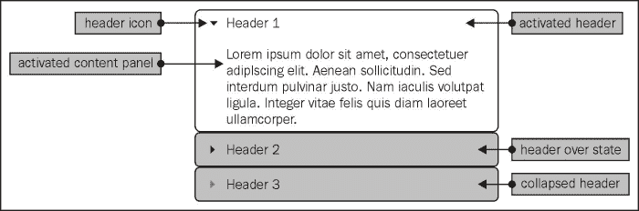
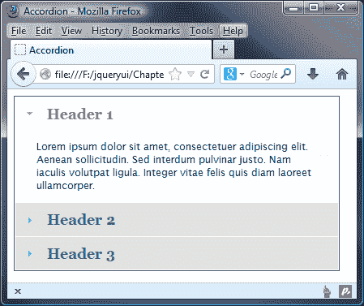
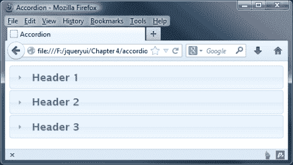
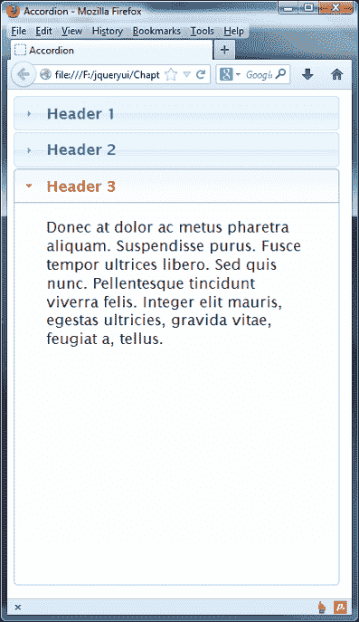
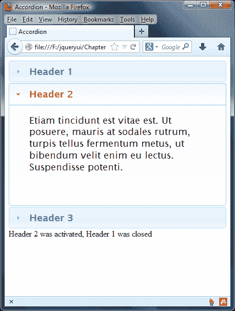
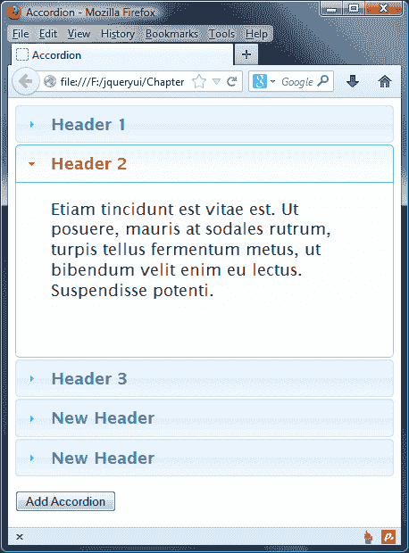
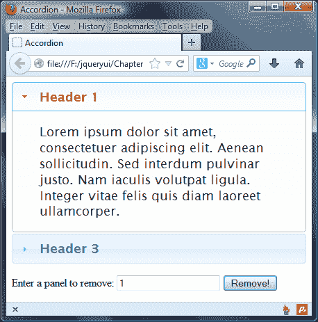
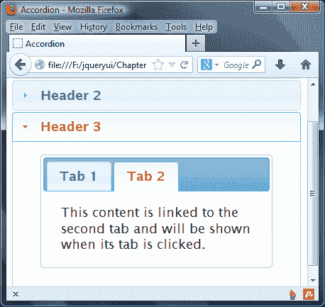
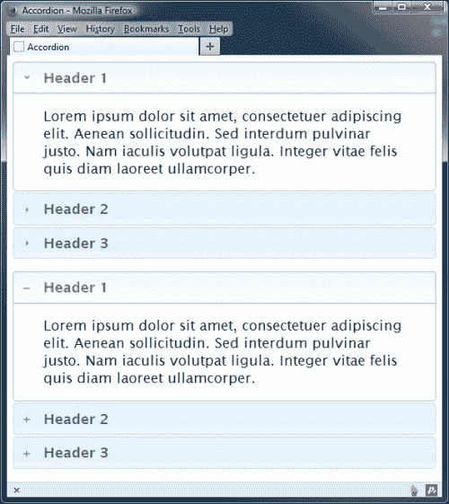

# 第四章：手风琴小部件

手风琴小部件是另一个 UI 小部件，允许您将内容分组到可以通过访问者交互打开或关闭的单独面板中。因此，大部分内容最初都是从视图中隐藏的，就像我们在上一章中看到的选项卡小部件一样。

每个容器都有一个与之关联的标题元素，用于打开容器并显示内容。当单击标题时，其内容将以动画形式滑入视图下方。当前可见的内容被隐藏，当我们单击手风琴标题时，新内容被显示。

在本章中，我们将涵盖以下主题：

+   手风琴小部件的结构

+   手风琴的默认实现

+   添加自定义样式

+   使用可配置的选项来设置不同的行为

+   使用控制手风琴的方法

+   内置的动画类型

+   自定义手风琴事件

手风琴小部件是一个强大且高度可配置的小部件，允许您通过在任何时候仅显示单个内容面板来节省网页空间。

下图显示了手风琴小部件的一个示例：



对于我们的访问者来说易于使用，对于我们来说易于实现。它具有一系列可配置的选项，可用于自定义其外观和行为，并公开一系列方法，允许您以编程方式控制它。它还带有丰富的交互事件集，我们可以用来挂钩我们的访问者与小部件之间的关键交互。

手风琴容器元素的高度将自动设置，以便在标题之外还有足够的空间来显示最高的内容面板。此外，默认情况下，小部件的大小将保持固定，因此在打开或关闭内容面板时不会将页面上的其他元素推到一边。

# 结构化手风琴小部件

让我们花点时间熟悉一下手风琴的基本标记。在外部容器内是一系列链接。这些链接是手风琴内的标题，每个标题都会有一个对应的内容面板，在点击标题时打开。

值得记住的是，在使用手风琴小部件时一次只能打开一个内容面板。在文本编辑器中的空白页上，创建以下页面：

```js
<!DOCTYPE html>
<html>
<head>
  <meta charset="utf-8">
  <title>Accordion</title>  
  <link rel="stylesheet" href="development-bundle/themes/redmond/jquery.ui.all.css">
  <script src="img/jquery-2.0.3.js"></script>
  <script src="img/jquery.ui.core.js"></script>
  <script src="img/jquery.ui.widget.js"> </script>  
  <script src="img/jquery.ui.accordion.js"> </script>
  <script>
    $(document).ready(function($) {
      $("#myAccordion").accordion();
    });
  </script>
</head>
<body>
  <div id="myAccordion">
    <h2><a href="#">Header 1</a></h2>
    <div>Lorem ipsum dolor sit amet, consectetuer adipiscing elit. Aenean sollicitudin. Sed interdum pulvinar justo.
    Nam iaculis volutpat ligula. Integer vitae felis quis diam laoreet ullamcorper.</div>

    <h2><a href="#">Header 2</a></h2>
    <div>Etiam tincidunt est vitae est. Ut posuere, mauris at sodales rutrum, turpis tellus fermentum metus, ut
    bibendum velit enim eu lectus. Suspendisse potenti.</div>

    <h2><a href="#">Header 3</a></h2>
    <div>Donec at dolor ac metus pharetra aliquam. Suspendisse purus. Fusce tempor ultrices libero. Sed
    quis nunc. Pellentesque tincidunt viverra felis. Integer elit mauris, egestas ultricies, gravida vitae,
    feugiat a, tellus.</div>
  </div>
</body>
</html>
```

将文件保存为`accordion1.html`，放在`jqueryui`文件夹中，并在浏览器中尝试运行。该小部件应该与本章开头的屏幕截图一样，完全皮肤化并准备好使用。

以下列表显示了小部件所需的依赖关系：

+   `jquery.ui.all.css`

+   `jquery-2.0.3.js`

+   `jquery.ui.core.js`

+   `jquery.ui.widget.js`

+   `jquery.ui.accordion.js`

正如我们在标签小部件中看到的，每个小部件都有其自己的源文件（尽管它可能依赖于其他文件来提供功能）；这些必须按正确的顺序引用，以使小部件正常工作。 jQuery 库必须始终首先出现，然后是`jquery.ui.core.js`文件。之后，必须跟随包含所需依赖项的文件。这些文件应在引用小部件的 on-script 文件之前出现。如果文件没有按正确的顺序加载，则库组件将无法按预期的方式工作。

用于手风琴的底层标记是灵活的，小部件可以由各种不同的结构构建。在这个例子中，手风琴标题由包裹在`<h2>`元素中的链接组成，内容面板是简单的`<div>`元素。

要使手风琴正常工作，每个内容面板应该直接出现在其对应的标题之后。所有小部件的元素都被封装在一个`<div>`容器中，该容器被`accordion()`小部件方法所选中。

在从库中获取所需的脚本依赖项之后，我们使用自定义`<script>`块将底层标记转换为手风琴。

要初始化小部件，我们使用一个简单的 ID 选择器`$("#myAccordion")`，指定包含小部件标记的元素，然后在选择器后面链式调用`accordion()`小部件方法来创建手风琴。

在这个例子中，我们在标签标题元素中使用空片段（`#`）作为`href`属性的值，例如：

```js
<h2><a href="#">Header 1</a></h2>
```

你应该注意，默认情况下，单击手风琴标题时不会跟随任何为手风琴标题提供的 URL。

与我们在上一章中看到的标签小部件类似，当小部件被初始化时，被转换为手风琴的底层标记具有一系列的类名添加到其中。

一些组成小部件的不同元素被赋予`role`和`aria-`属性。

### 注意

**可访问的丰富互联网应用程序**（**ARIA**）是确保丰富互联网应用程序对辅助技术保持可访问性的 W3C 推荐。

最初从视图中隐藏的手风琴面板被赋予`aria-expanded="false"`属性，以确保屏幕阅读器不会丢弃或无法访问使用`display: none`隐藏的内容。这使得手风琴小部件高度可访问；它阻止读者不必要地浏览可能被隐藏的大量内容，并告诉用户他们也可以展开或折叠面板，具体取决于`aria-expanded`属性的当前值。

# 为手风琴添加样式

ThemeRoller 是选择或创建手风琴小部件主题的推荐工具，但有时我们可能希望在 ThemeRoller 无法实现的情况下，大幅改变小部件的外观和样式。在这种情况下，我们可以自定义样式我们自己的手风琴—在我们的示例中，我们将拉平样式效果，添加边框，并从手风琴小部件中的一些元素中移除角落。

在您的文本编辑器中的新文件中添加以下代码：

```js
#myAccordion { width: 400px; border: 1px solid #636363; padding-bottom: 1px; }
#myAccordion .ui-state-active { background: #fff; } 
.ui-accordion-header { border: 1px solid #fff; font-family:
  Georgia; background: #e2e2e2 none; }
.ui-widget-content { font-size: 70%; border: none; }
.ui-corner-all { border-radius: 0; }
.ui-accordion .ui-accordion-header { margin: 0 0 -1px; } 
```

将此文件保存为`accordionTheme.css`，放在 css 文件夹中，并在`accordion1.html`的`<head>`元素中的 jQuery UI 样式表之后链接到它：

```js
<link rel="stylesheet" href="css/accordionTheme.css">
```

将新文件保存为`accordion2.html`，放在`jqueryui`文件夹中，并在浏览器中查看。它应该看起来像下面这样：



如前面的截图所示，我们已禁用了主题文件添加的内置圆角，并设置了替代字体、背景颜色和边框颜色。我们并没有大幅度更改小部件，但我们也没有使用许多样式规则。通过这种方式继续覆盖规则来构建一个更复杂的自定义主题将会很容易。

# 配置手风琴

手风琴具有一系列可配置选项，允许我们更改小部件的默认行为。下表列出了可用选项、它们的默认值，并简要描述了它们的用法：

| 选项 | 默认值 | 使用 |
| --- | --- | --- |
| `active` | `first child`（第一个面板是打开的） | 在页面加载时设置活动标题。 |
| `animate` | `{}` | 控制面板的动画效果。 |
| `collapsible` | `false` | 允许同时关闭所有内容面板。 |
| `disabled` | `false` | 禁用小部件。 |
| `event` | `"click"` | 指定触发打开抽屉的标题上的事件。 |
| `header` | `"> li >:first-child,> :not(li):even"` | 设置标题元素的选择器。尽管看起来复杂，但这是一个标准的 jQuery 选择器，只是简单地针对每个奇数`<li>`元素中的第一个子元素。 |
| `heightStyle` | `"auto"` | 控制手风琴和每个面板的高度 |
| `icons` | `'header': 'ui-icontriangle-1-e', 'headerSelected': 'uiicon- triangle-1-s'` | 指定标题元素和选定状态的图标。 |

# 更改触发事件

大多数选项都是不言自明的，它们接受的值通常是布尔值、字符串或元素选择器。让我们使用其中一些，以便我们可以探索它们的功能。将`accordion2.html`中的最后一个`<script>`元素更改为如下所示：

```js
<script>
  $(document).ready(function($) {
 var accOpts = {
 event:"mouseover"
 }
    $("#myAccordion").accordion(accOpts);
  });
</script>
```

我们不再需要在`accordion2.html`中添加的自定义样式表，所以继续从代码中删除以下行：

```js
  <link rel="stylesheet" href="css/accordionTheme.css">
```

将这些更改保存为`accordion3.html`。首先，我们创建一个名为`accOpts`的新对象字面量，其中包含`event`键和`mouseover`值，这是我们希望用来触发打开手风琴面板的事件。我们将这个对象作为参数传递给`accordion()`方法，并且它覆盖了小部件的默认选项，即`click`。

`mouseover`事件通常用作替代触发事件。也可以使用其他事件，例如，我们可以将`keydown`设置为事件，但是为了使其工作，我们希望打开的手风琴面板必须已经聚焦。您应该注意，您还可以在小部件方法中使用内联对象设置选项，而不需要创建单独的对象。使用以下代码同样有效，并且通常是编码的首选方式，这是我们在本书的其余部分中将使用的方式：

```js
<script>
  $(function() {
 $("#myAccordion").accordion({ 
 event: "mouseover" 
 });
  });
</script>
```

# 更改默认活动头

默认情况下，手风琴的第一个标题在小部件呈现时将被选中，并显示其内容面板。我们可以使用`active`选项在页面加载时更改选定的标题。将`accordion3.html`中的配置`<script>`块更改为以下内容：

```js
  <script>
    $(document).ready(function($) {
      $("#myAccordion").accordion({
        active: 2
      });
    });
  </script>
```

将此版本保存为`accordion4.html`。我们将`active`选项设置为整数`2`，以默认打开第三个内容面板，并且与我们在上一章中看到的选项标题类似，手风琴的标题使用从零开始的索引。除了整数，此选项还接受 jQuery 选择器或原始 DOM 元素。

我们还可以使用布尔值`false`来配置手风琴，以使默认情况下不打开任何内容面板。再次更改配置对象如下：

```js
  <script>
    $(document).ready(function($) {
      $("#myAccordion").accordion({
 collapsible: true, 
 active: false
      });
    });
  </script>
```

### 注意

如果使用`active: false`选项，必须还包括`collapsible`选项，该选项必须设置为`true`才能使`active`正确工作。

将此保存为`accordion5.html`。现在当页面加载时，所有内容面板都被隐藏了：



手风琴将保持关闭状态，直到选择其中一个标题，该标题将保持打开状态，除非单击活动标题；在此时，其关联的内容面板将关闭。为了便于使用，最好避免在同一实现中同时配置此选项和`mouseover`事件选项，因为即使用户无意中将鼠标移到其上并再次移动，打开的面板也会关闭。

# 填充其容器的高度

如果设置了`heightStyle`选项，它将强制手风琴占据其容器的全部高度。到目前为止，我们的示例中，手风琴的容器一直是页面的主体，而页面主体的高度只能是其最大元素的高度。我们需要使用一个具有固定高度的新容器元素来查看此选项的效果。

在`accordion5.html`的`<head>`元素中，添加以下`<style>`元素：

```js
<style>
  #container { height: 600px; width: 400px; }
</style>
```

然后，将手风琴的所有底层标记包装在一个新的容器元素中，如下所示：

```js
<div id="container">
  <div id="myAccordion">
    <h2><a href="#">Header 1</a></h2>
    <div>Lorem ipsum dolor sit amet, consectetuer adipiscing   elit. Aenean sollicitudin. Sed interdum pulvinar justo. Nam iaculis volutpat ligula. Integer vitae felis quis diam laoreet ullam corper.</div>
    <h2><a href="#">Header 2</a></h2>
    <div>Etiam tincidunt est vitae est. Ut posuere, mauris at 
sodales rutrum, turpis tellus fermentum metus, ut bibendum 
velit enim eu lectus. Suspendisse potenti.</div>
     <h2><a href="#">Header 3</a></h2>
     <div>Donec at dolor ac metus pharetra aliquam. Suspendisse purus. Fusce tempor ultrices libero. Sed quis nunc. Pellentesque tincidunt viverra felis. Integer elit mauris, egestas ultricies, gravida vitae, feugiat a, tellus.</div>
  </div>
</div>

```

最后，更改我们自定义 `<script>` 元素中的配置对象，使其如下所示：

```js
  <script>
    $(document).ready(function($) {
      $("#myAccordion").accordion({
 heightStyle: "fill" 
      });
    });
  </script>
```

将更改保存为 `accordion6.html`。使用页面 `<head>` 元素中指定的 CSS 为新容器指定了固定的高度和宽度。

### 注意

在大多数情况下，您将希望创建一个单独的样式表。对于我们的目的，只有一个选择器和两个规则，使用 HTML 文件中的样式标记最为方便。

选项 `heightStyle` 强制手风琴占据整个容器的高度，限制容器的宽度自然也会减小小部件的宽度。这个页面应该显示如下：



# 使用手风琴动画

手风琴小部件附带了默认启用的内置幻灯片动画，在我们所有的示例中都存在。禁用此动画只需将 `animate` 选项的值设为 `false` 即可。从页面的 `<head>` 元素中删除 `<style>` 标签，在 `accordion6.html` 中删除额外的容器 `<div>`，然后更改配置对象，使其如下所示：

```js
  <script>
    $(document).ready(function($) {
      $("#myAccordion").accordion({
 animate: false
      });
    });
  </script>
```

将其保存为 `accordion7.html`。这将导致每个内容面板立即打开，而不是在单击标头时漂亮地滑动打开。

小部件中还构建了另一种备用动画——`EaseOutBounce` 动画。然而，要使用这个备用动画，我们需要在 `jquery.ui.effect.js` 文件中添加一个链接。

在 `<head>` 元素顶部的 `jquery.ui.accordion.js` 链接后，添加以下一行代码：

```js
<script src="img/jquery.ui.effect.js"></script>
```

现在，更改我们自定义 `<script>` 元素中的配置对象，使其如下所示：

```js
  <script>
    $(document).ready(function($) {
      $("#myAccordion").accordion({
 animate: {
 duration: 600,
 down: {
 easing: "easeOutBounce",
 duration: 1000
 }
 }
      });
    });
  </script>
```

将这些更改保存为 `accordion8.html`。尽管手风琴面板的关闭方式与之前的示例完全相同，但在打开时，它们会在动画结束时反弹几次。这是使动画更有趣的好方法，正如我们在这个示例中看到的那样，使用起来非常简单。

除了两个预配置的动画之外，我们还可以使用 `jquery.ui.effect.js` 文件中定义的任何不同的缓动效果，包括以下内容：

+   `easeInQuad`

+   `easeInCubic`

+   `easeInQuart`

+   `easeInQuint`

+   `easeInSine`

+   `easeInExpo`

+   `easeInCirc`

+   `easeInElastic`

+   `easeInBack`

+   `easeInBounce`

这些缓动方法的每一个都有相应的 `easeOut` 和 `easeInOut` 对应方法。完整列表，请参见 `jquery.ui.effect.js` 文件，或参考 第十四章 中的缓动表，*UI Effects*。

### 注意

在 [`jqueryui.com/accordion/`](http://jqueryui.com/accordion/) 查看 jQuery UI 演示站点，以了解一些很棒的手风琴效果示例。这些效果可以应用于任何可以进行动画处理的小部件，例如手风琴、选项卡、对话框或日期选择器。

缓动效果不会改变底层动画，仍然基于幻灯片动画。但它们确实改变了动画的进展方式。例如，我们可以通过在配置对象中使用 `easeInOutBounce` 缓动效果来使内容面板在动画开始和结束时都跳动：

```js
<script>
  $(document).ready(function($) {
    $("#myAccordion").accordion({
      animate: {
        duration: 600,
        down: {
 easing: "easeInOutBounce",
          duration: 1000
        }
      }
    });
  });
</script>
```

将此文件保存为 `accordion9.html` 并在浏览器中查看。大多数缓动效果都有相反的效果，例如，我们可以使用 `easeInBounce` 缓动效果使内容面板在动画开始时跳动，而不是在动画结束时跳动。

对动画产生影响的另一个选项是 `heightStyle` 属性，在每次动画后重置 `height` 和 `overflow` 样式。请记住，默认情况下启用动画，但此选项不会启用。将 `accordion9.html` 中的配置对象更改为以下内容：

```js
$(document).ready(function($) {
  $("#myAccordion").accordion({
 heightStyle: "content",
    animate: {
      duration: 600,
      down: {
 easing: "easeOutBounce",
        duration: 1000
      }
    }
  });
});
```

将此保存为 `accordion10.html`。现在运行页面时，手风琴不会保持固定尺寸；它将根据每个面板中的内容量而增长或缩小。在这个示例中并没有什么区别，但是在使用动态内容时，该属性确实会发挥作用，因为在面板内容频繁更改时，我们可能并不总是知道每个面板中会有多少内容。

# 列出手风琴事件

手风琴公开了三个自定义事件，列在下表中：

| 事件 | 触发时... |
| --- | --- |
| `activate` | 活动标题已更改。 |
| `beforeActivate` | 活动标题即将更改 |
| `create` | 小部件已创建 |

每次活动标题（及其关联的内容面板）更改时触发 `activate` 事件。它在内容面板打开动画结束时触发，或者如果禁用动画，则立即触发（但仍在激活面板更改后）。

`beforeActivate` 事件在选择新标题后立即触发（即在打开动画之前），或者如果动画被禁用，则在激活面板已更改之前触发。`create` 事件在小部件初始化后立即触发。

# 使用 change 事件

让我们看看如何在我们的手风琴实现中使用这些事件。在 `accordion10.html` 中，将配置对象更改为如下所示：

```js
$(document).ready(function($) {
  var statustext;
  $("#myAccordion").accordion({
    activate: function(e, ui) {
      $(".notify").remove();
      Statustext = $("<div />", {
        "class": "notify",
         text: [
           ui.newHeader.find("a").text(), "was activated,",
           ui.oldHeader.find("a").text(), "was closed"
         ].join(" ")
      });
      statusText.insertAfter("#myAccordion").fadeOut(2000, function(){
        $(this).remove();
      });
    }
  });
});
```

将此保存为 `accordion11.html`。在此示例中，我们使用 `activate` 配置选项来指定一个匿名回调函数，该函数每当活动面板更改时都会执行。此函数会自动接收两个对象作为参数。第一个对象是 `event` 对象，其中包含原始的浏览器 `event` 对象。

第二个参数是一个对象，其中包含有关小部件的有用信息，例如激活了哪个标题元素（`ui.newHeader`）和被关闭的标题（`ui.oldHeader`）。第二个对象是一个 jQuery 对象，因此我们可以直接在它上面调用 jQuery 方法。

在此示例中，我们导航到标题中的`<a>`元素，并在信息框中显示其文本内容，然后将其附加到页面并在短时间后使用淡入动画移除。

供参考，`ui`对象还提供了有关内容面板的信息，以`ui.newPanel`和`ui.oldPanel`属性的形式。

一旦激活了标题并显示了其内容面板，将生成通知：



# 配置 beforeActivate 事件

`beforeActivate`事件可以以完全相同的方式使用，并且我们使用此事件指定的任何回调函数也会收到`e`和`ui`对象以使用。

将上一个示例中的配置对象更改为如下所示：

```js
$(document).ready(function($) {
  var statusText;
  $("#myAccordion").accordion({
 beforeActivate: function(e, ui) {
      statusText = $("<div />", {
        "class": "notify",
        text: [ui.newHeader.find("a").text(),
          "was activated,", ui.oldHeader.find("a").text(),
          "was closed"].join(" ");
      });
      statusText.insertAfter("#myAccordion")
        .fadeOut(2000, function() {
          $(this).remove();
      });
    }
  });
});
```

将此保存为`accordion12.html`。唯一更改的是我们使用配置对象定位的属性。当我们运行页面时，我们应该发现一切都与之前完全相同，只是我们的通知是在内容面板动画之前而不是之后产生的。

还有诸如`accordionactivate`和`accordionbeforeactivate`之类的事件，可与标准 jQuery `on()` 方法一起使用，以便我们可以指定在手风琴配置之外执行的回调函数。使用此方式的事件处理程序可以让我们精确地响应特定事件而触发它，而不是在页面渲染在屏幕上时触发。

例如，让我们重新设计刚刚创建的演示的脚本块，以使用`accordionbeforeactivate`事件处理程序。如果您想改用此格式，只需用以下脚本替换`accordion12.html`中的`<script>`块-您可以在代码中看到主要更改已突出显示：

```js
<script>
  $(document).ready(function($) {
    var statusText;
    $("#myAccordion").accordion();

 $(document).on( "accordionbeforeactivate", function(e, ui) {
      statusText = $("<div />", {
        "class": "notify",
        text: [ui.newHeader.find("a").text(), "was activated, ", ui.oldHeader.find("a").text(), "was closed"].join(" ")
      });
      statusText.insertAfter("#myAccordion")
        .fadeOut(2000, function() {
        $(this).remove();
      });
 });
  });
</script>
```

在此示例中，我们将`beforeActivate`事件处理程序从主配置调用中移出到 Accordion，并将其绑定到了文档对象；我们同样可以将其绑定到页面上的按钮或超链接等对象上。

# 解释手风琴方法

手风琴包括一系列方法，允许您以编程方式控制和操作小部件的行为。一些方法对库的每个组件都是通用的，例如每个小部件都使用的`destroy`方法。以下表列出了手风琴小部件的唯一方法：

| 方法 | 用途 |
| --- | --- |
| `refresh` | 重新计算手风琴面板的高度；结果取决于内容和`heightStyle`选项 |

## 标题激活

`option`方法可用于以编程方式显示或隐藏不同的抽屉。我们可以使用文本框和新按钮轻松测试此方法。在`accordion12.html`中，直接在手风琴后面添加以下新标记：

```js
<label for="activateChoice">Enter a header index to activate   </label>
<input id="activateChoice">
<button type="button" id="activate">Activate</button>
```

现在将`<script>`元素更改为以下内容： 

```js
<script>
  $(document).ready(function($) {
    var drawer = parseInt($("#activateChoice").val(), 10);

 $("#myAccordion").accordion();
 $("#activate").click(function() {
 $("#myAccordion").accordion("option", "active", drawer);
 });
  });
</script>
```

将新文件保存为`accordion13.html`。`option`方法需要两个额外的参数。它期望接收要使用的选项的名称，以及要激活的标题元素的索引（从零开始的）编号。在本示例中，我们通过返回文本输入的值来获得要激活的标题。我们使用 JavaScript 的`parseInt()`函数将其转换为整数，因为`val()` jQuery 方法返回字符串。

如果指定了不存在的索引号，则不会发生任何事情。如果未指定索引，则将激活第一个标题。如果指定了除整数以外的值，则不会发生任何事情；脚本将静默失败，而不会出现任何错误，并且手风琴将继续正常工作。

# 添加或删除面板

在 1.10 版本之前，更改手风琴中面板数量的唯一方法是销毁它并重新初始化一个新实例。虽然这样做可以，但这不是实施任何更改的满意方式，考虑到这一点，jQuery 团队努力介绍了一种新方法，该方法使其与其他小部件保持一致，这些小部件不需要重新创建即可更改任何已配置的选项。让我们使用输入按钮来测试这种方法，以创建我们的新面板。

在`accordion13.html`中，将手风琴下面的标记更改为以下代码：

```js
<p>
 <button type="button" id="addAccordion">Add Accordion</button>
</p>
```

修改`<script>`块，使其如下所示：

```js
<script>
  $(document).ready(function($) {
    $("#myAccordion").accordion();
 $('#addAccordion').click( function() {
 var newDiv = "<h2><a ref='#'>New Header</a></h2><div>New Content</div>";
 $("#myAccordion").append(newDiv).accordion("refresh"); 
 });
  });
</script>
```

将新文件保存为`accordion14.html`。在本示例中，我们已经为新的手风琴面板创建了额外的标记内容，并将其分配给`newDiv`变量。然后我们将其附加到`myAccordion` `<div>`，然后使用手风琴的`refresh`方法刷新它。这不需要任何参数。

### 注意

我们已指定在每个手风琴面板的标记中使用的默认文本。只要保持相同的标记，就可以轻松修改为包含所需文本，这是可以的。

页面加载时，我们可以单击**Add Accordion**以添加任意数量的新手风琴面板，如下图所示：



但是，如果我们需要删除手风琴面板，则需要更多的工作 - 标记分为两部分（标题和面板），因此我们必须分别删除两者。修改手风琴下面的标记：

```js
<p>  
  <label>Enter a tab to remove:</label>
  <input for="indexNum" id="indexNum">
  <button type="button" id="remove">Remove!</button>
</p>
```

现在将`<script>`块更改如下：

```js
<script>
  $(document).ready(function($) {
    function removeDrawer(removeIndex) {
      $("#myAccordion").find("h2").eq(removeIndex).remove();
      $("#myAccordion").find("div").eq(removeIndex).remove();
      $("#myAccordion").accordion("refresh");   
    }
    $("#myAccordion").accordion();
    $("#remove").click(function(event, ui) {
      var removeIndex = $("#indexNum").val();
      removeDrawer(removeIndex);
    });
  });
</script>
```

将新文件保存为`accordion15.html`；页面加载时，输入`1`并单击**Remove**以删除中间标题及其面板：



在本示例中，我们通过返回文本输入的值来获取要删除的手风琴。如果指定了不存在的索引号，则不会发生任何事情。

然后，我们使用`eq()`根据给定的值查找要删除的标题和面板，一旦找到，它们就会被删除。最后一步是`refresh`手风琴，以便然后可以选择新的标题和面板。

# 调整手风琴面板的大小

修改`accordion10.html`中手风琴小部件的基础标记，以便第三个标题指向一个远程文本文件，第三个面板为空。标题元素还应该有一个`id`属性：

```js
<div id="myAccordion">
  <h2><a href="#">Header 1</a></h2>
  <div>Lorem ipsum dolor sit amet, consectetuer adipiscing elit. Aenean sollicitudin. Sed interdum pulvinar justo. Nam iaculis volutpat ligula. Integer vitae felis quis diam laoreet ullamcorper.</div>
  <h2><a href="#">Header 2</a></h2>
  <div>Etiam tincidunt est vitae est. Ut posuere, mauris at sodales rutrum, turpis tellus fermentum metus, ut bibendum velit enim eu lectus. Suspendisse poten-ti.</div>
 <h2 id="remote"><a href="remoteAccordion.txt">Remote</a></h2>
 <div></div>
</div>
```

您将在代码中看到，我们已经引用了一个文本文件，该文件将托管我们的远程内容。在编辑器中新建一个文件，添加一些虚拟文本，并将其保存为`remoteAccordion.txt`。 （此书附带的代码下载中提供了此文件的副本）。

然后将最终的`<script>`元素更改为以下形式：

```js
$(document).ready(function($) {
  $("#myAccordion").accordion({
    beforeActivate: function(e, ui) {
      if (ui.newHeader.attr("id") === "remote") {
        $.get(ui.newHeader.find("a").attr("href"),
        function(data) {
          ui.newHeader.next().text(data);
        });
      }
    },
    activate: function(e, ui) {      
      ui.newHeader.closest("#myAccordion").accordion("refresh");
    }
  });
});
```

将此文件保存为`accordion16.html`。要正确查看此示例，您需要安装本地 Web 服务器，如 WAMP（对于 PC）或 MAMP（Mac），否则将不会呈现`remoteAccordion.txt`文件的内容。

在我们的配置对象中，我们使用`beforeActivate`事件来检查元素的`id`是否与我们给远程手风琴标题的`id`匹配。

如果是这样，我们使用 jQuery 的`get()`方法获取`<a>`元素的`href`属性中指定的文本文件的内容。如果请求成功返回，我们在标题之后将文本文件的内容添加到空面板中。所有这些都发生在面板打开之前。

然后我们使用`activate`事件在面板打开后调用手风琴的`refresh`方法。

当我们在浏览器中运行页面时，远程文本文件的内容应足以导致内容面板内出现滚动条。调用`refresh`方法可以使小部件重新调整自身，以便它可以容纳所有新添加的内容而不显示滚动条。

从代码中可以看出，我们在两个地方使用了`newHeader`属性；一个是作为加载内容的一部分，另一个是刷新面板一旦内容被添加后。让我们探讨一下这一点，因为这是我们如何访问任何手风琴中的内容的关键部分。

`ui`对象包含四个属性，允许我们访问已添加到页面上的任何手风琴的标题或面板中的内容。完整列表如下：

| 标题 | …中的内容访问 |
| --- | --- |
| `ui.newHeader` | 刚刚激活的标题 |
| `ui.oldHeader` | 刚刚停用的标题 |
| `ui.newPanel` | 刚刚激活的面板 |
| `ui.oldPanel` | 刚刚停用的面板 |

一旦我们引用了相关的面板或标题，我们就可以自由地自行操作内容。

# 手风琴的互操作性

手风琴小部件是否与库中的其他小部件很好地协作？让我们看一看手风琴是否可以与上一章的小部件——选项卡小部件结合使用。

修改手风琴的基础标记，以便第三个内容面板现在包含选项卡的标记，并且第三个标题不再指向远程文本文件：

```js
<div id="myAccordion">
  <h2><a href="#">Header 1</a></h2>
  <div>Lorem ipsum dolor sit amet, consectetuer adipiscing elit. Aenean sollicitudin. Sed interdum pulvinar justo.Nam iaculis volutpat ligula. Integer vitae felis quis diam laoreet ullamcorper.</div>
  <h2><a href="#">Header 2</a></h2>
  <div>Etiam tincidunt est vitae est. Ut posuere, mauris at sodales rutrum, turpis tellus fermentum metus, ut bibendum velit enim eu lectus. Suspendisse potenti.</div>
  <h2><a href="#">Header 3</a></h2>
  <div>
 <div id="myTabs">
 <ul>
 <li><a href="#0"><span>Tab 1</span></a></li>
 <li><a href="#1"><span>Tab 2</span></a></li>
 </ul>
 <div id="0">This is the content panel linked to the first tab, it is shown by default.</div>
 <div id="1">This content is linked to the second tab and will be shown when its tab is clicked.</div>
 </div>
  </div>
</div>
```

我们还应该在手风琴的源文件之后链接到选项卡小部件的源文件；在您的代码中，在对`jquery.ui.widget.js`的调用下方立即添加此行：

```js
<script src="img/jquery.ui.tabs.js"></script>  
```

接下来，将最后一个`<script>`元素更改为以下内容：

```js
  <script>
    $(document).ready(function($) {
 $("#myAccordion").accordion();
 $("#myTabs").tabs();
    });
  </script>
```

将此文件保存为`accordion17.html`。我们对此文件所做的所有操作只是向手风琴的一个内容面板添加了一个简单的选项卡结构。在页面末尾的`<script>`元素中，我们只调用手风琴和选项卡的小部件方法。不需要额外或特殊的配置。

当第三个手风琴标题被激活时，页面应该如下所示：



小部件也是兼容的，也就是说，我们可以在选项卡的内容面板中包含一个手风琴而不会产生任何负面影响。

## 使用多个手风琴

我们已经看到如何在页面上轻松使用手风琴与其他小部件。那么在同一页上使用多个手风琴呢？同样也不是问题；我们可以在同一页上拥有多个手风琴，只要我们正确地配置对手风琴的调用(s)即可。

在您的文本编辑器中，在`accordion1.html`的现有块之下立即添加以下标记：

```js
  <p>
  <div class="myAccordion two">
    <h2><a href="#">Header 1</a></h2>
    <div>Lorem ipsum dolor sit amet, consectetuer adipiscing elit. Aenean sollicitudin. Sed interdum pulvinar justo. Nam iaculis volutpat ligula. Integer vitae felis quis diam laoreet ullamcorper.
    </div>
    <h2><a href="#">Header 2</a></h2>
    <div>Etiam tincidunt est vitae est. Ut posuere, mauris at sodales rutrum, turpis tellus fermentum metus, ut bibendum velit enim eu lectus. Suspendisse potenti.
</div>
    <h2><a href="#">Header 3</a></h2>
    <div>Donec at dolor ac metus pharetra aliquam. Suspendisse purus. Fusce tempor ultrices libero. Sed quis nunc. Pellentesque tincidunt viverra felis. Integer elit mauris, egestas ultricies, gravida vitae,
    feugiat a, tellus.</div>
  </div>  
```

我们需要在我们的代码中允许第二个手风琴小部件，因此请按如下方式调整`<script>`块：

```js
  <script>
    $(document).ready(function($) {
 $(".myAccordion").accordion();
 $( ".two" ).accordion( "option", "icons", { "header": "ui-icon-plus", "activeHeader": "ui-icon-minus" } ); 
    });
  </script>
```

将文件保存为`accordion18.html`。如果我们在浏览器中预览结果，应该会看到如下内容：



我们所做的只是复制第一个手风琴的现有标记；关键是如何在我们的脚本中启动第二个手风琴功能。

在本书中，我们已经使用选择器 ID 来启动我们的手风琴；这是完美的，特别是当页面上只有一个手风琴时。如果在同一页（甚至是同一个网站）上有多个手风琴，这可能会变得笨拙，因为我们不必要地重复代码。

我们可以通过切换到使用类来解决这个问题，而不是使用选择器 ID，手风琴可以很容易地使用两种方法中的任何一种。在我们的示例中，我们为两个手风琴都分配了一个类名`.myAccordion`。然后，我们在脚本中使用它来初始化对`.accordion()`的调用。这允许我们在多个手风琴中共享通用功能，而不会重复代码。

如果我们需要覆盖其中一个或多个手风琴的配置，我们可以通过将第二个单独的类添加到我们的标记中来实现这一点，在这种情况下，我们希望更改第二个手风琴以使用**+**和**–**图标，而不是箭头。

为了实现这一点，第二个手风琴被分配了`.myAccordion .two`类。然后，第二个类被用作调用第二个`accordion()`实例的基础；这会覆盖原始配置，但仅适用于那些被分配了额外`.two`类的手风琴。然后，我们可以通过向手风琴的标记中添加第二个类来扩展这个原则，以使任何其他应具有不同功能的手风琴也适用于此原则。

# 摘要

我们首先了解了手风琴的作用以及它如何被 CSS 框架所针对。然后，我们继续查看了可配置选项，这些选项可用于更改手风琴的行为，比如指定默认打开的替代标题，或设置触发内容抽屉打开的事件。

除了可配置选项，我们还发现手风琴暴露了几个自定义事件。通过使用它们，我们可以在配置期间指定回调函数，或者在配置后绑定到它们，以在小部件发生不同事情时执行额外功能。

接下来，我们看了手风琴的默认动画以及如何使用缓动效果来实现内容面板的展开动画。我们发现，要使用非标准的动画或缓动效果，需要将`jquery.ui.effect.js`文件与所需的自定义效果文件一起包含进来。

除了查看这些选项之外，我们还发现手风琴可以调用一系列方法来在程序中控制它的行为。在下一章中，我们将开始使用对话框小部件，这使我们能够创建一个灵活的、高度可配置的浮动层，该层浮动在页面上方并显示我们指定的任何内容。
