# 第五章：对话框

传统上，显示简短消息或询问访问者问题的方法是使用 JavaScript 的本机对话框之一（如`alert`或`confirm`），或者打开一个具有预定义大小且样式设计成对话框样式的新网页。

不幸的是，我相信你也清楚，这些方法对于我们作为开发人员并不特别灵活，对我们的访问者也不特别引人入胜。它们解决了一些问题，但通常也会引入几个新问题。

对话框小部件可以让我们显示消息、补充内容（如图像或文本）甚至交互式内容（如表单）。也很容易添加按钮，例如简单的**确定**和**取消**按钮，并为它们定义回调函数以便对它们的点击作出反应；对话框也可以是模态的或非模态的。

在本章中，我们将涵盖以下主题：

+   创建基本对话框

+   使用对话框选项

+   模态性

+   启用内置动画

+   向对话框添加按钮

+   使用对话框回调

+   控制对话框的程序化方法

以下截图显示了对话框小部件及其所包含的不同元素：

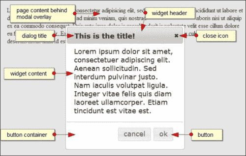

# 创建基本对话框

对话框具有许多内置的默认行为，但只需要少量方法来程序化地控制它，使其成为一个易于使用的小部件，同时也具有高度可配置性和强大性。

生成小部件很简单，只需要最小的底层标记结构。以下页面包含实现对话框小部件所需的最小标记：

```js
<!DOCTYPE html>
<html>
<head>
  <meta charset="utf-8">
  <title>Dialog</title>
  <link rel="stylesheet" href="development-bundle/themes/redmond/jquery.ui.all.css">
  <script src="img/jquery-2.0.3.js"></script>
  <script src="img/jquery.ui.core.js"></script>
  <script src="img/jquery.ui.widget.js"> </script>
  <script src="img/jquery.ui.position.js"> </script>
  <script src="img/jquery.ui.dialog.js"> </script>
  <script src="img/jquery.ui.button.js"> </script>
  <script>
    $(document).ready(function($){
      $("#myDialog").dialog();
    });
  </script>
</head>
<body>
  <div id="myDialog" title="This is the title!">
  Lorem ipsum dolor sit amet, consectetuer adipiscing elit.
Aenean sollicitudin. Sed interdum pulvinar justo. Nam iaculis volutpat ligula. Integer vitae felis quis diam laoreet ullamcorper. Etiam tincidunt est vitae est.
  </div>
</body>
</html>
```

将此文件保存为`dialog1.html`，放在`jqueryui`项目文件夹中。要使用对话框，需要以下依赖项：

+   `jquery.ui.all.css`

+   `jquery.ui.core.js`

+   `jquery.ui.widget.js`

+   `jquery.ui.position.js`

+   `jquery.ui.dialog.js`

+   `jquery.ui.button.js`

可选地，我们还可以包含以下文件来使对话框可拖动和可调整大小：

+   `jquery.ui.mouse.js`

+   `jquery.ui.draggable.js`

+   `jquery.ui.resizable.js`

对话框小部件的初始化方式与我们已经了解的其他小部件相同，通过调用小部件的插件方法。

当您在浏览器中运行此页面时，您应该看到默认的对话框小部件，如下截图所示：

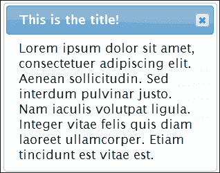

与我们之前介绍的小部件一样，CSS 框架中的各种类名被添加到小部件中的不同元素中，以使它们具有各自元素的适当样式，并且所需的任何附加元素都是即时创建的。

第一个示例中的对话框在大小和位置上都是固定的，并且将被定位在视口的中心。我们可以很容易地使小部件可拖动、可调整大小或两者兼具。我们只需要在`<head>`的末尾与其他`<script>`资源一起包含可拖动和可调整大小组件的源文件，以及鼠标工具。

不重要的是，在对话框的源文件之前将可拖动和可调整大小的文件包含在页面中。它们可以出现在对话框的源文件之前或之后，小部件仍将继承这些行为。任何所需的样式，例如出现在对话框左下角的调整大小指示器，将自动从主 CSS 文件中捡取。

在`dialog1.html`的关闭`</head>`标签之前直接添加以下三个`<script>`元素：

```js
<script src="img/jquery.ui.mouse.js">
</script>
<script src="img/jquery.ui.draggable.js">
</script>
<script src="img/jquery.ui.resizable.js">
</script>
```

将其保存为`dialog2.html`并在浏览器中查看。现在对话框应该是可拖动的，并且可以移动到视口的任何部分，但是如果小部件移动到边缘，它不会导致滚动。

对话框还应该是可调整大小的——通过单击并按住任何角落并拖动，可以使小部件变大或变小。如果对话框比视口大，它将导致窗口滚动。

# 列出对话框选项

选项对象可用于对话框的小部件方法中配置各种对话框选项。让我们来看看可用的选项：

| 选项 | 默认值 | 描述 |
| --- | --- | --- |
| `appendTo` | `"body"` | 确定对话框（和遮罩，如果是模态的）应追加到哪个元素。 |
| `autoOpen` | `true` | 当设置为`true`时，调用`dialog()`方法时立即显示对话框。 |
| `buttons` | `{}` | 提供一个包含要与对话框一起使用的按钮的对象。每个键都成为`<button>`元素上的文本，每个值都是一个回调函数，在单击按钮时执行。 |
| `closeOnEscape` | `true` | 如果设置为`true`，则按下*Esc*键时对话框将关闭。 |
| `dialogClass` | `""` | 为对话框设置额外的类名以进行主题设置。 |
| `draggable` | `true` | 使对话框可拖动（需要使用`jquery.ui.draggable.js`）。 |
| `height` | `auto` | 设置对话框的起始高度。 |
| `hide` | `null` | 设置对话框关闭时要使用的效果。 |
| `maxHeight` | `false` | 设置对话框的最大高度。 |
| `maxWidth` | `false` | 设置对话框的最大宽度。 |
| `minHeight` | `150` | 设置对话框的最小高度。 |
| `minWidth` | `150` | 设置对话框的最小宽度。 |
| `modal` | `false` | 在对话框打开时启用模态。 |
| `position` | `center` | 设置对话框在视口中的起始位置。它可以接受一个字符串、一个字符串数组或包含对话框偏离视口顶部和左侧的确切坐标的数组（需要使用`jquery.ui.position.js`）。 |
| `resizable` | `true` | 使对话框可调整大小（还需要`jquery.ui.resizable.js`）。 |
| `show` | `null` | 设置对话框打开时要使用的效果。 |
| `title` | `""` | 替代在小部件的基础容器元素上指定标题属性。 |
| `width` | `300` | 设置对话框的起始宽度。 |

如您所见，我们有各种可配置的选项可供在实现对话框时使用。其中许多选项是布尔值、数值或基于字符串的，使它们易于在您的代码中获取和设置。

## 显示对话框

到目前为止，我们的示例中，对话框在页面加载后立即显示。 `autoOpen` 选项默认设置为 `true`，因此对话框将在初始化时立即显示。

我们可以更改这样，以便在发生其他事情时打开对话框，比如通过将 `autoOpen` 选项设置为 `false` 来点击按钮。将 `dialog2.html` 底部的最终 `<script>` 元素更改为以下内容：

```js
<script>
  $(document).ready(function($){
 $("#myDialog").dialog({
 autoOpen: false 
 });
  });
</script>
```

将此保存为 `dialog3.html`。小部件仍然被创建；底层标记被从页面中移除，转换为小部件，然后重新附加到 `<body>` 的末尾。它将保持隐藏，直到调用 `open` 方法为止。我们稍后在本章中查看 `open` 方法时会回到这个选项。

## 设置对话框标题

选项表显示一个 `title` 选项，我们可以使用它来控制标题在小部件上的显示方式；如果将 `draggable` 属性设置为 `false`，则可以将其设置为可选择。虽然可以直接在代码中设置它，但在配置选项中设置它要容易得多，因为这样可以更好地控制标题在小部件中的显示方式。

默认情况下，对话框小部件的标题文本将显示为纯文本；我们可以通过向 `.ui-dialog-title` 类添加自定义样式来覆盖此设置。

在浏览器中，将 `dialog3.html` 中对话框的 `<script>` 块修改如下：

```js
<script>
  $(document).ready(function($){
 $("#myDialog").dialog({
      draggable: false, 
      open: function() {
        $(".ui-dialog-title").addClass("customtitle");
      }
    });
  });
</script>
```

将文件保存为 `dialog4.html`。我们现在可以为对话框的标题栏添加一些样式 - 在一个单独的文件中添加以下代码，并将其保存为 `dialogOverrides.css`，在链接到 jQuery UI 样式表后：

```js
.customtitle { color: #800080; }
```

如果我们在浏览器中预览结果，您可以清楚地看到标题现在以不同的颜色显示：

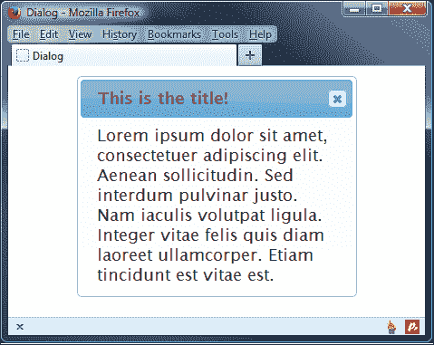

要查看代码的效果，我们可以查看脚本如何覆盖基本代码，使用 DOM 检查器如 Firebug：

```js
<span id="ui-id-1" class="ui-dialog-title customtitle">This is the title!</span>
```

我们可以在样式表中手动为对话框元素设置样式，但这将是通过反复试验；简单地使用 jQuery 添加一个新类，然后我们可以根据自己的喜好进行样式设置，这会更容易得多！

### 小贴士

如果未提供值给 `title` 属性，则将使用对话框源元素上的属性。

## 配置模态选项

对话框的最大优势之一是模态性。此功能在对话框打开时创建一个覆盖在对话框下方的底层页面的覆盖层。一旦对话框关闭，覆盖层就会被移除。在对话框打开时，无法以任何方式操纵底层页面内容。

这个功能的好处是它确保对话框在基础页面再次变得交互之前关闭，并为访问者提供清晰的视觉指示，表明必须与对话框交互，然后才能继续。

修改`dialog4.html`中的配置对象如下所示：

```js
    $(document).ready(function($){
      $("#myDialog").dialog({
        modal: true
      });
    });
```

此文件可以保存为`dialog5.html`。以下截图显示了模态效果（您可能需要向页面添加一些虚假内容，以充分体验模态效果）：

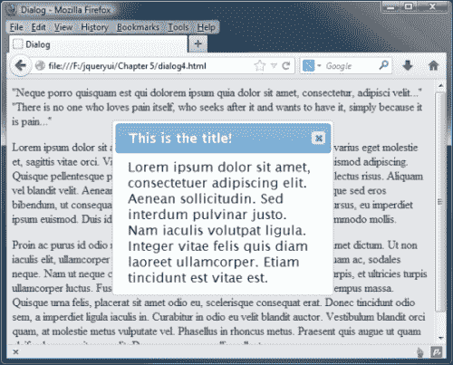

添加模态的唯一属性是`modal`选项。当您在浏览器中查看页面时，您将立即看到模态效果。用于创建覆盖图像的重复背景图像完全由 CSS 框架样式化，因此可以通过**ThemeRoller**工具进行完全主题化。如果需要，我们还可以使用自己的图像。`ui-widget-overlay`类名称会被添加到覆盖层中，因此这是需要覆盖的选择器，如果需要自定义的话。

# 添加按钮

`button`选项接受一个对象文字，用于指定对话框上应存在的不同`<button>`元素。每个`property: value`对表示一个单个按钮。让我们向我们的对话框添加一些`<button>`元素。

修改`dialog5.html`中的最终`<script>`元素，使其如下所示：

```js
<script>
  $(document).ready(function($){
    $("#myDialog").dialog({
 buttons: { Ok: function() { }, Cancel: function() { } },
 draggable: false
    });
  });
</script>
```

将文件保存为`dialog6.html`。`buttons`对象中每个属性的关键是将形成`<button>`标签的文本，值是单击按钮时要执行的回调函数的名称。`buttons`选项可以采用对象，如此示例中的示例，也可以采用对象数组。在这个例子中，`execute()`和`cancel()`函数什么都不做；我们很快就会回到这个例子并填充它们。

以下截图显示了我们的新`<button>`元素将如何显示：

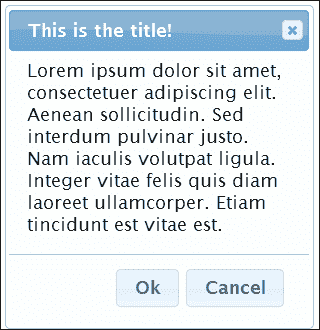

小部件将在对话框底部的自己容器中添加我们的新按钮，并且如果对话框被调整大小，此容器将保持其原始尺寸。`<button>`元素是完全可主题化的，并且将根据使用的主题进行样式设置。

## 向对话框按钮添加图标

直到现在，关闭对话框通常意味着必须点击标题栏中的关闭图标-它对此目的非常有效，但并不为我们提供任何机会从浏览我们网站或在线应用程序的人那里获得响应。

在前面的示例中添加按钮有助于消除这一限制，并允许我们从最终用户处接受各种响应-我们可以通过添加图标进一步提供按钮的视觉支持。

在您的文本编辑器中，修改`dialog6.html`中的`<script>`块如下：

```js
<script>
  $(document).ready(function($){
    $("#myDialog").dialog({
 buttons: [ { 
 text: "Ok",
 icons: { primary: "ui-icon-check", secondary: "ui-icon-circle-check" },
 click: function() { }
 }, {
 text: "Cancel",
 icons: { primary: "ui-icon-closethick", secondary: "ui-icon-circle-close" },
 click: function() { }
 } ],
      draggable: false
    });
  });
</script>
```

将此保存为`dialog7.html`。在这里，我们使用了按钮选项来指定文本、图标以及当单击按钮时应该执行的操作。您会注意到，与前一个示例相比，我们还使用了一种不同的方式来指定每个选项。两种方法都同样有效；我们需要在添加图标时使用这种方法，否则您可能会发现出现没有文本的按钮！

如果我们在浏览器中预览结果，我们现在可以看到在对话框底部出现的带有额外图标的按钮：

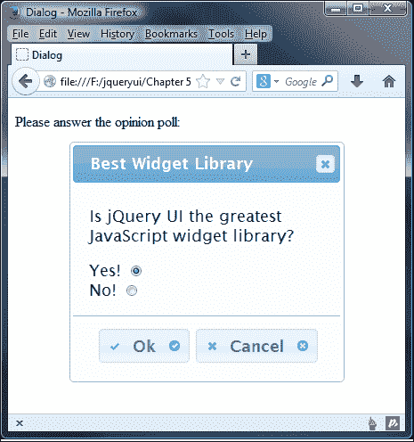

图标的样式将根据使用的主题进行设置。在我们的示例中，我们指定了主要和次要图标；前者位于按钮文本的左侧，而后者位于右侧。然而，在您的应用程序或网站中，您可能只需要根据您的需求指定一个图标。

# 启用对话框动画

对话框为我们提供了一个内置效果，可以应用于小部件的打开或关闭（或两者）。我们只能使用一个效果，即缩放效果的实现（我们将在第十三章中更详细地介绍这一点，“使用 jQuery UI 进行选择和排序”）。将`dialog7.html`中的最终`<script>`元素更改为以下内容：

```js
<script>
  $(document).ready(function($){
    $("#myDialog").dialog({
 show: true,
 hide: true
    });
  });
</script>
```

将此保存为`dialog8.html`。我们将`hide`和`show`选项都设置为布尔值`true`。这将启用内置效果，逐渐减小对话框的大小和不透明度，直到它优雅地消失。以下截图显示了效果正在进行中：

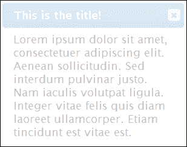

我们可以使用布尔值分别启用或禁用显示或隐藏动画，就像我们在此示例中所做的那样。我们还可以通过提供指定要使用的效果名称的字符串来指定要使用的动画类型：

```js
<script>
  $(document).ready(function($){
    $("#myDialog").dialog({
      show: {effect: "fadeIn", duration: 1000},
      hide: {effect: "fadeOut", duration: 1000}
    });
  });
</script>
```

我们甚至可以更进一步，使用一些效果，比如弹跳或爆炸，尽管这些效果只有在适当时才应添加！我们稍后将在 jQuery UI 中介绍效果，第十四章中可以找到更多详细信息，“UI 效果”。您还可以在[`api.jqueryui.com/category/effects/`](http://api.jqueryui.com/category/effects/)上查看更多细节。

# 配置对话框的尺寸

与对话框大小以及其可以调整到的最小和最大尺寸相关的选项有几个。我们可以将所有这些选项添加到下一个示例中，因为它们都是相关的，以节省逐个查看它们的时间。将`dialog8.html`中的配置对象更改为以下内容：

```js
$("#myDialog").dialog({
 width: 500,
 height: 300,
 minWidth: 150,
 minHeight: 150,
 maxWidth: 600,
 maxHeight: 450
});
```

将此文件保存为`dialog9.html`。这些选项对小部件的影响很简单；`width`和`height`选项定义了对话框在首次打开时的大小，而`min-`和`max-`选项分别定义了对话框可以调整到的最小或最大尺寸。

### 提示

另外一点需要注意的是，如果对话框过小，辅助技术和键盘用户可能会发现内容难以导航。有一个可用性原则坚持认为对话框应该始终是不可调整大小的，而窗口应该始终是可调整大小的。

虽然我认为这不是一条黑白分明、铁板一块的规则，但是将小型、信息性、基于文本的对话框保持固定大小可能是明智的，而允许包含图像和文本的内容丰富的对话框可以调整大小。我们将在第十二章中介绍如何将调整大小手柄添加到任何合适的元素（如对话框），*调整大小组件*中。

# 设置对话框的 z-index 顺序

对话框被设置为出现在任何现有页面内容的上方。我们可以使用 CSS 更改其 z-index 设置，或者通过确保正确将其附加到其父元素来提高它，以覆盖我们的现有内容。但是如果页面上有两个对话框怎么办？我们是否需要分别为每个对话框定义`zIndex`？焦点如何考虑？

让我们看看是否可以通过查看另一个示例来回答这些问题；将`dialog7.html`的`<body>`标记更改为具有两个对话框：

```js
<div id="dialog1" title="Dialog 1">
  Lorem ipsum dolor sit amet, consectetuer adipiscing elit.
Aenean sollicitudin. Sed interdum pulvinar justo. Nam aculis
volutpat ligula. Integer vitae felis quis diam laoreet ullamcorper. Etiam tincidunt est vitae est.
</div>
<div id="dialog2" title="Dialog 2">
  Lorem ipsum dolor sit amet, consectetuer adipiscing elit. Aenean sollicitudin. Sed interdum pulvinar justo. Nam iaculis volutpat ligula. Integer vitae felis quis diam laoreet ullamcorper. Etiam tincidunt est vitae est.
</div>
```

现在将最终的`<script>`元素更改为如下所示：

```js
<script>
  $(document).ready(function($){
 $("#dialog1, #dialog2").dialog();
  });
</script>
```

将此文件保存为`dialog10.html`。我们在页面上添加了另一个对话框，它基本上只是原始对话框的一个克隆，具有不同的`id`和`title`属性。在`<script>`中，我们只需在两个底层对话框容器上调用`widget`方法。

由于`widget`方法在第二个对话框上被最后调用，因此它接收焦点，第二个对话框将自动具有较高的 z-index 值。这意味着我们不需要担心单独配置它。对话框在底层标记中出现的顺序无关紧要；决定每个对话框 z-index 值的是 widget 方法的顺序。

### 提示

**覆盖 z-index 值**

如果需要覆盖 z-index 值，可以（并且应该）使用 CSS 来执行此操作-您需要使用`!important`属性来覆盖现有值。

由于两个对话框都没有显式设置其位置，所以当我们的示例页面加载时，只有第二个对话框会可见。然而，两者都是可拖动的，我们可以通过将第二个对话框拖离来将它们对齐，使它们略微重叠。如果我们点击第一个对话框框，它将接收焦点，因此它将显示在第二个框上方。

## 控制焦点

在打开对话框时，接收焦点的元素由匹配以下条件的项目确定：

+   对话框中具有 autofocus 属性的第一个元素

+   对话框内容中的第一个`:tabbable`元素

+   对话框按钮面板中的第一个`:tabbable`元素

+   对话框的关闭按钮

+   对话框本身

以下代码摘录最能说明这一点，我们已经将`autofocus`属性添加到“是”单选按钮中：

```js
  <div id="myDialog" title="Best Widget Library">
    <p>Is jQuery UI the greatest JavaScript widget library?</p>
    <label for="yes">Yes!</label>
 <input type="radio" autofocus="autofocus" id="yes" value="yes" name="question" checked="checked"><br>
    <label for="no">No!</label>
    <input type="radio" id="no" value="no" name="question">
  </div>
```

“是”单选按钮首先接收焦点；然后我们可以通过标签切换到小部件内的其他元素。一旦对话框关闭，焦点将自动返回到对话框打开之前具有焦点的元素。

# 处理对话框的事件回调

对话框小部件为我们提供了广泛的回调选项，我们可以使用这些选项在任何对话框交互中的不同点执行任意代码。以下表格列出了我们可以使用的选项：

| 事件 | 描述 |
| --- | --- |
| `beforeClose` | 当对话框即将关闭时触发此事件 |
| `close` | 当对话框关闭时触发此事件 |
| `create` | 当对话框初始化时触发此事件 |
| `drag` | 当对话框被拖动时触发此事件 |
| `dragStart` | 当对话框开始拖动时触发此事件 |
| `dragStop` | 当对话框停止拖动时触发此事件 |
| `focus` | 当对话框获得焦点时触发此事件 |
| `open` | 当对话框打开时触发此事件 |
| `resize` | 当对话框被调整大小时触发此事件 |
| `resizeStart` | 当对话框开始调整大小时触发此事件 |
| `resizeStop` | 当对话框停止调整大小时触发此事件 |

这些回调中的一些仅在特定情况下可用，例如当包含可拖动和可调整大小的 jQuery UI 组件时，才会有`drag`和`resize`回调。在本章中，我们不会讨论这些回调选项，因为它们将分别在 第十一章、“拖放” 和 第十二章、“可调整大小组件” 中详细介绍。

其他回调，例如`beforeClose`、`create`、`open`、`close`和`focus`将在任何实现中可用。让我们看一个使用这些回调选项的例子。

在 `dialog10.html` 页面中删除第二个对话框，然后在第一个对话框后面直接添加以下新的标记：

```js
<div id="status" class="ui-widget ui-dialog ui-corner-all ui-widget-content">
  <div class="ui-widget-header ui-dialog-titlebar ui-corner-all">Dialog Status</div>
  <div class="ui-widget-content ui-dialog-content"></div>
</div>
```

现在将最终的 `<script>` 元素更改为以下内容：

```js
<script>
  $(document).ready(function($){  
    $("#dialog1").dialog({
 open: function() {
 $("#status").children(":last").text("The dialog is open");
 },
 close: function() {
 $("#status").children(":last").text("The dialog is closed");
 },
 beforeClose: function() {
 if ($(".ui-dialog").css("width") > "300") {
 return false;
 }
 }
 });
  });
</script>
```

将此保存为 `dialog11.html`。该页面包含一个新的状态框，用于报告对话框是打开还是关闭。我们已经给状态框的各个元素添加了几个 CSS 框架类，以使它们与正在使用的主题相适应。

我们的配置对象使用了 `open`、`close` 和 `beforeClose` 选项来指定简单的回调函数。`open` 和 `close` 回调简单地相应地设置状态框的文本。在 **Close** 按钮在对话框上被点击之后（但在实际关闭之前）触发的 `beforeClose` 回调用于确定是否关闭对话框。

我们使用简单的`if`语句来检查对话框的宽度；如果对话框宽度大于 300 像素，则从回调中返回`false`，对话框保持打开状态。当然，这种行为通常在可用性方面通常是不可接受的，但它确实突出了我们如何使用`beforeClose`回调来阻止对话框被关闭。

页面加载时，对话框显示，并执行`open`回调，状态框应显示一条消息。当对话框关闭时，如下图所示，会显示不同的消息：

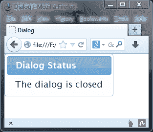

我应该澄清的一件事是，对话框小部件只将一个对象（原始事件对象）传递给回调函数。虽然它确实将第二个`ui`对象传递到处理程序函数中，但在该库的此版本中，此对象不包含任何属性。

# 以编程方式控制对话框

对话框直观且易于使用，与库中的其他组件一样，它提供了一系列方法，用于在初始化后以编程方式控制小部件。我们可以在对话框上调用的所有方法的完整列表如下：

| 方法 | 描述 |
| --- | --- |
| `close` | 这用于关闭或隐藏对话框。 |
| `destroy` | 这用于永久禁用对话框。至于对话框的`destroy`方法，它与我们之前见过的其他小部件的工作方式略有不同。它不仅仅是将底层 HTML 返回到其原始状态，还会隐藏对话框。 |
| `isOpen` | 这用于确定对话框是否打开。 |
| `moveToTop` | 这用于将指定的对话框移动到堆栈顶部。 |
| `open` | 这用于打开对话框。 |
| `option` | 这用于在对话框初始化后获取或设置任何可配置选项。 |
| `widget` | 这用于返回调用了`dialog()`小部件方法的外部元素。 |

## 切换对话框

首先我们来看看如何以编程方式控制小部件的打开，可以简单地使用`open`方法实现。让我们重新访问`dialog3.html`，其中`autoOpen`选项设置为`false`，因此当页面加载时对话框不会打开。在页面上添加以下`<button>`：

```js
<button type="button" id="toggle">Toggle dialog!</button>
```

然后将以下点击处理程序添加到代码顶部的`<script>`块中：

```js
$("#toggle").click(function() {
  if(!$("#myDialog").dialog("isOpen")) {
    $("#myDialog").dialog("open");
  } else {
    $("#myDialog").dialog("close");
  }
});
```

将此文件保存为`dialog12.html`。在页面上，我们添加了一个简单的`<button>`，可以用来打开或关闭对话框，具体取决于其当前状态。在`<script>`元素中，我们为`<button>`元素添加了一个点击处理程序，检查`isOpen`方法的返回值；感叹号的使用意味着我们要查看对话框是否没有打开。如果语句返回`true`，则对话框未打开，因此我们调用其`open`方法，否则我们调用`close`方法。

`open` 和 `close` 方法都会触发任何适用的事件；例如，`#toggle` 单击处理程序方法首先触发 `beforeClose` 然后是 `close` 事件。调用 `close` 方法类似于点击对话框上的关闭按钮。

# 从对话框获取数据

因为小部件是底层页面的一部分，所以传递数据到它和从它获取数据都很简单。对话框可以像页面上的任何其他标准元素一样对待。让我们看一个基本的例子。

在本章的早些时候，我们看过一个例子，其中向对话框添加了一些 `<button>` 元素。那个例子中的回调函数没有做任何事情，但是下面的例子给了我们使用它们的机会。将 `dialog8.html` 中的现有对话框标记替换为以下内容：

```js
<div id="myDialog" title="Best Widget Library">
  <p>Is jQuery UI the greatest JavaScript widget library?</p>
  <label for="yes">Yes!</label>
  <input type="radio" id="yes" value="yes" name="question" checked="checked"><br>
  <label for="no">No!</label>
  <input type="radio" id="no" value="no" name="question">
</div>
```

现在将最终的 `<script>` 元素更改如下：

```js
<script>
$(document).ready(function($){
  var execute = function(){
 var answer = $("#myDialog").find("input:checked").val();
 $("<p>").text("Thanks for selecting " + answer).
 appendTo($("body"));
 $("#myDialog").dialog("close");
 }
 var cancel = function() {
 $("#myDialog").dialog("close");
 }
  $("#myDialog").dialog({
    buttons: {
      "Ok": execute,
      "Cancel": cancel
    }
  });
});
</script>
```

将此保存为 `dialog13.html`。我们的对话框小部件现在包含一组单选按钮，一些 `<label>` 元素和一些文本。在这个例子中，当对话框关闭时，我们将获取所选单选按钮的结果，然后执行一些操作。

我们通过填写 `execute` 函数来开始 `<script>` 元素，该函数将作为按钮对象中 `Ok` 属性的值附加，稍后在脚本中。因此，每次点击 **Ok** 按钮时都会执行它。

在这个函数中，我们使用 `:checked` 过滤器来确定哪个单选按钮被选中。我们将 `answer` 变量的值设置为单选按钮的值，然后创建一个简短的消息，并将其附加到页面的 `<body>` 元素中。映射到 **Cancel** 按钮的回调函数很简单；我们所做的就是使用 `close` 方法关闭对话框。

这个例子的重点在于看到从对话框获取数据就像从页面上的任何其他元素获取数据一样简单。如果你在浏览器中预览它，你会首先看到左边的对话框；点击按钮会给出相应的响应，如下面的截图所示：

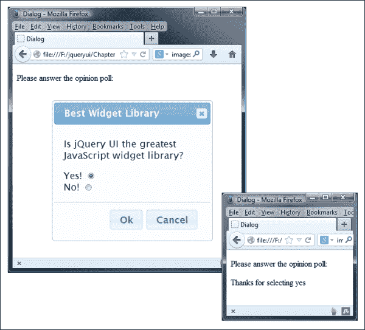

# 探索对话框的互操作性

在以前的章节中，我们已经组合了多个小部件，以便我们可以看到它们如何很好地一起工作，本章也不例外。我们可以轻松地将其他 UI 小部件放入对话框中，例如我们在上一章中看到的折叠小部件。在文本编辑器中的新文件中，创建以下页面：

```js
<!DOCTYPE html>
<html>
<head>
  <meta charset="utf-8">
  <title>Dialog</title>
  <link rel="stylesheet" href="development-bundle/themes/redmond/jquery.ui.all.css">
  <script src="img/jquery-2.0.3.js"></script>
  <script src="img/jquery.ui.core.js"></script>
  <script src="img/jquery.ui.widget.js"></script>
  <script src="img/jquery.ui.position.js"></script>
  <script src="img/jquery.ui.dialog.js"></script>
  <script src="img/jquery.ui.button.js"></script>
  <script src="img/jquery.ui.accordion.js"> 
  </script>
  <script src="img/jquery.ui.mouse.js"></script>
  <script src="img/jquery.ui.draggable.js"></script>
  <script src="img/jquery.ui.resizable.js"></script>
  <script>
    $(document).ready(function($){
      $("#myDialog").dialog();
         $("#myAccordion").accordion();
    });
  </script>
</head>
<body>
  <div id="myDialog" title="An Accordion Dialog">
    <div id="myAccordion">
      <h2><a href="#">Header 1</a></h2>
      <div>Lorem ipsum dolor sit amet, consectetuer adipiscing elit. Aenean sollicitudin.</div>
      <h2><a href="#">Header 2</a></h2>
      <div>Etiam tincidunt est vitae est. Ut posuere, mauris at so dales rutrum, turpis.</div>
      <h2><a href="#">Header 3</a></h2>
      <div>Donec at dolor ac metus pharetra aliquam. Suspendisse pu rus.</div>
    </div>
  </div>
</body>
</html>
```

将此文件保存为 `dialog14.html`。折叠小部件的基本标记被放置到对话框的容器元素中，我们只需在 `<script>` 元素中调用每个组件的小部件方法。

### 提示

在这个例子中，我们使用了相当多独立的 `<script>` 资源。值得记住的是，对于生产，我们应该使用组合和缩小的脚本文件，其中包含我们在下载构建器中选择的所有组件。

组合小部件应该像这样显示：

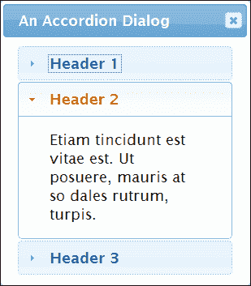

# 创建一个动态基于图像的对话框

对话框部件背后的类是紧凑的，适用于一小部分专业行为，其中大部分我们已经了解过了。我们仍然可以通过一个动态对话框来玩一些有趣的东西，这个对话框根据触发它的元素加载不同的内容。

在文本编辑器中的新页面中，添加以下代码：

```js
<!DOCTYPE html>
<html>
<head>
  <meta charset="utf-8">
  <title>Dialog</title>
  <link rel="stylesheet" href="development-bundle/themes/redmond/jquery.ui.all.css">
  <link rel="stylesheet" href="css/dialogTheme.css">
  <script src="img/jquery-2.0.3.js"></script>
  <script src="img/jquery.ui.core.js"></script>
  <script src="img/jquery.ui.widget.js"></script>
  <script src="img/jquery.ui.position.js"></script>
  <script src="img/jquery.ui.dialog.js"></script>
  <script src="img/jquery.ui.button.js"></script>
  <script src="img/jquery.ui.accordion.js"></script>
  <script src="img/jquery.ui.mouse.js"></script>
  <script src="img/jquery.ui.draggable.js"></script>
  <script src="img/jquery.ui.resizable.js"></script>
</head>
<body>
   <div id="thumbs" class="ui-corner-all">
     <div class="ui-widget-header ui-corner-top">
       <h2>Some Common Flowers</h2>
       </div>
       <p>(click a thumbnail to view a full-size image)</p>
       <div class="thumb ui-helper-clearfix ui-widget-content">
         <a href="img/haFull.jpg" title="Helianthus annuus"></a>
         <h3>Helianthus annuus</h3>
         <p>Sunflowers (Helianthus annuus) are annual plants native to the Americas, that possess a large flowering head</p>
       </div>
       <div class="thumb ui-helper-clearfix ui-widget-content">
         <a href="img/lcFull.jpg" title="Lilium columbianum"> </a>
         <h3>Lilium columbianum</h3>
         <p>The Lilium columbianum is a lily native to western North America. It is also known as the Columbia Lily or Tiger Lily</p>
       </div>
         <div class="thumb ui-helper-clearfix ui-widget-content">
         <a href="img/msFull.jpg" title="Myosotis scorpioides"> </a>
         <h3>Myosotis scorpioides</h3>
         <p>The Myosotis scorpioides, or Forget-me-not, is a herbaceous perennial plant of the genus Myosotis.</p>
       </div>
       <div class="thumb ui-helper-clearfix ui-widget-content last">
         <a href="img/nnFull.jpg" title="Nelumbo nucifera"></a>
         <h3>Nelumbo nucifera</h3>
         <p>Nelumbo nucifera is known by a number of names including; Indian lotus, sacred lotus, bean of India, or simply lotus.</p>
       </div>
   </div>
   <div id="dialog"></div>
</body>
</html>
```

将此文件保存为`dialog15.html`。以下截图显示了在浏览器中预览时的结果：

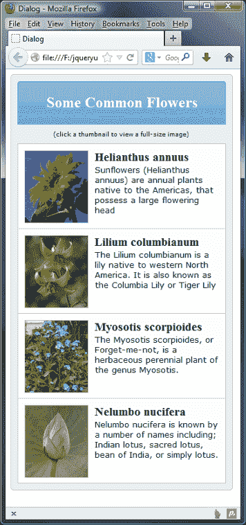

页面相对简单——我们有一个外部容器，它包围着所有内容，以及一个我们给予了类名`ui-widget-header`的元素。我们使用后者是为了从正在使用的主题中获取一些默认样式。

在此之后，我们有一些解释性文本，然后是一系列容器。这些容器被赋予了几个类名，其中一些是为了我们能够对其进行样式设置，而另一些（如`ui-helper-clearfix`）则是为了获取框架或主题样式。

在每个容器中都有一个图像，包裹在一个锚点内，一个副标题和一些描述性文本。在外部容器之后，是一个空的`<div>`元素，用于创建对话框。在这个例子中，我们不使用可调整大小的功能。每个缩略图都包裹在一个锚点内，以便即使禁用了 JavaScript，页面也能正常工作。在这种情况下，对话框部件不会显示，但访问者仍然可以看到每个图像的全尺寸版本。这种渐进增强形式在这种类型的应用程序中至关重要，我们始终可以查看内容。添加对话框部件的调用是为了增强对访问者的整体视图，同时确保即使禁用了 JavaScript，内容仍将显示出来！

现在，在闭合的`</head>`标记之前直接添加以下`<script>`块：

```js
<script>
  $(document).ready(function($){
    var filename, titleText, dialogOpts = {
      modal: true,
      width: 388,
      height: 470,
      autoOpen: false,
      open: function() {
        $("#dialog").empty();
        $("", { src: filename }).appendTo("#dialog");
        $("#dialog").dialog("option", "title", titleText);
      }
    };
    $("#dialog").dialog(dialogOpts);
    $("#thumbs").find("a").click(function(e) {
      e.preventDefault();
      filename = $(this).attr("href");
      titleText = $(this).attr("title");
      $("#dialog").dialog("open");
    });
  });
</script>
```

我们首先定义了三个变量；第一个变量用于添加被点击的缩略图的全尺寸图像的路径，第二个用于存储用作部件标题文本的图像标题，第三个是对话框的配置对象。我们已经看到了所有的配置选项都已经在实际操作中使用过了，所以我就不会详细介绍大部分选项了。

`open`回调，在对话框打开之前直接调用，是我们向对话框添加全尺寸图像的地方。我们首先清空对话框，然后创建一个新的``元素，并将其`src`设置为`filename`变量的值。然后将新的``附加到对话框的内部内容区域。

然后，我们使用`option`方法将标题选项设置为`titleText`变量的值。一旦定义了`open`回调，我们就像平常一样调用对话框的部件方法。

我们可以使用包装器`<a>`元素作为打开对话框的触发器。在我们的点击处理程序中，我们首先调用`e.preventDefault()`来阻止点击的默认操作，然后使用被点击的链接的`href`和`title`属性设置我们的`filename`和`titleText`变量的内容。然后，我们调用对话框的`open`方法来显示对话框，这将触发`open`选项中指定的回调函数。

### 提示

如果我们省略`e.preventDefault()`，这将覆盖对话框，浏览器将呈现每个图像，就像点击了链接一样。

对于此示例，我们还需要一个新的样式表。在文本编辑器的新页面中，添加以下代码：

```js
#thumbs { width:342px; padding: 10px 0 10px 10px; border:1px 
   solid #ccc; background-color:#eee; }
#thumbs p { width: 330px; font-family: Verdana; font-size: 9px; 
   text-align: center; }
.thumb { width: 310px; height: 114px; padding: 10px; 
   border:1px solid #ccc; border-bottom: none; }
.last { border-bottom: 1px solid #ccc; }
.thumb img { border: 1px solid #ccc; margin-right: 10px; 
   float: left; cursor: pointer; }
.thumb h3 { margin: 0; float: left; width:198px; }
#thumbs .thumb p { width: 310px; margin:0; font-family: 
   Verdana; font-size: 13px; text-align: left; }
#thumbs .ui-widget-header { width: 330px; text-align: center; }
```

在前面的示例中已经使用了许多这些样式，但是为其他页面元素添加一些新规则使我们可以在实际环境中看到对话框。将此保存为`dialogTheme.css`，并放入`css`文件夹中。我们在此示例中还使用了一些图像，这些图像可以在本书的附带代码下载的`img`文件夹中找到。

这样现在应该给我们提供了前面截图中看到的页面，当点击缩略图时，将显示相同图像的完整尺寸版本：

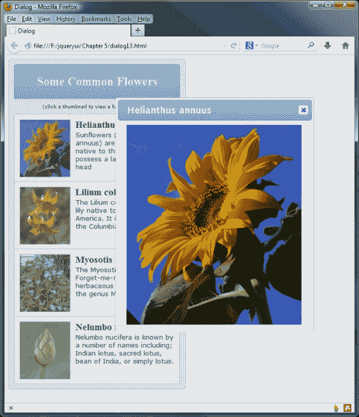

# 概要

对话框小部件是专门设计的，用于在悬浮面板中显示消息或问题，该面板位于页面内容之上。高级功能，如拖动和调整大小，已直接内置，并且仅需要为每个功能包含额外的脚本文件。其他功能，如出色的模态和覆盖层，易于配置。

我们首先看了默认实现，它与迄今为止我们看过的其他小部件一样简单。然后，我们检查了对话框 API 公开的一系列可配置选项。我们可以利用它们来启用或禁用内置行为，例如模态，或设置小部件的尺寸。它还为我们提供了广泛的回调，允许我们在交互期间通过小部件触发的自定义事件中挂钩。

然后，我们简要介绍了与对话框一起使用的内置打开和关闭效果，然后继续查看我们可以调用的基本方法，以执行对话框执行操作的任务，例如打开或关闭。

在下一章中，我们将继续查看滑块和进度条小部件，它们允许我们创建交互式表单小部件，用于从预定义范围中选择值并在屏幕上显示结果。
